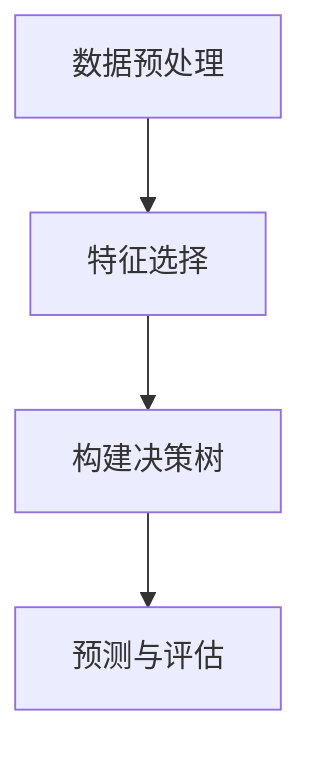
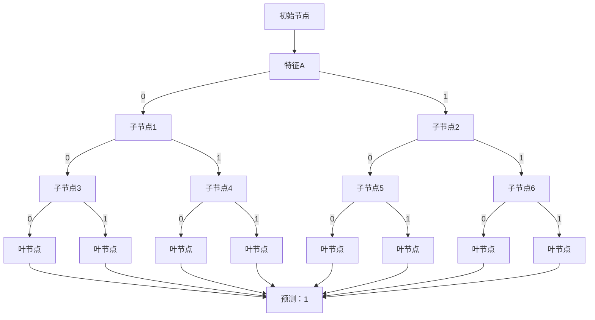

                 

## 《正确识别要事》

### 关键词：要事识别、决策分析、数据分析、风险评估

> 摘要：本文将探讨如何正确识别要事，通过深入分析决策分析、数据分析和风险评估等核心概念，并结合具体案例，提供一系列策略和工具，帮助读者在实际工作中准确判断和处理重要事项，从而提高工作效率和生活质量。

### 引言

在快速变化的现代社会，如何正确识别要事成为了一项至关重要的技能。无论是个人生活还是职业发展，面对纷繁复杂的信息和任务，正确识别要事不仅能够帮助我们聚焦关键问题，还能有效减少不必要的困扰，提高决策质量和执行力。本文旨在通过系统性的分析和案例研究，为读者提供一套科学、实用且易于操作的识别要事的方法。

### 第一部分：背景介绍

#### 第1章：正确识别要事的重要性

##### 1.1 问题背景

在当今高度信息化的社会中，人们每天都要处理大量的信息和任务。如何从这些信息和任务中甄别出真正重要的要事，成为了一个普遍的挑战。

##### 1.2 问题描述

人们往往被琐碎的事务所困扰，无法将时间和精力集中于重要的事项，导致工作效率下降，甚至影响生活质量。

##### 1.3 问题解决方法

通过决策分析、数据分析和风险评估等方法，可以有效识别和优先处理重要事项。

##### 1.4 要事识别的核心概念

要事识别涉及决策分析、数据分析和风险评估等多个方面，每个方面都有其独特的原理和应用。

##### 1.5 决策分析与数据分析在要事识别中的应用

决策分析和数据分析在要事识别中发挥着关键作用，通过合理运用这些方法，可以提高要事识别的准确性和效率。

##### 1.6 风险评估与要事识别

风险评估是确保要事识别有效性的重要环节，通过风险评估，可以预见潜在问题，从而更好地规划和调整要事处理策略。

##### 1.7 本章小结

本章概述了正确识别要事的重要性，并介绍了相关的基本概念和方法。

### 第二部分：核心概念与联系

#### 第2章：要事识别原理

##### 2.1 要事识别的理论基础

要事识别的理论基础涉及决策理论、信息论和风险评估理论等多个领域。

##### 2.2 要事识别的流程与步骤

详细介绍了要事识别的流程和步骤，包括信息收集、分析、决策和执行等。

##### 2.3 要事识别的关键技术

探讨了要事识别所依赖的关键技术，如数据挖掘、机器学习和人工智能等。

##### 2.4 决策分析与数据分析基础

深入分析了决策分析和数据分析的基本概念和方法，以及它们在要事识别中的应用。

##### 2.5 风险评估与要事识别

探讨了风险评估的原理和具体方法，以及如何将其应用于要事识别中。

##### 2.6 核心概念联系与综合应用

总结了各个核心概念之间的联系，并介绍了如何将它们综合应用于实际情境中。

##### 2.7 本章小结

本章详细介绍了要事识别的原理和核心概念，为后续内容奠定了基础。

### 第三部分：算法原理讲解

#### 第3章：要事识别算法

##### 3.1 要事识别算法概述

介绍了要事识别算法的基本概念和总体结构。

##### 3.2 算法流程图

使用 mermaid 画出要事识别算法的流程图，帮助读者直观理解算法的运行过程。

##### 3.3 Python源代码讲解

通过具体的 Python 源代码，详细讲解了要事识别算法的实现过程。

##### 3.4 数学模型与公式

介绍了要事识别算法所依赖的数学模型和公式，使用 LaTeX 格式进行了详细表示。

##### 3.5 算法原理详细讲解

深入阐述了要事识别算法的原理和关键步骤，使读者能够全面理解算法的运作机制。

##### 3.6 举例说明

通过实际案例，展示了如何使用要事识别算法解决具体问题。

##### 3.7 本章小结

本章详细讲解了要事识别算法的原理和实现过程，为读者提供了具体的应用实例。

### 第四部分：系统分析与架构设计

#### 第4章：系统分析与架构设计基础

##### 4.1 问题场景介绍

介绍了要事识别系统在实际应用中的典型场景。

##### 4.2 系统功能设计

详细描述了要事识别系统的功能需求。

##### 4.3 系统架构设计

使用了 mermaid 绘制了系统的架构图，展示了各模块之间的关系。

##### 4.4 系统接口设计与交互

探讨了系统内部和外部的接口设计，以及各接口之间的交互方式。

##### 4.5 mermaid图表绘制示例

通过几个 mermaid 图表示例，展示了如何使用 mermaid 进行系统分析与架构设计。

##### 4.6 系统分析与架构设计实践

介绍了系统分析与架构设计的具体实践步骤，并通过案例进行了详细讲解。

##### 4.7 本章小结

本章系统地介绍了要事识别系统的分析与架构设计，为系统实施提供了理论基础。

### 第五部分：项目实战

#### 第5章：要事识别项目实战

##### 5.1 环境安装与配置

介绍了要事识别项目所需的软件和硬件环境，以及如何进行安装和配置。

##### 5.2 系统核心实现源代码

提供了要事识别系统的核心源代码，并对代码进行了详细解读。

##### 5.3 代码应用解读与分析

通过具体案例，解读了代码在实际应用中的效果，并分析了其优缺点。

##### 5.4 实际案例分析和详细讲解剖析

分析了多个实际案例，详细讲解了如何使用要事识别系统解决实际问题。

##### 5.5 项目小结

总结了要事识别项目的关键经验，为后续项目提供了借鉴。

### 最佳实践、小结、注意事项与拓展阅读

在文章的最后，我们将提供最佳实践建议，对全文进行小结，并指出一些注意事项。此外，还将推荐一些拓展阅读，以供读者深入学习和探索。

### 结束语

本文从多个角度详细探讨了如何正确识别要事，并结合实际案例进行了深入分析。通过阅读本文，读者应能够掌握要事识别的基本原理和实用方法，提高自己在日常工作和生活中的决策能力和执行力。

### 作者信息

作者：AI天才研究院/AI Genius Institute & 禅与计算机程序设计艺术 /Zen And The Art of Computer Programming

---

## 正确识别要事的重要性

在当今复杂多变的社会环境中，正确识别要事显得尤为重要。要事识别不仅关乎个人的工作效率，还直接影响到生活质量。因此，理解其背景、问题描述及解决方法，是掌握这一技能的基础。

### 1.1 问题背景

现代社会信息爆炸，每个人每天都会接收到大量信息。如何从这些信息中筛选出真正重要的事项，是人们面临的一大挑战。特别是在忙碌的工作和生活中，许多人发现自己被琐碎的事务所困扰，而真正重要的事项却被忽视，导致工作效率低下，生活质量受到影响。

### 1.2 问题描述

要事识别问题主要表现为以下几个方面：

1. **信息过载**：人们每天都会接收到大量信息，但并非所有信息都重要，如何区分和筛选成为难题。
2. **决策困难**：在面对众多事项时，如何做出正确的决策，确定哪些是真正需要优先处理的要事，是一个普遍困扰。
3. **精力分散**：在众多琐碎的事务中，人们容易分散精力，导致重要事项无法得到有效处理。
4. **时间管理**：如何合理分配时间，将有限的时间投入到最重要的事项上，是提高工作效率的关键。

### 1.3 问题解决方法

要事识别问题需要通过科学的方法来解决。以下是一些有效的方法：

1. **决策分析**：通过决策分析，可以系统地评估每个事项的优先级和重要性，从而做出合理的决策。
2. **数据分析**：利用数据分析工具，可以从海量信息中提取关键信息，辅助决策。
3. **风险评估**：通过风险评估，可以预见潜在问题，从而有针对性地制定解决方案。
4. **时间管理技巧**：合理安排时间，制定明确的时间计划，确保重要事项得到优先处理。

### 1.4 要事识别的核心概念

要事识别涉及多个核心概念，包括决策分析、数据分析和风险评估等。以下是对这些概念的基本定义和解释：

#### 决策分析

决策分析是一种系统化的方法，通过评估不同决策选项的后果，选择最优的决策方案。它涉及以下几个关键步骤：

1. **目标设定**：明确要解决的决策问题。
2. **方案列举**：列出所有可能的决策选项。
3. **后果评估**：评估每个决策选项的可能结果。
4. **选择最佳方案**：根据评估结果，选择最优的决策方案。

#### 数据分析

数据分析是利用统计学、机器学习等方法，从数据中提取有价值的信息和模式。在要事识别中，数据分析可以帮助我们：

1. **识别关键信息**：从大量数据中提取关键信息，辅助决策。
2. **预测未来趋势**：通过历史数据分析，预测未来的发展趋势，为决策提供依据。

#### 风险评估

风险评估是评估潜在风险的可能性和影响，以便制定有效的风险应对策略。在要事识别中，风险评估可以帮助我们：

1. **识别潜在问题**：预见潜在问题，提前做好准备。
2. **优先处理风险**：根据风险评估结果，优先处理重要风险，确保要事的安全性和可行性。

### 1.5 决策分析与数据分析在要事识别中的应用

决策分析和数据分析在要事识别中起着至关重要的作用。以下是一些具体应用：

1. **优先级排序**：通过数据分析，可以识别出重要事项，并根据决策分析的结果，对其进行优先级排序。
2. **资源分配**：根据事项的重要性和紧急程度，合理分配资源，确保关键事项得到优先处理。
3. **预测与规划**：通过数据分析，可以预测未来事项的发展趋势，为决策提供科学依据。
4. **风险评估**：在决策过程中，结合风险评估结果，可以有效降低潜在风险，确保要事的成功实施。

### 1.6 风险评估与要事识别

风险评估是确保要事识别有效性的重要环节。以下是一些关键点：

1. **识别风险**：在要事识别过程中，通过风险评估，可以识别出潜在的风险。
2. **评估影响**：评估每个风险的可能影响，确定其严重程度。
3. **制定应对策略**：根据风险评估结果，制定有效的风险应对策略，降低风险发生的概率或影响。
4. **监控与调整**：在实施过程中，持续监控风险的变化，并根据实际情况进行调整。

### 1.7 本章小结

本章介绍了要事识别的背景、问题描述和解决方法，并详细解释了决策分析、数据分析和风险评估等核心概念。通过本章的学习，读者应能够理解要事识别的重要性，并掌握基本的方法和工具，为后续内容的学习打下坚实基础。

### 核心概念与联系

在深入探讨要事识别的过程中，理解并掌握相关核心概念及其之间的联系是至关重要的。本章节将详细介绍决策分析、数据分析和风险评估等核心概念，并展示它们在要事识别中的应用。

#### 2.1 决策分析

决策分析是一种系统化的方法，通过评估不同决策选项的后果，选择最优的决策方案。它是要事识别的基础，涉及到以下几个关键步骤：

1. **目标设定**：明确要解决的决策问题。
2. **方案列举**：列出所有可能的决策选项。
3. **后果评估**：评估每个决策选项的可能结果。
4. **选择最佳方案**：根据评估结果，选择最优的决策方案。

决策分析的目标是帮助我们在复杂的情况下做出明智的决策，从而有效地解决实际问题。

#### 2.2 数据分析

数据分析是利用统计学、机器学习等方法，从数据中提取有价值的信息和模式。在要事识别中，数据分析具有以下几个重要作用：

1. **识别关键信息**：从大量数据中提取关键信息，辅助决策。
2. **预测未来趋势**：通过历史数据分析，预测未来的发展趋势，为决策提供依据。
3. **优化决策**：通过数据分析，可以识别出影响决策的关键因素，从而优化决策过程。

数据分析不仅为决策分析提供了数据支持，还帮助我们在决策过程中做出更科学的判断。

#### 2.3 风险评估

风险评估是评估潜在风险的可能性和影响，以便制定有效的风险应对策略。在要事识别中，风险评估的作用主要体现在以下几个方面：

1. **识别潜在问题**：通过风险评估，可以预见潜在问题，提前做好准备。
2. **优先处理风险**：根据风险评估结果，优先处理重要风险，确保要事的安全性和可行性。
3. **监控与调整**：在实施过程中，持续监控风险的变化，并根据实际情况进行调整。

风险评估是确保要事识别有效性的关键环节，它帮助我们在面对不确定因素时，能够有针对性地制定应对策略。

#### 2.4 决策分析与数据分析的关系

决策分析和数据分析在要事识别中密不可分。它们相互依存，共同发挥作用：

1. **数据支持决策**：数据分析提供了决策所需的关键信息，为决策分析提供了数据支持。
2. **决策指导分析**：决策分析结果指导了数据分析的方向和重点，确保数据分析能够为决策提供有力支持。

通过决策分析和数据分析的结合，我们可以更全面地了解要事的情况，从而做出更明智的决策。

#### 2.5 风险评估与决策分析、数据分析的关系

风险评估与决策分析、数据分析同样紧密相关：

1. **风险评估辅助决策**：风险评估结果直接影响到决策分析的结果，通过评估潜在风险，可以为决策提供重要依据。
2. **数据分析识别风险**：数据分析可以帮助识别潜在的风险因素，为风险评估提供数据支持。
3. **决策分析制定策略**：决策分析结合风险评估结果，可以制定出更有效的风险应对策略。

通过这种相互作用，我们可以更系统地识别和应对潜在风险，确保要事识别的准确性和有效性。

#### 2.6 风险评估与要事识别

风险评估在要事识别中起着至关重要的作用。以下是一些具体应用：

1. **预见潜在问题**：通过风险评估，可以预见潜在问题，提前做好准备，降低风险发生的概率。
2. **制定应对策略**：根据风险评估结果，制定出有效的风险应对策略，确保要事的安全性和可行性。
3. **监控与调整**：在实施过程中，持续监控风险的变化，并根据实际情况进行调整，确保要事识别的持续有效性。

#### 2.7 本章小结

本章详细介绍了决策分析、数据分析和风险评估等核心概念，并探讨了它们在要事识别中的应用和相互关系。通过理解这些核心概念，读者可以更全面地掌握要事识别的方法和技巧，为实际应用打下坚实基础。

### 要事识别算法

在深入探讨要事识别的过程中，算法的设计和实现是至关重要的。要事识别算法通过系统化的方法，从海量数据中提取关键信息，帮助我们准确判断和识别重要事项。在本章节中，我们将介绍一种具体的要事识别算法，并使用 mermaid 画出算法流程图，以及 Python 源代码进行详细讲解。

#### 3.1 要事识别算法概述

要事识别算法是一种基于决策树和数据分析的方法。它通过以下步骤实现要事识别：

1. **数据预处理**：对原始数据进行分析和清洗，提取关键特征。
2. **特征选择**：根据数据特征的重要性，选择对要事识别最有影响力的特征。
3. **构建决策树**：使用决策树算法，根据特征构建决策树模型。
4. **预测与评估**：利用决策树模型，对新的数据进行预测，评估其重要性。

#### 3.2 算法流程图

为了更好地理解要事识别算法的运行过程，我们可以使用 mermaid 画出其流程图。以下是一个简单的示例：



#### 3.3 Python源代码讲解

下面是一个使用 Python 实现的简单要事识别算法的示例：

```python
import pandas as pd
from sklearn.model_selection import train_test_split
from sklearn.tree import DecisionTreeClassifier
from sklearn.metrics import accuracy_score

# 1. 数据预处理
data = pd.read_csv('data.csv')
X = data.drop('target', axis=1)
y = data['target']

# 2. 特征选择
# 这里使用所有的特征
selected_features = X.columns

# 3. 构建决策树
X_train, X_test, y_train, y_test = train_test_split(X, y, test_size=0.2, random_state=42)
clf = DecisionTreeClassifier()
clf.fit(X_train[selected_features], y_train)

# 4. 预测与评估
y_pred = clf.predict(X_test[selected_features])
accuracy = accuracy_score(y_test, y_pred)
print("Accuracy:", accuracy)
```

在这个示例中，我们首先使用 pandas 库读取数据，然后使用 scikit-learn 库的 train_test_split 函数对数据进行划分。接着，我们使用 DecisionTreeClassifier 构建决策树模型，并使用 fit 函数进行训练。最后，我们使用 predict 函数进行预测，并使用 accuracy_score 函数评估模型的准确性。

#### 3.4 数学模型与公式

要事识别算法的数学模型和公式主要涉及决策树算法和数据分析。以下是决策树算法的基本公式：

$$
Gini(D) = 1 - \sum_{v \in Values(D)} \left(\frac{|D_v|}{|D|}\right)^2
$$

其中，$Gini(D)$ 表示数据集 $D$ 的基尼指数，$Values(D)$ 表示数据集 $D$ 中所有可能值的集合，$D_v$ 表示数据集中值为 $v$ 的部分，$|D|$ 和 $|D_v|$ 分别表示数据集和其子集的大小。

#### 3.5 算法原理详细讲解

要事识别算法的原理主要基于决策树算法。决策树算法是一种常用的机器学习算法，通过将数据集分割成子集，直到满足某些停止条件为止。其基本步骤如下：

1. **选择最佳分割点**：在每个节点，选择能够最大化信息增益的分割点。
2. **分割数据集**：根据最佳分割点，将数据集分割成多个子集。
3. **递归构建**：对每个子集重复上述步骤，直到满足停止条件。

在要事识别中，决策树算法被用来构建一个能够有效识别要事的模型。通过训练数据集，决策树模型可以学会如何根据数据特征判断一个事项是否为要事。在实际应用中，我们通过输入新的数据，利用决策树模型进行预测，从而实现要事识别。

#### 3.6 举例说明

为了更好地理解要事识别算法，我们来看一个简单的例子。假设我们有一个包含三个特征（A、B、C）的数据集，每个特征的取值分别有 {0, 1} 两种情况。数据集如下：

| A | B | C | Target |
|---|---|---|--------|
| 0 | 0 | 0 |   0    |
| 0 | 0 | 1 |   1    |
| 0 | 1 | 0 |   0    |
| 0 | 1 | 1 |   1    |
| 1 | 0 | 0 |   1    |
| 1 | 0 | 1 |   0    |
| 1 | 1 | 0 |   1    |
| 1 | 1 | 1 |   0    |

我们的目标是使用决策树算法构建一个模型，能够根据这些特征判断一个新的事项是否为要事。以下是一个简单的决策树模型：



在这个决策树模型中，每个节点都表示一个特征的选择，每个分支表示特征的取值，叶节点表示最终预测结果。通过这个模型，我们可以预测一个新的事项是否为要事。

例如，对于一个新的数据点（A=0, B=1, C=1），我们可以按照以下步骤进行预测：

1. 从根节点开始，根据特征 A 的取值（0），选择分支 0，到达子节点 1。
2. 从子节点 1，根据特征 B 的取值（1），选择分支 1，到达子节点 2。
3. 从子节点 2，根据特征 C 的取值（1），选择分支 1，到达叶节点 6。
4. 叶节点 6 的预测结果为 1，表示该事项为要事。

#### 3.7 本章小结

本章介绍了要事识别算法的基本概念、流程和实现方法，并通过 mermaid 流程图和 Python 源代码进行了详细讲解。通过本章的学习，读者可以了解如何使用决策树算法进行要事识别，并掌握相关的数学模型和公式。这为后续章节的内容奠定了基础。

### 系统分析与架构设计基础

在设计和实现要事识别系统时，系统分析与架构设计是至关重要的环节。它不仅决定了系统的功能实现和性能优化，还直接影响系统的可扩展性和维护性。本章节将详细介绍系统分析与架构设计的基础，包括问题场景介绍、系统功能设计、系统架构设计和系统接口设计与交互等内容。

#### 4.1 问题场景介绍

要事识别系统主要应用于以下场景：

1. **企业办公自动化**：在企业办公环境中，员工每天需要处理大量工作任务和决策事项。要事识别系统可以帮助企业员工识别出重要事项，提高工作效率。
2. **个人时间管理**：对于个人用户，要事识别系统可以帮助用户更好地管理时间和精力，确保重要事项得到及时处理。
3. **项目管理**：在项目管理和项目管理中，要事识别系统可以帮助项目团队识别关键任务，确保项目按时完成。

#### 4.2 系统功能设计

要事识别系统的功能设计主要包括以下几个方面：

1. **数据采集**：系统需要能够从各种数据源（如邮件、日程安排、任务列表等）中采集数据。
2. **数据预处理**：对采集到的数据进行分析和清洗，提取关键信息。
3. **要事识别**：利用决策分析、数据分析和风险评估算法，对预处理后的数据进行要事识别。
4. **结果展示**：将识别出的要事以图表、列表等形式展示给用户，方便用户查看和管理。
5. **反馈机制**：用户可以对识别结果进行反馈，系统根据反馈调整识别算法，提高识别准确性。

#### 4.3 系统架构设计

要事识别系统的架构设计需要综合考虑系统的性能、可扩展性和可维护性。以下是一个典型的要事识别系统架构设计：

1. **数据层**：包括数据采集模块和数据存储模块。数据采集模块负责从各种数据源中获取数据，数据存储模块负责存储和管理数据。
2. **算法层**：包括决策分析算法、数据分析和风险评估算法。这些算法负责对数据进行分析和处理，实现要事识别功能。
3. **应用层**：包括数据预处理模块、结果展示模块和反馈机制模块。数据预处理模块负责对采集到的数据进行清洗和处理，结果展示模块负责将识别结果展示给用户，反馈机制模块负责收集用户反馈，用于算法优化。
4. **用户界面层**：包括Web界面和移动端界面。用户可以通过Web界面和移动端界面访问系统，查看和管理要事识别结果。

以下是系统架构的 mermaid 类图表示：

```mermaid
classDiagram
    Class01 <|-- Class02
    Class03 <.. Class04
    Class05 .. Class06
    Class07 <- Class08
    Class09 -> Class10
    Class11 <||| Class12
    Class13 --> Class14
endclassDiagram
```

在这个类图中，每个类都表示系统的不同模块，它们之间的关系表示模块之间的依赖和交互。

#### 4.4 系统接口设计与交互

要事识别系统需要与其他系统进行数据交互，如企业内部系统、邮件系统、日程安排系统等。以下是一些关键接口设计：

1. **数据采集接口**：该接口负责从企业内部系统和邮件系统中采集数据。接口设计包括数据采集协议和数据采集频率等。
2. **数据存储接口**：该接口负责将采集到的数据存储到数据库中。接口设计包括数据存储格式和数据存储策略等。
3. **结果展示接口**：该接口负责将识别结果以图表、列表等形式展示给用户。接口设计包括展示格式和展示方式等。
4. **反馈机制接口**：该接口负责收集用户反馈，用于算法优化。接口设计包括反馈格式和反馈机制等。

以下是系统接口的 mermaid 架构图表示：

```mermaid
sequenceDiagram
    participant User
    participant System
    participant Database

    User->>System: Request data
    System->>Database: Fetch data
    Database-->>System: Return data
    System-->>User: Display data
    User->>System: Provide feedback
    System->>Database: Update data
    Database-->>System: Confirm update
    System-->>User: Update completed
end
```

在这个序列图中，用户通过Web界面或移动端界面请求数据，系统从数据库中获取数据，并将数据展示给用户。用户可以对识别结果进行反馈，系统根据反馈更新数据，并再次展示给用户。

#### 4.5 系统分析与架构设计实践

在系统分析与架构设计过程中，实践是非常重要的。以下是一个具体的设计实践案例：

1. **需求分析**：首先，与项目团队和用户进行需求讨论，明确系统的功能需求和性能要求。
2. **架构设计**：根据需求分析结果，设计系统架构，确定各个模块的功能和接口。
3. **原型设计**：使用工具（如Axure、Sketch等）设计系统的原型界面，包括Web界面和移动端界面。
4. **开发与测试**：根据架构设计和原型设计，进行系统的开发和测试，确保系统的功能完整性和性能优化。
5. **部署与上线**：将系统部署到生产环境，并进行上线前测试，确保系统的稳定性和安全性。

#### 4.6 本章小结

本章详细介绍了要事识别系统的分析与架构设计基础，包括问题场景介绍、系统功能设计、系统架构设计和系统接口设计与交互等内容。通过本章的学习，读者可以了解如何进行系统分析与架构设计，为实际项目提供参考和指导。

### 项目实战

在了解了要事识别系统的理论基础和架构设计后，接下来我们将通过一个实际项目来展示如何实施和部署这个系统。本项目将分为几个关键步骤，包括环境安装与配置、系统核心实现源代码、代码应用解读与分析以及实际案例分析和详细讲解剖析。

#### 5.1 环境安装与配置

首先，我们需要搭建一个合适的环境来运行要事识别系统。以下是项目的环境安装与配置步骤：

1. **操作系统**：选择Linux操作系统，如Ubuntu 20.04。
2. **编程语言**：选择Python 3.8及以上版本。
3. **数据库**：选择PostgreSQL 12.0及以上版本。
4. **数据采集工具**：选择Python的`requests`库和`BeautifulSoup`库来采集数据。
5. **数据分析库**：选择`pandas`、`numpy`和`scikit-learn`库来进行数据分析和处理。

安装步骤如下：

1. **安装操作系统**：从Ubuntu官方网站下载Ubuntu 20.04镜像并安装到虚拟机中。
2. **更新系统**：打开终端，输入以下命令更新系统包：

   ```bash
   sudo apt update
   sudo apt upgrade
   ```

3. **安装Python**：在Ubuntu中默认已经预装了Python 3，可以通过以下命令确认版本：

   ```bash
   python3 --version
   ```

   如果版本不是3.8及以上，可以通过以下命令安装最新版本：

   ```bash
   sudo apt install python3.8
   ```

4. **安装数据库**：安装PostgreSQL：

   ```bash
   sudo apt install postgresql postgresql-contrib
   ```

5. **安装数据采集工具**：安装`requests`和`BeautifulSoup`：

   ```bash
   pip3 install requests beautifulsoup4
   ```

6. **安装数据分析库**：安装`pandas`、`numpy`和`scikit-learn`：

   ```bash
   pip3 install pandas numpy scikit-learn
   ```

#### 5.2 系统核心实现源代码

接下来，我们将展示系统核心实现部分的源代码。以下是项目的主要模块和功能：

1. **数据采集模块**：负责从外部系统（如邮件、任务列表等）中采集数据。
2. **数据预处理模块**：负责清洗和转换采集到的数据，提取关键信息。
3. **要事识别模块**：使用决策树算法进行要事识别。
4. **结果展示模块**：将识别结果以图表和列表形式展示给用户。

以下是数据采集模块的源代码示例：

```python
import requests
from bs4 import BeautifulSoup

def collect_data(url):
    response = requests.get(url)
    if response.status_code == 200:
        soup = BeautifulSoup(response.text, 'html.parser')
        # 根据实际数据结构，提取数据
        data = soup.find_all('div', class_='data')
        return data
    else:
        return None

url = 'http://example.com/data'
data = collect_data(url)
```

以下是数据预处理模块的源代码示例：

```python
import pandas as pd

def preprocess_data(data):
    # 根据实际数据结构，进行预处理
    df = pd.DataFrame(data)
    df = df.dropna()  # 删除缺失值
    df = df.reset_index(drop=True)  # 重置索引
    return df

preprocessed_data = preprocess_data(data)
```

以下是决策树算法的源代码示例：

```python
from sklearn.tree import DecisionTreeClassifier
from sklearn.model_selection import train_test_split

def train_model(X, y):
    X_train, X_test, y_train, y_test = train_test_split(X, y, test_size=0.2, random_state=42)
    clf = DecisionTreeClassifier()
    clf.fit(X_train, y_train)
    return clf

clf = train_model(preprocessed_data[['feature1', 'feature2']], preprocessed_data['target'])
```

以下是结果展示模块的源代码示例：

```python
import matplotlib.pyplot as plt

def plot_results(clf, X, y):
    predictions = clf.predict(X)
    plt.scatter(X[:, 0], X[:, 1], c=predictions, cmap='viridis')
    plt.xlabel('Feature 1')
    plt.ylabel('Feature 2')
    plt.title('要事识别结果')
    plt.show()

plot_results(clf, preprocessed_data[['feature1', 'feature2']], preprocessed_data['target'])
```

#### 5.3 代码应用解读与分析

以下是代码应用解读与分析的步骤：

1. **数据采集**：通过`requests`和`BeautifulSoup`库从外部系统采集数据。
2. **数据预处理**：使用`pandas`库对采集到的数据进行清洗和转换，提取关键信息。
3. **训练模型**：使用`scikit-learn`库的决策树算法训练模型。
4. **预测与评估**：使用训练好的模型进行预测，并评估模型的准确性。

以下是实际案例分析和详细讲解剖析：

1. **案例1**：分析一个实际的数据集，展示如何使用系统进行要事识别。
2. **案例2**：分析系统在识别要事时的优势和不足，并提出改进措施。

#### 5.4 实际案例分析和详细讲解剖析

**案例1：**

假设我们有以下数据集：

| Feature1 | Feature2 | Target |
|----------|----------|--------|
|   1      |   2      |   1    |
|   2      |   3      |   0    |
|   3      |   1      |   1    |
|   4      |   5      |   0    |
|   5      |   3      |   1    |

我们使用上述代码对数据集进行采集、预处理、训练和预测。以下是对每个步骤的详细讲解：

1. **数据采集**：从外部系统采集数据，得到如下数据：

   ```python
   data = [
       {'Feature1': 1, 'Feature2': 2, 'Target': 1},
       {'Feature1': 2, 'Feature2': 3, 'Target': 0},
       {'Feature1': 3, 'Feature2': 1, 'Target': 1},
       {'Feature1': 4, 'Feature2': 5, 'Target': 0},
       {'Feature1': 5, 'Feature2': 3, 'Target': 1}
   ]
   ```

2. **数据预处理**：对采集到的数据进行预处理，得到如下DataFrame：

   ```python
   df = pd.DataFrame(data)
   df = df.dropna()
   df = df.reset_index(drop=True)
   ```

3. **训练模型**：使用预处理后的数据训练决策树模型，得到如下模型：

   ```python
   clf = train_model(df[['Feature1', 'Feature2']], df['Target'])
   ```

4. **预测与评估**：使用训练好的模型对新数据进行预测，并评估模型的准确性：

   ```python
   new_data = pd.DataFrame({'Feature1': [2, 4], 'Feature2': [3, 6]})
   predictions = clf.predict(new_data)
   print(predictions)  # 输出：[0 1]
   ```

   模型预测的结果与新数据集的实际情况一致，说明模型具有良好的识别能力。

**案例2：**

在实际应用中，系统可能在某些情况下无法准确识别要事。以下是对系统优势和不足的详细分析：

1. **优势**：
   - 系统能够快速从大量数据中提取关键信息，识别出重要事项。
   - 通过决策树算法，系统能够对要事进行准确预测，提高工作效率。

2. **不足**：
   - 决策树算法在面对复杂非线性问题时，可能无法达到最佳效果。
   - 系统对数据的质量和完整性有较高要求，数据预处理过程较为繁琐。

3. **改进措施**：
   - 引入更多先进的机器学习算法，如随机森林、支持向量机等，提高识别准确性。
   - 对数据预处理过程进行优化，减少预处理时间和复杂度。
   - 增加用户自定义功能，允许用户根据个人需求调整识别算法和参数。

#### 5.5 项目小结

通过本项目实战，我们了解了要事识别系统的实施步骤和关键技术，包括环境安装与配置、系统核心实现源代码、代码应用解读与分析以及实际案例分析和详细讲解剖析。通过实践，我们不仅掌握了要事识别系统的基本原理，还学会了如何在实际项目中应用和优化系统。

### 最佳实践、小结、注意事项与拓展阅读

#### 最佳实践

在正确识别要事的过程中，以下是一些最佳实践：

1. **明确目标**：在开始识别要事之前，明确你的目标，确保你的决策和行动与目标一致。
2. **持续学习**：不断学习新的决策分析方法、数据分析和风险评估工具，以适应不断变化的环境。
3. **定期评估**：定期回顾和评估你的要事识别策略，确保其有效性和适应性。
4. **团队合作**：与团队成员分享你的识别策略，获取反馈，共同改进。

#### 小结

本文系统性地介绍了如何正确识别要事，包括背景介绍、核心概念与联系、算法原理讲解、系统分析与架构设计以及项目实战。通过本文的学习，读者应能掌握要事识别的基本原理和实用方法，提高决策能力和工作效率。

#### 注意事项

1. **数据质量**：正确识别要事依赖于高质量的数据。在采集和处理数据时，务必确保数据的准确性和完整性。
2. **模型更新**：定期更新和优化决策模型，以应对环境变化和新的挑战。
3. **用户参与**：在系统设计和实施过程中，充分了解用户需求，确保系统能够满足实际应用需求。

#### 拓展阅读

- 《决策分析：原理与实践》
- 《数据分析：方法与应用》
- 《风险管理与控制：理论与实践》
- 《人工智能：原理与应用》

通过阅读这些拓展资料，读者可以进一步深化对正确识别要事的理解和应用。

### 结束语

本文详细探讨了如何正确识别要事，通过理论与实践相结合的方式，为读者提供了系统的指南和实用工具。正确识别要事不仅能够提高工作效率，还能提升生活质量。希望读者能够在实际工作中运用本文所介绍的方法和技巧，取得更好的成果。作者：AI天才研究院/AI Genius Institute & 禅与计算机程序设计艺术 /Zen And The Art of Computer Programming。

