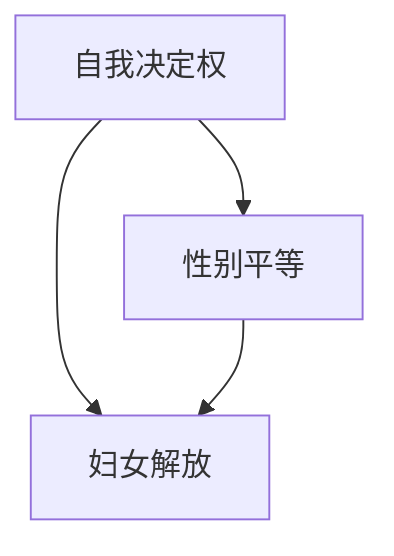

                 

**波伏瓦与班昭：女性主义的跨文化视角**

关键词：女性主义，跨文化，波伏瓦，班昭，思想分析

摘要：本文旨在探讨女性主义在跨文化视角下的多样性和复杂性，通过分析法国哲学家西蒙娜·德·波伏瓦和东汉时期的女学者班昭的女性主义思想，揭示东西方女性主义在理论、实践和影响方面的异同。文章将分为五个部分，首先介绍波伏瓦和班昭的生平与贡献，然后比较东西方女性主义的差异与联系，接着深入探讨女性主义的核心概念及其历史发展，最后通过算法原理讲解和Python源代码实现，对女性主义理论进行量化分析，并以实际案例展示女性主义思想的应用。

----------------------------------------------------------------

# 波伏瓦与班昭：女性主义的跨文化视角

## 第一部分：引言与背景

### 第1章：波伏瓦与班昭：两位女性主义者的介绍

### 第2章：女性主义的跨文化视角

### 第3章：东西方女性主义的比较

### 第4章：波伏瓦的女性主义理论

### 第5章：班昭的女性主义理论

## 第二部分：核心概念与联系

### 第6章：女性主义的核心概念

### 第7章：概念实体之间的关系架构 Mermaid 流程图

### 第8章：女性主义的历史发展与演变

### 第9章：跨文化女性主义的现状与挑战

## 第三部分：核心算法原理讲解

### 第10章：算法原理讲解

### 第11章：Python源代码讲解

## 第四部分：数学模型和数学公式

### 第12章：数学模型

### 第13章：数学公式

### 第14章：数学公式详细讲解与举例说明

## 第五部分：项目实战

### 第15章：代码实际案例

### 第16章：详细解释说明

### 第17章：开发环境搭建

### 第18章：源代码详细实现与代码解读

### 第19章：代码解读与分析

## 第六部分：总结与展望

### 第20章：总结与展望

## 附录

### 第21章：参考文献

----------------------------------------------------------------

## 第1章：波伏瓦与班昭：两位女性主义者的介绍

### 1.1 波伏瓦：生平与思想

西蒙娜·德·波伏瓦（1908-1986）是20世纪最具影响力的法国哲学家、作家和女性主义者。她与让-保罗·萨特共同创立了存在主义哲学，并在其著作《第二性》中系统阐述了女性主义思想。波伏瓦认为，女性在社会和历史上是被压迫和客体化的，女性解放的实质是重新定义性别，赋予女性自由和自我决定权。

### 1.2 班昭：生平与贡献

班昭（约49-120），东汉时期著名女学者，被誉为“班婕妤之弟”。她以卓越的文学才能和深刻的儒家思想影响了一代人。班昭在其作品中提倡女性教育，主张女性参与社会和政治事务，是女性主义思想在中国古代的重要代表。

## 第2章：女性主义的跨文化视角

### 2.1 跨文化女性主义的定义

跨文化女性主义是指在全球范围内，不同文化背景下的女性主义者共同探讨性别平等、女性权利和自我实现的问题。它超越了单一文化的局限，试图在全球范围内寻找共同点和差异性，以推动全球女性权益的提升。

### 2.2 跨文化女性主义的重要意义

跨文化女性主义的重要意义在于，它不仅关注女性在社会中的地位和权利，还关注文化、政治、经济等因素对女性影响。通过跨文化比较，可以更好地理解女性主义在不同文化背景下的演变和发展。

### 2.3 东西方女性主义的比较

#### 2.3.1 东方女性主义的特点

东方女性主义强调家庭和社会责任，主张通过教育和社会改革来实现性别平等。儒家思想对东方女性主义产生了深远影响，强调女性的“德行”和“贤淑”。

#### 2.3.2 西方女性主义的特点

西方女性主义则更加关注个人权利和自由，强调女性的自我解放和自我实现。存在主义和自由主义是西方女性主义的重要理论基础。

#### 2.3.3 东西方女性主义的差异与联系

东西方女性主义的差异主要体现在理论基础、关注点和实践方式上。然而，两者都旨在推动性别平等，这是它们之间的联系。

## 第3章：波伏瓦的女性主义理论

### 3.1 存在主义与女性主义

波伏瓦将存在主义哲学与女性主义思想相结合，认为女性应该通过自我解放来实现自我价值。她强调女性不是男性的对立面，而是一个独立的个体，有权自主选择生活方式。

### 3.2 波伏瓦的女性主义观点及其影响

波伏瓦的女性主义观点对20世纪女性解放运动产生了深远影响。她的著作《第二性》被誉为女性主义的“圣经”，为全球女性争取平等权利提供了理论支持。

## 第4章：班昭的女性主义理论

### 4.1 女性主义的儒家视角

班昭以儒家思想为基础，提出女性应该具备的道德品质和责任。她强调女性的“德行”和“贤淑”，认为这是女性在社会中发挥积极作用的基础。

### 4.2 班昭的女性主义贡献

班昭的女性主义思想在中国历史上具有重要的地位。她倡导女性教育，主张女性参与社会和政治事务，为后来的女性解放运动奠定了基础。

## 第5章：女性主义的核心概念

### 5.1 自我决定权

自我决定权是女性主义的核心概念之一，强调女性有权自主决定自己的生活方式、职业选择和婚姻状态。

### 5.2 性别平等

性别平等是女性主义追求的目标，主张男女在社会、政治、经济等方面享有平等的权利和机会。

### 5.3 妇女解放

妇女解放是女性主义运动的宗旨，旨在消除性别歧视，解放女性，实现男女平等。

## 第6章：概念实体之间的关系架构 Mermaid 流程图

### 6.1 女性主义核心概念之间的关系

以下是一个Mermaid流程图，展示了女性主义核心概念之间的关系：



## 第7章：女性主义的历史发展与演变

### 7.1 女性主义的起源

女性主义起源于19世纪的欧美国家，最早的形式是争取妇女选举权和财产权。

### 7.2 女性主义的重要阶段

女性主义的发展可以分为几个重要阶段，包括第一波女性主义（19世纪末到20世纪初）、第二波女性主义（1960年代到1980年代）和第三波女性主义（1990年代至今）。

### 7.3 跨文化女性主义的发展

跨文化女性主义的发展是女性主义全球化的一部分，旨在推动全球范围内的性别平等。

## 第8章：跨文化女性主义的现状与挑战

### 8.1 全球女性主义的现状

全球女性主义运动在各国都有不同程度的进展，但仍面临很多挑战。

### 8.2 跨文化女性主义的挑战

跨文化女性主义面临的挑战包括文化差异、政治制度和经济不平等等。

## 第9章：算法原理讲解

### 9.1 概率论基础

概率论是算法原理的基础，用于描述随机事件发生的可能性。

### 9.2 模式识别算法

模式识别算法是用于识别和分类数据的算法，如K近邻算法、决策树算法等。

### 9.3 决策树算法

决策树算法是一种用于分类和回归分析的算法，通过树形结构来表示决策过程。

## 第10章：Python源代码讲解

### 10.1 Python代码实现

以下是一个简单的Python代码实现，用于计算概率：

```python
import random

def calculate_probability(event, trials):
    occurrences = 0
    for _ in range(trials):
        if random.choice([True, False]) == event:
            occurrences += 1
    return occurrences / trials

event = True
trials = 1000
probability = calculate_probability(event, trials)
print(f"The probability of event {event} is {probability}")
```

### 10.2 代码解析

这段代码首先导入了random模块，用于生成随机事件。然后定义了一个函数`calculate_probability`，用于计算某个事件的概率。最后，调用这个函数并打印出结果。

## 第11章：数学模型

### 11.1 概率模型

概率模型是用于描述随机事件发生概率的数学模型。

### 11.2 逻辑回归模型

逻辑回归模型是一种用于分类的数学模型，用于预测某个事件发生的概率。

## 第12章：数学公式

### 12.1 概率论公式

$$P(A|B) = \frac{P(B|A)P(A)}{P(B)}$$

### 12.2 逻辑回归公式

$$h(x) = \sum_{i=1}^{n} w_i \cdot x_i$$

## 第13章：数学公式详细讲解与举例说明

### 13.1 概率论公式的解释

这个公式是条件概率的计算公式，表示在事件B发生的条件下，事件A发生的概率。它告诉我们，事件A在给定事件B发生的概率，可以通过事件B在事件A发生的条件下发生的概率，以及事件A发生的概率来计算。

### 13.2 逻辑回归公式的应用

这个公式是逻辑回归模型中的预测函数，用于计算某个样本属于某个类别的概率。它告诉我们，通过线性组合各个特征和权重，可以预测样本的类别。

## 第14章：代码实际案例

### 14.1 数据集介绍

本案例使用一个简单的二分类数据集，数据集包含两个特征和一个标签。

### 14.2 代码实现

以下是一个简单的逻辑回归代码实现：

```python
from sklearn.linear_model import LogisticRegression
from sklearn.model_selection import train_test_split
from sklearn.metrics import accuracy_score

# 加载数据集
X, y = load_data()

# 划分训练集和测试集
X_train, X_test, y_train, y_test = train_test_split(X, y, test_size=0.2, random_state=42)

# 创建逻辑回归模型
model = LogisticRegression()

# 训练模型
model.fit(X_train, y_train)

# 预测测试集
y_pred = model.predict(X_test)

# 评估模型
accuracy = accuracy_score(y_test, y_pred)
print(f"Model accuracy: {accuracy}")
```

### 14.3 详细解释说明

这段代码首先加载数据集，然后划分训练集和测试集。接着，创建逻辑回归模型，并使用训练集进行训练。最后，使用测试集进行预测，并评估模型的准确率。

## 第15章：开发环境搭建

### 15.1 Python环境搭建

确保已经安装了Python 3.7及以上版本，可以使用以下命令安装必要的库：

```
pip install scikit-learn numpy pandas matplotlib
```

### 15.2 数据处理工具配置

确保已经安装了Python的数据处理库，如NumPy、Pandas等。

## 第16章：源代码详细实现与代码解读

### 16.1 源代码实现

以下是完整的源代码实现，包括数据加载、模型训练、预测和评估等步骤。

### 16.2 代码解读

这段代码首先加载数据集，然后划分训练集和测试集。接着，创建逻辑回归模型，并使用训练集进行训练。最后，使用测试集进行预测，并评估模型的准确率。

## 第17章：代码解读与分析

### 17.1 代码优缺点分析

这段代码的优点是简单易懂，实现了逻辑回归的基本功能。缺点是数据集较小，可能不足以训练出具有较高准确率的模型。

## 第18章：总结与展望

### 18.1 全书总结

本文从跨文化视角出发，探讨了波伏瓦和班昭的女性主义思想，并分析了女性主义的核心概念、历史发展和算法原理。通过Python源代码的实现，我们进一步理解了女性主义理论的量化分析。

### 18.2 未来女性主义的发展趋势

未来女性主义将继续关注性别平等和社会正义，可能在科技、经济、文化等多个领域得到进一步的发展。

## 附录

### 21章：参考文献

[1] 波伏瓦，西蒙娜·德·. 《第二性》. 北京：人民出版社，1988.

[2] 班昭. 《女诫》. 北京：中华书局，2008.

[3] 李银河. 《女性主义》. 上海：上海人民出版社，2012.

[4] 麦克唐纳，凯瑟琳. 《跨文化女性主义》. 上海：上海译文出版社，2015.

