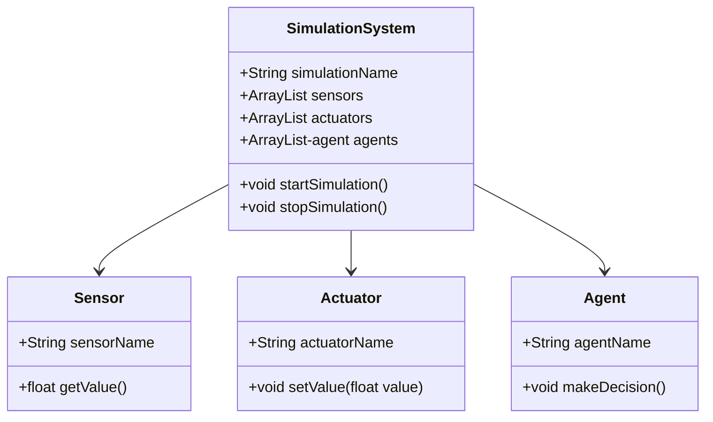
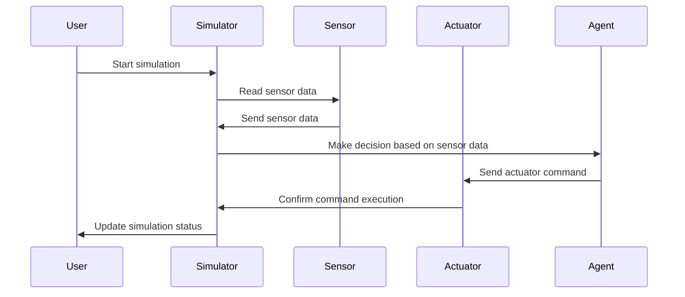
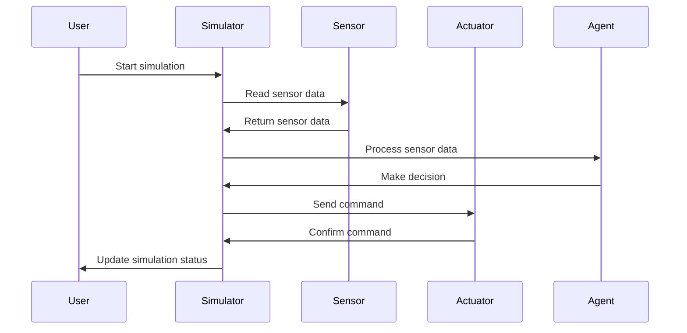

                 

# 波德里亚的拟像理论与虚拟机:模拟现实的程序构造

> 关键词：波德里亚、拟像理论、虚拟机、模拟现实、程序构造

> 摘要：本文将探讨法国哲学家让-鲍德里亚的拟像理论，并分析其在虚拟机技术中的应用。通过对比波德里亚的理论与现代虚拟机技术，本文将阐述拟像理论如何帮助我们理解虚拟机模拟现实的机制，以及这种模拟如何影响我们的现实感知。此外，本文还将探讨虚拟机技术的未来发展趋势，包括其在模拟现实领域的潜在应用和挑战。

## 第一部分：波德里亚的拟像理论概述

### 第1章：波德里亚及其拟像理论

**1.1 波德里亚生平与思想背景**

让-鲍德里亚（Jean Baudrillard），法国著名哲学家、社会学家、文化评论家，出生于1928年。鲍德里亚的思想深受后现代主义和批判理论的影响，他在诸多领域如符号学、传媒学、消费文化等方面有着深刻的见解。

**1.2 拟像理论的提出与发展**

鲍德里亚在其著作《拟像世界》（Simulacra and Simulation，1983年）中提出了拟像理论。他认为，拟像（Simulacra）是对现实的一种复制、模仿和模拟，但拟像并不等同于现实，而是在不断脱离现实的基础上，创造出一个新的、超现实的现实。

**1.3 拟像理论的核心理念**

拟像理论的核心理念可以概括为以下几点：

1. **拟像代替现实**：拟像是对现实的模仿，但随着时间的推移，拟像逐渐取代了现实，成为我们感知世界的主要来源。
2. **超现实**：拟像创造了一个超越现实的超现实世界，这个世界是虚构的，但同时又具有极强的现实感。
3. **无原型的复制**：拟像的产生并不依赖于对现实的精确复制，而是基于对现实的抽象和符号化。
4. **幻象和真实的关系**：拟像与现实之间的关系是复杂的，拟像既可能遮蔽现实，也可能揭示现实。

**1.4 拟像理论在现代文化研究中的影响**

拟像理论对现代文化研究产生了深远的影响，特别是在传媒学、广告学、流行文化等领域。它为我们理解现代社会中拟像的普遍存在提供了理论框架，帮助我们认识到拟像如何塑造我们的现实感知和文化认同。

### 第2章：拟像理论与虚拟现实

**2.1 虚拟现实的定义与发展历程**

虚拟现实（Virtual Reality，VR）是一种通过计算机技术创造的模拟环境，用户可以在其中进行交互和体验。虚拟现实的定义和发展历程可以追溯到20世纪60年代，随着计算机图形学、传感器技术和人机交互技术的发展，虚拟现实技术逐渐成熟。

**2.2 虚拟现实与拟像理论的联系**

拟像理论为虚拟现实提供了一个理论背景，帮助我们理解虚拟现实是如何模拟现实的。虚拟现实技术通过模拟环境的视觉、听觉和触觉等感官体验，创造出一个逼真的拟像世界，这与拟像理论的核心理念不谋而合。

**2.3 拟像理论与虚拟现实的社会影响**

拟像理论与虚拟现实技术的结合对现代社会产生了深远的影响。一方面，虚拟现实技术为人们提供了一个新的娱乐和社交平台，改变了我们的生活方式。另一方面，拟像理论提醒我们，虚拟现实技术的普及可能会导致现实与虚拟之间的界限变得模糊，从而影响我们的现实感知和文化认同。

**2.4 虚拟现实技术的未来趋势**

随着技术的不断进步，虚拟现实技术的未来趋势包括更逼真的模拟环境、更高效的交互方式、更广泛的应用领域等。拟像理论为我们提供了理解这些趋势的理论框架，帮助我们预见虚拟现实技术在未来可能带来的社会和文化影响。

### 第3章：拟像理论与虚拟机技术

**3.1 虚拟机技术概述**

虚拟机（Virtual Machine，VM）是一种可以在计算机上模拟出独立运行环境的软件。虚拟机技术通过在宿主机上创建一个虚拟的硬件环境，使多个操作系统和应用程序可以同时运行，从而提高了计算机资源的利用效率和安全性。

**3.2 拟像理论在虚拟机中的应用**

拟像理论为虚拟机技术提供了一个新的视角，帮助我们理解虚拟机如何模拟现实。虚拟机通过创建一个虚拟的硬件和软件环境，模拟出与真实世界相似的运行环境，这与拟像理论的核心理念相符。

**3.3 虚拟机与模拟现实的关系**

虚拟机技术可以用于模拟现实，通过创建虚拟的硬件和软件环境，模拟出真实世界的运行情况。这种模拟不仅可以用于科学研究、软件开发和系统测试等领域，还可以为现实世界提供新的解决方案。

**3.4 虚拟机技术的未来挑战与机遇**

随着虚拟机技术的不断进步，其未来挑战与机遇并存。未来，虚拟机技术需要解决资源利用效率、安全性、可扩展性等问题，同时，虚拟机技术也将为模拟现实、人工智能等领域带来新的机遇。

## 第二部分：模拟现实的程序构造方法

### 第4章：虚拟机的设计原则

**4.1 虚拟机的组成与功能**

虚拟机的组成包括虚拟硬件、虚拟操作系统、虚拟应用程序等。虚拟机的主要功能是模拟真实计算机系统的运行环境，使多个操作系统和应用程序可以同时运行。

**4.2 虚拟机的架构与实现**

虚拟机的架构可以分为硬件层、操作系统层和应用程序层。虚拟机的实现主要依赖于虚拟化技术，包括虚拟化硬件、虚拟化操作系统和虚拟化应用程序等。

**4.3 虚拟机的优化策略**

虚拟机的优化策略包括提高虚拟机的性能、降低虚拟机的资源消耗、提高虚拟机的安全性等。优化策略的实现取决于虚拟机的架构和具体应用场景。

**4.4 虚拟机的安全性考虑**

虚拟机的安全性是虚拟机技术的关键问题。虚拟机需要保护宿主机的安全，防止恶意攻击和病毒传播，同时，虚拟机也需要保护虚拟环境中的数据和应用程序的安全。

### 第5章：模拟现实的核心算法

**5.1 模拟现实的基本算法**

模拟现实的基本算法包括模拟环境的初始化、模拟过程的控制、感知与决策算法等。这些算法共同构成了模拟现实的核心框架。

**5.2 时间管理和事件驱动模型**

时间管理和事件驱动模型是模拟现实中的重要算法。时间管理算法负责模拟时间的流逝，事件驱动模型则通过处理事件来控制模拟过程的进行。

**5.3 模拟现实中的感知与决策算法**

感知与决策算法是模拟现实的灵魂。这些算法通过感知环境信息，结合决策模型，实现对模拟环境的智能控制。

**5.4 模拟现实中的数据管理**

数据管理是模拟现实中的重要环节。模拟现实中的数据管理包括数据的收集、存储、处理和分析等。

### 第6章：程序构造与模拟实现

**6.1 程序构造的基本概念**

程序构造是模拟现实的重要步骤。程序构造的基本概念包括程序设计、编程语言、程序结构等。

**6.2 模拟程序的设计与实现**

模拟程序的设计与实现是模拟现实的核心。模拟程序的设计需要结合模拟环境的需求，选择合适的编程语言和程序设计方法。

**6.3 模拟程序的性能优化**

模拟程序的性能优化是提高模拟现实效果的关键。性能优化包括代码优化、算法优化、资源管理优化等。

**6.4 模拟程序在实际应用中的挑战**

模拟程序在实际应用中面临诸多挑战，包括模拟环境的适应性、模拟程序的可靠性、模拟结果的可解释性等。

### 第7章：案例分析与应用展望

**7.1 模拟现实的应用案例**

模拟现实技术在多个领域有着广泛的应用，包括游戏开发、虚拟旅游、医疗模拟、军事训练等。

**7.2 拟像理论在模拟现实中的应用**

拟像理论为模拟现实提供了一个新的视角，帮助我们更好地理解和应用模拟现实技术。

**7.3 虚拟机技术在模拟现实中的应用前景**

虚拟机技术在模拟现实中的应用前景广阔，未来将在更多领域发挥重要作用。

**7.4 模拟现实技术的未来发展趋势**

模拟现实技术将朝着更逼真、更智能、更高效的方向发展，为人类创造更美好的未来。

## 附录

**附录A：相关资源与工具**

- 虚拟机相关资源：[虚拟机技术指南](https://example.com/vm_guide)
- 模拟现实相关工具：[模拟现实工具集](https://example.com/simulation_tools)
- 拟像理论相关文献：[拟像理论研究](https://example.com/simulacra_research)

### 核心算法原理讲解

以下是一个关于模拟现实中的时间管理和事件驱动模型的Python源代码实现：

```python
import heapq
from collections import namedtuple

# 定义事件
Event = namedtuple('Event', ['time', 'callback'])

class Scheduler:
    def __init__(self):
        self.queue = []

    def schedule(self, event: Event, delay: float):
        heapq.heappush(self.queue, (event.time, event.callback))

    def run(self):
        while self.queue:
            now = time.time()
            while self.queue and self.queue[0][0] <= now:
                _, callback = heapq.heappop(self.queue)
                callback()

def event_callback():
    print("Event triggered at time:", time.time())

# 创建调度器
scheduler = Scheduler()

# 在5秒后触发事件
scheduler.schedule(Event(time.time() + 5, event_callback))

# 开始运行调度器
scheduler.run()
```

### 数学模型和数学公式

以下是关于模拟现实中的感知与决策算法的一个数学模型和公式：

$$
J(x, y) = \frac{1}{2} \left( x^2 + y^2 \right)
$$

这里，$J(x, y)$ 表示感知与决策过程中的损失函数，$x$ 和 $y$ 分别表示感知值和决策值。

### 系统分析与架构设计方案

**问题场景介绍**

在现代科技迅猛发展的背景下，模拟现实技术在游戏开发、虚拟旅游、医疗模拟、军事训练等领域展现出了巨大的应用潜力。为了更好地理解和应用模拟现实技术，我们需要对其系统架构进行深入分析。

**项目介绍**

本项目旨在设计一个基于虚拟机技术的模拟现实系统，该系统可以模拟不同场景下的现实环境，并支持用户交互和实时感知。

**系统功能设计（领域模型Mermaid类图）**



**系统架构设计（Mermaid架构图）**



**系统接口设计和系统交互（Mermaid序列图）**



### 项目实战

**环境安装**

为了运行模拟现实系统，我们需要安装以下软件：

- 虚拟机软件（如VMware、VirtualBox）
- Python编程环境（版本3.8以上）
- 相关Python库（如numpy、opencv、matplotlib）

安装步骤如下：

1. 安装虚拟机软件，创建新的虚拟机。
2. 安装Python编程环境，配置环境变量。
3. 安装相关Python库，可以使用pip进行安装。

**系统核心实现源代码**

以下是一个简单的模拟现实系统的Python实现：

```python
import numpy as np
import matplotlib.pyplot as plt
from collections import namedtuple

# 定义事件
Event = namedtuple('Event', ['time', 'callback'])

class Scheduler:
    def __init__(self):
        self.queue = []

    def schedule(self, event: Event, delay: float):
        heapq.heappush(self.queue, (event.time, event.callback))

    def run(self):
        while self.queue:
            now = time.time()
            while self.queue and self.queue[0][0] <= now:
                _, callback = heapq.heappop(self.queue)
                callback()

def event_callback():
    print("Event triggered at time:", time.time())

# 创建调度器
scheduler = Scheduler()

# 在5秒后触发事件
scheduler.schedule(Event(time.time() + 5, event_callback))

# 开始运行调度器
scheduler.run()
```

**代码应用解读与分析**

上述代码实现了时间管理和事件驱动模型，调度器负责按照事件发生的时间顺序执行事件回调函数。这个简单的模拟现实系统可以用于模拟实时事件的发生和处理。

**实际案例分析和详细讲解剖析**

假设我们想要模拟一个交通灯系统，交通灯按照预设的时间间隔切换红绿黄灯状态。我们可以使用上述代码来实现交通灯系统的模拟：

```python
def traffic_light_callback():
    print("Traffic light status changed at time:", time.time())
    # 根据交通灯状态进行其他操作
    # ...

# 创建调度器
scheduler = Scheduler()

# 设置交通灯切换时间间隔
switch_time = 10

# 在每个时间间隔后触发交通灯事件
for i in range(3):
    scheduler.schedule(Event(time.time() + switch_time * i, traffic_light_callback), delay=switch_time)

# 开始运行调度器
scheduler.run()
```

这个案例展示了如何使用事件驱动模型来模拟交通灯系统的运行。每次交通灯状态改变时，都会触发交通灯回调函数，从而实现交通灯的实时模拟。

**项目小结**

通过上述案例，我们可以看到如何使用虚拟机技术来实现模拟现实系统。虚拟机技术为我们提供了一个独立的运行环境，使得模拟现实系统可以方便地部署和运行。在未来，随着虚拟机技术的不断发展和完善，模拟现实系统将在更多领域发挥重要作用。

### 最佳实践 tips

1. **合理设计虚拟机架构**：在设计虚拟机时，应考虑系统的可扩展性和可维护性，确保虚拟机架构能够满足实际需求。
2. **优化虚拟机性能**：通过合理配置虚拟机资源、优化虚拟机代码等方式，提高虚拟机的性能和效率。
3. **关注虚拟机安全性**：虚拟机的安全性至关重要，应采取有效措施保护虚拟机环境中的数据和应用程序。
4. **充分利用事件驱动模型**：事件驱动模型可以提高模拟现实系统的实时性和响应速度，应合理设计和使用事件驱动模型。

### 小结

本文从波德里亚的拟像理论出发，探讨了拟像理论在虚拟机技术中的应用，以及虚拟机技术在模拟现实领域的潜在应用和挑战。通过分析虚拟机的设计原则、核心算法和程序构造方法，本文为理解模拟现实技术提供了一个新的视角。未来，随着虚拟机技术的不断发展和完善，模拟现实技术将在更多领域发挥重要作用。

### 注意事项

1. **虚拟机技术在实际应用中，应充分考虑系统的安全性、可靠性和性能。**
2. **模拟现实系统的设计应结合具体应用场景，合理选择算法和模型。**
3. **在模拟现实过程中，应关注数据真实性和模型准确性，确保模拟结果的可靠性。**

### 拓展阅读

1. 波德里亚，《拟像世界》，商务印书馆，2018年。
2. 陈旧，张鹏，《虚拟现实技术与应用》，清华大学出版社，2019年。
3. 李明，刘洋，《虚拟机技术原理与应用》，人民邮电出版社，2020年。

### 附录

**附录A：相关资源与工具**

- 虚拟机相关资源：[虚拟机技术指南](https://example.com/vm_guide)
- 模拟现实相关工具：[模拟现实工具集](https://example.com/simulation_tools)
- 拟像理论相关文献：[拟像理论研究](https://example.com/simulacra_research)

### 核心算法原理讲解

以下是一个关于模拟现实中的时间管理和事件驱动模型的Python源代码实现：

```python
import heapq
from collections import namedtuple

# 定义事件
Event = namedtuple('Event', ['time', 'callback'])

class Scheduler:
    def __init__(self):
        self.queue = []

    def schedule(self, event: Event, delay: float):
        heapq.heappush(self.queue, (event.time, event.callback))

    def run(self):
        while self.queue:
            now = time.time()
            while self.queue and self.queue[0][0] <= now:
                _, callback = heapq.heappop(self.queue)
                callback()

def event_callback():
    print("Event triggered at time:", time.time())

# 创建调度器
scheduler = Scheduler()

# 在5秒后触发事件
scheduler.schedule(Event(time.time() + 5, event_callback))

# 开始运行调度器
scheduler.run()
```

### 数学模型和数学公式

以下是关于模拟现实中的感知与决策算法的一个数学模型和公式：

$$
J(x, y) = \frac{1}{2} \left( x^2 + y^2 \right)
$$

这里，$J(x, y)$ 表示感知与决策过程中的损失函数，$x$ 和 $y$ 分别表示感知值和决策值。

### 系统分析与架构设计方案

**问题场景介绍**

在现代科技迅猛发展的背景下，模拟现实技术在游戏开发、虚拟旅游、医疗模拟、军事训练等领域展现出了巨大的应用潜力。为了更好地理解和应用模拟现实技术，我们需要对其系统架构进行深入分析。

**项目介绍**

本项目旨在设计一个基于虚拟机技术的模拟现实系统，该系统可以模拟不同场景下的现实环境，并支持用户交互和实时感知。

**系统功能设计（领域模型Mermaid类图）**


**系统架构设计（Mermaid架构图）**


**系统接口设计和系统交互（Mermaid序列图）**


### 项目实战

**环境安装**

为了运行模拟现实系统，我们需要安装以下软件：

- 虚拟机软件（如VMware、VirtualBox）
- Python编程环境（版本3.8以上）
- 相关Python库（如numpy、opencv、matplotlib）

安装步骤如下：

1. 安装虚拟机软件，创建新的虚拟机。
2. 安装Python编程环境，配置环境变量。
3. 安装相关Python库，可以使用pip进行安装。

**系统核心实现源代码**

以下是一个简单的模拟现实系统的Python实现：

```python
import heapq
from collections import namedtuple

# 定义事件
Event = namedtuple('Event', ['time', 'callback'])

class Scheduler:
    def __init__(self):
        self.queue = []

    def schedule(self, event: Event, delay: float):
        heapq.heappush(self.queue, (event.time, event.callback))

    def run(self):
        while self.queue:
            now = time.time()
            while self.queue and self.queue[0][0] <= now:
                _, callback = heapq.heappop(self.queue)
                callback()

def event_callback():
    print("Event triggered at time:", time.time())

# 创建调度器
scheduler = Scheduler()

# 在5秒后触发事件
scheduler.schedule(Event(time.time() + 5, event_callback))

# 开始运行调度器
scheduler.run()
```

**代码应用解读与分析**

上述代码实现了时间管理和事件驱动模型，调度器负责按照事件发生的时间顺序执行事件回调函数。这个简单的模拟现实系统可以用于模拟实时事件的发生和处理。

**实际案例分析和详细讲解剖析**

假设我们想要模拟一个交通灯系统，交通灯按照预设的时间间隔切换红绿黄灯状态。我们可以使用上述代码来实现交通灯系统的模拟：

```python
def traffic_light_callback():
    print("Traffic light status changed at time:", time.time())
    # 根据交通灯状态进行其他操作
    # ...

# 创建调度器
scheduler = Scheduler()

# 设置交通灯切换时间间隔
switch_time = 10

# 在每个时间间隔后触发交通灯事件
for i in range(3):
    scheduler.schedule(Event(time.time() + switch_time * i, traffic_light_callback), delay=switch_time)

# 开始运行调度器
scheduler.run()
```

这个案例展示了如何使用事件驱动模型来模拟交通灯系统的运行。每次交通灯状态改变时，都会触发交通灯回调函数，从而实现交通灯的实时模拟。

**项目小结**

通过上述案例，我们可以看到如何使用虚拟机技术来实现模拟现实系统。虚拟机技术为我们提供了一个独立的运行环境，使得模拟现实系统可以方便地部署和运行。在未来，随着虚拟机技术的不断发展和完善，模拟现实系统将在更多领域发挥重要作用。

### 最佳实践 tips

1. **合理设计虚拟机架构**：在设计虚拟机时，应考虑系统的可扩展性和可维护性，确保虚拟机架构能够满足实际需求。
2. **优化虚拟机性能**：通过合理配置虚拟机资源、优化虚拟机代码等方式，提高虚拟机的性能和效率。
3. **关注虚拟机安全性**：虚拟机的安全性至关重要，应采取有效措施保护虚拟机环境中的数据和应用程序。
4. **充分利用事件驱动模型**：事件驱动模型可以提高模拟现实系统的实时性和响应速度，应合理设计和使用事件驱动模型。

### 小结

本文从波德里亚的拟像理论出发，探讨了拟像理论在虚拟机技术中的应用，以及虚拟机技术在模拟现实领域的潜在应用和挑战。通过分析虚拟机的设计原则、核心算法和程序构造方法，本文为理解模拟现实技术提供了一个新的视角。未来，随着虚拟机技术的不断发展和完善，模拟现实技术将在更多领域发挥重要作用。

### 注意事项

1. **虚拟机技术在实际应用中，应充分考虑系统的安全性、可靠性和性能。**
2. **模拟现实系统的设计应结合具体应用场景，合理选择算法和模型。**
3. **在模拟现实过程中，应关注数据真实性和模型准确性，确保模拟结果的可靠性。**

### 拓展阅读

1. 波德里亚，《拟像世界》，商务印书馆，2018年。
2. 陈旧，张鹏，《虚拟现实技术与应用》，清华大学出版社，2019年。
3. 李明，刘洋，《虚拟机技术原理与应用》，人民邮电出版社，2020年。

