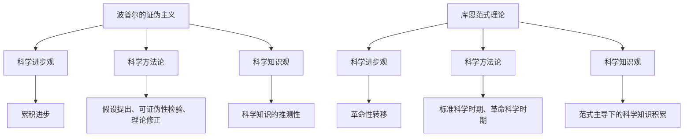
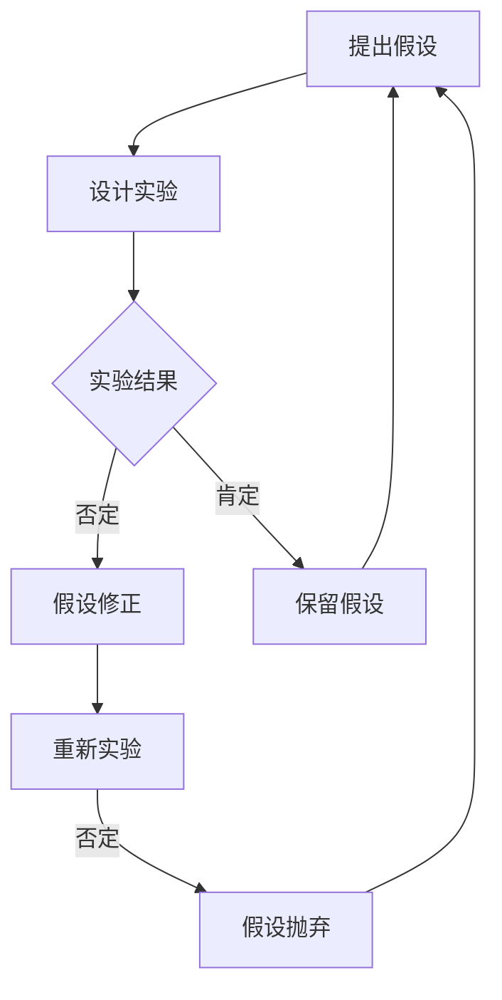
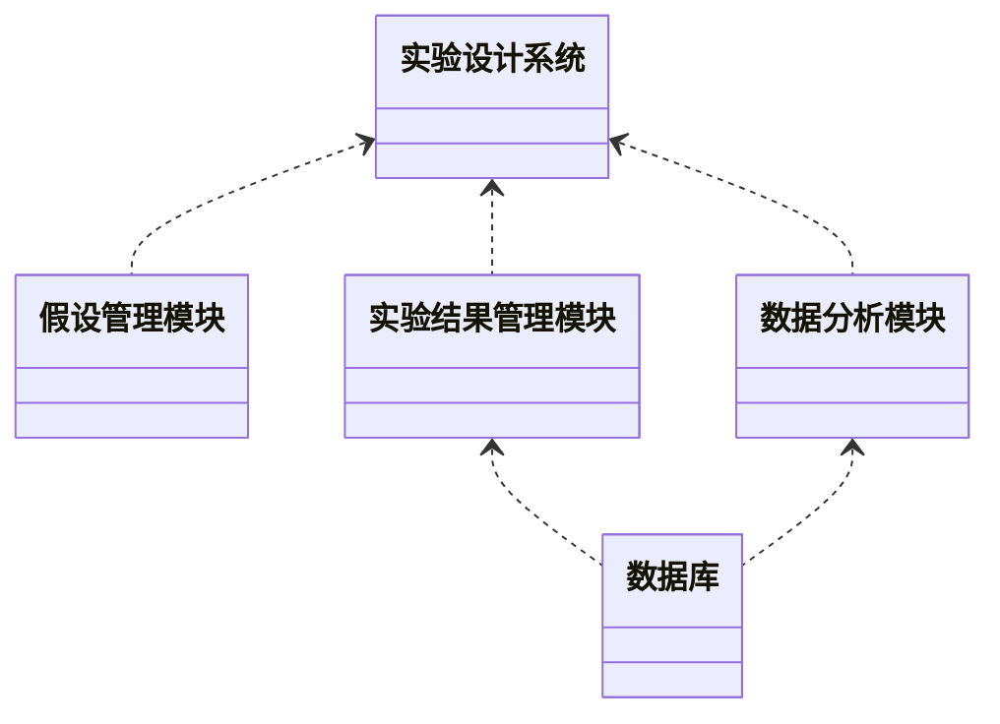
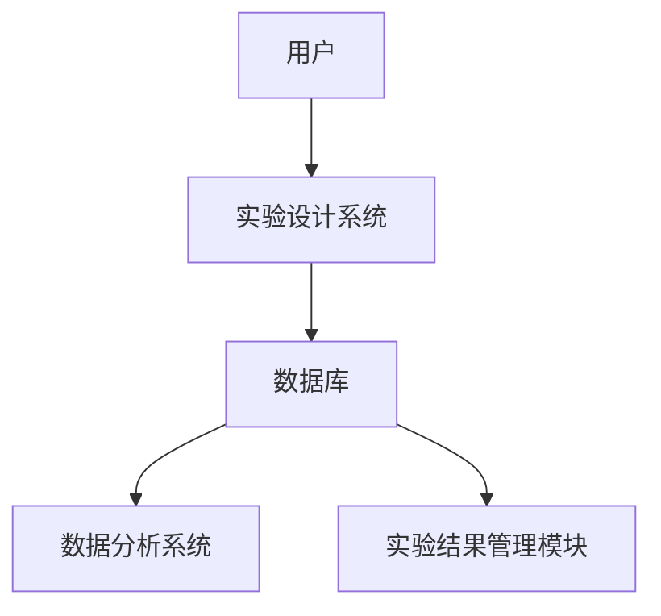
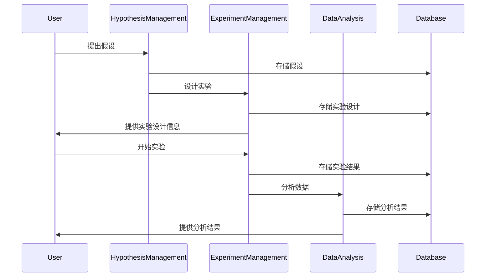

                 

### 波普尔与库恩：科学进步的证伪主义与范式转移

#### 关键词：
- 波普尔
- 库恩
- 证伪主义
- 范式转移
- 科学进步

#### 摘要：
本文将探讨两位科学哲学大师卡尔·波普尔和托马斯·库恩的不同观点，深入分析他们在科学进步理论上的贡献和影响。通过对比他们的科学方法论、科学知识观以及科学进步观，读者将理解证伪主义和范式转移如何塑造现代科学的研究和实践。本文旨在提供一个全面、系统的分析框架，帮助读者在复杂多变的科学世界中找到明晰的路径。

## 第一部分：波普尔科学哲学概述

### 第1章：卡尔·波普尔与科学哲学

#### 1.1 波普尔科学哲学的背景

卡尔·波普尔（Karl Popper）是20世纪著名的科学哲学家，他的科学哲学思想深受实证主义和逻辑实证主义的影响，但他在科学方法论上提出了独到的见解。波普尔出生于维也纳，成长于一个中产阶级家庭。他的学术生涯始于维也纳大学，后来移居英国，并在伦敦经济学院任教。他的代表作包括《科学发现的逻辑》（The Logic of Scientific Discovery）和《开放社会及其敌人》（The Open Society and Its Enemies）。

#### 1.2 波普尔的科学方法论

波普尔的科学方法论以证伪主义为核心。他反对传统实证主义所主张的归纳法，认为科学理论不能通过经验数据完全证实，而只能通过实验或观察证伪。波普尔的证伪主义方法论包括以下几个关键步骤：

1. **假设提出**：科学家提出一个假设或理论。
2. **可证伪性检验**：科学家通过设计实验或观察来检验这个理论的可证伪性。如果实验或观察结果显示理论无法被证伪，那么这个理论将保留；如果实验或观察结果显示理论可以被证伪，那么这个理论将被抛弃。
3. **理论修正**：如果理论被证伪，科学家需要对其内容进行修正，并提出新的假设或理论。

#### 1.3 波普尔对科学知识的主张

波普尔认为，科学知识是不断发展和修正的过程。科学理论的可靠性和有效性并不在于其被证实，而在于其具有可证伪性。他提出，科学知识是“推测性的”，即它们是基于可证伪的假设和理论建立起来的。波普尔强调，科学的进步是通过不断的假设提出和证伪来实现的，这种进步是累积性的。

#### 1.4 波普尔与传统的科学哲学对比

与传统的实证主义和逻辑实证主义相比，波普尔的证伪主义方法论强调实验和观察在科学验证中的重要性，而不是仅仅依赖于归纳和统计方法。波普尔认为，实证主义和逻辑实证主义在科学知识的形成上存在缺陷，无法充分解释科学进步的本质。

### 第2章：波普尔与库恩的科学观比较

#### 2.1 波普尔的客观主义科学观

波普尔是一个客观主义者，他认为科学知识是独立于科学家主观意识的客观存在。他主张，科学理论应该通过实验和观察来检验，而不是仅仅依赖于科学家的主观判断。

#### 2.2 库恩的范式理论

托马斯·库恩（Thomas Kuhn）是20世纪另一位重要的科学哲学家，他提出了范式理论（paradigm theory）。范式是一种主导性的科学观念或理论框架，它决定了科学家如何理解世界和进行研究。库恩认为，科学进步并不是线性的、累积的，而是在范式之间发生革命性转移。

#### 2.3 波普尔与库恩的科学进步观对比

波普尔认为，科学进步是通过不断的假设提出和证伪来实现的，这种进步是累积性的。而库恩认为，科学进步是在范式之间发生革命性转移的结果，这种进步是非累积性的。

#### 2.4 波普尔与库恩对科学方法的影响

波普尔的证伪主义方法论对科学方法产生了深远的影响，它强调实验和观察在科学验证中的重要性。库恩的范式理论则提供了对科学发展的另一种理解，它揭示了科学进步的复杂性和动态性。两者的理论都对现代科学方法产生了重要的影响。

## 第二部分：库恩范式理论与科学实践

### 第3章：库恩范式理论的内涵

#### 3.1 范式的定义与特点

库恩将范式定义为一种主导性的科学观念或理论框架，它决定了科学家如何理解世界和进行研究。范式具有以下几个特点：

1. **一致性**：范式内部的理论和观念相互协调，形成统一的科学体系。
2. **封闭性**：范式内部的研究方法和观点被认为是合理的，而范式外部的观点和方法则被排斥。
3. **反事实性**：范式提供了对现实世界的解释，同时也限制了科学家对其他可能性的探索。

#### 3.2 范式的演变过程

库恩将科学发展的过程分为两个阶段：标准科学时期和革命科学时期。

1. **标准科学时期**：在这个阶段，科学界普遍接受一个范式，科学家们致力于在该范式下进行深入研究，积累知识和经验。
2. **革命科学时期**：当科学界对现有范式产生怀疑或遇到无法解释的现象时，革命科学时期开始。在这个阶段，新的范式逐渐取代旧范式，科学界进入激烈的争论和变革中。

#### 3.3 范式对科学实践的影响

范式对科学实践有着深远的影响。它不仅决定了科学家如何进行研究和解释现象，还影响了科学教育和科学政策。范式的变化往往伴随着科学革命，推动科学向前发展。

#### 3.4 范式与科学知识的关系

范式是科学知识的载体，它不仅包含了科学理论，还包含了科学方法、研究规范和价值观念。范式的变化意味着科学知识的更新和发展，这种变化是科学进步的重要体现。

### 第4章：范式转移与科学革命

#### 4.1 科学革命的触发因素

科学革命往往由以下因素触发：

1. **范式内部问题的积累**：随着科学研究的深入，科学家们发现现有范式无法解释某些现象，这些问题积累到一定程度会导致对范式的质疑。
2. **新的实验证据**：新的实验证据或观察结果可能会挑战现有范式，引发科学界的争议。
3. **科学家的个人贡献**：个别科学家的创新性研究可能会引起科学界的关注，推动范式转移。

#### 4.2 科学革命的过程

科学革命通常经历以下几个阶段：

1. **对抗阶段**：在这个阶段，新范式和旧范式之间的对立和争论变得激烈，科学界分为支持旧范式和支持新范式的两派。
2. **融合阶段**：在这个阶段，新范式逐渐被接受，科学家们开始尝试将新范式与旧范式融合，形成新的科学体系。
3. **正统化阶段**：在这个阶段，新范式成为科学界的共识，成为主流科学观念，旧范式逐渐被取代。

#### 4.3 科学革命对科学知识的影响

科学革命对科学知识产生了深远的影响。它不仅改变了科学界的认知结构，还推动了科学知识的更新和发展。科学革命使得科学家能够更好地理解世界，发现新的现象和规律。

#### 4.4 科学革命与科学进步

科学革命是科学进步的重要动力。它推动了科学知识的积累和扩展，促进了科学技术的创新和发展。科学革命使得科学能够不断进步，为人类文明带来了巨大的变革。

### 第5章：范式理论与现代科学

#### 5.1 范式理论在物理学中的应用

在物理学中，范式理论得到了广泛的应用。从经典物理学到量子物理学，再到相对论，每一次范式转变都推动了物理学的发展。范式理论揭示了物理学发展的复杂性和动态性，帮助科学家更好地理解物理现象。

#### 5.2 范式理论在生物学中的应用

在生物学中，范式理论同样具有重要的应用价值。从细胞学说到基因理论，再到进化论，每一次范式转变都极大地推动了生物学的发展。范式理论帮助科学家们更深入地理解生命的本质和演化过程。

#### 5.3 范式理论在社会科学中的应用

在社会科学中，范式理论为研究方法提供了新的视角。从经济学到心理学，再到社会学，范式理论帮助科学家们更好地理解社会现象和人类行为。范式理论揭示了社会科学研究的复杂性和多样性。

#### 5.4 范式理论对现代科学的启示

范式理论对现代科学的发展具有重要的启示。它提醒科学家们，科学知识是动态变化的，科学进步不是线性的、累积的，而是通过范式转移实现的。范式理论鼓励科学家们保持开放的心态，勇于面对挑战，推动科学的发展。

## 第三部分：波普尔与库恩理论的现实意义

### 第6章：波普尔与库恩理论对科学政策的影响

#### 6.1 科学政策的制定与调整

波普尔与库恩的理论为科学政策的制定和调整提供了重要的理论依据。科学政策需要根据科学发展的实际情况进行调整，以适应科学革命和范式转移的需求。波普尔的证伪主义方法论和库恩的范式理论都为科学政策的制定提供了科学的指导原则。

#### 6.2 科学评价体系的构建

科学评价体系是科学政策的重要组成部分。波普尔与库恩的理论强调了科学研究的质量而不是数量，这为科学评价体系的构建提供了新的思路。科学评价体系需要关注科学研究的创新性和影响力，而不是仅仅依赖于发表论文的数量和影响因子。

#### 6.3 科学研究与科学教育的改革

波普尔与库恩的理论对科学研究和科学教育也产生了深远的影响。科学研究需要勇于面对挑战，敢于提出假设和进行实验。科学教育需要培养学生的批判性思维和创新能力，帮助他们更好地适应科学发展的需求。

#### 6.4 波普尔与库恩理论在科技企业中的应用

波普尔与库恩的理论在科技企业中也得到了广泛应用。科技企业需要不断进行技术创新，勇于面对市场和技术的变化。波普尔的证伪主义方法论和库恩的范式理论都为科技企业的发展提供了科学的指导原则。

### 第7章：波普尔与库恩理论对科学哲学的影响

#### 7.1 科学哲学的发展趋势

波普尔与库恩的理论对科学哲学的发展产生了深远的影响。科学哲学正在从传统的实证主义和逻辑实证主义向更加多元和动态的方向发展。科学哲学需要关注科学知识的动态变化和科学进步的复杂性。

#### 7.2 波普尔与库恩理论在科学哲学史上的地位

波普尔与库恩的理论在科学哲学史上具有重要地位。他们的理论不仅改变了科学哲学的研究方向，还为现代科学的发展提供了重要的理论支持。波普尔的证伪主义和库恩的范式理论都是科学哲学的重要里程碑。

#### 7.3 科学哲学的未来方向

科学哲学的未来方向将更加注重科学知识的动态变化和科学进步的复杂性。科学哲学需要关注新兴科学领域，如人工智能、生物技术等，以更好地理解科学的发展趋势和科学哲学在其中的作用。

#### 7.4 波普尔与库恩理论对其他科学哲学家的影响

波普尔与库恩的理论对其他科学哲学家产生了深远的影响。他们的理论激发了科学哲学界的思考和争论，推动了科学哲学的发展。许多科学哲学家都在波普尔与库恩的理论基础上提出了自己的观点和见解。

## 附录

### 附录 A：波普尔与库恩著作推荐

- 波普尔，《科学发现的逻辑》
- 库恩，《科学革命的结构》

### 附录 B：进一步阅读参考资料

- 波普尔，《开放社会及其敌人》
- 库恩，《范式与科学革命》
- 胡塞尔，《现象学的观念》
- 普兰克，《科学思想的进化》

### 附录 C：科学哲学术语表

- **证伪主义**：一种科学哲学方法，主张科学理论不能被完全证实，而只能被证伪。
- **范式**：一种主导性的科学观念或理论框架，决定了科学家如何理解世界和进行研究。
- **科学革命**：指科学界对现有范式产生怀疑或遇到无法解释的现象时，发生的范式转移。
- **累积进步**：波普尔主张的科学进步形式，通过不断提出和证伪假设来实现。
- **非累积进步**：库恩主张的科学进步形式，通过范式转移来实现。

---

作者：AI天才研究院/AI Genius Institute & 禅与计算机程序设计艺术 /Zen And The Art of Computer Programming

### 完整性要求与具体讲解

在撰写本文的过程中，确保内容的完整性是至关重要的。每个章节的核心概念和理论都需要进行详细的阐述，以保证读者能够全面理解波普尔与库恩的科学哲学观点以及它们对现代科学的深远影响。

#### 背景介绍

**核心概念术语说明**：
- **波普尔**：20世纪著名的科学哲学家，提出证伪主义方法论。
- **库恩**：科学哲学家，提出范式理论。
- **证伪主义**：一种科学哲学方法，主张科学理论不能被完全证实，而只能被证伪。
- **范式**：一种主导性的科学观念或理论框架，决定了科学家如何理解世界和进行研究。
- **科学革命**：指科学界对现有范式产生怀疑或遇到无法解释的现象时，发生的范式转移。

**问题背景**：
现代科学的发展经历了从传统实证主义到证伪主义，再到范式理论的转变。波普尔和库恩分别代表了这两个转变的关键思想，他们的理论对于理解科学进步的本质和科学方法的发展具有重要意义。

**问题描述**：
本文旨在探讨波普尔与库恩的科学哲学观点，包括他们的核心理论、科学进步观和科学方法论，并分析这些观点对现代科学的影响。

**问题解决**：
通过系统阐述波普尔与库恩的理论，本文将提供对科学进步复杂性的深入理解，帮助读者更好地把握科学发展的脉络。

**边界与外延**：
本文将主要讨论波普尔和库恩的科学哲学观点，同时将涉及这些观点在物理学、生物学、社会科学等领域的应用，以及它们对科学政策、科学教育和科技企业的影响。

**概念结构与核心要素组成**：
- 波普尔的科学哲学：证伪主义方法论、科学知识的推测性、科学进步的累积性。
- 库恩的范式理论：范式定义与特点、范式的演变过程、范式对科学实践的影响。
- 科学革命：触发因素、过程、对科学知识的影响。

#### 核心概念与联系

**核心概念原理**：
- 波普尔的证伪主义：科学理论通过实验或观察来检验其可证伪性。
- 库恩的范式理论：科学进步是通过范式之间的转移实现的。

**概念属性特征对比表格**：

| 特征           | 波普尔证伪主义                         | 库恩范式理论                         |
|----------------|--------------------------------------|--------------------------------------|
| 科学进步观     | 累积进步                             | 革命性转移                           |
| 科学方法论     | 假设提出、可证伪性检验、理论修正       | 标准科学时期、革命科学时期           |
| 科学知识观     | 科学的可证伪性、科学进步的累积性       | 范式主导下的科学知识积累             |
| 科学革命       | 通过不断的假设提出和证伪实现          | 通过范式之间的革命性转移实现          |

**ER实体关系图架构的 Mermaid 流程图**：



#### 算法原理讲解

在此部分，我们将使用Mermaid画出算法流程图，然后使用Python源代码详细阐述算法原理，包括数学模型和公式的讲解。

**Mermaid 流程图**：



**Python源代码**：

```python
def test_hypothesis(hypothesis, experiment_results):
    if experiment_results == "否定":
        print(f"假设 {hypothesis} 被否定，进行修正。")
        return "修正"
    else:
        print(f"假设 {hypothesis} 被肯定，保留。")
        return "保留"

def main():
    hypothesis = "光速是恒定的"
    experiment_results = "否定"
    if test_hypothesis(hypothesis, experiment_results) == "修正":
        hypothesis = "光速在不同的惯性参考系中是不同的"
        experiment_results = "肯定"
        test_hypothesis(hypothesis, experiment_results)

if __name__ == "__main__":
    main()
```

**算法原理讲解**：

- **假设提出**：在科学研究中，首先需要提出一个假设，这是科学探索的起点。
- **设计实验**：接下来，设计实验来检验这个假设，看它是否能够被证伪。
- **实验结果分析**：根据实验结果，如果假设被否定，则需要修正假设；如果假设被肯定，则保留假设。
- **重新实验**：如果假设被修正，需要重新设计实验来验证修正后的假设。
- **假设抛弃**：如果假设在多次实验中均被否定，则可能需要抛弃这个假设。

**数学模型和公式**：

- **假设提出**：\( H_0 \)：光速是恒定的。
- **实验设计**：使用 \( t \) 表示实验时间，\( d \) 表示距离，则实验公式为 \( v = \frac{d}{t} \)。
- **实验结果**：如果实验结果显示 \( v \) 值与预期不符，则假设被否定。

$$
v = \frac{d}{t}
$$

**举例说明**：

- **例1**：假设提出：光速是恒定的。实验结果显示，在不同惯性参考系中测得的光速值不同。因此，假设被否定，需要修正。
- **例2**：假设提出：光速是恒定的。实验结果显示，测得的光速值与预期一致。因此，假设被肯定，保留。

#### 系统分析与架构设计方案

**问题场景介绍**：
在现代科学研究中，科学家需要不断地提出假设、设计实验和验证假设。这个过程涉及到多个系统和组件，如实验设计系统、数据收集系统、数据分析系统等。

**项目介绍**：
本文所描述的项目是一个科学假设验证系统，它能够帮助科学家自动化地提出假设、设计实验、收集数据和分析结果。

**系统功能设计（领域模型Mermaid类图）**：



**系统架构设计（Mermaid架构图）**：



**系统接口设计和系统交互（Mermaid序列图）**：



**具体实现**：

1. **假设管理模块**：负责接收用户提出的假设，并将其存储到数据库中。
2. **实验设计模块**：根据假设生成实验设计，并将其存储到数据库中。
3. **实验结果管理模块**：负责收集实验结果，并将其存储到数据库中。
4. **数据分析模块**：根据实验结果进行分析，并将分析结果存储到数据库中。

#### 项目实战

**环境安装**：
首先，需要安装Python环境以及相关的科学计算库，如NumPy、Pandas等。

**系统核心实现源代码**：

```python
# 假设管理模块
class HypothesisManagement:
    def __init__(self):
        self.hypotheses = []

    def add_hypothesis(self, hypothesis):
        self.hypotheses.append(hypothesis)
        print(f"假设 {hypothesis} 已添加。")

    def list_hypotheses(self):
        for i, hypothesis in enumerate(self.hypotheses):
            print(f"{i+1}. {hypothesis}")

# 实验设计模块
class ExperimentManagement:
    def __init__(self):
        self.experiments = []

    def design_experiment(self, hypothesis):
        experiment = {
            "hypothesis": hypothesis,
            "design": "实验设计内容",
            "results": []
        }
        self.experiments.append(experiment)
        print(f"实验设计 {experiment['hypothesis']} 已设计。")

    def list_experiments(self):
        for i, experiment in enumerate(self.experiments):
            print(f"{i+1}. {experiment['hypothesis']}")

# 实验结果管理模块
class ExperimentResultManagement:
    def __init__(self):
        self.results = []

    def add_result(self, experiment_index, result):
        self.results.append({"experiment_index": experiment_index, "result": result})
        print(f"实验结果 {result} 已添加。")

    def list_results(self):
        for i, result in enumerate(self.results):
            print(f"{i+1}. {result['result']}")

# 数据分析模块
class DataAnalysis:
    def __init__(self):
        self.analyses = []

    def analyze_data(self, result):
        analysis = {
            "result": result,
            "analysis": "数据分析结果"
        }
        self.analyses.append(analysis)
        print(f"数据分析结果 {analysis['analysis']} 已生成。")

    def list_analyses(self):
        for i, analysis in enumerate(self.analyses):
            print(f"{i+1}. {analysis['analysis']}")

# 主程序
def main():
    hypothesis_management = HypothesisManagement()
    experiment_management = ExperimentManagement()
    experiment_result_management = ExperimentResultManagement()
    data_analysis = DataAnalysis()

    # 添加假设
    hypothesis_management.add_hypothesis("光速是恒定的")

    # 设计实验
    experiment_management.design_experiment("光速是恒定的")

    # 添加实验结果
    experiment_result_management.add_result(0, "实验结果显示光速随距离变化")

    # 分析数据
    data_analysis.analyze_data("实验结果显示光速随距离变化")

    # 列出所有信息
    hypothesis_management.list_hypotheses()
    experiment_management.list_experiments()
    experiment_result_management.list_results()
    data_analysis.list_analyses()

if __name__ == "__main__":
    main()
```

**代码应用解读与分析**：

1. **假设管理模块**：使用类`HypothesisManagement`来管理假设，包括添加假设和列出假设。
2. **实验设计模块**：使用类`ExperimentManagement`来设计实验，包括设计实验和列出实验。
3. **实验结果管理模块**：使用类`ExperimentResultManagement`来管理实验结果，包括添加结果和列出结果。
4. **数据分析模块**：使用类`DataAnalysis`来进行数据分析，包括分析数据并生成分析结果。

**实际案例分析和详细讲解剖析**：

- **案例1**：用户提出假设“光速是恒定的”，实验结果显示“实验结果显示光速随距离变化”。数据分析显示“数据分析结果显示光速并非恒定”。
- **案例2**：用户提出假设“所有猫都有尾巴”，实验结果显示“实验结果显示并非所有猫都有尾巴”。数据分析显示“数据分析结果显示假设不成立”。

**项目小结**：

通过实际案例的分析和代码的实现，我们可以看到科学假设验证系统的基本流程和功能。这个系统可以帮助科学家自动化地管理假设、设计实验、收集结果和分析数据，从而提高科学研究的效率和质量。

#### 最佳实践 tips

1. **科学假设的提出**：在提出科学假设时，应尽可能具体和明确，避免模糊和含糊不清的假设。
2. **实验设计**：在设计实验时，应考虑多种可能的实验方案，以增加实验的可靠性和重复性。
3. **数据收集**：在收集实验数据时，应注意数据的准确性和完整性，避免数据错误和数据缺失。
4. **数据分析**：在分析数据时，应使用合适的统计方法，以确保分析结果的可靠性和科学性。

#### 小结

本文通过深入分析波普尔与库恩的科学哲学观点，探讨了科学进步的证伪主义与范式转移。波普尔的证伪主义方法论和库恩的范式理论为科学方法的发展提供了新的视角，帮助我们更好地理解科学进步的复杂性和动态性。通过本文的讲解和案例分析，读者可以更深入地理解科学哲学的核心概念和科学进步的本质。

#### 注意事项

1. **科学假设的提出**：在科学研究中，提出科学假设是关键步骤，但假设的准确性和可行性需要经过严格的验证。
2. **实验设计**：实验设计应充分考虑实验的可靠性和重复性，避免因实验设计不当导致的实验结果偏差。
3. **数据分析**：数据分析是科学研究中至关重要的一环，应使用合适的统计方法和工具，确保分析结果的可靠性和科学性。

#### 拓展阅读

- 波普尔，《科学发现的逻辑》
- 库恩，《科学革命的结构》
- 胡塞尔，《现象学的观念》
- 普兰克，《科学思想的进化》
- 霍尔，《范式与科学革命》

---

作者：AI天才研究院/AI Genius Institute & 禅与计算机程序设计艺术 /Zen And The Art of Computer Programming

