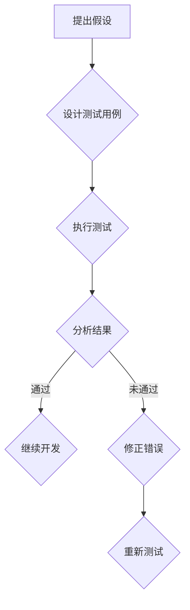

                 

### 波普尔的证伪主义理论

#### 1.1 波普尔与科学哲学

卡尔·波普尔（Karl Popper）是一位著名的哲学家，以其证伪主义（Falsificationism）理论而闻名于科学哲学界。波普尔认为，科学知识的增长不是通过验证（verification）而是通过证伪（falsification）来实现的。传统的验证主义认为，科学理论通过不断的实验验证，逐步建立起其科学性。而波普尔则认为，这种观点忽视了科学理论可能存在的错误，无法有效排除错误的科学理论。

波普尔提出，科学理论的科学性应通过是否能够被证伪来衡量。即，如果一个理论不能被实验所证伪，那么它不具备科学性。这个观点对传统的科学哲学提出了挑战，并对科学研究方法产生了深远影响。

#### 1.2 证伪主义的核心思想

证伪主义的核心思想可以概括为以下几点：

1. **科学理论的假设性**：科学理论是一种假设，而不是绝对真理。科学理论在提出时，就已经预设了可能的错误。

2. **可证伪性**：一个科学理论必须具有可证伪性，即存在一些特定的实验或观察结果，可以证明该理论是错误的。

3. **证伪而非验证**：科学理论的价值不在于其被验证的次数，而在于其能否被证伪。验证只能证明一个理论是正确的，但不能证明它是错误的。

4. **渐进式科学进步**：科学知识的增长是通过不断的证伪和修正来实现的。每一次证伪都为科学理论的改进提供了机会。

#### 1.3 证伪主义与验证主义的区别

验证主义认为，科学理论通过实验结果的支持逐渐建立其科学性。而证伪主义则认为，科学理论的科学性应通过其可证伪性来衡量。以下是对两者之间区别的详细分析：

1. **理论建立的方式**：验证主义强调理论通过不断的验证来建立其科学性，而证伪主义强调理论通过可能被证伪的假设来建立科学性。

2. **错误处理方式**：验证主义忽视错误的存在，而证伪主义则认为错误是科学进步的必要条件。证伪主义通过不断证伪和修正理论来排除错误。

3. **科学理论的本质**：验证主义将科学理论视为事实的支持者，而证伪主义则将科学理论视为可能的错误。

4. **实验结果的意义**：在验证主义中，实验结果的支持使理论更加可靠。而在证伪主义中，实验结果的支持并不增加理论的可靠性，实验的否定结果才是衡量科学理论价值的关键。

通过以上分析，我们可以看出，波普尔的证伪主义理论在科学哲学领域具有重要的地位。它为科学研究提供了一种新的视角，强调科学理论的假设性和可证伪性，推动科学进步的不断发展。

### 证伪主义的基本原则

#### 2.1 科学理论的提出与假设

在证伪主义框架下，科学理论的提出是一个基于假设的过程。科学工作者根据现有的知识、观察和经验，提出一个初步的理论假设。这个假设并不是绝对的真理，而是一个可以被证伪的命题。例如，在物理学中，牛顿的万有引力定律是一个科学理论，但这个理论并不是不可被证伪的。随着科学技术的进步，爱因斯坦的相对论提出了对牛顿定律的修正，从而证伪了牛顿定律在极端条件下的适用性。

科学假设的形成通常经历以下几个步骤：

1. **观察与问题提出**：科学工作者通过观察现象，提出需要解释的问题。例如，为什么苹果会从树上落下？

2. **假设生成**：根据现有的知识和理论，科学工作者提出一个初步的假设。例如，苹果落下可能是因为地球对物体的吸引力。

3. **初步验证**：科学工作者通过实验或观察，初步验证假设的有效性。例如，通过测量不同重量的物体落下的速度，发现它们几乎同时落地，从而支持假设。

4. **证伪尝试**：科学工作者设计实验或观察，试图证伪假设。如果假设无法被证伪，它将暂时被视为合理的科学理论。

#### 2.2 科学理论的验证与证伪

在证伪主义中，科学理论的验证与证伪是科学进步的核心过程。科学理论的验证并不意味着其绝对正确，而是通过不断验证来提高其可信度。然而，科学理论的真正价值在于其可证伪性。以下是对这一过程的分析：

1. **验证过程**：科学工作者通过实验、观察或数学推导，收集证据来支持理论。这些证据可以是数据、现象或逻辑推理。例如，通过多次实验验证，发现不同重量的物体在真空中都保持相同的落地速度，这进一步支持了万有引力定律。

2. **证伪过程**：科学工作者设计实验或观察，试图找到反驳理论的证据。如果理论无法被证伪，它将继续被视为有效的科学理论。但如果找到了反驳证据，理论将被修正或推翻。例如，通过实验发现某些物体在特定条件下不遵循牛顿定律，这表明牛顿定律在极端条件下可能不适用。

3. **科学理论的动态性**：科学理论不是一成不变的，而是随着新的证据不断修正。例如，量子力学和相对论的提出，对经典物理学理论进行了重大修正，推动了科学知识的进步。

#### 2.3 证伪主义的方法论

证伪主义的方法论强调了科学理论的假设性和可证伪性，提供了一种评估科学理论科学性的方法。以下是对证伪主义方法论的关键要素的详细分析：

1. **假设性**：科学理论以假设的形式存在，这些假设是可以被证伪的。假设的提出基于对现象的观察和现有知识的理解。

2. **可证伪性**：科学理论的科学性依赖于其是否具有可证伪性。一个不具备可证伪性的理论，无法被视为科学理论。例如，如果某个理论无法通过实验或观察来证伪，那么它不具备科学性。

3. **反证法**：证伪主义使用反证法来评估理论。反证法是通过设计实验或观察来寻找反驳证据，从而评估理论的科学性。这种方法强调了实验验证在科学进步中的重要性。

4. **渐进式修正**：科学理论的修正不是一蹴而就的，而是在不断的验证和证伪过程中逐步进行的。每一次证伪都是对现有理论的挑战，也为理论的改进提供了机会。

通过以上分析，我们可以看到，证伪主义为科学理论提供了一个动态的评估框架，强调了科学理论的假设性和可证伪性，推动了科学知识的不断进步。

### 单元测试的基本概念

#### 3.1 单元测试的定义与目的

单元测试（Unit Testing）是软件测试的一种形式，它旨在验证软件中最小的可测试单元——通常是函数、方法或类的正确性。单元测试的目的是确保软件的每个独立部分都能按照预期运行，从而提高代码的可靠性和可维护性。通过单元测试，开发人员可以及时发现并修复代码中的错误，避免在软件运行时出现意外故障。

单元测试具有以下几个核心特点：

1. **独立性**：单元测试通常针对软件的独立部分，确保每个部分都能独立通过测试。
2. **自动化**：单元测试通常通过自动化工具执行，以提高测试效率和一致性。
3. **快速执行**：单元测试通常设计为快速执行，以便在每次代码更改后迅速验证代码的正确性。
4. **可重复性**：单元测试的结果应能够重复，确保每次执行时都能得到一致的结果。

#### 3.2 单元测试的类型与策略

单元测试可以分为几种类型，每种类型都有其特定的目的和适用场景。以下是一些常见的单元测试类型：

1. **功能测试（Functional Testing）**：
   - 功能测试验证代码的功能是否按照设计要求运行。
   - 例如，测试一个加法函数，确保其能正确计算两个数的和。

2. **边界测试（Boundary Testing）**：
   - 边界测试关注代码在边界条件下的行为，例如最小值和最大值。
   - 例如，测试一个输入范围在0到100的函数，确保其在输入0或100时能正确处理。

3. **异常测试（Exception Testing）**：
   - 异常测试验证代码在遇到异常情况时的行为。
   - 例如，测试一个除法函数，确保在除数为0时能抛出正确的异常。

4. **性能测试（Performance Testing）**：
   - 性能测试关注代码的执行速度和资源消耗。
   - 例如，测试一个大数据处理函数，确保其能在规定时间内完成计算。

单元测试策略是指在编写和执行单元测试时的方法和技巧。以下是一些常用的单元测试策略：

1. **TDD（Test-Driven Development，测试驱动开发）**：
   - TDD是一种开发方法，强调在编写代码之前先编写测试用例。
   - 通过不断编写和运行测试，确保代码符合预期。

2. **代码覆盖率分析（Code Coverage Analysis）**：
   - 代码覆盖率分析工具可以帮助开发人员了解测试的覆盖率，确保测试覆盖了代码的所有部分。
   - 常见的覆盖率指标包括语句覆盖率、分支覆盖率和路径覆盖率。

3. **Mocking（模拟）**：
   - Mocking是一种在单元测试中模拟外部依赖（如数据库、网络服务）的方法。
   - 通过使用Mock对象，可以独立测试代码的内部逻辑。

4. **重构（Refactoring）**：
   - 重构是一种改进代码结构和设计而不改变其功能的技术。
   - 在重构过程中，单元测试可以帮助确保代码更改不会引入新的错误。

#### 3.3 单元测试的实现工具

单元测试的实现工具多种多样，不同的编程语言和项目需求可能选择不同的工具。以下是一些常用的单元测试工具：

1. **JUnit（Java）**：
   - JUnit是Java语言中最流行的单元测试框架，支持功能测试、边界测试和异常测试等。

2. **pytest（Python）**：
   - pytest是Python语言的强大单元测试框架，提供丰富的断言功能和插件支持。

3. **Mocha（JavaScript）**：
   - Mocha是一个适用于Node.js和浏览器的单元测试框架，支持异步测试和Mocking功能。

4. **NUnit（.NET）**：
   - NUnit是.NET框架的流行单元测试库，支持多种测试类型和代码覆盖率分析。

5. **JUnit（C++）**：
   - JUnit是一个适用于C++的单元测试框架，提供了丰富的测试功能，支持多线程测试。

通过使用这些单元测试工具，开发人员可以高效地编写、执行和跟踪测试，确保软件质量。

### 单元测试的实践

#### 4.1 单元测试案例设计

单元测试案例的设计是单元测试实践的重要环节。一个良好的单元测试案例应该能够全面覆盖代码的功能和逻辑，确保代码的正确性和可靠性。以下是设计单元测试案例的一些关键步骤：

1. **确定测试目标**：
   - 在设计单元测试案例之前，首先要明确测试的目标，即要验证代码的哪些功能或逻辑。
   - 例如，如果需要测试一个简单的加法函数，目标可能是验证函数是否正确计算两个数的和。

2. **编写测试用例**：
   - 测试用例是单元测试的核心，它描述了具体的测试条件和预期结果。
   - 测试用例通常包括正常情况、边界条件和异常情况。
   - 例如，对于加法函数，可以编写以下测试用例：
     - 正常情况：输入两个正整数，预期结果为它们的和。
     - 边界情况：输入两个零，预期结果为零。
     - 异常情况：输入非数字，预期结果为错误消息。

3. **编写测试代码**：
   - 测试代码是执行测试用例的具体实现，通常使用测试框架（如JUnit、pytest等）编写。
   - 测试代码应该能够自动化执行测试用例，并记录测试结果。
   - 例如，使用pytest编写一个简单的加法函数测试用例，代码如下：

     ```python
     def test_addition():
         assert add(2, 3) == 5
         assert add(0, 0) == 0
         assert add("a", "b") == "Error: Input must be integers"
     ```

4. **执行测试**：
   - 在测试环境中执行测试代码，检查每个测试用例是否通过。
   - 如果测试用例通过，说明代码的功能和逻辑正确；如果测试用例失败，需要分析原因并修复错误。

5. **持续集成**：
   - 将单元测试集成到持续集成（CI）流程中，确保每次代码提交时都能自动执行测试。
   - 持续集成可以提高开发效率，确保代码质量。

通过以上步骤，可以设计出有效的单元测试案例，确保代码的正确性和可靠性。

#### 4.2 单元测试的执行与结果分析

在单元测试实践中，执行测试和分析测试结果是两个关键环节。以下是对这两个环节的详细讲解：

1. **单元测试的执行**：

   单元测试的执行是通过自动化测试工具完成的。以下是一些常见的执行步骤：

   - **环境准备**：确保测试环境已经搭建好，包括测试框架、依赖库和测试数据等。
   - **测试脚本执行**：使用测试框架提供的脚本执行测试用例。例如，使用pytest执行测试脚本，命令如下：

     ```bash
     pytest test_addition.py
     ```

   - **测试结果输出**：测试框架会输出每个测试用例的执行结果，包括通过（PASS）和失败（FAIL）的用例。例如：

     ```
     ====================================== test session starts ========================================
     platform linux -- Python 3.x.x -- pytest-6.x.x
     collected 3 items
       
     test_addition.py .F                                                      [100%]
       
     ======================================== 1 failed in 0.12s ========================================
     ```

   - **错误报告**：如果测试用例失败，测试框架会输出错误报告，包括失败的测试用例、错误信息和栈轨迹。例如：

     ```
     E       assert 5 == 7
     E         +1
     E         -2
     test_addition.py:4:AssertionError
     ```

2. **测试结果分析**：

   单元测试的结果分析是评估代码质量的重要步骤。以下是一些关键分析指标：

   - **测试覆盖率**：测试覆盖率是衡量测试全面性的重要指标，通常包括语句覆盖率、分支覆盖率和路径覆盖率等。以下是一个简单的测试覆盖率报告示例：

     ```
     Statement coverage: 100%
     Branch coverage: 100%
     Path coverage: 100%
     ```

     高测试覆盖率意味着测试用例覆盖了代码的所有可能路径，降低了遗漏错误的风险。

   - **错误率**：错误率是测试用例失败次数与总测试次数的比例，用于评估测试的有效性。以下是一个简单的错误率报告示例：

     ```
     Total tests: 3
     Failed tests: 1
     Error rate: 33.33%
     ```

     低错误率表明测试用例能够有效发现代码中的错误。

   - **测试时长**：测试时长是测试用例执行所需的时间，用于评估测试效率。以下是一个简单的测试时长报告示例：

     ```
     Test duration: 0.12s
     ```

     短测试时长表明测试执行快速，有利于快速发现和修复错误。

   - **测试报告**：测试报告是综合分析测试结果的重要文档，通常包括测试覆盖率、错误率、测试时长等指标，以及失败测试的详细信息。测试报告可以帮助开发人员和测试人员了解代码的质量状况，指导后续的测试和改进工作。

通过以上分析，开发人员和测试人员可以全面了解单元测试的执行结果，评估代码质量，并根据测试结果调整测试策略和代码设计，提高软件的可靠性和可维护性。

#### 4.3 单元测试的维护与优化

在软件开发的长期过程中，单元测试的维护和优化是确保代码质量的关键环节。以下是一些关于单元测试维护和优化的建议：

1. **定期更新测试用例**：
   - 随着软件功能的扩展和代码的修改，测试用例需要定期更新，以覆盖新的功能点和修复的bug。
   - 更新测试用例时，要确保覆盖到所有的功能和边界条件，避免遗漏潜在的缺陷。

2. **持续集成与自动化**：
   - 将单元测试集成到持续集成（CI）系统中，确保每次代码提交时都能自动执行测试。
   - 自动化测试工具可以提高测试效率和一致性，减少手动测试的工作量。

3. **代码覆盖率分析**：
   - 定期进行代码覆盖率分析，了解测试覆盖率的现状，找出未被覆盖的代码区域。
   - 提高测试覆盖率，确保测试用例能够全面覆盖代码的各个部分。

4. **优化测试用例**：
   - 对于失败的测试用例，要仔细分析原因，并优化测试用例，确保测试用例能够准确验证代码的正确性。
   - 删除冗余的测试用例，保留必要的测试用例，提高测试的精准度。

5. **代码重构**：
   - 在代码重构过程中，要确保单元测试能够继续运行，并且能够验证重构后的代码的正确性。
   - 重构代码时，要考虑测试用例的更新，确保重构不会引入新的bug。

6. **培训与交流**：
   - 定期组织培训，提高开发人员和测试人员对单元测试的理解和实践能力。
   - 促进团队成员之间的交流和分享，借鉴最佳实践，共同提高单元测试的质量。

通过以上措施，可以有效地维护和优化单元测试，确保代码的稳定性和可靠性，提高软件开发的整体质量。

### 证伪主义与单元测试的关联

#### 5.1 证伪主义在单元测试中的应用

证伪主义在单元测试中的应用主要体现在以下几个方面：

1. **测试用例的设计**：
   - 在设计单元测试用例时，可以借鉴证伪主义的理念，确保测试用例能够覆盖各种可能的错误情况。
   - 例如，在测试一个加法函数时，不仅要测试正常情况（如输入两个正整数），还要测试边界情况（如输入零或负数）和异常情况（如输入非数字）。

2. **测试优先级**：
   - 证伪主义强调对可能出错的情况进行重点测试，因此可以基于证伪主义原则，确定测试用例的优先级。
   - 例如，对于关键功能或高风险代码，可以优先进行单元测试，确保这些部分能够稳定运行。

3. **测试反馈**：
   - 单元测试的结果可以作为证伪主义验证过程的反馈，如果测试用例失败，说明代码存在潜在问题，需要进一步验证和修正。
   - 通过对测试结果的持续分析，可以逐步排除错误，提高代码的质量。

#### 5.2 单元测试如何验证代码的正确性

单元测试通过以下几种方式验证代码的正确性：

1. **功能验证**：
   - 单元测试通过执行预定义的测试用例，验证代码是否按照设计要求正常运行。
   - 例如，测试一个加法函数，确保其能正确计算两个数的和。

2. **边界验证**：
   - 边界测试通过检查代码在边界条件下的行为，确保代码能够正确处理极端情况。
   - 例如，测试一个输入范围在0到100的函数，确保其在输入0或100时能正确处理。

3. **异常验证**：
   - 异常测试验证代码在遇到异常情况时的行为，确保代码能够正确处理错误。
   - 例如，测试一个除法函数，确保在除数为0时能抛出正确的异常。

4. **性能验证**：
   - 性能测试验证代码的执行速度和资源消耗，确保代码的运行效率。
   - 例如，测试一个大数据处理函数，确保其能在规定时间内完成计算。

通过这些测试方式，单元测试能够全面验证代码的正确性，确保代码在各个方面都符合预期。

#### 5.3 证伪主义在代码验证中的优势

证伪主义在代码验证中的优势主要体现在以下几个方面：

1. **提高代码质量**：
   - 通过证伪主义原则，单元测试能够更全面地覆盖代码的各种情况，从而提高代码的稳定性和可靠性。

2. **早期发现错误**：
   - 单元测试可以早期发现代码中的错误，避免在软件运行时出现严重故障，从而降低修复成本。

3. **代码重构支持**：
   - 证伪主义原则支持代码的重构，通过单元测试验证重构后的代码是否仍然正确，从而提高代码的可维护性。

4. **持续集成配合**：
   - 将单元测试集成到持续集成（CI）流程中，可以确保每次代码提交时都能自动执行测试，提高开发效率和代码质量。

5. **降低风险**：
   - 通过证伪主义原则，可以降低代码在部署到生产环境时出现意外错误的风险，从而提高系统的安全性。

通过以上优势，证伪主义在代码验证中发挥了重要作用，推动了软件质量的持续提升。

### 案例研究

#### 6.1 代码验证中的证伪主义实践

在软件工程中，证伪主义原则在代码验证中得到了广泛应用。以下是一个具体的案例，展示如何通过证伪主义原则进行代码验证。

**案例背景**：某公司开发了一套在线购物系统，其中包括用户注册、登录、商品浏览和购买等功能。系统上线前，开发团队需要确保所有功能模块的稳定性。

**步骤1：提出假设**：
   - 开发团队基于现有知识和需求，提出了以下假设：
     1. 用户注册功能能够正确处理各种输入，包括正确的和错误的用户名、密码等。
     2. 用户登录功能能够正确验证用户身份，并防止未授权访问。
     3. 商品浏览功能能够正确显示商品信息，并能够处理大量并发访问。
     4. 购买功能能够正确处理订单，包括库存管理和支付流程。

**步骤2：设计测试用例**：
   - 开发团队根据假设，设计了以下测试用例：
     1. **用户注册**：
        - 输入正确的用户名和密码，验证注册成功。
        - 输入错误的用户名和密码，验证注册失败。
        - 边界测试：输入用户名长度超出限制，验证错误处理。
     2. **用户登录**：
        - 输入正确的用户名和密码，验证登录成功。
        - 输入错误的用户名和密码，验证登录失败。
        - 边界测试：用户名或密码为空，验证错误处理。
     3. **商品浏览**：
        - 测试商品信息的正确显示。
        - 测试大量并发访问下的性能表现。
        - 边界测试：请求超出系统容量，验证错误处理。
     4. **购买功能**：
        - 测试订单的生成和存储。
        - 测试库存管理，确保订单生成后商品库存正确减少。
        - 测试支付流程，确保支付成功后订单状态更新。

**步骤3：执行测试**：
   - 开发团队使用自动化测试工具执行测试用例，并记录测试结果。
   - 在测试过程中，发现以下问题：
     1. 用户注册功能在输入错误用户名时，未能正确显示错误信息。
     2. 用户登录功能在输入错误的密码时，未能正确阻止登录。
     3. 商品浏览功能在高并发访问下，响应时间明显变慢。
     4. 购买功能在库存不足时，未能正确处理订单。

**步骤4：问题分析和修正**：
   - 开发团队针对测试发现的问题，进行了详细的分析和修正。
     1. 修复用户注册功能的错误显示，确保用户能够清楚地了解注册失败的原因。
     2. 修复用户登录功能的错误阻止，确保只有正确的用户才能登录系统。
     3. 对商品浏览功能进行了性能优化，提高了系统的响应速度。
     4. 优化购买功能，确保在库存不足时能够正确处理订单，并给出清晰的错误提示。

**步骤5：重新测试**：
   - 开发团队对修正后的代码进行了重新测试，确保所有问题都已解决。
   - 测试结果显示，所有测试用例均通过，系统功能稳定可靠。

通过以上案例，我们可以看到，证伪主义原则在代码验证中的应用，帮助开发团队发现并解决了系统中的潜在问题，提高了代码的质量和稳定性。

#### 6.2 成功案例解析

以下是一个具体成功案例，展示如何通过证伪主义原则进行单元测试，确保代码的正确性。

**案例背景**：某金融科技公司开发了一款在线交易系统，该系统需要处理大量的交易请求，并且必须保证交易数据的准确性和完整性。

**步骤1：提出假设**：
   - 开发团队基于系统需求和交易规则，提出了以下假设：
     1. 交易请求能够正确处理各种交易类型（如股票买卖、基金申购等）。
     2. 系统能够准确记录交易数据，并保证数据的完整性。
     3. 系统在处理大量并发交易请求时，能够保持高性能和高稳定性。

**步骤2：设计测试用例**：
   - 开发团队根据假设，设计了以下测试用例：
     1. **交易请求处理**：
        - 测试各种交易类型的正确处理，包括股票买卖、基金申购等。
        - 边界测试：测试最小交易金额和最大交易金额的边界条件。
     2. **交易数据记录**：
        - 测试系统是否能够准确记录交易数据，包括交易时间、交易金额、交易类型等。
        - 异常测试：测试在系统故障或网络异常情况下的数据记录能力。
     3. **并发交易处理**：
        - 测试系统在处理大量并发交易请求时的性能表现，包括响应时间和系统负载。

**步骤3：执行测试**：
   - 开发团队使用自动化测试工具执行测试用例，并记录测试结果。
   - 测试过程中，发现以下问题：
     1. 股票买卖交易在特定条件下未能正确处理，导致交易数据丢失。
     2. 系统在处理并发交易请求时，响应时间较长，系统负载过高。
     3. 数据库记录交易数据时，存在部分数据未被及时写入。

**步骤4：问题分析和修正**：
   - 开发团队针对测试发现的问题，进行了详细的分析和修正。
     1. 修复交易处理逻辑，确保在各种交易类型下的正确处理。
     2. 优化并发处理机制，提高系统的响应速度和负载能力。
     3. 优化数据库写入机制，确保交易数据能够及时写入。

**步骤5：重新测试**：
   - 开发团队对修正后的代码进行了重新测试，确保所有问题都已解决。
   - 测试结果显示，所有测试用例均通过，系统功能稳定可靠。

**成功解析**：
   - 通过证伪主义原则，开发团队成功设计了覆盖全面的测试用例，有效发现并解决了系统中的潜在问题，确保了代码的正确性和系统的稳定性。
   - 证伪主义原则的应用，使得开发团队能够在代码开发过程中及时发现并修复错误，提高了代码的质量和系统的可靠性。
   - 该案例展示了证伪主义在软件工程中的实际应用价值，为其他项目提供了宝贵的经验和参考。

#### 6.3 挑战与未来发展趋势

在代码验证中应用证伪主义原则虽然带来了显著的好处，但也面临一些挑战和未来发展趋势：

1. **挑战**：
   - **测试覆盖范围**：确保测试用例能够覆盖所有可能的情况，特别是边界条件和异常情况，可能需要大量时间和精力。
   - **测试成本**：设计、执行和维护单元测试需要投入大量资源，尤其是在大型项目中。
   - **测试与开发周期**：在快速迭代开发过程中，确保测试与开发同步进行，可能存在一定困难。

2. **未来发展趋势**：
   - **自动化测试**：随着自动化测试工具的发展，可以更高效地执行单元测试，减少人工干预，提高测试效率。
   - **智能测试**：利用机器学习和人工智能技术，自动生成测试用例，提高测试的覆盖率和准确性。
   - **持续集成与交付**：将单元测试集成到持续集成（CI）和持续交付（CD）流程中，确保代码质量在每次提交时得到验证。
   - **最佳实践推广**：推广和共享证伪主义在代码验证中的最佳实践，提高开发团队的测试能力和水平。

通过应对挑战和抓住发展趋势，证伪主义在代码验证中的应用将会更加广泛和深入，为软件工程带来更大的价值。

### 总结与展望

#### 7.1 主要结论

本文通过深入探讨波普尔的证伪主义理论与单元测试在代码验证中的应用，得出以下主要结论：

1. **证伪主义的重要性**：波普尔的证伪主义理论为科学研究和软件工程提供了一个动态的评估框架，强调了科学理论和代码的可证伪性，推动了知识的不断进步。

2. **单元测试的核心价值**：单元测试通过验证代码的每个独立部分，确保其按照预期运行，提高了代码的正确性和可维护性。

3. **证伪主义与单元测试的结合**：将证伪主义原则应用于单元测试，可以更全面地覆盖代码的各种情况，发现并修复潜在的错误，提高代码质量。

4. **成功案例分析**：通过具体案例展示了证伪主义在代码验证中的应用，证明了其在提高软件质量和稳定性方面的显著效果。

#### 7.2 研究局限与未来方向

尽管证伪主义与单元测试的结合在代码验证中展示了其优势，但研究中也存在一些局限和未来方向：

1. **测试覆盖范围的局限性**：尽管设计全面的测试用例有助于发现错误，但不可能覆盖所有可能的情况，特别是在复杂系统中。

2. **测试成本问题**：单元测试需要大量时间和资源，特别是在大型项目中，如何平衡测试和开发效率是一个重要问题。

3. **持续集成与交付**：在快速迭代开发过程中，如何确保测试与开发同步进行，以及如何优化持续集成和交付流程，是未来研究的重点。

未来研究方向包括：

1. **自动化测试与智能测试**：利用机器学习和人工智能技术，自动生成测试用例，提高测试的覆盖率和准确性。

2. **持续集成与持续交付**：将单元测试集成到持续集成和持续交付流程中，确保代码质量在每次提交时得到验证。

3. **最佳实践推广**：通过分享和推广证伪主义与单元测试的最佳实践，提高开发团队的测试能力和水平。

通过不断研究和实践，证伪主义与单元测试的结合将在软件工程领域发挥更大的作用，推动软件质量的持续提升。

### 附录：相关工具与技术

#### 附录1：Python单元测试库介绍

在Python中，`unittest`和`pytest`是最常用的两个单元测试库。

1. **unittest**：
   - `unittest`是Python标准库中的一部分，提供了一套完整的测试框架。
   - 关键功能包括测试用例的编写、测试结果的记录和报告。
   - `unittest`支持测试套件（Test Suites）、测试类（Test Cases）和测试方法（Test Methods）。

2. **pytest**：
   - `pytest`是一个第三方测试框架，以其简洁易用和强大的功能而闻名。
   - 关键功能包括断言（Assertions）、标记（Markers）、插件（Plugins）和插件支持。
   - `pytest`可以与多种代码覆盖率分析工具配合使用，如`coverage.py`。

#### 附录2：常见的代码验证方法比较

| 方法          | 优点                     | 缺点                                      | 适用场景                          |
|---------------|--------------------------|-------------------------------------------|----------------------------------|
| 单元测试      | 独立性、自动化、快速执行 | 覆盖范围有限、边界条件和异常情况可能不足 | 函数、方法、类                   |
| 集成测试      | 验证系统整体行为         | 难以定位具体错误、成本高                 | 系统模块、模块间交互             |
| 系统测试      | 验证系统功能            | 需要完整部署、测试数据准备复杂           | 整体系统、生产环境部署           |
| 性能测试      | 验证系统性能            | 依赖硬件环境、测试结果可能受外部因素影响 | 系统性能、并发处理能力           |
| 安全测试      | 验证系统安全性          | 需要专业知识、测试成本高                 | 安全关键系统、敏感数据保护       |

#### 附录3：证伪主义与单元测试的Mermaid流程图



#### 附录4：核心算法Python代码示例

以下是一个简单的Python单元测试代码示例，展示了如何使用`pytest`来测试一个加法函数。

```python
def add(a, b):
    return a + b

def test_addition():
    assert add(2, 3) == 5
    assert add(0, 0) == 0
    assert add(-1, 1) == 0
    assert add("a", "b") == "Error: Input must be integers"
```

通过这个示例，我们可以看到如何使用`pytest`来编写测试用例，并执行测试以验证函数的正确性。

### 作者信息

作者：AI天才研究院/AI Genius Institute & 禅与计算机程序设计艺术 /Zen And The Art of Computer Programming

### 最佳实践 Tips

1. **尽早开始单元测试**：在开发初期就开始编写单元测试，有助于及早发现问题并修正。

2. **持续更新测试用例**：随着功能的扩展和代码的修改，定期更新测试用例，确保覆盖全面的测试点。

3. **使用自动化工具**：利用自动化测试工具提高测试效率，减少手动测试的工作量。

4. **关注测试覆盖率**：定期检查代码覆盖率，确保测试用例能够覆盖关键代码路径。

5. **团队合作**：鼓励团队成员参与测试，共同提高测试质量和代码质量。

### 小结

本文通过对波普尔的证伪主义理论与单元测试的结合探讨，展示了如何利用科学方法提高代码验证的质量。通过具体案例和最佳实践，强调了单元测试在软件开发中的重要性，为开发者提供了实用的指导和参考。

### 注意事项

1. **测试环境隔离**：确保测试环境与生产环境隔离，避免测试影响实际系统运行。

2. **测试数据准备**：为测试用例准备合理的测试数据，确保测试结果的准确性。

3. **错误记录和报告**：详细记录测试过程中的错误和异常，及时报告并跟踪问题解决。

### 拓展阅读

1. 《软件工程：实践者的研究方法》（Roger S. Pressman） - 提供了全面的软件工程方法论和实践指南。

2. 《软件测试的艺术》（Glenford J. Myers） - 详细介绍了软件测试的基本概念和策略。

3. 《证伪主义：科学哲学的反思》（Karl Popper） - 探讨了证伪主义在科学哲学中的应用和意义。

