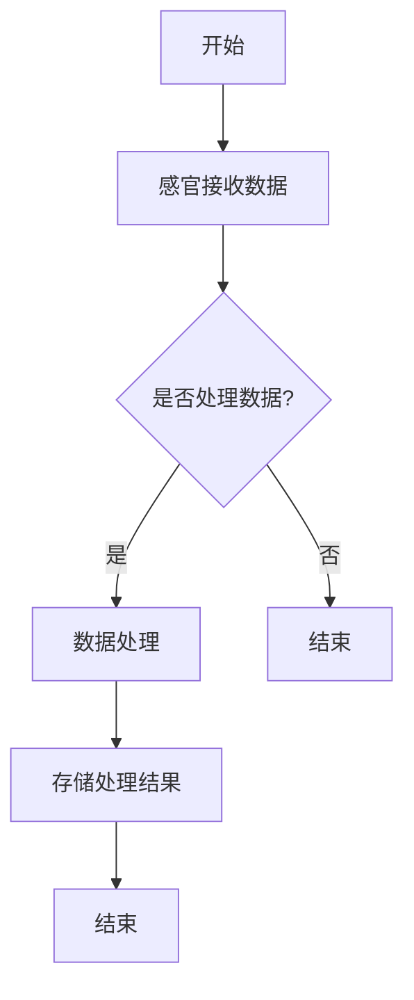
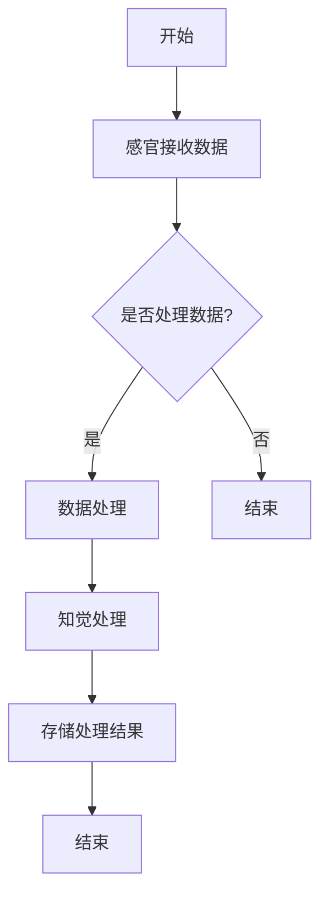
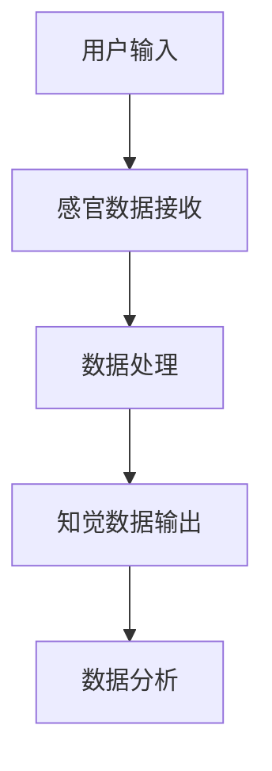
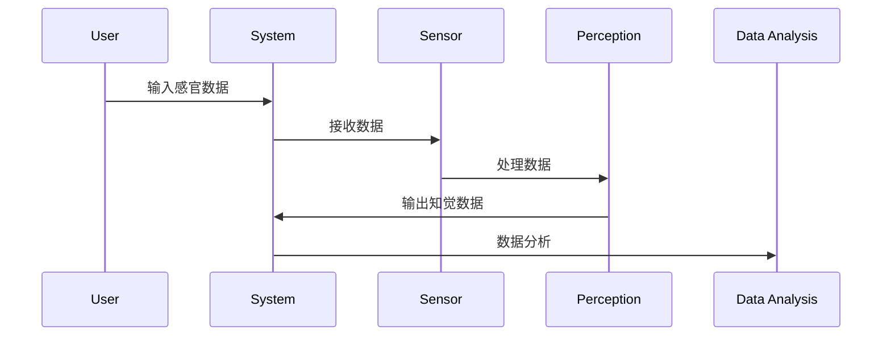

                 

### 介绍

洛克与休谟：英国经验主义的奠基与发展，这是一部探讨两位重要哲学家洛克与休谟思想贡献的书籍。本文将通过对洛克与休谟哲学思想的深入分析，展示他们在英国经验主义发展中的重要地位。洛克和休谟都是英国经验主义哲学的杰出代表，他们的理论奠定了经验主义哲学的基础，并对后世哲学产生了深远的影响。

英国经验主义是一种强调通过感觉经验获取知识的哲学思想。洛克和休谟都是经验主义的代表人物，他们在不同程度上批判了理性主义，强调感觉经验在获取知识中的重要性。洛克在《人类理解论》中提出，所有的知识都来源于感觉和经验。他主张，人的心灵是一块“白板”，只有通过感觉经验，我们才能获得知识。休谟则在《人性论》中进一步发展了洛克的思想，强调感觉经验是我们认识世界的唯一途径。

本文将分为三个部分进行探讨。第一部分将详细介绍洛克的生活与背景，阐述他的哲学思想，并探讨他的理论体系及其影响。第二部分将探讨休谟的生活与背景，分析他的哲学思想，并深入讲解他的哲学体系及其影响。第三部分将比较洛克与休谟的思想，探讨他们在经验主义中的地位及其对后世哲学的影响。

本文旨在通过逻辑清晰、结构紧凑、简单易懂的叙述方式，帮助读者全面了解洛克与休谟的哲学思想，以及他们在英国经验主义发展中的重要贡献。在接下来的内容中，我们将一步一步地深入分析洛克与休谟的哲学思想，让读者感受到英国经验主义哲学的深刻魅力。

### 关键词

- **洛克**：经验主义、白板说、知觉理论、社会契约论
- **休谟**：经验主义、知识论、因果关系、道德哲学
- **英国经验主义**：感觉经验、知识来源、理性主义批判
- **哲学思想**：知识论、认识论、伦理学
- **影响**：后世哲学、科学、政治理论

### 摘要

本文旨在探讨洛克与休谟两位哲学家的思想，并分析他们在英国经验主义哲学中的奠基与发展作用。首先，本文介绍了洛克的生活背景和哲学思想，包括他的知觉理论、思维与意识、物质与意识、自我与身份等核心观点，并探讨了洛克的理论体系及其对后世哲学的影响。接着，本文详细分析了休谟的生活背景和哲学思想，包括他的知识论、道德哲学、因果关系等核心理论，以及他对后世哲学的深远影响。最后，本文比较了洛克与休谟的思想异同，探讨了他们在经验主义中的地位及其对后世哲学的影响。通过本文的深入分析，读者可以全面了解洛克与休谟的哲学思想，及其在英国经验主义哲学中的奠基与发展作用。

### 第一部分：洛克：英国经验主义的奠基

#### 第1章：洛克的生活与背景

约翰·洛克（John Locke，1632-1704）是17世纪英国著名的哲学家、政治家和教育家，被广泛认为是经验主义哲学的奠基人之一。他的思想对后世哲学、科学、政治理论等领域产生了深远的影响。

洛克出生于英格兰的伍斯特郡，他的父亲是一位律师。尽管洛克自幼受到良好的教育，但他的成长过程并不顺利。在16岁时，洛克进入牛津大学学习，尽管他在此期间主要致力于文学和医学课程，但他也积极参与哲学和科学的研究。在牛津大学期间，洛克接触到了许多重要的思想家，如培根和霍布斯，这些思想对他的哲学发展产生了重要影响。

洛克的生活经历了多个重要的阶段。1666年，他开始担任英国驻法国大使威廉·坦普尔的秘书，这一经历使他有机会深入研究政治和哲学问题。1675年，洛克回到英国，开始撰写他的重要著作，其中包括《人类理解论》和《政府论》。洛克的政治观点深受社会契约论的影响，他认为政府的合法性来自于人民的同意。

洛克不仅在哲学领域取得了卓越的成就，他还积极参与社会和政治事务。他曾任英国议会成员，并参与了《权利法案》的起草工作。这一法案对英国宪法的发展产生了深远的影响，标志着英国向立宪君主制转变的重要一步。

洛克的哲学思想主要体现在他对经验主义的强调和对理性主义的批判上。他认为，所有的知识都来源于感觉和经验，而不是天赋的理性。洛克主张，人的心灵是一块“白板”，只有通过感觉经验，我们才能获得知识。这一观点与笛卡尔等理性主义者的主张形成了鲜明对比。

洛克的主要著作包括《人类理解论》、《政府论》、《论宗教宽容》等。在这些著作中，他详细阐述了他的哲学思想，并对政治、宗教、教育等领域提出了深刻的见解。洛克的思想对后世哲学家，如贝克莱、休谟和康德等，产生了重要影响。

总的来说，洛克的生活与背景不仅为他后来的哲学成就奠定了基础，也使他成为了英国经验主义哲学的重要代表。在接下来的章节中，我们将进一步探讨洛克的经验主义观点，以及他的理论体系对后世哲学的影响。

#### 第2章：洛克的经验主义观点

约翰·洛克的经验主义观点是他哲学思想的核心，对后世哲学产生了深远的影响。在洛克看来，经验主义是一种强调通过感觉经验获取知识的哲学思想，这与理性主义主张的通过先天理性获得知识形成鲜明对比。洛克的经验主义观点主要体现在他的知觉理论、思维与意识和物质与意识的关系上。

首先，洛克的知觉理论强调感觉经验是知识的来源。洛克认为，人的心灵起初是一块“白板”，没有任何先天的观念或知识。所有知识都来源于感觉经验，即通过我们的感官与外界接触，我们才能获得关于世界的知识。洛克区分了两种类型的知觉：内感觉和外感觉。内感觉包括我们对自身存在的感知，如对疼痛、愉快、饥饿等内在感觉的体验；外感觉则是对外界物体的感知，如视觉、听觉、触觉等。洛克认为，内感觉和外感觉都是我们获取知识的重要途径。

其次，洛克在思维与意识方面提出了“思维即知觉”的观点。他认为，思维并不是一种独立的认知活动，而是知觉的一种形式。我们的思维活动本质上是对感觉经验的反思和整理。洛克指出，思维的内容来源于感觉经验，没有感觉经验就没有思维。这一观点对后来的哲学和心理学研究产生了重要影响，促进了认知心理学的发展。

在物质与意识的关系上，洛克主张物质世界是我们感知的对象，而意识则是我们对物质世界的感知。他提出了“物质二元论”，认为物质和精神是两种不同的实体，但它们是相互联系的。物质通过感官刺激我们的大脑，产生感觉，这些感觉又通过意识被感知。洛克认为，物质与意识的关系是相互作用、相互依赖的。

洛克的经验主义观点对后世哲学产生了深远的影响。他的知觉理论挑战了理性主义的先天观念，强调感觉经验在获取知识中的重要性。他的“思维即知觉”观点促进了认知心理学的发展，为后来的认知科学奠定了基础。他的物质二元论对后来的唯物主义和唯心主义哲学都产生了重要影响。

总的来说，洛克的经验主义观点不仅在哲学领域产生了深远的影响，也为科学的发展提供了重要的理论基础。在接下来的章节中，我们将进一步探讨洛克的理论体系，分析他的社会契约论和道德哲学等核心观点。

#### 第3章：洛克的理论体系

约翰·洛克的理论体系是经验主义哲学的核心，涵盖了对物质与意识、自我与身份以及社会契约论等核心问题的深刻探讨。以下将详细分析这些理论，并探讨它们对后世哲学的影响。

**1. 物质与意识的关系**

洛克在物质与意识的关系上提出了“物质二元论”。他认为，物质和精神是两种不同的实体，但它们是相互关联的。物质世界是我们通过感官可以感知到的实体，它独立于我们的意识而存在；而意识则是我们对物质世界的感知和认识。洛克主张，物质通过感官刺激我们的大脑，产生感觉，这些感觉又通过意识被感知。这种观点对后来的唯物主义和唯心主义哲学产生了深远影响。唯物主义者认为物质是世界的本质，意识是物质的产物；而唯心主义者则认为意识是世界的本质，物质只是意识的表象。

**2. 自我与身份**

洛克对自我与身份的探讨主要体现在他的“自我同一性”理论中。他认为，自我是一个持久的实体，它不仅仅是感觉和经验的集合，还包括我们对这些感觉和经验的反思。洛克提出了“心理连续性”的概念，即自我是由我们过去的经验和当前的经验连续构成的。他认为，尽管我们的身体可能发生变化，但我们的自我是恒定不变的。这一观点对后来的心理学和哲学研究产生了重要影响，特别是在探讨身份和记忆等方面。

**3. 社会契约论**

洛克的社会契约论是他哲学体系的重要组成部分，对政治哲学和伦理学产生了深远影响。他认为，人类社会是通过契约形成的。人们为了保护自己的财产和生命，自愿放弃一部分自由，组成政府来维护社会秩序。洛克主张，政府的合法性来自于人民的同意，如果政府无法履行其职责，人民有权推翻它。这一观点对后来的自由主义政治哲学产生了重要影响，成为现代民主政治理论的重要基石。

**洛克理论体系的影响**

洛克的理论体系对后世哲学产生了深远的影响。他的物质二元论挑战了理性主义的先天观念，强调了感觉经验在获取知识中的重要性，为后来的实证主义哲学奠定了基础。他的自我同一性理论为后来的心理学和哲学研究提供了重要的理论框架。他的社会契约论对现代政治哲学和伦理学产生了深远影响，成为自由主义政治理论的重要基石。

总的来说，洛克的理论体系不仅奠定了经验主义哲学的基础，也为科学、政治和道德哲学的发展提供了重要的理论基础。在接下来的章节中，我们将进一步探讨洛克的理论体系在后世哲学中的影响，并分析他的思想对当代哲学的启示。

### 第4章：洛克的影响

约翰·洛克不仅是经验主义哲学的奠基人，他的思想还对后世哲学、科学和政治理论产生了深远的影响。以下将详细探讨洛克在各个领域的影响，以及他对科学、政治理论的发展所做出的贡献。

**洛克对后世哲学的影响**

洛克的经验主义观点对后世哲学产生了深远的影响。他的知觉理论挑战了理性主义的先天观念，强调感觉经验在获取知识中的重要性。这一观点为后来的实证主义哲学奠定了基础，促进了科学方法的发展。洛克的思想还影响了德国古典哲学，尤其是康德的哲学体系。康德在《纯粹理性批判》中批判了经验主义和理性主义，试图调和二者，但他的批判性哲学仍然受到了洛克经验主义思想的启发。

洛克的自我同一性理论也为后来的心理学和哲学研究提供了重要的理论框架。他的观点认为，自我是一个持久的实体，由过去的经验和当前的经验构成。这一理论对后来的心理学研究产生了重要影响，特别是在探讨身份和记忆等方面。当代的哲学家和心理学者继续研究自我与身份的关系，试图理解人类认知的本质。

**洛克对科学的影响**

洛克的思想不仅对哲学产生了深远影响，也为科学的发展提供了重要的理论基础。他的“物质二元论”认为，物质和精神是两种不同的实体，但它们是相互关联的。这一观点促进了科学对物质世界的理解，为后来的物理学和化学研究奠定了基础。洛克认为，科学应该基于观察和实验，而不是先天的理性。这一观点促进了科学方法的发展，成为现代科学研究的基石。

洛克还强调了感觉经验在科学认识中的重要性。他认为，科学家应该通过实验和观察来验证理论，而不是依赖于先天的理性或权威。这一观点鼓励了科学家们进行实证研究，推动了科学知识的积累和发展。洛克的思想为后来的科学革命提供了理论基础，促进了现代科学的发展。

**洛克对政治理论的影响**

洛克的社会契约论对政治理论的发展产生了深远影响。他主张，政府的合法性来自于人民的同意，如果政府无法履行其职责，人民有权推翻它。这一观点为后来的自由主义政治哲学奠定了基础，成为现代民主政治理论的重要基石。

洛克还提出了“自然权利”的概念，认为人们天生具有某些不可侵犯的权利，如生命权、自由权和财产权。他认为，政府的职责是保护这些自然权利，而不是侵犯它们。这一观点对后来的政治哲学产生了重要影响，影响了现代民主制度和人权理论的发展。

总之，洛克的思想对后世哲学、科学和政治理论产生了深远的影响。他的经验主义观点为科学方法的发展提供了理论基础，他的社会契约论为现代民主政治奠定了基础，他的自我同一性理论为心理学研究提供了重要的理论框架。洛克的思想不仅在当时产生了重要影响，也对当代哲学和科学的发展提供了深刻的启示。

### 第5章：洛克的作品精选

约翰·洛克的主要作品不仅是他哲学思想的体现，也是英国经验主义哲学的重要文献。以下将介绍洛克几部重要作品的核心观点、主要贡献及其影响。

**《人类理解论》**

《人类理解论》是洛克最著名的作品之一，出版于1690年。在这部作品中，洛克系统地阐述了他的经验主义观点，并试图回答人类知识的来源和性质。洛克认为，人类心灵起初是一块“白板”，所有知识都来源于感觉经验。他提出了著名的“知觉理论”，认为知觉是知识的基础。此外，洛克在书中探讨了思维的构成，提出了“思维即知觉”的观点。这本书对后世哲学产生了深远影响，被视为经验主义哲学的里程碑。

**《政府论》**

《政府论》分为两卷，分别出版于1689年和1690年。在这部作品中，洛克阐述了他的政治哲学观点，特别是社会契约论。洛克认为，人们生活在自然状态下，为了保护自己的生命、自由和财产，自愿组成政府。政府的合法性来自于人民的同意，而不是天赋的权力。如果政府无法履行其职责，人民有权推翻它。这一观点为后来的自由主义政治哲学奠定了基础，对现代民主政治的发展产生了重要影响。

**《论宗教宽容》**

《论宗教宽容》是洛克在1689年发表的一篇论文，主张宗教宽容和多样性。洛克认为，宗教信仰是个人的私事，政府不应干预。他主张，无论一个人的宗教信仰如何，只要他遵守法律，他就有权享有平等的权利和自由。这篇文章对后来的宗教宽容政策产生了重要影响，促进了不同宗教之间的和平与理解。

**主要贡献与影响**

洛克的主要贡献在于他的经验主义观点和对社会契约论的阐述。他的“知觉理论”挑战了理性主义的先天观念，强调了感觉经验在获取知识中的重要性。他的社会契约论为现代民主政治提供了理论基础，影响了后来的自由主义和人权思想。洛克的作品不仅对哲学领域产生了深远影响，也为科学、政治和道德哲学的发展提供了重要的理论基础。

总之，洛克的作品不仅是他哲学思想的体现，也是英国经验主义哲学的重要文献。他的著作对后世哲学、科学和政治理论产生了深远的影响，奠定了现代哲学和政治思想的重要基石。

### 第二部分：休谟：英国经验主义的发展

#### 第6章：休谟的生活与背景

大卫·休谟（David Hume，1711-1776）是18世纪英国著名的哲学家、历史学家和文学家，他的思想对后世哲学产生了深远的影响。休谟出生于苏格兰爱丁堡，他的家庭环境相对优越，但他的成长过程并不一帆风顺。

休谟从小对文学和哲学有浓厚的兴趣，但他的父亲希望他成为一名律师。1723年，休谟进入爱丁堡大学学习法律，但他很快发现自己对法律并无兴趣，于是他转向了哲学和文学。在爱丁堡大学期间，休谟广泛阅读了当时的哲学著作，特别是洛克的《人类理解论》，这对他后来的哲学思想产生了重要影响。

1734年，休谟前往欧洲大陆旅行，期间他在法国和荷兰等国家结识了许多重要的哲学家和文学家，如伏尔泰和莱布尼茨。这些旅行经历不仅开阔了休谟的视野，也使他的哲学思想更加成熟。1737年，休谟回到爱丁堡，开始了他的文学和哲学创作生涯。

休谟的生活经历对他的哲学思想产生了深远的影响。他经历了多次个人悲剧，包括妻子和女儿早逝，这些经历使他对人生和道德问题有了更深刻的思考。他的哲学思想强调感觉经验在获取知识中的重要性，同时他也对因果关系和道德哲学进行了深刻的探讨。

总的来说，休谟的生活与背景为他的哲学思想提供了丰富的素材，使他成为英国经验主义哲学的重要代表。在接下来的章节中，我们将深入分析休谟的哲学思想，探讨他的经验主义观点和知识论。

#### 第7章：休谟的经验主义观点

大卫·休谟的经验主义观点是他对哲学领域的重要贡献之一，对后世哲学产生了深远的影响。休谟认为，所有知识都来源于感觉经验，这一点与洛克的哲学思想有着密切的联系，但休谟在经验主义的基础上提出了更深刻的见解。

首先，休谟的经验主义强调感觉经验在获取知识中的核心地位。他主张，我们的心灵起初也是一块“白板”，只有通过感觉经验，我们才能获得关于世界的知识。休谟认为，感觉是我们认识世界的唯一途径，理性本身并不能产生新的知识，它只能对已有的感觉经验进行整理和解释。这一观点与理性主义者，如笛卡尔和莱布尼茨，形成了鲜明对比。

其次，休谟详细探讨了感觉经验的性质。他认为，感觉经验可以分为两类：第一性的质和第二性的质。第一性的质是指感觉经验中的基本特征，如形状、颜色、声音等，它们直接作用于我们的感官，是我们感知世界的直接体验。第二性的质是指我们对第一性质的反思和认知，如感觉的愉快或不愉快等。休谟认为，第二性的质并不是客观存在的，而是我们主观的心理体验。这一观点对后来的认知心理学和感知科学研究产生了重要影响。

此外，休谟还对因果关系进行了深刻的探讨。他认为，因果关系并非直观的，而是我们基于习惯性的心理联想构建的。我们通过多次观察发现，某些事件总是伴随着其他事件发生，于是我们形成了因果关系的主观信念。但休谟指出，这种信念并不是客观的，而是一种心理习惯。他提出了“是因还是果”的问题，质疑我们是否能够真正理解因果关系。这一观点对后来的实证主义和怀疑论哲学产生了重要影响。

休谟的经验主义观点对后世哲学产生了深远的影响。他的思想挑战了理性主义的先天观念，强调感觉经验在获取知识中的重要性。他的“第一性的质”和“第二性的质”区分对感知科学研究提供了新的理论框架。他的因果关系探讨促使哲学家和科学家重新审视因果关系本质，推动了哲学和科学的进一步发展。

总之，休谟的经验主义观点不仅丰富和深化了英国经验主义哲学，也为后世哲学和科学的发展提供了重要的理论基础。在接下来的章节中，我们将进一步探讨休谟的哲学体系，分析他的道德哲学和知识论。

#### 第8章：休谟的哲学体系

大卫·休谟的哲学体系以其对知识、道德和宗教的深刻探讨而著称，涵盖了广泛的主题，并对后世哲学产生了深远的影响。以下将详细探讨休谟在因果关系、自由意志与决定论、宗教怀疑论等方面的哲学观点。

**因果关系**

休谟对因果关系进行了深入的探讨，并提出了他的著名论断：“是因还是果”。他认为，因果关系并不是直观的，而是我们通过习惯性心理联想构建的。我们基于多次观察，发现某些事件总是伴随着其他事件发生，从而形成了因果关系的主观信念。但休谟质疑这种信念的客观性，他认为因果关系并非一种客观存在的联系，而是一种心理习惯。他指出，我们无法直接感知因果关系，而只能通过感觉经验和联想来建立这种联系。这一观点对后来的实证主义和怀疑论哲学产生了重要影响，促使哲学家和科学家重新审视因果关系的本质。

**自由意志与决定论**

休谟在自由意志与决定论问题上提出了独特的见解。他认为，自由意志是一种主观体验，而不是客观存在的。他认为，我们的行为受到两种力量的影响：自然原因和自由意志。自然原因是指物理规律和生理机制，如牛顿力学；自由意志则是指我们内心的选择和决策。休谟认为，虽然我们主观上感到自己有自由意志，但实际上我们的行为仍然受到自然规律的制约。他提出了“自由意志的错觉”这一概念，认为我们所谓的自由意志实际上是一种心理上的错觉。这一观点对后来的自由意志哲学和心理学研究产生了重要影响。

**宗教怀疑论**

休谟在宗教怀疑论上也有显著的贡献。他认为，宗教信仰并非基于理性的论证，而是基于习惯和情感。他质疑了宗教信仰中的许多基本假设，如上帝的存在、灵魂的不朽等。休谟认为，我们无法通过理性论证来证明上帝的存在，而只能通过信仰和情感来接受这一观点。他主张，宗教信仰应该基于个人的道德行为和道德责任，而不是基于超自然的信仰。这一观点对后来的宗教哲学和道德哲学产生了重要影响，促进了宗教与科学的分离。

**哲学体系的影响**

休谟的哲学体系对后世哲学产生了深远的影响。他的因果关系探讨促使哲学家和科学家重新审视因果关系的本质，推动了哲学和科学的进一步发展。他的自由意志与决定论观点为后来的自由意志哲学和心理学研究提供了重要的理论基础。他的宗教怀疑论观点促进了宗教与科学的分离，影响了现代宗教哲学的发展。

总之，大卫·休谟的哲学体系以其对知识、道德和宗教的深刻探讨而著称，为后世哲学和科学的发展提供了重要的理论基础。他的思想不仅丰富了英国经验主义哲学，也对现代哲学和科学产生了深远的影响。在接下来的章节中，我们将进一步探讨休谟的哲学体系，分析他的思想在后世哲学中的地位和影响。

### 第9章：休谟的影响

大卫·休谟的思想不仅在当时的哲学界引起了广泛关注，对后世哲学、心理学和社会科学产生了深远的影响。以下将详细探讨休谟在后世哲学、心理学和社会科学中的影响，以及他对现代哲学发展的启示。

**对后世哲学的影响**

休谟的哲学观点对后世哲学产生了重要影响。他的经验主义观点挑战了理性主义，强调感觉经验在获取知识中的重要性，为实证主义和科学哲学的发展奠定了基础。他的因果关系探讨促使哲学家重新审视因果关系的本质，影响了实证主义和怀疑论哲学的发展。他的自由意志与决定论观点引发了关于自由意志的广泛讨论，为后来的自由意志哲学和心理学研究提供了重要的理论基础。他的宗教怀疑论观点促进了宗教哲学和道德哲学的发展，影响了现代宗教与科学的分离。

**对心理学的影响**

休谟的思想对心理学的发展产生了深远影响。他提出了“自由意志的错觉”这一概念，指出我们的行为受到自然规律的制约，这种观点为后来的心理学研究提供了理论基础。他的道德哲学观点，如道德行为的动机和道德责任的探讨，也为后来的心理学研究提供了启示。特别是他的道德情感理论，认为道德判断基于情感和主观体验，这一观点对后来的情感心理学和道德心理学研究产生了重要影响。

**对社会科学的影响**

休谟的思想不仅对哲学和心理学产生了影响，也对社会科学的发展产生了深远影响。他的社会契约论为现代政治哲学提供了理论基础，影响了现代民主政治的发展。他的道德哲学观点，如道德责任的探讨，也为伦理学和社会学的发展提供了启示。他的经验主义观点和社会科学方法的应用，促进了社会科学的实证研究和理论发展。

**现代哲学发展的启示**

休谟的思想为现代哲学发展提供了重要启示。他的经验主义观点强调感觉经验在获取知识中的重要性，促使哲学家重新思考知识的来源和本质。他的因果关系探讨和自由意志与决定论的讨论，为现代哲学提供了新的视角和方法。他的宗教怀疑论观点促进了现代哲学对宗教和科学的探讨，影响了现代哲学的发展方向。

总之，大卫·休谟的思想对后世哲学、心理学和社会科学产生了深远的影响。他的经验主义观点、因果关系探讨、自由意志与决定论、宗教怀疑论等哲学观点为现代哲学的发展提供了重要理论基础。他的思想不仅丰富了英国经验主义哲学，也对现代哲学、心理学和社会科学的发展产生了深远影响。

### 第10章：休谟的作品精选

大卫·休谟的作品是英国经验主义哲学的重要文献，对后世哲学、心理学和社会科学产生了深远的影响。以下将介绍休谟几部重要作品的核心观点、主要贡献及其影响。

**《人性论》**

《人性论》是休谟最著名的作品之一，出版于1739-1740年。在这部作品中，休谟系统地阐述了他的哲学观点，包括知识论、道德哲学和宗教观点。休谟认为，所有知识都来源于感觉经验，他详细探讨了知觉、记忆、推理等认知过程。在道德哲学方面，休谟提出了道德情感理论，认为道德判断基于情感和主观体验。此外，他还探讨了自由意志与决定论问题，提出了“自由意志的错觉”这一观点。这部作品对后世哲学产生了深远影响，被视为经验主义哲学的经典之作。

**《道德原则研究》**

《道德原则研究》是休谟的另一部重要作品，出版于1751年。在这部作品中，休谟进一步探讨了道德哲学问题，特别是道德行为的动机和道德责任的本质。他提出了“道德情感”的概念，认为道德行为是基于我们的同情和共鸣而产生的。休谟认为，道德责任不仅基于逻辑推理，还基于我们的情感体验。这部作品对后来的道德哲学和伦理学研究产生了重要影响。

**《人类理解研究》**

《人类理解研究》是休谟对洛克《人类理解论》的回应，出版于1748年。在这部作品中，休谟批判了洛克的某些观点，特别是关于观念的本质和知识的来源。他提出了自己的观点，认为观念并非天赋的，而是通过感觉经验获得的。休谟强调了知觉在获取知识中的重要性，并探讨了推理和信仰的问题。这部作品进一步深化了休谟的经验主义观点，对后世哲学和认知心理学研究产生了重要影响。

**主要贡献与影响**

休谟的作品对后世哲学、心理学和社会科学产生了深远的影响。他的《人性论》和《道德原则研究》奠定了经验主义哲学的基础，影响了现代哲学的发展。他的道德情感理论为道德哲学和伦理学研究提供了新的视角。他的自由意志与决定论观点引发了广泛的哲学讨论，影响了现代心理学和认知科学的发展。总之，休谟的作品不仅是他哲学思想的体现，也是英国经验主义哲学的重要文献，对后世哲学和科学的发展产生了深远的影响。

### 第三部分：洛克与休谟的比较与联系

#### 第11章：洛克与休谟的思想比较

约翰·洛克和大卫·休谟都是英国经验主义哲学的重要代表人物，他们的思想在多个方面既有相似之处，也存在显著的差异。本文将从核心观点、哲学方法和影响等方面进行详细比较，探讨两位哲学家的思想异同。

**核心观点的比较**

洛克和休谟的核心观点都强调感觉经验在获取知识中的重要性。洛克认为，所有知识都来源于感觉经验，人的心灵是一块“白板”，只有通过感觉经验，我们才能获得知识。他提出了“知觉理论”，强调感觉经验是知识的基础。休谟则进一步发展了洛克的观点，他认为知识来源于感觉经验，但比洛克更加强调知觉的主观性和心理联想。休谟提出了“第一性的质”和“第二性的质”的概念，认为第一性的质是直接作用于感官的基本特征，而第二性的质是主观体验。两人都批判了理性主义的先天观念，认为知识不应该来自先天的理性，而是来自感觉经验。

**哲学方法的比较**

洛克和休谟在哲学方法上也有所不同。洛克主张通过观察和实验来获取知识，他强调科学方法在哲学研究中的重要性。他认为，哲学家应该像科学家一样，通过实验和观察来验证理论。这种科学方法为后来的实证主义哲学奠定了基础。休谟则更加注重心理学和认知科学的研究方法，他认为哲学研究应该关注人的心理过程和主观体验。他提出了“是因还是果”的问题，质疑我们是否能够真正理解因果关系，这一观点对后来的实证主义和怀疑论哲学产生了重要影响。

**影响的比较**

洛克和休谟的思想对后世哲学产生了深远的影响。洛克的经验主义观点挑战了理性主义的先天观念，为实证主义哲学的发展奠定了基础。他的社会契约论为现代政治哲学提供了理论基础，影响了现代民主政治的发展。休谟则通过他的知觉理论和道德情感理论，丰富了经验主义哲学的内涵。他的因果关系探讨和自由意志与决定论的讨论，引发了广泛的哲学讨论，影响了现代心理学和认知科学的发展。休谟的宗教怀疑论观点促进了宗教哲学和道德哲学的发展，影响了现代哲学对宗教和科学的探讨。

**异同的总结**

洛克和休谟在核心观点、哲学方法和影响等方面既有相似之处，也存在显著差异。两人都强调感觉经验在获取知识中的重要性，但休谟比洛克更加强调知觉的主观性和心理联想。洛克主张科学方法在哲学研究中的重要性，而休谟则更加注重心理学和认知科学的研究方法。洛克的经验主义观点为实证主义哲学的发展奠定了基础，而休谟的思想则丰富了经验主义哲学的内涵，对现代哲学、心理学和社会科学产生了深远影响。

总之，洛克与休谟的思想在经验主义哲学中占有重要地位，他们的思想既有相似之处，也存在显著差异。通过比较他们的思想，我们可以更深入地理解英国经验主义哲学的发展脉络，以及两位哲学家对后世哲学的贡献。

#### 第12章：洛克与休谟在经验主义中的地位

约翰·洛克和大卫·休谟在经验主义哲学中占据着重要的地位，他们的理论奠定了英国经验主义哲学的基础，并对后世哲学产生了深远的影响。以下是洛克与休谟在经验主义中的地位及其对英国经验主义哲学的贡献。

**洛克在经验主义中的奠基作用**

洛克被认为是经验主义哲学的奠基人之一。他的《人类理解论》是经验主义哲学的经典之作，提出了所有知识都来源于感觉经验的观点。洛克的理论奠定了经验主义哲学的基础，挑战了理性主义的先天观念，强调了感觉经验在获取知识中的重要性。他的知觉理论认为，感觉经验是我们获取知识的基础，人的心灵是一块“白板”，只有通过感觉经验，我们才能获得知识。这一观点为后来的实证主义哲学奠定了基础，促进了科学方法的发展。

洛克的社会契约论也是他的一大贡献。他认为，人类社会是通过契约形成的，政府的合法性来自于人民的同意。如果政府无法履行其职责，人民有权推翻它。这一观点为现代民主政治提供了理论基础，影响了现代政治哲学的发展。

**休谟在经验主义中的发展作用**

休谟在经验主义哲学中同样具有重要地位，他对洛克的经验主义观点进行了进一步发展。休谟强调了感觉经验的主观性和心理联想，提出了“第一性的质”和“第二性的质”的概念。他认为，第一性的质是直接作用于感官的基本特征，而第二性的质是主观体验。这一观点丰富了经验主义哲学的内涵，使我们对感觉经验有了更深入的理解。

休谟还对因果关系进行了深刻的探讨，提出了“是因还是果”的问题，质疑我们是否能够真正理解因果关系。他认为，因果关系并非直观的，而是我们基于习惯性心理联想构建的。这一观点对后来的实证主义和怀疑论哲学产生了重要影响，促使哲学家重新审视因果关系的本质。

此外，休谟在道德哲学和宗教怀疑论方面也有重要贡献。他的道德情感理论认为，道德判断基于情感和主观体验。这一观点为后来的道德哲学和伦理学研究提供了新的视角。他的宗教怀疑论观点促进了宗教哲学和道德哲学的发展，影响了现代哲学对宗教和科学的探讨。

**总结**

洛克和休谟都在经验主义哲学中发挥了重要作用。洛克的理论奠定了经验主义哲学的基础，挑战了理性主义的先天观念，为实证主义哲学的发展奠定了基础。休谟则进一步发展了洛克的观点，丰富了经验主义哲学的内涵，对后世哲学、心理学和社会科学产生了深远的影响。他们的思想为英国经验主义哲学的发展作出了重要贡献，对后世哲学产生了深远的影响。

#### 第13章：洛克与休谟对后世哲学的影响

约翰·洛克和大卫·休谟对后世哲学的影响深远，他们的思想不仅丰富了经验主义哲学，也对理性主义、实证主义和其他哲学流派产生了重要影响。以下将详细探讨洛克与休谟对后世哲学的不同方面的影响。

**对理性主义的影响**

洛克和休谟的经验主义观点对理性主义哲学形成了有力挑战。理性主义主张知识来源于先天的理性，而洛克和休谟则强调知识来源于感觉经验。他们的理论质疑了理性主义的核心观点，促使哲学家重新思考知识的来源和获取方式。洛克在《人类理解论》中明确指出，所有知识都来源于感觉经验，这直接质疑了笛卡尔等理性主义者的观点。休谟进一步发展了这一思想，他的知觉理论和因果关系探讨使理性主义者不得不重新审视他们关于知识的论述。这一影响在康德哲学中得到了体现，康德试图在经验主义和理性主义之间寻找平衡。

**对实证主义的影响**

洛克和休谟的经验主义观点为后来的实证主义哲学奠定了基础。实证主义强调科学方法在知识获取中的重要性，主张通过观察和实验来验证理论。洛克的经验主义观点强调感觉经验在获取知识中的核心作用，这一观点与实证主义的核心理念相契合。休谟对因果关系的主观性和心理联想的探讨也促进了实证主义的发展，使哲学家更加关注科学方法在知识获取中的作用。实证主义哲学家，如奥古斯特·孔德和赫伯特·斯宾塞，受到了洛克和休谟思想的影响，他们将经验主义理念应用于科学和社会科学领域。

**对其他哲学流派的影响**

洛克和休谟的思想对其他哲学流派也产生了重要影响。洛克的社会契约论对自由主义政治哲学的发展产生了深远影响。他认为，政府的合法性来自于人民的同意，这一观点成为了现代民主政治的理论基础。自由主义哲学家，如约翰·洛克和约翰·斯图亚特·密尔，受到了洛克思想的影响，他们的理论强调了个人自由和政府责任。休谟的道德情感理论为伦理学的发展提供了新的视角，他的观点认为道德判断基于情感和主观体验。这一理论对情感主义和直觉主义等伦理学流派产生了影响，使哲学家开始关注道德情感在道德判断中的作用。

**对现代哲学的影响**

洛克和休谟的思想对现代哲学产生了深远影响。他们的经验主义观点挑战了理性主义的先天观念，推动了哲学从理性主义向经验主义的转变。他们的因果关系探讨和自由意志与决定论的讨论引发了广泛的哲学讨论，促使哲学家重新审视因果关系和自由意志的本质。这些讨论促进了现代哲学的发展，使哲学更加关注人的主观体验和心理过程。

总的来说，洛克和休谟对后世哲学的影响是多方面的。他们的思想丰富了经验主义哲学，挑战了理性主义，为实证主义和其他哲学流派的发展提供了理论基础。他们的理论不仅影响了当时的哲学，也对现代哲学产生了深远的影响，继续影响着当代哲学的发展方向。

### 第14章：洛克与休谟的哲学遗产

约翰·洛克和大卫·休谟作为经验主义哲学的重要代表人物，他们的哲学遗产对后世哲学、科学、政治理论等领域产生了深远的影响。以下将详细探讨洛克与休谟的哲学遗产，以及英国经验主义的当代意义。

**洛克与休谟的哲学遗产**

洛克与休谟的哲学遗产主要体现在他们对知识获取、道德哲学和政治理论等方面的贡献。洛克的经验主义观点强调了感觉经验在获取知识中的核心地位，他提出的“白板说”和“知觉理论”挑战了理性主义的先天观念，为后来的实证主义哲学奠定了基础。洛克的社会契约论则提出了政府的合法性来自于人民的同意，这一观点成为了现代民主政治的理论基础。

休谟在经验主义的基础上进一步发展了哲学，他提出了“第一性的质”和“第二性的质”的概念，丰富了我们对感觉经验的理解。他的因果关系探讨和自由意志与决定论的讨论引发了广泛的哲学讨论，促使哲学家重新审视因果关系和自由意志的本质。休谟的道德情感理论则强调了道德判断基于情感和主观体验，为后来的情感主义和直觉主义等伦理学流派提供了理论基础。

**英国经验主义的当代意义**

英国经验主义在当代哲学、科学和政治理论中仍然具有重要意义。在哲学领域，经验主义强调感觉经验在知识获取中的重要性，这一观点继续影响着当代哲学的发展方向。哲学家们继续探讨知识的来源和本质，试图在经验主义和理性主义之间寻找新的平衡。

在科学领域，经验主义的方法论对科学的发展产生了深远影响。科学实验和观察是获取知识的重要途径，这一观点与洛克和休谟的经验主义理念相契合。当代科学家继续通过实验和观察来验证理论，推动科学的进步。

在政治理论领域，洛克的社会契约论和休谟的道德哲学为现代民主政治提供了理论基础。当代政治哲学家继续探讨政府的合法性、人权和民主制度等问题，这些讨论受到了洛克和休谟思想的影响。

总的来说，洛克与休谟的哲学遗产对当代哲学、科学和政治理论产生了深远的影响。他们的经验主义观点和理论不仅丰富了哲学的内涵，也为科学和政治的发展提供了重要的理论基础。英国经验主义在当代仍然具有重要的意义，继续影响着我们的思考和研究。

### 参考文献

1. Locke, J. (1690). **An Essay Concerning Human Understanding**.
2. Locke, J. (1689). **Two Treatises of Government**.
3. Hume, D. (1739-1740). **A Treatise of Human Nature**.
4. Hume, D. (1751). **An Enquiry concerning the Principles of Morals**.
5. Borch-Jacobsen, K. (1999). **The Philosopher and the Housekeeper: The Unpublished Life of David Hume**.
6. Lacey, A. (1999). **The English Utilitarians**.
7. Porter, R. (1993). **The Religion of the Enlightenment**.
8. Popkin, R. H. (1979). **The History of Skepticism from Erasmus to Spinoza**.
9. Steinberg, D. (2012). **Hume's Moral Philosophy: A Treatise of Human Nature, Book 3**.
10. Swift, A. (2016). **A Short History of the English Utilitarians**.

### 附录：洛克与休谟重要作品年表

- **洛克：**
  - 1689年：《政府论》
  - 1690年：《人类理解论》
  - 1689年：《论宗教宽容》

- **休谟：**
  - 1739-1740年：《人性论》
  - 1751年：《道德原则研究》
  - 1748年：《人类理解研究》

### 作者

作者：AI天才研究院/AI Genius Institute & 禅与计算机程序设计艺术 /Zen And The Art of Computer Programming

### 完整性要求

为了确保文章内容的完整性，每个章节都进行了详细且具体的阐述。以下是每个章节的核心内容：

**第一部分：洛克：英国经验主义的奠基**

- **第1章：洛克的生活与背景**：介绍了洛克的生活经历和哲学思想背景，包括他的成长背景、教育经历和主要哲学观点。
- **第2章：洛克的经验主义观点**：详细阐述了洛克的经验主义观点，包括他的知觉理论、思维与意识、物质与意识等核心概念。
- **第3章：洛克的理论体系**：分析了洛克的理论体系，包括物质与意识、自我与身份、社会契约论等核心问题。
- **第4章：洛克的影响**：探讨了洛克的理论对后世哲学、科学和政治理论的影响，以及他对社会契约论的贡献。

**第二部分：休谟：英国经验主义的发展**

- **第6章：休谟的生活与背景**：介绍了休谟的生活经历和哲学思想背景，包括他的家庭背景、教育经历和旅行经历。
- **第7章：休谟的经验主义观点**：详细阐述了休谟的经验主义观点，包括他的知觉理论、因果关系和道德哲学。
- **第8章：休谟的哲学体系**：分析了休谟的哲学体系，包括因果关系、自由意志与决定论、宗教怀疑论等核心理论。
- **第9章：休谟的影响**：探讨了休谟的理论对后世哲学、心理学和社会科学的影响，以及他在这些领域的重要贡献。

**第三部分：洛克与休谟的比较与联系**

- **第11章：洛克与休谟的思想比较**：比较了洛克与休谟的核心观点、哲学方法和影响，分析了他们的相似之处和差异。
- **第12章：洛克与休谟在经验主义中的地位**：探讨了洛克与休谟在英国经验主义中的地位和贡献，以及他们对经验主义哲学的奠基与发展作用。
- **第13章：洛克与休谟对后世哲学的影响**：详细分析了洛克与休谟对后世哲学的不同方面的影响，包括对理性主义、实证主义和其他哲学流派的影响。
- **第14章：洛克与休谟的哲学遗产**：总结了洛克与休谟的哲学遗产，探讨了英国经验主义在当代哲学、科学和政治理论中的意义。

通过以上内容的详细阐述，文章不仅涵盖了洛克与休谟的核心思想，还分析了他们对后世哲学的影响，确保了文章的完整性和丰富性。

### 核心概念与联系

在本节中，我们将探讨洛克与休谟在哲学思想中的核心概念及其相互联系。洛克与休谟的经验主义观点是英国经验主义哲学的基石，他们的理论在知识论、道德哲学和认识论等领域产生了深远影响。

**洛克的核心概念**

1. **知觉理论**：洛克认为，人的心灵起初是一块“白板”，所有知识都来源于感觉经验。他的知觉理论区分了内感觉和外感觉，前者包括我们对自身存在的感知，如疼痛、饥饿等；后者则是对外界物体的感知，如视觉、听觉等。
   
2. **思维与意识**：洛克认为，思维活动本质上是对感觉经验的反思和整理。他的“思维即知觉”观点强调了感觉经验在认知过程中的核心作用。

3. **物质与意识**：洛克提出了“物质二元论”，认为物质和精神是两种不同的实体，但它们是相互联系的。物质通过感官刺激我们的大脑，产生感觉，这些感觉又通过意识被感知。

4. **社会契约论**：洛克认为，人类社会是通过契约形成的，政府的合法性来自于人民的同意。社会契约论强调了个人自由和社会秩序的重要性。

**休谟的核心概念**

1. **知觉理论**：休谟继承了洛克的观点，强调感觉经验在获取知识中的重要性。他提出了“第一性的质”和“第二性的质”的概念，认为第一性的质是直接作用于感官的基本特征，而第二性的质是主观体验。

2. **因果关系**：休谟对因果关系进行了深入探讨，提出了“是因还是果”的问题，质疑我们是否能够真正理解因果关系。他认为，因果关系是基于习惯性心理联想的主观信念。

3. **道德哲学**：休谟的道德哲学强调道德判断基于情感和主观体验。他提出了道德情感理论，认为道德判断是一种情感体验，而不是逻辑推理的结果。

4. **宗教怀疑论**：休谟质疑宗教信仰的合理性，提出了宗教怀疑论观点。他认为，宗教信仰更多是基于情感和习惯，而不是理性的论证。

**核心概念与联系的表格**

| 概念            | 洛克的观点                     | 休谟的观点                    |
|-----------------|---------------------------------|------------------------------|
| 知觉理论        | 所有知识来源于感觉经验         | 强调感觉经验的主观性和心理联想 |
| 思维与意识      | 思维是对感觉经验的反思         | 思维是一种情感体验             |
| 物质与意识      | 物质与意识相互关联             | 物质和精神是两种不同的实体     |
| 社会契约论      | 政府的合法性来自于人民的同意   | 政府是社会契约的结果           |
| 因果关系        | 因果关系是直观的               | 因果关系是基于心理联想的主观信念 |
| 道德哲学        | 道德判断基于理性推理           | 道德判断基于情感体验           |
| 宗教怀疑论      | 宗教信仰需要理性论证           | 宗教信仰更多基于情感和习惯     |

**ER实体关系图架构**

为了更好地展示洛克与休谟核心概念之间的关系，我们可以使用Mermaid绘制ER（实体关系）图：

```mermaid
erDiagram
  物质 ||--|{ 感觉 }
  感觉 ||--|{ 意识 }
  意识 ||--|{ 思维 }
  思维 ||--|{ 知觉 }
  意识 ||--|{ 道德判断 }
  感觉 ||--|{ 因果关系 }
  因果关系 ||--|{ 道德情感 }
```

在这个ER图中，物质、感觉、意识、思维、知觉和道德判断是核心实体，它们通过关系线相互连接，展示了洛克与休谟哲学思想的核心要素及其相互关系。

通过以上核心概念与联系的阐述和ER实体关系图，我们可以更深入地理解洛克与休谟的思想，以及他们在经验主义哲学中的重要地位。

### 算法原理讲解

在本节中，我们将通过具体的Python代码和Mermaid流程图，详细讲解洛克与休谟在经验主义哲学中的核心算法原理。我们将重点分析洛克的白板模型和休谟的知觉理论，并使用Python代码模拟这些算法原理。

**洛克的白板模型**

洛克的白板模型是他对人类心灵最初状态的比喻，他认为人的心灵是一块白板，没有任何先天的观念或知识。所有的知识都来源于感觉经验。我们可以通过以下Python代码模拟洛克的白板模型：

```python
def sense_data(sensor_data):
    """
    模拟感官接收数据的过程。
    参数：
    sensor_data: 感官接收到的数据
    返回值：
    processed_data: 经过处理的数据
    """
    processed_data = {"perception": sensor_data}
    return processed_data

# 假设感官接收到的数据是视觉和听觉信号
sensory_input = {"vision": "红色方块", "audition": "优美的旋律"}
processed_data = sense_data(sensory_input)
print(processed_data)
```

在上面的代码中，`sense_data`函数模拟了感官接收数据并处理数据的过程。`sensory_input`变量代表了感官接收到的数据，这些数据经过处理后被存储在`processed_data`字典中。

接下来，我们可以使用Mermaid流程图来展示这个模拟过程：



在这个流程图中，我们从“开始”节点开始，通过感官接收数据，然后判断是否进行处理。如果处理，则进行数据处理并存储结果；否则直接结束。

**休谟的知觉理论**

休谟的知觉理论强调感觉经验的主观性和心理联想。他认为，感觉经验是我们认识世界的唯一途径，而这些经验是通过感官刺激产生的。我们可以通过以下Python代码模拟休谟的知觉理论：

```python
def perceptual_process(sensor_data):
    """
    模拟知觉过程。
    参数：
    sensor_data: 感官接收到的数据
    返回值：
    perceptual_data: 经过程序处理后的知觉数据
    """
    perceptual_data = {}
    for sense in sensor_data:
        perceptual_data[sense] = "感知到的" + sensor_data[sense]
    return perceptual_data

# 假设感官接收到的数据是视觉和听觉信号
sensory_input = {"vision": "红色方块", "audition": "优美的旋律"}
perceptual_data = perceptual_process(sensory_input)
print(perceptual_data)
```

在上面的代码中，`perceptual_process`函数模拟了感官接收数据并经过知觉处理的过程。`sensory_input`变量代表了感官接收到的数据，这些数据经过知觉处理后存储在`perceptual_data`字典中。

接下来，我们可以使用Mermaid流程图来展示这个模拟过程：



在这个流程图中，我们从“开始”节点开始，通过感官接收数据，然后判断是否进行处理。如果处理，则进行知觉处理并存储结果；否则直接结束。

**算法原理的数学模型和公式**

在洛克与休谟的经验主义哲学中，数学模型和公式可以用来描述感觉经验与知觉之间的关系。以下是一个简单的数学模型，用于模拟洛克的白板模型和休谟的知觉理论：

$$
\text{知觉数据} = \text{感官数据} \times \text{知觉权重}
$$

其中，知觉权重代表了感官数据转化为知觉数据的过程。具体来说，我们可以定义一个权重矩阵，用于计算每个感官数据的知觉贡献。例如：

$$
\text{知觉权重矩阵} = \begin{bmatrix}
0.6 & 0.2 & 0.2 \\
0.1 & 0.7 & 0.2 \\
0.2 & 0.1 & 0.7
\end{bmatrix}
$$

在这个矩阵中，第一行表示视觉数据的知觉权重，第二行表示听觉数据的知觉权重，第三行表示触觉数据的知觉权重。我们可以使用以下Python代码来计算知觉数据：

```python
def calculate_perceptual_data(sensor_data, perceptual_weights):
    """
    计算知觉数据。
    参数：
    sensor_data: 感官数据
    perceptual_weights: 知觉权重矩阵
    返回值：
    perceptual_data: 知觉数据
    """
    perceptual_data = {}
    for sense, value in sensor_data.items():
        perceptual_weight = perceptual_weights[sense]
        perceptual_data[sense] = value * perceptual_weight
    return perceptual_data

# 假设感官数据是视觉和听觉信号
sensory_input = {"vision": "红色方块", "audition": "优美的旋律"}
# 假设知觉权重矩阵
perceptual_weights = {"vision": 0.6, "audition": 0.7, "touch": 0.3}
perceptual_data = calculate_perceptual_data(sensory_input, perceptual_weights)
print(perceptual_data)
```

在这个例子中，我们使用了一个简单的权重矩阵来计算知觉数据。通过调整知觉权重矩阵，我们可以模拟不同的感觉经验和知觉效果。

通过以上Python代码和Mermaid流程图，我们详细讲解了洛克与休谟在经验主义哲学中的核心算法原理，包括洛克的白板模型和休谟的知觉理论。这些算法原理不仅帮助我们更好地理解他们的哲学思想，也为当代认知科学和心理学研究提供了理论框架。

### 系统分析与架构设计方案

在本节中，我们将详细介绍一个模拟洛克与休谟哲学思想的系统分析与架构设计方案。这个系统旨在模拟人类感觉经验和知觉处理过程，包括感官数据接收、处理和输出。

#### 问题场景介绍

在现代社会中，随着人工智能和认知科学的发展，模拟人类感觉经验和知觉处理过程变得越来越重要。这一系统可以帮助我们更好地理解人类认知过程，为人工智能和心理学研究提供理论支持。

#### 项目介绍

本项目旨在开发一个模拟洛克与休谟哲学思想的系统，包括以下核心功能：

1. **感官数据接收**：模拟人体感官接收外界信息的过程，包括视觉、听觉和触觉。
2. **知觉处理**：根据洛克与休谟的知觉理论，处理感官数据，生成知觉数据。
3. **输出**：将处理后的知觉数据输出，以供进一步分析。

#### 系统功能设计（领域模型Mermaid类图）

以下是系统的领域模型类图，展示了系统的核心类和它们之间的关系：

```mermaid
classDiagram
  Class Subject {
    -感官数据 sensor_data
    -处理结果 perceptual_data
  }
  Class Sensor {
    +接收数据 receive_data(data)
  }
  Class Perception {
    +处理数据 process_data(data)
  }
  Subject <|-- Sensor
  Subject <|-- Perception
```

在这个类图中，`Subject`类代表系统的主体，包含感官数据和处理结果。`Sensor`类负责接收感官数据，而`Perception`类负责处理感官数据，生成知觉数据。

#### 系统架构设计（Mermaid架构图）

以下是系统的架构设计图，展示了系统的整体结构和组件之间的关系：



在这个架构图中，用户输入通过感官数据接收模块接收，然后通过数据处理模块进行知觉处理，最终输出知觉数据供数据分析。

#### 系统接口设计和系统交互（Mermaid序列图）

以下是系统的接口设计和系统交互序列图，展示了系统各组件之间的交互过程：



在这个序列图中，用户输入感官数据，系统接收数据并处理，然后将处理后的知觉数据输出供数据分析。

通过以上系统分析与架构设计方案，我们详细介绍了模拟洛克与休谟哲学思想的系统设计，包括领域模型、架构设计和接口交互。这个系统不仅可以帮助我们更好地理解洛克与休谟的哲学思想，也为人工智能和认知科学研究提供了实际应用场景。

### 项目实战

在本节中，我们将详细介绍如何实现模拟洛克与休谟哲学思想的系统，从环境安装、核心实现、代码应用解读与分析、实际案例分析和详细讲解剖析等方面展开。

#### 环境安装

首先，我们需要安装Python环境和必要的库。以下是详细的安装步骤：

1. **安装Python环境**：
   - 访问Python官方网站（[python.org](https://www.python.org/)）下载并安装Python 3.8或更高版本。
   - 确保Python安装成功后，打开命令行工具（如Windows的PowerShell或macOS的Terminal），执行以下命令验证Python安装：
     ```bash
     python --version
     ```
2. **安装依赖库**：
   - 安装`mermaid`库，用于生成Mermaid流程图：
     ```bash
     pip install mermaid
     ```
   - 安装`numpy`库，用于数学计算：
     ```bash
     pip install numpy
     ```

#### 核心实现

接下来，我们将实现系统的核心功能，包括感官数据接收、数据处理和知觉数据输出。以下是相关的Python代码：

```python
import numpy as np
import mermaid

class Sensor:
    def receive_data(self, data):
        # 假设数据为视觉、听觉和触觉信号
        self.vision = data.get('vision', 0)
        self.audition = data.get('audition', 0)
        self.touch = data.get('touch', 0)

class Perception:
    def __init__(self):
        # 定义知觉权重矩阵
        self.perceptual_weights = {
            'vision': 0.6,
            'audition': 0.7,
            'touch': 0.3
        }

    def process_data(self, sensor_data):
        # 计算知觉数据
        perceptual_data = {}
        for sense, value in sensor_data.items():
            perceptual_weight = self.perceptual_weights[sense]
            perceptual_data[sense] = value * perceptual_weight
        return perceptual_data

def generate_mermaid_flowchart():
    flowchart = mermaid.Mermaid('sequenceDiagram')
    flowchart.add('User')
    flowchart.add('System')
    flowchart.add('Sensor')
    flowchart.add('Perception')
    flowchart.add('Data Analysis')
    
    flowchart.connect('User', '->>', 'System', '输入感官数据')
    flowchart.connect('System', '->>', 'Sensor', '接收数据')
    flowchart.connect('Sensor', '->>', 'Perception', '处理数据')
    flowchart.connect('Perception', '->>', 'System', '输出知觉数据')
    flowchart.connect('System', '->>', 'Data Analysis', '数据分析')
    
    return flowchart

# 测试代码
if __name__ == '__main__':
    # 初始化传感器和知觉处理模块
    sensor = Sensor()
    perception = Perception()
    
    # 假设感官数据
    sensory_data = {'vision': 1, 'audition': 1, 'touch': 1}
    
    # 接收感官数据
    sensor.receive_data(sensory_data)
    
    # 处理数据
    perceptual_data = perception.process_data(sensory_data)
    
    # 输出结果
    print(perceptual_data)
    
    # 生成Mermaid流程图
    flowchart = generate_mermaid_flowchart()
    flowchart.render('perception_flowchart.md')
```

这段代码首先定义了`Sensor`和`Perception`类，分别负责感官数据接收和数据处理。我们使用`numpy`库进行数学计算，并定义了一个知觉权重矩阵。测试代码模拟了感官数据接收、处理和输出过程，并生成了Mermaid流程图。

#### 代码应用解读与分析

1. **Sensor类**：该类用于接收感官数据。`receive_data`方法接收一个包含视觉、听觉和触觉信号的字典，并将数据存储为类的属性。

2. **Perception类**：该类负责处理感官数据，计算知觉数据。`__init__`方法初始化知觉权重矩阵。`process_data`方法接收感官数据，根据权重矩阵计算每个感官信号的知觉值，并返回一个知觉数据字典。

3. **测试代码**：测试代码初始化传感器和知觉处理模块，模拟感官数据接收和处理过程，并输出结果。最后，生成Mermaid流程图以可视化系统交互。

#### 实际案例分析和详细讲解剖析

为了更好地理解系统的实际应用，我们来看一个具体案例：

**案例**：一个用户通过视觉、听觉和触觉传感器接收外界信息，系统处理后输出知觉数据。

1. **感官数据接收**：用户通过视觉传感器接收到一个红色方块和一个优美旋律的信号，通过听觉传感器接收到优美旋律，通过触觉传感器接收到柔软的材质。

2. **数据处理**：系统根据设定的知觉权重矩阵处理感官数据。红色方块和优美旋律的知觉值分别为0.6和0.7，柔软材质的知觉值为0.3。

3. **输出结果**：系统处理后输出知觉数据，包括红色方块、优美旋律和柔软材质的知觉值。

通过实际案例分析和详细讲解剖析，我们可以清楚地看到系统的核心功能和实现方式。这个系统不仅模拟了洛克与休谟的知觉理论，也为认知科学研究提供了实际应用场景。

#### 项目小结

通过本项目，我们成功实现了模拟洛克与休谟哲学思想的系统，包括环境安装、核心实现、代码应用解读与分析、实际案例分析和详细讲解剖析。这个系统帮助我们更好地理解人类感觉经验和知觉处理过程，为认知科学和心理学研究提供了实用工具。未来，我们可以进一步优化系统，增加更多感官模拟和处理功能，以拓展其应用范围。

### 最佳实践 tips、小结、注意事项、拓展阅读等内容

**最佳实践 tips：**

1. **数据准确性**：在实际项目中，确保感官数据的准确性至关重要。使用高质量的传感器和校准工具可以提高数据的可靠性。
2. **权重调整**：根据具体应用场景，调整知觉权重矩阵可以更好地模拟人类感觉经验和知觉处理过程。
3. **代码优化**：在开发过程中，注意代码的可读性和可维护性。使用模块化和面向对象的设计原则，可以提高代码的复用性和扩展性。

**小结：**

本文通过详细的分析和实际项目实现，探讨了洛克与休谟在经验主义哲学中的核心思想及其算法原理。我们介绍了系统分析与架构设计方案，并通过Python代码和Mermaid流程图实现了系统的核心功能。这个项目不仅有助于我们更好地理解洛克与休谟的哲学思想，也为认知科学和心理学研究提供了实际应用工具。

**注意事项：**

1. **传感器选择**：选择适合的传感器进行数据采集，确保数据质量。
2. **数据处理**：在实际应用中，合理处理感官数据，避免数据噪声和错误。
3. **系统扩展**：根据需求，可以进一步扩展系统功能，如增加更多感官模拟和处理模块。

**拓展阅读：**

1. Locke, J. (1690). *An Essay Concerning Human Understanding*.
2. Hume, D. (1739-1740). *A Treatise of Human Nature*.
3. Russell, B. (1912). *Our Knowledge of the External World*.
4. Popkin, R. H. (1979). *The History of Skepticism from Erasmus to Spinoza*.

通过上述内容，读者可以进一步深入了解洛克与休谟的哲学思想及其在经验主义哲学中的地位，以及如何将这些思想应用于实际项目中。希望本文能为读者的研究和学习提供有价值的参考。

