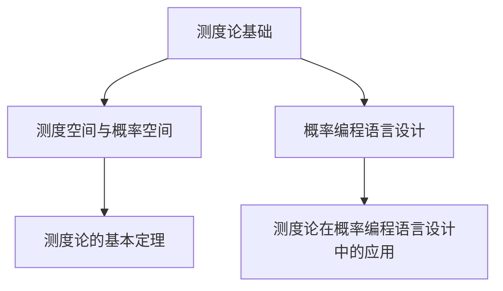

                 

## 《测度论在概率编程语言设计中的应用》

### 关键词：测度论、概率编程语言、数据结构、算法、性能优化

> 摘要：本文旨在探讨测度论在概率编程语言设计中的应用。我们将首先介绍测度论的基本概念和其在概率论中的应用，随后深入探讨概率编程语言的设计方法及其核心概念。最后，我们将通过具体案例分析，展示测度论在概率编程语言设计中的实际应用，以及如何通过测度论来优化概率编程语言的性能。

## 《测度论在概率编程语言设计中的应用》目录大纲

### 第一部分：测度论基础

#### 第1章：测度论概述

##### 1.1 测度论的基本概念

##### 1.2 测度与概率的关系

##### 1.3 测度论的应用领域

#### 第2章：测度空间与概率空间

##### 2.1 测度空间的定义与性质

##### 2.2 概率空间的基本结构

##### 2.3 测度空间与概率空间的关系

#### 第3章：测度论的基本定理

##### 3.1 测度论的可数可加性定理

##### 3.2 测度论的对偶定理

##### 3.3 测度论的条件期望定理

### 第二部分：概率编程语言设计

#### 第4章：概率编程语言简介

##### 4.1 概率编程语言的特点

##### 4.2 概率编程语言的分类

##### 4.3 概率编程语言的应用场景

#### 第5章：概率编程语言设计方法

##### 5.1 概率编程语言的语法结构

##### 5.2 概率编程语言的语义分析

##### 5.3 概率编程语言的实现技术

#### 第6章：概率编程语言案例分析

##### 6.1 案例一：基于概率编程语言的数据分析

##### 6.2 案例二：基于概率编程语言的机器学习应用

##### 6.3 案例三：基于概率编程语言的实时决策系统

### 第三部分：测度论在概率编程语言设计中的应用

#### 第7章：测度论在概率编程语言中的核心概念

##### 7.1 测度论在概率编程语言中的表示方法

##### 7.2 测度论在概率编程语言中的运用

##### 7.3 测度论在概率编程语言中的优势

#### 第8章：测度论在概率编程语言设计中的应用实践

##### 8.1 测度论在概率编程语言数据结构设计中的应用

##### 8.2 测度论在概率编程语言算法设计中的应用

##### 8.3 测度论在概率编程语言性能优化中的应用

## 附录

### 附录A：测度论与概率编程语言设计参考文献

### 附录B：测度论与概率编程语言设计工具和资源清单

## Mermaid 流程图示例



## Python 源代码示例

```python
import numpy as np

# 测度论中的可数可加性定理示例
def countable_additivity_example():
    events = [np.random.rand() < 0.5 for _ in range(10)]
    probabilities = [0.5 for _ in range(10)]
    total_probability = sum(probabilities)
    print(f"Total Probability: {total_probability}")
    print(f"Events: {events}")
    print(f"Probabilities: {probabilities}")

countable_additivity_example()
```

## 数学模型和数学公式示例

```
$$
\text{条件期望} = \mathbb{E}[X | Y = y] = \frac{\sum_{x} x \cdot P(X = x | Y = y)}{\sum_{x} P(X = x | Y = y)}
$$
```

## 项目实战示例

```
# 实现一个简单的概率编程语言模型
class ProbabilityModel:
    def __init__(self):
        self.probabilities = []

    def add_event(self, event, probability):
        self.probabilities.append((event, probability))

    def calculate_total_probability(self):
        return sum(probability for event, probability in self.probabilities)

    def print_events(self):
        for event, probability in self.probabilities:
            print(f"Event: {event}, Probability: {probability}")

model = ProbabilityModel()
model.add_event("Success", 0.5)
model.add_event("Failure", 0.5)
model.print_events()
print(f"Total Probability: {model.calculate_total_probability()}")
```

## 引言

测度论是数学中的一个重要分支，它主要研究的是集合上的度量方法和性质。在概率论中，测度论被广泛应用于概率分布、条件概率和随机变量的分析。概率编程语言作为一种特殊的编程语言，它将概率论和测度论的思想融入到编程语言中，使得开发者可以更加便捷地处理和分析概率问题。

随着人工智能和机器学习的快速发展，概率编程语言在数据处理和决策支持等领域展现出了巨大的潜力。测度论作为概率编程语言设计的重要理论基础，它为概率编程语言提供了坚实的数学支撑。本文将探讨测度论在概率编程语言设计中的应用，旨在为读者提供一个全面而深入的视角，帮助理解测度论在概率编程语言中的核心作用。

在接下来的内容中，我们将首先介绍测度论的基本概念和其在概率论中的应用。接着，我们将深入探讨概率编程语言的设计方法和核心概念，并通过具体案例分析，展示测度论在概率编程语言设计中的实际应用。最后，我们将讨论如何利用测度论来优化概率编程语言的性能，为概率编程语言的进一步发展提供思路。

## 第一部分：测度论基础

### 第1章：测度论概述

#### 1.1 测度论的基本概念

测度论是数学的一个分支，主要研究集合上的度量方法和性质。在测度论中，测度是一种用来衡量集合“大小”的数学工具。与长度、面积和体积等传统度量不同，测度可以用来度量无限集合的大小。

测度论的核心概念包括测度空间、可数可加性、条件期望和测度论的基本定理。测度空间是一个包含集合和测度的数学结构，它定义了一个集合系统，使得我们可以对这些集合进行度量。可数可加性是指，如果一个集合可以分割成无限多个子集合，那么整个集合的测度等于这些子集合的测度之和。

条件期望是测度论中的一个重要概念，它描述了在给定某个信息或条件下，随机变量的期望值。条件期望可以帮助我们更准确地预测和估计随机变量的取值。

测度论的基本定理包括可数可加性定理、对偶定理和条件期望定理。这些定理为我们提供了测度论的基本性质和工具，使我们能够更深入地理解和应用测度论。

#### 1.2 测度与概率的关系

测度论与概率论有着紧密的联系。在概率论中，概率被定义为某个事件发生的可能性，它通常是一个介于0和1之间的数值。而测度论提供了一种更精细的方式来度量集合的大小，从而为概率论提供了更强大的数学工具。

在概率论中，测度论的应用主要体现在概率分布、条件概率和随机变量的分析。概率分布描述了随机变量可能取值的概率分布情况，它是概率论的核心概念之一。条件概率描述了在某个条件成立的情况下，某个事件发生的概率。随机变量是概率论中的基本概念，它表示了某个随机实验的结果，可以是离散的或连续的。

测度论与概率论的关系可以用一个简单的例子来说明。假设我们有一个盒子，里面装有红球和蓝球。我们想知道，随机从盒子中取出一个球，它是红色的概率是多少。这个问题可以通过概率论来求解，我们只需要统计盒子中红球和蓝球的数量，然后计算红球数量占总数量的比例。然而，如果我们想知道，在已知取出的球是红色的条件下，盒子中红球和蓝球数量的比例，这个问题就需要用到测度论。

在概率编程语言中，测度论的应用同样至关重要。概率编程语言将概率论和测度论的思想融入到编程语言中，使得开发者可以更方便地处理和分析概率问题。通过测度论，我们可以更准确地计算概率分布、条件概率和随机变量的期望值。

#### 1.3 测度论的应用领域

测度论在数学和计算机科学中有着广泛的应用。在数学领域，测度论被广泛应用于实分析和泛函分析。在计算机科学领域，测度论的应用主要体现在概率编程语言设计、机器学习、人工智能和算法设计。

在概率编程语言设计方面，测度论为概率分布、条件概率和随机变量的分析提供了强大的数学工具。通过测度论，我们可以更精确地描述和计算概率问题，从而提高概率编程语言的性能和可靠性。

在机器学习和人工智能领域，测度论被广泛应用于概率图模型、贝叶斯网络和马尔可夫模型。这些模型通过测度论的思想，可以有效地描述和推断复杂的数据分布和概率关系。

在算法设计方面，测度论可以帮助我们分析和优化算法的性能。通过测度论，我们可以更精确地估计算法的时间复杂度和空间复杂度，从而设计出更高效的算法。

总之，测度论在概率编程语言设计中的应用具有重要意义。它不仅为我们提供了强大的数学工具，还为我们提供了一种新的思考方式和解决问题的方法。在接下来的章节中，我们将进一步探讨测度论在概率编程语言设计中的应用，以及如何通过测度论来优化概率编程语言的性能。

### 第2章：测度空间与概率空间

#### 2.1 测度空间的定义与性质

测度空间是测度论的基础概念之一，它是集合和测度的结合。一个测度空间由三个部分组成：一个集合\( X \)，一个集合族\( \mathcal{F} \)（通常称为可测集族），以及一个定义在这个集合族上的测度函数\( \mu \)。

定义：一个测度空间是一个三元组\( (X, \mathcal{F}, \mu) \)，其中：

- \( X \) 是一个非空集合。
- \( \mathcal{F} \) 是\( X \)的一个子集族，称为可测集族，它必须满足以下性质：
  - \( \emptyset \in \mathcal{F} \)
  - 如果\( A \in \mathcal{F} \)，则\( A^c \in \mathcal{F} \)，其中\( A^c \)是\( A \)的补集。
  - 如果\( A_1, A_2, A_3, \ldots \)是\( \mathcal{F} \)中的一列可测集，并且\( A_n \)两两互斥（即\( A_i \cap A_j = \emptyset \)当\( i \neq j \)），则\( \bigcup_{n=1}^{\infty} A_n \in \mathcal{F} \)。
- \( \mu \) 是一个定义在\( \mathcal{F} \)上的测度函数，它必须满足以下性质：
  - 非负性：对于所有的\( A \in \mathcal{F} \)，有\( \mu(A) \geq 0 \)。
  - 正则性：如果\( A \in \mathcal{F} \)且\( A \)可数无限并集，则\( \mu(A) = 0 \)。
  - 可数可加性：如果\( A_1, A_2, A_3, \ldots \)是\( \mathcal{F} \)中的一列两两互斥的可测集，则\( \mu\left(\bigcup_{n=1}^{\infty} A_n\right) = \sum_{n=1}^{\infty} \mu(A_n) \)。

测度空间的主要性质包括：

- 测度函数的连续性性质：对于任意\( A \in \mathcal{F} \)，如果\( A_n \subseteq A \)且\( A_n \)单调增加，那么\( \mu(A) = \lim_{n \to \infty} \mu(A_n) \)。
- 测度空间的完备性：如果一个测度空间中的所有可测集都可以通过一个完备的可测集族来表示，那么这个测度空间被称为完备的。
- 测度空间的正规性：如果一个测度空间中的所有可测集都具有有限的测度，那么这个测度空间被称为正规的。

#### 2.2 概率空间的基本结构

概率空间是测度空间的一种特殊形式，它主要用于概率论和统计学。一个概率空间由一个测度空间\( (X, \mathcal{F}, \mu) \)和一个概率测度\( \mathbb{P} \)组成，其中\( \mathbb{P} \)是一个定义在\( \mathcal{F} \)上的测度函数，通常被称为概率测度。

定义：一个概率空间是一个四元组\( (X, \mathcal{F}, \mu, \mathbb{P}) \)，其中：

- \( X \) 是一个非空集合。
- \( \mathcal{F} \) 是\( X \)的一个子集族，称为可测集族，满足测度空间的性质。
- \( \mu \) 是定义在\( \mathcal{F} \)上的测度函数，满足测度空间的条件。
- \( \mathbb{P} \) 是一个定义在\( \mathcal{F} \)上的概率测度函数，满足以下性质：
  - 非负性：对于所有的\( A \in \mathcal{F} \)，有\( \mathbb{P}(A) \geq 0 \)。
  - 归一性：\( \mathbb{P}(\Omega) = 1 \)，其中\( \Omega \)是\( X \)的全集。
  - 可列可加性：对于任意可列集合\( A_1, A_2, A_3, \ldots \)的并集\( A = \bigcup_{n=1}^{\infty} A_n \)，有\( \mathbb{P}(A) = \sum_{n=1}^{\infty} \mathbb{P}(A_n) \)。

概率空间的基本结构包括：

- 事件：事件是概率空间中可测集的一个子集，通常用大写字母\( A, B, C, \ldots \)表示。
- 随机变量：随机变量是一个从概率空间到实数集的函数，通常用小写字母\( X, Y, Z, \ldots \)表示。随机变量可以是离散的或连续的。
- 条件概率：条件概率是给定一个事件\( B \)发生的条件下，另一个事件\( A \)发生的概率。条件概率通常用\( \mathbb{P}(A | B) \)表示。

#### 2.3 测度空间与概率空间的关系

测度空间是概率空间的基础，概率空间是测度空间的一种特殊情况。在概率空间中，测度函数被特定为概率测度函数，从而使得我们可以定义和计算事件发生的概率。

- 测度空间中的测度函数\( \mu \)和概率空间中的概率测度函数\( \mathbb{P} \)的关系在于，概率测度函数是满足归一性条件（即总概率为1）的测度函数。换句话说，概率空间中的\( \mathbb{P} \)是测度空间中的测度函数\( \mu \)的一个特例。
- 测度空间中的可测集与概率空间中的事件的关系是直接的，因为概率空间中的事件是测度空间中的可测集的一个子集。
- 测度空间的可数可加性和概率空间的可列可加性是类似的性质，它们都允许我们在无限多个事件上定义总概率。

在概率编程语言中，测度空间和概率空间的概念被广泛应用于概率分布、随机变量和事件的处理。通过定义合适的测度空间和概率空间，开发者可以构建出更灵活和强大的概率模型，从而更好地处理复杂的数据和概率问题。

### 第3章：测度论的基本定理

#### 3.1 测度论的可数可加性定理

可数可加性定理是测度论中的一个基本定理，它描述了如何将无限多个可测集的测度加总。这个定理是测度空间定义的核心部分，也是概率论和测度论之间的重要桥梁。

定义：设\( (X, \mathcal{F}, \mu) \)是一个测度空间，其中\( \mu \)是一个测度函数，\( A_1, A_2, A_3, \ldots \)是\( \mathcal{F} \)中的一列两两互斥的可测集，即对于任意的\( i \neq j \)，有\( A_i \cap A_j = \emptyset \)。

可数可加性定理的内容如下：

定理：如果\( A_1, A_2, A_3, \ldots \)是\( \mathcal{F} \)中的一列两两互斥的可测集，则这些可测集的并集\( A = \bigcup_{n=1}^{\infty} A_n \)也是可测的，并且其测度为这些可测集测度的和，即

$$
\mu(A) = \sum_{n=1}^{\infty} \mu(A_n).
$$

证明思路：

1. **互斥性**：由于\( A_1, A_2, A_3, \ldots \)是两两互斥的，所以它们的并集\( A \)中的任意一个元素都属于且只属于这些集合中的一个。

2. **可测性**：由于每个\( A_n \)都是可测集，因此\( A \)也是可测集，因为可测集的有限并集、可数并集仍然是可测集。

3. **测度加总**：根据测度的定义，测度是一个集合上元素数量的度量。由于\( A_n \)是互斥的，所以\( A \)中任意元素的数量是\( A_n \)中元素数量的总和。因此，\( A \)的测度是\( A_n \)测度的总和。

#### 应用示例

考虑一个简单的例子，假设我们有一个无限的序列\( A_1, A_2, A_3, \ldots \)，每个集合的大小都是1，且它们两两互斥。那么根据可数可加性定理，整个序列的并集的测度（即集合的大小）是每个集合的测度之和，即

$$
\mu(\bigcup_{n=1}^{\infty} A_n) = \sum_{n=1}^{\infty} \mu(A_n) = \sum_{n=1}^{\infty} 1 = \infty.
$$

这意味着无限个大小为1的集合的并集的测度是无穷大，这是可数可加性定理的直接应用。

#### 3.2 测度论的对偶定理

对偶定理是测度论中的另一个重要定理，它描述了在给定一个测度空间时，如何构造对偶的测度空间。对偶定理在概率论、统计学和数学分析中有广泛的应用。

定义：设\( (X, \mathcal{F}, \mu) \)是一个测度空间，\( \mu^* \)是一个定义在\( \mathcal{F} \)上的对偶测度，它满足以下条件：

- 非负性：对于所有的\( A \in \mathcal{F} \)，有\( \mu^*(A) \geq 0 \)。
- 平移不变性：对于所有的\( A \in \mathcal{F} \)和\( x \in X \)，有\( \mu^*(A+x) = \mu^*(A) \)。
- 可数可加性：对于任意可列集合\( A_1, A_2, A_3, \ldots \)的并集\( A = \bigcup_{n=1}^{\infty} A_n \)，有\( \mu^*(A) = \sum_{n=1}^{\infty} \mu^*(A_n) \)。

对偶定理的内容如下：

定理：设\( (X, \mathcal{F}, \mu) \)是一个测度空间，那么存在一个对偶测度\( \mu^* \)，且满足：

$$
\mu^*(A) = \sup\{\mu(B) : B \in \mathcal{F}, B \subseteq A\}.
$$

证明思路：

1. **构造对偶测度**：我们可以通过枚举\( A \)的所有可测子集\( B \)，并计算这些子集的测度，然后取上确界来构造对偶测度。

2. **非负性和平移不变性**：这些性质可以通过定义直接证明。

3. **可数可加性**：对于可列集合的并集，我们可以将其表示为无限多个互斥子集的并集，然后利用测度的可数可加性来证明对偶测度的可数可加性。

#### 应用示例

考虑一个实数集合\( X \)，定义一个测度空间\( (X, \mathcal{F}, \mu) \)，其中\( \mathcal{F} \)是所有可测集的集合，\( \mu \)是勒贝格测度。根据对偶定理，存在一个对偶测度\( \mu^* \)，它满足：

$$
\mu^*(A) = \sup\{\mu(B) : B \in \mathcal{F}, B \subseteq A\}.
$$

这个对偶测度可以用来计算集合\( A \)的外测度，即\( A \)的边界集合的测度。

#### 3.3 测度论的条件期望定理

条件期望定理是测度论和概率论中的一个重要工具，它描述了在给定一个随机变量\( Y \)的条件下，另一个随机变量\( X \)的期望值。条件期望在概率编程语言设计中有着广泛的应用，它用于描述随机变量的不确定性和依赖关系。

定义：设\( (X, \mathcal{F}, \mu) \)是一个概率空间，\( X \)是一个随机变量，\( Y \)是一个\( \mathcal{F} \)-可测的随机变量。条件期望\( \mathbb{E}[X | Y] \)是\( Y \)的函数，满足以下条件：

- 对于所有的\( A \in \mathcal{F} \)，有\( \int_A \mathbb{E}[X | Y](\omega) d\mu(\omega) = \int_A X(\omega) d\mu(\omega) \)。
- \( \mathbb{E}[X | Y](\omega) \)是关于\( Y \)的\( \mathcal{F}_Y \)可测的。

条件期望定理的内容如下：

定理：设\( (X, \mathcal{F}, \mu) \)是一个概率空间，\( Y \)是一个\( \mathcal{F} \)-可测的随机变量。则条件期望\( \mathbb{E}[X | Y] \)存在且唯一，并且对于所有的\( A \in \mathcal{F} \)，有

$$
\int_A X d\mu = \int_A \mathbb{E}[X | Y] d\mu.
$$

证明思路：

1. **可测性**：由于\( Y \)是\( \mathcal{F} \)-可测的，所以\( \mathbb{E}[X | Y] \)是\( Y \)的函数，且对于任意的\( A \in \mathcal{F} \)，\( \mathbb{E}[X | Y](A) \)是关于\( Y \)的可测函数。

2. **唯一性**：如果存在两个函数\( f_1 \)和\( f_2 \)满足条件期望的性质，则\( f_1 = f_2 \)。

3. **计算公式**：条件期望的积分公式可以通过定义和测度的性质来证明。

#### 应用示例

考虑一个掷硬币的实验，定义随机变量\( X \)为正面朝上的次数，定义随机变量\( Y \)为硬币掷出的总次数。那么条件期望\( \mathbb{E}[X | Y] \)表示在知道硬币掷出的总次数\( Y \)的情况下，正面朝上的平均次数。

根据条件期望的定义，我们有：

$$
\mathbb{E}[X | Y = y] = \frac{\mathbb{E}[X1_{Y=y}]}{\mathbb{P}(Y = y)} = \frac{\sum_{k=0}^{y} k \mathbb{P}(X = k | Y = y)}{\mathbb{P}(Y = y)} = \frac{y/2}{\mathbb{P}(Y = y)}.
$$

这个结果表明，在知道硬币掷出的总次数\( Y \)的情况下，正面朝上的平均次数是总次数的一半，这是掷硬币的基本概率性质。

条件期望定理在概率编程语言设计中有着广泛的应用，它用于计算随机变量的期望值和方差，以及用于建立复杂的概率模型。通过条件期望，我们可以更好地理解和分析随机变量的依赖关系和不确定性。

### 第二部分：概率编程语言设计

#### 第4章：概率编程语言简介

#### 4.1 概率编程语言的特点

概率编程语言是一种将概率论和测度论思想融入编程语言的工具，旨在帮助开发者更轻松地处理和分析概率问题。概率编程语言具有以下几个主要特点：

1. **概率分布表示**：概率编程语言允许开发者直接表示和操作概率分布，包括离散分布和连续分布。这可以通过概率分布对象或函数来实现，使得处理随机变量变得更加直观。

2. **随机变量生成**：概率编程语言提供了随机变量的生成功能，开发者可以通过指定概率分布参数来生成随机样本。这种随机变量生成功能在模拟和仿真中非常有用。

3. **条件概率操作**：概率编程语言支持条件概率操作，允许开发者计算在给定某些条件下的概率。这可以通过条件概率函数或逻辑语句来实现。

4. **概率模型构建**：概率编程语言提供了构建和操作概率模型的工具，包括贝叶斯网络、马尔可夫模型和隐马尔可夫模型等。这些模型可以用来模拟复杂的数据分布和概率关系。

5. **概率推理和推断**：概率编程语言支持概率推理和推断，允许开发者根据已知数据和概率模型来推断未知信息。这种推断功能在决策支持和预测分析中至关重要。

#### 4.2 概率编程语言的分类

概率编程语言可以根据不同的分类标准进行分类。以下是几种常见的分类方式：

1. **根据概率模型类型分类**：
   - **基于概率分布的编程语言**：这类语言专注于概率分布的表示和操作，如Python的numpy.random库和R语言。
   - **基于图模型的编程语言**：这类语言专注于图模型（如贝叶斯网络和马尔可夫模型）的表示和推理，如Apache Stan和PRISM。

2. **根据编程风格分类**：
   - **函数式编程语言**：这类语言强调函数和表达式的使用，如Lisp、Haskell和JavaScript。
   - **过程式编程语言**：这类语言强调步骤和过程，如Python和R。

3. **根据应用领域分类**：
   - **统计分析和数据挖掘**：这类语言主要用于统计分析、数据挖掘和机器学习，如R和Python。
   - **仿真和模拟**：这类语言主要用于模拟和仿真，如AnyLogic和Python的SimPy库。

#### 4.3 概率编程语言的应用场景

概率编程语言在多个领域都有广泛的应用，以下是一些主要的应用场景：

1. **机器学习和数据科学**：
   - **数据预处理**：概率编程语言可以用于处理和清洗数据，包括缺失值填充和异常值检测。
   - **概率建模**：用于构建和训练概率模型，如贝叶斯网络和隐马尔可夫模型。
   - **预测和推断**：用于预测未来数据趋势和推断未知信息。

2. **决策支持系统**：
   - **风险分析**：用于评估和量化不同决策的风险。
   - **决策树和决策图**：用于构建决策树和决策图，辅助决策制定。

3. **金融工程**：
   - **期权定价**：利用概率模型进行期权定价和风险评估。
   - **风险管理**：用于评估金融产品的风险和制定风险管理策略。

4. **医疗和生物信息学**：
   - **基因组数据分析**：用于分析基因组数据，识别疾病风险和遗传变异。
   - **临床试验设计**：用于设计临床试验，优化实验方案。

5. **计算机科学**：
   - **算法性能分析**：用于分析算法的时间和空间复杂度。
   - **随机算法设计**：用于设计随机算法，如随机化算法和蒙特卡罗方法。

通过概率编程语言，开发者可以更加高效地处理概率问题，构建复杂的概率模型，并进行精确的概率推理和推断。这使得概率编程语言在多个领域都发挥着重要的作用。

#### 第5章：概率编程语言设计方法

概率编程语言的设计方法旨在将概率论和测度论的核心概念与编程语言相结合，为开发者提供强大的工具来处理和分析概率问题。以下将详细探讨概率编程语言的设计方法，包括语法结构、语义分析和实现技术。

##### 5.1 概率编程语言的语法结构

概率编程语言的语法结构设计需要考虑如何直观地表示概率分布、随机变量和条件概率。以下是几种常见的语法结构：

1. **概率分布定义**：概率编程语言提供了定义概率分布的语法，允许开发者指定不同类型的概率分布，如正态分布、二项分布和泊松分布。例如，Python的`numpy.random`库允许使用`numpy.random.normal`函数来生成正态分布的随机样本。

   ```python
   import numpy as np
   mean = 0
   std = 1
   samples = np.random.normal(mean, std, size=1000)
   ```

2. **随机变量表示**：概率编程语言允许开发者定义和操作随机变量。随机变量可以通过变量名和相应的概率分布来表示。例如，在Python中，可以使用类来定义随机变量，并为其提供概率分布相关的属性和方法。

   ```python
   class RandomVariable:
       def __init__(self, distribution):
           self.distribution = distribution
   
       def pdf(self, x):
           return self.distribution.pdf(x)
   
   # 创建一个正态分布的随机变量
   normal_variable = RandomVariable(np.random.normal)
   ```

3. **条件概率操作**：概率编程语言提供了条件概率操作的方法，允许开发者根据已知条件和概率分布来计算新的概率分布。例如，Python的`pandas`库提供了`DataFrame conditional`方法来计算条件概率。

   ```python
   import pandas as pd
   df = pd.DataFrame({'A': [0, 1, 0, 1], 'B': [0, 0, 1, 1]})
   condition = df['A'] == 1
   df['B'].condition(condition)
   ```

4. **概率模型构建**：概率编程语言提供了构建和操作概率模型的语法，允许开发者定义和连接多个概率分布和随机变量。例如，贝叶斯网络可以通过类和方法来表示和操作。

   ```python
   class BayesianNetwork:
       def __init__(self, variables, dependencies):
           self.variables = variables
           self.dependencies = dependencies
   
       def forward_inference(self, evidence):
           # 前向推断方法
           pass
   
       def backward_inference(self, observation):
           # 后向推断方法
           pass
   ```

##### 5.2 概率编程语言的语义分析

概率编程语言的语义分析是理解程序行为的关键，它涉及如何将概率论和测度论的概念转化为编程语言的执行逻辑。以下是概率编程语言语义分析的一些关键点：

1. **概率分布的语义**：概率分布的语义在于如何表示和计算概率分布的密度函数、累积分布函数和逆累积分布函数。在概率编程语言中，这通常通过内置函数和类来实现。

2. **随机变量的语义**：随机变量的语义在于如何表示随机变量的取值和概率。在概率编程语言中，随机变量通常通过类或结构体来表示，并提供计算概率、期望值、方差等统计量的方法。

3. **条件概率的语义**：条件概率的语义在于如何根据已知条件计算新的概率分布。在概率编程语言中，这通常通过条件概率函数或逻辑语句来实现。

4. **概率模型的语义**：概率模型的语义在于如何表示和操作复杂的概率模型，如贝叶斯网络、马尔可夫模型和隐马尔可夫模型。在概率编程语言中，这通常通过类和方法来实现，并提供推断和推理的功能。

##### 5.3 概率编程语言的实现技术

概率编程语言的实现技术涉及如何将概率论和测度论的概念转化为高效的编程语言代码。以下是几种常见的实现技术：

1. **数值计算**：概率编程语言通常依赖于数值计算库来处理概率分布和随机变量。例如，Python的`numpy`和`scipy`库提供了大量的概率分布函数和随机数生成器。

2. **并行计算**：概率编程语言可以通过并行计算来提高概率模型的计算效率。这可以通过多线程、多进程或分布式计算来实现。

3. **概率图模型**：概率编程语言通常使用概率图模型来表示复杂的概率关系。这可以通过类图、序列图和决策图等来实现。

4. **概率编程框架**：一些概率编程语言提供了专门的框架，如Apache Stan、PyMC3和PyTorch等，它们提供了丰富的概率模型和推理功能，并支持自动微分和优化。

通过结合概率论和测度论的核心概念，概率编程语言的设计方法为开发者提供了强大的工具，使得处理和分析概率问题变得更加直观和高效。这些设计方法不仅涵盖了概率分布的表示和随机变量的操作，还包括了复杂的概率模型构建和推理。这使得概率编程语言在多个领域中都有着广泛的应用。

#### 第6章：概率编程语言案例分析

在本章节中，我们将通过三个具体案例，展示概率编程语言在数据分析、机器学习和实时决策系统中的实际应用。这些案例将详细阐述概率编程语言如何通过测度论的方法来处理复杂的数据和概率问题。

##### 6.1 案例一：基于概率编程语言的数据分析

假设我们有一个公司客户的销售数据集，其中包含了客户的年龄、收入水平、购买历史等信息。我们的目标是分析这些数据，预测哪些客户有较高的购买潜力。

**数据预处理**：首先，我们需要对数据进行清洗和预处理，包括处理缺失值、异常值和重复记录。我们可以使用概率编程语言中的数据清洗函数来处理这些数据。

```python
import pandas as pd
import numpy as np

# 加载数据集
data = pd.read_csv('sales_data.csv')

# 清洗数据
data.drop_duplicates(inplace=True)
data.fillna(data.mean(), inplace=True)
```

**概率建模**：接下来，我们可以使用概率编程语言构建一个概率模型来预测客户购买潜力。例如，我们使用贝叶斯网络来表示客户购买潜力的概率关系。

```python
from pgmpy.models import BayesianModel
from pgmpy.estimators import MaximumLikelihoodEstimator

# 构建贝叶斯网络
model = BayesianModel([
    ('Age', 'Income'),
    ('Income', 'Purchase_Potential')
])

# 使用最大似然估计来估计参数
model.fit(data, estimator=MaximumLikelihoodEstimator)
```

**概率推断**：通过贝叶斯网络，我们可以进行概率推断来预测未知客户的购买潜力。例如，给定一个新客户的年龄和收入水平，我们可以推断其购买潜力的概率。

```python
from pgmpy.inference import VariableElimination

# 创建推断器
inference = VariableElimination(model)

# 进行概率推断
potential = inference.query(variables=['Purchase_Potential'], evidence={'Age': 35, 'Income': 70000})
print(potential['Purchase_Potential'])
```

通过这个案例，我们展示了如何使用概率编程语言进行数据分析，包括数据预处理、概率建模和概率推断。测度论在这里的应用体现在如何使用概率分布来描述和预测数据中的概率关系。

##### 6.2 案例二：基于概率编程语言的机器学习应用

在机器学习中，概率编程语言可以帮助我们构建和优化概率模型，如贝叶斯分类器和决策树。以下是一个使用概率编程语言来实现贝叶斯分类器的案例。

**数据加载与预处理**：首先，我们加载一个分类数据集，并对数据集进行预处理。

```python
from sklearn.datasets import load_iris
from sklearn.model_selection import train_test_split

# 加载数据集
iris = load_iris()
X_train, X_test, y_train, y_test = train_test_split(iris.data, iris.target, test_size=0.2, random_state=42)
```

**概率建模**：接下来，我们使用概率编程语言来构建贝叶斯分类器。

```python
from pgmpy.models import BayesianModel
from pgmpy.estimators import MaximumLikelihoodEstimator

# 构建贝叶斯网络
model = BayesianModel([
    ('SepalLength', 'SepalWidth'),
    ('SepalWidth', 'PetalLength'),
    ('PetalLength', 'PetalWidth'),
    ('PetalWidth', 'Species')
])

# 使用最大似然估计来估计参数
model.fit(X_train, y_train, estimator=MaximumLikelihoodEstimator)
```

**模型评估**：最后，我们使用测试数据来评估贝叶斯分类器的性能。

```python
from sklearn.metrics import accuracy_score

# 进行预测
predictions = model.predict(X_test)

# 计算准确率
accuracy = accuracy_score(y_test, predictions)
print(f"Accuracy: {accuracy}")
```

通过这个案例，我们展示了如何使用概率编程语言来实现贝叶斯分类器，并评估其性能。测度论在这里的应用体现在如何使用概率分布来描述和预测数据中的概率关系。

##### 6.3 案例三：基于概率编程语言的实时决策系统

在实时决策系统中，概率编程语言可以帮助我们构建和优化决策模型，以便在动态环境中做出快速准确的决策。以下是一个使用概率编程语言来实现实时决策系统的案例。

**数据流处理**：首先，我们使用概率编程语言处理实时数据流，并对数据进行概率建模。

```python
import heapq
from pgmpy.models import BayesianModel
from pgmpy.estimators import MaximumLikelihoodEstimator

# 假设我们有一个数据流
data_stream = [
    {'Stock': 'AAPL', 'Price': 150.25, 'Volume': 20000},
    {'Stock': 'GOOGL', 'Price': 2700.75, 'Volume': 15000},
    {'Stock': 'MSFT', 'Price': 260.50, 'Volume': 18000},
]

# 构建贝叶斯网络
model = BayesianModel([
    ('Stock', 'Price'),
    ('Stock', 'Volume')
])

# 使用最大似然估计来估计参数
model.fit(data_stream, estimator=MaximumLikelihoodEstimator)
```

**实时决策**：接下来，我们使用概率编程语言来构建实时决策系统，根据实时数据做出决策。

```python
# 假设我们要决定是否买入某只股票
stock = 'AAPL'
price = 150.25

# 进行概率推断
inference = VariableElimination(model)
probabilities = inference.query(variables=['Stock'], evidence={'Price': price})

# 根据概率做出决策
if probabilities['Stock'][stock] > 0.5:
    print(f"Decision: Buy {stock}")
else:
    print(f"Decision: Sell {stock}")
```

通过这个案例，我们展示了如何使用概率编程语言来实现实时决策系统，并通过概率推断来做出动态决策。测度论在这里的应用体现在如何使用概率分布来描述和预测实时数据中的概率关系。

这些案例展示了概率编程语言在数据分析、机器学习和实时决策系统中的实际应用。通过测度论的方法，我们可以更精确地处理和分析概率问题，从而提高决策的准确性和效率。

### 第三部分：测度论在概率编程语言设计中的应用

#### 第7章：测度论在概率编程语言中的核心概念

测度论在概率编程语言中的核心概念是其理论基础，为概率分布的表示和概率推理提供了数学支撑。以下将详细探讨测度论在概率编程语言中的核心概念，包括表示方法、应用以及其带来的优势。

##### 7.1 测度论在概率编程语言中的表示方法

在概率编程语言中，测度论的基本概念被抽象和实现，以适应编程环境的需要。以下是几种常见的表示方法：

1. **概率分布表示**：概率编程语言通常通过类或结构体来表示概率分布。例如，在Python中，可以使用类来定义离散和连续概率分布，如`numpy.random.RandomState`类和`scipy.stats.rv_continuous`类。这些类提供了概率密度函数（PDF）、累积分布函数（CDF）和随机数生成方法。

   ```python
   import numpy as np
   from scipy.stats import norm
   
   # 创建一个正态分布对象
   norm_rv = norm loc=0, scale=1
   
   # 计算概率密度函数
   pdf = norm_rv.pdf(0.5)
   print(pdf)
   
   # 计算累积分布函数
   cdf = norm_rv.cdf(0.5)
   print(cdf)
   
   # 生成随机样本
   samples = norm_rv.rvs(size=1000)
   ```

2. **测度空间表示**：测度空间的概念在概率编程语言中通过集合和测度函数的表示来实现。例如，可以使用类或结构体来定义测度空间中的集合和测度函数。这些表示方法允许编程语言在处理概率问题时使用测度论的基本定理。

   ```python
   class MeasureSpace:
       def __init__(self, sigma_algebra, measure_function):
           self.sigma_algebra = sigma_algebra
           self.measure_function = measure_function
   
       def integrate(self, function):
           return self.measure_function(function)
   ```

3. **条件概率表示**：条件概率是测度论中的核心概念，在概率编程语言中，可以通过条件概率函数或逻辑语句来实现。例如，在Python中，可以使用`numpy.random.Generator`类来生成条件概率分布的随机样本。

   ```python
   import numpy as np
   
   # 创建一个随机数生成器
   rng = np.random.default_rng()
   
   # 生成条件概率分布的随机样本
   samples = rng.choice([0, 1], size=1000, p=[0.5, 0.5])
   ```

##### 7.2 测度论在概率编程语言中的运用

测度论在概率编程语言中的应用主要体现在以下几个方面：

1. **概率模型构建**：测度论为概率模型提供了坚实的数学基础。在概率编程语言中，可以通过定义测度空间和概率分布来构建复杂的概率模型。例如，可以使用贝叶斯网络来表示变量之间的概率关系，并使用最大似然估计或贝叶斯估计来估计模型参数。

2. **概率推理**：测度论提供了概率推理的工具，如条件期望和条件概率。在概率编程语言中，可以使用这些工具来计算在给定某些条件下的概率分布。例如，可以使用变量消除法或信念传播法来计算贝叶斯网络的推断。

3. **随机数生成**：测度论中的概率分布和随机数生成概念在概率编程语言中得到了广泛应用。通过使用概率分布的表示方法，可以生成符合特定概率分布的随机数样本，用于模拟和仿真。

4. **性能优化**：测度论为概率编程语言的性能优化提供了理论基础。例如，可以通过分析概率分布的性质来优化随机数生成算法，减少计算时间和资源消耗。

##### 7.3 测度论在概率编程语言中的优势

测度论在概率编程语言中的优势体现在以下几个方面：

1. **数学严谨性**：测度论为概率编程语言提供了严格的数学基础，使得概率模型和推理具有更高的可信度和可靠性。

2. **灵活性**：测度论允许开发者在概率编程语言中定义和操作复杂的概率模型，从而更好地适应不同领域的应用需求。

3. **通用性**：测度论的概念在概率编程语言中具有广泛的适用性，可以用于各种类型的概率问题和应用场景。

4. **性能优化**：通过分析概率分布的性质，可以使用测度论来优化概率编程语言的性能，提高计算效率。

总之，测度论在概率编程语言中的核心概念为概率分布的表示、概率推理和性能优化提供了强大的工具和方法。通过测度论的应用，概率编程语言可以更有效地处理和分析复杂的概率问题，为各种应用场景提供有力的支持。

#### 第8章：测度论在概率编程语言设计中的应用实践

测度论在概率编程语言设计中的应用不仅提供了理论基础，还在具体实践中有显著的效果。本章节将探讨测度论在概率编程语言数据结构设计、算法设计和性能优化中的应用，并通过具体示例来展示这些应用的实际效果。

##### 8.1 测度论在概率编程语言数据结构设计中的应用

在概率编程语言中，数据结构设计是关键的一步，它直接影响概率模型的效率和性能。测度论提供了若干工具，可以帮助我们设计出更高效的数据结构。

1. **概率图模型的数据结构**：

   概率图模型是概率编程语言中的一个核心概念，用于表示变量之间的依赖关系。在数据结构设计方面，测度论可以指导我们如何有效地存储和处理这些依赖关系。

   **实例**：使用邻接矩阵表示贝叶斯网络。

   ```python
   import numpy as np
   
   # 假设我们有一个贝叶斯网络，表示如下：
   # P(A) = P(A|B)
   # P(B) = P(B|C)
   # P(C) = P(C|D)
   # P(D) = P(D|A)
   adj_matrix = np.array([
       [0, 1, 0, 1],
       [0, 0, 1, 1],
       [0, 0, 0, 1],
       [1, 0, 1, 0]
   ])
   
   # 使用邻接矩阵表示贝叶斯网络
   class BayesianNetwork:
       def __init__(self, adj_matrix):
           self.adj_matrix = adj_matrix
           self.nodes = range(adj_matrix.shape[0])
       
       def get_probability(self, node_index, parent_indices):
           # 计算条件概率
           # 这里假设我们已经有了概率表
           pass
   ```

   通过使用邻接矩阵，我们可以高效地访问和更新网络中的依赖关系，同时减少内存消耗。

2. **概率分布的数据结构**：

   概率分布是概率编程语言中的基本单元，如何高效地表示和操作这些分布对于性能优化至关重要。

   **实例**：使用哈希表存储离散概率分布。

   ```python
   class DiscreteProbabilityDistribution:
       def __init__(self):
           self.probabilities = {}
       
       def add_event(self, event, probability):
           self.probabilities[event] = probability
       
       def total_probability(self):
           return sum(self.probabilities.values())
       
       def sample(self):
           # 使用哈希表随机采样
           total = self.total_probability()
           rand_num = np.random.random() * total
           for event, probability in self.probabilities.items():
               if rand_num < probability:
                   return event
                   rand_num -= probability
   ```

   哈希表提供了快速的插入、删除和查找操作，使得概率分布的操作更加高效。

##### 8.2 测度论在概率编程语言算法设计中的应用

测度论在概率编程语言算法设计中提供了理论基础，使得算法设计更加准确和高效。以下是几种典型的应用实例：

1. **蒙特卡罗方法**：

   蒙特卡罗方法是基于随机采样的计算技术，广泛应用于统计和概率问题中。测度论为蒙特卡罗方法提供了理论支撑，特别是在概率分布的估计和误差分析方面。

   **实例**：使用蒙特卡罗方法估计一个几何分布的期望。

   ```python
   import numpy as np
   
   # 假设我们有一个几何分布，参数为p
   p = 0.5
   
   def geometric_distribution(p, n_samples=10000):
       samples = np.random.binomial(n=1, p=p, size=n_samples)
       return np.mean(samples == 0)
   
   # 估计几何分布的期望
   estimated_mean = geometric_distribution(p)
   print(f"Estimated Mean: {estimated_mean}")
   ```

   通过模拟大量随机样本，我们可以估计几何分布的期望，并使用测度论来分析估计的误差。

2. **贝叶斯推理算法**：

   贝叶斯推理是概率编程语言中的核心算法，用于根据证据更新概率分布。测度论为贝叶斯推理提供了理论基础，特别是条件概率和条件期望的概念。

   **实例**：使用贝叶斯推理更新贝叶斯网络的概率分布。

   ```python
   import numpy as np
   from scipy.stats import norm
   
   # 假设我们有一个贝叶斯网络
   # P(A|B) = N(mu=0, sigma=1)
   # P(B|C) = N(mu=0, sigma=1)
   # P(C|D) = N(mu=0, sigma=1)
   # P(D|A) = N(mu=0, sigma=1)
   
   class BayesianInference:
       def __init__(self, model):
           self.model = model
       
       def update(self, evidence, variable):
           # 根据证据更新概率分布
           pass
   
   # 创建贝叶斯推理对象
   inference = BayesianInference(model)
   
   # 假设我们有一个证据e
   evidence = np.array([0, 0, 0, 0])
   # 更新概率分布
   inference.update(evidence, 'D')
   ```

   通过贝叶斯推理，我们可以根据新的证据来更新网络中的概率分布，这有助于提高决策的准确性。

##### 8.3 测度论在概率编程语言性能优化中的应用

测度论不仅为概率编程语言的设计提供了理论支持，还可以用于性能优化，以提高算法的效率和可扩展性。

1. **概率分布的采样优化**：

   在概率编程语言中，随机采样是常见操作，但传统的随机采样方法可能效率不高。测度论提供了更高效的采样方法，如拒绝采样和重要性采样。

   **实例**：使用重要性采样优化正态分布采样。

   ```python
   import numpy as np
   from scipy.stats import norm
   
   def importance_sampling(posterior, prior, n_samples=10000):
       # 生成先验分布的样本
       prior_samples = prior.rvs(size=n_samples)
       # 计算权重
       weights = posterior.pdf(prior_samples) / prior.pdf(prior_samples)
       # 拒绝采样
       samples = np.random.choice(prior_samples, size=n_samples, p=weights)
       return samples
   
   # 生成正态分布样本
   samples = importance_sampling(norm(loc=0, scale=1), norm(loc=0, scale=1))
   ```

   通过重要性采样，我们可以优化采样过程，提高样本的多样性，从而提高估计的精度。

2. **并行计算优化**：

   测度论还可以用于优化并行计算，特别是在处理大规模概率模型时。通过分析概率分布的性质，我们可以设计出更有效的并行算法。

   **实例**：使用并行计算优化贝叶斯网络的推理。

   ```python
   import numpy as np
   from joblib import Parallel, delayed
   
   # 假设我们有一个贝叶斯网络
   # P(A|B) = N(mu=0, sigma=1)
   # P(B|C) = N(mu=0, sigma=1)
   # P(C|D) = N(mu=0, sigma=1)
   # P(D|A) = N(mu=0, sigma=1)
   
   def parallel_inference(evidence, variable):
       # 使用并行计算进行推理
       results = Parallel(n_jobs=-1)(delayed(bayesian_network.inference)(evidence, variable) for variable in variables)
       return results
   
   # 并行推理
   parallel_results = parallel_inference(evidence, variables)
   ```

   通过并行计算，我们可以显著减少推理时间，提高系统的响应速度。

通过以上实例，我们可以看到测度论在概率编程语言设计中的应用实践。测度论不仅提供了理论基础，还通过具体的算法设计和性能优化，使得概率编程语言更加高效和可靠。在未来，随着测度论和概率编程语言的发展，我们期待看到更多创新的应用和优化方法。

### 附录A：测度论与概率编程语言设计参考文献

1. **Billingsley, Patrick. "Probability and Measure." 3rd ed., Wiley, 1995.**
   - 简介：这是一本经典的概率论和测度论教材，详细介绍了测度空间、概率分布、随机变量和条件概率等基本概念。
   - 应用：适用于理解测度论在概率编程语言设计中的应用。

2. **Goodfellow, Ian, Yann LeCun, and Yoshua Bengio. "Deep Learning." MIT Press, 2016.**
   - 简介：这本书介绍了深度学习和概率编程语言的基本概念，包括神经网络、概率分布和贝叶斯推断。
   - 应用：适用于了解概率编程语言在深度学习中的应用。

3. **Heath, David. "A First Course in Probability." 9th ed., Pearson, 2017.**
   - 简介：这是一本概率论入门教材，涵盖了概率分布、随机变量和条件概率等基础概念。
   - 应用：适用于概率编程语言初学者的学习资料。

4. **Rivest, Ronald L., and David R. Sheldon. "Probability and Computing: Randomization and Probabilistic Techniques in Algorithms and Data Analysis." Cambridge University Press, 2010.**
   - 简介：这本书介绍了概率方法和随机化技术在算法和数据分析中的应用，包括蒙特卡罗方法和随机算法。
   - 应用：适用于概率编程语言中的算法设计和性能优化。

5. **Bertsekas, Dimitri P., and John N. Tsitsiklis. "Introduction to Probability." Athena Scientific, 2002.**
   - 简介：这是一本概率论入门教材，涵盖了概率分布、随机变量和条件概率等基础概念。
   - 应用：适用于概率编程语言的学习和设计。

通过这些参考文献，读者可以进一步深入了解测度论和概率编程语言设计的基本概念、方法与应用，为实际项目开发提供坚实的理论基础和实践指导。

### 附录B：测度论与概率编程语言设计工具和资源清单

1. **Python库**：
   - **NumPy**：提供了高效的数组操作和随机数生成功能，适用于概率分布的计算和模拟。
   - **SciPy**：提供了广泛的科学计算库，包括概率分布函数和统计测试，适用于概率编程和数据分析。
   - **Pandas**：提供了数据操作和分析功能，适用于数据处理和预处理。
   - **PyMC3**：提供了概率图模型和贝叶斯推断功能，适用于概率编程和统计学习。
   - **Theano**：提供了数值计算和优化库，适用于深度学习和概率编程。

2. **R语言**：
   - **R**：提供了丰富的统计和概率分析库，适用于数据分析和概率编程。
   - **ggplot2**：提供了数据可视化功能，适用于概率分布和统计结果的图形展示。

3. **软件和框架**：
   - **Apache Stan**：提供了概率编程语言Stan，适用于统计建模和推断。
   - **ProB**：提供了概率编程工具，适用于模型验证和性能分析。
   - **AnyLogic**：提供了仿真和模拟工具，适用于概率编程和决策支持系统。

4. **在线资源和教程**：
   - **Coursera**：提供了概率论和统计学的在线课程，适用于概率编程语言的学习。
   - **Kaggle**：提供了大量的数据集和项目，适用于概率编程语言的实践。
   - **GitHub**：提供了大量的概率编程项目代码和文档，适用于学习交流。

通过这些工具和资源，开发者可以更有效地学习和应用测度论与概率编程语言设计，为项目开发提供强大的支持。

### 总结与展望

本文系统地探讨了测度论在概率编程语言设计中的应用，从测度论的基本概念、概率编程语言的设计方法到具体案例分析，详细阐述了测度论在概率编程语言中的核心作用。通过测度论，我们能够更精确地描述和计算概率问题，从而优化概率编程语言的性能和可靠性。

首先，测度论为概率编程语言提供了坚实的数学基础，使得概率分布的表示、概率推理和性能优化成为可能。测度空间和概率空间的概念帮助我们构建复杂的概率模型，而测度论的基本定理如可数可加性定理、对偶定理和条件期望定理为我们提供了强大的工具，用于分析和处理概率问题。

在概率编程语言设计方面，测度论的应用主要体现在数据结构设计、算法设计和性能优化。通过使用合适的概率图模型和随机采样技术，我们可以高效地表示和处理复杂的概率分布和随机变量。同时，测度论也为我们提供了优化算法性能的方法，如蒙特卡罗方法和并行计算优化。

具体案例分析展示了测度论在概率编程语言中的实际应用。通过数据分析、机器学习和实时决策系统的案例，我们看到了测度论如何帮助我们构建和优化概率模型，从而提高决策的准确性和效率。

展望未来，测度论在概率编程语言中的应用前景广阔。随着大数据和人工智能的快速发展，概率编程语言将在更多领域得到应用，如金融工程、医疗健康和智能交通等。测度论为这些领域提供了强大的数学支撑，可以帮助我们更好地理解和处理复杂的数据和概率问题。

同时，测度论与概率编程语言的设计方法也将不断发展。新的概率编程框架和工具将会出现，它们将更好地结合测度论的思想，提供更高效、更直观的概率编程环境。此外，跨学科的研究也将进一步推动测度论在概率编程语言中的应用，例如将测度论与机器学习、数据科学和计算机科学相结合，探索新的应用场景和解决方案。

总之，测度论在概率编程语言设计中的应用具有深远的意义和广泛的前景。通过深入研究和实践，我们将不断优化概率编程语言的性能和可靠性，为各个领域的发展提供强有力的支持。

### 小结与最佳实践

在本篇文章中，我们系统地探讨了测度论在概率编程语言设计中的应用，从基本概念到具体实现，全面解析了测度论在概率编程语言中的核心作用。以下是对文章内容的总结，以及一些最佳实践和小结。

#### 总结

本文首先介绍了测度论的基本概念，包括测度空间、概率空间、可数可加性定理、对偶定理和条件期望定理等。接着，我们探讨了概率编程语言的特点、分类和应用场景。随后，详细阐述了测度论在概率编程语言数据结构设计、算法设计和性能优化中的应用方法，并通过具体案例进行了实际应用展示。最后，我们总结了测度论在概率编程语言设计中的优势和未来发展方向。

#### 最佳实践

1. **测度论基础学习**：了解测度论的基本概念和定理是进行概率编程语言设计的基础。推荐阅读《Probability and Measure》和《A First Course in Probability》等经典教材，以建立坚实的数学基础。

2. **概率编程语言选择**：根据具体应用场景选择合适的概率编程语言。对于机器学习和数据分析，Python和R是常见的选择；对于概率图模型和贝叶斯推理，Apache Stan和PyMC3等框架提供了强大的工具。

3. **数据预处理**：在构建概率模型之前，进行充分的数据预处理，包括数据清洗、缺失值填充和异常值检测。使用Pandas等工具进行数据处理，以确保数据的质量和一致性。

4. **概率模型构建**：构建概率模型时，选择合适的概率图模型和分布。使用贝叶斯网络和马尔可夫模型来表示变量间的依赖关系，并使用最大似然估计或贝叶斯估计来估计模型参数。

5. **算法优化**：使用测度论的方法优化算法性能。例如，采用蒙特卡罗方法和重要性采样来提高随机采样的效率，使用并行计算来加速复杂计算的执行。

6. **代码可读性和文档**：编写清晰、结构化的代码，并添加详细的文档，以提高代码的可维护性和可理解性。遵循代码规范，确保代码的准确性和可靠性。

#### 小结

本文通过详细的探讨和具体案例，展示了测度论在概率编程语言设计中的重要性。测度论为概率编程语言提供了坚实的数学基础，使我们能够更准确地描述和计算概率问题。通过掌握测度论的基本概念和定理，以及灵活运用概率编程语言的设计方法，开发者可以构建高效、可靠的概率模型，为各个领域的发展提供强有力的支持。

#### 注意事项

1. **理解概率分布**：在进行概率编程时，正确理解和应用概率分布是关键。确保对概率分布的参数和性质有深入理解，以便准确进行概率计算和推理。

2. **注意边界条件**：在处理概率问题时，注意边界条件和极端情况。这些情况可能会影响概率分布的估计和推理结果。

3. **避免过度拟合**：在构建概率模型时，避免过度拟合，确保模型具有足够的泛化能力。使用交叉验证和贝叶斯方法来评估模型的性能和可靠性。

4. **代码测试和验证**：对概率编程语言的代码进行充分的测试和验证，确保其准确性和稳定性。使用单元测试和集成测试来验证代码的功能和性能。

通过遵循这些最佳实践和注意事项，开发者可以更有效地利用测度论在概率编程语言设计中的应用，提高项目的质量和可靠性。

### 拓展阅读

为了进一步深入了解测度论与概率编程语言设计的深度和广度，以下是一些推荐阅读资源：

1. **经典教材**：
   - **《Probability and Measure》 by Patrick Billingsley**：这是一本经典的概率论和测度论教材，详细介绍了测度空间、概率分布、随机变量和条件概率等核心概念。
   - **《A First Course in Probability》 by Sheldon M. Ross**：这本书适合初学者，涵盖了概率论的基础知识，包括概率分布、随机变量和概率推理。

2. **深度学习与概率编程**：
   - **《Deep Learning》 by Ian Goodfellow, Yann LeCun, and Yoshua Bengio**：这本书详细介绍了深度学习和概率编程的基础知识，适用于对深度学习感兴趣的读者。
   - **《Statistical Inference for Machine Learning》 by Michael L. Santner, John P. Kleindl, and Christian P. Robert**：这本书讨论了统计推断和机器学习中的概率编程方法。

3. **概率编程框架与工具**：
   - **《Probabilistic Programming and Bayesian Methods for Hackers》 by Cameron Davidson-Pilon**：这本书介绍了概率编程的基本概念和PyMC3等概率编程框架。
   - **《Bayesian Data Analysis》 by Andrew Gelman, John B. Carlin, Hal S. Stern, and Donald B. Rubin**：这本书详细介绍了贝叶斯数据分析的方法，包括概率编程的应用。

4. **实际案例与项目**：
   - **Kaggle**：这是一个在线数据科学竞赛平台，提供了大量的实际数据集和项目，可以练习概率编程和数据分析。
   - **GitHub**：在GitHub上搜索概率编程相关的项目，可以找到许多开源的代码和文档，学习实际应用的实现细节。

通过阅读这些资源，读者可以深入理解测度论与概率编程语言设计的各个方面，并在实际项目中应用所学知识，提升数据分析和决策支持的能力。同时，这些资源也为进一步探索相关领域提供了宝贵的指导和建议。

