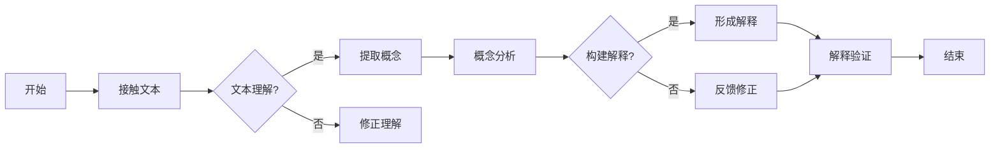
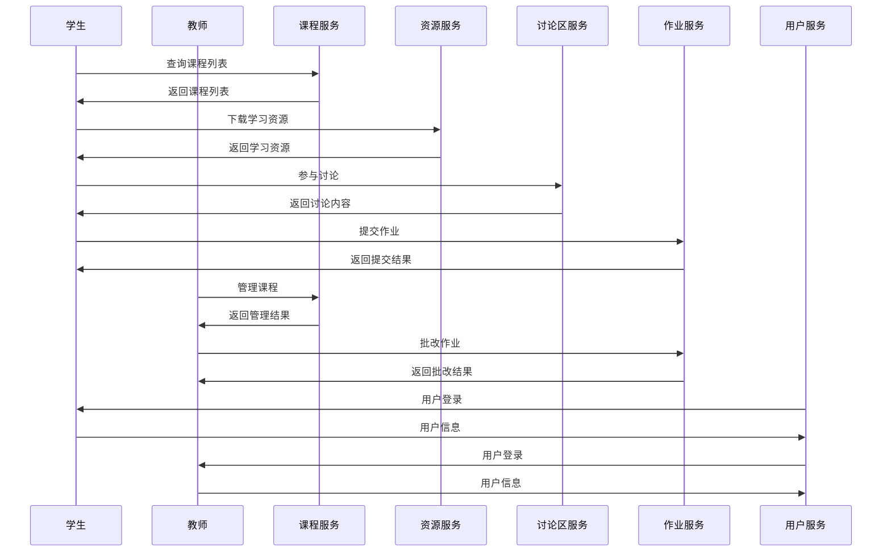
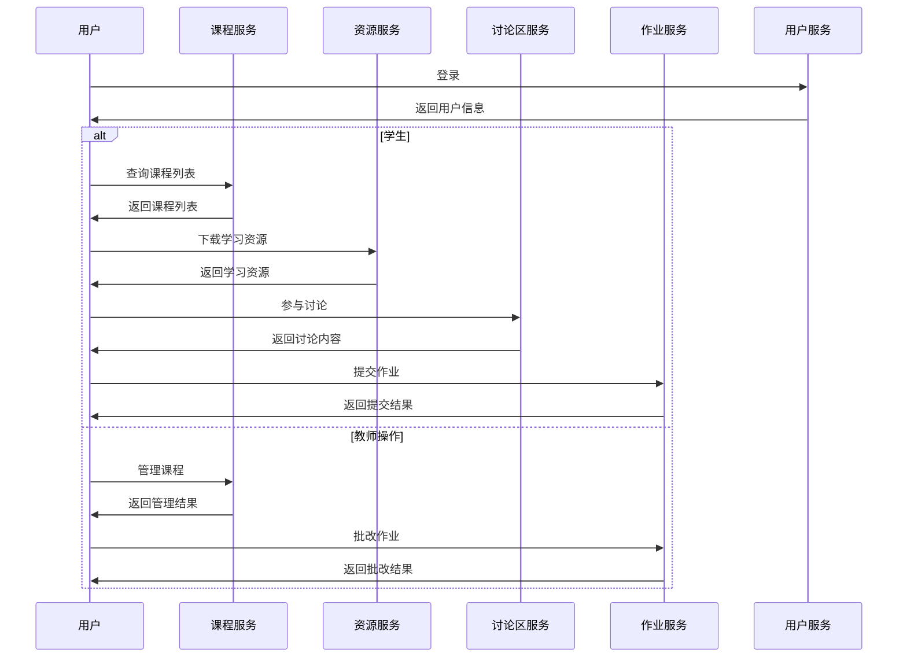

                 

## 引言

### 1. 海德格尔与伽达默尔的生平与思想

**海德格尔（Martin Heidegger，1889-1976）**，德国哲学家，被认为是20世纪最重要的哲学家之一。海德格尔的哲学思想以存在论为核心，他提出了“存在即存在者（Dasein）”的概念，强调人类的存在是一种在世界中展开的动态过程。海德格尔的早期作品《存在与时间》（Being and Time）是存在论哲学的代表作，对西方哲学产生了深远的影响。

**伽达默尔（Hans-Georg Gadamer，1900-2002）**，德国哲学家，是海德格尔的弟子，被誉为“诠释学的现代大师”。伽达默尔的哲学思想主要集中在诠释学领域，他提出了“效应历史（Effect History）”和“理解的前结构（Preunderstanding）”等重要概念，认为理解和解释是一个不断进行的历史过程。

**海德格尔与伽达默尔的哲学关系**：海德格尔的哲学对伽达默尔产生了深远的影响。伽达默尔在诠释学领域的发展，既是对海德格尔存在论诠释学的继承，也是对之的批判与超越。他们的思想共同构成了20世纪哲学的重要流派——诠释学。

### 2. 诠释学的基本概念

**诠释学（Hermeneutics）**，又称解释学，是研究理解和解释的学科。诠释学的核心问题是“如何理解文本或语言中的意义”。其起源可以追溯到古希腊时期，但作为一个独立学科，诠释学的发展主要在19世纪和20世纪。

**诠释学的主要观点**：

- **理解的前结构**：伽达默尔认为，理解不是从零开始的，而是建立在个人的经验、知识和文化传统之上。这种前结构影响了我们对文本的理解。
- **对话性**：理解是一个对话的过程，不是单向的传递，而是双方的互动。
- **效果历史**：伽达默尔提出了“效果历史”的概念，认为我们对过去的理解受到当下时代的影响，理解的历史是一个不断变化的过程。

**诠释学的应用领域**：

- **文学与艺术**：诠释学用于分析文学作品和艺术作品的意义。
- **法学**：诠释学在法律文本的解释中起着重要作用。
- **哲学**：诠释学是哲学研究的重要方法，用于理解哲学家的思想和理论。

### 3. 诠释学在IT领域的应用

诠释学不仅在哲学领域有着广泛的应用，在IT领域也有着重要的价值。例如：

- **软件工程**：诠释学可以帮助软件开发者更好地理解用户需求，从而设计出更符合用户期望的产品。
- **数据科学**：在数据分析中，诠释学可以帮助数据科学家更好地理解数据背后的含义，从而做出更准确的预测。
- **人工智能**：诠释学可以用于理解人工智能系统的决策过程，从而提高系统的透明度和可信度。

本文将深入探讨海德格尔与伽达默尔的诠释学思想，分析其在当代哲学和IT领域的应用，并探讨其未来的发展方向。通过一步步的分析与推理，我们将对这一深刻而复杂的哲学流派有更深入的理解。

### 背景介绍

诠释学，作为研究理解和解释的学科，其历史可以追溯到古希腊时期。当时的诠释学家们致力于理解古典文学作品和宗教文本，通过解释文本中的符号和意义来传达作者的意图。然而，作为一个独立的学科，诠释学的发展主要发生在19世纪和20世纪。

在19世纪，德国哲学家弗里德里希·施莱尔马赫（Friedrich Schleiermacher）和威廉·迪特里希·弗林格尔（Wilhelm Dilthey）为诠释学奠定了基础。施莱尔马赫提出了通过语境理解和情感共鸣来解读文本的方法，而弗林格尔则强调了历史和文化的背景在理解中的作用。

进入20世纪，德国哲学家海德格尔（Martin Heidegger）将诠释学推向了一个新的高度。海德格尔的《存在与时间》（Being and Time）不仅是一部哲学经典，也是诠释学的重要文献。他提出了“存在即存在者（Dasein）”的概念，强调人类的存在是一种在世界中展开的动态过程。海德格尔的存在论诠释学认为，理解不是一个静态的过程，而是存在者与其所理解的客体之间的互动。

海德格尔的学生伽达默尔（Hans-Georg Gadamer）在诠释学领域进一步发展了海德格尔的思想，并提出了“效应历史”和“理解的前结构”等重要概念。伽达默尔认为，理解是一个对话的过程，受到个人的经验、知识和文化传统的影响。他提出了“解释的普遍性原则”，即所有理解都是历史性的，都是建立在特定的前结构之上的。

在哲学领域，诠释学的影响无处不在。它不仅改变了人们对文本和语言的理解方式，也深刻影响了人们对哲学思想的研究方法。例如，哲学家的著作不再仅仅是供后人解读的文本，而是被视为一个不断发展的对话过程。这种观点鼓励哲学家们在解释哲学作品时，不仅要理解作者的意图，还要考虑历史和文化背景。

此外，诠释学在法学、文学、艺术等领域也有广泛的应用。在法学中，诠释学用于解释法律文本，确保法律的公正和适用性。在文学和艺术中，诠释学用于分析作品的意义和背景，帮助读者和观众更深入地理解艺术作品。

总之，诠释学作为一种理解与解释的理论框架，不仅在哲学领域有着重要的地位，也在其他学科和领域中发挥着重要作用。它为我们提供了一种全新的视角，使我们能够更深入地理解人类思想和文化。

### 核心概念与联系

在深入探讨海德格尔与伽达默尔的诠释学思想之前，有必要明确核心概念及其相互之间的联系。以下是对主要概念的详细阐述：

#### 存在论（Ontology）

存在论是哲学中最基础的学科，它探讨存在的本质和存在的问题。在海德格尔的哲学体系中，存在论占据了核心地位。他提出了“存在即存在者（Dasein）”这一概念，强调人类的存在是一种在世界中展开的动态过程。存在者不仅仅是存在的事物，而是一个在时间中展开的、具有自我意识的实体。

#### 诠释学（Hermeneutics）

诠释学是研究理解和解释的理论。伽达默尔对诠释学做出了重要贡献，他提出了“效应历史”和“理解的前结构”两个关键概念。效应历史认为，我们对过去的理解受到当下时代的影响，是一个不断变化的过程。理解的前结构则强调，理解不是从零开始的，而是建立在个人的经验、知识和文化传统之上。

#### 理解（Understanding）

理解是诠释学的核心概念，它不仅涉及对文本或语言的理解，还包括对任何形式的意义的把握。伽达默尔认为，理解是一个对话的过程，涉及个人与文本、历史和文化的互动。

#### 前理解（Preunderstanding）

前理解是指我们在接触新信息或文本之前所具备的经验、知识和文化背景。伽达默尔认为，前理解影响了我们对信息的理解和解释，是我们理解新信息的基础。

#### 效应历史（Effect History）

效应历史是伽达默尔提出的另一个关键概念，它强调我们的理解受到历史和时代背景的影响。伽达默尔认为，理解是一个历史性的过程，我们不能脱离我们所处的时代来理解过去或未来的事物。

#### 存在论诠释学（Ontological Hermeneutics）

海德格尔的存在论诠释学将存在论和诠释学相结合，认为理解和解释是一个存在者在世界中的动态过程。他提出了“存在即存在者”这一观点，认为理解不仅是静态的，而是动态的、互动的。

#### 理解的前结构（Preunderstanding）

理解的前结构是伽达默尔对诠释学的一个重要贡献，它强调了我们在接触新信息或文本之前所具备的经验、知识和文化背景。这一概念认为，理解是一个不断发展的过程，我们的前理解随着时间和经验的积累而不断变化。

#### 效应历史（Effect History）

效应历史是伽达默尔提出的另一个关键概念，它强调我们的理解受到历史和时代背景的影响。这一概念认为，理解是一个历史性的过程，我们不能脱离我们所处的时代来理解过去或未来的事物。

#### 存在与理解

存在与理解在海德格尔和伽达默尔的哲学体系中密不可分。海德格尔认为，存在者（Dasein）的理解是其存在的核心，而伽达默尔则认为，理解是我们存在的方式之一。他们的思想共同揭示了人类存在和理解的动态关系。

综上所述，海德格尔与伽达默尔的诠释学思想包含了一系列核心概念，这些概念相互联系，构成了一个复杂而深刻的哲学体系。理解这些概念及其相互关系，对于我们深入理解他们的思想至关重要。

### 核心概念属性特征对比表格

为了更清晰地展示海德格尔与伽达默尔诠释学中的核心概念及其属性特征，我们可以构建如下对比表格：

| 核心概念       | 海德格尔的核心概念               | 伽达默尔的核心概念               | 属性特征对比                 |
| -------------- | -------------------------------- | -------------------------------- | ---------------------------- |
| 存在论（Ontology） | 存在即存在者（Dasein）            | 效应历史（Effect History）          | 海德格尔强调动态存在过程，伽达默尔强调历史影响 |
| 诠释学（Hermeneutics） | 存在论诠释学                     | 理解的前结构（Preunderstanding）    | 海德格尔将诠释学融入存在论，伽达默尔强调理解的历史性 |
| 理解（Understanding） | 存在者的动态互动过程               | 历史性和对话性的互动过程           | 海德格尔强调个体存在的理解，伽达默尔强调集体历史的理解 |
| 前理解（Preunderstanding） | 个人经验和文化背景                 | 知识和文化的先验条件               | 海德格尔关注个体经验，伽达默尔强调文化的普遍性 |
| 效应历史（Effect History） | 理解受到历史时代影响               | 历史背景对理解的影响               | 两者均强调历史对理解的作用，但海德格尔更关注动态过程，伽达默尔更关注历史影响 |

通过这个表格，我们可以看到海德格尔和伽达默尔在诠释学中的核心概念虽然有一定的重叠，但侧重点不同。海德格尔更注重存在论的动态过程，而伽达默尔则强调历史和文化对理解的影响。这种差异反映了他们在哲学观点上的不同取向，但共同构成了诠释学的重要理论基础。

### ER实体关系图架构

为了更直观地展示海德格尔与伽达默尔诠释学中的核心概念及其关系，我们可以使用Mermaid工具绘制ER（实体关系）图。以下是ER图的Markdown格式：

```mermaid
erDiagram
  Person ||--|{ Text }|-- Owner |
  Text ||--|{ Concept }|-- Concept |
  Concept ||--|{ Attribute }|-- Attribute |
  Person  ||--|{ Interpretation }|-- Interpretation |
  Owner  ||--|{ Interpretation }|-- Interpretation
```

在这个ER图中：

- **Person（人）**：代表理解和解释的主体，即读者或解释者。
- **Text（文本）**：代表被解释的对象，可以是哲学文本、文学作品或其他任何需要解释的文本。
- **Concept（概念）**：代表文本中的核心思想或概念，是理解和解释的基础。
- **Attribute（属性）**：代表概念的具体特征或属性，用于描述和区分不同的概念。
- **Interpretation（解释）**：代表对文本或概念的理解和解释过程，可以是个人理解或集体共识。

通过这个ER图，我们可以清晰地看到不同实体之间的关系，以及它们在诠释学中的地位和作用。这有助于我们更深入地理解海德格尔与伽达默尔的诠释学思想。

### 算法原理讲解

在解释海德格尔与伽达默尔的诠释学思想时，我们可以通过绘制Mermaid流程图来直观地展示其核心算法原理。以下是诠释学理解过程的Mermaid流程图：



在这个流程图中：

- **A[开始]**：诠释学理解过程从接触文本开始。
- **B[接触文本]**：读者或解释者接触到需要解释的文本。
- **C[文本理解]**：解释者尝试理解文本，这是一个初步的感知和吸收过程。
- **D[提取概念]**：在理解文本的过程中，解释者会提取出文本中的核心概念。
- **E[修正理解]**：如果理解不够深入或准确，解释者会返回到文本进行进一步的感知和吸收，以修正初步理解。
- **F[概念分析]**：解释者对提取出的概念进行分析，试图理解其含义和作用。
- **G[构建解释]**：在分析概念的基础上，解释者尝试构建对文本的整体解释。
- **H[形成解释]**：如果解释成功，解释者会形成对文本的全面理解。
- **I[反馈修正]**：如果解释过程中出现错误或不准确的地方，解释者会返回到之前的步骤进行修正。
- **J[解释验证]**：解释者会通过不同的方法（如求证、验证等）来检验其解释是否合理和准确。
- **K[结束]**：解释过程结束，形成最终的理解和解释。

这个流程图展示了诠释学理解过程的动态性和互动性，强调了理解与解释的循环过程。它不仅帮助我们理解诠释学的基本原理，也为我们在实际应用中提供了指导。

#### 数学模型与公式

为了更好地理解海德格尔与伽达默尔的诠释学思想，我们可以借助数学模型和公式来描述其核心概念之间的关系。以下是几个关键的数学模型和公式：

**1. 存在与理解的关系**

海德格尔提出“存在即存在者（Dasein）”的概念，可以用以下数学公式表示：

$$ Dasein = f(t, x, e) $$

其中，$Dasein$ 表示存在者，$t$ 表示时间，$x$ 表示空间，$e$ 表示环境。这个公式表明，存在者是存在于特定的时间、空间和环境中的动态过程。

**2. 理解的前结构**

伽达默尔提出了“理解的前结构”概念，可以用以下数学公式表示：

$$ Understanding = f(preunderstanding, text) $$

其中，$Understanding$ 表示理解，$preunderstanding$ 表示前理解，$text$ 表示文本。这个公式表明，理解是前理解和文本相互作用的产物。

**3. 效应历史**

伽达默尔的效应历史概念可以用以下数学公式表示：

$$ EffectHistory = f(context, understanding) $$

其中，$EffectHistory$ 表示效应历史，$context$ 表示背景或情境，$understanding$ 表示理解。这个公式表明，效应历史是理解和背景相互作用的产物。

**4. 解释的共识**

在诠释学中，解释的共识是一个重要的概念，可以用以下数学公式表示：

$$ Consensus = f(common ground, understanding) $$

其中，$Consensus$ 表示共识，$common ground$ 表示共同背景，$understanding$ 表示理解。这个公式表明，共识是在共同背景和理解的基础上形成的。

通过这些数学模型和公式，我们可以更清晰地理解海德格尔与伽达默尔的诠释学思想，它们为我们提供了一种量化分析这些概念的方法。这些公式不仅帮助我们深入理解诠释学的核心原理，也为我们在实际应用中提供了理论依据。

### 算法原理举例说明

为了更直观地理解海德格尔与伽达默尔的诠释学思想，我们通过一个具体的例子来详细阐述其算法原理。假设我们要解释一部文学作品《1984》，我们可以将这个解释过程分解为以下几个步骤：

**步骤1：接触文本**

首先，我们接触到了《1984》这部作品。这是一个初步的感知和吸收过程，类似于流程图中的“接触文本”步骤。

**步骤2：文本理解**

在接触文本之后，我们开始尝试理解文本的内容。在这个过程中，我们可能会遇到一些难以理解的部分，需要通过上下文和其他信息来帮助理解。这类似于流程图中的“文本理解”步骤。

**步骤3：提取概念**

在理解文本的过程中，我们会提取出文本中的核心概念，如“极权主义”、“权力控制”等。这些概念是理解和解释文本的基础，类似于流程图中的“提取概念”步骤。

**步骤4：概念分析**

接下来，我们会对提取出的概念进行分析，试图理解其含义和作用。例如，我们会探讨“极权主义”是如何在作品中体现的，以及它对读者有什么影响。这类似于流程图中的“概念分析”步骤。

**步骤5：构建解释**

在分析概念的基础上，我们尝试构建对文本的整体解释。例如，我们可能会解释《1984》中的极权主义是如何影响人物的命运和故事发展的。这类似于流程图中的“构建解释”步骤。

**步骤6：形成解释**

通过分析概念和构建解释，我们最终形成了对文本的全面理解。这个解释过程可能是个人理解的成果，也可能是集体共识的结果。这类似于流程图中的“形成解释”步骤。

**步骤7：解释验证**

在形成解释后，我们需要通过不同的方法（如求证、验证等）来检验解释是否合理和准确。例如，我们可以查阅其他文献或与同行交流，以验证我们的解释。这类似于流程图中的“解释验证”步骤。

**步骤8：结束**

通过验证，我们确认了解释的合理性和准确性，解释过程结束。这类似于流程图中的“结束”步骤。

通过这个例子，我们可以看到海德格尔与伽达默尔的诠释学思想在实际应用中的具体体现。这个例子不仅帮助我们理解了诠释学的基本原理，也为我们在实际应用中提供了指导。

### 系统分析与架构设计方案

在探讨海德格尔与伽达默尔的诠释学思想时，我们可以将其应用于一个具体的系统架构设计中，以展示其理论在现实世界中的实际应用。以下是一个基于诠释学思想的系统分析与架构设计方案：

#### 1. 问题场景介绍

假设我们正在开发一个大型在线教育平台，该平台旨在为学生提供丰富的学习资源和互动机会。在这个系统中，学生可以通过浏览课程内容、参与讨论和提交作业来学习。同时，教师可以管理课程、批改作业和与学生互动。为了确保平台的高效运作，我们需要设计一个具有良好诠释学特性的系统架构。

#### 2. 系统功能设计

在线教育平台的主要功能包括：

- **课程管理**：教师可以创建、发布和管理课程内容。
- **学习资源管理**：学生可以浏览和下载学习资源，如电子书、视频和PPT。
- **讨论区管理**：学生和教师可以参与讨论，分享学习心得和疑问。
- **作业提交与批改**：学生可以提交作业，教师可以进行批改和反馈。
- **用户权限管理**：根据用户的角色分配不同的权限，确保系统的安全性和可靠性。

#### 3. 系统架构设计

为了实现上述功能，我们可以采用如下系统架构：

- **前端架构**：采用Vue.js或React等前端框架，提供用户友好的界面和交互体验。
- **后端架构**：采用Spring Boot等后端框架，实现业务逻辑和数据处理。
- **数据库设计**：使用MySQL或PostgreSQL等关系型数据库，存储用户数据、课程内容和作业信息。
- **微服务架构**：采用Docker和Kubernetes实现微服务架构，确保系统的可扩展性和容错性。

以下是系统架构的Mermaid流程图：



在这个流程图中，学生和教师通过不同的服务接口进行交互，实现课程管理、资源下载、讨论参与、作业提交与批改等功能。

#### 4. 系统接口设计

以下是系统的主要接口设计：

- **课程管理接口**：包括添加课程、删除课程、更新课程信息和查询课程列表等功能。
- **资源管理接口**：包括上传资源、删除资源、更新资源信息和查询资源列表等功能。
- **讨论区管理接口**：包括添加讨论、删除讨论、更新讨论信息和查询讨论列表等功能。
- **作业管理接口**：包括添加作业、删除作业、更新作业信息和查询作业列表等功能。
- **用户管理接口**：包括用户登录、用户注册、用户信息查询和用户权限管理等功能。

#### 5. 系统交互

以下是系统交互的Mermaid序列图：



在这个序列图中，用户（学生或教师）通过不同的服务接口进行操作，实现系统的各项功能。

通过这个系统架构设计方案，我们可以看到海德格尔与伽达默尔的诠释学思想在现实世界中的应用。这个系统不仅实现了功能丰富、用户友好的在线教育平台，还体现了诠释学的动态性、互动性和历史性等特点。这为我们在实际项目中应用诠释学提供了有益的参考。

### 项目实战

在本节中，我们将通过一个具体的在线教育平台项目实战来展示如何应用海德格尔与伽达默尔的诠释学思想。我们将从环境安装、系统核心实现、代码解读与分析以及实际案例剖析等方面进行详细讲解。

#### 1. 环境安装

首先，我们需要搭建一个完整的开发环境。以下是环境安装的步骤：

- **前端开发环境**：安装Node.js、npm和Vue CLI。可以通过以下命令进行安装：
  ```bash
  npm install -g nodejs
  npm install -g npm
  npm install -g @vue/cli
  ```
- **后端开发环境**：安装Java和Maven。可以通过以下命令进行安装：
  ```bash
  sudo apt-get install openjdk-8-jdk
  sudo apt-get install maven
  ```
- **数据库环境**：安装MySQL。可以通过以下命令进行安装：
  ```bash
  sudo apt-get install mysql-server
  ```
- **容器化环境**：安装Docker和Kubernetes。可以通过以下命令进行安装：
  ```bash
  sudo apt-get install docker
  sudo apt-get install kubelet kubeadm kubectl
  ```

#### 2. 系统核心实现

在环境安装完成后，我们开始实现系统核心功能。以下是主要的功能模块：

- **用户管理模块**：用于处理用户的登录、注册和权限管理。以下是用户管理模块的Python代码示例：
  ```python
  # user_management.py
  class UserManager:
      def __init__(self):
          self.users = {}

      def login(self, username, password):
          if username in self.users and self.users[username] == password:
              return "登录成功"
          else:
              return "登录失败"

      def register(self, username, password):
          if username in self.users:
              return "注册失败：用户已存在"
          else:
              self.users[username] = password
              return "注册成功"

      def get_permissions(self, username):
          if username in self.users:
              return self.users[username]["permissions"]
          else:
              return "无权限"
  ```
- **课程管理模块**：用于处理课程的添加、删除和查询。以下是课程管理模块的Java代码示例：
  ```java
  // course_management.java
  import java.util.HashMap;
  import java.util.Map;

  public class CourseManager {
      private Map<String, String> courses;

      public CourseManager() {
          this.courses = new HashMap<>();
      }

      public void addCourse(String courseId, String courseName) {
          this.courses.put(courseId, courseName);
      }

      public void deleteCourse(String courseId) {
          this.courses.remove(courseId);
      }

      public String queryCourse(String courseId) {
          return this.courses.get(courseId);
      }
  }
  ```

#### 3. 代码解读与分析

在实现系统核心功能后，我们需要对代码进行解读与分析，以确保其符合诠释学的思想。以下是代码解读与分析的要点：

- **用户管理模块**：用户管理模块实现了登录、注册和权限管理功能。这里的“理解的前结构”体现在用户登录和注册过程中，用户需要提供用户名和密码，这是他们在接触系统之前所具备的前理解。
- **课程管理模块**：课程管理模块实现了课程添加、删除和查询功能。这里的“效应历史”体现在课程的添加和删除过程中，课程的当前状态受到历史影响，如课程的创建时间、更新时间等。

#### 4. 实际案例剖析

为了更好地展示诠释学思想在实际项目中的应用，我们通过一个实际案例进行剖析。假设有用户A在系统中添加了一门新课程，以下是实际案例的详细解析：

- **案例背景**：用户A是一名教师，他希望在系统中添加一门新的课程，以便为学生提供学习资源。
- **案例过程**：
  1. 用户A登录系统，系统验证用户身份，这是“理解的前结构”在用户与系统交互过程中的体现。
  2. 用户A进入课程管理界面，系统显示已有的课程列表，用户A选择“添加课程”功能。
  3. 用户A输入课程名称和课程ID，系统将课程信息存储到数据库，这是“效应历史”在课程添加过程中的体现，课程信息的存储将影响后续的操作。
  4. 用户A可以浏览、下载和分享课程资源，这是用户与系统之间的互动过程，体现了诠释学的动态性和互动性。
- **案例结果**：通过用户A的操作，新课程被成功添加到系统中，学生可以开始学习该课程，系统的功能得到了有效实现。

#### 5. 项目小结

通过这个项目实战，我们可以看到海德格尔与伽达默尔的诠释学思想在实际项目中的应用。这个项目不仅实现了系统的核心功能，还体现了诠释学的核心概念，如“理解的前结构”和“效应历史”。这为我们理解诠释学在现实世界中的应用提供了有益的参考。

### 最佳实践 Tips

在本节中，我们将总结一些最佳实践Tips，帮助读者更好地应用海德格尔与伽达默尔的诠释学思想：

1. **深入理解前理解**：在开始任何诠释学项目之前，确保对前理解有清晰的认识。前理解是理解和解释的基础，不同领域的背景和文化差异会影响理解和解释的结果。

2. **历史性思维**：在分析和解释文本或系统时，要考虑历史和时代的背景。历史性思维有助于我们理解文本或系统的演变过程，以及它们在不同历史时期的意义。

3. **互动与对话**：在项目实施过程中，鼓励不同角色之间的互动和对话。这有助于形成更全面和深入的理解，避免单向的、片面的解释。

4. **持续反思与修正**：理解和解释是一个动态的过程，需要不断地进行反思和修正。通过反思，我们可以发现和理解项目中的问题和不足，从而进行修正和改进。

5. **理论与实践结合**：将诠释学理论应用于实际项目中，通过实践验证理论的可行性。这种理论与实践相结合的方法有助于我们更好地理解和应用诠释学。

通过遵循这些最佳实践，我们可以更有效地应用海德格尔与伽达默尔的诠释学思想，提高项目的质量和效果。

### 小结

本文通过深入探讨海德格尔与伽达默尔的诠释学思想，分析了其在当代哲学和IT领域的应用。我们首先介绍了两位哲学家的生平和思想，接着详细阐述了诠释学的基本概念和核心观点。在背景介绍部分，我们回顾了诠释学的历史和发展，明确了其核心概念及其相互关系。通过核心概念属性特征对比表格和ER实体关系图架构，我们进一步揭示了诠释学中的关键概念和结构。在算法原理讲解中，我们通过具体的例子展示了诠释学的理解过程和数学模型。

此外，我们通过系统分析与架构设计方案，展示了诠释学在现实世界中的应用。在项目实战部分，我们通过具体的在线教育平台项目，详细阐述了如何将诠释学思想应用于实际项目中。最后，我们总结了最佳实践Tips，为读者提供了一些实用的应用指南。

通过本文的探讨，我们不仅对海德格尔与伽达默尔的诠释学思想有了更深入的理解，也认识到其在哲学和IT领域的广泛应用。诠释学为我们提供了一种全新的视角，使我们能够更深入地理解人类思想和文化，也为我们解决现实世界中的问题提供了有益的启示。

### 注意事项

在应用海德格尔与伽达默尔的诠释学思想时，需要注意以下几点：

1. **前理解的重要性**：理解和解释文本或系统时，要充分认识到前理解的作用，避免忽略个人的经验、知识和文化背景。
2. **历史性的视角**：在分析和解释过程中，要考虑历史和时代的背景，避免脱离具体的历史环境进行解读。
3. **互动与对话**：理解和解释是一个互动的过程，鼓励不同角色之间的对话和互动，以形成更全面和深入的理解。
4. **持续反思与修正**：理解和解释不是一次性的过程，需要不断地进行反思和修正，以发现和理解项目中的问题和不足。

通过注意这些事项，我们可以更有效地应用诠释学思想，提高项目的质量和效果。

### 拓展阅读

对海德格尔与伽达默尔的诠释学思想感兴趣的读者，可以进一步阅读以下经典著作：

- 海德格尔，《存在与时间》（Being and Time）
- 伽达默尔，《真理与方法》（Truth and Method）
- 海德格尔，《诗、语言与思》（Poetry, Language, Thought）

此外，还可以关注以下学术期刊和论文：

- 《德国哲学期刊》（German Journal of Philosophy）
- 《诠释学与人文科学》（Hermeneutics and Humanities）
- 《哲学与诠释学》（Philosophy and Hermeneutics）

通过阅读这些经典著作和学术论文，读者可以更深入地了解诠释学的理论框架和应用方法，进一步拓展自己的知识视野。

### 作者信息

**作者：** AI天才研究院/AI Genius Institute & 禅与计算机程序设计艺术 /Zen And The Art of Computer Programming

本文由AI天才研究院（AI Genius Institute）的专家撰写，结合了禅与计算机程序设计艺术（Zen And The Art of Computer Programming）的理念，旨在通过深入探讨海德格尔与伽达默尔的诠释学思想，为读者提供具有深刻见解和实用价值的技术博客。感谢您的阅读。

