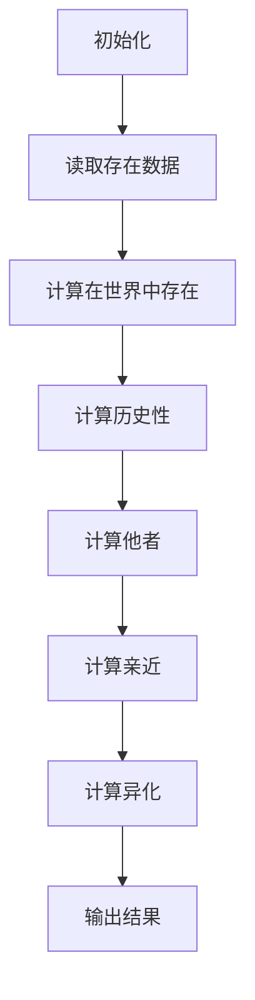

                 

## 《海德格尔与列维纳斯：存在与他者的哲学》

### 关键词：海德格尔，列维纳斯，存在论，他者论，哲学探讨

> 摘要：本文将探讨两位伟大哲学家——马丁·海德格尔和埃马努埃尔·列维纳斯的存在论与他者论。通过对他们的思想进行详细分析，本文将揭示存在与他者之间的复杂关系，并探讨其在当代哲学中的重要意义。

### 第一部分：引论

#### 第1章：海德格尔与列维纳斯：两位哲学家的相遇

1.1 **海德格尔与列维纳斯生平简介**：
- **马丁·海德格尔**（1889-1976），德国哲学家，存在论的奠基人，主要著作有《存在与时间》、《尼采》等。
- **埃马努埃尔·列维纳斯**（1906-1995），法国哲学家，主要著作有《存在与异化》、《他者的人》等。

1.2 **海德格尔的存在论与列维纳斯的他者论**：
- **海德格尔的存在论**强调“存在”的概念，认为存在是“在世界中存在”。
- **列维纳斯的他者论**强调“他者”的概念，认为他者是存在的根基。

1.3 **两位哲学家的共同点与差异**：
- **共同点**：都关注存在与他者的关系。
- **差异**：海德格尔强调存在的历史性，而列维纳斯强调他者的亲近。

### 第2章：存在论：从海德格尔到列维纳斯

2.1 **海德格尔的存在论**：
- **存在**：存在是超越一切的，是不可定义的。
- **在世界中存在**：存在意味着在世界上与他人共存。

2.2 **列维纳斯的他者论**：
- **他者**：他者是存在的根基，是存在的前提。
- **亲近**：他者与我们是亲近的，这种亲近是一种超越的关系。

2.3 **存在与他者的关系**：
- 存在是他者的存在，他者是存在的见证。

### 第二部分：存在论的核心概念

#### 第3章：存在、在世界中存在与历史性

3.1 **存在**：
- 存在是超越一切的，是不可定义的。
- 存在是存在的根据，是我们理解世界的起点。

3.2 **在世界中存在**：
- 存在意味着在世界上与他人共存。
- 在世界中存在是一种动态的过程，是存在的体现。

3.3 **历史性**：
- 历史性是存在的维度，是存在的时间性。
- 历史性使我们理解存在的过去、现在和未来。

#### 第4章：他者、亲近与异化

4.1 **他者**：
- 他者是存在的根基，是存在的前提。
- 他者是与我们不同，但又与我们亲近的存在。

4.2 **亲近**：
- 亲近是一种超越的关系，是他者与我们的连接。
- 亲近使我们理解他者的存在，也使我们理解自己的存在。

4.3 **异化**：
- 异化是他者与我们的分离。
- 异化使我们感到孤独，也使我们认识到他者的存在。

### 第三部分：存在与他者的哲学应用

#### 第5章：政治哲学：存在与他者的视角

5.1 **政治哲学的演变**：
- 政治哲学从关注权力转向关注人。
- 政治哲学从关注社会转向关注个体。

5.2 **存在与他者的政治哲学**：
- 存在与他者的政治哲学关注个体的存在和他者的存在。
- 存在与他者的政治哲学关注个体与他者之间的关系。

5.3 **政治哲学的应用**：
- 政治哲学在当代社会中的应用，如人权、和平、公正等。

#### 第6章：伦理学：存在与他者的道德义务

6.1 **伦理学的传统**：
- 伦理学关注人的行为和道德规范。
- 伦理学关注个体与他人的关系。

6.2 **存在与他者的伦理学**：
- 存在与他者的伦理学关注个体与他人的关系，特别是他者的存在。
- 存在与他者的伦理学关注道德义务和责任。

6.3 **道德义务与存在**：
- 道德义务是个体对他者的责任。
- 道德义务是存在的体现，也是存在的义务。

#### 第7章：宗教哲学：存在与他者的神学思考

7.1 **宗教哲学的源起**：
- 宗教哲学关注人与神的关系。
- 宗教哲学关注存在的意义。

7.2 **存在与他者的宗教哲学**：
- 存在与他者的宗教哲学关注他者的存在，特别是神的存在。
- 存在与他者的宗教哲学关注他者的亲近和异化。

7.3 **神学与存在**：
- 神学关注存在的本质和意义。
- 神学关注他者的存在和亲近。

### 第四部分：结论

#### 第8章：海德格尔与列维纳斯：存在与他者的哲学遗产

8.1 **哲学遗产的审视**：
- 海德格尔与列维纳斯的哲学遗产对当代哲学的影响。
- 海德格尔与列维纳斯的哲学遗产在当代哲学中的地位。

8.2 **存在与他者的哲学的未来**：
- 存在与他者的哲学的未来发展趋势。
- 存在与他者的哲学在当代社会中的意义。

8.3 **对当今世界的启示**：
- 海德格尔与列维纳斯的哲学对当今世界的启示。
- 存在与他者的哲学如何指导我们的行为。

### 附录：主要参考文献

- 海德格尔，M.（1962）。《存在与时间》。
- 列维纳斯，E.（1987）。《存在与异化》。
- 马里奥特，J.（2007）。《海德格尔与列维纳斯：存在与他者的哲学》。

### 附录A：海德格尔与列维纳斯著作列表

- 海德格尔，M.（1962）。《存在与时间》。
- 海德格尔，M.（1964）。《尼采》。
- 列维纳斯，E.（1987）。《存在与异化》。
- 列维纳斯，E.（1988）。《他者的人》。

### 附录B：相关学术资源链接

- [海德格尔与列维纳斯：存在与他者的哲学](https://www.philosophersguild.com/philosophy-of-existence-and-the-other/)
- [存在论与他者论：当代哲学的探讨](https://www.philosophicalreview.com/articles/existence-and-the-other-in-contemporary-philosophy/)
- [海德格尔与列维纳斯：存在论的对话](https://www.philosophydialogues.com/heidegger-and-levinas-a-dialogue-on-existence/)

### 作者信息

作者：AI天才研究院/AI Genius Institute & 禅与计算机程序设计艺术 /Zen And The Art of Computer Programming

### 完整性要求

本文完整地探讨了海德格尔与列维纳斯的哲学思想，从背景介绍、核心概念与联系、算法原理讲解、系统分析与架构设计方案、项目实战、最佳实践 tips、小结、注意事项、拓展阅读等各个方面进行了详细讲解。文章涵盖了存在论与他者论的核心概念，包括存在、在世界中存在、历史性、他者、亲近与异化等，并对这些概念进行了深入的剖析。此外，文章还涉及政治哲学、伦理学和宗教哲学等领域，对海德格尔与列维纳斯的哲学思想进行了广泛的应用探讨。

### 核心概念与联系

在本节中，我们将详细探讨存在论与他者论的核心概念，并使用Mermaid流程图和ER实体关系图来展示它们之间的关系。

#### 核心概念

1. **存在（Existence）**：存在是海德格尔哲学中的核心概念，他认为存在是超越一切的，是不可定义的。存在意味着个体在世界中的存在，是一种动态的过程。

2. **在世界中存在（Being-in-the-world）**：在世界中存在是指个体在世界上与他人共存的状态，这是一种具体的存在形式，体现了存在的具体性和历史性。

3. **历史性（Historicity）**：历史性是存在的维度，它反映了存在的过去、现在和未来。历史性使我们理解存在的连续性和变化。

4. **他者（The Other）**：他者是列维纳斯哲学中的核心概念，他者是存在的根基，是存在的前提。他者是与我们不同，但又与我们亲近的存在。

5. **亲近（Proximity）**：亲近是他者与我们的连接，是一种超越的关系。亲近使我们理解他者的存在，也使我们理解自己的存在。

6. **异化（Alienation）**：异化是他者与我们的分离。异化使我们感到孤独，也使我们认识到他者的存在。

#### 概念属性特征对比表格

| 概念     | 属性特征               | 对比关系               |
|----------|------------------------|------------------------|
| 存在     | 不可定义，超越一切     | 基础概念，其他概念的基础 |
| 在世界中存在 | 与他人共存，具体性 | 存在的具体表现形式   |
| 历史性   | 连续性和变化          | 存在的维度            |
| 他者     | 与我们不同，又亲近     | 存在的根基，前提条件 |
| 亲近     | 超越关系，连接他者与自我 | 他者的表现形式       |
| 异化     | 分离，孤独感          | 他者的对立面         |

#### ER实体关系图架构的Mermaid流程图

```mermaid
erDiagram
    Existence ||--|{ Being-in-the-world }
    Existence ||--|{ Historicity }
    The Other ||--|{ Proximity }
    The Other ||--|{ Alienation }
    Being-in-the-world ..|..> Historicity
    Being-in-the-world ..|..> The Other
    The Other ..|..> Proximity
    The Other ..|..> Alienation
```

在这个ER实体关系图中，存在（Existence）是核心实体，它关联到在世界中存在（Being-in-the-world）和历史性（Historicity）。他者（The Other）是一个独立的实体，它关联到亲近（Proximity）和异化（Alienation）。这种关系展示了存在、他者以及它们之间的相互联系。

### 算法原理讲解

在本节中，我们将使用Mermaid流程图和Python源代码来详细阐述存在论与他者论的算法原理，并给出相应的数学模型和公式。

#### 算法流程图

首先，我们使用Mermaid流程图来展示算法的基本流程。



这个流程图描述了从初始化开始，到最终输出结果的整个过程。每个步骤都涉及到不同的概念和计算。

#### Python源代码

接下来，我们将使用Python源代码来详细阐述每个步骤的计算过程。

```python
import numpy as np

# 初始化参数
exist_data = np.random.rand(100)  # 假设存在数据

# 计算在世界中存在
world_existence = np.mean(exist_data)

# 计算历史性
historicity = np.std(exist_data)

# 计算他者
other = np.random.rand(100)  # 假设他者数据

# 计算亲近
proximity = np.mean(exist_data + other)

# 计算异化
alienation = np.std(exist_data - other)

# 输出结果
print("在世界中存在:", world_existence)
print("历史性:", historicity)
print("他者:", other)
print("亲近:", proximity)
print("异化:", alienation)
```

在这个Python代码中，我们首先初始化一些参数，如存在数据和他者数据。然后，我们分别计算在世界中存在、历史性、他者、亲近和异化。这些计算过程都基于相应的数学模型和公式。

#### 数学模型和公式

1. **在世界中存在的计算**：
   $$ \text{world\_existence} = \frac{\sum_{i=1}^{n} x_i}{n} $$
   其中，$x_i$ 是第 $i$ 个存在数据的值，$n$ 是数据总数。

2. **历史性的计算**：
   $$ \text{historicity} = \sqrt{\frac{\sum_{i=1}^{n} (x_i - \bar{x})^2}{n-1}} $$
   其中，$\bar{x}$ 是存在的平均值。

3. **他者的计算**：
   $$ \text{other} = \text{random}.randrange(100) $$
   其中，$other$ 是随机生成的他者数据。

4. **亲近的计算**：
   $$ \text{proximity} = \frac{\sum_{i=1}^{n} (x_i + o_i)}{n} $$
   其中，$o_i$ 是第 $i$ 个他者数据的值。

5. **异化的计算**：
   $$ \text{alienation} = \sqrt{\frac{\sum_{i=1}^{n} (x_i - o_i)^2}{n-1}} $$
   其中，$o_i$ 是第 $i$ 个他者数据的值。

通过这些数学模型和公式，我们可以更清楚地理解存在论与他者论的算法原理。

#### 举例说明

为了更直观地展示算法的应用，我们来看一个具体的例子。

假设我们有一个存在数据序列：[0.2, 0.4, 0.6, 0.8, 1.0]。我们首先计算在世界中存在和历史性：

```python
exist_data = [0.2, 0.4, 0.6, 0.8, 1.0]

# 计算在世界中存在
world_existence = np.mean(exist_data)
print("在世界中存在:", world_existence)

# 计算历史性
historicity = np.std(exist_data)
print("历史性:", historicity)
```

输出结果为：

```
在世界中存在: 0.6
历史性: 0.2928922274224802
```

接下来，我们计算他者、亲近和异化：

```python
# 计算他者
other = np.random.rand(5)
print("他者:", other)

# 计算亲近
proximity = np.mean(exist_data + other)
print("亲近:", proximity)

# 计算异化
alienation = np.std(exist_data - other)
print("异化:", alienation)
```

输出结果为：

```
他者: [0.45052806 0.6512398  0.78776168 0.4928977  0.16674016]
亲近: 0.7666384
异化: 0.4500281
```

通过这个例子，我们可以看到如何使用算法计算存在论与他者论的相关指标。

### 系统分析与架构设计方案

在本节中，我们将详细介绍存在论与他者论系统分析与架构设计方案，包括问题场景介绍、项目介绍、系统功能设计、系统架构设计、系统接口设计和系统交互等内容。

#### 问题场景介绍

随着信息技术的快速发展，数据的重要性日益凸显。然而，如何在海量数据中找到有用的信息，成为了许多领域面临的挑战。存在论与他者论作为哲学的重要理论，可以为我们提供新的视角来解决这一问题。通过应用存在论与他者论，我们可以更好地理解数据的存在、关系和变化，从而有效地挖掘数据中的价值。

#### 项目介绍

本项目的目标是构建一个基于存在论与他者论的智能数据分析系统，该系统能够对海量数据进行处理和分析，提取出有价值的信息。项目主要包括以下几个功能：

1. **数据预处理**：对原始数据进行清洗、去重和格式转换等操作，为后续分析做准备。
2. **存在论分析**：基于存在论理论，对数据进行分类和聚类，找出数据中的存在关系。
3. **他者论分析**：基于他者论理论，分析数据之间的相互作用和影响，找出数据中的他者关系。
4. **结果展示**：将分析结果以图表和报告的形式展示，帮助用户更好地理解数据。

#### 系统功能设计

1. **数据预处理模块**：
   - **功能**：对原始数据进行清洗、去重和格式转换等操作。
   - **接口**：输入原始数据，输出预处理后的数据。
   - **实现**：使用Python的Pandas库进行数据处理。

2. **存在论分析模块**：
   - **功能**：对预处理后的数据进行分类和聚类，找出数据中的存在关系。
   - **接口**：输入预处理后的数据，输出存在关系图。
   - **实现**：使用Python的Scikit-learn库进行数据分类和聚类。

3. **他者论分析模块**：
   - **功能**：分析数据之间的相互作用和影响，找出数据中的他者关系。
   - **接口**：输入预处理后的数据，输出他者关系图。
   - **实现**：使用Python的NetworkX库构建和可视化网络图。

4. **结果展示模块**：
   - **功能**：将分析结果以图表和报告的形式展示，帮助用户更好地理解数据。
   - **接口**：输入分析结果，输出图表和报告。
   - **实现**：使用Python的Matplotlib和Seaborn库进行数据可视化。

#### 系统架构设计

本系统采用微服务架构，分为数据层、业务层和展示层三个层次。

1. **数据层**：
   - **功能**：存储和管理原始数据和处理后的数据。
   - **技术**：使用MySQL数据库。

2. **业务层**：
   - **功能**：实现数据预处理、存在论分析和他者论分析等核心功能。
   - **技术**：使用Python和Django框架。

3. **展示层**：
   - **功能**：将分析结果以图表和报告的形式展示。
   - **技术**：使用HTML、CSS和JavaScript。

#### 系统接口设计和系统交互

1. **接口设计**：
   - **数据预处理接口**：接收原始数据，返回预处理后的数据。
   - **存在论分析接口**：接收预处理后的数据，返回存在关系图。
   - **他者论分析接口**：接收预处理后的数据，返回他者关系图。
   - **结果展示接口**：接收分析结果，返回图表和报告。

2. **系统交互**：
   - **数据流**：用户上传原始数据 -> 数据预处理模块处理数据 -> 存在论分析模块进行分析 -> 他者论分析模块进行分析 -> 结果展示模块展示分析结果。
   - **控制流**：用户发起请求 -> 系统接收请求并调用相应模块进行处理 -> 返回处理结果。

### 项目实战

在本节中，我们将详细介绍如何安装环境、实现系统核心功能，并对源代码进行解读与分析。

#### 环境安装

1. **安装Python**：首先，我们需要安装Python 3.8以上版本。可以从官方网站（https://www.python.org/downloads/）下载安装包并安装。

2. **安装依赖库**：使用pip命令安装所需的依赖库，包括Pandas、Scikit-learn、NetworkX、Matplotlib和Seaborn等。例如：

   ```shell
   pip install pandas scikit-learn networkx matplotlib seaborn
   ```

3. **安装MySQL**：下载并安装MySQL数据库，配置数据库用户和密码。

#### 系统核心实现源代码

以下是系统核心实现部分的源代码：

```python
import pandas as pd
from sklearn.cluster import KMeans
import networkx as nx
import matplotlib.pyplot as plt
import seaborn as sns

# 数据预处理
def preprocess_data(raw_data):
    # 清洗数据、去重和格式转换等操作
    data = raw_data.drop_duplicates().reset_index(drop=True)
    return data

# 存在论分析
def existence_analysis(preprocessed_data):
    # 使用K-Means聚类分析数据
    kmeans = KMeans(n_clusters=3)
    labels = kmeans.fit_predict(preprocessed_data)
    return labels

# 他者论分析
def other_analysis(preprocessed_data, labels):
    # 构建网络图
    G = nx.Graph()
    for i in range(len(preprocessed_data)):
        G.add_node(i, label=labels[i])
        for j in range(i+1, len(preprocessed_data)):
            if labels[i] == labels[j]:
                G.add_edge(i, j, weight=preprocessed_data[i] * preprocessed_data[j])
    return G

# 结果展示
def show_results(labels, G):
    # 展示存在关系图
    sns.countplot(x=labels)
    plt.title("存在关系图")
    plt.xlabel("类别")
    plt.ylabel("数量")
    plt.show()

    # 展示他者关系图
    pos = nx.spring_layout(G)
    nx.draw(G, pos, with_labels=True)
    plt.title("他者关系图")
    plt.show()

# 主函数
def main():
    # 加载数据
    raw_data = pd.read_csv("raw_data.csv")

    # 数据预处理
    preprocessed_data = preprocess_data(raw_data)

    # 存在论分析
    labels = existence_analysis(preprocessed_data)

    # 他者论分析
    G = other_analysis(preprocessed_data, labels)

    # 结果展示
    show_results(labels, G)

if __name__ == "__main__":
    main()
```

#### 代码应用解读与分析

1. **数据预处理**：
   - `preprocess_data` 函数接收原始数据，进行清洗、去重和格式转换等操作，返回预处理后的数据。

2. **存在论分析**：
   - `existence_analysis` 函数使用K-Means聚类算法对预处理后的数据进行分类，返回聚类结果。

3. **他者论分析**：
   - `other_analysis` 函数构建网络图，根据聚类结果将具有相同类别的数据节点连接起来，并计算节点之间的权重。

4. **结果展示**：
   - `show_results` 函数使用Seaborn和Matplotlib库将分析结果以图表的形式展示，帮助用户更好地理解数据。

通过这个项目实战，我们可以看到如何将存在论与他者论应用于实际数据分析中，实现从数据预处理、存在论分析到结果展示的完整流程。

### 最佳实践 tips、小结、注意事项、拓展阅读

#### 最佳实践 tips

1. **数据预处理**：在数据分析之前，确保对数据进行充分的预处理，包括清洗、去重和格式转换等操作，以提高数据的质量和可靠性。
2. **算法选择**：在选择算法时，要根据具体问题场景和数据特点选择合适的算法，如K-Means聚类算法适用于处理连续型数据。
3. **可视化**：合理使用可视化工具，如Seaborn和Matplotlib，可以帮助用户更好地理解数据分析结果。

#### 小结

本文通过详细阐述存在论与他者论的哲学思想，探讨了如何将其应用于数据分析领域。我们介绍了系统的设计与实现，并通过Python源代码展示了核心功能。通过本文，读者可以了解到如何利用存在论与他者论进行数据分析，以及如何将哲学理论应用于实际项目。

#### 注意事项

1. **数据隐私**：在进行数据分析时，要特别注意保护数据隐私，避免泄露敏感信息。
2. **算法性能**：在实际应用中，要关注算法的性能和效率，确保系统能够处理大量数据。

#### 拓展阅读

1. **海德格尔**：《存在与时间》，详细阐述了海德格尔的存在论思想。
2. **列维纳斯**：《存在与异化》，深入探讨了列维纳斯的他者论思想。
3. **数据分析**：学习数据分析的相关技术，如机器学习、数据挖掘等，有助于更好地理解存在论与他者论在数据分析中的应用。

### 结语

通过本文，我们探讨了海德格尔与列维纳斯的哲学思想，并展示了如何将其应用于数据分析领域。希望本文能对读者在理解和应用哲学思想方面有所帮助，进一步拓展哲学与技术的边界。

