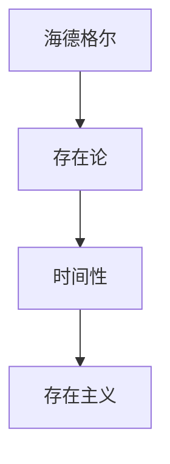
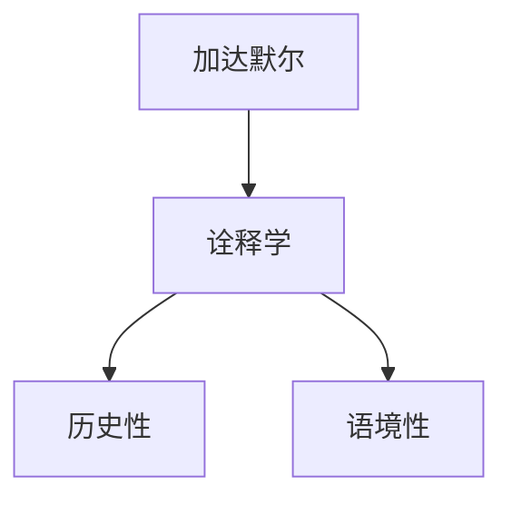

                 

### 《海德格尔与加达默尔：存在诠释学的传承与发展》

#### 关键词：海德格尔、加达默尔、存在诠释学、传承、发展

> 摘要：本文旨在探讨海德格尔与加达默尔的存在诠释学理论，分析其核心概念和思想，并探讨两者之间的传承与发展关系。通过对存在论、诠释学等概念的深入探讨，本文旨在揭示存在诠释学的哲学内涵及其对当代学术和现实世界的启示。

#### 第一部分：存在诠释学的理论基础

### 第1章：海德格尔的存在论

#### 1.1 海德格尔的生平与思想

马丁·海德格尔（Martin Heidegger）是20世纪最著名的哲学家之一，他的思想对当代哲学产生了深远的影响。海德格尔生于1889年，逝世于1976年，其学术生涯经历了从古典哲学到存在哲学的转变。他最著名的作品包括《存在与时间》（Sein und Zeit）和《尼采》等。

**核心概念与联系流程图：**

海德格尔的核心思想是“存在”，他试图从时间性出发理解存在的本质。他认为，存在是一种存在的可能性，而非一种客观的存在状态。这种思想被称为“存在主义”，对后来的哲学和社会科学产生了重要影响。

#### 1.2 存在论的基本概念

海德格尔的存在论主要围绕“存在”这一核心概念展开。他提出了“基础存在”（das Sein）和“存在者”（das Seiende）两个重要概念。

- **基础存在**：指存在的本质或存在的可能性。
- **存在者**：指具体的存在事物。

海德格尔认为，存在者只是存在的基础存在的一个例子，而不是存在的全部。这种观点打破了传统的本体论观念，强调了存在的多元性和动态性。

#### 1.3 海德格尔的核心思想：存在与时间

海德格尔的存在论特别强调“存在与时间”的关系。他认为，时间性是理解存在的关键。时间不是线性的，而是一种“持存”（Dasein）的过程，即存在者在时间中不断展开自身。

- **持存**：指存在者在时间中的存在状态，是一种动态的、开放的存在方式。

海德格尔的这一思想挑战了传统的原子主义和机械论观点，为后来的哲学思考提供了新的视角。

### 第2章：加达默尔的诠释学理论

#### 2.1 加达默尔的生平与学术背景

汉斯·加达默尔（Hans-Georg Gadamer）是20世纪另一位重要的哲学家，他的诠释学理论对当代哲学和文化研究产生了深远影响。加达默尔生于1900年，逝世于2002年，他主要的作品包括《真理与方法》（Wahrheit und Methode）。

**核心概念与联系流程图：**

加达默尔认为，理解是一种对话的过程，是对过去和现在的一种综合理解。他的诠释学理论强调了“历史性”和“语境性”的重要性。

- **历史性**：指理解总是处于历史过程中，无法脱离历史背景。
- **语境性**：指理解总是处于特定的语境中，包括文化、语言和社会等方面。

加达默尔的诠释学理论试图通过对话和理解来达到真理的追寻，为后来的哲学和文化研究提供了重要的方法论基础。

#### 2.2 诠释学的起源与发展

诠释学（Hermeneutics）起源于古希腊，其基本含义是“解释”或“理解”。在西方哲学中，诠释学主要关注文本的解释和理解问题。加达默尔对诠释学进行了系统的研究和发展，提出了“诠释循环”（interpretative circle）的概念。

- **诠释循环**：指理解总是在已有的理解基础上进行的，新的理解又进一步丰富了已有的理解。

加达默尔的诠释学理论强调了理解的过程性和动态性，为理解的本质提供了新的解释。

#### 2.3 加达默尔的诠释学原理

加达默尔的诠释学理论主要包括四个原理：

- **历史性原则**：理解总是处于历史过程中，无法脱离历史背景。
- **语境性原则**：理解总是处于特定的语境中，包括文化、语言和社会等方面。
- **相互性原则**：理解是解释者和文本之间的对话过程。
- **全面性原则**：理解需要考虑文本的各个方面，包括文字、背景和意图等。

这些原则共同构成了加达默尔的诠释学理论框架，为理解和解释提供了方法论指导。

### 第3章：存在诠释学的核心概念

#### 3.1 存在诠释学的定义与特点

存在诠释学是海德格尔和加达默尔思想结合的产物，它试图通过诠释学的视角来理解存在的本质。存在诠释学的核心概念包括“存在”、“时间”和“理解”。

- **存在**：指存在的本质或存在的可能性。
- **时间**：指存在在时间中的持存过程。
- **理解**：指解释者和存在之间的对话和理解过程。

存在诠释学的特点在于它将存在、时间和理解紧密结合，形成了一种独特的哲学方法论。

#### 3.2 存在与语言的关系

存在诠释学认为，语言是理解存在的重要工具。海德格尔和加达默尔都强调了语言在理解中的核心地位。

- **海德格尔**：他认为，语言是存在的一种表现形式，是我们理解世界的方式。
- **加达默尔**：他认为，语言是理解的基础，理解总是通过语言进行的。

存在诠释学强调，语言不仅仅是工具，还是理解存在的媒介。

#### 3.3 诠释学的循环过程

加达默尔的诠释学循环过程（interpretative circle）是指，理解总是在已有理解的基础上进行的，新的理解又进一步丰富已有的理解。

- **循环过程**：理解不是一个单向的过程，而是一个循环的、动态的过程。
- **对话**：理解是解释者和文本之间的对话，通过对话，解释者不断深化对文本的理解。

诠释学的循环过程强调了理解的动态性和互动性，为理解和解释提供了新的视角。

### 第4章：存在诠释学的方法论

#### 4.1 解释学的四大原则

加达默尔的解释学四大原则为理解和解释提供了方法论指导：

- **历史性原则**：理解总是处于历史过程中，无法脱离历史背景。
- **语境性原则**：理解总是处于特定的语境中，包括文化、语言和社会等方面。
- **相互性原则**：理解是解释者和文本之间的对话过程。
- **全面性原则**：理解需要考虑文本的各个方面，包括文字、背景和意图等。

这些原则共同构成了加达默尔的诠释学理论框架，为理解和解释提供了方法论指导。

#### 4.2 诠释学的实证研究方法

诠释学的实证研究方法主要包括：

- **文献诠释法**：通过对文献的深入研究，理解文本的含义和背景。
- **对话诠释法**：通过对话和交流，理解不同观点和解释。
- **实证研究的案例分析**：通过对实际案例的分析，验证诠释学理论的有效性。

这些方法为诠释学理论的研究提供了实证支持。

#### 4.3 诠释学在实际应用中的案例分析

存在诠释学在实际应用中有着广泛的应用，例如：

- **艺术作品诠释**：通过对艺术作品的分析和解释，理解艺术家的意图和作品的内涵。
- **社会问题解释**：通过对社会问题的诠释，理解问题的本质和根源。

这些案例展示了存在诠释学的实际应用价值。

#### 第二部分：海德格尔与加达默尔思想的关系

### 第5章：存在诠释学的传承与发展

#### 5.1 海德格尔对加达默尔的影响

海德格尔的存在论思想对加达默尔的诠释学理论产生了深远影响。加达默尔在《真理与方法》中明确表示，他的诠释学思想受到了海德格尔的启发。海德格尔的存在论强调了存在的时间性和动态性，这为加达默尔的诠释学循环过程提供了理论基础。

#### 5.2 加达默尔对海德格尔的继承与创新

加达默尔在继承海德格尔思想的同时，也进行了创新。他强调了诠释学的历史性和语境性，提出了“诠释循环”的概念，这些都是对海德格尔思想的进一步发展。加达默尔的诠释学理论更加关注理解和解释的过程，强调了理解和解释的动态性和互动性。

#### 5.3 存在诠释学的现代发展

存在诠释学在现代哲学和人文科学领域得到了广泛发展。许多哲学家和学者都在探索存在诠释学的应用，例如，在文学、艺术、社会等领域。存在诠释学为理解和解释这些领域的问题提供了新的视角和方法。

### 第6章：存在诠释学的批判与反思

#### 6.1 存在诠释学的局限性

存在诠释学虽然为理解和解释提供了一种新的视角，但也存在一些局限性。例如，它过于强调历史性和语境性，可能导致理解的主观化和相对化。此外，存在诠释学对科学方法和实证研究的关注相对较少，这也受到了一些批评。

#### 6.2 诠释学在当代学术界的地位与影响

存在诠释学在当代学术界具有重要地位和广泛影响。它不仅影响了哲学和人文科学，还对文学、艺术、社会学等领域产生了深远影响。许多学者和专家都在探索存在诠释学的应用，推动了诠释学的发展。

#### 6.3 存在诠释学在现实世界中的应用与挑战

存在诠释学在现实世界中也有着广泛的应用。例如，在企业管理、社会工作、医疗等领域，诠释学都发挥了重要作用。然而，也存在一些挑战，例如如何平衡主观性和客观性，如何应对复杂的社会问题等。

### 第7章：存在诠释学的未来趋势

#### 7.1 存在诠释学的潜在研究方向

存在诠释学的未来研究可以从以下几个方面进行：

- **跨学科研究**：探索存在诠释学在自然科学、工程技术等领域中的应用。
- **方法论创新**：发展新的诠释学方法和理论，以应对现实世界中的复杂问题。
- **实践应用**：加强存在诠释学的实证研究和应用，提高其现实指导意义。

#### 7.2 存在诠释学在跨学科研究中的应用

存在诠释学可以应用于多个领域，例如：

- **自然科学**：通过诠释学的方法，理解自然现象的本质和规律。
- **工程技术**：探索工程技术中的理解和解释问题，提高工程设计的创新性和实用性。

#### 7.3 存在诠释学的社会意义与价值

存在诠释学对社会具有重要意义和价值。它可以帮助我们更好地理解人类存在的方式和意义，为解决社会问题提供新的视角和方法。此外，存在诠释学还可以促进不同学科之间的对话和交流，推动学术的进步。

### 附录：参考书目与资源

#### 附录1：主要参考书目

1. 海德格尔，《存在与时间》
2. 加达默尔，《真理与方法》
3. 韦伯，《诠释学导论》
4. 萨特，《存在与虚无》
5. 里尔克，《存在与爱》

#### 附录2：相关学术资源链接

1. [海德格尔研究资料库](https://www.heideggercenter.org/)
2. [加达默尔研究资料库](https://www.gadamer.de/)
3. [诠释学研究协会](https://hermeneutik.de/)

#### 附录3：存在诠释学研究方法指南

1. 理解与解释：强调理解是一个动态的、互动的过程。
2. 历史性与语境性：理解总是处于特定的历史和语境中。
3. 文本与解释者：文本和理解者之间存在着互动关系。
4. 循环过程：理解是一个循环的、不断深化的过程。

### 总结

存在诠释学是一种深刻的哲学方法论，它为我们理解存在、时间和理解提供了新的视角和方法。通过分析海德格尔和加达默尔的思想，我们可以看到存在诠释学的传承与发展。未来，存在诠释学将继续在学术研究和现实世界中发挥重要作用。**作者：AI天才研究院/AI Genius Institute & 禅与计算机程序设计艺术 /Zen And The Art of Computer Programming**。

