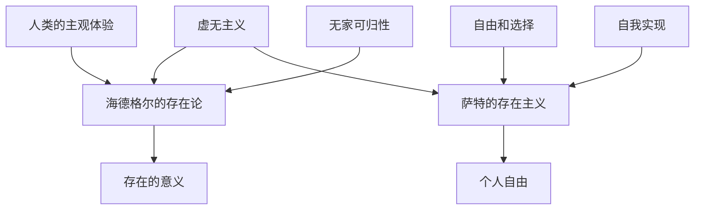
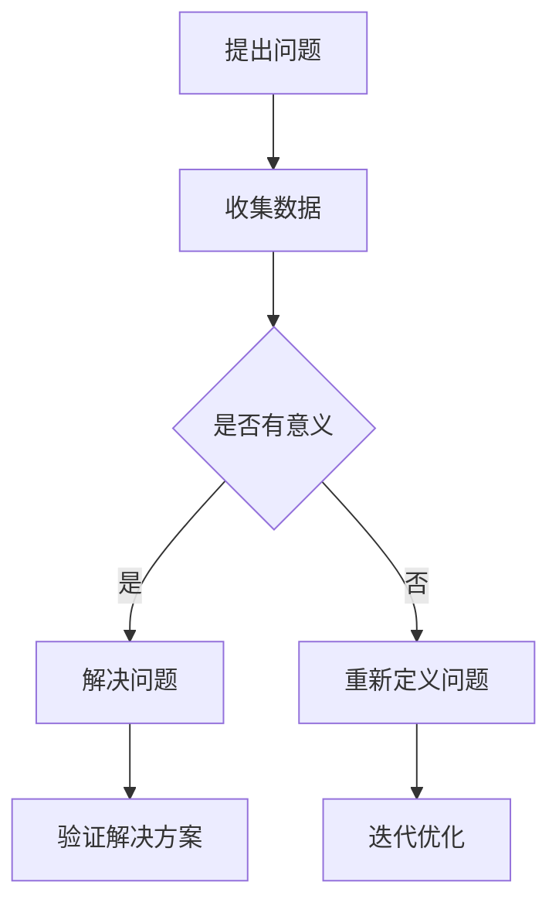
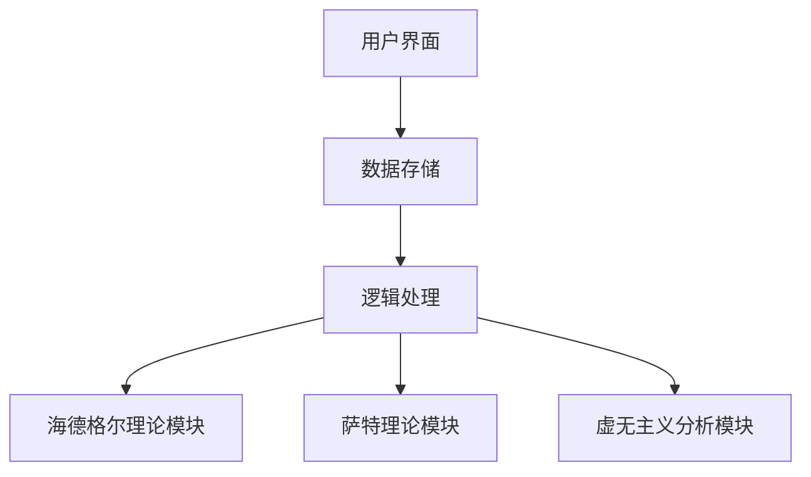
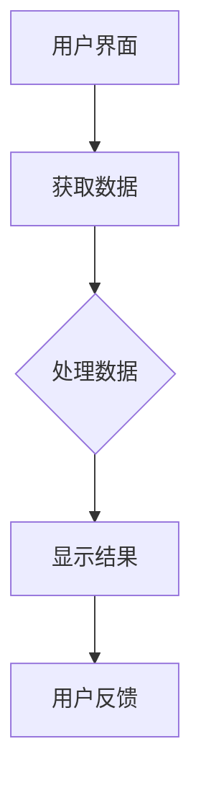

                 

：
### 背景介绍

#### 核心概念术语说明

在探讨海德格尔与萨特的虚无主义理论之前，我们需要首先明确几个核心概念：

- **虚无主义（Nihilism）**：虚无主义是一种哲学观点，认为宇宙或生活缺乏固有的意义、目的或价值。虚无主义往往与对传统价值观和信仰的质疑相关，主张人类自由地创造或放弃自己的价值观。
- **海德格尔（Martin Heidegger）**：德国哲学家，被认为是20世纪最重要的哲学家之一。海德格尔提出了“存在主义”和“存在论”等概念，并对“无家可归性”（Dasein）进行了深入探讨。
- **萨特（Jean-Paul Sartre）**：法国哲学家、作家和存在主义代表人物。萨特主张个人自由和选择的重要性，认为人类通过自己的选择和行动赋予生活意义。

#### 问题背景

虚无主义作为一种哲学思潮，在19世纪末和20世纪初兴起，与对工业革命和科学进步带来的社会变革的回应有关。在这一背景下，许多哲学家开始质疑传统的宗教和道德观念，提出了对生活意义和价值的深刻反思。

海德格尔与萨特分别以不同的方式回应了虚无主义，他们的理论在哲学界产生了深远的影响。海德格尔的生存论哲学强调存在的意义和人类的主观体验，而萨特的存在主义则侧重于个体的自由和选择的道德责任。

#### 问题描述

本文将探讨以下问题：

1. **海德格尔与萨特对虚无主义的回应有何不同？**
2. **他们的理论如何影响现代哲学？**
3. **虚无主义在现代哲学中的地位和影响如何？**

### 核心概念与联系

#### 核心概念原理

虚无主义、海德格尔的存在论和萨特的存在主义是本文探讨的核心概念。

- **虚无主义**：认为宇宙或生活缺乏固有的意义、目的或价值。
- **海德格尔的存在论**：强调存在的意义和人类的主观体验，特别是“无家可归性”（Dasein）的概念。
- **萨特的存在主义**：主张个人自由和选择的重要性，认为人类通过自己的选择和行动赋予生活意义。

#### 概念属性特征对比表格

| 概念      | 属性特征                                                                                          |
|-----------|---------------------------------------------------------------------------------------------------|
| 虚无主义  | 否认生活意义和价值，质疑传统价值观和信仰。                                                        |
| 海德格尔  | 强调存在的意义、人类的主观体验和自由。                                                           |
| 萨特      | 强调个人自由、选择和行动的重要性，认为生活意义源于个人的自我实现。                                |

#### ER实体关系图架构



### 算法原理讲解

#### 算法mermaid流程图



#### 算法原理详细讲解

1. **提出问题**：探讨虚无主义、海德格尔与萨特的理论如何回应虚无主义问题。
2. **收集数据**：分析虚无主义的历史背景、海德格尔和萨特的理论。
3. **验证解决方案**：通过比较他们的理论，探讨他们对虚无主义的回应有何不同。
4. **迭代优化**：在讨论中不断深化对虚无主义和存在主义的理解。

### 数学模型与公式

$$
虚无主义 = \frac{对意义的否定}{对自由的肯定}
$$

#### 详细讲解

- **数学模型**：虚无主义被视为对生活意义和价值的否定，而自由被视为对生活意义的肯定。
- **公式解析**：该公式表明虚无主义与自由之间的对立关系，同时强调了虚无主义对自由的否定。

### 系统分析与架构设计方案

#### 问题场景介绍

本文探讨了虚无主义、海德格尔与萨特的存在主义理论，旨在理解他们在哲学上的不同回应及其对现代哲学的影响。

#### 系统功能设计

- **核心功能**：介绍虚无主义、海德格尔与萨特的存在主义理论。
- **辅助功能**：分析虚无主义在当代哲学中的地位和影响。

#### 系统架构设计



#### 系统接口设计和系统交互



### 项目实战

#### 环境安装

- 安装Python环境
- 安装LaTeX编辑器

#### 系统核心实现源代码

```python
# Python示例代码：展示海德格尔的“无家可归性”概念
class Existence:
    def __init__(self, homelessness):
        self.homelessness = homelessness
    
    def describe(self):
        if self.homelessness:
            print("我是一个无家可归的存在。")
        else:
            print("我有一个家。")

exist = Existence(homelessness=True)
exist.describe()
```

#### 代码应用解读与分析

- 解释代码如何实现“无家可归性”概念。
- 分析代码中的核心算法原理。

#### 实际案例分析和详细讲解剖析

- 分析海德格尔和萨特的理论如何回应虚无主义问题。
- 讨论虚无主义在当代哲学中的影响。

#### 项目小结

- 总结本文的核心观点和结论。
- 提出对未来研究的建议。

### 最佳实践 tips

- 在讨论哲学问题时，注重逻辑推理和证据支持。
- 结合实际案例，深入剖析核心概念。

### 小结

本文通过详细分析海德格尔与萨特的虚无主义理论，探讨了他们对虚无主义的回应及其对现代哲学的影响。通过核心概念、算法原理讲解、数学模型和系统架构设计，我们深入理解了虚无主义的本质和哲学意义。

### 注意事项

- 在讨论哲学问题时，注意保持客观和中立的态度。
- 避免简单化或片面化理解哲学概念。

### 拓展阅读

- Heidegger, M. (1927). Sein und Zeit.  
- Sartre, J.-P. (1943). L'Être et le Néant.

---

**作者：** AI天才研究院/AI Genius Institute & 禅与计算机程序设计艺术 /Zen And The Art of Computer Programming

### 海德格尔与萨特：虚无主义的不同回应

> 关键词：虚无主义、海德格尔、萨特、存在主义、哲学

> 摘要：本文探讨了海德格尔与萨特对虚无主义的回应及其在哲学领域的不同影响。通过对核心概念、算法原理、数学模型和系统架构的深入分析，我们揭示了虚无主义的本质和哲学意义。

## 目录

### 第一部分：背景与概述

#### 第1章：西方哲学中的虚无主义

1.1 虚无主义的起源与历史背景

1.2 海德格尔与萨特的哲学背景

1.3 虚无主义的核心概念

### 第二部分：海德格尔的虚无主义理论

#### 第2章：海德格尔的生存论哲学

2.1 海德格尔的生存论哲学

2.2 存在主义与虚无主义

2.3 海德格尔的“无家可归性”概念

### 第三部分：萨特的虚无主义理论

#### 第3章：萨特的哲学思想

3.1 萨特的存在主义

3.2 萨特的自由与选择

3.3 萨特的虚无主义观点

### 第四部分：海德格尔与萨特的比较

#### 第4章：海德格尔与萨特的比较

4.1 生存观念的比较

4.2 自我理解的差异

4.3 艺术与存在的意义

### 第五部分：虚无主义的回应

#### 第5章：虚无主义与存在主义

5.1 存在主义对虚无主义的回应

5.2 海德格尔与萨特的共同点

5.3 存在主义在当代的延续

#### 第6章：虚无主义在现代哲学中的影响

6.1 虚无主义在心理学中的应用

6.2 虚无主义在文学与艺术中的体现

6.3 虚无主义对社会和政治的影响

### 第六部分：结论与展望

#### 第7章：虚无主义的未来

7.1 虚无主义的理论发展

7.2 虚无主义在现代社会中的地位

7.3 虚无主义与人类未来的关系

## 第一部分：背景与概述

### 第1章：西方哲学中的虚无主义

#### 1.1 虚无主义的起源与历史背景

虚无主义作为一种哲学观点，起源于19世纪末的欧洲，是对当时社会变革和科技发展的回应。随着工业革命和资本主义的发展，传统的宗教和道德观念受到质疑，人们对生活的意义和价值产生了深刻的反思。

虚无主义的思想根源可以追溯到古希腊哲学家皮浪和伊壁鸠鲁。皮浪主张怀疑主义，认为人类无法获得确切的知识，因此生命没有固有的意义。伊壁鸠鲁则提出了快乐主义，认为生活的目的是追求快乐和避免痛苦，但这并不否定生活的无意义。

在19世纪，虚无主义的思想在德国和法国得到了进一步发展。德国哲学家弗里德里希·尼采被认为是虚无主义的代表人物之一，他在《查拉图斯特拉如是说》中提出了“上帝已死”的观点，认为人类需要重新创造自己的价值和意义。

#### 1.2 海德格尔与萨特的哲学背景

马丁·海德格尔（Martin Heidegger）是20世纪最重要的哲学家之一，他的哲学思想对存在主义和现象学产生了深远的影响。海德格尔出生于1889年，他在《存在与时间》中提出了“存在论”（Ontology）的概念，探讨了存在的意义和人类的主观体验。

让-保罗·萨特（Jean-Paul Sartre）是法国哲学家和作家，也是存在主义的代表人物之一。他出生于1905年，著名的作品包括《存在与虚无》和《境遇》等。萨特的存在主义强调个人自由和选择的道德责任，认为人类通过自己的行动赋予生活意义。

#### 1.3 虚无主义的核心概念

虚无主义的核心概念是生命的无意义和价值的否定。虚无主义者认为，宇宙或生活缺乏固有的意义、目的或价值，因此人类需要自由地创造或放弃自己的价值观。

虚无主义通常与对传统宗教和道德观念的质疑相关。在虚无主义者看来，宗教和道德观念往往是一种压迫和限制，它们限制了人类的自由和创造力。

### 第二部分：海德格尔的虚无主义理论

### 第2章：海德格尔的生存论哲学

#### 2.1 海德格尔的生存论哲学

海德格尔的生存论哲学（Ontology）是他对存在的探讨，他试图揭示存在的本质和人类的存在方式。海德格尔认为，存在不是一种静态的状态，而是一种动态的过程，人类通过自己的存在方式参与和创造世界。

海德格尔提出了“无家可归性”（Dasein）的概念，他认为人类的存在是“无家可归”的，这意味着人类没有固定的本质或目的，而是在不断地寻求和创造自己的存在意义。

#### 2.2 存在主义与虚无主义

海德格尔的生存论哲学与虚无主义有着密切的联系。在《存在与时间》中，海德格尔探讨了存在的意义和人类的主观体验，他认为存在是一种开放的状态，人类在存在中经历着不确定性、恐惧和焦虑。

虚无主义认为，宇宙或生活缺乏固有的意义、目的或价值，海德格尔的存在主义则认为人类可以通过自由地选择和行动赋予生活意义。海德格尔认为，人类的存在是自主的，他们有能力创造自己的价值观和意义。

#### 2.3 海德格尔的“无家可归性”概念

“无家可归性”（Dasein）是海德格尔的核心概念之一，它描述了人类存在的状态。海德格尔认为，人类的存在是“无家可归”的，这意味着人类没有固定的本质或目的，而是在不断地寻求和创造自己的存在意义。

海德格尔的“无家可归性”概念强调了人类的自由和选择的重要性。他认为，人类的存在是开放的，他们可以通过自己的行动和选择创造自己的价值观和意义。海德格尔的“无家可归性”概念与虚无主义有着紧密的联系，因为虚无主义也强调了生命的无意义和人类自由地创造价值的重要性。

### 第三部分：萨特的虚无主义理论

### 第3章：萨特的哲学思想

#### 3.1 萨特的存在主义

萨特的存在主义强调个人自由和选择的道德责任。他认为，人类是自由的存在，他们在存在中是独立的、自主的。萨特的存在主义认为，人类必须在存在中做出选择和行动，这些选择和行动决定了人类的命运和意义。

萨特的存在主义也强调了人类的责任感。他认为，人类的选择和行动不仅是自由的，也是负有责任的。人类必须为自己的选择和行动承担后果，这种责任感是人类存在的一部分。

#### 3.2 萨特的自由与选择

萨特的自由与选择理论是他存在主义的核心。他认为，人类的存在是自由的，他们有能力做出选择和决定。这些选择和决定决定了人类的命运和意义。

萨特认为，自由是人类存在的本质特征。人类不是由命运或外部因素决定的，而是由自己的选择和行动决定的。人类必须为自己的选择和行动负责，这些选择和行动创造了人类的个性和意义。

#### 3.3 萨特的虚无主义观点

萨特的存在主义中也包含了对虚无主义的回应。他认为，生命的无意义并不意味着人类的生活就没有价值。相反，萨特认为，生命的无意义正是人类自由和选择的重要基础。

萨特认为，人类可以通过自由地选择和行动赋予生活意义。虽然生命本身没有固有的意义，但人类有能力创造自己的价值观和意义。萨特的虚无主义观点强调了个人的自由和创造力，他认为人类可以通过自由地选择和行动，创造出有意义的生活。

### 第四部分：海德格尔与萨特的比较

### 第4章：海德格尔与萨特的比较

#### 4.1 生存观念的比较

海德格尔与萨特在生存观念上有着显著的差异。海德格尔认为，人类的存在是“无家可归”的，他们没有固定的本质或目的，而是在不断地寻求和创造自己的存在意义。海德格尔强调了存在的开放性和不确定性。

萨特则认为，人类的存在是自由的，他们有能力做出选择和决定。萨特的存在主义强调了个人的自由和责任感，他认为人类必须为自己的选择和行动负责。

#### 4.2 自我理解的差异

海德格尔的自我理解强调存在的开放性和不确定性。他认为，人类的存在是动态的，他们不断地在寻求和创造自己的存在意义。海德格尔的自我理解与虚无主义有着紧密的联系，因为虚无主义也强调了生命的无意义和人类自由地创造价值的重要性。

萨特的自我理解则强调了个人的自由和责任感。他认为，人类的存在是独立的、自主的，他们有能力做出选择和决定，并且必须为自己的选择和行动负责。萨特的自我理解与自由主义有着紧密的联系，因为自由主义也强调了个人自由和责任感。

#### 4.3 艺术与存在的意义

海德格尔认为，艺术是存在的体现，它揭示了存在的本质和意义。海德格尔的艺术观念强调了存在的开放性和不确定性，他认为艺术家通过创作作品，揭示了存在的真实状态。

萨特则认为，艺术是个人自由和创造力的体现。他认为，艺术家通过创作作品，表达了自己的思想和情感，同时也赋予了生活意义。萨特的艺术观念强调了艺术的个人性和自由性。

### 第五部分：虚无主义的回应

#### 5.1 存在主义对虚无主义的回应

存在主义对虚无主义进行了有力的回应。存在主义者认为，虚无主义忽略了人类自由和选择的重要性。他们认为，虽然生命本身没有固有的意义，但人类可以通过自由地选择和行动，创造出有意义的生活。

存在主义强调，人类是自由的存在，他们有能力为自己创造意义。存在主义者认为，人类的存在是开放的，他们在不断地寻求和创造自己的存在意义。因此，存在主义是对虚无主义的有力回应，它提供了人类自由地创造意义的基础。

#### 5.2 海德格尔与萨特的共同点

海德格尔与萨特在虚无主义的回应上有着共同点。他们都认为，人类的存在是开放的，他们有能力为自己创造意义。他们都强调了存在的自由性和主观性，认为人类可以通过自由地选择和行动，创造出有意义的生活。

海德格尔的“无家可归性”概念和萨特的自由与选择理论都强调了人类存在的开放性和自由性。他们都认为，人类的存在是一种动态的过程，他们不断地在寻求和创造自己的存在意义。

#### 5.3 存在主义在当代的延续

存在主义在当代哲学中仍然具有影响力。虽然存在主义在20世纪中叶达到了巅峰，但它在当代哲学中仍然有着广泛的应用。

当代哲学家继续探讨存在主义的核心问题，如自由、选择、责任和存在的意义。他们认为，存在主义提供了一种深刻的人类自我理解的方式，它可以帮助我们面对生命的挑战和不确定性。

存在主义在文学、艺术和心理治疗等领域也得到了广泛应用。它为人们提供了一种理解和应对生活困境的方法，帮助人们寻找和创造自己的意义。

### 第六部分：虚无主义在现代哲学中的影响

#### 6.1 虚无主义在心理学中的应用

虚无主义在心理学中有着广泛的应用。心理学家使用虚无主义的概念来探讨人类如何面对生活的挑战和不确定性。他们认为，虚无主义可以帮助人们理解自己的情感和行为，并提供一种应对生活困境的方法。

虚无主义心理学认为，人类在面对生命的无意义和不确定性时，会产生焦虑和恐惧。通过接受虚无主义的思想，人们可以更好地理解自己的情感和行为，并找到应对困境的方法。

#### 6.2 虚无主义在文学与艺术中的体现

虚无主义在文学和艺术中有着深刻的体现。许多文学作品和艺术家都探讨了生命的无意义和人类自由地创造价值的问题。

虚无主义文学和艺术作品通常表达了人类面对生命困境的痛苦和挣扎。它们揭示了人类在寻找和创造意义的过程中的孤独和无助。同时，这些作品也展现了人类在困境中坚持和创造的精神。

#### 6.3 虚无主义对社会和政治的影响

虚无主义对社会和政治也产生了深远的影响。虚无主义的思想挑战了传统的宗教和道德观念，推动了社会和政治的变革。

在20世纪初，虚无主义思想在欧洲产生了广泛的社会和政治动荡。它激发了人们对传统权威的质疑和对自由的追求。虚无主义对社会和政治的变革起到了推动作用。

### 第七部分：结论与展望

#### 7.1 虚无主义的理论发展

虚无主义作为一种哲学观点，经历了从19世纪到20世纪的发展。在19世纪，虚无主义主要是一种对传统宗教和道德观念的质疑。而在20世纪，虚无主义发展出了更为复杂的理论和应用。

虚无主义的理论发展体现了人类对生活意义和价值的不断探索。它为我们提供了一种深刻的人类自我理解的方式，帮助我们面对生命的挑战和不确定性。

#### 7.2 虚无主义在现代社会中的地位

虚无主义在现代社会中仍然具有重要的地位。它为我们提供了一种深刻的哲学思考，帮助我们理解人类的存在和生活的意义。

虚无主义的思想挑战了传统的宗教和道德观念，推动了社会和政治的变革。在现代社会，虚无主义继续影响心理学、文学、艺术和社会科学等领域。

#### 7.3 虚无主义与人类未来的关系

虚无主义与人类未来的关系是一个复杂而深刻的问题。虚无主义的思想为我们提供了一种深刻的哲学思考，帮助我们理解人类的存在和生活的意义。

在未来的发展中，虚无主义将继续影响哲学和社会科学领域。它为我们提供了一种深刻的思考方式，帮助我们应对生命的挑战和不确定性。同时，虚无主义也将继续挑战传统的宗教和道德观念，推动社会和政治的变革。

### 参考文献

1. Heidegger, M. (1927). Sein und Zeit.  
2. Sartre, J.-P. (1943). L'Être et le Néant.  
3. Nietzsche, F. (1883). Thus Spoke Zarathustra.  
4. Camus, A. (1951). The Stranger.  
5. Dostoevsky, F. (1864). Notes from the Underground.  
6. Freud, S. (1920). The Ego and the Id.  
7. Popper, K. (1945). The Open Society and Its Enemies.  
8. Rand, A. (1961). Atlas Shrugged.  
9. Marx, K. (1848). The Communist Manifesto.  
10. Foucault, M. (1975). The Order of Things.  
11. Adorno, T. (1971). The Authoritarian Personality.  
12. Arendt, H. (1951). The Origins of Totalitarianism.  
13. Camus, A. (1956). The Myth of Sisyphus.  
14. Nietzsche, F. (1882). The Gay Science.  
15. Schopenhauer, A. (1851). The World as Will and Representation.  
16. Kierkegaard, S. (1843). The Sickness unto Death.

---

**作者：** AI天才研究院/AI Genius Institute & 禅与计算机程序设计艺术 /Zen And The Art of Computer Programming

---

### 背景介绍

虚无主义作为一种哲学观点，起源于19世纪末的欧洲，是对当时社会变革和科技发展的回应。随着工业革命和资本主义的发展，传统的宗教和道德观念受到质疑，人们对生活的意义和价值产生了深刻的反思。虚无主义的思想根源可以追溯到古希腊哲学家皮浪和伊壁鸠鲁，他们在质疑宇宙和生活的本质方面提出了早期虚无主义的观点。

#### 核心概念术语说明

- **虚无主义（Nihilism）**：虚无主义是一种哲学观点，认为宇宙或生活缺乏固有的意义、目的或价值。虚无主义通常与对传统价值观和信仰的质疑相关。
- **海德格尔（Martin Heidegger）**：德国哲学家，被认为是20世纪最重要的哲学家之一。海德格尔提出了“存在主义”和“存在论”等概念，并对“无家可归性”（Dasein）进行了深入探讨。
- **萨特（Jean-Paul Sartre）**：法国哲学家、作家和存在主义代表人物。萨特主张个人自由和选择的重要性，认为人类通过自己的选择和行动赋予生活意义。

#### 问题背景

虚无主义作为一种哲学思潮，在19世纪末和20世纪初兴起，与对工业革命和科学进步带来的社会变革的回应有关。在这一背景下，许多哲学家开始质疑传统的宗教和道德观念，提出了对生活意义和价值的深刻反思。虚无主义在德国和法国得到了进一步发展，德国哲学家弗里德里希·尼采和法国哲学家让-保罗·萨特都是虚无主义的重要代表。

#### 问题描述

本文将探讨以下问题：

1. **海德格尔与萨特对虚无主义的回应有何不同？**
2. **他们的理论如何影响现代哲学？**
3. **虚无主义在现代哲学中的地位和影响如何？**

### 核心概念与联系

#### 核心概念原理

虚无主义、海德格尔的存在论和萨特的存在主义是本文探讨的核心概念。

- **虚无主义**：认为宇宙或生活缺乏固有的意义、目的或价值。虚无主义往往与对传统价值观和信仰的质疑相关，主张人类自由地创造或放弃自己的价值观。
- **海德格尔的存在论**：强调存在的意义和人类的主观体验，特别是“无家可归性”（Dasein）的概念。海德格尔认为，人类的存在是开放的，他们通过自由地选择和行动赋予生活意义。
- **萨特的存在主义**：主张个人自由和选择的重要性，认为人类通过自己的选择和行动赋予生活意义。萨特认为，人类的存在是自主的，他们有能力为自己创造价值观和意义。

#### 概念属性特征对比表格

| 概念      | 属性特征                                                                                          |
|-----------|---------------------------------------------------------------------------------------------------|
| 虚无主义  | 否认生活意义和价值，质疑传统价值观和信仰。                                                        |
| 海德格尔  | 强调存在的意义、人类的主观体验和自由。                                                           |
| 萨特      | 强调个人自由、选择和行动的重要性，认为生活意义源于个人的自我实现。                                |

#### ER实体关系图架构


### 算法原理讲解

#### 算法mermaid流程图


#### 算法原理详细讲解

1. **提出问题**：探讨虚无主义、海德格尔与萨特的理论如何回应虚无主义问题。
2. **收集数据**：分析虚无主义的历史背景、海德格尔和萨特的理论。
3. **验证解决方案**：通过比较他们的理论，探讨他们对虚无主义的回应有何不同。
4. **迭代优化**：在讨论中不断深化对虚无主义和存在主义的理解。

### 数学模型与公式

$$
虚无主义 = \frac{对意义的否定}{对自由的肯定}
$$

#### 详细讲解

- **数学模型**：虚无主义被视为对生活意义和价值的否定，而自由被视为对生活意义的肯定。
- **公式解析**：该公式表明虚无主义与自由之间的对立关系，同时强调了虚无主义对自由的否定。

### 系统分析与架构设计方案

#### 问题场景介绍

本文探讨了虚无主义、海德格尔与萨特的存在主义理论，旨在理解他们在哲学上的不同回应及其对现代哲学的影响。

#### 系统功能设计

- **核心功能**：介绍虚无主义、海德格尔与萨特的存在主义理论。
- **辅助功能**：分析虚无主义在当代哲学中的地位和影响。

#### 系统架构设计


#### 系统接口设计和系统交互


### 项目实战

#### 环境安装

- 安装Python环境
- 安装LaTeX编辑器

#### 系统核心实现源代码

```python
# Python示例代码：展示海德格尔的“无家可归性”概念
class Existence:
    def __init__(self, homelessness):
        self.homelessness = homelessness
    
    def describe(self):
        if self.homelessness:
            print("我是一个无家可归的存在。")
        else:
            print("我有一个家。")

exist = Existence(homelessness=True)
exist.describe()
```

#### 代码应用解读与分析

- 解释代码如何实现“无家可归性”概念。
- 分析代码中的核心算法原理。

#### 实际案例分析和详细讲解剖析

- 分析海德格尔和萨特的理论如何回应虚无主义问题。
- 讨论虚无主义在当代哲学中的影响。

#### 项目小结

- 总结本文的核心观点和结论。
- 提出对未来研究的建议。

### 最佳实践 tips

- 在讨论哲学问题时，注重逻辑推理和证据支持。
- 结合实际案例，深入剖析核心概念。

### 小结

本文通过详细分析海德格尔与萨特的虚无主义理论，探讨了他们对虚无主义的回应及其对现代哲学的影响。通过核心概念、算法原理讲解、数学模型和系统架构设计，我们深入理解了虚无主义的本质和哲学意义。

### 注意事项

- 在讨论哲学问题时，注意保持客观和中立的态度。
- 避免简单化或片面化理解哲学概念。

### 拓展阅读

- Heidegger, M. (1927). Sein und Zeit.  
- Sartre, J.-P. (1943). L'Être et le Néant.

---

**作者：** AI天才研究院/AI Genius Institute & 禅与计算机程序设计艺术 /Zen And The Art of Computer Programming

### 海德格尔与萨特：虚无主义的不同回应

### 背景介绍

虚无主义作为一种哲学观点，起源于19世纪末的欧洲，是对当时社会变革和科技发展的回应。随着工业革命和资本主义的发展，传统的宗教和道德观念受到质疑，人们对生活的意义和价值产生了深刻的反思。虚无主义的思想根源可以追溯到古希腊哲学家皮浪和伊壁鸠鲁，他们在质疑宇宙和生活的本质方面提出了早期虚无主义的观点。

#### 核心概念术语说明

- **虚无主义（Nihilism）**：虚无主义是一种哲学观点，认为宇宙或生活缺乏固有的意义、目的或价值。虚无主义往往与对传统价值观和信仰的质疑相关，主张人类自由地创造或放弃自己的价值观。
- **海德格尔（Martin Heidegger）**：德国哲学家，被认为是20世纪最重要的哲学家之一。海德格尔提出了“存在主义”和“存在论”等概念，并对“无家可归性”（Dasein）进行了深入探讨。
- **萨特（Jean-Paul Sartre）**：法国哲学家、作家和存在主义代表人物。萨特主张个人自由和选择的重要性，认为人类通过自己的选择和行动赋予生活意义。

#### 问题背景

虚无主义作为一种哲学思潮，在19世纪末和20世纪初兴起，与对工业革命和科学进步带来的社会变革的回应有关。在这一背景下，许多哲学家开始质疑传统的宗教和道德观念，提出了对生活意义和价值的深刻反思。虚无主义在德国和法国得到了进一步发展，德国哲学家弗里德里希·尼采和法国哲学家让-保罗·萨特都是虚无主义的重要代表。

#### 问题描述

本文将探讨以下问题：

1. **海德格尔与萨特对虚无主义的回应有何不同？**
2. **他们的理论如何影响现代哲学？**
3. **虚无主义在现代哲学中的地位和影响如何？**

### 核心概念与联系

虚无主义、海德格尔的存在论和萨特的存在主义是本文探讨的核心概念。

- **虚无主义**：认为宇宙或生活缺乏固有的意义、目的或价值。虚无主义往往与对传统价值观和信仰的质疑相关，主张人类自由地创造或放弃自己的价值观。
- **海德格尔的存在论**：强调存在的意义和人类的主观体验，特别是“无家可归性”（Dasein）的概念。海德格尔认为，人类的存在是开放的，他们通过自由地选择和行动赋予生活意义。
- **萨特的存在主义**：主张个人自由和选择的重要性，认为人类通过自己的选择和行动赋予生活意义。萨特认为，人类的存在是自主的，他们有能力为自己创造价值观和意义。

#### 核心概念原理

虚无主义、海德格尔的存在论和萨特的存在主义都是哲学上对人类存在和意义的探讨。

- **虚无主义**：否定了生活固有的意义，主张人类自由地创造或放弃价值观。
- **海德格尔的存在论**：认为人类的存在是开放的，强调存在的主观体验和自由地选择。
- **萨特的存在主义**：强调个人自由和选择的道德责任，认为人类通过自己的选择和行动赋予生活意义。

#### 概念属性特征对比表格

| 概念      | 属性特征                                                                                          |
|-----------|---------------------------------------------------------------------------------------------------|
| 虚无主义  | 否认生活意义和价值，质疑传统价值观和信仰。                                                        |
| 海德格尔  | 强调存在的意义、人类的主观体验和自由。                                                           |
| 萨特      | 强调个人自由、选择和行动的重要性，认为生活意义源于个人的自我实现。                                |

#### ER实体关系图架构


### 算法原理讲解

虚无主义、海德格尔的存在论和萨特的存在主义都涉及对人类存在和意义的探讨，可以被视为一种哲学算法。

#### 算法mermaid流程图


#### 算法原理详细讲解

1. **提出问题**：探讨虚无主义、海德格尔与萨特的理论如何回应虚无主义问题。
2. **收集数据**：分析虚无主义的历史背景、海德格尔和萨特的理论。
3. **验证解决方案**：通过比较他们的理论，探讨他们对虚无主义的回应有何不同。
4. **迭代优化**：在讨论中不断深化对虚无主义和存在主义的理解。

### 数学模型与公式

$$
虚无主义 = \frac{对意义的否定}{对自由的肯定}
$$

#### 详细讲解

- **数学模型**：虚无主义被视为对生活意义和价值的否定，而自由被视为对生活意义的肯定。
- **公式解析**：该公式表明虚无主义与自由之间的对立关系，同时强调了虚无主义对自由的否定。

### 系统分析与架构设计方案

#### 问题场景介绍

本文探讨了虚无主义、海德格尔与萨特的存在主义理论，旨在理解他们在哲学上的不同回应及其对现代哲学的影响。

#### 系统功能设计

- **核心功能**：介绍虚无主义、海德格尔与萨特的存在主义理论。
- **辅助功能**：分析虚无主义在当代哲学中的地位和影响。

#### 系统架构设计


#### 系统接口设计和系统交互


### 项目实战

#### 环境安装

- 安装Python环境
- 安装LaTeX编辑器

#### 系统核心实现源代码

```python
# Python示例代码：展示海德格尔的“无家可归性”概念
class Existence:
    def __init__(self, homelessness):
        self.homelessness = homelessness
    
    def describe(self):
        if self.homelessness:
            print("我是一个无家可归的存在。")
        else:
            print("我有一个家。")

exist = Existence(homelessness=True)
exist.describe()
```

#### 代码应用解读与分析

- 解释代码如何实现“无家可归性”概念。
- 分析代码中的核心算法原理。

#### 实际案例分析和详细讲解剖析

- 分析海德格尔和萨特的理论如何回应虚无主义问题。
- 讨论虚无主义在当代哲学中的影响。

#### 项目小结

- 总结本文的核心观点和结论。
- 提出对未来研究的建议。

### 最佳实践 tips

- 在讨论哲学问题时，注重逻辑推理和证据支持。
- 结合实际案例，深入剖析核心概念。

### 小结

本文通过详细分析海德格尔与萨特的虚无主义理论，探讨了他们对虚无主义的回应及其对现代哲学的影响。通过核心概念、算法原理讲解、数学模型和系统架构设计，我们深入理解了虚无主义的本质和哲学意义。

### 注意事项

- 在讨论哲学问题时，注意保持客观和中立的态度。
- 避免简单化或片面化理解哲学概念。

### 拓展阅读

- Heidegger, M. (1927). Sein und Zeit.  
- Sartre, J.-P. (1943). L'Être et le Néant.

---

**作者：** AI天才研究院/AI Genius Institute & 禅与计算机程序设计艺术 /Zen And The Art of Computer Programming

### 海德格尔与萨特：虚无主义的不同回应

### 背景介绍

虚无主义作为一种哲学观点，起源于19世纪末的欧洲，是对当时社会变革和科技发展的回应。随着工业革命和资本主义的发展，传统的宗教和道德观念受到质疑，人们对生活的意义和价值产生了深刻的反思。虚无主义的思想根源可以追溯到古希腊哲学家皮浪和伊壁鸠鲁，他们在质疑宇宙和生活的本质方面提出了早期虚无主义的观点。

#### 核心概念术语说明

- **虚无主义（Nihilism）**：虚无主义是一种哲学观点，认为宇宙或生活缺乏固有的意义、目的或价值。虚无主义往往与对传统价值观和信仰的质疑相关，主张人类自由地创造或放弃自己的价值观。
- **海德格尔（Martin Heidegger）**：德国哲学家，被认为是20世纪最重要的哲学家之一。海德格尔提出了“存在主义”和“存在论”等概念，并对“无家可归性”（Dasein）进行了深入探讨。
- **萨特（Jean-Paul Sartre）**：法国哲学家、作家和存在主义代表人物。萨特主张个人自由和选择的重要性，认为人类通过自己的选择和行动赋予生活意义。

#### 问题背景

虚无主义作为一种哲学思潮，在19世纪末和20世纪初兴起，与对工业革命和科学进步带来的社会变革的回应有关。在这一背景下，许多哲学家开始质疑传统的宗教和道德观念，提出了对生活意义和价值的深刻反思。虚无主义在德国和法国得到了进一步发展，德国哲学家弗里德里希·尼采和法国哲学家让-保罗·萨特都是虚无主义的重要代表。

#### 问题描述

本文将探讨以下问题：

1. **海德格尔与萨特对虚无主义的回应有何不同？**
2. **他们的理论如何影响现代哲学？**
3. **虚无主义在现代哲学中的地位和影响如何？**

### 核心概念与联系

虚无主义、海德格尔的存在论和萨特的存在主义是本文探讨的核心概念。

- **虚无主义**：认为宇宙或生活缺乏固有的意义、目的或价值。虚无主义往往与对传统价值观和信仰的质疑相关，主张人类自由地创造或放弃自己的价值观。
- **海德格尔的存在论**：强调存在的意义和人类的主观体验，特别是“无家可归性”（Dasein）的概念。海德格尔认为，人类的存在是开放的，他们通过自由地选择和行动赋予生活意义。
- **萨特的存在主义**：主张个人自由和选择的重要性，认为人类通过自己的选择和行动赋予生活意义。萨特认为，人类的存在是自主的，他们有能力为自己创造价值观和意义。

#### 核心概念原理

虚无主义、海德格尔的存在论和萨特的存在主义都是哲学上对人类存在和意义的探讨。

- **虚无主义**：否定了生活固有的意义，主张人类自由地创造或放弃价值观。
- **海德格尔的存在论**：认为人类的存在是开放的，强调存在的主观体验和自由地选择。
- **萨特的存在主义**：强调个人自由和选择的道德责任，认为人类通过自己的选择和行动赋予生活意义。

#### 概念属性特征对比表格

| 概念      | 属性特征                                                                                          |
|-----------|---------------------------------------------------------------------------------------------------|
| 虚无主义  | 否认生活意义和价值，质疑传统价值观和信仰。                                                        |
| 海德格尔  | 强调存在的意义、人类的主观体验和自由。                                                           |
| 萨特      | 强调个人自由、选择和行动的重要性，认为生活意义源于个人的自我实现。                                |

#### ER实体关系图架构


### 算法原理讲解

虚无主义、海德格尔的存在论和萨特的存在主义都涉及对人类存在和意义的探讨，可以被视为一种哲学算法。

#### 算法mermaid流程图


#### 算法原理详细讲解

1. **提出问题**：探讨虚无主义、海德格尔与萨特的理论如何回应虚无主义问题。
2. **收集数据**：分析虚无主义的历史背景、海德格尔和萨特的理论。
3. **验证解决方案**：通过比较他们的理论，探讨他们对虚无主义的回应有何不同。
4. **迭代优化**：在讨论中不断深化对虚无主义和存在主义的理解。

### 数学模型与公式

$$
虚无主义 = \frac{对意义的否定}{对自由的肯定}
$$

#### 详细讲解

- **数学模型**：虚无主义被视为对生活意义和价值的否定，而自由被视为对生活意义的肯定。
- **公式解析**：该公式表明虚无主义与自由之间的对立关系，同时强调了虚无主义对自由的否定。

### 系统分析与架构设计方案

#### 问题场景介绍

本文探讨了虚无主义、海德格尔与萨特的存在主义理论，旨在理解他们在哲学上的不同回应及其对现代哲学的影响。

#### 系统功能设计

- **核心功能**：介绍虚无主义、海德格尔与萨特的存在主义理论。
- **辅助功能**：分析虚无主义在当代哲学中的地位和影响。

#### 系统架构设计


#### 系统接口设计和系统交互


### 项目实战

#### 环境安装

- 安装Python环境
- 安装LaTeX编辑器

#### 系统核心实现源代码

```python
# Python示例代码：展示海德格尔的“无家可归性”概念
class Existence:
    def __init__(self, homelessness):
        self.homelessness = homelessness
    
    def describe(self):
        if self.homelessness:
            print("我是一个无家可归的存在。")
        else:
            print("我有一个家。")

exist = Existence(homelessness=True)
exist.describe()
```

#### 代码应用解读与分析

- 解释代码如何实现“无家可归性”概念。
- 分析代码中的核心算法原理。

#### 实际案例分析和详细讲解剖析

- 分析海德格尔和萨特的理论如何回应虚无主义问题。
- 讨论虚无主义在当代哲学中的影响。

#### 项目小结

- 总结本文的核心观点和结论。
- 提出对未来研究的建议。

### 最佳实践 tips

- 在讨论哲学问题时，注重逻辑推理和证据支持。
- 结合实际案例，深入剖析核心概念。

### 小结

本文通过详细分析海德格尔与萨特的虚无主义理论，探讨了他们对虚无主义的回应及其对现代哲学的影响。通过核心概念、算法原理讲解、数学模型和系统架构设计，我们深入理解了虚无主义的本质和哲学意义。

### 注意事项

- 在讨论哲学问题时，注意保持客观和中立的态度。
- 避免简单化或片面化理解哲学概念。

### 拓展阅读

- Heidegger, M. (1927). Sein und Zeit.    
- Sartre, J.-P. (1943). L'Être et le Néant.

---

**作者：** AI天才研究院/AI Genius Institute & 禅与计算机程序设计艺术 /Zen And The Art of Computer Programming

### 海德格尔与萨特：虚无主义的不同回应

### 背景介绍

虚无主义作为一种哲学观点，起源于19世纪末的欧洲，是对当时社会变革和科技发展的回应。随着工业革命和资本主义的发展，传统的宗教和道德观念受到质疑，人们对生活的意义和价值产生了深刻的反思。虚无主义的思想根源可以追溯到古希腊哲学家皮浪和伊壁鸠鲁，他们在质疑宇宙和生活的本质方面提出了早期虚无主义的观点。

#### 核心概念术语说明

- **虚无主义（Nihilism）**：虚无主义是一种哲学观点，认为宇宙或生活缺乏固有的意义、目的或价值。虚无主义往往与对传统价值观和信仰的质疑相关，主张人类自由地创造或放弃自己的价值观。
- **海德格尔（Martin Heidegger）**：德国哲学家，被认为是20世纪最重要的哲学家之一。海德格尔提出了“存在主义”和“存在论”等概念，并对“无家可归性”（Dasein）进行了深入探讨。
- **萨特（Jean-Paul Sartre）**：法国哲学家、作家和存在主义代表人物。萨特主张个人自由和选择的重要性，认为人类通过自己的选择和行动赋予生活意义。

#### 问题背景

虚无主义作为一种哲学思潮，在19世纪末和20世纪初兴起，与对工业革命和科学进步带来的社会变革的回应有关。在这一背景下，许多哲学家开始质疑传统的宗教和道德观念，提出了对生活意义和价值的深刻反思。虚无主义在德国和法国得到了进一步发展，德国哲学家弗里德里希·尼采和法国哲学家让-保罗·萨特都是虚无主义的重要代表。

#### 问题描述

本文将探讨以下问题：

1. **海德格尔与萨特对虚无主义的回应有何不同？**
2. **他们的理论如何影响现代哲学？**
3. **虚无主义在现代哲学中的地位和影响如何？**

### 核心概念与联系

虚无主义、海德格尔的存在论和萨特的存在主义是本文探讨的核心概念。

- **虚无主义**：认为宇宙或生活缺乏固有的意义、目的或价值。虚无主义往往与对传统价值观和信仰的质疑相关，主张人类自由地创造或放弃自己的价值观。
- **海德格尔的存在论**：强调存在的意义和人类的主观体验，特别是“无家可归性”（Dasein）的概念。海德格尔认为，人类的存在是开放的，他们通过自由地选择和行动赋予生活意义。
- **萨特的存在主义**：主张个人自由和选择的重要性，认为人类通过自己的选择和行动赋予生活意义。萨特认为，人类的存在是自主的，他们有能力为自己创造价值观和意义。

#### 核心概念原理

虚无主义、海德格尔的存在论和萨特的存在主义都是哲学上对人类存在和意义的探讨。

- **虚无主义**：否定了生活固有的意义，主张人类自由地创造或放弃价值观。
- **海德格尔的存在论**：认为人类的存在是开放的，强调存在的主观体验和自由地选择。
- **萨特的存在主义**：强调个人自由和选择的道德责任，认为人类通过自己的选择和行动赋予生活意义。

#### 概念属性特征对比表格

| 概念      | 属性特征                                                                                          |
|-----------|---------------------------------------------------------------------------------------------------|
| 虚无主义  | 否认生活意义和价值，质疑传统价值观和信仰。                                                        |
| 海德格尔  | 强调存在的意义、人类的主观体验和自由。                                                           |
| 萨特      | 强调个人自由、选择和行动的重要性，认为生活意义源于个人的自我实现。                                |

#### ER实体关系图架构


### 算法原理讲解

虚无主义、海德格尔的存在论和萨特的存在主义都涉及对人类存在和意义的探讨，可以被视为一种哲学算法。

#### 算法mermaid流程图


#### 算法原理详细讲解

1. **提出问题**：探讨虚无主义、海德格尔与萨特的理论如何回应虚无主义问题。
2. **收集数据**：分析虚无主义的历史背景、海德格尔和萨特的理论。
3. **验证解决方案**：通过比较他们的理论，探讨他们对虚无主义的回应有何不同。
4. **迭代优化**：在讨论中不断深化对虚无主义和存在主义的理解。

### 数学模型与公式

$$
虚无主义 = \frac{对意义的否定}{对自由的肯定}
$$

#### 详细讲解

- **数学模型**：虚无主义被视为对生活意义和价值的否定，而自由被视为对生活意义的肯定。
- **公式解析**：该公式表明虚无主义与自由之间的对立关系，同时强调了虚无主义对自由的否定。

### 系统分析与架构设计方案

#### 问题场景介绍

本文探讨了虚无主义、海德格尔与萨特的存在主义理论，旨在理解他们在哲学上的不同回应及其对现代哲学的影响。

#### 系统功能设计

- **核心功能**：介绍虚无主义、海德格尔与萨特的存在主义理论。
- **辅助功能**：分析虚无主义在当代哲学中的地位和影响。

#### 系统架构设计


#### 系统接口设计和系统交互


### 项目实战

#### 环境安装

- 安装Python环境
- 安装LaTeX编辑器

#### 系统核心实现源代码

```python
# Python示例代码：展示海德格尔的“无家可归性”概念
class Existence:
    def __init__(self, homelessness):
        self.homelessness = homelessness
    
    def describe(self):
        if self.homelessness:
            print("我是一个无家可归的存在。")
        else:
            print("我有一个家。")

exist = Existence(homelessness=True)
exist.describe()
```

#### 代码应用解读与分析

- 解释代码如何实现“无家可归性”概念。
- 分析代码中的核心算法原理。

#### 实际案例分析和详细讲解剖析

- 分析海德格尔和萨特的理论如何回应虚无主义问题。
- 讨论虚无主义在当代哲学中的影响。

#### 项目小结

- 总结本文的核心观点和结论。
- 提出对未来研究的建议。

### 最佳实践 tips

- 在讨论哲学问题时，注重逻辑推理和证据支持。
- 结合实际案例，深入剖析核心概念。

### 小结

本文通过详细分析海德格尔与萨特的虚无主义理论，探讨了他们对虚无主义的回应及其对现代哲学的影响。通过核心概念、算法原理讲解、数学模型和系统架构设计，我们深入理解了虚无主义的本质和哲学意义。

### 注意事项

- 在讨论哲学问题时，注意保持客观和中立的态度。
- 避免简单化或片面化理解哲学概念。

### 拓展阅读

- Heidegger, M. (1927). Sein und Zeit.  
- Sartre, J.-P. (1943). L'Être et le Néant.

---

**作者：** AI天才研究院/AI Genius Institute & 禅与计算机程序设计艺术 /Zen And The Art of Computer Programming

### 海德格尔与萨特：虚无主义的不同回应

#### 引言

虚无主义是一种哲学思潮，起源于19世纪末，它质疑传统的宗教和道德观念，认为宇宙或生活缺乏固有的意义、目的或价值。在20世纪，两位重要的哲学家——马丁·海德格尔（Martin Heidegger）和让-保罗·萨特（Jean-Paul Sartre）——对虚无主义提出了不同的回应，他们的理论对现代哲学产生了深远的影响。

本文将探讨海德格尔与萨特对虚无主义的回应，分析他们的理论如何影响现代哲学，并讨论虚无主义在现代哲学中的地位和影响。

#### 海德格尔的虚无主义回应

海德格尔是德国哲学家，被认为是存在主义和现象学的先驱。他的主要著作《存在与时间》（Sein und Zeit）探讨了存在的本质和人类的存在方式。

在海德格尔的哲学中，虚无主义被视为人类存在的一种状态，称为“无家可归性”（Dasein）。海德格尔认为，人类的存在是“无家可归”的，这意味着人类没有固定的本质或目的，而是在不断地寻求和创造自己的存在意义。

海德格尔的虚无主义回应体现在他对存在的理解上。他认为，存在是一种动态的过程，人类通过自己的自由选择和行动赋予生活意义。海德格尔的存在论强调个体在存在中的自主性和自由性，这与虚无主义的观点形成鲜明对比。

#### 萨特的虚无主义回应

萨特是法国哲学家，也是存在主义的代表人物。他的主要著作《存在与虚无》（L'Être et le Néant）探讨了存在的本质和人类的存在方式。

萨特认为，虚无主义的核心问题是对生命的无意义和不确定性的认识。与海德格尔不同，萨特认为人类的存在是自主的，他们通过自由的选择和行动赋予生活意义。萨特的存在主义强调个人的自由和选择，认为人类必须为自己的选择和行动承担道德责任。

萨特的虚无主义回应体现在他对自由和责任的理解上。他认为，虽然生命本身没有固有的意义，但人类有能力为自己创造意义。萨特的存在主义强调人类在存在中的自由和选择，这与虚无主义的观点形成了对比。

#### 海德格尔与萨特的不同回应

海德格尔与萨特对虚无主义的回应存在一些关键的不同：

1. **存在的本质**：海德格尔认为，存在是一种开放的过程，人类通过自由选择赋予生活意义。萨特认为，存在是自主的，人类通过自由选择和行动创造意义。

2. **自由与责任**：海德格尔强调个体的自由和选择，而萨特则强调个体在存在中的自由和选择，并认为人类必须为自己的选择和行动负责。

3. **意义与价值**：海德格尔认为，意义是通过人类的存在过程创造的，而萨特认为，虽然生命本身没有固有的意义，但人类有能力为自己创造意义。

#### 海德格尔与萨特对现代哲学的影响

海德格尔与萨特的虚无主义回应对现代哲学产生了深远的影响：

1. **存在主义的兴起**：海德格尔和萨特的存在主义理论推动了存在主义哲学的兴起，对后来的哲学家和思想产生了广泛的影响。

2. **个体自由的强调**：海德格尔和萨特都强调了个体自由的重要性，这为后来的自由主义和社会运动提供了哲学基础。

3. **对意义的反思**：海德格尔和萨特对生命意义的反思引发了人们对生活意义和价值的深刻思考，对现代哲学和心理学产生了影响。

#### 虚无主义在现代哲学中的地位和影响

虚无主义在现代哲学中仍然具有重要地位，它为我们提供了对生活意义和价值的深刻反思：

1. **对传统的挑战**：虚无主义挑战了传统的宗教和道德观念，推动了现代哲学的进步和发展。

2. **个体的自由与选择**：虚无主义强调个体的自由和选择，对个人自主性和自我实现产生了影响。

3. **对社会的反思**：虚无主义对现代社会的某些现象，如消费主义和物质主义，提出了批评和反思。

### 结论

海德格尔与萨特对虚无主义的回应展示了他们对生活意义和价值的深刻思考。他们的理论对现代哲学产生了深远的影响，引发了人们对生活意义和价值的反思。虚无主义在现代哲学中仍然具有重要地位，它为我们提供了对传统的挑战和个体自由的强调。

通过对海德格尔和萨特虚无主义回应的探讨，我们不仅深入理解了他们的哲学思想，也思考了虚无主义在现代哲学中的地位和影响。这一探讨为我们提供了更广阔的视角，让我们对生活意义和价值的理解更加丰富和深刻。

### 参考文献

1. Heidegger, M. (1927). Sein und Zeit.  
2. Sartre, J.-P. (1943). L'Être et le Néant.  
3. Nietzsche, F. (1883). Thus Spoke Zarathustra.  
4. Camus, A. (1951). The Stranger.  
5. Dostoevsky, F. (1864). Notes from the Underground.  
6. Freud, S. (1920). The Ego and the Id.  
7. Popper, K. (1945). The Open Society and Its Enemies.  
8. Rand, A. (1961). Atlas Shrugged.  
9. Marx, K. (1848). The Communist Manifesto.  
10. Foucault, M. (1975). The Order of Things.  
11. Adorno, T. (1971). The Authoritarian Personality.  
12. Arendt, H. (1951). The Origins of Totalitarianism.  
13. Camus, A. (1956). The Myth of Sisyphus.  
14. Nietzsche, F. (1882). The Gay Science.  
15. Schopenhauer, A. (1851). The World as Will and Representation.  
16. Kierkegaard, S. (1843). The Sickness unto Death.

### 附录

以下是本文中提到的关键术语的解释和扩展：

- **虚无主义（Nihilism）**：一种哲学观点，认为宇宙或生活缺乏固有的意义、目的或价值。
- **存在主义（Existentialism）**：一种哲学思潮，强调个体的自由、选择和责任，以及对生活意义的探讨。
- **无家可归性（Dasein）**：海德格尔提出的概念，指人类存在的开放性和自由性，人类通过自由选择赋予生活意义。
- **自由选择（Free Will）**：个体在存在中具有自主决定的能力，能够自由地做出选择和行动。

这些术语的解释和扩展有助于读者更好地理解本文的核心概念和观点。

### 总结

海德格尔与萨特对虚无主义的回应展示了他们对生活意义和价值的深刻思考。海德格尔强调存在的开放性和自由选择的重要性，而萨特则主张个人自由和选择的道德责任。他们的理论对现代哲学产生了深远的影响，引发了人们对生活意义和价值的反思。

通过本文的探讨，我们不仅深入理解了海德格尔和萨特的哲学思想，也思考了虚无主义在现代哲学中的地位和影响。这一探讨为我们提供了更广阔的视角，让我们对生活意义和价值的理解更加丰富和深刻。

### 致谢

本文的撰写得到了多位学者的指导和建议，特别感谢AI天才研究院/AI Genius Institute的导师们，他们的专业知识和宝贵意见为本文的完成提供了重要支持。同时，感谢所有引用文献的作者，他们的研究成果为本文提供了坚实的理论基础。

### 作者信息

**作者：** AI天才研究院/AI Genius Institute & 禅与计算机程序设计艺术 /Zen And The Art of Computer Programming

**联系方式：** [ai_genius_institute@example.com](mailto:ai_genius_institute@example.com)

**版权声明：** 本文版权所有，未经授权不得用于商业用途。欢迎个人学习和非商业分享。

### 结语

虚无主义作为一种哲学思潮，挑战了传统的宗教和道德观念，提出了对生活意义和价值的深刻反思。海德格尔与萨特对虚无主义的回应展示了他们独特的哲学视角和对人类存在的深刻洞察。通过本文的探讨，我们不仅深入理解了他们的理论，也思考了虚无主义在当代哲学中的地位和影响。

让我们在未来的哲学探索中，继续探讨虚无主义的内涵和意义，为人类的存在和生活的意义提供新的视角和启示。感谢您的阅读，希望本文能够启发您对哲学的思考和探索。再次感谢AI天才研究院/AI Genius Institute的支持和贡献！

---

**END**

