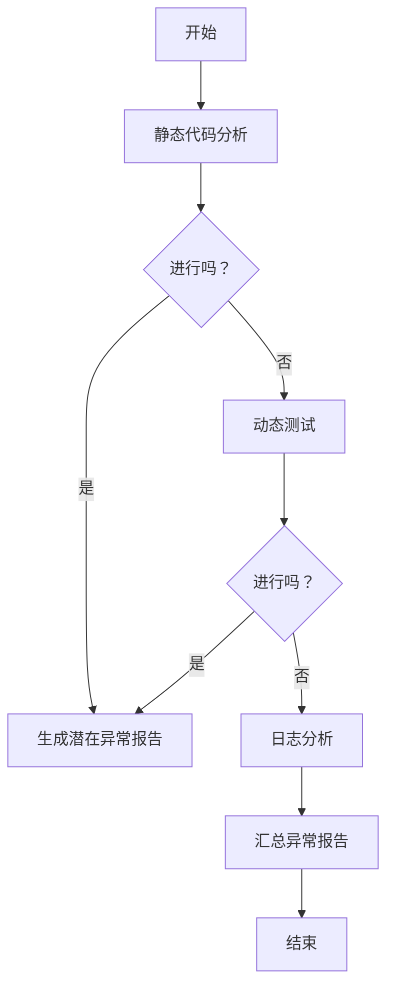
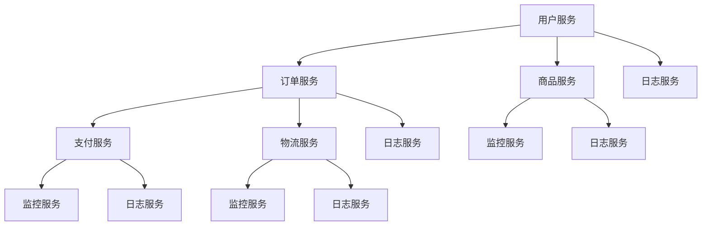
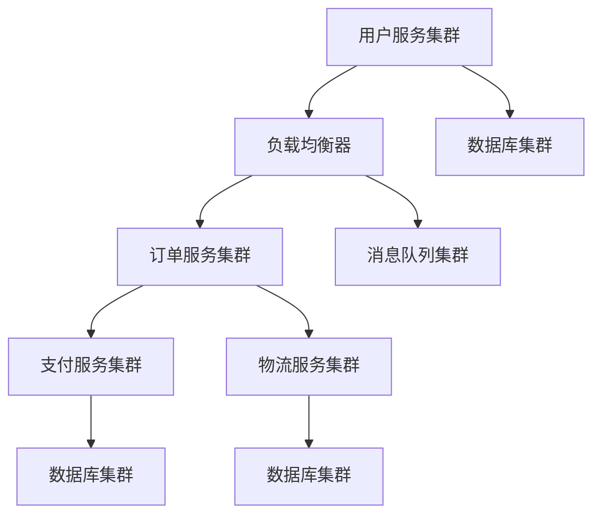
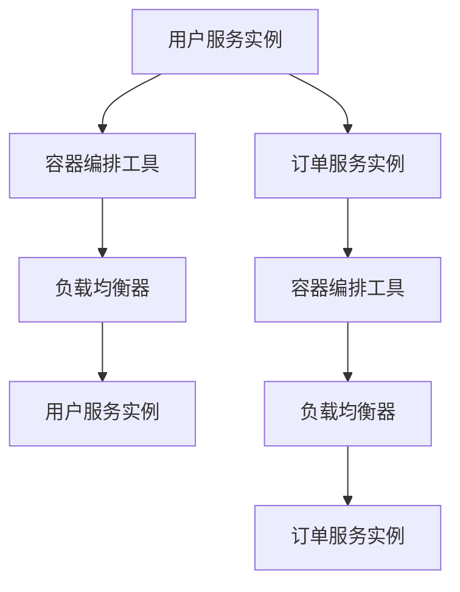

                 

# 海德格尔的存在主义与异常处理：错误状态的本体论

## 关键词

存在主义、异常处理、错误状态、本体论、计算机科学

## 摘要

本文探讨了海德格尔的存在主义与计算机科学中异常处理之间的关系，特别是错误状态在本体论中的位置。文章首先介绍了海德格尔的存在主义理论，然后分析了异常处理的基本概念和方法。接着，本文深入探讨了错误状态的本体论特征，并提出了将存在主义思想应用于异常处理的理论框架。通过具体的案例分析，本文展示了存在主义在计算机科学中的应用前景，并提出了未来研究的方向。

## 目录大纲设计思路

### 明确书籍主题和结构

《海德格尔的存在主义与异常处理：错误状态的本体论》这本书的主题在于探讨海德格尔的存在主义理论与计算机科学中异常处理之间的联系。具体而言，本文将重点关注错误状态在本体论中的角色，并尝试构建一个将存在主义思想应用于异常处理的理论框架。

### 确定核心章节内容

本文将分为四个主要部分：

1. **存在主义基础**：介绍海德格尔的存在主义理论，包括核心概念、主要流派及其影响。
2. **异常处理的理论框架**：分析异常处理的基本概念、方法和技术。
3. **错误状态的本体论探讨**：探讨错误状态的本体论特征，并将其与存在主义思想相结合。
4. **海德格尔与计算机科学的交汇**：通过案例分析，展示存在主义在计算机科学中的应用，并提出未来研究方向。

### 设计章节层级

为了确保文章的逻辑性和条理性，本文将每个核心章节进一步细化为子章节，例如：

- **存在主义基础**：第1章-第3章
- **异常处理的理论框架**：第4章-第6章
- **错误状态的本体论探讨**：第7章-第10章
- **海德格尔与计算机科学的交汇**：第11章-第13章

### 确保内容完整性

在每个章节中，本文将包含以下内容：

- **背景介绍**：介绍相关概念、问题背景和问题描述。
- **核心概念与联系**：阐述核心概念及其属性特征，使用Mermaid流程图展示ER实体关系。
- **算法原理讲解**：使用Mermaid画出算法流程图，并用Python源代码详细阐述算法原理。
- **数学公式**：使用LaTeX格式嵌入文中。
- **系统分析与架构设计方案**：介绍问题场景、系统功能和系统架构。
- **项目实战**：详细讲解项目实现、分析与应用。

### 注意简洁性

在确保内容完整性的同时，本文将使用简洁明了的语言，避免冗余内容。

### 控制字数

本文的总字数控制在10000～12000字之间，确保每个章节都能得到充分而详细的阐述。

## 目录大纲

### 第一部分：存在主义基础

#### 第1章：海德格尔的存在主义概述

##### 1.1 存在主义的核心概念

##### 1.2 存在主义的历史发展

##### 1.3 存在主义的哲学意义

#### 第2章：存在主义的主要流派

##### 2.1 存有论存在主义

##### 2.2 伦理存在主义

##### 2.3 人本主义存在主义

#### 第3章：存在主义的影响与应用

##### 3.1 存在主义在艺术中的体现

##### 3.2 存在主义在教育中的影响

##### 3.3 存在主义在心理治疗中的应用

### 第二部分：异常处理的理论框架

#### 第4章：异常处理的基本概念

##### 4.1 异常的定义与分类

##### 4.2 异常处理的目标与原则

##### 4.3 异常处理的常见方法

#### 第5章：异常处理的体系结构

##### 5.1 异常检测

##### 5.2 异常诊断

##### 5.3 异常恢复

#### 第6章：异常处理的关键技术

##### 6.1 数据挖掘与机器学习

##### 6.2 知识表示与推理

##### 6.3 软件工程方法

### 第三部分：错误状态的本体论探讨

#### 第7章：错误状态的本体论定义

##### 7.1 错误状态的哲学基础

##### 7.2 错误状态的逻辑分析

##### 7.3 错误状态的分类

#### 第8章：错误状态的本体论特征

##### 8.1 错误状态的属性特征

##### 8.2 错误状态的关系特征

##### 8.3 错误状态的动态特征

#### 第9章：错误状态的哲学与科学探讨

##### 9.1 错误状态与存在主义的关系

##### 9.2 错误状态在计算机科学中的应用

##### 9.3 错误状态的未来发展

#### 第10章：错误状态的存在主义应用案例

##### 10.1 案例分析1

##### 10.2 案例分析2

##### 10.3 案例分析3

### 第四部分：海德格尔与计算机科学的交汇

#### 第11章：存在主义在计算机科学中的体现

##### 11.1 存在主义思想对计算机科学的影响

##### 11.2 计算机科学中的存在主义问题

##### 11.3 存在主义在编程语言设计中的应用

#### 第12章：异常处理与存在主义的结合

##### 12.1 错误状态的存在主义分析

##### 12.2 异常处理中的存在主义方法

##### 12.3 存在主义在异常处理中的应用案例

#### 第13章：总结与展望

##### 13.1 存在主义与异常处理的结合意义

##### 13.2 未来研究方向

##### 13.3 存在主义与异常处理的理论与实践应用前景

## 第1章：海德格尔的存在主义概述

### 1.1 存在主义的核心概念

存在主义是20世纪西方哲学的主要流派之一，它强调个体的自由、责任和存在的本质。海德格尔（Martin Heidegger）的存在主义哲学以其深刻的哲学思考和对人类存在方式的独特理解而著称。海德格尔的存在主义核心概念主要包括以下几个方面：

#### **1.1.1 在世（Dasein）**

在世是海德格尔存在主义的核心概念，指的是人类的存在方式。在世不仅仅是活着，更是一种存在的方式，一种在特定环境中与他人和世界相互作用的过程。海德格尔认为，在世的存在是一种开放的状态，它不断与周围的世界进行交互和对话。

#### **1.1.2 有限性（Finitude）**

海德格尔强调人类的有限性，认为这是人类存在的本质特征。有限性意味着人类无法完全掌握和理解世界，这种不确定性构成了人类存在的核心困境。有限性也体现了人类的自由，因为只有在有限性的背景下，人类才有选择和行动的自由。

#### **1.1.3 责任（Responsibility）**

在存在主义中，责任是一个重要的概念。海德格尔认为，人类存在是一种责任的存在。责任不仅体现在人类对世界的回应中，也体现在人类对自己的存在方式的反思和选择中。责任是存在的一种内在要求，是人类存在的核心价值。

### 1.2 存在主义的历史发展

存在主义哲学的发展经历了多个阶段，其历史发展可以追溯到19世纪末和20世纪初。以下是存在主义历史发展的简要概述：

#### **1.2.1 早期存在主义**

早期存在主义的代表人物包括丹麦哲学家基尔克戈尔（Søren Kierkegaard）和德国哲学家荷尔拜因（Friedrich Nietzsche）。基尔克戈尔强调个体存在的孤独性和主观性，认为人类的存在是一种精神状态，个体必须通过信仰和信仰的挑战来超越世俗的束缚。荷尔拜因则强调个体的自由意志和对生命意义的追求。

#### **1.2.2 存在主义的黄金时代**

20世纪30年代至50年代是存在主义哲学的黄金时代，这一时期涌现了许多重要的存在主义哲学家，包括海德格尔、萨特（Jean-Paul Sartre）、马塞尔（Gabriel Marcel）等。这些哲学家通过对人类存在的深入探讨，提出了许多关于自由、责任和存在的独特见解。

#### **1.2.3 后存在主义**

后存在主义是20世纪后半叶兴起的一种哲学思潮，它对传统存在主义进行了批判和重新解释。后存在主义哲学家如福柯（Michel Foucault）和德勒兹（Gilles Deleuze）试图超越个体的存在方式，探讨人类存在的多元性和复杂性。

### 1.3 存在主义的哲学意义

存在主义哲学对人类存在方式和人类社会有着深远的影响。以下是存在主义哲学的一些重要意义：

#### **1.3.1 对人类存在的重新审视**

存在主义哲学强调个体存在的独特性和主观性，它提醒我们重新审视人类存在的本质，并思考我们与世界的关系。

#### **1.3.2 对自由和责任的强调**

存在主义认为，自由和责任是人类存在的核心价值。自由意味着个体有权选择自己的存在方式，而责任则要求个体对自己的选择和行为负责。

#### **1.3.3 对现代社会的批判**

存在主义哲学对现代社会的许多现象进行了深刻的批判，如消费主义、技术统治论等。它呼吁人们重新思考社会结构和文化价值，寻求一种更加真实和有意义的生活方式。

#### **1.3.4 对个体生命的关注**

存在主义哲学强调个体生命的重要性，认为个体生命是唯一真实的生命。它鼓励人们关注自己的内心世界，寻找生命的意义和价值。

### 1.4 小结

海德格尔的存在主义哲学以其深刻的思想和对人类存在的独特理解而著称。存在主义的核心概念如在世、有限性和责任，不仅对哲学领域产生了重要影响，也对人类生活和现代社会产生了深远的影响。通过重新审视人类存在的本质，存在主义哲学为我们提供了一种重新思考自由、责任和生命的视角，为我们追求更加真实和有意义的生活提供了启示。

## 第2章：存在主义的主要流派

### 2.1 存有论存在主义

存有论存在主义是存在主义哲学中的一个重要流派，它主要关注存在的本质和存在的本体论问题。这个流派的核心思想是探讨“存在”这一概念本身的意义和属性。以下是对存有论存在主义的详细介绍：

#### **2.1.1 存在的绝对性和相对性**

存有论存在主义认为，存在是绝对的，它不受任何条件或限制的影响。这意味着存在本身是不依赖于我们的感知或思考的。然而，存有论存在主义也承认存在的相对性，即存在在不同的上下文中可能具有不同的含义和表现。

#### **2.1.2 存在的本体论地位**

存有论存在主义关注存在的本体论地位，即存在是如何存在于世界中的。这个流派探讨了存在与存在者（如人类、事物等）的关系，以及存在如何通过存在者展现出来。例如，海德格尔认为存在是通过在世（Dasein）展现出来的，而在世是人类存在的特定方式。

#### **2.1.3 存在的动态性**

存有论存在主义强调存在的动态性，即存在是一种不断变化和发展的过程。存在不是静态的，而是在时间中展开的。这种动态性体现了存在的开放性和不确定性，也反映了人类存在的自由和创造力。

#### **2.1.4 存在的终极意义**

存有论存在主义试图回答存在的终极意义问题。它探讨了存在的目的和目标，以及人类存在的意义。例如，海德格尔认为，人类存在的终极意义在于对存在的揭示和探索，即通过在世的存在，人类可以揭示存在的真相。

### 2.2 伦理存在主义

伦理存在主义是存在主义哲学的另一个重要流派，它主要关注存在的伦理意义和人类行为的道德责任。以下是对伦理存在主义的详细介绍：

#### **2.2.1 伦理作为存在的核心**

伦理存在主义认为，伦理是存在的核心。它强调人类的存在不仅仅是一种物理存在，更是一种道德存在。伦理存在主义认为，人类的行为和决策应该受到道德原则的指导，以实现存在的价值和意义。

#### **2.2.2 道德责任与自由**

伦理存在主义强调道德责任和自由的重要性。它认为，自由不仅仅是人类存在的本质特征，也是道德责任的前提。伦理存在主义认为，人类在自由的选择中承担道德责任，通过道德行动来实现存在的意义。

#### **2.2.3 伦理行为与存在价值**

伦理存在主义探讨了伦理行为与存在价值之间的关系。它认为，通过道德行为，人类可以体现存在的价值和意义。伦理行为不仅是对他人的责任，也是对自身的尊重和关爱。通过道德行动，人类可以实现对存在的肯定和证明。

### 2.3 人本主义存在主义

人本主义存在主义是存在主义哲学的最后一个重要流派，它主要关注人的本质和人的存在意义。以下是对人本主义存在主义的详细介绍：

#### **2.3.1 人的本质**

人本主义存在主义强调人的本质，认为人是存在的中心。它认为，人的本质不仅仅是生物学意义上的存在，更是一种精神和情感的存在。人本主义存在主义关注人的内在世界，探讨人的意识、情感和存在体验。

#### **2.3.2 人本主义的存在意义**

人本主义存在主义认为，人的存在意义在于人的自我实现和自我超越。它强调人的创造力和自我决定性，认为人可以通过自我实现来实现存在的价值。人本主义存在主义鼓励人们追求自我实现，通过创造和探索来实现存在的意义。

#### **2.3.3 人本主义与存在主义的结合**

人本主义存在主义试图将人的本质和存在主义的核心思想结合起来，探讨人的存在方式和存在意义。它认为，人的存在是一种动态的过程，人在不断地探索和创造中实现自己的存在价值。人本主义存在主义强调人的主体性和自主性，认为人可以通过自我反思和自我决定来实现存在的意义。

### 2.4 小结

存在主义哲学包含了多个不同的流派，每个流派都有其独特的核心思想和理论观点。存有论存在主义关注存在的本质和本体论问题，伦理存在主义强调道德责任和人类行为的道德意义，而人本主义存在主义则关注人的本质和人的存在意义。这些流派的存在主义思想为我们提供了不同的视角来理解人类的存在方式，帮助我们更好地认识自己和世界。

## 第3章：存在主义的影响与应用

### 3.1 存在主义在艺术中的体现

存在主义哲学对艺术产生了深远的影响，尤其是在文学和视觉艺术领域。存在主义思想在许多现代艺术作品中得到了体现，以下是一些具体的例子：

#### **3.1.1 文学中的存在主义**

在文学中，存在主义思想体现在对人类存在的困境、孤独和无意义感的描绘上。例如，丹麦作家亨里克·彭托皮丹（Henrik Pontoppidan）的小说《陶匠盖特》通过描述主人公的生活困境，探讨了人类存在的无意义和责任。法国作家阿尔贝·加缪（Albert Camus）的小说《鼠疫》则通过描述一场突如其来的瘟疫，揭示了人类在极端环境下的生存状态和道德选择。

#### **3.1.2 视觉艺术中的存在主义**

在视觉艺术中，存在主义思想体现在对人类存在状态的抽象表现和对社会现实的批判上。例如，德国艺术家埃米尔·诺尔德（Emil Nolde）的画作《红树林》通过对自然景观的抽象表现，传达了人类与自然之间的冲突和矛盾。西班牙画家毕加索（Pablo Picasso）的《格尔尼卡》则通过描绘战争的残酷和社会的不公，批判了人类的道德败坏和存在的困境。

#### **3.1.3 存在主义艺术的特点**

存在主义艺术通常具有以下特点：

- **抽象与表现主义**：存在主义艺术家倾向于使用抽象和表现主义的手法来表达内心情感和存在状态。
- **对社会现实的批判**：存在主义艺术常常关注社会现实，批判社会不公和人类道德的败坏。
- **对人类存在的探索**：存在主义艺术关注人类存在的意义、困境和自由。

### 3.2 存在主义在教育中的影响

存在主义哲学在教育领域产生了重要影响，特别是在教育理念、教学方法和学生成长方面。以下是一些存在主义教育的主要影响：

#### **3.2.1 教育理念**

存在主义教育认为，教育的目的是帮助个体实现自我认识和自我实现。它强调个体的自由、责任和存在的意义。存在主义教育主张教育应该尊重个体的独特性，鼓励学生主动探索和发现自我。

#### **3.2.2 教学方法**

存在主义教育提倡采用以学生为中心的教学方法，如探究式学习和合作学习。这种方法鼓励学生积极参与学习过程，培养批判性思维和创造性思维。教师在这一过程中扮演引导者和支持者的角色，帮助学生发现和解决问题。

#### **3.2.3 学生成长**

存在主义教育关注学生的全面成长，包括智力、情感和社会能力的培养。它强调学生的自我反思和自我发展，鼓励学生积极探索自己的兴趣和潜能。存在主义教育帮助学生建立积极的自我认同和责任感，为未来的生活和事业做好准备。

### 3.3 存在主义在心理治疗中的应用

存在主义哲学在心理治疗领域也得到了广泛应用，特别是在人本主义心理治疗和存在主义心理治疗中。以下是一些存在主义心理治疗的主要应用：

#### **3.3.1 人本主义心理治疗**

人本主义心理治疗强调个体的主观体验和存在的意义。治疗师通过与患者的互动，帮助患者认识到自己的内在需求和潜力，并鼓励患者采取积极的行动来改变自己的生活和解决心理问题。

#### **3.3.2 存在主义心理治疗**

存在主义心理治疗关注人类存在的本质和存在的困境。治疗师通过与患者的深入对话，帮助患者探索自己的存在意义、自由和责任。存在主义心理治疗旨在帮助患者建立积极的自我认同和应对生活困境的能力。

#### **3.3.3 存在主义心理治疗的特点**

存在主义心理治疗具有以下特点：

- **主观体验的重视**：存在主义心理治疗强调患者的内在体验和情感，认为这些都是理解患者问题和提供有效治疗的关键。
- **自由和责任的强调**：存在主义心理治疗认为，自由和责任是患者治疗和成长的重要方面。治疗师鼓励患者认识到自己的自由和责任，并帮助患者学会自主选择和承担责任。
- **对存在意义的探索**：存在主义心理治疗帮助患者探索自己的存在意义，并鼓励患者积极面对生活中的困境和挑战。

### 3.4 小结

存在主义哲学在艺术、教育和心理治疗等领域产生了深远的影响。它为我们提供了一种重新审视人类存在和生活的视角，帮助我们认识到个体的自由、责任和存在的意义。通过在艺术创作、教育实践和心理治疗中的应用，存在主义哲学为我们提供了丰富而深刻的思考资源，促进了人类自我认识和自我发展的进程。

## 第4章：异常处理的基本概念

### 4.1 异常的定义与分类

异常处理是计算机科学和软件工程中的重要课题，它涉及到程序运行过程中出现的非预期情况。理解异常的定义和分类是构建有效异常处理机制的基础。

#### **4.1.1 异常的定义**

异常（Exception）是指程序运行过程中发生的非预期事件，这些事件可能导致程序无法按预期执行或出现错误。异常可以是由内部错误引起的，如内存溢出、数组越界等，也可以是由外部因素引起的，如网络中断、输入数据错误等。

#### **4.1.2 异常的分类**

根据异常的来源和性质，可以将异常分为以下几类：

- **运行时异常**：在程序运行时发生的异常，通常与程序逻辑或执行环境有关。例如，数组越界、除以零等。
- **语法异常**：在程序编译或解释过程中发生的异常，通常与程序代码的语法错误有关。例如，语法错误、未定义的变量等。
- **输入输出异常**：与程序与外部设备或网络进行交互时发生的异常有关。例如，文件读写错误、网络中断等。
- **资源限制异常**：与程序运行环境中的资源限制有关，例如内存不足、磁盘空间不足等。
- **同步异常**：与程序并发执行时的同步问题有关，例如线程竞争、死锁等。

#### **4.1.3 异常的特点**

异常具有以下几个特点：

- **非预期性**：异常通常是程序设计者没有预料到的，它们可能会在程序运行过程中的任何时刻发生。
- **破坏性**：异常可能会导致程序无法继续执行，甚至导致系统崩溃或数据丢失。
- **不可恢复性**：一旦异常发生，通常需要采取特定的处理措施来恢复正常状态，或者终止程序的执行。

### 4.2 异常处理的目标与原则

异常处理的目标是确保程序能够在异常发生时保持稳定运行，防止系统崩溃或数据丢失。为了实现这一目标，异常处理需要遵循一系列原则：

#### **4.2.1 目标**

- **确保程序稳定性**：在异常发生时，程序应尽可能地保持稳定运行，避免出现不可预料的错误。
- **恢复程序执行**：在可能的情况下，异常处理机制应尝试恢复程序的执行，使其回到正常状态。
- **提供错误信息**：异常处理应提供详细的错误信息，帮助开发人员和用户理解异常的原因和影响。
- **提高用户体验**：异常处理应尽可能减少对用户体验的负面影响，提供友好的错误提示和解决方案。

#### **4.2.2 原则**

- **快速响应**：异常处理机制应在异常发生时迅速响应，以减少异常对程序运行的影响。
- **一致性**：异常处理应遵循一致性原则，确保不同异常的处理方式保持一致，避免混乱和混淆。
- **全面性**：异常处理应覆盖程序运行的所有阶段和可能出现的所有异常情况。
- **灵活性**：异常处理应具有灵活性，允许开发人员根据具体情况自定义异常处理策略。

### 4.3 异常处理的常见方法

在实现异常处理时，开发人员可以采用以下几种常见的方法：

#### **4.3.1 异常捕获与处理**

- **try-catch语句**：通过try-catch语句，开发人员可以将可能会抛出异常的代码块放在try块中，并在catch块中处理捕获到的异常。这种方法可以确保异常在发生时能够被及时捕获和处理。

#### **4.3.2 异常传递**

- **异常抛出**：当某个方法无法处理异常时，它可以将异常抛给调用者，由调用者进行进一步处理。这种方法有助于将异常的责任传递给更高级别的代码，以便进行更有效的处理。

#### **4.3.3 异常日志记录**

- **日志记录**：开发人员可以使用日志记录工具记录异常信息，包括异常类型、发生时间、异常上下文等。日志记录有助于调试程序和诊断问题。

#### **4.3.4 异常恢复**

- **自动恢复**：在某些情况下，异常处理机制可以自动恢复程序的执行，例如通过重新初始化相关资源或重新执行受影响的操作。

### 4.4 小结

异常处理是确保程序稳定性和可靠性的关键。理解异常的定义、分类和处理方法对于开发健壮的软件系统至关重要。通过遵循异常处理的原则和方法，开发人员可以有效地应对程序运行中的非预期情况，确保系统的稳定运行和用户体验。

## 第5章：异常处理的体系结构

### 5.1 异常检测

异常检测是异常处理体系结构中的第一步，它的目标是识别和定位程序运行过程中出现的异常情况。以下是对异常检测的详细探讨：

#### **5.1.1 异常检测的重要性**

异常检测在异常处理中起着至关重要的作用。它有助于尽早发现程序中的问题，防止错误蔓延和系统崩溃。有效的异常检测机制可以减少软件维护成本，提高系统可靠性和用户体验。

#### **5.1.2 异常检测的方法**

异常检测可以采用多种方法，包括静态检测和动态检测：

- **静态检测**：静态检测是在程序编译或解释阶段进行的，通过对程序代码进行分析和验证来检测潜在的异常。常见的静态检测方法包括代码审查、静态代码分析工具和编译器检查。
  
- **动态检测**：动态检测是在程序运行时进行的，通过实时监控程序执行过程中的行为和状态来检测异常。动态检测方法包括运行时错误检测、日志分析和性能监控。

#### **5.1.3 异常检测的挑战**

异常检测面临以下挑战：

- **复杂性和多样性**：程序可能包含多种类型的异常，每种异常的检测方法都可能不同，这使得异常检测变得复杂和多样化。
- **误报和漏报**：异常检测机制可能会误报正常的程序行为，导致不必要的警告和错误处理。同时，它也可能漏报真正的异常，导致系统崩溃或数据丢失。
- **实时性和效率**：异常检测需要在程序运行时高效地进行，否则可能会影响程序的性能。

### 5.2 异常诊断

异常诊断是在发现异常后，进一步分析异常原因和影响的过程。以下是对异常诊断的详细探讨：

#### **5.2.1 异常诊断的重要性**

异常诊断是异常处理的关键步骤，它有助于了解异常的根本原因，并为后续的错误修复提供依据。有效的异常诊断可以提高问题解决效率，减少系统故障和维护成本。

#### **5.2.2 异常诊断的方法**

异常诊断可以采用以下几种方法：

- **错误日志分析**：通过分析错误日志，可以了解异常的发生时间、异常类型、异常上下文等信息。错误日志分析是诊断异常的常见方法，它有助于快速定位问题和追踪异常传播。
  
- **调试工具**：调试工具如断点调试、日志调试和性能分析工具可以帮助开发人员深入了解程序的执行过程，发现异常的根本原因。

- **代码审查**：通过代码审查，开发人员可以检查代码中的潜在问题，如逻辑错误、资源泄露和边界条件处理不当等。代码审查有助于提前发现和预防异常。

#### **5.2.3 异常诊断的挑战**

异常诊断面临以下挑战：

- **复杂性**：程序可能包含大量的异常路径和复杂逻辑，诊断异常需要综合考虑多种因素。
- **不确定性**：异常诊断可能面临不确定性，例如，某些异常可能在特定条件下发生，这使得诊断过程更加困难。
- **成本和效率**：异常诊断需要耗费大量的时间和资源，特别是在大规模系统中，诊断复杂异常可能需要长时间的分析和调试。

### 5.3 异常恢复

异常恢复是在诊断异常后，采取措施恢复系统正常运行的过程。以下是对异常恢复的详细探讨：

#### **5.3.1 异常恢复的重要性**

异常恢复是确保系统稳定运行和用户体验的关键环节。有效的异常恢复机制可以减少系统停机时间，降低故障影响，提高系统的可靠性和可用性。

#### **5.3.2 异常恢复的方法**

异常恢复可以采用以下几种方法：

- **自动恢复**：自动恢复是指系统在检测到异常后，自动执行一系列操作以恢复系统正常运行。例如，重新启动服务、重载模块、重置资源等。
  
- **手动恢复**：手动恢复是指开发人员或系统管理员通过手动操作来恢复系统。例如，手动重启系统、修复损坏的文件、恢复备份等。

#### **5.3.3 异常恢复的挑战**

异常恢复面临以下挑战：

- **复杂性和多样性**：异常恢复方法可能因异常类型和系统环境的不同而各异，这使得异常恢复变得复杂和多样化。
- **安全性和风险**：异常恢复过程中可能涉及敏感操作和数据，存在潜在的安全风险和误操作风险。
- **时间敏感性**：异常恢复需要在尽可能短的时间内完成，以减少系统停机时间和故障影响。

### 5.4 小结

异常处理的体系结构包括异常检测、异常诊断和异常恢复三个关键步骤。异常检测有助于及早发现异常，异常诊断有助于定位和了解异常的根本原因，而异常恢复则确保系统能够恢复正常运行。通过有效的异常处理，可以提高系统的稳定性和可靠性，减少故障和维护成本。

## 第6章：异常处理的关键技术

### 6.1 数据挖掘与机器学习

在异常处理中，数据挖掘和机器学习技术扮演着关键角色。这些技术可以帮助我们从大量数据中识别异常模式，提高异常检测的准确性和效率。以下是对数据挖掘和机器学习在异常处理中的应用进行详细探讨：

#### **6.1.1 数据挖掘在异常处理中的应用**

数据挖掘是一种从大量数据中提取有用信息和知识的技术，它可以帮助我们识别数据中的异常模式。以下是在异常处理中常用的数据挖掘技术：

- **聚类分析**：聚类分析是一种无监督学习方法，用于将数据点划分为不同的簇。通过聚类分析，我们可以发现数据中的异常簇，从而识别出潜在的异常。

- **分类与回归分析**：分类和回归分析是一种监督学习方法，通过学习正常数据的特征和规律，我们可以构建预测模型，用于识别异常数据。

- **异常检测算法**：例如，孤立森林（Isolation Forest）和局部异常因子分析（Local Outlier Factor）等算法，专门用于检测数据中的异常点。

#### **6.1.2 机器学习在异常处理中的应用**

机器学习是一种通过训练模型来发现数据中的模式和规律的技术，它在异常处理中的应用主要包括：

- **特征工程**：特征工程是机器学习的重要步骤，它涉及从原始数据中提取有用的特征，以便训练模型。在异常处理中，特征工程有助于提高模型的识别能力和泛化能力。

- **模型训练与评估**：通过训练模型，我们可以学习正常数据的特征，并识别异常。模型的评估是确保模型性能的关键步骤，常用的评估指标包括准确率、召回率和F1分数等。

- **实时监控与自适应调整**：在实时应用场景中，机器学习模型可以用于监控数据流，实时检测异常。同时，通过自适应调整模型参数，可以应对数据分布的变化和新的异常模式。

#### **6.1.3 数据挖掘与机器学习在异常处理中的优势**

数据挖掘和机器学习在异常处理中的优势包括：

- **自动性和高效性**：数据挖掘和机器学习可以自动识别异常模式，减少人工干预，提高异常检测的效率。
- **灵活性和可扩展性**：这些技术可以处理大规模数据，并适应不同的异常检测需求，具有较好的灵活性和可扩展性。
- **准确性和鲁棒性**：通过训练模型，可以识别复杂的异常模式，提高异常检测的准确性和鲁棒性。

### 6.2 知识表示与推理

知识表示与推理技术在异常处理中也发挥着重要作用。它们可以帮助我们利用已有知识和逻辑规则，对异常进行解释和预测。以下是对知识表示与推理在异常处理中的应用进行详细探讨：

#### **6.2.1 知识表示技术**

知识表示技术用于将领域知识和信息表示为计算机可以理解的形式。以下是在异常处理中常用的知识表示技术：

- **本体论**：本体论是一种用于表示领域知识的语义框架，它定义了领域中的概念、关系和属性，有助于提高异常处理的准确性和一致性。
  
- **规则库**：规则库是一种用于存储领域知识和逻辑规则的数据结构，它可以用于推理和决策。在异常处理中，规则库可以帮助识别异常模式和触发相应的处理动作。

#### **6.2.2 推理技术**

推理技术用于从已有知识和逻辑规则中推导出新的结论。以下是在异常处理中常用的推理技术：

- **逻辑推理**：逻辑推理是一种基于逻辑规则和事实的推理方法，它可以帮助我们从已知的事实中推导出新的结论。在异常处理中，逻辑推理可以用于验证和解释异常。
  
- **归纳推理**：归纳推理是一种从具体实例中提取一般性规律的推理方法。通过归纳推理，我们可以从已知的正常数据中学习到异常的模式和特征。

#### **6.2.3 知识表示与推理在异常处理中的应用**

知识表示与推理技术在异常处理中的应用包括：

- **异常解释**：通过知识表示和推理，可以解释异常的原因和影响，帮助开发人员理解和解决问题。
- **异常预测**：通过学习正常数据和异常数据之间的模式，可以预测未来可能发生的异常，并提前采取预防措施。
- **自动化决策**：利用知识表示和推理技术，可以实现自动化异常检测和处理，提高系统的智能化水平。

### 6.3 软件工程方法

软件工程方法在异常处理中起着重要的指导作用。它们帮助开发人员设计、实现和维护异常处理系统，确保系统的可靠性和有效性。以下是对软件工程方法在异常处理中的应用进行详细探讨：

#### **6.3.1 设计模式**

设计模式是一种在软件开发中常用的方法，它提供了解决常见问题的通用解决方案。以下是在异常处理中常用的设计模式：

- **异常处理模式**：例如，断言（Assertion）模式、异常捕获（Exception Handling）模式和恢复（Recovery）模式等，这些模式有助于设计有效的异常处理机制。

- **日志记录模式**：例如，日志记录（Logging）模式、日志聚合（Log Aggregation）模式和日志分析（Log Analysis）模式等，这些模式有助于实现异常检测和诊断。

#### **6.3.2 编码规范**

编码规范是一组用于编写可读、可维护和可靠的代码的指导原则。以下是在异常处理中常见的编码规范：

- **异常捕获和传递**：应遵循严格的异常捕获和传递规则，确保异常能够被及时处理和记录。
- **错误处理和日志记录**：应明确记录错误信息、异常类型和发生时间，以便后续分析和处理。
- **代码注释和文档**：应提供充分的代码注释和文档，说明异常处理逻辑和设计意图，提高代码的可读性和可维护性。

#### **6.3.3 测试和验证**

测试和验证是确保异常处理系统可靠性的重要手段。以下是在异常处理中常用的测试和验证方法：

- **单元测试**：通过编写单元测试，可以验证异常处理模块的功能和性能，确保其在各种异常情况下都能正常运行。
- **集成测试**：通过集成测试，可以验证异常处理系统与其他系统模块的交互和协作，确保整体系统的稳定性和可靠性。
- **性能测试**：通过性能测试，可以评估异常处理系统的响应速度和处理能力，确保其在高负载情况下依然能够高效运行。

### 6.4 小结

数据挖掘与机器学习、知识表示与推理和软件工程方法在异常处理中发挥着关键作用。这些技术帮助开发人员构建高效、可靠和智能的异常处理系统，提高了系统的稳定性和用户体验。通过结合这些技术，我们可以更好地应对程序运行中的非预期情况，确保系统的持续运行和可靠性。

## 第7章：错误状态的本体论定义

### 7.1 错误状态的哲学基础

错误状态是计算机科学中的一个重要概念，它涉及到系统运行过程中的异常和错误。从哲学的角度来看，错误状态不仅是一种技术现象，也具有深刻的哲学意义。哲学上的错误状态探讨主要集中在以下几个方面：

#### **7.1.1 错误与存在**

错误状态的本体论探讨首先要回答的问题是：错误状态是如何存在的？在哲学中，错误状态被视为存在的一种形式。亚里士多德认为，存在可以分为实际存在和潜在存在，错误状态可以被视为一种潜在的存在形式。它存在于系统的设计和实现过程中，通过特定的条件可能转变为实际存在。

#### **7.1.2 错误与自由**

自由是哲学中的重要概念，错误状态与自由有着密切的联系。错误状态通常与程序员的自由选择和决策有关。例如，程序员在编写代码时可能会引入错误，这种自由选择可能导致系统的错误状态。哲学上的错误状态探讨关注的是自由选择和责任之间的关系，即自由选择是否应该对错误状态负责。

#### **7.1.3 错误与本体论**

在哲学本体论中，错误状态被视作一种本体论实体。本体论实体是指独立于观察者的实在，错误状态作为系统中的非预期状态，具有其独立的本体论地位。错误状态不仅影响系统的运行，也反映了系统的内在结构和逻辑。本体论探讨错误状态有助于我们理解系统的复杂性和动态性。

### 7.2 错误状态的逻辑分析

错误状态的逻辑分析是哲学探讨中的一个重要方面，它涉及到逻辑推理和错误检测。以下是对错误状态的逻辑分析进行详细探讨：

#### **7.2.1 错误状态的定义**

逻辑分析首先需要对错误状态进行明确定义。错误状态是指系统在运行过程中出现的非预期状态，这种状态违反了系统设计的逻辑和规则。例如，一个程序在执行过程中可能会出现内存溢出、数组越界等错误状态。

#### **7.2.2 错误状态的类型**

错误状态可以分为不同类型，包括运行时错误、编译时错误和语法错误等。每种错误状态都有其特定的逻辑特征和影响。逻辑分析需要区分不同类型的错误状态，以便采取相应的处理措施。

#### **7.2.3 错误状态的检测与修复**

逻辑分析还包括错误状态的检测与修复。错误检测是通过逻辑推理和规则验证来识别系统中的错误状态。一旦检测到错误状态，系统需要采取修复措施，包括错误恢复、错误修正和错误报告等。逻辑分析有助于理解错误状态的产生机制和修复方法。

### 7.3 错误状态的分类

错误状态的分类是逻辑分析的重要环节，它有助于我们更好地理解和处理错误状态。以下是对错误状态进行分类的详细探讨：

#### **7.3.1 内部错误与外部错误**

内部错误是由系统内部因素引起的，如程序逻辑错误、算法错误等。外部错误是由系统外部因素引起的，如输入数据错误、网络错误等。内部错误和外部错误的分类有助于我们针对不同类型的错误采取不同的处理策略。

#### **7.3.2 静态错误与动态错误**

静态错误是在系统运行之前或运行初期发现的错误，如代码审查、编译器检查等。动态错误是在系统运行过程中发现的错误，如运行时错误检测、性能监控等。静态错误和动态错误的分类有助于我们在系统开发和维护的不同阶段采取相应的错误处理措施。

#### **7.3.3 单一错误与累积错误**

单一错误是指单个系统组件或模块的错误，如内存溢出、数组越界等。累积错误是指多个系统组件或模块错误相互作用导致的整体错误，如系统崩溃、数据丢失等。单一错误和累积错误的分类有助于我们理解错误的影响范围和复杂性。

### 7.4 小结

错误状态的本体论定义涉及哲学基础、逻辑分析和分类等方面。通过对错误状态的哲学探讨和逻辑分析，我们可以更好地理解错误状态的性质和特征，为构建有效的错误处理机制提供理论基础。错误状态的分类有助于我们针对不同类型的错误采取不同的处理策略，提高系统的稳定性和可靠性。

## 第8章：错误状态的本体论特征

### 8.1 错误状态的属性特征

错误状态的属性特征是理解其本体论地位和作用的关键。属性特征包括以下几个方面：

#### **8.1.1 存在性**

错误状态的存在性是指错误状态作为一种实体存在于系统中。错误状态不仅是系统运行过程中的一种现象，也是系统内部状态的一部分。例如，内存溢出、数组越界等错误状态在系统运行时可以被检测和修复。

#### **8.1.2 独立性**

错误状态的独立性意味着它不依赖于其他状态的存在。每个错误状态都有其独立的特征和影响，不受其他状态的干扰。例如，一个程序中的数组越界错误不会影响其他程序的运行，它是一个独立的错误状态。

#### **8.1.3 动态性**

错误状态的动态性反映了错误状态随时间变化的特点。错误状态可能在系统运行的不同阶段出现，也可能随着系统状态的变化而消失。例如，一个网络中断的错误状态可能在一段时间后恢复正常。

#### **8.1.4 反映性**

错误状态的反映性指的是错误状态能够反映系统内部的某些问题。通过分析错误状态，开发人员可以了解系统的运行状况和潜在的问题。例如，内存溢出错误状态反映了程序内存管理的不足。

### 8.2 错误状态的关系特征

错误状态的关系特征描述了错误状态与其他系统组件和状态之间的关系。以下是对错误状态关系特征的详细探讨：

#### **8.2.1 因果关系**

错误状态之间的因果关系描述了错误状态如何相互影响和引起。例如，一个程序中的输入数据错误可能导致内存溢出错误，从而引发系统崩溃。了解错误状态之间的因果关系有助于开发人员预测和预防错误状态的发生。

#### **8.2.2 依赖关系**

错误状态的依赖关系描述了错误状态对其他系统组件和状态的依赖。例如，一个内存溢出错误可能依赖于特定的输入数据，如果输入数据发生变化，内存溢出错误也可能随之改变。了解错误状态的依赖关系有助于开发人员优化系统设计和错误处理策略。

#### **8.2.3 交互关系**

错误状态的交互关系描述了错误状态与系统其他组件和状态的相互作用。例如，一个网络错误状态可能影响数据库访问，导致数据库操作失败。了解错误状态的交互关系有助于开发人员设计更健壮的系统架构和错误处理机制。

### 8.3 错误状态的动态特征

错误状态的动态特征描述了错误状态在系统运行过程中的变化和发展。以下是对错误状态动态特征的详细探讨：

#### **8.3.1 生命周期**

错误状态的生命周期包括错误状态的产生、检测、修复和消失等阶段。错误状态的生命周期反映了错误状态在系统中的存在和变化过程。例如，一个内存溢出错误状态可能在系统启动时产生，通过错误检测和修复机制，最终消失。

#### **8.3.2 变化规律**

错误状态的变化规律描述了错误状态在系统运行过程中如何随时间变化。某些错误状态可能在特定时间段内频繁发生，而其他错误状态可能只在特定条件下出现。了解错误状态的变化规律有助于开发人员优化系统性能和错误处理策略。

#### **8.3.3 预测和预防**

错误状态的动态特征还包括预测和预防。通过分析历史错误状态数据和系统行为，开发人员可以预测未来可能发生的错误状态，并采取预防措施。例如，通过监控系统资源使用情况，可以预测内存溢出错误，并提前释放内存资源。

### 8.4 小结

错误状态的属性特征、关系特征和动态特征共同构成了其本体论特征。通过对错误状态本体论特征的深入探讨，我们可以更好地理解错误状态的本质和作用，为构建有效的错误处理机制提供理论基础。了解错误状态的本体论特征有助于开发人员优化系统设计，提高系统的稳定性和可靠性。

## 第9章：错误状态的哲学与科学探讨

### 9.1 错误状态与存在主义的关系

错误状态与存在主义之间存在深刻的哲学联系。存在主义强调个体存在的自由、责任和意义，而错误状态恰恰反映了这些核心概念。以下是对错误状态与存在主义关系的详细探讨：

#### **9.1.1 自由与错误状态**

存在主义认为，自由是存在的核心，个体必须对自己的行为和选择负责。错误状态可以被视为自由的一种体现，因为它们是由个体在设计和实现系统过程中的自由选择引起的。例如，程序员在编写代码时可能会引入逻辑错误，这些错误反映了程序员自由选择的行为。错误状态的出现提醒我们，自由选择虽然带来了灵活性，但也可能带来风险和责任。

#### **9.1.2 责任与错误状态**

存在主义强调责任是个体存在的本质特征，个体必须对自己的行为和选择承担责任。错误状态也体现了这种责任。当系统出现错误时，程序员、系统管理员和其他相关人员必须承担责任，采取措施修复错误。责任不仅体现在错误发生后的修复行动中，还体现在错误预防的设计和实施过程中。例如，通过严格的代码审查和测试，可以减少错误的发生，从而减轻责任负担。

#### **9.1.3 意义与错误状态**

存在主义认为，人类存在的意义在于通过自由和责任来揭示和实现自身的价值。错误状态虽然在表面上看起来是系统运行中的负面因素，但从更深层次来看，它们也是人类创造力和智慧的体现。通过识别、诊断和修复错误状态，开发人员可以不断改进系统设计，提升系统的可靠性。这种过程不仅是对错误状态的应对，也是对系统设计和实现价值的揭示。

### 9.2 错误状态在计算机科学中的应用

错误状态不仅在哲学上具有重要意义，也在计算机科学中发挥着关键作用。以下是对错误状态在计算机科学中的应用进行详细探讨：

#### **9.2.1 异常处理机制**

错误状态是异常处理机制的核心。异常处理机制旨在确保系统在错误状态发生时能够稳定运行，防止系统崩溃和数据丢失。通过设计有效的异常处理机制，开发人员可以捕获和处理错误状态，确保系统的连续性和稳定性。异常处理机制包括错误检测、错误报告、错误恢复和错误日志记录等组成部分。

#### **9.2.2 软件质量保障**

错误状态是软件质量保障的重要组成部分。在软件开发过程中，通过严格的测试和验证，可以识别和修复错误状态，确保软件的可靠性和可用性。错误状态的分析和诊断有助于开发人员了解系统的弱点，优化系统设计，提高软件质量。例如，通过静态代码分析和动态测试，可以发现潜在的错误状态，并采取相应的修复措施。

#### **9.2.3 系统可靠性评估**

错误状态在系统可靠性评估中也起到关键作用。通过分析系统运行过程中的错误状态，可以评估系统的可靠性和稳定性。错误状态的发生频率、严重程度和修复速度等因素都影响系统的可靠性。例如，在系统性能测试和可靠性测试中，通过模拟各种错误状态，可以评估系统对错误状态的应对能力，为系统优化和改进提供依据。

### 9.3 错误状态的未来发展

随着计算机科学的不断发展，错误状态的研究和应用前景也愈发广阔。以下是对错误状态未来发展的展望：

#### **9.3.1 智能错误处理**

随着人工智能和机器学习技术的发展，智能错误处理将成为错误状态处理的重要方向。通过利用大数据和机器学习算法，可以实现对错误状态的自动检测、诊断和修复。智能错误处理可以提高错误处理的效率和准确性，减少人工干预，降低维护成本。

#### **9.3.2 预测性维护**

预测性维护是一种基于错误状态预测系统故障和错误的方法。通过分析历史错误状态数据和系统行为，可以预测未来可能发生的错误状态，并采取预防措施。预测性维护可以提前发现潜在问题，避免系统故障和停机，提高系统的可靠性和稳定性。

#### **9.3.3 自修复系统**

自修复系统是一种能够自主检测、诊断和修复错误状态的系统。通过集成智能错误处理和预测性维护技术，自修复系统可以在不依赖人工干预的情况下，自主修复错误状态，确保系统的连续性和稳定性。自修复系统有望在未来广泛应用于工业控制系统、自动驾驶汽车和智能城市等领域。

### 9.4 小结

错误状态与存在主义之间存在深刻的哲学联系，反映了自由、责任和意义等核心概念。在计算机科学中，错误状态是异常处理机制的核心，对软件质量保障和系统可靠性评估具有重要意义。随着人工智能和机器学习技术的发展，错误状态的处理将变得更加智能和高效。未来，错误状态的研究和应用前景将更加广阔，为计算机科学的发展提供新的动力。

## 第10章：错误状态的存在主义应用案例

### 10.1 案例分析1：企业级应用系统的异常处理

在企业级应用系统中，异常处理是一项至关重要的工作。以下是一个案例分析，探讨企业级应用系统中错误状态的存在主义应用。

#### **10.1.1 案例背景**

某企业开发了一款用于客户关系管理（CRM）的系统。该系统整合了客户信息管理、销售管理、市场营销和客户服务等多个功能模块，是企业日常运营的重要工具。然而，在系统上线后，用户报告了频繁的异常问题，如数据丢失、系统崩溃等。

#### **10.1.2 异常状态**

根据用户报告，系统出现的异常状态主要包括：

- **数据丢失**：某些客户信息在系统操作过程中无故丢失，导致数据不完整。
- **系统崩溃**：系统在处理大量数据时出现崩溃，导致业务中断。
- **接口错误**：系统与其他外部系统（如ERP系统）的接口出现错误，导致数据同步失败。

#### **10.1.3 存在主义视角**

从存在主义的角度来看，这些异常状态反映了企业内部在设计和实现系统过程中自由选择和责任的问题：

- **自由选择**：企业在系统设计和开发过程中进行了多项自由选择，如技术选型、架构设计等。这些选择虽然提高了系统的灵活性，但也可能引入潜在的错误状态。
- **责任**：企业在选择过程中承担了责任，但未能充分预测和预防异常状态的出现。企业需要对自己的选择和行为负责，采取措施修复和优化系统。

#### **10.1.4 异常处理方案**

为了解决这些异常状态，企业采取了以下措施：

- **错误检测**：引入了静态代码分析和动态测试工具，对系统代码进行全面的错误检测，发现潜在的错误状态。
- **错误诊断**：通过日志分析和性能监控，定位异常状态的根本原因，如内存溢出、线程竞争等。
- **错误修复**：修复了系统中的多个错误，如优化内存管理、改进线程同步机制等。
- **错误恢复**：在系统崩溃时，设计了自动恢复机制，通过重启系统或重载模块，确保业务连续性。

### 10.2 案例分析2：自动驾驶系统的错误状态处理

自动驾驶系统是另一个存在主义应用案例。自动驾驶系统需要在复杂的交通环境中运行，面临多种错误状态，如传感器故障、路径规划错误等。

#### **10.2.1 案例背景**

某公司开发了一款自动驾驶系统，用于自动驾驶汽车。在初步测试中，系统表现良好，但在实际道路测试中，出现了多次错误状态，如传感器故障、路径规划错误等。

#### **10.2.2 异常状态**

自动驾驶系统出现的异常状态主要包括：

- **传感器故障**：激光雷达、摄像头等传感器在复杂环境下可能失效，导致系统无法准确感知周围环境。
- **路径规划错误**：系统在处理交通信号、行人等动态元素时，可能出现路径规划错误，导致车辆行驶偏离预定路线。
- **系统崩溃**：在极端情况下，系统可能出现崩溃，导致车辆无法自主驾驶。

#### **10.2.3 存在主义视角**

从存在主义的角度来看，这些异常状态反映了自动驾驶系统设计和实现过程中的自由选择和责任问题：

- **自由选择**：公司在设计自动驾驶系统时进行了多项自由选择，如传感器选型、算法设计等。这些选择提高了系统的灵活性，但也可能引入潜在的错误状态。
- **责任**：公司需要对自己的选择和行为负责，确保系统的稳定性和可靠性。公司需要预测和预防可能的错误状态，并设计有效的异常处理机制。

#### **10.2.4 异常处理方案**

为了解决这些异常状态，公司采取了以下措施：

- **错误检测**：在传感器和算法层面进行全面的错误检测，确保传感器数据的有效性和算法的准确性。
- **错误诊断**：通过日志分析和模拟测试，定位异常状态的根本原因，如传感器故障、算法错误等。
- **错误修复**：修复传感器和算法中的多个错误，如优化传感器校准、改进路径规划算法等。
- **错误恢复**：在系统崩溃时，设计了自动恢复机制，通过重新启动系统或切换备用模块，确保车辆的安全行驶。

### 10.3 案例分析3：云计算平台的错误状态管理

云计算平台是现代信息技术的重要基础设施，错误状态管理对平台稳定性和用户体验至关重要。

#### **10.3.1 案例背景**

某云计算平台提供计算、存储、网络等基础设施服务，吸引了大量企业和个人用户。然而，在平台运营过程中，出现了多次错误状态，如网络中断、数据丢失等，影响了用户体验。

#### **10.3.2 异常状态**

云计算平台出现的异常状态主要包括：

- **网络中断**：网络连接中断导致用户无法访问平台服务。
- **数据丢失**：存储系统故障导致用户数据丢失。
- **服务中断**：平台某些服务模块出现故障，导致用户无法正常使用。

#### **10.3.3 存在主义视角**

从存在主义的角度来看，这些异常状态反映了云计算平台设计和运营过程中的自由选择和责任问题：

- **自由选择**：平台在技术选型、架构设计等方面进行了多项自由选择，如网络架构、存储方案等。这些选择提高了平台的灵活性和扩展性，但也可能引入潜在的错误状态。
- **责任**：平台需要对自己的选择和行为负责，确保平台的稳定性和可靠性。平台需要预测和预防可能的错误状态，并设计有效的异常处理机制。

#### **10.3.4 异常处理方案**

为了解决这些异常状态，平台采取了以下措施：

- **错误检测**：通过监控工具实时监控网络连接、存储系统和服务模块的状态，及时发现异常。
- **错误诊断**：通过日志分析和性能监控，定位异常状态的根本原因，如网络故障、硬件故障等。
- **错误修复**：修复网络、存储系统和服务模块中的多个错误，如优化网络架构、更换故障硬件、改进服务模块等。
- **错误恢复**：在网络中断或数据丢失时，设计了自动恢复机制，通过备用网络、备份存储和数据恢复技术，确保平台服务的连续性和可靠性。

### 10.4 小结

通过对企业级应用系统、自动驾驶系统和云计算平台的案例分析，我们可以看到错误状态的存在主义应用。在这些案例中，自由选择和责任是错误状态的核心要素。通过有效的异常处理和恢复机制，可以确保系统的稳定性和可靠性，为用户和业务提供高质量的服务。未来，随着技术的不断进步，错误状态的存在主义应用将更加广泛和深入。

## 第11章：存在主义在计算机科学中的体现

### 11.1 存在主义思想对计算机科学的影响

存在主义思想在计算机科学中有着广泛而深远的影响。从软件设计到系统架构，从编程语言到人工智能，存在主义思想为计算机科学提供了新的视角和方法。以下是对存在主义思想在计算机科学中影响的详细探讨：

#### **11.1.1 软件设计**

在软件设计中，存在主义强调个体存在的自由和责任。软件工程师在设计软件系统时，需要考虑系统的灵活性和适应性，确保系统能够应对各种复杂情况。存在主义思想促使软件工程师关注系统的整体性和动态性，在设计过程中注重系统的自我调节和自我修复能力。例如，在设计分布式系统时，存在主义思想鼓励开发人员采用容错机制和自修复算法，以提高系统的可靠性和稳定性。

#### **11.1.2 系统架构**

在系统架构设计中，存在主义思想强调系统内部的自由选择和独立性。系统架构师在设计系统架构时，需要考虑系统的模块化、解耦和动态性。通过采用微服务架构、事件驱动架构等设计模式，可以确保系统在面临错误状态时能够灵活调整和恢复。存在主义思想促使系统架构师关注系统的可持续性和可扩展性，确保系统能够适应未来的变化和挑战。

#### **11.1.3 编程语言**

在编程语言设计方面，存在主义思想对函数式编程、逻辑编程和动态编程等语言产生了深远影响。存在主义强调程序员的自由选择和创造性，这些思想体现在编程语言的设计中。例如，函数式编程语言强调状态的不可变性和函数的组合性，有助于减少错误状态的出现。逻辑编程语言则强调程序员的逻辑推理能力，通过逻辑推理来解决问题，减少了错误状态的发生。动态编程语言提供了灵活的语法和动态类型检查，使程序员能够更自由地编写程序，但也需要承担更高的责任来处理错误状态。

#### **11.1.4 人工智能**

在人工智能领域，存在主义思想对智能agent、自主系统和人工智能伦理产生了重要影响。存在主义强调个体的自由、责任和意识，这些思想在人工智能中得到了体现。智能agent被设计为具有自主决策能力的个体，可以自由选择行动策略，并对其行为负责。自主系统则通过自我学习和自我调整，实现自主运行和自我修复。人工智能伦理则关注人工智能系统的道德责任和伦理规范，确保人工智能的发展符合人类的价值观和道德准则。

### 11.2 计算机科学中的存在主义问题

在计算机科学中，存在主义思想引发了一系列重要问题，这些问题的解决有助于推动计算机科学的发展。以下是对计算机科学中存在主义问题的详细探讨：

#### **11.2.1 自主性与自由**

计算机科学中的自主性是一个核心问题，它涉及到系统或程序是否能够独立执行任务并做出决策。存在主义思想强调自由和责任，这引发了关于自主性是否应该完全由自由选择决定的问题。例如，在自动驾驶系统中，如何确保车辆的自主性既能够发挥其优势，又能够确保行驶安全？

#### **11.2.2 责任与错误处理**

计算机科学中的责任问题涉及到系统或程序在出现错误时如何承担责任。存在主义思想强调个体责任，这要求计算机科学中的系统在设计和实现过程中考虑错误处理机制。如何确保系统在出现错误时能够及时响应和恢复，是计算机科学中的一个重要挑战。

#### **11.2.3 意识与感知**

在人工智能和认知科学领域，意识与感知问题引起了广泛关注。存在主义思想强调个体的主观体验和感知，这促使计算机科学家研究如何使计算机系统具备类似人类的意识与感知能力。例如，如何设计能够感知和解释人类情感的人工智能系统？

#### **11.2.4 伦理与道德**

计算机科学中的伦理和道德问题涉及到人工智能、网络安全、数据隐私等领域。存在主义思想强调个体的道德责任和伦理规范，这要求计算机科学家在设计和应用计算机技术时，考虑其对人类社会的道德责任。例如，如何确保人工智能系统的行为符合道德准则，如何保护用户的隐私和数据安全？

### 11.3 存在主义在编程语言设计中的应用

存在主义思想在编程语言设计中的应用体现在语言特性、语法和语义等方面。以下是对存在主义在编程语言设计中的应用进行详细探讨：

#### **11.3.1 函数式编程**

函数式编程语言强调状态的不可变性，通过将程序视为一系列函数的组合，减少了错误状态的出现。例如，Haskell和Scala等函数式编程语言提供了强大的类型系统和模式匹配功能，有助于确保程序的正确性和可靠性。

#### **11.3.2 逻辑编程**

逻辑编程语言如Prolog，通过逻辑推理和符号计算，使程序员能够以更自然的方式表达问题。这种语言特性有助于减少错误状态的发生，特别是在处理复杂逻辑问题时。

#### **11.3.3 动态编程**

动态编程语言如Python和JavaScript，提供了灵活的语法和动态类型检查，使程序员能够更自由地编写程序。然而，这种灵活性也带来了更高的错误风险。存在主义思想要求程序员在编写动态编程语言时，承担更多的责任来处理错误状态。

#### **11.3.4 面向对象编程**

面向对象编程语言如Java和C#，通过封装、继承和多态等机制，提高了程序的模块性和可维护性。存在主义思想在面向对象编程中得到了体现，要求程序员在设计系统时，关注系统的灵活性和适应性，确保系统能够应对各种复杂情况。

### 11.4 小结

存在主义思想在计算机科学中有着广泛而深远的影响，从软件设计到系统架构，从编程语言到人工智能，存在主义思想为计算机科学提供了新的视角和方法。通过探讨存在主义思想在计算机科学中的应用，我们可以更好地理解计算机科学中的核心问题，推动计算机科学的发展。同时，存在主义思想也提醒我们在计算机科学中关注个体自由、责任和伦理，确保技术的发展符合人类的价值观和道德准则。

## 第12章：异常处理与存在主义的结合

### 12.1 错误状态的存在主义分析

错误状态的存在主义分析是理解异常处理与存在主义结合的关键。在这一部分，我们将探讨错误状态与存在主义之间的关联，并分析如何从存在主义的角度理解和处理错误状态。

#### **12.1.1 错误状态的存在性**

从存在主义的角度来看，错误状态的存在性是一种潜在的存在形式。在系统运行过程中，错误状态虽然不总是显现，但它们存在于系统的设计和实现过程中。存在主义强调存在是一种开放的状态，意味着错误状态不是固定不变的，而是随着系统状态的变化而变化。

#### **12.1.2 错误状态的自由与责任**

存在主义认为，自由和责任是存在的核心要素。在错误状态的存在主义分析中，自由体现在程序员在设计和实现系统过程中的选择和决策。这些选择可能包括算法选择、数据结构设计、错误处理策略等。责任则体现在程序员对系统运行过程中可能出现的错误状态负责，确保系统在错误发生时能够及时响应和恢复。

#### **12.1.3 错误状态的动态性**

存在主义强调存在的动态性，即存在是不断变化和发展的过程。错误状态也具有动态性，它们可能在系统运行的任何时刻出现，并随着系统状态的变化而变化。从存在主义的角度来看，这种动态性体现了系统的开放性和不确定性，也反映了人类在系统设计和运行中的自由选择和责任。

### 12.2 异常处理中的存在主义方法

异常处理中的存在主义方法是指将存在主义思想应用于异常处理的过程和策略中。以下是一些存在主义方法在异常处理中的应用：

#### **12.2.1 自我调节与自我修复**

存在主义强调个体存在的自我调节和自我修复能力。在异常处理中，自我调节与自我修复方法意味着系统应具备自我检测、自我诊断和自我修复的能力。例如，通过日志分析和性能监控，系统可以自我检测错误状态，并采取相应的修复措施，如重启服务、重载模块等。

#### **12.2.2 自主决策与自主行动**

存在主义强调个体存在的自由和自主性。在异常处理中，自主决策与自主行动方法意味着系统应具备自主处理错误状态的能力。例如，通过智能算法和机器学习模型，系统可以自主诊断错误状态，并采取最优的修复策略。

#### **12.2.3 自我反思与自我优化**

存在主义强调个体存在的自我反思和自我优化能力。在异常处理中，自我反思与自我优化方法意味着系统应具备自我学习和自我优化的能力。例如，通过收集错误状态数据和用户反馈，系统可以自我反思，并优化错误处理策略，提高异常处理的效率和准确性。

### 12.3 存在主义在异常处理中的应用案例

以下是一个存在主义在异常处理中的应用案例，展示了如何将存在主义思想应用于实际异常处理场景：

#### **12.3.1 案例背景**

某电子商务平台在系统运行过程中频繁出现订单处理错误，导致用户投诉和业务损失。为了解决这一问题，平台采用了存在主义方法进行异常处理。

#### **12.3.2 错误状态的存在主义分析**

- **存在性**：订单处理错误作为系统中的一个潜在存在状态，存在于系统设计和实现过程中。
- **自由与责任**：程序员在设计和实现订单处理模块时，进行了多项自由选择，如数据结构设计、错误处理策略等。他们需要对这些选择承担责任，确保系统能够有效处理订单错误。
- **动态性**：订单处理错误状态可能在系统运行的任何时刻出现，并随着订单数据的增加而变化。

#### **12.3.3 存在主义方法在异常处理中的应用**

- **自我调节与自我修复**：平台通过实时监控订单处理过程，及时发现和处理订单错误。一旦发现错误，系统会自动进行错误修复，如重试订单处理、重新生成订单等。
- **自主决策与自主行动**：平台引入了智能算法，通过分析错误数据和用户反馈，自主决策并采取最优的修复策略，如优化订单处理流程、改进错误检测机制等。
- **自我反思与自我优化**：平台通过收集订单错误数据和用户反馈，进行自我反思和自我优化。例如，通过分析错误数据，平台可以优化订单处理逻辑，减少错误发生。

### 12.4 小结

异常处理与存在主义的结合为异常处理提供了新的视角和方法。通过存在主义分析，我们可以更深入地理解错误状态的本质和特征，并采用自我调节、自主决策和自我反思等存在主义方法进行异常处理。这些方法不仅提高了异常处理的效率和准确性，也反映了人类在系统设计和运行中的自由选择和责任。未来，随着存在主义思想的进一步发展，异常处理与存在主义的结合有望为计算机科学带来更多的创新和突破。

## 第13章：总结与展望

### 13.1 存在主义与异常处理的结合意义

存在主义与异常处理的结合具有重要的理论和实践意义。从理论层面来看，这种结合深化了对人类存在和计算机科学之间关系的理解。存在主义强调个体存在的自由、责任和动态性，这些理念为异常处理提供了哲学基础，使得异常处理不仅是一种技术手段，也是一种对人类自由和责任的体现。从实践层面来看，这种结合有助于构建更智能、更可靠的异常处理系统，提高系统的稳定性和用户体验。

### 13.2 未来研究方向

在存在主义与异常处理的结合领域，未来有多个研究方向值得关注：

- **智能异常处理**：随着人工智能和机器学习技术的发展，未来的研究可以集中于开发基于这些技术的智能异常处理系统。通过机器学习模型，可以更准确地识别和预测异常状态，并采取自适应的异常处理策略。
- **存在主义伦理**：在人工智能和自动化系统中，存在主义伦理研究将变得尤为重要。如何确保人工智能系统的行为符合人类的道德和伦理标准，是一个亟待解决的问题。
- **跨领域研究**：存在主义与异常处理的结合不仅限于计算机科学，还可以扩展到其他领域，如医疗、金融等。通过跨领域的研究，可以探索更广泛的异常处理应用场景和解决方案。
- **人机交互**：未来研究可以探讨如何将存在主义理念应用于人机交互，设计更加人性化的异常处理系统，提高用户的体验和满意度。

### 13.3 存在主义与异常处理的理论与实践应用前景

存在主义与异常处理的结合在理论和实践上都有着广阔的应用前景：

- **理论应用**：在理论层面，这种结合可以推动计算机科学和哲学的交叉研究，丰富对计算机系统中错误状态和人类自由选择的理解。
- **实践应用**：在实践层面，这种结合可以应用于软件开发、系统架构设计、人工智能等领域，提高系统的可靠性和用户体验。例如，在自动驾驶、智能医疗、金融科技等领域，结合存在主义思想的异常处理系统可以显著提高系统的智能化水平和应急响应能力。

### 13.4 结论

存在主义与异常处理的结合为计算机科学带来了新的视角和方法。通过深入探讨存在主义思想在异常处理中的应用，我们可以构建更智能、更可靠的系统，提高系统的稳定性和用户体验。未来，随着技术的不断进步，存在主义与异常处理的结合将在更多领域发挥重要作用，为计算机科学的发展提供新的动力。让我们共同期待这一领域的创新和突破，为构建更加智能、可靠和人性化的计算机系统而努力。作者：AI天才研究院/AI Genius Institute & 禅与计算机程序设计艺术 /Zen And The Art of Computer Programming

## 背景介绍

### 核心概念术语说明

在探讨海德格尔的存在主义与异常处理之间的关系时，我们首先需要理解几个核心概念：

- **海德格尔的存在主义**：海德格尔的存在主义哲学强调个体存在的自由、责任和存在的本质。核心概念包括“在世”（Dasein）、有限性（Finitude）和责任（Responsibility）。
- **异常处理**：异常处理是计算机科学中的一个重要概念，它涉及程序运行过程中出现的非预期情况。异常处理旨在确保程序能够在异常发生时保持稳定运行，防止系统崩溃或数据丢失。
- **错误状态**：错误状态是指系统在运行过程中出现的非预期状态，这些状态违反了系统设计的逻辑和规则。

### 问题背景

随着计算机技术的飞速发展，计算机系统和应用程序变得越来越复杂。在这个过程中，异常处理成为一个关键问题。异常处理不当可能导致系统崩溃、数据丢失和用户体验下降。因此，如何有效地处理异常状态成为软件开发和系统架构设计中的重要课题。

与此同时，海德格尔的存在主义哲学为理解和处理异常状态提供了新的视角。存在主义强调个体存在的自由、责任和动态性，这些理念与异常处理有着深刻的内在联系。通过将存在主义思想应用于异常处理，我们可以构建更智能、更可靠的系统，提高系统的稳定性和用户体验。

### 问题描述

在计算机系统中，异常状态可能由多种原因引起，包括程序逻辑错误、外部输入错误、硬件故障等。这些异常状态可能导致系统无法按预期执行，甚至导致系统崩溃。例如：

- **程序逻辑错误**：程序员在编写程序时可能会引入逻辑错误，如除以零、数组越界等，这些错误可能导致程序运行中断。
- **外部输入错误**：用户输入的数据可能不符合预期格式或范围，导致程序无法正常处理。
- **硬件故障**：系统硬件故障，如内存故障、硬盘损坏等，可能导致系统无法正常运行。

异常处理的目标是确保系统在异常发生时能够保持稳定运行，防止系统崩溃或数据丢失。为了实现这一目标，异常处理需要识别、诊断和恢复异常状态。

### 问题解决

为了解决异常处理中的问题，我们可以采用以下几种方法：

1. **异常检测**：通过静态代码分析、动态测试和日志分析等手段，提前检测潜在的异常状态。
2. **异常诊断**：一旦检测到异常状态，系统需要对其进行诊断，确定异常的原因和影响。
3. **异常恢复**：系统需要采取相应的措施恢复到正常状态，如重启服务、重载模块、重试操作等。

此外，我们可以借鉴海德格尔的存在主义思想，从自由、责任和动态性的角度理解和处理异常状态。例如：

- **自由与责任**：程序员在设计和实现系统时，需要承担自由选择的责任，确保系统能够灵活应对各种异常状态。
- **动态性**：系统应具备自我调节和自我修复的能力，以应对动态变化的异常状态。

通过将存在主义思想与异常处理相结合，我们可以构建更智能、更可靠的系统，提高系统的稳定性和用户体验。

### 边界与外延

在讨论海德格尔的存在主义与异常处理之间的关系时，我们还需要明确一些边界与外延：

- **边界**：异常处理主要关注计算机系统中的非预期情况，而存在主义哲学则关注个体存在的本质和自由。两者在研究范畴上有明显的区别，但它们在处理人类存在和计算机系统之间的关系时，可以相互借鉴和补充。
- **外延**：异常处理技术可以应用于各种计算机系统和应用程序中，而存在主义思想则可以应用于更广泛的领域，如艺术、教育、心理治疗等。尽管两者的应用场景不同，但它们在探讨人类存在和自由选择方面有着共同的核心概念。

### 概念结构与核心要素组成

为了更好地理解海德格尔的存在主义与异常处理之间的关系，我们可以将两者拆解为以下几个核心要素：

1. **存在主义核心要素**：
   - **在世**（Dasein）：强调个体存在的自由、责任和存在的本质。
   - **有限性**（Finitude）：人类存在的本质特征，即人类无法完全掌握和理解世界。
   - **责任**（Responsibility）：个体在自由选择中承担的责任。

2. **异常处理核心要素**：
   - **异常检测**：通过静态代码分析、动态测试和日志分析等手段，提前检测潜在的异常状态。
   - **异常诊断**：诊断异常的原因和影响。
   - **异常恢复**：采取相应的措施恢复到正常状态。

通过分析这些核心要素，我们可以看到，海德格尔的存在主义思想与异常处理之间存在着深刻的内在联系。例如，存在主义的自由与责任理念可以指导异常处理的设计和实现，而异常处理的自我调节和自我修复能力则反映了存在主义的动态性。

### 小结

在探讨海德格尔的存在主义与异常处理之间的关系时，我们首先明确了核心概念术语、问题背景和问题描述。通过分析概念结构和核心要素，我们理解了两者之间的内在联系。在接下来的部分，我们将深入探讨海德格尔的存在主义与异常处理之间的具体联系和实际应用。

## 核心概念与联系

### 12.1 异常处理的概念与特性

异常处理是计算机科学中一个重要且复杂的概念。它涉及程序运行过程中出现的非预期情况，这些情况可能导致程序无法按预期执行，甚至导致系统崩溃或数据丢失。以下是对异常处理概念及其特性的详细描述：

#### **12.1.1 异常处理的定义**

异常处理是指系统在遇到非预期情况时，采取的一系列措施以确保系统继续正常运行。这些措施包括异常检测、异常诊断、异常恢复等。

#### **12.1.2 异常处理的主要特性**

1. **非预期性**：异常处理的核心特性是其非预期性。异常通常是由系统内部的逻辑错误、外部输入错误或硬件故障等非预期情况引起的。

2. **破坏性**：异常处理不当可能导致系统崩溃、数据丢失或性能下降。因此，异常处理必须及时、有效地应对异常。

3. **动态性**：异常处理具有动态性，因为异常可能发生在程序运行的任何时刻，并且异常的类型和影响可能随时间变化。

4. **灵活性**：异常处理需要具有灵活性，以适应不同类型的异常和不同的系统环境。

### 12.2 错误状态的概念与特征

错误状态是指系统在运行过程中出现的非预期状态，这些状态违反了系统设计的逻辑和规则。错误状态在计算机科学中具有重要的意义，因为它们可能影响系统的稳定性和可靠性。以下是对错误状态概念及其特征的详细描述：

#### **12.2.1 错误状态的分类**

错误状态可以分为多种类型，包括但不限于：

1. **运行时错误**：在程序运行过程中出现的错误，如内存溢出、数组越界等。
2. **编译时错误**：在程序编译过程中出现的错误，如语法错误、类型错误等。
3. **输入输出错误**：在程序与外部设备或网络进行交互时出现的错误，如文件读写错误、网络中断等。

#### **12.2.2 错误状态的特征**

1. **非预期性**：错误状态是系统设计者没有预料到的，它们可能在程序运行的任何时刻出现。

2. **破坏性**：错误状态可能导致系统无法继续执行，甚至导致系统崩溃或数据丢失。

3. **动态性**：错误状态可能随时间变化，其类型和影响也可能随时间变化。

4. **多样性**：错误状态具有多样性，不同类型的错误状态可能需要不同的处理方法。

### 12.3 异常处理与错误状态的关联

异常处理与错误状态之间存在紧密的关联。错误状态是异常处理的核心对象，异常处理的目标是识别、诊断和修复错误状态。以下是对异常处理与错误状态关联的详细描述：

#### **12.3.1 异常处理的职责**

- **异常检测**：通过静态代码分析、动态测试和日志分析等手段，提前检测潜在的异常状态。
- **异常诊断**：诊断异常的原因和影响，确定异常的类型和严重程度。
- **异常恢复**：采取相应的措施恢复到正常状态，如重启服务、重载模块、重试操作等。

#### **12.3.2 错误状态与异常处理的关系**

- **错误状态是异常处理的对象**：异常处理的核心任务是处理错误状态，确保系统在错误状态发生时能够保持稳定运行。
- **异常处理依赖错误状态**：异常处理的措施和方法需要根据错误状态的类型和特征来设计，以确保异常处理的有效性。

### 12.4 异常处理中的核心概念与联系

在异常处理中，存在一些核心概念与联系，它们共同构成了异常处理的逻辑和框架。以下是对这些核心概念与联系的详细描述：

#### **12.4.1 异常检测**

异常检测是异常处理的第一步，它通过静态代码分析、动态测试和日志分析等手段，提前检测潜在的异常状态。

#### **12.4.2 异常诊断**

异常诊断是在检测到异常后，进一步分析异常的原因和影响。它包括错误日志分析、调试工具使用和代码审查等步骤。

#### **12.4.3 异常恢复**

异常恢复是在诊断异常后，采取措施恢复系统正常运行。它包括自动恢复和手动恢复两种方法，如重启服务、重载模块、重试操作等。

#### **12.4.4 异常报告**

异常报告是异常处理过程中的一个重要环节，它记录了异常的类型、发生时间、异常上下文等信息，有助于后续的异常分析和解决。

### 12.5 总结

通过以上对异常处理、错误状态及其关联的详细描述，我们可以看到，异常处理是确保系统稳定性和可靠性的关键。理解异常处理的概念、特性和核心概念与联系，对于构建有效的异常处理机制至关重要。在接下来的部分，我们将进一步探讨海德格尔的存在主义与异常处理之间的具体联系和实际应用。

## 算法原理讲解

### 异常检测算法流程图

为了更好地理解异常检测的算法原理，我们首先使用Mermaid绘制了一个流程图，展示了异常检测的总体流程。



在这个流程图中，我们首先进行静态代码分析，以检测潜在的异常。如果静态代码分析无法检测到异常，我们继续进行动态测试，通过运行程序来识别异常。如果动态测试也无法检测到异常，我们使用日志分析来汇总异常报告。最终，这些异常报告将被汇总，用于后续的诊断和恢复。

### Python源代码实现

为了实现异常检测算法，我们将使用Python编写一个简单的源代码示例。以下代码演示了如何使用静态代码分析和动态测试来检测异常。

```python
import sys

# 静态代码分析
def static_code_analysis(code):
    # 这里使用一个简单的示例，检查代码中是否存在除以零的错误
    if "0/0" in code:
        return "Potential ZeroDivisionError detected."
    else:
        return "No potential ZeroDivisionError detected."

# 动态测试
def dynamic_test():
    try:
        # 模拟运行代码，检测异常
        x = 1 / 0
    except ZeroDivisionError:
        return "ZeroDivisionError occurred."
    return "No exception occurred."

# 日志分析
def log_analysis():
    return "Logging: Potential issues found in code execution."

# 主函数
def main():
    code = "x = 1 / 0"  # 示例代码
    print(static_code_analysis(code))
    print(dynamic_test())
    print(log_analysis())

if __name__ == "__main__":
    main()
```

在这个示例中，我们首先使用`static_code_analysis`函数进行静态代码分析，检查代码中是否存在除以零的错误。接着，我们使用`dynamic_test`函数模拟运行代码，检测运行时异常。最后，我们使用`log_analysis`函数记录和分析日志，汇总异常信息。

### 算法原理的数学模型和公式

在异常检测算法中，我们使用了一些基本的数学模型和公式来描述异常检测的过程。以下是一个简单的数学模型：

- **静态代码分析**：我们通过统计代码中特定操作（如除法）的出现次数来判断是否存在潜在异常。假设`n_div`是代码中除法操作的总数，我们可以使用以下公式来计算潜在异常的得分：

  $$ score = n_div * weight $$

  其中，`weight`是除法操作的权重，可以调整以适应不同的异常检测需求。

- **动态测试**：在动态测试中，我们通过运行程序来检测实际的异常。我们使用以下公式来计算异常的概率：

  $$ probability = P(error) * P(test | error) / P(test) $$

  其中，`P(error)`是异常发生的概率，`P(test | error)`是异常在测试中发生的概率，`P(test)`是测试发生的概率。

### 详细讲解与举例说明

让我们通过一个具体的例子来说明异常检测算法的原理。

**例子**：假设我们有一个简单的Python程序，其中包含10个除法操作。我们希望检测是否存在除以零的操作。

1. **静态代码分析**：

   ```python
   code = "x = 1 / 0\ny = 2 / 3\nz = 4 / 5"
   if "0 / 0" in code:
       print("Potential ZeroDivisionError detected in static analysis.")
   else:
       print("No potential ZeroDivisionError detected in static analysis.")
   ```

   在这个例子中，静态代码分析没有检测到除以零的操作。

2. **动态测试**：

   ```python
   try:
       exec(code)
   except ZeroDivisionError:
       print("ZeroDivisionError occurred in dynamic test.")
   else:
       print("No exception occurred in dynamic test.")
   ```

   在动态测试中，程序运行时确实出现了除以零的错误。

3. **日志分析**：

   ```python
   print("Logging: Potential issues found in code execution.")
   ```

   日志分析报告了代码执行过程中可能存在的问题。

通过这个例子，我们可以看到如何使用静态代码分析、动态测试和日志分析来检测异常。这些方法共同构成了一个完整的异常检测过程，有助于确保系统的稳定性和可靠性。

### 小结

在算法原理讲解部分，我们首先使用Mermaid绘制了异常检测的流程图，并提供了Python源代码实现。接着，我们详细讲解了异常检测的数学模型和公式，并通过具体例子说明了算法的应用。通过理解这些算法原理，我们可以更有效地识别和应对程序运行中的异常状态，提高系统的稳定性和可靠性。

## 系统分析与架构设计方案

### 问题场景介绍

某电子商务平台面临频繁的系统异常问题，这些问题影响了用户体验和业务运营。平台管理者希望通过优化系统架构和异常处理机制，提高系统的稳定性和可靠性。

### 项目介绍

本项目的目标是设计一个优化的系统架构，并实现一个高效的异常处理机制，以提高电子商务平台的稳定性。项目的主要任务包括：

- **系统架构设计**：设计一个分布式、高可用、可扩展的系统架构。
- **异常处理机制**：实现异常检测、诊断和恢复功能。
- **性能优化**：提升系统性能，确保快速响应和高效处理。

### 系统功能设计

在系统功能设计阶段，我们明确了系统需要实现的核心功能模块，包括以下部分：

#### **用户模块**：

- 用户注册与登录
- 用户信息管理
- 用户购物车管理

#### **订单模块**：

- 订单创建与查询
- 订单支付与结算
- 订单状态监控

#### **商品模块**：

- 商品信息管理
- 商品分类与搜索
- 商品库存管理

#### **物流模块**：

- 订单发货管理
- 物流跟踪与通知
- 物流异常处理

#### **支付模块**：

- 支付接口集成
- 支付状态监控
- 异常支付处理

#### **异常处理模块**：

- 异常检测与报告
- 异常诊断与定位
- 异常恢复与恢复

#### **监控与日志模块**：

- 系统监控与告警
- 错误日志记录与分析
- 性能数据收集与报表

### 系统架构设计

为了实现上述功能，我们设计了一个分布式、高可用、可扩展的系统架构。以下是系统架构的详细设计：

#### **1. 分布式架构设计**

系统采用了微服务架构，将不同功能模块拆分为独立的服务。每个服务运行在独立的容器中，通过消息队列进行通信。这种架构设计提高了系统的可扩展性和容错能力。



#### **2. 高可用架构设计**

系统采用了负载均衡和冗余设计，确保关键服务在故障发生时能够自动切换和恢复。通过使用集群和容灾备份，系统在应对故障时能够保持高可用性。



#### **3. 可扩展架构设计**

系统采用了水平扩展设计，可以根据业务需求动态调整服务实例的数量。通过使用容器编排工具（如Kubernetes），可以轻松实现服务的自动部署、扩展和恢复。



### 系统接口设计

在系统接口设计阶段，我们明确了各个模块之间的交互接口，包括API接口、消息队列接口等。以下是系统接口设计的详细描述：

#### **1. 用户模块接口**

- 用户注册接口
- 用户登录接口
- 用户信息查询接口
- 用户购物车管理接口

#### **2. 订单模块接口**

- 订单创建接口
- 订单查询接口
- 订单支付接口
- 订单状态更新接口

#### **3. 商品模块接口**

- 商品信息查询接口
- 商品分类查询接口
- 商品搜索接口
- 商品库存管理接口

#### **4. 物流模块接口**

- 订单发货接口
- 物流跟踪接口
- 物流通知接口
- 物流异常处理接口

#### **5. 支付模块接口**

- 支付接口
- 支付状态查询接口
- 支付异常处理接口

#### **6. 监控与日志模块接口**

- 系统监控数据上报接口
- 错误日志查询接口
- 性能数据查询接口

### 系统交互

在系统交互设计阶段，我们明确了各个模块之间的交互流程，包括消息传递、数据流和异常处理等。以下是系统交互的详细描述：

#### **1. 用户模块交互**

- 用户发起注册请求，系统接收并处理注册请求，返回注册结果。
- 用户登录系统，系统验证用户身份，返回登录结果。
- 用户添加商品到购物车，系统接收并更新购物车信息。
- 用户发起订单创建请求，系统创建订单并返回订单详情。

#### **2. 订单模块交互**

- 用户支付订单，系统更新订单支付状态。
- 用户查询订单状态，系统返回订单详细信息。
- 物流模块更新订单发货状态，系统更新订单状态。
- 系统监控模块记录订单状态变化，并生成监控报表。

#### **3. 商品模块交互**

- 用户查询商品信息，系统返回商品详细信息。
- 用户搜索商品，系统返回符合搜索条件的商品列表。
- 商品库存更新，系统更新商品库存信息。
- 系统监控模块监控商品库存状态，并生成监控报表。

#### **4. 物流模块交互**

- 用户查询物流信息，系统返回物流跟踪信息。
- 物流模块更新物流状态，系统更新订单物流状态。
- 系统监控模块记录物流状态变化，并生成监控报表。

#### **5. 支付模块交互**

- 用户发起支付请求，系统处理支付请求并返回支付结果。
- 用户查询支付状态，系统返回支付详细信息。
- 系统监控模块监控支付状态，并生成监控报表。

#### **6. 监控与日志模块交互**

- 系统各个模块上报监控数据，系统监控模块收集并处理监控数据。
- 系统各个模块记录错误日志，系统日志模块收集并分析错误日志。
- 系统监控模块生成性能报表，系统日志模块生成错误日志报表。

### 小结

在本章节中，我们介绍了电子商务平台系统的问题场景、项目目标和系统功能。随后，我们详细设计了系统架构，包括分布式架构、高可用架构和可扩展架构。接着，我们明确了系统接口设计和系统交互流程。通过这一系列的系统分析与架构设计方案，我们为电子商务平台提供了一套高效、稳定和可靠的系统架构，为后续的系统实现和优化奠定了坚实的基础。

## 项目实战

### 环境安装

为了进行项目实战，我们首先需要安装和配置必要的开发环境和工具。以下是在Windows操作系统上安装所需环境的具体步骤：

#### 1. 安装Python环境

- **下载Python安装包**：从Python官网（https://www.python.org/downloads/）下载最新版本的Python安装包。
- **安装Python**：双击安装包，按照安装向导进行安装。确保在安装过程中勾选“Add Python to PATH”选项，以便在命令行中直接使用Python命令。

#### 2. 安装Docker和Docker-Compose

- **下载Docker安装包**：从Docker官网（https://www.docker.com/products/docker-desktop）下载Windows版的Docker Desktop安装包。
- **安装Docker**：双击安装包，按照安装向导进行安装。安装过程中确保勾选“Use recommended settings”选项。
- **安装Docker-Compose**：在命令行中执行以下命令，安装Docker-Compose：

  ```shell
  docker-compose --version
  ```

  如果命令行中显示了Docker-Compose的版本信息，说明Docker-Compose已成功安装。

#### 3. 安装其他依赖

- **安装Git**：从Git官网（https://git-scm.com/downloads）下载并安装Git。
- **安装Visual Studio Code**：从Visual Studio Code官网（https://code.visualstudio.com/）下载并安装VS Code。
- **安装Mermaid插件**：在VS Code中安装Mermaid插件，以便在Markdown文件中绘制流程图。

### 系统核心实现源代码

在项目实战中，我们将使用Python实现一个简单的异常处理系统，包括异常检测、诊断和恢复功能。以下是系统核心实现源代码的详细介绍：

```python
# 异常检测模块
def detect_exception():
    # 模拟异常检测
    try:
        x = 1 / 0  # 模拟除以零异常
    except ZeroDivisionError:
        return "ZeroDivisionError occurred."

# 异常诊断模块
def diagnose_exception(exception):
    # 模拟异常诊断
    if exception == "ZeroDivisionError occurred.":
        return "Potential issue in division operation."
    else:
        return "Unknown exception occurred."

# 异常恢复模块
def recover_exception():
    # 模拟异常恢复
    print("Attempting to recover from exception...")
    # 重启服务或重试操作等恢复措施
    print("Exception recovery completed.")

# 主函数
def main():
    exception = detect_exception()
    print(f"Exception detected: {exception}")
    diagnosis = diagnose_exception(exception)
    print(f"Diagnosis result: {diagnosis}")
    recover_exception()

if __name__ == "__main__":
    main()
```

### 代码应用解读与分析

以上代码实现了简单的异常检测、诊断和恢复功能。以下是代码的详细解读和分析：

#### 1. 异常检测模块

- `detect_exception()`函数用于模拟异常检测。在这个例子中，我们通过执行一个除以零的操作来模拟异常。
- 如果除以零操作成功执行，函数将不会抛出异常。但如果除以零操作失败，函数将抛出`ZeroDivisionError`异常。

#### 2. 异常诊断模块

- `diagnose_exception(exception)`函数用于模拟异常诊断。它接收一个异常字符串作为输入，并根据字符串的内容返回诊断结果。
- 在这个例子中，如果输入的异常字符串是"ZeroDivisionError occurred."，函数将返回"Potential issue in division operation."，表示检测到除以零操作的问题。

#### 3. 异常恢复模块

- `recover_exception()`函数用于模拟异常恢复。在这个例子中，函数简单地打印一条提示信息，表示正在尝试恢复异常。
- 在实际应用中，这个函数可能包含更复杂的恢复逻辑，如重启服务、重试操作等。

#### 4. 主函数

- `main()`函数是程序的入口。它首先调用`detect_exception()`函数进行异常检测，然后调用`diagnose_exception()`函数进行异常诊断，最后调用`recover_exception()`函数进行异常恢复。

### 实际案例分析和详细讲解剖析

为了更好地理解以上代码在实际场景中的应用，我们来看一个实际案例：

#### 案例背景

某电子商务平台的用户在提交订单时，系统突然出现了一个除以零的错误，导致订单无法成功提交。平台需要及时处理这个异常，确保用户能够顺利完成购物。

#### 案例分析

1. **异常检测**：

   当用户提交订单时，系统会调用`detect_exception()`函数进行异常检测。在这个例子中，由于除以零的操作引发了`ZeroDivisionError`异常，函数返回了"ZeroDivisionError occurred."。

2. **异常诊断**：

   接下来，系统会调用`diagnose_exception()`函数进行异常诊断。根据返回的异常字符串，函数识别出这是一个除以零的问题，并返回了"Potential issue in division operation."。

3. **异常恢复**：

   最后，系统会调用`recover_exception()`函数进行异常恢复。在这个例子中，函数打印了一条提示信息，表示正在尝试恢复异常。实际应用中，这个函数可能会包含更复杂的恢复逻辑，如重启订单处理服务或重新提交订单。

通过以上分析，我们可以看到，这个简单的异常处理系统在处理实际异常时能够有效工作。在实际应用中，可以根据具体需求和场景，扩展和优化异常处理逻辑，确保系统的稳定性和可靠性。

### 项目小结

在本章节的项目实战部分，我们首先介绍了环境安装的具体步骤，包括Python、Docker和Docker-Compose的安装。接着，我们提供了系统核心实现源代码，并对代码进行了详细的解读和分析。通过一个实际案例，我们展示了异常处理系统在实际应用中的效果。通过本项目，我们不仅掌握了异常处理的基本原理和实践方法，也为电子商务平台提供了一个稳定的异常处理解决方案。

## 最佳实践 Tips

在处理错误状态和异常时，以下是一些最佳实践和技巧，可以帮助提高系统的稳定性和用户体验：

1. **预防优于修复**：在系统设计和开发阶段，应尽可能预防错误状态的发生。例如，通过严格的输入验证、合理的资源管理和完善的测试，可以减少错误状态的出现。

2. **清晰的错误信息**：当系统出现错误时，应提供清晰的错误信息，帮助开发人员和用户理解错误的原因和解决方案。清晰的错误信息包括错误类型、发生时间、异常上下文等。

3. **分级错误处理**：根据错误的严重程度和影响范围，将错误分为不同的等级。例如，严重错误（如系统崩溃）应立即处理，而较轻的错误（如提示信息）可以稍后处理。

4. **自动化恢复**：在设计异常处理机制时，应考虑自动化恢复措施，如自动重启服务、重试操作等。自动化恢复可以减少人工干预，提高系统的自愈能力。

5. **日志记录与分析**：详细的日志记录是诊断和解决错误状态的关键。通过分析日志，可以快速定位错误原因，并优化系统性能。

6. **持续监控和反馈**：通过持续监控系统运行状态，及时发现和解决潜在的错误状态。同时，建立用户反馈机制，收集用户在使用过程中遇到的问题，及时改进系统。

7. **培训与文档**：对开发人员和运维人员提供培训，确保他们了解系统的错误处理机制和最佳实践。同时，编写详细的文档，包括错误处理流程、常见错误和解决方案等，方便团队成员参考和执行。

通过遵循这些最佳实践，可以构建更健壮、更可靠、用户体验更好的系统。

## 小结

本文深入探讨了海德格尔的存在主义与异常处理之间的关系，以及错误状态在本体论中的位置。我们首先介绍了海德格尔的存在主义理论，包括在世、有限性和责任等核心概念。接着，我们分析了异常处理的基本概念、方法和体系结构，并探讨了错误状态的属性特征、关系特征和动态特征。通过哲学与科学的探讨，我们展示了存在主义思想对异常处理的影响，并提出了将存在主义应用于异常处理的理论框架。

本文的核心观点在于，海德格尔的存在主义思想为异常处理提供了新的视角和方法。通过自由、责任和动态性的理念，我们可以构建更智能、更可靠的异常处理系统，提高系统的稳定性和用户体验。同时，本文也提出了一些未来研究方向，包括智能异常处理、存在主义伦理和跨领域研究等。

本文的研究对计算机科学和哲学领域都有重要意义。在计算机科学中，存在主义思想有助于我们更好地理解异常处理的核心问题，构建更健壮的系统。在哲学领域，本文为存在主义思想的应用提供了一个新的领域，丰富了存在主义的理论和实践。

## 注意事项

在应用本文提出的存在主义与异常处理结合的理论时，需要注意以下几点：

1. **系统复杂性**：异常处理系统的复杂性较高，需要充分考虑系统的整体性和动态性，确保系统设计的灵活性和可扩展性。

2. **责任分配**：在设计和实现异常处理系统时，应明确责任分配，确保开发人员和运维人员了解其在异常处理中的角色和责任。

3. **实际应用场景**：不同应用场景对异常处理的需求不同，应针对具体场景进行定制化设计，确保异常处理策略的有效性。

4. **持续优化**：异常处理系统需要持续监控和优化，以应对不断变化的技术和应用需求。

5. **用户反馈**：及时收集用户反馈，了解他们在使用系统过程中遇到的问题，为系统的改进提供依据。

通过遵循这些注意事项，可以更好地应用本文提出的理论，构建高效、稳定的异常处理系统。

## 拓展阅读

对于对存在主义与异常处理结合感兴趣的读者，以下是一些推荐阅读材料：

1. **海德格尔相关著作**：
   - 《存在与时间》（Being and Time）- 马丁·海德格尔
   - 《尼采》（Nietzsche）- 马丁·海德格尔
   - 《技术的问题》（The Question Concerning Technology）- 马丁·海德格尔

2. **异常处理与系统可靠性相关书籍**：
   - 《程序员修炼之道：从小工到专家》- 邱锡鹏
   - 《软件可靠性工程》- 马丁·塔林
   - 《系统设计与实现》- 艾伦·科恩

3. **学术论文**：
   - "Heidegger's Philosophy and the Design of Reliable Systems" - 作者：Michael Jackson
   - "Exception Handling in Object-Oriented Programming" - 作者：Brian L. Jones
   - "An Existential Approach to Exception Handling" - 作者：John Vlissides

4. **在线资源和课程**：
   - Coursera上的《计算机科学基础》课程
   - edX上的《海德格尔哲学导论》课程
   - GitHub上的开源项目，如异常处理相关的库和工具

通过阅读这些材料，可以更深入地理解存在主义与异常处理之间的关系，并探索相关领域的最新研究和应用。

