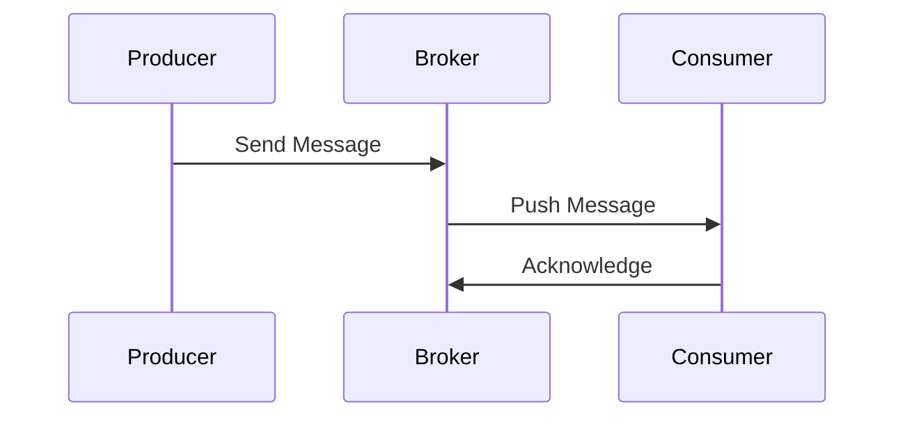
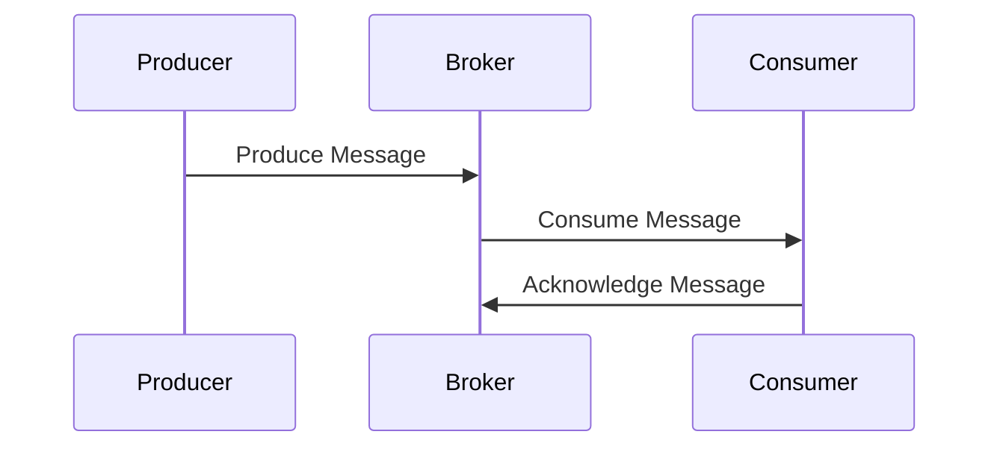
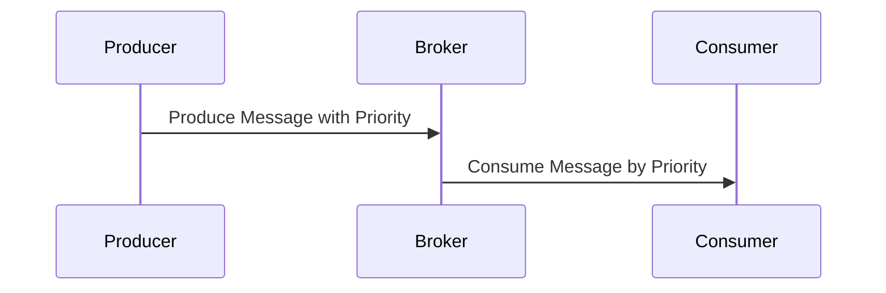

                 


### 第一部分：引言与背景

#### 第1章：消息队列概述

**1.1 消息队列的定义与重要性**

消息队列（Message Queue，MQ）是一种用于在分布式系统中传输信息的通信机制。它允许系统的不同部分（称为生产者和消费者）异步地交换消息。消息队列作为一种重要的中间件技术，其主要功能是解耦系统组件，实现系统之间的松耦合。

消息队列在系统解耦中的重要性体现在以下几个方面：

1. **异步通信**：消息队列支持生产者和消费者之间的异步通信，这意味着生产者无需等待消费者完成处理即可继续执行，从而提高系统的整体性能和响应速度。
2. **分布式处理**：消息队列使得分布式系统中的任务可以在不同的节点上并行处理，从而提高了系统的扩展性和容错性。
3. **流量控制**：通过消息队列，系统可以根据当前负载情况动态调整消息的处理速度，从而实现流量的平滑控制。
4. **弹性扩展**：消息队列允许系统在不影响整体功能的情况下，灵活地增加或减少处理消息的节点，从而实现弹性扩展。

**1.2 系统解耦的需求与挑战**

随着现代软件系统的规模和复杂性不断增加，系统解耦变得尤为重要。系统解耦的主要需求包括：

1. **模块化**：系统应该能够被分解为独立的模块，每个模块负责一个特定的功能，这样可以提高系统的可维护性和可扩展性。
2. **独立性**：系统中的各个模块应该能够独立部署和运行，这样可以减少模块之间的依赖关系，降低故障传播的风险。
3. **可扩展性**：系统应该能够轻松地扩展其功能，以满足不断增长的用户需求和业务变化。

然而，实现系统解耦也面临以下挑战：

1. **复杂性**：随着系统解耦程度的提高，系统的整体复杂性也会增加，这使得系统的设计和维护变得更加困难。
2. **性能**：异步通信和分布式处理可能会引入额外的延迟和网络开销，从而影响系统的性能。
3. **一致性**：在分布式系统中，如何保证数据的一致性是一个关键挑战。

**1.3 消息队列与系统解耦的关系**

消息队列是实现系统解耦的关键技术之一。通过消息队列，系统中的不同模块可以独立地处理消息，从而实现松耦合。具体来说：

1. **异步通信**：消息队列允许生产者和消费者之间异步通信，从而降低了模块之间的直接依赖关系，提高了系统的独立性和可扩展性。
2. **分布式处理**：消息队列支持消息的分布式处理，从而使得系统可以在不同的节点上并行处理任务，提高了系统的性能和容错性。
3. **流量控制**：通过消息队列，系统可以动态地调整消息的处理速度，从而实现流量的平滑控制，提高了系统的稳定性。

在本节中，我们简要介绍了消息队列的概念及其在系统解耦中的重要性。在接下来的章节中，我们将进一步探讨消息队列的核心概念、工作原理、系统架构设计以及实际应用案例，帮助读者深入理解消息队列在系统解耦中的应用。

### 第二部分：核心概念与联系

#### 第2章：消息队列核心概念

**2.1 消息队列的基本术语**

为了更好地理解消息队列，我们首先需要了解一些基本术语：

- **消息**：消息是消息队列中的基本数据单元，它通常包含一些关键信息，如消息ID、消息内容和发送时间等。
- **生产者**：生产者是消息队列中的消息发送方，负责生成和发送消息。
- **消费者**：消费者是消息队列中的消息接收方，负责接收和处理消息。
- **队列**：队列是一种先进先出（FIFO）的数据结构，用于存储消息。消息队列通常是一个持久化的数据存储，以确保消息不会丢失。

**2.2 消息队列与传统通信方式的对比**

消息队列与传统同步通信方式（如直接调用来实现通信）有以下显著区别：

- **异步通信**：消息队列支持异步通信，生产者无需等待消费者处理完成即可继续执行，从而提高了系统的并发能力和响应速度。
- **解耦**：消息队列通过引入异步通信，降低了生产者和消费者之间的直接依赖关系，使得系统更加模块化和独立。
- **分布式处理**：消息队列支持消息的分布式处理，允许系统在不同节点上并行处理任务，从而提高了系统的性能和容错性。
- **流量控制**：消息队列可以通过调整消息的处理速度来实现流量控制，从而避免了系统过载和崩溃的风险。

**2.3 消息队列的优势与局限性**

消息队列具有以下优势：

- **异步通信**：提高了系统的并发能力和响应速度。
- **分布式处理**：支持系统的分布式处理，提高了系统的性能和容错性。
- **解耦**：降低了系统组件之间的直接依赖关系，提高了系统的模块化和可维护性。
- **可靠性**：消息队列通常支持持久化存储，确保消息不会丢失。

然而，消息队列也存在一些局限性：

- **延迟**：由于消息需要在队列中排队等待处理，可能会引入一定的延迟。
- **网络开销**：消息队列需要通过网络传输消息，可能会引入额外的网络开销。
- **一致性**：在分布式系统中，如何保证消息的一致性是一个关键挑战。

在本节中，我们详细介绍了消息队列的基本术语、与传统通信方式的对比以及消息队列的优势与局限性。在接下来的章节中，我们将进一步探讨消息队列的工作原理和实现技术，帮助读者深入理解消息队列的内部机制和应用场景。

### 第三部分：消息队列的工作原理

#### 第3章：消息队列的工作原理

**3.1 消息队列的基本架构**

消息队列的基本架构通常包括以下几个核心组件：

- **消息队列服务端**：负责接收、存储和发送消息。
- **消息生产者**：负责生成消息并将其发送到消息队列。
- **消息消费者**：负责从消息队列中接收消息并进行处理。

消息队列的基本架构图如下所示：



**3.2 消息的生产与消费**

消息队列的工作流程主要包括以下几个步骤：

1. **消息生产**：
   - 生产者生成消息，并将消息发送到消息队列。消息通常包含一些关键信息，如消息ID、消息内容和发送时间等。
   - 消息队列服务端接收到消息后，将消息存储在消息队列中。

2. **消息存储**：
   - 消息队列服务端将消息存储在内存或磁盘上。存储方式可以是先进先出（FIFO）或优先级队列等。

3. **消息消费**：
   - 消息消费者从消息队列中接收消息，并进行处理。处理完毕后，消费者会向消息队列服务端发送确认消息（ACK），表示消息已被成功处理。

4. **消息确认**：
   - 消息队列服务端接收到消费者的确认消息后，会从消息队列中移除已处理的消息。

消息队列的工作流程图如下所示：



**3.3 消息队列中的关键算法**

消息队列中涉及一些关键算法，如先进先出（FIFO）和优先级队列等。

1. **先进先出（FIFO）算法**：
   - 先进先出（FIFO）算法是一种基本的队列管理算法，它按照消息进入队列的顺序进行消息处理。
   - FIFO算法的优点是实现简单，易于理解，但缺点是缺乏灵活性，无法根据消息的重要性和紧急程度进行优先级处理。

2. **优先级队列算法**：
   - 优先级队列算法是一种根据消息优先级进行消息处理的管理算法。消息的优先级可以根据消息的类型、重要性、紧急程度等因素进行动态调整。
   - 优先级队列算法的优点是能够根据消息的重要性和紧急程度进行优先处理，从而提高系统的响应速度和处理效率。

优先级队列的工作流程如下：

1. 消息生产时，生产者指定消息的优先级。
2. 消息队列服务端根据消息的优先级将消息存储在优先级队列中。
3. 消息消费者从优先级队列中按照优先级顺序接收和处理消息。

优先级队列的流程图如下所示：



在本节中，我们详细介绍了消息队列的基本架构、消息的生产与消费流程以及关键算法。在下一节中，我们将探讨消息队列在系统架构中的应用场景和设计策略，帮助读者深入理解消息队列在实际系统中的角色和作用。

### 第四部分：系统分析与架构设计

#### 第4章：消息队列在系统架构中的应用

**4.1 消息队列在分布式系统中的应用**

在分布式系统中，消息队列被广泛应用于任务调度、日志收集、分布式缓存同步等场景。以下是一些典型的应用场景：

1. **任务调度**：
   - 分布式系统中的任务调度通常涉及到大量的并发操作，消息队列可以用于异步处理任务，从而提高系统的并发能力和响应速度。
   - 例如，在分布式缓存系统中，缓存数据的更新和过期任务可以通过消息队列进行异步处理，避免了直接同步操作带来的性能瓶颈。

2. **日志收集**：
   - 在分布式系统中，各个服务产生的日志通常需要被集中收集和处理。消息队列可以用于将日志数据异步传输到日志收集系统，从而减轻服务器的负载并提高系统的稳定性。

3. **分布式缓存同步**：
   - 在分布式缓存系统中，当某个节点的缓存数据发生变化时，需要将更新同步到其他节点。消息队列可以用于异步传输更新消息，从而避免直接同步操作带来的性能影响。

**4.2 消息队列在服务化架构中的应用**

在服务化架构中，消息队列被广泛应用于服务间的通信和协调。以下是一些典型的应用场景：

1. **服务调用**：
   - 在服务化架构中，各个服务通常独立部署和运行。消息队列可以用于服务间的异步通信，从而实现服务的解耦和并行处理。
   - 例如，在电商平台中，订单服务可以异步地将订单信息发送给支付服务和库存服务，从而实现订单处理的并行化。

2. **事件驱动架构**：
   - 在事件驱动架构中，消息队列可以用于发布/订阅模式的事件处理。服务可以订阅感兴趣的事件，并在接收到事件消息后进行相应的处理。
   - 例如，在实时数据处理系统中，数据服务可以订阅数据更新事件，并在接收到事件消息后进行数据分析和处理。

3. **分布式事务管理**：
   - 在分布式系统中，分布式事务管理是一个关键挑战。消息队列可以用于实现分布式事务的两阶段提交协议，从而确保事务的一致性和可靠性。
   - 例如，在分布式数据库系统中，可以使用消息队列来实现分布式事务的提交和回滚操作。

**4.3 消息队列在微服务架构中的应用**

在微服务架构中，消息队列被广泛应用于服务间的解耦和通信。以下是一些典型的应用场景：

1. **服务间通信**：
   - 在微服务架构中，各个服务通常独立部署和运行。消息队列可以用于服务间的异步通信，从而实现服务的解耦和并行处理。
   - 例如，在电商平台中，用户服务可以异步地将用户注册信息发送给认证服务和通知服务，从而实现用户注册的并行化。

2. **事件驱动架构**：
   - 在微服务架构中，事件驱动架构是一种常见的架构模式。消息队列可以用于实现发布/订阅模式的事件处理，从而实现服务间的异步通信和事件传递。
   - 例如，在实时数据处理系统中，数据服务可以发布数据更新事件，并在接收到事件消息后进行数据分析和处理。

3. **分布式事务管理**：
   - 在微服务架构中，分布式事务管理是一个关键挑战。消息队列可以用于实现分布式事务的两阶段提交协议，从而确保事务的一致性和可靠性。
   - 例如，在分布式事务处理系统中，可以使用消息队列来实现分布式事务的提交和回滚操作。

在本节中，我们详细介绍了消息队列在分布式系统、服务化架构和微服务架构中的应用场景。在下一节中，我们将探讨消息队列的接口设计和系统交互，帮助读者深入理解消息队列在实际系统中的实现和部署细节。

### 第五部分：实现与部署

#### 第5章：实现与部署

**5.1 消息队列的实现技术**

消息队列在分布式系统中扮演着重要的角色，其实现技术多种多样。以下是一些常用的消息队列实现技术：

1. **RabbitMQ**：
   - RabbitMQ 是一款流行的开源消息队列中间件，它基于 AMQP（高级消息队列协议）实现，支持多种消息传递模式，如发布/订阅、请求/响应等。
   - RabbitMQ 具有高可靠性、高可用性和可扩展性，适用于复杂的分布式系统。

2. **Kafka**：
   - Kafka 是一款由 Apache 软件基金会开发的分布式流处理平台，它基于发布/订阅模式实现，主要用于大规模数据流的收集、处理和存储。
   - Kafka 具有高吞吐量、低延迟和良好的容错性，适用于实时数据处理和日志收集等场景。

3. **ActiveMQ**：
   - ActiveMQ 是一款基于 JMS（Java 消息服务）的开源消息队列中间件，它支持多种消息传递协议，如 AMQP、MQTT、STOMP 等。
   - ActiveMQ 具有良好的跨平台性和灵活性，适用于企业级分布式系统的消息通信。

**5.2 环境安装与配置**

在实现消息队列之前，我们需要先安装和配置相应的消息队列中间件。以下以 RabbitMQ 为例，介绍环境安装与配置步骤：

1. **安装 RabbitMQ**：
   - 对于 Ubuntu 系统，可以通过以下命令安装 RabbitMQ：
     ```bash
     sudo apt-get update
     sudo apt-get install rabbitmq-server
     ```

   - 安装完成后，启动 RabbitMQ 服务：
     ```bash
     sudo systemctl start rabbitmq-server
     ```

2. **配置 RabbitMQ**：
   - 首先，我们需要创建一个用户，并授予管理员权限。可以使用以下命令：
     ```bash
     rabbitmqctl add_user admin admin
     rabbitmqctl set_user_tags admin administrator
     ```

   - 接下来，我们需要创建一个虚拟主机，并授权用户对虚拟主机的访问权限。可以使用以下命令：
     ```bash
     rabbitmqctl add_vhost test_vhost
     rabbitmqctl set_permissions -p test_vhost admin ".*" ".*" ".*"
     ```

3. **安装 RabbitMQ 客户端**：
   - 安装 Python 的 RabbitMQ 客户端库：
     ```bash
     pip install pika
     ```

**5.3 消息队列的核心实现**

消息队列的核心实现主要涉及生产者、消费者和消息队列服务端。以下使用 Python 语言和 RabbitMQ 实现一个简单的消息队列示例：

1. **生产者**：
   - 生产者负责生成消息，并将其发送到消息队列。以下是一个简单的 Python 生产者示例：
     ```python
     import pika

     connection = pika.BlockingConnection(pika.ConnectionParameters('localhost'))
     channel = connection.channel()

     channel.queue_declare(queue='hello')

     for message in range(10):
         message_content = f'Hello World {message}'
         channel.basic_publish(exchange='',
                              routing_key='hello',
                              body=message_content)
         print(f"[x] Sent {message_content}")

     connection.close()
     ```

2. **消费者**：
   - 消费者负责从消息队列中接收消息并进行处理。以下是一个简单的 Python 消费者示例：
     ```python
     import pika

     def callback(ch, method, properties, body):
         print(f"[x] Received {body}")

     connection = pika.BlockingConnection(pika.ConnectionParameters('localhost'))
     channel = connection.channel()

     channel.queue_declare(queue='hello')

     channel.basic_consume(queue='hello',
                          on_message_callback=callback,
                          auto_ack=True)

     print(' [*] Waiting for messages. To exit press CTRL+C')
     channel.start_consuming()
     ```

通过以上示例，我们可以看到消息队列的核心实现主要包括生产者、消费者和消息队列服务端。在下一节中，我们将通过实际案例来展示消息队列在实际系统中的应用和效果。

### 第六部分：实际案例与分析

#### 第6章：消息队列实际应用案例

**6.1 案例一：电商平台订单处理**

电商平台订单处理是一个典型的消息队列应用场景。在该场景中，订单处理过程涉及到多个服务，如订单服务、支付服务、库存服务、物流服务等。为了实现服务间的解耦和并行处理，我们可以使用消息队列来异步处理订单任务。

**系统设计思路**：

1. **订单服务**：订单服务负责创建订单并生成订单消息。
2. **消息队列服务**：消息队列服务端用于接收和处理订单消息。
3. **支付服务**：支付服务从消息队列中接收订单消息并处理支付。
4. **库存服务**：库存服务从消息队列中接收订单消息并更新库存。
5. **物流服务**：物流服务从消息队列中接收订单消息并处理物流。

**实现细节**：

1. **生产者**：
   - 订单服务在创建订单时，生成订单消息并将其发送到消息队列。以下是一个简单的 Python 生产者示例：
     ```python
     import pika

     connection = pika.BlockingConnection(pika.ConnectionParameters('localhost'))
     channel = connection.channel()

     channel.queue_declare(queue='orders')

     order_data = {
         'order_id': '1001',
         'total_amount': 100.00,
         'customer_id': 'C1001',
         'status': 'CREATED'
     }
     order_message = f"{order_data}"

     channel.basic_publish(exchange='',
                          routing_key='orders',
                          body=order_message)
     print(f"[x] Sent order {order_data}")

     connection.close()
     ```

2. **消费者**：
   - 支付服务、库存服务、物流服务从消息队列中接收订单消息并进行处理。以下是一个简单的 Python 消费者示例：
     ```python
     import pika

     def callback(ch, method, properties, body):
         order_data = eval(body)
         print(f"[x] Received order {order_data}")

         if order_data['status'] == 'CREATED':
             # 处理支付
             print(f"[+] Processing payment for order {order_data['order_id']}")
             order_data['status'] = 'PAID'
         elif order_data['status'] == 'PAID':
             # 更新库存
             print(f"[+] Updating inventory for order {order_data['order_id']}")
             order_data['status'] = 'INVENTORY_UPDATED'
         elif order_data['status'] == 'INVENTORY_UPDATED':
             # 处理物流
             print(f"[+] Processing logistics for order {order_data['order_id']}")
             order_data['status'] = 'SHIPPED'

         print(f"[x] Updated order {order_data}")

     connection = pika.BlockingConnection(pika.ConnectionParameters('localhost'))
     channel = connection.channel()

     channel.queue_declare(queue='orders')

     channel.basic_consume(queue='orders',
                          on_message_callback=callback,
                          auto_ack=True)

     print(' [*] Waiting for messages. To exit press CTRL+C')
     channel.start_consuming()
     ```

**优化策略**：

1. **负载均衡**：通过使用负载均衡器，可以将订单消息均匀地分发到多个订单处理节点，从而提高系统的处理能力和可扩展性。
2. **消息持久化**：将订单消息持久化存储到数据库或文件系统中，以防止消息丢失，提高系统的可靠性。
3. **分布式事务**：在订单处理过程中，使用分布式事务确保订单状态的一致性，防止数据不一致问题。

**案例小结**：

通过使用消息队列，电商平台订单处理实现了服务间的解耦和并行处理，提高了系统的性能和可扩展性。在实际应用中，可以根据具体需求和场景，进一步优化和调整消息队列的设计和实现。

#### 第6章：消息队列实际应用案例

**6.2 案例二：分布式日志收集系统**

在分布式系统中，日志收集是一个关键环节，它有助于监控系统运行状态、定位问题和进行性能优化。消息队列可以用于实现分布式日志收集系统，从而实现日志的异步传输和集中处理。

**系统设计思路**：

1. **日志生产者**：各个服务节点在产生日志时，将日志消息发送到消息队列。
2. **消息队列服务端**：负责接收和处理日志消息，并存储到日志存储系统中。
3. **日志消费者**：从消息队列中接收日志消息，并执行日志分析、处理和存储等操作。

**实现细节**：

1. **生产者**：
   - 各个服务节点在生成日志时，将日志消息发送到消息队列。以下是一个简单的 Python 生产者示例：
     ```python
     import pika
     import json
     import time

     connection = pika.BlockingConnection(pika.ConnectionParameters('localhost'))
     channel = connection.channel()

     channel.queue_declare(queue='logs')

     log_data = {
         'log_id': 'L1001',
         'service_name': 'user_service',
         'log_level': 'INFO',
         'message': 'User created successfully',
         'timestamp': time.time()
     }
     log_message = json.dumps(log_data)

     channel.basic_publish(exchange='',
                          routing_key='logs',
                          body=log_message)
     print(f"[x] Sent log {log_data}")

     connection.close()
     ```

2. **消费者**：
   - 日志消费者从消息队列中接收日志消息，并进行处理和存储。以下是一个简单的 Python 消费者示例：
     ```python
     import pika
     import json
     import time

     def callback(ch, method, properties, body):
         log_data = json.loads(body)
         print(f"[x] Received log {log_data}")

         # 将日志存储到文件中
         with open(f"log_{log_data['log_id']}.txt", "w") as f:
             f.write(json.dumps(log_data))

         # 发送日志分析请求
         print(f"[+] Sending log analysis request for log {log_data['log_id']}")

     connection = pika.BlockingConnection(pika.ConnectionParameters('localhost'))
     channel = connection.channel()

     channel.queue_declare(queue='logs')

     channel.basic_consume(queue='logs',
                          on_message_callback=callback,
                          auto_ack=True)

     print(' [*] Waiting for messages. To exit press CTRL+C')
     channel.start_consuming()
     ```

**优化策略**：

1. **多线程处理**：在日志消费者中，使用多线程处理日志消息，从而提高日志处理能力。
2. **消息持久化**：将日志消息持久化存储到数据库或文件系统中，以防止消息丢失，提高系统的可靠性。
3. **日志压缩**：对日志消息进行压缩，减少存储空间和网络传输开销。

**案例小结**：

通过使用消息队列，分布式日志收集系统实现了日志的异步传输和集中处理，提高了系统的性能和可扩展性。在实际应用中，可以根据具体需求和场景，进一步优化和调整消息队列的设计和实现。

#### 第6章：消息队列实际应用案例

**6.3 案例三：实时数据处理平台**

在实时数据处理平台中，消息队列被广泛应用于数据采集、数据传输、数据存储和数据处理等环节。通过消息队列，可以实现数据的异步传输和并行处理，从而提高系统的性能和可扩展性。

**系统设计思路**：

1. **数据生产者**：各个数据源（如传感器、日志等）在生成数据时，将数据消息发送到消息队列。
2. **消息队列服务端**：负责接收和处理数据消息，并存储到数据存储系统中。
3. **数据处理服务**：从消息队列中接收数据消息，并执行数据清洗、转换、存储和分析等操作。

**实现细节**：

1. **生产者**：
   - 各个数据源在生成数据时，将数据消息发送到消息队列。以下是一个简单的 Python 生产者示例：
     ```python
     import pika
     import json
     import time

     connection = pika.BlockingConnection(pika.ConnectionParameters('localhost'))
     channel = connection.channel()

     channel.queue_declare(queue='data')

     data_data = {
         'data_id': 'D1001',
         'source_name': 'sensor',
         'data_type': 'temperature',
         'value': 30.5,
         'timestamp': time.time()
     }
     data_message = json.dumps(data_data)

     channel.basic_publish(exchange='',
                          routing_key='data',
                          body=data_message)
     print(f"[x] Sent data {data_data}")

     connection.close()
     ```

2. **消费者**：
   - 数据处理服务从消息队列中接收数据消息，并进行处理。以下是一个简单的 Python 消费者示例：
     ```python
     import pika
     import json
     import time

     def callback(ch, method, properties, body):
         data_data = json.loads(body)
         print(f"[x] Received data {data_data}")

         # 数据清洗
         data_data['value'] = float(data_data['value'])

         # 数据存储
         print(f"[+] Storing data {data_data}")

         # 数据分析
         print(f"[+] Analyzing data {data_data}")

     connection = pika.BlockingConnection(pika.ConnectionParameters('localhost'))
     channel = connection.channel()

     channel.queue_declare(queue='data')

     channel.basic_consume(queue='data',
                          on_message_callback=callback,
                          auto_ack=True)

     print(' [*] Waiting for messages. To exit press CTRL+C')
     channel.start_consuming()
     ```

**优化策略**：

1. **分布式处理**：在数据处理服务中，使用分布式处理框架（如 Spark、Flink 等），从而提高数据处理的性能和可扩展性。
2. **消息持久化**：将数据消息持久化存储到数据库或文件系统中，以防止数据丢失，提高系统的可靠性。
3. **流处理**：使用流处理技术（如 Kafka Streams、Apache Storm 等），从而实现实时数据处理和分析。

**案例小结**：

通过使用消息队列，实时数据处理平台实现了数据的异步传输和并行处理，提高了系统的性能和可扩展性。在实际应用中，可以根据具体需求和场景，进一步优化和调整消息队列的设计和实现。

### 第七部分：最佳实践与注意事项

#### 第8章：最佳实践与注意事项

**8.1 消息队列的性能优化**

消息队列的性能优化是保证系统稳定性和高效性的关键。以下是一些常用的优化策略：

1. **批量处理**：
   - 在消费者端，可以将多个消息批量处理，从而减少网络传输和上下文切换的开销。
   - 例如，可以使用 Python 的 `multiprocessing` 库实现多进程批量处理。

2. **异步处理**：
   - 在消费者端，可以使用异步处理技术（如 Python 的 `asyncio`），从而提高消息处理的速度和并发能力。
   - 例如，可以使用 `async` 和 `await` 关键字实现异步消息处理。

3. **负载均衡**：
   - 使用负载均衡器（如 Nginx、HAProxy）将消息均匀地分发到多个消费者节点，从而提高系统的处理能力和可扩展性。

4. **缓存优化**：
   - 在消费者端，可以使用缓存（如 Redis、Memcached）存储常用数据，从而减少数据库访问和网络传输的开销。

5. **消息持久化**：
   - 根据实际需求，可以将重要消息持久化存储到数据库或文件系统中，从而防止消息丢失，提高系统的可靠性。

**8.2 容错处理与一致性保障**

在分布式系统中，容错处理和一致性保障是保证系统稳定运行的关键。以下是一些常用的策略：

1. **消息确认**：
   - 在消费者端，可以使用消息确认机制（如 RabbitMQ 的 `acknowledge`），确保消息已被成功处理，从而避免消息重复处理。

2. **幂等性处理**：
   - 在消费者端，实现幂等性处理，防止重复处理相同的消息，从而避免数据不一致问题。

3. **分布式事务**：
   - 在分布式事务处理中，可以使用消息队列实现两阶段提交协议（2PC），从而确保事务的一致性和可靠性。

4. **补偿事务**：
   - 在无法使用分布式事务的情况下，可以使用补偿事务（Compensating Transaction）来修复错误操作，从而确保数据的一致性。

5. **延迟消息**：
   - 使用延迟消息机制（如 RabbitMQ 的延迟队列），可以将消息延迟一段时间再处理，从而避免高峰期系统过载。

**8.3 使用消息队列时需要注意的问题**

在使用消息队列时，需要注意以下问题：

1. **消息序列性**：
   - 在分布式系统中，如何保证消息的序列性是一个关键挑战。可以使用顺序消息队列（如 RabbitMQ 的 `x-message-ttl`）或分布式锁（如 Redis 的 `SET`）来保证消息的顺序处理。

2. **消息一致性**：
   - 在分布式系统中，如何保证消息的一致性是一个关键挑战。可以使用分布式事务（如 2PC）或补偿事务（Compensating Transaction）来确保数据的一致性。

3. **网络延迟**：
   - 消息队列通过网络传输消息，可能会引入网络延迟。在设计系统时，需要考虑网络延迟对系统性能的影响，并采取相应的优化策略。

4. **系统可靠性**：
   - 消息队列系统的可靠性至关重要。在设计系统时，需要考虑故障转移、数据备份和恢复等策略，确保系统的稳定运行。

通过以上最佳实践和注意事项，可以帮助我们在实际项目中更好地使用消息队列，实现系统的解耦、性能优化和可靠性保障。

### 第八部分：小结与拓展阅读

#### 第9章：小结与拓展阅读

**9.1 全书总结**

本书系统地介绍了消息队列在系统解耦中的应用。通过详细的案例分析，我们深入探讨了消息队列的核心概念、工作原理、系统架构设计以及实际应用场景。主要内容包括：

1. **消息队列的定义与重要性**：介绍了消息队列的基本概念、异步通信的特点以及消息队列在系统解耦中的重要性。
2. **消息队列的核心概念**：详细解释了消息、生产者、消费者和队列等基本术语，并分析了消息队列与传统通信方式的区别。
3. **消息队列的工作原理**：阐述了消息队列的基本架构、消息的生产与消费流程以及关键算法。
4. **消息队列在系统架构中的应用**：介绍了消息队列在分布式系统、服务化架构和微服务架构中的应用场景。
5. **消息队列的实现与部署**：讨论了消息队列的实现技术、环境安装与配置以及核心实现源代码。
6. **实际案例与分析**：通过电商订单处理、分布式日志收集系统和实时数据处理平台的案例，展示了消息队列在实际系统中的应用和效果。
7. **最佳实践与注意事项**：总结了消息队列的性能优化、容错处理与一致性保障以及使用消息队列时需要注意的问题。

**9.2 拓展阅读资源**

为了帮助读者进一步深入学习和了解消息队列的相关知识，以下是一些建议的拓展阅读资源：

1. **《消息队列实战》**：这是一本关于消息队列的实战指南，详细介绍了消息队列的设计、实现和部署，适合有一定基础的读者。
2. **《分布式系统设计》**：这是一本关于分布式系统设计的经典著作，涵盖了分布式系统的基本概念、架构设计和案例分析，有助于读者了解分布式系统的整体架构。
3. **《RabbitMQ 官方文档》**：RabbitMQ 是一款流行的开源消息队列中间件，其官方文档提供了详细的介绍和教程，是学习 RabbitMQ 的绝佳资源。
4. **《Kafka 官方文档》**：Kafka 是一款高性能的分布式流处理平台，其官方文档涵盖了 Kafka 的基本概念、架构设计和使用教程，适合希望深入了解 Kafka 的读者。
5. **《微服务设计》**：这是一本关于微服务设计的权威著作，详细介绍了微服务架构的核心概念、设计原则和最佳实践，有助于读者掌握微服务架构的设计和实现。

通过阅读以上资源，读者可以进一步扩展消息队列的知识，提升在分布式系统和微服务架构中的实践能力。希望本书能够为读者在消息队列领域的学习和应用提供有益的指导。作者：AI天才研究院/AI Genius Institute & 禅与计算机程序设计艺术 /Zen And The Art of Computer Programming。

