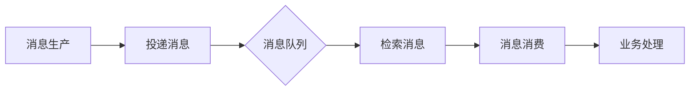
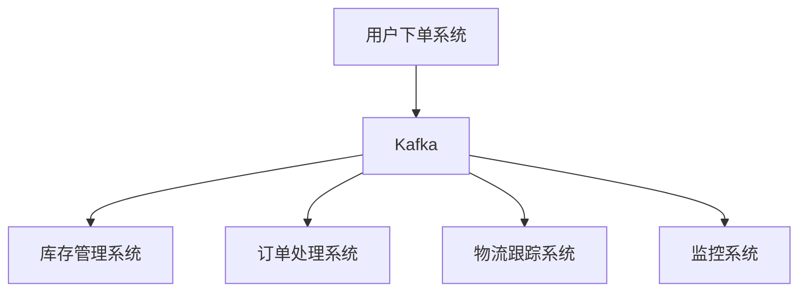
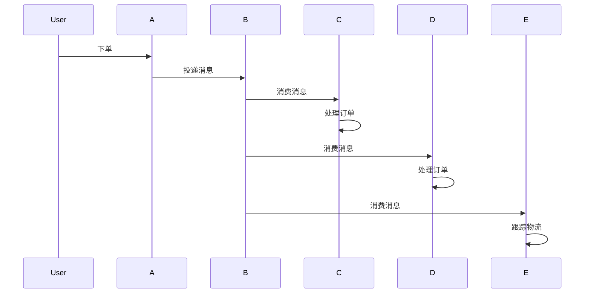

                 

### 消息队列应用：解耦系统组件的有效方式

关键词：消息队列，系统解耦，异步通信，分布式系统，性能优化

摘要：本文将深入探讨消息队列在分布式系统中的应用，解析其如何通过异步通信机制解耦系统组件，提高系统的灵活性、可靠性和可维护性。我们将一步步分析消息队列的核心概念、工作原理及其在实际项目中的应用场景，旨在为读者提供一个清晰、易懂的技术指南。

### 第一部分：背景介绍

#### 问题背景

随着互联网和云计算技术的快速发展，现代企业面临着越来越复杂的应用场景和业务需求。在这样一个高度动态和竞争激烈的市场环境中，企业需要构建灵活、可扩展的系统来适应快速变化的需求。然而，系统组件之间的耦合度越来越高，导致系统的维护性和扩展性越来越差。如何有效地解耦系统组件，提高系统的灵活性、可靠性和可维护性，成为了企业级应用开发中的一个重要问题。

#### 问题描述

在分布式系统中，不同组件之间需要交换数据，以实现业务流程的协同工作。传统的同步通信方式容易导致系统中的瓶颈，增加系统的复杂度和维护难度。异步通信机制通过消息队列来实现，使得系统组件可以在不需要直接交互的情况下独立运行，从而降低了系统的耦合度。

#### 问题解决

通过使用消息队列，系统组件可以独立地开发和部署，降低了组件之间的耦合度。消息队列提供了异步通信的能力，使得系统可以在不同的组件之间传递消息，实现数据的交换和同步。这样一来，即使某个组件出现故障，也不会影响其他组件的正常运行，提高了系统的可靠性。

#### 边界与外延

消息队列技术的边界包括消息的生产者、消费者、传输协议、持久化存储等。其外延涉及到消息的顺序性、可靠性、性能优化、分布式消息系统等。了解这些边界和外延对于全面掌握消息队列的应用至关重要。

#### 概念结构与核心要素组成

1. **消息生产者**：负责产生消息并投递到消息队列中。
2. **消息队列**：存储和转发消息的中间件系统。
3. **消息消费者**：从消息队列中获取消息并处理。
4. **传输协议**：消息队列通信的协议，如AMQP、MQTT等。
5. **持久化存储**：用于存储消息队列中的消息，保证消息的可靠性。

### 第二部分：核心概念与联系

#### 核心概念

1. **消息队列**：消息队列是一种用于异步传输消息的中间件系统。它允许系统中的不同组件异步地发送和接收消息，从而实现数据的交换和同步。

2. **生产者与消费者**：消息的生产者负责生成消息并投递到消息队列中，而消息的消费者则从消息队列中获取消息并处理。

3. **传输协议**：消息队列通信的协议，如AMQP、MQTT等。这些协议定义了消息的生产、存储、传递和消费的过程。

4. **持久化存储**：用于保存消息队列中的消息。持久化存储保证了消息队列的可靠性，即使系统发生故障，消息也不会丢失。

#### 概念属性特征对比表格

| 概念       | 定义                                                         | 特点                               |
|------------|--------------------------------------------------------------|-----------------------------------|
| 消息队列   | 用于异步传输消息的中间件系统。                               | 可靠性、顺序性、扩展性、高可用性。 |
| 生产者     | 负责产生消息并投递到消息队列中。                             | 灵活性、异步通信。                 |
| 消费者     | 从消息队列中获取消息并处理。                                 | 可靠性、性能优化。                 |
| 传输协议   | 消息队列通信的协议，如AMQP、MQTT等。                         | 兼容性、高效性。                   |
| 持久化存储 | 用于保存消息队列中的消息。                                   | 数据可靠性、持久性。               |

#### ER实体关系图架构

```mermaid
erDiagram
    生产者 ||--|{ 消息队列 }|| 消息
    消息队列 ||--|{ 消费者 }|| 消息
```

### 第三部分：消息队列的算法原理讲解

#### 算法原理讲解

消息队列的工作原理主要包括以下几个方面：

1. **消息的生产和投递**：消息生产者将消息生成后，将其投递到消息队列中。这个过程通常包括消息的生成、序列化、压缩和加密等步骤。

2. **消息的存储与检索**：消息队列存储接收到的消息，并提供检索接口，以供消费者获取。消息的存储方式可以是内存、磁盘或数据库等。

3. **消息的消费和处理**：消费者从消息队列中获取消息，并进行相应的业务处理。这个过程通常包括消息的反序列化、解压缩和身份验证等步骤。

下面使用Mermaid画出消息队列的算法流程图：



#### 数学模型和数学公式

消息队列的性能评估通常涉及以下几个关键指标：

1. **吞吐量（Throughput）**：单位时间内系统处理的消息数量，可以用公式表示为：
   $$ Throughput = \frac{消息总数}{处理时间} $$
   
2. **延迟（Latency）**：消息从生产者到消费者处理完成的时间，可以用公式表示为：
   $$ Latency = \frac{处理时间}{消息总数} $$
   
3. **可用性（Availability）**：系统在规定时间内能够正常提供服务的能力，可以用公式表示为：
   $$ Availability = \frac{正常工作时间}{总工作时间} \times 100\% $$

#### 举例说明

假设一个消息队列系统在1小时内处理了1000条消息，总处理时间为3600秒。根据上述公式，可以计算出：

- 吞吐量：$$ Throughput = \frac{1000}{3600} = 0.2778 \text{条/秒} $$
- 延迟：$$ Latency = \frac{3600}{1000} = 3.6 \text{秒} $$
- 可用性：假设系统在规定时间内没有发生故障，则$$ Availability = \frac{3600}{3600} \times 100\% = 100\% $$

通过这些指标，可以全面评估消息队列系统的性能。

### 第四部分：消息队列在实际项目中的应用

#### 项目场景介绍

在一个电子商务平台上，用户下单后，系统需要将订单信息发送到库存管理、订单处理和物流跟踪等多个子系统中进行处理。这些子系统可能运行在不同的服务器上，甚至可能分布在不同的数据中心。如何确保订单信息能够及时、准确地传递到各个子系统，同时保证系统的稳定性和扩展性，是项目开发中需要解决的问题。

#### 项目介绍

在这个项目中，我们采用消息队列来解耦各个子系统，提高系统的灵活性和可靠性。具体来说，我们将使用Apache Kafka作为消息队列系统，其具有高吞吐量、高可靠性和可扩展性的特点。

#### 系统功能设计

1. **消息生产**：用户下单后，订单信息由订单系统生成，并作为消息投递到Kafka中。

2. **消息存储**：Kafka作为一个分布式消息系统，可以存储大量的消息，并提供高可用性。

3. **消息消费**：库存管理、订单处理和物流跟踪等子系统从Kafka中获取订单信息，并进行相应的处理。

4. **系统监控**：监控系统用于实时监控消息队列的运行状态，包括吞吐量、延迟和错误率等指标。

#### 系统架构设计



#### 系统接口设计和系统交互



#### 项目实战

1. **环境安装**：安装Apache Kafka和Kafka的客户端。

2. **系统核心实现**：
   - 订单系统：生成订单消息，并使用KafkaProducer投递到Kafka中。
   - Kafka：作为消息队列系统，存储和转发订单消息。
   - 库存管理、订单处理和物流跟踪系统：从Kafka中获取订单消息，并进行相应的处理。

3. **代码应用解读与分析**：解析订单消息的JSON格式，提取关键信息，并进行相应的业务处理。

4. **实际案例分析和详细讲解剖析**：分析订单消息在各个子系统之间的传递过程，以及如何保证消息的可靠性和顺序性。

5. **项目小结**：总结项目中的经验和教训，讨论消息队列在实际项目中的应用价值。

### 第五部分：最佳实践与拓展阅读

#### 最佳实践

1. **消息序列化**：选择合适的消息序列化框架，如JSON、Protobuf等，以提高消息传输的效率。

2. **消息持久化**：根据业务需求，选择合适的持久化存储方案，如Kafka的内置存储或外部数据库。

3. **消息确认机制**：采用消息确认机制，确保消息被正确消费，防止消息丢失。

4. **消息消费幂等性**：处理重复消息，确保业务处理的幂等性。

#### 拓展阅读

1. 《消息队列实战》 - 张亮
2. 《分布式系统原理与范型》 - 李强
3. Apache Kafka官方文档：[https://kafka.apache.org/documentation/](https://kafka.apache.org/documentation/)

### 第六部分：小结

消息队列作为一种异步通信机制，在分布式系统中发挥着重要作用。通过解耦系统组件，提高系统的灵活性、可靠性和可维护性，消息队列为现代企业级应用提供了强有力的支持。本文从核心概念、算法原理、实际应用等方面对消息队列进行了详细分析，希望对读者理解和应用消息队列有所帮助。

### 第七部分：注意事项

1. **消息顺序性**：在设计消息队列系统时，要确保消息的顺序性，避免因为消息顺序错误导致业务逻辑出现问题。

2. **消息可靠性**：确保消息的可靠传输和正确消费，避免消息丢失或重复消费。

3. **性能优化**：根据业务需求，对消息队列进行性能优化，提高系统的吞吐量和延迟。

4. **监控与报警**：对消息队列系统进行实时监控，及时发现并处理异常情况。

### 作者信息

作者：AI天才研究院/AI Genius Institute & 禅与计算机程序设计艺术 /Zen And The Art of Computer Programming

---

通过本文的详细讲解，相信读者对消息队列在分布式系统中的应用有了更深入的理解。消息队列不仅能够解耦系统组件，提高系统的灵活性，还能提升系统的可靠性。在实际项目中，合理应用消息队列，可以大大降低系统的复杂度和维护难度，为企业创造更多的价值。在未来的技术探索中，让我们一起继续深入挖掘消息队列的潜力，为企业的发展贡献更多的力量。

