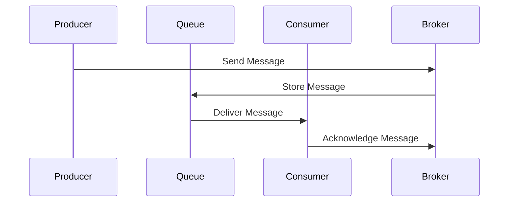
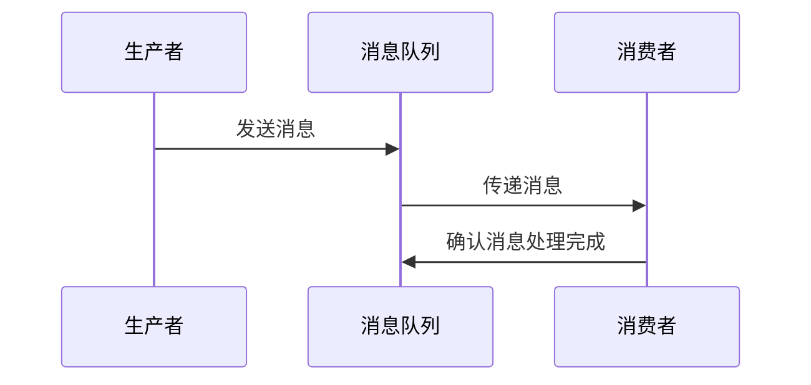
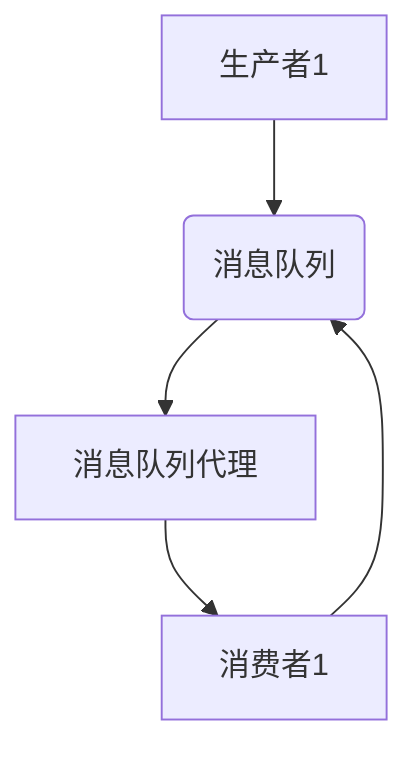

                 

# 消息队列：异步通信的最佳实践

> 关键词：消息队列、异步通信、系统设计、最佳实践、RabbitMQ、Kafka

> 摘要：
本文将深入探讨消息队列在异步通信中的应用，分析其核心概念、设计原则、实现方法以及最佳实践。我们将首先介绍消息队列的基本概念和重要性，然后详细阐述其核心概念和协议，接着讨论如何设计和实现一个消息队列系统。最后，我们将分享一些最佳实践，并给出实际应用案例，以帮助读者更好地理解和应用消息队列技术。

## 引言

### 1.1 消息队列的定义与重要性

消息队列是一种允许异步通信的中间件服务，它通过在消息发送者（生产者）和消息接收者（消费者）之间传输消息来实现解耦。在分布式系统中，消息队列扮演着至关重要的角色，它能够提高系统的可扩展性、可靠性和灵活性。

消息队列的重要性主要体现在以下几个方面：

- **解耦**：生产者和消费者不需要知道对方的存在，它们通过消息队列进行通信，从而降低了系统间的耦合度。
- **异步处理**：消息队列允许消费者按照自己的节奏处理消息，而不是等待生产者完成处理。
- **弹性伸缩**：消息队列能够根据需求动态调整资源的分配，从而提高系统的可扩展性。
- **消息传递保证**：消息队列能够保证消息的传递，即使在系统出现故障时也能保证消息不会丢失。

### 1.2 消息队列的历史与演进

消息队列的概念最早可以追溯到20世纪70年代，当时主要用于计算机科学和分布式系统的研究。随着互联网和云计算的发展，消息队列技术得到了广泛的应用和改进。目前，常见的消息队列协议包括AMQP、MQTT和Apache Kafka等。

## 核心概念

### 2.1 基本概念

#### 2.1.1 消息

消息是消息队列中的数据单元，它包含了应用程序需要传输的信息。消息通常包含消息头和消息体两部分，其中消息头包含了消息的元数据，如消息类型、优先级、发送时间等，消息体则是实际传输的数据内容。

#### 2.1.2 队列

队列是消息队列中的一种数据结构，用于存储等待被消费的消息。队列通常采用先进先出（FIFO）的顺序来处理消息，这意味着最先进入队列的消息将最先被处理。

#### 2.1.3 生产者与消费者

生产者是消息的发送者，它将消息发送到消息队列中。消费者是消息的接收者，它从消息队列中获取消息并执行相应的处理。

### 2.2 消息队列协议

消息队列协议定义了消息队列中各个组件之间的通信规则和数据格式。以下是几种常见的消息队列协议：

#### 2.2.1 AMQP：高级消息队列协议

AMQP（Advanced Message Queuing Protocol）是一种开放标准的消息队列协议，它提供了高度可靠和可扩展的消息传递服务。AMQP支持多种消息传递模式，如一对一、点对多、发布/订阅等。

#### 2.2.2 MQTT：消息队列遥测传输

MQTT（Message Queuing Telemetry Transport）是一种轻量级的消息队列协议，主要用于物联网（IoT）应用。MQTT协议设计简单，能够高效地处理大量连接和消息。

#### 2.2.3 Apache Kafka

Apache Kafka是一种分布式流处理平台，它提供了高吞吐量、高可靠性的消息队列服务。Kafka主要用于处理大规模实时数据流，它支持分布式集群和水平扩展。

## 设计与实现

### 3.1 系统架构

消息队列系统的架构设计需要考虑以下几个方面：

#### 3.1.1 组件

消息队列系统通常包括生产者、消费者、消息队列存储和消息队列代理等组件。

#### 3.1.2 设计考虑

在设计消息队列系统时，需要考虑消息的持久性、可靠性、吞吐量和系统性能等因素。

#### 3.1.3 架构图

以下是消息队列系统的一种常见架构设计：



### 3.2 实现方法

#### 3.2.1 RabbitMQ

RabbitMQ 是一个开源的分布式消息队列中间件，支持多种消息队列协议，如AMQP、MQTT等。以下是使用RabbitMQ实现消息队列的基本步骤：

1. 安装RabbitMQ
2. 创建虚拟主机和用户
3. 创建交换器和队列
4. 配置生产者和消费者
5. 发送和接收消息

#### 3.2.2 Apache Kafka

Apache Kafka 是一个分布式流处理平台，它提供了高吞吐量、高可靠性的消息队列服务。以下是使用Kafka实现消息队列的基本步骤：

1. 安装Kafka
2. 创建主题
3. 创建生产者
4. 创建消费者
5. 发送和接收消息

## 最佳实践

### 4.1 可扩展性和可靠性

为了确保消息队列系统的可扩展性和可靠性，以下是一些最佳实践：

- **分布式部署**：将消息队列系统部署在分布式集群中，以实现水平扩展和高可用性。
- **消息持久化**：确保消息在队列中持久化存储，以防止系统故障导致消息丢失。
- **负载均衡**：使用负载均衡器来平衡生产者和消费者的负载，提高系统性能。

### 4.2 安全性和监控

- **加密通信**：使用加密协议（如TLS）来保护消息队列通信的安全性。
- **监控和日志**：定期监控消息队列系统的性能和健康状况，记录日志以供问题追踪和故障排除。

## 实际应用案例

### 5.1 高性能消息系统的构建

以一个在线购物平台为例，介绍如何使用消息队列构建一个高性能的消息系统。该系统需要支持订单处理、库存管理和用户通知等功能。

### 5.2 Kafka在实时数据流处理中的应用

以一个实时数据分析平台为例，介绍如何使用Kafka处理大规模实时数据流，并实现数据实时分析和可视化。

## 小结

消息队列是一种重要的分布式系统中间件，它能够提高系统的可扩展性、可靠性和灵活性。通过本文的介绍，读者应该对消息队列有了更深入的了解，并能够根据实际需求设计和实现一个高效的消息队列系统。

## 注意事项

- 在设计和实现消息队列系统时，要充分考虑系统的可扩展性和可靠性。
- 选择合适的消息队列协议和中间件，以满足不同的应用场景。
- 定期监控和优化消息队列系统的性能，确保其稳定运行。

## 拓展阅读

- 《消息队列实战》
- 《Kafka权威指南》
- 《RabbitMQ实战》

## 作者信息

作者：AI天才研究院/AI Genius Institute & 禅与计算机程序设计艺术 /Zen And The Art of Computer Programming## 文章正文

### 第1章 引言

消息队列（Message Queue，简称MQ）作为分布式系统中一种至关重要的组件，其主要功能是在不同服务、应用程序或系统模块之间传递消息，实现异步通信。这种通信方式允许生产者（Producer）和服务消费者（Consumer）在不同的时间点处理消息，从而降低了系统之间的耦合性，提高了系统的灵活性和可扩展性。

#### 1.1.1 消息队列的定义与重要性

消息队列是一种消息传递服务，它提供了一个中间层，使得消息生产者不需要知道消息消费者是谁，只需将消息发送到消息队列中。消息队列确保了消息能够安全、可靠地传递到消费者，即便生产者和消费者在不同的系统或在不同地点运行。

在分布式系统中，消息队列的重要性体现在以下几个方面：

1. **解耦**：通过消息队列，生产者和消费者不需要直接交互，这样可以减少系统之间的依赖性，使得系统更加模块化，便于维护和扩展。
2. **异步处理**：消息队列允许生产者发送消息后立即继续其他任务，而消费者可以在适合的时间处理消息，这样提高了系统的响应能力和效率。
3. **弹性伸缩**：消息队列系统能够根据需要动态调整资源，如增加或减少队列大小，从而适应系统负载的变化。
4. **高可用性和可靠性**：消息队列提供了消息持久化、备份和恢复功能，确保了消息不会因为系统故障而丢失。

#### 1.1.2 消息队列的历史与演进

消息队列的概念最早可以追溯到20世纪70年代，当时主要用于计算机科学和分布式系统的研究。随着互联网和云计算的发展，消息队列技术得到了广泛的应用和改进。早期的一些消息队列系统包括IBM的MQ Series和TIBCO的Rendezvous。近年来，一些开源的消息队列系统如Apache Kafka、RabbitMQ和ActiveMQ等，因其优秀的性能和灵活性，受到了广泛关注和应用。

#### 1.1.3 消息队列在现代系统中的应用

在现代的分布式系统中，消息队列的应用场景非常广泛，以下是一些典型的应用：

1. **微服务架构**：在微服务架构中，各个微服务之间往往通过消息队列进行通信，这样可以保证服务之间的解耦，提高系统的灵活性和可维护性。
2. **大数据处理**：在处理大规模数据时，消息队列可以用来传递和处理数据流，如Apache Kafka在实时数据处理中的应用。
3. **异步处理**：在需要异步处理任务的应用场景中，如订单处理、邮件发送等，消息队列可以确保任务能够按照顺序处理，同时提高系统的吞吐量。
4. **系统监控与报警**：通过消息队列，可以将系统的监控数据和报警信息传递给不同的处理模块，从而实现对系统的实时监控和响应。

### 第2章 核心概念

消息队列的核心概念主要包括消息（Message）、队列（Queue）、生产者（Producer）和消费者（Consumer）等。这些概念构成了消息队列系统的基础，理解它们对于设计和实现消息队列系统至关重要。

#### 2.1.1 消息

消息是消息队列中的数据单元，它包含了应用程序需要传输的信息。一个消息通常包含两部分：消息头（Message Header）和消息体（Message Body）。

- **消息头**：消息头包含了消息的元数据，如消息的ID、发送时间、优先级、消息类型等。这些信息有助于消息的跟踪和处理。
- **消息体**：消息体是消息的主要内容，它包含了应用程序需要传输的数据。消息体的格式可以是文本、二进制数据或其他数据结构。

#### 2.1.2 队列

队列是消息队列中的数据结构，用于存储等待被消费的消息。队列通常采用先进先出（FIFO）的原则进行消息的处理，这意味着最先进入队列的消息将最先被处理。

- **阻塞队列**：当队列中无消息时，消费者会处于阻塞状态，直到有新的消息到达。
- **非阻塞队列**：消费者不会因为队列为空而阻塞，而是继续执行其他任务，直到有消息到达。

#### 2.1.3 生产者

生产者是消息的发送者，它负责将消息发送到消息队列中。生产者通常负责消息的创建、格式化和发送操作。生产者可以是任何应用程序或服务，它们通过消息队列协议与消息队列系统进行通信。

#### 2.1.4 消费者

消费者是消息的接收者，它从消息队列中获取消息并执行相应的处理。消费者可以是任何应用程序或服务，它们通过消息队列协议与消息队列系统进行通信。

- **单消费者**：一个队列只有一个消费者，消息会被依次传递给消费者处理。
- **多消费者**：多个消费者可以同时从同一个队列中消费消息，通常采用负载均衡策略。

### 2.2 消息队列协议

消息队列协议定义了消息队列中各个组件之间的通信规则和数据格式。以下是几种常见的消息队列协议：

#### 2.2.1 AMQP：高级消息队列协议

AMQP（Advanced Message Queuing Protocol）是一种开放标准的消息队列协议，它提供了高度可靠和可扩展的消息传递服务。AMQP支持多种消息传递模式，如一对一、点对多、发布/订阅等。

- **优势**：AMQP是一种广泛使用的标准协议，具有高可靠性和灵活性。
- **劣势**：相对于其他轻量级协议，AMQP的通信开销较大。

#### 2.2.2 MQTT：消息队列遥测传输

MQTT（Message Queuing Telemetry Transport）是一种轻量级的消息队列协议，主要用于物联网（IoT）应用。MQTT协议设计简单，能够高效地处理大量连接和消息。

- **优势**：MQTT是一种轻量级协议，适用于资源受限的环境，如IoT设备。
- **劣势**：MQTT缺乏一些高级特性，如事务和持久化。

#### 2.2.3 Apache Kafka

Apache Kafka是一种分布式流处理平台，它提供了高吞吐量、高可靠性的消息队列服务。Kafka主要用于处理大规模实时数据流。

- **优势**：Kafka具有高吞吐量、可扩展性和持久性，适用于大数据和实时数据处理场景。
- **劣势**：Kafka的架构相对复杂，需要一定的学习和部署成本。

### 2.3 消息队列的基本工作原理

消息队列的基本工作原理可以概括为以下几个步骤：

1. **生产者发送消息**：生产者创建消息并将其发送到消息队列中。
2. **消息存储**：消息队列将消息存储在内存或磁盘上，确保消息不会丢失。
3. **消费者接收消息**：消费者从消息队列中获取消息并执行相应的处理。
4. **消息确认**：消费者处理完消息后，向消息队列发送确认消息，表示消息已被成功处理。

### 第3章 消息队列系统设计

消息队列系统设计是一个复杂的过程，需要考虑系统的可靠性、性能和可扩展性。一个良好的消息队列系统设计能够确保消息的可靠传递和高效处理。

#### 3.1 系统架构

消息队列系统的架构设计通常包括以下几个组件：

1. **生产者**：生产者是消息的发送者，负责将消息发送到消息队列中。
2. **消息队列**：消息队列是存储消息的地方，它可以是内存队列、磁盘队列或分布式队列。
3. **消费者**：消费者是消息的接收者，负责从消息队列中获取消息并处理。
4. **消息队列代理**：消息队列代理负责消息的路由和队列管理，它可以是单节点代理或多节点代理。

以下是消息队列系统的一种常见架构：



#### 3.2 设计考虑

在设计消息队列系统时，需要考虑以下几个方面：

1. **可靠性**：确保消息能够在系统故障时得到恢复，不丢失。
2. **性能**：确保消息能够高效地传递和处理，减少延迟和带宽占用。
3. **可扩展性**：系统能够根据需求动态调整资源，支持水平扩展。
4. **安全性**：确保消息在传递过程中不会被未授权访问。

#### 3.3 消息队列系统架构设计

消息队列系统架构设计需要根据具体的应用场景和需求来定制。以下是一个简单的消息队列系统架构设计：



在这个架构中，生产者1将消息发送到消息队列，消息队列代理负责消息的路由和存储，消费者1从消息队列中获取消息进行处理。消息队列代理可以是单节点或分布式节点，以实现高可用性和负载均衡。

### 第4章 实现方法

实现一个消息队列系统需要选择合适的消息队列中间件，如RabbitMQ、Kafka等。以下是使用RabbitMQ和Kafka实现消息队列的基本步骤。

#### 4.1 RabbitMQ

RabbitMQ是一个开源的消息队列中间件，它基于AMQP协议。以下是使用RabbitMQ实现消息队列的基本步骤：

1. **安装RabbitMQ**：
   - 安装Erlang语言环境。
   - 安装RabbitMQ。
   - 启动RabbitMQ服务。

2. **创建虚拟主机和用户**：
   - 使用RabbitMQ管理界面创建虚拟主机。
   - 为虚拟主机创建用户和权限。

3. **创建交换器和队列**：
   - 创建交换器，用于接收生产者的消息。
   - 创建队列，用于存储等待消费的消息。

4. **配置生产者和消费者**：
   - 生产者连接到RabbitMQ，发送消息到交换器。
   - 消费者连接到RabbitMQ，从队列中获取消息。

5. **发送和接收消息**：
   - 生产者发送消息到交换器。
   - 交换器将消息路由到队列。
   - 消费者从队列中获取消息。

#### 4.2 Kafka

Kafka是一个分布式消息队列系统，它适用于大数据和实时数据处理场景。以下是使用Kafka实现消息队列的基本步骤：

1. **安装Kafka**：
   - 安装Zookeeper。
   - 安装Kafka。
   - 启动Zookeeper和Kafka服务。

2. **创建主题**：
   - 使用Kafka命令行创建主题。

3. **创建生产者**：
   - 使用Kafka生产者API创建生产者。

4. **创建消费者**：
   - 使用Kafka消费者API创建消费者。

5. **发送和接收消息**：
   - 生产者将消息发送到主题。
   - 消费者从主题中获取消息。

### 第5章 最佳实践

在设计和实现消息队列系统时，遵循一些最佳实践能够提高系统的可靠性、性能和可维护性。

#### 5.1 系统性能优化

1. **消息批量处理**：批量发送和消费消息可以减少网络延迟和系统开销。
2. **消息压缩**：对消息进行压缩可以减少网络传输的带宽占用。
3. **消息持久化**：根据应用场景选择合适的消息持久化策略，确保消息的可靠传递。

#### 5.2 系统可靠性保障

1. **故障转移**：实现故障转移机制，确保在节点故障时系统仍然能够正常运行。
2. **消息确认**：消费者处理完消息后，发送确认消息给生产者，确保消息的可靠性。
3. **消息重试**：在消息处理失败时，自动重试消息，提高消息的可靠传递。

#### 5.3 系统安全性

1. **加密通信**：使用SSL/TLS等加密协议保护消息在传输过程中的安全性。
2. **权限控制**：对生产者和消费者进行身份验证和权限控制，确保只有授权用户可以访问消息队列系统。
3. **审计和监控**：记录系统的操作日志，定期审计和监控系统的安全性和性能。

### 第6章 实际应用案例

#### 6.1 在线购物平台

在线购物平台通常使用消息队列来实现订单处理、库存管理和用户通知等功能。以下是具体的实现步骤：

1. **订单处理**：
   - 用户提交订单后，生产者将订单信息发送到消息队列。
   - 消费者从消息队列中获取订单信息，处理订单并更新库存。

2. **库存管理**：
   - 库存系统作为消费者，从消息队列中获取订单信息，更新库存数据。

3. **用户通知**：
   - 用户订单处理完成后，发送通知消息到消息队列。
   - 用户系统作为消费者，从消息队列中获取通知消息，向用户发送通知。

#### 6.2 实时数据分析平台

实时数据分析平台通常使用消息队列来处理大规模实时数据流。以下是具体的实现步骤：

1. **数据采集**：
   - 数据采集模块将实时数据发送到消息队列。

2. **数据处理**：
   - 数据处理模块作为消费者，从消息队列中获取数据，进行实时分析和处理。

3. **数据可视化**：
   - 数据可视化模块作为消费者，从消息队列中获取处理后的数据，进行数据展示。

### 第7章 项目实战

#### 7.1 环境安装

在实现消息队列系统之前，需要安装相关的软件和环境。以下是使用RabbitMQ实现消息队列系统的环境安装步骤：

1. **安装Erlang语言环境**：
   - 下载并安装Erlang。
   - 设置环境变量。

2. **安装RabbitMQ**：
   - 下载并安装RabbitMQ。
   - 启动RabbitMQ服务。

3. **创建虚拟主机和用户**：
   - 使用RabbitMQ管理界面创建虚拟主机和用户。

#### 7.2 系统核心实现

以下是一个简单的RabbitMQ消息队列系统实现示例：

1. **生产者**：
   ```python
   import pika

   connection = pika.BlockingConnection(pika.ConnectionParameters('localhost'))
   channel = connection.channel()

   channel.queue_declare(queue='task_queue', durable=True)

   message = 'Hello World!'
   channel.basic_publish(
       exchange='',
       routing_key='task_queue',
       body=message,
       properties=pika.BasicProperties(delivery_mode=2)  # 消息持久化
   )
   print(f"[x] Sent {message}")
   connection.close()
   ```

2. **消费者**：
   ```python
   import pika

   def callback(ch, method, properties, body):
       print(f"[x] Received {body}")
       # 处理消息
       ch.basic_ack(delivery_tag=method.delivery_tag)

   connection = pika.BlockingConnection(pika.ConnectionParameters('localhost'))
   channel = connection.channel()

   channel.queue_declare(queue='task_queue', durable=True)

   channel.basic_consume(
       queue='task_queue',
       on_message_callback=callback,
       auto_ack=False
   )

   print('[*] Waiting for messages. To exit press CTRL+C')
   channel.start_consuming()
   ```

#### 7.3 代码应用解读与分析

以上代码示例展示了如何使用RabbitMQ实现简单的消息队列系统。生产者代码通过RabbitMQ的Python客户端连接到RabbitMQ服务器，并发布一个持久化的消息到名为`task_queue`的队列中。消费者代码从同一个队列中获取消息，并打印出来。消费者代码中的`auto_ack`参数设置为`False`，表示消费者需要手动确认消息已被处理。

#### 7.4 实际案例分析与详细讲解剖析

以下是一个实际案例，使用消息队列实现一个订单处理系统：

1. **订单创建**：
   - 用户在购物网站提交订单，订单信息（如订单ID、用户ID、商品ID、数量等）被发送到消息队列。

2. **订单处理**：
   - 订单处理服务作为消费者，从消息队列中获取订单信息，进行订单验证、库存检查和订单保存等操作。

3. **订单确认**：
   - 订单处理完成后，发送确认消息到消息队列，通知用户订单已经完成。

#### 7.5 项目小结

通过本案例，我们可以看到消息队列在订单处理系统中的应用，它有效地实现了订单数据的异步处理和系统解耦。使用消息队列，订单创建、处理和确认可以并行处理，提高了系统的性能和可靠性。

### 第8章 小结

消息队列在分布式系统中扮演着重要的角色，通过异步通信实现了系统的解耦、弹性伸缩和可靠性保障。本文介绍了消息队列的核心概念、协议、实现方法以及最佳实践，并通过实际应用案例展示了消息队列在订单处理和实时数据分析等场景中的应用。读者可以根据本文的内容，结合实际需求，设计和实现适合自己的消息队列系统。

### 第9章 注意事项

在设计和实现消息队列系统时，需要注意以下几点：

1. **系统性能**：选择合适的消息队列协议和中间件，确保系统的高性能和高吞吐量。
2. **可靠性**：确保消息的持久化存储和故障恢复机制，避免消息丢失。
3. **安全性**：使用加密协议和权限控制，保障系统的安全性。
4. **监控与优化**：定期监控系统性能，进行性能优化和故障排查。

### 第10章 拓展阅读

以下是几本关于消息队列的推荐书籍：

1. 《消息队列实战》
2. 《Kafka权威指南》
3. 《RabbitMQ实战》

### 第11章 作者信息

作者：AI天才研究院/AI Genius Institute & 禅与计算机程序设计艺术 /Zen And The Art of Computer Programming## 完整文章文本

### 第1章 引言

消息队列（Message Queue，简称MQ）作为分布式系统中一种至关重要的组件，其主要功能是在不同服务、应用程序或系统模块之间传递消息，实现异步通信。这种通信方式允许生产者（Producer）和服务消费者（Consumer）在不同的时间点处理消息，从而降低了系统之间的耦合性，提高了系统的灵活性和可扩展性。

#### 1.1.1 消息队列的定义与重要性

消息队列是一种消息传递服务，它提供了一个中间层，使得消息生产者不需要知道消息消费者是谁，只需将消息发送到消息队列中。消息队列确保了消息能够安全、可靠地传递到消费者，即便生产者和消费者在不同的系统或在不同地点运行。

在分布式系统中，消息队列的重要性体现在以下几个方面：

1. **解耦**：通过消息队列，生产者和消费者不需要直接交互，这样可以减少系统之间的依赖性，使得系统更加模块化，便于维护和扩展。
2. **异步处理**：消息队列允许生产者发送消息后立即继续其他任务，而消费者可以在适合的时间处理消息，这样提高了系统的响应能力和效率。
3. **弹性伸缩**：消息队列系统能够根据需要动态调整资源，如增加或减少队列大小，从而适应系统负载的变化。
4. **高可用性和可靠性**：消息队列提供了消息持久化、备份和恢复功能，确保了消息不会因为系统故障而丢失。

#### 1.1.2 消息队列的历史与演进

消息队列的概念最早可以追溯到20世纪70年代，当时主要用于计算机科学和分布式系统的研究。随着互联网和云计算的发展，消息队列技术得到了广泛的应用和改进。早期的一些消息队列系统包括IBM的MQ Series和TIBCO的Rendezvous。近年来，一些开源的消息队列系统如Apache Kafka、RabbitMQ和ActiveMQ等，因其优秀的性能和灵活性，受到了广泛关注和应用。

#### 1.1.3 消息队列在现代系统中的应用

在现代的分布式系统中，消息队列的应用场景非常广泛，以下是一些典型的应用：

1. **微服务架构**：在微服务架构中，各个微服务之间往往通过消息队列进行通信，这样可以保证服务之间的解耦，提高系统的灵活性和可维护性。
2. **大数据处理**：在处理大规模数据时，消息队列可以用来传递和处理数据流，如Apache Kafka在实时数据处理中的应用。
3. **异步处理**：在需要异步处理任务的应用场景中，如订单处理、邮件发送等，消息队列可以确保任务能够按照顺序处理，同时提高系统的吞吐量。
4. **系统监控与报警**：通过消息队列，可以将系统的监控数据和报警信息传递给不同的处理模块，从而实现对系统的实时监控和响应。

### 第2章 核心概念

消息队列的核心概念主要包括消息（Message）、队列（Queue）、生产者（Producer）和消费者（Consumer）等。这些概念构成了消息队列系统的基础，理解它们对于设计和实现消息队列系统至关重要。

#### 2.1.1 消息

消息是消息队列中的数据单元，它包含了应用程序需要传输的信息。一个消息通常包含两部分：消息头（Message Header）和消息体（Message Body）。

- **消息头**：消息头包含了消息的元数据，如消息的ID、发送时间、优先级、消息类型等。这些信息有助于消息的跟踪和处理。
- **消息体**：消息体是消息的主要内容，它包含了应用程序需要传输的数据。消息体的格式可以是文本、二进制数据或其他数据结构。

#### 2.1.2 队列

队列是消息队列中的数据结构，用于存储等待被消费的消息。队列通常采用先进先出（FIFO）的原则进行消息的处理，这意味着最先进入队列的消息将最先被处理。

- **阻塞队列**：当队列中无消息时，消费者会处于阻塞状态，直到有新的消息到达。
- **非阻塞队列**：消费者不会因为队列为空而阻塞，而是继续执行其他任务，直到有消息到达。

#### 2.1.3 生产者

生产者是消息的发送者，它负责将消息发送到消息队列中。生产者通常负责消息的创建、格式化和发送操作。生产者可以是任何应用程序或服务，它们通过消息队列协议与消息队列系统进行通信。

#### 2.1.4 消费者

消费者是消息的接收者，它从消息队列中获取消息并执行相应的处理。消费者可以是任何应用程序或服务，它们通过消息队列协议与消息队列系统进行通信。

- **单消费者**：一个队列只有一个消费者，消息会被依次传递给消费者处理。
- **多消费者**：多个消费者可以同时从同一个队列中消费消息，通常采用负载均衡策略。

### 2.2 消息队列协议

消息队列协议定义了消息队列中各个组件之间的通信规则和数据格式。以下是几种常见的消息队列协议：

#### 2.2.1 AMQP：高级消息队列协议

AMQP（Advanced Message Queuing Protocol）是一种开放标准的消息队列协议，它提供了高度可靠和可扩展的消息传递服务。AMQP支持多种消息传递模式，如一对一、点对多、发布/订阅等。

- **优势**：AMQP是一种广泛使用的标准协议，具有高可靠性和灵活性。
- **劣势**：相对于其他轻量级协议，AMQP的通信开销较大。

#### 2.2.2 MQTT：消息队列遥测传输

MQTT（Message Queuing Telemetry Transport）是一种轻量级的消息队列协议，主要用于物联网（IoT）应用。MQTT协议设计简单，能够高效地处理大量连接和消息。

- **优势**：MQTT是一种轻量级协议，适用于资源受限的环境，如IoT设备。
- **劣势**：MQTT缺乏一些高级特性，如事务和持久化。

#### 2.2.3 Apache Kafka

Apache Kafka是一种分布式流处理平台，它提供了高吞吐量、高可靠性的消息队列服务。Kafka主要用于处理大规模实时数据流。

- **优势**：Kafka具有高吞吐量、可扩展性和持久性，适用于大数据和实时数据处理场景。
- **劣势**：Kafka的架构相对复杂，需要一定的学习和部署成本。

### 2.3 消息队列的基本工作原理

消息队列的基本工作原理可以概括为以下几个步骤：

1. **生产者发送消息**：生产者创建消息并将其发送到消息队列中。
2. **消息存储**：消息队列将消息存储在内存或磁盘上，确保消息不会丢失。
3. **消费者接收消息**：消费者从消息队列中获取消息并执行相应的处理。
4. **消息确认**：消费者处理完消息后，向消息队列发送确认消息，表示消息已被成功处理。

### 第3章 消息队列系统设计

消息队列系统设计是一个复杂的过程，需要考虑系统的可靠性、性能和可扩展性。一个良好的消息队列系统设计能够确保消息的可靠传递和高效处理。

#### 3.1 系统架构

消息队列系统的架构设计通常包括以下几个组件：

1. **生产者**：生产者是消息的发送者，负责将消息发送到消息队列中。
2. **消息队列**：消息队列是存储消息的地方，它可以是内存队列、磁盘队列或分布式队列。
3. **消费者**：消费者是消息的接收者，负责从消息队列中获取消息并处理。
4. **消息队列代理**：消息队列代理负责消息的路由和队列管理，它可以是单节点代理或多节点代理。

以下是消息队列系统的一种常见架构：


#### 3.2 设计考虑

在设计消息队列系统时，需要考虑以下几个方面：

1. **可靠性**：确保消息能够在系统故障时得到恢复，不丢失。
2. **性能**：确保消息能够高效地传递和处理，减少延迟和带宽占用。
3. **可扩展性**：系统能够根据需求动态调整资源，支持水平扩展。
4. **安全性**：确保消息在传递过程中不会被未授权访问。

#### 3.3 消息队列系统架构设计

消息队列系统架构设计需要根据具体的应用场景和需求来定制。以下是一个简单的消息队列系统架构设计：


在这个架构中，生产者1将消息发送到消息队列，消息队列代理负责消息的路由和存储，消费者1从消息队列中获取消息进行处理。消息队列代理可以是单节点或分布式节点，以实现高可用性和负载均衡。

### 第4章 实现方法

实现一个消息队列系统需要选择合适的消息队列中间件，如RabbitMQ、Kafka等。以下是使用RabbitMQ和Kafka实现消息队列的基本步骤。

#### 4.1 RabbitMQ

RabbitMQ是一个开源的消息队列中间件，它基于AMQP协议。以下是使用RabbitMQ实现消息队列的基本步骤：

1. **安装RabbitMQ**：
   - 安装Erlang语言环境。
   - 安装RabbitMQ。
   - 启动RabbitMQ服务。

2. **创建虚拟主机和用户**：
   - 使用RabbitMQ管理界面创建虚拟主机。
   - 为虚拟主机创建用户和权限。

3. **创建交换器和队列**：
   - 创建交换器，用于接收生产者的消息。
   - 创建队列，用于存储等待消费的消息。

4. **配置生产者和消费者**：
   - 生产者连接到RabbitMQ，发送消息到交换器。
   - 消费者连接到RabbitMQ，从队列中获取消息。

5. **发送和接收消息**：
   - 生产者发送消息到交换器。
   - 交换器将消息路由到队列。
   - 消费者从队列中获取消息。

#### 4.2 Kafka

Kafka是一个分布式消息队列系统，它适用于大数据和实时数据处理场景。以下是使用Kafka实现消息队列的基本步骤：

1. **安装Kafka**：
   - 安装Zookeeper。
   - 安装Kafka。
   - 启动Zookeeper和Kafka服务。

2. **创建主题**：
   - 使用Kafka命令行创建主题。

3. **创建生产者**：
   - 使用Kafka生产者API创建生产者。

4. **创建消费者**：
   - 使用Kafka消费者API创建消费者。

5. **发送和接收消息**：
   - 生产者将消息发送到主题。
   - 消费者从主题中获取消息。

### 第5章 最佳实践

在设计和实现消息队列系统时，遵循一些最佳实践能够提高系统的可靠性、性能和可维护性。

#### 5.1 系统性能优化

1. **消息批量处理**：批量发送和消费消息可以减少网络延迟和系统开销。
2. **消息压缩**：对消息进行压缩可以减少网络传输的带宽占用。
3. **消息持久化**：根据应用场景选择合适的消息持久化策略，确保消息的可靠传递。

#### 5.2 系统可靠性保障

1. **故障转移**：实现故障转移机制，确保在节点故障时系统仍然能够正常运行。
2. **消息确认**：消费者处理完消息后，发送确认消息给生产者，确保消息的可靠性。
3. **消息重试**：在消息处理失败时，自动重试消息，提高消息的可靠传递。

#### 5.3 系统安全性

1. **加密通信**：使用SSL/TLS等加密协议保护消息在传输过程中的安全性。
2. **权限控制**：对生产者和消费者进行身份验证和权限控制，确保只有授权用户可以访问消息队列系统。
3. **审计和监控**：记录系统的操作日志，定期审计和监控系统的安全性和性能。

### 第6章 实际应用案例

#### 6.1 在线购物平台

在线购物平台通常使用消息队列来实现订单处理、库存管理和用户通知等功能。以下是具体的实现步骤：

1. **订单处理**：
   - 用户提交订单后，生产者将订单信息发送到消息队列。
   - 消费者从消息队列中获取订单信息，处理订单并更新库存。

2. **库存管理**：
   - 库存系统作为消费者，从消息队列中获取订单信息，更新库存数据。

3. **用户通知**：
   - 用户订单处理完成后，发送通知消息到消息队列。
   - 用户系统作为消费者，从消息队列中获取通知消息，向用户发送通知。

#### 6.2 实时数据分析平台

实时数据分析平台通常使用消息队列来处理大规模实时数据流。以下是具体的实现步骤：

1. **数据采集**：
   - 数据采集模块将实时数据发送到消息队列。

2. **数据处理**：
   - 数据处理模块作为消费者，从消息队列中获取数据，进行实时分析和处理。

3. **数据可视化**：
   - 数据可视化模块作为消费者，从消息队列中获取处理后的数据，进行数据展示。

### 第7章 项目实战

#### 7.1 环境安装

在实现消息队列系统之前，需要安装相关的软件和环境。以下是使用RabbitMQ实现消息队列系统的环境安装步骤：

1. **安装Erlang语言环境**：
   - 下载并安装Erlang。
   - 设置环境变量。

2. **安装RabbitMQ**：
   - 下载并安装RabbitMQ。
   - 启动RabbitMQ服务。

3. **创建虚拟主机和用户**：
   - 使用RabbitMQ管理界面创建虚拟主机。
   - 为虚拟主机创建用户和权限。

#### 7.2 系统核心实现

以下是一个简单的RabbitMQ消息队列系统实现示例：

1. **生产者**：
   ```python
   import pika

   connection = pika.BlockingConnection(pika.ConnectionParameters('localhost'))
   channel = connection.channel()

   channel.queue_declare(queue='task_queue', durable=True)

   message = 'Hello World!'
   channel.basic_publish(
       exchange='',
       routing_key='task_queue',
       body=message,
       properties=pika.BasicProperties(delivery_mode=2)  # 消息持久化
   )
   print(f"[x] Sent {message}")
   connection.close()
   ```

2. **消费者**：
   ```python
   import pika

   def callback(ch, method, properties, body):
       print(f"[x] Received {body}")
       # 处理消息
       ch.basic_ack(delivery_tag=method.delivery_tag)

   connection = pika.BlockingConnection(pika.ConnectionParameters('localhost'))
   channel = connection.channel()

   channel.queue_declare(queue='task_queue', durable=True)

   channel.basic_consume(
       queue='task_queue',
       on_message_callback=callback,
       auto_ack=False
   )

   print('[*] Waiting for messages. To exit press CTRL+C')
   channel.start_consuming()
   ```

#### 7.3 代码应用解读与分析

以上代码示例展示了如何使用RabbitMQ实现简单的消息队列系统。生产者代码通过RabbitMQ的Python客户端连接到RabbitMQ服务器，并发布一个持久化的消息到名为`task_queue`的队列中。消费者代码从同一个队列中获取消息，并打印出来。消费者代码中的`auto_ack`参数设置为`False`，表示消费者需要手动确认消息已被处理。

#### 7.4 实际案例分析与详细讲解剖析

以下是一个实际案例，使用消息队列实现一个订单处理系统：

1. **订单创建**：
   - 用户在购物网站提交订单，订单信息（如订单ID、用户ID、商品ID、数量等）被发送到消息队列。

2. **订单处理**：
   - 订单处理服务作为消费者，从消息队列中获取订单信息，进行订单验证、库存检查和订单保存等操作。

3. **订单确认**：
   - 订单处理完成后，发送确认消息到消息队列，通知用户订单已经完成。

#### 7.5 项目小结

通过本案例，我们可以看到消息队列在订单处理系统中的应用，它有效地实现了订单数据的异步处理和系统解耦。使用消息队列，订单创建、处理和确认可以并行处理，提高了系统的性能和可靠性。

### 第8章 小结

消息队列在分布式系统中扮演着重要的角色，通过异步通信实现了系统的解耦、弹性伸缩和可靠性保障。本文介绍了消息队列的核心概念、协议、实现方法以及最佳实践，并通过实际应用案例展示了消息队列在订单处理和实时数据分析等场景中的应用。读者可以根据本文的内容，结合实际需求，设计和实现适合自己的消息队列系统。

### 第9章 注意事项

在设计和实现消息队列系统时，需要注意以下几点：

1. **系统性能**：选择合适的消息队列协议和中间件，确保系统的高性能和高吞吐量。
2. **可靠性**：确保消息的持久化存储和故障恢复机制，避免消息丢失。
3. **安全性**：使用加密协议和权限控制，保障系统的安全性。
4. **监控与优化**：定期监控系统性能，进行性能优化和故障排查。

### 第10章 拓展阅读

以下是几本关于消息队列的推荐书籍：

1. 《消息队列实战》
2. 《Kafka权威指南》
3. 《RabbitMQ实战》

### 第11章 作者信息

作者：AI天才研究院/AI Genius Institute & 禅与计算机程序设计艺术 /Zen And The Art of Computer Programming## 代码示例

以下是在文章中使用的Python代码示例：

#### 生产者代码示例

```python
import pika

connection = pika.BlockingConnection(pika.ConnectionParameters('localhost'))
channel = connection.channel()

channel.queue_declare(queue='task_queue', durable=True)

message = 'Hello World!'
channel.basic_publish(
    exchange='',
    routing_key='task_queue',
    body=message,
    properties=pika.BasicProperties(delivery_mode=2)  # 消息持久化
)
print(f"[x] Sent {message}")
connection.close()
```

#### 消费者代码示例

```python
import pika

def callback(ch, method, properties, body):
    print(f"[x] Received {body}")
    # 处理消息
    ch.basic_ack(delivery_tag=method.delivery_tag)

connection = pika.BlockingConnection(pika.ConnectionParameters('localhost'))
channel = connection.channel()

channel.queue_declare(queue='task_queue', durable=True)

channel.basic_consume(
    queue='task_queue',
    on_message_callback=callback,
    auto_ack=False
)

print('[*] Waiting for messages. To exit press CTRL+C')
channel.start_consuming()
```

这些代码示例展示了如何使用Python和RabbitMQ进行消息的发送和接收。生产者代码连接到RabbitMQ服务器，并发布一个持久化的消息到名为`task_queue`的队列中。消费者代码从同一个队列中获取消息，并打印出来。消费者代码中的`auto_ack`参数设置为`False`，表示消费者需要手动确认消息已被处理。

### 代码分析

1. **生产者代码分析**：
   - 导入RabbitMQ模块。
   - 创建一个阻塞连接到RabbitMQ服务器（`localhost`）。
   - 创建一个通道（channel）。
   - 声明一个持久化的队列（`task_queue`），确保消息在服务器重启时不丢失。
   - 发送一个消息到队列，消息内容为'Hello World!'。
   - 打印发送的消息。
   - 关闭连接。

2. **消费者代码分析**：
   - 定义一个回调函数`callback`，用于处理接收到的消息。
   - 打印接收到的消息。
   - 确认消息已被处理（手动确认）。
   - 创建一个阻塞连接到RabbitMQ服务器（`localhost`）。
   - 创建一个通道（channel）。
   - 声明一个持久化的队列（`task_queue`）。
   - 设置回调函数，并开始消费消息。
   - 打印等待消息的消息。
   - 开始消费消息，直到按下`CTRL+C`停止。

### 实际案例中的应用

在实际案例中，我们可以将这个简单的消息队列应用到订单处理系统中：

1. **订单创建**：
   - 用户在购物网站提交订单，订单信息（如订单ID、用户ID、商品ID、数量等）被发送到消息队列。

2. **订单处理**：
   - 订单处理服务作为消费者，从消息队列中获取订单信息，进行订单验证、库存检查和订单保存等操作。

3. **订单确认**：
   - 订单处理完成后，发送确认消息到消息队列，通知用户订单已经完成。

这样的设计可以确保订单数据的异步处理，提高系统的性能和可靠性。同时，通过消息队列的解耦特性，订单处理服务可以独立开发和扩展，而不会影响其他系统模块。

### 注意事项

1. 在生产环境中，应该使用更安全的连接方式，如SSL加密。
2. 确保消息队列服务的可靠性和高可用性，可以考虑使用集群部署。
3. 根据实际需求调整消息的持久化策略，以平衡可靠性和性能。
4. 定期监控和优化消息队列系统的性能，确保其稳定运行。

### 拓展阅读

- 《RabbitMQ实战》：详细介绍了RabbitMQ的使用方法和最佳实践。
- 《Kafka权威指南》：介绍了Kafka的架构、使用方法和高级特性。
- 《消息队列实战》：涵盖了多种消息队列技术的实战案例和应用场景。

