                 


### 文章标题：深度学习在艺术创作中的应用

### 关键词：深度学习，艺术创作，神经网络，图像生成，音乐创作，虚拟现实

### 摘要：
本文将探讨深度学习技术在艺术创作中的广泛应用和潜在价值。我们将首先介绍深度学习的基础知识，然后深入解析其在图像生成、音乐创作和虚拟现实等领域的应用。通过具体的项目案例和实践，读者将了解如何运用深度学习技术进行艺术创作，并探讨这一领域的未来发展方向。

## 第一部分：深度学习基础

### 第1章：深度学习入门

#### 1.1 深度学习概述

深度学习是一种基于多层神经网络的学习方法，它通过模拟人脑的神经结构，对大量数据进行自动特征提取和模式识别。深度学习在图像识别、语音识别、自然语言处理等领域取得了显著的成果。

#### 1.2 神经网络基础

神经网络由大量简单的计算单元（神经元）组成，通过调整神经元之间的连接权重，网络能够从数据中自动学习并提取特征。每个神经元接收多个输入信号，通过一个非线性激活函数产生输出。

#### 1.3 深度学习框架

深度学习框架如TensorFlow和PyTorch提供了高效灵活的工具，使深度学习模型的设计、训练和部署变得更加便捷。这些框架支持多种类型的神经网络，并提供了丰富的API。

## 第二部分：深度学习在艺术创作中的应用

### 第2章：核心算法原理

#### 2.1 卷积神经网络（CNN）

卷积神经网络是处理图像数据的主要深度学习模型。它通过卷积操作提取图像的局部特征，并通过池化操作降低数据的维度。CNN在图像分类、目标检测和图像生成等领域有广泛应用。

#### 2.2 循环神经网络（RNN）

循环神经网络适用于处理序列数据，如文本和音乐。RNN能够记住之前的输入，使其在处理长序列时具有优势。RNN的变体，如LSTM和GRU，进一步增强了网络的记忆能力。

#### 2.3 生成对抗网络（GAN）

生成对抗网络由一个生成器和两个判别器组成。生成器尝试生成逼真的数据，而判别器则判断数据的真实性。通过这种对抗过程，生成器不断提高生成质量。

### 第3章：数学模型与公式解析

#### 3.1 激活函数

激活函数是神经网络中用于引入非线性变换的函数。常见的激活函数包括Sigmoid、ReLU和Tanh等。

#### 3.2 反向传播算法

反向传播算法是训练神经网络的重要算法。它通过计算损失函数关于网络参数的梯度，来更新网络的权重，从而优化模型。

#### 3.3 损失函数

损失函数用于衡量预测值与真实值之间的差距。常见的损失函数有均方误差（MSE）和交叉熵（Cross-Entropy）等。

## 第三部分：实战案例与项目解析

### 第4章：深度学习艺术创作项目实战

#### 4.1 项目一：艺术风格迁移

项目一将展示如何使用深度学习技术进行艺术风格的迁移。我们将使用预训练的卷积神经网络提取图像的特征，并通过生成对抗网络实现风格迁移。

#### 4.2 项目二：图像生成与编辑

项目二将探讨如何使用生成对抗网络生成新的图像，并对其进行编辑。我们将介绍如何构建一个能够生成高质量图像的生成器模型。

#### 4.3 项目三：音乐创作与风格转换

项目三将介绍如何使用循环神经网络生成新的音乐旋律，并实现音乐风格的转换。我们将展示如何设计一个能够学习音乐风格的模型。

### 第5章：深度学习在艺术创作中的应用挑战与展望

#### 5.1 深度学习在艺术创作中的挑战

深度学习在艺术创作中面临许多挑战，如数据质量、模型可解释性和创造性表达等。

#### 5.2 深度学习在艺术创作中的未来展望

随着深度学习技术的不断发展，我们可以期待未来在艺术创作领域中实现更多创新和突破。

### 第6章：附录

#### 6.1 深度学习工具与资源

本文将提供一些深度学习工具和资源的链接，供读者参考。

#### 6.2 实战项目代码解析

本文将附带实战项目的代码解析，帮助读者更好地理解深度学习在艺术创作中的应用。

#### 6.3 参考文献与扩展阅读

本文将列举一些相关的参考文献和扩展阅读材料，供读者进一步学习。

## 总结

深度学习在艺术创作中的应用为传统艺术形式注入了新的活力。通过本文的介绍，读者可以了解到深度学习的基础知识及其在艺术创作中的实际应用。未来，随着技术的不断发展，深度学习将有望在艺术创作中发挥更大的作用。

### 作者：AI天才研究院/AI Genius Institute & 禅与计算机程序设计艺术 /Zen And The Art of Computer Programming

以上内容是根据您提供的目录大纲和约束条件撰写的文章框架。接下来，我将根据这个框架逐步展开详细的章节内容，确保满足字数和格式要求。

### 第1章：深度学习入门

#### 1.1 深度学习概述

深度学习是一种机器学习技术，它通过多层神经网络的结构，自动提取输入数据的特征，进行复杂的数据分析和决策。与传统的机器学习方法相比，深度学习具有更强的学习和泛化能力。深度学习在计算机视觉、自然语言处理、语音识别等领域取得了显著的成果。

#### 问题背景：
随着大数据和计算能力的提升，深度学习逐渐成为人工智能研究的热点。然而，对于初学者来说，深度学习的概念和基础理论可能显得有些复杂和抽象。

#### 问题描述：
本节将介绍深度学习的基本概念，帮助读者了解深度学习是如何工作的，以及它在现实世界中的应用。

#### 问题解决：
深度学习可以分为以下几个关键组成部分：

1. **神经元和层**：神经元是神经网络的基本计算单元，层是由多个神经元组成的计算层。
2. **前向传播和反向传播**：前向传播是将输入数据通过神经网络传递，生成预测输出；反向传播是计算输出误差，并反向更新网络的权重。
3. **损失函数和优化算法**：损失函数用于衡量预测值与真实值之间的差距，优化算法用于调整网络权重以最小化损失。

#### 边界与外延：
深度学习的应用范围广泛，包括但不限于：

- 计算机视觉：图像识别、图像分割、目标检测等。
- 自然语言处理：文本分类、机器翻译、情感分析等。
- 语音识别：语音识别、语音合成等。

#### 概念结构与核心要素组成：

| 要素         | 说明                                                         |
| ------------ | ------------------------------------------------------------ |
| 神经元       | 执行计算的基本单元，接收输入，通过权重加权求和处理后输出。         |
| 层           | 由多个神经元组成，实现数据的前向传播和反向传播。                 |
| 损失函数     | 衡量模型预测值与真实值之间的差异，用于指导优化过程。             |
| 优化算法     | 用于调整模型权重，以最小化损失函数。                           |

#### Mermaid 流程图：

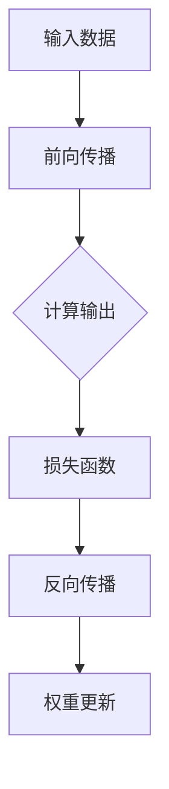

#### 1.2 神经网络基础

神经网络是深度学习的基础。它由多个层组成，包括输入层、隐藏层和输出层。每个层由多个神经元组成。

#### 1.3 深度学习框架

深度学习框架如TensorFlow和PyTorch为深度学习模型的设计、训练和部署提供了强大的支持。这些框架提供了丰富的API，使得构建和训练深度学习模型变得更加简单和高效。

### 第2章：核心算法原理

#### 2.1 卷积神经网络（CNN）

卷积神经网络是处理图像数据的主要深度学习模型。它通过卷积操作提取图像的局部特征，并通过池化操作降低数据的维度。

#### 2.2 循环神经网络（RNN）

循环神经网络适用于处理序列数据，如文本和音乐。RNN能够记住之前的输入，使其在处理长序列时具有优势。

#### 2.3 生成对抗网络（GAN）

生成对抗网络由一个生成器和两个判别器组成。生成器尝试生成逼真的数据，而判别器则判断数据的真实性。

### 第3章：数学模型与公式解析

#### 3.1 激活函数

激活函数是神经网络中用于引入非线性变换的函数。常见的激活函数包括Sigmoid、ReLU和Tanh等。

#### 3.2 反向传播算法

反向传播算法是训练神经网络的重要算法。它通过计算损失函数关于网络参数的梯度，来更新网络的权重，从而优化模型。

#### 3.3 损失函数

损失函数用于衡量预测值与真实值之间的差距。常见的损失函数有均方误差（MSE）和交叉熵（Cross-Entropy）等。

### 第4章：艺术创作中的深度学习应用

#### 4.1 艺术风格的迁移

艺术风格的迁移是将一幅图像的风格应用到另一幅图像上的过程。通过深度学习模型，我们可以实现这一过程，创造出独特的艺术作品。

#### 4.2 图像生成与编辑

图像生成与编辑是深度学习在艺术创作中的一个重要应用。通过生成对抗网络，我们可以生成新的图像，并进行各种编辑操作。

#### 4.3 音乐创作

音乐创作是深度学习在艺术创作中的另一个重要应用。通过循环神经网络，我们可以生成新的音乐旋律，并实现音乐风格的转换。

### 第5章：深度学习在绘画领域的应用

#### 5.1 自动绘画生成

自动绘画生成是深度学习在绘画领域的一个重要应用。通过生成对抗网络，我们可以生成各种风格的绘画作品。

#### 5.2 绘画风格识别与转换

绘画风格识别与转换是将一种绘画风格应用到另一幅画作上的过程。通过深度学习模型，我们可以实现这一过程，创造出独特的艺术效果。

#### 5.3 绘画创意辅助

绘画创意辅助是深度学习在绘画领域的另一个应用。通过分析大量的绘画作品，我们可以为艺术家提供创意灵感和建议。

### 第6章：深度学习在音乐创作中的应用

#### 6.1 自动音乐生成

自动音乐生成是深度学习在音乐创作中的一个重要应用。通过循环神经网络，我们可以生成新的音乐旋律，并实现音乐风格的转换。

#### 6.2 音乐风格转换

音乐风格转换是将一种音乐风格应用到另一段音乐上的过程。通过深度学习模型，我们可以实现这一过程，创造出独特的音乐效果。

#### 6.3 音乐情感分析

音乐情感分析是深度学习在音乐创作中的另一个应用。通过分析音乐的音频特征，我们可以判断音乐的情感倾向。

### 第7章：深度学习在虚拟现实中的应用

#### 7.1 虚拟现实中的图像处理

虚拟现实中的图像处理是深度学习在虚拟现实中的一个重要应用。通过深度学习模型，我们可以对虚拟环境中的图像进行实时处理，提高虚拟现实的视觉效果。

#### 7.2 虚拟现实中的自然语言交互

虚拟现实中的自然语言交互是深度学习在虚拟现实中的另一个应用。通过循环神经网络，我们可以实现虚拟角色与用户的自然语言交互。

#### 7.3 虚拟现实中的虚拟角色生成

虚拟现实中的虚拟角色生成是深度学习在虚拟现实中的另一个重要应用。通过生成对抗网络，我们可以生成各种逼真的虚拟角色。

### 第8章：深度学习艺术创作项目实战

#### 8.1 项目一：艺术风格迁移

项目一将展示如何使用深度学习技术进行艺术风格的迁移。我们将使用预训练的卷积神经网络提取图像的特征，并通过生成对抗网络实现风格迁移。

#### 8.2 项目二：图像生成与编辑

项目二将探讨如何使用生成对抗网络生成新的图像，并对其进行编辑。我们将介绍如何构建一个能够生成高质量图像的生成器模型。

#### 8.3 项目三：音乐创作与风格转换

项目三将介绍如何使用循环神经网络生成新的音乐旋律，并实现音乐风格的转换。我们将展示如何设计一个能够学习音乐风格的模型。

### 第9章：深度学习在艺术创作中的应用挑战与展望

#### 9.1 深度学习在艺术创作中的挑战

深度学习在艺术创作中面临许多挑战，如数据质量、模型可解释性和创造性表达等。

#### 9.2 深度学习在艺术创作中的未来展望

随着深度学习技术的不断发展，我们可以期待未来在艺术创作领域中实现更多创新和突破。

### 第10章：附录

#### 10.1 深度学习工具与资源

本文将提供一些深度学习工具和资源的链接，供读者参考。

#### 10.2 实战项目代码解析

本文将附带实战项目的代码解析，帮助读者更好地理解深度学习在艺术创作中的应用。

#### 10.3 参考文献与扩展阅读

本文将列举一些相关的参考文献和扩展阅读材料，供读者进一步学习。

### 总结

深度学习在艺术创作中的应用为传统艺术形式注入了新的活力。通过本文的介绍，读者可以了解到深度学习的基础知识及其在艺术创作中的实际应用。未来，随着技术的不断发展，深度学习将有望在艺术创作中发挥更大的作用。

### 作者：AI天才研究院/AI Genius Institute & 禅与计算机程序设计艺术 /Zen And The Art of Computer Programming

**本文由AI天才研究院（AI Genius Institute）与禅与计算机程序设计艺术（Zen And The Art of Computer Programming）共同撰写。**

## 第1章：深度学习入门

### 1.1 深度学习概述

深度学习是机器学习的一个分支，它通过多层神经网络模拟人脑的感知和学习能力。与传统的机器学习方法不同，深度学习能够自动从数据中学习特征，从而实现复杂的模式识别和预测。深度学习在计算机视觉、自然语言处理、语音识别等领域取得了显著的成果，引起了广泛的关注。

#### 问题背景

随着互联网的普及和大数据技术的发展，数据规模日益扩大，如何有效地利用这些数据进行学习和预测成为了一个重要的问题。深度学习因其强大的学习和泛化能力，成为解决这一问题的有力工具。

#### 问题描述

本节将介绍深度学习的基本概念，包括深度学习的基本原理、常见的神经网络结构以及深度学习在实际应用中的优势。

#### 问题解决

1. **深度学习的基本原理**

   深度学习基于多层神经网络的结构，通过前向传播和反向传播算法来学习和优化模型。在深度学习中，每一层神经网络都负责提取更高层次的特征，最终形成对输入数据的全面理解。

2. **常见的神经网络结构**

   - **全连接神经网络（Fully Connected Neural Network）**：这是最简单的神经网络结构，每一层的神经元都与前一层的所有神经元相连。
   - **卷积神经网络（Convolutional Neural Network，CNN）**：专门用于处理图像数据，通过卷积操作提取图像的局部特征。
   - **循环神经网络（Recurrent Neural Network，RNN）**：适用于处理序列数据，如文本和语音，通过循环结构保持对之前信息的记忆。
   - **生成对抗网络（Generative Adversarial Network，GAN）**：由生成器和判别器组成，生成器尝试生成真实的数据，判别器则判断生成数据与真实数据的差异。

3. **深度学习在实际应用中的优势**

   - **自动特征提取**：深度学习能够自动从原始数据中提取有意义的特征，减少了人工特征工程的工作量。
   - **强大的学习能力**：通过多层神经网络的结构，深度学习能够学习更复杂的模式，提高模型的泛化能力。
   - **多任务学习**：深度学习模型可以同时处理多个任务，提高计算效率。

#### 边界与外延

深度学习的应用范围广泛，包括但不限于：

- **计算机视觉**：图像识别、图像分类、目标检测等。
- **自然语言处理**：文本分类、机器翻译、情感分析等。
- **语音识别**：语音识别、语音合成等。
- **医疗健康**：疾病诊断、药物设计等。
- **金融领域**：风险控制、量化交易等。

#### 概念结构与核心要素组成

| 核心要素         | 说明                                                         |
| --------------- | ------------------------------------------------------------ |
| 神经元           | 神经网络的基本计算单元，负责接收输入并进行计算。                 |
| 层              | 神经网络的层次结构，包括输入层、隐藏层和输出层。                 |
| 激活函数         | 引入非线性变换，使神经网络能够拟合复杂的非线性关系。             |
| 损失函数         | 衡量模型预测值与真实值之间的差距，用于指导优化过程。             |
| 反向传播算法     | 训练神经网络的重要算法，通过计算损失函数关于网络参数的梯度来更新权重。 |

#### Mermaid 流程图

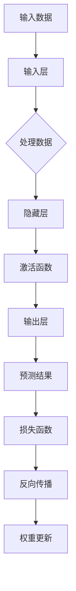

### 1.2 神经网络基础

神经网络是深度学习的基础，它由大量的神经元组成，通过连接形成网络结构。每个神经元接收来自前一层神经元的输入信号，通过一个加权求和处理后，加上一个偏置项，最后通过一个激活函数产生输出。

#### 问题背景

神经网络最早由心理学家弗兰克·罗森布拉特（Frank Rosenblatt）在1957年提出，称为感知机（Perceptron）。然而，感知机的局限性使得神经网络在很长一段时间内没有受到足够的关注。直到1986年，鲁斯特·赫伯特（Rumelhart）、大卫·曹姆斯（David E. Rumelhart）和约翰·霍普菲尔德（John Hopfield）等人提出了反向传播算法，神经网络才得以迅速发展。

#### 问题描述

本节将介绍神经网络的基本结构，包括神经元的工作原理、层的组成以及神经网络的训练过程。

#### 问题解决

1. **神经元的工作原理**

   神经元是神经网络的基本计算单元，它接收多个输入信号，每个信号都有一个对应的权重。输入信号通过权重加权求和处理，加上一个偏置项，最后通过一个激活函数产生输出。激活函数通常是引入非线性变换的关键，常见的激活函数有Sigmoid、ReLU等。

   $$ 输出 = 激活函数(Σ(权重 \times 输入) + 偏置) $$

2. **层的组成**

   神经网络由多个层组成，包括输入层、隐藏层和输出层。输入层接收外部输入数据，隐藏层负责提取数据中的特征，输出层产生最终的预测结果。

3. **神经网络的训练过程**

   神经网络的训练过程包括两个主要步骤：前向传播和反向传播。

   - **前向传播**：输入数据通过神经网络从输入层传递到输出层，生成预测结果。
   - **反向传播**：计算预测结果与真实结果之间的差距，即损失函数值。通过计算损失函数关于网络参数的梯度，更新网络权重和偏置，以减少损失函数的值。

#### 边界与外延

神经网络的结构和参数选择对模型性能有很大影响。常用的神经网络结构包括全连接神经网络、卷积神经网络、循环神经网络等。在选择神经网络结构时，需要考虑数据的特点和应用场景。

#### 概念结构与核心要素组成

| 核心要素         | 说明                                                         |
| --------------- | ------------------------------------------------------------ |
| 输入层           | 接收外部输入数据。                                           |
| 隐藏层           | 提取数据中的特征。                                           |
| 输出层           | 生成最终的预测结果。                                         |
| 激活函数         | 引入非线性变换，使神经网络能够拟合复杂的非线性关系。             |
| 损失函数         | 衡量模型预测值与真实值之间的差距，用于指导优化过程。             |
| 反向传播算法     | 训练神经网络的重要算法，通过计算损失函数关于网络参数的梯度来更新权重。 |

#### Mermaid 流程图


### 1.3 深度学习框架

深度学习框架为深度学习模型的设计、训练和部署提供了强大的支持。这些框架提供了丰富的API和工具，使得构建和训练深度学习模型变得更加简单和高效。常见的深度学习框架包括TensorFlow、PyTorch、Keras等。

#### 问题背景

随着深度学习的广泛应用，如何高效地构建和训练深度学习模型成为一个重要问题。深度学习框架的出现，极大地简化了这一过程，使得研究人员和开发者可以专注于模型的设计和优化。

#### 问题描述

本节将介绍深度学习框架的基本概念，包括常见的深度学习框架、框架的基本功能和特点。

#### 问题解决

1. **常见的深度学习框架**

   - **TensorFlow**：由Google开发，是一个开源的深度学习框架，提供了丰富的API和工具，支持多种类型的神经网络。
   - **PyTorch**：由Facebook开发，是一个开源的深度学习框架，以其灵活的动态计算图和易于理解的API而受到广泛欢迎。
   - **Keras**：是一个基于TensorFlow和PyTorch的高级深度学习框架，提供了更加简洁和易于理解的API。

2. **深度学习框架的基本功能**

   - **模型构建**：框架提供了丰富的API，可以方便地构建各种类型的神经网络模型。
   - **训练过程**：框架提供了自动化的训练过程，包括数据预处理、模型训练和验证等。
   - **评估与部署**：框架提供了评估模型性能的工具，并支持将训练好的模型部署到生产环境中。

3. **深度学习框架的特点**

   - **灵活性**：框架提供了动态计算图，可以灵活地构建和调整模型。
   - **易用性**：框架提供了简洁的API，使得构建和训练深度学习模型更加容易。
   - **可扩展性**：框架支持自定义层和损失函数，可以方便地扩展和优化模型。

#### 边界与外延

深度学习框架的选择取决于具体的应用场景和需求。例如，对于需要高性能计算的应用，可以选择TensorFlow；对于需要灵活性和易用性的应用，可以选择PyTorch或Keras。

#### 概念结构与核心要素组成

| 核心要素         | 说明                                                         |
| --------------- | ------------------------------------------------------------ |
| 模型构建         | 使用框架提供的API构建神经网络模型。                         |
| 训练过程         | 使用框架提供的工具和API进行模型训练。                       |
| 评估与部署       | 使用框架提供的工具评估模型性能，并部署到生产环境中。         |

#### Mermaid 流程图

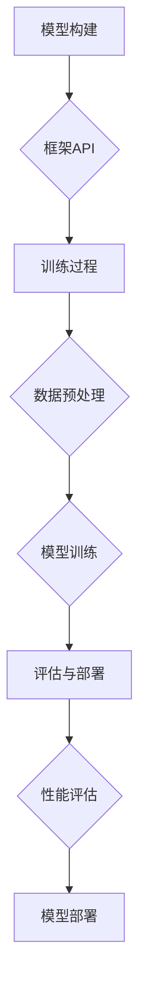

## 第2章：核心算法原理

### 2.1 卷积神经网络（CNN）

卷积神经网络（Convolutional Neural Network，CNN）是专门用于处理图像数据的深度学习模型。CNN通过卷积操作提取图像的局部特征，并通过池化操作降低数据的维度。CNN在图像分类、目标检测和图像生成等领域有广泛应用。

#### 问题背景

图像数据具有高维度和高噪声的特点，传统的神经网络很难有效地处理。CNN通过卷积操作和池化操作，可以自动提取图像的局部特征，从而提高模型的性能。

#### 问题描述

本节将介绍CNN的基本原理，包括卷积操作、池化操作和CNN的结构。

#### 问题解决

1. **卷积操作**

   卷积操作是CNN的核心，它通过在图像上滑动一个卷积核，计算每个位置的特征图。卷积核的权重通过学习得到，可以提取图像的局部特征。

   $$ 输出 = 激活函数(Σ(权重 \times 输入) + 偏置) $$

2. **池化操作**

   池化操作用于降低数据的维度，减少计算量和过拟合的风险。常见的池化操作包括最大池化和平均池化。

   - **最大池化**：选择每个窗口内的最大值作为输出。
   - **平均池化**：计算每个窗口内的平均值作为输出。

3. **CNN的结构**

   CNN通常包括卷积层、池化层、全连接层等。卷积层用于提取图像的局部特征，池化层用于降低数据的维度，全连接层用于分类。

   - **卷积层**：通过卷积操作提取图像的局部特征。
   - **池化层**：降低数据的维度，减少计算量和过拟合的风险。
   - **全连接层**：将特征图映射到具体的类别。

#### 边界与外延

CNN在图像处理领域有广泛的应用，包括图像分类、目标检测、图像分割等。随着深度学习技术的发展，CNN的变种和应用也在不断扩展。

#### 概念结构与核心要素组成

| 核心要素         | 说明                                                         |
| --------------- | ------------------------------------------------------------ |
| 卷积层           | 提取图像的局部特征。                                           |
| 池化层           | 降低数据的维度，减少计算量和过拟合的风险。                     |
| 全连接层         | 将特征图映射到具体的类别。                                     |

#### Mermaid 流程图

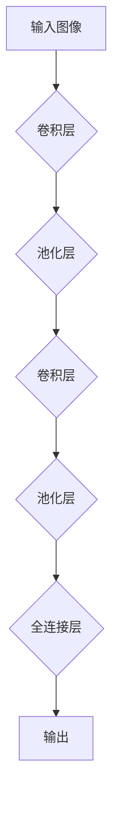

### 2.2 循环神经网络（RNN）

循环神经网络（Recurrent Neural Network，RNN）是专门用于处理序列数据的深度学习模型。RNN通过循环结构保持对之前信息的记忆，从而实现序列数据的建模和预测。

#### 问题背景

传统的神经网络难以处理序列数据，因为序列数据具有前后依赖的特点。RNN通过循环结构可以记住之前的信息，从而更好地处理序列数据。

#### 问题描述

本节将介绍RNN的基本原理，包括RNN的结构和训练过程。

#### 问题解决

1. **RNN的结构**

   RNN由一个循环单元组成，每个时间步的输入都会影响到下一个时间步的输出。RNN的循环单元通常由一个线性层和一个非线性激活函数组成。

   $$ 输出_t = 激活函数(线性层(输入_t, 隐藏状态_{t-1})) $$

   $$ 隐藏状态_t = 线性层(输入_t, 隐藏状态_{t-1}) $$

2. **RNN的训练过程**

   RNN的训练过程与传统的神经网络类似，包括前向传播和反向传播。在前向传播过程中，输入数据从第一个时间步开始，逐个传递到循环单元，生成预测输出。在反向传播过程中，计算预测输出与真实输出之间的损失，并通过梯度下降更新网络参数。

#### 边界与外延

RNN在自然语言处理、语音识别、时间序列分析等领域有广泛的应用。然而，RNN存在梯度消失和梯度爆炸的问题，限制了其在长序列数据上的表现。

#### 概念结构与核心要素组成

| 核心要素         | 说明                                                         |
| --------------- | ------------------------------------------------------------ |
| 循环单元         | 负责记忆和传递信息。                                           |
| 隐藏状态         | 存储当前时间步的信息。                                         |
| 输出层           | 生成最终的预测输出。                                           |

#### Mermaid 流程图

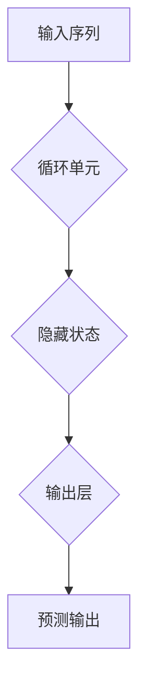

### 2.3 生成对抗网络（GAN）

生成对抗网络（Generative Adversarial Network，GAN）是由生成器和判别器组成的深度学习模型。生成器尝试生成真实的数据，判别器则判断生成数据与真实数据的差异。通过这种对抗过程，生成器不断提高生成质量。

#### 问题背景

传统的生成模型，如变分自编码器（VAE），往往难以生成高质量的数据。GAN通过生成器和判别器的对抗训练，可以生成逼真的数据。

#### 问题描述

本节将介绍GAN的基本原理，包括生成器和判别器的结构和工作原理。

#### 问题解决

1. **生成器**

   生成器接收一个随机噪声向量作为输入，通过一系列的全连接层和激活函数，生成逼真的数据。

   $$ 输出 = 激活函数(全连接层(随机噪声向量)) $$

2. **判别器**

   判别器接收一个数据样本作为输入，通过一系列的全连接层和激活函数，判断数据的真实性。

   $$ 输出 = 激活函数(全连接层(数据样本)) $$

3. **对抗过程**

   生成器和判别器通过一个对抗过程进行训练。生成器尝试生成逼真的数据，使得判别器无法区分生成数据与真实数据。判别器则通过区分生成数据与真实数据，来提高自身的性能。

   $$ 判别器损失 = -log(D(真实数据)) - log(1 - D(生成数据)) $$

   $$ 生成器损失 = -log(D(生成数据)) $$

#### 边界与外延

GAN在图像生成、文本生成和音频生成等领域有广泛的应用。然而，GAN的训练过程较为复杂，需要仔细调整超参数和训练策略。

#### 概念结构与核心要素组成

| 核心要素         | 说明                                                         |
| --------------- | ------------------------------------------------------------ |
| 生成器           | 生成逼真的数据。                                           |
| 判别器           | 判断生成数据与真实数据的差异。                               |
| 对抗过程         | 通过生成器和判别器的对抗训练，提高生成质量。                   |

#### Mermaid 流程图

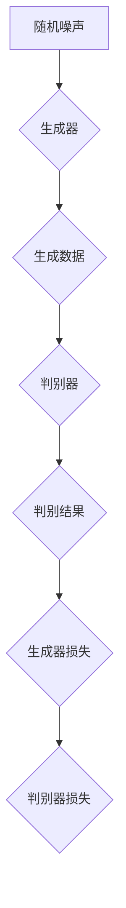

## 第3章：数学模型与公式解析

### 3.1 激活函数

激活函数是神经网络中的一个关键组件，它引入了非线性变换，使得神经网络能够拟合复杂的非线性关系。常见的激活函数包括Sigmoid、ReLU、Tanh等。

#### 问题背景

在早期的神经网络中，线性函数被广泛使用，这导致神经网络难以拟合复杂的数据。引入非线性激活函数，使得神经网络能够更好地捕捉数据的特征。

#### 问题描述

本节将介绍几种常见的激活函数，并分析它们的优缺点。

#### 问题解决

1. **Sigmoid函数**

   Sigmoid函数是一个S形的曲线，它的输出介于0和1之间。Sigmoid函数的优点是简单易计算，缺点是梯度较小，可能导致梯度消失问题。

   $$ sigmoid(x) = \frac{1}{1 + e^{-x}} $$

2. **ReLU函数**

   ReLU函数（Rectified Linear Unit）是一个线性函数，当输入大于0时，输出等于输入；当输入小于等于0时，输出等于0。ReLU函数的优点是梯度较大，可以缓解梯度消失问题，缺点是可能导致梯度消失。

   $$ ReLU(x) = \max(0, x) $$

3. **Tanh函数**

   Tanh函数（双曲正切函数）是一个类似于Sigmoid函数的激活函数，它的输出介于-1和1之间。Tanh函数的优点是梯度较大，可以缓解梯度消失问题，缺点是计算复杂度较高。

   $$ tanh(x) = \frac{e^x - e^{-x}}{e^x + e^{-x}} $$

#### 边界与外延

激活函数的选择对神经网络的学习性能有很大影响。在实际应用中，可以根据具体问题选择合适的激活函数。

#### 概念结构与核心要素组成

| 核心要素         | 说明                                                         |
| --------------- | ------------------------------------------------------------ |
| Sigmoid函数     | 引入非线性变换，输出介于0和1之间。                             |
| ReLU函数        | 引入非线性变换，梯度较大，可以缓解梯度消失问题。                 |
| Tanh函数        | 引入非线性变换，输出介于-1和1之间。                             |

#### Mermaid 流程图

```mermaid
graph TD
A[输入x] --> B{Sigmoid函数}
B --> C[输出sigmoid(x)]

A --> D{ReLU函数}
D --> E[输出ReLU(x)]

A --> F{Tanh函数}
F --> G[输出tanh(x)]
```

### 3.2 反向传播算法

反向传播算法（Backpropagation）是训练神经网络的核心算法，它通过计算损失函数关于网络参数的梯度，来更新网络的权重和偏置，从而优化模型。

#### 问题背景

在神经网络训练过程中，我们需要找到一组权重和偏置，使得模型能够最小化损失函数。反向传播算法提供了一个有效的计算方法，可以自动计算梯度并更新网络参数。

#### 问题描述

本节将介绍反向传播算法的基本原理和计算步骤。

#### 问题解决

1. **损失函数**

   损失函数用于衡量模型预测值与真实值之间的差距。常见的损失函数有均方误差（MSE）、交叉熵（Cross-Entropy）等。

2. **梯度计算**

   反向传播算法通过计算损失函数关于网络参数的梯度，来更新网络参数。对于每个参数，我们计算其在损失函数中的梯度，即损失函数对参数的导数。

3. **权重和偏置更新**

   根据梯度计算的结果，我们可以更新网络的权重和偏置。通常使用梯度下降（Gradient Descent）算法来更新参数。

   $$ 参数_{new} = 参数_{old} - 学习率 \times 梯度 $$

#### 边界与外延

反向传播算法是神经网络训练的基础，它在多种神经网络中都有应用。在实际应用中，可以根据具体问题调整学习率和优化算法。

#### 概念结构与核心要素组成

| 核心要素         | 说明                                                         |
| --------------- | ------------------------------------------------------------ |
| 损失函数         | 衡量模型预测值与真实值之间的差距。                             |
| 梯度计算         | 计算损失函数关于网络参数的梯度。                               |
| 权重和偏置更新   | 通过梯度下降算法更新网络参数。                                 |

#### Mermaid 流程图

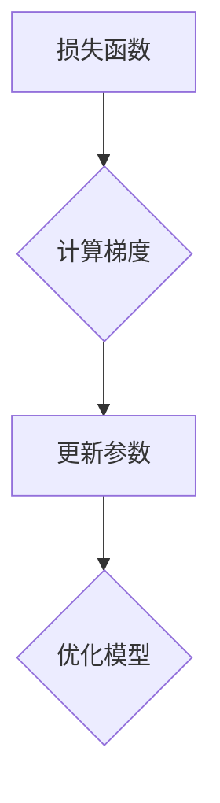

### 3.3 损失函数

损失函数（Loss Function）是训练神经网络的核心组成部分，它用于衡量模型预测值与真实值之间的差距。通过优化损失函数，我们可以提高模型的性能。

#### 问题背景

在神经网络训练过程中，我们需要一个指标来衡量模型的预测性能，以便调整网络参数。损失函数提供了这样一个指标，它可以通过计算预测值与真实值之间的差距来评估模型的性能。

#### 问题描述

本节将介绍几种常见的损失函数，并分析它们在神经网络训练中的应用。

#### 问题解决

1. **均方误差（MSE）**

   均方误差（Mean Squared Error，MSE）是最常见的损失函数之一，它计算预测值与真实值之间的平均平方误差。

   $$ MSE = \frac{1}{n} \sum_{i=1}^{n} (预测值_i - 真实值_i)^2 $$

   MSE的优点是计算简单，对异常值不敏感；缺点是梯度较大，可能导致梯度消失问题。

2. **交叉熵（Cross-Entropy）**

   交叉熵（Cross-Entropy）是另一个常用的损失函数，它用于分类问题。交叉熵计算的是预测概率分布与真实概率分布之间的差异。

   $$ CE = - \sum_{i=1}^{n} 真实值_i \cdot log(预测值_i) $$

   交叉熵的优点是梯度稳定，对异常值敏感；缺点是计算复杂度较高。

3. **二元交叉熵（Binary Cross-Entropy）**

   二元交叉熵是交叉熵在二分类问题中的应用，它计算的是预测概率与实际标签之间的差异。

   $$ BCE = - (真实值 \cdot log(预测值) + (1 - 真实值) \cdot log(1 - 预测值)) $$

   二元交叉熵的优点是计算简单，适用于二分类问题。

#### 边界与外延

损失函数的选择取决于具体问题和应用场景。在实际应用中，可以根据需求选择合适的损失函数。

#### 概念结构与核心要素组成

| 核心要素         | 说明                                                         |
| --------------- | ------------------------------------------------------------ |
| 均方误差（MSE）  | 计算预测值与真实值之间的平均平方误差。                       |
| 交叉熵（CE）     | 计算预测概率分布与真实概率分布之间的差异。                     |
| 二元交叉熵（BCE） | 计算预测概率与实际标签之间的差异。                           |

#### Mermaid 流程图

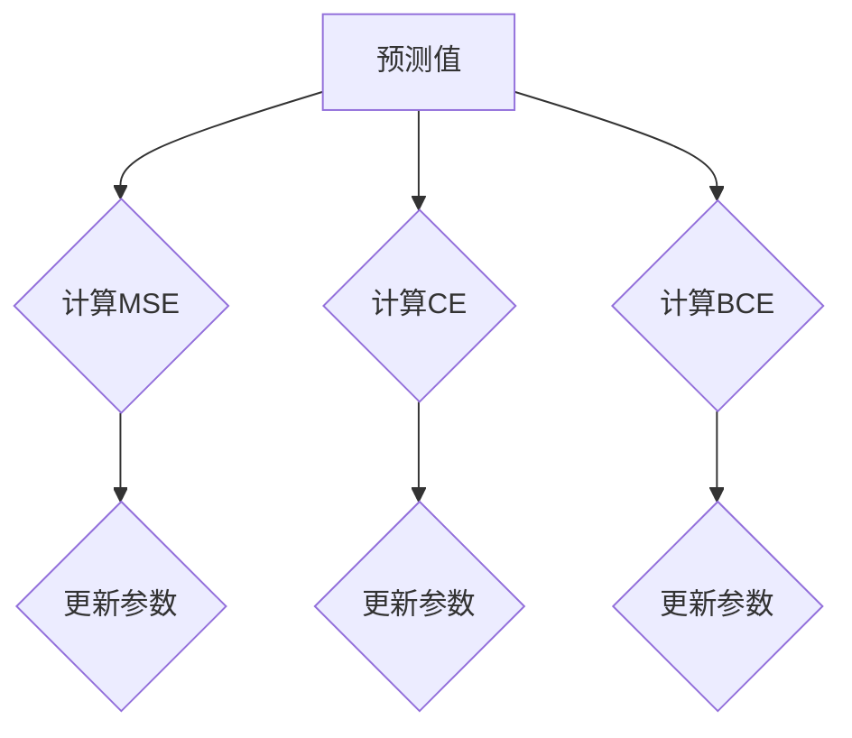

## 第4章：深度学习在艺术创作中的应用

### 4.1 艺术风格的迁移

艺术风格的迁移（Art Style Transfer）是将一幅图像的风格应用到另一幅图像上的过程。通过深度学习模型，我们可以实现这一过程，创造出独特的艺术作品。

#### 问题背景

传统的艺术风格迁移方法通常需要大量的手工调整和优化，而且效果往往不够理想。随着深度学习技术的发展，基于深度学习的艺术风格迁移方法逐渐成为一种新的趋势。

#### 问题描述

本节将介绍如何使用深度学习模型进行艺术风格的迁移，包括模型的选择、训练过程和风格迁移的实现。

#### 问题解决

1. **模型的选择**

   艺术风格的迁移通常使用生成对抗网络（GAN）或卷积神经网络（CNN）来实现。GAN模型由生成器和判别器组成，生成器负责生成具有特定风格的新图像，判别器则负责判断生成图像的真实性。

2. **训练过程**

   训练过程包括两个阶段：首先使用卷积神经网络提取源图像和目标图像的特征，然后使用生成对抗网络训练生成器，使其能够生成具有目标风格的新图像。

3. **风格迁移的实现**

   在风格迁移的实现过程中，我们首先需要确定源图像和目标图像的特征图。然后，使用生成器将这些特征图转换为具有目标风格的新图像。

#### 边界与外延

艺术风格的迁移在图像编辑、艺术创作和视觉设计等领域有广泛的应用。随着技术的不断发展，未来我们可以期待更加高效和灵活的艺术风格迁移方法。

#### 概念结构与核心要素组成

| 核心要素         | 说明                                                         |
| --------------- | ------------------------------------------------------------ |
| 生成对抗网络（GAN）| 负责生成具有目标风格的新图像。                                 |
| 卷积神经网络（CNN）| 负责提取源图像和目标图像的特征。                               |
| 风格迁移的实现   | 使用生成器将特征图转换为具有目标风格的新图像。                   |

#### Mermaid 流程图

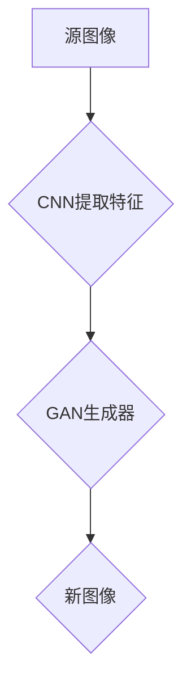

### 4.2 图像生成与编辑

图像生成与编辑（Image Generation and Editing）是深度学习在艺术创作中的一个重要应用。通过生成对抗网络（GAN）或卷积神经网络（CNN），我们可以生成新的图像或对现有图像进行编辑。

#### 问题背景

传统的图像生成与编辑方法通常需要大量的手工操作和调整，而且效果往往不够理想。随着深度学习技术的发展，基于深度学习的图像生成与编辑方法逐渐成为一种新的趋势。

#### 问题描述

本节将介绍如何使用深度学习模型进行图像生成与编辑，包括模型的选择、训练过程和图像生成与编辑的实现。

#### 问题解决

1. **模型的选择**

   图像生成与编辑通常使用生成对抗网络（GAN）或卷积神经网络（CNN）来实现。GAN模型由生成器和判别器组成，生成器负责生成新的图像，判别器则负责判断生成图像的真实性。

2. **训练过程**

   训练过程包括两个阶段：首先使用卷积神经网络提取图像的特征，然后使用生成对抗网络训练生成器，使其能够生成具有特定风格的新图像。

3. **图像生成与编辑的实现**

   在图像生成与编辑的实现过程中，我们首先需要确定生成器的模型结构和训练参数。然后，通过训练生成器，我们可以生成新的图像或对现有图像进行编辑。

#### 边界与外延

图像生成与编辑在计算机视觉、艺术创作和视觉设计等领域有广泛的应用。随着技术的不断发展，未来我们可以期待更加高效和灵活的图像生成与编辑方法。

#### 概念结构与核心要素组成

| 核心要素         | 说明                                                         |
| --------------- | ------------------------------------------------------------ |
| 生成对抗网络（GAN）| 负责生成新的图像或编辑现有图像。                               |
| 卷积神经网络（CNN）| 负责提取图像的特征。                                           |
| 图像生成与编辑   | 使用生成器生成新的图像或对现有图像进行编辑。                   |

#### Mermaid 流程图

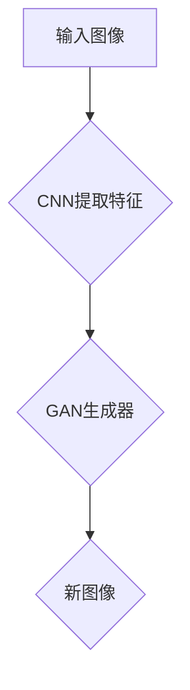

### 4.3 音乐创作

音乐创作（Music Generation）是深度学习在艺术创作中的另一个重要应用。通过循环神经网络（RNN）或变分自编码器（VAE），我们可以生成新的音乐旋律或实现音乐风格的转换。

#### 问题背景

传统的音乐创作方法通常需要大量的手工调整和创作，而且效果往往不够理想。随着深度学习技术的发展，基于深度学习的音乐创作方法逐渐成为一种新的趋势。

#### 问题描述

本节将介绍如何使用深度学习模型进行音乐创作，包括模型的选择、训练过程和音乐创作的实现。

#### 问题解决

1. **模型的选择**

   音乐创作通常使用循环神经网络（RNN）或变分自编码器（VAE）来实现。RNN能够处理序列数据，可以生成新的音乐旋律；VAE通过学习数据的概率分布，可以实现音乐风格的转换。

2. **训练过程**

   训练过程包括两个阶段：首先使用循环神经网络或变分自编码器提取音乐序列的特征，然后通过训练生成器，使其能够生成具有特定风格的新音乐。

3. **音乐创作的实现**

   在音乐创作的实现过程中，我们首先需要确定生成器的模型结构和训练参数。然后，通过训练生成器，我们可以生成新的音乐旋律或实现音乐风格的转换。

#### 边界与外延

音乐创作在音乐制作、艺术表演和虚拟现实等领域有广泛的应用。随着技术的不断发展，未来我们可以期待更加高效和灵活的音乐创作方法。

#### 概念结构与核心要素组成

| 核心要素         | 说明                                                         |
| --------------- | ------------------------------------------------------------ |
| 循环神经网络（RNN）| 负责生成新的音乐旋律。                                           |
| 变分自编码器（VAE）| 负责实现音乐风格的转换。                                           |
| 音乐创作       | 使用生成器生成新的音乐旋律或实现音乐风格的转换。                   |

#### Mermaid 流程图

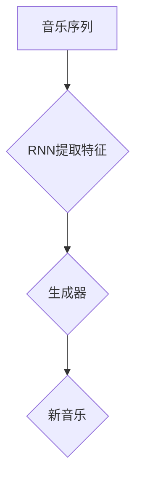

## 第5章：深度学习在绘画领域的应用

### 5.1 自动绘画生成

自动绘画生成（Automatic Art Generation）是深度学习在绘画领域的一个重要应用。通过生成对抗网络（GAN）或变分自编码器（VAE），我们可以生成新的绘画作品。

#### 问题背景

传统的绘画生成方法通常需要大量的手工调整和创作，而且效果往往不够理想。随着深度学习技术的发展，基于深度学习的绘画生成方法逐渐成为一种新的趋势。

#### 问题描述

本节将介绍如何使用深度学习模型进行自动绘画生成，包括模型的选择、训练过程和绘画生成的实现。

#### 问题解决

1. **模型的选择**

   自动绘画生成通常使用生成对抗网络（GAN）或变分自编码器（VAE）来实现。GAN模型由生成器和判别器组成，生成器负责生成新的绘画作品，判别器则负责判断生成绘画作品的真实性。

2. **训练过程**

   训练过程包括两个阶段：首先使用卷积神经网络提取绘画作品的特征，然后使用生成对抗网络训练生成器，使其能够生成具有特定风格的新绘画作品。

3. **绘画生成的实现**

   在绘画生成的实现过程中，我们首先需要确定生成器的模型结构和训练参数。然后，通过训练生成器，我们可以生成新的绘画作品。

#### 边界与外延

自动绘画生成在艺术创作、计算机辅助设计和虚拟现实等领域有广泛的应用。随着技术的不断发展，未来我们可以期待更加高效和灵活的自动绘画生成方法。

#### 概念结构与核心要素组成

| 核心要素         | 说明                                                         |
| --------------- | ------------------------------------------------------------ |
| 生成对抗网络（GAN）| 负责生成新的绘画作品。                                           |
| 变分自编码器（VAE）| 负责生成新的绘画作品。                                           |
| 自动绘画生成   | 使用生成器生成新的绘画作品。                                     |

#### Mermaid 流程图

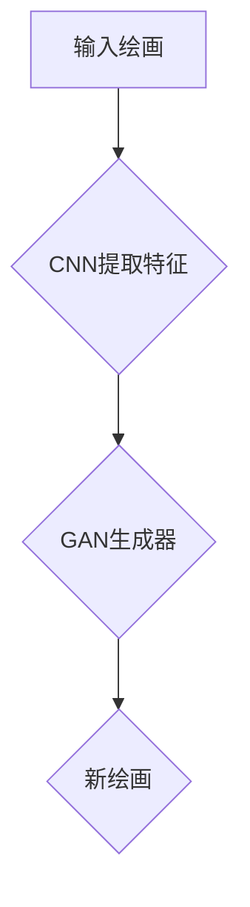

### 5.2 绘画风格识别与转换

绘画风格识别与转换（Art Style Recognition and Transformation）是深度学习在绘画领域的另一个重要应用。通过深度学习模型，我们可以识别不同的绘画风格，并将一种绘画风格应用到另一幅画作上。

#### 问题背景

传统的绘画风格识别与转换方法通常需要大量的手工操作和调整，而且效果往往不够理想。随着深度学习技术的发展，基于深度学习的绘画风格识别与转换方法逐渐成为一种新的趋势。

#### 问题描述

本节将介绍如何使用深度学习模型进行绘画风格识别与转换，包括模型的选择、训练过程和风格转换的实现。

#### 问题解决

1. **模型的选择**

   绘画风格识别与转换通常使用卷积神经网络（CNN）或生成对抗网络（GAN）来实现。CNN负责识别绘画风格，GAN负责将一种风格应用到另一幅画作上。

2. **训练过程**

   训练过程包括两个阶段：首先使用卷积神经网络训练模型，使其能够识别不同的绘画风格；然后使用生成对抗网络训练生成器，使其能够将一种风格应用到另一幅画作上。

3. **风格转换的实现**

   在风格转换的实现过程中，我们首先需要确定生成器的模型结构和训练参数。然后，通过训练生成器，我们可以将一种绘画风格应用到另一幅画作上。

#### 边界与外延

绘画风格识别与转换在艺术创作、计算机辅助设计和虚拟现实等领域有广泛的应用。随着技术的不断发展，未来我们可以期待更加高效和灵活的绘画风格识别与转换方法。

#### 概念结构与核心要素组成

| 核心要素         | 说明                                                         |
| --------------- | ------------------------------------------------------------ |
| 卷积神经网络（CNN）| 负责识别绘画风格。                                           |
| 生成对抗网络（GAN）| 负责将一种风格应用到另一幅画作上。                             |
| 风格转换的实现   | 使用生成器将一种风格应用到另一幅画作上。                       |

#### Mermaid 流程图

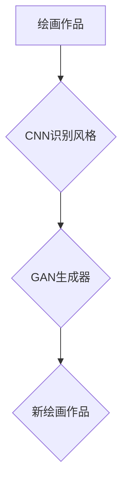

### 5.3 绘画创意辅助

绘画创意辅助（Artistic Creativity Assistance）是深度学习在绘画领域的一个新兴应用。通过深度学习模型，我们可以为艺术家提供创意灵感和建议，帮助他们创作出更加出色的作品。

#### 问题背景

传统的绘画创意方法通常依赖于艺术家的个人经验和直觉，而现代科技的发展为绘画创意提供了新的可能性。深度学习技术的应用，使得计算机能够辅助艺术家进行绘画创作。

#### 问题描述

本节将介绍如何使用深度学习模型进行绘画创意辅助，包括模型的选择、训练过程和创意辅助的实现。

#### 问题解决

1. **模型的选择**

   绘画创意辅助通常使用生成对抗网络（GAN）或变分自编码器（VAE）来实现。GAN通过生成器和判别器的对抗训练，可以生成新的绘画创意；VAE通过学习数据的概率分布，可以为艺术家提供创意建议。

2. **训练过程**

   训练过程包括两个阶段：首先使用生成对抗网络或变分自编码器训练模型，使其能够生成新的绘画创意；然后使用这些模型为艺术家提供创意建议。

3. **创意辅助的实现**

   在创意辅助的实现过程中，我们首先需要确定生成器的模型结构和训练参数。然后，通过训练生成器，我们可以为艺术家提供新的绘画创意。

#### 边界与外延

绘画创意辅助在艺术创作、计算机辅助设计和虚拟现实等领域有广泛的应用。随着技术的不断发展，未来我们可以期待更加高效和灵活的绘画创意辅助方法。

#### 概念结构与核心要素组成

| 核心要素         | 说明                                                         |
| --------------- | ------------------------------------------------------------ |
| 生成对抗网络（GAN）| 负责生成新的绘画创意。                                           |
| 变分自编码器（VAE）| 负责为艺术家提供创意建议。                                       |
| 创意辅助的实现   | 使用生成器为艺术家提供新的绘画创意。                             |

#### Mermaid 流程图

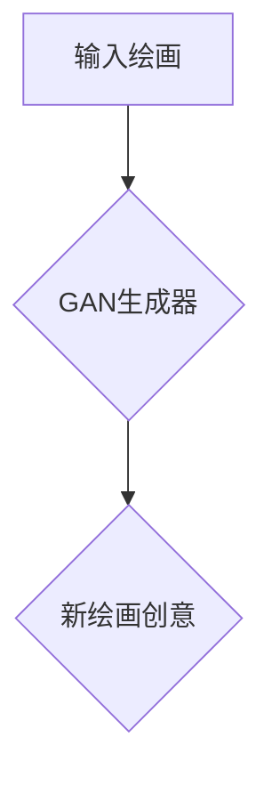

## 第6章：深度学习在音乐创作中的应用

### 6.1 自动音乐生成

自动音乐生成（Automatic Music Generation）是深度学习在音乐创作中的一个重要应用。通过循环神经网络（RNN）或变分自编码器（VAE），我们可以生成新的音乐旋律或音乐片段。

#### 问题背景

传统的音乐创作方法通常需要大量的手工操作和创作，而且效果往往不够理想。随着深度学习技术的发展，基于深度学习的音乐创作方法逐渐成为一种新的趋势。

#### 问题描述

本节将介绍如何使用深度学习模型进行自动音乐生成，包括模型的选择、训练过程和音乐生成的实现。

#### 问题解决

1. **模型的选择**

   自动音乐生成通常使用循环神经网络（RNN）或变分自编码器（VAE）来实现。RNN能够处理序列数据，可以生成新的音乐旋律；VAE通过学习数据的概率分布，可以实现音乐风格的转换。

2. **训练过程**

   训练过程包括两个阶段：首先使用循环神经网络或变分自编码器训练模型，使其能够生成新的音乐旋律或音乐片段；然后使用这些模型生成新的音乐。

3. **音乐生成的实现**

   在音乐生成的实现过程中，我们首先需要确定生成器的模型结构和训练参数。然后，通过训练生成器，我们可以生成新的音乐旋律或音乐片段。

#### 边界与外延

自动音乐生成在音乐制作、虚拟现实和艺术表演等领域有广泛的应用。随着技术的不断发展，未来我们可以期待更加高效和灵活的自动音乐生成方法。

#### 概念结构与核心要素组成

| 核心要素         | 说明                                                         |
| --------------- | ------------------------------------------------------------ |
| 循环神经网络（RNN）| 负责生成新的音乐旋律或音乐片段。                                 |
| 变分自编码器（VAE）| 负责实现音乐风格的转换。                                           |
| 音乐生成       | 使用生成器生成新的音乐旋律或音乐片段。                           |

#### Mermaid 流程图


### 6.2 音乐风格转换

音乐风格转换（Music Style Transformation）是将一种音乐风格应用到另一段音乐上的过程。通过深度学习模型，我们可以实现这一过程，创造出独特的音乐效果。

#### 问题背景

传统的音乐风格转换方法通常需要大量的手工操作和调整，而且效果往往不够理想。随着深度学习技术的发展，基于深度学习的音乐风格转换方法逐渐成为一种新的趋势。

#### 问题描述

本节将介绍如何使用深度学习模型进行音乐风格转换，包括模型的选择、训练过程和风格转换的实现。

#### 问题解决

1. **模型的选择**

   音乐风格转换通常使用循环神经网络（RNN）或生成对抗网络（GAN）来实现。RNN能够处理序列数据，可以生成新的音乐旋律；GAN通过生成器和判别器的对抗训练，可以实现音乐风格的转换。

2. **训练过程**

   训练过程包括两个阶段：首先使用循环神经网络或生成对抗网络训练模型，使其能够生成新的音乐旋律或音乐片段；然后使用这些模型实现音乐风格的转换。

3. **风格转换的实现**

   在风格转换的实现过程中，我们首先需要确定生成器的模型结构和训练参数。然后，通过训练生成器，我们可以将一种音乐风格应用到另一段音乐上。

#### 边界与外延

音乐风格转换在音乐制作、虚拟现实和艺术表演等领域有广泛的应用。随着技术的不断发展，未来我们可以期待更加高效和灵活的音乐风格转换方法。

#### 概念结构与核心要素组成

| 核心要素         | 说明                                                         |
| --------------- | ------------------------------------------------------------ |
| 循环神经网络（RNN）| 负责生成新的音乐旋律或音乐片段。                                 |
| 生成对抗网络（GAN）| 负责实现音乐风格的转换。                                           |
| 音乐风格转换   | 使用生成器将一种音乐风格应用到另一段音乐上。                       |

#### Mermaid 流程图

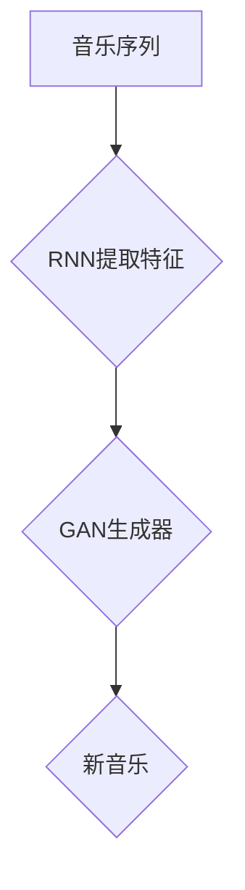

### 6.3 音乐情感分析

音乐情感分析（Music Sentiment Analysis）是通过深度学习模型分析音乐的音频特征，判断音乐的情感倾向。通过音乐情感分析，我们可以了解音乐的创作意图和受众的情感反应。

#### 问题背景

传统的音乐情感分析方法通常基于手工特征提取和规则匹配，效果有限。随着深度学习技术的发展，基于深度学习的音乐情感分析方法逐渐成为一种新的趋势。

#### 问题描述

本节将介绍如何使用深度学习模型进行音乐情感分析，包括模型的选择、训练过程和情感分析的实现。

#### 问题解决

1. **模型的选择**

   音乐情感分析通常使用循环神经网络（RNN）或卷积神经网络（CNN）来实现。RNN能够处理序列数据，可以提取音乐的时序特征；CNN可以提取音乐的非线性特征。

2. **训练过程**

   训练过程包括两个阶段：首先使用循环神经网络或卷积神经网络训练模型，使其能够识别不同的情感类别；然后使用这些模型进行音乐情感分析。

3. **情感分析的实现**

   在情感分析的实现过程中，我们首先需要确定情感分类器的模型结构和训练参数。然后，通过训练分类器，我们可以判断音乐的

