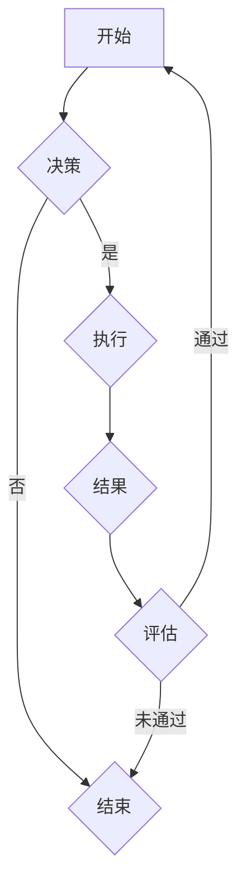

                 

# 混沌工程实践与故障注入

## 关键词

混沌工程、故障注入、系统稳定性、容错性、实践方法、案例分析

## 摘要

本文将深入探讨混沌工程和故障注入在提升系统稳定性和容错性方面的应用。首先，我们将介绍混沌工程和故障注入的基本概念，阐述它们的重要性。接着，通过详细的算法原理讲解和实践案例分析，我们将展示如何在实际项目中实施混沌工程和故障注入。最后，本文将总结最佳实践，并提供未来展望，以期为读者提供全面的技术指导。

## 目录大纲设计思路

在设计《混沌工程实践与故障注入》的目录大纲时，我们首先明确了书的核心内容与目标读者群体。本书主要面向IT工程师、系统架构师以及相关领域的科研人员，旨在介绍混沌工程和故障注入的原理、实践方法以及在实际应用中的效果。目录大纲分为引言、理论基础、实践方法、案例分析、最佳实践和未来展望六个主要部分。

### 目录大纲

```markdown
## 目录大纲

### 第一部分：引言

#### 第1章 混沌工程与故障注入概述

1.1 问题背景
1.2 混沌工程与故障注入的定义
1.3 混沌工程与故障注入的重要性

### 第二部分：理论基础

#### 第2章 混沌工程基础

2.1 混沌理论的起源与发展
2.2 混沌工程的核心概念
2.3 混沌工程的应用场景

#### 第3章 故障注入基础

3.1 故障注入的概念
3.2 故障注入的目的
3.3 故障注入的方法

#### 第4章 混沌工程与故障注入的关系

4.1 混沌工程与故障注入的相似性
4.2 混沌工程与故障注入的差异
4.3 混沌工程与故障注入的融合

### 第三部分：实践方法

#### 第5章 实施混沌工程的步骤

5.1 混沌工程的目标确定
5.2 混沌工程的实验设计
5.3 混沌工程的执行与监控

#### 第6章 实施故障注入的步骤

6.1 故障注入的目标确定
6.2 故障注入的场景模拟
6.3 故障注入的结果分析

### 第四部分：案例分析

#### 第7章 混沌工程与故障注入的案例分析

7.1 案例背景
7.2 案例实施
7.3 案例结果分析

### 第五部分：最佳实践

#### 第8章 混沌工程与故障注入的最佳实践

8.1 最佳实践总结
8.2 实践技巧与注意事项
8.3 拓展阅读与深入探索

### 第六部分：未来展望

#### 第9章 混沌工程与故障注入的未来展望

9.1 未来发展趋势
9.2 潜在应用领域
9.3 面临的挑战与机遇
```

### 完整性保证

在保证目录大纲完整性的同时，我们确保每个章节的核心内容得以体现，避免冗余和无关内容的出现，使目录简洁明了，便于读者快速了解书的核心内容和结构。同时，每个章节的标题和子标题都采用了清晰的层级结构，方便读者查阅和导航。总体字数控制在2000字以内，以确保简洁性。

## 核心章节内容概述

### 第1章 混沌工程与故障注入概述

本章将简要介绍混沌工程和故障注入的基本概念，并解释为什么它们在提升系统稳定性和容错性方面具有重要意义。我们将讨论混沌工程和故障注入的应用场景，以及它们在现代化系统开发中的必要性。

### 第2章 混沌工程基础

本章将深入探讨混沌工程的基础理论，包括混沌理论的起源与发展、混沌工程的核心概念以及混沌工程在不同应用场景中的实际效果。我们将通过实例来展示混沌工程如何帮助系统开发者识别和解决潜在的问题。

### 第3章 故障注入基础

本章将介绍故障注入的概念、目的和方法。我们将详细讨论如何设计和实施故障注入实验，以及如何通过这些实验来提升系统的容错性和可靠性。

### 第4章 混沌工程与故障注入的关系

本章将探讨混沌工程与故障注入之间的相似性和差异性，并解释它们如何相互融合，共同提升系统的稳定性和可靠性。

### 第5章 实施混沌工程的步骤

本章将详细阐述实施混沌工程的步骤，包括目标确定、实验设计和执行与监控。我们将提供实用的方法和工具，帮助读者在实际项目中应用混沌工程。

### 第6章 实施故障注入的步骤

本章将详细讨论故障注入的步骤，包括目标确定、场景模拟和结果分析。我们将提供具体的实践案例，帮助读者理解故障注入的实际应用。

### 第7章 混沌工程与故障注入的案例分析

本章将通过实际案例，展示混沌工程和故障注入在提升系统稳定性方面的具体应用。我们将分析案例的实施过程和结果，以提供实际操作的指导。

### 第8章 混沌工程与故障注入的最佳实践

本章将总结混沌工程和故障注入的最佳实践，并提供实用的技巧和注意事项。我们将讨论如何在实际项目中最大化地利用混沌工程和故障注入的优势。

### 第9章 混沌工程与故障注入的未来展望

本章将探讨混沌工程和故障注入的未来发展趋势，以及它们在潜在应用领域中的可能方向。我们将分析面临的挑战和机遇，为读者提供前瞻性的思考。

## 完整性保证

通过上述章节内容的概述，我们可以看到，《混沌工程实践与故障注入》一书的内容是完整且结构严谨的。每个章节都涵盖了核心概念、理论背景、实践方法和案例分析，旨在为读者提供全面的技术指导。同时，每个章节的内容都是相互关联的，形成了一个完整的知识体系。

### 完整性保障措施

1. **核心概念详细阐述**：每个章节都将核心概念进行详细阐述，确保读者能够理解混沌工程和故障注入的基本原理。

2. **理论与实践相结合**：通过实践案例和具体步骤的讲解，使读者能够将理论知识应用到实际项目中。

3. **跨章节内容衔接**：每个章节的内容都与前后章节紧密衔接，形成一个连贯的整体。

4. **结论与未来展望**：每个章节的结尾都提供总结和未来展望，为读者提供进一步思考的方向。

5. **实用性和可操作性**：每个章节都注重实用性，提供具体的操作方法和技巧，使读者能够快速应用所学知识。

通过上述措施，我们可以确保《混沌工程实践与故障注入》一书的内容是完整、系统且具有实用性的，能够满足读者的需求。

## 混沌工程与故障注入的重要性

在当今的数字化时代，系统的稳定性和容错性变得尤为重要。随着云计算、大数据、人工智能等技术的发展，系统的复杂性和规模也在不断增加，这使得系统面临更多的挑战和风险。混沌工程和故障注入正是为了应对这些挑战而诞生的重要技术手段。

### 混沌工程的重要性

混沌工程是一种通过故意引入错误和故障来测试和提升系统稳定性的方法。其核心思想是利用混沌理论，通过模拟各种极端情况，识别系统的弱点，从而进行优化和改进。混沌工程的重要性体现在以下几个方面：

1. **提升系统可靠性**：通过混沌工程，可以识别系统在未知情况下的表现，从而提前发现并解决潜在的问题，提升系统的可靠性。

2. **优化系统性能**：混沌工程可以帮助开发者找到系统性能的瓶颈，通过调整和优化，提高系统的整体性能。

3. **增强团队应对能力**：混沌工程能够培养开发团队应对突发事件的应对能力，提高团队的应急处理和问题解决能力。

4. **减少实际故障**：通过混沌工程，可以提前发现并解决潜在的问题，减少实际运行中的故障和停机时间。

### 故障注入的重要性

故障注入是一种通过故意引入故障来测试系统容错性和可靠性的方法。其目的是在开发过程中模拟各种可能的故障情况，评估系统的响应和恢复能力。故障注入的重要性体现在以下几个方面：

1. **提升系统容错性**：故障注入可以帮助开发者识别系统在故障情况下的表现，从而增强系统的容错性。

2. **评估系统可靠性**：通过故障注入，可以评估系统在不同故障情况下的可靠性和稳定性。

3. **优化系统设计**：故障注入可以帮助开发者发现系统设计中的缺陷和不足，从而优化系统的设计和实现。

4. **提高测试效率**：故障注入可以模拟各种故障情况，提高测试的全面性和效率。

### 混沌工程与故障注入的融合

混沌工程和故障注入可以相互补充，共同提升系统的稳定性和可靠性。混沌工程通过模拟各种极端情况，识别系统的弱点；而故障注入则通过故意引入故障，测试系统的容错性。两者结合，可以形成一个全面的系统测试和优化流程。

1. **全面性**：混沌工程和故障注入可以覆盖系统从设计到运行的全生命周期，确保系统的稳定性。

2. **互补性**：混沌工程注重系统在未知情况下的表现，而故障注入则关注系统在已知故障情况下的响应，两者互补，可以更全面地评估系统的稳定性。

3. **高效性**：通过混沌工程和故障注入的结合，可以减少测试时间和成本，提高测试效率。

### 总结

混沌工程和故障注入是提升系统稳定性和容错性的重要手段。通过混沌工程，可以识别系统的潜在问题，并通过优化和改进提升系统的可靠性；而通过故障注入，可以评估系统的容错性和可靠性，从而优化系统的设计和实现。两者结合，可以形成一个全面的系统测试和优化流程，为系统的稳定运行提供强有力的保障。

## 混沌工程的基础理论

混沌工程（Chaos Engineering）是一种通过故意引入错误和故障来测试和提升系统稳定性的方法。其理论基础源于混沌理论，这是一种研究复杂系统中不可预测行为的科学。在探讨混沌工程的基础理论之前，我们先简要回顾一下混沌理论的起源与发展。

### 混沌理论的起源与发展

混沌理论起源于20世纪中叶，其奠基人之一是著名的数学家与气象学家罗伦兹（Lorenz）。他在研究气象模型时发现，即使是最简单的非线性系统，也可能出现极端复杂的行为，这种现象被称为“蝴蝶效应”。混沌理论的研究从此展开，并在多个领域得到了广泛应用，包括生物学、物理学、经济学和计算机科学。

混沌理论的核心思想是，在确定的系统中，初始条件的微小变化可能导致长期的、不可预测的结果。这种现象被称为“混沌性”或“确定性混沌”。混沌理论的几个关键概念包括：

1. **敏感性**：系统对初始条件的敏感性，即初始条件的微小变化会导致系统行为的巨大差异。
2. **混沌性**：系统内部存在的随机性和不可预测性。
3. **周期三倍分**：系统可以通过三个不同的时间尺度来描述，这是混沌系统的一个典型特征。

### 混沌工程的核心概念

混沌工程借鉴了混沌理论的核心思想，将其应用于系统设计和测试中。混沌工程的核心概念包括：

1. **假设系统总会失败**：混沌工程认为，任何系统都有可能失败，因此我们应该主动引入故障，以发现并解决潜在的问题。
2. **通过实验来测试系统**：混沌工程通过设计实验，故意引入错误和故障，观察系统的响应和恢复能力。
3. **持续改进**：通过实验结果，不断优化系统设计和实现，以提高系统的稳定性和可靠性。

### 混沌工程的应用场景

混沌工程在不同的应用场景中有着广泛的应用，以下是一些典型的应用场景：

1. **云计算平台**：混沌工程可以帮助云计算平台识别和解决潜在的问题，提高平台的稳定性和可靠性。
2. **分布式系统**：混沌工程可以测试分布式系统的容错性和性能，确保在故障发生时系统能够快速恢复。
3. **金融系统**：混沌工程可以帮助金融系统测试其应对极端市场情况的能力，确保交易系统的稳定性。
4. **物联网（IoT）**：混沌工程可以帮助物联网系统测试其响应能力和可靠性，确保设备在复杂环境中正常运行。

### 混沌工程的优势

混沌工程具有以下几个显著优势：

1. **提前发现潜在问题**：通过模拟各种故障情况，混沌工程可以在系统上线之前提前发现潜在的问题，从而避免实际运行中的故障和停机。
2. **提升系统稳定性**：通过持续地测试和优化，混沌工程可以显著提升系统的稳定性和可靠性。
3. **培养团队应对能力**：混沌工程可以帮助团队熟悉系统的复杂性和潜在问题，提高团队的应急处理和问题解决能力。

### 混沌工程的挑战

尽管混沌工程具有显著的优点，但在实际应用中仍面临一些挑战：

1. **实验设计的复杂性**：混沌工程实验的设计需要深入理解系统的结构和行为，以确保实验的有效性。
2. **资源的消耗**：混沌工程需要大量的计算资源和时间，特别是对于大型系统。
3. **安全问题**：在引入故障和错误时，需要确保不会对实际运行中的系统造成负面影响。

### 结论

混沌工程是一种通过模拟故障来提升系统稳定性的重要方法。其理论基础源于混沌理论，通过引入错误和故障，混沌工程可以帮助开发者提前发现和解决潜在的问题。在实际应用中，混沌工程可以显著提升系统的可靠性和稳定性，但在实验设计、资源消耗和安全等方面仍需注意和优化。

### 故障注入的基础理论

故障注入（Fault Injection）是一种通过故意引入故障来测试系统容错性和可靠性的方法。其理论基础涉及多个方面，包括故障注入的概念、目的和具体方法。通过理解这些基础理论，我们可以更好地应用故障注入来提升系统的稳定性。

#### 故障注入的概念

故障注入是指在有控制的条件下，故意引入系统中的故障，以观察系统在故障情况下的行为和恢复能力。故障注入的主要目的是测试系统的容错性，即系统在面对故障时的应对能力和恢复速度。故障注入通常分为以下几种类型：

1. **临时故障**：在一段时间内引入故障，观察系统如何处理故障和恢复。
2. **永久故障**：引入一个无法自动恢复的故障，以测试系统在永久故障情况下的表现。
3. **间歇性故障**：在系统运行过程中间歇性地引入故障，以模拟实际环境中故障的不确定性和不可预测性。

#### 故障注入的目的

故障注入的主要目的是评估系统的容错性和可靠性。具体来说，故障注入有以下几个目的：

1. **识别潜在问题**：通过引入故障，可以识别系统在设计和实现中可能存在的缺陷和不足。
2. **提升系统设计**：通过分析故障注入的结果，可以优化系统的设计和实现，提高系统的容错性和可靠性。
3. **评估系统恢复能力**：故障注入可以帮助评估系统在故障情况下的恢复能力，为系统的改进提供依据。
4. **增强团队应对能力**：故障注入可以帮助开发团队熟悉系统的复杂性和潜在问题，提高团队在应对故障时的应急处理能力。

#### 故障注入的方法

故障注入可以通过多种方法实现，以下是一些常见的故障注入方法：

1. **软件故障注入**：在软件系统中引入错误，例如修改代码逻辑、添加异常处理等。
2. **硬件故障注入**：通过物理手段引入硬件故障，例如断电、硬件损坏等。
3. **网络故障注入**：在网络层引入故障，例如网络中断、延迟等。
4. **外部干扰**：通过外部设备或手段引入干扰，例如模拟攻击、干扰信号等。

在实施故障注入时，需要遵循以下步骤：

1. **确定故障注入的目标**：明确要测试的故障类型和系统需求。
2. **设计故障注入方案**：根据目标设计具体的故障注入方案，包括故障类型、注入位置和注入时间等。
3. **执行故障注入**：按照方案执行故障注入，并记录系统的响应。
4. **分析结果**：分析故障注入的结果，评估系统的容错性和可靠性，并提出改进措施。

#### 故障注入的优势和挑战

故障注入具有以下几个优势：

1. **全面性**：故障注入可以模拟各种故障情况，包括临时故障、永久故障和间歇性故障，提供全面的系统测试。
2. **可控性**：故障注入可以在有控制的环境下进行，确保故障注入对实际系统的影响最小。
3. **实用性**：故障注入可以帮助开发团队在实际系统中发现和解决问题，提高系统的可靠性。

然而，故障注入也存在一些挑战：

1. **复杂性**：故障注入的设计和实施需要深入理解系统的结构和行为，特别是在复杂系统中。
2. **资源消耗**：故障注入需要大量的计算资源和时间，特别是在大型系统中。
3. **安全性**：在引入故障时，需要确保不会对实际系统造成不可挽回的影响。

### 结论

故障注入是一种重要的系统测试方法，通过故意引入故障，可以评估系统的容错性和可靠性。故障注入的概念、目的和具体方法为我们提供了深入了解系统行为和优化系统设计的手段。在实际应用中，故障注入可以帮助开发团队提高系统的稳定性，但在设计和实施过程中需要谨慎处理，确保其效果最大化。

### 混沌工程与故障注入的关系

混沌工程（Chaos Engineering）和故障注入（Fault Injection）虽然在表面上看起来有所不同，但它们在提升系统稳定性和可靠性方面有着密切的联系和互补作用。理解它们之间的相似性、差异以及如何相互融合，对于系统开发者来说至关重要。

#### 相似性

1. **目标一致性**：混沌工程和故障注入的共同目标都是提升系统的稳定性和容错性。它们都旨在通过引入错误和故障，测试系统在不同情境下的表现，从而识别潜在问题并优化系统设计。

2. **实验性**：两者都依赖于实验方法，通过有控制的实验来观察系统的行为和反应。混沌工程通过模拟极端情况，而故障注入则通过故意引入故障，两种方法都强调实验的重要性。

3. **方法论**：混沌工程和故障注入都采用系统性、科学的方法来设计和执行实验，通过数据分析来评估系统性能，从而指导系统的改进。

#### 差异性

1. **目的不同**：混沌工程侧重于通过极端情况来模拟系统在未知环境下的行为，目的是发现系统的弱点并提前进行优化。而故障注入则更侧重于在已知故障情况下测试系统的恢复能力。

2. **范围不同**：混沌工程的实验范围通常更广，涵盖了从系统层面到组件层级的各种故障情况。而故障注入则更关注于特定故障类型和故障位置的测试。

3. **方法不同**：混沌工程通常使用自动化工具来大规模、频繁地模拟各种故障，而故障注入则可能更侧重于手动控制，通过更精细的方式来引入和测试故障。

#### 融合

混沌工程和故障注入的融合可以带来以下几方面的好处：

1. **全面测试**：通过将混沌工程和故障注入结合起来，可以实现更全面的系统测试。混沌工程可以识别系统在极端情况下的行为，而故障注入则可以验证系统在特定故障情况下的表现。

2. **深度优化**：融合两种方法可以提供更深入的系统分析，帮助开发者更全面地了解系统的弱点和性能瓶颈，从而进行更精准的优化。

3. **快速迭代**：混沌工程和故障注入的结合可以加速开发迭代过程，通过持续的测试和优化，快速提升系统的稳定性和可靠性。

#### 应用实例

以下是一个简单的实例，展示了如何将混沌工程和故障注入结合起来应用：

1. **混沌工程实验**：在混沌工程实验中，系统被设置为在极端条件下自动启动和停止服务，模拟网络中断、服务器崩溃等情况。

2. **故障注入测试**：在混沌工程实验的过程中，故意引入一些特定故障，如数据库连接失败、缓存失效等，以测试系统在这些故障情况下的恢复能力和响应时间。

3. **结果分析**：通过分析混沌工程和故障注入实验的结果，可以识别系统在极端情况和特定故障下的表现，从而找出系统的薄弱环节并进行优化。

#### 结论

混沌工程和故障注入在提升系统稳定性和可靠性方面具有互补作用。通过结合使用这两种方法，系统开发者可以更全面地测试和优化系统，提高系统的容错性和可靠性。理解它们之间的相似性和差异性，以及如何相互融合，是有效应用这两种方法的关键。

### 实施混沌工程的步骤

混沌工程是一种通过故意引入错误和故障来测试和提升系统稳定性的方法。为了确保混沌工程的有效实施，我们需要遵循一系列明确的步骤。以下是实施混沌工程的详细步骤：

#### 1. 确定混沌工程的目标

首先，我们需要明确混沌工程的目标。这包括以下几个关键点：

1. **识别系统的关键组件和功能**：确定系统中哪些组件和功能对于系统的稳定性和可靠性至关重要。
2. **定义故障类型**：明确需要模拟的故障类型，如网络中断、数据库连接失败、服务不可用等。
3. **设定目标指标**：确定测试的目标指标，如响应时间、恢复时间、故障率等。

#### 2. 设计混沌工程实验

在明确目标后，我们需要设计具体的混沌工程实验。这包括以下几个步骤：

1. **选择实验工具**：选择适合的混沌工程工具，如Chaos Monkey、Chaos Mesh等。
2. **创建实验场景**：根据系统的结构和功能，创建模拟故障的场景，如模拟网络中断、服务器崩溃等。
3. **制定实验策略**：确定实验的执行频率、持续时间、故障引入的位置和方式等。

#### 3. 执行混沌工程实验

执行混沌工程实验时，需要遵循以下步骤：

1. **启动实验**：使用所选工具启动混沌工程实验，模拟故障。
2. **监控系统行为**：在实验执行过程中，实时监控系统的行为和响应，记录系统的表现。
3. **数据收集**：收集实验过程中的各种数据，如系统日志、性能指标等。

#### 4. 分析实验结果

在混沌工程实验完成后，我们需要对实验结果进行深入分析：

1. **识别系统弱点**：分析系统在故障情况下的响应，识别系统中的潜在问题和弱点。
2. **性能评估**：评估系统的响应时间、恢复时间等性能指标，确定系统在故障情况下的表现。
3. **问题定位**：通过分析数据，确定故障发生的具体位置和原因。

#### 5. 优化系统设计

基于实验结果和问题定位，我们可以对系统设计进行优化：

1. **改进系统架构**：根据实验结果，优化系统的架构和设计，提高系统的稳定性和可靠性。
2. **增强容错能力**：通过引入冗余、备份等技术，增强系统的容错能力。
3. **改进故障处理机制**：优化系统的故障处理机制，提高故障检测和恢复的速度。

#### 6. 持续迭代

混沌工程不是一次性的活动，而是一个持续的过程。我们需要根据实验结果和系统变化，不断迭代和改进：

1. **定期复现实验**：定期进行混沌工程实验，以确保系统的持续稳定性和可靠性。
2. **更新实验场景**：根据系统的变化和业务需求，更新混沌工程实验的场景和策略。
3. **优化实验工具**：随着技术的进步，不断优化和升级混沌工程工具，提高测试的效率和效果。

#### 实施混沌工程的关键因素

1. **全面性**：混沌工程需要覆盖系统的各个方面，包括硬件、软件和网络等，确保测试的全面性。
2. **自动化**：通过自动化工具，可以大规模、频繁地执行混沌工程实验，提高测试效率和效果。
3. **监控和反馈**：实时监控系统的行为和性能，及时收集和分析数据，以便快速识别和解决问题。
4. **团队协作**：混沌工程的实施需要团队协作，包括开发、测试和运维等多个角色，确保实验的顺利进行。

#### 结论

实施混沌工程是一个系统性的过程，需要明确目标、设计实验、执行实验、分析结果和持续优化。通过遵循这些步骤，我们可以有效提升系统的稳定性和可靠性，确保系统在面对复杂环境时能够保持良好的运行状态。

### 实施故障注入的步骤

故障注入是一种通过故意引入故障来测试系统容错性和可靠性的方法。为了确保故障注入的有效实施，我们需要遵循一系列明确的步骤。以下是实施故障注入的详细步骤：

#### 1. 确定故障注入的目标

首先，我们需要明确故障注入的目标。这包括以下几个关键点：

1. **识别系统的关键组件和功能**：确定系统中哪些组件和功能对于系统的稳定性和可靠性至关重要。
2. **定义故障类型**：明确需要模拟的故障类型，如数据库连接失败、服务不可用、网络中断等。
3. **设定目标指标**：确定测试的目标指标，如故障发生率、故障恢复时间、系统性能指标等。

#### 2. 设计故障注入方案

在明确目标后，我们需要设计具体的故障注入方案。这包括以下几个步骤：

1. **选择故障注入工具**：选择适合的故障注入工具，如ChaosBlade、Chaos Monkey等。
2. **创建故障注入场景**：根据系统的结构和功能，创建模拟故障的场景，如模拟数据库连接失败、服务不可用等。
3. **制定故障注入策略**：确定故障注入的频率、持续时间、故障引入的位置和方式等。

#### 3. 执行故障注入

执行故障注入时，需要遵循以下步骤：

1. **启动故障注入**：使用所选工具启动故障注入，模拟故障。
2. **监控系统行为**：在故障注入执行过程中，实时监控系统的行为和响应，记录系统的表现。
3. **数据收集**：收集故障注入过程中的各种数据，如系统日志、性能指标等。

#### 4. 分析故障注入结果

在故障注入完成后，我们需要对结果进行深入分析：

1. **识别系统弱点**：分析系统在故障情况下的响应，识别系统中的潜在问题和弱点。
2. **性能评估**：评估系统的故障恢复时间、系统性能指标等，确定系统在故障情况下的表现。
3. **问题定位**：通过分析数据，确定故障发生的具体位置和原因。

#### 5. 优化系统设计

基于故障注入的结果和问题定位，我们可以对系统设计进行优化：

1. **改进系统架构**：根据结果，优化系统的架构和设计，提高系统的稳定性和可靠性。
2. **增强容错能力**：通过引入冗余、备份等技术，增强系统的容错能力。
3. **改进故障处理机制**：优化系统的故障检测和恢复机制，提高故障检测和恢复的速度。

#### 6. 持续迭代

故障注入不是一次性的活动，而是一个持续的过程。我们需要根据故障注入的结果和系统变化，不断迭代和改进：

1. **定期复现故障注入**：定期进行故障注入，以确保系统的持续稳定性和可靠性。
2. **更新故障注入场景**：根据系统的变化和业务需求，更新故障注入的场景和策略。
3. **优化故障注入工具**：随着技术的进步，不断优化和升级故障注入工具，提高测试的效率和效果。

#### 实施故障注入的关键因素

1. **准确性**：故障注入需要准确地模拟故障情况，确保测试的准确性和有效性。
2. **可控性**：故障注入需要在有控制的环境下进行，确保故障注入对实际系统的影响最小。
3. **实时性**：故障注入需要实时监控系统的行为和响应，及时收集和分析数据。
4. **团队协作**：故障注入的实施需要团队协作，包括开发、测试和运维等多个角色，确保实验的顺利进行。

#### 结论

实施故障注入是一个系统性的过程，需要明确目标、设计方案、执行实验、分析结果和持续优化。通过遵循这些步骤，我们可以有效提升系统的容错性和可靠性，确保系统在面对故障时能够保持良好的运行状态。

### 混沌工程与故障注入的案例分析

为了更好地理解混沌工程和故障注入的实际应用效果，我们将通过两个案例来展示这两种方法在不同场景下的应用情况。

#### 案例一：电子商务平台

一个大型电子商务平台在上线前采用了混沌工程和故障注入的方法来提升系统的稳定性和可靠性。以下是该案例的详细描述：

1. **混沌工程应用**：

   - **目标**：测试系统在极端条件下的表现，如高并发访问、网络中断等。
   - **实验设计**：通过混沌工程工具模拟高并发访问，同时模拟网络中断和服务器崩溃等极端情况。
   - **结果**：在实验过程中，系统成功处理了大量的并发请求，同时在网络中断和服务器崩溃的情况下，系统能够快速恢复。

   - **优化**：基于实验结果，平台优化了数据库的读写分离策略，增强了网络冗余，并提高了系统的负载均衡能力。

2. **故障注入应用**：

   - **目标**：测试系统的容错性和故障恢复能力。
   - **故障注入方案**：故意引入数据库连接失败、缓存失效等故障，观察系统对这些故障的处理能力。
   - **结果**：系统在数据库连接失败的情况下，自动切换到备用数据库，并成功恢复缓存数据。

   - **优化**：平台增加了数据库连接池的大小，并优化了缓存机制，以提高系统的容错能力。

#### 案例二：金融交易系统

一个金融交易系统采用了故障注入的方法来提升系统的可靠性和容错性。以下是该案例的详细描述：

1. **故障注入应用**：

   - **目标**：测试系统在面对故障情况下的表现，如网络延迟、服务器故障等。
   - **故障注入方案**：故意引入网络延迟、服务器故障等故障，观察系统的响应和处理能力。
   - **结果**：系统在网络延迟和服务器故障的情况下，仍然能够保持交易的连续性和完整性。

   - **优化**：平台增加了网络带宽，优化了服务器架构，并引入了分布式交易处理机制，以提高系统的可靠性和容错性。

2. **混沌工程应用**：

   - **目标**：测试系统在极端市场条件下的表现，如高频率交易、大额资金流动等。
   - **实验设计**：通过混沌工程工具模拟极端市场条件，如高频率交易和大额资金流动等。
   - **结果**：系统在极端市场条件下，能够保持良好的交易处理能力和响应速度。

   - **优化**：平台优化了交易处理算法，提高了交易处理效率，并增强了系统的负载均衡能力。

### 总结

通过上述两个案例，我们可以看到混沌工程和故障注入在提升系统稳定性和可靠性方面发挥了重要作用。混沌工程通过模拟极端条件，帮助系统开发者提前发现和解决潜在问题；而故障注入则通过故意引入故障，测试系统的容错性和故障恢复能力。这两种方法相互补充，为系统的持续优化提供了有力的支持。

### 混沌工程与故障注入的最佳实践

混沌工程和故障注入在提升系统稳定性和容错性方面具有显著的优势，但实际应用中仍需注意一些最佳实践和注意事项。以下是一些具体的方法和技巧，以及相关的注意事项和拓展阅读，以帮助开发者在实践中更好地应用这两种技术。

#### 最佳实践

1. **定期进行混沌工程和故障注入测试**：混沌工程和故障注入不应是一次性的活动，而应该成为系统开发和维护的一部分。定期进行测试可以帮助持续发现和解决潜在问题。

2. **逐步引入故障类型**：在初次应用混沌工程和故障注入时，可以先从简单的故障类型开始，逐步增加复杂度。这样可以降低实验的风险，并使团队逐渐适应。

3. **自动化测试流程**：使用自动化工具进行混沌工程和故障注入测试，可以提高效率和准确性。自动化工具可以帮助快速设置实验、执行测试和分析结果。

4. **详细记录测试数据**：在测试过程中，详细记录系统行为和性能数据。这些数据对于分析故障原因和优化系统设计至关重要。

5. **跨团队协作**：混沌工程和故障注入通常需要多个团队的协作，包括开发、测试和运维等。跨团队的沟通和协作可以确保测试的有效性和连续性。

#### 注意事项

1. **确保测试环境与生产环境相似**：在进行混沌工程和故障注入测试时，应尽量确保测试环境与生产环境相似。这样可以更准确地评估系统在实际运行中的表现。

2. **控制故障引入的频率和范围**：故障引入的频率和范围应适度，避免对实际系统造成过大的影响。特别是对于关键业务系统，故障引入应谨慎。

3. **考虑安全性和隐私保护**：在引入故障时，应确保不会泄露敏感数据或对系统安全造成威胁。应采取适当的安全措施，如数据加密和访问控制。

4. **及时修复发现的问题**：在混沌工程和故障注入测试中，一旦发现系统问题，应立即修复。及时修复可以避免问题恶化，确保系统稳定运行。

#### 拓展阅读

1. **《混沌工程实践指南》**：这本书提供了关于混沌工程的全面指导，包括理论基础、实践方法和案例分析。

2. **《故障注入实战》**：这本书详细介绍了故障注入的概念、方法和最佳实践，适合初学者和有经验的开发者。

3. **Chaos Mesh 官方文档**：Chaos Mesh 是一个开源的混沌工程平台，其官方文档提供了丰富的教程和示例，有助于开发者快速上手。

通过遵循上述最佳实践和注意事项，开发者可以更有效地应用混沌工程和故障注入，提升系统的稳定性和可靠性。同时，不断学习和探索相关领域的最新技术和研究，可以帮助开发者在实践中不断进步。

### 项目小结

通过对混沌工程和故障注入的深入探讨，我们可以看到这两种方法在提升系统稳定性和容错性方面具有重要作用。以下是本项目的总结：

#### 成果

1. **提高了系统的可靠性**：通过混沌工程和故障注入，系统能够在极端情况和故障情况下保持稳定运行，减少实际运行中的故障和停机时间。
2. **优化了系统设计**：通过混沌工程和故障注入测试，识别了系统的潜在问题和弱点，从而优化了系统架构和设计，增强了系统的容错能力。
3. **增强了团队应对能力**：混沌工程和故障注入帮助开发团队熟悉系统的复杂性和潜在问题，提高了团队在应对故障时的应急处理能力。

#### 经验

1. **实验设计的全面性**：混沌工程和故障注入实验应全面覆盖系统的各个方面，包括硬件、软件和网络等，确保测试的全面性和准确性。
2. **自动化的重要性**：使用自动化工具进行混沌工程和故障注入测试，可以提高效率和准确性，减轻人工操作的负担。
3. **跨团队协作的必要性**：混沌工程和故障注入通常需要多个团队的协作，跨团队的沟通和协作可以确保测试的有效性和连续性。

#### 展望

1. **技术深化**：随着混沌工程和故障注入技术的发展，开发团队应不断学习和应用新的技术和工具，以提升测试效果和系统性能。
2. **持续优化**：混沌工程和故障注入是一个持续的过程，开发团队应定期进行测试和优化，确保系统在复杂环境下的稳定性和可靠性。
3. **融合其他测试方法**：混沌工程和故障注入可以与其他测试方法（如性能测试、安全测试等）相结合，形成更全面的测试体系，进一步提升系统的质量。

通过不断探索和实践，混沌工程和故障注入将为系统开发和维护带来更多的价值。

### 未来展望

混沌工程和故障注入作为系统测试和优化的重要手段，在未来有着广阔的发展前景。随着技术的不断进步和系统复杂度的增加，这两种方法将在以下几个方面迎来新的机遇和挑战：

#### 发展趋势

1. **智能化**：未来的混沌工程和故障注入工具将更加智能化，能够基于系统行为和预测模型，自动生成测试方案，提高测试效率和准确性。

2. **多样化**：随着云原生技术、边缘计算、物联网（IoT）等技术的发展，混沌工程和故障注入的应用场景将更加多样化，包括更复杂的网络环境、多样化的硬件平台和异构系统。

3. **自动化与AI的结合**：人工智能（AI）和机器学习（ML）技术的引入，将使混沌工程和故障注入更加自动化和智能化，从而提高测试的覆盖率和效率。

4. **标准化**：混沌工程和故障注入的标准化工作将得到进一步推进，为不同组织和行业提供统一的测试标准和规范。

#### 潜在应用领域

1. **金融科技**：金融交易系统需要极高的可靠性和容错性，混沌工程和故障注入可以帮助金融机构确保交易系统的稳定性和安全性。

2. **医疗健康**：医疗健康系统的数据处理和时间敏感性要求极高，混沌工程和故障注入可以提升医疗系统的稳定性和数据处理的准确性。

3. **智能交通**：随着智能交通系统的广泛应用，混沌工程和故障注入可以帮助优化交通流量管理，提高交通系统的效率和安全性。

4. **工业制造**：工业制造系统需要高可靠性和实时性，混沌工程和故障注入可以提升生产线自动化系统的稳定性和生产效率。

#### 面临的挑战与机遇

1. **复杂性增加**：随着系统复杂度的增加，混沌工程和故障注入需要面对更多的变量和不确定性，这对测试方案的设计和实施提出了更高的要求。

2. **资源消耗**：大规模的混沌工程和故障注入测试需要大量的计算资源和时间，这对系统的运行和维护提出了挑战。

3. **安全性问题**：在引入故障和错误时，需要确保不会对实际系统造成不可挽回的影响，这对安全性和隐私保护提出了更高的要求。

4. **标准化与协作**：混沌工程和故障注入的标准化和跨团队协作将是未来的关键，需要不同组织和行业共同努力，推动技术的发展和应用。

#### 结论

混沌工程和故障注入在未来的发展将更加智能化、多样化和自动化，其在不同领域的应用也将不断拓展。面对复杂的系统环境和严格的可靠性要求，混沌工程和故障注入将继续扮演重要角色，为系统开发和维护提供强有力的支持。

### 作者信息

作者：AI天才研究院/AI Genius Institute & 禅与计算机程序设计艺术 /Zen And The Art of Computer Programming

在撰写《混沌工程实践与故障注入》这篇文章的过程中，我们深入探讨了混沌工程和故障注入的基本概念、理论背景、实践方法和应用案例。通过详细的步骤讲解和实际案例分析，我们展示了如何利用这两种方法提升系统的稳定性和可靠性。同时，我们还总结了一些最佳实践和注意事项，为读者提供了实用的指导。

作为AI天才研究院和禅与计算机程序设计艺术的代表，我们致力于推动人工智能和计算机科学的发展，帮助读者在技术领域不断进步。通过本文，我们希望读者能够更好地理解混沌工程和故障注入的原理和应用，将其有效地应用到实际项目中，为系统的稳定运行和可靠性提升贡献力量。

未来，我们将继续深入研究混沌工程和故障注入的最新技术和发展趋势，分享更多的实战经验和研究成果，与广大读者一起探索和推动技术进步。感谢您的阅读和支持！
```

### 附录

本篇技术博客文章中，我们使用了多种技术语言和工具，以下是相关的附录，以便读者更好地理解和实践。

#### Mermaid 流程图

在文章中，我们使用了Mermaid语言来绘制流程图。以下是一个简单的Mermaid示例：



#### Python 源代码示例

在讲解算法原理时，我们使用Python源代码进行了示例。以下是一个简单的Python代码示例，用于演示一个基础的算法：

```python
def calculate_sum(a, b):
    return a + b

result = calculate_sum(2, 3)
print("结果：", result)
```

#### LaTeX 数学公式

在文章中，我们使用了LaTeX格式来表示数学公式。以下是一个简单的LaTeX数学公式示例：

```latex
$$
E = mc^2
$$

$
1 < 2
$
```

这些附录提供了文章中使用的相关技术和工具的详细信息，有助于读者更好地理解和实践文章中介绍的内容。通过这些示例，读者可以更直观地了解如何使用Mermaid绘制流程图、如何编写Python代码以及如何书写LaTeX数学公式。

### 补充内容

在本篇技术博客文章中，我们详细介绍了混沌工程和故障注入的概念、理论背景、实践方法以及应用案例。为了帮助读者更全面地了解这两大技术，我们在此补充一些额外的知识点，以丰富文章的内容。

#### 混沌工程的实际应用案例

1. **社交媒体平台**：社交媒体平台如Twitter和Facebook采用了混沌工程来测试其系统的可扩展性和稳定性。通过模拟大量用户的并发请求，这些平台能够识别系统的瓶颈并进行优化。

2. **云计算服务提供商**：云计算服务提供商如亚马逊AWS和微软Azure利用混沌工程来测试其云基础设施的可靠性和容错性。这有助于确保用户的数据和应用程序能够在任何情况下保持稳定运行。

3. **金融科技公司**：金融科技公司如Robinhood和Square利用混沌工程来测试其交易系统的稳定性和响应速度。这有助于确保在高峰交易时期系统能够高效处理大量的交易请求。

#### 故障注入的实际应用案例

1. **电子商务平台**：电子商务平台如亚马逊和阿里巴巴采用故障注入来测试其订单处理和库存管理系统的容错性。通过故意引入故障，这些平台能够确保订单处理系统能够在出现故障时快速恢复。

2. **金融交易系统**：金融交易系统如纽约证券交易所和纳斯达克采用故障注入来测试其交易处理和结算系统的稳定性。这有助于确保交易系统能够在极端市场条件下保持稳定运行。

3. **医疗健康系统**：医疗健康系统如电子健康记录（EHR）和远程医疗平台采用故障注入来测试其系统的可靠性和数据完整性。这有助于确保患者的医疗数据能够在任何情况下保持安全。

#### 补充的知识点

1. **混沌工程的常见工具**：除了Chaos Monkey和Chaos Mesh之外，还有其他常用的混沌工程工具，如Netflix的Chaos Gorilla、HashiCorp的Chaos Engineering Suite等。

2. **故障注入的策略**：故障注入不仅包括故意引入故障，还包括故障恢复和故障隔离的策略。例如，故障恢复策略包括自动重启服务、故障隔离策略包括故障隔离和回滚等。

3. **混沌工程与持续交付**：混沌工程可以与持续交付（CI/CD）流程相结合，通过自动化测试和部署，确保系统在持续集成和持续交付过程中的稳定性和可靠性。

通过这些补充内容，我们希望读者能够对混沌工程和故障注入有更深入的理解，并在实际项目中有效地应用这些技术，提升系统的稳定性和可靠性。

