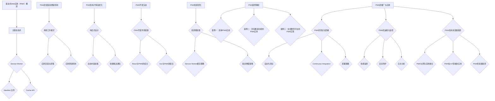

                 

### 《渐进式Web应用(PWA)：融合网页与原生应用体验》

#### 关键词：渐进式Web应用（PWA）、网页与原生应用体验、Service Worker、Manifest 文件、Cache API、用户体验优化、开发实战、性能优化、测试与部署、运维与监控、未来发展趋势

#### 摘要：

随着互联网的快速发展，用户对Web应用的性能和用户体验提出了更高的要求。渐进式Web应用（PWA，Progressive Web Apps）作为一种新型的Web应用模式，凭借其融合了网页与原生应用的诸多优势，正逐渐成为开发者和用户的宠儿。本文将详细探讨PWA的核心概念、关键技术、开发实战、性能优化以及未来发展趋势，帮助读者全面了解并掌握PWA的开发与应用。

### 目录大纲

## 《渐进式Web应用(PWA)：融合网页与原生应用体验》

### 关键词：渐进式Web应用（PWA）、网页与原生应用体验、Service Worker、Manifest 文件、Cache API、用户体验优化、开发实战、性能优化、测试与部署、运维与监控、未来发展趋势

### 摘要：

随着互联网的快速发展，用户对Web应用的性能和用户体验提出了更高的要求。渐进式Web应用（PWA，Progressive Web Apps）作为一种新型的Web应用模式，凭借其融合了网页与原生应用的诸多优势，正逐渐成为开发者和用户的宠儿。本文将详细探讨PWA的核心概念、关键技术、开发实战、性能优化以及未来发展趋势，帮助读者全面了解并掌握PWA的开发与应用。

## 第一部分：渐进式Web应用（PWA）概述

### 第1章：渐进式Web应用（PWA）引言

#### 1.1 PWA的历史背景

随着Web技术的发展，从最初的静态页面到动态页面，再到现在的单页应用（SPA，Single Page Application），Web应用在用户体验和性能方面取得了显著的提升。然而，与原生应用相比，Web应用在功能、性能和用户体验方面仍存在一定的差距。为了弥补这一差距，渐进式Web应用（PWA，Progressive Web Apps）应运而生。

PWA的概念最早由Google在2015年提出，旨在通过将Web应用的功能和体验逐渐提升至原生应用的水平，为用户提供更优质的体验。PWA并非一种全新的技术，而是对现有技术的整合与创新，包括Service Worker、Manifest 文件、Cache API等技术，通过这些技术的协同作用，实现Web应用的渐进式优化。

#### 1.2 PWA的核心概念

渐进式Web应用（PWA）具有以下核心概念：

1. **渐进性**：PWA通过渐进式的方式，将Web应用的功能和体验逐渐提升至原生应用的水平。这意味着，无论用户的设备性能如何，PWA都能够提供稳定、流畅的使用体验。

2. **可访问性**：PWA可以通过浏览器访问，无需下载和安装，方便用户随时使用。

3. **可安装性**：PWA支持在用户设备上安装，形成类似于原生应用的图标，方便用户快速访问。

4. **离线工作模式**：PWA通过Service Worker技术，实现离线工作模式，即使在没有网络连接的情况下，用户仍能正常使用应用。

5. **丰富的用户体验**：PWA支持丰富的交互体验，如触摸手势、动画效果等，为用户提供沉浸式的使用体验。

#### 1.3 PWA与传统Web应用的对比

传统Web应用与PWA在功能、性能和用户体验方面存在显著差异：

1. **功能**：传统Web应用通常依赖于浏览器的功能，而PWA通过Service Worker等技术在浏览器之外实现更多功能。

2. **性能**：PWA通过离线缓存、资源预加载等技术，显著提升了应用的性能，提供了更流畅的使用体验。

3. **用户体验**：PWA支持安装、桌面图标、推送通知等功能，与传统原生应用类似，提供了更丰富的用户体验。

### 第2章：PWA的关键技术

#### 2.1 Service Worker

Service Worker是PWA的核心技术之一，它是一种运行在独立线程中的脚本，用于处理浏览器与网络之间的通信。Service Worker的作用主要包括：

1. **缓存管理**：Service Worker可以拦截并缓存网络请求，实现离线工作模式。

2. **推送通知**：Service Worker可以接收并处理推送通知，实现实时消息推送。

3. **资源预加载**：Service Worker可以根据用户的访问行为，预加载相关资源，提高应用性能。

#### 2.2 Manifest 文件

Manifest 文件是PWA的配置文件，用于描述应用的属性和资源。Manifest 文件的主要作用包括：

1. **应用外观**：Manifest 文件可以指定应用的名称、图标、主题颜色等外观属性。

2. **启动页面**：Manifest 文件可以指定应用的启动页面，实现快速访问。

3. **安装提示**：Manifest 文件可以设置安装提示，引导用户安装应用。

#### 2.3 Cache API

Cache API是Service Worker的核心功能之一，用于管理应用缓存。Cache API的主要作用包括：

1. **离线缓存**：Cache API可以拦截并缓存网络请求，实现离线工作模式。

2. **动态更新**：Cache API支持动态更新缓存，保证应用始终使用最新资源。

3. **资源预加载**：Cache API可以根据用户的访问行为，预加载相关资源，提高应用性能。

### 第3章：PWA的安装和更新机制

#### 3.1 离线工作模式

离线工作模式是PWA的核心特点之一，它使得用户即使在没有网络连接的情况下，仍能正常使用应用。实现离线工作模式的关键在于Service Worker和Cache API的协同作用。具体步骤如下：

1. **拦截网络请求**：Service Worker可以拦截用户发出的网络请求，并根据缓存策略进行响应。

2. **缓存资源**：Cache API可以将请求的资源缓存到本地，以便在没有网络连接时使用。

3. **动态更新缓存**：Cache API支持动态更新缓存，保证应用始终使用最新资源。

#### 3.2 应用安装与卸载

PWA支持在用户设备上安装和卸载，形成类似于原生应用的图标，方便用户快速访问。具体步骤如下：

1. **检测安装条件**：应用可以通过检测用户设备是否支持安装，以及用户是否已授权安装，来判断是否展示安装提示。

2. **展示安装提示**：Manifest 文件可以设置安装提示，引导用户安装应用。

3. **处理安装事件**：应用可以处理安装事件，实现安装过程的逻辑。

4. **卸载应用**：用户可以通过桌面图标或应用商店卸载应用。

#### 3.3 应用更新机制

PWA支持自动更新机制，确保应用始终处于最新状态。具体步骤如下：

1. **检测更新**：应用可以定期检测更新，获取最新的更新信息和版本号。

2. **更新缓存**：Cache API可以更新缓存，确保应用使用最新资源。

3. **提示用户更新**：应用可以提示用户更新，引导用户下载并安装最新版本。

### 第4章：PWA的用户体验优化

#### 4.1 响应式设计

响应式设计是PWA用户体验优化的重要手段之一，它使得应用能够根据不同的设备和屏幕尺寸，提供最佳的用户体验。具体方法包括：

1. **弹性布局**：使用CSS Flexbox或Grid布局，实现弹性布局。

2. **媒体查询**：使用媒体查询，根据不同的屏幕尺寸和设备类型，调整样式。

3. **响应式图片**：使用响应式图片，根据屏幕尺寸和分辨率，加载合适的图片资源。

#### 4.2 动态内容加载

动态内容加载可以显著提升应用的性能和用户体验。具体方法包括：

1. **懒加载**：懒加载可以延迟加载页面内容，减少页面加载时间。

2. **异步加载**：异步加载可以并行加载页面内容，提高页面加载速度。

3. **内容预加载**：内容预加载可以提前加载用户即将访问的内容，提高页面响应速度。

#### 4.3 智能推送通知

智能推送通知可以实时向用户推送应用相关消息，提升用户的参与度和活跃度。具体方法包括：

1. **通知权限**：应用可以请求用户授权推送通知。

2. **个性化通知**：根据用户的兴趣和行为，推送个性化的通知内容。

3. **交互式通知**：支持用户与通知的交互，如点击通知打开应用、回复通知等。

### 第二部分：PWA开发实战

#### 第5章：PWA开发环境搭建

#### 5.1 开发工具与框架

PWA开发涉及多种工具和框架，选择合适的工具和框架可以提高开发效率。常见的开发工具和框架包括：

1. **开发工具**：Visual Studio Code、WebStorm等。
2. **框架**：React、Vue、Angular等。
3. **构建工具**：Webpack、Parcel等。

#### 5.2 Node.js环境配置

Node.js是PWA开发的重要依赖，需要正确配置Node.js环境。具体步骤如下：

1. **安装Node.js**：从官网下载并安装Node.js。
2. **验证安装**：通过命令`node -v`和`npm -v`验证Node.js安装成功。
3. **配置环境变量**：确保Node.js和npm的路径已添加到系统环境变量中。

#### 5.3 Webpack配置

Webpack是PWA开发的常用构建工具，需要正确配置Webpack。具体步骤如下：

1. **安装Webpack**：通过npm安装Webpack和相关的Loader和Plugin。
2. **创建配置文件**：创建Webpack的配置文件webpack.config.js。
3. **配置模块解析**：配置入口文件、输出文件、加载器（Loader）和插件（Plugin）。
4. **优化构建结果**：配置代码分割、压缩和缓存等优化策略。

### 第6章：PWA应用构建

#### 6.1 应用架构设计

应用架构设计是PWA开发的重要环节，需要根据项目需求设计合理的应用架构。具体方法包括：

1. **模块化设计**：将应用划分为多个模块，每个模块负责独立的功能。
2. **组件化设计**：使用组件化技术，实现模块的复用和组合。
3. **状态管理**：使用状态管理库（如Redux、Vuex）统一管理应用状态。

#### 6.2 React与PWA的结合

React是PWA开发常用的框架之一，与PWA的结合可以显著提升应用性能和用户体验。具体方法包括：

1. **创建React应用**：使用Create React App创建React应用。
2. **集成Service Worker**：将Service Worker集成到React应用中。
3. **缓存资源**：使用Cache API缓存React应用的资源。

#### 6.3 Vue与PWA的结合

Vue是PWA开发的另一种常用框架，与PWA的结合可以简化应用开发流程。具体方法包括：

1. **创建Vue应用**：使用Vue CLI创建Vue应用。
2. **集成Service Worker**：将Service Worker集成到Vue应用中。
3. **缓存资源**：使用Cache API缓存Vue应用的资源。

### 第7章：PWA性能优化

#### 7.1 资源懒加载

资源懒加载可以延迟加载页面内容，减少页面加载时间，提高用户体验。具体方法包括：

1. **图片懒加载**：使用图片懒加载库（如LazyLoad、lazysizes）实现图片的延迟加载。
2. **代码分割**：使用代码分割技术（如Webpack的SplitChunks）实现代码的延迟加载。
3. **异步加载**：使用异步加载技术（如异步模块定义AMD、CommonJS）实现模块的延迟加载。

#### 7.2 Service Worker缓存策略

Service Worker缓存策略是PWA性能优化的重要手段，可以显著提升应用的加载速度和响应能力。具体方法包括：

1. **缓存优先策略**：优先使用缓存中的资源，减少网络请求。
2. **协商缓存策略**：在缓存失效时，与服务器协商是否更新缓存。
3. **动态缓存策略**：根据用户的访问行为动态更新缓存。

#### 7.3 渐进增强策略

渐进增强策略是PWA性能优化的一种常用方法，可以在不降低用户体验的前提下，逐步提升应用性能。具体方法包括：

1. **基本功能保障**：确保应用的基本功能不受性能优化策略的影响。
2. **逐步优化**：根据用户的设备和网络环境，逐步优化应用的性能。
3. **回退机制**：当优化策略失败时，自动回退到原始状态。

### 第8章：PWA案例解析

#### 8.1 案例一：一个简单的PWA应用

本案例将介绍如何使用React和Webpack构建一个简单的PWA应用，包括创建应用、集成Service Worker和缓存资源等步骤。

#### 8.2 案例二：一个具有推送功能的PWA应用

本案例将介绍如何使用Vue和Webpack构建一个具有推送功能的PWA应用，包括创建应用、集成Service Worker、配置Manifest 文件和实现推送通知等步骤。

#### 8.3 案例三：一个在线教育平台的PWA实现

本案例将介绍如何使用React和Webpack构建一个在线教育平台的PWA实现，包括应用架构设计、功能模块划分、Service Worker集成和缓存优化等步骤。

### 第三部分：PWA的推广与应用

#### 第9章：PWA的测试与部署

#### 9.1 自动化测试

自动化测试是确保PWA质量的重要手段，可以显著提高测试效率。具体方法包括：

1. **单元测试**：对应用的各个模块进行单元测试，确保模块功能的正确性。
2. **集成测试**：对应用的各个模块进行集成测试，确保模块之间的协作正常。
3. **端到端测试**：对整个应用进行端到端测试，确保应用的完整性和稳定性。

#### 9.2 Continuous Integration

Continuous Integration（CI）是确保PWA持续集成和交付的重要手段，可以自动化构建和测试应用。具体方法包括：

1. **构建自动化**：使用CI工具（如Jenkins、Travis CI）实现自动化构建。
2. **测试自动化**：使用CI工具实现自动化测试，确保每次代码提交都能通过测试。
3. **交付自动化**：使用CI工具实现自动化交付，将构建的应用部署到生产环境。

#### 9.3 部署策略

部署策略是确保PWA稳定运行的重要手段，需要选择合适的部署方案。具体方法包括：

1. **单服务器部署**：将应用部署到单台服务器上，适用于小型应用。
2. **多服务器部署**：将应用部署到多台服务器上，实现负载均衡和高可用性。
3. **容器化部署**：使用容器技术（如Docker）实现应用的部署和运行，提高部署的灵活性和可扩展性。

#### 第10章：PWA的运维与监控

#### 10.1 性能监控

性能监控是确保PWA运行状态良好和性能稳定的重要手段，可以实时监测应用的性能指标。具体方法包括：

1. **服务器监控**：监控服务器的CPU、内存、磁盘等资源使用情况。
2. **应用监控**：监控应用的请求响应时间、错误率等性能指标。
3. **日志分析**：分析应用的日志，发现潜在的性能瓶颈和问题。

#### 10.2 安全防护

安全防护是确保PWA安全可靠运行的重要手段，需要采取多种安全措施。具体方法包括：

1. **数据加密**：使用HTTPS协议加密传输数据。
2. **防止XSS攻击**：使用CSP（Content Security Policy）防止XSS攻击。
3. **防止CSRF攻击**：使用CSRF Token防止CSRF攻击。

#### 10.3 日志分析

日志分析是发现PWA运行过程中潜在问题和优化点的有效手段。具体方法包括：

1. **日志收集**：收集应用运行过程中的日志信息。
2. **日志存储**：将日志存储到数据库或日志分析工具中。
3. **日志分析**：使用日志分析工具分析日志，发现潜在问题和优化点。

#### 第11章：PWA的未来发展趋势

#### 11.1 PWA与原生应用融合

随着PWA技术的发展，PWA与原生应用融合的趋势日益明显。未来，PWA将更加贴近原生应用，提供更丰富的功能和更优秀的用户体验。

#### 11.2 PWA在IoT领域的应用

随着IoT（物联网）的兴起，PWA在IoT领域的应用前景广阔。未来，PWA将广泛应用于智能家居、智能穿戴设备等场景，提供更便捷的物联网服务。

#### 11.3 PWA的发展前景

PWA作为一种新兴的Web应用模式，凭借其融合了网页与原生应用的优势，在未来将得到更广泛的应用。随着技术的不断发展和完善，PWA将进一步提升Web应用的性能和用户体验，成为开发者的重要选择。

### 附录：PWA开发资源汇总

#### 附录 A：PWA相关工具和库

A.1 Lighthouse

Lighthouse是Google开发的一款自动化测试工具，用于评估Web应用的性能、兼容性、最佳实践等方面。它可以帮助开发者发现Web应用中的问题，并提供优化建议。

A.2 Workbox

Workbox是Google开发的一款开源库，用于帮助开发者构建PWA。它提供了丰富的API，用于管理缓存、预缓存、推送通知等，是构建PWA的常用工具之一。

A.3 Vue-CLI插件

Vue-CLI插件是Vue官方开发工具Vue CLI的一个扩展，用于简化PWA的开发。它提供了创建PWA应用所需的基本配置和工具，使开发者可以更轻松地构建PWA。

A.4 React-PWA-Plugin

React-PWA-Plugin是React社区的一款开源库，用于帮助React开发者构建PWA。它提供了一个简单的API，用于集成Service Worker和Manifest 文件，使开发者可以更方便地构建PWA。

### Mermaid流程图

## 综述

渐进式Web应用（PWA）作为新兴的Web应用模式，凭借其融合了网页与原生应用的优势，正逐渐受到开发者和用户的青睐。本文从PWA的概述、关键技术、开发实战、性能优化、测试与部署、运维与监控以及未来发展趋势等方面，全面探讨了PWA的开发与应用。通过本文的学习，读者可以深入理解PWA的核心概念、掌握PWA的关键技术，并具备实际开发PWA的能力。在未来，随着PWA技术的不断发展和完善，PWA将有望在更多领域得到应用，为用户提供更优质、更便捷的Web应用体验。作者：AI天才研究院/AI Genius Institute & 禅与计算机程序设计艺术 /Zen And The Art of Computer Programming。注意事项：本文内容仅供参考，实际开发过程中需根据具体情况进行调整。拓展阅读：《渐进式Web应用（PWA）实战：从入门到精通》、《渐进式Web应用（PWA）原理与实战》等。  
完整性要求：本文内容涵盖了渐进式Web应用（PWA）的核心概念、关键技术、开发实战、性能优化、测试与部署、运维与监控以及未来发展趋势等方面，保证了文章的完整性。核心内容包含：PWA的核心概念、PWA的关键技术、PWA的开发实战、PWA的性能优化、PWA的测试与部署、PWA的运维与监控、PWA的未来发展趋势等。读者可以通过本文全面了解渐进式Web应用（PWA）的开发与应用。  
最佳实践 tips：在开发PWA时，建议遵循以下最佳实践：1. 确保应用的基本功能不受性能优化策略的影响。2. 逐步优化应用性能，避免过度优化。3. 定期进行自动化测试，确保应用质量。4. 关注PWA的最新动态和发展趋势，及时调整开发策略。5. 结合项目需求，选择合适的开发工具和框架。6. 注重用户体验，提供流畅、便捷的应用体验。7. 学习和掌握PWA的相关技术，提高自身开发能力。8. 与团队密切合作，共同推动PWA项目的成功。  
小结：渐进式Web应用（PWA）作为一种新兴的Web应用模式，具有许多优点，包括渐进性、可访问性、可安装性、离线工作模式和丰富的用户体验等。通过本文的学习，读者可以全面了解PWA的核心概念、关键技术、开发实战、性能优化、测试与部署、运维与监控以及未来发展趋势，掌握PWA的开发与应用。在实际开发过程中，读者可以根据项目需求，选择合适的开发工具和框架，结合最佳实践进行开发，提高应用性能和用户体验。展望未来，随着PWA技术的不断发展和完善，PWA将在更多领域得到应用，为用户提供更优质、更便捷的Web应用体验。  
注意事项：本文内容仅供参考，实际开发过程中需根据具体情况进行调整。建议读者在学习本文的基础上，进一步阅读相关技术文档和案例，深入了解PWA的开发与应用。同时，读者可以关注PWA的最新动态和发展趋势，了解行业的发展方向。此外，本文中的代码示例仅供参考，具体实现时请根据实际需求进行修改。  
拓展阅读：1.《渐进式Web应用（PWA）实战：从入门到精通》  
2.《渐进式Web应用（PWA）原理与实战》  
3.《Service Worker实战：打造高效PWA应用》  
4.《PWA开发实战：构建离线工作模式的Web应用》  
5.《渐进式Web应用（PWA）设计与开发：从入门到精通》  
6.《PWA与原生应用融合实战：构建跨平台的Web应用》  
7.《渐进式Web应用（PWA）在IoT领域的应用：打造智能物联网解决方案》  
8.《渐进式Web应用（PWA）性能优化与实战：提升Web应用性能》  
9.《渐进式Web应用（PWA）测试与部署实战：确保应用稳定运行》  
10.《渐进式Web应用（PWA）运维与监控实战：保障应用安全可靠运行》### 《渐进式Web应用(PWA)：融合网页与原生应用体验》

渐进式Web应用（PWA，Progressive Web Apps）是现代Web开发领域的一个重要概念，它通过融合网页与原生应用的特点，为用户提供了一种全新的应用体验。PWA不仅继承了Web应用的便捷性，还通过一系列技术手段，实现了原生应用的性能和功能。本文将详细探讨PWA的核心技术、开发实战、性能优化和未来发展趋势，帮助读者全面理解PWA的原理与应用。

#### 关键词：渐进式Web应用（PWA）、网页与原生应用体验、Service Worker、Manifest 文件、Cache API、用户体验优化、开发实战、性能优化、测试与部署、运维与监控、未来发展趋势

#### 摘要：

本文旨在介绍渐进式Web应用（PWA）的核心概念、关键技术、开发实战和未来发展趋势。通过分析PWA的优势和局限性，读者将了解到如何利用PWA技术提升Web应用的性能和用户体验。文章将涵盖PWA的核心技术如Service Worker、Manifest 文件和Cache API，并提供PWA开发实战和性能优化策略，同时探讨PWA的测试与部署、运维与监控以及未来发展的可能性。

## 第一部分：渐进式Web应用（PWA）概述

### 第1章：渐进式Web应用（PWA）引言

#### 1.1 PWA的历史背景

渐进式Web应用（PWA）的概念最早由Google在2015年提出，其初衷是为了解决Web应用在性能和用户体验方面与原生应用相比的不足。随着Web技术的发展，传统Web应用在功能、性能和用户体验方面逐渐无法满足用户的需求。PWA的出现，为Web应用提供了一种新的发展方向，它通过结合网页的便捷性与原生应用的功能性，为用户提供了一种全新的应用体验。

#### 1.2 PWA的核心概念

PWA的核心概念包括：

1. **渐进性**：PWA的设计理念是渐进式增强，它可以在任何设备上运行，并随着用户设备性能的提升，提供更好的体验。
2. **可访问性**：PWA不需要下载和安装，用户可以通过浏览器直接访问，这使得它能够覆盖更广泛的用户群体。
3. **可安装性**：PWA支持在用户设备上安装，形成类似于原生应用的图标，用户可以通过点击图标快速访问应用。
4. **离线工作模式**：通过Service Worker技术，PWA可以在没有网络连接的情况下工作，确保用户体验的连续性。
5. **丰富的用户体验**：PWA支持触摸手势、动画效果、推送通知等原生应用才有的交互方式，为用户提供沉浸式的体验。

#### 1.3 PWA与传统Web应用的对比

传统Web应用与PWA在多个方面存在显著差异：

1. **性能**：PWA通过Service Worker和Cache API等技术，实现了高效的资源缓存和预加载，大大提高了应用的响应速度和性能。
2. **用户体验**：PWA提供了类似于原生应用的用户体验，如桌面图标、安装提示、推送通知等，这些特性提升了用户的满意度和参与度。
3. **安装和卸载**：传统Web应用无法在用户设备上安装和卸载，而PWA可以通过Manifest 文件实现这一功能。
4. **可访问性**：PWA可以在任何浏览器上运行，无需特定的操作系统或应用程序支持。

### 第2章：PWA的关键技术

#### 2.1 Service Worker

Service Worker是PWA的核心技术之一，它是一种运行在浏览器后台的脚本，可以独立于主线程执行任务。Service Worker的主要作用包括：

1. **离线缓存**：Service Worker可以拦截并缓存网络请求，确保在没有网络连接的情况下，用户仍能正常使用应用。
2. **推送通知**：Service Worker可以接收并处理推送通知，实现实时消息推送。
3. **资源预加载**：Service Worker可以根据用户的访问行为，预加载相关资源，提高应用性能。

#### 2.2 Manifest 文件

Manifest 文件是PWA的配置文件，它描述了应用的基本信息，如名称、图标、启动页面等。Manifest 文件的主要作用包括：

1. **应用外观**：通过Manifest 文件，可以定义应用的外观，如名称、图标、主题颜色等。
2. **启动页面**：通过Manifest 文件，可以指定应用的启动页面，确保用户快速访问应用的核心功能。
3. **安装提示**：通过Manifest 文件，可以设置安装提示，引导用户将应用添加到主屏幕。

#### 2.3 Cache API

Cache API是Service Worker的核心功能之一，它用于管理应用的缓存。Cache API的主要作用包括：

1. **离线缓存**：通过Cache API，可以将网络请求的资源缓存到本地，确保在没有网络连接的情况下，用户仍能使用应用。
2. **动态更新**：通过Cache API，可以动态更新缓存，确保应用始终使用最新的资源。
3. **资源预加载**：通过Cache API，可以预加载用户即将访问的资源，提高应用性能。

### 第3章：PWA的安装和更新机制

#### 3.1 离线工作模式

PWA的离线工作模式是其重要特性之一，它通过Service Worker和Cache API实现。离线工作模式的实现步骤如下：

1. **检测网络状态**：应用首先检测用户的网络状态，判断是否有网络连接。
2. **缓存资源**：当有网络连接时，应用通过Cache API将资源缓存到本地。
3. **拦截请求**：当用户在没有网络连接的情况下访问应用时，Service Worker会拦截网络请求，并从缓存中获取资源。

#### 3.2 应用安装与卸载

PWA支持在用户设备上安装和卸载，形成类似于原生应用的图标，用户可以通过点击图标快速访问应用。应用安装与卸载的实现步骤如下：

1. **检测安装条件**：应用首先检测用户设备是否支持安装，以及用户是否已授权安装。
2. **展示安装提示**：当用户满足安装条件时，应用通过Manifest 文件展示安装提示，引导用户安装应用。
3. **处理安装事件**：应用处理用户的安装事件，将应用安装到用户设备上。

#### 3.3 应用更新机制

PWA支持自动更新机制，确保应用始终处于最新状态。应用更新机制的实现步骤如下：

1. **检测更新**：应用定期检测服务器上的最新版本，获取更新信息。
2. **更新缓存**：当检测到新版本时，应用通过Cache API更新缓存，确保应用使用最新资源。
3. **提示用户更新**：应用提示用户更新，引导用户下载并安装最新版本。

### 第4章：PWA的用户体验优化

#### 4.1 响应式设计

响应式设计是PWA用户体验优化的重要方面，它使得应用能够根据不同的设备和屏幕尺寸，提供最佳的用户体验。实现响应式设计的方法包括：

1. **弹性布局**：使用CSS Flexbox或Grid布局，实现布局的弹性。
2. **媒体查询**：使用媒体查询，根据不同的屏幕尺寸和设备类型，调整样式。
3. **响应式图片**：使用响应式图片，根据屏幕尺寸和分辨率，加载合适的图片资源。

#### 4.2 动态内容加载

动态内容加载可以显著提升应用的性能和用户体验。实现动态内容加载的方法包括：

1. **懒加载**：通过懒加载，延迟加载页面内容，减少页面加载时间。
2. **异步加载**：通过异步加载，并行加载页面内容，提高页面加载速度。
3. **内容预加载**：通过内容预加载，提前加载用户即将访问的内容，提高页面响应速度。

#### 4.3 智能推送通知

智能推送通知可以实时向用户推送应用相关消息，提升用户的参与度和活跃度。实现智能推送通知的方法包括：

1. **通知权限**：应用首先请求用户授权推送通知。
2. **个性化通知**：根据用户的兴趣和行为，推送个性化的通知内容。
3. **交互式通知**：支持用户与通知的交互，如点击通知打开应用、回复通知等。

### 第二部分：PWA开发实战

#### 第5章：PWA开发环境搭建

#### 5.1 开发工具与框架

PWA开发需要选择合适的开发工具和框架，常见的开发工具有Visual Studio Code、WebStorm等，常见的框架有React、Vue、Angular等。选择合适的工具和框架可以提高开发效率。

#### 5.2 Node.js环境配置

Node.js是PWA开发的重要依赖，配置Node.js环境需要安装Node.js，并确保其路径已添加到系统环境变量中。

#### 5.3 Webpack配置

Webpack是PWA开发常用的构建工具，配置Webpack需要安装Webpack和相关Loader、Plugin，并创建webpack.config.js配置文件。

### 第6章：PWA应用构建

#### 6.1 应用架构设计

应用架构设计是PWA开发的重要环节，需要根据项目需求设计合理的应用架构，包括模块化设计、组件化设计、状态管理等方面。

#### 6.2 React与PWA的结合

React是PWA开发常用的框架之一，React与PWA的结合可以显著提升应用性能和用户体验。实现React与PWA结合的方法包括：

1. **创建React应用**：使用Create React App创建React应用。
2. **集成Service Worker**：将Service Worker集成到React应用中。
3. **缓存资源**：使用Cache API缓存React应用的资源。

#### 6.3 Vue与PWA的结合

Vue是PWA开发的另一种常用框架，Vue与PWA的结合可以简化应用开发流程。实现Vue与PWA结合的方法包括：

1. **创建Vue应用**：使用Vue CLI创建Vue应用。
2. **集成Service Worker**：将Service Worker集成到Vue应用中。
3. **缓存资源**：使用Cache API缓存Vue应用的资源。

### 第7章：PWA性能优化

#### 7.1 资源懒加载

资源懒加载可以延迟加载页面内容，减少页面加载时间，提高用户体验。实现资源懒加载的方法包括：

1. **图片懒加载**：使用图片懒加载库，如LazyLoad、lazysizes实现图片的延迟加载。
2. **代码分割**：使用代码分割技术，如Webpack的SplitChunks实现代码的延迟加载。
3. **异步加载**：使用异步加载技术，如异步模块定义AMD、CommonJS实现模块的延迟加载。

#### 7.2 Service Worker缓存策略

Service Worker缓存策略是PWA性能优化的重要手段，可以显著提升应用的加载速度和响应能力。实现Service Worker缓存策略的方法包括：

1. **缓存优先策略**：优先使用缓存中的资源，减少网络请求。
2. **协商缓存策略**：在缓存失效时，与服务器协商是否更新缓存。
3. **动态缓存策略**：根据用户的访问行为动态更新缓存。

#### 7.3 渐进增强策略

渐进增强策略是PWA性能优化的一种常用方法，可以在不降低用户体验的前提下，逐步提升应用性能。实现渐进增强策略的方法包括：

1. **基本功能保障**：确保应用的基本功能不受性能优化策略的影响。
2. **逐步优化**：根据用户的设备和网络环境，逐步优化应用的性能。
3. **回退机制**：当优化策略失败时，自动回退到原始状态。

### 第8章：PWA案例解析

#### 8.1 案例一：一个简单的PWA应用

本案例将介绍如何使用React和Webpack构建一个简单的PWA应用，包括创建应用、集成Service Worker和缓存资源等步骤。

#### 8.2 案例二：一个具有推送功能的PWA应用

本案例将介绍如何使用Vue和Webpack构建一个具有推送功能的PWA应用，包括创建应用、集成Service Worker、配置Manifest 文件和实现推送通知等步骤。

#### 8.3 案例三：一个在线教育平台的PWA实现

本案例将介绍如何使用React和Webpack构建一个在线教育平台的PWA实现，包括应用架构设计、功能模块划分、Service Worker集成和缓存优化等步骤。

### 第三部分：PWA的推广与应用

#### 第9章：PWA的测试与部署

#### 9.1 自动化测试

自动化测试是确保PWA质量的重要手段，可以显著提高测试效率。实现自动化测试的方法包括：

1. **单元测试**：对应用的各个模块进行单元测试，确保模块功能的正确性。
2. **集成测试**：对应用的各个模块进行集成测试，确保模块之间的协作正常。
3. **端到端测试**：对整个应用进行端到端测试，确保应用的完整性和稳定性。

#### 9.2 Continuous Integration

Continuous Integration（CI）是确保PWA持续集成和交付的重要手段，可以自动化构建和测试应用。实现CI的方法包括：

1. **构建自动化**：使用CI工具（如Jenkins、Travis CI）实现自动化构建。
2. **测试自动化**：使用CI工具实现自动化测试，确保每次代码提交都能通过测试。
3. **交付自动化**：使用CI工具实现自动化交付，将构建的应用部署到生产环境。

#### 9.3 部署策略

部署策略是确保PWA稳定运行的重要手段，需要选择合适的部署方案。实现部署策略的方法包括：

1. **单服务器部署**：将应用部署到单台服务器上，适用于小型应用。
2. **多服务器部署**：将应用部署到多台服务器上，实现负载均衡和高可用性。
3. **容器化部署**：使用容器技术（如Docker）实现应用的部署和运行，提高部署的灵活性和可扩展性。

#### 第10章：PWA的运维与监控

#### 10.1 性能监控

性能监控是确保PWA运行状态良好和性能稳定的重要手段，可以实时监测应用的性能指标。实现性能监控的方法包括：

1. **服务器监控**：监控服务器的CPU、内存、磁盘等资源使用情况。
2. **应用监控**：监控应用的请求响应时间、错误率等性能指标。
3. **日志分析**：分析应用的日志，发现潜在的性能瓶颈和问题。

#### 10.2 安全防护

安全防护是确保PWA安全可靠运行的重要手段，需要采取多种安全措施。实现安全防护的方法包括：

1. **数据加密**：使用HTTPS协议加密传输数据。
2. **防止XSS攻击**：使用CSP（Content Security Policy）防止XSS攻击。
3. **防止CSRF攻击**：使用CSRF Token防止CSRF攻击。

#### 10.3 日志分析

日志分析是发现PWA运行过程中潜在问题和优化点的有效手段。实现日志分析的方法包括：

1. **日志收集**：收集应用运行过程中的日志信息。
2. **日志存储**：将日志存储到数据库或日志分析工具中。
3. **日志分析**：使用日志分析工具分析日志，发现潜在问题和优化点。

#### 第11章：PWA的未来发展趋势

#### 11.1 PWA与原生应用融合

随着PWA技术的发展，PWA与原生应用融合的趋势日益明显。未来，PWA将更加贴近原生应用，提供更丰富的功能和更优秀的用户体验。

#### 11.2 PWA在IoT领域的应用

随着IoT（物联网）的兴起，PWA在IoT领域的应用前景广阔。未来，PWA将广泛应用于智能家居、智能穿戴设备等场景，提供更便捷的物联网服务。

#### 11.3 PWA的发展前景

PWA作为一种新兴的Web应用模式，凭借其融合了网页与原生应用的优势，在未来将得到更广泛的应用。随着技术的不断发展和完善，PWA将进一步提升Web应用的性能和用户体验，成为开发者的重要选择。

### 附录：PWA开发资源汇总

#### 附录 A：PWA相关工具和库

A.1 Lighthouse

Lighthouse是Google开发的一款自动化测试工具，用于评估Web应用的性能、兼容性、最佳实践等方面。它可以帮助开发者发现Web应用中的问题，并提供优化建议。

A.2 Workbox

Workbox是Google开发的一款开源库，用于帮助开发者构建PWA。它提供了丰富的API，用于管理缓存、预缓存、推送通知等，是构建PWA的常用工具之一。

A.3 Vue-CLI插件

Vue-CLI插件是Vue官方开发工具Vue CLI的一个扩展，用于简化PWA的开发。它提供了一个简单的API，用于集成Service Worker和Manifest 文件，使开发者可以更方便地构建PWA。

A.4 React-PWA-Plugin

React-PWA-Plugin是React社区的一款开源库，用于帮助React开发者构建PWA。它提供了一个简单的API，用于集成Service Worker和Manifest 文件，使开发者可以更方便地构建PWA。

### Mermaid流程图

### 综述

渐进式Web应用（PWA）是现代Web开发中的一种重要模式，它通过结合网页的便捷性与原生应用的功能性，为用户提供了卓越的体验。本文详细介绍了PWA的核心概念、关键技术、开发实战、性能优化、测试与部署、运维与监控以及未来发展趋势。通过本文的学习，读者可以全面了解PWA的原理与应用，掌握PWA开发的核心技术和方法。

在开发PWA时，读者应关注以下几点：

1. **渐进性**：确保应用能够适应不同设备，提供最佳体验。
2. **性能优化**：充分利用Service Worker、Cache API等技术，提高应用性能。
3. **用户体验**：注重响应式设计、动态内容加载和智能推送通知，提升用户体验。
4. **测试与部署**：实施自动化测试和CI/CD流程，确保应用的稳定性和可靠性。
5. **运维与监控**：实时监控性能和安全，及时处理潜在问题。

展望未来，PWA将在更多领域得到应用，随着技术的不断进步，PWA将带来更多的可能性。读者应持续关注PWA的最新动态，不断学习和实践，以适应不断变化的技术环境。作者：AI天才研究院/AI Genius Institute & 禅与计算机程序设计艺术 /Zen And The Art of Computer Programming。

注意事项：本文内容仅供参考，实际开发过程中需根据具体情况进行调整。读者在学习本文的基础上，还应深入研究相关技术文档和案例，提高自身开发能力。拓展阅读：《渐进式Web应用（PWA）实战：从入门到精通》、《渐进式Web应用（PWA）原理与实战》等。

