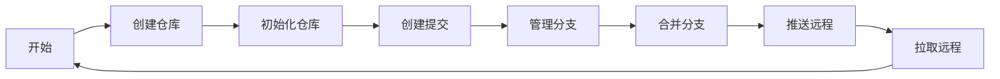
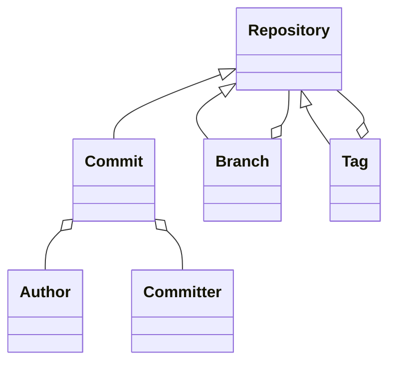
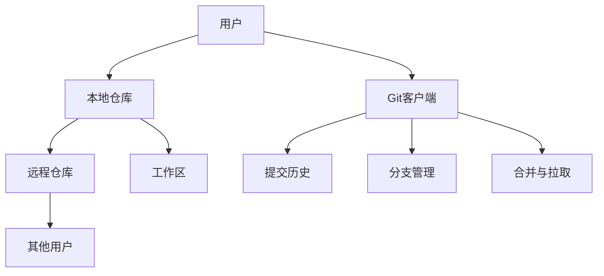
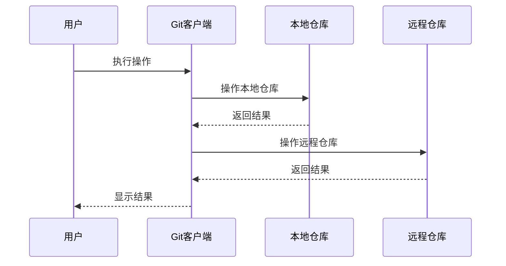

                 

# 版本控制：Git工作流程与最佳实践

> 关键词：版本控制、Git、工作流程、最佳实践

> 摘要：
本文将深入探讨版本控制系统的核心概念、Git的工作流程及其最佳实践。通过分析版本控制的起源与发展，讲解Git的核心概念、算法原理和系统架构设计，再结合实战案例，提供一系列最佳实践技巧。最终，本文将小结Git的关键要点，并推荐拓展阅读，帮助读者更好地理解和应用Git。

----------------------------------------------------------------

## 第1章：版本控制的起源与发展

### 1.1 问题背景

在软件开发过程中，版本控制成为确保代码质量和协作效率的重要手段。随着项目规模的扩大和团队成员的增多，如何有效地管理和追踪代码的变更成为关键问题。

### 1.2 问题描述

传统的方式，如手动管理代码库，不仅效率低下，而且容易出现错误。因此，需要一个自动化的版本控制系统来管理代码的变更、分支和合并。

### 1.3 问题解决

版本控制系统的出现，特别是Git的诞生，解决了上述问题。Git以其分布式、高效、灵活的特点，成为开发人员广泛采用的版本控制工具。

### 1.4 边界与外延

版本控制不仅仅应用于软件开发，还广泛应用于文档管理、配置管理等多个领域。其边界不仅限于代码库，还包括任何形式的文本文件。

### 1.5 版本控制的核心概念

- **版本库（Repository）**：存储代码及其历史变更的仓库。
- **提交（Commit）**：记录代码变更的单元。
- **分支（Branch）**：独立的代码线，用于实验或开发新功能。
- **标签（Tag）**：用于标记特定版本的标签。

----------------------------------------------------------------

## 第2章：Git的核心概念

### 2.1 Git的基础概念

#### 2.1.1 版本库

Git使用仓库来存储代码及其历史记录。仓库可以是本地的，也可以是远程的。

#### 2.1.2 提交

每次代码变更后，Git会创建一个提交，记录变更的内容和时间。

#### 2.1.3 分支

Git支持分支，允许开发者在独立的线路上工作，减少与其他分支的干扰。

#### 2.1.4 标签

标签用于标记特定的提交，如发布版本。

### 2.2 概念属性特征对比

| 概念 | 特征 |
| --- | --- |
| 版本库 | 存储代码和历史 |
| 提交 | 记录变更 |
| 分支 | 独立代码线 |
| 标签 | 标记特定提交 |

### 2.3 ER实体关系图

```mermaid
erDiagram
  Repository ||--|{ Commit } : has
  Commit ||--|{ Branch } : is_on
  Branch ||--|{ Tag } : is_tagged
```

----------------------------------------------------------------

## 第3章：Git算法原理

### 3.1 Git的内部工作原理

#### 3.1.1 数据结构

Git使用一种称为“对象存储”的数据结构，包括 blob（二进制对象）、tree（树对象）和 commit（提交对象）。

#### 3.1.2 修订历史

Git通过提交记录来维护修订历史，每个提交都指向其父提交，形成一棵提交树。

#### 3.1.3 引用

Git使用引用来指向特定的提交，如HEAD、master等。

#### 3.1.4 Git对象

Git对象是存储在仓库中的最小单元，包括文本、二进制文件等。

### 3.2 Git算法mermaid流程图



### 3.3 Python源代码与算法原理

#### 3.3.1 Git的分支管理

```python
import subprocess

def create_branch(branch_name):
    subprocess.run(["git", "branch", branch_name])

def switch_branch(branch_name):
    subprocess.run(["git", "checkout", branch_name])
```

#### 3.3.2 提交历史与修订记录

```python
import subprocess

def show_commit_history():
    subprocess.run(["git", "log"])
```

#### 3.3.3 数学模型和公式

```latex
$$
\text{commit\_hash} = \text{SHA-1}(\text{tree\_hash} + \text{parent\_hash} + \text{author\_info} + \text{committer\_info})
$$
```

----------------------------------------------------------------

## 第4章：Git的架构设计

### 4.1 Git的系统功能设计

#### 4.1.1 领域模型mermaid类图



### 4.2 系统架构设计

#### 4.2.1 Git的系统架构图



### 4.3 系统接口设计与交互

#### 4.3.1 系统接口设计



----------------------------------------------------------------

## 第5章：Git项目实战

### 5.1 环境安装与配置

1. 安装Git：
```bash
sudo apt-get install git
```

2. 配置用户信息：
```bash
git config --global user.name "Your Name"
git config --global user.email "your@example.com"
```

### 5.2 系统核心实现

#### 5.2.1 Git命令行操作

1. 初始化仓库：
```bash
git init
```

2. 添加文件：
```bash
git add <file>
```

3. 提交变更：
```bash
git commit -m "Commit message"
```

#### 5.2.2 Git存储库创建与管理

1. 创建远程仓库：
```bash
git remote add origin <remote-repository-url>
```

2. 推送本地仓库：
```bash
git push -u origin master
```

#### 5.2.3 分支与合并

1. 创建分支：
```bash
git branch <branch-name>
```

2. 切换分支：
```bash
git checkout <branch-name>
```

3. 合并分支：
```bash
git merge <branch-name>
```

### 5.3 代码应用解读与分析

通过实际操作，读者可以深入理解Git的工作原理和操作方法，从而提高代码管理和协作效率。

### 5.4 实际案例分析

案例分析可以帮助读者更好地理解Git在项目中的应用和挑战。

### 5.5 项目小结

通过本次实战，读者应掌握Git的基本操作和最佳实践，为未来的项目开发奠定坚实基础。

----------------------------------------------------------------

## 第6章：Git最佳实践

### 6.1 版本控制的最佳实践

1. 定期提交代码。
2. 保持提交信息清晰。
3. 使用分支管理特性。

### 6.2 工作流程优化

1. 制定明确的分支策略。
2. 使用合并请求进行代码审查。
3. 定期清理未使用的分支和标签。

### 6.3 常见问题的解决方案

1. 冲突解决策略。
2. 备份重要数据。
3. 使用版本回滚功能。

----------------------------------------------------------------

## 第7章：Git小结与拓展阅读

### 7.1 书籍小结

本文介绍了Git的核心概念、工作流程和最佳实践，帮助读者深入理解Git的重要性和应用。

### 7.2 注意事项

在使用Git时，注意保护个人隐私和信息安全。

### 7.3 拓展阅读

- 《Pro Git》
- 《Git 实用指南》
- 《Git内部原理》

作者：AI天才研究院/AI Genius Institute & 禅与计算机程序设计艺术 /Zen And The Art of Computer Programming

----------------------------------------------------------------

通过本文的深入探讨，读者应能够掌握Git的核心概念、工作流程和最佳实践，为项目开发和管理提供有力支持。在未来的编程实践中，不断学习和应用Git，将有助于提升开发效率和质量。希望本文能为您的技术成长之路带来启发和帮助。

