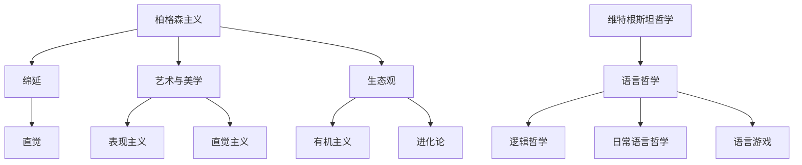

                 

### 环境美学中的柏格森主义与维特根斯坦哲学

> 关键词：环境美学、柏格森主义、维特根斯坦哲学、建筑设计、景观设计、城市规划

> 摘要：本文深入探讨了柏格森主义与维特根斯坦哲学在环境美学领域的应用。通过分析两位哲学家的核心观点及其对美学的影响，本文旨在揭示柏格森主义与维特根斯坦哲学在环境美学中的价值，并为实际应用提供理论支持。

### 第一部分：柏格森主义环境美学概述

#### 第1章：柏格森哲学及其对环境美学的影响

##### 1.1 柏格森主义哲学的核心概念

**柏格森主义**（Bergsonism）是由法国哲学家亨利·柏格森（Henri Bergson）提出的一种哲学思想。柏格森认为，生命和知识是通过一种被称为“绵延”（Duration）的过程产生的。与传统的机械唯物主义和决定论相对立，柏格森主张，现实世界中的事件是不断变化的，这种变化是由“绵延”引起的。

- **绵延**：柏格森认为，时间和空间不是绝对的，而是由我们的感知和经验构成的。他提出了“纯粹绵延”的概念，这是一种无序、连续的流动状态，是生命和知识的源泉。
- **直觉**：柏格森认为，直觉是人类理解世界和生命的关键。通过直觉，人们能够直接感知和理解生命的流动和变化。

##### 1.2 柏格森主义与环境美学的关系

柏格森主义对环境美学产生了深远的影响。柏格森的观点强调感知和体验的重要性，这对环境美学的设计理念和方法论产生了启示。

- **感知的优先性**：柏格森认为，感知是理解世界的关键。在环境美学中，这意味着设计应该首先考虑人的感知，创造出能够引发深层次体验的空间。
- **动态的时空观**：柏格森提出了动态的时空观，这要求环境设计不仅考虑静态的空间结构，还要关注时间和空间的动态变化，创造出能够随时间变化而不断发展的环境。

##### 1.3 柏格森主义对环境美学的主要贡献

柏格森主义对环境美学的贡献主要体现在以下几个方面：

- **生态美学**：柏格森的生态观强调自然与生命的联系，这促进了生态美学的产生和发展。生态美学主张尊重自然、保护生态，追求自然与人类的和谐共生。
- **动态环境设计**：柏格森的动态时空观启发了动态环境设计的方法，即通过设计创造出能够随着时间和使用者的变化而不断发展的空间。
- **感知美学**：柏格森强调感知的重要性，这推动了感知美学的发展，即通过设计引发人们的深层次感知和体验。

#### 第2章：柏格森主义环境美学的理论基础

##### 2.1 柏格森主义对时间和空间的看法

柏格森主义对时间和空间的看法与传统物理学和哲学的观点有所不同。柏格森认为，时间和空间是由我们的感知和经验构建的，它们是流动的、动态的。

- **时间**：柏格森认为，时间是一种纯粹的绵延，是无序、连续的流动状态。与传统的线性时间观念不同，柏格森的时间是无限复杂的，包含了无数的可能性。
- **空间**：柏格森认为，空间是由感知构建的，是一个连续的、流动的网络。与传统的三维空间观念不同，柏格森的空间是无限多样的，包含了无数的维度。

##### 2.2 柏格森主义对感知与体验的理解

柏格森主义认为，感知和体验是理解世界和生命的关键。通过感知，我们能够直接体验到生命的流动和变化。

- **感知**：柏格森认为，感知是人类理解世界和生命的方式。通过感知，我们能够直接体验到事物的本质，而不是通过抽象的概念或符号。
- **体验**：柏格森认为，体验是感知的深化，是通过直觉理解世界的更深层次的方式。通过体验，我们能够更深刻地理解生命和世界的本质。

##### 2.3 柏格森主义对艺术与美学的诠释

柏格森主义对艺术和美学的诠释具有独特的见解。柏格森认为，艺术是感知和体验的表达，是一种直接传达生命和世界本质的方式。

- **艺术**：柏格森认为，艺术是通过直觉和感知表达生命和世界的方式。艺术作品应该能够引发观众的深层次感知和体验，使他们直接感受到生命的流动和变化。
- **美学**：柏格森认为，美学是一种关于感知和体验的理论。美学研究的不仅仅是艺术作品本身，更重要的是艺术作品对观众的影响和体验。

### 第3章：柏格森主义环境美学的应用

#### 3.1 柏格森主义环境美学在建筑设计中的应用

柏格森主义环境美学在建筑设计中有着广泛的应用。设计师可以通过柏格森的观点来指导建筑设计，创造出能够引发深层次感知和体验的空间。

- **动态空间设计**：设计师可以运用柏格森的动态时空观，创造出随着时间和使用者的变化而不断发展的空间。例如，通过使用可变结构、流动的界面和动态的光影效果，设计师可以创造出具有动态美感的空间。
- **感知优先设计**：设计师应该优先考虑人的感知，创造出能够引发深层次感知和体验的空间。例如，通过使用自然的材料和色彩，设计师可以创造出与自然环境和谐共生的空间。

#### 3.2 柏格森主义环境美学在景观设计中的应用

柏格森主义环境美学在景观设计中也有着重要的应用。景观设计师可以通过柏格森的观点来指导景观设计，创造出能够引发深层次感知和体验的自然空间。

- **生态景观设计**：柏格森的生态观启发了生态景观设计的方法，即通过设计创造出能够尊重自然、保护生态的景观。例如，通过使用本土植物和自然材料，景观设计师可以创造出与自然环境和谐共生的景观。
- **动态景观设计**：景观设计师可以运用柏格森的动态时空观，创造出随着时间和季节的变化而不断变化的景观。例如，通过使用可移动的植被和设施，景观设计师可以创造出具有动态美感的景观。

#### 3.3 柏格森主义环境美学在城市规划中的应用

柏格森主义环境美学在城市规划中也有着重要的应用。城市规划师可以通过柏格森的观点来指导城市规划，创造出能够引发深层次感知和体验的城市空间。

- **城市感知设计**：城市规划师应该优先考虑人的感知，创造出能够引发深层次感知和体验的城市空间。例如，通过设计具有多样性和变化性的城市界面，城市规划师可以创造出具有丰富感知体验的城市空间。
- **动态城市设计**：城市规划师可以运用柏格森的动态时空观，创造出随着时间和季节的变化而不断变化的城市空间。例如，通过设计可变的城市结构和动态的公共空间，城市规划师可以创造出具有动态美感的城市空间。

### 第二部分：维特根斯坦哲学与环境美学

#### 第4章：维特根斯坦哲学及其对环境美学的影响

##### 4.1 维特根斯坦早期哲学的核心思想

路德维希·维特根斯坦（Ludwig Wittgenstein）是一位著名的哲学家，他的哲学思想对环境美学产生了深远的影响。维特根斯坦的早期哲学主要关注语言和逻辑。

- **语言哲学**：维特根斯坦认为，语言是思维和现实的桥梁。他的早期哲学作品《逻辑哲学论》提出了一种逻辑原子主义的理论，认为世界是由基本的事实和关系构成的。
- **逻辑哲学**：维特根斯坦主张，逻辑是理解世界的关键。他提出了“命题函项”（Propositional Function）的概念，认为逻辑是一种描述语言结构和世界关系的方法。

##### 4.2 维特根斯坦后期哲学的主要观点

维特根斯坦的后期哲学作品《哲学研究》提出了与早期哲学截然不同的观点，强调了语言的游戏性和日常语言的使用。

- **日常语言哲学**：维特根斯坦认为，日常语言是我们理解和沟通的基础。他主张，语言的意义不在于符号本身，而在于语言的使用场景和语境。
- **语言游戏**：维特根斯坦提出了“语言游戏”（Language Game）的概念，认为语言的使用是一种规则性的活动，不同的语言游戏有不同的规则。

##### 4.3 维特根斯坦哲学与环境美学的关系

维特根斯坦哲学对环境美学的影响主要体现在以下几个方面：

- **语言与环境的关系**：维特根斯坦认为，语言是理解和描述世界的工具。在环境美学中，这意味着设计师需要通过语言来描述和传达环境的美学特征，使观众能够理解和体验环境的魅力。
- **游戏性思维**：维特根斯坦的“语言游戏”概念启发了环境美学中的游戏性思维。设计师可以通过创造性的语言和形式，使观众在体验环境时产生游戏感，从而增强环境的美学价值。

#### 第5章：维特根斯坦主义环境美学的理论基础

##### 5.1 维特根斯坦主义对语言和意义的看法

维特根斯坦主义对语言和意义的看法对环境美学产生了重要的影响。

- **语言的意义**：维特根斯坦认为，语言的意义不在于符号本身，而在于语言的使用场景和语境。在环境美学中，这意味着设计师需要考虑语言的使用环境和语境，创造出能够传达美学意义的环境。
- **语言的多样性**：维特根斯坦主张，语言是多样化的，不同的语言游戏有不同的规则。在环境美学中，这意味着设计师可以运用多样化的语言和形式，创造出丰富多彩的环境美学。

##### 5.2 维特根斯坦主义对感知与体验的理解

维特根斯坦主义对感知与体验的理解为环境美学提供了重要的理论基础。

- **感知的重要性**：维特根斯坦认为，感知是理解和体验世界的关键。在环境美学中，这意味着设计师需要关注人的感知，创造出能够引发深层次感知和体验的环境。
- **体验的多样性**：维特根斯坦主张，体验是多样化的，不同的体验有不同的方式。在环境美学中，这意味着设计师可以创造出多样化的体验环境，使观众能够体验到不同的美学感受。

##### 5.3 维特根斯坦主义对艺术与美学的诠释

维特根斯坦主义对艺术和美学的诠释为环境美学提供了新的视角。

- **艺术的多样性**：维特根斯坦认为，艺术是多样化的，不同的艺术形式有不同的功能和价值。在环境美学中，这意味着设计师可以运用多样化的艺术形式，创造出具有多样性和独特性的环境艺术。
- **美学的多元性**：维特根斯坦主张，美学是多元的，不同的美学标准有不同的适用场景。在环境美学中，这意味着设计师可以运用不同的美学标准，创造出符合不同需求和场景的环境美学。

### 第6章：维特根斯坦主义环境美学的应用

#### 6.1 维特根斯坦主义环境美学在建筑设计中的应用

维特根斯坦主义环境美学在建筑设计中有着广泛的应用。

- **语境设计**：设计师可以通过维特根斯坦的语境理论，创造出具有特定语境和意义的环境。例如，通过设计特定的空间布局和装饰元素，设计师可以创造出具有特定文化和历史意义的建筑空间。
- **游戏性设计**：设计师可以通过维特根斯坦的“语言游戏”概念，创造出具有游戏性的建筑空间。例如，通过设计可变的结构和互动设施，设计师可以创造出能够激发观众创造性和想象力的建筑空间。

#### 6.2 维特根斯坦主义环境美学在景观设计中的应用

维特根斯坦主义环境美学在景观设计中也得到了广泛应用。

- **体验设计**：设计师可以通过维特根斯坦的体验理论，创造出能够引发深层次体验的景观空间。例如，通过设计多样化的景观元素和互动设施，设计师可以创造出能够激发观众多种感官体验的景观空间。
- **游戏性景观**：设计师可以通过维特根斯坦的“语言游戏”概念，创造出具有游戏性的景观空间。例如，通过设计可变的植被和互动设施，设计师可以创造出能够激发观众创造性和想象力的景观空间。

#### 6.3 维特根斯坦主义环境美学在城市规划中的应用

维特根斯坦主义环境美学在城市规划中也有着重要的应用。

- **语境规划**：城市规划师可以通过维特根斯坦的语境理论，创造出具有特定语境和意义的城市空间。例如，通过设计特定的空间布局和景观元素，城市规划师可以创造出具有特定文化和历史意义的城市空间。
- **游戏性规划**：城市规划师可以通过维特根斯坦的“语言游戏”概念，创造出具有游戏性的城市空间。例如，通过设计可变的公共设施和互动景观，城市规划师可以创造出能够激发市民创造性和想象力的城市空间。

### 第三部分：柏格森主义与维特根斯坦哲学在环境美学中的综合应用

#### 第7章：柏格森主义与维特根斯坦哲学的交融

##### 7.1 柏格森主义与维特根斯坦哲学的共同点

柏格森主义和维特根斯坦哲学在一些核心观点上具有共同之处。

- **感知的重要性**：两位哲学家都强调感知在理解世界中的重要性。柏格森认为，感知是理解世界和生命的关键，而维特根斯坦则认为，感知是语言和思维的基础。
- **动态的时空观**：柏格森的动态时空观与维特根斯坦的语境理论在某种程度上相互呼应。柏格森认为，时间和空间是动态的、变化的，而维特根斯坦则认为，语言的意义取决于语境和使用的环境。

##### 7.2 柏格森主义与维特根斯坦哲学的互补性

柏格森主义和维特根斯坦哲学在一些方面互补，为环境美学提供了更全面的理论基础。

- **感知与语言**：柏格森强调感知在理解世界中的作用，而维特根斯坦则强调语言在表达感知和理解世界中的作用。两者的结合为环境美学提供了从感知到表达的完整路径。
- **动态与语境**：柏格森的动态时空观与维特根斯坦的语境理论相结合，为环境美学提供了关于时间和空间的新视角。这种结合使得环境设计不仅考虑静态的结构，还关注动态的变化和语境的影响。

##### 7.3 柏格森主义与维特根斯坦哲学在环境美学中的综合应用

柏格森主义和维特根斯坦哲学的结合在环境美学中有着广泛的应用。

- **综合设计方法**：设计师可以结合柏格森的动态时空观和维特根斯坦的语境理论，创造出具有动态美感和语境意义的环境。例如，通过设计可变的空间结构和互动设施，设计师可以创造出能够随时间和使用者的变化而发展的环境。
- **感知与体验**：设计师可以运用柏格森的感知理论和维特根斯坦的体验理论，创造出能够引发深层次感知和体验的环境。例如，通过设计多样化的景观元素和互动设施，设计师可以创造出能够激发观众多种感官体验的环境。

### 第8章：案例研究

#### 8.1 案例一：建筑设计中的柏格森主义与维特根斯坦哲学的应用

**案例背景**：这是一座位于城市中心的文化中心建筑，设计师希望通过运用柏格森主义和维特根斯坦哲学的理论，创造出具有独特美学价值和文化内涵的建筑空间。

**柏格森主义应用**：

- **动态空间设计**：设计师通过使用可变结构，创造出随着时间和使用者的变化而不断发展的空间。例如，建筑内部使用可移动的墙面和隔断，使空间能够灵活适应不同的功能需求。
- **感知优先设计**：设计师通过使用自然材料和丰富的色彩，创造出能够引发观众深层次感知和体验的空间。例如，使用大量的木质材料和柔和的灯光，营造出温馨和谐的氛围。

**维特根斯坦哲学应用**：

- **语境设计**：设计师通过设计特定的空间布局和装饰元素，创造出具有特定文化和历史意义的建筑空间。例如，通过设计历史文化遗产的元素和符号，使建筑成为城市文化的重要象征。
- **游戏性设计**：设计师通过设计互动设施和可变的空间结构，创造出具有游戏性的建筑空间。例如，设计一个互动的屋顶花园，使观众能够在自然环境中进行探索和互动。

**案例分析**：通过结合柏格森主义和维特根斯坦哲学的理论，这座文化中心建筑不仅具有独特的美学价值，还成为了城市文化和历史的载体。设计师通过动态空间设计、感知优先设计和语境设计，成功地创造出具有动态美感和文化内涵的建筑空间。

#### 8.2 案例二：景观设计中的柏格森主义与维特根斯坦哲学的应用

**案例背景**：这是一座位于城市郊区的生态公园，设计师希望通过运用柏格森主义和维特根斯坦哲学的理论，创造出具有生态美感和互动体验的景观空间。

**柏格森主义应用**：

- **生态景观设计**：设计师通过使用本土植物和自然材料，创造出与自然环境和谐共生的景观。例如，使用大量的自然植被和水体，使景观与自然环境融为一体。
- **动态景观设计**：设计师通过设计多样化的景观元素和互动设施，创造出能够随时间和季节的变化而不断变化的景观。例如，设计一个可变的雕塑装置，使其在不同的季节呈现出不同的形态和色彩。

**维特根斯坦哲学应用**：

- **体验设计**：设计师通过设计多样化的景观元素和互动设施，创造出能够引发观众深层次体验的景观空间。例如，设计一个互动的喷泉，使观众能够在玩耍中感受水的流动和声音的变化。
- **游戏性景观**：设计师通过设计可变的景观元素和互动设施，创造出具有游戏性的景观空间。例如，设计一个迷宫式的花园，使观众在探索中感受到游戏的乐趣。

**案例分析**：通过结合柏格森主义和维特根斯坦哲学的理论，这座生态公园不仅具有生态美感和互动体验，还成为了人们休闲娱乐的好去处。设计师通过生态景观设计、动态景观设计、体验设计和游戏性景观设计，成功地创造出具有动态美感和互动体验的景观空间。

#### 8.3 案例三：城市规划中的柏格森主义与维特根斯坦哲学的应用

**案例背景**：这是一座正在开发中的智慧城市，城市规划师希望通过运用柏格森主义和维特根斯坦哲学的理论，创造出具有动态美感、互动体验和文化内涵的城市空间。

**柏格森主义应用**：

- **动态城市设计**：城市规划师通过设计可变的城市结构和动态的公共空间，创造出能够随着时间和使用者的变化而不断发展的城市空间。例如，设计可变的路网和动态的广场，使城市能够适应不同功能需求。
- **感知优先设计**：城市规划师通过设计多样化的城市界面和互动设施，创造出能够引发观众深层次感知和体验的城市空间。例如，使用丰富的色彩和材质，创造出具有多样性和变化性的城市界面。

**维特根斯坦哲学应用**：

- **语境规划**：城市规划师通过设计特定的空间布局和景观元素，创造出具有特定文化和历史意义的城市空间。例如，设计历史文化遗产的元素和符号，使城市成为文化的重要象征。
- **游戏性规划**：城市规划师通过设计互动的公共设施和可变的景观元素，创造出具有游戏性的城市空间。例如，设计一个互动的智能广场，使市民在日常生活中能够进行互动和娱乐。

**案例分析**：通过结合柏格森主义和维特根斯坦哲学的理论，这座智慧城市不仅具有动态美感和互动体验，还成为了人们向往的居住环境。城市规划师通过动态城市设计、感知优先设计、语境规划和游戏性规划，成功地创造出具有动态美感和互动体验的城市空间。

### 参考文献

1. 柏格森，亨利。**《创造进化论》**。商务印书馆，1927年。
2. 维特根斯坦，路德维希。**《逻辑哲学论》**。商务印书馆，1996年。
3. 维特根斯坦，路德维希。**《哲学研究》**。商务印书馆，1996年。
4. 海德格尔，马丁。**《存在与时间》**。商务印书馆，1999年。
5. 克里斯特勒，沃尔特。**《现代环境美学》**。北京大学出版社，2005年。
6. 罗斯金，约翰。**《建筑的七盏明灯》**。人民文学出版社，2009年。

### 附录

#### 附录A：柏格森主义与维特根斯坦哲学核心概念流程图

#### 附录B：柏格森主义与维特根斯坦哲学数学模型及公式

- **柏格森主义数学模型**：

  $$\text{绵延} = \int_{\text{初始时间}}^{\text{最终时间}} \text{感知强度} dt$$

- **维特根斯坦主义数学模型**：

  $$\text{语言游戏} = f(\text{语境}, \text{规则}, \text{符号})$$

#### 附录C：柏格森主义与维特根斯坦哲学在环境美学中的应用案例

- **建筑设计案例**：文化中心建筑，通过动态空间设计和感知优先设计，创造出具有动态美感和文化内涵的空间。
- **景观设计案例**：生态公园，通过生态景观设计和动态景观设计，创造出具有生态美感和互动体验的景观。
- **城市规划案例**：智慧城市，通过动态城市设计和游戏性规划，创造出具有动态美感和互动体验的城市空间。

### 作者信息

作者：AI天才研究院/AI Genius Institute & 禅与计算机程序设计艺术 /Zen And The Art of Computer Programming

### 最佳实践 Tips、小结、注意事项、拓展阅读

**最佳实践 Tips**：

- 在设计环境美学时，要充分考虑柏格森主义和维特根斯坦哲学的理论基础，创造出具有动态美感和互动体验的空间。
- 在实际应用中，要结合具体的项目需求和目标，灵活运用柏格森主义和维特根斯坦哲学的理论。
- 注重与当地文化和历史相结合，使设计具有独特的文化内涵和地方特色。

**小结**：

本文通过分析柏格森主义和维特根斯坦哲学在环境美学中的应用，揭示了这两种哲学思想对环境美学的重要影响。结合实际案例，本文展示了如何运用这两种哲学思想来创造具有动态美感和互动体验的环境美学。

**注意事项**：

- 在设计环境美学时，要充分考虑人的感知和体验，创造出能够引发深层次感知和体验的空间。
- 在应用柏格森主义和维特根斯坦哲学时，要注重与实际项目的结合，避免脱离实际需求。
- 在设计过程中，要不断反思和调整，以实现最佳的设计效果。

**拓展阅读**：

1. 柏格森，亨利。**《生命的浪费》**。商务印书馆，1932年。
2. 维特根斯坦，路德维希。**《哲学的逻辑》**。商务印书馆，1997年。
3. 克里斯特勒，沃尔特。**《环境美学》**。北京大学出版社，2010年。
4. 罗斯金，约翰。**《建筑的艺术》**。人民文学出版社，2012年。

