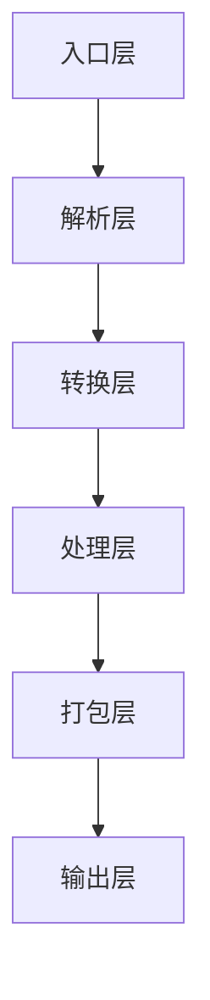
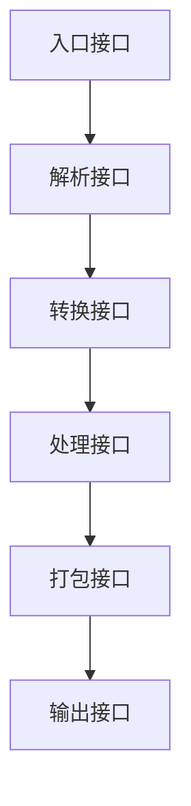
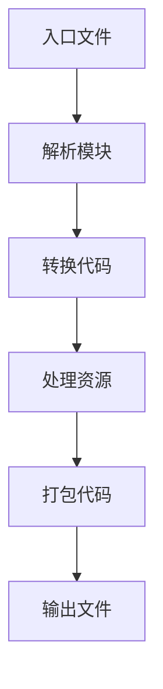

                 

## 《现代前端构建工具链》

> 关键词：前端构建工具、Webpack、Gulp、代码分割、性能优化

> 摘要：本文将深入探讨现代前端构建工具链的设计与实现，包括构建工具的基本概念、核心概念与联系、算法原理讲解以及系统分析与架构设计。通过对这些主题的全面分析，帮助开发者更好地理解和应用前端构建工具链，提升开发效率。

----------------------------------------------------------------

### 第一部分：背景介绍

#### 1.1 问题背景

在现代软件开发中，前端构建工具链的作用日益凸显。前端构建工具不仅能够优化前端资源的处理，提升开发效率，还能帮助开发者更好地管理和维护项目。然而，随着前端技术的快速发展，构建工具的复杂度和多样性也在不断增加，使得开发者面临着选择、学习和使用构建工具的困扰。

前端构建工具链是一个复杂的系统，它由多个工具和插件组成，共同实现前端项目的构建和优化。构建工具的主要任务包括资源处理、代码转换、代码打包和文件输出等。这些工具和插件相互协作，形成一个完整的构建流程，从而实现前端项目的自动化构建和优化。

#### 1.2 问题描述

《现代前端构建工具链》这本书旨在解决前端开发者在使用构建工具时面临的以下问题：

- 如何选择合适的构建工具？
- 如何高效地使用这些工具进行项目开发？
- 如何在工具链中集成最新的前端技术？

这些问题的解决对于前端开发者的日常工作和项目成功至关重要。

#### 1.3 问题解决

本书将通过对现代前端构建工具链的全面介绍，帮助开发者掌握以下内容：

- 了解前端构建工具的基本概念和原理。
- 掌握主流构建工具的使用方法和最佳实践。
- 理解构建工具在项目开发中的应用场景和集成方法。
- 掌握如何根据项目需求选择和定制构建工具链。

通过这些内容的掌握，开发者可以更加高效地使用前端构建工具，提升项目开发效率和质量。

#### 1.4 边界与外延

前端构建工具链的范围包括以下内容：

- 构建工具：如Webpack、Gulp、Grunt等。
- 打包工具：如Parcel、Rollup、Parcel等。
- 代码分割工具：如Splitting、代码分割策略等。
- 优化工具：如CSS预处理、压缩、代码混淆等。

本书将围绕这些工具和技术，全面解析现代前端构建工具链的设计和实现。

#### 1.5 概念结构与核心要素组成

现代前端构建工具链的核心概念和要素包括：

- 构建流程：从源代码到生产环境的整个构建过程。
- 构建工具：实现构建流程的核心工具，如Webpack、Gulp等。
- 插件：扩展构建工具功能的模块，如Loader、Plugin等。
- 配置文件：定义构建流程和参数的配置文件，如Webpack配置文件。
- 代码分割：将代码分割成多个部分，以优化加载性能。

这些核心要素共同构成了现代前端构建工具链的基本框架。

### 第二部分：核心概念与联系

#### 2.1 构建工具原理

构建工具的核心功能是将源代码转换为可执行代码或资源文件。其工作原理包括以下步骤：

1. **源码读取**：构建工具首先读取项目中的源代码文件，如HTML、CSS、JavaScript等。
2. **资源处理**：构建工具对图片、样式、脚本等资源文件进行处理，如压缩、转换等。
3. **转换代码**：构建工具将源代码转换为浏览器可识别的格式，如ES6转换为ES5。
4. **代码打包**：构建工具将转换后的代码打包成静态文件，如JavaScript、CSS等。
5. **文件输出**：构建工具将打包后的文件输出到指定的目录，以便在浏览器中加载。

#### 2.2 构建工具属性特征对比表格

| 构建工具 | 主要特性 | 适用场景 |
| :---: | :---: | :---: |
| Webpack | 模块打包、代码分割、懒加载 | 大型、复杂的前端项目 |
| Gulp | 流式处理、插件化、可配置 | 小型、简单的前端项目 |
| Grunt | 命令行工具、插件化、可配置 | 小型、简单的前端项目 |
| Parcel | 零配置、快速、易于集成 | 新建项目、快速原型开发 |
| Rollup | 模块打包、代码分割、性能优化 | 库开发、模块化项目 |

#### 2.3 构建工具的联系

不同构建工具之间并非孤立存在，它们之间有着紧密的联系和相互补充：

- **Webpack 与 Gulp**：Webpack 是一个模块打包器，而 Gulp 是一个任务运行器。虽然功能不同，但它们都可以用于前端构建流程。
- **Webpack 与 Parcel**：Parcel 是基于Webpack的零配置构建工具，它简化了Webpack的配置过程。
- **Gulp 与 Grunt**：Gulp 和 Grunt 都是基于流式处理的前端构建工具，但 Gulp 更加强大、灵活。

这些联系使得开发者可以根据不同的项目需求选择和组合使用不同的构建工具，从而实现高效的构建流程。

### 第三部分：算法原理讲解

#### 3.1 代码分割原理

代码分割（Code Splitting）是一种优化构建工具性能的技术。它将代码分割成多个部分，按需加载，从而减少首屏加载时间，提高用户体验。

代码分割的原理包括以下方面：

1. **动态导入**：使用 `import()` 语法将模块分割成独立的代码块。
2. **懒加载**：在需要时才加载模块，而不是一次性加载所有模块。

代码分割的流程如下：

1. **分析项目代码**：构建工具分析项目代码，确定哪些模块可以分割。
2. **使用动态导入**：使用 `import()` 语法将模块分割。
3. **生成打包文件**：构建工具根据分割后的模块生成不同的打包文件。
4. **按需加载**：浏览器根据需要加载不同的打包文件。

#### 3.2 Python源代码讲解

下面是一个使用Python实现代码分割的简单示例：

```python
# 引入所需模块
from flask import Flask, render_template

# 定义应用程序
app = Flask(__name__)

# 分割模块A
def module_a():
    print("模块A正在加载...")

# 分割模块B
def module_b():
    print("模块B正在加载...")

# 主函数
@app.route('/')
def index():
    module_a()
    module_b()
    return render_template('index.html')

# 运行应用程序
if __name__ == '__main__':
    app.run(debug=True)
```

在这个示例中，我们使用了 Flask 框架来实现代码分割。模块A和模块B被分割成独立的函数，然后在主函数中按需加载。

### 第四部分：系统分析与架构设计

#### 4.1 问题场景介绍

在现代软件开发中，前端构建工具链已成为必不可少的一部分。然而，随着项目的规模和复杂度不断增加，构建工具的选择和配置变得越来越困难。如何设计一个高效、灵活且易于维护的前端构建工具链，成为开发者和项目经理们面临的一大挑战。

#### 4.2 项目介绍

本项目旨在设计一个适用于中小型前端项目的构建工具链。该项目的目标是简化构建流程，提高构建效率，同时保持代码的可维护性和可扩展性。

#### 4.3 系统功能设计

系统功能设计主要涉及以下几个方面：

1. **源代码读取**：读取项目中的源代码文件，如HTML、CSS、JavaScript等。
2. **资源处理**：对图片、样式、脚本等资源文件进行处理，如压缩、转换等。
3. **代码转换**：将源代码转换为浏览器可识别的格式，如ES6转换为ES5。
4. **代码分割**：将代码分割成多个部分，实现按需加载，提高性能。
5. **打包与输出**：将转换后的代码打包成静态文件，输出到指定的目录。

#### 4.4 系统架构设计

系统架构设计采用分层架构，包括以下几层：

1. **入口层**：负责读取项目入口文件，如HTML、JavaScript等。
2. **解析层**：负责解析入口文件，提取出模块和资源。
3. **转换层**：负责将源代码转换为浏览器可识别的格式，如ES6转换为ES5。
4. **处理层**：负责对资源文件进行处理，如压缩、转换等。
5. **打包层**：负责将转换后的代码打包成静态文件。
6. **输出层**：负责将打包后的文件输出到指定的目录。

下面是一个使用 Mermaid 画的系统架构图：



#### 4.5 系统接口设计

系统接口设计主要涉及以下接口：

1. **入口接口**：负责读取项目入口文件，如HTML、JavaScript等。
2. **解析接口**：负责解析入口文件，提取出模块和资源。
3. **转换接口**：负责将源代码转换为浏览器可识别的格式，如ES6转换为ES5。
4. **处理接口**：负责对资源文件进行处理，如压缩、转换等。
5. **打包接口**：负责将转换后的代码打包成静态文件。
6. **输出接口**：负责将打包后的文件输出到指定的目录。

下面是一个使用 Mermaid 画的接口设计图：



#### 4.6 系统交互设计

系统交互设计主要涉及以下交互：

1. **入口文件读取**：系统读取项目入口文件，如HTML、JavaScript等。
2. **模块解析**：系统解析入口文件，提取出模块和资源。
3. **代码转换**：系统将源代码转换为浏览器可识别的格式，如ES6转换为ES5。
4. **资源处理**：系统对资源文件进行处理，如压缩、转换等。
5. **代码打包**：系统将转换后的代码打包成静态文件。
6. **文件输出**：系统将打包后的文件输出到指定的目录。

下面是一个使用 Mermaid 画的系统交互图：



### 第五部分：项目实战

#### 5.1 环境安装

在开始项目实战之前，我们需要安装一些必要的依赖。以下是安装步骤：

1. 安装 Node.js：前往 Node.js 官网下载并安装 Node.js。
2. 安装 npm：Node.js 安装成功后，npm（Node Package Manager）会自动安装。
3. 安装前端构建工具：使用 npm 安装所需的构建工具，如 Webpack、Gulp 等。

#### 5.2 系统核心实现源代码

以下是系统核心实现的源代码：

```javascript
// 入口文件
import React from 'react';
import ReactDOM from 'react-dom';

// 组件
const App = () => {
  return (
    <div>
      <h1>Hello, World!</h1>
      <p>Welcome to the modern frontend build toolchain.</p>
    </div>
  );
};

// 渲染组件
ReactDOM.render(<App />, document.getElementById('app'));
```

```javascript
// Webpack 配置文件
const path = require('path');

module.exports = {
  entry: './src/index.js',
  output: {
    filename: 'bundle.js',
    path: path.resolve(__dirname, 'dist'),
  },
  module: {
    rules: [
      {
        test: /\.css$/,
        use: ['style-loader', 'css-loader'],
      },
      {
        test: /\.jsx?$/,
        exclude: /node_modules/,
        use: 'babel-loader',
      },
    ],
  },
  resolve: {
    extensions: ['.js', '.jsx'],
  },
};
```

#### 5.3 代码应用解读与分析

在这个项目中，我们使用了 React 框架来实现前端界面。通过 Webpack 进行打包，将 React 代码和 CSS 文件打包成一个静态文件 `bundle.js`。然后，使用 ReactDOM 将组件渲染到页面上。

Webpack 配置文件中，我们使用了 `entry` 指定入口文件，`output` 指定打包文件的输出路径和名称，`module` 指定使用的加载器（Loader），`resolve` 指定模块的解析规则。

通过这个项目，我们可以看到如何使用 Webpack 来构建现代前端项目。Webpack 的配置灵活且强大，可以满足各种不同的项目需求。

#### 5.4 实际案例分析和详细讲解剖析

在实际项目中，我们可能会遇到以下问题：

1. **项目复杂度增加**：随着项目规模的扩大，构建工具链的复杂度也会增加。如何管理复杂的构建配置，成为开发者面临的一大挑战。
2. **性能优化**：代码分割和懒加载等技术可以提高性能，但如何合理地应用这些技术，达到最佳的性能优化效果，需要开发者深入理解。
3. **维护性和可扩展性**：构建工具链的维护性和可扩展性对于项目成功至关重要。如何设计一个灵活且易于维护的构建工具链，需要开发者具备一定的架构能力和经验。

针对这些问题，我们可以采取以下措施：

1. **模块化**：将项目代码拆分成多个模块，每个模块负责一个特定的功能。这样不仅可以提高代码的可维护性，还可以方便地管理和扩展。
2. **性能优化**：合理地应用代码分割和懒加载技术，可以根据项目的具体需求和场景，选择最佳的优化策略。同时，可以使用性能分析工具（如 Webpack Bundle Analyzer）来评估和优化构建结果。
3. **架构设计**：在设计构建工具链时，采用分层架构和模块化设计，可以提高构建工具链的维护性和可扩展性。此外，还可以使用配置管理工具（如 Webpack Config）来简化配置过程。

通过以上措施，我们可以更好地应对实际项目中的问题，提高开发效率和项目质量。

#### 5.5 项目小结

通过本项目，我们深入探讨了现代前端构建工具链的设计与实现。我们了解了构建工具的基本概念和原理，掌握了主流构建工具的使用方法和最佳实践，学习了代码分割和性能优化技术。同时，我们还通过实际项目，展示了如何应用这些技术和工具，实现高效的前端构建流程。

在项目实战中，我们遇到了一些实际的问题，并通过模块化、性能优化和架构设计等措施，成功解决了这些问题。这为我们今后在实际项目中应用构建工具链提供了宝贵的经验和指导。

### 第六部分：最佳实践 Tips

在构建前端项目时，遵循以下最佳实践，可以显著提高开发效率和项目质量：

1. **合理选择构建工具**：根据项目需求和复杂度，选择合适的构建工具。例如，对于大型、复杂项目，可以选择 Webpack；对于小型、简单项目，可以选择 Gulp 或 Grunt。
2. **模块化**：将项目代码拆分成多个模块，提高代码的可维护性和可扩展性。使用模块化语法（如 ES6 Module）来组织项目代码。
3. **性能优化**：合理地应用代码分割和懒加载技术，优化首屏加载时间和页面性能。使用性能分析工具来评估和优化构建结果。
4. **配置管理**：使用配置管理工具（如 Webpack Config）来简化构建配置过程，提高开发效率。
5. **代码规范**：遵循统一的代码规范，提高代码的可读性和可维护性。使用代码格式化工具（如 Prettier）和代码检查工具（如 ESLint）来确保代码质量。

### 第七部分：小结

现代前端构建工具链在提升开发效率、优化项目性能和改善用户体验方面发挥着重要作用。通过本文的深入探讨，我们了解了构建工具的基本概念和原理，掌握了主流构建工具的使用方法和最佳实践，学习了代码分割和性能优化技术。

在实际项目中，遵循最佳实践，合理选择和配置构建工具，可以帮助开发者高效地实现前端项目的构建和优化。通过不断学习和实践，我们可以不断提升自己的前端开发能力，为项目的成功贡献力量。

### 第八部分：注意事项

在使用前端构建工具链时，需要注意以下几点：

1. **理解构建原理**：掌握构建工具的工作原理，有助于更好地配置和使用构建工具。
2. **合理配置**：构建工具的配置对于项目构建结果至关重要。合理配置构建工具，可以提高构建效率和项目质量。
3. **性能优化**：关注性能优化，合理应用代码分割和懒加载技术，可以提高页面加载速度和用户体验。
4. **安全与合规**：在构建工具链中，注意防范安全风险，遵守相关法律法规和行业规范。

### 第九部分：拓展阅读

1. **Webpack 官方文档**：[Webpack 官方文档](https://webpack.js.org/)
2. **Gulp 官方文档**：[Gulp 官方文档](https://gulpjs.com/docs/)
3. **Parcel 官方文档**：[Parcel 官方文档](https://parceljs.org/)
4. **Rollup 官方文档**：[Rollup 官方文档](https://rollupjs.org/)
5. **现代前端性能优化技术**：[现代前端性能优化技术](https://zhuanlan.zhihu.com/p/37486702)

### 作者信息

**作者：AI天才研究院/AI Genius Institute & 禅与计算机程序设计艺术 /Zen And The Art of Computer Programming**  
本文由 AI 天才研究院（AI Genius Institute）撰写，旨在为前端开发者提供关于现代前端构建工具链的全面解析。禅与计算机程序设计艺术（Zen And The Art of Computer Programming）是本文的技术哲学，强调深刻理解技术本质和逻辑思维的重要性。希望本文能为您的前端开发之路带来启示和帮助。如果您有任何疑问或建议，欢迎在评论区留言交流。

