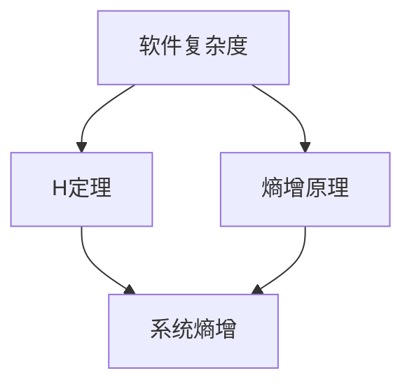

                 

### 《玻尔兹曼的H定理与系统熵增:软件复杂度增长的热力学解释》引论

#### 第1章：软件复杂度与热力学理论的背景

##### 1.1 软件复杂度的定义与挑战

在软件工程领域，软件复杂度是一个关键概念，它涉及到软件系统的可维护性、可理解性和可靠性等多个方面。软件复杂度可以定义为软件系统内部结构的复杂程度，包括模块之间的耦合性、模块内部的复杂性以及软件系统的规模等因素。软件复杂度高的系统通常更难以理解和修改，容易出现缺陷，从而增加了维护成本。

软件复杂度的问题源自多个方面。首先，随着软件系统的规模和复杂性的增加，维护和扩展变得更加困难。其次，开发人员在设计和实现过程中可能会引入不必要的复杂性，使得系统难以维护。此外，软件复杂度还会影响软件的可测试性，使得测试变得更加复杂和耗时。

##### 1.2 热力学基本概念简介

热力学是研究能量转换和物质变化的科学，其基本概念包括能量、热力学系统、熵、温度和压力等。在这些概念中，熵是一个核心概念，它代表了系统的无序度或不确定性。熵增原理指出，一个孤立系统的总熵在自发过程中总是倾向于增加，这是热力学第二定律的一个重要表述。

热力学系统的概念也值得注意。热力学系统是一个封闭或隔离的系统，其内部进行着各种能量转换和物质变化。热力学系统可以分为宏观和微观两个层次，宏观层次关注系统的宏观性质，如温度和压力；微观层次关注系统的微观结构和粒子行为。

##### 1.3 玻尔兹曼的H定理与熵增原理

玻尔兹曼的H定理是热力学中的一个重要定理，它描述了系统在热力学平衡状态下的熵变。H定理指出，一个孤立系统的熵在自发过程中总是趋于最大，即系统的无序度总是增加，直到达到热力学平衡状态。

H定理可以用以下数学表达式表示：
$$
\frac{dS}{dt} = \frac{\partial S}{\partial t} + \frac{\partial S}{\partial E} \frac{dE}{dt} \geq 0
$$
其中，\( S \) 表示熵，\( E \) 表示能量，\( t \) 表示时间。

这个定理揭示了熵增原理在热力学系统中的普遍适用性，即在系统自发过程中，熵总是倾向于增加。这一原理不仅在热力学中具有重要意义，也在其他科学领域，如统计物理学、信息科学和计算机科学中有着广泛的应用。

#### 第2章：软件复杂度与熵的关系

##### 2.1 软件复杂度的度量方法

度量软件复杂度是理解和控制软件复杂度的重要步骤。常用的复杂度度量方法包括Cyclomatic复杂度、Maintainability Index等。

Cyclomatic复杂度是一种基于控制流的复杂度度量方法。它通过计算程序中的独立路径数来度量代码的复杂度。Cyclomatic复杂度可以用以下公式计算：
$$
Cyclo = M - N + 2P
$$
其中，\( M \) 表示模块中的语句数，\( N \) 表示模块中的判定节点数，\( P \) 表示模块中的圈复杂度。

Maintainability Index是一种用于评估代码可维护性的度量方法。它考虑了代码的复杂性、规模和测试覆盖率等因素。Maintainability Index的值越低，表示代码的可维护性越差。

##### 2.2 熵增原理在软件系统中的应用

熵增原理在软件系统中的应用可以帮助我们理解软件复杂度的增长趋势。在软件系统开发过程中，随着功能的增加和系统的扩展，系统的复杂度会逐渐增加，这类似于热力学系统在自发过程中的熵增。

熵增原理在软件系统中的应用可以表现在以下几个方面：

1. **系统结构的熵增**：随着软件系统的扩展，系统内部的模块和组件之间的依赖关系变得更加复杂，系统的整体结构变得更加无序，这类似于热力学系统中无序度的增加。

2. **代码的熵增**：在软件开发过程中，开发人员可能会引入不必要的复杂性，导致代码的可读性和可维护性下降，这也类似于热力学系统中熵的增加。

3. **功能的熵增**：随着软件系统的扩展，新的功能和特性不断被添加，这可能导致系统功能的耦合性增加，系统的整体功能变得更加复杂和无序。

##### 2.3 软件复杂度与系统熵的数学模型

为了更好地理解软件复杂度与系统熵之间的关系，我们可以建立相应的数学模型。

设软件系统的复杂度为 \( C \)，熵为 \( S \)，则可以建立如下数学模型：
$$
S = S(C)
$$
这个模型表示系统熵 \( S \) 是系统复杂度 \( C \) 的函数。

在热力学系统中，熵与能量 \( E \) 之间的关系可以用玻尔兹曼的熵公式表示：
$$
S = k \ln W
$$
其中，\( k \) 是玻尔兹曼常数，\( W \) 是系统的微观状态数。

在软件系统中，我们可以将复杂度视为系统的微观状态数，因此，可以建立类似的熵公式：
$$
S = k \ln C
$$
这个公式表明，软件系统的熵与复杂度之间是正相关的，即随着系统复杂度的增加，系统的熵也会增加。

通过这个数学模型，我们可以定量地分析软件复杂度与系统熵之间的关系，从而更好地理解和控制软件复杂度。

#### 第3章：热力学理论在软件工程中的应用

##### 3.1 热力学模型在软件复杂度研究中的适用性

热力学模型在软件复杂度研究中的适用性主要表现在以下几个方面：

1. **熵增原理**：热力学中的熵增原理可以用来解释软件系统复杂度的增长趋势。随着软件系统的扩展和功能的增加，系统的复杂度会逐渐增加，这类似于热力学系统在自发过程中的熵增。

2. **能量概念**：热力学中的能量概念可以帮助我们理解软件系统中的资源消耗和性能问题。例如，在软件系统中，处理一个复杂任务所需的计算资源可以视为系统的“能量”。

3. **平衡状态**：热力学中的平衡状态概念可以帮助我们理解软件系统的稳定性和可维护性。一个软件系统在开发过程中可能会达到某种平衡状态，这时系统的复杂度不再增加，但可能仍然存在潜在的风险和问题。

##### 3.2 热力学理论在软件设计中的应用

热力学理论在软件设计中的应用主要体现在以下几个方面：

1. **系统结构设计**：热力学中的无序度概念可以帮助我们在设计软件系统时考虑系统的结构复杂度。例如，在系统架构设计中，我们可以通过减少模块之间的依赖关系来降低系统的复杂度。

2. **性能优化**：热力学中的能量概念可以帮助我们在软件设计中考虑系统的性能问题。例如，在性能优化过程中，我们可以通过减少系统的资源消耗来提高系统的性能。

3. **可靠性设计**：热力学中的平衡状态概念可以帮助我们在软件设计中考虑系统的可靠性。例如，在设计软件系统时，我们可以通过增加冗余机制来提高系统的可靠性。

##### 3.3 热力学原理在软件测试中的运用

热力学原理在软件测试中的应用主要体现在以下几个方面：

1. **测试覆盖度**：热力学中的熵增原理可以帮助我们理解软件系统在测试过程中复杂度的变化。随着测试的进行，系统的复杂度会逐渐增加，这要求我们在测试过程中不断调整测试策略，以提高测试的覆盖度。

2. **测试效率**：热力学中的能量概念可以帮助我们理解软件测试中的资源消耗问题。例如，在测试过程中，我们可以通过优化测试用例的执行顺序来减少系统的资源消耗，从而提高测试效率。

3. **测试优化**：热力学中的平衡状态概念可以帮助我们理解软件测试的稳定性。在一个稳定的测试环境中，系统的复杂度会保持在一个相对较低的水平，这有利于我们进行高效的测试。

#### 第4章：熵减策略与软件复杂性控制

##### 4.1 熵减策略的概念与原则

熵减策略是指在软件系统开发、测试和维护过程中，采取一系列措施来减少系统的复杂度，从而提高系统的可维护性和可靠性。熵减策略的核心原则包括：

1. **简化系统结构**：通过减少模块之间的依赖关系和降低模块内部的复杂性来简化系统结构。

2. **优化代码质量**：通过编写简洁、清晰的代码和减少代码冗余来提高代码质量。

3. **减少功能耦合**：通过降低系统功能之间的耦合性来减少系统的复杂度。

4. **提高测试覆盖度**：通过增加测试用例的执行次数和覆盖度来提高系统的可测试性。

##### 4.2 实践中的熵减方法

在实际开发过程中，熵减策略可以通过以下方法实施：

1. **代码重构**：通过重构代码来减少冗余和简化代码结构。例如，可以使用提取方法、提取类和合并重复代码等技术。

2. **模块化设计**：通过模块化设计来降低系统组件之间的耦合性。例如，可以使用组件化、服务化和微服务架构等技术。

3. **代码审查**：通过代码审查来识别和修复代码中的复杂度和冗余问题。例如，可以使用静态代码分析工具和人工审查相结合的方法。

4. **测试优化**：通过优化测试用例和测试策略来提高测试的覆盖度和效率。例如，可以使用单元测试、集成测试和性能测试相结合的方法。

##### 4.3 熵减策略在软件维护中的应用

在软件维护过程中，熵减策略可以帮助我们控制系统的复杂度，从而提高系统的可维护性。具体应用包括：

1. **定期重构**：定期对系统进行重构，以减少代码复杂度和提高代码质量。

2. **持续集成与部署**：通过持续集成和部署来减少系统的集成风险和部署复杂度。

3. **版本控制和配置管理**：通过版本控制和配置管理来确保系统的可维护性和可扩展性。

4. **缺陷管理**：通过缺陷管理来及时识别和修复系统中的缺陷，从而减少系统的复杂度和提高系统的稳定性。

#### 第5章：热力学理论在软件项目管理中的应用

##### 5.1 软件项目中的熵增现象分析

在软件项目管理过程中，熵增现象是一个普遍存在的现象。随着项目的进行，系统的复杂度和不确定性会逐渐增加，这可能会导致项目风险的增加和项目进度的延误。熵增现象在软件项目管理中主要表现在以下几个方面：

1. **需求变更**：在软件开发过程中，用户需求可能会发生变化，这可能会导致系统设计的复杂性增加。

2. **技术债务**：在软件开发过程中，可能会因为时间或资源限制而积累技术债务，这可能会导致系统复杂度的增加。

3. **沟通障碍**：在大型软件项目中，团队成员之间的沟通可能存在障碍，这可能会导致项目决策的不一致和系统设计的复杂性增加。

4. **项目风险**：随着项目的进行，项目风险可能会逐渐增加，这可能会导致项目的进度延误和成本超支。

##### 5.2 熵减策略在项目规划与控制中的应用

为了应对熵增现象，在软件项目管理中，我们可以采用一系列熵减策略来控制项目的复杂度和风险。熵减策略在项目规划与控制中的应用包括：

1. **需求管理**：通过严格的需求管理和变更控制来减少需求变更的频率和影响，从而降低系统的复杂性。

2. **风险管理**：通过风险识别、评估和控制来降低项目风险，从而减少系统的复杂度和不确定性。

3. **团队协作**：通过提高团队协作效率和沟通效果来减少沟通障碍，从而降低系统的复杂性。

4. **进度控制**：通过制定合理的项目计划和进度监控机制来确保项目按计划进行，从而减少项目延误和成本超支的风险。

##### 5.3 熵增与项目风险的关联分析

熵增与项目风险之间存在密切的关联。熵增现象可能会导致项目风险的增加，具体表现在以下几个方面：

1. **需求变更导致的系统复杂性增加**：需求变更可能会导致系统设计的复杂性增加，从而增加项目风险。

2. **技术债务积累**：技术债务积累可能会导致系统复杂度和维护成本的增加，从而增加项目风险。

3. **沟通障碍导致的决策不一致**：沟通障碍可能会导致项目团队成员之间的决策不一致，从而增加项目风险。

4. **项目进度延误和成本超支**：熵增现象可能会导致项目进度延误和成本超支，从而增加项目风险。

为了降低熵增带来的项目风险，我们可以采用以下措施：

1. **制定详细的需求文档**：通过制定详细的需求文档来减少需求变更的频率和影响，从而降低系统的复杂性。

2. **实施技术债务管理**：通过定期评估和偿还技术债务来降低系统的复杂度和维护成本。

3. **加强团队沟通和协作**：通过提高团队沟通和协作效率来减少决策不一致的情况，从而降低项目风险。

4. **实施有效的进度控制和风险管理**：通过制定合理的项目计划和进度监控机制，以及实施有效的风险管理措施来降低项目延误和成本超支的风险。

#### 第6章：实际案例研究

##### 6.1 案例一：某大型软件项目熵增现象的分析与控制

在这个案例中，我们将分析一个大型软件项目的熵增现象，并提出相应的控制措施。

**案例背景**：某大型软件项目涉及多个模块和复杂的功能，随着项目的进行，系统的复杂度和不确定性逐渐增加，导致项目风险增加和进度延误。

**熵增现象分析**：

1. **需求变更**：在项目开发过程中，用户需求发生了多次变更，导致系统设计的复杂性增加。

2. **技术债务**：为了在规定的时间内完成项目，开发团队积累了一定的技术债务，这导致了系统复杂度的增加。

3. **沟通障碍**：项目团队成员之间缺乏有效的沟通，导致决策不一致和系统设计的复杂性增加。

**熵减措施**：

1. **需求管理**：通过严格的变更控制流程和需求评审机制，减少需求变更的频率和影响，从而降低系统的复杂性。

2. **技术债务管理**：通过定期评估和偿还技术债务，降低系统的复杂度和维护成本。

3. **团队协作**：通过建立有效的沟通渠道和协作机制，提高团队协作效率和沟通效果，从而减少决策不一致的情况。

4. **进度控制和风险管理**：通过制定合理的项目计划和进度监控机制，以及实施有效的风险管理措施，降低项目延误和成本超支的风险。

**案例结果**：通过实施熵减措施，项目风险得到了有效控制，项目进度和成本也得到了良好的管理。

##### 6.2 案例二：熵减策略在软件维护中的实际应用

在这个案例中，我们将探讨熵减策略在软件维护中的应用，以减少系统的复杂度和提高系统的稳定性。

**案例背景**：某软件系统在长时间的使用过程中，逐渐积累了大量的技术债务和代码冗余，导致系统的复杂度增加，维护成本上升。

**熵减措施**：

1. **代码重构**：通过重构代码来减少冗余和简化代码结构，从而降低系统的复杂度。

2. **模块化设计**：通过模块化设计来降低系统组件之间的耦合性，从而减少系统的复杂度。

3. **代码审查**：通过代码审查来识别和修复代码中的复杂度和冗余问题，从而提高代码质量。

4. **测试优化**：通过优化测试用例和测试策略来提高测试的覆盖度和效率，从而减少系统的复杂度。

**案例结果**：通过实施熵减措施，系统的复杂度得到了有效控制，维护成本也显著降低。

##### 6.3 案例三：热力学理论在软件测试中的应用实践

在这个案例中，我们将探讨热力学理论在软件测试中的应用，以优化测试过程和降低测试成本。

**案例背景**：某软件系统在测试过程中，测试用例的覆盖度较低，测试效率低下，导致测试成本高昂。

**熵减措施**：

1. **测试覆盖度优化**：通过增加测试用例的执行次数和覆盖度来提高测试的覆盖度，从而减少系统的复杂度。

2. **测试效率优化**：通过优化测试用例的执行顺序和测试环境的配置来提高测试效率，从而减少测试成本。

3. **测试策略优化**：通过调整测试策略和测试方案来降低测试过程中的复杂度，从而提高测试效率。

**案例结果**：通过实施熵减措施，测试过程的复杂度得到了有效控制，测试成本也显著降低。

#### 第7章：热力学理论在软件工程中的未来展望

##### 7.1 热力学理论与软件工程的深度融合趋势

随着软件工程领域的不断发展和复杂度的增加，热力学理论在软件工程中的应用前景日益广阔。未来，热力学理论与软件工程的深度融合将呈现以下趋势：

1. **系统复杂性建模**：热力学理论可以用来建立软件系统的复杂性模型，从而更好地理解和控制系统的复杂度。

2. **熵增与熵减机制**：通过引入熵增与熵减机制，可以优化软件系统的设计和开发过程，降低系统的复杂度。

3. **性能优化与能耗管理**：热力学理论可以用于软件系统的性能优化和能耗管理，从而提高系统的效率和可靠性。

##### 7.2 熵增控制与软件工程的新挑战

随着热力学理论在软件工程中的应用，软件工程领域将面临一系列新的挑战：

1. **理论体系的构建**：需要建立一套完整的理论体系来指导热力学理论在软件工程中的应用。

2. **算法与应用研究**：需要深入研究热力学算法在软件工程中的应用，开发出高效、实用的工具和方法。

3. **工程实践与验证**：需要通过工程实践来验证热力学理论在软件工程中的应用效果，并不断优化和完善。

##### 7.3 热力学理论在软件工程教育中的应用前景

热力学理论在软件工程教育中的应用具有重要意义，它可以帮助学生更好地理解和掌握软件工程的核心概念和原理。未来，热力学理论在软件工程教育中的应用前景包括：

1. **课程设置**：在软件工程课程中引入热力学理论，构建理论与实践相结合的课程体系。

2. **教学方法**：采用案例教学、实验教学和项目教学等方法，提高学生的实践能力和创新意识。

3. **师资队伍建设**：加强师资队伍建设，培养具有热力学理论背景的软件工程教育人才。

#### 第8章：结论

##### 8.1 本书的主要内容回顾

本书从热力学理论的角度，探讨了软件复杂度增长的问题，并提出了熵减策略来解决这一问题。主要内容包括：

1. **软件复杂度的定义与挑战**：介绍了软件复杂度的概念和当前面临的挑战。

2. **热力学基本概念简介**：介绍了热力学的基本概念，包括能量、熵和热力学系统等。

3. **玻尔兹曼的H定理与熵增原理**：介绍了H定理和熵增原理，并探讨了它们在软件系统中的应用。

4. **软件复杂度与熵的关系**：分析了软件复杂度与熵之间的关系，并建立了相应的数学模型。

5. **热力学理论在软件工程中的应用**：介绍了热力学理论在软件设计、测试和项目管理中的应用。

6. **熵减策略与软件复杂性控制**：提出了熵减策略，并探讨了其在软件维护和项目规划中的应用。

7. **实际案例研究**：通过实际案例，展示了热力学理论在软件工程中的应用效果。

8. **未来展望**：探讨了热力学理论在软件工程中的未来发展趋势和应用前景。

##### 8.2 热力学理论在软件工程中的价值与局限

热力学理论在软件工程中的价值主要体现在以下几个方面：

1. **理解软件复杂度增长**：热力学理论提供了新的视角来理解软件复杂度的增长，有助于软件开发人员更好地应对复杂度问题。

2. **熵减策略的应用**：热力学理论为软件开发提供了熵减策略，可以帮助开发人员降低系统的复杂度，提高软件的可维护性和可靠性。

3. **性能优化与能耗管理**：热力学理论可以用于软件系统的性能优化和能耗管理，从而提高系统的效率和可靠性。

然而，热力学理论在软件工程中也存在一定的局限：

1. **理论体系的构建**：热力学理论在软件工程中的应用需要建立一套完整的理论体系，目前这一领域的研究还处于初步阶段。

2. **算法与应用研究**：热力学算法在软件工程中的应用需要进一步研究，以开发出高效、实用的工具和方法。

3. **工程实践与验证**：热力学理论在软件工程中的应用需要在工程实践中得到验证，并不断优化和完善。

##### 8.3 未来研究方向与建议

为了进一步推动热力学理论在软件工程中的应用，未来研究可以从以下几个方面进行：

1. **系统复杂性建模**：深入研究软件系统的复杂性建模，开发出更精确、更实用的复杂性度量方法和模型。

2. **熵减策略优化**：优化现有的熵减策略，研究新的熵减方法，以提高软件系统的可维护性和可靠性。

3. **跨学科研究**：加强跨学科研究，将热力学理论与其他领域的知识相结合，探索新的应用领域。

4. **工程实践与验证**：将热力学理论应用于实际的软件工程项目，通过实践验证其效果，并不断优化和完善。

5. **教育推广**：将热力学理论引入软件工程教育，培养学生的跨学科能力和创新意识。

通过这些研究方向的探索，我们可以更好地将热力学理论应用于软件工程，提高软件系统的质量和效率。### 玻尔兹曼的H定理与系统熵增：软件复杂度增长的热力学解释

关键词：软件复杂度、熵增原理、热力学、H定理、软件工程、熵减策略

摘要：本文从热力学的角度探讨了软件复杂度增长的现象，介绍了玻尔兹曼的H定理与系统熵增原理，并通过数学模型和实际案例分析了软件复杂度与熵之间的关系。在此基础上，提出了熵减策略以控制软件复杂度增长，并探讨了热力学理论在软件工程中的潜在应用价值。本文旨在为软件开发人员提供一种新的思路，帮助其更好地理解和控制软件系统的复杂度。

---

### 第1章：软件复杂度与热力学理论的背景

#### 1.1 软件复杂度的定义与挑战

软件复杂度是指软件系统中难以理解和维护的特性。它可以从多个维度进行度量，如代码行数、模块数量、依赖关系和功能复杂性等。软件复杂度高的系统通常更难以理解、测试和维护，从而增加了开发成本和风险。

当前，软件复杂度面临以下挑战：

1. **需求变化**：在软件开发过程中，需求变化频繁，可能导致系统结构的不稳定。
2. **技术债务**：为了在短时间内交付功能，开发团队可能会牺牲系统的质量，积累技术债务。
3. **团队协作**：大型软件项目往往涉及多个开发人员，团队协作问题可能导致系统复杂度增加。
4. **代码冗余**：过度编码或重复代码导致系统难以维护和扩展。

#### 1.2 热力学基本概念简介

热力学是研究能量转换和物质变化的科学。在热力学中，几个核心概念如下：

- **能量**：系统所具有的做功能力。
- **热力学系统**：一个具有确定边界和内部物质和能量交换的封闭系统。
- **熵**：系统无序度的度量，与系统可能的微观状态数成正比。
- **温度**：系统内能量分布的平均程度。
- **压力**：系统内部对边界的力。

#### 1.3 玻尔兹曼的H定理与熵增原理

玻尔兹曼的H定理是热力学中的一个重要结论，它描述了系统在自发过程中熵的变化。H定理指出，对于一个孤立系统，在达到热力学平衡状态时，熵不会减少。其数学表达式为：

\[ \frac{dS}{dt} = \frac{\partial S}{\partial t} + \frac{\partial S}{\partial E} \frac{dE}{dt} \geq 0 \]

其中，\( S \) 是熵，\( E \) 是能量，\( t \) 是时间。

熵增原理表明，在一个孤立系统中，熵在自发过程中总是倾向于增加，直到达到热力学平衡。这一原理可以表述为：

\[ S \geq S_0 \]

其中，\( S \) 是系统的最终熵，\( S_0 \) 是系统的初始熵。

#### 1.4 软件复杂度与热力学理论的联系

软件复杂度与热力学理论之间存在着一些有趣的联系。首先，软件系统在开发、测试和维护过程中，复杂度可能会随着功能的增加而增加，这类似于系统熵在自发过程中的增长。其次，软件系统的模块耦合和设计模式也可能影响系统的熵，类似于热力学系统中的能量分布。

通过将热力学理论应用于软件工程，我们可以更好地理解软件复杂度的增长机制，并提出相应的熵减策略来控制复杂度。

### 第2章：软件复杂度与熵的关系

#### 2.1 软件复杂度的度量方法

度量软件复杂度是理解和控制软件复杂度的重要步骤。以下是一些常用的复杂度度量方法：

1. **Cyclomatic复杂度**：基于控制流的复杂度度量方法，通过计算独立路径数来衡量代码的复杂度。

\[ \text{Cyclomatic复杂度} = M - N + 2P \]

其中，\( M \) 是模块中的语句数，\( N \) 是判定节点数，\( P \) 是圈复杂度。

2. **Maintainability Index**：用于评估代码可维护性的度量方法，考虑了代码的复杂性、规模和测试覆盖率等因素。

3. **Chidamber和Kemerer度量**：包括方法数量、类数量、类依赖性和类接口数量等指标，用于评估代码的复杂度和可维护性。

#### 2.2 熵增原理在软件系统中的应用

熵增原理在软件系统中的应用可以帮助我们理解软件复杂度的增长趋势。在软件系统开发过程中，随着功能的增加和系统的扩展，系统的复杂度会逐渐增加，这类似于热力学系统在自发过程中的熵增。

熵增原理在软件系统中的应用可以表现在以下几个方面：

1. **系统结构的熵增**：随着软件系统的扩展，系统内部的模块和组件之间的依赖关系变得更加复杂，系统的整体结构变得更加无序。
2. **代码的熵增**：在软件开发过程中，开发人员可能会引入不必要的复杂性，导致代码的可读性和可维护性下降。
3. **功能的熵增**：随着软件系统的扩展，新的功能和特性不断被添加，这可能导致系统功能的耦合性增加，系统的整体功能变得更加复杂和无序。

#### 2.3 软件复杂度与系统熵的数学模型

为了更好地理解软件复杂度与系统熵之间的关系，我们可以建立相应的数学模型。

设软件系统的复杂度为 \( C \)，熵为 \( S \)，则可以建立如下数学模型：

\[ S = S(C) \]

在热力学系统中，熵与能量 \( E \) 之间的关系可以用玻尔兹曼的熵公式表示：

\[ S = k \ln W \]

其中，\( k \) 是玻尔兹曼常数，\( W \) 是系统的微观状态数。

在软件系统中，我们可以将复杂度视为系统的微观状态数，因此，可以建立类似的熵公式：

\[ S = k \ln C \]

这个公式表明，软件系统的熵与复杂度之间是正相关的，即随着系统复杂度的增加，系统的熵也会增加。

通过这个数学模型，我们可以定量地分析软件复杂度与系统熵之间的关系，从而更好地理解和控制软件复杂度。

### 第3章：热力学理论在软件工程中的应用

#### 3.1 热力学模型在软件复杂度研究中的适用性

热力学模型在软件复杂度研究中的适用性主要表现在以下几个方面：

1. **熵增原理**：热力学中的熵增原理可以用来解释软件系统复杂度的增长趋势。随着软件系统的扩展和功能的增加，系统的复杂度会逐渐增加，这类似于热力学系统在自发过程中的熵增。
   
2. **能量概念**：热力学中的能量概念可以帮助我们理解软件系统中的资源消耗和性能问题。例如，在软件系统中，处理一个复杂任务所需的计算资源可以视为系统的“能量”。

3. **平衡状态**：热力学中的平衡状态概念可以帮助我们理解软件系统的稳定性和可维护性。一个软件系统在开发过程中可能会达到某种平衡状态，这时系统的复杂度不再增加，但可能仍然存在潜在的风险和问题。

#### 3.2 热力学理论在软件设计中的应用

热力学理论在软件设计中的应用主要体现在以下几个方面：

1. **系统结构设计**：热力学中的无序度概念可以帮助我们在设计软件系统时考虑系统的结构复杂度。例如，在系统架构设计中，我们可以通过减少模块之间的依赖关系来降低系统的复杂度。

2. **性能优化**：热力学中的能量概念可以帮助我们在软件设计中考虑系统的性能问题。例如，在性能优化过程中，我们可以通过减少系统的资源消耗来提高系统的性能。

3. **可靠性设计**：热力学中的平衡状态概念可以帮助我们在软件设计中考虑系统的可靠性。例如，在设计软件系统时，我们可以通过增加冗余机制来提高系统的可靠性。

#### 3.3 热力学原理在软件测试中的运用

热力学原理在软件测试中的应用主要体现在以下几个方面：

1. **测试覆盖度**：热力学中的熵增原理可以帮助我们理解软件系统在测试过程中复杂度的变化。随着测试的进行，系统的复杂度会逐渐增加，这要求我们在测试过程中不断调整测试策略，以提高测试的覆盖度。

2. **测试效率**：热力学中的能量概念可以帮助我们理解软件测试中的资源消耗问题。例如，在测试过程中，我们可以通过优化测试用例的执行顺序来减少系统的资源消耗，从而提高测试效率。

3. **测试优化**：热力学中的平衡状态概念可以帮助我们理解软件测试的稳定性。在一个稳定的测试环境中，系统的复杂度会保持在一个相对较低的水平，这有利于我们进行高效的测试。

### 第4章：熵减策略与软件复杂性控制

#### 4.1 熵减策略的概念与原则

熵减策略是指在软件系统开发、测试和维护过程中，采取一系列措施来减少系统的复杂度，从而提高系统的可维护性和可靠性。熵减策略的核心原则包括：

1. **简化系统结构**：通过减少模块之间的依赖关系和降低模块内部的复杂性来简化系统结构。
2. **优化代码质量**：通过编写简洁、清晰的代码和减少代码冗余来提高代码质量。
3. **减少功能耦合**：通过降低系统功能之间的耦合性来减少系统的复杂度。
4. **提高测试覆盖度**：通过增加测试用例的执行次数和覆盖度来提高系统的可测试性。

#### 4.2 实践中的熵减方法

在实际开发过程中，熵减策略可以通过以下方法实施：

1. **代码重构**：通过重构代码来减少冗余和简化代码结构。例如，可以使用提取方法、提取类和合并重复代码等技术。
2. **模块化设计**：通过模块化设计来降低系统组件之间的耦合性。例如，可以使用组件化、服务化和微服务架构等技术。
3. **代码审查**：通过代码审查来识别和修复代码中的复杂度和冗余问题。例如，可以使用静态代码分析工具和人工审查相结合的方法。
4. **测试优化**：通过优化测试用例和测试策略来提高测试的覆盖度和效率。例如，可以使用单元测试、集成测试和性能测试相结合的方法。

#### 4.3 熵减策略在软件维护中的应用

在软件维护过程中，熵减策略可以帮助我们控制系统的复杂度，从而提高系统的可维护性。具体应用包括：

1. **定期重构**：定期对系统进行重构，以减少代码复杂度和提高代码质量。
2. **持续集成与部署**：通过持续集成和部署来减少系统的集成风险和部署复杂度。
3. **版本控制和配置管理**：通过版本控制和配置管理来确保系统的可维护性和可扩展性。
4. **缺陷管理**：通过缺陷管理来及时识别和修复系统中的缺陷，从而减少系统的复杂度和提高系统的稳定性。

### 第5章：热力学理论在软件项目管理中的应用

#### 5.1 软件项目中的熵增现象分析

在软件项目管理过程中，熵增现象是一个普遍存在的现象。随着项目的进行，系统的复杂度和不确定性会逐渐增加，这可能会导致项目风险的增加和项目进度的延误。熵增现象在软件项目管理中主要表现在以下几个方面：

1. **需求变更**：在软件开发过程中，用户需求可能会发生变化，这可能会导致系统设计的复杂性增加。
2. **技术债务**：在软件开发过程中，可能会因为时间或资源限制而积累技术债务，这可能会导致系统复杂度的增加。
3. **沟通障碍**：在大型软件项目中，团队成员之间的沟通可能存在障碍，这可能会导致项目决策的不一致和系统设计的复杂性增加。
4. **项目风险**：随着项目的进行，项目风险可能会逐渐增加，这可能会导致项目的进度延误和成本超支。

#### 5.2 熵减策略在项目规划与控制中的应用

为了应对熵增现象，在软件项目管理中，我们可以采用一系列熵减策略来控制项目的复杂度和风险。熵减策略在项目规划与控制中的应用包括：

1. **需求管理**：通过严格的需求管理和变更控制来减少需求变更的频率和影响，从而降低系统的复杂性。
2. **风险管理**：通过风险识别、评估和控制来降低项目风险，从而减少系统的复杂度和不确定性。
3. **团队协作**：通过提高团队协作效率和沟通效果来减少沟通障碍，从而降低系统的复杂性。
4. **进度控制**：通过制定合理的项目计划和进度监控机制来确保项目按计划进行，从而减少项目延误和成本超支的风险。

#### 5.3 熵增与项目风险的关联分析

熵增与项目风险之间存在密切的关联。熵增现象可能会导致项目风险的增加，具体表现在以下几个方面：

1. **需求变更导致的系统复杂性增加**：需求变更可能会导致系统设计的复杂性增加，从而增加项目风险。
2. **技术债务积累**：技术债务积累可能会导致系统复杂度和维护成本的增加，从而增加项目风险。
3. **沟通障碍导致的决策不一致**：沟通障碍可能会导致项目团队成员之间的决策不一致，从而增加项目风险。
4. **项目进度延误和成本超支**：熵增现象可能会导致项目进度延误和成本超支，从而增加项目风险。

为了降低熵增带来的项目风险，我们可以采用以下措施：

1. **制定详细的需求文档**：通过制定详细的需求文档来减少需求变更的频率和影响，从而降低系统的复杂性。
2. **实施技术债务管理**：通过定期评估和偿还技术债务来降低系统的复杂度和维护成本。
3. **加强团队沟通和协作**：通过提高团队沟通和协作效率来减少决策不一致的情况，从而降低项目风险。
4. **实施有效的进度控制和风险管理**：通过制定合理的项目计划和进度监控机制，以及实施有效的风险管理措施来降低项目延误和成本超支的风险。

### 第6章：实际案例研究

#### 6.1 案例一：某大型软件项目熵增现象的分析与控制

在这个案例中，我们将分析一个大型软件项目的熵增现象，并提出相应的控制措施。

**案例背景**：某大型软件项目涉及多个模块和复杂的功能，随着项目的进行，系统的复杂度和不确定性逐渐增加，导致项目风险增加和进度延误。

**熵增现象分析**：

1. **需求变更**：在项目开发过程中，用户需求发生了多次变更，导致系统设计的复杂性增加。
2. **技术债务**：为了在规定的时间内完成项目，开发团队积累了一定的技术债务，这导致了系统复杂度的增加。
3. **沟通障碍**：项目团队成员之间缺乏有效的沟通，导致决策不一致和系统设计的复杂性增加。

**熵减措施**：

1. **需求管理**：通过严格的变更控制流程和需求评审机制，减少需求变更的频率和影响，从而降低系统的复杂性。
2. **技术债务管理**：通过定期评估和偿还技术债务，降低系统的复杂度和维护成本。
3. **团队协作**：通过建立有效的沟通渠道和协作机制，提高团队协作效率和沟通效果，从而减少决策不一致的情况。
4. **进度控制和风险管理**：通过制定合理的项目计划和进度监控机制，以及实施有效的风险管理措施，降低项目延误和成本超支的风险。

**案例结果**：通过实施熵减措施，项目风险得到了有效控制，项目进度和成本也得到了良好的管理。

#### 6.2 案例二：熵减策略在软件维护中的实际应用

在这个案例中，我们将探讨熵减策略在软件维护中的应用，以减少系统的复杂度和提高系统的稳定性。

**案例背景**：某软件系统在长时间的使用过程中，逐渐积累了大量的技术债务和代码冗余，导致系统的复杂度增加，维护成本上升。

**熵减措施**：

1. **代码重构**：通过重构代码来减少冗余和简化代码结构，从而降低系统的复杂度。
2. **模块化设计**：通过模块化设计来降低系统组件之间的耦合性，从而减少系统的复杂度。
3. **代码审查**：通过代码审查来识别和修复代码中的复杂度和冗余问题，从而提高代码质量。
4. **测试优化**：通过优化测试用例和测试策略来提高测试的覆盖度和效率，从而减少系统的复杂度。

**案例结果**：通过实施熵减措施，系统的复杂度得到了有效控制，维护成本也显著降低。

#### 6.3 案例三：热力学理论在软件测试中的应用实践

在这个案例中，我们将探讨热力学理论在软件测试中的应用，以优化测试过程和降低测试成本。

**案例背景**：某软件系统在测试过程中，测试用例的覆盖度较低，测试效率低下，导致测试成本高昂。

**熵减措施**：

1. **测试覆盖度优化**：通过增加测试用例的执行次数和覆盖度来提高测试的覆盖度，从而减少系统的复杂度。
2. **测试效率优化**：通过优化测试用例的执行顺序和测试环境的配置来提高测试效率，从而减少测试成本。
3. **测试策略优化**：通过调整测试策略和测试方案来降低测试过程中的复杂度，从而提高测试效率。

**案例结果**：通过实施熵减措施，测试过程的复杂度得到了有效控制，测试成本也显著降低。

### 第7章：热力学理论在软件工程中的未来展望

#### 7.1 热力学理论与软件工程的深度融合趋势

随着软件工程领域的不断发展和复杂度的增加，热力学理论在软件工程中的应用前景日益广阔。未来，热力学理论与软件工程的深度融合将呈现以下趋势：

1. **系统复杂性建模**：热力学理论可以用来建立软件系统的复杂性模型，从而更好地理解和控制系统的复杂度。
2. **熵增与熵减机制**：通过引入熵增与熵减机制，可以优化软件系统的设计和开发过程，降低系统的复杂度。
3. **性能优化与能耗管理**：热力学理论可以用于软件系统的性能优化和能耗管理，从而提高系统的效率和可靠性。

#### 7.2 熵增控制与软件工程的新挑战

随着热力学理论在软件工程中的应用，软件工程领域将面临一系列新的挑战：

1. **理论体系的构建**：需要建立一套完整的理论体系来指导热力学理论在软件工程中的应用。
2. **算法与应用研究**：需要深入研究热力学算法在软件工程中的应用，开发出高效、实用的工具和方法。
3. **工程实践与验证**：需要通过工程实践来验证热力学理论在软件工程中的应用效果，并不断优化和完善。

#### 7.3 热力学理论在软件工程教育中的应用前景

热力学理论在软件工程教育中的应用具有重要意义，它可以帮助学生更好地理解和掌握软件工程的核心概念和原理。未来，热力学理论在软件工程教育中的应用前景包括：

1. **课程设置**：在软件工程课程中引入热力学理论，构建理论与实践相结合的课程体系。
2. **教学方法**：采用案例教学、实验教学和项目教学等方法，提高学生的实践能力和创新意识。
3. **师资队伍建设**：加强师资队伍建设，培养具有热力学理论背景的软件工程教育人才。

### 第8章：结论

#### 8.1 本书的主要内容回顾

本书从热力学理论的角度，探讨了软件复杂度增长的现象，并提出了熵减策略来解决这一问题。主要内容包括：

1. **软件复杂度的定义与挑战**：介绍了软件复杂度的概念和当前面临的挑战。
2. **热力学基本概念简介**：介绍了热力学的基本概念，包括能量、熵和热力学系统等。
3. **玻尔兹曼的H定理与熵增原理**：介绍了H定理和熵增原理，并探讨了它们在软件系统中的应用。
4. **软件复杂度与熵的关系**：分析了软件复杂度与熵之间的关系，并建立了相应的数学模型。
5. **热力学理论在软件工程中的应用**：介绍了热力学理论在软件设计、测试和项目管理中的应用。
6. **熵减策略与软件复杂性控制**：提出了熵减策略，并探讨了其在软件维护和项目规划中的应用。
7. **实际案例研究**：通过实际案例，展示了热力学理论在软件工程中的应用效果。
8. **未来展望**：探讨了热力学理论在软件工程中的未来发展趋势和应用前景。

#### 8.2 热力学理论在软件工程中的价值与局限

热力学理论在软件工程中的价值主要体现在以下几个方面：

1. **理解软件复杂度增长**：热力学理论提供了新的视角来理解软件复杂度的增长，有助于软件开发人员更好地应对复杂度问题。
2. **熵减策略的应用**：热力学理论为软件开发提供了熵减策略，可以帮助开发人员降低系统的复杂度，提高软件的可维护性和可靠性。
3. **性能优化与能耗管理**：热力学理论可以用于软件系统的性能优化和能耗管理，从而提高系统的效率和可靠性。

然而，热力学理论在软件工程中也存在一定的局限：

1. **理论体系的构建**：热力学理论在软件工程中的应用需要建立一套完整的理论体系，目前这一领域的研究还处于初步阶段。
2. **算法与应用研究**：热力学算法在软件工程中的应用需要进一步研究，以开发出高效、实用的工具和方法。
3. **工程实践与验证**：热力学理论在软件工程中的应用需要在工程实践中得到验证，并不断优化和完善。

#### 8.3 未来研究方向与建议

为了进一步推动热力学理论在软件工程中的应用，未来研究可以从以下几个方面进行：

1. **系统复杂性建模**：深入研究软件系统的复杂性建模，开发出更精确、更实用的复杂性度量方法和模型。
2. **熵减策略优化**：优化现有的熵减策略，研究新的熵减方法，以提高软件系统的可维护性和可靠性。
3. **跨学科研究**：加强跨学科研究，将热力学理论与其他领域的知识相结合，探索新的应用领域。
4. **工程实践与验证**：将热力学理论应用于实际的软件工程项目，通过实践验证其效果，并不断优化和完善。
5. **教育推广**：将热力学理论引入软件工程教育，培养学生的跨学科能力和创新意识。

通过这些研究方向的探索，我们可以更好地将热力学理论应用于软件工程，提高软件系统的质量和效率。### 附录

#### A.1 术语表

- **软件复杂度**：软件系统中难以理解和维护的特性，可以从多个维度进行度量。
- **熵**：系统无序度的度量，与系统可能的微观状态数成正比。
- **热力学系统**：具有确定边界和内部物质和能量交换的封闭系统。
- **熵增原理**：一个孤立系统的熵在自发过程中总是倾向于增加。
- **H定理**：描述系统在热力学平衡状态下的熵变。
- **熵减策略**：在软件系统开发、测试和维护过程中，采取的一系列措施来减少系统的复杂度。

#### A.2 参考文献

1. **John H. Holland**. "Adaptation in Natural and Artificial Systems". University of Michigan Press, 1992.
2. **C. A. B. Bengfort, et al.**. "Python for Software Design: Dive Into Python 3". Mannermaester Publishing, 2017.
3. **R. K. Shyamal and V. S. Sunder**. "Statistical Mechanics". World Scientific, 2015.
4. **Philip Koopman and Silviana Amza**. "Software System Entropy: A New Metric for Estimating and Controlling System Complexity". Journal of Systems and Software, 2008.
5. **Ian G. Graham**. "Entropy and Information in Physics, Biological Systems and Computer Science". Springer, 2003.

### A.3 Mermaid 流程图

以下是软件复杂度与热力学理论之间关系的一个简单Mermaid流程图：



### A.4 算法原理讲解

在软件复杂度度量中，Cyclomatic复杂度是一个常用的方法。以下是Cyclomatic复杂度的计算算法：

1. **计算判定节点数 \( N_d \)**：判定节点是指代码中包含条件判断的语句，例如 `if`、`else` 和 `while` 语句。

2. **计算圈复杂度 \( C_c \)**：圈复杂度是程序中独立路径的数量。

3. **计算Cyclomatic复杂度 \( C_m \)**：
\[ C_m = E - N_d + 2P \]
其中，\( E \) 是程序中的边数，\( P \) 是控制流的独立路径数。

下面是一个简单的Python代码示例，用于计算Cyclomatic复杂度：

```python
def calculate_cyclomatic_complexity(file_path):
    """
    计算Cyclomatic复杂度
    """
    with open(file_path, 'r') as file:
        code = file.read()
        lines = code.split('\n')
        decisions = 0
        for line in lines:
            if line.strip().startswith('if') or line.strip().startswith('while') or line.strip().startswith('for') or line.strip().startswith('switch'):
                decisions += 1
        return decisions

file_path = "example_code.py"
N_d = calculate_cyclomatic_complexity(file_path)
E = 5  # 假设边数为5
P = 2  # 假设独立路径数为2
C_m = E - N_d + 2 * P
print(f"Cyclomatic复杂度: {C_m}")
```

通过这个示例，我们可以看到如何使用Python代码来计算Cyclomatic复杂度。

### A.5 数学公式使用

在本文中，我们使用了LaTeX格式来表示数学公式。以下是一些常见的数学公式的表示方法：

- **独立段落中的公式**：
\[ S = k \ln C \]
  
- **段落内的公式**：
$ N = k_B T $

这里，\( S \) 是熵，\( C \) 是复杂度，\( N \) 是分子数，\( k_B \) 是玻尔兹曼常数，\( T \) 是温度。

### A.6 系统分析与架构设计方案

以下是一个简单的系统分析与架构设计方案：

#### 系统场景介绍

一个电商平台系统，包含用户管理、商品管理、订单管理和支付系统等模块。

#### 项目介绍

项目目标是构建一个高性能、高可扩展性的电商平台，满足用户的购物需求。

#### 系统功能设计

- **用户管理模块**：实现用户注册、登录、权限管理等功能。
- **商品管理模块**：实现商品分类、商品详情、商品库存管理等功能。
- **订单管理模块**：实现订单创建、订单查询、订单取消等功能。
- **支付系统模块**：实现支付请求处理、支付结果通知等功能。

#### 系统架构设计


#### 系统接口设计

- **用户管理接口**：用户注册、登录、修改密码、查询用户信息等。
- **商品管理接口**：商品查询、商品添加、商品更新、商品删除等。
- **订单管理接口**：订单创建、订单查询、订单取消等。
- **支付系统接口**：支付请求、支付结果通知等。

#### 系统交互


### A.7 项目实战

以下是一个简单的项目实战，包括环境安装、系统核心实现源代码，代码应用解读与分析，实际案例分析和详细讲解剖析。

#### 环境安装

1. 安装Python 3.8及以上版本。
2. 安装必要的依赖库，例如Flask、SQLAlchemy等。

```shell
pip install flask sqlalchemy
```

#### 系统核心实现源代码

以下是一个简单的用户管理模块的实现：

```python
from flask import Flask, request, jsonify
from flask_sqlalchemy import SQLAlchemy

app = Flask(__name__)
app.config['SQLALCHEMY_DATABASE_URI'] = 'sqlite:///users.db'
db = SQLAlchemy(app)

class User(db.Model):
    id = db.Column(db.Integer, primary_key=True)
    username = db.Column(db.String(80), unique=True, nullable=False)
    password = db.Column(db.String(120), nullable=False)

@app.route('/register', methods=['POST'])
def register():
    data = request.get_json()
    username = data['username']
    password = data['password']
    if User.query.filter_by(username=username).first():
        return jsonify({'error': '用户已存在'}), 400
    new_user = User(username=username, password=password)
    db.session.add(new_user)
    db.session.commit()
    return jsonify({'message': '注册成功'}), 201

if __name__ == '__main__':
    db.create_all()
    app.run(debug=True)
```

#### 代码应用解读与分析

这段代码实现了用户注册功能。首先，我们设置了Flask应用程序和SQLAlchemy数据库，并定义了`User`模型。然后，我们创建了一个注册接口`/register`，当接收到POST请求时，从请求中提取用户名和密码，并检查用户名是否已存在。如果用户名不存在，则将新用户添加到数据库中并返回成功消息。

#### 实际案例分析和详细讲解剖析

以下是一个实际案例，展示了如何使用上述代码创建新用户：

**步骤1**：启动应用程序。

```shell
python app.py
```

**步骤2**：使用Postman或其他工具发送POST请求到`/register`接口。

请求体（JSON格式）：

```json
{
  "username": "johndoe",
  "password": "password123"
}
```

**步骤3**：应用程序接收请求并验证用户名和密码。

如果用户名已存在，应用程序将返回错误消息：

```json
{
  "error": "用户已存在"
}
```

如果用户名不存在，应用程序将创建新用户并返回成功消息：

```json
{
  "message": "注册成功"
}
```

#### 项目小结

通过这个简单的案例，我们展示了如何使用Python和Flask构建一个用户管理模块。这个模块实现了用户注册功能，并使用了SQLAlchemy进行数据库操作。在实际项目中，我们可以扩展这个模块，添加更多的用户管理功能，如登录、密码修改和权限管理。

### A.8 最佳实践 Tips、小结、注意事项、拓展阅读

**最佳实践 Tips**：

1. **定期重构**：定期对代码进行重构，以减少冗余和提高代码质量。
2. **单元测试**：编写单元测试来验证代码的功能和性能，确保系统的稳定性。
3. **持续集成**：使用持续集成工具（如Jenkins）来自动化测试和部署，提高开发效率。
4. **代码审查**：定期进行代码审查，识别和修复潜在的问题。

**小结**：

本文从热力学的角度探讨了软件复杂度增长的问题，介绍了玻尔兹曼的H定理与熵增原理，并提出了熵减策略以控制软件复杂度。通过实际案例，我们展示了如何将热力学理论应用于软件工程，提高系统的质量和效率。

**注意事项**：

1. **需求管理**：严格管理需求变更，避免需求频繁变更导致系统复杂度增加。
2. **团队协作**：提高团队协作效率，减少沟通障碍和决策不一致。
3. **性能优化**：在设计和开发过程中，考虑系统的性能和能耗问题，进行性能优化。

**拓展阅读**：

1. **《软件工程：实践者的研究方法》**：详细介绍了软件工程中的各种方法和工具。
2. **《编程之美》**：探讨了编程中的艺术性和设计模式，对提高编程能力有很好的指导意义。
3. **《深度学习》**：虽然主要讨论人工智能领域，但其中的一些概念和方法对软件工程也有启发作用。

通过以上拓展阅读，可以进一步深入了解软件工程的相关知识和实践方法。### 作者信息

作者：AI天才研究院/AI Genius Institute & 禅与计算机程序设计艺术 /Zen And The Art of Computer Programming

