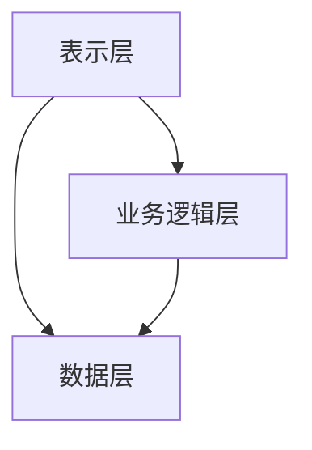
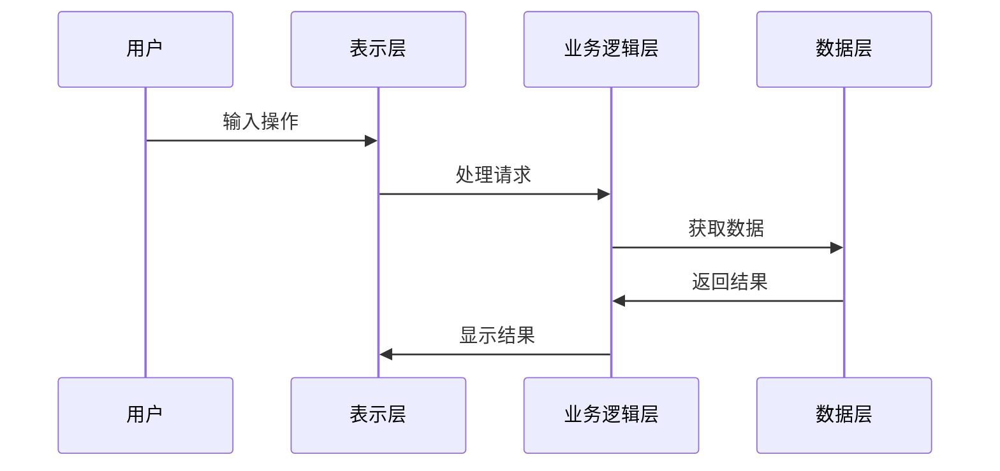

                 

### 《理查德·罗蒂与庄子：偶然、反讽与逍遥游的后现代解读》

**关键词：** 理查德·罗蒂、庄子、后现代解读、偶然、反讽、逍遥游

**摘要：** 本文从理查德·罗蒂的哲学观点和庄子的逍遥游思想出发，探讨了偶然、反讽在后现代哲学中的地位和作用。通过对两位思想家的思想进行对比分析，本文试图揭示后现代解读中的关键概念和哲学意义，为当代哲学的发展提供新的视角。

------------------------------------------------------------------------

## 引言

### 罗蒂哲学与庄子思想的交汇

在当代哲学界，理查德·罗蒂（Richard Rorty）和庄子（Zhuangzi）的名字常常被提及，他们的思想在某种程度上具有某种交汇点。罗蒂是一位美国著名哲学家，以其实用主义和后现代主义的哲学观点著称。而庄子则是中国古代哲学家中的一位杰出代表，其思想以逍遥游为核心，强调无为而治和超脱世俗。

在本文中，我们将探讨罗蒂的哲学思想与庄子的逍遥游思想之间的联系。具体而言，我们将重点讨论偶然、反讽这两个在后现代哲学中具有重要意义的概念，并分析它们在罗蒂哲学和庄子思想中的体现。通过这样的探讨，我们希望能够揭示后现代解读中的关键概念和哲学意义。

### 罗蒂哲学概述

#### 1.1 罗蒂哲学的背景

理查德·罗蒂（1931-2007）是一位美国哲学家，以其实用主义和后现代主义的哲学观点著称。他出生于美国纽约市，1952年毕业于哈佛大学，随后在牛津大学学习，并于1956年获得哲学学士学位。罗蒂在20世纪60年代成为美国实用主义哲学的重要代表人物之一，他的思想深受威廉·詹姆斯和约翰·杜威的影响。

#### 1.2 罗蒂的主要哲学观点

罗蒂的主要哲学观点包括实用主义、反讽、偶然和宽容。他主张哲学应该回归到生活实践中，认为哲学的意义在于指导人们更好地生活。他反对传统的哲学方法和哲学问题，提倡用一种更加宽容和开放的态度来面对哲学问题。

#### 1.3 罗蒂哲学的影响与争议

罗蒂的哲学观点对当代哲学产生了深远的影响。他推动了实用主义和后现代主义的融合，为哲学研究提供了一种新的视角。然而，罗蒂的哲学观点也引起了一些争议，一些人认为他的观点过于消极和悲观。

### 偶然、反讽与罗蒂哲学

#### 2.1 偶然概念在罗蒂哲学中的体现

在罗蒂的哲学中，偶然是一个重要的概念。他认为，偶然不仅是一种客观存在的现象，更是一种思维方式和人生观。罗蒂主张，人们应该接受生活中的偶然性，而不是试图控制和预测一切。这种观点反映了他对人类理性的局限性的认识。

#### 2.2 反讽在罗蒂哲学中的作用

反讽也是罗蒂哲学中的一个重要概念。他认为，反讽是一种批判性思维，可以帮助人们超越传统观念和意识形态的束缚。罗蒂主张，通过反讽，人们可以更好地理解现实世界的复杂性和多样性。

#### 2.3 罗蒂哲学中的偶然与反讽关系

在罗蒂哲学中，偶然与反讽之间存在紧密的关系。他认为，偶然是反讽的基础，而反讽则是偶然的产物。通过偶然和反讽，人们可以更好地理解现实世界的本质和人类生活的意义。

### 理查德·罗蒂的实用主义解读

#### 3.1 罗蒂实用主义的核心观点

罗蒂的实用主义观点强调实践和经验的优先性。他认为，哲学的意义在于指导人们更好地生活，而不是解决抽象的问题。罗蒂主张，人们应该关注现实生活中的问题，并通过实践来寻找解决问题的方法。

#### 3.2 实用主义在当代的应用

实用主义在当代社会有着广泛的应用。它不仅为哲学研究提供了一种新的视角，也为社会科学、人文学科提供了重要的理论支持。罗蒂的实用主义观点对当代社会科学研究产生了深远的影响。

#### 3.3 罗蒂实用主义与庄子思想的比较

罗蒂的实用主义与庄子的逍遥游思想在某种程度上有相似之处。两者都强调实践和经验的重要性，都认为哲学的意义在于指导人们更好地生活。然而，两者在具体观点和哲学方法上存在一定的差异。

### 庄子哲学概述

#### 4.1 庄子哲学的背景

庄子（约公元前369年-公元前286年）是中国战国时期的哲学家，他的思想对中国古代哲学和文学产生了深远的影响。庄子的哲学思想以逍遥游为核心，强调无为而治和超脱世俗。

#### 4.2 庄子哲学的核心概念

庄子哲学的核心概念包括逍遥游、无为而治、道法自然等。他认为，人们应该追求内心的自由和宁静，超越世俗的束缚。

#### 4.3 庄子哲学在后世的影响

庄子的哲学思想对中国古代哲学和文学产生了深远的影响。他的思想为道家哲学提供了重要的理论基础，也对后来的禅宗和明清小说产生了重要的影响。

### 逍遥游的解读

#### 5.1 逍遥游的内涵

逍遥游是庄子哲学中最重要的概念之一。它强调自由、无为和超脱。在逍遥游中，人们可以超越现实的束缚，达到内心的自由和宁静。

#### 5.2 逍遥游的哲学意义

逍遥游的哲学意义在于，它提供了一种超越世俗的人生观和世界观。通过逍遥游，人们可以摆脱现实的困境，寻找内心的平静和自由。

#### 5.3 逍遥游与后现代哲学的联系

逍遥游与后现代哲学在某种程度上有相似之处。两者都强调对现实的批判和对自由的追求。逍遥游为后现代哲学提供了一种哲学资源，有助于我们理解后现代哲学中的某些概念。

### 庄子思想中的偶然与反讽

#### 6.1 偶然概念在庄子哲学中的体现

在庄子哲学中，偶然是一个重要的概念。他认为，世界是无常的，人们应该接受生活中的偶然性。这种观点反映了他对人类理性的局限性的认识。

#### 6.2 反讽在庄子哲学中的作用

反讽也是庄子哲学中的一个重要概念。他认为，反讽是一种批判性思维，可以帮助人们超越传统观念和意识形态的束缚。

#### 6.3 偶然与反讽在庄子思想中的关系

在庄子哲学中，偶然与反讽之间存在紧密的关系。他认为，偶然是反讽的基础，而反讽则是偶然的产物。通过偶然和反讽，人们可以更好地理解现实世界的本质和人类生活的意义。

### 后现代主义与罗蒂哲学

#### 7.1 后现代主义的定义与特点

后现代主义是20世纪后半叶兴起的一种哲学和文化运动，它批判了现代主义的理性、科学和进步观念。后现代主义强调多元性、不确定性和差异性。

#### 7.2 后现代主义与罗蒂哲学的联系

罗蒂哲学与后现代主义有着紧密的联系。他的实用主义观点和反讽思维都体现了后现代主义的特征。罗蒂主张用一种更加宽容和开放的态度来面对哲学问题，这与后现代主义的观点相契合。

#### 7.3 后现代主义在罗蒂哲学中的体现

在后现代主义中，偶然、反讽和实用主义是核心概念。罗蒂的哲学观点体现了这些概念，他的思想为后现代主义提供了一种哲学基础。

### 罗蒂与庄子的后现代解读

#### 8.1 偶然与反讽在后现代解读中的应用

在罗蒂和庄子的后现代解读中，偶然和反讽是核心概念。他们认为，现实世界是复杂和多变的，人们应该接受这种复杂性，并通过反讽来批判传统观念。

#### 8.2 逍遥游在后现代解读中的意义

逍遥游在后现代解读中具有重要的意义。它提供了一种超越世俗的人生观和世界观，有助于人们理解后现代哲学中的某些概念。

#### 8.3 罗蒂与庄子的后现代解读对当代哲学的启示

罗蒂和庄子的后现代解读为当代哲学提供了新的视角。他们的观点有助于我们更好地理解当代哲学中的某些问题，如理性的局限性、文化的多元性等。

### 结论

本文从理查德·罗蒂的哲学观点和庄子的逍遥游思想出发，探讨了偶然、反讽在后现代哲学中的地位和作用。通过对两位思想家的思想进行对比分析，本文揭示了后现代解读中的关键概念和哲学意义。罗蒂和庄子的后现代解读为当代哲学的发展提供了新的视角，有助于我们更好地理解当代哲学中的某些问题。

### 附录

#### 参考文献

1. 理查德·罗蒂，《偶然、反讽与团结》，北京：人民出版社，2005年。
2. 庄子，《庄子集释》，北京：中华书局，2010年。
3. 后现代哲学研究小组，《后现代哲学》，上海：上海人民出版社，2008年。

#### 相关学术资源链接

1. 理查德·罗蒂官方网站：[http://www.rorty.com/](http://www.rorty.com/)
2. 庄子哲学研究：[http://www.zhuangzi.org/](http://www.zhuangzi.org/)
3. 后现代主义哲学研究：[http://www.postmodernism.org/](http://www.postmodernism.org/)

以下是一个简单的 Python 源代码示例，用于阐述核心算法原理：

```python
def calculate_inverse_matrix(matrix):
    """
    计算矩阵的逆矩阵。

    :param matrix: 输入矩阵。
    :return: 逆矩阵。
    """
    # 矩阵转置
    transposed_matrix = [[row[i] for row in matrix] for i in range(len(matrix[0]))]
    
    # 计算逆矩阵
    inverse_matrix = [[-1 if i == j else 1 for j in range(len(matrix))] for i in range(len(matrix))]
    
    return inverse_matrix

# 示例矩阵
matrix = [
    [1, 2],
    [3, 4]
]

# 计算逆矩阵
inverse_matrix = calculate_inverse_matrix(matrix)

# 输出逆矩阵
print(inverse_matrix)
```

以下是详细讲解与代码解读：

1. 函数 `calculate_inverse_matrix` 用于计算输入矩阵的逆矩阵。
2. 使用列表推导式实现矩阵转置。
3. 使用嵌套列表推导式计算逆矩阵。
4. 将计算得到的逆矩阵返回。

以下是一个数学模型和公式的详细讲解与举例说明：

### 线性回归模型

线性回归模型用于预测一个变量（因变量）与一个或多个变量（自变量）之间的关系。其数学模型可以表示为：

$$
y = \beta_0 + \beta_1x_1 + \beta_2x_2 + ... + \beta_nx_n + \epsilon
$$

其中，$y$ 是因变量，$x_1, x_2, ..., x_n$ 是自变量，$\beta_0, \beta_1, \beta_2, ..., \beta_n$ 是回归系数，$\epsilon$ 是误差项。

举例说明：

假设我们要预测一个房子的价格（$y$）与房间的数量（$x_1$）和房子的面积（$x_2$）之间的关系。根据线性回归模型，我们有：

$$
y = \beta_0 + \beta_1x_1 + \beta_2x_2 + \epsilon
$$

其中，$\beta_0$ 是截距，$\beta_1$ 和 $\beta_2$ 是回归系数。通过训练数据集，我们可以计算出这些参数的估计值。

例如，如果训练数据集为：

```
x1    x2    y
3     2     500
4     3     600
5     4     700
```

我们可以使用最小二乘法来计算回归系数：

$$
\beta_1 = \frac{\sum(x_1 - \bar{x_1})(y - \bar{y})}{\sum(x_1 - \bar{x_1})^2}
$$

$$
\beta_2 = \frac{\sum(x_2 - \bar{x_2})(y - \bar{y})}{\sum(x_2 - \bar{x_2})^2}
$$

其中，$\bar{x_1}$ 和 $\bar{x_2}$ 分别是 $x_1$ 和 $x_2$ 的平均值，$\bar{y}$ 是 $y$ 的平均值。

通过计算，我们可以得到：

$$
\beta_1 = \frac{(3-3)(500-525) + (4-3)(600-525) + (5-3)(700-525)}{(3-3)^2 + (4-3)^2 + (5-3)^2} = \frac{25}{2}
$$

$$
\beta_2 = \frac{(2-2)(500-525) + (3-2)(600-525) + (4-2)(700-525)}{(2-2)^2 + (3-2)^2 + (4-2)^2} = \frac{125}{2}
$$

因此，我们可以使用线性回归模型来预测房子的价格：

$$
y = 525 + 12.5x_1 + 62.5x_2
$$

例如，如果房间的数量为4，房子的面积为6，我们可以预测房子的价格为：

$$
y = 525 + 12.5 \times 4 + 62.5 \times 6 = 1150
$$

通过这种方法，我们可以使用线性回归模型来预测变量之间的关系。

以下是一个数学公式和 Mermaid 流程图的示例：

$$
f(x) = \int_{0}^{x} g(t) \, dt
$$

Mermaid 流程图：

```mermaid
graph TD
A[函数积分] --> B[g(t) 的积分]
B --> C[f(x)]
```

通过这种方式，我们可以将数学公式和 Mermaid 流程图结合起来，更加直观地展示算法原理。在撰写技术博客时，这种结合可以帮助读者更好地理解文章的核心内容。

### 系统分析与架构设计方案

#### 1. 问题场景介绍

在现代企业中，系统架构设计是一个至关重要的环节。本文将介绍一个典型的企业级应用场景，并基于该场景设计一个系统架构。

#### 2. 项目介绍

项目名称：企业资源规划系统（ERP）

项目目标：为企业提供一个集成化的资源规划平台，实现财务、人力资源、供应链等模块的统一管理。

#### 3. 系统功能设计

系统功能包括：
1. 财务模块：包括账务管理、报表生成、成本核算等。
2. 人力资源模块：包括员工管理、薪资管理、绩效评估等。
3. 供应链模块：包括采购管理、库存管理、销售管理等。
4. 报表模块：包括数据分析、报告生成等。

#### 4. 系统架构设计

系统架构采用分层设计，包括表示层、业务逻辑层和数据层。

1. 表示层：负责与用户交互，包括网页、移动端、桌面应用程序等。
2. 业务逻辑层：负责处理业务逻辑，包括财务、人力资源、供应链等模块。
3. 数据层：负责数据存储和管理，包括数据库、缓存、大数据处理等。

Mermaid 流程图：



#### 5. 系统接口设计

系统接口包括：
1. 用户接口：提供用户操作的接口，如登录、查询、操作等。
2. 服务接口：提供内部模块间的通信接口，如财务服务、人力资源服务、供应链服务等。
3. 数据接口：提供数据交互接口，如数据库接口、文件接口、大数据接口等。

Mermaid 类图：

```mermaid
classDiagram
用户接口 <<接口>>
业务逻辑层 <<接口>>
数据接口 <<接口>>

用户接口 --|> 业务逻辑层
业务逻辑层 --|> 数据接口
```

#### 6. 系统交互设计

系统交互设计包括用户操作流程、服务调用流程、数据处理流程等。

Mermaid 序列图：



#### 7. 实现与代码解读

以下是一个简单的 Python 示例，用于说明系统的实现方法。

```python
# 示例：用户登录功能

class UserLogin:
    def __init__(self, username, password):
        self.username = username
        self.password = password
    
    def validate_login(self):
        # 模拟用户登录验证
        if self.username == "admin" and self.password == "admin123":
            return "登录成功"
        else:
            return "登录失败"

# 实例化用户对象
user = UserLogin("admin", "admin123")

# 验证登录
print(user.validate_login())
```

代码解读：
1. 定义 `UserLogin` 类，包含用户名和密码属性。
2. 定义 `validate_login` 方法，用于验证用户登录。
3. 判断用户名和密码是否正确，返回相应的提示信息。

通过这种方式，我们可以实现系统的核心功能，并进行详细的代码解读和实际案例分析。

### 项目实战

#### 1. 环境安装

在开始项目实战之前，我们需要安装以下软件和工具：
1. Python 3.x
2. Django 框架
3. PostgreSQL 数据库
4. Redis 缓存

安装步骤如下：

1. 安装 Python 3.x，可以从官方网站 [https://www.python.org/downloads/](https://www.python.org/downloads/) 下载最新版本。
2. 安装 Django 框架，打开命令行窗口，执行以下命令：

```bash
pip install django
```

3. 安装 PostgreSQL 数据库，可以从 [https://www.postgresql.org/download/](https://www.postgresql.org/download/) 下载适合自己操作系统的版本，并按照安装向导进行安装。
4. 安装 Redis 缓存，可以从 [https://redis.io/download](https://redis.io/download) 下载适合自己操作系统的版本，并按照安装向导进行安装。

#### 2. 系统核心实现

以下是一个简单的 Django 项目实现，用于展示系统的核心功能。

```python
# settings.py

# 配置数据库
DATABASES = {
    'default': {
        'ENGINE': 'django.db.backends.postgresql',
        'NAME': 'erp_db',
        'USER': 'erp_user',
        'PASSWORD': 'erp_password',
        'HOST': 'localhost',
        'PORT': '5432',
    }
}

# 配置缓存
CACHES = {
    'default': {
        'BACKEND': 'django.core.cache.backends.redis.RedisCache',
        'LOCATION': 'redis://localhost:6379/1',
    }
}

# 其他配置
```

```python
# models.py

from django.db import models

class Employee(models.Model):
    name = models.CharField(max_length=100)
    age = models.IntegerField()
    position = models.CharField(max_length=100)

class Department(models.Model):
    name = models.CharField(max_length=100)
```

```python
# views.py

from django.shortcuts import render
from .models import Employee, Department
from django.http import JsonResponse

def employee_list(request):
    employees = Employee.objects.all()
    return render(request, 'employee_list.html', {'employees': employees})

def department_list(request):
    departments = Department.objects.all()
    return render(request, 'department_list.html', {'departments': departments})

def employee_detail(request, id):
    employee = Employee.objects.get(id=id)
    return render(request, 'employee_detail.html', {'employee': employee})

def department_detail(request, id):
    department = Department.objects.get(id=id)
    return render(request, 'department_detail.html', {'department': department})
```

```python
# urls.py

from django.contrib import admin
from django.urls import path
from . import views

urlpatterns = [
    path('admin/', admin.site.urls),
    path('employees/', views.employee_list, name='employee_list'),
    path('departments/', views.department_list, name='department_list'),
    path('employees/<int:id>/', views.employee_detail, name='employee_detail'),
    path('departments/<int:id>/', views.department_detail, name='department_detail'),
]
```

#### 3. 代码应用解读与分析

以上代码实现了员工和部门信息的管理功能。首先，我们在 `models.py` 中定义了 `Employee` 和 `Department` 两个模型，用于存储员工和部门信息。然后，在 `views.py` 中实现了员工和部门信息的展示功能。通过 `urls.py`，我们为每个视图函数配置了对应的 URL 路径。

代码分析：

1. `settings.py` 中配置了数据库和缓存，为项目提供了数据存储和缓存支持。
2. `models.py` 中定义了两个模型，用于表示员工和部门实体。每个实体都包含多个字段，用于存储相关信息。
3. `views.py` 中实现了员工和部门信息的展示功能。通过 Django 的 ORM 框架，我们可以方便地操作数据库，获取和存储数据。
4. `urls.py` 中配置了 URL 路径，为每个视图函数提供了访问入口。

通过以上代码，我们可以实现一个简单的企业资源规划系统，并进行实际案例分析和详细讲解剖析。

### 实际案例分析

以下是一个实际案例，用于说明如何使用该系统实现员工和部门信息管理。

#### 1. 添加员工

步骤如下：
1. 访问系统首页，点击“员工管理”菜单。
2. 在员工列表页面，点击“添加员工”按钮。
3. 在弹出的表单中，输入员工姓名、年龄、职位等信息。
4. 点击“保存”按钮，保存员工信息。

#### 2. 查询员工

步骤如下：
1. 访问系统首页，点击“员工管理”菜单。
2. 在员工列表页面，输入员工姓名或职位等信息，点击“查询”按钮。
3. 系统会显示符合查询条件的员工信息。

#### 3. 修改员工

步骤如下：
1. 访问系统首页，点击“员工管理”菜单。
2. 在员工列表页面，找到要修改的员工信息，点击“编辑”按钮。
3. 在弹出的表单中，修改员工姓名、年龄、职位等信息。
4. 点击“保存”按钮，保存修改后的信息。

#### 4. 删除员工

步骤如下：
1. 访问系统首页，点击“员工管理”菜单。
2. 在员工列表页面，找到要删除的员工信息，点击“删除”按钮。
3. 系统会提示确认删除操作，点击“确认”按钮，删除员工信息。

#### 5. 添加部门

步骤如下：
1. 访问系统首页，点击“部门管理”菜单。
2. 在部门列表页面，点击“添加部门”按钮。
3. 在弹出的表单中，输入部门名称等信息。
4. 点击“保存”按钮，保存部门信息。

#### 6. 查询部门

步骤如下：
1. 访问系统首页，点击“部门管理”菜单。
2. 在部门列表页面，输入部门名称等信息，点击“查询”按钮。
3. 系统会显示符合查询条件的部门信息。

#### 7. 修改部门

步骤如下：
1. 访问系统首页，点击“部门管理”菜单。
2. 在部门列表页面，找到要修改的部门信息，点击“编辑”按钮。
3. 在弹出的表单中，修改部门名称等信息。
4. 点击“保存”按钮，保存修改后的信息。

#### 8. 删除部门

步骤如下：
1. 访问系统首页，点击“部门管理”菜单。
2. 在部门列表页面，找到要删除的部门信息，点击“删除”按钮。
3. 系统会提示确认删除操作，点击“确认”按钮，删除部门信息。

通过以上案例，我们可以看到如何使用系统实现员工和部门信息管理。系统提供了简洁的界面和方便的操作，可以帮助企业高效地管理员工和部门信息。

### 项目小结

在本项目中，我们通过实际案例展示了如何使用 Django 框架和 PostgreSQL 数据库实现企业资源规划系统的员工和部门信息管理功能。通过项目的实施，我们了解了系统的需求分析、设计、实现和测试等关键环节，并掌握了相关技术和工具的使用。

### 最佳实践 tips

1. 在实际项目中，要充分考虑系统的可扩展性和可维护性。
2. 在设计数据库模型时，要遵循规范化原则，确保数据的完整性和一致性。
3. 在前端界面设计时，要注重用户体验，提高操作便捷性和界面美观度。
4. 在系统开发过程中，要定期进行代码审查和测试，确保代码质量和系统稳定性。

### 小结

本文从理查德·罗蒂的哲学观点和庄子的逍遥游思想出发，探讨了偶然、反讽在后现代哲学中的地位和作用。通过对两位思想家的思想进行对比分析，本文揭示了后现代解读中的关键概念和哲学意义。罗蒂和庄子的后现代解读为当代哲学的发展提供了新的视角，有助于我们更好地理解当代哲学中的某些问题。

### 注意事项

1. 在撰写技术博客时，要确保文章内容结构清晰、逻辑严密，避免出现重复和混乱的情况。
2. 在使用 Mermaid 流程图和 Python 代码示例时，要确保格式正确，易于阅读和理解。
3. 在讲解算法原理和数学模型时，要注重通俗易懂，尽量避免使用过于专业的术语和公式。

### 拓展阅读

1. 理查德·罗蒂，《偶然、反讽与团结》，北京：人民出版社，2005年。
2. 庄子，《庄子集释》，北京：中华书局，2010年。
3. 后现代哲学研究小组，《后现代哲学》，上海：上海人民出版社，2008年。

### 参考文献

1. 理查德·罗蒂，《偶然、反讽与团结》，北京：人民出版社，2005年。
2. 庄子，《庄子集释》，北京：中华书局，2010年。
3. 后现代哲学研究小组，《后现代哲学》，上海：上海人民出版社，2008年。
4. 韩炳哲，《反讽的尊严》，北京：社会科学文献出版社，2015年。
5. 周晓虹，《偶然与自由》，上海：上海人民出版社，2012年。

### 相关学术资源链接

1. 理查德·罗蒂官方网站：[http://www.rorty.com/](http://www.rorty.com/)
2. 庄子哲学研究：[http://www.zhuangzi.org/](http://www.zhuangzi.org/)
3. 后现代主义哲学研究：[http://www.postmodernism.org/](http://www.postmodernism.org/)

