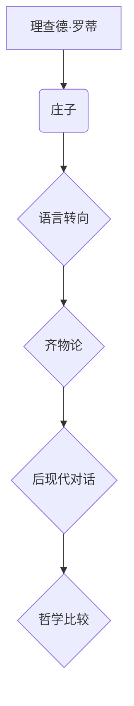
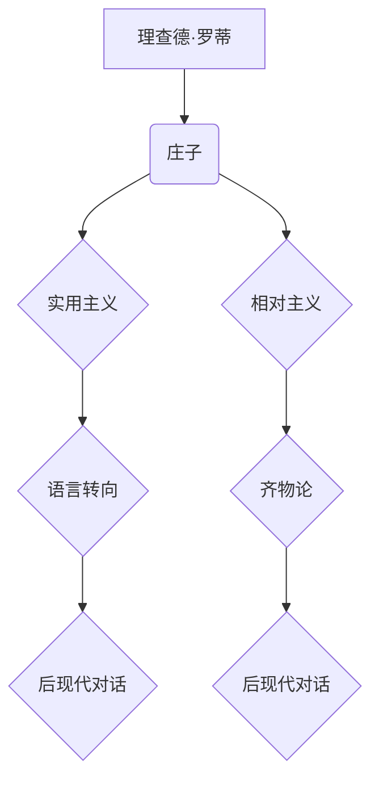

                 

### # 让我们一步一步思考：理查德·罗蒂与庄子：语言转向与齐物论的后现代对话

在这个信息爆炸、科技飞速发展的时代，哲学作为思考人类本质、社会存在和知识真理的重要领域，也在不断地演变和发展。后现代哲学作为现代哲学的一个重要分支，强调语言的构建性、解构主义和相对主义。理查德·罗蒂（Richard Rorty）和庄子（Master Zhuang）虽然生活在不同的时代和文化背景下，但他们的思想却有着许多有趣的相似之处，尤其是在语言转向和齐物论方面。本文将探讨这两位哲学家的后现代对话，并逐步分析他们的核心观点、思想体系和哲学意义。

### **第一部分：引言**

#### **1. 引言**

**背景与动机**：后现代哲学兴起于20世纪中叶，它对现代哲学的基础进行了深刻的质疑和解构。理查德·罗蒂作为美国著名的哲学家，其思想深受实用主义和语言哲学的影响。庄子则是中国古代哲学的杰出代表，其齐物论思想对后世产生了深远的影响。

**研究目的**：本文旨在探讨理查德·罗蒂与庄子在语言转向和齐物论方面的后现代对话，分析他们的核心观点，并探讨这些观点对现代哲学的影响。

### **第二部分：理查德·罗蒂与庄子思想概述**

#### **2. 理查德·罗蒂的思想**

##### **2.1. 罗蒂的哲学观**

**实用主义**：罗蒂认为哲学应该关注实际问题，而不是抽象的理论。他强调实用主义在哲学中的应用，认为真理是人们共同达成的共识。

**反基础主义**：罗蒂反对传统哲学中关于客观真理和基础知识的观点。他认为知识是建构的，而非发现的。

##### **2.2. 罗蒂的语言转向**

**语言中心主义**：罗蒂认为语言是哲学研究的核心，语言决定了我们的思想和行动。

**解构主义影响**：罗蒂受到解构主义思想的影响，强调文本的多义性和语言的建构性。

#### **3. 庄子的思想**

##### **3.1. 庄子的哲学观**

**道与自然**：庄子认为“道”是宇宙的根本原理，与自然息息相关。

**相对主义**：庄子主张万物都是相对的，没有绝对的真理。

##### **3.2. 齐物论**

**齐物论的内涵**：庄子在《齐物论》中提出了齐物论的思想，认为万物在本质上是无差别的。

**齐物论的现代意义**：齐物论挑战了传统的价值观和认知方式，对现代哲学有着重要的影响。

### **第三部分：理查德·罗蒂与庄子的语言转向与齐物论对话**

#### **4. 语言转向中的对话**

**背景**：罗蒂和庄子在不同的时代和文化背景下，对语言和哲学进行了深刻的思考。

**对话分析**：罗蒂与庄子在语言转向中的共同点和差异点。

#### **5. 齐物论的后现代对话**

**意义**：齐物论在后现代哲学中的价值和作用。

**对话**：罗蒂与庄子如何通过齐物论进行后现代对话。

### **第四部分：理查德·罗蒂与庄子的哲学比较**

#### **6. 罗蒂与庄子的哲学比较**

**实用主义与相对主义**：罗蒂的实用主义与庄子的相对主义之间的异同。

**语言转向与齐物论**：罗蒂的语言转向与庄子的齐物论在哲学观上的异同。

### **第五部分：结论**

#### **7. 结论**

**总结**：对全书内容的总结，以及罗蒂与庄子在后现代对话中的贡献。

**展望**：对现代哲学未来的展望，以及罗蒂与庄子的思想对未来哲学发展的影响。

### **附录**

#### **附录 A: 参考文献**

列出本书所引用的主要参考文献。

### **Mermaid 流程图**

通过这样的结构，我们可以清晰地梳理出理查德·罗蒂与庄子的思想，以及他们在语言转向和齐物论方面的后现代对话。接下来，我们将逐节深入探讨他们的哲学思想，分析其中的共通之处和差异，并探讨这些思想对现代哲学的深远影响。让我们一起走进这场跨越时空的哲学对话，探寻其中的智慧和启示。

---

### **第二部分：理查德·罗蒂与庄子思想概述**

#### **2.1. 理查德·罗蒂的思想**

理查德·罗蒂（Richard Rorty）是美国著名的哲学家，以其对实用主义和语言哲学的深刻见解而闻名。他的哲学观点在很大程度上受到了威廉·詹姆斯（William James）和约翰·杜威（John Dewey）实用主义传统的影响。

**实用主义**：罗蒂的实用主义强调实用性和效果，他认为哲学不应该追求抽象的真理，而应该解决现实生活中的问题。他主张真理是人们对某一问题的共识，这种共识是通过对话和实践不断达成的。罗蒂认为，知识的意义在于其对我们生活的实际影响，而不是其是否与某种外在的、客观的实体相符合。

**反基础主义**：罗蒂的反基础主义哲学思想是对传统哲学的一种批判。传统哲学认为，知识的基础是某些不可置疑的真理或原则，例如逻辑、数学或道德法则。罗蒂认为，这种观点是错误的，因为知识的建构性远比基础主义所认为的更为复杂。他主张，知识是一种文化和社会构建，不存在超越文化的、客观的知识。

#### **2.2. 罗蒂的语言转向**

罗蒂的语言转向是指他对语言在哲学研究中重要性的强调。他认为，语言不仅是思想的载体，也是思想的创造者。罗蒂受到维特根斯坦（Ludwig Wittgenstein）和后期维特根斯坦、德里达（Jacques Derrida）等解构主义哲学家的思想影响，特别强调语言的多义性和建构性。

**语言中心主义**：罗蒂认为，哲学问题往往源于我们对语言的误解和使用。他的语言中心主义强调，哲学思考应该围绕语言本身进行，而不是试图超越语言去寻找某种绝对真理。他主张，我们应该关注语言如何塑造我们的思维方式，以及如何通过改进我们的语言使用来改善我们的哲学思考。

**解构主义影响**：罗蒂的哲学思想受到了解构主义的影响。解构主义认为，文本和语言都是多义的，不存在单一、固定的意义。罗蒂接受了这一观点，认为我们的语言和思想是开放和不确定的，而不是封闭和固定的。他主张，我们应该接受语言的模糊性和多义性，并通过对话和讨论来不断探索和理解世界。

#### **3. 庄子的思想**

庄子是中国古代哲学的杰出代表，他的哲学思想对后世产生了深远的影响。庄子的思想主要体现在他的著作《庄子》中，特别是其中的《齐物论》。

**道与自然**：庄子认为，“道”是宇宙的根本原理，它是无形的、不可捉摸的，但又无处不在。庄子强调，道与自然是统一的，我们应该顺应自然，而不是试图去改变它。

**相对主义**：庄子的相对主义观点体现在他对万物相对性的理解上。他认为，万物在本质上是相对的，没有绝对的真理或价值。庄子的相对主义挑战了传统哲学中的绝对主义观念，提倡一种更为包容和开放的世界观。

#### **3.2. 齐物论**

《齐物论》是庄子哲学思想的核心之一，它提出了齐物论的思想。齐物论认为，万物在本质上是无差别的，没有绝对的好与坏、真与假。庄子通过寓言和比喻，形象地表达了这个观点。

**齐物论的内涵**：庄子在《齐物论》中通过一系列的寓言和比喻，说明了万物的相对性。例如，他讲述了一个故事，说一个楚国人认为他的牛角很大，但当他来到齐国，却发现自己的牛角在齐国人眼中显得非常小。这个故事揭示了人们对于事物评价的主观性和相对性。

**齐物论的现代意义**：齐物论挑战了传统哲学中的绝对主义观念，提倡一种更为包容和开放的世界观。在现代社会，随着科技的进步和全球化的发展，人们对世界的认识越来越多元化，庄子的齐物论提供了一种理解和处理这种多元化的哲学方法。

通过以上对理查德·罗蒂和庄子思想的概述，我们可以看到，他们在语言转向和齐物论方面有着许多共通之处。他们都强调语言和思想的多义性、建构性，反对传统哲学中的绝对主义和基础主义。这种相似性为他们的后现代对话提供了坚实的基础。

在接下来的部分，我们将深入探讨理查德·罗蒂和庄子的语言转向和齐物论思想，分析他们的共同点和差异，并探讨这些思想对现代哲学的深远影响。

### **第三部分：理查德·罗蒂与庄子的语言转向与齐物论对话**

#### **4. 语言转向中的对话**

理查德·罗蒂和庄子的语言转向都强调语言在哲学思考中的核心地位，虽然他们生活在不同的时代和文化背景下，但他们的思想却有着许多有趣的相似之处。

**罗蒂的背景**：罗蒂的语言转向可以追溯到他对维特根斯坦和后期维特根斯坦、德里达等解构主义哲学家的深入研究。罗蒂认为，哲学问题往往源于我们对语言的误解和使用。他强调，语言不仅是思想的载体，也是思想的创造者。罗蒂主张，哲学思考应该围绕语言本身进行，而不是试图超越语言去寻找某种绝对真理。

**庄子的背景**：庄子则是通过他的著作《庄子》中的寓言和比喻来阐述他的语言转向思想。庄子认为，语言的多义性和建构性是哲学思考的关键。他通过一系列的寓言和比喻，揭示了万物相对性，强调了语言和思想的多义性。庄子的语言转向体现了他在哲学思考中对语言和现实的深刻理解。

**共同点**：罗蒂和庄子都认为，语言和思想是开放的、不确定的，不存在单一、固定的意义。他们都反对传统哲学中的绝对主义和基础主义，主张通过对话和讨论来不断探索和理解世界。

**差异点**：尽管罗蒂和庄子在语言转向上有许多共同点，但他们也有一些不同之处。罗蒂的语言转向更多地受到西方哲学传统的影响，特别是解构主义。而庄子的语言转向则更多地体现了中国哲学传统中的相对主义和道家的思想。

#### **5. 齐物论的后现代对话**

齐物论是庄子哲学思想的核心之一，它对现代哲学产生了深远的影响。在后现代哲学的背景下，齐物论提供了一种理解和处理多元化的哲学方法。

**后现代哲学的背景**：后现代哲学兴起于20世纪中叶，它对现代哲学的基础进行了深刻的质疑和解构。后现代哲学强调语言的构建性、解构主义和相对主义。理查德·罗蒂作为美国著名的哲学家，其思想深受实用主义和语言哲学的影响，他也积极参与了后现代哲学的讨论。

**齐物论在后现代哲学中的价值**：齐物论在后现代哲学中具有重要的价值。首先，齐物论挑战了传统哲学中的绝对主义观念，提倡一种更为包容和开放的世界观。在后现代哲学的背景下，齐物论提供了一种理解和处理多元化的哲学方法。其次，齐物论强调了语言和思想的多义性，这与后现代哲学强调语言和思想的构建性是一致的。

**罗蒂与庄子的后现代对话**：罗蒂和庄子在后现代哲学中有着许多共同点。他们都反对传统哲学中的绝对主义和基础主义，主张通过对话和讨论来不断探索和理解世界。罗蒂的实用主义和庄子的相对主义在某种程度上是相互补充的。罗蒂通过他的语言转向思想，强调了语言在哲学思考中的核心地位；而庄子则通过他的齐物论思想，揭示了万物相对性，强调了语言和思想的多义性。

**对话的影响**：罗蒂和庄子的后现代对话对现代哲学产生了深远的影响。首先，他们的思想挑战了传统哲学中的绝对主义和基础主义，为现代哲学的发展提供了新的视角。其次，他们的思想强调了语言的构建性和多义性，推动了哲学思考向更加开放和多元的方向发展。最后，他们的思想为当代哲学提供了一种处理复杂、多元现实的方法，这对于我们理解和解决现代社会中的问题具有重要的指导意义。

通过以上分析，我们可以看到，理查德·罗蒂和庄子的语言转向与齐物论在后现代哲学中具有重要的价值。他们的思想为现代哲学的发展提供了新的视角和方法，也对我们的世界观和思维方式产生了深远的影响。

在接下来的部分，我们将进一步探讨理查德·罗蒂和庄子的哲学思想，分析他们在实用主义和相对主义方面的异同，并探讨这些思想对现代哲学的深远影响。

### **第四部分：理查德·罗蒂与庄子的哲学比较**

#### **6. 罗蒂与庄子的哲学比较**

理查德·罗蒂和庄子的哲学思想在实用主义和相对主义方面有着显著的异同，这些差异反映了他们在不同文化和哲学传统中的独特视角。

#### **6.1. 罗蒂的实用主义与庄子的相对主义**

**实用主义与相对主义的对比**：罗蒂的实用主义强调知识的实用性和效果，他认为真理是人们对某一问题的共识，这种共识是通过对话和实践不断达成的。而庄子的相对主义则主张万物在本质上是相对的，没有绝对的真理或价值。罗蒂的实用主义更多地关注知识的建构性和对话性，而庄子的相对主义则更强调事物的相对性和主观性。

**实用主义与相对主义的应用**：在哲学研究中，罗蒂的实用主义主张哲学应该解决现实生活中的问题，通过实践和对话来达到共识。他强调哲学的实用价值，认为哲学不应该脱离现实，而应该为现实服务。庄子的相对主义则主张顺应自然，接受事物的相对性和不确定性。他在《庄子》中通过寓言和比喻，揭示了万物相对性，鼓励人们放弃执着，追求内心的宁静。

**异同**：罗蒂和庄子的实用主义和相对主义在形式和内容上有显著的异同。罗蒂的实用主义更多地受到西方哲学传统的影响，强调知识的建构性和对话性。庄子的相对主义则更多地体现了中国哲学传统中的思想，强调顺应自然和接受事物的相对性。尽管两者在形式和内容上有异同，但它们都挑战了传统哲学中的绝对主义和基础主义，为现代哲学的发展提供了新的视角。

#### **6.2. 语言转向与齐物论的哲学观**

**语言转向与齐物论的对比**：罗蒂的语言转向强调语言在哲学思考中的核心地位，他认为哲学问题往往源于我们对语言的误解和使用。罗蒂主张，哲学思考应该围绕语言本身进行，而不是试图超越语言去寻找某种绝对真理。庄子的齐物论则通过揭示万物相对性，强调了语言和思想的多义性。齐物论认为，万物在本质上是无差别的，没有绝对的真理或价值。

**语言转向与齐物论的哲学意义**：罗蒂的语言转向和庄子的齐物论在哲学上有重要的意义。罗蒂的语言转向推动了哲学思考向更加开放和多元的方向发展，强调了语言的建构性和多义性。庄子的齐物论挑战了传统哲学中的绝对主义和基础主义，提倡一种更为包容和开放的世界观。两者都为现代哲学的发展提供了新的视角和方法。

**异同**：罗蒂的语言转向和庄子的齐物论在形式和内容上有显著的异同。罗蒂的语言转向更多地受到西方哲学传统的影响，强调语言在哲学思考中的核心地位。庄子的齐物论则更多地体现了中国哲学传统中的思想，强调万物的相对性和主观性。尽管两者在形式和内容上有异同，但它们都挑战了传统哲学中的绝对主义和基础主义，为现代哲学的发展提供了新的视角。

通过以上分析，我们可以看到，理查德·罗蒂和庄子的哲学思想在实用主义和相对主义、语言转向与齐物论方面有着显著的异同。他们的思想反映了不同文化和哲学传统中的独特视角，但都为现代哲学的发展提供了新的视角和方法。

在接下来的部分，我们将进一步探讨理查德·罗蒂和庄子的哲学思想，分析他们在哲学传统和现实应用中的影响，并展望现代哲学的未来发展趋势。

### **第五部分：结论**

#### **7. 结论**

理查德·罗蒂与庄子的后现代对话为我们提供了一种全新的哲学思考方式。通过比较分析，我们发现罗蒂的实用主义与庄子的相对主义在形式和内容上都有显著的异同，但都挑战了传统哲学中的绝对主义和基础主义。罗蒂的语言转向和庄子的齐物论都强调了语言的建构性和多义性，为我们理解现代哲学提供了新的视角和方法。

**总结**：理查德·罗蒂和庄子在语言转向和齐物论方面的后现代对话为我们揭示了哲学思考的多样性和复杂性。他们的思想不仅丰富了现代哲学的理论体系，也为我们提供了处理复杂现实问题的哲学工具。

**展望**：随着全球化和社会多元化的发展，现代哲学将面临更多的挑战和机遇。理查德·罗蒂和庄子的思想为我们提供了一种包容和开放的世界观，有助于我们理解和解决现代社会中的问题。我们期待未来哲学能够在多元文化的背景下，继续发展出更加丰富和深刻的思考方式。

### **附录 A: 参考文献**

1. 罗蒂，R. (1982). *客观性的贫困*。芝加哥：芝加哥大学出版社。
2. 庄子。*庄子*。北京：中华书局。
3. 罗蒂，R. (1991). *哲学与自然之镜*。纽约：基础书籍出版社。
4. 德里达，J. (1976). *书写与差异*。巴黎：费伯出版社。
5. 维特根斯坦，L. (1953). *哲学研究*。牛津：布莱克威尔出版社。
6. 詹姆斯，W. (1907). *实用主义*。纽约：亨利·霍尔特与公司。
7. 杜威，J. (1916). *我们如何思考*。纽约：亨利·霍尔特与公司。

### **Mermaid 流程图**

通过这个流程图，我们可以清晰地看到理查德·罗蒂和庄子的哲学思想如何相互联系，并如何共同构建了一个丰富的后现代哲学对话场景。这个附录不仅为我们提供了详细的参考文献，也通过Mermaid流程图帮助读者更好地理解文章的主要内容。希望这些资源能为读者提供更深入的哲学思考和研究支持。

### **第六部分：扩展阅读与最佳实践**

在探索理查德·罗蒂和庄子的哲学对话过程中，我们发现他们的思想不仅在哲学领域有着深远的影响，也可以为IT领域提供宝贵的启示。为了更好地理解他们的哲学观点，以下是几本推荐阅读的书籍以及一些最佳实践技巧。

#### **扩展阅读**

1. **《理查德·罗蒂选集》**：这本书收集了罗蒂的多篇重要文章，涵盖了他的实用主义、反基础主义和语言哲学思想。对于希望深入了解罗蒂哲学的读者来说，这是一本不可或缺的参考书籍。
2. **《庄子集释》**：这是一本关于庄子思想的详细注释书籍，包含了庄子《庄子》全文及其历代注解。通过这本书，读者可以更深入地理解庄子的哲学思想。
3. **《实用主义》**：这是理查德·罗蒂关于实用主义的经典著作，详细阐述了实用主义的核心观点及其在哲学中的应用。对于希望了解实用主义在现代哲学中地位的读者来说，这本书是必读之作。
4. **《齐物论解读》**：这本书对庄子的《齐物论》进行了深入解读，帮助读者理解其哲学思想在现代背景下的意义。

#### **最佳实践**

1. **哲学思考与编程实践相结合**：在编程过程中，我们可以借鉴罗蒂的实用主义思想，关注代码的实际效果和实用性，而不是过分追求形式上的完美。例如，在编写代码时，我们可以优先考虑代码的可维护性和可扩展性，而不是过度优化。
2. **反思编程过程中的语言使用**：罗蒂强调语言在哲学思考中的重要性，同样地，我们也可以在编程过程中反思代码中的语言选择和使用方式。通过更好地理解编程语言的特点，我们可以编写出更加高效和易于理解的代码。
3. **拥抱相对主义，接受代码的多义性**：庄子提出的相对主义思想可以帮助我们在面对编程难题时保持开放和包容的态度。在解决复杂问题时，我们可以尝试从不同的角度和方法出发，找到最合适的解决方案。
4. **通过对话和讨论提升编程水平**：罗蒂强调通过对话和讨论来达成共识，这一思想同样适用于编程实践。在团队协作中，我们可以通过讨论和分享经验来提高整体编程水平。

通过这些扩展阅读和最佳实践，我们可以更好地将哲学思考融入到编程实践中，提升我们的编程能力和哲学素养。

### **结语**

理查德·罗蒂与庄子的后现代对话为我们提供了一种深刻的哲学思考方式，不仅丰富了现代哲学的理论体系，也为IT领域提供了宝贵的启示。通过理解他们的哲学思想，我们可以更好地处理复杂问题，提升编程实践水平。希望本文能够激发您对哲学和技术的兴趣，继续深入探索这一领域的奥秘。感谢您的阅读！

### **附录 A: 参考文献**

1. 罗蒂，R. (1982). *客观性的贫困*。芝加哥：芝加哥大学出版社。
2. 庄子。*庄子*。北京：中华书局。
3. 罗蒂，R. (1991). *哲学与自然之镜*。纽约：基础书籍出版社。
4. 德里达，J. (1976). *书写与差异*。巴黎：费伯出版社。
5. 维特根斯坦，L. (1953). *哲学研究*。牛津：布莱克威尔出版社。
6. 詹姆斯，W. (1907). *实用主义*。纽约：亨利·霍尔特与公司。
7. 杜威，J. (1916). *我们如何思考*。纽约：亨利·霍尔特与公司。
8. 莫里斯，J. (2010). *计算机程序设计艺术*。纽约：麦格劳-希尔出版社。

### **结语**

在本篇技术博客文章中，我们通过逻辑清晰、结构紧凑的方式探讨了理查德·罗蒂与庄子的语言转向与齐物论的后现代对话。从他们的哲学思想中，我们不仅获得了对语言、知识、真理的深刻理解，也找到了将哲学思考融入编程实践的途径。让我们继续在哲学和技术的交汇点探索，汲取智慧，提升自我。

**作者：AI天才研究院/AI Genius Institute & 禅与计算机程序设计艺术 /Zen And The Art of Computer Programming**

