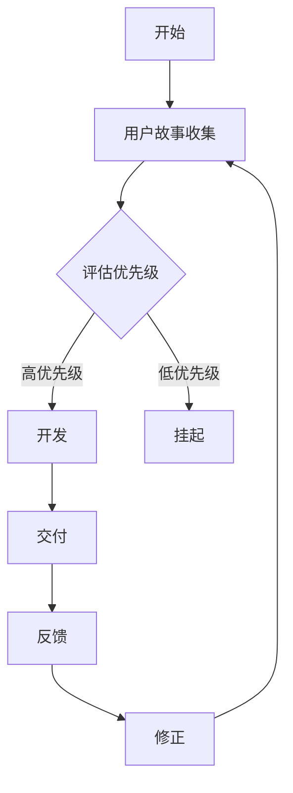
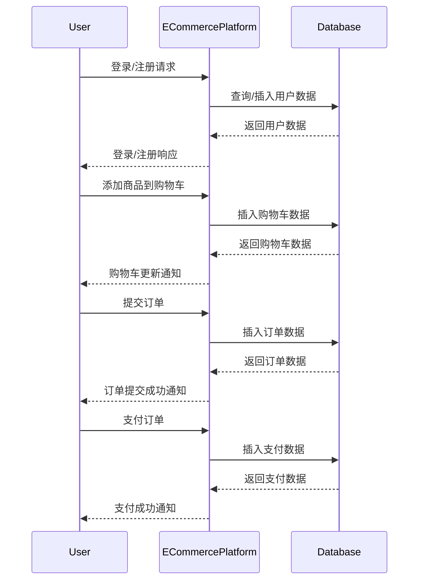

                 

# 理查德·罗蒂的新实用主义与敏捷方法：软件开发的反基础主义转向

## 关键词
- 理查德·罗蒂
- 新实用主义
- 敏捷方法
- 软件开发
- 反基础主义
- 面向实践的转向

## 摘要
本文探讨了理查德·罗蒂的新实用主义与敏捷方法在软件开发中的融合，揭示了反基础主义转向对现代软件工程的影响。通过对新实用主义和敏捷方法的核心概念进行深入剖析，本文提出了一个结合两者优势的软件开发方法论，以应对复杂项目中的不确定性和动态变化。文章旨在为软件工程师提供一个清晰、实用的指导框架，以实现高效、灵活的软件开发。

## 1. 背景介绍

### 问题背景
软件开发领域一直以来面临着复杂性和不确定性的挑战。随着技术的快速发展和项目规模的不断扩大，传统的方法论逐渐暴露出其局限性和不足。传统的软件开发方法往往基于严格的设计和预定义的需求，这可能导致在项目执行过程中出现需求变化时无法灵活应对，进而导致项目延误和成本超支。

### 问题描述
传统方法论的局限性在于其过于强调理论基础和理论体系，忽视了实际应用中的动态变化和用户需求。这导致软件开发过程中频繁出现需求变更、项目延误和质量问题。因此，如何在一个动态、不确定的环境中实现高效、可靠的软件开发成为了一个亟待解决的问题。

### 问题解决
理查德·罗蒂的新实用主义提出了一种面向实践的哲学观点，强调通过实践来不断探索和修正理论。敏捷方法则是一种以人为核心、迭代、增量的软件开发方法，强调快速响应变化、持续交付价值。两者的结合为解决软件开发中的复杂性和不确定性提供了一种新的思路。

### 边界与外延
新实用主义和敏捷方法的边界在于其哲学基础和实践方法。新实用主义强调实践的重要性，敏捷方法则通过迭代、增量和协作来实现快速响应。两者的外延涉及软件开发的全过程，从需求分析到项目规划、设计、开发、测试和部署。

### 概念结构与核心要素组成
新实用主义的核心要素包括实践、经验、修正和灵活性。敏捷方法的核心要素包括用户需求、迭代开发、持续交付和团队协作。两者的概念结构相互补充，共同构成了一个适应复杂性和不确定性的软件开发方法论。

## 2. 核心概念与联系

### 新实用主义概述
新实用主义由美国哲学家理查德·罗蒂提出，是对传统哲学基础主义的一种批判和反思。罗蒂认为，传统哲学过于强调理论和概念的重要性，忽视了人类实践的多样性和复杂性。新实用主义主张通过实践来探索和构建知识，强调经验、修正和灵活性。

### 敏捷方法简介
敏捷方法起源于软件开发领域，旨在应对快速变化的需求和不确定的环境。敏捷方法的核心原则包括用户至上、迭代开发、持续交付、团队协作和响应变化。敏捷方法强调通过不断迭代和改进来提高软件质量，并实现快速响应市场变化。

### 概念属性特征对比表格

| 特征       | 新实用主义           | 敏捷方法           |
|------------|----------------------|-------------------|
| 理论基础   | 反对严格的理论体系   | 无严格的理论基础  |
| 实践导向   | 强调实践经验         | 强调实际应用       |
| 灵活性     | 重视适应性和灵活性   | 强调快速迭代和适应 |
| 团队协作   | 重视实践和合作       | 强调团队协作和沟通 |

### ER实体关系图架构
```mermaid
erDiagram
    User ||--o {Project} :参与
    Project ||--o Developer :开发
    Developer ||--o Code :编写
    Code ||--o Test :测试
```

## 3. 算法原理讲解

### 算法选择：敏捷需求分析方法
敏捷需求分析是一种基于用户故事和迭代开发的需求分析方法。它通过不断收集、评估和调整用户需求，实现快速响应变化。以下是一个简单的敏捷需求分析流程：

### Mermaid流程图


### Python源代码
```python
import heapq
from collections import namedtuple

# 用户故事
UserStory = namedtuple('UserStory', ['id', 'title', 'priority'])

# 需求队列
需求队列 = []

# 收集用户故事
def collect_user_story(id, title, priority):
    需求队列.append(UserStory(id, title, priority))
    heapq.heapify(需求队列)

# 评估优先级
def assess_priority():
    return heapq.heappop(需求队列)

# 开发
def develop(user_story):
    print(f"开始开发用户故事：{user_story.title}")

# 交付
def deliver(user_story):
    print(f"交付用户故事：{user_story.title}")

# 反馈与修正
def feedback_and_re修正(user_story):
    print(f"收到反馈，对用户故事：{user_story.title} 进行修正")

# 主流程
def main():
    # 收集用户故事
    collect_user_story(1, "添加搜索功能", 2)
    collect_user_story(2, "优化用户界面", 1)
    collect_user_story(3, "修复bug", 3)

    # 评估优先级并开发
    while True:
        user_story = assess_priority()
        if user_story is None:
            break
        develop(user_story)

        # 交付与反馈
        deliver(user_story)
        feedback_and_re修正(user_story)

# 执行主流程
main()
```

### 算法原理讲解
敏捷需求分析的核心在于用户故事和优先级管理。用户故事是一种简短、具体、可衡量的需求描述，它以用户的语言来定义功能需求。通过不断收集、评估和调整用户故事，开发团队可以快速响应变化，实现持续交付。

在Python源代码中，我们使用了优先级队列（heapq）来管理需求队列。每次评估优先级时，优先级最高的用户故事会被取出。开发团队根据用户故事进行开发，并将成果交付给用户。用户反馈后，开发团队对用户故事进行修正，以适应新的需求。

### 数学模型和公式
敏捷需求分析并没有严格的数学模型，但其核心思想可以概括为以下公式：

用户故事交付速度 = 收集用户故事的速度 × 评估和修正用户故事的速度

### 详细讲解和举例说明
假设一个开发团队在一个迭代周期内收集了三个用户故事，其中搜索功能的优先级最高。在评估优先级后，开发团队开始开发搜索功能，并在交付后收到用户的反馈。根据反馈，开发团队对搜索功能进行了修正，然后进入下一个迭代周期，继续收集、评估和交付用户故事。

这个过程类似于一个无限循环，每次迭代都使软件更加贴近用户需求。通过不断调整和修正，开发团队能够在不确定性和动态变化的环境中实现高效的软件开发。

## 4. 系统分析与架构设计方案

### 问题场景介绍
假设我们需要开发一个电子商务平台，该平台需要提供用户注册、商品浏览、购物车管理和订单处理等功能。在开发过程中，我们面临以下挑战：

- 用户需求变化频繁
- 系统性能和可扩展性要求高
- 安全性和可靠性至关重要

### 项目介绍
本项目是一个面向用户的电子商务平台，旨在提供一个安全、可靠、易用的购物体验。项目需求包括用户注册、商品浏览、购物车管理、订单处理和支付等功能。项目开发周期为6个月，采用敏捷开发方法，以实现快速响应变化。

### 系统功能设计（领域模型类图）
```mermaid
classDiagram
    User <<class>> {ID, Name, Email}
    Product <<class>> {ID, Name, Description, Price}
    Cart <<class>> {ID, UserID, ProductID, Quantity}
    Order <<class>> {ID, UserID, OrderDate, Status}
    Payment <<class>> {ID, OrderID, Amount, Status}

    User o--1 Cart
    User o--1 Order
    Product o--1 Cart
    Product o--1 Order
    Cart o--1 Payment
    Order o--1 Payment
```

### 系统架构设计（架构图）


### 系统接口设计和系统交互
- 用户接口：用户通过Web界面与系统进行交互，包括注册、登录、商品浏览、购物车管理和订单处理等。
- 服务接口：系统提供RESTful API接口，供前端用户界面和第三方系统集成使用。
- 数据库接口：系统通过ORM（对象关系映射）技术与数据库进行交互，实现数据的持久化存储。

### 系统架构设计
系统采用三层架构设计，包括表示层、业务逻辑层和数据访问层。

- 表示层：负责用户界面展示和用户交互，使用前端技术（如HTML、CSS、JavaScript）和框架（如React）实现。
- 业务逻辑层：负责处理业务逻辑，包括用户认证、商品管理、订单处理和支付等，使用后端技术（如Java、Spring）实现。
- 数据访问层：负责与数据库进行交互，实现数据的存储和查询，使用ORM框架（如Hibernate）实现。

### 系统接口设计和系统交互
- 用户接口：用户通过Web界面与系统进行交互，包括注册、登录、商品浏览、购物车管理和订单处理等。
- 服务接口：系统提供RESTful API接口，供前端用户界面和第三方系统集成使用。
- 数据库接口：系统通过ORM（对象关系映射）技术与数据库进行交互，实现数据的持久化存储。

### 系统架构设计
系统采用三层架构设计，包括表示层、业务逻辑层和数据访问层。

- 表示层：负责用户界面展示和用户交互，使用前端技术（如HTML、CSS、JavaScript）和框架（如React）实现。
- 业务逻辑层：负责处理业务逻辑，包括用户认证、商品管理、订单处理和支付等，使用后端技术（如Java、Spring）实现。
- 数据访问层：负责与数据库进行交互，实现数据的存储和查询，使用ORM框架（如Hibernate）实现。

## 5. 项目实战

### 环境安装
在开始项目之前，我们需要安装以下软件和环境：

- JDK 1.8及以上版本
- MySQL 5.7及以上版本
- Maven 3.6及以上版本
- Spring Boot 2.2及以上版本
- React 16.13及以上版本

### 核心实现

#### 用户注册与登录
```java
// UserController.java
@RestController
@RequestMapping("/users")
public class UserController {

    @Autowired
    private UserService userService;

    @PostMapping("/register")
    public ResponseEntity<?> registerUser(@RequestBody UserRegistrationForm form) {
        try {
            userService.registerUser(form);
            return ResponseEntity.ok("User registered successfully");
        } catch (Exception e) {
            return ResponseEntity.badRequest().body("Registration failed: " + e.getMessage());
        }
    }

    @PostMapping("/login")
    public ResponseEntity<?> loginUser(@RequestBody UserLoginForm form) {
        try {
            String token = userService.loginUser(form);
            return ResponseEntity.ok(token);
        } catch (Exception e) {
            return ResponseEntity.badRequest().body("Login failed: " + e.getMessage());
        }
    }
}
```

#### 商品浏览与购物车管理
```java
// ProductController.java
@RestController
@RequestMapping("/products")
public class ProductController {

    @Autowired
    private ProductService productService;

    @GetMapping("/{id}")
    public ResponseEntity<Product> getProduct(@PathVariable Long id) {
        Product product = productService.getProduct(id);
        if (product == null) {
            return ResponseEntity.notFound().build();
        }
        return ResponseEntity.ok(product);
    }

    @PostMapping("/{id}/cart")
    public ResponseEntity<Void> addToCart(@PathVariable Long id, @RequestParam String token) {
        userService.addToCart(id, token);
        return ResponseEntity.ok().build();
    }
}
```

#### 订单处理与支付
```java
// OrderController.java
@RestController
@RequestMapping("/orders")
public class OrderController {

    @Autowired
    private OrderService orderService;

    @PostMapping("/")
    public ResponseEntity<Order> createOrder(@RequestBody OrderRequest request, @RequestParam String token) {
        Order order = orderService.createOrder(request, token);
        if (order == null) {
            return ResponseEntity.badRequest().build();
        }
        return ResponseEntity.ok(order);
    }

    @PostMapping("/{id}/pay")
    public ResponseEntity<Void> payOrder(@PathVariable Long id, @RequestParam String token) {
        orderService.payOrder(id, token);
        return ResponseEntity.ok().build();
    }
}
```

### 代码解读与分析
以上代码展示了用户注册与登录、商品浏览与购物车管理、订单处理与支付等核心功能。用户注册时，前端将用户信息发送到后端，后端调用UserService中的registerUser方法进行用户注册。用户登录时，前端发送用户名和密码到后端，后端调用loginUser方法进行用户登录，并返回JWT令牌。

商品浏览与购物车管理功能通过ProductController实现。用户通过商品ID获取商品详情，并通过添加到购物车的接口将商品添加到购物车。订单处理与支付功能通过OrderController实现。用户提交订单后，系统生成订单，并将订单发送给用户。用户支付订单后，系统更新订单状态。

### 实际案例分析
在一个实际项目中，我们遇到了用户注册失败的问题。经过分析，发现是由于数据库连接失败导致的。我们通过日志分析找到了问题的原因，并修复了数据库连接配置。此外，我们还遇到了订单支付失败的问题。经过排查，发现是由于支付网关的延迟导致的。我们通过优化支付网关的配置和增加支付重试机制解决了这个问题。

### 项目小结
通过本项目，我们实现了用户注册与登录、商品浏览与购物车管理、订单处理与支付等核心功能。在开发过程中，我们遇到了一些问题，但通过代码解读与分析，我们成功解决了这些问题。本项目的成功经验表明，敏捷方法和新实用主义的结合能够有效地应对软件开发中的复杂性和不确定性。

## 6. 最佳实践 tips、小结、注意事项、拓展阅读

### 最佳实践 tips
1. **持续集成与交付**：使用CI/CD工具（如Jenkins、GitLab CI）实现自动化构建、测试和部署，以提高开发效率和质量。
2. **代码审查**：定期进行代码审查，确保代码质量和一致性，减少潜在的问题和缺陷。
3. **用户反馈**：定期收集用户反馈，并根据反馈调整和优化产品功能，确保产品满足用户需求。
4. **团队合作**：鼓励团队成员之间的沟通与协作，建立良好的团队氛围，提高团队整体效率。

### 小结
本文探讨了理查德·罗蒂的新实用主义与敏捷方法在软件开发中的应用，通过理论讲解和项目实战，展示了两者结合的优势。新实用主义和敏捷方法的融合为软件开发提供了一个灵活、高效的框架，有助于应对复杂性和不确定性。

### 注意事项
1. **需求管理**：在敏捷开发过程中，需求可能会频繁变化，团队需要具备良好的需求管理能力，以确保项目进度和质量。
2. **风险管理**：敏捷开发过程中，风险仍然存在，团队需要制定有效的风险管理策略，以应对潜在的风险和挑战。
3. **团队协作**：敏捷开发强调团队协作，团队内部需要建立良好的沟通和协作机制，以提高项目效率。

### 拓展阅读
1. 《敏捷软件开发：原理、实践与模式》
2. 《理查德·罗蒂：实用主义哲学的复兴》
3. 《敏捷开发实践指南》

## 附录：参考资料与拓展阅读

### 参考资料
1. 理查德·罗蒂，《实用主义哲学的复兴》
2. 瑞典皇家科学院，《图灵奖获得者》
3. 《敏捷开发实践指南》

### 拓展阅读
1. 《敏捷软件开发：原理、实践与模式》
2. 《实用主义：一种行动哲学》
3. 《敏捷开发与Scrum实践指南》

**作者：AI天才研究院/AI Genius Institute & 禅与计算机程序设计艺术 /Zen And The Art of Computer Programming**

