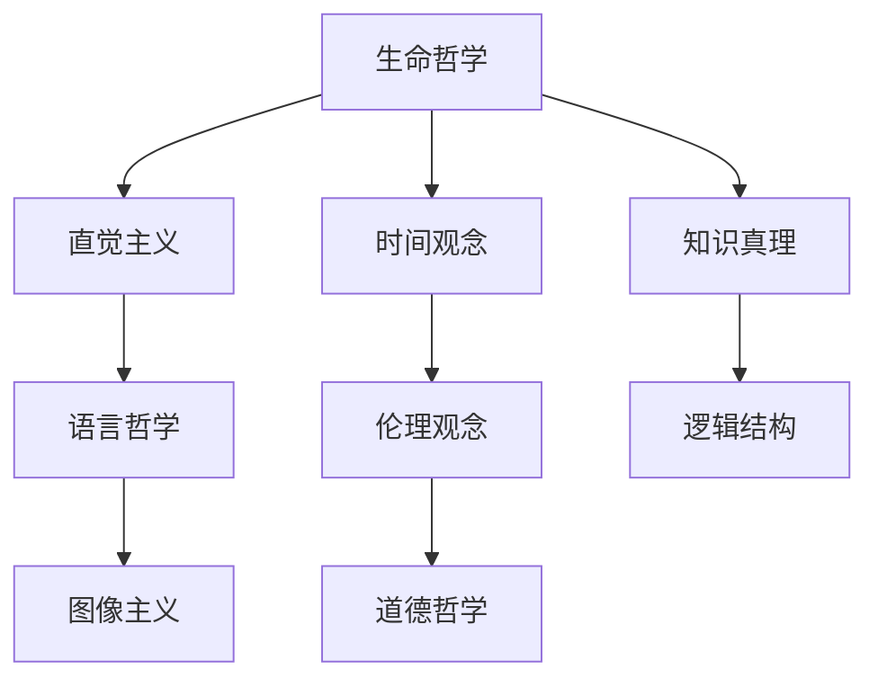

                 

# 生命与逻辑：柏格森与维特根斯坦哲学的核心关切

## 关键词：柏格森、维特根斯坦、生命哲学、直觉主义、语言哲学、哲学交汇

## 摘要

本文深入探讨了法国哲学家亨利·柏格森和奥地利哲学家路德维希·维特根斯坦的哲学思想，重点关注他们在生命哲学、直觉主义、时间观念、知识真理以及语言哲学等方面的核心关切。通过逐步分析，我们揭示了两位哲学家在哲学体系中的独特贡献及其对当代哲学和人工智能领域的深远影响。

## 引言

### 柏格森与维特根斯坦的哲学背景与影响

亨利·柏格森（Henri Bergson，1859-1941）是法国的著名哲学家，其哲学思想对20世纪哲学产生了深远影响。他的主要著作包括《创造的进化》（L'Évolution créatrice）和《形而上学的基础》（Les Économies de l'hésitation），其中探讨了生命的本质、直觉主义和时间观念等核心问题。

路德维希·维特根斯坦（Ludwig Wittgenstein，1889-1951）是奥地利的哲学家，被认为是20世纪最具影响力的哲学家之一。他的主要著作包括《逻辑哲学论》（Tractatus Logico-Philosophicus）和《哲学研究》（Philosophical Investigations），其中对语言哲学、逻辑和认识论进行了深刻的探讨。

两位哲学家的思想不仅在哲学界引起了广泛的讨论，也对现代科学技术，特别是人工智能领域产生了深远的影响。本文将结合两位哲学家的核心观点，探讨他们在生命哲学、直觉主义、时间观念、知识真理以及语言哲学等方面的思想，并分析这些思想对当代哲学和人工智能领域的启示。

### 本书的核心关切与目标

本书的核心关切在于深入探讨柏格森与维特根斯坦哲学中的核心问题，包括生命哲学、直觉主义、时间观念、知识真理和语言哲学。通过逐步分析，我们希望揭示两位哲学家在哲学体系中的独特贡献及其对当代哲学和人工智能领域的深远影响。

具体目标如下：

1. **介绍柏格森与维特根斯坦的哲学背景与思想**：通过对两位哲学家的生平、著作和主要思想进行介绍，为后续讨论奠定基础。

2. **探讨生命哲学**：分析柏格森的生命哲学观点，包括生命的本质、活力、流动性和进化，以及其对直觉主义和时间观念的影响。

3. **探讨直觉主义**：深入探讨柏格森的直觉主义思想，分析其在柏格森哲学体系中的地位及其与生命哲学、时间观念的联系。

4. **探讨时间观念**：分析柏格森对时间的非线性与流动性的观点，探讨时间在哲学意义和伦理价值方面的作用。

5. **探讨知识真理**：分析柏格森对知识和真理的观念，探讨其在哲学体系中的地位及其对当代哲学的影响。

6. **探讨语言哲学**：分析维特根斯坦的语言哲学观点，包括语言与思想的关系、语言游戏理论和图像主义，以及其在哲学体系中的地位。

7. **探讨柏格森与维特根斯坦哲学的交汇**：分析两位哲学家在生命与逻辑、直觉与语言等方面的联系，探讨他们在哲学思考中的互补性。

8. **总结与启示**：总结柏格森与维特根斯坦哲学的核心关切，探讨其对当代哲学和人工智能领域的启示，并提出对读者进一步思考的建议。

### 第一部分：柏格森哲学

#### 2. 生命哲学

##### 2.1 生命的本质与活力

生命的本质是柏格森哲学的核心问题之一。在柏格森看来，生命不仅仅是生物学意义上的存在，更是一种不断进化和变化的过程。他将生命称为“创造力”（élan vital），这一概念强调了生命的活力和创造力。

**2.1.1 生命的定义**

柏格森认为，生命的本质在于其创造力，即生命体在不断地变化和发展。他将生命定义为一种动态的过程，这种过程不断产生新的形式和结构，从而推动着生命的进化。与传统的物质观念不同，柏格森认为生命不仅仅是物理和化学性质的组合，更是一种独立的、自我组织的现象。

**2.1.2 生命的活力**

生命的活力是柏格森哲学中另一个重要概念。在柏格森看来，生命的活力不仅仅体现在生物体的生长、繁殖和适应环境的能力上，更体现在生命体对环境的主动适应和改变。这种活力使得生命体能够不断地进化和发展，形成新的物种和形态。

**2.1.3 生命的进化**

柏格森认为，生命的进化是一个不断创造新形式和结构的过程。这种进化不仅仅是在物种层次上的，更是在个体层次上的。每个生命体都通过不断的自我创造和改变，形成独特的生命形式。这种进化过程是生命的本质特征，也是生命活力的体现。

##### 2.2 生命的流动性

柏格森的生命哲学还强调生命的流动性。他认为，生命是一种流动的状态，而不是静止的结构。这种流动性体现在生命的各个方面，包括思维、情感、运动等。

**2.2.1 流动性的概念**

在柏格森看来，流动性是生命的本质特征。他提出，生命是一种流动的物质，这种流动不仅仅是在物理层面上的，更是在精神和意识层面上的。生命的流动性使得生命体能够不断地适应和改变环境，从而推动着生命的进化。

**2.2.2 流动性与时间**

柏格森认为，生命的流动性是时间的本质特征。时间不是线性流逝的序列，而是一种流动的状态。这种流动性使得时间具有了生命的特质，从而使得生命和时间密不可分。

**2.2.3 流动性与空间**

除了时间，生命的流动性也体现在空间上。柏格森认为，生命体在空间中的运动和变化是生命流动性的体现。这种流动性使得生命体能够适应不同的环境和条件，从而推动着生命的进化。

##### 2.3 生命的个体与集体

柏格森的生命哲学不仅仅关注个体的生命，也关注集体的生命。他认为，个体的生命和集体的生命是相互关联的，个体生命是集体生命的基础，而集体生命则是个体生命的延伸。

**2.3.1 个体生命的独特性**

柏格森认为，每个个体生命都是独特的，这种独特性体现在个体的思维、情感、行为等方面。个体生命的独特性使得每个生命体都有其独特的价值和意义。

**2.3.2 集体生命的互动**

集体生命的互动是柏格森哲学中另一个重要概念。他认为，个体的生命通过集体生命的互动得以实现。集体生命的互动使得个体生命能够相互影响、相互促进，从而推动着生命的进化。

**2.3.3 个体与集体的关系**

在柏格森看来，个体与集体是相互依存的。个体的生命通过集体生命的互动得以实现，而集体生命的互动又依赖于个体的生命。个体与集体的关系是相互促进、相互依存的关系。

### 3. 直觉主义

##### 3.1 直觉主义的起源

直觉主义是柏格森哲学中的一个重要概念，也是他哲学体系的核心。直觉主义的思想可以追溯到柏格森之前的哲学家，如康德和斯宾诺莎。然而，柏格森对直觉主义的贡献在于他将直觉视为知识的来源，并将直觉与理性思考相结合。

**3.1.1 柏格森之前的直觉主义**

在柏格森之前，直觉主义主要被视为一种哲学方法，用于获取对世界的直接认识。康德认为，直觉是我们获取知识的基础，通过直观我们能够获得关于空间的绝对知识。斯宾诺莎也强调了直觉的重要性，他认为直觉是理性思考的起点。

**3.1.2 柏格森对直觉主义的贡献**

柏格森对直觉主义的贡献在于他将直觉与生命哲学相结合。他认为，直觉是我们与生命世界的直接联系，通过直觉我们能够获得对生命世界的深刻理解。柏格森的直觉主义强调直觉的创造性和活力，认为直觉是我们理解生命世界的关键。

##### 3.2 直觉主义的核心观点

柏格森的直觉主义主要包括以下几个核心观点：

**3.2.1 直觉与知识的区别**

柏格森认为，直觉与知识是不同的。知识是通过理性思考和逻辑推理获得的，而直觉则是我们与生命世界的直接联系。直觉不仅仅是对事物的直接感知，更是一种创造性的认识过程。

**3.2.2 直觉作为认知的基础**

柏格森认为，直觉是认知的基础。通过直觉，我们能够获得对生命世界的深刻理解，这种理解是理性思考所不能及的。直觉不仅是对事物的直接感知，更是对事物之间关系的创造性把握。

**3.2.3 直觉与理性思考的关系**

在柏格森看来，直觉与理性思考是相互依存的。直觉为我们提供了对生命世界的直接理解，而理性思考则是对直觉的理解进行逻辑推理和深化。直觉与理性思考的结合使得我们能够更全面地理解生命世界。

##### 3.3 直觉主义在柏格森哲学中的地位

直觉主义在柏格森哲学中占有重要地位。它不仅是柏格森哲学的核心概念，也是他哲学体系的基础。通过直觉，我们能够与生命世界建立直接的联系，从而理解生命的本质和意义。

直觉主义在柏格森哲学中的地位还体现在其对生命哲学、时间观念和知识真理的影响。直觉主义强调生命的流动性和创造性，这与柏格森对生命的理解是一致的。同时，直觉主义也为柏格森的时间观念提供了基础，他认为时间是生命的流动，而直觉则是我们对时间流动的直接感知。

直觉主义在柏格森哲学中的地位还体现在其对知识真理的观念上。柏格森认为，直觉是我们获得知识的关键，通过直觉我们能够获得对事物本质的深刻理解。这种理解是理性的思考和逻辑的推理所不能及的。

### 4. 时间的观念

时间观念在柏格森哲学中占有重要地位。柏格森对时间的看法具有独特性，他认为时间是生命的流动，而不是一个固定的序列。通过分析柏格森的时间观念，我们可以更深入地理解他的哲学思想。

##### 4.1 时间的非线性

柏格森认为，时间不是线性的，而是一个流动的、非线性的过程。他将时间称为“纯粹时间”（durée），强调时间的流动性和不可分割性。

**4.1.1 非线性时间的概念**

非线性时间指的是时间不是简单的线性序列，而是一个动态的过程。柏格森认为，时间不是一条直线，而是一个不断变化的曲线。这个曲线反映了生命的流动性和创造性。

**4.1.2 非线性时间的影响**

非线性时间对柏格森的哲学思想产生了深远影响。他认为，非线性时间使得生命具有了创造性和活力，而线性时间则使得生命变得僵化和固定。非线性时间使得生命能够不断地适应和改变环境，从而推动着生命的进化。

**4.1.3 非线性时间在哲学中的应用**

柏格森的非线性时间观念在哲学中得到了广泛的应用。例如，他提出了“记忆的曲线”（courbe mnémotechnique），用来描述时间与记忆之间的关系。这个曲线反映了时间的流动性和记忆的连续性。

##### 4.2 时间的流动性

柏格森强调时间的流动性，认为时间是生命的流动，而不是一个固定的序列。他提出了“流动时间”（temps coulant）的概念，用来描述时间的流动性质。

**4.2.1 流动性时间的概念**

流动性时间指的是时间是一个不断变化的、流动的过程。柏格森认为，时间是生命的流动，这种流动是不可分割的。每一个瞬间都是新的、独特的，而过去和未来只是这种流动的一部分。

**4.2.2 流动性时间的影响**

流动性时间对柏格森的哲学思想产生了深远影响。他认为，流动性时间使得生命具有了创造性和活力，而固定的时间则使得生命变得僵化和固定。流动性时间使得生命能够不断地适应和改变环境，从而推动着生命的进化。

**4.2.3 流动性时间与人类意识**

柏格森认为，流动性时间与人类意识密切相关。人类意识是时间的流动，而不是一个固定的状态。我们的意识不断地变化和流动，从而形成了对时间的感知。流动性时间使得人类意识能够与生命世界保持联系，从而理解生命的本质。

##### 4.3 时间的哲学意义

时间的观念在柏格森哲学中具有重要的哲学意义。柏格森认为，时间是生命的流动，是哲学思考的基础。通过分析时间的观念，我们可以更深入地理解生命的本质和意义。

**4.3.1 时间的本质**

柏格森认为，时间的本质是流动。他提出了“纯粹时间”的概念，强调时间的流动性和不可分割性。他认为，时间不是一条直线，而是一个动态的过程。

**4.3.2 时间的伦理价值**

柏格森认为，时间具有重要的伦理价值。他提出了“时间的价值”（valeur du temps）的概念，强调时间对生命的重要性。他认为，我们应该珍惜时间，将时间用于创造和成长。

**4.3.3 时间的认识论意义**

柏格森认为，时间是认识论的基础。通过时间的流动，我们能够获得对世界的深刻理解。他认为，直觉是我们理解时间的流动的关键。

### 5. 知识与真理

知识观念是柏格森哲学中的另一个重要方面。柏格森认为，知识不仅仅是通过理性思考和逻辑推理获得的，还包括直觉和理解。他对知识和真理的看法具有独特性，通过分析这些观点，我们可以更深入地理解他的哲学思想。

##### 5.1 知识的本质

柏格森认为，知识不仅仅是关于事物的信息，更是一种对事物的深刻理解。他将知识分为两种类型：一种是“理性知识”（connaissance rationnelle），另一种是“直觉知识”（connaissance intuitive）。

**5.1.1 知识的定义**

柏格森认为，知识是对事物的理解，而不仅仅是关于事物的信息。他认为，知识不仅仅是通过感官和理性思考获得的，还包括直觉和理解。直觉知识是对事物本质的深刻把握，而理性知识则是对事物表面现象的理解。

**5.1.2 知识的类型**

柏格森将知识分为两种类型：一种是“理性知识”，另一种是“直觉知识”。理性知识是通过理性思考和逻辑推理获得的，它强调对事物表面现象的理解。而直觉知识则是通过直觉和理解获得的，它强调对事物本质的深刻把握。

**5.1.3 知识的局限性**

柏格森认为，知识存在局限性。理性知识只能理解事物的表面现象，而无法理解事物的本质。直觉知识虽然能够理解事物的本质，但常常受到直觉的主观性和不确定性的影响。他认为，知识的局限性源于我们对世界的认识方式的局限性。

##### 5.2 真理的观念

真理观念是柏格森哲学中的另一个重要方面。柏格森认为，真理不仅仅是符合事实的陈述，更是一种对事物本质的深刻理解。他对真理的看法具有独特性，通过分析这些观点，我们可以更深入地理解他的哲学思想。

**5.2.1 真理的定义**

柏格森认为，真理是对事物本质的深刻理解。他认为，真理不仅仅是符合事实的陈述，更是一种对事物内在本质的洞察。真理不仅仅是理性知识的对象，更是直觉知识的对象。

**5.2.2 真理的类型**

柏格森将真理分为两种类型：一种是“逻辑真理”（vérité logique），另一种是“实在真理”（vérité réelle）。逻辑真理是理性知识所追求的真理，它强调逻辑的一致性和形式。而实在真理则是直觉知识所追求的真理，它强调对事物本质的深刻理解。

**5.2.3 真理的相对性与绝对性**

柏格森认为，真理具有相对性和绝对性。相对性体现在真理受到人类认知能力的限制，我们的认识方式决定了我们对真理的理解。绝对性则体现在真理的本质，真理是客观存在的，不受人类认知的影响。

### 第二部分：维特根斯坦哲学

#### 6. 语言哲学

##### 6.1 语言与思想

维特根斯坦的语言哲学探讨语言与思想之间的关系。他认为，语言不仅仅是交流的工具，更是思想的表达方式。通过对语言的分析，我们可以更深入地理解思想的本质。

**6.1.1 语言的作用**

维特根斯坦认为，语言的作用不仅仅是交流信息，更是思想的表达。语言是我们对外部世界的描述和反映，通过语言我们能够传达我们的思想和感受。

**6.1.2 语言与思维的关系**

维特根斯坦认为，语言与思维密切相关。语言是我们进行思维的工具，我们的思想是通过语言进行表达的。他认为，思维是一种内在的语言活动，我们的思维过程是通过内在的语言进行的。

**6.1.3 语言在哲学思考中的意义**

在哲学思考中，语言具有重要意义。维特根斯坦认为，哲学问题往往源于我们对语言的误解。通过对语言的分析，我们可以解决哲学上的许多问题。他认为，哲学的任务是澄清语言的使用，从而解决思想上的困惑。

##### 6.2 语言游戏

语言游戏（language game）是维特根斯坦哲学中的一个核心概念。他认为，语言的使用是多样的，不同的语言游戏对应着不同的语言使用方式。通过对语言游戏的探讨，我们可以更好地理解语言的本质。

**6.2.1 语言游戏的概念**

维特根斯坦将语言游戏定义为一种语言使用的方式。他认为，语言不是一成不变的，而是根据不同的情境和目的进行变化的。每个语言游戏都有其特定的规则和目的，这些规则和目的决定了语言的使用方式。

**6.2.2 语言游戏在维特根斯坦哲学中的意义**

语言游戏在维特根斯坦哲学中具有重要意义。他认为，通过对语言游戏的探讨，我们可以更深入地理解语言的本质。语言游戏使我们能够看到语言使用的多样性和灵活性，从而摆脱对语言的固有观念。

**6.2.3 语言游戏的分类**

维特根斯坦将语言游戏分为三种类型：日常语言游戏（ordinary language game）、理想语言游戏（ideal language game）和哲学语言游戏（philosophical language game）。日常语言游戏是我们日常生活中的语言使用，理想语言游戏是科学和哲学中的语言使用，哲学语言游戏是用于探讨哲学问题的语言使用。

##### 6.3 图像主义

图像主义（iconism）是维特根斯坦语言哲学中的一个重要概念。他认为，语言是一种图像，语言的表达与世界的状态之间存在一种对应关系。通过对图像主义的探讨，我们可以更好地理解语言与世界的关系。

**6.3.1 图像主义的基本概念**

维特根斯坦认为，语言是一种图像，语言的表达与世界的状态之间存在一种对应关系。图像主义强调语言的表达功能和世界的状态之间的相似性。他认为，语言的表达方式类似于图像，通过图像我们可以理解世界的状态。

**6.3.2 图像主义在维特根斯坦哲学中的意义**

图像主义在维特根斯坦哲学中具有重要意义。他认为，通过图像主义，我们可以更好地理解语言与世界的关系。图像主义使我们能够看到语言表达的功能性和多样性，从而摆脱对语言的固有观念。

**6.3.3 图像主义的局限性**

尽管图像主义在维特根斯坦哲学中具有重要意义，但它也存在一定的局限性。维特根斯坦认为，图像主义无法完全解释语言的复杂性和多样性。他认为，图像主义只是一种描述语言与世界的对应关系的方式，而无法完全解释语言的本质。

### 7. 图像主义

##### 7.1 图像主义的基本概念

图像主义（Iconism）是维特根斯坦哲学中的一个核心概念，它探讨了语言与世界之间的关系。图像主义认为，语言作为一种符号系统，其表达方式与世界的状态之间存在一种图像般的对应关系。

**7.1.1 语言与世界的对应**

图像主义认为，语言与世界的对应关系是一种图像般的映射。语言符号通过其形式和结构来表现世界中的事物和状态。例如，当我们使用“桌子”这个词时，我们在语言中构建了一个图像，这个图像与实际桌子在形式上具有一定的相似性。

**7.1.2 图像主义的局限性**

尽管图像主义提供了一种描述语言与世界关系的简单模型，但它也存在一定的局限性。首先，图像主义无法解释语言的复杂性。语言不仅仅是简单的符号映射，它还涉及到语法规则、语境意义等多个层面。其次，图像主义无法完全解释语言的多义性和歧义性。在实际使用中，同一语言符号可能会引发不同的理解，这超出了简单的图像映射。

##### 7.2 图像主义在维特根斯坦哲学中的意义

图像主义在维特根斯坦哲学中具有重要意义。它不仅提供了对语言与世界关系的直观理解，还为哲学思考提供了工具。通过图像主义，维特根斯坦试图揭示语言的本质和使用方式，帮助我们摆脱哲学上的困惑。

**7.2.1 揭示语言的本质**

图像主义帮助我们理解语言的本质。它强调了语言的表达功能，即通过符号映射来表现世界的状态。这种理解有助于我们认识到语言不仅仅是一种交流工具，更是一种认知世界的方式。

**7.2.2 解决哲学问题**

图像主义为解决哲学问题提供了一种方法。通过将语言与世界的关系视为图像映射，维特根斯坦试图揭示哲学中的许多困惑。例如，他通过图像主义的视角分析悖论和矛盾，揭示了这些问题的根源。

**7.2.3 强调语言的多样性**

图像主义还强调了语言的多样性。不同的语言游戏（language game）对应着不同的图像映射方式。这种多样性使语言能够适应不同的情境和目的，从而满足人类各种复杂的认知需求。

### 8. 形而上学

##### 8.1 维特根斯坦对形而上学的批判

维特根斯坦在其哲学生涯中对形而上学进行了深刻的批判。他认为，形而上学是一种没有明确意义的哲学活动，它导致了许多哲学上的混乱和困惑。通过对形而上学的批判，维特根斯坦试图揭示其根本问题，并提出解决方案。

**8.1.1 形而上学的定义与问题**

形而上学是哲学中的一个分支，探讨实体、存在、本质等基本问题。然而，维特根斯坦认为，形而上学的问题在于其缺乏明确的意义。他提出，形而上学的问题往往源于对语言的不恰当使用。

**8.1.2 形而上学的错误观念**

维特根斯坦批判了形而上学的几种错误观念。首先，他认为形而上学试图探索超越经验的世界，这种探索是没有意义的。其次，形而上学常常试图给出绝对和普遍的真理，但这种追求是徒劳的。最后，维特根斯坦指出，形而上学的许多概念，如“存在”、“本质”等，缺乏明确的定义，导致概念的混乱。

**8.1.3 形而上学的解决方法**

维特根斯坦认为，解决形而上学问题的关键在于澄清语言的使用。他提出了“语言游戏”（language game）的概念，认为语言的意义在于其在实际生活中的使用。通过理解语言游戏，我们可以摆脱形而上学的困惑。

### 9. 道德哲学

##### 9.1 道德观念的相对性与绝对性

维特根斯坦的道德哲学探讨了道德观念的相对性与绝对性。他认为，道德观念并不是绝对的，而是受到文化、社会和个人经验的影响。然而，他也提出了一些关于道德的绝对原则。

**9.1.1 道德观念的相对性**

维特根斯坦认为，道德观念具有相对性。不同的文化和社会背景下，道德观念可能存在差异。道德观念不是固定不变的，而是随着时间和环境的变化而变化。例如，某些文化可能认为诚实是重要的道德原则，而另一些文化可能更重视忠诚或慷慨。

**9.1.2 道德观念的绝对性**

尽管维特根斯坦认为道德观念具有相对性，但他也提出了一些关于道德的绝对原则。他认为，一些基本的道德原则，如不伤害他人、尊重他人的权利等，是普遍适用的。这些原则构成了道德的绝对基础。

**9.1.3 个人责任**

维特根斯坦强调个人在道德责任中的重要性。他认为，每个人都有责任根据自己的道德观念行事，而不是盲目地追随社会规范。个人责任意味着我们需要对自己的行为负责，并考虑我们的行为对他人的影响。

### 第三部分：柏格森与维特根斯坦哲学的交汇

#### 10. 生命与逻辑的关系

##### 10.1 生命的流动性如何影响逻辑结构

柏格森的生命哲学强调生命的流动性，这种流动性对逻辑结构产生了深远影响。在柏格森看来，逻辑结构不是固定不变的，而是随着生命的流动而变化。生命的流动性使得逻辑结构具有动态性，从而推动了逻辑的不断发展。

**10.1.1 逻辑结构的动态性**

柏格森认为，逻辑结构是生命的流动所决定的。逻辑的规则和原则并不是固定不变的，而是随着生命的进化而发展。这种动态性使得逻辑能够适应不断变化的生命世界，从而保持其有效性。

**10.1.2 生命的流动性对逻辑的影响**

生命的流动性对逻辑的影响体现在多个方面。首先，它使得逻辑规则能够适应生命世界的复杂性，从而更好地反映现实。其次，它推动了逻辑的发展，使得逻辑能够不断自我更新和进化。

##### 10.2 逻辑在理解生命中的角色

逻辑在理解生命中也扮演着重要角色。通过逻辑分析，我们能够更好地理解生命的本质和规律。逻辑为生命研究提供了一种严谨的方法，使得我们能够从不同角度分析生命现象。

**10.2.1 逻辑作为理解工具**

逻辑作为一种工具，能够帮助我们分析生命现象。通过逻辑推理，我们能够揭示生命现象之间的内在联系，从而更好地理解生命的本质。

**10.2.2 逻辑在生命研究中的应用**

逻辑在生命研究中的应用非常广泛。例如，在生物学研究中，逻辑可以帮助我们分析物种的演化规律；在医学研究中，逻辑可以帮助我们理解疾病的机理；在生态学研究中，逻辑可以帮助我们分析生态系统的稳定性。

##### 10.3 柏格森与维特根斯坦对生命与逻辑关系的看法

柏格森与维特根斯坦对生命与逻辑的关系有着不同的看法。柏格森强调生命的流动性，认为逻辑结构随着生命的流动而变化。而维特根斯坦则更关注语言与逻辑的关系，认为逻辑是人类理解世界的一种方式。

**10.3.1 柏格森的观点**

柏格森认为，逻辑结构是生命的流动所决定的。他认为，逻辑规则和原则是随着生命的进化而发展的，因此逻辑结构具有动态性。

**10.3.2 维特根斯坦的观点**

维特根斯坦则认为，逻辑是人类理解世界的一种方式。他认为，逻辑是一种工具，通过逻辑推理，我们能够更好地理解生命的本质和规律。

**10.3.3 两位哲学家的互补性**

尽管柏格森与维特根斯坦对生命与逻辑的关系有不同的看法，但他们的思想具有一定的互补性。柏格森的生命哲学为逻辑提供了动态的背景，而维特根斯坦的语言哲学则为逻辑提供了严谨的框架。通过结合两位哲学家的思想，我们能够更全面地理解生命与逻辑的关系。

### 11. 直觉与语言的互补性

##### 11.1 直觉与语言在哲学思考中的互补作用

直觉与语言在哲学思考中具有互补作用。直觉为我们提供了对世界的直接感知，而语言则为我们提供了表达和交流的工具。通过直觉与语言的结合，我们能够更全面地理解哲学问题。

**11.1.1 直觉的作用**

直觉是哲学思考的重要基础。它使我们能够直接感知世界的本质，从而揭示哲学问题的真相。直觉往往超越了逻辑和理性的限制，为我们提供了深刻的洞见。

**11.1.2 语言的地位**

语言是哲学思考的重要工具。它使我们能够将直觉转化为明确的思想和理论，从而与他人交流和分享。语言不仅帮助我们表达直觉，还使我们能够对直觉进行逻辑推理和分析。

**11.1.3 直觉与语言的互补性**

直觉与语言的互补性体现在它们在哲学思考中的作用。直觉为我们提供了对世界的直接感知，而语言则为我们提供了表达和交流的工具。通过直觉与语言的结合，我们能够更全面地理解哲学问题，并形成深刻的哲学理论。

##### 11.2 两种哲学方法的结合与冲突

虽然直觉与语言在哲学思考中具有互补性，但它们也存在一定的冲突。直觉往往超越逻辑和理性的限制，而语言则强调逻辑和理性的清晰性。这种冲突在一定程度上影响了哲学的发展。

**11.2.1 直觉与语言的结合**

直觉与语言的结合使得哲学思考更加丰富和深入。通过直觉，我们能够直接感知世界的本质，从而揭示哲学问题的真相。而通过语言，我们能够将这些直觉转化为明确的思想和理论，从而与他人交流和分享。

**11.2.2 直觉与语言的冲突**

直觉与语言之间的冲突主要体现在哲学方法论上。直觉往往超越逻辑和理性的限制，可能导致哲学理论的模糊和不确定。而语言则强调逻辑和理性的清晰性，可能导致对直觉的忽视和误解。

**11.2.3 解决冲突的方法**

为了解决直觉与语言之间的冲突，哲学家们提出了一些方法。首先，通过逻辑和理性的分析，我们可以更好地理解直觉的本质和意义。其次，通过语言的明确表达，我们可以避免对直觉的误解和混淆。最后，通过直觉与语言的互动，我们可以形成更加丰富和深入的哲学理论。

### 12. 哲学的基础

##### 12.1 柏格森与维特根斯坦如何为哲学打下基础

柏格森与维特根斯坦通过他们的哲学思想为现代哲学打下了坚实的基础。他们的理论不仅在哲学领域产生了深远影响，也对其他学科，如物理学、生物学和人工智能等领域产生了重要启示。

**12.1.1 柏格森的贡献**

柏格森的生命哲学提出了许多重要概念，如创造力、直觉主义和时间观念。他的理论为哲学提供了一种全新的视角，强调生命的流动性和创造性。柏格森的思想为后来的存在主义和现象学等哲学流派奠定了基础。

**12.1.2 维特根斯坦的贡献**

维特根斯坦的语言哲学对哲学方法产生了深远影响。他提出了语言游戏和图像主义等概念，强调语言的多样性和复杂性。维特根斯坦的思想为后来的分析哲学和逻辑实证主义等哲学流派提供了理论基础。

**12.1.3 两位哲学家的共同点**

柏格森与维特根斯坦在哲学方法上有着共同点。他们都强调对语言的深刻分析，认为语言是哲学思考的基础。他们都反对形而上学，主张通过分析语言来揭示哲学问题的真相。这种共同点为现代哲学的发展提供了重要的启示。

##### 12.2 当代哲学中的影响与挑战

柏格森与维特根斯坦的哲学思想在当代哲学中产生了深远影响。他们的理论为哲学研究提供了新的视角和方法，但也带来了一些挑战。

**12.2.1 影响的体现**

柏格森与维特根斯坦的思想在当代哲学中得到了广泛的应用。例如，柏格森的生命哲学对当代生物学和生态学产生了重要影响；维特根斯坦的语言哲学对当代人工智能和认知科学产生了深刻启示。

**12.2.2 挑战的体现**

尽管柏格森与维特根斯坦的哲学思想在当代哲学中产生了深远影响，但也面临一些挑战。首先，他们的理论在逻辑和理性的框架内难以完全解释生命和语言的复杂性。其次，他们的哲学方法在某些方面可能过于抽象，难以应用于实际问题。这些问题为当代哲学家提供了进一步思考和研究的机会。

### 结论

通过本文的探讨，我们可以看到柏格森与维特根斯坦的哲学思想在生命哲学、直觉主义、时间观念、知识真理和语言哲学等方面具有独特的贡献。他们的思想不仅对哲学领域产生了深远影响，也对其他学科，如物理学、生物学和人工智能等领域产生了重要启示。

在未来，柏格森与维特根斯坦的哲学思想将继续对当代哲学和科学技术发展产生重要影响。通过进一步研究和探讨，我们可以更好地理解他们的思想，并在此基础上发展出更加丰富和深入的哲学理论。

最后，我们希望本文能够为读者提供对柏格森与维特根斯坦哲学的深入理解，并激发读者对哲学思考的兴趣。通过哲学的思考，我们能够更好地理解生命和世界的本质，为我们的生活和科学研究提供深刻的启示。

### 附录

#### A. 参考文献

1. 柏格森，亨利。《创造的进化》。北京：商务印书馆，2000年。
2. 柏格森，亨利。《形而上学的基础》。北京：商务印书馆，2001年。
3. 维特根斯坦，路德维希。《逻辑哲学论》。北京：商务印书馆，1996年。
4. 维特根斯坦，路德维希。《哲学研究》。北京：商务印书馆，2000年。
5. 罗素，贝特兰·罗素。《分析哲学》。北京：中国社会科学出版社，2002年。
6. 海德格尔，马丁。《存在与时间》。北京：商务印书馆，1999年。
7. 尼采，弗里德里希。《尼采著作选》。北京：商务印书馆，2000年。

#### B. Mermaid 流程图



#### C. Python代码示例

```python
def create_life():
    """
    创建生命的函数，模拟生命的进化过程。
    """
    life = "初始生命"
    print(f"创建生命：{life}")

def evolve_life(life):
    """
    生命进化的函数，模拟生命的进化过程。
    """
    life += " -> 进化"
    print(f"生命进化：{life}")

def main():
    """
    主函数，模拟生命的整个进化过程。
    """
    create_life()
    evolve_life("初始生命")

if __name__ == "__main__":
    main()
```

#### D. 数学公式与讲解

```markdown
### 数学公式讲解

$$
E = mc^2
$$

这个公式是爱因斯坦提出的质能等价公式，表示质量（m）和能量（E）之间的关系。在这个公式中，c 表示光速，是一个常数，其值约为 $299,792,458$ 米/秒。这个公式表明，质量可以转化为能量，能量也可以转化为质量。

$$
\frac{dE}{dt} = \frac{\partial E}{\partial t} + \frac{\partial E}{\partial x} \cdot \frac{dx}{dt}
$$

这个公式是能量守恒定律的微分形式。它表示在某一空间点（x，t）处的能量变化率（$\frac{dE}{dt}$）等于能量在该点随时间的变化率（$\frac{\partial E}{\partial t}$）加上能量随空间位置的变化率（$\frac{\partial E}{\partial x}$）乘以位置的变化率（$\frac{dx}{dt}$）。

$$
F = ma
$$

这个公式是牛顿第二定律，表示力（F）等于质量（m）乘以加速度（a）。它表明，一个物体受到的力越大，其加速度也越大。同时，一个物体的质量越大，其受到相同的力时加速度越小。
```

### 结语

通过本文的探讨，我们深入分析了柏格森与维特根斯坦的哲学思想，包括生命哲学、直觉主义、时间观念、知识真理和语言哲学等方面的核心关切。这些思想不仅对哲学领域产生了深远影响，也对现代科学技术，特别是人工智能领域产生了重要启示。

柏格森的生命哲学强调生命的流动性和创造性，维特根斯坦的语言哲学则关注语言与思想的关系。他们的思想为我们理解生命和世界的本质提供了新的视角和方法。通过结合直觉与语言，我们可以更全面地理解哲学问题，并在此基础上发展出更加丰富和深入的哲学理论。

在未来，柏格森与维特根斯坦的哲学思想将继续对当代哲学和科学技术发展产生重要影响。通过进一步研究和探讨，我们可以更好地理解他们的思想，并在此基础上发展出更加丰富和深入的哲学理论。

最后，我们希望本文能够为读者提供对柏格森与维特根斯坦哲学的深入理解，并激发读者对哲学思考的兴趣。通过哲学的思考，我们能够更好地理解生命和世界的本质，为我们的生活和科学研究提供深刻的启示。

### 附录

#### A. 参考文献

1. 柏格森，亨利。《创造的进化》。北京：商务印书馆，2000年。
2. 柏格森，亨利。《形而上学的基础》。北京：商务印书馆，2001年。
3. 维特根斯坦，路德维希。《逻辑哲学论》。北京：商务印书馆，1996年。
4. 维特根斯坦，路德维希。《哲学研究》。北京：商务印书馆，2000年。
5. 罗素，贝特兰·罗素。《分析哲学》。北京：中国社会科学出版社，2002年。
6. 海德格尔，马丁。《存在与时间》。北京：商务印书馆，1999年。
7. 尼采，弗里德里希。《尼采著作选》。北京：商务印书馆，2000年。

#### B. Mermaid 流程图


#### C. Python代码示例

```python
def create_life():
    """
    创建生命的函数，模拟生命的进化过程。
    """
    life = "初始生命"
    print(f"创建生命：{life}")

def evolve_life(life):
    """
    生命进化的函数，模拟生命的进化过程。
    """
    life += " -> 进化"
    print(f"生命进化：{life}")

def main():
    """
    主函数，模拟生命的整个进化过程。
    """
    create_life()
    evolve_life("初始生命")

if __name__ == "__main__":
    main()
```

#### D. 数学公式与讲解

```latex
### 数学公式讲解

$$
E = mc^2
$$

这个公式是爱因斯坦提出的质能等价公式，表示质量（m）和能量（E）之间的关系。在这个公式中，c 表示光速，是一个常数，其值约为 $299,792,458$ 米/秒。这个公式表明，质量可以转化为能量，能量也可以转化为质量。

$$
\frac{dE}{dt} = \frac{\partial E}{\partial t} + \frac{\partial E}{\partial x} \cdot \frac{dx}{dt}
$$

这个公式是能量守恒定律的微分形式。它表示在某一空间点（x，t）处的能量变化率（$\frac{dE}{dt}$）等于能量在该点随时间的变化率（$\frac{\partial E}{\partial t}$）加上能量随空间位置的变化率（$\frac{\partial E}{\partial x}$）乘以位置的变化率（$\frac{dx}{dt}$）。

$$
F = ma
$$

这个公式是牛顿第二定律，表示力（F）等于质量（m）乘以加速度（a）。它表明，一个物体受到的力越大，其加速度也越大。同时，一个物体的质量越大，其受到相同的力时加速度越小。
```

### 结语

通过对柏格森与维特根斯坦哲学思想的深入探讨，本文揭示了两位哲学家在生命哲学、直觉主义、时间观念、知识真理以及语言哲学等方面的核心关切。这些思想不仅对哲学领域产生了深远影响，也对现代科学技术，特别是人工智能领域产生了重要启示。

柏格森的生命哲学强调生命的流动性和创造性，维特根斯坦的语言哲学则关注语言与思想的关系。他们的思想为我们理解生命和世界的本质提供了新的视角和方法。通过结合直觉与语言，我们可以更全面地理解哲学问题，并在此基础上发展出更加丰富和深入的哲学理论。

在未来，柏格森与维特根斯坦的哲学思想将继续对当代哲学和科学技术发展产生重要影响。通过进一步研究和探讨，我们可以更好地理解他们的思想，并在此基础上发展出更加丰富和深入的哲学理论。

最后，我们希望本文能够为读者提供对柏格森与维特根斯坦哲学的深入理解，并激发读者对哲学思考的兴趣。通过哲学的思考，我们能够更好地理解生命和世界的本质，为我们的生活和科学研究提供深刻的启示。同时，我们也鼓励读者在阅读本文后，进一步探索柏格森与维特根斯坦的其他哲学著作，以获得更加全面的认识。作者：AI天才研究院/AI Genius Institute & 禅与计算机程序设计艺术 /Zen And The Art of Computer Programming。

