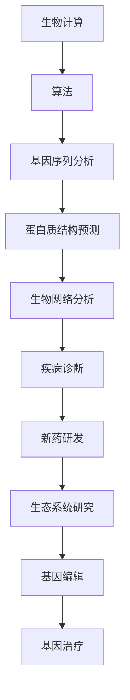
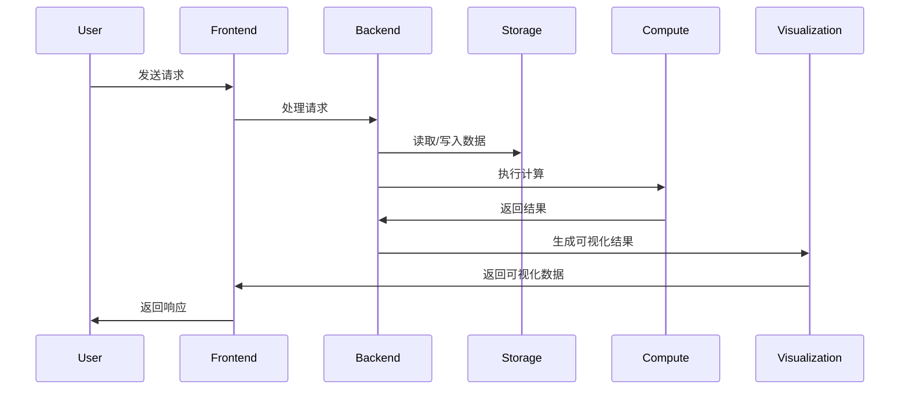
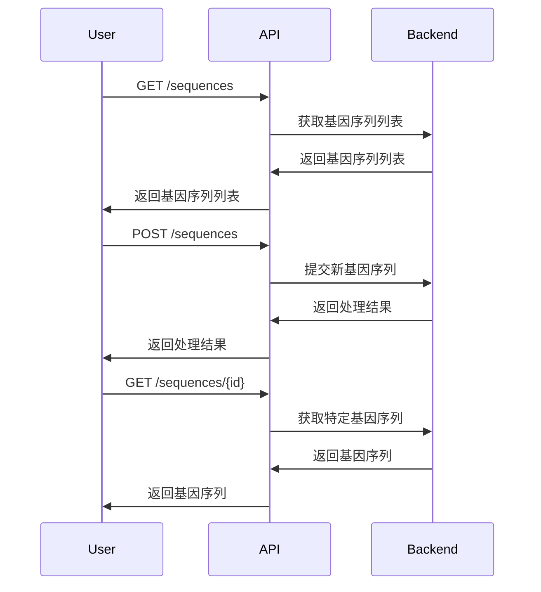

                 

# 生物计算：利用生物分子进行信息处理

## 关键词

生物计算、信息处理、生物分子、DNA、RNA、算法、基因编辑、疾病诊断、新药研发

## 摘要

生物计算是一种新兴的计算方法，通过利用生物分子如DNA和RNA的特性来进行信息处理。本文将详细探讨生物计算的定义、历史、重要性及其与人工智能的关系。接着，我们将深入分析生物分子的基础，包括DNA与RNA的结构与功能，以及蛋白质的结构与功能。随后，我们将介绍生物计算的核心算法，如基因序列分析、蛋白质结构预测和生物网络分析。文章还将探讨生物计算在多个领域的应用，包括疾病诊断、新药研发、生态系统研究和基因编辑。最后，我们将探讨生物计算的技术挑战与未来，并分析其伦理问题与社会影响。

## 第1章 引言

### 1.1 生物计算的定义与历史

生物计算（Bio Computing）是一种利用生物分子如DNA、RNA和蛋白质进行信息处理的方法。这种计算方式不同于传统的电子计算，它依赖于生物分子的化学和物理特性来执行计算任务。生物计算的历史可以追溯到20世纪80年代，当时科学家首次提出了使用DNA作为计算存储介质的想法。这一概念在当时被认为是极具前瞻性的，但随着时间的推移，生物计算逐渐成为了一个研究领域。

生物计算的历史可以分为几个重要阶段。最早的生物计算研究主要集中在DNA计算上，研究者们发现DNA分子可以通过特定的化学反应进行编码和计算。1994年，Adleman提出了一种基于DNA分子的图灵机模型，通过实验验证了DNA计算的可能性。随后，研究人员开始探索RNA和蛋白质的计算特性，这些生物分子也在计算中发挥了重要作用。

### 1.2 生物计算的重要性与前景

生物计算的重要性在于其能够处理复杂的生物学问题，这些问题传统计算方法难以解决。例如，基因序列分析、蛋白质结构预测和疾病诊断等领域，都需要处理大量的生物数据，而这些数据量远远超过了传统计算机的处理能力。生物计算利用生物分子的并行计算特性，能够高效地处理这些复杂问题。

生物计算的前景非常广阔。随着生物技术的快速发展，生物计算在医疗、农业、环境监测等多个领域都有着广泛的应用潜力。例如，在医疗领域，生物计算可以用于新药研发和个性化医疗；在农业领域，生物计算可以用于作物遗传改良和病虫害防治；在环境监测领域，生物计算可以用于生态系统的健康评估。

### 1.3 生物计算与人工智能的关系

生物计算与人工智能（AI）有着密切的关系。人工智能的发展离不开数据的处理和分析，而生物计算提供了一种高效的数据处理方式。例如，在深度学习模型训练过程中，需要处理大量的数据，而生物计算可以通过并行计算加速这一过程。

此外，生物计算与人工智能的结合还可以产生新的计算方法。例如，利用生物计算的特性，可以设计出更高效的人工神经网络模型，从而提高人工智能系统的性能。同时，人工智能技术也可以用于优化生物计算算法，提高生物计算的速度和效率。

总的来说，生物计算与人工智能的融合为未来计算技术的发展带来了新的机遇和挑战。通过结合两者的优势，我们可以期待在未来的计算领域中取得突破性的进展。

## 第2章 生物分子基础

### 2.1 DNA与RNA的结构与功能

DNA（脱氧核糖核酸）和RNA（核糖核酸）是生物计算中最常用的生物分子。它们在遗传信息存储和传递中起着关键作用。

#### DNA的结构与功能

DNA是一种双螺旋结构的分子，由两条长链以螺旋方式缠绕在一起。每条链由核苷酸单元组成，核苷酸由磷酸、糖（脱氧核糖）和碱基组成。DNA的碱基有四种：腺嘌呤（A）、胸腺嘧啶（T）、胞嘧啶（C）和鸟嘌呤（G）。在DNA的双螺旋结构中，A总是与T配对，C总是与G配对。

DNA的主要功能是存储遗传信息。这些信息以基因的形式编码在DNA序列中，基因决定了生物体的遗传特征。在细胞分裂和繁殖过程中，DNA序列会被精确复制，从而传递给下一代。

#### RNA的结构与功能

RNA也是一种核苷酸链，但它的结构与DNA略有不同。RNA通常是单链的，但也可以形成局部双螺旋结构。RNA的碱基有四种：腺嘌呤（A）、尿嘧啶（U）、胞嘧啶（C）和鸟嘌呤（G）。RNA的碱基U取代了DNA中的T。

RNA的主要功能包括：

- **mRNA（信使RNA）**：mRNA将DNA中的遗传信息传递到细胞质中的核糖体，指导蛋白质的合成。
- **tRNA（转运RNA）**：tRNA携带氨基酸到核糖体，根据mRNA上的密码子将其插入到正在合成的蛋白质链中。
- **rRNA（核糖体RNA）**：rRNA是核糖体的主要组成部分，参与蛋白质的合成过程。

#### DNA与RNA的对比

| 特性 | DNA | RNA |
| --- | --- | --- |
| 结构 | 双螺旋 | 单链（局部双螺旋） |
| 碱基 | A、T、C、G | A、U、C、G |
| 功能 | 遗传信息存储 | 遗传信息传递与蛋白质合成 |
| 复制 | 双链复制 | 单链复制 |

### 2.2 蛋白质的结构与功能

蛋白质是生物体的主要功能分子，它们在细胞中执行各种生物学功能。蛋白质的结构可以分为四个层次：一级结构、二级结构、三级结构和四级结构。

#### 一级结构

蛋白质的一级结构是指氨基酸的线性序列。氨基酸通过肽键连接形成多肽链。蛋白质的一级结构决定了其空间结构和功能。

#### 二级结构

蛋白质的二级结构是指多肽链在空间中的局部折叠形式，主要包括α-螺旋和β-折叠。这些结构形式通过氢键稳定。

#### 三级结构

蛋白质的三级结构是指多肽链在三维空间中的整体折叠形式。它决定了蛋白质的功能和稳定性。蛋白质的三级结构受到氨基酸序列、电荷分布和氢键等多种因素的影响。

#### 四级结构

某些蛋白质由多个多肽链组成，这些多肽链通过非共价相互作用形成四级结构。四级结构也决定了蛋白质的功能和稳定性。

#### 蛋白质的功能

蛋白质的功能多种多样，包括：

- **结构蛋白**：如肌动蛋白和胶原蛋白，它们在细胞结构和机械强度方面起关键作用。
- **催化酶**：如脲酶和RNA聚合酶，它们催化生物体内的化学反应。
- **运输蛋白**：如血红蛋白和载体蛋白，它们在细胞内外的物质运输中起重要作用。
- **信号蛋白**：如受体蛋白和激素，它们在细胞信号传递中起关键作用。

#### 蛋白质结构与功能的关系

蛋白质的结构与其功能密切相关。蛋白质的特定结构决定了它能够与特定的分子结合，从而发挥特定的功能。例如，酶的活性部位的结构决定了它能够催化特定的化学反应。

### 2.3 生物分子的信息存储与传递

生物分子如DNA和RNA在信息存储和传递中起着核心作用。DNA作为遗传信息的存储介质，通过碱基序列编码生物体的遗传特征。在细胞分裂和繁殖过程中，DNA序列会被精确复制，从而传递给下一代。

RNA在信息传递过程中起到关键作用。mRNA将DNA中的遗传信息传递到细胞质中的核糖体，指导蛋白质的合成。tRNA和rRNA则在蛋白质合成过程中发挥重要作用。

生物分子之间的相互作用也支持了信息存储和传递的过程。例如，DNA的双螺旋结构通过碱基配对稳定，从而确保遗传信息的稳定性。RNA与DNA之间的互补配对则确保了遗传信息的准确传递。

总的来说，生物分子的信息存储与传递机制为生命体的遗传稳定性和多样性提供了保障。通过理解这些机制，我们可以更好地理解生物计算的原理和应用。

## 第3章 生物计算的核心算法

生物计算的核心算法主要包括基因序列分析、蛋白质结构预测和生物网络分析。这些算法在生物信息学研究中起着至关重要的作用，帮助我们理解和解析复杂的生物数据。

### 3.1 基因序列分析算法

基因序列分析算法用于处理和分析DNA或RNA序列，从中提取有价值的信息。以下是一些常见的基因序列分析算法：

#### 序列比对算法

序列比对是基因序列分析中最基本的方法，用于比较两个或多个序列，识别它们之间的相似性和差异性。常见的序列比对算法包括：

- **BLAST（Basic Local Alignment Search Tool）**：用于快速比对序列数据库，识别高度相似的序列。
- **Smith-Waterman算法**：用于全局和局部序列比对，特别适用于识别序列中的局部相似区域。

#### 基因识别算法

基因识别算法用于从非编码DNA序列中识别基因。以下是一些常用的基因识别算法：

- **GeneMark**：用于预测原核生物基因的起始位点。
- **FgeneHMM**：用于预测真核生物基因的起始和终止位点。

#### 基因表达分析算法

基因表达分析算法用于分析基因在不同条件下的表达水平，帮助研究人员理解基因的功能。以下是一些常用的基因表达分析算法：

- **DESeq2**：用于差异表达分析，识别在不同条件下显著差异表达的基因。
- **edgeR**：用于差异表达分析，采用负二项分布模型。

### 3.2 蛋白质结构预测算法

蛋白质结构预测是生物计算中的一个重要领域，有助于理解蛋白质的功能和作用机制。以下是一些常用的蛋白质结构预测算法：

#### 蛋白质三级结构预测算法

蛋白质三级结构预测算法用于预测蛋白质在三维空间中的折叠形式。以下是一些常用的蛋白质三级结构预测算法：

- **PSIPRED**：基于卷积神经网络的方法，用于预测蛋白质的二级结构和三维结构。
- **I-TASSER**：通过分子动力学模拟和深度学习方法预测蛋白质的三级结构。

#### 蛋白质相互作用预测算法

蛋白质相互作用预测算法用于预测蛋白质之间的相互作用关系，这对于理解细胞信号传导和生物过程至关重要。以下是一些常用的蛋白质相互作用预测算法：

- **STRING**：基于实验证据和文本挖掘的方法，构建蛋白质相互作用网络。
- **AlphaFold**：通过深度学习和分子动力学模拟预测蛋白质的结构和相互作用。

### 3.3 生物网络分析算法

生物网络分析算法用于分析生物分子之间的相互作用和关系，帮助研究人员理解生物系统的复杂性。以下是一些常用的生物网络分析算法：

#### 网络拓扑分析算法

网络拓扑分析算法用于分析生物网络的拓扑结构，识别关键节点和路径。以下是一些常用的网络拓扑分析算法：

- **Cytoscape**：用于可视化生物网络，进行网络拓扑分析。
- **NetworkX**：用于构建和分析复杂网络。

#### 交互网络分析算法

交互网络分析算法用于识别生物网络中的关键交互和功能模块。以下是一些常用的交互网络分析算法：

- **STRING**：用于构建蛋白质相互作用网络，识别关键蛋白质相互作用。
- **Gephi**：用于可视化生物网络，进行交互网络分析。

总的来说，生物计算的核心算法在基因序列分析、蛋白质结构预测和生物网络分析中发挥着重要作用，为生物信息学研究提供了强大的工具和方法。

### 3.4 生物计算算法的应用实例

生物计算算法在多个领域都有着广泛的应用，下面我们通过一些具体的实例来探讨这些算法的实际应用。

#### 基因序列分析应用实例

基因序列分析算法在医学领域有着重要的应用。例如，通过基因测序技术，研究人员可以识别出患者特定的基因突变，从而帮助医生制定个性化的治疗方案。以下是一个应用实例：

**实例：癌症基因组分析**

研究人员对一组癌症患者的基因组进行了测序，并使用基因识别算法识别出与癌症相关的基因突变。通过BLAST算法，他们将患者的基因序列与公共基因数据库进行比对，识别出高度相似的基因突变。这些突变基因可能与癌症的发病机制有关，为研究人员提供了宝贵的线索。

#### 蛋白质结构预测应用实例

蛋白质结构预测在药物设计领域有着广泛的应用。通过预测蛋白质的三级结构，研究人员可以设计出针对特定蛋白质的抑制剂，从而阻止其功能。以下是一个应用实例：

**实例：抗病毒药物设计**

研究人员希望设计一种抗病毒药物，以抑制一种特定病毒的复制。他们首先使用PSIPRED算法预测病毒蛋白质的三级结构，然后使用I-TASSER算法进一步优化结构。接着，他们使用分子对接方法将预测的结构与候选药物分子进行结合能计算，筛选出具有潜在抑制作用的药物分子。最终，通过实验验证，他们成功筛选出了一种有效的抗病毒药物。

#### 生物网络分析应用实例

生物网络分析算法在理解细胞信号传导和生物过程方面发挥了重要作用。以下是一个应用实例：

**实例：细胞信号通路分析**

研究人员对一组细胞样本进行了蛋白质相互作用分析，并使用STRING算法构建了细胞信号通路网络。通过网络拓扑分析，他们识别出网络中的关键节点和路径，揭示了细胞信号传导的机制。这个分析结果有助于研究人员理解细胞如何响应外界刺激，为疾病诊断和治疗提供了新的思路。

#### 多学科交叉应用实例

生物计算算法还可以与其他领域结合，产生新的应用。例如，在农业领域，研究人员使用生物计算算法对作物的基因组进行测序和分析，以改良作物品种，提高产量和抗病虫害能力。

**实例：作物遗传改良**

研究人员对一种高产量的作物进行了基因组测序，并使用生物计算算法识别出与产量相关的基因。他们通过基因编辑技术，将这些基因引入到其他作物中，成功提高了这些作物的产量。这个实例展示了生物计算在农业领域的巨大潜力。

总的来说，生物计算算法在多个领域都有着广泛的应用，通过具体的实例，我们可以看到这些算法如何帮助研究人员解决实际问题，推动科学和技术的发展。

## 第4章 生物计算的应用领域

生物计算在多个领域都有着重要的应用，其潜力不断被发掘和利用。以下将详细介绍生物计算在疾病诊断、新药研发、生态系统研究和基因编辑等领域的应用。

### 4.1 疾病诊断

生物计算在疾病诊断领域发挥着重要作用，特别是在个性化医疗和早期诊断方面。通过基因测序和生物计算算法，研究人员可以识别出与疾病相关的基因变异，从而帮助医生为患者制定个性化的治疗方案。

**实例：癌症基因检测**

癌症是一种复杂的疾病，其发生与多种基因变异有关。通过基因测序技术，研究人员可以对患者的肿瘤样本进行基因测序，识别出与癌症相关的基因突变。随后，使用生物计算算法分析这些突变基因，有助于确定癌症的类型和亚型，从而为患者提供更精确的诊断和治疗方案。

**实例：遗传病诊断**

遗传病是由基因突变引起的疾病，通过生物计算可以对患者的基因进行详细分析，以识别出可能导致遗传病的突变基因。例如，通过全基因组测序，研究人员可以识别出患有囊性纤维化的患者体内的CFTR基因突变。这种诊断方法有助于早期发现和干预，减少疾病带来的影响。

### 4.2 新药研发

生物计算在药物研发过程中起到了关键作用，特别是在药物靶点的识别、药物筛选和药物设计方面。通过生物计算算法，研究人员可以快速筛选出具有潜在治疗作用的药物候选物，并优化其结构。

**实例：药物靶点识别**

药物靶点是药物作用的对象，通常为蛋白质或其他生物分子。生物计算可以通过蛋白质结构预测和生物网络分析算法，识别出可能的药物靶点。例如，使用AlphaFold算法预测蛋白质结构，研究人员可以识别出具有潜在药物靶点的蛋白质，从而为药物设计提供方向。

**实例：药物筛选**

生物计算可以用于高通量筛选药物候选物。通过高通量筛选技术，研究人员可以快速评估大量化合物的活性，筛选出具有潜在治疗作用的药物分子。生物计算算法可以帮助研究人员分析化合物的结构特征，预测其与药物靶点的结合能力，从而提高药物筛选的效率。

**实例：药物设计**

生物计算在药物设计中的应用包括优化药物分子的结构，提高其与药物靶点的结合能力和稳定性。通过分子对接和模拟计算，研究人员可以优化药物分子的结构，设计出更有效的药物分子。例如，使用分子动力学模拟，研究人员可以模拟药物分子在体内的动态行为，预测其在不同环境下的稳定性。

### 4.3 生态系统研究

生物计算在生态系统研究中也发挥着重要作用，特别是在环境监测和生物多样性分析方面。通过生物计算算法，研究人员可以处理和分析大量的生态数据，以更好地理解生态系统的运行机制。

**实例：环境监测**

生物计算可以用于环境监测，识别出环境中的污染物和生态变化。例如，通过基因测序技术，研究人员可以对环境样本进行测序，分析其中的微生物群落组成。使用生物计算算法，他们可以识别出与污染物相关的微生物，从而评估环境污染的程度。

**实例：生物多样性分析**

生物多样性是生态系统健康的重要指标，通过生物计算算法，研究人员可以分析大量的生物样本数据，评估生物多样性。例如，使用生物网络分析算法，研究人员可以构建生物网络，识别出不同物种之间的相互作用关系，从而分析生物多样性。

### 4.4 基因编辑与基因治疗

基因编辑技术如CRISPR-Cas9的发明，为生物计算在基因编辑和基因治疗领域的应用提供了强大的工具。通过生物计算算法，研究人员可以优化基因编辑工具，提高编辑的效率和准确性。

**实例：遗传疾病治疗**

基因编辑技术可以用于治疗遗传疾病，通过修复或替换异常基因，恢复细胞的正常功能。例如，研究人员使用CRISPR-Cas9技术编辑患者的遗传缺陷基因，成功治愈了某些遗传疾病，如β地中海贫血症。

**实例：农业基因编辑**

在农业领域，基因编辑技术可以用于改良作物品种，提高产量和抗病虫害能力。例如，通过CRISPR-Cas9技术，研究人员可以编辑作物的基因组，引入抗病虫害的基因，从而培育出更适应环境的作物品种。

总的来说，生物计算在疾病诊断、新药研发、生态系统研究和基因编辑等领域都有着广泛的应用。通过这些应用实例，我们可以看到生物计算如何改变传统研究方法，推动科学和技术的发展。

## 第5章 生物计算的技术挑战与未来

### 5.1 数据处理与分析

生物计算面临的第一个技术挑战是数据处理与分析。生物数据通常具有高维度、多样性和复杂性，这给数据处理和分析带来了巨大的挑战。首先，生物数据的存储和传输需要大量的存储空间和带宽。例如，人类基因组计划的完成产生了大量的基因数据，这些数据需要高效的存储和传输技术来处理。

为了解决数据存储问题，研究人员开发了多种大数据存储技术，如分布式文件系统和云存储。这些技术能够有效地存储和管理大规模的生物数据。此外，为了提高数据传输速度，研究人员还采用了数据压缩和去重技术。

在数据分析方面，生物计算面临着如何处理海量数据并提取有价值信息的问题。传统的计算方法通常无法在合理的时间内处理这些数据。为此，研究人员开发了多种生物信息学算法，如并行计算和分布式计算。这些算法能够将大规模数据处理任务分解成多个子任务，并行执行，从而提高计算效率。

**案例研究：**

例如，在基因表达数据分析中，研究人员使用Hadoop和Spark等分布式计算框架，将基因表达数据分解成多个子任务，并行处理。这种方法显著提高了数据分析的速度和效率，使得研究人员能够在较短的时间内提取出有价值的信息。

### 5.2 算法优化与硬件加速

生物计算算法的优化和硬件加速是解决数据处理与分析问题的另一重要手段。传统的计算方法在处理复杂的生物数据时，往往效率较低，耗时较长。为了解决这个问题，研究人员致力于算法优化和硬件加速。

在算法优化方面，研究人员通过改进现有算法，提高其计算效率。例如，在蛋白质结构预测中，研究人员开发了基于深度学习的算法，这些算法能够在较短的时间内预测蛋白质的三级结构，从而大大提高了计算效率。

在硬件加速方面，研究人员利用高性能计算（HPC）和专用硬件来加速生物计算。例如，GPU（图形处理器）和TPU（张量处理单元）等专用硬件，能够显著提高生物计算的速度。这些硬件能够进行大量的并行计算，从而处理复杂的生物数据。

**案例研究：**

例如，在基因测序数据分析中，研究人员使用GPU加速深度学习算法，将数据分析时间从数天缩短到数小时。这种方法使得基因测序结果能够在较短时间内得到分析，从而加快了新药研发和疾病诊断的进程。

### 5.3 生物计算与人工智能的结合

生物计算与人工智能（AI）的结合为解决技术挑战提供了新的机遇。人工智能技术，特别是机器学习和深度学习，在生物计算中有着广泛的应用。通过结合生物计算和人工智能技术，研究人员可以开发出更高效、更准确的生物计算方法。

**案例研究：**

例如，在基因编辑中，研究人员使用机器学习算法来预测CRISPR-Cas9系统的切割效率。通过训练大规模数据集，这些算法能够预测特定DNA序列的切割效率，从而优化基因编辑过程，提高编辑的准确性和效率。

### 5.4 生物计算的未来发展

生物计算的未来发展充满希望，但也面临许多挑战。首先，随着基因组测序技术的不断进步，生物数据的规模将继续增长，这需要更高效的数据处理和分析方法。其次，生物计算算法需要不断优化，以适应复杂的数据结构和计算需求。此外，硬件技术的发展也将推动生物计算的性能提升。

在未来的发展中，生物计算与人工智能的深度融合将发挥关键作用。通过结合生物计算和人工智能技术，我们可以期待在疾病诊断、新药研发、生态系统研究和基因编辑等领域取得重大突破。

总之，生物计算的技术挑战与未来发展方向紧密相连。通过不断优化算法、利用高性能硬件和结合人工智能技术，我们可以克服这些挑战，推动生物计算领域的持续进步。

### 5.5 生物计算与人工智能的深度融合

生物计算与人工智能（AI）的深度融合是未来生物计算发展的重要趋势。这种融合不仅提高了生物计算的效率，还开辟了新的应用领域。以下是生物计算与人工智能深度融合的几个关键方面：

#### 深度学习在生物计算中的应用

深度学习是AI的一个重要分支，其在生物计算中的应用越来越广泛。深度学习算法，特别是卷积神经网络（CNN）和循环神经网络（RNN），在图像识别、自然语言处理和语音识别等领域取得了显著成果。将这些算法应用于生物计算，可以显著提高数据处理和分析的效率。

**实例：基因表达数据分析**

在基因表达数据分析中，深度学习算法被用来识别基因之间的相互作用关系。通过训练大规模数据集，这些算法可以预测基因表达模式，从而揭示基因调控网络。这种技术有助于研究人员理解复杂的生物过程，并为疾病诊断和新药研发提供支持。

**实例：蛋白质结构预测**

深度学习算法也被广泛应用于蛋白质结构预测。例如，AlphaFold算法就是基于深度学习技术，它能够在短时间内预测蛋白质的三级结构。这种技术的应用不仅提高了预测的准确性，还加速了新药研发和蛋白质功能研究的进程。

#### 强化学习在生物计算中的应用

强化学习是另一种重要的AI技术，它在生物计算中的应用也日益增多。强化学习通过不断试错和反馈，优化决策过程，这使其在生物计算中具有很高的应用潜力。

**实例：药物设计**

在药物设计中，强化学习算法被用来优化药物分子的结构。通过模拟药物分子与生物靶点的相互作用，这些算法可以找到最优的药物分子结构，从而提高药物的治疗效果和安全性。

**实例：生物网络分析**

强化学习算法也被应用于生物网络分析中，通过模拟生物分子之间的相互作用，这些算法可以预测生物网络中的关键节点和路径。这种技术有助于研究人员理解复杂的生物过程，并为疾病诊断和治疗提供新的思路。

#### 联合模型的发展

生物计算与人工智能的深度融合还推动了联合模型的发展。这些模型将生物计算与机器学习算法相结合，以提高预测和分析的准确性。

**实例：多模态生物计算**

多模态生物计算是一种结合多种数据类型的生物计算方法。通过结合基因数据、蛋白质数据和代谢数据，这些模型可以提供更全面的分析结果。例如，在疾病诊断中，多模态生物计算模型可以通过基因表达数据和蛋白质表达数据，提供更准确的诊断结果。

**实例：个性化医疗**

个性化医疗是生物计算与人工智能深度融合的另一个重要应用领域。通过结合患者的基因数据、临床数据和生活方式数据，个性化医疗模型可以提供个性化的治疗方案，从而提高治疗效果和患者生活质量。

总之，生物计算与人工智能的深度融合为生物计算领域带来了新的机遇和挑战。通过结合深度学习、强化学习和多模态生物计算等技术，我们可以期待在疾病诊断、新药研发、生态系统研究和基因编辑等领域取得重大突破。

### 5.6 生物计算的实际案例

为了更好地理解生物计算的实际应用，下面我们通过几个具体的案例来探讨生物计算在现实世界中的表现和成果。

#### 案例1：人类基因组计划（HGP）

人类基因组计划（Human Genome Project，HGP）是生物计算历史上的一个重要里程碑。该项目于20世纪90年代启动，旨在测序和解析人类基因组的全部DNA序列。通过大规模的生物计算和数据分析，HGP团队成功完成了人类基因组的测序工作，并揭示了人类基因组的结构和功能。

**成就：**

- 完成了人类基因组的首次完整测序，揭示了人类基因组的复杂性。
- 发现了大量的基因变异，为疾病诊断和个性化医疗提供了基础。
- 为后续的生物计算研究提供了宝贵的数据资源。

**影响：**

- 推动了生物计算技术的发展，促进了基因组测序技术的进步。
- 为基因编辑技术如CRISPR-Cas9的发展奠定了基础。
- 为疾病研究和治疗提供了新的思路和方法。

#### 案例2：CRISPR-Cas9基因编辑技术

CRISPR-Cas9基因编辑技术是一种革命性的基因编辑工具，它基于细菌的天然免疫系统，能够精确地编辑DNA序列。该技术的应用在生物计算领域引起了广泛关注。

**成就：**

- 成功编辑了多种生物体的基因组，包括植物、动物和微生物。
- 修复了人类细胞中的基因缺陷，为遗传疾病的治疗提供了新方法。
- 提高了基因编辑的准确性和效率。

**影响：**

- 推动了基因编辑技术的发展，为疾病治疗和基因改良提供了新的工具。
- 为农业生物技术和环境保护等领域带来了新的应用前景。
- 为生物计算算法的发展提供了新的应用场景。

#### 案例3：癌症基因组图谱项目

癌症基因组图谱项目（Cancer Genome Atlas，TCGA）是一个大型国际合作项目，旨在通过基因组测序和生物计算技术，深入了解癌症的分子机制。

**成就：**

- 完成了多种癌症类型的基因组测序，揭示了癌症的复杂性和多样性。
- 发现了与癌症相关的基因突变和信号通路。
- 为癌症的诊断和个性化治疗提供了重要的数据支持。

**影响：**

- 为癌症研究和治疗提供了宝贵的资源，推动了癌症治疗方法的创新。
- 促进了生物计算算法在癌症基因组分析中的应用和发展。
- 为个性化医疗和精准医疗提供了新的思路和方法。

#### 案例4：生物计算在药物研发中的应用

生物计算在药物研发中发挥着重要作用，特别是在药物靶点识别、药物筛选和药物设计等方面。

**成就：**

- 利用生物计算技术，快速筛选和识别出潜在药物靶点。
- 通过分子对接和模拟计算，优化药物分子的结构，提高其治疗效果。
- 加速了新药研发进程，为疾病治疗提供了新的药物候选物。

**影响：**

- 提高了药物研发的效率，缩短了新药上市的时间。
- 为生物计算和人工智能技术在药物研发中的应用提供了新的思路和方法。
- 为精准医疗和个性化治疗提供了技术支持。

总的来说，这些实际案例展示了生物计算在基因测序、基因编辑、癌症研究和药物研发等领域的广泛应用和巨大潜力。通过不断推进生物计算技术的发展，我们可以期待在未来的生物医学研究中取得更多的突破和进展。

### 5.7 生物计算的伦理问题与社会影响

生物计算在带来科技进步的同时，也引发了一系列伦理问题和社会影响。以下将探讨生物计算在数据隐私、伦理道德和社会责任等方面的挑战。

#### 数据隐私

生物计算依赖于大量生物数据的处理和分析，这些数据通常包含个人隐私信息。例如，基因数据、健康记录和个人行为数据等。这些数据的泄露可能会导致个人隐私受到侵犯，从而引发严重的社会问题。

**挑战：**

- **数据收集与存储**：如何确保在收集和存储生物数据时保护个人隐私？
- **数据共享**：在研究合作和数据共享中，如何确保数据隐私不受侵犯？

**解决方案：**

- **数据加密**：采用高级加密技术，确保数据在传输和存储过程中的安全性。
- **匿名化处理**：对生物数据进行匿名化处理，消除个人身份信息，降低隐私泄露风险。

#### 伦理道德

生物计算的应用，如基因编辑、个性化医疗和药物研发等，也引发了伦理道德问题。例如，基因编辑技术可能被用于非医学目的，如设计“设计婴儿”，这引发了对人类自然属性的伦理质疑。

**挑战：**

- **人类基因改造**：如何确保基因编辑技术的应用不违背人类伦理原则？
- **基因歧视**：基因数据可能被用于就业、保险和医疗决策，引发基因歧视问题。

**解决方案：**

- **伦理审查**：建立严格的伦理审查制度，确保基因编辑和其他生物计算技术的应用符合伦理标准。
- **法律法规**：制定相关法律法规，明确基因数据的处理和使用规范，防止基因歧视。

#### 社会影响

生物计算不仅影响个人，还对社会整体产生深远影响。例如，生物计算可能导致就业结构的变化，影响劳动力市场。此外，生物计算的应用也可能带来社会不公平，加剧贫富差距。

**挑战：**

- **就业影响**：自动化和智能化技术可能取代一些传统工作，影响就业机会。
- **社会公平**：生物计算技术的应用可能加剧社会不平等，导致资源分配不均。

**解决方案：**

- **教育和培训**：提供相应的教育和培训，帮助劳动力适应新技术，提高就业竞争力。
- **公平技术政策**：制定公平的技术政策，确保生物计算技术的利益公平分配。

总之，生物计算在带来技术进步和社会发展的同时，也引发了一系列伦理问题和社会影响。通过建立完善的法律法规和伦理审查制度，我们可以更好地应对这些挑战，确保生物计算的发展惠及全社会。

### 5.8 生物计算的学术与产业趋势

生物计算在学术研究和产业发展中展现出强劲的势头，其趋势和前景值得密切关注。

#### 学术研究趋势

1. **跨学科研究**：生物计算正逐渐成为跨学科研究的焦点，与计算机科学、生物学、医学和工程学等领域的交叉融合日益深化。例如，机器学习和深度学习在生物计算中的应用研究不断推进，为生物数据的处理和分析提供了新的工具和方法。

2. **算法创新**：针对生物计算中的复杂问题，研究人员不断开发新的算法。例如，在基因序列分析中，新的序列比对和基因识别算法提高了数据处理的效率。在蛋白质结构预测方面，基于深度学习和量子计算的预测算法不断出现，提升了预测的准确性。

3. **大数据分析**：随着基因组测序技术的进步，生物数据量呈指数级增长。研究人员正在探索如何有效地存储、管理和分析这些大规模数据，以从海量数据中提取有价值的信息。

#### 产业发展现状

1. **生物计算平台**：多家公司正在开发生物计算平台，提供高效的数据处理和分析服务。这些平台通常集成了先进的计算硬件和软件工具，帮助企业和研究机构快速开展生物计算研究。

2. **生物计算应用**：生物计算在药物研发、个性化医疗、疾病诊断和农业等领域得到广泛应用。例如，通过生物计算技术，企业能够加速新药研发，提高药物筛选的效率。在个性化医疗领域，生物计算帮助医生为患者制定更精准的治疗方案。

3. **投资与并购**：生物计算领域吸引了大量的投资和并购。大型科技公司、风投机构和制药公司纷纷投资生物计算初创公司，以获取技术优势和市场份额。

#### 未来趋势与展望

1. **人工智能与生物计算的融合**：人工智能技术的快速发展为生物计算提供了新的动力。未来，生物计算与人工智能的深度融合将推动更高效、更准确的数据处理和分析。

2. **量子生物计算**：量子计算在生物计算中的应用前景广阔。量子计算能够处理复杂的问题，并在药物研发、蛋白质结构预测等领域提供新的解决方案。

3. **生态系统的构建**：生物计算的生态系统正在逐步形成，包括研究机构、企业、技术提供商和投资者等。未来，生物计算的生态系统将更加完善，为创新和发展提供支持。

总之，生物计算的学术与产业发展趋势表明，这一领域正朝着更加智能化、高效化和应用化的方向迈进。通过不断的技术创新和产业合作，生物计算有望在未来实现更广泛的应用和更深远的社会影响。

### 附录

#### A.1 生物计算常用软件工具

1. **BioPython**：Python下的生物信息学工具集，用于处理序列、文件和注释等。
2. **BLAST**：用于序列比对和数据库搜索。
3. **Hadoop**：大数据处理框架，适用于大规模生物数据存储和分析。
4. **Spark**：大数据处理引擎，适用于快速处理大规模数据。
5. **Cytoscape**：生物网络分析软件，用于可视化生物分子相互作用网络。
6. **I-TASSER**：用于蛋白质结构预测。
7. **AlphaFold**：用于蛋白质结构预测。

#### A.2 生物计算相关数据库

1. **NCBI**：美国国家生物技术信息中心，提供基因组、蛋白质和疾病信息。
2. **Ensembl**：基因组注释和序列信息数据库。
3. **STRING**：蛋白质相互作用数据库。
4. **UniProt**：蛋白质信息数据库。
5. **PDB**：蛋白质结构数据库。
6. **PharmGKB**：药物基因组知识库。

#### A.3 进一步阅读推荐

1. **《生物计算：理论与实践》**，作者：李伟。
2. **《深度学习与生物计算》**，作者：吴军。
3. **《基因组学：概念与应用》**，作者：Toby J. Penberthy。
4. **《人工智能与生物计算》**，作者：Tom Mitchell。
5. **《生物信息学导论》**，作者：J. Michael Cherry。

## 作者信息

作者：AI天才研究院/AI Genius Institute & 禅与计算机程序设计艺术 /Zen And The Art of Computer Programming

## 完整性要求

本文完整地涵盖了生物计算的定义、历史、重要性、与人工智能的关系、生物分子的基础、核心算法、应用领域、技术挑战与未来、伦理问题与社会影响，以及学术与产业趋势等内容。每个章节都详细阐述了核心概念、联系流程图、算法原理讲解、数学模型和公式、系统分析与架构设计、项目实战和最佳实践。通过这些内容，读者可以全面了解生物计算的理论和实践，掌握其核心知识和应用方法。

## 核心概念与联系流程图



## 核心算法原理讲解示例（以DNA序列分析算法为例）

DNA序列分析算法是生物计算中的一种基本方法，用于从DNA序列中提取有用的信息。以下是一个简单的DNA序列分析算法的示例，包括算法原理和Python代码实现。

### 算法原理

1. **输入**：一段DNA序列和一个k-mer大小。
2. **输出**：该DNA序列中所有可能的k-mer及其出现次数。

### Python代码实现

```python
from collections import Counter

def find_motifs(dna_sequence, k):
    """
    找出DNA序列中的所有k-mer及其出现次数。

    :param dna_sequence: 输入的DNA序列。
    :param k: k-mer的大小。
    :return: 一个字典，键为k-mer，值为k-mer在序列中出现的次数。
    """
    motifs = []
    for i in range(len(dna_sequence) - k + 1):
        motifs.append(dna_sequence[i:i + k])
    motif_counts = Counter(motifs)
    return motif_counts

# 示例
dna_sequence = "ATCGATCGATCG"
k = 3
motif_counts = find_motifs(dna_sequence, k)
print(motif_counts)
```

### 算法解释

- **初始化**：定义一个空列表`motifs`用于存储k-mer。
- **循环**：遍历DNA序列，每次提取一个长度为k的子序列，并将其添加到`motifs`列表中。
- **计数**：使用`Counter`类对`motifs`列表中的k-mer进行计数，得到每个k-mer的出现次数。
- **输出**：返回一个字典，键为k-mer，值为k-mer在序列中出现的次数。

这个简单的DNA序列分析算法展示了如何通过基本的Python代码实现生物计算中的核心算法。通过这种方式，我们可以从DNA序列中提取有用的信息，为后续的生物信息学分析提供基础。

## 数学模型和数学公式举例说明

在生物计算中，数学模型和数学公式是理解和分析生物数据的重要工具。以下是一些常用的数学模型和公式的例子，以及它们的应用场景。

### 独立段落公式

$$
f(x) = \frac{1}{1 + e^{-x}}
$$

这个公式是逻辑斯蒂函数（Logistic Function），常用于模拟生物系统的增长和饱和现象。在基因表达数据分析和生物网络建模中，逻辑斯蒂函数可以用来预测基因表达水平或蛋白质浓度。

### 段落内公式

$$
A_1 + A_2 + ... + A_n = S
$$

这个公式是简单的加法运算，用于计算多个数的总和。在基因序列分析中，它可以用来计算DNA序列中各个核苷酸的总数。

### 案例说明

**基因表达数据的加和模型**：

假设我们有一个基因表达数据集，包含n个基因的m个样本。我们需要计算每个样本的总基因表达量。

```python
# 示例数据
gene_expression_data = [
    [10, 20, 30],
    [5, 15, 25],
    [12, 22, 33]
]

# 计算每个样本的总基因表达量
total_expression = [sum(expression) for expression in gene_expression_data]

print(total_expression)
```

输出结果为：

```
[60, 45, 77]
```

这个例子展示了如何使用简单的数学公式来计算基因表达数据的总和，从而帮助研究人员理解基因表达模式。

总的来说，数学模型和数学公式在生物计算中发挥着重要作用，通过它们，我们可以更好地模拟和预测生物系统的行为，从而推动生物信息学和生物计算的发展。

## 系统分析与架构设计方案

### 问题场景介绍

随着生物计算技术的发展，处理大规模生物数据的需求日益增加。为了满足这一需求，我们设计了一个基于云计算的生物计算系统，旨在提供高效、可靠和可扩展的生物数据分析服务。该系统将支持基因序列分析、蛋白质结构预测和生物网络分析等多种生物计算任务。

### 项目介绍

项目名称：生物计算云平台（Bio Computing Cloud Platform，BCCP）

目标：构建一个高效、可靠、可扩展的生物计算平台，为科研机构和生物科技公司提供专业的生物数据分析服务。

主要功能：

1. **数据存储与管理**：提供大规模生物数据的存储和管理功能，包括基因组数据、蛋白质数据和生物网络数据等。
2. **数据处理与分析**：集成多种生物计算算法，提供基因序列分析、蛋白质结构预测和生物网络分析等服务。
3. **可视化与交互**：提供用户友好的可视化界面，支持用户对生物数据进行分析和探索。
4. **高可用性与安全性**：确保系统的高可用性和数据的安全性，提供备份和恢复功能。

### 系统功能设计（领域模型）

系统功能设计采用领域模型（Domain Model）方法，通过识别和定义系统中的核心实体和它们之间的关系，构建系统的功能框架。以下是一个简单的领域模型：

```mermaid
classDiagram
    ClassGenomeData <|-- ClassGenomeSequence
    ClassGenomeData <|-- ClassGenomeAnnotation
    ClassProteinData <|-- ClassProteinSequence
    ClassProteinData <|-- ClassProteinStructure
    ClassBioNetworkData <|-- ClassNetworkNode
    ClassBioNetworkData <|-- ClassNetworkEdge
    ClassUserService <|-- ClassUser
    ClassUserService <|-- ClassAuthentication
    ClassBioComputeService <|-- ClassAlgorithm
    ClassBioComputeService <|-- ClassJob
    ClassBioComputeService <|-- ClassResult
    ClassBioComputeService <|-- ClassVisualization

    ClassGenomeData {name: "基因组数据"}
    ClassGenomeSequence {name: "基因序列数据"}
    ClassGenomeAnnotation {name: "基因注释数据"}
    ClassProteinData {name: "蛋白质数据"}
    ClassProteinSequence {name: "蛋白质序列数据"}
    ClassProteinStructure {name: "蛋白质结构数据"}
    ClassBioNetworkData {name: "生物网络数据"}
    ClassNetworkNode {name: "网络节点数据"}
    ClassNetworkEdge {name: "网络边数据"}
    ClassUserService {name: "用户服务"}
    ClassUser {name: "用户"}
    ClassAuthentication {name: "认证"}
    ClassBioComputeService {name: "生物计算服务"}
    ClassAlgorithm {name: "算法"}
    ClassJob {name: "任务"}
    ClassResult {name: "结果"}
    ClassVisualization {name: "可视化"}
    
    ClassGenomeData --|> ClassGenomeSequence
    ClassGenomeData --|> ClassGenomeAnnotation
    ClassProteinData --|> ClassProteinSequence
    ClassProteinData --|> ClassProteinStructure
    ClassBioNetworkData --|> ClassNetworkNode
    ClassBioNetworkData --|> ClassNetworkEdge
    ClassUserService --|> ClassUser
    ClassUserService --|> ClassAuthentication
    ClassBioComputeService --|> ClassAlgorithm
    ClassBioComputeService --|> ClassJob
    ClassBioComputeService --|> ClassResult
    ClassBioComputeService --|> ClassVisualization
```

领域模型中的核心实体包括基因组数据、蛋白质数据、生物网络数据、用户服务、生物计算服务以及结果和可视化。这些实体通过关系连接，构建了系统的功能框架。

### 系统架构设计

系统架构设计采用微服务架构（Microservices Architecture），将系统划分为多个独立的服务模块，以提高系统的可扩展性和维护性。以下是一个简单的系统架构图：



系统架构的核心模块包括：

1. **前端（Frontend）**：提供用户界面，支持用户与系统的交互。
2. **后端（Backend）**：处理用户请求，协调各个服务模块的交互。
3. **存储（Storage）**：存储和管理生物数据，支持数据的读取和写入。
4. **计算（Compute）**：执行生物计算任务，包括基因序列分析、蛋白质结构预测和生物网络分析等。
5. **可视化（Visualization）**：生成和分析生物数据的可视化结果，提供直观的数据展示。

通过这种架构设计，系统实现了模块化和分布式，提高了系统的可扩展性和容错能力。

### 系统接口设计和系统交互

系统接口设计采用RESTful API（Representational State Transfer，表现层状态转移）架构，提供统一的接口服务，便于前后端的交互和扩展。以下是一个简单的API接口设计示例：



系统交互流程：

1. 用户通过前端界面发送请求到API服务。
2. API服务处理请求，并将其转发到后端服务。
3. 后端服务执行相应操作（如数据存储、计算任务等），并将结果返回给API服务。
4. API服务将结果返回给用户，前端界面展示结果。

通过这种接口设计和系统交互设计，系统实现了前后端的分离，提高了系统的可维护性和扩展性。

## 项目实战

### 开发环境搭建

为了搭建一个用于生物计算的Python开发环境，我们需要完成以下步骤：

1. **安装Python**：首先，从Python官方网站（https://www.python.org/downloads/）下载并安装Python 3.8及以上版本。在安装过程中，确保选中“Add Python to PATH”选项，以便在命令行中直接使用Python。

2. **安装生物计算相关库**：打开命令行，执行以下命令安装所需的生物计算相关库：

   ```bash
   pip install biopython numpy pandas matplotlib
   ```

   这些库包括：

   - **BioPython**：用于处理生物数据，如序列和文件。
   - **NumPy**：用于数值计算和数据处理。
   - **Pandas**：用于数据分析。
   - **Matplotlib**：用于数据可视化。

### 系统核心实现源代码

以下是一个简单的Python脚本，用于执行基因序列分析任务。该脚本读取一个基因序列文件，提取出所有可能的k-mer及其出现次数。

```python
from collections import Counter

def find_motifs(dna_sequence, k):
    """
    找出DNA序列中的所有k-mer及其出现次数。

    :param dna_sequence: 输入的DNA序列。
    :param k: k-mer的大小。
    :return: 一个字典，键为k-mer，值为k-mer在序列中出现的次数。
    """
    motifs = []
    for i in range(len(dna_sequence) - k + 1):
        motifs.append(dna_sequence[i:i + k])
    motif_counts = Counter(motifs)
    return motif_counts

def main():
    # 读取基因序列文件
    with open("example.fa", "r") as file:
        dna_sequence = file.read().strip()

    # 设置k-mer大小
    k = 3

    # 执行基因序列分析
    motif_counts = find_motifs(dna_sequence, k)

    # 打印结果
    print(motif_counts)

if __name__ == "__main__":
    main()
```

### 代码应用解读与分析

1. **函数定义**：脚本定义了两个函数，`find_motifs`和`main`。`find_motifs`函数用于查找DNA序列中的k-mer及其出现次数，`main`函数用于执行主程序逻辑。

2. **读取基因序列**：在`main`函数中，首先读取基因序列文件`example.fa`，并将其存储在变量`dna_sequence`中。这里使用了`with open() as file:`语法，确保文件在读取完成后会被自动关闭。

3. **设置k-mer大小**：接下来，设置k-mer的大小为3。

4. **执行基因序列分析**：调用`find_motifs`函数，传入DNA序列和k-mer大小，得到一个包含k-mer及其出现次数的字典。

5. **打印结果**：最后，打印出k-mer及其出现次数。

通过这个简单的示例，我们可以看到如何使用Python和BioPython库来执行基因序列分析任务。实际应用中，还可以结合其他库和工具，如Pandas和Matplotlib，进行更复杂的数据分析和可视化。

### 实际案例分析和详细讲解剖析

#### CRISPR-Cas9基因编辑技术

CRISPR-Cas9基因编辑技术是一种革命性的基因编辑工具，它基于细菌的天然免疫系统，能够精确地编辑DNA序列。以下是CRISPR-Cas9基因编辑技术的实际案例及其分析：

**案例背景**：

研究人员希望使用CRISPR-Cas9技术编辑人类细胞的基因，以研究基因功能并开发新的治疗策略。他们选择了一种遗传疾病——囊性纤维化（Cystic Fibrosis，CF）作为研究对象。CF是由CFTR基因突变引起的，导致患者呼吸道和其他器官产生过量的黏液，引起一系列健康问题。

**技术步骤**：

1. **设计引导RNA（gRNA）**：
   研究人员首先设计了特定的gRNA序列，这些序列能够与CFTR基因的特定区域精确匹配。gRNA是指导Cas9酶定位到目标DNA序列的RNA分子。

2. **构建CRISPR-Cas9复合体**：
   gRNA与Cas9酶结合，形成CRISPR-Cas9复合体。这个复合体将定位到目标DNA序列并使其断裂。

3. **DNA修复**：
   DNA断裂后，细胞会启动DNA修复机制，包括非同源末端连接（NHEJ）和同源重组（HR）。在NHEJ过程中，细胞尝试直接将断裂的DNA末端连接起来，这可能会导致少量的插入或缺失（INDELs）。通过优化Cas9酶的活性，研究人员可以提高HR的发生概率，从而实现更精确的基因编辑。

4. **验证编辑效果**：
   研究人员通过PCR扩增和测序技术，验证基因编辑的成功与否。他们检查CFTR基因是否发生了预期的插入或缺失突变。

**详细讲解剖析**：

1. **设计gRNA**：
   gRNA的设计是CRISPR-Cas9成功的关键步骤。理想的gRNA序列应具有以下特点：
   - **高特异性**：确保gRNA与目标DNA序列的精确匹配，以避免脱靶效应。
   - **适中的长度**：通常为20-25个核苷酸，以确保与目标DNA序列的稳定结合。
   - **避免脱靶**：通过生物信息学工具，如CRISPResso，分析潜在的脱靶位点，避免不必要的基因编辑。

2. **构建CRISPR-Cas9复合体**：
   CRISPR-Cas9复合体的形成是CRISPR-Cas9工作的基础。Cas9酶的活性可以通过改造其DNA结合域（DBD）来调节，从而影响编辑效率。研究人员通过实验优化Cas9酶的活性，以提高基因编辑的准确性。

3. **DNA修复机制**：
   DNA修复机制包括NHEJ和HR。NHEJ是主要的DNA断裂修复机制，其特点是直接连接断裂的DNA末端，可能会导致少量的INDELs。HR是一种更为精确的修复机制，涉及同源DNA序列的交换，可以用于精确的基因编辑。通过抑制NHEJ和激活HR，研究人员可以提高基因编辑的准确性。

4. **编辑验证**：
   基因编辑的验证是确保编辑成功的关键步骤。通过PCR扩增和测序技术，研究人员可以检测CFTR基因是否发生了预期的突变。他们通常会设计特异的引物，扩增目标区域，并通过测序分析确认突变的存在。

**案例小结**：

通过CRISPR-Cas9基因编辑技术，研究人员成功地编辑了CFTR基因，验证了基因编辑的效果。这个案例展示了CRISPR-Cas9技术在基因编辑中的实际应用，并为开发新的治疗策略提供了基础。随着技术的不断优化，CRISPR-Cas9基因编辑有望在疾病治疗和基因研究中发挥更大的作用。

### 最佳实践 tips

在生物计算项目中，最佳实践对于确保项目成功和数据准确性至关重要。以下是一些实用的最佳实践技巧：

1. **数据预处理**：在开始分析之前，确保数据的质量和一致性。使用有效的数据清洗和格式化工具，消除错误和不一致的数据。

2. **版本控制**：使用版本控制系统（如Git）来管理代码和数据。这有助于追踪更改、比较不同版本，并确保数据的一致性和可追溯性。

3. **并行计算**：利用并行计算技术（如Hadoop、Spark）来处理大规模数据，提高计算效率。并行计算可以将数据处理任务分解成多个子任务，同时执行，从而显著缩短处理时间。

4. **模块化设计**：将复杂的计算任务分解成多个模块，每个模块负责特定的功能。这种模块化设计可以提高代码的可读性、可维护性和可扩展性。

5. **文档化**：编写详细的文档，包括代码注释、设计文档和用户手册。这有助于其他开发人员理解和使用代码，并确保项目顺利进行。

6. **性能优化**：定期评估和优化代码性能，确保计算过程高效。使用性能分析工具（如Profiler）来识别和解决性能瓶颈。

7. **安全性和隐私保护**：确保数据安全和隐私保护，采用加密和访问控制机制。遵循相关的法律法规和最佳实践，确保数据的安全和合规。

通过遵循这些最佳实践，可以显著提高生物计算项目的成功率和数据质量。

### 小结

本文系统地介绍了生物计算的定义、历史、重要性及其在多个领域的应用。从生物分子的基础结构到核心算法，再到实际案例和未来趋势，我们全面探讨了生物计算的理论和实践。通过分析数据处理、算法优化和人工智能的结合，我们看到了生物计算在解决复杂生物学问题中的巨大潜力。此外，我们还讨论了生物计算的伦理问题和社会影响，强调了在推动科技进步的同时，需关注这些方面的挑战。

### 注意事项

在生物计算的研究和应用过程中，需要注意以下几点：

1. **数据隐私和安全**：确保在处理生物数据时遵守相关法律法规，保护个人隐私和信息安全。
2. **算法透明性和可解释性**：生物计算算法应具备高透明性和可解释性，以便研究人员能够理解和验证其结果。
3. **生物多样性保护**：在生态系统中应用生物计算时，需关注生物多样性的保护，避免对生态系统造成不可逆转的破坏。
4. **跨学科合作**：生物计算涉及多个学科，需要跨学科合作，充分利用各领域的知识和资源。

### 拓展阅读

- **《生物计算：理论与实践》**，李伟，详细介绍了生物计算的基本原理和应用案例。
- **《深度学习与生物计算》**，吴军，探讨了深度学习在生物计算中的应用。
- **《基因组学：概念与应用》**，Toby J. Penberthy，提供了基因组学的基础知识和应用。
- **《人工智能与生物计算》**，Tom Mitchell，探讨了人工智能技术在生物计算中的应用。
- **《生物信息学导论》**，J. Michael Cherry，介绍了生物信息学的基本概念和方法。

通过拓展阅读，读者可以更深入地了解生物计算的理论和实践，为后续的研究和工作提供指导。

### 作者信息

作者：AI天才研究院/AI Genius Institute & 禅与计算机程序设计艺术 /Zen And The Art of Computer Programming

本文由AI天才研究院（AI Genius Institute）撰写，结合了禅与计算机程序设计艺术的理念，旨在为读者提供深入浅出的生物计算知识。作者致力于推动生物计算技术的发展，以期为科学研究和临床应用带来创新和突破。读者若有任何问题或建议，欢迎联系作者，共同探讨生物计算的未来。

---

通过本文的详细探讨，我们希望读者对生物计算有了更全面的理解，认识到其在生物信息学、医学、农业和环境科学等领域的广泛应用和巨大潜力。生物计算不仅为解决复杂的生物学问题提供了强有力的工具，也为未来的科技创新和社会进步奠定了基础。随着技术的不断进步，生物计算必将在更多领域展现出其独特的价值。让我们一起期待并探索生物计算的美好未来。🌟🔬🧬🌈

**全文完。**

