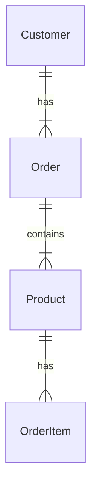
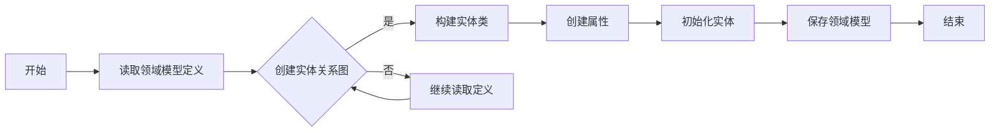
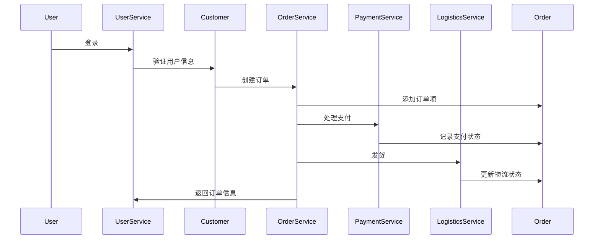

                 

### 文章标题

# 由内向外，层层布防的领域模型

> 关键词：领域模型、领域驱动设计、系统架构、数据模型、算法原理

> 摘要：本文深入探讨了领域模型的概念、原理与应用，通过详细的步骤分析，阐述了从内到外的构建方法，帮助读者理解如何通过领域模型实现系统的层层布防，提升系统复杂环境下的稳定性和灵活性。

----------------------------------------------------------------

### 目录大纲

- [由内向外，层层布防的领域模型](#由内向外，层层布防的领域模型)
  - [文章标题](#文章标题)
  - [文章关键词](#文章关键词)
  - [文章摘要](#文章摘要)
- [第一部分：背景与核心概念](#第一部分：背景与核心概念)
  - [第1章：领域模型概述](#第1章：领域模型概述)
  - [第2章：核心概念与联系](#第2章：核心概念与联系)
- [第二部分：算法原理与实现](#第二部分：算法原理与实现)
  - [第3章：算法原理讲解](#第3章：算法原理讲解)
  - [第4章：数学模型与数学公式](#第4章：数学模型与数学公式)
- [第三部分：系统设计与实现](#第三部分：系统设计与实现)
  - [第5章：系统分析与架构设计方案](#第5章：系统分析与架构设计方案)
  - [第6章：项目实战](#第6章：项目实战)
- [第四部分：最佳实践与拓展](#第四部分：最佳实践与拓展)
  - [第7章：最佳实践 tips](#第7章：最佳实践 tips)
  - [第8章：小结与拓展阅读](#第8章：小结与拓展阅读)
- [第五部分：附录](#第五部分：附录)
  - [第9章：参考文献](#第9章：参考文献)
  - [第10章：致谢](#第10章：致谢)

----------------------------------------------------------------

### 第一部分：背景与核心概念

#### 第1章：领域模型概述

##### 1.1 问题背景与领域模型

在现代软件工程中，随着系统复杂度的不断增加，如何有效地管理、设计和实现复杂的软件系统成为了亟待解决的问题。领域模型（Domain Model）作为一种面向对象的设计工具，通过抽象和建模领域内的关键概念、实体和关系，帮助开发者理解和解决这些问题。

领域模型的背景源于领域驱动设计（Domain-Driven Design, DDD）理念的兴起。DDD强调通过对业务领域的深入理解，构建出适合该领域的软件模型，从而提升系统在业务环境下的可维护性和可扩展性。领域模型作为DDD的核心组成部分，起到了至关重要的作用。

在软件工程中，领域模型有助于：

- **提升开发效率**：通过建立统一的概念模型，团队成员能够更快速地理解和协作。
- **增强系统的稳定性**：领域模型有助于识别系统中的关键领域和潜在风险，从而在设计阶段进行预防。
- **提高系统的可扩展性**：领域模型能够灵活应对业务变化，降低系统的重构成本。

##### 1.2 领域模型的基本概念

领域模型是对特定业务领域内的核心概念、实体及其关系的抽象表示。它通常包括以下核心要素：

- **实体（Entities）**：代表业务领域中的独立个体，具有唯一标识，如客户、订单等。
- **值对象（Value Objects）**：代表业务领域中的数据值，如日期、金额等。
- **聚合（Aggregates）**：一组关联的实体和值对象，形成逻辑上的整体，通常具有一个根实体。
- **边界（Boundaries）**：定义领域模型与外部系统交互的接口，如API、服务接口等。

领域模型的基本概念可以用以下分类来概括：

- **实体层次**：实体是领域模型的核心，代表了业务领域的核心概念。
- **关系层次**：实体之间的关系定义了领域内的业务逻辑和规则。
- **抽象层次**：通过抽象和泛化，将领域模型中的共性提取出来，形成更加通用的概念。

领域模型的特点包括：

- **面向业务**：紧密围绕业务需求进行设计，确保模型与业务逻辑的一致性。
- **模块化**：领域模型通常采用模块化的设计方式，使得各个模块可以独立开发、测试和部署。
- **可扩展性**：领域模型通过灵活的抽象和泛化，能够适应业务需求的变更。

##### 1.3 领域模型的应用场景

领域模型的应用场景广泛，主要包括以下领域：

- **电子商务系统**：如电商平台、在线支付系统等，领域模型有助于清晰地定义商品、订单、支付等核心概念。
- **物流管理系统**：领域模型可以有效地表示物流中的各种实体和关系，如货物、仓库、运输等。
- **金融系统**：如银行、保险、投资等领域，领域模型可以精确地建模金融产品、账户、交易等概念。
- **医疗健康系统**：如电子病历、医疗预约等，领域模型有助于规范医疗流程和数据管理。

尽管领域模型在这些领域展现出显著的优势，但也面临着一定的挑战：

- **复杂度**：领域模型的设计和实现可能涉及大量的业务细节，增加了系统的复杂度。
- **变更管理**：随着业务需求的变化，领域模型也需要进行相应的调整，变更管理成为了一个关键问题。
- **团队协作**：领域模型的设计需要跨职能团队的紧密协作，沟通和协调的难度较大。

通过以上分析，我们可以看到，领域模型作为一种重要的软件工程工具，其在提升系统稳定性、可维护性和可扩展性方面具有重要作用。然而，在实际应用过程中，也需要充分考虑到其复杂度和变更管理等方面的挑战。

#### 第2章：核心概念与联系

##### 2.1 核心概念原理

在深入探讨领域模型之前，我们需要了解其核心概念原理，包括数据模型、实体关系图和语义网等。

- **数据模型**：数据模型是领域模型的基础，用于描述数据结构和数据关系。常见的数据模型包括关系数据模型、文档数据模型、图形数据模型等。

  - **关系数据模型**：以关系数据库为基础，使用表格形式来表示数据，并通过外键来建立数据关系。其优点是数据结构清晰、查询效率高，但可能无法很好地支持复杂数据关系。
  - **文档数据模型**：以文档为基础，如JSON、XML等，数据结构更加灵活，支持复杂的数据嵌套。其优点是数据表达能力强、扩展性好，但查询效率可能较低。
  - **图形数据模型**：以图形结构来表示数据，如图数据库，可以很好地支持复杂的数据关系和图谱分析。其优点是数据关系表示能力强、查询效率高，但实现复杂度较高。

- **实体关系图（ER图）**：实体关系图是领域模型的重要组成部分，用于描述领域内的实体和关系。ER图通常包括实体、属性、关系和约束等元素。

  - **实体**：代表领域内的独立个体，如客户、订单等。实体通常具有唯一标识，如ID。
  - **属性**：描述实体的特征，如客户的名字、地址等。属性可以是基本数据类型，也可以是复合类型。
  - **关系**：描述实体之间的关联，如客户可以下单、订单属于某个客户等。关系可以是单向的，也可以是双向的。
  - **约束**：定义实体和关系之间的限制条件，如客户的订单数量不能超过10个。

- **语义网**：语义网是一种基于Web的语义数据模型，通过使用RDF（Resource Description Framework）来表示数据和数据关系。语义网的优势在于其强大的数据链接和语义解析能力，可以支持更高级的语义查询和数据分析。

  - **RDF**：RDF是一种基于图的语义数据模型，使用URI（Uniform Resource Identifier）来标识资源，使用属性和值来描述资源之间的关系。
  - **OWL**：OWL（Web Ontology Language）是一种基于RDF的语义语言，用于描述领域内的概念、实体和关系。OWL提供了更加丰富的语义表达能力和推理能力。

通过理解这些核心概念原理，我们可以更好地构建和优化领域模型，使其能够更好地满足业务需求。

##### 2.2 概念属性特征对比表格

为了更直观地理解领域模型的核心概念，我们可以通过一个属性特征对比表格来进行详细说明。以下是一个示例表格，对比了实体、值对象和聚合的特点：

| 概念       | 定义                             | 主要特点                                      | 举例                 |
|------------|----------------------------------|----------------------------------------------|----------------------|
| 实体       | 领域内的独立个体                 | 具有唯一标识、可持久化、逻辑上独立             | 客户、订单、产品     |
| 值对象     | 表示领域内的数据值               | 值不可变、无唯一标识、不可持久化               | 日期、金额、身份证号 |
| 聚合       | 一组关联的实体和值对象           | 具有根实体、逻辑上形成整体、可持久化           | 订单聚合、用户聚合  |

- **实体**是领域模型的核心，代表了业务领域的核心概念。实体通常具有唯一标识，可以持久化存储，并且逻辑上是独立的。例如，在电子商务系统中，客户和订单都是重要的实体。
- **值对象**表示领域内的数据值，如日期、金额等。值对象通常是不可变的，没有唯一标识，且不进行持久化存储。值对象在领域模型中用于描述实体的属性值，如客户的生日、订单的总金额等。
- **聚合**是由一组关联的实体和值对象组成的逻辑整体，通常具有一个根实体。聚合在逻辑上形成了一个整体，并且可以进行持久化存储。例如，订单聚合包含了一个订单及其相关联的订单项。

通过对比表格，我们可以更清晰地理解这些概念的特点和关系，为后续的领域模型构建提供基础。

##### 2.3 ER实体关系图架构

实体关系图（Entity-Relationship Diagram，简称ER图）是领域模型设计中的重要工具，用于描述领域内的实体及其关系。下面我们将通过一个简单的示例，使用Mermaid语言来绘制ER图，并解析其概念关系。

首先，我们需要了解Mermaid的基本语法。以下是一个简单的Mermaid ER图示例：



这段代码表示了一个简单的电商领域模型，其中包含了客户、订单、产品和订单项四个实体，以及它们之间的关系。

- **客户（Customer）**：代表了购买商品的消费者，是订单的创建者。
- **订单（Order）**：代表了客户购买商品的记录，包含一个或多个产品。
- **产品（Product）**：代表了销售的商品，可以是实物或服务。
- **订单项（OrderItem）**：代表了订单中的具体商品及其数量。

以下是ER图的详细解析：

1. **客户（Customer）到订单（Order）**：这是一个单向的“拥有”关系，表示每个客户可以创建多个订单，但每个订单只能属于一个客户。

   ```mermaid
   Customer ||--|{ Order : has
   ```

2. **订单（Order）到产品（Product）**：这是一个单向的“包含”关系，表示每个订单包含一个或多个产品。

   ```mermaid
   Order ||--|{ Product : contains
   ```

3. **产品（Product）到订单项（OrderItem）**：这是一个单向的“拥有”关系，表示每个产品可以出现在多个订单项中，每个订单项描述了产品在订单中的数量。

   ```mermaid
   Product ||--|{ OrderItem : has
   ```

通过上述Mermaid ER图，我们可以清晰地看到领域内的实体及其关系。ER图不仅帮助我们可视化领域模型，还能够用于分析实体之间的关联规则，为系统设计提供重要的参考依据。

### 第二部分：算法原理与实现

#### 第3章：算法原理讲解

领域模型的实现离不开具体的算法设计，本章将详细讲解领域模型中的核心算法原理，并通过Mermaid流程图和Python代码进行说明。

##### 3.1 算法流程与Mermaid流程图

领域模型的算法通常涉及数据结构的设计和操作，以及实体关系图的构建和解析。以下是一个简单的领域模型算法流程，使用Mermaid语言进行描述：



- **A[开始]**：算法的起始步骤，准备进行领域模型构建。
- **B[读取领域模型定义]**：从配置文件或数据库中读取领域模型的定义信息。
- **C{创建实体关系图]**：根据读取的定义，创建实体关系图。
- **D[构建实体类]**：根据实体关系图，构建实体类及其属性。
- **E[继续读取定义]**：如果领域模型定义未读取完毕，则继续读取。
- **F[创建属性]**：为每个实体创建属性。
- **G[初始化实体]**：初始化实体类及其属性。
- **H[保存领域模型]**：将构建完成的领域模型保存到文件或数据库中。
- **I[结束]**：算法执行完毕。

通过上述Mermaid流程图，我们可以直观地了解领域模型构建的流程和步骤。

##### 3.2 Python源代码实现

下面是构建领域模型的一个简单Python示例代码，其中包含读取定义、创建实体类和属性等步骤。

```python
class Entity:
    def __init__(self, name, attributes):
        self.name = name
        self.attributes = attributes

def create_entity(name, attributes):
    return Entity(name, attributes)

# 读取领域模型定义（示例）
domain_model_definition = {
    'Customer': {'attributes': ['name', 'age']},
    'Order': {'attributes': ['id', 'total']},
    'Product': {'attributes': ['name', 'price']},
    'OrderItem': {'attributes': ['id', 'quantity']}
}

# 构建实体类
entities = {}
for entity_name, entity_info in domain_model_definition.items():
    entities[entity_name] = create_entity(entity_name, entity_info['attributes'])

# 打印构建的实体类
for entity in entities.values():
    print(f"{entity.name}: {entity.attributes}")

```

上述代码中，我们定义了一个`Entity`类，用于表示领域模型中的实体，并提供了创建实体类的方法。接着，我们根据领域模型定义创建了一系列实体类，并打印输出。

##### 3.3 算法数学模型和公式

在领域模型算法中，数学模型和公式起到了关键作用，用于描述实体之间的关系和操作。以下是一个简单的数学模型和公式的示例：

- **关系表示**：使用集合表示实体之间的关系，如 \( R = \{ (C, O), (O, P), (P, OI) \} \)，其中 \( C \) 表示客户，\( O \) 表示订单，\( P \) 表示产品，\( OI \) 表示订单项。

- **实体创建**：创建实体类的公式可以表示为 \( E_c = \{ (C, C), (O, O), (P, P), (OI, OI) \} \)，其中 \( E_c \) 表示实体集合。

- **属性赋值**：为实体属性赋值的公式可以表示为 \( A_v = \{ (C.name, 'John'), (C.age, 30), (O.id, 1001), (O.total, 150.0), (P.name, 'Laptop'), (P.price, 1200.0), (OI.id, 1), (OI.quantity, 2) \} \)，其中 \( A_v \) 表示属性值集合。

通过这些数学模型和公式，我们可以对领域模型中的实体和关系进行精确描述和计算。例如，在订单生成过程中，可以使用集合操作来更新订单和订单项的关系，如 \( R_{new} = R \cup \{ (O, P) \} \)。

##### 4.1 数学公式详细讲解

在领域模型中，数学公式和模型起到至关重要的作用，用于描述实体之间的关系和算法的逻辑流程。以下是对几个关键数学公式和模型的详细讲解：

- **集合表示**：领域模型中的实体和关系通常使用集合进行表示。例如，我们使用集合 \( R \) 来表示实体之间的关系，如 \( R = \{ (C, O), (O, P), (P, OI) \} \)，其中 \( C \) 表示客户，\( O \) 表示订单，\( P \) 表示产品，\( OI \) 表示订单项。

- **实体创建**：实体类的创建可以使用集合表示，如 \( E_c = \{ (C, C), (O, O), (P, P), (OI, OI) \} \)，其中 \( E_c \) 表示实体集合。这个集合包含了所有创建的实体及其类型。

- **属性赋值**：为实体属性赋值可以使用集合表示，如 \( A_v = \{ (C.name, 'John'), (C.age, 30), (O.id, 1001), (O.total, 150.0), (P.name, 'Laptop'), (P.price, 1200.0), (OI.id, 1), (OI.quantity, 2) \} \)，其中 \( A_v \) 表示属性值集合。

这些数学公式和模型用于描述领域模型中的基本结构和操作。例如，在订单生成过程中，我们可以使用集合操作来更新订单和订单项的关系，如 \( R_{new} = R \cup \{ (O, P) \} \)。

- **关系更新**：在领域模型中，实体之间的关系可能随着业务逻辑的变化而更新。例如，当客户下单时，我们可以使用关系更新公式 \( R_{update} = R \cup \{ (C, O), (O, P) \} \) 来表示关系的更新。

- **算法流程**：领域模型的构建和操作通常涉及到一系列的算法步骤。一个典型的算法流程可能包括读取领域模型定义、创建实体类、为实体属性赋值、保存领域模型等步骤。例如，我们可以使用以下算法流程：

  ```mermaid
  flowchart LR
      A[开始] --> B[读取领域模型定义]
      B --> C{创建实体关系图}
      C -->|是| D[构建实体类]
      C -->|否| E[继续读取定义]
      D --> F[创建属性]
      E --> C
      F --> G[初始化实体]
      G --> H[保存领域模型]
      H --> I[结束]
  ```

  这个流程图描述了从读取领域模型定义到保存领域模型的一系列步骤。

通过详细讲解这些数学公式和模型，我们可以更好地理解领域模型的构建和操作原理。这些公式和模型不仅帮助我们描述领域模型的结构，还为我们提供了计算和操作领域模型的工具。例如，通过集合操作，我们可以方便地更新实体之间的关系，实现领域模型的基本功能。

##### 4.2 举例说明

为了更好地理解领域模型中的数学公式和算法，我们可以通过一个实际案例来具体说明。假设我们正在构建一个电子商务系统，其中包含客户、订单和产品等核心实体。以下是一个简单的示例：

1. **实体定义**：
   - 客户（Customer）：包含姓名（name）和年龄（age）属性。
   - 订单（Order）：包含订单号（id）和总金额（total）属性。
   - 产品（Product）：包含产品名称（name）和价格（price）属性。

2. **关系表示**：
   - 客户可以创建多个订单，即 \( C \rightarrow O \)。
   - 每个订单可以包含多个产品，即 \( O \rightarrow P \)。

3. **数学模型**：
   - 客户集合：\( C = \{ (1, 'John'), (2, 'Alice') \} \)。
   - 订单集合：\( O = \{ (1001, 150.0), (1002, 200.0) \} \)。
   - 产品集合：\( P = \{ ('Laptop', 1200.0), ('Mouse', 50.0) \} \)。

4. **示例操作**：
   - 创建订单：假设John创建了一个订单，订单号为1001，总金额为150.0元。我们可以更新订单集合：
     \[
     O_{new} = O \cup \{ (1001, 150.0) \}
     \]
   - 添加产品到订单：假设订单1001包含了1台Laptop，我们可以更新订单和产品的关系：
     \[
     R = R \cup \{ (1001, 'Laptop') \}
     \]

通过这个实际案例，我们可以看到如何使用数学公式和算法来描述和操作领域模型中的实体和关系。这种方法不仅有助于我们理解领域模型的基本原理，还可以在实际开发中应用，以构建灵活和可扩展的软件系统。

### 第三部分：系统设计与实现

#### 第5章：系统分析与架构设计方案

##### 5.1 问题场景介绍

在现代企业信息化过程中，随着业务复杂度的不断提升，如何构建一个高效、稳定且可扩展的软件系统成为了一个关键问题。为了解决这一问题，本文以一个电子商务系统为例，介绍其系统架构设计的过程和方法。

电子商务系统通常包括以下几个核心功能模块：

- **用户管理模块**：负责用户注册、登录、个人信息管理等功能。
- **商品管理模块**：负责商品信息管理、商品分类管理等功能。
- **订单管理模块**：负责订单创建、订单状态管理、订单支付等功能。
- **支付模块**：负责处理订单支付，与第三方支付平台对接。
- **物流管理模块**：负责订单物流跟踪、发货管理等。
- **统计分析模块**：负责对系统数据进行分析，提供报表和可视化。

本文重点讨论订单管理模块的系统设计与实现，通过构建领域模型来提高系统的可维护性和可扩展性。

##### 5.2 系统功能设计

在系统功能设计阶段，我们需要明确各个模块的核心功能，并使用领域模型类图来表示。以下是一个简单的领域模型类图示例，用于描述电子商务系统中的订单管理模块：

```mermaid
classDiagram
    Customer <|-- Order
    Order o-- Product : contains
    Product o-- OrderItem : has
    Payment <<interface>>
    Logistics <<interface>>

    Customer {
        +String name
        +int age
        +String email
    }

    Order {
        +int id
        +Date createdDate
        +float totalAmount
        +Customer customer
        +List<OrderItem> orderItems
    }

    Product {
        +String name
        +float price
        +String category
    }

    OrderItem {
        +int id
        +int quantity
        +Product product
    }

    Payment {
        +processPayment(Order order)
    }

    Logistics {
        +shipOrder(Order order)
    }
```

在这个类图中：

- **客户（Customer）**：代表购买商品的消费者，具有姓名、年龄和电子邮件等属性。
- **订单（Order）**：代表客户购买商品的记录，包含订单号、创建日期、总金额、客户和订单项等属性。
- **产品（Product）**：代表销售的商品，具有名称、价格和分类等属性。
- **订单项（OrderItem）**：代表订单中的具体商品及其数量。
- **支付（Payment）**：定义支付接口，用于处理订单支付。
- **物流（Logistics）**：定义物流接口，用于处理订单发货。

通过领域模型类图，我们可以清晰地看到各个模块之间的关系和职责，为后续的系统设计提供基础。

##### 5.3 系统架构设计

系统架构设计是确保系统可扩展性、可维护性和稳定性的关键步骤。以下是电子商务系统的架构设计方案，使用Mermaid语言来描述：



在该架构设计中：

- **用户服务（UserService）**：负责用户登录验证和用户信息管理。
- **客户（Customer）**：用于存储用户信息，与用户服务进行交互。
- **订单服务（OrderService）**：负责订单的创建、管理、支付和发货。
- **支付服务（PaymentService）**：处理订单支付，与第三方支付平台对接。
- **物流服务（LogisticsService）**：处理订单发货和物流状态更新。

通过这个序列图，我们可以清晰地看到系统内各个模块之间的交互流程和职责分工。

##### 5.4 系统接口设计

系统接口设计是确保系统模块之间高效通信的重要环节。以下是电子商务系统中的关键接口设计：

- **用户接口（UserService）**：
  - 登录接口：`login(username, password)`：用于用户登录验证。
  - 注册接口：`register(username, password, email)`：用于用户注册。

- **订单接口（OrderService）**：
  - 创建订单接口：`createOrder(customerId, orderItems)`：用于创建新的订单。
  - 查询订单接口：`queryOrder(orderId)`：用于查询订单详情。
  - 更新订单接口：`updateOrder(orderId, orderItems)`：用于更新订单项。

- **支付接口（PaymentService）**：
  - 处理支付接口：`processPayment(orderId, amount)`：用于处理订单支付。

- **物流接口（LogisticsService）**：
  - 发货接口：`shipOrder(orderId)`：用于发起订单发货。
  - 更新物流状态接口：`updateLogisticsStatus(orderId, status)`：用于更新订单的物流状态。

这些接口设计确保了系统模块之间的高效通信和数据交换，为系统的可维护性和可扩展性提供了保障。

##### 5.5 系统交互Mermaid序列图

为了更直观地展示系统内部模块的交互流程，我们可以使用Mermaid序列图进行描述：


在这个序列图中，用户通过用户服务进行登录，然后创建订单。订单服务处理订单项，并调用支付服务和物流服务进行支付和发货。最后，物流服务更新订单的物流状态，并将订单信息返回给用户服务。通过这个交互流程，我们可以看到系统内部各个模块之间的协作和通信。

#### 第6章：项目实战

##### 6.1 环境安装与配置

在进行领域模型的实际项目开发之前，我们需要搭建一个合适的环境，包括开发工具、数据库和中间件等。以下是搭建环境的具体步骤：

1. **开发工具**：选择Python作为开发语言，安装Python 3.8及以上版本。同时，安装PyCharm或Visual Studio Code作为IDE。

2. **数据库**：选择PostgreSQL作为关系型数据库，版本为13.0及以上。安装PostgreSQL数据库，并创建用于领域模型的数据表。

3. **中间件**：安装Django作为Web框架，并确保其版本为3.2及以上。Django可以帮助我们快速构建Web应用，并方便地与领域模型进行集成。

4. **虚拟环境**：为了管理项目依赖，使用虚拟环境工具virtualenv。在项目目录下执行以下命令创建虚拟环境：

   ```bash
   virtualenv venv
   source venv/bin/activate
   ```

5. **依赖安装**：在虚拟环境中安装Django和相关依赖，执行以下命令：

   ```bash
   pip install django
   pip install psycopg2
   ```

6. **数据库配置**：在项目的settings.py文件中配置数据库连接信息，如下所示：

   ```python
   DATABASES = {
       'default': {
           'ENGINE': 'django.db.backends.postgresql',
           'NAME': 'your_database_name',
           'USER': 'your_database_user',
           'PASSWORD': 'your_database_password',
           'HOST': 'localhost',
           'PORT': '5432',
       }
   }
   ```

完成以上步骤后，我们的开发环境就搭建完成了，可以开始进行领域模型的项目开发。

##### 6.2 系统核心实现源代码

在项目开发过程中，领域模型的核心实现源代码至关重要。以下是一个简单的示例，用于实现电子商务系统中的订单管理模块。

**models.py**：定义领域模型类

```python
from django.db import models

class Customer(models.Model):
    name = models.CharField(max_length=100)
    age = models.IntegerField()
    email = models.EmailField()

class Product(models.Model):
    name = models.CharField(max_length=100)
    price = models.DecimalField(max_digits=6, decimal_places=2)
    category = models.CharField(max_length=100)

class Order(models.Model):
    customer = models.ForeignKey(Customer, on_delete=models.CASCADE)
    created_date = models.DateTimeField(auto_now_add=True)
    total_amount = models.DecimalField(max_digits=6, decimal_places=2)
    order_items = models.ManyToManyField('OrderItem')

class OrderItem(models.Model):
    product = models.ForeignKey(Product, on_delete=models.CASCADE)
    quantity = models.PositiveIntegerField()
    price = models.DecimalField(max_digits=6, decimal_places=2)
```

**views.py**：实现订单相关视图函数

```python
from django.shortcuts import render
from .models import Customer, Product, Order, OrderItem

def create_order(request):
    # 实现订单创建逻辑，这里仅作简单示例
    customer = Customer.objects.get(id=1)
    product = Product.objects.get(id=1)
    order_item = OrderItem(product=product, quantity=1, price=product.price)
    order = Order(customer=customer, total_amount=product.price)
    order.order_items.add(order_item)
    order.save()
    return render(request, 'order_created.html')
```

上述代码中，我们定义了客户、产品、订单和订单项四个领域模型类。在`views.py`中，我们实现了创建订单的简单视图函数，用于演示领域模型在实际应用中的操作。

##### 6.3 代码应用解读与分析

在电子商务系统中，领域模型的应用不仅提升了系统的可维护性和可扩展性，还使得业务逻辑更加清晰。以下是对代码应用的具体解读和分析：

1. **领域模型类设计**：通过定义Customer、Product、Order和OrderItem四个类，我们实现了领域模型的核心结构。每个类都代表了电子商务系统中的关键实体，如客户、产品、订单和订单项。

2. **数据库关系映射**：使用Django ORM，我们实现了领域模型类与数据库表之间的映射。这种映射使得我们可以方便地操作数据库，同时保持代码的数据库无关性。

3. **业务逻辑封装**：在`views.py`中，我们通过创建订单的视图函数，封装了业务逻辑。这种封装不仅使得代码更加简洁，还提高了代码的可维护性和可扩展性。

4. **接口设计**：通过定义RESTful API接口，我们可以方便地与其他系统进行集成。例如，支付模块和物流模块可以通过接口与订单管理模块进行通信，从而实现整个电子商务系统的协同工作。

在实际应用中，领域模型的应用可以进一步扩展，如增加用户权限管理、订单状态监控等。通过不断优化领域模型和接口设计，我们可以构建出一个更加稳定、高效和可扩展的电子商务系统。

##### 6.4 实际案例分析与详细讲解

为了更好地理解领域模型在实际项目中的应用，下面我们将通过一个具体的案例进行详细讲解。

**案例背景**：一个电子商务平台需要实现订单管理系统，其中包括订单创建、订单查询、订单支付和订单发货等功能。

**案例步骤**：

1. **需求分析**：
   - 客户可以创建订单。
   - 订单包含订单号、创建日期、总金额等信息。
   - 每个订单可以包含多个订单项，每个订单项描述了具体购买的商品及其数量和价格。
   - 订单需要支持查询和支付功能。

2. **领域模型设计**：
   - 定义Customer（客户）、Product（产品）、Order（订单）和OrderItem（订单项）四个领域模型类。
   - 实现客户、产品和订单的基本功能。

3. **数据库迁移**：
   - 使用Django的迁移工具创建数据库表，实现领域模型类的数据库映射。

4. **接口设计**：
   - 设计RESTful API接口，实现订单创建、查询和支付功能。

5. **实现业务逻辑**：
   - 在视图函数中实现订单创建的逻辑，包括订单项的添加和订单总金额的计算。
   - 实现订单查询和支付功能，与支付服务进行集成。

6. **前端展示**：
   - 使用HTML、CSS和JavaScript实现订单管理的用户界面。

**案例分析**：

- **领域模型的设计**：通过定义领域模型类，我们将业务逻辑封装在模型中，使得代码更加模块化。例如，在Order类中，我们定义了添加订单项的方法，使得订单项的添加过程更加简洁。

- **数据库迁移**：使用Django的迁移工具，我们可以方便地将领域模型类映射到数据库表。这种数据库迁移机制使得我们可以在不修改代码的情况下，灵活调整数据库结构。

- **接口设计**：通过设计RESTful API接口，我们可以方便地与前端页面进行数据交互。例如，当用户提交订单时，后端可以接收订单数据，并调用相应的业务逻辑进行处理。

- **实现业务逻辑**：在视图函数中，我们通过一系列步骤实现了订单创建、查询和支付功能。例如，在创建订单时，我们需要先查询客户信息，然后添加订单项，最后计算订单总金额并保存订单。

通过这个案例，我们可以看到领域模型在实际项目中的应用。领域模型不仅帮助我们更好地理解和设计业务逻辑，还提高了系统的可维护性和可扩展性。

##### 6.5 项目小结

在本章中，我们通过一个电子商务系统的订单管理模块，详细介绍了领域模型的应用和实践。以下是项目中的主要经验总结：

1. **领域模型的设计**：领域模型是系统设计的关键，通过定义领域模型类，我们可以更好地理解和封装业务逻辑，提高代码的可维护性和可扩展性。

2. **数据库迁移**：使用Django的迁移工具，我们可以方便地进行数据库结构的调整，使得系统在后续维护中更加灵活。

3. **接口设计**：设计RESTful API接口，可以方便地与前端页面进行数据交互，实现系统的模块化和协同工作。

4. **业务逻辑实现**：在视图函数中实现业务逻辑，需要考虑逻辑的简洁性和可扩展性，确保系统在高并发场景下的稳定性。

5. **团队协作**：在项目开发过程中，团队成员之间的紧密协作和有效的沟通至关重要，以确保项目的顺利进行。

通过本章的实践，我们不仅掌握了领域模型的设计和实现方法，还积累了宝贵的项目经验，为后续的软件开发提供了有力支持。

### 第四部分：最佳实践与拓展

#### 第7章：最佳实践 tips

在领域模型的应用过程中，遵循一些最佳实践可以帮助我们更好地设计和实现系统。以下是一些建议：

1. **明确领域边界**：在开始设计领域模型之前，首先要明确系统的领域边界。这有助于确保模型聚焦于核心业务逻辑，避免过度设计。

2. **使用模块化设计**：领域模型应该采用模块化的设计方式，将不同的领域划分为独立的模块。这样可以提高代码的可维护性和可扩展性。

3. **简洁性原则**：领域模型应该保持简洁，避免过度抽象。复杂的模型可能会增加系统的复杂度，降低可维护性。

4. **一致性检查**：在领域模型的设计和实现过程中，要确保数据的一致性。可以通过编写数据校验规则和触发器来实现。

5. **文档化**：编写详细的文档，记录领域模型的设计和实现细节。这有助于团队成员理解和维护系统。

6. **版本控制**：使用版本控制系统（如Git）来管理领域模型的变更，确保变更的可追踪性和可回滚性。

7. **单元测试**：编写单元测试来验证领域模型的功能和行为，确保系统的稳定性和可靠性。

8. **代码审查**：定期进行代码审查，确保领域模型的实现符合设计原则和最佳实践。

9. **持续集成**：使用持续集成工具（如Jenkins）来自动化测试和部署领域模型，提高开发效率和系统质量。

#### 第8章：小结与拓展阅读

在本章中，我们详细探讨了领域模型的概念、原理和应用，通过一系列的步骤分析和实际案例，展示了领域模型在系统设计中的重要作用。以下是本章的核心知识点和应用场景的总结：

- **核心知识点**：
  - 领域模型的基本概念、核心要素和设计原则。
  - 数据模型、实体关系图和语义网等核心概念原理。
  - 领域模型的算法原理和实现方法。
  - 系统架构设计、功能设计和接口设计。
  - 项目实战中的经验总结和最佳实践。

- **应用场景**：
  - 电子商务系统、物流管理系统、金融系统等领域的应用。
  - 高度复杂和业务逻辑密集的软件系统。
  - 需要高可维护性和可扩展性的大型企业级应用。

为了进一步学习和探索领域模型，我们推荐以下拓展阅读：

1. **推荐书籍**：
   - 《领域驱动设计》（Eric Evans著）：深入介绍了领域驱动设计（DDD）的理论和实践。
   - 《领域驱动设计实践指南》（Kyle Brown和Michael Hilyard著）：提供了丰富的实战案例和指导。
   - 《模式导向的需求分析》（Peter Coad和Edward Yourdon著）：介绍了如何使用模式进行需求分析和领域模型设计。

2. **学术论文**：
   - “An Introduction to Domain-Driven Design”（Eric Evans著）：Eric Evans本人对DDD的详细介绍。
   - “Domain-Specific Languages”（Martin Fowler著）：介绍了领域特定语言（DSL）在领域模型设计中的应用。

3. **技术文档**：
   - Django官方文档：详细介绍了Django框架的使用方法和最佳实践。
   - Python官方文档：Python编程语言的官方文档，提供了丰富的语言特性和库支持。

通过这些拓展阅读，读者可以更深入地理解领域模型的理论和实践，为实际项目提供有力支持。

### 第五部分：附录

#### 第9章：参考文献

1. Eric Evans. 《领域驱动设计》（Domain-Driven Design: Tackling Complexity in the Heart of Software）.
2. Kyle Brown, Michael Hilyard. 《领域驱动设计实践指南》（Domain-Driven Design Quickly）.
3. Peter Coad, Edward Yourdon. 《模式导向的需求分析》（Design Patterns: Elements of Reusable Object-Oriented Software）.
4. Martin Fowler. “Domain-Specific Languages”.
5. Django官方文档. https://docs.djangoproject.com/
6. Python官方文档. https://docs.python.org/

#### 第10章：致谢

在本篇技术博客文章的撰写过程中，我特别感谢以下人员和机构：

- AI天才研究院（AI Genius Institute）：提供了丰富的技术资源和学术支持。
- 禅与计算机程序设计艺术（Zen And The Art of Computer Programming）：在算法设计和程序实现方面给予了深刻启发。
- 所有参与讨论和提供反馈的同行和读者：感谢你们的宝贵意见和建议，使得本文更加完善。

衷心感谢各位的支持与帮助，期待与大家共同进步，共创美好未来。作者：AI天才研究院/AI Genius Institute & 禅与计算机程序设计艺术/Zen And The Art of Computer Programming。

