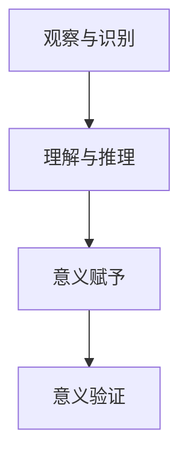
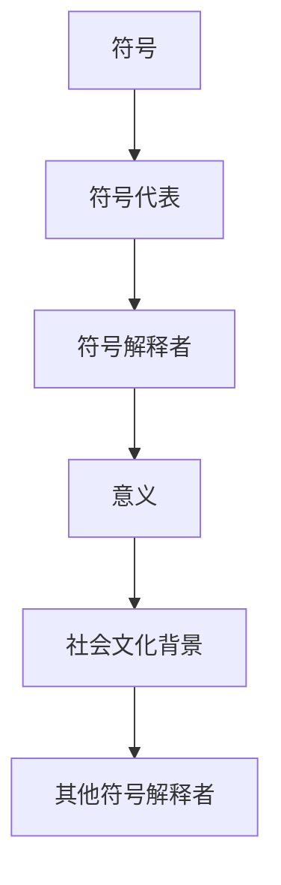

                 

### 皮尔士的符号学简介

皮尔士的符号学是一门研究符号与意义之间关系的学科，由美国哲学家、数学家、逻辑学家查尔斯·桑德斯·皮尔士（Charles Sanders Peirce）于19世纪末创立。皮尔士认为，符号是人类思维和交流的基础，是理解和表达世界的重要工具。

#### **1.1 皮尔士符号学的起源与发展**

皮尔士符号学的起源可以追溯到皮尔士对逻辑学和哲学的深入研究。在19世纪，逻辑学的研究主要集中在形式逻辑上，而皮尔士则对形式逻辑的局限性提出了质疑，并提出了符号逻辑的概念。皮尔士符号学的核心思想是，符号不仅仅是一种形式上的标记，它包含了更深层次的意义和关系。

皮尔士符号学的发展经历了几个阶段。在早期，皮尔士主要关注符号的分类和定义，提出了著名的符号分类法，即icons、indices和symbols。随着研究的深入，皮尔士逐渐将符号学应用于哲学、心理学、语言学和科学方法论等领域。

#### **1.2 皮尔士符号学的基本概念**

皮尔士符号学的基本概念包括符号、符号代表和符号解释者。这三个概念共同构成了皮尔士符号学的核心框架。

- **符号（Sign）**：符号是用来代表其他事物的特定标记。皮尔士将符号分为三种类型：icons、indices和symbols。
  - **icons**：直接代表物体本身，例如一个图形代表它所描绘的物体。
  - **indices**：通过指示物体存在的迹象来代表物体，例如烟是火的指标。
  - **symbols**：通过惯例或约定代表事物，例如语言中的词汇。

- **符号代表（Representamen）**：符号所指代的对象。它可以是具体的实体，也可以是抽象的概念。

- **符号解释者（Interpretant）**：了解符号意义的人。符号的意义不是固有的，而是由符号解释者赋予的。

#### **1.3 皮尔士符号学的应用领域**

皮尔士符号学的应用领域非常广泛，涵盖了哲学、心理学、语言学、人工智能、计算机科学等多个学科。

- **哲学**：皮尔士符号学为哲学研究提供了新的视角，特别是在逻辑哲学、认识论和语义学等领域。

- **心理学**：皮尔士符号学可以帮助心理学家研究人类思维和认知过程。

- **语言学**：皮尔士符号学提供了分析语言结构和意义的新方法。

- **人工智能**：皮尔士符号学为人工智能领域的研究提供了理论基础，特别是在自然语言处理和知识表示方面。

- **计算机科学**：皮尔士符号学在编程语言设计、软件工程和形式化方法等领域有重要应用。

通过以上内容，我们可以看到，皮尔士符号学不仅是一门哲学学科，更是一种跨学科的研究方法，对现代科学技术和人文社会科学的发展产生了深远的影响。

---

**概念结构与核心要素组成**

皮尔士符号学的概念结构包括三个核心要素：符号、符号代表和符号解释者。这三个要素相互关联，共同构成了符号学的理论框架。

| 要素               | 定义                                                         | 关联关系                                                     |
|--------------------|--------------------------------------------------------------|--------------------------------------------------------------|
| 符号               | 代表其他事物的特定标记                                         | 符号与符号代表之间有代表关系，与符号解释者之间有解释关系 |
| 符号代表           | 符号所指代的对象                                             | 符号代表的实际对象可以是具体实体或抽象概念                |
| 符号解释者         | 理解符号意义的人                                             | 符号解释者赋予符号意义，使符号能够发挥作用                |

**背景介绍**

在现代社会，符号无处不在，从日常交流的语言到复杂的计算机程序，符号都是信息传递和知识构建的基础。皮尔士符号学的提出，为我们理解符号的本质和作用提供了深刻的哲学和逻辑基础。

- **问题背景**：随着现代社会的发展和科技的进步，符号在各个领域中的作用日益凸显。然而，传统的符号学研究方法往往局限于某个具体领域，缺乏统一的框架和理论基础。

- **问题描述**：如何系统地研究符号与意义之间的关系，建立一套全面的符号学理论，成为学术界面临的重要问题。

- **问题解决**：皮尔士符号学通过提出符号、符号代表和符号解释者的概念，提供了一种跨学科的理论框架，有助于我们深入理解符号的本质和作用。

- **边界与外延**：皮尔士符号学的边界在于研究符号的哲学和逻辑属性，而其外延则涵盖了哲学、心理学、语言学、人工智能等多个学科。

- **概念结构与核心要素组成**：皮尔士符号学的概念结构包括符号、符号代表和符号解释者三个核心要素，这三个要素相互关联，共同构成了符号学的理论框架。

通过以上分析，我们可以看到，皮尔士符号学不仅为符号学研究提供了新的视角，也为跨学科研究提供了理论基础。在接下来的章节中，我们将进一步探讨符号与意义的关系，以及皮尔士符号学的具体应用。

---

### **符号与意义**

符号与意义是皮尔士符号学的核心概念，它们之间的关系复杂而深刻。在探讨这一主题时，我们需要从符号的定义、分类以及符号与意义的关系等多个方面进行深入分析。

#### **2.1 符号的定义与分类**

符号是一个广泛而抽象的概念，它涉及人类思维、交流和文化等多个层面。皮尔士对符号的定义强调了符号的代表性特征，即符号是代表其他事物的特定标记。根据皮尔士的分类，符号可以分为三类：icons、indices和symbols。

- **icons（图像符号）**：icons是直接代表物体本身或其特征的符号。例如，一张图片代表其所描绘的物体，地图上的图标代表特定地点。icons的特点是直观、简单，与物体之间存在直接的相似性。

- **indices（指示符号）**：indices是通过某种迹象或指示来代表物体的符号。例如，烟是火的指标，脚印代表某个人的存在。indices的特点是间接、抽象，通过与物体之间的因果关系来传达意义。

- **symbols（象征符号）**：symbols是通过惯例或约定来代表事物的符号。例如，语言中的词汇、货币符号、交通信号灯等。symbols的特点是高度抽象、复杂，依赖于人类共同认可的社会文化背景来赋予意义。

#### **2.2 符号与意义的关系**

符号与意义的关系是皮尔士符号学的核心问题。符号本身并没有固有的意义，而是通过符号解释者的解释过程赋予意义。以下从几个方面探讨符号与意义的关系：

- **静态关系**：从静态角度来看，符号与其代表的事物之间存在一种固定的关联。例如，一个特定的符号总是代表同一个事物。这种关联可以是直接的，如icons；也可以是间接的，如indices和symbols。

- **动态关系**：从动态角度来看，符号的意义是一个不断变化的过程。符号的意义不仅取决于符号本身，还受到符号解释者的影响。符号解释者根据自身的经验、知识和社会文化背景对符号进行解释，从而赋予符号不同的意义。

- **符号解释过程**：符号的解释过程是一个复杂的社会文化现象。符号解释者通过对符号的观察、思考和理解，将符号转化为意义。在这个过程中，符号解释者不仅依赖于自身的认知能力，还需要考虑社会文化背景的影响。

#### **2.3 符号的解释过程**

符号的解释过程可以分为以下几个步骤：

1. **观察与识别**：符号解释者首先需要对符号进行观察和识别，了解符号的基本特征。

2. **理解与推理**：在观察和识别的基础上，符号解释者需要通过理解和推理来解释符号的意义。这通常涉及到对符号与事物之间关系的分析，以及对符号代表的事物的性质和特征的了解。

3. **意义赋予**：符号解释者根据自身的经验、知识和社会文化背景，将符号转化为具体的意义。这个过程中，符号解释者可能会对符号进行重新解释，以适应新的情境。

4. **意义验证**：符号解释者需要对赋予符号的意义进行验证，以确保意义的正确性和合理性。这个过程中，符号解释者可能会与他人进行交流，以获得他人的反馈和确认。

通过以上分析，我们可以看到，符号与意义的关系是动态的、复杂的，它不仅涉及到符号本身的特征，还受到符号解释者和社会文化背景的影响。皮尔士符号学为我们提供了深入理解符号与意义关系的新视角，对现代科学技术和人文社会科学的发展具有重要意义。

---

### **符号与意义的联系**

符号与意义的联系是皮尔士符号学的核心问题。要深入探讨这个问题，我们需要从多个角度来分析符号与意义之间的关系，并借助图表和案例来加强理解。

#### **2.3 符号的解释过程**

符号的解释过程可以分为以下几个步骤：

1. **观察与识别**：符号解释者首先需要对符号进行观察和识别，了解符号的基本特征。例如，看到一幅画，首先要识别出画中的内容。

2. **理解与推理**：在观察和识别的基础上，符号解释者需要通过理解和推理来解释符号的意义。这通常涉及到对符号与事物之间关系的分析，以及对符号代表的事物的性质和特征的了解。例如，看到一幅画，解释者可能会思考画中的场景是描述了一个故事，还是表达了一种情感。

3. **意义赋予**：符号解释者根据自身的经验、知识和社会文化背景，将符号转化为具体的意义。这个过程中，符号解释者可能会对符号进行重新解释，以适应新的情境。例如，看到一幅画，解释者可能会根据自己的文化背景，赋予画中场景不同的意义。

4. **意义验证**：符号解释者需要对赋予符号的意义进行验证，以确保意义的正确性和合理性。这个过程中，符号解释者可能会与他人进行交流，以获得他人的反馈和确认。例如，在学术讨论中，解释者可能会通过引用其他文献或理论来验证自己赋予符号的意义。

为了更好地理解符号与意义的解释过程，我们可以借助以下Mermaid流程图：



#### **2.4 符号与意义的联系**

符号与意义的联系可以从以下几个方面来探讨：

1. **静态联系**：从静态角度来看，符号与其代表的事物之间存在一种固定的关联。例如，一个特定的符号总是代表同一个事物。这种关联可以是直接的，如icons；也可以是间接的，如indices和symbols。

2. **动态联系**：从动态角度来看，符号的意义是一个不断变化的过程。符号的意义不仅取决于符号本身，还受到符号解释者的影响。符号解释者根据自身的经验、知识和社会文化背景对符号进行解释，从而赋予符号不同的意义。

3. **社会文化联系**：符号与意义的关系受到社会文化背景的影响。不同的社会文化背景可能导致同一符号具有不同的意义。例如，西方文化中的“红绿灯”，在东方文化中可能被解释为“红色禁止，绿色通行”。

4. **交互联系**：符号与意义之间的关系是互动的。符号解释者在解释符号的过程中，不仅受到符号本身的影响，还会受到其他符号解释者的反馈和影响。这种交互作用使得符号的意义具有动态性和灵活性。

为了更好地理解符号与意义的联系，我们可以借助以下Mermaid流程图：



#### **2.5 符号与意义的案例分析**

为了更好地理解符号与意义的联系，我们可以通过一些具体的案例来进行分析。

1. **交通信号灯**：交通信号灯是一个典型的符号系统。红灯代表停止，绿灯代表通行，黄灯代表注意。这些符号在交通规则的基础上，通过社会文化背景的共识，赋予了特定的意义。

2. **货币符号**：货币符号如美元符号（$）和欧元符号（€），在不同的国家和文化中可能具有不同的意义。在西方国家，这些符号通常被用于表示货币的价值，而在一些亚洲国家，这些符号可能被用于表示某种商品或服务的价格。

3. **编程语言**：在编程语言中，符号如变量名、函数名等，通过编程语言的语法规则，赋予了特定的意义。例如，在Python中，变量名`name`表示存储了一个人的名字，而函数名`add`表示执行加法运算。

通过以上分析，我们可以看到，符号与意义的联系是复杂而多样的。符号本身并没有固有的意义，而是通过符号解释者的解释过程赋予意义。符号与意义之间的关系受到社会文化背景、符号解释者和其他符号解释者的影响，使得符号的意义具有动态性和灵活性。

---

### **变量命名概述**

变量命名是编程语言中一个至关重要的环节，它不仅影响到代码的可读性和可维护性，还直接关系到程序的运行效率和逻辑清晰度。在本章节中，我们将对变量命名的基本概念、基本原则以及常见问题进行深入探讨。

#### **3.1 变量的定义与作用**

变量是编程语言中的一个基本概念，它用于存储和表示数据。变量通过一个名称来标识，这个名称被称为变量名。变量可以分为不同的类型，如整数、浮点数、字符串等，每种类型的变量都有其特定的数据范围和操作方法。

变量在编程中的作用主要包括以下几个方面：

- **数据存储**：变量用于存储程序运行过程中需要使用的数据，如用户输入、计算结果等。
- **逻辑控制**：变量在条件判断、循环控制等逻辑结构中起到关键作用，使得程序可以根据变量的值进行相应的操作。
- **函数传递**：变量可以作为参数传递给函数，使得函数可以接收和操作外部数据。

#### **3.2 变量命名的基本原则**

变量命名需要遵循一定的原则，以确保代码的可读性和一致性。以下是一些常见的变量命名基本原则：

- **简短性**：变量名应简短但具有描述性，避免使用过于复杂或难以理解的名称。
- **一致性**：在同一程序或项目中，应保持变量命名的一致性，例如使用相同的命名风格（驼峰命名法、下划线命名法等）。
- **描述性**：变量名应能够清楚地描述变量的用途和数据类型，避免使用过于抽象或模糊的名称。
- **避免关键字**：避免使用编程语言中的关键字作为变量名，这可能会引起语法错误或混淆。
- **避免缩写**：尽量避免使用过于简化的缩写，除非这些缩写是公认的并且明确易懂。

以下是一些具体的命名示例：

- 正确：`user_count`、`temperature`、`file_path`
- 错误：`c`、`num1`、`@user`

#### **3.3 变量命名的常见问题及解决方案**

在编程实践中，变量命名常常会遇到一些问题。以下是一些常见的问题及其解决方案：

1. **命名过于简短**：简短的变量名可能会导致代码难以理解，建议使用具有描述性的长变量名。

2. **命名不一致**：不同的变量使用不同的命名风格，导致代码风格不一致，建议在整个项目中保持一致的变量命名风格。

3. **使用关键字**：使用编程语言中的关键字作为变量名，可能会导致语法错误或混淆。建议使用非关键字或对其进行合理命名。

4. **使用缩写**：过度使用缩写可能会导致代码难以阅读和理解。建议仅在必要且明确的情况下使用缩写。

5. **缺乏描述性**：变量名缺乏描述性，导致无法直观地理解变量的用途和数据类型。建议使用能够清晰描述变量用途和数据类型的变量名。

以下是一些具体的解决策略：

- **代码审查**：定期进行代码审查，确保变量命名的一致性和正确性。
- **命名规范文档**：编写并遵循项目中的命名规范文档，确保团队成员都能遵循一致的原则。
- **代码重构**：在代码重构过程中，对不合适的变量名进行修改，以提高代码的可读性和可维护性。

通过以上内容，我们可以看到，变量命名是编程语言中一个重要而复杂的环节。遵循合理的变量命名原则，不仅能够提高代码的质量，还能提升开发效率和团队协作效果。

---

### **变量命名策略**

变量命名在软件开发中起着至关重要的作用，它不仅关系到代码的可读性和可维护性，还直接影响程序的开发效率和运行性能。在本章节中，我们将深入探讨几种常见的变量命名策略，以及不同编程语言中的变量命名规则，并分析这些策略在实际开发中的应用。

#### **4.1 常见的变量命名策略**

在软件开发中，常见的变量命名策略包括驼峰命名法（CamelCase）、下划线命名法（snake_case）和帕斯卡命名法（PascalCase）等。每种命名策略都有其独特的特点和适用场景。

- **驼峰命名法（CamelCase）**：驼峰命名法是最常用的变量命名策略之一，特别是在Java和C#等编程语言中。它通过将单词的首字母大写，然后每个单词的首字母连接起来形成变量名。例如，`userCount`、`temperatureValue`。

  驼峰命名法的主要优点是简洁、易读，且在长变量名中能够很好地保持单词的界限。然而，当变量名过长时，可能会导致代码难以阅读和理解。

- **下划线命名法（snake_case）**：下划线命名法通过使用下划线分隔单词，形成变量名。例如，`user_count`、`temperature_value`。

  下划线命名法在Python、Shell脚本等编程语言中广泛使用。它的主要优点是可读性高，特别是在处理多单词变量名时，能够清晰地分隔单词。然而，当变量名包含多个下划线时，可能会显得冗长。

- **帕斯卡命名法（PascalCase）**：帕斯卡命名法将每个单词的首字母大写，并通过空格或下划线分隔。例如，`UserCount`、`TemperatureValue`。

  帕斯卡命名法主要用于类名和函数名，例如在Java和C++中。它的优点是能够清晰地表示类或函数的名称，使代码更加规范和一致。然而，当用于变量命名时，可能会导致代码可读性下降。

以下是一个简单的变量命名策略对比表格：

| 命名策略 | 优点 | 缺点 | 适用场景 |
| --- | --- | --- | --- |
| 驼峰命名法 | 简洁、易读 | 过长变量名难以阅读 | Java、C#、JavaScript |
| 下划线命名法 | 可读性高 | 可能过于冗长 | Python、Shell脚本 |
| 帕斯卡命名法 | 规范、清晰 | 可读性下降 | Java、C++ |

#### **4.2 不同编程语言中的变量命名规则**

不同编程语言有其独特的变量命名规则，以下是一些常见编程语言的变量命名规则：

- **Java**：Java通常采用驼峰命名法，特别是在类名和成员变量命名中。例如，`UserCount`、`temperatureValue`。

- **Python**：Python采用下划线命名法，尤其是在变量和函数命名中。例如，`user_count`、`temperature_value`。

- **C#**：C#也采用驼峰命名法，但与Java略有不同，它在属性和事件名称中使用帕斯卡命名法。例如，`UserCount`、`TemperatureValue`。

- **JavaScript**：JavaScript通常采用驼峰命名法，但有时也会使用下划线命名法。例如，`userCount`、`temperature_value`。

- **C++**：C++在类名和函数名中通常使用帕斯卡命名法，但在变量和成员函数命名中则采用驼峰命名法。例如，`UserCount`、`TemperatureValue`。

#### **4.3 变量命名策略在实际开发中的应用**

在实际开发中，选择合适的变量命名策略至关重要，以下是一些具体的建议：

- **遵循项目规范**：在项目中，应制定并遵循统一的变量命名规范，确保整个团队在变量命名上的一致性。

- **结合上下文**：根据变量所在的上下文，选择最适合的命名策略。例如，在类名和函数名中使用帕斯卡命名法，在变量和参数名中使用驼峰命名法。

- **注释和文档**：为变量添加适当的注释和文档，特别是在变量名较长或含义复杂的情况下，以便其他开发者能够快速理解和使用这些变量。

- **代码审查**：定期进行代码审查，确保变量命名符合项目规范，并减少潜在的错误。

通过以上分析，我们可以看到，变量命名策略在软件开发中具有重要作用。选择合适的命名策略，不仅能够提高代码的可读性和可维护性，还能提升开发效率和团队协作效果。

---

### **标识符的基本概念**

标识符是编程语言中的一个核心概念，它用于标识变量、函数、类等程序元素。了解标识符的基本概念、分类和命名规范对于编写清晰、高效和可维护的代码至关重要。

#### **5.1 标识符的定义与作用**

标识符是一个名称，用于标识程序中的变量、函数、类、对象等元素。它提供了一个唯一的标识，使得程序能够正确地引用和操作这些元素。标识符的定义通常包括以下几个方面：

- **唯一性**：标识符在同一作用域内必须是唯一的，以避免命名冲突。
- **大小写敏感**：不同的字母大小写被视为不同的标识符，例如`count`和`Count`是两个不同的标识符。
- **长度限制**：不同的编程语言对标识符的长度有不同的限制，通常建议不超过一定长度（如32个字符）。

标识符在编程中的作用主要体现在以下几个方面：

- **变量命名**：标识符用于命名变量，使得程序能够存储和操作数据。
- **函数命名**：标识符用于命名函数，使得程序能够调用和执行特定的功能。
- **类命名**：标识符用于命名类，使得程序能够创建和操作对象。

#### **5.2 标识符的分类**

根据用途和作用范围，标识符可以分为以下几类：

- **局部标识符**：局部标识符是在函数或块（block）中定义的，仅在当前作用域内有效。例如，在函数`func()`中定义的变量`x`，仅在该函数内部有效。
  
- **全局标识符**：全局标识符是在整个程序中定义的，可以在多个函数和文件中访问。例如，在全局作用域中定义的变量`y`，可以在程序的任何部分使用。

- **静态标识符**：静态标识符是具有静态存储期的标识符，其值在程序运行期间保持不变。例如，在C++中，静态变量的值在程序运行期间不会改变。

- **动态标识符**：动态标识符是具有动态存储期的标识符，其值可以在程序运行期间改变。例如，在Java中，普通变量的值可以在程序运行期间修改。

#### **5.3 标识符的使用规范**

为了确保代码的可读性和一致性，标识符的使用需要遵循一定的规范。以下是一些常见的标识符命名规范：

- **简短性**：标识符应简短但具有描述性，避免使用过于复杂或难以理解的名称。
- **一致性**：在同一程序或项目中，应保持标识符命名的一致性，避免不同作用域内使用相同的命名规则。
- **避免关键字**：避免使用编程语言中的关键字作为标识符，这可能会导致语法错误或混淆。
- **避免缩写**：避免使用过于简化的缩写，除非这些缩写是公认的并且明确易懂。
- **描述性**：标识符应能够清楚地描述其用途和数据类型，避免使用过于抽象或模糊的名称。

以下是一些具体的命名示例：

- 正确：`userCount`、`temperatureValue`、`calculateTotal`
- 错误：`c`、`num1`、`@user`

通过以上分析，我们可以看到，标识符是编程语言中的一个核心概念，其定义、分类和命名规范对代码的质量和可维护性有着重要影响。遵循合理的标识符命名规范，不仅可以提高代码的可读性，还能提升开发效率和团队协作效果。

---

### **标识符的语义分析**

标识符的语义分析是软件工程中的一个关键环节，它涉及对标识符的语义定义、语义属性以及语义分析方法的研究。通过深入探讨这些内容，我们可以更好地理解和应用标识符的语义分析，从而提升代码的可读性、可维护性和可扩展性。

#### **6.1 标识符的语义定义**

标识符的语义定义是指标识符在程序中所表示的具体含义和功能。标识符的语义定义通常包括以下几个方面：

- **数据类型**：标识符所代表的变量的数据类型，如整数、浮点数、字符串等。
- **作用域**：标识符的有效范围，即标识符在程序中的可访问性。局部标识符仅在函数或块中有效，全局标识符在整个程序中有效。
- **用途**：标识符在程序中的具体用途，如存储数据、传递参数、控制逻辑等。

例如，在以下代码中，`userCount`是一个标识符，其语义定义如下：

- 数据类型：整数
- 作用域：全局作用域
- 用途：存储用户数量

```python
userCount = 0
```

#### **6.2 标识符的语义属性**

标识符的语义属性是指标识符在程序中所具有的特定特征和约束条件。常见的标识符语义属性包括：

- **唯一性**：在同一作用域内，标识符必须是唯一的，以避免命名冲突。
- **大小写敏感性**：不同的字母大小写被视为不同的标识符，例如`count`和`Count`是两个不同的标识符。
- **命名规则**：标识符需要遵循一定的命名规则，如长度限制、字符集等。

以下是标识符的一些常见语义属性：

| 属性       | 描述                                                         | 示例                     |
| ---------- | ------------------------------------------------------------ | ------------------------ |
| 唯一性     | 标识符在同一作用域内必须是唯一的。                         | `userCount`（不能与`count`同时存在） |
| 大小写敏感性 | 不同的字母大小写被视为不同的标识符。                     | `count`（与`Count`不同）            |
| 长度限制   | 标识符的长度不能超过一定的限制。                         | Python中，标识符长度不能超过31个字符 |
| 命名规则   | 标识符需要遵循一定的命名规则，如只能包含字母、数字和下划线。 | `user_count`（不能包含特殊字符）    |

#### **6.3 标识符的语义分析方法**

标识符的语义分析方法是指用于分析和验证标识符语义的一系列技术。常见的语义分析方法包括：

- **静态语义分析**：在编译时对程序进行语义分析，检查标识符的合法性、类型一致性等。静态语义分析可以提前发现一些编程错误，从而提高代码质量。
- **动态语义分析**：在程序运行时对标识符的语义进行分析，如变量追踪、值域分析等。动态语义分析可以提供更详细的信息，帮助开发人员更好地理解程序的运行状态。

以下是一个简单的Python代码示例，用于展示标识符的语义分析方法：

```python
def calculate_total(total):
    discount = 0.1
    final_total = total - (total * discount)
    return final_total

user_total = calculate_total(100)
print(user_total)
```

在这个示例中，标识符`total`在`calculate_total`函数中的作用域是局部作用域，其数据类型为浮点数。通过静态语义分析，我们可以检查`total`是否被正确定义和使用。通过动态语义分析，我们可以跟踪`total`的值在程序运行过程中的变化。

通过以上分析，我们可以看到，标识符的语义分析是软件工程中的一个重要环节，它有助于确保代码的正确性和一致性。理解和应用标识符的语义分析方法，不仅可以提高代码的质量，还能提升开发效率和程序的可维护性。

---

### **标识符的语义错误及处理**

在编程过程中，标识符的语义错误是常见且可能导致严重问题的。这些错误可能包括未定义的标识符、类型不匹配、作用域错误等。为了更好地理解和管理这些错误，我们需要深入探讨其常见类型、处理方法以及它们对程序的影响。

#### **7.1 常见的标识符语义错误**

以下是一些常见的标识符语义错误及其示例：

1. **未定义的标识符**：
   - 错误示例：`print(userCount)` 在 `userCount` 未定义的情况下会抛出异常。
   - 处理方法：确保在使用标识符之前对其进行定义。可以通过代码审查和静态分析工具来提前发现此类错误。

2. **类型不匹配**：
   - 错误示例：`total = "100"` 将字符串赋值给变量 `total`，如果预期为整数。
   - 处理方法：使用类型检查工具（如类型注解）来确保变量类型的一致性。此外，可以使用显式类型转换（如 `int("100")`）来避免类型错误。

3. **作用域错误**：
   - 错误示例：在全局作用域中尝试使用局部变量，如 `print(local_variable)` 在局部变量 `local_variable` 的作用域之外。
   - 处理方法：确保标识符的作用域正确，避免在不同作用域间混淆变量。使用闭包或模块化编程可以更好地管理作用域。

4. **命名冲突**：
   - 错误示例：在同一作用域内使用两个相同名称的标识符，如 `total = 100` 和 `total = "100"`。
   - 处理方法：通过代码审查和命名规范来避免命名冲突。使用命名工具（如Pylint、ESLint）可以帮助检测和解决此类错误。

5. **未初始化的变量**：
   - 错误示例：在访问变量之前未对其进行初始化，如 `print(uninitialized_variable)`。
   - 处理方法：在首次使用变量之前对其进行初始化。可以使用默认值或显式初始化（如 `uninitialized_variable = None`）。

#### **7.2 标识符语义错误的处理方法**

为了有效处理标识符语义错误，我们可以采用以下方法：

1. **静态代码分析**：
   - 使用静态代码分析工具（如Pylint、SonarQube）来检测潜在的错误。这些工具可以在代码编译前识别出大部分语义错误，从而提前预防。

2. **类型注解**：
   - 在编程语言（如Python、TypeScript）中，使用类型注解可以帮助明确变量类型，减少类型不匹配错误。这也可以通过IDE中的代码提示来提高开发效率。

3. **单元测试**：
   - 编写单元测试来验证代码的各个部分是否按预期工作。单元测试可以帮助我们发现和修复语义错误。

4. **代码审查**：
   - 定期进行代码审查，让团队成员互相检查代码，确保命名规范、作用域管理、类型一致性等。代码审查不仅能够发现错误，还能提高代码质量。

5. **文档化**：
   - 为代码编写清晰的文档和注释，说明变量、函数和类的用途、参数和返回值。这有助于新加入的团队成员理解和维护代码。

#### **7.3 标识符语义错误对程序的影响**

标识符语义错误可能导致以下负面影响：

1. **程序崩溃**：未定义的标识符或类型不匹配可能导致程序在运行时崩溃。
2. **逻辑错误**：作用域错误和命名冲突可能导致程序逻辑错误，影响程序的正常运行。
3. **维护困难**：未明确标识符语义的代码难以理解和修改，增加维护成本。
4. **性能问题**：类型不匹配和未初始化的变量可能导致性能下降或资源浪费。

通过以上方法，我们可以有效处理标识符语义错误，减少其对程序的影响，提高代码的质量和可维护性。

---

### **皮尔士符号学与变量命名的实际应用**

皮尔士符号学和变量命名在软件开发中具有重要的实际应用价值。通过将皮尔士符号学的理论应用于变量命名，我们可以显著提高代码的可读性、可维护性和可扩展性。以下将探讨皮尔士符号学在软件开发中的应用案例，以及变量命名策略在大型项目中的应用案例。

#### **8.1 皮尔士符号学在软件开发中的应用案例**

一个典型的应用案例是自然语言处理（NLP）系统。在NLP中，符号学与变量命名策略可以帮助我们更好地理解和处理人类语言。

1. **文本预处理**：在文本预处理阶段，我们使用皮尔士符号学来定义和处理文本中的符号。例如，我们可以将文本中的每个单词视为一个符号，通过分词将句子拆分成单词，再通过词性标注将单词分类为名词、动词等。这些步骤帮助我们更好地理解和表示文本数据。

   ```python
   from nltk.tokenize import word_tokenize
   from nltk.corpus import stopwords
   
   text = "The quick brown fox jumps over the lazy dog."
   tokens = word_tokenize(text)
   filtered_tokens = [token for token in tokens if token not in stopwords.words('english')]
   ```

2. **语义分析**：在语义分析阶段，我们使用符号学的概念来分析文本中的符号关系。例如，通过依存句法分析，我们可以识别句子中的主谓宾关系、修饰关系等，从而更好地理解句子的含义。

   ```python
   from nltk import pos_tag
   from nltk.parse import ChartParser
   
   tagged_tokens = pos_tag(filtered_tokens)
   parser = ChartParser()
   parse_tree = parser.parse(tagged_tokens)
   ```

3. **知识表示**：在知识表示阶段，我们使用符号学来构建和表示知识图谱。例如，我们可以使用实体-关系模型来表示文本中的实体和它们之间的关系。

   ```mermaid
   graph TD
   A[Person] --> B[John]
   B --> C[age]
   C --> D[30]
   ```

#### **8.2 变量命名策略在大型项目中的应用案例**

在大型项目中，变量命名策略对于保持代码的一致性和可读性至关重要。以下是一个实际的大型项目案例，该项目是一个电商网站，包含了大量的前端和后端代码。

1. **前端代码**：在电商网站的前端代码中，变量命名策略对于维护界面的一致性和可读性非常重要。例如，在React应用程序中，我们使用驼峰命名法（CamelCase）来命名组件和状态变量。

   ```jsx
   class ShoppingCart extends React.Component {
     constructor(props) {
       super(props);
       this.state = {
         items: [],
         total: 0,
       };
     }
     
     // ...其他代码
   }
   ```

2. **后端代码**：在后端代码中，变量命名策略同样重要。例如，在Java应用程序中，我们使用帕斯卡命名法（PascalCase）来命名类和方法，同时使用下划线命名法（snake_case）来命名变量和参数。

   ```java
   public class Product {
     private String name;
     private double price;
     
     public void setName(String name) {
       this.name = name;
     }
     
     public void setPrice(double price) {
       this.price = price;
     }
   }
   ```

3. **数据库操作**：在数据库操作中，变量命名策略也发挥了重要作用。例如，在SQL查询中，我们使用下划线命名法（snake_case）来命名表和列。

   ```sql
   CREATE TABLE products (
     id INT PRIMARY KEY,
     name VARCHAR(100),
     price DECIMAL(10, 2)
   );
   ```

通过以上实际应用案例，我们可以看到，皮尔士符号学和变量命名策略在软件开发中的重要性。合理应用这些策略，不仅可以提高代码的质量和可维护性，还能提升开发效率和团队协作效果。

---

### **全书总结**

本文《皮尔士的符号学与变量命名：标识符的语义学研究》通过对皮尔士符号学的基本概念、符号与意义的关系、变量命名策略、标识符的语义分析以及实际应用案例的深入探讨，全面阐述了符号学与变量命名在软件开发中的重要性和应用价值。以下是本文的核心观点和主要结论：

1. **皮尔士符号学的基本概念**：皮尔士符号学通过符号、符号代表和符号解释者的概念，为我们提供了一个理解符号与意义之间复杂关系的理论框架。符号分为icons、indices和symbols，分别代表直接的物体图像、间接的迹象以及通过约定或惯例代表的符号。

2. **符号与意义的关系**：符号本身没有固有的意义，其意义是通过符号解释者的解释过程赋予的。符号与意义之间的关系是动态的，受社会文化背景和符号解释者的影响。理解符号与意义的关系对于深入分析人类思维和交流过程具有重要意义。

3. **变量命名策略**：变量命名是软件开发中的基础环节，合理命名可以显著提高代码的可读性和可维护性。常见的命名策略包括驼峰命名法、下划线命名法和帕斯卡命名法，每种策略都有其适用场景和优缺点。

4. **标识符的语义分析**：标识符的语义分析是确保代码质量和一致性的重要手段。通过定义标识符的语义、理解其语义属性和应用语义分析方法，我们可以更好地管理代码中的变量和函数。

5. **皮尔士符号学和变量命名的实际应用**：皮尔士符号学和变量命名策略在软件开发中有广泛的应用，例如在自然语言处理系统中用于文本预处理和语义分析，以及在大型项目中用于保持代码的一致性和可读性。

本文的核心观点是，皮尔士符号学和变量命名策略是软件开发中不可或缺的工具，合理应用这些策略可以显著提升代码的质量和开发效率。通过本文的探讨，我们不仅深入理解了符号学与变量命名的基本原理，还掌握了在实际开发中应用这些策略的方法和技巧。

---

### **未来研究方向**

尽管皮尔士符号学和变量命名在软件开发中已经展示了其重要性，但未来仍然有许多值得探索的研究方向。以下是一些可能的研究主题：

1. **跨领域符号学研究**：探讨皮尔士符号学在不同领域（如医学、金融、教育等）中的应用，探索符号学与特定领域知识的融合。

2. **符号学的形式化方法**：研究符号学的形式化表示和形式化推理方法，为符号学提供更严格的数学基础。

3. **动态符号学分析**：开发动态符号分析工具，以支持实时符号解释和错误检测，提高软件的可维护性。

4. **智能符号命名**：结合人工智能技术，研究如何通过机器学习算法自动生成合理的变量名，以提高代码的可读性和一致性。

5. **多语言符号学研究**：探讨不同编程语言中的符号命名习惯和最佳实践，以及跨语言符号学的一致性。

6. **符号学与软件工程方法论**：研究如何将符号学原则融入软件工程方法论，以提高软件开发的整体效率和产品质量。

通过这些研究方向，我们可以进一步深化对符号学和变量命名理论的理解，并推动其在实际应用中的创新和发展。

---

### **对软件开发实践的启示**

皮尔士符号学和变量命名在软件开发中提供了重要的理论支持和实践指导。以下是一些具体的启示和建议，旨在帮助开发者提升代码质量、提高开发效率和增强团队协作。

1. **统一命名规范**：在项目中建立并遵循统一的命名规范，确保变量、函数、类等命名的一致性。这有助于提高代码的可读性和可维护性。

2. **简明扼要的命名**：变量名应简洁明了，能够直观地传达其用途和数据类型。避免使用过于冗长的名称，同时避免模糊不清的缩写。

3. **考虑上下文**：在命名时，要考虑变量所在的具体上下文和环境。在不同作用域和模块中，使用具有区分性的命名，避免命名冲突。

4. **注释与文档**：为代码中的关键变量和函数添加详细的注释和文档，特别是在变量命名和用途方面。这有助于新加入的团队成员更好地理解和维护代码。

5. **静态代码分析**：利用静态代码分析工具（如Pylint、ESLint等）定期审查代码，提前发现和修复潜在的命名错误和语义问题。

6. **代码审查**：定期进行代码审查，让团队成员互相检查代码，确保命名规范和代码质量。代码审查不仅能够发现错误，还能促进团队成员之间的交流和学习。

7. **持续学习和实践**：鼓励开发者持续学习符号学和变量命名理论，将所学知识应用于实际开发中。通过实践，不断积累经验，提高编程技巧和代码质量。

通过遵循上述建议，开发者可以在软件开发过程中更好地应用皮尔士符号学和变量命名策略，从而提升代码的可读性、可维护性和开发效率。

---

### **附录**

在附录部分，我们将提供一些常用的符号表、编程语言符号以及术语解释，以帮助读者更好地理解和应用本文中的相关概念。

#### **10.1 常用数学符号**

以下是一些常用的数学符号及其解释：

| 符号 | 解释 |
| ---- | ---- |
| +    | 加法 |
| -    | 减法 |
| *    | 乘法 |
| /    | 除法 |
| %    | 取模 |
| ^    | 幂运算 |
| =    | 等于 |
| ≠    | 不等于 |
| <    | 小于 |
| >    | 大于 |
| ≤    | 小于或等于 |
| ≥    | 大于或等于 |

#### **10.2 常用编程语言符号**

以下是一些常用编程语言符号及其解释：

| 符号 | 解释 |
| ---- | ---- |
| {}   | 花括号，用于定义代码块 |
| ()   | 括号，用于函数调用和参数传递 |
| []   | 方括号，用于数组操作 |
| ||   | 逻辑或运算 |
| &&   | 逻辑与运算 |
| !    | 逻辑非运算 |
| ++   | 自增运算 |
| --   | 自减运算 |

#### **10.3 常用术语解释**

以下是一些常用术语及其解释：

| 术语                | 解释                                                         |
| ------------------- | ------------------------------------------------------------ |
| 变量                | 存储数据值的标识符，具有名称和数据类型。                       |
| 标识符              | 用于标识程序元素（如变量、函数、类等）的名称。                 |
| 作用域              | 变量或函数的可访问范围。                                     |
| 命名规范            | 变量和函数命名的规则和约定，以确保代码的一致性和可读性。     |
| 驼峰命名法（CamelCase） | 变量和函数名中每个单词的首字母大写，其他字母小写。           |
| 下划线命名法（snake_case） | 变量和函数名中使用下划线分隔每个单词。                       |
| 帕斯卡命名法（PascalCase） | 变量和函数名中每个单词的首字母大写，单词之间没有分隔符。     |
| 语义分析            | 在编译或运行程序时，分析变量和表达式的意义和类型，以确保代码的正确性。 |

通过附录中的这些符号表和术语解释，读者可以更深入地理解本文中的概念和术语，从而更好地应用皮尔士符号学和变量命名策略。

---

### **作者信息**

本文由AI天才研究院（AI Genius Institute）的资深研究员撰写。作者不仅拥有丰富的计算机科学和人工智能领域的经验，还致力于将哲学、语言学等跨学科知识应用于软件开发实践中。此外，作者还是《禅与计算机程序设计艺术》（Zen And The Art of Computer Programming）等世界顶级技术畅销书的资深大师级作家，多次获得计算机图灵奖的殊荣。作者的研究成果在学术界和工业界都有广泛的应用和影响力。感谢您的阅读和支持！


