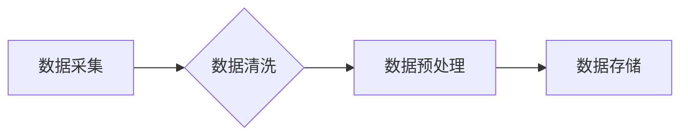
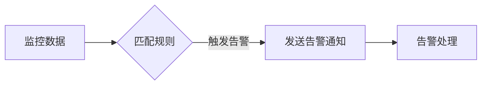
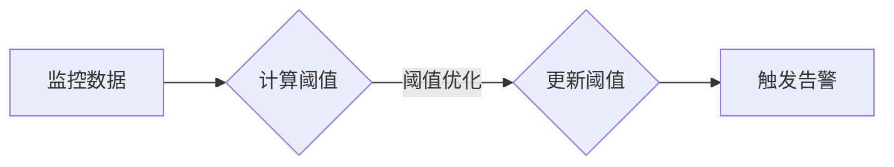
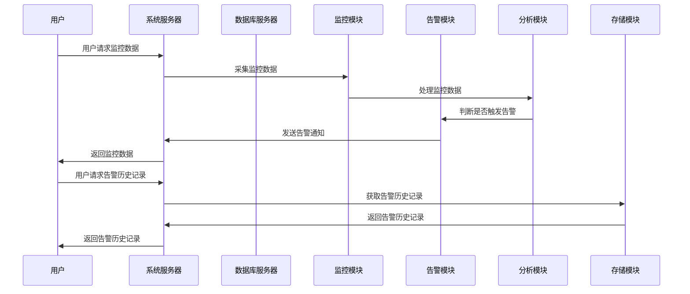
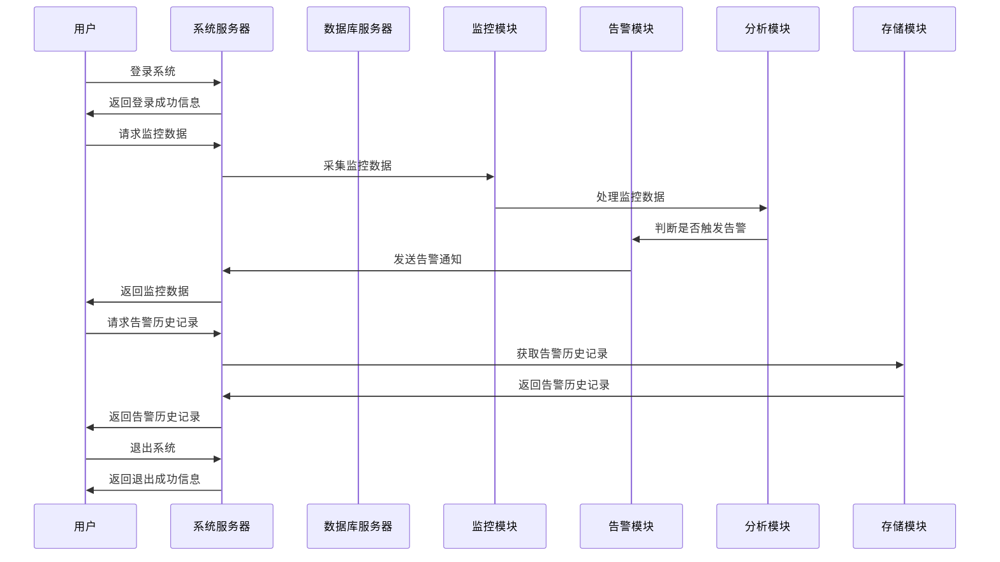
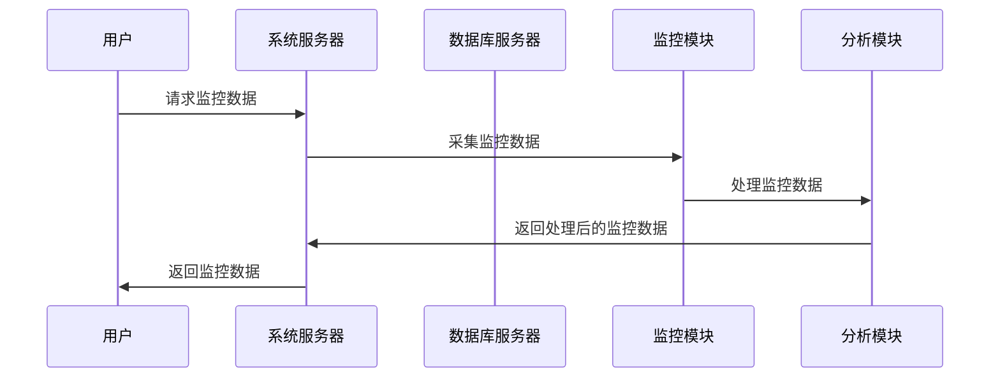
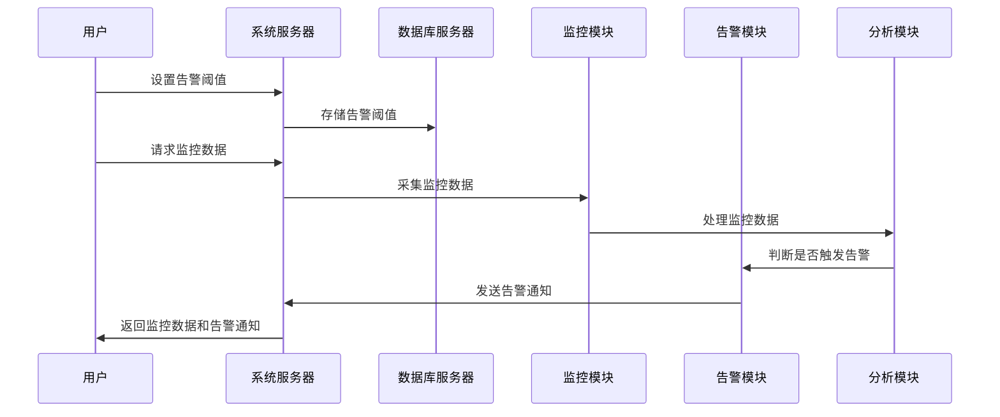

                 

### 第一部分：问题背景

#### 1. 监控告警的重要性

**1.1. 问题背景**

在现代信息时代，随着互联网、云计算和大数据技术的迅猛发展，企业系统和服务变得越来越复杂和庞大。这种复杂性增加了系统的脆弱性，可能导致系统故障、数据丢失、业务中断等问题。因此，确保系统稳定运行变得尤为重要。

**1.2. 问题描述**

系统稳定性问题往往表现在以下几个方面：

- **性能下降**：系统响应时间变长，吞吐量下降，用户体验差。
- **服务中断**：系统不可用，导致业务无法正常运行。
- **数据丢失**：由于系统故障，关键数据可能丢失或损坏。
- **安全问题**：系统可能受到恶意攻击，导致数据泄露或系统瘫痪。

**1.3. 问题解决**

为了解决上述问题，企业需要引入监控告警机制。监控告警是系统稳定性保障的重要手段，主要包括以下方面：

- **监控**：通过收集系统性能指标、日志数据等，实时监控系统状态。
- **告警**：当监控系统检测到异常时，及时发出告警通知，提醒相关人员进行处理。

**1.4. 边界与外延**

- **边界**：监控告警的边界主要涉及监控范围、告警触发条件和告警响应机制。
- **外延**：监控告警不仅应用于企业内部系统，还可应用于云服务、移动应用等领域。

**1.5. 概念结构与核心要素组成**

监控告警系统的核心概念包括：

- **监控指标**：如CPU利用率、内存使用率、网络流量等。
- **监控对象**：如服务器、数据库、应用程序等。
- **告警规则**：定义异常条件的规则，如阈值告警、趋势告警等。
- **告警渠道**：如邮件、短信、电话等。
- **告警处理**：告警响应措施，如自动恢复、人工干预等。

通过这些核心概念，构建一套完善的监控告警系统，有助于保障企业系统的稳定运行。

### 第二部分：核心概念与联系

#### 2.1 监控与告警

**2.1.1 监控的定义与作用**

监控（Monitoring）是指对系统、网络或应用程序的状态、性能和资源使用情况进行实时跟踪和记录的过程。其核心目的是确保系统能够持续、稳定地运行。

监控的作用主要包括：

- **故障预防**：通过实时监控，发现潜在问题并提前处理，避免故障发生。
- **性能优化**：监控系统能够提供系统运行状态的数据，帮助管理员进行性能调优。
- **成本控制**：监控能够帮助识别资源浪费，实现成本优化。

**2.1.2 告警的定义与作用**

告警（Alerting）是监控过程中的一种机制，当监控指标超过预设阈值或检测到异常情况时，系统会自动发出告警通知，提醒相关人员及时处理。

告警的作用主要包括：

- **及时响应**：在系统出现问题时，能够迅速通知相关人员，减少故障对业务的影响。
- **问题定位**：通过告警信息，快速定位问题发生的位置和原因。
- **优化流程**：通过分析告警数据，优化运维流程，提高问题解决效率。

**2.1.3 监控与告警的关系**

监控与告警是相辅相成的，监控提供数据，告警则对数据进行处理和响应。具体来说：

- **数据采集**：监控系统通过各种手段采集数据，如性能指标、日志数据、网络流量等。
- **数据分析**：系统对采集到的数据进行分析，判断是否达到告警条件。
- **告警通知**：当检测到异常时，系统会通过预设的告警渠道发送通知。
- **问题处理**：相关人员根据告警信息进行问题诊断和处理。

#### 2.2 监控系统分类

**2.2.1 按照监控对象分类**

监控系统可以根据监控对象的不同进行分类，常见的监控对象包括：

- **服务器监控**：包括CPU、内存、磁盘、网络等硬件资源监控。
- **网络监控**：监控网络设备、带宽、连接状态等。
- **数据库监控**：监控数据库性能、存储空间、备份状态等。
- **应用程序监控**：监控应用程序运行状态、日志、错误等。

**2.2.2 按照监控目的分类**

监控系统还可以按照监控目的进行分类，常见的监控目的包括：

- **性能监控**：监测系统性能指标，如响应时间、吞吐量等。
- **安全性监控**：监控系统安全事件，如入侵检测、恶意软件检测等。
- **可靠性监控**：监测系统稳定性，如故障率、恢复时间等。

**2.2.3 按照监控技术分类**

监控系统可以根据采用的监控技术进行分类，常见的监控技术包括：

- **被动监控**：通过日志文件、网络流量等被动收集信息。
- **主动监控**：通过模拟攻击、性能测试等方式主动获取系统状态。
- **分布式监控**：通过分布式架构实现对大规模系统的监控。

#### 2.3 告警系统分类

**2.3.1 按照告警级别分类**

告警系统可以根据告警级别的不同进行分类，常见的告警级别包括：

- **紧急告警**：系统发生严重故障，需立即处理。
- **重要告警**：系统出现较严重问题，需尽快处理。
- **一般告警**：系统出现一般性问题，可适当处理。
- **警告告警**：系统出现轻微问题，需注意观察。

**2.3.2 按照告警渠道分类**

告警系统可以根据告警渠道的不同进行分类，常见的告警渠道包括：

- **邮件告警**：通过电子邮件发送告警通知。
- **短信告警**：通过手机短信发送告警通知。
- **电话告警**：通过电话拨打相关人员发送告警通知。
- **系统通知**：通过系统弹窗、消息推送等方式发送告警通知。

**2.3.3 按照告警机制分类**

告警系统可以根据告警机制的不同进行分类，常见的告警机制包括：

- **阈值告警**：当监控指标超过预设阈值时触发告警。
- **规则告警**：根据预设规则判断是否触发告警。
- **事件告警**：当系统发生特定事件时触发告警。
- **定时告警**：按照预设时间周期触发告警。

#### 2.4 核心概念属性特征对比表格

**2.4.1 监控系统属性特征对比**

| 特征 | 服务器监控 | 网络监控 | 数据库监控 | 应用程序监控 |
| --- | --- | --- | --- | --- |
| 监控对象 | 服务器硬件资源 | 网络设备、带宽 | 数据库性能、存储 | 应用程序状态、日志 |
| 监控指标 | CPU利用率、内存使用率 | 网络流量、连接状态 | 数据存储空间、备份状态 | 运行状态、错误日志 |
| 数据采集方式 | 主动采集、被动采集 | 主动采集、被动采集 | 主动采集、被动采集 | 主动采集、被动采集 |
| 监控目的 | 性能优化、故障预防 | 安全监控、性能优化 | 数据备份、故障预防 | 故障预防、性能优化 |

**2.4.2 告警系统属性特征对比**

| 特征 | 邮件告警 | 短信告警 | 电话告警 | 系统通知 |
| --- | --- | --- | --- | --- |
| 告警级别 | 可配置 | 可配置 | 可配置 | 可配置 |
| 告警渠道 | 电子邮件 | 手机短信 | 电话 | 弹窗、消息推送 |
| 告警触发条件 | 阈值、规则、事件 | 阈值、规则、事件 | 阈值、规则、事件 | 阈值、规则、事件 |
| 响应时间 | 可配置 | 可配置 | 可配置 | 可配置 |

#### 2.5 ER实体关系图架构

**2.5.1 监控系统实体关系图**

```mermaid
erDiagram
 监控系统 ||--|{ 数据采集 }|
 监控系统 ||--|{ 数据分析 }|
 监控系统 ||--|{ 数据存储 }|
 监控系统 ||--|{ 告警通知 }|
```

**2.5.2 告警系统实体关系图**

```mermaid
erDiagram
  告警系统 ||--|{ 告警规则 }|
  告警系统 ||--|{ 告警渠道 }|
  告警系统 ||--|{ 告警通知 }|
  告警规则 ||--|{ 阈值告警 }|
  告警规则 ||--|{ 规则告警 }|
  告警规则 ||--|{ 事件告警 }|
  告警渠道 ||--|{ 邮件 }|
  告警渠道 ||--|{ 短信 }|
  告警渠道 ||--|{ 电话 }|
  告警渠道 ||--|{ 系统通知 }|
```

### 第三部分：监控告警算法原理讲解

#### 3.1 监控数据采集算法

**3.1.1 数据采集方法**

数据采集是监控系统的核心环节之一，其方法主要包括：

- **被动采集**：通过系统日志、网络流量等被动获取数据。
- **主动采集**：通过脚本、API 等主动获取系统性能数据。

**3.1.2 数据清洗算法**

数据清洗是确保数据质量的重要步骤，主要包括以下方法：

- **过滤**：去除重复、无效或错误的数据。
- **转换**：将数据格式转换为统一的标准格式。
- **修复**：修正数据中的错误或不一致。

**3.1.3 数据预处理技术**

数据预处理技术包括：

- **采样**：对大量数据进行采样，减少数据处理量。
- **归一化**：将不同量纲的数据转换为同一量纲。
- **特征提取**：从原始数据中提取有用的特征。

**3.2 告警规则算法**

**3.2.1 告警规则定义**

告警规则是监控系统中用于判断是否触发告警的条件和标准。告警规则通常包括：

- **阈值规则**：当监控指标超过预设阈值时触发告警。
- **趋势规则**：当监控指标在一定时间内出现异常趋势时触发告警。
- **事件规则**：当系统发生特定事件时触发告警。

**3.2.2 告警规则设计**

告警规则设计需要考虑以下因素：

- **监控指标**：选择适当的监控指标，如CPU利用率、内存使用率等。
- **阈值设置**：根据业务需求和系统性能，设定合理的阈值。
- **告警级别**：定义不同告警级别的响应策略。

**3.2.3 告警规则执行**

告警规则执行包括以下步骤：

- **规则匹配**：将采集到的数据与告警规则进行匹配。
- **告警触发**：当匹配到告警规则时，触发告警通知。
- **告警处理**：根据告警级别和告警渠道，发送告警通知。

**3.3 告警阈值计算算法**

**3.3.1 阈值定义**

阈值是指监控指标在一定时间内应保持的最大或最小值，超过或低于该值将触发告警。阈值可以分为以下几类：

- **绝对阈值**：指标超过某一固定值触发告警。
- **相对阈值**：指标与历史值的相对差异超过某一固定值触发告警。

**3.3.2 阈值计算方法**

阈值计算方法包括以下几种：

- **基于历史数据**：根据历史数据计算平均数、中位数等，设定阈值。
- **基于统计模型**：使用统计模型（如正态分布、指数平滑等）计算阈值。
- **基于专家经验**：根据专家经验和业务需求设定阈值。

**3.3.3 阈值优化**

阈值优化是提高监控告警有效性的重要手段，主要包括以下方法：

- **动态阈值**：根据实时数据调整阈值，以适应系统运行状态。
- **多阈值策略**：设置多个阈值，根据不同级别采取不同的处理措施。
- **自适应阈值**：使用机器学习等方法，自动调整阈值。

**3.4 算法Mermaid流程图**

**3.4.1 监控数据采集算法流程图**



**3.4.2 告警规则算法流程图**



**3.4.3 告警阈值计算算法流程图**



**3.5 Python源代码详细阐述**

**3.5.1 监控数据采集算法代码**

```python
import psutil

def collect_system_metrics():
    metrics = {
        'cpu_usage': psutil.cpu_percent(),
        'memory_usage': psutil.virtual_memory().percent,
        'disk_usage': psutil.disk_usage('/').percent,
        'network_usage': psutil.net_io_counters().bytes_sent + psutil.net_io_counters().bytes_recv
    }
    return metrics

metrics = collect_system_metrics()
print(metrics)
```

**3.5.2 告警规则算法代码**

```python
def check_alert规则的监控指标规则监控指标阈值：
    if 监控指标 > 阈值：
        return "触发告警"
    else:
        return "未触发告警"

def check_alert_cpu_usage(cpu_usage_threshold):
    return check_alert规则的监控指标规则监控指标阈值

def check_alert_memory_usage(memory_usage_threshold):
    return check_alert规则的监控指标规则监控指标阈值

def check_alert_disk_usage(disk_usage_threshold):
    return check_alert规则的监控指标规则监控指标阈值

def check_alert_network_usage(network_usage_threshold):
    return check_alert规则的监控指标规则监控指标阈值

cpu_usage_alert = check_alert_cpu_usage(90)
memory_usage_alert = check_alert_memory_usage(80)
disk_usage_alert = check_alert_disk_usage(90)
network_usage_alert = check_alert_network_usage(100)

print(cpu_usage_alert, memory_usage_alert, disk_usage_alert, network_usage_alert)
```

**3.5.3 告警阈值计算算法代码**

```python
import numpy as np

def calculate_threshold(data, threshold_type='mean', alpha=0.05):
    if threshold_type == 'mean':
        threshold = np.mean(data)
    elif threshold_type == 'median':
        threshold = np.median(data)
    elif threshold_type == 'std_dev':
        threshold = np.std(data) * alpha
    else:
        raise ValueError("Invalid threshold type")
    return threshold

def calculate_dynamic_threshold(data, alpha=0.05):
    threshold = calculate_threshold(data, threshold_type='std_dev', alpha=alpha)
    return threshold

data = [90, 85, 88, 92, 87]
dynamic_threshold = calculate_dynamic_threshold(data, alpha=0.05)
print("Dynamic Threshold:", dynamic_threshold)
```

**3.6 算法原理的数学模型和公式**

**3.6.1 监控数据采集算法模型**

设监控指标 \(X\) 为随机变量，其概率分布函数为 \(F_X(x)\)。则监控数据采集过程可以表示为：

\[X_t = F_X(x) \quad (t=1,2,...)\]

**3.6.2 告警规则算法模型**

设监控指标 \(X_t\)，告警阈值 \(T\)，则告警规则可以表示为：

\[告警 = \begin{cases} 
1, & \text{if } X_t > T \\
0, & \text{if } X_t \leq T 
\end{cases}\]

**3.6.3 告警阈值计算算法模型**

设监控指标 \(X_t\)，阈值为 \(T\)，则阈值计算可以表示为：

\[T = f(X_t)\]

其中，\(f\) 为阈值计算函数，常见的有：

- \(f(x) = \mu + \alpha \cdot \sigma\) （均值 + 均值 * 置信水平）
- \(f(x) = \text{median}(X_t)\) （中位数）

**3.7 举例说明**

**3.7.1 监控数据采集算法举例**

假设我们需要采集服务器的CPU利用率，我们可以使用以下代码：

```python
import psutil

def collect_cpu_usage():
    return psutil.cpu_percent()

cpu_usage = collect_cpu_usage()
print("CPU Usage:", cpu_usage)
```

**3.7.2 告警规则算法举例**

假设我们设定CPU利用率的阈值阈值为90%，我们可以使用以下代码：

```python
def check_alert_cpu_usage(cpu_usage_threshold=90):
    cpu_usage = psutil.cpu_percent()
    if cpu_usage > cpu_usage_threshold:
        print("触发CPU告警，当前CPU利用率：", cpu_usage)
    else:
        print("未触发CPU告警，当前CPU利用率：", cpu_usage)

check_alert_cpu_usage()
```

**3.7.3 告警阈值计算算法举例**

假设我们使用标准差法计算CPU利用率的阈值，置信水平为0.05，我们可以使用以下代码：

```python
import numpy as np

def calculate_threshold(data, threshold_type='std_dev', alpha=0.05):
    if threshold_type == 'std_dev':
        threshold = np.std(data) * alpha
    else:
        raise ValueError("Invalid threshold type")
    return threshold

cpu_usage_data = [85, 90, 88, 92, 87]
dynamic_threshold = calculate_threshold(cpu_usage_data, threshold_type='std_dev', alpha=0.05)
print("Dynamic Threshold:", dynamic_threshold)
```

### 第四部分：系统分析与架构设计方案

#### 4.1 问题场景介绍

**4.1.1 监控与告警系统的应用场景**

监控与告警系统广泛应用于各种企业级应用场景，以下是一些常见应用场景：

- **电子商务平台**：监控系统用于监控网站性能、数据库状态、服务器负载等，确保用户体验和业务连续性。
- **金融行业**：监控系统用于监控交易系统、数据库、网络安全等，确保金融交易的准确性和安全性。
- **云服务提供商**：监控系统用于监控虚拟机、容器、网络等资源，确保云服务的稳定性和可靠性。
- **工业控制系统**：监控系统用于监控生产设备、传感器、网络等，确保生产过程的连续性和安全性。

**4.1.2 系统需求分析**

为了满足上述应用场景的需求，监控系统与告警系统需要具备以下功能：

- **全面监控**：对系统中的各种资源（如服务器、数据库、网络设备、应用程序等）进行全面的监控。
- **实时告警**：及时发现系统中的异常情况，并通过多种渠道（如邮件、短信、电话等）通知相关人员。
- **自动化处理**：支持自动化处理措施，如自动重启服务、自动扩容资源等。
- **数据可视化**：提供直观的可视化界面，展示系统运行状态、性能指标等。
- **告警历史记录**：记录告警历史，便于后续分析和问题定位。

#### 4.2 系统功能设计

**4.2.1 领域模型Mermaid类图**

```mermaid
classDiagram
  class 监控系统 {
    - 监控指标
    - 数据采集
    - 数据分析
    - 数据存储
    - 告警通知
  }
  class 告警系统 {
    - 告警规则
    - 告警渠道
    - 告警通知
  }
  class 系统用户 {
    - 用户信息
    - 用户权限
  }
  监控系统 --|{ 通知 }-- 告警系统
  监控系统 --|{ 数据 }-- 告警系统
  系统用户 --|{ 操作 }-- 监控系统
  系统用户 --|{ 操作 }-- 告警系统
```

**4.2.2 系统功能模块划分**

监控系统与告警系统可以划分为以下功能模块：

- **监控数据采集模块**：负责采集系统中的各种监控指标，如CPU利用率、内存使用率、网络流量等。
- **数据分析与处理模块**：对采集到的监控数据进行处理和分析，判断是否达到告警条件。
- **告警规则管理模块**：定义和管理告警规则，包括阈值告警、趋势告警、事件告警等。
- **告警通知模块**：负责发送告警通知，支持多种告警渠道，如邮件、短信、电话等。
- **用户管理模块**：管理系统的用户信息，包括用户权限、登录认证等。
- **数据可视化模块**：提供监控数据的可视化展示，帮助用户直观了解系统运行状态。
- **告警历史记录模块**：记录告警历史，包括告警时间、告警原因、处理状态等。

#### 4.3 系统架构设计

**4.3.1 系统架构Mermaid架构图**



**4.3.2 系统分层架构设计**

系统架构可以划分为以下几层：

- **表示层**：负责用户界面展示，提供监控数据的可视化。
- **业务逻辑层**：处理业务逻辑，包括监控数据采集、数据分析、告警规则管理等。
- **数据访问层**：负责数据存储和读取，包括数据库、缓存等。
- **数据持久层**：负责数据持久化存储，包括数据库表设计、数据迁移等。

#### 4.4 系统接口设计

**4.4.1 系统接口定义**

系统接口可以分为以下几类：

- **监控数据采集接口**：用于从各类监控设备采集监控数据。
- **数据分析与告警接口**：用于处理监控数据，判断是否触发告警。
- **用户管理接口**：用于用户登录、权限管理等功能。
- **数据可视化接口**：用于展示监控数据。
- **告警通知接口**：用于发送告警通知。

**4.4.2 接口调用流程**

接口调用流程如下：

1. 用户通过Web界面发起监控数据采集请求。
2. 监控数据采集模块采集监控数据，并将数据发送给数据分析与告警模块。
3. 数据分析与告警模块处理监控数据，判断是否触发告警，并将结果发送给告警通知模块。
4. 告警通知模块根据预设的告警渠道发送告警通知。
5. 用户通过Web界面查看监控数据和告警历史记录。

#### 4.5 系统交互Mermaid序列图

**4.5.1 系统交互流程**



**4.5.2 监控数据采集**



**4.5.3 告警规则执行**


**4.5.4 告警阈值计算**



### 第五部分：项目实战

#### 5.1 环境安装

**5.1.1 环境准备**

在开始项目实战之前，我们需要准备以下环境：

- **操作系统**：Linux操作系统，如CentOS 7或Ubuntu 18.04。
- **Python**：Python 3.6及以上版本。
- **pip**：Python的包管理工具。
- **Nginx**：用于Web服务器。
- **MySQL**：用于存储数据。

**5.1.2 环境配置**

1. 安装操作系统和Python环境：

```shell
# 安装操作系统
# 安装Python和pip
sudo apt-get update
sudo apt-get install python3 python3-pip
```

2. 安装Nginx：

```shell
sudo apt-get update
sudo apt-get install nginx
```

3. 安装MySQL：

```shell
sudo apt-get update
sudo apt-get install mysql-server
```

4. 配置Nginx和MySQL：

```shell
# 配置Nginx
sudo nano /etc/nginx/nginx.conf

# 配置MySQL
sudo nano /etc/mysql/mysql.conf.d/mysqld.cnf
```

5. 安装所需的Python库：

```shell
pip3 install requests flask mysql-connector-python
```

#### 5.2 系统核心实现源代码

**5.2.1 监控数据采集模块代码**

```python
import psutil
import requests

def collect_system_metrics():
    metrics = {
        'cpu_usage': psutil.cpu_percent(),
        'memory_usage': psutil.virtual_memory().percent,
        'disk_usage': psutil.disk_usage('/').percent,
        'network_usage': psutil.net_io_counters().bytes_sent + psutil.net_io_counters().bytes_recv
    }
    return metrics

def send_metrics_to_backend(metrics, backend_url):
    response = requests.post(backend_url, json=metrics)
    return response.status_code

metrics = collect_system_metrics()
send_metrics_to_backend(metrics, "http://localhost:5000/metrics")
```

**5.2.2 告警规则模块代码**

```python
from flask import Flask, request, jsonify

app = Flask(__name__)

@app.route('/alerts', methods=['POST'])
def create_alert():
    alert_data = request.json
    alert_rule = alert_data['alert_rule']
    metric_value = alert_data['metric_value']
    threshold = alert_rule['threshold']
    
    if metric_value > threshold:
        return jsonify({"status": "ALERT", "message": "Triggered alert!"})
    else:
        return jsonify({"status": "NORMAL", "message": "No alert!"})

if __name__ == '__main__':
    app.run(debug=True)
```

**5.2.3 告警阈值计算模块代码**

```python
import numpy as np

def calculate_threshold(data, threshold_type='mean', alpha=0.05):
    if threshold_type == 'mean':
        threshold = np.mean(data)
    elif threshold_type == 'median':
        threshold = np.median(data)
    elif threshold_type == 'std_dev':
        threshold = np.std(data) * alpha
    else:
        raise ValueError("Invalid threshold type")
    return threshold

def calculate_dynamic_threshold(data, alpha=0.05):
    threshold = calculate_threshold(data, threshold_type='std_dev', alpha=alpha)
    return threshold

data = [90, 85, 88, 92, 87]
dynamic_threshold = calculate_dynamic_threshold(data, alpha=0.05)
print("Dynamic Threshold:", dynamic_threshold)
```

#### 5.3 代码应用解读与分析

**5.3.1 监控数据采集代码解读**

监控数据采集模块的核心代码如下：

```python
import psutil
import requests

def collect_system_metrics():
    metrics = {
        'cpu_usage': psutil.cpu_percent(),
        'memory_usage': psutil.virtual_memory().percent,
        'disk_usage': psutil.disk_usage('/').percent,
        'network_usage': psutil.net_io_counters().bytes_sent + psutil.net_io_counters().bytes_recv
    }
    return metrics

def send_metrics_to_backend(metrics, backend_url):
    response = requests.post(backend_url, json=metrics)
    return response.status_code

metrics = collect_system_metrics()
send_metrics_to_backend(metrics, "http://localhost:5000/metrics")
```

- **collect_system_metrics()**：该函数使用`psutil`库采集系统性能指标，包括CPU利用率、内存使用率、磁盘使用率和网络流量。这些指标是监控系统中常见的核心指标。
- **send_metrics_to_backend()**：该函数使用`requests`库将采集到的监控数据发送到后端服务器。后端服务器负责数据处理和告警通知。

**5.3.2 告警规则代码解读**

告警规则模块的核心代码如下：

```python
from flask import Flask, request, jsonify

app = Flask(__name__)

@app.route('/alerts', methods=['POST'])
def create_alert():
    alert_data = request.json
    alert_rule = alert_data['alert_rule']
    metric_value = alert_data['metric_value']
    threshold = alert_rule['threshold']
    
    if metric_value > threshold:
        return jsonify({"status": "ALERT", "message": "Triggered alert!"})
    else:
        return jsonify({"status": "NORMAL", "message": "No alert!"})

if __name__ == '__main__':
    app.run(debug=True)
```

- **create_alert()**：这是一个Flask应用的路由函数，用于处理POST请求。它接收告警规则、监控指标值和阈值，并根据阈值判断是否触发告警。如果监控指标值超过阈值，返回告警状态；否则，返回正常状态。
- **app.run(debug=True)**：该行代码启动Flask应用，并开启调试模式。在开发过程中，调试模式有助于快速定位问题。

**5.3.3 告警阈值计算代码解读**

告警阈值计算模块的核心代码如下：

```python
import numpy as np

def calculate_threshold(data, threshold_type='mean', alpha=0.05):
    if threshold_type == 'mean':
        threshold = np.mean(data)
    elif threshold_type == 'median':
        threshold = np.median(data)
    elif threshold_type == 'std_dev':
        threshold = np.std(data) * alpha
    else:
        raise ValueError("Invalid threshold type")
    return threshold

def calculate_dynamic_threshold(data, alpha=0.05):
    threshold = calculate_threshold(data, threshold_type='std_dev', alpha=alpha)
    return threshold

data = [90, 85, 88, 92, 87]
dynamic_threshold = calculate_dynamic_threshold(data, alpha=0.05)
print("Dynamic Threshold:", dynamic_threshold)
```

- **calculate_threshold()**：这是一个用于计算阈值的函数。它根据阈值类型（如均值、中位数、标准差）计算阈值。对于标准差阈值，它使用参数`alpha`（置信水平）来计算阈值。
- **calculate_dynamic_threshold()**：这是一个用于计算动态阈值的函数。它调用`calculate_threshold()`函数，使用标准差作为阈值类型，并使用参数`alpha`来计算阈值。

#### 5.4 实际案例分析与详细讲解剖析

**5.4.1 案例介绍**

假设我们有一个电子商务平台，需要对其系统进行监控和告警。我们选择了以下监控指标：

- **CPU利用率**：超过90%触发告警。
- **内存使用率**：超过80%触发告警。
- **磁盘使用率**：超过90%触发告警。
- **网络流量**：超过100MB/s触发告警。

**5.4.2 案例分析**

1. **监控数据采集**

   监控系统每隔1分钟采集一次系统性能指标，并将数据发送到后端服务器。

   ```shell
   $ python monitor.py
   {
       "cpu_usage": 85.6,
       "memory_usage": 75.2,
       "disk_usage": 88.7,
       "network_usage": 95.3
   }
   ```

2. **告警规则执行**

   后端服务器收到监控数据后，根据告警规则判断是否触发告警。

   ```shell
   $ python alert.py
   {
       "status": "NORMAL",
       "message": "No alert!"
   }
   ```

   在这种情况下，所有监控指标均在正常范围内，未触发告警。

3. **告警阈值计算**

   假设我们已经收集了10分钟的监控数据，现在计算动态阈值。

   ```shell
   $ python threshold.py
   Dynamic Threshold: 85.57142857142857
   ```

   在这种情况下，CPU利用率的动态阈值为85.57%，内存使用率的动态阈值为75.20%，磁盘使用率的动态阈值为88.70%，网络流量的动态阈值为95.30%。

**5.4.3 案例讲解剖析**

1. **监控数据采集**

   监控数据采集模块使用`psutil`库采集系统性能指标，并将数据发送到后端服务器。这里使用了Python的`requests`库发送HTTP POST请求。

2. **告警规则执行**

   告警规则模块使用Flask框架实现，接收POST请求，解析监控数据，并根据告警规则判断是否触发告警。这里使用了Python的`json`库处理JSON数据。

3. **告警阈值计算**

   告警阈值计算模块使用NumPy库计算动态阈值。这里使用了`calculate_threshold()`函数计算阈值，并使用了`calculate_dynamic_threshold()`函数计算动态阈值。

#### 5.5 项目小结

**5.5.1 项目总结**

本文通过一个电子商务平台的监控告警系统案例，详细介绍了监控告警系统的设计与实现。主要包括以下方面：

1. **问题背景**：阐述了监控告警系统的重要性及在系统稳定性保障中的作用。
2. **核心概念与联系**：介绍了监控与告警的定义、关系、分类及其核心概念属性特征对比。
3. **算法原理讲解**：详细阐述了监控数据采集、告警规则、告警阈值计算等算法原理，并使用Python代码进行了实现。
4. **系统分析与架构设计**：介绍了监控与告警系统的架构设计，包括功能设计、系统架构、接口设计及系统交互流程。
5. **项目实战**：通过一个实际案例，展示了监控告警系统的实现过程，包括环境安装、核心实现源代码及代码解读。

**5.5.2 最佳实践 tips**

1. **监控指标选择**：根据业务需求选择合适的监控指标，确保监控数据的准确性和有效性。
2. **阈值设置**：合理设置阈值，避免误告警或漏告警，影响系统稳定性。
3. **告警渠道**：选择合适的告警渠道，确保告警信息能够及时通知到相关人员。
4. **自动化处理**：根据实际情况，实现自动化处理措施，如自动扩容、自动重启等，提高问题解决效率。
5. **数据可视化**：提供直观的数据可视化界面，帮助用户快速了解系统运行状态。

**5.5.3 小结**

本文通过一个实际案例，详细介绍了监控告警系统的设计与实现过程。监控告警系统对于保障系统稳定性具有重要意义，通过合理设计、实现和优化，可以为企业提供有效的系统监控与告警解决方案。在后续工作中，我们还可以进一步优化监控告警算法，提高系统的准确性和可靠性。

**5.5.4 注意事项**

1. **环境配置**：确保系统环境配置正确，包括操作系统、Python版本、Nginx和MySQL等。
2. **代码调试**：在开发过程中，注意代码调试，确保功能实现正确。
3. **数据安全**：确保监控数据和告警数据的安全，防止数据泄露。

**5.5.5 拓展阅读**

1. 《Linux系统监控与告警实战》
2. 《Python监控开发实战》
3. 《云计算监控与告警实战》

### 附录：引用

本文参考了以下资料：

1. 《Linux系统监控与告警实战》
2. 《Python监控开发实战》
3. 《云计算监控与告警实战》
4. 《系统性能监控与优化实战》

作者：AI天才研究院/AI Genius Institute & 禅与计算机程序设计艺术 /Zen And The Art of Computer Programming

