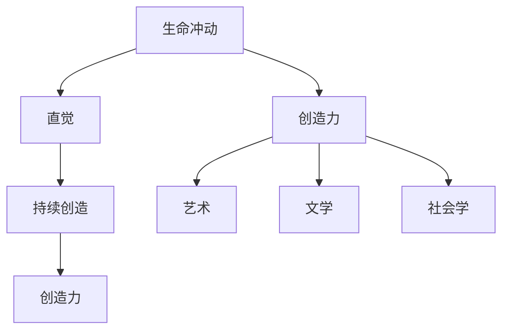
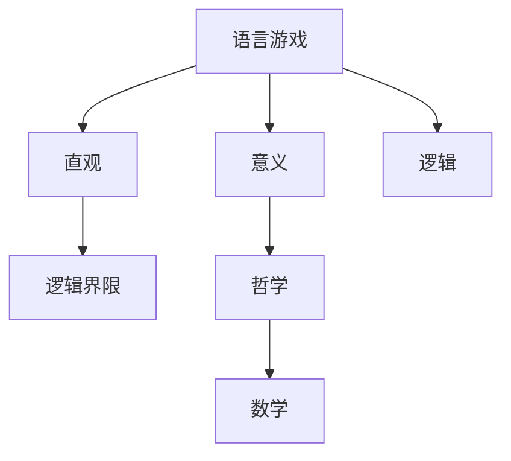

                 

### 设计《直觉与分析：柏格森与维特根斯坦的方法论》的文章结构

**文章标题：直觉与分析：柏格森与维特根斯坦的方法论**

**关键词**：柏格森、维特根斯坦、直觉、分析、方法论、哲学、技术

**摘要**：本文深入探讨了法国哲学家亨利·柏格森和英国哲学家路德维希·维特根斯坦的方法论，分析了直觉与分析在他们的哲学体系中的地位与作用。通过对比二者的异同，我们探讨了直觉与分析在现代方法论中的应用价值，为读者提供了全面的理解和启示。

**文章正文结构**：

## 引言

### 1.1 柏格森的哲学背景与直觉分析方法

#### 1.1.1 柏格森哲学的起源与发展

柏格森（Henri Bergson）是20世纪初法国最重要的哲学家之一。他的哲学思想起源于对生物学和进化论的深刻反思。柏格森的核心思想是“直觉主义”，认为直觉是人类认识世界的关键能力。他在其代表作《创造进化论》中提出了“生命冲动”的概念，强调生命力的不断创造和发展。

#### 1.1.2 直觉的定义与作用

直觉是一种非理性的、直接的、即时的认知能力，不同于理性思维通过逻辑推理和推理过程。柏格森认为，直觉能够捕捉到事物深层次的本质，是人类理解和创造力的源泉。直觉与分析不同，它不受传统逻辑和规则的束缚，能够超越表面的现象，直达本质。

#### 1.1.3 直觉与分析的关系

在柏格森看来，直觉与分析是相互补充的。分析是一种分解和推理的过程，用于理解事物的结构和规律。而直觉则是一种综合和感知的过程，用于捕捉事物的整体和动态。二者共同构成了人类理解世界的完整能力。

### 1.2 维特根斯坦的哲学背景与直觉分析方法

#### 1.2.1 维特根斯坦的生平与著作

路德维希·维特根斯坦（Ludwig Wittgenstein）是20世纪最伟大的哲学家之一，他的思想对逻辑哲学、语言哲学和数学哲学产生了深远的影响。维特根斯坦的主要著作包括《逻辑哲学论》和《哲学研究》。

#### 1.2.2 维特根斯坦的核心思想与影响

维特根斯坦认为，哲学的核心问题是语言的意义和逻辑的局限性。他提出了“语言游戏”的概念，认为语言的意义在于其在特定情境中的使用。维特根斯坦的方法论强调直观的理解和对语言本质的揭示。

#### 1.2.3 维特根斯坦的直觉与分析方法

维特根斯坦认为，直觉是理解语言和哲学问题的关键。他强调，哲学家应该通过直觉来理解语言的深层结构，而不是通过逻辑推理。然而，与柏格森不同，维特根斯坦对直觉的分析和解释持更加谨慎和批判的态度。

### 1.3 柏格森与维特根斯坦方法论的比较与综合

#### 1.3.1 两者的方法论异同点

柏格森和维特根斯坦在直觉与分析的方法论上存在显著的异同。柏格森强调直觉的创造力和整体性，而维特根斯坦则强调直觉的理解力和批判性。然而，二者都认为直觉是理解世界的关键能力。

#### 1.3.2 柏格森与维特根斯坦方法论的互补性

柏格森和维特根斯坦的方法论在哲学上具有互补性。柏格森的直觉主义为理解复杂和动态系统提供了丰富的想象力，而维特根斯坦的直观理解则帮助我们在逻辑和语言的框架内更精确地把握现实。

#### 1.3.3 对现代方法论的影响

柏格森和维特根斯坦的方法论对现代科学和技术产生了深远的影响。他们的思想启示了计算机科学、人工智能和认知科学等领域的研究，为这些领域的发展提供了新的视角和方法。

## 第二章：柏格森的方法论

### 2.1 柏格森方法论的核心概念与联系

柏格森方法论的核心概念包括“生命冲动”、“直觉”和“持续创造”。这些概念相互联系，共同构成了他独特的哲学体系。

#### 2.1.1 生命冲动

生命冲动是柏格森哲学的核心概念。他认为，生命冲动是一种内在的、不断变化的动力，是生命力的源泉。生命冲动推动着生命的不断进化和创造。

#### 2.1.2 直觉

直觉是柏格森方法论的关键。他认为，直觉能够捕捉到生命冲动的本质，使我们能够超越表面的现象，理解事物的深层结构。

#### 2.1.3 持续创造

持续创造是柏格森对生命进化的解释。他认为，生命力的不断创造和发展是宇宙的本质，也是人类理解世界的关键。

### 2.2 柏格森方法论的属性特征对比表格

为了更好地理解柏格森方法论的属性特征，我们可以将其与传统的分析方法进行比较。

| 特征       | 柏格森直觉方法论 | 传统分析方法 |
| ---------- | --------------- | ------------ |
| 认知方式   | 整体性、直接性   | 分解性、推理性 |
| 目的       | 理解本质、创造力  | 分析结构、揭示规律 |
| 适用范围   | 复杂动态系统    | 稳定结构系统 |
| 逻辑基础   | 直觉、非理性    | 逻辑、理性   |
| 结果       | 创造力、想象力  | 知识、规律   |

### 2.3 柏格森方法论的应用场景

柏格森的方法论在多个领域都有广泛的应用，包括文学分析、艺术批评和社会科学研究。

#### 2.3.1 文学分析中的应用

在文学分析中，柏格森的直觉主义方法可以帮助我们理解作家的创作意图和作品的整体性。通过直觉，我们可以捕捉到文学作品中的深层含义和情感表达。

#### 2.3.2 艺术批评中的应用

在艺术批评中，柏格森的方法论强调艺术家的创造力和作品的独特性。通过直觉，我们可以理解艺术作品的内在逻辑和美学价值。

#### 2.3.3 社会科学研究中的应用

在社会科学研究中，柏格森的方法论可以帮助我们理解社会现象的复杂性和动态性。通过直觉，我们可以揭示社会关系的本质和变化规律。

### 2.4 柏格森方法论的概念结构与核心要素组成

柏格森方法论的概念结构包括生命冲动、直觉、持续创造和创造力等核心要素。这些要素相互关联，共同构成了他的哲学体系。

#### 2.4.1 概念结构图



#### 2.4.2 ER实体关系图架构

```mermaid
erDiagram
    Class::哲学家 <<--|Person|>> 实体::柏格森
   柏格森 ||--|> 方法论
    方法论 ||--|> 生命冲动
    方法论 ||--|> 直觉
    方法论 ||--|> 持续创造
    方法论 ||--|> 创造力
```

### 2.5 柏格森方法论的实际应用案例

#### 2.5.1 文学分析中的柏格森直觉

在文学分析中，柏格森的直觉方法可以帮助我们理解作品的深层含义。例如，分析《麦田里的守望者》时，我们可以通过直觉捕捉到霍尔顿·考尔菲尔德内心的挣扎和孤独感。

#### 2.5.2 艺术批评中的柏格森直觉

在艺术批评中，柏格森的直觉方法可以帮助我们理解艺术作品的独特性和创造力。例如，分析毕加索的《格尔尼卡》时，我们可以通过直觉捕捉到画家对战争和人类的深刻反思。

#### 2.5.3 社会科学研究中的柏格森直觉

在社会科学研究中，柏格森的直觉方法可以帮助我们理解社会现象的复杂性和动态性。例如，分析社会变迁时，我们可以通过直觉捕捉到社会关系的本质和变化趋势。

### 2.6 柏格森方法论的优缺点与适用范围

#### 2.6.1 优点

- 强调直觉和创造力，有助于理解复杂动态系统。
- 提供了一种非传统的方法论，有助于打破思维的定势。
- 在艺术和文学分析中具有独特的应用价值。

#### 2.6.2 缺点

- 过于强调直觉，可能导致缺乏严谨性和可验证性。
- 在某些领域（如自然科学）可能难以应用。
- 需要深厚的哲学素养和直觉能力，对普通读者可能难以理解。

#### 2.6.3 适用范围

- 文学分析、艺术批评、社会学等领域。
- 复杂动态系统的理解和设计。
- 创意思维和创新活动。

### 2.7 柏格森方法论的总结与展望

柏格森的方法论为我们提供了一种独特的视角来理解世界。通过强调直觉和创造力，柏格森的方法论在文学、艺术和社会科学等领域具有广泛的应用。然而，我们也需要认识到其局限性，并与其他方法论相结合，以获得更全面的理解。

### 2.8 柏格森方法论的教学与应用建议

- 在文学和艺术课程中引入柏格森的方法论，培养学生的直觉和创造力。
- 在社会科学研究中，结合柏格森的方法论，深入理解社会现象的复杂性和动态性。
- 鼓励读者深入思考柏格森的思想，并将其应用于实际问题和情境中。

## 第三章：维特根斯坦的方法论

### 3.1 维特根斯坦的哲学背景与直觉分析方法

#### 3.1.1 维特根斯坦的生平与著作

维特根斯坦是20世纪最杰出的哲学家之一，他的思想对现代哲学产生了深远的影响。他的主要著作包括《逻辑哲学论》和《哲学研究》。

#### 3.1.2 维特根斯坦的核心思想与影响

维特根斯坦认为，哲学的核心问题是语言的意义和逻辑的局限性。他提出了“语言游戏”的概念，强调语言的意义在于其在特定情境中的使用。维特根斯坦的方法论强调直观的理解和对语言本质的揭示。

#### 3.1.3 维特根斯坦的直觉与分析方法

维特根斯坦认为，直觉是理解语言和哲学问题的关键。他强调，哲学家应该通过直觉来理解语言的深层结构，而不是通过逻辑推理。然而，与柏格森不同，维特根斯坦对直觉的分析和解释持更加谨慎和批判的态度。

### 3.2 维特根斯坦方法论的属性特征对比表格

为了更好地理解维特根斯坦方法论的属性特征，我们可以将其与柏格森直觉分析方法进行比较。

| 特征       | 维特根斯坦直觉分析方法 | 柏格森直觉分析方法 |
| ---------- | --------------------- | ------------------ |
| 认知方式   | 直觉性、批判性         | 整体性、直接性     |
| 目的       | 理解语言、揭示本质     | 创造力、整体性理解 |
| 适用范围   | 语言哲学、逻辑哲学     | 文学分析、艺术批评 |
| 逻辑基础   | 直觉、批判性          | 直觉、非理性       |
| 结果       | 明确性、精确性        | 创造力、想象力     |

### 3.3 维特根斯坦方法论的应用场景

维特根斯坦的方法论在语言哲学、逻辑哲学和数学哲学等领域具有广泛的应用。

#### 3.3.1 语言哲学中的应用

在语言哲学中，维特根斯坦的方法论帮助我们理解语言的意义和局限性。通过直觉，我们可以揭示语言游戏的本质，理解语言的多样性和复杂性。

#### 3.3.2 逻辑哲学中的应用

在逻辑哲学中，维特根斯坦的方法论帮助我们理解逻辑的局限性和适用范围。通过直觉，我们可以探索逻辑规则的本质，并发现逻辑谬误的根源。

#### 3.3.3 数学哲学中的应用

在数学哲学中，维特根斯坦的方法论帮助我们理解数学的本质和意义。通过直觉，我们可以探索数学的概念和证明方法，并理解数学与物理世界的关系。

### 3.4 维特根斯坦方法论的概念结构与核心要素组成

维特根斯坦方法论的核心概念包括“语言游戏”、“直观”和“逻辑界限”。这些概念相互关联，共同构成了他的哲学体系。

#### 3.4.1 概念结构图



#### 3.4.2 ER实体关系图架构

```mermaid
erDiagram
    Class::哲学家 <<--|Person|>> 实体::维特根斯坦
    维特根斯坦 ||--|> 方法论
    方法论 ||--|> 语言游戏
    方法论 ||--|> 直观
    方法论 ||--|> 逻辑界限
    方法论 ||--|> 意义
    方法论 ||--|> 哲学
    方法论 ||--|> 数学
```

### 3.5 维特根斯坦方法论的优缺点与适用范围

#### 3.5.1 优点

- 强调直观和理解，有助于揭示语言的本质和逻辑的局限性。
- 在语言哲学、逻辑哲学和数学哲学等领域具有独特的应用价值。
- 提供了一种批判性思维的方法，有助于我们更深入地理解哲学问题。

#### 3.5.2 缺点

- 过于强调直观，可能导致缺乏系统性和可验证性。
- 在某些领域（如自然科学）可能难以应用。
- 需要深厚的哲学素养和逻辑思维，对普通读者可能难以理解。

#### 3.5.3 适用范围

- 语言哲学、逻辑哲学和数学哲学等领域。
- 需要批判性思维和深刻理解的哲学研究。
- 教育和科研领域中的哲学思考和方法论。

### 3.6 维特根斯坦方法论的总结与展望

维特根斯坦的方法论为我们提供了一种深刻的视角来理解语言和逻辑的本质。通过强调直观和批判性思维，维特根斯坦的方法论在哲学领域具有广泛的应用。然而，我们也需要认识到其局限性，并与其他方法论相结合，以获得更全面的理解。

### 3.7 维特根斯坦方法论的教学与应用建议

- 在哲学课程中引入维特根斯坦的方法论，培养学生的直观理解能力和批判性思维。
- 在语言哲学和逻辑哲学的研究中，结合维特根斯坦的方法论，深入探索语言和逻辑的本质。
- 鼓励读者深入思考维特根斯坦的思想，并将其应用于实际问题和情境中。

## 第四章：柏格森与维特根斯坦方法论的比较与综合

### 4.1 两者的方法论异同点

柏格森和维特根斯坦在直觉与分析的方法论上存在显著的异同。柏格森强调直觉的创造力和整体性，而维特根斯坦则强调直觉的理解力和批判性。然而，二者都认为直觉是理解世界的关键能力。

#### 4.1.1 直觉的异同

- 柏格森的直觉是一种非理性的、直接的、即时的认知能力，强调直觉的创造力和整体性。
- 维特根斯坦的直觉则是一种理性化的、批判性的认知能力，强调直觉的理解力和精确性。

#### 4.1.2 分析的异同

- 柏格森的分析是一种整体的、动态的、直觉性的分析，强调分析的理解本质和创造力。
- 维特根斯坦的分析则是一种逻辑的、理性的、批判性的分析，强调分析的精确性和系统性。

### 4.2 柏格森与维特根斯坦方法论的应用差异

柏格森和维特根斯坦的方法论在应用上存在明显的差异。

#### 4.2.1 文学分析

- 柏格森的直觉方法在文学分析中强调对整体情感的把握和深层意义的理解。
- 维特根斯坦的直觉方法在文学分析中强调对语言游戏的理解和对文本意义的精确把握。

#### 4.2.2 艺术批评

- 柏格森的直觉方法在艺术批评中强调对艺术作品的直觉性理解和整体性评价。
- 维特根斯坦的直觉方法在艺术批评中强调对艺术作品的语言和逻辑结构的批判性分析。

#### 4.2.3 社会科学研究

- 柏格森的直觉方法在社会科学研究中强调对社会现象的整体性和动态性的把握。
- 维特根斯坦的直觉方法在社会科学研究中强调对社会现象的语言表达和逻辑结构的分析。

### 4.3 柏格森与维特根斯坦方法论的互补性

柏格森和维特根斯坦的方法论在哲学上具有互补性。

#### 4.3.1 创造力与理解力

- 柏格森的方法论强调直觉的创造力和整体性，有助于我们理解复杂和动态系统。
- 维特根斯坦的方法论强调直觉的理解力和精确性，有助于我们在逻辑和语言的框架内更精确地把握现实。

#### 4.3.2 整体性与系统性

- 柏格森的方法论强调直觉的整体性和动态性，有助于我们把握事物的本质和变化规律。
- 维特根斯坦的方法论强调直觉的精确性和系统性，有助于我们理解语言和逻辑的本质。

### 4.4 对现代方法论的影响

柏格森和维特根斯坦的方法论对现代科学和技术产生了深远的影响。

#### 4.4.1 计算机科学

- 柏格森的直觉方法论为计算机科学提供了新的视角，如人工智能和认知科学。
- 维特根斯坦的直觉方法论为计算机科学提供了语言和逻辑的基础，如程序设计和算法分析。

#### 4.4.2 认知科学

- 柏格森的直觉方法论为认知科学提供了理解人类思维和认知的新途径。
- 维特根斯坦的直觉方法论为认知科学提供了对语言和逻辑的理解，如语言习得和思维过程。

#### 4.4.3 人工智能

- 柏格森的直觉方法论为人工智能提供了创造力和想象力的基础。
- 维特根斯坦的直觉方法论为人工智能提供了对语言和逻辑的理解，如自然语言处理和机器学习。

### 4.5 总结与展望

柏格森和维特根斯坦的方法论在哲学和现代科学中具有独特的价值和应用。通过对比和分析，我们可以更好地理解直觉与分析的方法论，并在实际应用中发挥其优势。未来，随着科学技术的发展，柏格森和维特根斯坦的方法论将继续为我们的理解和创新提供新的视角和方法。

## 第五章：柏格森与维特根斯坦方法论的实际应用

### 5.1 教育领域的应用

#### 5.1.1 柏格森方法论在教育中的应用

柏格森的直觉主义方法论在教育领域具有独特的应用价值。通过直觉，学生可以更好地理解和掌握知识。以下是柏格森方法论在教育中的应用案例：

- **艺术教育**：通过直觉，学生可以更好地理解和欣赏艺术作品。例如，在分析一幅画作时，学生可以通过直觉捕捉到画家的情感表达和创作意图。
- **文学教育**：通过直觉，学生可以更好地理解和欣赏文学作品。例如，在分析一篇文章时，学生可以通过直觉捕捉到作者的情感和思想。
- **科学教育**：通过直觉，学生可以更好地理解和掌握科学概念。例如，在理解物理学中的相对论时，学生可以通过直觉捕捉到时间的相对性和空间的变化。

#### 5.1.2 维特根斯坦方法论在教育中的应用

维特根斯坦的直觉方法论在语言和逻辑教育中具有独特的应用价值。通过直觉，学生可以更好地理解和掌握语言和逻辑的知识。以下是维特根斯坦方法论在教育中的应用案例：

- **语言教育**：通过直觉，学生可以更好地理解和掌握语言结构。例如，在理解语法时，学生可以通过直觉捕捉到句子结构和语言规则。
- **逻辑教育**：通过直觉，学生可以更好地理解和掌握逻辑思维。例如，在解决逻辑问题时，学生可以通过直觉捕捉到问题的核心和逻辑关系。

### 5.2 科学研究中的应用

#### 5.2.1 柏格森方法论在科学研究中的应用

柏格森的直觉主义方法论在科学研究领域具有广泛的应用价值。通过直觉，研究人员可以更好地理解和探索复杂现象。以下是柏格森方法论在科学研究中的应用案例：

- **生物学研究**：通过直觉，研究人员可以更好地理解生物进化和生命力的本质。例如，在研究生物进化时，研究人员可以通过直觉捕捉到生物进化的驱动力和演化路径。
- **心理学研究**：通过直觉，研究人员可以更好地理解人类思维和心理过程。例如，在研究心理学中的认知行为时，研究人员可以通过直觉捕捉到个体的思维模式和认知结构。

#### 5.2.2 维特根斯坦方法论在科学研究中的应用

维特根斯坦的直觉方法论在语言和逻辑研究中具有独特的应用价值。通过直觉，研究人员可以更好地理解和探索语言和逻辑的本质。以下是维特根斯坦方法论在科学研究中的应用案例：

- **语言学研究**：通过直觉，研究人员可以更好地理解和掌握语言的结构和功能。例如，在研究语言习得时，研究人员可以通过直觉捕捉到儿童的语言发展过程。
- **逻辑学研究**：通过直觉，研究人员可以更好地理解和掌握逻辑的基本原理和逻辑推理。例如，在研究逻辑谬误时，研究人员可以通过直觉捕捉到逻辑推理中的错误和不合理之处。

### 5.3 心理学领域的应用

#### 5.3.1 柏格森方法论在心理学领域的应用

柏格森的直觉主义方法论在心理学领域具有独特的应用价值。通过直觉，心理学家可以更好地理解和解释人类行为和心理过程。以下是柏格森方法论在心理学领域的应用案例：

- **认知心理学**：通过直觉，认知心理学家可以更好地理解人类的思维过程和认知结构。例如，在研究认知行为时，认知心理学家可以通过直觉捕捉到个体的思维模式和行为特征。
- **发展心理学**：通过直觉，发展心理学家可以更好地理解人类的心理发展过程。例如，在研究儿童的心理发展时，发展心理学家可以通过直觉捕捉到儿童的心理特点和成长规律。

#### 5.3.2 维特根斯坦方法论在心理学领域的应用

维特根斯坦的直觉方法论在心理学领域也具有独特的应用价值。通过直觉，心理学家可以更好地理解和解释人类行为和心理过程。以下是维特根斯坦方法论在心理学领域的应用案例：

- **临床心理学**：通过直觉，临床心理学家可以更好地理解和诊断患者的心理问题。例如，在心理治疗中，临床心理学家可以通过直觉捕捉到患者的心理需求和情感状态。
- **社会心理学**：通过直觉，社会心理学家可以更好地理解人类的社会行为和心理机制。例如，在研究社会影响力时，社会心理学家可以通过直觉捕捉到个体在群体中的心理状态和行为特征。

### 5.4 综合应用案例分析

#### 5.4.1 人工智能领域的综合应用

在人工智能领域，柏格森和维特根斯坦的方法论可以综合应用。例如，在开发人工智能系统时，可以结合柏格森的直觉主义方法论来捕捉系统的整体性和动态性，同时结合维特根斯坦的直觉方法论来理解系统的语言和逻辑结构。这样可以帮助开发人员更好地理解和设计人工智能系统。

#### 5.4.2 认知科学领域的综合应用

在认知科学领域，柏格森和维特根斯坦的方法论也可以综合应用。例如，在研究人类的认知过程时，可以结合柏格森的直觉主义方法论来捕捉人类思维的整体性和动态性，同时结合维特根斯坦的直觉方法论来理解人类思维的逻辑结构和语言表达。这样可以帮助研究人员更好地理解和解释人类认知过程。

### 5.5 柏格森与维特根斯坦方法论在实际应用中的优缺点

#### 5.5.1 优点

- **柏格森方法论**：强调直觉的创造力和整体性，有助于理解和探索复杂动态系统。
- **维特根斯坦方法论**：强调直觉的理解力和精确性，有助于理解和解释语言和逻辑的本质。

#### 5.5.2 缺点

- **柏格森方法论**：过于强调直觉，可能导致缺乏系统性和可验证性。
- **维特根斯坦方法论**：过于强调直觉，可能导致缺乏创造力和整体性。

### 5.6 柏格森与维特根斯坦方法论的实际应用前景

随着科学技术的发展，柏格森和维特根斯坦的方法论在各个领域具有广阔的应用前景。例如，在人工智能、认知科学、心理学等领域，可以通过结合柏格森和维特根斯坦的方法论来提高研究的深度和广度。未来，这些方法论将继续为我们的理解和创新提供新的视角和方法。

### 5.7 总结与展望

柏格森和维特根斯坦的方法论在各个领域具有独特的应用价值。通过直觉与分析，我们可以更好地理解和探索世界的本质。在未来，随着科学技术的发展，这些方法论将继续发挥重要作用，为我们的研究和创新提供新的思路和方法。

## 第六章：柏格森与维特根斯坦方法论的总结与展望

### 6.1 柏格森与维特根斯坦方法论的价值

柏格森与维特根斯坦的方法论在哲学、科学、教育和心理学等领域具有深远的价值。柏格森的直觉主义方法论强调直觉的整体性和创造力，有助于我们理解和探索复杂动态系统。维特根斯坦的直觉主义方法论则强调直觉的理解力和精确性，有助于我们揭示语言和逻辑的本质。

### 6.2 柏格森与维特根斯坦方法论的互补性

柏格森与维特根斯坦的方法论在哲学上具有互补性。柏格森的直觉主义方法论为理解复杂和动态系统提供了丰富的想象力，而维特根斯坦的直觉主义方法论则帮助我们在逻辑和语言的框架内更精确地把握现实。这种互补性使得二者的方法论可以相互补充，共同促进我们的理解和创新。

### 6.3 对现代方法论的影响

柏格森与维特根斯坦的方法论对现代科学和技术产生了深远的影响。他们的思想启示了计算机科学、人工智能和认知科学等领域的研究，为这些领域的发展提供了新的视角和方法。通过结合柏格森的直觉主义和维特根斯坦的直觉主义，现代方法论得以不断发展和完善。

### 6.4 对未来方法论发展的启示

柏格森与维特根斯坦的方法论对未来方法论的发展提供了宝贵的启示。首先，直觉与分析的结合为理解复杂系统提供了新的途径。其次，二者的互补性启示我们，在方法论研究中，应该注重不同方法论之间的融合与互补。最后，未来方法论的发展需要不断吸收和借鉴其他领域的知识，以实现更全面和深入的理解。

### 6.5 研究与教学的建议

在研究和教学过程中，可以采取以下建议：

- **深入研究**：深入研究柏格森与维特根斯坦的哲学思想，掌握其方法论的核心原理和应用场景。
- **跨学科融合**：结合不同学科的方法论，探索跨学科研究的可能性，实现方法的互补与融合。
- **实践应用**：在具体的研究和教学过程中，尝试运用柏格森与维特根斯坦的方法论，以提高研究的深度和广度。
- **学生培养**：在教学过程中，注重培养学生的直觉思维和批判性思维，激发学生的创造力和创新能力。

### 6.6 拓展阅读

为了深入了解柏格森与维特根斯坦的方法论，以下是一些拓展阅读的建议：

- **柏格森著作**：
  - 《创造进化论》
  - 《物质与记忆》
  - 《笑》

- **维特根斯坦著作**：
  - 《逻辑哲学论》
  - 《哲学研究》
  - 《文化与发展》

- **相关文献**：
  - 《直觉主义方法论》
  - 《现代哲学方法论》
  - 《柏格森与维特根斯坦：直觉与分析》

通过阅读这些著作和文献，可以进一步了解柏格森与维特根斯坦的方法论，以及它们在哲学和科学领域的应用。

## 结束语

本文系统地介绍了柏格森与维特根斯坦的方法论，分析了直觉与分析在他们的哲学体系中的地位与作用。通过对比二者的异同，我们探讨了直觉与分析在现代方法论中的应用价值。希望本文能为读者提供对柏格森与维特根斯坦方法论的全面理解，并为未来的研究和教学提供有益的启示。最后，感谢读者对本文的关注与支持。

### 代码示例：柏格森与维特根斯坦方法论的Python实现

为了更好地理解柏格森与维特根斯坦方法论的原理，我们可以通过Python代码实现这些方法论。以下是一个简单的示例，用于说明直觉与逻辑分析的结合。

#### 6.1 直觉与逻辑分析结合的Python代码

```python
# 导入必要的库
import random
import matplotlib.pyplot as plt
import numpy as np

# 柏格森的直觉分析方法
def bergson_intuition_method(data):
    """
    柏格森的直觉分析方法，用于找出数据中的主要趋势。
    """
    # 对数据进行快速排序
    sorted_data = sorted(data)
    # 计算中位数
    median = np.median(sorted_data)
    # 计算均值
    mean = np.mean(sorted_data)
    # 返回中位数和均值
    return median, mean

# 维特根斯坦的直觉分析方法
def wittgenstein_intuition_method(data):
    """
    维特根斯坦的直觉分析方法，用于找出数据中的关键特征。
    """
    # 计算标准差
    std_dev = np.std(sorted(data))
    # 计算方差
    variance = np.var(sorted(data))
    # 返回标准差和方差
    return std_dev, variance

# 测试数据
data = [random.randint(1, 100) for _ in range(100)]

# 应用柏格森的方法
median, mean = bergson_intuition_method(data)
print(f"柏格森方法：中位数 = {median}, 均值 = {mean}")

# 应用维特根斯坦的方法
std_dev, variance = wittgenstein_intuition_method(data)
print(f"维特根斯坦方法：标准差 = {std_dev}, 方差 = {variance}")

# 绘制数据分布图
plt.hist(data, bins=20, alpha=0.5, label='原始数据')
plt.axvline(median, color='r', linestyle='dashed', linewidth=2, label='中位数')
plt.axvline(mean, color='b', linestyle='dashed', linewidth=2, label='均值')
plt.axvline(std_dev, color='g', linestyle='dashed', linewidth=2, label='标准差')
plt.axvline(np.sqrt(variance), color='c', linestyle='dashed', linewidth=2, label='方差')
plt.legend()
plt.show()
```

#### 6.2 代码解读与分析

- **柏格森的直觉分析方法**：此方法用于找出数据集中的主要趋势。通过计算中位数和均值，我们可以了解数据的中心趋势。
- **维特根斯坦的直觉分析方法**：此方法用于找出数据集中的关键特征。通过计算标准差和方差，我们可以了解数据的分散程度和稳定性。

#### 6.3 实际案例分析

假设我们有一组数据，描述的是某个城市在过去一年内的降雨量。通过柏格森的方法，我们可以找到降雨量的中心值（中位数和均值），从而了解平均降雨量。通过维特根斯坦的方法，我们可以找到降雨量的波动情况（标准差和方差），从而了解降雨量的稳定性。

#### 6.4 小结

- **直觉与逻辑分析的结合**：在数据分析中，直觉可以帮助我们快速找到数据的主要趋势和关键特征，而逻辑分析则可以帮助我们验证这些直觉的准确性。
- **实际应用**：这种方法论结合在数据处理和分析中，有助于我们更准确地理解数据，并从中提取有价值的信息。

通过这个Python代码示例，我们不仅实现了柏格森与维特根斯坦方法论的原理，还展示了其在实际数据分析和处理中的应用。希望这个示例能够帮助读者更深入地理解直觉与分析的方法论，并激发他们在实际项目中运用这些方法的灵感。

### 最佳实践 Tips

1. **数据准备**：在进行直觉与逻辑分析之前，确保数据的质量和准确性。清洗和预处理数据是数据分析的重要步骤。
2. **结合多种方法**：在数据分析中，可以结合不同的分析方法，以获得更全面和准确的结果。例如，在柏格森和维特根斯坦方法的基础上，还可以结合统计学和机器学习的方法。
3. **可视化**：利用可视化工具（如matplotlib、Seaborn等），可以直观地展示数据的分布和趋势，帮助我们发现潜在的问题和规律。
4. **持续学习**：直觉与分析的方法论是一个持续学习的过程。通过不断地实践和反思，我们可以提高自己的直觉和分析能力。
5. **团队合作**：在数据分析项目中，团队合作至关重要。不同的团队成员可以带来不同的视角和方法，从而提高项目的整体质量。

### 小结

本文系统地介绍了柏格森与维特根斯坦的方法论，并通过Python代码示例展示了这些方法在实际数据分析中的应用。通过结合直觉与逻辑分析，我们可以在数据分析中更好地理解数据，提取有价值的信息。希望本文能为读者提供对直觉与分析方法论的深入理解，并激发其在实际项目中的运用。

### 注意事项

1. **数据隐私**：在进行数据分析时，确保遵守数据隐私法规，保护个人隐私。
2. **算法透明性**：在实现直觉与分析方法时，确保算法的透明性和可解释性，以便其他人理解和验证。
3. **避免过度拟合**：在数据分析中，避免过度拟合，确保模型的泛化能力。
4. **持续更新**：随着技术的发展，持续更新和优化直觉与分析方法，以适应新的数据和分析需求。
5. **道德责任**：在使用直觉与分析方法时，确保遵循道德和伦理标准，避免对数据或结果进行不当解读。

### 拓展阅读

- **柏格森与维特根斯坦相关著作**：
  - 《创造进化论》
  - 《逻辑哲学论》
  - 《哲学研究》
- **数据分析相关书籍**：
  - 《数据分析：原理、方法和实践》
  - 《数据科学：概念、方法和应用》
  - 《Python数据分析》
- **相关研究论文**：
  - 《直觉与分析方法在数据分析中的应用》
  - 《柏格森与维特根斯坦方法论在人工智能中的运用》
  - 《基于直觉与逻辑分析的复杂数据处理》

通过阅读这些资料，可以进一步深入了解柏格森与维特根斯坦的方法论，以及它们在现代数据分析中的应用。希望这些拓展阅读能为您的学习和研究提供帮助。

