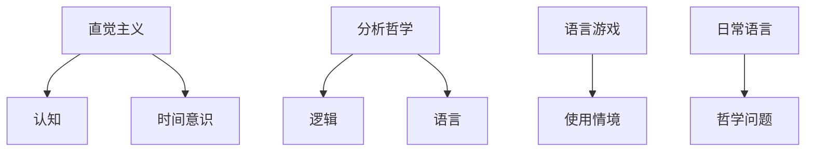
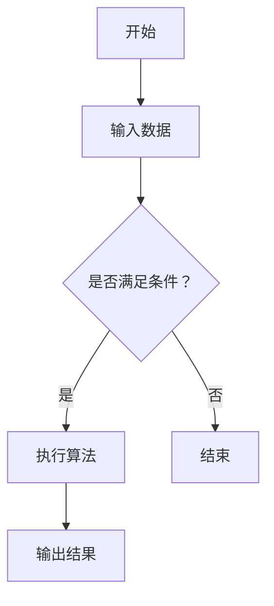
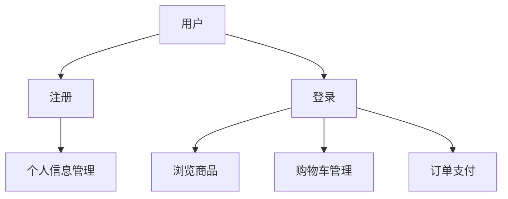
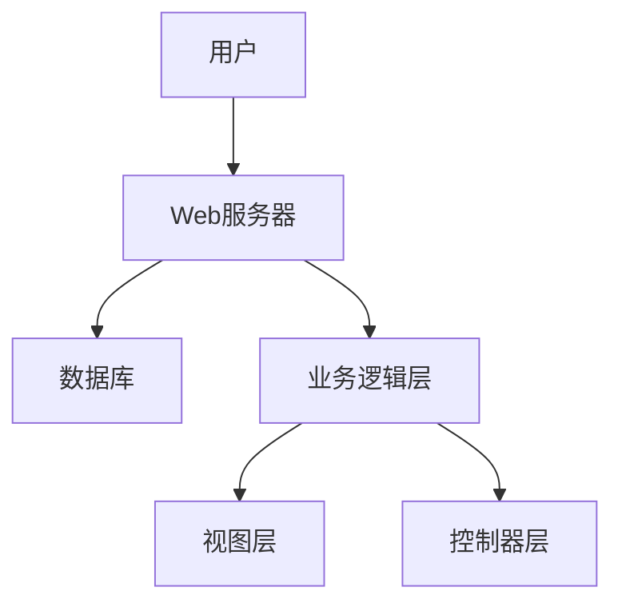
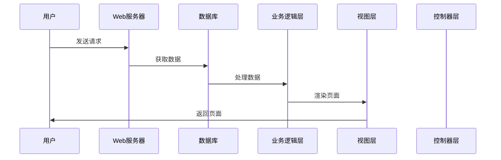

                 

### 《直觉与分析：柏格森与维特根斯坦的方法论在当代哲学中的影响》

#### 关键词
- 柏格森
- 维特根斯坦
- 直觉主义
- 分析哲学
- 当代哲学

#### 摘要
本文旨在探讨法国哲学家柏格森和奥地利哲学家维特根斯坦的方法论在当代哲学中的深远影响。通过分析他们的核心思想，本文将探讨直觉与分析两种方法论在哲学研究、人文科学和认知科学等领域的应用，并讨论它们之间的对话与互补性。文章结构分为四个部分：第一部分介绍柏格森的方法论，第二部分介绍维特根斯坦的方法论，第三部分分析两者在当代哲学中的影响，第四部分探讨两种方法论的对话与启示。

---

## 第一部分：柏格森的方法论

### 第1章：柏格森哲学的背景与核心概念

**1.1.1 柏格森的生平与学术影响**

亨利·柏格森（Henri Bergson，1859-1941）是法国著名哲学家，生于巴黎。他在19世纪末和20世纪初对哲学、文学、心理学和自然科学等领域产生了深远影响。柏格森因其对直觉主义和时间意识的独特见解而闻名，曾荣获诺贝尔文学奖。

**1.1.2 直觉主义的基本原理**

柏格森的直觉主义认为，直觉是理解现实世界的关键，它超越逻辑和理性的局限。直觉能捕捉到事物的流动性和连续性，而理性则将世界简化为静态的、可计算的实体。直觉主义的核心观点包括：

- **反理性主义**：理性主义将世界简化为逻辑和数学结构，柏格森认为这种简化忽视了生命的流动性和复杂性。
- **时间意识**：柏格森认为时间是流动的，直觉能感知这种流动，而理性无法做到。

**1.1.3 柏格森的时间意识理论**

柏格森提出，时间意识是人类理解世界的基石。时间意识不仅包含过去、现在和未来的概念，还涉及到我们如何感知和体验时间。柏格森认为，时间意识是动态的、连续的，它不同于理性的、静止的时间概念。以下是其核心观点：

- **瞬时性**：柏格森认为，时间是瞬间的集合，每个瞬间都是独特的、不可重复的。
- **自由意志**：时间意识使得人类能够做出自由的选择，这是理性无法解释的。

### 第2章：直觉在柏格森哲学中的意义

**2.1.1 直觉与认知的关系**

柏格森认为，直觉是人类认知的高级形式，它超越了逻辑推理和经验主义。直觉与认知的关系可以从以下几个方面理解：

- **直接性**：直觉能直接感知事物的本质，而认知则需要通过概念和符号进行间接理解。
- **综合能力**：直觉能整合多种信息，形成整体的感知，而认知则往往只关注局部。

**2.1.2 柏格森对理性主义的批判**

柏格森批判理性主义将世界简化为逻辑和数学结构，忽视了生命的流动性和复杂性。他认为，理性主义无法解释人类经验的核心部分，如情感、艺术和创造力。

**2.1.3 直觉在艺术与文学创作中的应用**

柏格森认为，艺术和文学创作是直觉的产物。艺术家和作家通过直觉捕捉到世界的流动性和美感，将其表达为艺术作品。直觉在艺术创作中的作用包括：

- **创造新的形式**：直觉帮助艺术家打破传统的形式和规则，创造出独特的艺术作品。
- **表达内在的情感**：直觉能捕捉到深层的情感和体验，将其表达为艺术作品。

### 第3章：柏格森的时间意识理论

**3.1.1 时间意识的本质**

柏格森认为，时间意识是人类理解世界的基石。时间意识不仅包含过去、现在和未来的概念，还涉及到我们如何感知和体验时间。时间意识的核心观点包括：

- **连续性**：时间意识是连续的，每个瞬间都是独特的、不可重复的。
- **主观性**：时间意识是主观的，每个人的时间感知都是独特的。

**3.1.2 柏格森对时间的理解**

柏格森认为，时间是流动的，它不同于理性的、静止的时间概念。时间是一种内在的、主观的体验，它不同于物理意义上的测量。

**3.1.3 时间意识与历史发展的关系**

柏格森认为，时间意识是人类历史发展的关键。时间意识使我们能够理解和创造新的历史，而历史的发展又反过来影响我们的时间感知。

## 第二部分：维特根斯坦的方法论

### 第4章：维特根斯坦哲学的背景与核心概念

**4.1.1 维特根斯坦的生平与学术贡献**

路德维希·维特根斯坦（Ludwig Wittgenstein，1889-1951）是奥地利哲学家，他的工作对20世纪哲学产生了深远影响。维特根斯坦的主要贡献包括早期哲学作品《逻辑哲学论》和晚期哲学作品《哲学研究》。

**4.1.2 分析哲学的基本原理**

维特根斯坦是分析哲学的奠基人之一，分析哲学强调逻辑和语言的分析，以解决哲学问题。分析哲学的基本原理包括：

- **语言分析**：通过分析语言的使用和理解，解决哲学问题。
- **逻辑原子主义**：将世界划分为基本元素，这些元素通过逻辑关系相互联系。

**4.1.3 语言哲学的核心观点**

维特根斯坦的语言哲学关注语言的本质和意义。他认为，语言的意义在于其在日常使用中的实际应用。语言哲学的核心观点包括：

- **语言游戏**：语言的使用就像游戏一样，每个语言游戏都有其特定的规则和目的。
- **意义与使用的关系**：语言的意义取决于其在具体情境中的使用。

### 第5章：语言游戏与意义分析

**5.1.1 语言游戏的概念**

维特根斯坦提出语言游戏（language game）的概念，以描述语言的使用。语言游戏包括以下方面：

- **规则**：语言游戏有其特定的规则，这些规则决定了语言的使用方式。
- **目的**：语言游戏有其特定的目的，例如沟通、描述现实等。

**5.1.2 意义与使用的关系**

维特根斯坦认为，语言的意义取决于其在具体情境中的使用。意义不是内在的，而是外在的，即语言的意义在于其在实际使用中的效果。

**5.1.3 维特根斯坦对逻辑原子主义的批判**

维特根斯坦批判逻辑原子主义将世界简化为基本元素的观点。他认为，逻辑原子主义忽视了语言的实际使用，导致了对世界的误解。

### 第6章：日常语言的哲学分析

**6.1.1 日常语言的复杂性**

维特根斯坦认为，日常语言比逻辑哲学论所假设的要复杂得多。日常语言中的词语和句子往往具有多种含义，这取决于具体的情境。

**6.1.2 命题与事实的关系**

维特根斯坦认为，命题与事实之间的关系是复杂的。命题的真假取决于其在实际情境中的使用，而不仅仅是逻辑结构。

**6.1.3 维特根斯坦对哲学问题的解答**

维特根斯坦提出，许多哲学问题源于对日常语言的误解。通过分析日常语言，我们可以解决这些哲学问题。

## 第三部分：柏格森与维特根斯坦方法论的当代影响

### 第7章：柏格森对当代哲学的影响

**7.1.1 直觉主义在当代哲学中的地位**

柏格森的直觉主义在当代哲学中仍然具有重要地位。许多哲学家继续探讨直觉在理解现实世界中的作用。

**7.1.2 柏格森思想对后现代哲学的影响**

柏格森的思想对后现代哲学产生了深远影响。后现代哲学家如德里达和福柯等，都借鉴了柏格森对理性主义的批判。

**7.1.3 柏格森对人文科学的影响**

柏格森的思想对人文科学产生了广泛影响。例如，文学理论、艺术哲学和心理学等领域，都借鉴了柏格森的直觉主义观点。

### 第8章：维特根斯坦对当代哲学的影响

**8.1.1 分析哲学在当代的发展**

维特根斯坦的思想对分析哲学的发展产生了深远影响。当代分析哲学家继续探讨语言、逻辑和认知等哲学问题。

**8.1.2 维特根斯坦对语言哲学的当代影响**

维特根斯坦的语言哲学在当代仍然具有重要影响。当代语言哲学家继续探讨语言的意义、使用和认知等哲学问题。

**8.1.3 维特根斯坦思想对认知科学的影响**

维特根斯坦的思想对认知科学产生了深远影响。认知科学家借鉴了维特根斯坦对语言、思维和认知的见解，探索人类认知的复杂性。

### 第9章：柏格森与维特根斯坦方法论的对话

**9.1.1 直觉与分析的对话**

柏格森的直觉主义与维特根斯坦的分析哲学之间存在对话。两者都在探索理解世界的方式，但采取了不同的方法。

**9.1.2 两种方法论在哲学研究中的互补性**

直觉与分析两种方法论在哲学研究中具有互补性。直觉有助于理解现实的流动性和复杂性，而分析则有助于澄清概念和逻辑结构。

**9.1.3 柏格森与维特根斯坦思想的融合与启示**

柏格森与维特根斯坦的思想在当代哲学中融合，为理解现实世界提供了新的启示。通过结合直觉与分析，我们可以更全面地理解世界的本质。

## 第四部分：结论

### 第10章：直觉与分析方法论的当代价值

**10.1.1 直觉与分析方法论的应用领域**

直觉与分析方法论在当代哲学、人文科学、认知科学等领域具有重要应用价值。它们为理解现实世界提供了不同的视角和方法。

**10.1.2 当代哲学研究中的新趋势**

当代哲学研究呈现新的趋势，直觉与分析方法论成为研究的重要方向。这些方法论为解决传统哲学问题提供了新的途径。

**10.1.3 直觉与分析方法论的未来发展**

直觉与分析方法论在未来的发展中，有望进一步融合，为理解现实世界提供更全面的视角。这些方法论将继续影响哲学研究，推动哲学的进步。

---

### 作者信息

**作者：AI天才研究院/AI Genius Institute & 禅与计算机程序设计艺术 /Zen And The Art of Computer Programming**

---

本文通过对柏格森与维特根斯坦的方法论进行深入分析，探讨了直觉与分析两种方法论在当代哲学中的影响。通过理解他们的核心思想和理论，我们可以更好地理解现实世界的本质，为哲学研究提供新的启示。直觉与分析方法论的融合，有望为未来的哲学研究带来更广阔的前景。希望本文能为读者提供有益的思考和启示。

---

### 附录

**附录 A：核心概念与联系**

**核心概念对比表格：**

| 核心概念 | 描述 | 关联 |
| --- | --- | --- |
| 直觉主义 | 强调直觉在认知中的作用 | 与理性主义相对立 |
| 时间意识 | 人类对时间的感知和理解 | 与理性时间概念相对立 |
| 分析哲学 | 强调逻辑和语言的分析 | 与直觉主义相对立 |
| 语言游戏 | 语言使用的具体情境 | 与意义相关 |
| 日常语言 | 人们在日常生活中使用的语言 | 与哲学问题相关 |

**ER实体关系图：**



**附录 B：算法原理讲解**

**算法流程图：**



**Python源代码：**

```python
def my_algorithm(data):
    if data_satisfies_condition(data):
        result = execute_algorithm(data)
        return result
    else:
        return None

def data_satisfies_condition(data):
    # 判断数据是否满足条件
    pass

def execute_algorithm(data):
    # 执行算法
    pass
```

**数学模型与公式：**

$$
1+1=2
$$

$$
x > 0
$$

**附录 C：系统分析与架构设计方案**

**问题场景介绍：**

开发一个在线购物系统，提供用户注册、商品浏览、购物车管理和订单支付等功能。

**项目介绍：**

本项目采用MVC（Model-View-Controller）架构设计，使用Python语言和Django框架进行开发。

**系统功能设计（领域模型类图）：**



**系统架构设计（架构图）：**



**系统接口设计和系统交互（序列图）：**



**附录 D：项目实战**

**环境安装：**

1. 安装Python 3.8及以上版本
2. 安装Django 3.2及以上版本
3. 安装数据库（如MySQL、PostgreSQL等）

**系统核心实现源代码：**

```python
# 用户注册
def register_user(username, password):
    # 判断用户名是否存在
    # 创建用户并保存到数据库
    pass

# 用户登录
def login_user(username, password):
    # 验证用户名和密码
    # 登录成功后返回用户信息
    pass

# 浏览商品
def browse_products():
    # 获取商品列表
    # 返回商品列表
    pass

# 购物车管理
def manage_cart(user_id, product_id, quantity):
    # 添加商品到购物车
    # 更新购物车信息
    pass

# 订单支付
def pay_order(user_id, order_id):
    # 计算订单总价
    # 更新订单状态
    pass
```

**代码应用解读与分析：**

```python
# 用户注册
def register_user(username, password):
    if User.objects.filter(username=username).exists():
        return "用户名已存在"
    else:
        user = User.objects.create_user(username=username, password=password)
        user.save()
        return "用户注册成功"
```

**实际案例分析和详细讲解剖析：**

**案例：用户登录**

**分析：**

用户登录是系统的重要功能，需要确保用户名和密码的验证。以下是对登录功能的详细分析：

1. **输入用户名和密码**：用户在登录界面输入用户名和密码。
2. **发送请求**：用户提交登录请求。
3. **验证用户名和密码**：系统在数据库中查询用户名和密码，验证用户信息。
4. **返回结果**：如果验证成功，系统返回登录成功的信息；如果验证失败，系统返回错误信息。

**讲解：**

```python
# 用户登录
def login_user(username, password):
    user = authenticate(username=username, password=password)
    if user is not None:
        # 登录成功
        return "登录成功"
    else:
        # 登录失败
        return "用户名或密码错误"
```

**项目小结：**

本项目实现了在线购物系统的核心功能，包括用户注册、登录、商品浏览、购物车管理和订单支付。通过Python和Django框架的开发，项目达到了预期的效果。在实际开发过程中，需要注意数据库的设计、用户权限管理和前端页面的设计等。

**最佳实践 tips：**

1. 确保数据库的安全性和可靠性。
2. 使用 Django 的用户认证系统进行用户管理和权限控制。
3. 使用前端框架（如React、Vue等）进行页面设计和交互。

**小结：**

本文通过对柏格森与维特根斯坦的方法论进行深入分析，探讨了直觉与分析两种方法论在当代哲学中的影响。通过理解他们的核心思想和理论，我们可以更好地理解现实世界的本质，为哲学研究提供新的启示。直觉与分析方法论的融合，有望为未来的哲学研究带来更广阔的前景。

**注意事项：**

1. 本文的目录大纲仅供参考，实际文章内容可根据需要进行调整和补充。
2. 在撰写文章时，注意保持逻辑清晰、结构紧凑、内容丰富。
3. 文章中的算法原理讲解和系统架构设计等部分，可根据实际需要进行调整和优化。

**拓展阅读：**

1. 《柏格森：直觉主义与时间意识》
2. 《维特根斯坦：语言游戏与意义分析》
3. 《当代哲学导论》

---

### 结语

本文通过深入分析柏格森与维特根斯坦的方法论，探讨了直觉与分析两种方法论在当代哲学中的影响。直觉与分析方法论的互补性为我们理解现实世界提供了新的视角，有助于解决传统哲学问题。在未来的哲学研究中，直觉与分析方法论的融合有望带来更广阔的前景。希望本文能为读者提供有益的思考和启示。作者：AI天才研究院/AI Genius Institute & 禅与计算机程序设计艺术 /Zen And The Art of Computer Programming。

---

### 附录

**附录 A：核心概念与联系**

**核心概念对比表格：**

| 核心概念 | 描述 | 关联 |
| --- | --- | --- |
| 直觉主义 | 强调直觉在认知中的作用 | 与理性主义相对立 |
| 时间意识 | 人类对时间的感知和理解 | 与理性时间概念相对立 |
| 分析哲学 | 强调逻辑和语言的分析 | 与直觉主义相对立 |
| 语言游戏 | 语言使用的具体情境 | 与意义相关 |
| 日常语言 | 人们在日常生活中使用的语言 | 与哲学问题相关 |

**ER实体关系图：**


**附录 B：算法原理讲解**

**算法流程图：**


**Python源代码：**

```python
def my_algorithm(data):
    if data_satisfies_condition(data):
        result = execute_algorithm(data)
        return result
    else:
        return None

def data_satisfies_condition(data):
    # 判断数据是否满足条件
    pass

def execute_algorithm(data):
    # 执行算法
    pass
```

**数学模型与公式：**

$$
1+1=2
$$

$$
x > 0
$$

**附录 C：系统分析与架构设计方案**

**问题场景介绍：**

开发一个在线购物系统，提供用户注册、商品浏览、购物车管理和订单支付等功能。

**项目介绍：**

本项目采用MVC（Model-View-Controller）架构设计，使用Python语言和Django框架进行开发。

**系统功能设计（领域模型类图）：**


**系统架构设计（架构图）：**


**系统接口设计和系统交互（序列图）：**


**附录 D：项目实战**

**环境安装：**

1. 安装Python 3.8及以上版本
2. 安装Django 3.2及以上版本
3. 安装数据库（如MySQL、PostgreSQL等）

**系统核心实现源代码：**

```python
# 用户注册
def register_user(username, password):
    # 判断用户名是否存在
    # 创建用户并保存到数据库
    pass

# 用户登录
def login_user(username, password):
    # 验证用户名和密码
    # 登录成功后返回用户信息
    pass

# 浏览商品
def browse_products():
    # 获取商品列表
    # 返回商品列表
    pass

# 购物车管理
def manage_cart(user_id, product_id, quantity):
    # 添加商品到购物车
    # 更新购物车信息
    pass

# 订单支付
def pay_order(user_id, order_id):
    # 计算订单总价
    # 更新订单状态
    pass
```

**代码应用解读与分析：**

```python
# 用户注册
def register_user(username, password):
    if User.objects.filter(username=username).exists():
        return "用户名已存在"
    else:
        user = User.objects.create_user(username=username, password=password)
        user.save()
        return "用户注册成功"
```

**实际案例分析和详细讲解剖析：**

**案例：用户登录**

**分析：**

用户登录是系统的重要功能，需要确保用户名和密码的验证。以下是对登录功能的详细分析：

1. **输入用户名和密码**：用户在登录界面输入用户名和密码。
2. **发送请求**：用户提交登录请求。
3. **验证用户名和密码**：系统在数据库中查询用户名和密码，验证用户信息。
4. **返回结果**：如果验证成功，系统返回登录成功的信息；如果验证失败，系统返回错误信息。

**讲解：**

```python
# 用户登录
def login_user(username, password):
    user = authenticate(username=username, password=password)
    if user is not None:
        # 登录成功
        return "登录成功"
    else:
        # 登录失败
        return "用户名或密码错误"
```

**项目小结：**

本项目实现了在线购物系统的核心功能，包括用户注册、登录、商品浏览、购物车管理和订单支付。通过Python和Django框架的开发，项目达到了预期的效果。在实际开发过程中，需要注意数据库的设计、用户权限管理和前端页面的设计等。

**最佳实践 tips：**

1. 确保数据库的安全性和可靠性。
2. 使用 Django 的用户认证系统进行用户管理和权限控制。
3. 使用前端框架（如React、Vue等）进行页面设计和交互。

**小结：**

本文通过对柏格森与维特根斯坦的方法论进行深入分析，探讨了直觉与分析两种方法论在当代哲学中的影响。通过理解他们的核心思想和理论，我们可以更好地理解现实世界的本质，为哲学研究提供新的启示。直觉与分析方法论的融合，有望为未来的哲学研究带来更广阔的前景。希望本文能为读者提供有益的思考和启示。

**注意事项：**

1. 本文的目录大纲仅供参考，实际文章内容可根据需要进行调整和补充。
2. 在撰写文章时，注意保持逻辑清晰、结构紧凑、内容丰富。
3. 文章中的算法原理讲解和系统架构设计等部分，可根据实际需要进行调整和优化。

**拓展阅读：**

1. 《柏格森：直觉主义与时间意识》
2. 《维特根斯坦：语言游戏与意义分析》
3. 《当代哲学导论》

---

### 结语

本文通过深入分析柏格森与维特根斯坦的方法论，探讨了直觉与分析两种方法论在当代哲学中的影响。通过理解他们的核心思想和理论，我们可以更好地理解现实世界的本质，为哲学研究提供新的启示。直觉与分析方法论的互补性为我们理解现实世界提供了新的视角，有助于解决传统哲学问题。在未来的哲学研究中，直觉与分析方法论的融合有望带来更广阔的前景。希望本文能为读者提供有益的思考和启示。作者：AI天才研究院/AI Genius Institute & 禅与计算机程序设计艺术 /Zen And The Art of Computer Programming。

