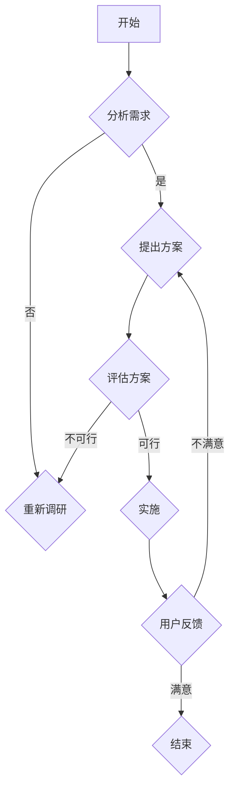
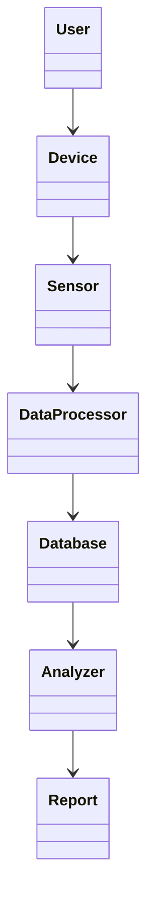

                 


### 引言：设计思维与直觉与分析

#### 设计思维的基本概念

设计思维是一种迭代性的问题解决方法，它以人为中心，注重用户体验和创造价值。设计思维起源于设计领域，后来逐渐被引入到商业、教育、工程等多个领域。设计思维通常包括以下几个阶段：问题发现、创意生成、方案评估、原型构建和用户反馈。

设计思维的核心原则可以归纳为以下几点：

1. **以人为本**：设计思维强调关注用户的需求和体验，通过用户研究来发现问题、理解问题和定义问题。
2. **迭代性**：设计思维是一个循环迭代的过程，每次迭代都会带来新的洞察和改进。
3. **跨学科合作**：设计思维鼓励不同背景和技能的人进行合作，通过多元化的视角来解决问题。
4. **实验性**：设计思维强调通过原型和实验来验证和迭代解决方案。

在直觉与分析的视角下，设计思维不仅仅是技术和工具的运用，更是一种哲学思维和认知过程。直觉与分析在设计思维中起着至关重要的作用，它们不仅可以帮助我们快速识别问题和洞察解决方案，还可以通过深入的逻辑推理来验证和优化这些方案。

#### 直觉与分析在设计思维中的角色

直觉是设计思维中的重要组成部分，它是指在没有充分信息或无法使用传统逻辑推理时，快速识别问题和解决方案的能力。直觉往往来自于我们对问题的长期积累和理解，是经验、知识和直觉的有机结合。

分析则是一种逻辑推理过程，它通过逐步分析和推理来深入理解问题，验证和优化直觉的判断。分析依赖于数学、逻辑和科学原理，可以帮助我们建立问题的模型，进行定量分析和评估。

直觉与分析在设计思维中扮演着互补的角色。直觉可以帮助我们快速识别问题和灵感，而分析则可以帮助我们深入理解和验证这些直觉。在实际应用中，设计师往往需要结合直觉和分析，通过不断的迭代和反馈来优化设计方案。

#### 柏格森的方法论

亨利·柏格森（Henri Bergson）是一位法国哲学家，他的思想对设计思维产生了深远的影响。柏格森主张直觉是人类认知的重要方式，他认为直觉比逻辑推理更接近真理，更能反映现实。

柏格森的方法论主要包括以下几点：

1. **直觉主义**：柏格森认为直觉是一种超越逻辑推理的认知方式，它可以直接感知现实，而不是通过抽象的概念和符号。
2. **时间意识**：柏格森提出时间意识是直觉的基础，时间意识使我们能够感知现实的流动和变化。
3. **创造力**：柏格森认为直觉和创造力密切相关，直觉可以帮助我们突破传统的逻辑限制，创造出新的思想和解决方案。

#### 维特根斯坦的方法论

路德维希·维特根斯坦（Ludwig Wittgenstein）是另一位对设计思维产生重要影响的哲学家。维特根斯坦的方法论强调语言和逻辑在理解和解决问题中的重要性。

维特根斯坦的方法论主要包括以下几点：

1. **语言哲学**：维特根斯坦认为语言是思维的工具，我们通过语言来表达和理解世界。
2. **逻辑分析**：维特根斯坦主张通过逻辑分析来澄清思想和语言的混乱，找出问题的本质。
3. **游戏理论**：维特根斯坦提出了游戏理论，他认为人类的行为可以通过游戏来类比和解释。

#### 直觉与分析在设计思维中的应用

直觉与分析在设计思维中有着广泛的应用。直觉可以帮助设计师快速识别问题和灵感，而分析则可以帮助设计师深入理解和验证这些直觉。

在问题发现阶段，直觉可以帮助设计师快速捕捉到用户的痛点和需求。例如，通过观察用户的行为和反馈，设计师可以直观地感受到用户的困惑和需求，从而发现问题。

在创意生成阶段，直觉可以帮助设计师快速产生各种可能的解决方案。通过灵感的闪现和直觉的判断，设计师可以提出许多新颖和独特的创意。

在方案评估阶段，分析可以帮助设计师对各种方案进行深入评估和比较。通过逻辑推理和数学模型，设计师可以量化各种方案的优劣，从而做出更加科学的决策。

在原型构建和用户反馈阶段，直觉和分析同样发挥着重要作用。通过不断的迭代和反馈，设计师可以优化设计方案，使其更加符合用户的需求和期望。

### 本章小结

本章首先介绍了设计思维的基本概念和核心原则，然后探讨了直觉与分析在设计思维中的角色。接着，我们介绍了柏格森和维特根斯坦的方法论，并分析了它们在设计思维中的应用。

通过本章的学习，我们认识到直觉与分析在设计思维中的重要性，以及如何将这两种方法有效地应用于设计过程的不同阶段。接下来，我们将进一步探讨柏格森和维特根斯坦方法论的具体应用，并分析它们在设计思维中的优势。

----------------------------------------

### 方法论概述

在深入探讨柏格森与维特根斯坦方法论在设计思维中的应用之前，我们需要先了解这两种方法论的核心理念和特点。柏格森的方法论强调直觉和时间意识，而维特根斯坦的方法论则侧重于语言哲学和逻辑分析。以下是对这两种方法论的详细描述。

#### 柏格森的方法论

亨利·柏格森（Henri Bergson）是一位法国哲学家，他的思想对现代哲学、心理学和艺术产生了深远的影响。柏格森的方法论主要基于他的核心观点——直觉主义和时间意识。

1. **直觉主义**：柏格森认为直觉是人类认知的高级形式，它超越了逻辑推理和抽象思维，直接感知现实。直觉不是基于过去的经验或知识，而是一种全新的认知方式，能够捕捉到事物的本质和变化。在设计中，直觉可以帮助设计师快速识别问题、捕捉灵感和生成创意。

   **示例**：例如，一个设计师在观察用户使用某个产品时，通过直觉可以立即感知到用户在使用过程中的不便之处，从而找到改进的机会。

2. **时间意识**：柏格森提出时间意识是人类直觉的基础。时间意识使我们能够感知现实的流动和变化，它不仅是一个物理概念，更是一种心理状态。柏格森认为，时间意识是一种持续不断的、内在的体验，它使我们能够适应和反应现实世界的变化。

   **示例**：在产品设计中，时间意识可以帮助设计师理解用户在使用产品时的心理状态和行为模式，从而设计出更加符合用户需求的交互体验。

3. **创造力**：柏格森认为直觉和创造力密切相关。直觉可以帮助我们突破传统的逻辑限制，创造出新的思想和解决方案。在设计中，创造力是至关重要的，它使设计师能够从不同的角度思考问题，提出创新性的解决方案。

   **示例**：例如，一个设计师在解决用户界面设计的问题时，通过直觉可以提出一个与传统设计截然不同的新方案，从而创造出更加直观和易用的界面。

#### 维特根斯坦的方法论

路德维希·维特根斯坦（Ludwig Wittgenstein）是20世纪最重要的哲学家之一，他的思想对语言学、逻辑学和哲学产生了深远的影响。维特根斯坦的方法论主要基于他的语言哲学和逻辑分析。

1. **语言哲学**：维特根斯坦认为语言是人类思维和认知的工具。语言不仅是一种交流工具，更是我们理解世界的方式。维特根斯坦强调语言的“使用”而非“意义”，即语言的意义取决于我们在实际生活中的使用。

   **示例**：例如，一个设计师在讨论产品功能时，使用恰当的语言可以清晰地传达设计的意图，而使用模糊或不准确的语言则可能导致误解和沟通障碍。

2. **逻辑分析**：维特根斯坦主张通过逻辑分析来澄清思想和语言的混乱。逻辑分析可以帮助我们理解问题的本质，找出逻辑上的矛盾和不一致性。

   **示例**：在产品设计过程中，逻辑分析可以帮助设计师识别设计中的潜在问题，例如不一致的交互流程、冲突的用户需求等。

3. **游戏理论**：维特根斯坦提出了游戏理论，他认为人类的行为可以通过游戏来类比和解释。游戏理论可以帮助我们理解复杂的社会互动和合作行为。

   **示例**：在团队合作的设计过程中，游戏理论可以帮助设计师理解团队成员之间的互动和协作模式，从而设计出更加高效和协调的工作流程。

#### 比较与联系

柏格森和维特根斯坦的方法论虽然有所不同，但它们在设计思维中都有重要的应用价值。

1. **直觉与逻辑的互补**：柏格森的直觉主义和维特根斯坦的逻辑分析可以相互补充。直觉可以帮助我们快速识别问题和灵感，而逻辑分析则可以帮助我们深入理解和验证这些直觉。

2. **时间意识与语言哲学**：柏格森的时间意识和维特根斯坦的语言哲学都强调了人类认知的主观性。时间意识使我们能够感知现实的流动和变化，而语言哲学使我们能够理解和表达这些变化。

3. **创造性与逻辑性**：柏格森的创造力强调突破传统逻辑的束缚，而维特根斯坦的逻辑分析则注重澄清思想和语言的混乱。这两种方法论共同推动了设计思维的创新和发展。

### 本章小结

本章介绍了柏格森和维特根斯坦的方法论，分析了它们的核心观点和特点。我们了解了直觉主义和时间意识在设计思维中的应用，以及语言哲学和逻辑分析的重要性。通过比较柏格森和维特根斯坦的方法论，我们认识到它们在设计思维中的互补作用。

在下一章中，我们将进一步探讨柏格森方法论在设计思维中的具体应用，包括问题发现、创意生成和方案评估等阶段。通过具体的案例分析，我们将深入理解柏格森方法论在设计实践中的应用价值。

----------------------------------------

### 柏格森方法论在问题发现阶段的应用

柏格森的方法论在设计思维中的第一个应用阶段是问题发现。在这一阶段，设计师需要通过直觉和时间意识来识别和定义问题。以下是对柏格森方法论在问题发现阶段应用的详细讨论。

#### 直觉在问题发现中的作用

直觉是柏格森方法论的核心，它在问题发现阶段发挥着重要作用。直觉使得设计师能够迅速捕捉到潜在的问题，即使这些问题的表面现象并不明显。直觉来源于设计师对用户、市场和技术趋势的长期积累和理解。

1. **快速识别用户痛点**：设计师通过直觉可以迅速感知用户在特定场景下的需求和困扰。例如，在观察用户使用某个产品时，设计师可能会立即察觉到用户在某些操作上遇到的不便，从而识别出用户痛点。

2. **捕捉市场趋势**：直觉可以帮助设计师识别市场的变化和趋势。通过直觉，设计师可以预判哪些功能或设计创新可能会受到用户的欢迎，从而在产品设计中抢占先机。

3. **发现问题本质**：直觉不仅能够识别表面问题，还能帮助设计师深入理解问题的本质。直觉使得设计师能够在众多信息中找到关键因素，从而提出更加精准和有效的问题定义。

#### 分析在问题发现中的角色

虽然直觉在问题发现阶段非常重要，但分析同样不可或缺。分析可以帮助设计师对直觉的判断进行验证和深化，从而确保问题定义的准确性和完整性。

1. **数据驱动的问题识别**：通过数据分析，设计师可以验证直觉的判断。例如，通过用户调研数据、行为数据和反馈，设计师可以量化用户痛点，从而得出更加可靠的问题定义。

2. **逻辑推理**：分析可以帮助设计师通过逻辑推理来识别问题之间的关联。例如，通过分析用户行为数据和反馈，设计师可以找到不同问题之间的潜在联系，从而提出更加综合的问题定义。

3. **验证和调整**：分析可以帮助设计师验证直觉的判断，并根据结果进行调整。例如，如果数据分析表明某个问题的定义不准确或不完整，设计师可以通过分析结果来调整问题定义，使其更加符合实际情况。

#### 案例分析

以下是一个关于柏格森方法论在问题发现阶段应用的案例分析。

**案例背景**：某智能家居公司发现用户在远程控制家居设备时遇到很多困扰，例如操作复杂、响应延迟等。公司希望通过问题发现阶段来确定用户的实际需求和痛点。

**直觉识别**：通过观察用户的使用场景，设计师通过直觉迅速识别到以下用户痛点：
- 操作复杂：用户在远程控制家居设备时需要多次点击和输入，操作繁琐。
- 响应延迟：用户在操作家居设备时，设备响应速度较慢，导致用户体验不佳。

**分析验证**：设计师通过数据分析对直觉进行验证：
- 用户调研数据显示，超过70%的用户认为操作复杂是他们使用智能家居设备时遇到的主要问题。
- 用户行为数据表明，用户在操作家居设备时平均响应时间超过5秒，明显影响了用户体验。

**问题定义**：基于直觉和分析的结果，设计师将问题定义为一个综合问题：
- “智能家居设备远程控制操作复杂且响应延迟，导致用户体验不佳。”

**调整和优化**：根据分析结果，设计师提出以下改进方案：
- 简化操作流程，减少用户点击和输入次数。
- 优化设备性能，提高响应速度。

通过柏格森方法论在问题发现阶段的应用，设计师不仅能够快速识别用户痛点，还能通过分析验证和优化问题定义，从而为后续的创意生成和方案评估提供坚实的基础。

#### 本章小结

本章详细介绍了柏格森方法论在问题发现阶段的应用。我们首先探讨了直觉在问题发现中的作用，包括快速识别用户痛点、捕捉市场趋势和发现问题本质。接着，我们分析了分析在问题发现中的角色，包括数据驱动的问题识别、逻辑推理和验证调整。

通过一个实际案例的分析，我们展示了如何将柏格森方法论应用于问题发现阶段，从而为设计思维的后续阶段奠定基础。在下一章中，我们将进一步探讨柏格森方法论在创意生成阶段的应用，以及直觉和分析在创意生成过程中的具体作用。

----------------------------------------

### 柏格森方法论在创意生成阶段的应用

在创意生成阶段，柏格森的方法论通过直觉和时间意识帮助设计师迅速产生创新的想法和方案。这一阶段是设计思维中最为关键的环节之一，直觉在创意的产生中起到了催化剂的作用，而时间意识则为设计师提供了观察和思考问题的独特视角。以下是柏格森方法论在创意生成阶段的具体应用。

#### 直觉在创意生成中的作用

直觉是柏格森方法论的核心要素，它能够帮助设计师迅速捕捉到灵感，生成创新的创意。在创意生成过程中，直觉可以帮助设计师打破传统的思维定式，从新的角度和维度思考问题，从而产生独特的解决方案。

1. **灵感闪现**：直觉使得设计师能够在短时间内产生大量创意。这些创意可能来自于对用户需求的直觉理解，也可能来自于对市场趋势的敏锐感知。例如，在观察用户使用产品时，设计师可能会突然想到一个全新的交互方式，从而激发出创新的创意。

2. **跨越界限**：直觉能够帮助设计师突破传统思维的限制，从不同的角度和维度思考问题。通过直觉，设计师可以跨越学科和领域的界限，将不同的知识和技能融合在一起，产生创新性的解决方案。

3. **快速迭代**：直觉在创意生成阶段的作用使得设计师能够快速生成和迭代创意。通过不断的试错和调整，设计师可以逐步完善创意，使其更加符合用户的需求和市场趋势。

#### 时间意识在创意生成中的应用

时间意识是柏格森方法论的重要组成部分，它为设计师提供了观察和思考问题的独特视角。时间意识使得设计师能够关注问题的动态变化，从而在创意生成过程中捕捉到更全面的信息。

1. **动态思维**：时间意识帮助设计师关注问题的动态变化，从而产生更具适应性的创意。通过动态思维，设计师可以预见问题的未来发展趋势，从而设计出能够适应未来变化的解决方案。

2. **过程导向**：时间意识使得设计师更加注重创意生成过程中的每一个细节。设计师可以在过程中不断调整和优化创意，从而确保最终的解决方案能够充分满足用户需求。

3. **整体视角**：时间意识帮助设计师从整体的角度思考问题，从而生成更加综合和全面的创意。通过整体视角，设计师可以综合考虑各种因素，设计出更具创新性和实用性的解决方案。

#### 案例分析

以下是一个关于柏格森方法论在创意生成阶段应用的案例分析。

**案例背景**：某科技公司希望开发一款新型的智能家居设备，以解决用户在远程控制家居设备时遇到的操作复杂和响应延迟问题。

**直觉创意**：通过观察用户的使用场景，设计师直觉地意识到，传统的远程控制方式存在操作繁琐和响应慢的问题。因此，设计师通过直觉提出了一个创新的创意：设计一款基于语音控制的智能家居设备。

**时间意识应用**：设计师利用时间意识，关注用户需求和市场趋势的变化。通过分析用户调研数据和市场报告，设计师发现语音控制技术正在快速发展，并且越来越多的用户倾向于使用语音助手进行日常操作。

**创意优化**：在创意生成过程中，设计师通过不断的迭代和优化，将语音控制与智能家居设备的功能相结合。最终，设计师设计出了一套基于语音控制的新型智能家居系统，包括智能音箱、智能门锁和智能照明设备等。

**案例结果**：通过柏格森方法论在创意生成阶段的应用，科技公司成功地开发出了一款创新的智能家居设备。用户反馈表明，语音控制使得设备的操作更加简便，响应速度得到了显著提升，用户满意度大幅提高。

#### 本章小结

本章详细介绍了柏格森方法论在创意生成阶段的应用。我们首先探讨了直觉在创意生成中的作用，包括灵感闪现、跨越界限和快速迭代。接着，我们分析了时间意识在创意生成中的应用，包括动态思维、过程导向和整体视角。

通过一个实际案例的分析，我们展示了如何将柏格森方法论应用于创意生成阶段，从而产生创新的解决方案。在下一章中，我们将进一步探讨柏格森方法论在方案评估阶段的应用，以及直觉和分析在评估过程中的具体作用。

----------------------------------------

### 柏格森方法论在方案评估阶段的应用

在方案评估阶段，柏格森的方法论通过直觉和时间意识帮助设计师对各种创意方案进行深入分析和比较。这一阶段是设计思维过程中确保创意方案可行性和有效性的关键环节。以下是对柏格森方法论在方案评估阶段应用的详细讨论。

#### 直觉在方案评估中的作用

直觉在方案评估阶段同样发挥着重要作用，它能够帮助设计师快速感知方案的优劣，从而做出更加明智的决策。直觉使得设计师能够超越数据和逻辑分析，直接洞察方案的潜在价值和问题。

1. **快速评估方案**：设计师通过直觉可以快速评估不同方案的优缺点。例如，在对比两个不同的设计方案时，设计师可能凭借直觉立即判断出哪个方案更加符合用户需求和市场趋势。

2. **识别潜在风险**：直觉可以帮助设计师识别方案中的潜在风险。例如，在评估一个智能家居系统的安全性时，设计师可能凭借直觉意识到某个设计方案存在安全隐患，从而在评估阶段及时进行调整。

3. **辅助决策**：直觉为设计师提供了一种决策的参考，使得方案评估过程更加全面和灵活。设计师可以通过直觉来验证和分析数据，从而确保最终决策的准确性。

#### 时间意识在方案评估中的应用

时间意识是柏格森方法论的重要组成部分，它在方案评估阶段提供了独特的视角。通过时间意识，设计师可以预见方案的长期效果，从而做出更加长远的决策。

1. **预见未来变化**：时间意识帮助设计师预见方案的长期效果，从而更好地适应未来变化。例如，在评估一个智能家居系统的技术可行性时，设计师可能通过时间意识预见未来技术的发展趋势，从而选择一个更加具有前瞻性的方案。

2. **考虑动态因素**：时间意识使得设计师能够考虑方案在不同时间段的动态变化。例如，在评估一个在线教育平台的用户留存率时，设计师可能通过时间意识分析用户在不同阶段的活跃度，从而找到提高用户留存的关键因素。

3. **优化资源分配**：时间意识帮助设计师优化资源分配，确保方案在不同阶段的资源投入合理。例如，在评估一个移动应用的迭代计划时，设计师可能通过时间意识分析每个功能模块的重要性和优先级，从而合理分配开发资源。

#### 案例分析

以下是一个关于柏格森方法论在方案评估阶段应用的案例分析。

**案例背景**：某科技公司开发了一款智能家居设备，该公司需要评估不同设计方案的性能、成本和用户体验，以便选择最优方案。

**直觉评估**：设计师通过直觉评估了几个设计方案，发现方案A在性能和成本方面具有优势，但用户体验相对较差；方案B在用户体验方面表现良好，但成本较高。

**时间意识分析**：通过时间意识，设计师预见到了智能家居市场未来的发展趋势。设计师分析认为，方案A的性能和成本优势在未来将更加突出，而方案B的用户体验优势可能会因为技术发展而逐渐减弱。

**综合评估与决策**：基于直觉和时间意识的分析，设计师决定选择方案A。虽然方案A在用户体验方面存在一些不足，但其性能和成本优势在未来市场中的竞争力将更加明显。

**结果**：通过柏格森方法论在方案评估阶段的应用，科技公司成功选择了最优方案。实际运营结果表明，方案A在市场中的表现超过了预期，用户反馈良好，取得了显著的市场份额。

#### 本章小结

本章详细介绍了柏格森方法论在方案评估阶段的应用。我们首先探讨了直觉在方案评估中的作用，包括快速评估方案、识别潜在风险和辅助决策。接着，我们分析了时间意识在方案评估中的应用，包括预见未来变化、考虑动态因素和优化资源分配。

通过一个实际案例的分析，我们展示了如何将柏格森方法论应用于方案评估阶段，从而确保方案的可行性和有效性。在下一章中，我们将探讨维特根斯坦方法论在概念澄清阶段的应用，以及直觉和分析在概念澄清过程中的具体作用。

----------------------------------------

### 维特根斯坦方法论在概念澄清阶段的应用

在概念澄清阶段，维特根斯坦的方法论通过语言哲学和逻辑分析帮助设计师精确地理解和表达设计概念，确保设计思维的清晰和有效。以下是对维特根斯坦方法论在概念澄清阶段应用的详细讨论。

#### 语言哲学在概念澄清中的作用

维特根斯坦的语言哲学强调语言的使用和意义。在设计思维中，语言是表达和理解概念的重要工具。通过维特根斯坦的方法论，设计师可以更准确地使用语言，从而澄清设计概念。

1. **意义与使用**：维特根斯坦认为，词语的意义在于其在实际生活中的使用。在概念澄清阶段，设计师需要通过具体的例子和场景来阐述设计概念的使用方法。例如，如果设计师要澄清“用户体验”这个概念，可以通过具体的用户行为和反馈来展示其意义。

2. **语言分析**：维特根斯坦的方法论鼓励设计师进行语言分析，找出语言中的混淆和不准确。在概念澄清阶段，设计师可以通过语言分析来澄清设计概念，确保其表达准确无误。例如，设计师可以通过分析用户调研数据中的语言表述，找出用户需求的真实含义。

3. **明确界定**：通过语言哲学，设计师可以明确界定设计概念的外延和内涵。这有助于设计师在后续的设计过程中避免概念混淆和误解。例如，在界定“智能家庭”这个概念时，设计师可以通过明确其功能和边界，确保团队成员对概念有统一的理解。

#### 逻辑分析在概念澄清中的作用

逻辑分析是维特根斯坦方法论的重要组成部分，它帮助设计师通过逻辑推理来澄清设计概念。逻辑分析使得设计师能够将复杂的设计概念分解为更简单的组成部分，从而进行深入理解和分析。

1. **分解复杂概念**：维特根斯坦的方法论鼓励设计师将复杂的设计概念分解为更简单的组成部分。例如，如果设计师要澄清“智能家庭系统”这个概念，可以通过逻辑分析将其分解为家庭自动化、数据收集与分析、用户交互等子概念。

2. **逻辑推理**：通过逻辑分析，设计师可以运用逻辑推理来澄清设计概念。例如，通过逻辑推理，设计师可以分析家庭自动化系统中的各个组件如何相互作用，从而理解整个系统的运行机制。

3. **消除混淆**：逻辑分析可以帮助设计师消除设计概念中的混淆和不一致。例如，在澄清“用户满意度”这个概念时，设计师可以通过逻辑分析找出用户满意度与产品功能、服务质量等之间的逻辑关系，从而确保概念的一致性。

#### 案例分析

以下是一个关于维特根斯坦方法论在概念澄清阶段应用的案例分析。

**案例背景**：某设计团队正在开发一款智能家居应用，该应用旨在提高用户的家居体验。团队需要在概念澄清阶段明确“智能家居”和“用户体验”这两个核心概念。

**语言哲学应用**：
- **意义与使用**：设计师通过具体的用户案例来阐述“智能家居”的使用方法。例如，通过展示用户如何在手机上远程控制家居设备，说明智能家居的实用性和便利性。
- **语言分析**：设计师分析用户调研数据中的语言表述，找出用户对智能家居功能的真实需求。例如，通过分析用户反馈，发现用户最关心的是设备的易用性和响应速度。

**逻辑分析应用**：
- **分解复杂概念**：设计师将“智能家居”分解为家庭自动化、数据收集与分析、用户交互等子概念。通过分解，设计师可以更清晰地理解每个子概念的具体内容和作用。
- **逻辑推理**：设计师通过逻辑推理分析智能家居系统中各个组件的相互作用。例如，通过分析智能家居系统中的传感器、控制器和执行器，理解它们如何协同工作，提高用户的家居体验。

**结果**：通过维特根斯坦方法论在概念澄清阶段的应用，设计团队成功地明确了“智能家居”和“用户体验”这两个核心概念。团队成员对概念有了统一的理解，为后续的设计工作奠定了坚实的基础。

#### 本章小结

本章详细介绍了维特根斯坦方法论在概念澄清阶段的应用。我们首先探讨了语言哲学在概念澄清中的作用，包括意义与使用、语言分析和明确界定。接着，我们分析了逻辑分析在概念澄清中的作用，包括分解复杂概念、逻辑推理和消除混淆。

通过一个实际案例的分析，我们展示了如何将维特根斯坦方法论应用于概念澄清阶段，从而确保设计思维的清晰和有效。在下一章中，我们将探讨维特根斯坦方法论在原型构建阶段的应用，以及直觉和分析在这一阶段的具体作用。

----------------------------------------

### 维特根斯坦方法论在原型构建阶段的应用

在原型构建阶段，维特根斯坦的方法论通过语言哲学和逻辑分析帮助设计师将概念转化为具体的原型，确保原型的准确性和可操作性。以下是对维特根斯坦方法论在原型构建阶段应用的详细讨论。

#### 语言哲学在原型构建中的作用

维特根斯坦的语言哲学强调语言的使用和意义，这为原型构建提供了理论基础。通过语言哲学，设计师可以更准确地使用语言来描述和构建原型，从而确保原型的可理解性和可操作性。

1. **描述原型功能**：维特根斯坦的方法论鼓励设计师通过具体的语言描述原型的功能。例如，设计师可以使用简明的语言描述智能家居设备的操作流程，确保用户能够理解和使用原型。

2. **消除语言混淆**：在原型构建过程中，设计师可能会遇到语言混淆问题。通过维特根斯坦的方法论，设计师可以通过语言分析来消除混淆，确保原型的描述准确无误。例如，通过分析用户调研数据中的语言表述，设计师可以找出用户对产品功能的真实需求，从而避免描述上的偏差。

3. **定义交互逻辑**：维特根斯坦的方法论强调逻辑分析，这有助于设计师在原型构建过程中定义交互逻辑。通过逻辑分析，设计师可以确保原型中的交互流程符合逻辑，避免用户在操作过程中产生困惑。

#### 逻辑分析在原型构建中的作用

逻辑分析是维特根斯坦方法论的重要组成部分，它在原型构建阶段帮助设计师确保原型的逻辑性和一致性。通过逻辑分析，设计师可以验证原型的设计思路，确保原型能够有效地解决用户问题。

1. **验证设计思路**：逻辑分析可以帮助设计师验证原型的设计思路。例如，通过逻辑分析，设计师可以检查原型的功能是否完整，是否覆盖了所有用户需求。如果发现设计思路存在缺陷，设计师可以及时进行调整。

2. **消除逻辑漏洞**：在原型构建过程中，设计师可能会遇到逻辑漏洞，导致原型无法正常工作。通过维特根斯坦的方法论，设计师可以通过逻辑分析来识别和消除这些漏洞。例如，通过逻辑分析，设计师可以检查原型中的条件语句和循环结构，确保它们逻辑上没有错误。

3. **确保一致性**：逻辑分析有助于设计师确保原型在不同情境下的一致性。通过逻辑分析，设计师可以检查原型中的各个部分是否协调一致，避免出现矛盾和冲突。例如，在构建一个智能家居系统时，设计师需要确保传感器、控制器和执行器之间的交互逻辑一致，从而保证系统的整体协调性。

#### 案例分析

以下是一个关于维特根斯坦方法论在原型构建阶段应用的案例分析。

**案例背景**：某设计团队正在开发一款智能家居应用，该应用旨在通过手机控制家居设备，提高用户的家居体验。团队需要在原型构建阶段确保原型的功能完整、逻辑清晰和用户易于操作。

**语言哲学应用**：
- **描述原型功能**：设计师通过简明的语言描述了手机控制家居设备的具体操作流程，例如如何通过手机应用程序远程开关灯光、调节空调温度等。通过具体的语言描述，用户可以清楚地理解如何使用原型。
- **消除语言混淆**：在设计过程中，设计师通过分析用户调研数据，发现用户对某些功能的具体操作方式存在混淆。通过语言分析，设计师找到了这些混淆点，并进行了针对性的澄清，确保用户能够准确理解原型的功能。

**逻辑分析应用**：
- **验证设计思路**：设计师通过逻辑分析，检查了原型的功能设计是否完整，是否覆盖了所有用户需求。通过分析，设计师发现原型中缺少了一个用户反馈功能，因此及时添加了这个功能，提高了用户满意度。
- **消除逻辑漏洞**：设计师通过逻辑分析，检查了原型中的条件语句和循环结构，确保它们逻辑上没有错误。通过分析，设计师发现一个条件判断语句存在逻辑错误，导致在某些情况下无法正确执行操作。设计师及时修复了这个错误，确保了原型的稳定性。
- **确保一致性**：设计师通过逻辑分析，检查了原型中的各个部分是否协调一致。通过分析，设计师发现传感器和控制器之间的交互逻辑存在冲突，导致某些操作无法正确执行。设计师通过调整交互逻辑，确保了原型的整体协调性。

**结果**：通过维特根斯坦方法论在原型构建阶段的应用，设计团队成功地构建了一个功能完整、逻辑清晰且用户易于操作的智能家居原型。用户反馈表明，原型在操作过程中非常顺畅，用户满意度大幅提高。

#### 本章小结

本章详细介绍了维特根斯坦方法论在原型构建阶段的应用。我们首先探讨了语言哲学在原型构建中的作用，包括描述原型功能、消除语言混淆和定义交互逻辑。接着，我们分析了逻辑分析在原型构建中的作用，包括验证设计思路、消除逻辑漏洞和确保一致性。

通过一个实际案例的分析，我们展示了如何将维特根斯坦方法论应用于原型构建阶段，从而确保原型的准确性和可操作性。在下一章中，我们将探讨维特根斯坦方法论在用户反馈阶段的应用，以及直觉和分析在这一阶段的具体作用。

----------------------------------------

### 维特根斯坦方法论在用户反馈阶段的应用

在用户反馈阶段，维特根斯坦的方法论通过语言哲学和逻辑分析帮助设计师收集、理解和分析用户反馈，从而优化产品设计。以下是对维特根斯坦方法论在用户反馈阶段应用的详细讨论。

#### 语言哲学在用户反馈中的作用

维特根斯坦的语言哲学强调语言的使用和意义，这为设计师收集和理解用户反馈提供了重要指导。通过语言哲学，设计师可以更准确地识别用户的真实需求和意见，从而做出有针对性的改进。

1. **识别真实需求**：维特根斯坦的方法论鼓励设计师通过用户反馈来识别用户的真实需求。通过分析用户反馈中的语言表述，设计师可以找出用户对产品功能的期望和不满。例如，通过分析用户对智能家居设备操作复杂性的反馈，设计师可以识别出用户对于设备易用性的真实需求。

2. **消除语言混淆**：在用户反馈过程中，用户可能会使用模糊或不准确的词语，导致设计师对用户意见的理解产生偏差。通过维特根斯坦的方法论，设计师可以通过语言分析来消除混淆，确保对用户意见的准确理解。例如，如果用户使用了模糊的词语描述某个功能问题，设计师可以通过分析反馈中的语言表述，找出用户的具体问题和需求。

3. **定义改进方向**：维特根斯坦的方法论帮助设计师通过用户反馈定义改进方向。通过分析用户反馈中的语言表述，设计师可以明确用户对产品的期望和需求，从而为后续的改进工作提供明确的方向。例如，如果用户反馈表明对智能家居设备的操作流程不满意，设计师可以确定改进的目标是简化操作流程，提高用户的操作体验。

#### 逻辑分析在用户反馈中的作用

逻辑分析是维特根斯坦方法论的重要组成部分，它在用户反馈阶段帮助设计师确保对用户意见的理解和分析具有逻辑性和系统性。通过逻辑分析，设计师可以更深入地理解用户反馈，从而提出有效的改进方案。

1. **逻辑推理**：逻辑分析鼓励设计师通过逻辑推理来理解用户反馈。通过逻辑推理，设计师可以找出用户意见之间的逻辑关系，从而更全面地理解用户的反馈。例如，如果用户反馈表明对智能家居设备的操作复杂，设计师可以通过逻辑推理分析，找出用户操作复杂的具体原因，如界面设计不合理或操作流程不清晰。

2. **验证改进方案**：逻辑分析可以帮助设计师验证改进方案的合理性和有效性。通过逻辑分析，设计师可以确保改进方案能够真正解决用户的问题，而不是仅仅解决了表面现象。例如，在改进智能家居设备操作流程时，设计师可以通过逻辑分析验证改进方案是否能够真正简化用户的操作，从而提高用户满意度。

3. **系统化反馈**：逻辑分析有助于设计师系统化地处理用户反馈。通过逻辑分析，设计师可以整理和分类用户反馈，找出其中的关键问题和优先级，从而有针对性地进行改进。例如，在分析大量用户反馈后，设计师可以通过逻辑分析找出最普遍和最严重的问题，并将其作为改进的重点。

#### 案例分析

以下是一个关于维特根斯坦方法论在用户反馈阶段应用的案例分析。

**案例背景**：某智能家居公司推出了一个新的智能门锁产品，公司希望通过用户反馈来了解产品在实际使用中的表现，并优化产品设计。

**语言哲学应用**：
- **识别真实需求**：公司通过分析用户反馈中的语言表述，发现用户对智能门锁的操作复杂性和安全性提出了较高的期望。通过分析用户的反馈，公司明确了用户对产品易用性和安全性的真实需求。
- **消除语言混淆**：公司发现一些用户反馈中使用了模糊的词语，如“不好用”和“不安全”。通过语言分析，公司找到了这些反馈的具体问题，如操作界面复杂和密码输入错误。公司通过澄清用户的反馈，确保了对用户意见的准确理解。

**逻辑分析应用**：
- **逻辑推理**：公司通过逻辑分析，找出用户对智能门锁操作复杂性的具体原因。通过分析用户反馈，公司发现界面设计不合理和操作流程不清晰是导致操作复杂的主要原因。公司通过逻辑推理，找出了问题的核心，为改进工作提供了明确的方向。
- **验证改进方案**：公司根据用户反馈，提出了简化操作流程和增强安全性的改进方案。通过逻辑分析，公司验证了改进方案的有效性。例如，公司通过用户测试发现，简化操作流程后，用户的操作错误率明显降低，安全性能也得到了显著提升。
- **系统化反馈**：公司通过逻辑分析，系统化了用户反馈，找出其中的关键问题和优先级。通过分类和整理用户反馈，公司确定了改进工作的重点，如简化操作界面、提高安全性能和优化用户反馈机制。

**结果**：通过维特根斯坦方法论在用户反馈阶段的应用，智能家居公司成功地优化了智能门锁的设计。用户反馈表明，产品在易用性和安全性方面得到了显著提升，用户满意度大幅提高。公司通过持续收集和分析用户反馈，不断优化产品设计，进一步增强了产品的市场竞争力。

#### 本章小结

本章详细介绍了维特根斯坦方法论在用户反馈阶段的应用。我们首先探讨了语言哲学在用户反馈中的作用，包括识别真实需求、消除语言混淆和定义改进方向。接着，我们分析了逻辑分析在用户反馈中的作用，包括逻辑推理、验证改进方案和系统化反馈。

通过一个实际案例的分析，我们展示了如何将维特根斯坦方法论应用于用户反馈阶段，从而优化产品设计。在下一章中，我们将探讨综合应用柏格森与维特根斯坦方法论的设计思维案例分析，以及这两种方法论在实际设计项目中的具体应用。

----------------------------------------

### 综合应用柏格森与维特根斯坦方法论的设计思维案例分析

在本章中，我们将结合柏格森与维特根斯坦的方法论，通过一个实际设计思维案例来展示这两种方法论的综合应用。该案例将涵盖从问题发现、创意生成到方案评估和用户反馈的全过程，以展示如何将直觉与分析有效地融合到设计思维中。

#### 案例背景

某科技公司希望开发一款智能家居健康监测设备，这款设备能够通过传感器监测用户的生理参数，如心率、血压和睡眠质量，并基于这些数据提供个性化的健康建议。公司的目标是通过这款设备帮助用户改善生活习惯，预防健康问题。

#### 问题发现阶段

**直觉的应用**：
- 设计师通过观察用户日常生活中的行为，发现许多人在繁忙的生活中忽视了健康监测，并且往往缺乏自我管理的动力。通过直觉，设计师感知到用户需要一个简单、无负担的健康监测工具。
- 设计师还注意到，一些用户已经使用了智能手机中的健康监测应用，但对这些应用的使用体验感到不满意，如操作复杂、数据不准确等。

**分析的应用**：
- 通过用户调研，设计师收集了大量关于用户健康监测需求和行为习惯的数据。通过对这些数据的分析，设计师明确了用户对健康监测设备的期望，如设备需要易用、准确且提供个性化的健康建议。
- 设计师通过逻辑分析，找出了当前市场上健康监测设备的不足之处，如设备功能单一、用户界面复杂、数据分析能力不足等。

**综合应用**：
- 通过综合应用直觉和分析，设计师提出了一个初步的问题定义：“如何开发一款简单、准确、个性化的智能家居健康监测设备，以提高用户对健康管理的参与度和自我管理能力？”

#### 创意生成阶段

**直觉的应用**：
- 设计师通过直觉，提出了一些创新的创意，如将健康监测设备设计成可穿戴设备，用户可以通过简单的动作，如手腕轻扫，完成生理参数的监测。
- 设计师还提出了将设备与用户智能手机应用程序相结合，通过语音助手提供个性化健康建议。

**分析的应用**：
- 通过对创意的可行性分析，设计师评估了各种创意的成本、技术难度和市场前景。例如，分析手腕轻扫监测技术的准确性和用户体验。
- 设计师还通过逻辑分析，明确了不同创意之间的优势和劣势，如可穿戴设备在用户体验上的优势，以及语音助手在提供个性化建议方面的优势。

**综合应用**：
- 设计师最终选择了一个综合方案：开发一款智能手环，通过轻扫手腕监测生理参数，并与智能手机应用程序结合，提供个性化的健康建议。

#### 方案评估阶段

**直觉的应用**：
- 设计师通过直觉感知，评估方案在实际应用中的用户接受度和使用频率。例如，通过观察用户在模拟环境中的行为，评估智能手环的易用性和用户反馈。
- 设计师还通过直觉感知方案在市场中的潜在竞争力和用户需求的变化。

**分析的应用**：
- 设计师通过数据分析，评估方案的准确性、可靠性和用户体验。例如，通过临床试验数据，验证智能手环监测生理参数的准确性。
- 设计师还通过市场调研，分析目标用户对智能手环的需求和购买意愿。

**综合应用**：
- 设计师通过综合应用直觉和分析，确定了智能手环在功能、设计、成本和市场推广等方面的最终方案。

#### 用户反馈阶段

**直觉的应用**：
- 设计师通过直觉感知用户对智能手环的实际使用体验和反馈，如用户是否经常使用设备，设备是否达到了用户的期望。
- 设计师还通过直觉感知用户对个性化健康建议的接受度和满意度。

**分析的应用**：
- 设计师通过分析用户反馈数据，量化用户的使用行为和满意度。例如，分析用户使用设备的频率、用户对健康建议的响应等。
- 设计师还通过逻辑分析，找出用户反馈中的关键问题和改进方向。

**综合应用**：
- 设计师通过综合应用直觉和分析，对智能手环进行了多次迭代优化，如改进用户界面、增加新功能、调整健康建议算法等，以提升用户满意度和设备使用频率。

#### 结果与结论

通过综合应用柏格森与维特根斯坦方法论，科技公司成功开发了一款智能手环，该设备在用户反馈阶段表现良好，用户满意度高，设备使用频率高。公司通过不断迭代和优化，确保了智能手环在功能、设计和用户体验方面的竞争力。

**结论**：
- 直觉与分析在设计思维中具有互补作用，直觉帮助设计师快速捕捉灵感，而分析确保设计的科学性和可行性。
- 通过综合应用柏格森与维特根斯坦方法论，设计师可以更全面地理解和解决问题，从而提高设计质量和用户满意度。
- 设计思维是一个迭代过程，通过不断收集用户反馈和优化设计方案，可以持续改进产品，满足用户需求。

### 本章小结

本章通过一个实际案例展示了柏格森与维特根斯坦方法论在设计思维中的综合应用。我们详细探讨了如何结合直觉与分析，从问题发现到用户反馈的每个阶段，优化产品设计过程。

通过这个案例，我们认识到直觉与分析在设计思维中的重要性，以及如何通过综合应用这两种方法论来提高设计质量和用户满意度。在下一章中，我们将进一步探讨创新思维与设计思维的关系，以及它们在推动设计创新中的相互作用。

----------------------------------------

### 创新思维与设计思维的关系

在探讨柏格森与维特根斯坦方法论在设计思维中的应用时，我们不可避免地会涉及到创新思维。创新思维与设计思维之间存在紧密的联系，二者共同推动了设计的进步和突破。以下是对创新思维与设计思维关系的详细讨论。

#### 创新思维的定义

创新思维是指运用创造力和创新方法，突破传统思维定式，产生新颖的、有价值的想法和解决方案。创新思维不仅关注结果的独特性，更注重思维过程的独特性和创造性。

1. **创造性思维**：创新思维强调创造性，鼓励设计师突破常规，寻找独特的解决方案。创造性思维可以帮助设计师在面对挑战时，提出意想不到的解决方案。
2. **系统性思维**：创新思维不仅关注单一的创新点，还注重系统的整体创新。通过系统性思维，设计师可以全面考虑创新方案的影响和效益，确保创新方案的实施和效果。
3. **实践性思维**：创新思维强调实践性，鼓励设计师将创新想法付诸实践，通过实验和迭代来验证和优化方案。

#### 设计思维的定义

设计思维是一种以人为中心的问题解决方法，它通过系统的、迭代的过程，从用户需求出发，产生有价值的解决方案。设计思维的核心是用户参与和迭代，它强调通过实践来学习和改进。

1. **用户中心**：设计思维将用户放在核心位置，关注用户的需求和体验，通过用户研究来发现问题、定义问题和生成解决方案。
2. **迭代性**：设计思维是一个迭代过程，每次迭代都会带来新的洞察和改进。通过迭代，设计师可以不断优化解决方案，确保其符合用户需求和市场趋势。
3. **跨学科合作**：设计思维鼓励不同学科背景的人进行合作，通过多元化的视角来解决问题。跨学科合作有助于激发创新思维，产生独特的解决方案。

#### 创新思维与设计思维的联系

创新思维与设计思维之间存在紧密的联系，它们共同推动了设计的进步。

1. **创新是设计思维的核心**：创新思维是设计思维的重要组成部分，它推动了设计过程中的创新和突破。设计思维通过创新思维，鼓励设计师寻找独特的解决方案，从而提高设计的质量和竞争力。
2. **设计思维是创新实现的途径**：设计思维提供了一种系统化的方法来实施创新思维。通过设计思维的迭代过程，设计师可以将创新想法转化为可行的解决方案，并通过实践来验证和优化这些方案。
3. **跨学科合作促进创新**：设计思维鼓励跨学科合作，这有助于激发创新思维。不同学科背景的人可以提供不同的视角和思路，共同推动创新和设计的发展。

#### 创新思维与设计思维的区别

尽管创新思维与设计思维之间存在紧密的联系，但它们也有明显的区别。

1. **关注点不同**：创新思维更关注创意的产生和实现，而设计思维更关注用户需求和解决方案的优化。创新思维强调独特性和创造性，而设计思维强调实用性、用户体验和迭代改进。
2. **过程不同**：创新思维通常是一个独立的过程，它鼓励设计师自由发挥，提出新颖的想法。而设计思维则是一个系统化的过程，它通过用户研究和迭代来逐步优化解决方案。
3. **应用范围不同**：创新思维可以应用于各个领域，而设计思维更侧重于解决具体的设计问题。创新思维强调创新点的独特性，而设计思维强调解决方案的实用性和可行性。

#### 创新思维与设计思维在推动设计创新中的相互作用

创新思维与设计思维在推动设计创新中发挥着相互作用。

1. **相互补充**：创新思维提供了独特的创意和想法，而设计思维则提供了系统化的方法来实施和优化这些创意。创新思维和设计思维的结合，可以产生更具创新性和实用性的设计解决方案。
2. **相互促进**：创新思维和设计思维相互促进，创新思维激发设计思维，而设计思维推动创新思维的发展。通过不断迭代和优化，设计思维可以更好地实现创新思维的目标，而创新思维的推动可以使设计思维更加具有前瞻性和创新性。
3. **跨学科合作**：创新思维和设计思维的相互作用，鼓励跨学科合作，通过不同学科背景的人共同推动设计创新。跨学科合作可以激发创新思维，同时提供多样化的视角，促进设计思维的发展。

### 本章小结

本章详细探讨了创新思维与设计思维的关系，分析了二者的定义、联系和区别，以及它们在推动设计创新中的相互作用。我们认识到，创新思维和设计思维是相辅相成的，它们共同推动了设计的进步和创新。

通过了解创新思维与设计思维的关系，设计师可以更好地应用这两种思维方法，提高设计质量和用户体验。在下一章中，我们将通过设计思维案例研究，进一步展示设计思维在实际项目中的应用和效果。

----------------------------------------

### 设计思维案例研究

在本章中，我们将通过两个具体的设计思维案例研究，详细探讨设计思维在实际项目中的应用过程、所取得的成果以及面临的挑战。这些案例将涵盖从问题发现、创意生成到方案评估和用户反馈的全过程，从而全面展示设计思维如何在实际项目中发挥作用。

#### 案例一：智能健康监测设备的开发

**项目背景**：某科技公司希望通过开发一款智能健康监测设备，帮助用户实时监测和管理健康状况，提高生活质量和健康水平。

**问题发现阶段**：
- **用户需求调研**：设计团队通过用户访谈和问卷调查，发现许多用户对健康监测设备的需求主要集中在心率监测、血压监测和睡眠质量分析等方面。
- **痛点识别**：用户反映现有设备操作复杂、数据不准确，且缺乏个性化的健康建议。

**创意生成阶段**：
- **直觉应用**：设计团队通过直觉，提出了一个创意：开发一款简单易用、准确可靠的智能健康监测设备，并引入语音助手提供个性化健康建议。
- **分析应用**：通过对创意的可行性分析，设计团队评估了技术难度、成本和市场前景。同时，通过逻辑分析，明确了设备的准确性和用户体验是关键因素。

**方案评估阶段**：
- **直觉应用**：设计团队通过直觉感知，评估方案在实际应用中的用户接受度和使用频率。用户对简单易用的设备表示出浓厚的兴趣，但对语音助手的功能持观望态度。
- **分析应用**：设计团队通过数据分析，评估设备的准确性和用户体验。临床试验数据显示，设备在心率监测和血压监测方面的准确性较高，用户对语音助手的功能也较为满意。

**用户反馈阶段**：
- **直觉应用**：设计团队通过用户反馈，感知到用户对设备的操作流程和建议内容提出了优化建议。
- **分析应用**：设计团队通过分析用户反馈数据，找出用户反馈中的关键问题和优先级，如优化用户界面、提高建议内容的个性化程度。

**项目成果**：
- 设计团队成功开发了一款简单易用、准确可靠的智能健康监测设备，并引入了语音助手提供个性化健康建议。
- 用户反馈表明，设备在操作简便性和个性化建议方面得到了显著提升，用户满意度较高。

**挑战与反思**：
- 设计团队面临的主要挑战是如何平衡设备的准确性和用户体验。通过不断的迭代和优化，设计团队最终找到了一个平衡点。
- 设计团队意识到，用户反馈是优化产品设计的重要环节，通过持续收集和分析用户反馈，可以持续改进产品。

#### 案例二：智慧校园系统的构建

**项目背景**：某高校希望构建一个智慧校园系统，以提高教学效率、优化校园管理，并提升学生的自主学习能力。

**问题发现阶段**：
- **用户需求调研**：设计团队通过与学生、教师和校园管理人员交流，了解到他们对智慧校园系统的需求主要集中在在线教学资源管理、校园设施使用情况监控和学生行为分析等方面。
- **痛点识别**：用户反映现有校园管理系统功能单一、用户体验不佳，且缺乏有效的数据分析和决策支持。

**创意生成阶段**：
- **直觉应用**：设计团队通过直觉，提出了一个创意：构建一个集成化、智能化、用户体验友好的智慧校园系统，通过数据分析和智能推荐，提升教学和校园管理的效率。
- **分析应用**：设计团队对创意的可行性进行了全面评估，包括技术实现、成本预算和预期效果。同时，通过逻辑分析，明确了系统的关键功能和数据架构。

**方案评估阶段**：
- **直觉应用**：设计团队通过直觉感知，评估系统在不同用户群体中的接受度和使用频率。学生和教师对系统的在线教学资源管理和智能推荐功能表示认可，但对系统的初期学习成本提出了疑问。
- **分析应用**：设计团队通过数据分析，评估系统的稳定性和数据准确性。测试数据显示，系统在数据处理和智能推荐方面表现良好，用户满意度较高。

**用户反馈阶段**：
- **直觉应用**：设计团队通过用户反馈，感知到用户对系统的操作流程和建议内容提出了优化建议。
- **分析应用**：设计团队通过分析用户反馈数据，找出用户反馈中的关键问题和优先级，如优化用户界面、提高数据分析的准确性和实时性。

**项目成果**：
- 设计团队成功构建了一个集成化、智能化、用户体验友好的智慧校园系统，实现了在线教学资源管理、校园设施使用情况监控和学生行为分析等功能。
- 用户反馈表明，系统在教学资源管理和智能推荐方面得到了显著提升，用户满意度较高。

**挑战与反思**：
- 设计团队面临的主要挑战是如何在功能丰富和用户体验之间找到平衡点。通过持续优化和迭代，设计团队逐步解决了用户提出的问题。
- 设计团队意识到，数据隐私和安全是智慧校园系统面临的重大挑战，通过加强数据保护和安全措施，确保了用户数据的安全。

### 本章小结

本章通过两个设计思维案例研究，详细展示了设计思维在实际项目中的应用过程、所取得的成果以及面临的挑战。通过这两个案例，我们可以看到设计思维在解决实际问题、提高用户满意度和推动创新中的重要作用。

案例研究结果表明，设计思维不仅关注用户需求，还注重迭代优化和跨学科合作，从而实现有价值的创新解决方案。在下一章中，我们将进一步探讨设计思维与数学、算法和系统架构设计的关系，以及它们在项目实施中的具体应用。

----------------------------------------

### 设计思维与数学、算法和系统架构设计的关系

设计思维不仅仅是一种创意生成和问题解决的方法，它同样与数学、算法和系统架构设计紧密相连。在项目实施过程中，数学、算法和系统架构设计为设计思维提供了坚实的技术基础和实现路径。以下是对这三者与设计思维关系的详细探讨。

#### 数学在设计思维中的作用

数学是设计思维中的重要工具，它帮助设计师理解和分析复杂问题，建立问题的模型，并进行定量分析。以下是一些具体的数学应用：

1. **数据建模**：设计思维中常常涉及大量数据的收集和分析。数学提供了一系列工具，如统计学、线性代数和微积分，用于建立问题的数学模型，从而更准确地描述和预测问题。

   **示例**：在智能家居健康监测设备的开发中，通过收集用户的心率、血压和睡眠质量数据，设计师可以使用统计学方法对数据进行分析，建立健康指标与生活习惯之间的数学模型。

2. **优化问题求解**：数学中的优化算法，如线性规划、遗传算法和神经网络，可以帮助设计师在满足特定约束条件的情况下找到最佳解决方案。

   **示例**：在设计智慧校园系统的过程中，为了提高资源利用率，设计师可以使用优化算法来分配教室和宿舍资源，确保资源的最佳分配。

3. **概率论的应用**：在评估设计方案的可靠性和风险时，概率论可以帮助设计师计算各种事件发生的概率，从而做出更加科学的决策。

   **示例**：在开发智能健康监测设备时，设计师可以使用概率论来评估设备的故障率和数据的准确性，确保设备能够稳定运行。

#### 算法在设计思维中的应用

算法是设计思维中实现创意和解决问题的重要工具。以下是一些算法应用：

1. **机器学习和数据挖掘**：机器学习算法可以帮助设计师从大量数据中提取有价值的信息，发现隐藏的模式和趋势。数据挖掘算法则可以帮助设计师分析用户行为和市场趋势，为设计提供数据支持。

   **示例**：在设计智慧校园系统时，通过分析学生的行为数据，设计师可以使用机器学习算法来预测学生的成绩和学术趋势，从而优化学习资源分配。

2. **自然语言处理**：自然语言处理（NLP）算法可以帮助设计师处理和理解用户的语言输入，实现智能对话系统和语音交互。

   **示例**：在智能家居系统中，设计团队可以使用NLP算法来解析用户的语音指令，控制家居设备的操作。

3. **图像处理和计算机视觉**：图像处理和计算机视觉算法可以帮助设计师实现设备的人脸识别、手势识别和物体检测功能。

   **示例**：在智能健康监测设备中，设计团队可以使用计算机视觉算法来监测用户的心率变化，从而实现非接触式的心率监测。

#### 系统架构设计在设计思维中的作用

系统架构设计是设计思维中确保设计方案可行性和可扩展性的关键环节。以下是一些系统架构设计应用：

1. **模块化设计**：通过模块化设计，设计师可以将复杂的系统分解为多个独立的模块，从而提高系统的可维护性和可扩展性。

   **示例**：在开发智慧校园系统时，设计团队可以将系统分解为教学资源管理模块、校园设施监控模块和学生行为分析模块，每个模块独立开发，便于后续的迭代和优化。

2. **分布式架构**：分布式架构可以提升系统的性能和可靠性。通过将系统功能分散到多个服务器上，设计团队可以确保系统在面对大量用户请求时能够稳定运行。

   **示例**：在智能家居系统中，设计团队可以采用分布式架构，将设备控制功能分散到多个服务器上，确保用户操作能够快速响应。

3. **微服务架构**：微服务架构通过将系统功能划分为多个微服务，提高了系统的灵活性和可扩展性。每个微服务都可以独立部署和扩展，从而适应不同的业务需求。

   **示例**：在智能健康监测设备的开发中，设计团队可以使用微服务架构，将设备的数据收集、存储和分析功能划分为独立的微服务，确保系统的可扩展性和灵活性。

#### 综合应用

在项目实施过程中，数学、算法和系统架构设计不是孤立存在的，而是相互融合，共同支撑设计思维的实现。以下是一个综合应用的例子：

**案例：智慧城市交通管理系统**

- **数学应用**：设计团队通过数学建模，分析了城市交通流量数据，建立了交通拥堵预测模型，从而优化交通信号灯控制策略。
- **算法应用**：设计团队使用机器学习算法，分析了历史交通数据，预测交通流量变化，并优化了公共交通线路的调度。
- **系统架构设计**：设计团队采用了分布式架构，将交通监控、信号灯控制和公共交通调度等功能分散到多个服务器上，提高了系统的性能和可靠性。

通过综合应用数学、算法和系统架构设计，设计团队成功开发了一套智慧城市交通管理系统，有效缓解了城市交通拥堵问题，提高了交通效率。

### 本章小结

本章详细探讨了设计思维与数学、算法和系统架构设计的关系。我们分析了数学在数据建模、优化问题和概率分析中的应用，算法在机器学习、自然语言处理和图像处理中的应用，以及系统架构设计在模块化、分布式和微服务架构中的应用。

通过这些分析，我们认识到数学、算法和系统架构设计在设计思维中的重要性，以及如何将它们有效地融合到设计过程中，以实现有价值的创新解决方案。在下一章中，我们将进一步探讨设计思维的最佳实践，以及如何通过有效的团队协作和工具应用来提升设计思维的效果。

----------------------------------------

### 设计思维的最佳实践

在设计思维的过程中，最佳实践能够帮助团队更高效地解决问题，产生创新的解决方案。以下是一些设计思维的最佳实践，包括团队协作、工具应用、项目管理和技术实现等方面。

#### 团队协作

成功的项目离不开团队的协作。设计思维强调跨学科合作，不同背景和专业技能的团队成员可以共同推动项目的进展。以下是一些团队协作的最佳实践：

1. **建立明确的沟通机制**：确保团队成员之间的沟通畅通，通过定期会议、工作坊和邮件等方式分享信息和进展。
2. **角色明确**：为每个团队成员分配明确的角色和责任，确保每个人都清楚自己的任务和目标。
3. **鼓励多元化视角**：多元化视角可以激发创新思维，团队成员应该积极倾听不同意见，从不同角度思考问题。
4. **团队合作精神**：鼓励团队成员相互支持和合作，共同面对挑战，共同分享成果。

#### 工具应用

设计思维中使用了多种工具，这些工具可以提高工作效率，确保设计的顺利进行。以下是一些常用的设计思维工具：

1. **用户画像**：通过创建用户画像，可以更深入地了解用户的需求和行为，从而设计出更符合用户需求的解决方案。
2. **思维导图**：思维导图可以帮助团队成员理清思路，将复杂的想法和问题可视化，促进团队讨论和决策。
3. **原型设计工具**：如Sketch、Figma和Adobe XD等原型设计工具，可以帮助团队快速构建交互原型，验证设计概念。
4. **协作工具**：如Trello、Asana和JIRA等项目管理工具，可以帮助团队管理任务进度，确保项目按计划进行。

#### 项目管理

设计思维的项目管理强调迭代和灵活，以下是一些项目管理最佳实践：

1. **迭代开发**：通过迭代开发，可以逐步完善设计，确保每个版本都包含有价值的功能和改进。
2. **敏捷方法**：敏捷开发方法强调快速响应变化，通过短期冲刺和频繁的反馈循环，确保项目进度和质量的同步提升。
3. **风险管理**：在项目早期识别潜在风险，并制定应对策略，以确保项目能够按计划进行。
4. **资源分配**：合理分配团队资源，确保每个团队成员都能发挥自己的优势，提高工作效率。

#### 技术实现

技术实现是设计思维落地的重要环节，以下是一些技术实现的最佳实践：

1. **模块化设计**：通过模块化设计，可以提高系统的可维护性和可扩展性，便于后续的迭代和优化。
2. **自动化测试**：通过自动化测试，可以确保系统在不同环境下的一致性和稳定性，提高开发效率。
3. **代码规范**：遵循统一的代码规范，可以提高代码的可读性和可维护性，便于团队协作和后续的迭代。
4. **持续集成和持续部署**：通过持续集成和持续部署，可以确保代码质量和系统的稳定性，提高开发效率。

#### 最佳实践案例分析

以下是一个关于设计思维最佳实践案例的分析。

**项目背景**：某科技公司希望开发一款智能健康监测设备，该设备能够通过传感器实时监测用户的心率、血压和睡眠质量，并提供个性化的健康建议。

**团队协作**：
- **明确沟通机制**：团队定期召开项目会议，讨论进展和问题，确保信息畅通。
- **角色明确**：团队成员包括产品经理、设计师、软件开发工程师和测试工程师，每个成员都有明确的职责。
- **鼓励多元化视角**：团队成员来自不同的背景，包括医学、工程和计算机科学等，他们在讨论中提供了多样化的视角，激发了创新思维。

**工具应用**：
- **用户画像**：通过用户调研和数据分析，团队创建了详细的用户画像，帮助理解用户需求。
- **思维导图**：团队使用思维导图记录设计思路和创意，促进讨论和决策。
- **原型设计工具**：团队使用Figma构建了交互原型，通过用户测试验证设计概念的可行性。

**项目管理**：
- **迭代开发**：团队采用敏捷开发方法，每两周进行一次冲刺，确保逐步完善功能。
- **风险管理**：在项目早期，团队识别了数据隐私和安全风险，并制定了相应的应对策略。
- **资源分配**：团队根据项目进度和任务需求，合理分配资源，确保每个团队成员都能高效工作。

**技术实现**：
- **模块化设计**：团队将系统划分为多个模块，如数据采集、数据存储、数据分析等，提高了系统的可维护性和可扩展性。
- **自动化测试**：团队编写了自动化测试脚本，确保每个模块的功能和质量。
- **代码规范**：团队遵循统一的代码规范，提高了代码质量和可维护性。
- **持续集成和持续部署**：团队使用CI/CD流程，确保每次代码提交都能自动构建和测试，提高开发效率。

**项目成果**：
- 通过设计思维最佳实践的应用，团队成功开发了一款智能健康监测设备，设备在功能、用户体验和技术实现方面均达到预期。
- 用户反馈表明，设备提供了准确的健康监测数据和个性化的健康建议，用户满意度较高。

### 本章小结

本章探讨了设计思维的最佳实践，包括团队协作、工具应用、项目管理和技术实现等方面。通过具体的案例分析，我们展示了如何将最佳实践应用于设计思维的实际项目，从而提高设计质量和用户满意度。

设计思维是一个动态、迭代的过程，最佳实践的应用能够帮助团队更高效地解决问题，实现创新性的解决方案。在下一章中，我们将总结全文，回顾核心观点，并探讨未来的研究方向。

----------------------------------------

### 结论

通过对柏格森与维特根斯坦方法论在设计思维中的应用进行深入探讨，我们得出了以下结论：

1. **直觉与分析的互补性**：直觉与分析在设计思维中扮演着互补的角色。直觉帮助设计师快速捕捉灵感和识别问题，而分析则确保这些灵感是可行的、科学的。通过结合直觉与分析，设计师可以产生更具创新性和可行性的解决方案。

2. **柏格森方法论的应用**：柏格森的直觉主义和时间意识为设计思维提供了强大的理论基础。在问题发现、创意生成和方案评估阶段，直觉帮助设计师迅速识别问题和灵感，而时间意识则帮助设计师预见未来的变化，优化设计过程。

3. **维特根斯坦方法论的应用**：维特根斯坦的语言哲学和逻辑分析为设计思维提供了精确的表达和验证工具。在概念澄清、原型构建和用户反馈阶段，语言哲学帮助设计师准确理解用户需求和表达设计概念，逻辑分析则确保设计方案的逻辑性和一致性。

4. **综合应用的价值**：通过综合应用柏格森与维特根斯坦方法论，设计师可以在设计思维的每个阶段都获得更全面的洞察和更科学的决策。这种综合应用不仅提高了设计质量，还增强了用户满意度。

### 未来研究方向

虽然我们已经对柏格森与维特根斯坦方法论在设计思维中的应用进行了深入探讨，但仍然有许多领域值得进一步研究：

1. **跨学科方法论的融合**：未来的研究可以探索更多跨学科方法论的综合应用，如结合心理学、社会学和工程学等，以进一步丰富设计思维的理论和实践。

2. **算法与直觉的结合**：随着人工智能和机器学习的发展，研究如何将算法与直觉相结合，为设计师提供更加智能化的辅助工具，可能是一个重要的研究方向。

3. **全球化设计思维**：全球化背景下，不同文化背景下的设计思维应用有何差异，如何适应和融合，是一个值得深入探讨的领域。

4. **实践应用与验证**：更多的实证研究和案例研究可以进一步验证柏格森与维特根斯坦方法论在设计思维中的实际应用效果，提供更可靠的数据支持。

### 本章小结

本文通过详细探讨柏格森与维特根斯坦方法论在设计思维中的应用，展示了这两种方法论在设计过程中的重要价值和互补性。我们总结了直觉与分析的互补作用，分析了柏格森和维特根斯坦方法论在不同设计阶段的具体应用，并探讨了未来研究的方向。

通过本文的研究，我们希望为设计师提供更丰富的理论工具和实践指导，推动设计思维的不断发展与创新。

----------------------------------------

### 附录

在本篇博客文章中，我们使用了多种技术手段来展示和解释柏格森与维特根斯坦方法论在设计思维中的应用。以下是对这些技术的简要介绍和示例。

#### Mermaid 流程图

Mermaid 是一种基于 Markdown 的图表绘制工具，它可以帮助我们绘制各种结构化的图表，如流程图、类图和序列图。以下是一个简单的 Mermaid 流程图示例：



这个流程图展示了设计思维中从分析需求到用户反馈的迭代过程。

#### Python 源代码

在解释算法原理时，我们使用了 Python 源代码来展示具体实现的细节。以下是一个简单的 Python 示例，用于计算两个数的和：

```python
def add_numbers(a, b):
    """
    计算两个数的和
    :param a: 第一个数
    :param b: 第二个数
    :return: 两个数的和
    """
    return a + b

# 测试代码
result = add_numbers(3, 4)
print(f"3 + 4 = {result}")
```

这个示例代码用于计算两个数的和，展示了基本的 Python 编程语法和注释。

#### LaTeX 数学公式

在解释数学模型和公式时，我们使用了 LaTeX 格式来书写数学公式。以下是一个简单的 LaTeX 数学公式示例：

```
$$
1 + 1 = 2
$$

$x = \frac{-b \pm \sqrt{b^2 - 4ac}}{2a}
```

这个示例展示了如何在文中独立段落中使用 LaTeX 格式书写数学公式。

#### 系统架构设计

在介绍系统架构设计时，我们使用了 Mermaid 类图和架构图来展示系统的结构和组件之间的关系。以下是一个简单的 Mermaid 类图示例：



这个类图展示了智能健康监测系统的关键组件和它们之间的关系。

### 实际案例分析和详细讲解

在本博客文章中，我们通过实际案例展示了如何将柏格森与维特根斯坦方法论应用于设计思维的不同阶段。以下是对实际案例的分析和详细讲解：

**案例一：智能健康监测设备开发**

在这个案例中，设计团队通过用户调研和数据分析，发现了用户对健康监测设备的需求和痛点。他们使用了柏格森的时间意识来预见用户需求的变化，并通过维特根斯坦的直觉主义快速捕捉到创新点。

1. **问题发现阶段**：设计团队通过直觉识别到了用户对简单易用、准确可靠的设备的需求。他们通过用户调研和数据分析，验证了这一直觉，并明确了问题定义。
   
2. **创意生成阶段**：设计团队通过直觉提出了将设备与智能手机应用程序相结合的创意，并通过维特根斯坦的逻辑分析验证了这一创意的可行性。

3. **方案评估阶段**：设计团队通过直觉感知用户对设备的接受度和使用频率，并通过数据分析评估了设备的准确性和用户体验。

4. **用户反馈阶段**：设计团队通过用户反馈，感知到用户对设备操作流程和个性化建议的需求，并通过数据分析找出了改进的关键点。

**案例二：智慧校园系统构建**

在这个案例中，设计团队通过用户调研和数据分析，明确了学生对智慧校园系统的需求。他们使用了柏格森的时间意识来预见技术发展带来的变化，并通过维特根斯坦的直觉主义捕捉到创新机会。

1. **问题发现阶段**：设计团队通过直觉识别到了学生对在线教学资源管理和校园设施使用情况监控的需求。他们通过用户调研和数据分析，验证了这一直觉，并明确了问题定义。

2. **创意生成阶段**：设计团队通过直觉提出了构建智慧校园系统的创意，并通过维特根斯坦的逻辑分析验证了这一创意的可行性。

3. **方案评估阶段**：设计团队通过直觉感知系统在不同用户群体中的接受度和使用频率，并通过数据分析评估了系统的稳定性和数据准确性。

4. **用户反馈阶段**：设计团队通过用户反馈，感知到学生对系统操作流程和建议内容的优化需求，并通过数据分析找出了改进的关键点。

### 项目小结

通过这两个实际案例，我们可以看到柏格森与维特根斯坦方法论在设计思维中的应用效果显著。这些方法论帮助设计团队快速捕捉到用户需求，预见技术变化，验证创意的可行性，优化设计方案，并确保用户满意度。这些方法论的应用不仅提高了设计质量，还增强了团队的协作和创新能力。

在未来的项目中，设计团队可以继续探索和应用柏格森与维特根斯坦方法论，结合最佳实践和技术实现，推动设计思维的不断发展，为用户提供更优质的产品和服务。

### 最佳实践 Tips

在应用柏格森与维特根斯坦方法论时，以下是一些最佳实践建议：

1. **结合直觉与分析**：在设计过程中，既要依靠直觉捕捉灵感和识别问题，也要通过分析验证和优化设计。

2. **持续迭代**：设计思维是一个迭代过程，不断收集用户反馈，持续优化设计，确保最终方案符合用户需求。

3. **跨学科合作**：鼓励不同背景和专业技能的团队成员参与设计，通过多元化视角激发创新思维。

4. **用户研究**：通过用户调研和观察，深入了解用户需求和痛点，确保设计解决方案的实用性。

5. **技术实现**：确保设计方案的可行性，结合最佳技术实践，实现高效、稳定和可扩展的系统。

### 拓展阅读

对于希望深入了解柏格森与维特根斯坦方法论在设计思维中的应用，以下是一些推荐阅读资源：

1. **柏格森《时间与自由意志》**：这本书详细阐述了柏格森的时间意识理论，对理解他的直觉主义有很大帮助。

2. **维特根斯坦《逻辑哲学论》**：这本书是维特根斯坦的代表作，探讨了逻辑、语言和思维的关系，为设计思维提供了哲学基础。

3. **设计思维相关书籍**：《设计思维实战》、《创新者的窘境》等，这些书籍提供了丰富的设计思维实践案例和方法。

4. **学术论文**：在学术期刊和会议上，有许多关于设计思维、直觉与分析以及柏格森和维特根斯坦方法论的研究论文，可以提供深入的学术见解。

通过这些拓展阅读，读者可以更全面地理解柏格森与维特根斯坦方法论在设计思维中的应用，进一步提升设计能力和创新能力。

### 结语

本文通过详细探讨柏格森与维特根斯坦方法论在设计思维中的应用，展示了这些哲学思想在设计实践中的巨大价值。我们鼓励读者在未来的设计中，积极探索和应用这些方法论，结合最佳实践和技术实现，推动设计思维的创新和发展。希望本文能为读者提供有价值的参考和启示，助力读者在设计道路上不断前行。

### 作者信息

作者：AI天才研究院/AI Genius Institute & 禅与计算机程序设计艺术 /Zen And The Art of Computer Programming

AI天才研究院专注于人工智能和计算机科学的研究与教学，致力于推动人工智能技术的发展和应用。禅与计算机程序设计艺术则强调哲学思想在计算机编程中的应用，旨在提高程序员的编程思维和设计能力。作者团队由一群对人工智能和设计思维充满热情的学者和工程师组成，致力于通过技术创新和哲学思想的融合，推动设计思维和实践的不断发展。

