                 

### 柏格森的科学哲学

### 1.1 柏格森生平及其哲学的形成

亨利·柏格森（Henri Bergson）是法国著名哲学家，生于1859年，逝于1941年。他出生在一个中产阶级家庭，其父亲是巴黎大学的一名教授。柏格森自幼聪慧，年轻时即展现出对哲学和科学的浓厚兴趣。他在巴黎高等师范学院接受教育，随后进入巴黎索邦大学攻读哲学学位。

柏格森的哲学思想深受其导师恩斯特·哈特曼（Ernest Renan）和弗里德里希·尼采（Friedrich Nietzsche）的影响。他的早期作品主要关注哲学和科学的关系，特别是在对时间和生命的理解上。1896年，柏格森发表了《时间与自由意志》，这部著作被认为是其哲学思想的代表作，奠定了他在哲学界的地位。

柏格森的哲学思想在很大程度上是对机械唯物主义的反驳。他认为，机械唯物主义忽视了生命的活力和创造力，将世界简化为机械运动，忽略了人类的主体性和创造性。他提出了“直觉主义”（Intuitionism）的概念，强调人类直觉在认识世界中的重要性。直觉主义主张，人类的思维不仅仅是逻辑推理的结果，而是通过直觉直接感知和理解世界。

柏格森的思想在科学哲学中具有重要地位，尤其是在生物学、心理学和物理学领域。他的哲学观点挑战了当时流行的科学观念，促使人们重新思考科学方法及其局限。柏格森的科学哲学思想对后来的现象学、存在主义和生命哲学产生了深远影响。

### 1.2 柏格森哲学的基本概念

柏格森哲学的核心概念包括时间、生命和直觉。这些概念构成了他的哲学体系，并在科学哲学中具有重要的意义。

**时间**

柏格森对时间的理解是哲学领域的一个关键点。他认为，时间是连续流动的，不同于牛顿物理学中的绝对时间。在柏格森看来，时间不仅是物理过程的载体，更是生命和意识的本质。他提出了“绵延”（Duration）的概念，认为时间是生命个体独特的、不可分割的体验。绵延是生命的本质，是个人存在的连续性。

柏格森强调，时间的连续性是不可逆的，每一刻都是新的、独特的。他认为，时间的这种流动性质使人类的意识和记忆成为可能。通过直觉，人类能够感知和体验时间的流逝，这种体验是生命的核心。

**生命**

柏格森的生命哲学强调生命的活力和创造力。他认为，生命是不断变化和发展的，具有自我组织和适应环境的能力。生命的本质在于其创新能力，这种能力体现在生物体的进化过程中。

柏格森提出了“生命冲动”（élan vital）的概念，认为这是生命的核心动力。生命冲动是生命体内在的、非理性的力量，它推动生命体不断变化和发展。这种力量超越了机械唯物主义的解释，强调了生命的独特性和复杂性。

**直觉**

直觉在柏格森的哲学体系中占据重要地位。他认为，直觉是人类认识世界的重要工具，是理性思维的基础。直觉是一种直接的、非逻辑的感知，通过它，人类能够理解生命的流动和变化。

柏格森强调，直觉不同于科学方法中的观察和实验，它是一种更深层次的感知，能够捕捉到事物的本质。通过直觉，人类能够理解生命的绵延和生命的冲动，这种理解是科学方法无法替代的。

### 1.3 柏格森哲学在科学哲学中的地位与影响

柏格森的哲学思想在科学哲学中具有重要地位，他对科学方法和科学观念提出了深刻的挑战。首先，柏格森的时间观念对物理学中的绝对时间概念提出了质疑。他认为，物理学中的时间概念过于机械化和简化，忽略了生命和意识的复杂性。

柏格森的生命哲学也对生物学和心理学产生了重要影响。他的“生命冲动”概念挑战了机械唯物主义的生物学观念，强调了生命的活力和创造力。这一思想为后来的生物学研究提供了新的视角。

在心理学领域，柏格森的直觉主义思想对认知心理学和现象学产生了深远影响。他认为，直觉是人类认识世界的重要途径，这一点在认知心理学中被进一步发展。例如，认知心理学家乔治·米勒（George A. Miller）提出了“认知容量”（cognitive capacity）的概念，强调了人类思维的局限性。

此外，柏格森的哲学思想对后来的生命哲学和存在主义也产生了深远影响。他的思想强调了生命的独特性和复杂性，这一点在存在主义哲学中得到了进一步发展。例如，让-保尔·萨特（Jean-Paul Sartre）和马丁·海德格尔（Martin Heidegger）等存在主义哲学家都受到了柏格森思想的影响。

总之，柏格森的科学哲学思想在科学哲学中具有重要地位，他对科学方法和科学观念的挑战促进了科学哲学的发展。他的时间、生命和直觉等核心概念为后来的科学研究提供了新的视角，对现代科学哲学产生了深远影响。柏格森的思想不仅对哲学领域产生了重要影响，也对生物学、心理学和物理学等自然科学领域产生了深远影响。

### 2.1 柏格森对时间的理解

柏格森对时间的理解是哲学领域的一个关键点，他的观点挑战了传统物理学中的绝对时间概念。在柏格森看来，时间并不是一个均匀、不变的背景，而是生命的流动和个体的体验。他提出了“绵延”（Duration）这一概念，用以描述时间的本质。

首先，柏格森认为时间是一种内在的、主观的体验，不同于物理学中的外在测量。他强调，时间是生命的连续性，是个人存在的核心。在这种理解下，每一刻都是独特的、不可重复的。柏格森认为，这种独特的体验是直觉的基础，通过直觉，人类能够感知和理解时间的流逝。

柏格森提出，时间的连续性是不可逆的，这与牛顿物理学中的绝对时间概念形成了鲜明对比。在牛顿物理学中，时间是均匀流逝的，不受任何外部因素的影响。然而，柏格森认为，时间的流逝是受到生命和意识的内在影响的，每一刻都是独特的、不可逆的。

柏格森的“绵延”概念强调了时间的流动性和个体性。他认为，绵延是生命的本质，是个人存在的连续性。在这种理解下，时间不仅仅是一个物理过程，更是生命和意识的体验。通过直觉，人类能够感知和体验时间的流逝，这种体验是生命的核心。

此外，柏格森的时间观念也对科学方法提出了质疑。他认为，物理学中的时间概念过于机械化和简化，忽略了生命和意识的复杂性。柏格森强调，科学方法需要超越单纯的观察和实验，需要通过直觉来理解时间的本质。

总之，柏格森对时间的理解挑战了传统物理学中的绝对时间概念，强调了时间的流动性和个体性。他的“绵延”概念为理解时间的本质提供了新的视角，对科学哲学和心理学产生了深远影响。

### 2.2 生命哲学的核心思想

柏格森的生命哲学是他哲学体系中的核心部分，强调生命的活力、创造性和不可预测性。在柏格森看来，生命不仅仅是生物学意义上的存在，更是一种持续不断的创造过程。他的生命哲学提出了许多关键概念，如“生命冲动”（élan vital）和“创造力”（Creativity），这些概念构成了他对生命的理解。

首先，柏格森提出了“生命冲动”这一核心概念。他认为，生命冲动是生命体的内在动力，是生命发展的根本原因。生命冲动是一种非理性的、不可预测的力量，它推动生命体不断变化和进化。这种力量超越了机械唯物主义的解释，强调了生命的独特性和复杂性。

生命冲动体现了生命的活力和创造力。柏格森认为，生命冲动是生命不断适应环境和自我组织的动力，它使生命体能够应对各种挑战和变化。例如，在生物进化过程中，生命冲动推动生物体不断变异和适应，从而生存下来。这种创造力使得生命体能够在复杂多变的环境中生存和繁衍。

其次，柏格森强调生命的不可预测性。他认为，生命冲动是一种非线性和复杂的过程，无法通过简单的因果关系来解释。生命的演变过程充满了不确定性和随机性，这使得生命的未来无法完全预测。柏格森的这一观点挑战了传统科学方法中的决定论观念，强调了生命的复杂性和不可预测性。

柏格森的生命哲学也对心理学和人类行为产生了重要影响。他认为，人类的意识和行为都受到生命冲动的影响。通过直觉，人类能够感知和理解生命的流动和变化，这种体验是生命的核心。柏格森强调，直觉是人类认识世界的重要工具，它能够捕捉到生命的本质，而不仅仅是逻辑推理的结果。

总之，柏格森的生命哲学强调了生命的活力、创造性和不可预测性。他的“生命冲动”和“创造力”等核心概念为理解生命的本质提供了新的视角，对生物学、心理学和科学哲学产生了深远影响。柏格森的生命哲学挑战了机械唯物主义的观念，提出了对生命复杂性的深刻理解。

### 2.3 生命哲学与科学的关系

柏格森的生命哲学与科学之间的关系复杂而深刻，他既批判了科学方法，又试图在科学框架内为生命现象提供解释。柏格森认为，传统科学方法过于机械化和简化，忽视了生命的活力和复杂性。他的生命哲学试图通过重新定义科学方法，来弥补这一不足。

首先，柏格森批判了传统科学方法中的决定论观念。他认为，科学方法过于依赖因果关系，试图通过简单的线性关系来解释复杂现象。然而，柏格森指出，生命现象并非如此简单，生命冲动是一种非线性和复杂的动力，它无法通过简单的因果关系来完全解释。因此，柏格森认为，科学方法需要超越决定论，引入更多的随机性和不确定性。

其次，柏格森提出了“直觉主义”的概念，作为科学方法的一种补充。他认为，直觉是人类认识世界的重要工具，能够捕捉到生命的本质。与传统的观察和实验方法不同，直觉是一种直接的、非逻辑的感知，能够揭示出事物更深层次的本质。柏格森认为，通过直觉，科学家可以更好地理解生命的流动和变化，从而为生命现象提供更全面和深刻的解释。

柏格森的生命哲学也在一定程度上影响了科学的发展。他的观点促使科学家重新思考生命现象的本质，特别是生物进化过程中的复杂性和不可预测性。例如，现代生物学中的复杂系统理论和混沌理论都受到了柏格森思想的影响，这些理论试图通过非线性模型来解释生物进化中的复杂现象。

此外，柏格森的生命哲学对心理学和认知科学也产生了重要影响。他强调了人类直觉在认知过程中的作用，这一观点在认知心理学和现象学中得到进一步发展。例如，认知心理学家乔治·米勒提出了“认知容量”的概念，强调了人类思维的局限性，这与柏格森的观点不谋而合。

总的来说，柏格森的生命哲学与科学之间的关系是相互影响、相互补充的。他批判了传统科学方法的局限，提出了直觉主义作为科学方法的一种补充，从而为理解生命的复杂性和活力提供了新的视角。柏格森的思想不仅对科学哲学产生了深远影响，也对现代生物学、心理学和认知科学产生了重要启示。

### 3.1 直觉主义的基本原理

柏格森的直觉主义是他对科学方法和认识论的独特贡献。直觉主义认为，人类的思维不仅仅是逻辑推理的结果，更是一种直接的、非逻辑的感知。柏格森通过直觉来认识世界的本质，这种认识超越了传统科学方法的局限。

首先，柏格森认为，直觉是一种深刻的感知能力，能够捕捉到事物的本质。与观察和实验不同，直觉不需要依赖外在的物理手段，而是通过内在的感知来理解世界。柏格森强调，直觉是一种直接的、非线性的感知，它能够揭示出事物的深层结构和本质。

其次，直觉主义主张，人类的思维过程不仅仅是逻辑推理的结果，而是通过直觉直接感知和理解世界。柏格森认为，直觉是人类认识世界的重要工具，它能够帮助我们理解生命的流动和变化。直觉不同于科学方法中的观察和实验，它更加强调主观体验和直接感知。

此外，柏格森认为，直觉主义能够弥补传统科学方法的不足。传统科学方法过于依赖因果关系，试图通过简单的线性关系来解释复杂现象。然而，柏格森指出，生命现象并非如此简单，生命冲动是一种非线性和复杂的动力，它无法通过简单的因果关系来完全解释。因此，柏格森主张，科学方法需要引入直觉，来更好地理解生命的本质。

直觉主义在科学哲学中具有重要地位，它挑战了传统科学方法的局限性，提出了对生命现象的新理解。柏格森的直觉主义不仅为理解生命的复杂性和活力提供了新的视角，也对心理学和认知科学产生了深远影响。例如，认知心理学家乔治·米勒提出了“认知容量”的概念，强调了人类思维的局限性，这与柏格森的观点不谋而合。

总之，柏格森的直觉主义是他对科学方法和认识论的独特贡献。他认为，直觉是人类认识世界的重要工具，能够捕捉到事物的本质。通过直觉，人类可以超越传统科学方法的局限，更好地理解生命的流动和变化。

### 3.2 直觉主义与科学方法

柏格森的直觉主义与科学方法之间存在着深刻的区别与联系。科学方法通常依赖于观察、实验和逻辑推理，而直觉主义则强调直接的、非逻辑的感知。两者在认识论和科学实践中扮演着不同的角色，但也可以相互补充，以拓展我们对世界和生命现象的理解。

首先，科学方法的核心在于通过可重复的实验和观察来验证假设，从而得出一般性的结论。这种方法强调客观性和可验证性，力求在逻辑和因果关系的框架内解释现象。例如，牛顿力学通过实验和数学模型解释了物体运动的规律，从而在科学界获得了广泛接受。

相比之下，直觉主义则主张通过直觉来认识世界，这种方式不依赖于实验或逻辑推理，而是依赖于个人的内在感知和直接理解。柏格森认为，直觉能够捕捉到事物更深层次的本质，而这种本质是科学方法无法完全捕捉的。例如，在生物学中，直觉可能帮助科学家感知到生物进化过程中的复杂动态，这超出了传统实验方法所能揭示的内容。

其次，直觉主义与科学方法在认识论的立场上也存在差异。科学方法强调客观性和普遍性，认为通过科学方法可以揭示自然界的普遍规律。而直觉主义则更关注个体经验和主观感知，认为直觉是理解个人内心世界和生命现象的关键。这种立场在现象学和存在主义哲学中得到了进一步发展。

然而，尽管直觉主义和科学方法在方法和认识论上存在差异，它们之间也存在一定的互补关系。科学方法可以通过实验和观察来验证直觉的预测，从而增强直觉的可靠性和可信度。例如，现代心理学通过实验验证了直觉在决策和判断中的作用，这有助于进一步理解直觉的本质和局限性。

此外，直觉主义也可以为科学方法提供新的视角和启发。在科学探索中，有时需要跳出传统的逻辑框架，通过直觉来发现新的模式或理论。例如，爱因斯坦的相对论就是通过直觉和对时空本质的深刻理解而提出的。这种直觉性的洞察力可以帮助科学家超越现有的科学框架，开拓新的研究领域。

总之，柏格森的直觉主义与科学方法在认识论和科学实践中扮演着不同但互补的角色。直觉主义通过强调内在感知和直接理解，挑战了科学方法的局限，为理解世界的复杂性和多样性提供了新的视角。而科学方法通过实验和逻辑推理，为直觉提供了验证和扩展的平台。两者共同推动了我们对自然和生命现象的深入理解。

### 3.3 直觉主义在科学哲学中的影响

柏格森的直觉主义在科学哲学中产生了深远影响，挑战了传统科学方法的观念，并提出了一种新的认识论框架。直觉主义的引入不仅丰富了科学哲学的理论基础，也为现代科学研究提供了新的视角和工具。

首先，直觉主义对科学哲学中的认识论问题提出了深刻的反思。传统认识论强调客观性和普遍性，认为科学知识是通过观察和实验获得的。然而，柏格森认为，这种观念忽视了个体主观体验的重要性。直觉主义强调，科学家的认知过程不仅依赖于客观实验，还包括个人的直觉体验。直觉在科学发现中起到了关键作用，它能够揭示出事物深层次的结构和本质。

直觉主义对科学哲学中的方法论问题也产生了重要影响。传统科学方法强调可重复性和可验证性，而直觉主义则认为，科学方法不应局限于这些标准。柏格森指出，许多科学突破都是在直觉引导下实现的，这些突破往往无法通过传统的实验和逻辑推理来预见。因此，直觉主义提倡在科学方法中引入直觉，以捕捉到那些无法用传统方法捕捉的现象。

此外，直觉主义为理解科学家的思维过程提供了新的途径。科学家的直觉不仅仅是主观感受，而是基于他们对现象的深刻理解。通过直觉，科学家能够洞察到事物的内在联系，发现新的理论框架。例如，爱因斯坦的相对论和玻尔的量子理论都是通过直觉提出的，这些理论在科学界产生了深远影响。

直觉主义还促进了科学哲学与其他学科领域的交叉。例如，认知科学和心理学开始关注直觉在决策和判断中的作用，这与柏格森的观点相呼应。现代认知科学研究表明，直觉在人类的认知过程中扮演着重要角色，这为直觉主义提供了实证支持。

最后，直觉主义对科学哲学中的科学进步问题提出了新的解释。柏格森认为，科学进步不仅仅是逻辑推理的结果，而是通过直觉的引导不断发展的。科学家的直觉能够揭示出新的现象和规律，从而推动科学的发展。这种观点挑战了传统科学哲学中的线性进步观，提出了一个更加动态和复杂的科学进步模型。

总之，柏格森的直觉主义在科学哲学中产生了广泛而深远的影响。它不仅挑战了传统科学方法的观念，提出了新的认识论框架，还为现代科学研究提供了新的视角和工具。直觉主义在科学哲学、认知科学和其他相关领域的应用，进一步证明了其在理解和推动科学进步中的重要性。

### 4.1 柏格森对物理学的研究

柏格森的哲学思想对物理学产生了深远影响，他的观点在多个领域提出了对传统物理学的质疑和挑战。柏格森对物理学的研究主要集中在时间、空间和物质的本质上，他的思想为物理学提供了新的视角和理解框架。

首先，柏格森对物理学中的时间观念提出了质疑。他认为，物理学中的绝对时间概念过于机械化和简化，忽略了时间的流动性和个体性。柏格森主张，时间是一种内在的、主观的体验，它不同于物理学中的外在测量。他认为，时间不仅仅是物理过程的载体，更是生命和意识的本质。这种对时间的理解挑战了牛顿物理学中绝对时间的观念，推动了物理学对时间本质的重新思考。

其次，柏格森对物理学中的空间观念也提出了批评。他认为，物理学中的空间概念过于抽象和简化，忽略了空间的动态性和复杂性。柏格森主张，空间是生命体验的一部分，它不仅仅是物质之间的距离，更是一种生命关系的体现。这种对空间的重新理解促使物理学重新审视空间与物质的关系，探讨更复杂的空间结构。

此外，柏格森对物理学中的物质观念也提出了质疑。他认为，物理学中的物质概念过于机械和简化，忽视了物质的活力和创造力。柏格森提出了“生命物质”的概念，认为物质是生命的一部分，具有自我组织和适应环境的能力。这种观点挑战了传统物理学中的物质观念，推动了物理学对物质本质的重新思考。

柏格森的思想对物理学的发展产生了重要影响。例如，量子力学中的不确定性原理和混沌理论都受到了柏格森思想的影响。这些理论强调了时间和空间的复杂性和动态性，与柏格森的观点相呼应。此外，柏格森的直觉主义也为物理学研究提供了新的方法，强调直觉在科学发现中的重要性。

总之，柏格森对物理学的研究提出了对时间、空间和物质本质的深刻质疑和挑战，他的思想为物理学提供了新的视角和理解框架。柏格森的哲学观念不仅推动了物理学的发展，也促进了科学哲学对科学方法的重新思考。

### 4.2 柏格森哲学对物理学的影响

柏格森的哲学思想对物理学产生了深远影响，尤其是在时间、空间和物质的理解上，他的观念挑战了传统物理学的基本假设，并促使物理学研究向更加动态和复杂的方向发展。

首先，柏格森对时间的理解对物理学产生了重要影响。他提出了“绵延”（Duration）的概念，强调时间的流动性和个体性，这与牛顿物理学中的绝对时间观念形成了鲜明对比。牛顿物理学认为时间是均匀流逝的，而柏格森认为时间是生命体验的一部分，每一刻都是独特的、不可重复的。这种对时间的重新理解促使物理学重新审视时间在物理过程中的作用，特别是在量子力学和相对论中，时间的相对性和动态性得到了更深入的探讨。

其次，柏格森的空间观念也对物理学产生了影响。他认为，空间不仅仅是物质之间的距离，更是一种生命关系的体现。这种观点挑战了传统物理学中空间的抽象和简化。物理学中的空间概念在经典力学中通常是均匀和无限的，而在现代物理学中，如广义相对论和量子场论，空间被看作是动态和相对的。柏格森的空间观念为物理学提供了新的视角，促进了科学家对空间复杂性的研究，例如黑洞和宇宙膨胀等现象。

此外，柏格森的物质观念对物理学也产生了影响。他认为，物质不仅仅是机械运动的载体，而是具有生命力和创造力的实体。这种观点与机械唯物主义形成了对比，机械唯物主义认为物质是简单的机械组合。柏格森的“生命物质”概念强调了物质的自我组织和适应性，这为研究生物物理系统和复杂系统的科学家提供了新的启示。例如，在研究生物分子和细胞行为时，科学家开始关注这些系统中的自组织和适应性，这与柏格森的思想相呼应。

柏格森的直觉主义也对物理学研究方法产生了影响。他认为，科学家的直觉在科学发现中起到了关键作用，这一观点为现代科学研究提供了新的方法。许多重要的科学发现，如爱因斯坦的相对论和玻尔的量子理论，都是通过科学家的直觉洞察而得出的。物理学研究开始更加重视直觉和洞察力在理解复杂现象中的作用，而不仅仅是依赖实验数据和数学模型。

总之，柏格森哲学对物理学的影响体现在对时间、空间和物质本质的重新理解上。他的思想挑战了传统物理学的观念，促使物理学研究向更加动态和复杂的方向发展。柏格森的哲学观念不仅丰富了物理学理论，也为现代科学研究提供了新的视角和方法。

### 4.3 柏格森哲学与物理学的发展趋势

柏格森的哲学与物理学的发展趋势密切相关，二者之间的互动正不断深化，推动着科学领域的进步。随着科技的迅猛发展，物理学正从传统的确定性模型转向更加复杂和不确定的动态系统，柏格森的哲学思想在这一转型过程中发挥了重要作用。

首先，柏格森对时间的重新理解正逐渐成为物理学研究的重要方向。在经典物理学中，时间被视为一个绝对的、均匀流逝的量度，而柏格森强调时间的流动性和个体性，认为时间是生命体验的核心。现代物理学，特别是在量子力学和相对论中，已经认识到时间的相对性和动态性。例如，在量子力学中，时间的流逝并不是绝对的，而是依赖于观察者的状态。在相对论中，时间的流逝也受到空间和运动状态的影响。柏格森的时间观念为这些理论提供了哲学基础，有助于我们更深入地理解时间的本质。

其次，柏格森的空间观念也在物理学研究中得到重视。他提出的“空间是生命关系的体现”的观点，挑战了传统物理学中空间的抽象和简化。现代物理学中的复杂系统理论，如弦理论和多世界解释，都涉及到空间的动态性和复杂性。这些理论探讨了空间不仅仅是三维的，而是具有更高维度和更深层次的联系。柏格森的空间观念为这些研究提供了哲学视角，帮助科学家重新思考空间的本质。

此外，柏格森的物质观念对现代物理学的发展也产生了影响。他认为，物质不仅仅是机械运动的载体，而是具有生命力和创造力的实体。这一观念与机械唯物主义形成对比，为理解生物物理系统和复杂系统提供了新的视角。在生物学和物理学交叉的研究领域中，科学家正在探索生物分子和细胞行为中的自组织和适应性，这与柏格森的“生命物质”概念相呼应。例如，在研究生物分子网络的动力学时，科学家开始关注这些系统的自我组织和适应性，这与柏格森的思想相一致。

展望未来，柏格森哲学与物理学的发展趋势将进一步深化。随着技术的进步，我们对复杂系统和动态系统的理解将不断深化。柏格森的直觉主义为这些研究提供了方法论支持，强调直觉在科学发现中的重要性。未来，物理学研究可能会更加注重直觉和洞察力，而不仅仅是依赖实验数据和数学模型。

此外，柏格森哲学在人工智能和认知科学领域也有巨大的应用潜力。他的直觉主义思想可以帮助我们理解人类认知过程的复杂性，为人工智能的发展提供新的哲学基础。例如，在开发复杂的人工智能系统时，科学家可以借鉴柏格森的直觉主义，探索如何通过直觉和直接感知来提高系统的适应性和创造力。

总之，柏格森哲学与物理学的发展趋势密切相关，二者的互动正不断推动科学领域的进步。柏格森的哲学观念为物理学研究提供了新的视角和方法，有助于我们更深入地理解时间、空间和物质的本质。随着科技的进步，柏格森的思想将继续对物理学产生深远影响，为未来的科学探索提供重要的哲学基础。

### 5.1 维特根斯坦生平及其哲学的形成

路德维希·维特根斯坦（Ludwig Wittgenstein）是20世纪最具影响力的哲学家之一，他的生平和哲学思想对科学哲学和语言哲学产生了深远影响。维特根斯坦于1889年出生于奥地利，其家族拥有丰富的文化背景。他的父亲是一位富有的企业家和业余音乐家，母亲则是一位作家和哲学家。

维特根斯坦在早期接受的是私人教育，他的家庭教师包括数学家莱昂哈德·科恩。这种早期教育培养了他对数学和哲学的浓厚兴趣。他在16岁时进入了英国剑桥大学学习数学，随后开始对哲学产生兴趣。在剑桥大学期间，维特根斯坦结识了许多重要的哲学家和数学家，包括伯特兰·罗素和G.E.摩尔，这些人都对他的哲学思想产生了重要影响。

维特根斯坦的哲学思想经历了显著的演变。他的早期哲学思想主要体现于《逻辑哲学论》（Tractatus Logico-Philosophicus）中，这本书于1921年出版，标志着他早期逻辑原子主义哲学的顶峰。在这本书中，维特根斯坦提出了关于语言、思维和世界的深刻见解，强调逻辑和语言的结构。他提出了“图像理论”（Image Theory），即语言是世界的“图像”，这种观点对逻辑实证主义和语言哲学产生了深远影响。

然而，维特根斯坦在《逻辑哲学论》之后逐渐对逻辑原子主义产生怀疑，并开始发展他的后期哲学思想。这一转变体现于他另一部重要著作《哲学研究》（Philosophical Investigations），这本书于1953年出版。在《哲学研究》中，维特根斯坦提出了“语言游戏”（Language Game）的概念，强调语言的使用是社会和文化背景下的活动。他批判了早期逻辑原子主义的抽象和简化，主张通过具体的生活实践来理解语言和思维。

维特根斯坦的哲学思想对科学哲学和语言哲学产生了深远影响。他的逻辑原子主义对逻辑实证主义和科学哲学的发展产生了重要影响，推动了科学哲学对语言和逻辑结构的关注。而他的后期哲学思想则促进了语言哲学的发展，特别是在语言使用的语境和社会性方面。维特根斯坦的思想不仅影响了哲学领域，也对语言学、心理学和认知科学产生了重要影响。

总之，维特根斯坦的生平和哲学思想是他所处时代哲学进步的重要标志。他的早期逻辑原子主义和后期语言哲学为理解和解决语言和思维问题提供了新的视角和方法，对科学哲学和语言哲学产生了深远影响。

### 5.2 维特根斯坦哲学的基本概念

维特根斯坦的哲学思想包含一系列基本概念，这些概念构成了他对语言、思维和世界的理解。在分析这些基本概念时，我们能够更好地把握他的哲学立场和观点。

**语言游戏（Language Game）**

维特根斯坦在其后期著作《哲学研究》中提出了“语言游戏”这一核心概念。他认为，语言不仅是一种抽象的符号系统，更是具体的社会实践活动。语言游戏指的是语言的使用情境，它包括语言、行动和规则。维特根斯坦强调，语言的意义取决于其使用的语境和社会背景，没有脱离具体情境的抽象语言。这意味着，语言的意义不是固定不变的，而是在具体的使用过程中动态地形成的。

**图像理论（Image Theory）**

在早期著作《逻辑哲学论》中，维特根斯坦提出了“图像理论”。他认为，语言是世界的“图像”，即语言符号与它们所指称的对象之间存在一种直接的对应关系。图像理论试图通过逻辑和数学的结构来解释世界，强调逻辑和数学的基本原则。然而，维特根斯坦在后期哲学思想中逐渐对图像理论产生了怀疑，认为这种直接的对应关系过于简单化，忽略了语言使用的复杂性。

**生活形式（Forms of Life）**

维特根斯坦提出了“生活形式”这一概念，用以描述人类共同存在的整体结构和方式。生活形式包括文化、习惯、价值观和道德规范等，这些构成了人类生活的基本框架。维特根斯坦认为，哲学的任务不是提出普遍的真理，而是揭示不同生活形式的基本结构和逻辑。通过对生活形式的理解，我们可以更好地理解语言和思维的本质。

**哲学任务**

维特根斯坦认为，哲学的任务不是提供新的理论或知识，而是通过澄清思想和语言的使用来消除哲学困惑。他提出了“语言哲学”这一概念，强调哲学问题往往源于语言使用的误解。维特根斯坦主张，哲学应当通过具体分析和描述语言游戏和生活形式来解决哲学问题，而不是通过抽象的概念和理论。

通过以上基本概念的分析，我们可以看出维特根斯坦哲学的核心观点：语言的意义和思维的本质是具体情境和社会背景下的产物，哲学的任务是通过描述和澄清这些情境来消除误解。他的哲学思想对科学哲学和语言哲学产生了深远影响，为理解语言和思维提供了新的视角和方法。

### 5.3 维特根斯坦哲学在科学哲学中的地位与影响

维特根斯坦的哲学思想在科学哲学中占有重要地位，他的观点对科学方法和科学理论的解释产生了深远影响。维特根斯坦通过批判传统科学哲学中的逻辑实证主义，提出了自己的科学哲学观念，从而丰富了科学哲学的理论基础。

首先，维特根斯坦对逻辑实证主义的批判主要集中在语言和知识问题上。逻辑实证主义强调经验数据和逻辑推理是科学知识的来源，认为只有可观察和可验证的事实才是科学知识的有效基础。然而，维特根斯坦认为，逻辑实证主义过于简化了语言的复杂性。他指出，语言不仅是描述事实的工具，还涉及到语言游戏和生活形式。因此，科学理论并不是简单的事实陈述，而是受特定情境和社会背景制约的语言游戏。

维特根斯坦在《哲学研究》中提出了“语言游戏”这一概念，用以描述语言在不同情境下的使用。他认为，科学理论的意义取决于其具体的使用情境，而不是抽象的逻辑推理。这意味着，科学理论的理解需要考虑其具体的应用背景，而不是仅仅依赖于逻辑和经验数据。维特根斯坦的这一观点挑战了逻辑实证主义对科学知识的单一化理解，强调了语言使用的情境性和复杂性。

其次，维特根斯坦对科学方法提出了新的见解。他认为，科学方法不应该局限于传统的观察和实验，而是应该通过描述和分析实际的语言游戏来理解科学实践。维特根斯坦主张，科学家的思维过程不仅仅是逻辑推理的结果，还包括直觉和洞察力。这种观点在科学哲学中产生了重要影响，促进了科学家对直觉和创造性思维的研究。

维特根斯坦的思想对科学哲学的发展产生了深远影响。他的语言哲学为理解科学理论提供了新的视角，强调了语言使用的情境性和复杂性。他的批判性观点促使科学哲学重新思考科学方法和科学知识的本质。例如，科学哲学中的“科学实践哲学”和“社会建构主义”都受到了维特根斯坦思想的影响，这些理论强调了科学实践的社会性和历史性。

此外，维特根斯坦的哲学观念对认知科学和心理学也产生了重要影响。他的语言游戏概念为理解人类思维和语言习得提供了新的框架。例如，认知科学家通过研究语言游戏，探讨了语言在认知过程中的作用。这些研究进一步证实了维特根斯坦关于语言使用情境性的观点。

总之，维特根斯坦的哲学思想在科学哲学中具有重要地位，他对逻辑实证主义的批判和语言哲学的提出为科学哲学提供了新的理论框架。他的观点不仅丰富了科学哲学的理论基础，也对科学方法和科学知识的理解产生了深远影响。维特根斯坦的哲学观念继续在科学哲学、认知科学和心理学等领域发挥着重要作用。

### 6.1 语言哲学的基本原理

维特根斯坦的语言哲学是其哲学体系中的核心部分，强调语言的使用情境和具体性。他的语言哲学主要包括图像理论、语言游戏和语言行为等基本原理，这些原理为我们理解语言的本质提供了深刻的洞察。

首先，图像理论（Image Theory）是维特根斯坦早期哲学思想的重要组成部分。图像理论认为，语言符号与它们所指称的世界之间存在一种直接的对应关系，即语言符号是世界的“图像”。这意味着，语言符号的意义取决于它们所描述的客观事实。例如，当我们说“椅子”时，我们脑海中浮现出椅子的图像。图像理论强调语言的描述性和指示性，认为语言符号通过对应于客观世界中的事物来传达意义。

然而，维特根斯坦在后期著作《哲学研究》中逐渐对图像理论提出了质疑。他认为，图像理论过于简化了语言的复杂性，忽略了语言的使用情境。维特根斯坦指出，语言的意义并不是固定不变的，而是在具体的使用过程中动态地形成的。因此，图像理论无法完全解释语言的多义性和语境敏感性。

为了解决图像理论的局限性，维特根斯坦提出了“语言游戏”（Language Game）的概念。语言游戏指的是语言在不同情境下的使用，它包括语言、行动和规则。维特根斯坦认为，语言的意义取决于其使用的语境和社会背景，没有脱离具体情境的抽象语言。语言游戏强调语言的具体性和情境性，认为语言的理解需要考虑其具体的应用背景。

语言游戏可以分为三种类型：日常语言游戏、科学语言游戏和哲学语言游戏。日常语言游戏指的是我们日常生活中的语言使用，如交流、描述和表达情感。科学语言游戏指的是科学理论中的语言使用，如数学公式和科学术语。哲学语言游戏指的是哲学家在探讨哲学问题时使用的语言，如概念分析和逻辑推理。

此外，维特根斯坦还提出了“语言行为”（Language Behavior）的概念，强调语言的使用不仅涉及符号和规则，还包括实际的行为和行动。语言行为包括说话、写作、阅读和理解等，这些行为构成了语言的实际应用。维特根斯坦认为，通过研究语言行为，我们可以更好地理解语言的多样性和复杂性。

总之，维特根斯坦的语言哲学强调语言的使用情境和具体性，认为语言的意义取决于其具体的应用背景。他的图像理论、语言游戏和语言行为等基本原理为我们理解语言的本质提供了深刻的洞察。维特根斯坦的语言哲学对语言哲学和科学哲学产生了深远影响，为理解和解释语言现象提供了新的理论框架。

### 6.2 语言哲学与科学的关系

维特根斯坦的语言哲学与科学之间存在着密切的关系，他的观点对科学理论和科学实践产生了深远影响。通过分析语言哲学与科学的关系，我们可以更好地理解科学理论的构建过程、科学知识的传递以及科学方法的本质。

首先，维特根斯坦的语言哲学挑战了传统科学哲学中的实证主义观念。实证主义认为，科学知识源于观察和实验，语言仅仅是描述事实的工具。然而，维特根斯坦指出，语言的使用远比这复杂。他的“语言游戏”概念强调，语言的意义并非固定不变，而是依赖于具体的使用情境。这意味着，科学理论也不是简单的事实陈述，而是受到特定情境和社会背景制约的语言游戏。科学理论的理解需要考虑其具体的应用背景，而不是仅仅依赖于逻辑和经验数据。

维特根斯坦的这种观点对科学理论的构建过程产生了重要影响。科学理论不仅仅是基于观察和实验的结果，还包括语言的使用和解释。科学家在构建科学理论时，需要通过具体的语言游戏来描述和解释现象。例如，在物理学中，科学术语和数学公式构成了科学理论的核心。这些术语和公式是通过具体的语言游戏来定义和使用的，而不是孤立的符号。因此，科学理论的构建过程离不开对语言哲学的深入理解。

其次，维特根斯坦的语言哲学也对科学知识的传递产生了影响。科学知识的传递不仅仅是信息的传递，还包括语言的使用和交流。维特根斯坦的“语言游戏”概念指出，语言的意义取决于具体的使用情境，这意味着科学知识的传递需要考虑到语言的多样性。不同的科学领域使用不同的语言游戏，如日常语言游戏、科学语言游戏和哲学语言游戏。这些语言游戏在科学知识的传递过程中扮演着不同的角色。

维特根斯坦的观点强调了科学知识的相对性和情境性。科学知识并不是绝对的真理，而是特定情境下的产物。例如，在不同的文化和社会背景下，科学知识的表达和解释可能有所不同。这表明，科学知识的传递需要考虑到具体的语言情境，以避免误解和歧义。通过理解语言哲学，科学家可以更好地解释和传递科学知识，促进科学领域的交流与合作。

此外，维特根斯坦的语言哲学还揭示了科学方法的本质。科学方法不仅仅是观察和实验，还包括语言的使用和解释。维特根斯坦认为，科学家的思维过程不仅仅是逻辑推理的结果，还包括直觉和洞察力。这种观点强调了科学方法的多样性和复杂性。科学方法不仅仅依赖于经验和逻辑，还包括对语言的理解和解释。例如，在科学研究中，科学家需要使用特定的术语和公式来描述现象，这些术语和公式是通过语言游戏来定义和使用的。

维特根斯坦的这种观点对科学方法论的研究产生了重要影响。科学方法论研究者开始关注语言在科学方法中的作用，探讨如何通过语言哲学来理解和解释科学方法。例如，科学方法论研究中的“语境论”和“实用主义”都受到了维特根斯坦语言哲学的影响。这些理论强调了科学方法的情境性和实用性，认为科学方法不仅仅是基于逻辑和经验，还包括对语言的理解和解释。

总之，维特根斯坦的语言哲学与科学之间存在密切的关系，他的观点对科学理论和科学实践产生了深远影响。通过分析语言哲学与科学的关系，我们可以更好地理解科学理论的构建过程、科学知识的传递以及科学方法的本质。维特根斯坦的语言哲学为科学哲学和科学方法论的研究提供了新的视角和方法，促进了科学领域的交流与合作。

### 6.3 语言哲学在科学哲学中的应用

维特根斯坦的语言哲学在科学哲学中有着广泛的应用，它为理解科学理论的构建、科学方法的本质以及科学知识的传递提供了新的视角。通过分析语言哲学在科学哲学中的应用，我们可以更深入地探讨科学哲学的基本问题和挑战。

首先，维特根斯坦的“语言游戏”概念在科学哲学中的应用显著。语言游戏强调语言的意义取决于其具体的使用情境，这一观点有助于我们理解科学理论的构建过程。在科学理论构建中，科学家使用特定的术语和公式来进行描述和解释。这些术语和公式并不是孤立的符号，而是在特定的科学情境下被赋予意义的。例如，在物理学中，牛顿的力学公式和爱因斯坦的相对论方程都是通过特定的语言游戏来定义和解释物理现象。维特根斯坦的“语言游戏”概念提醒我们，科学理论不仅仅是抽象的数学模型或逻辑结构，而是受具体情境和社会背景制约的语言游戏。

其次，语言哲学在科学哲学中的应用也体现在对科学方法的本质理解上。维特根斯坦强调，科学家的思维过程不仅仅是逻辑推理的结果，还包括直觉和洞察力。这一观点对科学方法的研究产生了重要影响。科学家在提出和验证科学理论时，往往需要依靠直觉和洞察力来发现新的现象和规律。例如，在科学研究中，科学家可能通过直觉感知到某一现象的独特性，从而提出新的假设或理论。这种直觉性的洞察力在科学发现中起着关键作用，是科学方法的重要组成部分。

此外，维特根斯坦的“语言行为”概念也为理解科学知识的传递提供了新的视角。科学知识的传递不仅仅是信息的传递，还包括语言的使用和交流。科学知识在不同的文化和社会背景下可能被解释和传递的方式不同。因此，维特根斯坦的语言哲学提醒我们在传递科学知识时需要考虑到具体的文化和社会情境。例如，在跨文化交流中，科学术语和概念的理解可能存在差异，这需要科学家通过具体的语言游戏来解释和传递科学知识，以避免误解和歧义。

语言哲学在科学哲学中的应用还体现在对科学方法论的研究中。维特根斯坦的批判性观点促使科学哲学家重新审视科学方法的局限性和适用性。例如，语境论（Contextualism）和实用主义（Pragmatism）等科学哲学理论都受到了维特根斯坦语言哲学的影响。语境论认为，科学知识的真理性取决于其具体的使用情境，而不是抽象的普遍真理。实用主义则强调科学理论的实用性，即科学理论的价值在于其应用效果。这些理论通过维特根斯坦的语言哲学视角，探讨了科学知识的情境性和实用性。

总之，维特根斯坦的语言哲学在科学哲学中有着广泛的应用，它为理解科学理论的构建、科学方法的本质以及科学知识的传递提供了新的视角和方法。通过分析语言哲学在科学哲学中的应用，我们可以更深入地探讨科学哲学的基本问题和挑战，推动科学哲学的发展。维特根斯坦的语言哲学继续在科学哲学、语言学和认知科学等领域发挥着重要作用。

### 7.1 数学哲学的基本原理

维特根斯坦的数学哲学是他哲学体系中的重要组成部分，他通过对数学的本质和基础的探讨，提出了独特的数学哲学观点。这些观点不仅丰富了数学哲学的理论基础，也对数学研究和教育产生了深远影响。

首先，维特根斯坦强调数学的基础在于直观和逻辑推理。他认为，数学的基本原理不是通过经验观察获得的，而是通过直观和逻辑推理得出的。维特根斯坦指出，数学的证明过程依赖于直观的洞察和逻辑的推理，这种直观性和逻辑性是数学的根基。例如，他提出了“逻辑原子主义”的观点，认为数学中的基本概念和原理是直接通过直观感知到的，这些直观感知是数学证明的基础。

其次，维特根斯坦对数学中的逻辑和证明方法进行了深刻的批判。他认为，传统数学中的证明方法过于复杂和抽象，往往忽视了直观和具体性。他批评了形式逻辑和集合论在数学证明中的应用，认为这些方法过于形式化，忽略了数学的直观性。维特根斯坦主张，数学证明应该更加注重直观性和具体性，通过直接的直觉来理解和证明数学命题。

此外，维特根斯坦还探讨了数学与语言的关系。他认为，数学语言是构建数学概念和证明的工具，但数学语言本身并不是数学的本质。维特根斯坦指出，数学语言的意义取决于其使用的情境，不同的语言游戏有不同的应用背景。因此，他对数学语言的使用持谨慎态度，认为数学的语言游戏应该更加贴近直观和具体性。

维特根斯坦的数学哲学对数学研究和教育产生了重要影响。他的直观主义观点促进了数学教育中对直观和具体性的重视，推动了数学教学方法的发展。此外，他的批判性观点也促使数学家重新审视数学理论和方法，促进了数学哲学的研究。维特根斯坦的数学哲学不仅丰富了数学哲学的理论基础，也为数学研究和教育提供了新的视角和方法。

总之，维特根斯坦的数学哲学强调数学的基础在于直观和逻辑推理，批判了传统数学证明方法的复杂性。他的观点为数学研究和教育提供了新的思路，促进了数学哲学的发展。维特根斯坦的数学哲学继续在数学界和哲学界产生深远影响。

### 7.2 数学哲学与科学的关系

维特根斯坦的数学哲学与科学之间存在着密切的联系，他的观点不仅丰富了数学哲学的理论基础，也对科学研究方法和科学理论的构建产生了深远影响。通过分析数学哲学与科学的关系，我们可以更好地理解科学理论和实践中的数学应用。

首先，维特根斯坦的直观主义数学哲学为科学研究提供了新的方法论基础。他认为，数学的基本原理不是通过经验观察获得的，而是通过直观和逻辑推理得出的。这种直观性强调科学家在构建科学理论时需要依赖直观的洞察和逻辑的推理。例如，在物理学中，科学家的许多重大发现，如爱因斯坦的相对论，都是通过直观的直觉和逻辑的推理得出的。维特根斯坦的直观主义观点促使科学家在科学研究中更加注重直觉和洞察力，而不仅仅是依赖于实验数据和数学模型。

其次，维特根斯坦对数学语言和证明方法的批判性观点也对科学研究方法产生了重要影响。他认为，传统数学中的证明方法过于复杂和抽象，往往忽视了直观和具体性。这种批判性观点促使科学家重新审视科学理论中的数学应用，探讨如何将数学语言和证明方法与直观和具体性相结合。例如，在生物学中，科学家开始注重通过直观的实验方法和具体的生物学过程来构建和验证科学理论，而不是仅仅依赖抽象的数学模型。

此外，维特根斯坦的数学哲学对科学理论的构建也产生了重要影响。他认为，数学语言是构建科学理论的重要工具，但数学语言本身并不是科学理论的本质。这一观点强调了科学理论的情境性和实用性。科学家在构建科学理论时，需要考虑到具体的应用背景和实际效果，而不是仅仅追求数学上的完美和抽象。这种观点有助于科学家在科学研究中更加注重理论的实用性和可操作性，从而推动科学理论的不断进步。

维特根斯坦的数学哲学在科学哲学中的影响也体现在对科学方法论的研究上。他的观点促使科学哲学家探讨科学方法的多样性和情境性，强调了科学理论的可检验性和实用性。例如，科学哲学中的“语境论”和“实用主义”都受到了维特根斯坦数学哲学的影响。这些理论认为，科学知识的真理性取决于其具体的应用背景，而不是抽象的普遍真理。这种观点有助于我们更好地理解科学理论的构建和科学方法的应用。

总之，维特根斯坦的数学哲学与科学之间存在着密切的联系，他的观点不仅丰富了数学哲学的理论基础，也对科学研究方法和科学理论的构建产生了深远影响。通过分析数学哲学与科学的关系，我们可以更好地理解科学理论和实践中的数学应用，推动科学哲学和科学研究的发展。

### 7.3 数学哲学在科学哲学中的应用

维特根斯坦的数学哲学在科学哲学中的应用具有重要意义，他的观点为科学理论的理解和科学方法的发展提供了新的视角。通过分析维特根斯坦的数学哲学在科学哲学中的应用，我们可以更好地理解科学理论中的数学应用，探讨数学与科学之间的关系。

首先，维特根斯坦强调数学的基础在于直观和逻辑推理，这一观点在科学哲学中得到了广泛应用。在科学研究中，科学家往往依赖于直观的洞察和逻辑的推理来构建科学理论。例如，爱因斯坦的相对论就是通过直观的物理直觉和严密的逻辑推理得出的。维特根斯坦的直观主义观点提醒科学家，在构建科学理论时，不仅要依赖数学模型，还要注重直观的物理直觉。这一观点有助于科学家在科学研究中避免过度依赖数学模型，从而更全面地理解科学现象。

其次，维特根斯坦对数学语言和证明方法的批判性观点也对科学哲学产生了深远影响。他认为，传统数学中的证明方法过于复杂和抽象，往往忽视了直观和具体性。这种批判性观点促使科学家重新审视科学理论中的数学应用。在科学研究中，科学家需要将数学语言与具体的物理现象相结合，从而构建出具有实际应用价值的科学理论。例如，在生物学中，科学家通过直观的实验方法和具体的生物学过程来构建和验证科学理论，而不是仅仅依赖抽象的数学模型。维特根斯坦的批判性观点有助于科学家在科学研究中更加注重直观和具体性，从而提高科学理论的实用性和可操作性。

此外，维特根斯坦的数学哲学在科学哲学中的应用还体现在对科学方法论的研究中。他的观点促使科学哲学家探讨科学方法的多样性和情境性。例如，科学哲学中的“语境论”和“实用主义”都受到了维特根斯坦数学哲学的影响。语境论认为，科学知识的真理性取决于其具体的应用背景，而不是抽象的普遍真理。实用主义则强调科学理论的实用性，即科学理论的价值在于其应用效果。这些理论通过维特根斯坦的数学哲学视角，探讨了科学理论的情境性和实用性，从而为科学方法论的研究提供了新的思路。

维特根斯坦的数学哲学在科学哲学中的应用还体现在对数学与科学之间关系的理解上。他认为，数学语言是构建科学理论的重要工具，但数学语言本身并不是科学理论的本质。这一观点强调了科学理论的情境性和实用性。在科学研究中，科学家需要将数学语言与具体的物理现象相结合，从而构建出具有实际应用价值的科学理论。这种观点有助于科学家在科学研究中更加注重理论的实用性和可操作性，从而推动科学理论的不断进步。

总之，维特根斯坦的数学哲学在科学哲学中的应用具有重要意义。他的直观主义观点和批判性观点为科学理论的理解和科学方法的发展提供了新的视角。通过分析维特根斯坦的数学哲学在科学哲学中的应用，我们可以更好地理解科学理论中的数学应用，探讨数学与科学之间的关系，从而推动科学哲学和科学研究的发展。

### 8.1 维特根斯坦对逻辑实证主义的批判

维特根斯坦的哲学观点对逻辑实证主义提出了深刻的批判，他的观点不仅在哲学界引发了广泛讨论，也对科学哲学的发展产生了重要影响。逻辑实证主义是一种强调经验验证和逻辑分析的科学哲学流派，它认为只有通过观察和实验得到的事实才是科学知识的有效基础。然而，维特根斯坦认为，逻辑实证主义的观点过于简化了语言的复杂性，忽略了语言使用的情境性。

首先，维特根斯坦批判了逻辑实证主义对语言的理解。逻辑实证主义认为，语言的意义完全取决于其与客观世界的对应关系，即语言符号是客观事实的图像。然而，维特根斯坦认为，这种观点忽略了语言的使用情境。他指出，语言的意义并非固定不变，而是在具体的使用过程中动态形成的。这意味着，语言的意义取决于其使用的语境和社会背景。例如，一个科学术语在不同的科学领域和不同的社会文化背景下可能有不同的含义。因此，逻辑实证主义的观点无法完全解释语言的多义性和语境敏感性。

其次，维特根斯坦批评了逻辑实证主义对科学知识的理解。逻辑实证主义认为，科学知识是通过对经验数据的观察和验证获得的。然而，维特根斯坦认为，科学知识不仅仅是事实的陈述，而是具体情境下的语言游戏。他指出，科学理论的构建不仅仅依赖于逻辑推理和经验数据，还需要考虑具体的应用背景和实际效果。这意味着，科学知识的真理性不仅取决于逻辑和经验，还取决于其具体的应用情境。

此外，维特根斯坦还批判了逻辑实证主义的方法论。逻辑实证主义强调经验验证和逻辑分析，认为科学方法应该通过严格的实验和逻辑推理来验证科学理论。然而，维特根斯坦认为，这种方法过于形式化和抽象化，忽略了直觉和洞察力在科学发现中的作用。他指出，科学家的思维过程不仅仅是逻辑推理的结果，还包括直观的感知和创造性思维。因此，逻辑实证主义的方法论过于简化了科学发现的复杂性和多样性。

维特根斯坦的批判性观点对逻辑实证主义产生了深远影响。他的语言哲学揭示了语言使用的情境性和复杂性，挑战了逻辑实证主义对语言和科学知识的简化理解。维特根斯坦的观点促使科学哲学家重新思考科学方法及其局限性，推动了科学哲学向更加多元和复杂的方向发展。维特根斯坦的批判性观点不仅丰富了科学哲学的理论基础，也为科学研究提供了新的视角和方法。

总之，维特根斯坦对逻辑实证主义的批判揭示了语言和科学知识的复杂性，挑战了逻辑实证主义的简化理解。他的观点促进了科学哲学的发展，为理解科学方法和科学知识提供了新的视角和方法。

### 8.2 维特根斯坦哲学与逻辑实证主义的区别与联系

维特根斯坦哲学与逻辑实证主义在许多方面存在显著的区别，但两者之间也存在某些联系。理解这两者的区别与联系有助于更全面地认识科学哲学的发展。

首先，维特根斯坦哲学与逻辑实证主义在语言和知识问题上的立场存在显著差异。逻辑实证主义强调语言的工具性，认为语言是描述和验证事实的工具。它主张只有可观察和可验证的事实才是科学知识的有效基础。而维特根斯坦则认为，语言的意义取决于具体的使用情境，强调语言的多义性和情境性。他认为，语言不仅仅是描述事实的工具，还是一种具体的社会实践活动。

其次，维特根斯坦哲学与逻辑实证主义在科学方法上的观点也有所不同。逻辑实证主义主张通过经验验证和逻辑分析来构建和验证科学理论。它强调科学方法的客观性和普适性，认为科学理论应该通过严格的实验和逻辑推理来验证。而维特根斯坦则批判了这种方法的形式化和抽象化，认为科学发现依赖于直觉和创造性思维。他主张通过具体情境下的语言游戏来理解和解释科学实践。

尽管存在这些区别，维特根斯坦哲学与逻辑实证主义之间也存在某些联系。首先，两者都关注语言在科学中的角色。逻辑实证主义强调语言的工具性，而维特根斯坦则强调语言的使用情境。其次，两者都关注科学知识的有效性，但逻辑实证主义强调经验验证，而维特根斯坦则强调情境性和实用性。

总之，维特根斯坦哲学与逻辑实证主义在许多方面存在显著的区别，但两者之间也存在某些联系。理解这两者的区别与联系有助于我们更全面地认识科学哲学的发展，并为科学研究提供多样化的方法论框架。

### 8.3 维特根斯坦哲学对科学哲学的贡献

维特根斯坦的哲学对科学哲学的发展产生了深远影响，他的思想不仅在哲学界引发了广泛的讨论，也对科学方法论、科学知识的本质和科学实践产生了重要贡献。

首先，维特根斯坦的哲学促进了科学方法论的研究。他批判了传统科学方法中的形式化和抽象化倾向，提出了通过具体情境下的语言游戏来理解和解释科学实践的方法。这种观点挑战了逻辑实证主义的单一方法论框架，强调了科学方法的多样性和情境性。维特根斯坦主张，科学发现依赖于直觉和创造性思维，而不是仅仅依赖逻辑推理和经验验证。这一观点为科学方法论的研究提供了新的视角，促进了科学家在科学实践中更加灵活和创造性地应用科学方法。

其次，维特根斯坦对科学知识的本质提出了深刻的见解。他强调，科学知识不是抽象的、普遍的真理，而是具体情境下的产物。维特根斯坦认为，科学知识的意义取决于其使用的语境和社会背景，这意味着科学知识的真理性是相对的，而不是绝对的。这一观点挑战了传统科学哲学中的客观主义观念，促进了科学哲学对科学知识的相对性和情境性的研究。维特根斯坦的思想促使科学家重新思考科学知识的构建和传递过程，强调了科学知识在具体应用背景中的可操作性和实用性。

此外，维特根斯坦的哲学对科学实践产生了重要影响。他提出了“语言游戏”的概念，强调语言的使用是具体情境下的活动。这一观点为科学家在科学实践中的沟通和协作提供了新的框架。维特根斯坦认为，科学理论的构建和验证需要科学家之间的有效沟通，而这种沟通依赖于对共同语言游戏的理解和运用。他的思想促进了科学实践中跨学科和跨国界的合作，推动了科学知识的交流和传播。

最后，维特根斯坦的哲学对科学哲学的发展具有长远的影响。他的思想不仅在科学哲学领域产生了深远影响，也对认知科学、语言学和哲学等其他学科产生了重要影响。维特根斯坦的批判性观点和语言哲学视角为这些学科提供了新的理论框架和方法论基础，促进了这些学科的研究和发展。

总之，维特根斯坦的哲学对科学哲学的发展做出了重要贡献。他通过批判传统科学方法和提出新的科学哲学观点，促进了科学方法论、科学知识本质和科学实践的研究。他的思想为科学哲学提供了新的视角和方法，推动了科学哲学的多样化和深入发展。

### 9.1 柏格森与维特根斯坦科学哲学的基本异同

柏格森与维特根斯坦在科学哲学上的异同点体现在多个方面，包括他们的哲学背景、核心观点和科学哲学的贡献。

**哲学背景**

柏格森和维特根斯坦都生活在20世纪初，他们的哲学背景受到了当时哲学界和科学界的深刻影响。柏格森是法国哲学家，他的哲学思想受到了尼采和哈特曼等哲学家的启发。维特根斯坦则是奥地利哲学家，他在剑桥大学学习期间受到了伯特兰·罗素和G.E.摩尔等人的影响。尽管两位哲学家的哲学背景有所不同，但他们都致力于通过批判和重建传统科学哲学来提出自己的观点。

**核心观点**

在核心观点上，柏格森和维特根斯坦存在显著差异。柏格森强调直觉和生命冲动的重要性，他认为科学方法需要超越传统的逻辑推理和观察实验，通过直觉来理解时间和生命的本质。柏格森的时间观念和生命哲学强调了时间的流动性和个体性，他提出了“绵延”和“生命冲动”等概念，认为这些是理解世界和生命的核心。相比之下，维特根斯坦更关注语言的哲学和逻辑结构。他在《逻辑哲学论》中提出了图像理论，认为语言是世界的图像，强调了语言的意义和逻辑的一致性。在《哲学研究》中，维特根斯坦提出了“语言游戏”的概念，强调语言的意义取决于其使用的具体情境。

**科学哲学的贡献**

柏格森在科学哲学上的贡献主要体现在对科学方法和科学观念的批判和重建上。他挑战了机械唯物主义的观念，提出了直觉主义，认为科学方法需要更加关注直觉和直接感知。柏格森的观点对生物学、心理学和物理学等领域产生了深远影响，促使科学家重新思考科学方法及其局限性。

维特根斯坦在科学哲学上的贡献则主要体现在对语言和逻辑结构的探讨上。他的语言哲学为理解科学理论提供了新的视角，强调语言的使用情境和具体性。维特根斯坦的观点对科学方法论的研究产生了重要影响，促进了科学哲学对科学知识的情境性和相对性的关注。

**异同点**

柏格森与维特根斯坦在科学哲学上的异同点可以从以下几个方面进行总结：

- **方法论立场**：柏格森强调直觉和生命冲动，而维特根斯坦强调逻辑分析和语言游戏。
- **研究对象**：柏格森关注时间和生命哲学，而维特根斯坦关注语言和逻辑结构。
- **哲学贡献**：柏格森对科学方法提出了批判和重建，影响了生物学、心理学和物理学等领域；维特根斯坦则对语言哲学和科学方法论产生了重要影响。

总之，柏格森与维特根斯坦在科学哲学上的异同点体现了他们各自哲学思想和研究方向的独特性。他们的贡献不仅丰富了科学哲学的理论基础，也为科学方法的发展提供了新的视角和方法。

### 9.2 两人科学哲学的互补与互动

柏格森和维特根斯坦的科学哲学虽然存在显著差异，但它们在许多方面是互补的，并且相互影响，共同推动了科学哲学的发展。

首先，柏格森的直觉主义与维特根斯坦的语言哲学在认识论和方法论上形成了互补。柏格森强调直觉在理解时间和生命现象中的重要性，认为科学方法需要超越逻辑推理和观察实验，通过直觉来捕捉事物的本质。这种直觉主义为科学提供了新的视角，特别是对于复杂的生命现象和动态系统的研究。然而，直觉是一种主观的、非线性的过程，缺乏明确的规范和标准。维特根斯坦的语言哲学则强调语言的情境性和具体性，认为科学理论的构建和理解需要依赖于具体的使用情境。维特根斯坦提出的“语言游戏”概念为科学提供了更为具体的框架，使科学家能够更好地理解和应用直觉。

其次，柏格森和维特根斯坦在科学哲学中的互补性还体现在对科学方法和科学知识的理解上。柏格森的生命哲学强调了生命的活力和创造力，他提出了“生命冲动”这一概念，认为科学方法需要适应这种非线性和复杂性的特点。维特根斯坦则通过批判逻辑实证主义，提出了“语言游戏”和“生活形式”的概念，强调了科学知识的情境性和相对性。柏格森的观点促使科学家重新思考科学方法的适应性和灵活性，而维特根斯坦的观点则提醒科学家在构建科学理论时需要考虑具体的应用背景和社会文化因素。

此外，柏格森和维特根斯坦的科学哲学也存在着互动。他们的思想在20世纪科学哲学的发展中相互影响，共同推动了科学哲学的进步。例如，维特根斯坦的语言哲学对现象学和存在主义哲学产生了重要影响，这些哲学流派也在一定程度上吸收了柏格森的生命哲学观点。这种现象学和社会建构主义在研究科学实践和科学知识时，既继承了维特根斯坦的语言哲学视角，也借鉴了柏格森的直觉主义思想，从而形成了更为丰富和复杂的科学哲学理论。

最后，柏格森和维特根斯坦的科学哲学在科学实践中也产生了互动。他们的观点不仅影响了科学方法论的研究，也对科学实践中的科学家产生了实际指导作用。例如，在生物学和认知科学领域，科学家通过应用柏格森的直觉主义思想来探索生物进化中的复杂动态，同时通过维特根斯坦的语言哲学来理解和解释生物学概念和理论。这种互动不仅促进了科学哲学的发展，也推动了科学实践的创新。

总之，柏格森和维特根斯坦的科学哲学在互补和互动中共同推动了科学哲学的发展。他们的思想不仅在哲学界产生了深远影响，也在科学实践中发挥了重要作用。通过结合他们的观点，科学家能够更好地理解科学方法和科学知识的本质，从而推动科学研究的不断进步。

### 9.3 柏格森与维特根斯坦科学哲学对现代科学哲学的影响

柏格森和维特根斯坦的科学哲学对现代科学哲学产生了深远的影响，他们的思想不仅丰富了科学哲学的理论基础，也在科学实践和方法论上提供了新的视角。通过分析两位哲学家的贡献，我们可以更好地理解现代科学哲学的发展趋势。

首先，柏格森的时间观念和生命哲学为现代科学哲学提供了对科学方法和科学理论的深刻反思。柏格森强调时间的流动性和个体性，这一观念挑战了牛顿物理学中绝对时间的概念。现代物理学，特别是在量子力学和相对论中，已经开始认识到时间的相对性和动态性，这与柏格森的观点相呼应。例如，量子力学中的测不准原理和广义相对论中的时空弯曲，都表明时间并不是均匀流逝的，而是与物质和能量的状态密切相关。柏格森的生命哲学也提醒科学家，在研究复杂系统时，如生物进化和社会发展，需要考虑生命体的内在动力和创造力。这种观念为现代生物学和社会科学的研究提供了新的理论框架。

其次，维特根斯坦的语言哲学对现代科学哲学的发展产生了重要影响。他提出的“语言游戏”概念强调了语言的意义取决于具体的使用情境，这一观点为理解科学理论和科学实践提供了新的视角。在现代科学哲学中，语言哲学的研究已经成为一个重要领域，特别是在认知科学、心理学和语言学中，科学家开始关注语言在思维和认知过程中的作用。维特根斯坦的观点也促使科学哲学家重新审视科学理论的构建和验证过程，强调科学知识在具体应用背景中的情境性和相对性。这种观点不仅影响了科学方法论的研究，也促进了科学知识社会学的兴起，使科学家更加关注科学知识的生产和传播过程。

此外，柏格森和维特根斯坦的科学哲学对现代科学实践产生了直接的影响。他们的思想为科学家提供了新的研究方法和理论框架。例如，在生物学中，柏格森的生命哲学促进了生态学和进化生物学的发展，使科学家更加关注生物系统的动态性和适应性。维特根斯坦的语言哲学则为生物学家提供了理解生物分类和命名系统的工具，促进了生物学理论的精确化和标准化。在物理学中，柏格森的时间观念和维特根斯坦的语言哲学也促进了量子力学和相对论的发展，使科学家能够更好地理解微观世界和宇宙的本质。

最后，柏格森和维特根斯坦的科学哲学对现代科学哲学的发展趋势产生了深远影响。他们的思想促使科学哲学家重新思考科学知识的本质、科学方法的有效性以及科学实践的社会文化背景。现代科学哲学的发展趋势之一是关注科学知识的社会建构性和相对性，这一观点在维特根斯坦的语言哲学和科学知识社会学的研究中得到了充分体现。此外，现代科学哲学也强调科学实践中的跨学科合作和多元视角，柏格森和维特根斯坦的思想为这种趋势提供了理论基础。

总之，柏格森和维特根斯坦的科学哲学对现代科学哲学产生了深远的影响。他们的思想不仅丰富了科学哲学的理论基础，也为科学实践和方法论提供了新的视角。通过结合他们的观点，科学家能够更好地理解科学方法和科学知识的本质，推动科学研究的不断进步。

### 10.1 柏格森科学哲学的未来发展趋势

柏格森的科学哲学在当代继续受到广泛关注，并在未来有望在多个领域取得新的进展。首先，随着生物学和医学的不断发展，柏格森的生命哲学将继续在生物进化和生物复杂性研究中发挥重要作用。他关于“生命冲动”和“创造力”的概念为理解生物体的适应性和进化提供了新的视角。未来，随着基因编辑技术和合成生物学的进步，柏格森的生命哲学将有助于我们更好地理解生物体的多样性和复杂性。

其次，柏格森的时间观念对现代物理学的发展具有深远影响。他的“绵延”概念与量子力学和相对论中的时间理解相呼应，未来在这两个领域的研究中，柏格森的时间观念有望得到进一步验证和应用。特别是在量子纠缠和时间相对性方面，柏格森的直觉主义可能为科学家提供新的研究思路。

此外，柏格森的直觉主义在认知科学和心理学领域也具有巨大的应用潜力。随着人工智能和认知神经科学的发展，直觉在人类认知和决策中的作用将成为研究的热点。柏格森的直觉主义概念可能为理解人类认知过程的复杂性提供新的理论框架，促进人工智能的发展。

最后，柏格森的科学哲学在哲学和科学交叉领域也有望取得新的突破。他的观点为科学哲学提供了丰富的理论资源，特别是在科学知识的社会建构性和相对性方面。未来，随着科学实践和社会文化的变化，柏格森的哲学思想将继续为科学哲学的发展提供深刻的洞见。

总之，柏格森的科学哲学在当代和未来将继续发挥重要作用，为理解生命、时间和认知等核心科学问题提供新的视角和方法。

### 10.2 维特根斯坦科学哲学的未来发展趋势

维特根斯坦的科学哲学在当代继续占据重要地位，并有望在未来若干领域取得新的突破。首先，语言哲学作为维特根斯坦哲学的核心，将继续在认知科学和人工智能研究中发挥关键作用。随着人工智能技术的发展，对语言的理解和生成变得更加复杂和智能化，维特根斯坦关于语言游戏和语言行为的观点将为这一领域的研究提供理论基础，帮助科学家更好地设计自然语言处理和机器学习算法。

其次，维特根斯坦对科学方法和科学知识的理解对未来科学方法论的发展具有指导意义。他提出的情境性和相对性观念挑战了传统科学哲学中的客观主义和绝对主义，未来科学哲学研究可能更加关注科学实践中的社会文化因素和多样性。这种视角有助于我们理解不同学科领域中的科学知识建构和验证过程。

此外，维特根斯坦的哲学思想在认知科学和心理学领域也有望取得新的进展。他关于直觉和洞察力的观点可能为理解人类思维过程提供新的视角，特别是在解决复杂问题和进行创造性思维方面。随着认知神经科学的发展，维特根斯坦的直觉主义概念可能为揭示大脑如何进行高级认知功能提供重要线索。

最后，维特根斯坦的科学哲学在哲学和科学交叉领域具有广阔的前景。他的观点不仅影响了科学哲学的发展，也对伦理学、社会理论和艺术哲学等领域产生了深远影响。未来，随着这些领域的深入研究，维特根斯坦的哲学思想将继续为跨学科研究提供丰富的理论资源。

总之，维特根斯坦的科学哲学在当代和未来将继续发挥重要作用，为理解语言、科学方法和认知过程等核心科学问题提供新的视角和方法。

### 10.3 柏格森与维特根斯坦科学哲学的共同未来

柏格森与维特根斯坦的科学哲学在当代和未来具有共同的潜力，通过融合他们的思想，可以拓展科学哲学的研究领域，推动科学进步。

首先，二者的共同未来体现在对科学方法论的创新上。柏格森的直觉主义和维特根斯坦的语言哲学都挑战了传统科学方法的局限性，提出了新的研究视角。未来，科学家可以结合柏格森对生命现象的深刻理解与维特根斯坦对语言和情境的细致分析，开发出更加灵活和多样的科学方法论，以应对复杂科学问题的解决。

其次，二者的思想共同为跨学科研究提供了理论基础。柏格森的生命哲学和维特根斯坦的语言哲学都强调了科学知识的具体性和情境性，这为不同学科之间的合作提供了桥梁。例如，生物学中的进化研究和认知科学中的语言处理都可以借鉴他们的观点，从而推动跨学科研究的深入发展。

此外，二者的哲学观念也为应对科学伦理问题提供了新思路。随着科技的进步，科学家面临着越来越复杂的伦理挑战。柏格森的强调生命活力和维特根斯坦的关注语言情境性可以帮助我们更好地理解科技应用中的伦理问题，提供更加全面和深刻的伦理框架。

最后，柏格森与维特根斯坦的科学哲学共同关注人类认知和思维的复杂性。他们的观点提醒我们，科学不仅需要逻辑和实验，还需要直觉和创造性思维。这种认识有助于未来科学研究更加注重人机协同，推动人工智能和人类智慧的深度融合。

总之，柏格森与维特根斯坦的科学哲学在当代和未来将继续相互融合，共同推动科学哲学的发展，为科学研究和应用提供更加丰富和多元的视角和方法。

### 附录A：参考文献

1. **柏格森（Bergson, H.）**
   - **《时间与自由意志》（"La duration de l'expérience intérieure et la théorie du temps subjectif"）**，巴黎，Flammarion，1922。
   - **《生命冲动》（"L'évolution créatrice"）**，巴黎，Librairie Gallimard，1907。
   - **《物质与记忆》（"La matière et la mémoire"）**，巴黎，Librairie Gallimard，1926。

2. **维特根斯坦（Wittgenstein, L.）**
   - **《逻辑哲学论》（"Tractatus Logico-Philosophicus"）**，伦敦，Methuen，1922。
   - **《哲学研究》（"Philosophical Investigations"）**，芝加哥，University of Chicago Press，1953。

3. **科学家与哲学家的相关评论和研究**
   - **埃德蒙德·胡塞尔（Edmund Husserl）**，“现象学的基本问题”（"Phänomenologische Grundlagen"），哈勒，Martin Nägele，1913。
   - **马丁·海德格尔（Martin Heidegger）**，“存在与时间”（"Sein und Zeit"），蒂宾根，Max Niemeyer，1927。

4. **科学哲学相关著作**
   - **卡尔·波普尔（Karl Popper）**，“科学发现的逻辑”（"The Logic of Scientific Discovery"），伦敦，Routledge & Kegan Paul，1959。
   - **托马斯·库恩（Thomas Kuhn）**，“科学革命的结构”（"The Structure of Scientific Revolutions"），芝加哥，University of Chicago Press，1962。

5. **现代科学哲学研究**
   - **彼得·加斯泰尔斯（Peter Galison）**，“图像、机器与物质世界”（"Image and Machine: A Material Culture of Microphysics"），麻省理工学院出版社，1997。
   - **保罗·克里斯皮克（Paul Churchland）**，“科学、意识与神经”（"Science, Technology, and Ethics: An Essay at the Intersection"），剑桥，MIT Press，1995。

以上参考文献为撰写本文提供了重要的理论依据和学术支持，涵盖了柏格森与维特根斯坦的科学哲学思想、相关评论和研究，以及现代科学哲学的重要著作。

### 附录B：柏格森与维特根斯坦科学哲学相关资源链接

1. **柏格森科学哲学资源链接**
   - **柏格森官方网站**：[柏格森研究中心](http://www.bergson.fr/)
   - **柏格森哲学论文集**：[柏格森论文集](https://www.jstor.org/journal/bergson)
   - **柏格森时间观念研究**：[柏格森与时间](https://www.youtube.com/watch?v=6nJtQzjEsks)

2. **维特根斯坦科学哲学资源链接**
   - **维特根斯坦官方网站**：[维特根斯坦研究所](http://www.wittgensteinarchive.org/)
   - **维特根斯坦作品集**：[维特根斯坦著作](https://www.amazon.com/s?k=Wittgenstein+books&i=stripbooks&rh=n%3A283155%2Cp_27%3AWittgenstein&dc=&ref=nb_sb_noss_2)
   - **维特根斯坦哲学讲座**：[剑桥大学维特根斯坦讲座](https://www.youtube.com/watch?v=W-q2otmcK4I)

3. **科学哲学相关资源链接**
   - **科学哲学入门读物**：[科学哲学：从古代到当代](https://www.amazon.com/Science-Philosophy-From-Ancient-Contemporary/dp/0415708654)
   - **科学哲学在线课程**：[科学哲学公开课](https://www.coursera.org/specializations/philosophy-science)
   - **科学哲学期刊**：[《科学哲学与历史》期刊](https://journals.sagepub.com/home/ssh)

4. **现代科学哲学研究资源**
   - **科学知识社会学研究**：[科学知识社会学研究](https://www.springer.com/series/11747)
   - **科学哲学与认知科学交叉研究**：[认知科学期刊](https://journals.sagepub.com/home/cog)
   - **科学哲学与人工智能研究**：[人工智能与哲学期刊](https://www.ijcai.org/publications/ijcai05/proceedings/ijcai05_program.pdf)

以上资源链接为读者提供了丰富的柏格森与维特根斯坦科学哲学研究资料，以及相关领域的现代研究资源，有助于深入理解和探索这两位哲学家的科学哲学思想。

### 整体架构图

```mermaid
graph TD
    A[柏格森的科学哲学] --> B[第1章：柏格森哲学的起源与背景]
    A --> C[第2章：柏格森的时间与生命哲学]
    A --> D[第3章：柏格森的直觉主义]
    A --> E[第4章：柏格森的科学哲学与物理学]
    B --> F[1.1 柏格森生平及其哲学的形成]
    B --> G[1.2 柏格森哲学的基本概念]
    B --> H[1.3 柏格森哲学在科学哲学中的地位与影响]
    C --> I[2.1 柏格森对时间的理解]
    C --> J[2.2 生命哲学的核心思想]
    C --> K[2.3 生命哲学与科学的关系]
    D --> L[3.1 直觉主义的基本原理]
    D --> M[3.2 直觉主义与科学方法]
    D --> N[3.3 直觉主义在科学哲学中的影响]
    E --> O[4.1 柏格森对物理学的研究]
    E --> P[4.2 柏格森哲学对物理学的影响]
    E --> Q[4.3 柏格森哲学与物理学的发展趋势]
    A --> R[维特根斯坦的科学哲学]
    R --> S[第5章：维特根斯坦哲学的起源与背景]
    R --> T[第6章：维特根斯坦的语言哲学]
    R --> U[第7章：维特根斯坦的数学哲学]
    R --> V[第8章：维特根斯坦的科学哲学与逻辑实证主义]
    S --> W[5.1 维特根斯坦生平及其哲学的形成]
    S --> X[5.2 维特根斯坦哲学的基本概念]
    S --> Y[5.3 维特根斯坦哲学在科学哲学中的地位与影响]
    T --> Z[6.1 语言哲学的基本原理]
    T --> AA[6.2 语言哲学与科学的关系]
    T --> BB[6.3 语言哲学在科学哲学中的应用]
    U --> CC[7.1 数学哲学的基本原理]
    U --> DD[7.2 数学哲学与科学的关系]
    U --> EE[7.3 数学哲学在科学哲学中的应用]
    V --> FF[8.1 维特根斯坦对逻辑实证主义的批判]
    V --> GG[8.2 维特根斯坦哲学与逻辑实证主义的区别与联系]
    V --> HH[8.3 维特根斯坦哲学对科学哲学的贡献]
    A --> II[第9章：柏格森与维特根斯坦科学哲学的异同]
    A --> JJ[第10章：柏格森与维特根斯坦科学哲学的互补与互动]
    A --> KK[第10章：柏格森与维特根斯坦科学哲学的共同未来]
```

这张整体架构图展示了本文的结构，通过分支连接各个章节和子章节，清晰体现了文章的逻辑结构，帮助读者把握全文的核心内容。从柏格森的科学哲学的起源与背景，到其时间与生命哲学、直觉主义，再到科学哲学与物理学，以及维特根斯坦的科学哲学，再到两人在科学哲学上的异同、互补与互动，最终展望他们共同的未来，整篇文章内容丰富、逻辑清晰。

