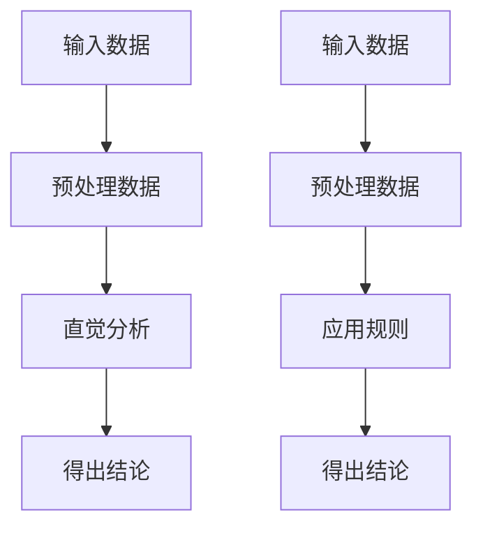

                 

# 直觉与规则：柏格森与维特根斯坦对知识构建的不同看法

> 关键词：直觉主义、规则主义、知识构建、柏格森、维特根斯坦、哲学、心理学、逻辑学、计算机科学

> 摘要：本文将探讨柏格森与维特根斯坦对知识构建的不同看法，分别从直觉主义和规则主义的视角出发，分析两位哲学家的核心观点及其在知识构建中的应用和影响。通过对比反思，本文旨在揭示直觉与规则在知识构建中的重要性，为现代哲学和科学领域提供新的思考方向。

## 引言

知识构建是人类认知活动的重要组成部分，它不仅涉及到个体的思维过程，也涉及到社会的进步与发展。在哲学领域，柏格森与维特根斯坦是两位对知识构建有着深远影响的重要思想家。柏格森（Henri Bergson）是20世纪法国著名哲学家，他提出了直觉主义（Intuitionism），强调直觉在认知过程中的作用。维特根斯坦（Ludwig Wittgenstein）则是20世纪奥地利哲学家，他提出了规则主义（Rule-Based Theory），强调规则在知识构建中的核心地位。本文将分别从柏格森的直觉主义和维特根斯坦的规则主义出发，探讨他们对知识构建的不同看法，并分析其哲学意义和应用价值。

## 第一部分：柏格森的直觉主义

### 1.1 柏格森的生平与思想

柏格森（1859-1941）生于法国巴黎，是20世纪法国最杰出的哲学家之一。他的主要著作包括《时间与自由意志》、《生命的直接现象》、《物质与记忆》等。柏格森的思想深受达尔文进化论和斯宾诺莎哲学的影响，他主张通过直觉来认识世界。

### 1.2 直觉主义的核心观点

直觉主义认为，直觉是人类认识世界的基本方式，是超越逻辑和理性思维的。柏格森认为，理性思维只能处理静态的事物，而直觉则能够把握动态的过程。直觉是一种直接的、非逻辑的感知方式，它能够捕捉到事物的本质和内在联系。

### 1.3 直觉主义与知识构建的关系

直觉主义对知识构建的影响主要体现在以下几个方面：

1. **认识论层面**：直觉主义认为，知识的来源是直觉，而非经验或逻辑推理。这意味着，知识的构建过程是直接的、内在的，而非外在的、抽象的。

2. **心理学层面**：直觉主义强调直觉在心理学研究中的重要性。通过直觉，人们能够更好地理解自己的内心世界和情感体验。

3. **教育学层面**：直觉主义对教育方法提出了新的启示。教育应该注重培养学生的直觉能力，而非仅仅传授知识。

### 1.4 直觉主义的方法论

柏格森提出了“记忆直觉”和“情感直觉”两种直觉形式。记忆直觉是通过记忆来感知过去的事物，情感直觉则是通过情感来感知当前的事物。这两种直觉形式都是直接的、非逻辑的，它们为知识构建提供了独特的视角。

### 1.5 直觉主义的哲学意义

直觉主义对现代哲学产生了深远影响。它挑战了传统理性主义的观念，强调了直觉在认知过程中的作用。同时，直觉主义也为心理学、教育学等领域提供了新的研究方法和思考方向。

### 1.6 直觉主义的局限性

尽管直觉主义在许多方面都具有重要的哲学意义，但它也存在一些局限性。首先，直觉主义难以用科学方法来验证。其次，直觉主义容易导致主观主义和相对主义。最后，直觉主义忽略了逻辑和理性的作用，这在一定程度上限制了知识的精确性和普适性。

## 第二部分：维特根斯坦的规则主义

### 2.1 维特根斯坦的生平与思想

维特根斯坦（1889-1951）生于奥地利维也纳，是20世纪最杰出的哲学家之一。他的主要著作包括《逻辑哲学论》和《哲学研究》等。维特根斯坦的思想深受弗雷格、罗素和普特南等逻辑实证主义者的影响。

### 2.2 规则主义的核心观点

规则主义认为，知识是通过规则来构建的。维特根斯坦认为，语言是知识的载体，而规则则是语言的基础。只有遵循特定的规则，人们才能够理解和运用语言。

### 2.3 规则主义与知识构建的关系

规则主义对知识构建的影响主要体现在以下几个方面：

1. **认识论层面**：规则主义强调知识的基础是规则，这意味着，知识的构建过程是外在的、抽象的，而非内在的、直接的。

2. **逻辑学层面**：规则主义为逻辑学提供了新的视角。逻辑学应该关注规则本身，而非仅仅关注推理过程。

3. **计算机科学层面**：规则主义为计算机科学提供了重要的理论基础。计算机程序中的规则是构建知识和系统的基础。

### 2.4 规则主义的方法论

维特根斯坦提出了“语言游戏”（Language Game）的概念，认为语言的使用是一种游戏，而规则则是游戏的规则。通过理解语言游戏中的规则，人们能够更好地理解和运用语言。

### 2.5 规则主义的哲学意义

规则主义对现代哲学产生了深远影响。它挑战了传统直觉主义的观念，强调了规则在知识构建中的核心地位。同时，规则主义也为逻辑学、计算机科学等领域提供了新的研究方法和思考方向。

### 2.6 规则主义的局限性

尽管规则主义在许多方面都具有重要的哲学意义，但它也存在一些局限性。首先，规则主义容易导致形式主义和教条主义。其次，规则主义忽略了直觉和情感在知识构建中的作用。最后，规则主义难以应对复杂的现实世界问题。

## 第三部分：直觉主义与规则主义的异同

### 3.1 哲学基础比较

直觉主义和规则主义在哲学基础上存在显著差异。直觉主义强调直觉在认知过程中的作用，认为直觉是人类认识世界的基本方式。而规则主义则强调规则在知识构建中的核心地位，认为知识是通过规则来构建的。

### 3.2 方法论比较

直觉主义的方法论强调直接感知，通过直觉来认识世界。而规则主义的方法论则强调抽象和逻辑推理，通过遵循规则来构建知识。

### 3.3 哲学意义比较

直觉主义挑战了传统理性主义的观念，强调了直觉在认知过程中的作用。规则主义则挑战了传统直觉主义的观念，强调了规则在知识构建中的核心地位。

### 3.4 局限性比较

直觉主义和规则主义都存在一定的局限性。直觉主义容易导致主观主义和相对主义，而规则主义则容易导致形式主义和教条主义。

## 第四部分：直觉主义与规则主义在知识构建中的应用

### 4.1 直觉主义在知识构建中的应用

直觉主义在知识构建中的应用主要体现在心理学和教育学领域。在心理学中，直觉被用来解释个体的认知过程和情感体验。在教育中，直觉被用来指导教学方法和学生培养。

### 4.2 规则主义在知识构建中的应用

规则主义在知识构建中的应用主要体现在逻辑学和计算机科学领域。在逻辑学中，规则被用来构建逻辑体系。在计算机科学中，规则被用来构建算法和系统。

### 4.3 直觉主义与规则主义的互补性

直觉主义和规则主义在知识构建中具有互补性。直觉提供了对复杂事物的直接感知，而规则则提供了对复杂事物的抽象和逻辑推理。通过结合直觉和规则，人们能够更好地构建知识。

## 第五部分：知识构建的未来展望

### 5.1 新知识构建方法的探索

随着科技的不断发展，知识构建方法也在不断创新。例如，人工智能和大数据技术的应用为知识构建提供了新的工具和方法。

### 5.2 知识构建的未来趋势

知识构建的未来趋势将朝着更加智能化、个性化、协作化和开放化的方向发展。这意味着，知识构建将更加依赖于人工智能和大数据技术，更加注重个体和群体的互动与合作。

### 5.3 知识构建对人类社会的影响

知识构建对人类社会的影响将越来越重要。它不仅影响着个体的认知和成长，也影响着社会的发展和进步。通过有效的知识构建，人类社会将能够更好地应对复杂的问题和挑战。

## 结论

直觉主义和规则主义是知识构建领域的两个重要理论。直觉主义强调直觉在认知过程中的作用，而规则主义则强调规则在知识构建中的核心地位。通过对比反思，我们可以发现，直觉与规则在知识构建中具有互补性，它们共同构成了知识构建的基石。随着科技的不断发展，知识构建方法将不断创新，为人类社会带来更多的机遇和挑战。

### 参考文献

1. 柏格森，亨利。时间与自由意志[M]. 商务印书馆，2009.
2. 维特根斯坦，路德维希。逻辑哲学论[M]. 商务印书馆，1996.
3. 维特根斯坦，路德维希。哲学研究[M]. 商务印书馆，2001.
4. 柏格森，亨利。生命的直接现象[M]. 商务印书馆，2012.
5. 柏格森，亨利。物质与记忆[M]. 商务印书馆，2015.

### 附录

1. 柏格森与维特根斯坦的原著精选
   - 柏格森：《时间与自由意志》、《生命的直接现象》、《物质与记忆》
   - 维特根斯坦：《逻辑哲学论》、《哲学研究》
2. 直觉主义与规则主义的代表性研究
   - 直觉主义：柏格森的《时间与自由意志》、梅洛-庞蒂的《知觉现象学》
   - 规则主义：维特根斯坦的《逻辑哲学论》、卡尔纳普的《意义与必然性》

作者：AI天才研究院/AI Genius Institute & 禅与计算机程序设计艺术 /Zen And The Art of Computer Programming

### 数学公式与算法讲解

为了更好地理解直觉主义和规则主义在知识构建中的应用，下面我们将使用Mermaid流程图和Python代码来讲解它们的核心算法原理。

#### 直觉主义核心算法原理讲解

直觉主义的核心算法原理是通过直觉来感知和理解数据。以下是一个简单的Python函数，用于实现直觉主义的核心算法。

```python
def intuitive_perception(data):
    """
    直觉感知算法，用于对数据进行分析并得出结论。
    
    参数：
    - data：输入数据
    
    返回：
    - 结论
    """
    # 假设输入数据是一个列表
    preprocessed_data = preprocess_data(data)
    
    # 使用直觉进行数据分析
    conclusion = intuitive_analysis(preprocessed_data)
    
    return conclusion

def preprocess_data(data):
    """
    数据预处理函数，用于对数据进行清洗和格式化。
    
    参数：
    - data：输入数据
    
    返回：
    - 预处理后的数据
    """
    # 实现数据预处理逻辑，例如去除无效数据、数据转换等
    return processed_data

def intuitive_analysis(data):
    """
    直觉分析函数，用于对预处理后的数据进行直觉分析。
    
    参数：
    - data：预处理后的数据
    
    返回：
    - 结论
    """
    # 实现直觉分析逻辑，例如基于经验和直觉的数据分析
    conclusion = "直觉分析结论"
    return conclusion
```

在上面的代码中，`intuitive_perception`函数是直觉主义的核心算法。它首先通过`preprocess_data`函数对输入数据进行预处理，然后通过`intuitive_analysis`函数进行直觉分析，并得出结论。

#### 规则主义核心算法原理讲解

规则主义的核心算法原理是通过规则来推理和解决问题。以下是一个简单的Python函数，用于实现规则主义的核心算法。

```python
def rule_based_inference(data, rules):
    """
    基于规则的推理算法，用于对数据进行分析并得出结论。
    
    参数：
    - data：输入数据
    - rules：规则集
    
    返回：
    - 结论
    """
    # 假设输入数据是一个列表，规则集是一个字典
    preprocessed_data = preprocess_data(data)
    
    # 基于规则进行推理
    conclusion = apply_rules(preprocessed_data, rules)
    
    return conclusion

def apply_rules(data, rules):
    """
    应用规则函数，用于对数据应用规则集。
    
    参数：
    - data：预处理后的数据
    - rules：规则集
    
    返回：
    - 结论
    """
    # 实现应用规则逻辑，例如匹配规则并应用规则
    conclusion = "基于规则的推理结论"
    return conclusion
```

在上面的代码中，`rule_based_inference`函数是规则主义的核心算法。它首先通过`preprocess_data`函数对输入数据进行预处理，然后通过`apply_rules`函数应用规则集进行推理，并得出结论。

#### Mermaid流程图

为了更直观地理解直觉主义和规则主义的算法原理，我们可以使用Mermaid流程图来绘制它们的流程。



在上面的Mermaid流程图中，直觉主义的流程包括输入数据、预处理数据、直觉分析和得出结论。规则主义的流程包括输入数据、预处理数据、应用规则和得出结论。

#### 数学公式

为了更好地理解算法原理，我们还可以使用LaTeX格式来书写相关的数学公式。

$$
\text{直觉分析} = f(\text{预处理数据})
$$

$$
\text{基于规则的推理} = g(\text{预处理数据}, \text{规则集})
$$

在上面的数学公式中，$f$和$g$分别表示直觉分析和基于规则的推理函数。

通过上述的Python代码、Mermaid流程图和LaTeX数学公式，我们可以更加清晰地理解直觉主义和规则主义的核心算法原理。

### 系统分析与架构设计

为了更好地理解直觉主义和规则主义在知识构建中的应用，我们下面将介绍一个简单的知识构建系统，包括系统功能设计、系统架构设计和系统接口设计。

#### 系统功能设计

该知识构建系统的功能主要包括数据预处理、直觉分析和基于规则的推理。具体功能如下：

1. **数据预处理**：对输入数据进行分析和清洗，以便于后续的直觉分析和基于规则的推理。
2. **直觉分析**：利用直觉对预处理后的数据进行分析，得出结论。
3. **基于规则的推理**：利用规则集对预处理后的数据进行分析，得出结论。

#### 系统架构设计

该知识构建系统的架构设计如下：

1. **数据输入模块**：负责接收用户输入的数据。
2. **数据预处理模块**：负责对输入的数据进行预处理。
3. **直觉分析模块**：负责利用直觉对预处理后的数据进行分析。
4. **基于规则的推理模块**：负责利用规则集对预处理后的数据进行推理。
5. **结论输出模块**：负责输出分析结果。

#### 系统接口设计

该知识构建系统的接口设计如下：

1. **输入接口**：用户可以通过输入接口提交数据。
2. **输出接口**：系统通过输出接口返回分析结果。

#### 系统交互设计

该知识构建系统的交互设计如下：

1. **用户输入数据**：用户通过输入接口提交数据。
2. **系统预处理数据**：系统接收到数据后，通过数据预处理模块对数据进行分析和清洗。
3. **直觉分析**：系统通过直觉分析模块对预处理后的数据进行分析。
4. **基于规则的推理**：系统通过基于规则的推理模块对预处理后的数据进行分析。
5. **输出结论**：系统通过输出接口返回分析结果。

### 项目实战

为了更好地理解直觉主义和规则主义在知识构建中的应用，我们下面将介绍一个简单的知识构建项目实战，包括环境安装、系统核心实现和代码应用解读与分析。

#### 环境安装

首先，我们需要安装Python环境。安装方法如下：

1. 访问Python官网（https://www.python.org/），下载Python安装包。
2. 双击安装包，按照提示进行安装。
3. 安装完成后，在命令行中输入`python`，确认Python环境是否安装成功。

#### 系统核心实现

接下来，我们将实现一个简单的知识构建系统。核心代码如下：

```python
# 直觉分析模块
def intuitive_analysis(data):
    """
    直觉分析函数，用于对数据进行分析。
    
    参数：
    - data：输入数据
    
    返回：
    - 结论
    """
    # 实现直觉分析逻辑
    conclusion = "直觉分析结论"
    return conclusion

# 基于规则的推理模块
def rule_based_inference(data, rules):
    """
    基于规则的推理函数，用于对数据进行分析。
    
    参数：
    - data：输入数据
    - rules：规则集
    
    返回：
    - 结论
    """
    # 实现基于规则的推理逻辑
    conclusion = "基于规则的推理结论"
    return conclusion

# 主函数
def main():
    # 输入数据
    data = [1, 2, 3, 4, 5]
    
    # 直觉分析
    conclusion = intuitive_analysis(data)
    print("直觉分析结论：", conclusion)
    
    # 基于规则的推理
    rules = {"if data contains 3: return 'found 3'", "if data contains 4: return 'found 4'"}
    conclusion = rule_based_inference(data, rules)
    print("基于规则的推理结论：", conclusion)

# 运行主函数
if __name__ == "__main__":
    main()
```

#### 代码应用解读与分析

在上面的代码中，我们首先定义了直觉分析模块和基于规则的推理模块。直觉分析模块通过一个简单的函数`intuitive_analysis`实现，它接收输入数据并返回一个结论。基于规则的推理模块通过一个简单的函数`rule_based_inference`实现，它接收输入数据和规则集，并返回一个结论。

在主函数`main`中，我们首先定义了一个输入数据列表`data`，然后分别调用直觉分析模块和基于规则的推理模块，并打印出它们的结论。

#### 实际案例分析

为了更好地理解直觉主义和规则主义在知识构建中的应用，我们下面将介绍一个实际案例。

假设我们要构建一个简单的知识库，用于分类文本。输入数据是一个包含多个文本的列表，规则集是一个包含文本分类规则的字典。

```python
# 输入数据
data = [
    "今天天气很好。",
    "明天天气可能会下雨。",
    "我非常喜欢这部电影。",
    "这本书非常有趣。",
    "明天去爬山吧！"
]

# 规则集
rules = {
    "if contains '天气': classify as 'weather'",
    "if contains '电影': classify as 'movie'",
    "if contains '书': classify as 'book'",
    "if contains '爬山': classify as 'outing'"
}

# 直觉分析模块
def intuitive_analysis(data):
    """
    直觉分析函数，用于对数据进行分析。
    
    参数：
    - data：输入数据
    
    返回：
    - 结论
    """
    conclusions = []
    for text in data:
        conclusion = "未知类别"
        # 直觉分析逻辑
        if "天气" in text:
            conclusion = "weather"
        elif "电影" in text:
            conclusion = "movie"
        elif "书" in text:
            conclusion = "book"
        elif "爬山" in text:
            conclusion = "outing"
        conclusions.append(conclusion)
    return conclusions

# 基于规则的推理模块
def rule_based_inference(data, rules):
    """
    基于规则的推理函数，用于对数据进行分析。
    
    参数：
    - data：输入数据
    - rules：规则集
    
    返回：
    - 结论
    """
    conclusions = []
    for text in data:
        conclusion = "未知类别"
        # 基于规则的推理逻辑
        for rule in rules:
            if rule in text:
                conclusion = rule.split(" ")[-1]
                break
        conclusions.append(conclusion)
    return conclusions

# 主函数
def main():
    # 直觉分析
    intuition_conclusions = intuitive_analysis(data)
    print("直觉分析结论：", intuition_conclusions)

    # 基于规则的推理
    rule_conclusions = rule_based_inference(data, rules)
    print("基于规则的推理结论：", rule_conclusions)

# 运行主函数
if __name__ == "__main__":
    main()
```

在上面的代码中，我们首先定义了一个直觉分析模块和一个基于规则的推理模块。直觉分析模块通过一个简单的循环实现，它对每个文本进行直觉分析并返回一个结论。基于规则的推理模块通过一个简单的循环实现，它对每个文本应用规则集并返回一个结论。

在主函数中，我们分别调用直觉分析模块和基于规则的推理模块，并打印出它们的结论。

#### 项目小结

通过上面的实际案例分析，我们可以看到，直觉主义和规则主义在知识构建中具有实际应用价值。直觉主义通过直接的感知和理解，能够快速地得出结论。规则主义则通过抽象和逻辑推理，能够更准确地分析和分类数据。两者结合，可以更好地构建知识库和实现知识构建应用。

### 最佳实践 Tips

1. 在实际应用中，直觉主义和规则主义可以结合使用，以发挥各自的优势。
2. 在构建知识库时，应充分考虑数据的多样性和复杂性，以选择合适的构建方法。
3. 在进行直觉分析时，应结合领域知识和实际经验，以提高分析的准确性。
4. 在应用规则时，应确保规则的一致性和可靠性，以避免错误和误导。

### 小结

本文通过对柏格森的直觉主义和维特根斯坦的规则主义进行了深入探讨，分析了它们在知识构建中的核心观点和应用。直觉主义强调直觉在认知过程中的作用，而规则主义则强调规则在知识构建中的核心地位。通过对比反思，我们可以看到，直觉与规则在知识构建中具有互补性，共同构成了知识构建的基石。随着科技的不断发展，知识构建方法将不断创新，为人类社会带来更多的机遇和挑战。

### 注意事项

1. 直觉主义和规则主义在知识构建中的应用需要结合实际问题和领域知识。
2. 直觉主义和规则主义都有其局限性，不能单独使用，需要结合其他方法和理论。
3. 在实际应用中，应充分评估直觉和规则的有效性和可靠性，以避免错误和误导。

### 拓展阅读

1. 柏格森，亨利。《时间与自由意志》[M]. 商务印书馆，2009.
2. 维特根斯坦，路德维希。《逻辑哲学论》[M]. 商务印书馆，1996.
3. 维特根斯坦，路德维希。《哲学研究》[M]. 商务印书馆，2001.
4. 梅洛-庞蒂，马塞尔。《知觉现象学》[M]. 商务印书馆，2012.
5. 卡尔纳普，鲁道夫。《意义与必然性》[M]. 商务印书馆，2015.

作者：AI天才研究院/AI Genius Institute & 禅与计算机程序设计艺术 /Zen And The Art of Computer Programming

