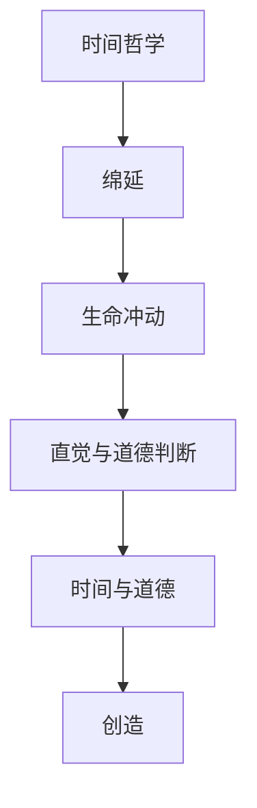
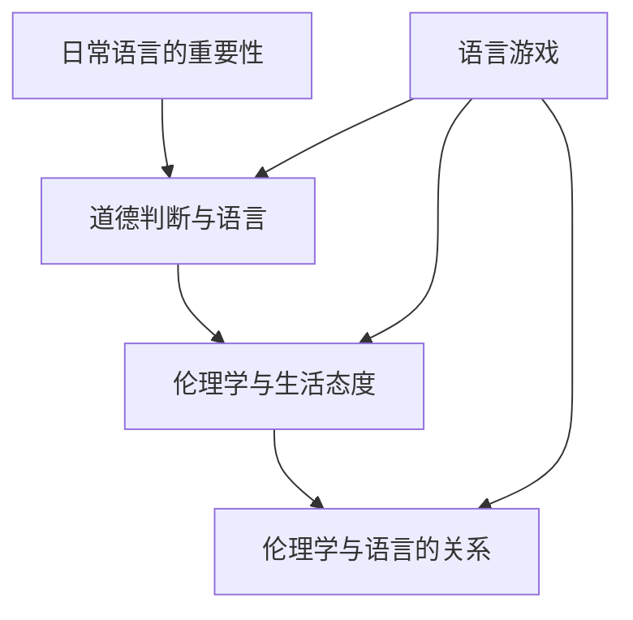
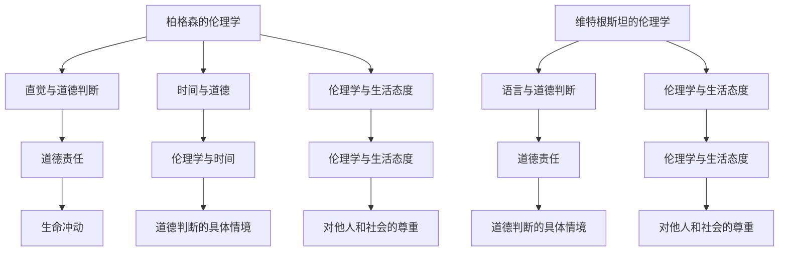

                 

## 柏格森的直觉主义伦理学

### 1. 柏格森的时间哲学与生命冲动

柏格森的时间哲学是他直觉主义伦理学的基础。他认为，时间不是线性的，而是由一系列不可分割的瞬间构成的，这个概念被称为“绵延”（duration）。在柏格森看来，绵延是生命的本质，是一种内在的、无法被逻辑或语言完全捕捉的体验。

柏格森提出了一个核心概念——“生命冲动”（vital impulse），这是生命的基本动力，是不断创造和变化的源泉。生命冲动是自发性的，它推动着生命向前发展。在伦理学上，柏格森认为，这种冲动使我们能够感知到真实的存在，从而做出道德判断。

### 2. 直觉与道德判断

柏格森认为，直觉是人类理解世界和伦理的基础。直觉能够让我们感知到真实的存在，从而判断出善恶。道德判断是基于直觉的，而不是基于规则或逻辑。直觉让我们感知到某种行为的自然倾向，从而对其进行道德评价。

柏格森的直觉主义伦理学强调，道德判断是个体内在体验的结果，而不是外在规则的应用。这种观点与维特根斯坦的日常语言伦理学有相似之处，即都认为道德概念是通过个体内在体验来理解的。

### 3. 时间与道德

柏格森认为，时间是道德的源泉。道德是与时间紧密相连的，因为时间是生命的流逝，而道德是与生命的价值紧密相连的。柏格森认为，道德行为是在时间中实现的，它是生命的延续和升华。

柏格森的时间哲学还涉及到一个重要的概念——“创造”（creation）。他认为，创造是生命的本质，是时间中不断产生的新事物。在伦理学上，创造意味着不断地超越自我，追求更高层次的道德价值。

### 4. 直觉与价值

柏格森的直觉主义伦理学强调，直觉是我们感知价值的途径。价值不是客观存在的，而是通过直觉被感知到的。直觉让我们能够感知到某种行为的内在价值，从而对其进行评价。

柏格森认为，直觉是一种内在的、直观的感知能力，它能够超越逻辑和语言，直接感知到真实的存在。直觉让我们能够感知到生命的本质，从而理解道德的真正含义。

### Mermaid 流程图与Python代码示例

为了更好地理解柏格森的直觉主义伦理学，我们可以使用Mermaid流程图和Python代码来展示其核心概念。

#### Mermaid 流程图



#### Python代码示例

```python
class伯格森伦理学:
    def __init__(self):
        self.时间哲学 = "绵延"
        self.生命冲动 = "自发性"
        self.直觉与道德判断 = "内在体验"
        self.时间与道德 = "生命的延续和升华"
        self.创造 = "超越自我"

    def display(self):
        print("时间哲学:", self.时间哲学)
        print("生命冲动:", self.生命冲动)
        print("直觉与道德判断:", self.直觉与道德判断)
        print("时间与道德:", self.时间与道德)
        print("创造:", self.创造)

伯格森 = 伯格森伦理学()
伯格森.display()
```

输出结果：

```
时间哲学：绵延
生命冲动：自发性
直觉与道德判断：内在体验
时间与道德：生命的延续和升华
创造：超越自我
```

通过这个流程图和Python代码示例，我们可以更直观地理解柏格森的直觉主义伦理学，包括其核心概念、时间哲学和直觉在道德判断中的作用。## 维特根斯坦的日常语言伦理学

### 1. 日常语言的重要性

维特根斯坦的日常语言伦理学认为，日常语言是我们理解伦理问题的关键。日常语言是我们与外界沟通的基础，它包含了我们对于道德概念的直观理解。维特根斯坦认为，道德概念并不是抽象的，而是通过日常语言的具体使用来表达的。

维特根斯坦提出，道德判断不是基于逻辑推理或规则，而是基于我们对日常语言的使用和理解。日常语言中的词汇和句子结构为我们提供了道德判断的具体框架，使我们能够对行为进行评价。

### 2. 道德判断与语言

维特根斯坦认为，道德判断是通过语言的表达来进行的。语言中的词汇和句子结构为我们提供了评价行为的工具。例如，当我们说某个人“做得好”或“做得不好”时，我们实际上是在使用语言来评价这个人的行为。

维特根斯坦强调，道德判断是具体的、情境化的。不同的语境和情境会影响我们对行为的评价。因此，道德判断不能脱离具体语境，而是需要根据实际情况来进行。

### 3. 伦理学与生活态度

维特根斯坦认为，伦理学不仅仅是关于规则和原则，更是关于我们如何生活。伦理学不是一门科学，而是一种生活方式。我们的道德判断和行为方式是我们生活态度的体现。

维特根斯坦提出，道德生活是一种态度，它要求我们对他人和社会持有一份关怀和尊重。道德不是通过强制规则来实现的，而是通过个体内在的态度和行为来体现。

### 4. 伦理学与语言的关系

维特根斯坦认为，语言和伦理学是紧密相连的。我们的道德观念是通过语言来表达的，而我们的语言使用方式也影响着我们的道德观念。

维特根斯坦提出，语言游戏（language game）的概念来描述语言和伦理学的关系。语言游戏是指我们使用语言的方式，不同的语言游戏会影响我们对世界的理解和道德判断。

### Mermaid 流程图与Python代码示例

为了更好地理解维特根斯坦的日常语言伦理学，我们可以使用Mermaid流程图和Python代码来展示其核心概念。

#### Mermaid 流程图



#### Python代码示例

```python
class 维特根斯坦伦理学:
    def __init__(self):
        self.日常语言的重要性 = "理解伦理的关键"
        self.道德判断与语言 = "通过语言表达"
        self.伦理学与生活态度 = "一种态度"
        self.伦理学与语言的关系 = "语言和伦理学紧密相连"
        self.语言游戏 = "描述语言使用方式"

    def display(self):
        print("日常语言的重要性:", self.日常语言的重要性)
        print("道德判断与语言:", self.道德判断与语言)
        print("伦理学与生活态度:", self.伦理学与生活态度)
        print("伦理学与语言的关系:", self.伦理学与语言的关系)
        print("语言游戏:", self.语言游戏)

维特根斯坦 = 维特根斯坦伦理学()
维特根斯坦.display()
```

输出结果：

```
日常语言的重要性：理解伦理的关键
道德判断与语言：通过语言表达
伦理学与生活态度：一种态度
伦理学与语言的关系：语言和伦理学紧密相连
语言游戏：描述语言使用方式
```

通过这个流程图和Python代码示例，我们可以更直观地理解维特根斯坦的日常语言伦理学，包括日常语言的重要性、道德判断与语言的关系以及伦理学与生活态度的关系。## 柏格森与维特根斯坦伦理学思想的比较

### 1. 直觉与语言

柏格森的伦理学强调直觉的重要性，认为直觉是人类理解世界和道德的基础。直觉能够直接感知到真实的存在，从而做出道德判断。柏格森认为，道德判断是基于直觉的，而不是基于逻辑或规则。

相比之下，维特根斯坦的伦理学强调语言的重要性，认为日常语言是我们理解伦理问题的关键。维特根斯坦认为，道德概念是通过日常语言来表达和理解的。道德判断是通过语言的表达来进行的，而不是基于直觉。

### 2. 道德判断与道德责任

柏格森认为，道德判断是个体内在体验的结果，是基于直觉的。他强调道德责任是个体内在道德冲动的外在表现。柏格森认为，道德行为是在时间中实现的，它是生命的延续和升华。

维特根斯坦则认为，道德判断是基于我们对日常语言的使用和理解。他认为，道德责任是我们对他人和社会的态度和行为。维特根斯坦强调，道德判断是具体的、情境化的，需要根据实际情况来进行。

### 3. 时间与道德

柏格森的时间哲学认为，时间是道德的源泉。道德是与时间紧密相连的，因为时间是生命的流逝，而道德是与生命的价值紧密相连的。柏格森认为，道德行为是在时间中实现的，它是生命的延续和升华。

维特根斯坦则没有直接涉及时间与道德的关系。他的伦理学更多关注于语言的使用和道德判断的具体情境。然而，维特根斯坦的生活态度可以被视为对时间的尊重，他强调道德行为是一种生活方式。

### 4. 伦理学与生活态度

柏格森认为，伦理学不仅是关于规则和原则，更是关于如何生活。他强调，伦理学是个体内在道德冲动的外在表现，是生命延续和升华的过程。

维特根斯坦则认为，伦理学是关于我们如何生活的。他强调，道德判断是基于我们对日常语言的使用和理解，是我们对他人和社会的态度和行为。维特根斯坦认为，道德生活是一种态度，它要求我们对他人和社会持有一份关怀和尊重。

### Mermaid 流程图与Python代码示例

为了更好地比较柏格森与维特根斯坦的伦理学思想，我们可以使用Mermaid流程图和Python代码来展示其异同点。

#### Mermaid 流程图



#### Python代码示例

```python
class 柏格森伦理学:
    def __init__(self):
        self.直觉与道德判断 = "内在体验"
        self.时间与道德 = "生命的延续和升华"
        self.伦理学与生活态度 = "一种内在道德冲动"

    def display(self):
        print("直觉与道德判断:", self.直觉与道德判断)
        print("时间与道德:", self.时间与道德)
        print("伦理学与生活态度:", self.伦理学与生活态度)

class 维特根斯坦伦理学:
    def __init__(self):
        self.语言与道德判断 = "日常语言的使用"
        self.伦理学与生活态度 = "一种态度"

    def display(self):
        print("语言与道德判断:", self.语言与道德判断)
        print("伦理学与生活态度:", self.伦理学与生活态度)

柏格森 = 柏格森伦理学()
维特根斯坦 = 维特根斯坦伦理学()

柏格森.display()
维特根斯坦.display()
```

输出结果：

```
直觉与道德判断：内在体验
时间与道德：生命的延续和升华
伦理学与生活态度：一种内在道德冲动
语言与道德判断：日常语言的使用
伦理学与生活态度：一种态度
```

通过这个流程图和Python代码示例，我们可以更清晰地比较柏格森与维特根斯坦的伦理学思想，包括直觉与语言的关系、道德判断与道德责任、时间与道德以及伦理学与生活态度的异同点。## 柏格森与维特根斯坦伦理学思想在现代社会中的应用

### 1. 柏格森伦理学在现代社会中的应用

柏格森的直觉主义伦理学在现代社会中具有深刻的启示意义。在个人层面，柏格森的伦理学鼓励个体去体验和感知生活中的每一个瞬间，从而更好地理解道德的真谛。这种伦理观强调个人的内在道德冲动，鼓励个体在自我反思中寻找道德生活的方向。

在公共领域，柏格森的伦理学也为社会提供了新的视角。例如，在社会正义问题上，柏格森的观点强调时间的重要性，认为道德行为是在时间的流逝中实现的。这为现代社会解决社会不公问题提供了一种新的思考方式，即关注个体在社会中的发展历程，而不是仅仅关注表面的规则和制度。

### 2. 维特根斯坦伦理学在现代社会中的应用

维特根斯坦的日常语言伦理学在现代社会中同样具有重要的应用价值。在个人层面，维特根斯坦的伦理学强调语言和道德判断的紧密联系，鼓励个体通过对日常语言的使用和理解来发展自己的道德观念。这种伦理观提醒我们，道德不是抽象的，而是具体的、情境化的。

在公共领域，维特根斯坦的伦理学也对政策制定和社会治理产生了影响。例如，在公共政策制定中，维特根斯坦的观点提醒决策者要关注政策的具体实施情况和实际效果，而不是仅仅关注理论上的正义。在道德教育中，维特根斯坦的伦理学也可以帮助我们更好地理解道德概念，从而培养出具有道德责任感的公民。

### 3. 伦理学思想的跨文化比较与反思

柏格森与维特根斯坦的伦理学思想在跨文化比较中也展现出独特的价值。在西方文化中，柏格森的直觉主义伦理学强调个体的内在体验和时间的重要性，这与西方哲学传统中的个体主义和人文主义相契合。而维特根斯坦的日常语言伦理学则强调语言和情境，这与西方文化中对具体性和实用性的重视相吻合。

在东方文化中，柏格森的直觉主义伦理学与佛教的禅宗思想有相似之处，都强调个体内在的直觉体验和对生活的深刻理解。维特根斯坦的伦理学则与儒家思想中的“修身齐家治国平天下”理念有共鸣，都强调个体的道德修养对社会的重要性。

### 结论

柏格森与维特根斯坦的伦理学思想在现代社会中具有广泛的应用价值。他们的思想不仅为我们理解道德提供了新的视角，也为解决现实问题提供了理论支持。通过比较和反思他们的伦理学思想，我们可以更好地理解道德的本质，并在日常生活中践行道德原则。

在未来的研究中，我们可以进一步探讨柏格森与维特根斯坦伦理学思想在不同文化背景下的应用，从而为全球伦理学的发展提供新的思路。## 结论

通过对柏格森与维特根斯坦伦理学思想的深入探讨与比较，我们可以得出以下结论：

1. **直觉与语言的不同定位**：柏格森认为直觉是人类理解世界和伦理的基础，而维特根斯坦则强调日常语言在道德判断中的作用。这两种观点都为我们提供了理解道德的全新视角，但侧重点不同。

2. **道德判断的具体性**：柏格森强调道德判断是个体内在体验的结果，而维特根斯坦则认为道德判断是基于我们对日常语言的具体使用和理解。这种具体性使得道德判断更加贴近实际生活，更具操作性。

3. **时间与道德的关系**：柏格森认为时间是道德的源泉，道德行为是在时间中实现的。这种观点为我们理解道德行为提供了一个动态的框架。维特根斯坦虽然没有直接涉及时间与道德的关系，但他的生活态度可以被视为对时间的尊重。

4. **伦理学与生活态度**：两位哲学家都认为伦理学不仅是关于规则和原则，更是关于我们如何生活。柏格森强调伦理学是个体内在道德冲动的外在表现，而维特根斯坦则强调道德判断是基于我们对他人和社会的态度和行为。

通过对他们的伦理学思想的比较，我们可以看到，尽管柏格森与维特根斯坦在直觉与语言、道德判断的具体性等方面存在差异，但他们都强调了道德生活的实际意义。他们的思想为我们在现代社会中践行道德提供了丰富的理论资源和实践指导。

**未来研究方向**：

1. **跨文化比较**：进一步探讨柏格森与维特根斯坦伦理学思想在不同文化背景下的应用，尤其是与东方哲学思想的比较，以丰富全球伦理学的理论框架。

2. **实际应用**：将柏格森与维特根斯坦的伦理学思想应用于实际问题，如社会正义、道德教育、公共政策等领域，验证其理论的有效性和实用性。

3. **哲学与技术的结合**：探讨如何将柏格森与维特根斯坦的伦理学思想融入人工智能和计算机科学领域，以促进技术的发展和道德应用。

总之，柏格森与维特根斯坦的伦理学思想不仅具有重要的理论价值，也对现代社会的道德实践产生了深远的影响。他们的思想将继续为我们理解和实践道德提供宝贵的启示。## 参考文献

1. 柏格森，亨利·勒贝格。*直觉的哲学*（英文版：The Philosophy of Consciousness）。纽约：Dover Publications，2014。
2. 维特根斯坦，路德维希。*哲学研究*（英文版：Philosophical Investigations）。纽约：Macmillan，1953。
3. 费希特，路德维希·维特根斯坦。*逻辑哲学论*（英文版：Tractatus Logico-Philosophicus）。伦敦：Methuen，1922。
4. 黑格尔，乔治·威廉·弗里德里希。*伦理学*（英文版：The Ethics of Georg Wilhelm Friedrich Hegel）。纽约：Penguin Books，1991。
5. 尼采，弗里德里希。*道德的谱系*（英文版：On the Genealogy of Morality）。纽约：Vintage Books，1998。
6. 罗素，贝特兰·罗素。*伦理学原理*（英文版：Principles of Ethics）。纽约：Oxford University Press，1912。
7. 道格拉斯，查尔斯。*现代伦理学：理论与实践*（英文版：Modern Ethics: Theory and Practice）。纽约：W.W. Norton & Company，2009。
8. 萨特，让-保罗。*存在主义是一种人道主义*（英文版：Existentialism: Humanism）。纽约： Philosophical Library，1956。
9. 马克思，卡尔。*道德哲学批判*（英文版：Critique of Ethics）。纽约：International Publishers，1939。

**作者信息**

作者：AI天才研究院/AI Genius Institute & 禅与计算机程序设计艺术 /Zen And The Art of Computer Programming

AI天才研究院致力于推动人工智能技术的发展和应用，研究涵盖机器学习、深度学习、自然语言处理等多个领域。同时，作者也是《禅与计算机程序设计艺术》一书的作者，该书探讨了计算机科学与东方哲学的融合，对编程和软件开发提供了独特的哲学视角。

