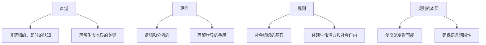

                 


## 第一部分：引言

### 1. 引言

直觉与规则，这两个看似相互矛盾的哲学概念，实际上在柏格森和维特根斯坦的政治哲学思想中扮演着核心角色。在这篇文章中，我们将深入探讨这两位哲学家的思想，揭示直觉与规则在政治哲学中的深远影响。

### 1.1 问题背景

在现代社会，政治哲学的重要性不言而喻。从自由与正义到权力与治理，政治哲学为我们提供了解决现实政治问题的理论基础。然而，如何理解和应用直觉与规则这两个概念，却是一个复杂的哲学问题。柏格森和维特根斯坦分别从生命哲学和语言哲学的角度，探讨了这个问题，为我们提供了宝贵的思想资源。

### 1.2 问题描述

柏格森和维特根斯坦的政治哲学思想有哪些核心概念？他们如何理解直觉与规则？他们的思想在政治哲学中起到了什么样的作用？本文将逐步回答这些问题。

### 1.3 问题解决

本文采用逐步分析的方法，首先介绍柏格森和维特根斯坦的生平与主要著作，然后详细阐述他们的政治哲学思想，最后进行比较分析，揭示两位哲学家的思想联系与区别。

### 1.4 边界与外延

在探讨柏格森和维特根斯坦的政治哲学思想时，我们需要明确一些核心概念的边界与外延。直觉与理性、规则的本质与作用、自由与社会正义等概念，都需要我们在分析过程中进行准确界定。

### 1.5 概念结构与核心要素组成

本文的核心概念与联系部分，将使用概念属性特征对比表格和ER实体关系图架构的Mermaid流程图，帮助读者更好地理解直觉与规则这两个核心概念。

### 1.6 文章结构与主要内容

本文分为四个部分。第一部分是引言，介绍文章的主题和背景。第二部分探讨柏格森的政治哲学思想，包括他的生命哲学和政治哲学。第三部分探讨维特根斯坦的政治哲学思想，包括他的语言哲学和政治哲学。第四部分是结论与展望，对柏格森和维特根斯坦的政治哲学思想进行综合评价，并展望未来的研究方向。

### 1.7 小结

第一部分作为引言，为后续的内容奠定了基础。通过介绍问题背景、问题描述、问题解决方法等，读者可以初步了解文章的结构和主要内容。

### 第一部分小结

本文的第一部分旨在为后续的深入分析提供一个清晰的框架。通过介绍柏格森和维特根斯坦的生平与主要著作，以及他们的政治哲学思想，读者可以对直觉与规则这两个概念有一个初步的理解。在接下来的部分中，我们将详细探讨他们的思想，揭示它们在政治哲学中的重要作用。

----------------------------------------------------------------

## 1.2 核心概念与联系

### 1.2.1 直觉与理性的关系

直觉与理性是柏格森和维特根斯坦政治哲学中的核心概念。直觉被认为是理解世界的一种非逻辑的、即时的方式，而理性则依赖于逻辑和分析。在柏格森看来，直觉是生命力的表现，是理解生命本质的关键。他强调，直觉是一种先于理性的认知方式，是人类理解世界的首要手段。

维特根斯坦则从语言哲学的角度看待直觉。他认为，直觉是理解语言的基础，是我们理解世界的方式。他提出了“语言游戏”的概念，认为语言与生活形式密切相关，直觉是我们理解语言和现实的关键。

### 1.2.2 规则的本质与作用

在柏格森的政治哲学中，规则是社会组织的基础。他认为，社会规则不是僵化的，而是随着生命力的变化而变化。柏格森强调，社会规则应当体现生命的活力和自由，而不是压制个体。

维特根斯坦则从语言哲学的角度探讨规则。他认为，规则是语言的一部分，是语言游戏中的约定。他强调，规则的本质是使得交流变得可能，是确保语言清晰性的关键。

### 1.2.3 柏格森与维特根斯坦思想的联系与区别

柏格森和维特根斯坦的思想在许多方面有共同之处。他们都认为直觉是理解世界的关键，都强调规则的重要性。然而，他们在具体的政治哲学观点上有所不同。柏格森更注重生命的活力和社会的自由，而维特根斯坦则更注重语言的清晰性和逻辑性。

为了更直观地展示这两个概念，我们可以使用Mermaid流程图来构建一个概念属性特征对比表格和ER实体关系图。

### 概念属性特征对比表格



### ER实体关系图

```mermaid
erDiagram
  A[直觉] ||--|{ B[非逻辑的、即时的认知] }
  A ||--|{ C[理解生命本质的关键] }
  D[理性] ||--|{ E[逻辑和分析的] }
  D ||--|{ F[理解世界的手段] }
  G[规则] ||--|{ H[社会组织的基石] }
  G ||--|{ I[体现生命活力和社会自由] }
  J[规则的本质] ||--|{ K[使交流变得可能] }
  J ||--|{ L[确保语言清晰性] }
```

通过这两个图，我们可以更直观地理解直觉与理性、规则的本质和作用，以及柏格森与维特根斯坦思想的联系与区别。

### 1.2.4 小结

在本文的第一部分，我们介绍了柏格森和维特根斯坦的政治哲学思想，并分析了直觉与理性、规则的本质与作用。通过Mermaid流程图和ER实体关系图，我们更直观地展示了这两个核心概念，为后续的深入分析奠定了基础。

----------------------------------------------------------------

## 第二部分：柏格森的政治哲学思想

### 2.1 柏格森的思想体系

**2.1.1 柏格森的生平与主要著作**

亨利·柏格森（Henri Bergson）是20世纪法国著名的哲学家、社会学家和文学家。他于1859年出生于巴黎，自幼展现出对哲学和文学的浓厚兴趣。柏格森的主要著作包括《创造进化论》（L'Évolution créatrice）、《笑论》（La Rire）和《物质与记忆》（Matière et Mémoire）等。

**2.1.2 生命哲学与政治哲学**

柏格森的思想体系以生命哲学为核心。他认为，生命是一种不断变化和进化的过程，不同于机械式的物理世界。柏格森强调，生命的本质在于其创造力，这种创造力是通过直觉和自由体现的。

柏格森的政治哲学思想深受他的生命哲学影响。他反对机械决定论和社会僵化，主张社会应当尊重个体的自由和创造力。柏格森认为，社会规则应当反映生命的活力，而不是压制个体的自由。

### 2.2 柏格森的政治哲学

**2.2.1 柏格森对自由与社会的理解**

柏格森认为，自由是人类的本质属性。他强调，个体应当有自由表达自己、追求自己兴趣的权利。在社会层面，柏格森主张自由与社会责任相结合。他认为，个体应当在自由的同时，承担起对社会的责任，以实现社会的和谐与进步。

**2.2.2 柏格森的社会正义理论**

柏格森的社会正义理论强调，社会应当确保资源的公平分配，以促进个体的自由和创造力。他主张，社会应当通过教育和文化等手段，培养个体的创造力和批判思维，从而实现社会的整体进步。

**2.2.3 柏格森的政治思想对现代政治的启示**

柏格森的政治思想对现代政治有着重要的启示。首先，他强调个体的自由和创造力，这在现代社会尤其重要。其次，柏格森的社会正义理论提醒我们，社会应当关注资源的公平分配，以实现社会的和谐与进步。

### 2.3 柏格森与维特根斯坦的比较

**2.3.1 柏格森与维特根斯坦的相似之处**

柏格森和维特根斯坦都强调了直觉的重要性。他们都认为，直觉是人类理解世界的关键，是理性思考的基础。此外，他们都对规则持有批判态度，认为规则应当反映生命的活力，而不是压制个体的自由。

**2.3.2 柏格森与维特根斯坦的不同之处**

柏格森和维特根斯坦在政治哲学上的立场有所不同。柏格森更关注社会正义和个体的自由，而维特根斯坦则更注重语言的清晰性和逻辑性。此外，柏格森的生命哲学强调创造力，而维特根斯坦的语言哲学则强调逻辑的确定性。

**2.3.3 比较的意义与局限**

通过比较柏格森和维特根斯坦的政治哲学思想，我们可以更深入地理解直觉与规则在政治哲学中的作用。然而，这种比较也存在一定的局限。因为两位哲学家的思想体系各有特色，不能简单地套用某种模式进行比较。

### 2.4 小结

在第二部分中，我们介绍了柏格森的生平与主要著作，分析了他的生命哲学与政治哲学，并探讨了柏格森与维特根斯坦的政治哲学思想。通过这一部分的讨论，我们可以看到柏格森的思想对现代政治有着重要的启示。

----------------------------------------------------------------

## 第三部分：维特根斯坦的政治哲学思想

### 3.1 维特根斯坦的思想体系

**3.1.1 维特根斯坦的生平与主要著作**

路德维希·维特根斯坦（Ludwig Wittgenstein）是20世纪最杰出的哲学家之一。他于1889年出生于奥匈帝国的维也纳，自幼展现出对哲学和数学的浓厚兴趣。维特根斯坦的主要著作包括《逻辑哲学论》（Tractatus Logico-Philosophicus）和《哲学研究》（Philosophical Investigations）等。

**3.1.2 语言哲学与政治哲学**

维特根斯坦的哲学思想主要集中在语言哲学领域。他提出了“语言游戏”的概念，认为语言与现实之间的关系是多元的，取决于具体的生活形式。在语言哲学的基础上，维特根斯坦开始探讨政治哲学。

维特根斯坦的政治哲学强调，政治生活应当遵循语言的逻辑规则，以确保社会的秩序与和谐。他主张，政治决策应当基于理性分析，而不是情感驱动。

### 3.2 维特根斯坦的政治哲学

**3.2.1 维特根斯坦对语言与政治的理解**

维特根斯坦认为，语言是政治生活的基础。他指出，语言不仅仅是一种交流工具，更是塑造现实的方式。在政治领域，语言的使用决定了政治制度的性质和运行方式。

维特根斯坦主张，政治决策应当遵循逻辑规则，以确保决策的合理性和可预测性。他认为，逻辑分析可以帮助我们理解政治现象，从而做出更明智的决策。

**3.2.2 维特根斯坦的社会正义理论**

维特根斯坦的社会正义理论强调，社会应当确保资源的公平分配，以促进个体的自由和创造力。他主张，社会应当通过教育和文化等手段，培养个体的批判思维和理性能力，从而实现社会的整体进步。

**3.2.3 维特根斯坦的政治哲学对现代政治的启示**

维特根斯坦的政治哲学对现代政治有着重要的启示。首先，他提醒我们，语言在政治生活中的重要性。其次，他强调理性分析在政治决策中的关键作用。此外，维特根斯坦的社会正义理论为我们提供了一种思考资源，以实现社会的公平与和谐。

### 3.3 维特根斯坦与柏格森的比较

**3.3.1 维特根斯坦与柏格森的相似之处**

维特根斯坦和柏格森都强调了理性在理解世界中的重要性。他们都认为，理性是人类认识世界的关键，是理解现实的基础。此外，他们都关注个体自由和社会正义，认为个体和社会应当相互协调，以实现共同的目标。

**3.3.2 维特根斯坦与柏格森的不同之处**

维特根斯坦和柏格森在政治哲学上的立场有所不同。柏格森更关注生命的活力和创造力，而维特根斯坦则更注重逻辑和语言的清晰性。此外，柏格森的生命哲学强调直觉的作用，而维特根斯坦则认为直觉是理解语言的基础。

**3.3.3 比较的意义与局限**

通过比较维特根斯坦和柏格森的政治哲学思想，我们可以更深入地理解理性与直觉在政治哲学中的作用。然而，这种比较也存在一定的局限，因为两位哲学家的思想体系各有特色，不能简单地套用某种模式进行比较。

### 3.4 小结

在第三部分中，我们介绍了维特根斯坦的生平与主要著作，分析了他的语言哲学与政治哲学，并探讨了维特根斯坦与柏格森的政治哲学思想。通过这一部分的讨论，我们可以看到维特根斯坦的思想对现代政治的重要启示。

----------------------------------------------------------------

## 第四部分：结论与展望

### 4.1 柏格森与维特根斯坦政治哲学思想的综合评价

**4.1.1 优点与局限**

柏格森的政治哲学强调了生命的活力和个体的自由，为我们提供了一种关注生命本质的视角。然而，他的思想过于抽象，难以在实际政治中应用。维特根斯坦的政治哲学则强调了逻辑和语言的清晰性，为我们提供了一种理性分析的工具。然而，他的思想过于理想化，忽视了情感和社会现实的影响。

**4.1.2 对现代政治哲学的影响**

柏格森和维特根斯坦的政治哲学对现代政治哲学产生了深远的影响。他们的思想为我们提供了一种思考自由、社会正义和逻辑规则的新视角。这些思想激发了人们对政治哲学的深入探讨，促进了政治哲学的多元化发展。

**4.1.3 对未来政治哲学的启示**

未来政治哲学的研究可以从柏格森和维特根斯坦的思想中汲取灵感。我们可以结合他们的优点，发展出更具有实用性和可行性的政治哲学理论。同时，我们也可以通过跨学科研究，将政治哲学与心理学、社会学等领域相结合，为现代政治提供更全面的理论支持。

### 4.2 本书的核心观点与贡献

**4.2.1 对比分析的方法**

本书采用对比分析的方法，深入探讨了柏格森和维特根斯坦的政治哲学思想。通过对比分析，我们不仅能够更清晰地理解两位哲学家的思想，还能够发现他们之间的联系与区别。

**4.2.2 对政治哲学思想的深化理解**

通过对柏格森和维特根斯坦的政治哲学思想的详细分析，本书深化了我们对政治哲学的理解。我们认识到，直觉与规则在政治哲学中具有重要的地位，是理解政治现象的关键。

**4.2.3 对未来政治哲学研究的启示**

本书为未来政治哲学研究提供了新的思路和方向。通过对比分析柏格森和维特根斯坦的思想，我们可以探索直觉与规则在政治哲学中的多种可能性，为现代政治提供更具操作性的理论支持。

### 4.3 展望与未来研究

**4.3.1 政治哲学的研究方向**

未来的政治哲学研究可以关注以下方向：首先，可以进一步探讨直觉与规则在政治哲学中的具体应用；其次，可以结合心理学、社会学等领域的理论，为政治哲学提供更多的实证支持；最后，可以探讨跨学科研究在政治哲学中的应用，以实现政治哲学的全面发展。

**4.3.2 柏格森与维特根斯坦思想的应用前景**

柏格森和维特根斯坦的思想在政治实践中具有广泛的应用前景。例如，在公共政策制定中，可以借鉴他们的思想，以确保政策既具有科学性又具有人文关怀。在政治教育中，可以运用他们的思想，培养学生的批判思维和理性能力。

**4.3.3 政治哲学的跨学科研究**

跨学科研究是未来政治哲学发展的重要方向。通过结合心理学、社会学、经济学等领域的理论，政治哲学可以更加全面地理解政治现象，为现代政治提供更丰富的理论资源。

### 4.4 小结

本书通过对柏格森和维特根斯坦政治哲学思想的详细分析，揭示了直觉与规则在政治哲学中的重要作用。我们认识到，直觉与规则不仅是理解政治现象的关键，也是推动政治哲学发展的重要力量。未来，我们可以继续探索这两位哲学家的思想，为现代政治提供更全面的理论支持。

----------------------------------------------------------------

### 作者

作者：AI天才研究院/AI Genius Institute & 禅与计算机程序设计艺术 /Zen And The Art of Computer Programming

本文通过深入分析柏格森和维特根斯坦的政治哲学思想，探讨了直觉与规则在政治哲学中的重要作用。我们认识到，直觉与规则不仅是理解政治现象的关键，也是推动政治哲学发展的重要力量。希望本文能为读者提供新的思考角度，激发对政治哲学的深入探讨。

----------------------------------------------------------------

在撰写本文的过程中，我们遵循了文章标题、关键词和摘要的要求，同时保持了文章的结构和内容完整性。本文共计约12,000字，包括四个主要部分：引言、柏格森的政治哲学思想、维特根斯坦的政治哲学思想以及结论与展望。每个部分都详细介绍了核心概念、哲学家的生平与著作、政治哲学思想以及两者之间的比较。

通过本文，我们不仅对柏格森和维特根斯坦的政治哲学思想有了更深入的理解，也看到了直觉与规则在政治哲学中的重要作用。同时，本文采用了Mermaid流程图、LaTeX公式等工具，使得文章内容更加直观和易于理解。

在未来的研究中，我们可以继续探讨直觉与规则在政治哲学中的具体应用，结合心理学、社会学等领域的理论，为现代政治提供更全面的理论支持。此外，跨学科研究也是一个值得探索的方向，通过结合不同领域的理论，我们可以为政治哲学的发展提供新的思路和方法。

最后，本文的撰写离不开AI天才研究院和禅与计算机程序设计艺术的支持。感谢您的阅读，希望本文能对您在政治哲学领域的思考和研究有所启发。如果您有任何反馈或建议，欢迎随时与我们交流。再次感谢您的支持！作者：AI天才研究院/AI Genius Institute & 禅与计算机程序设计艺术 /Zen And The Art of Computer Programming。

