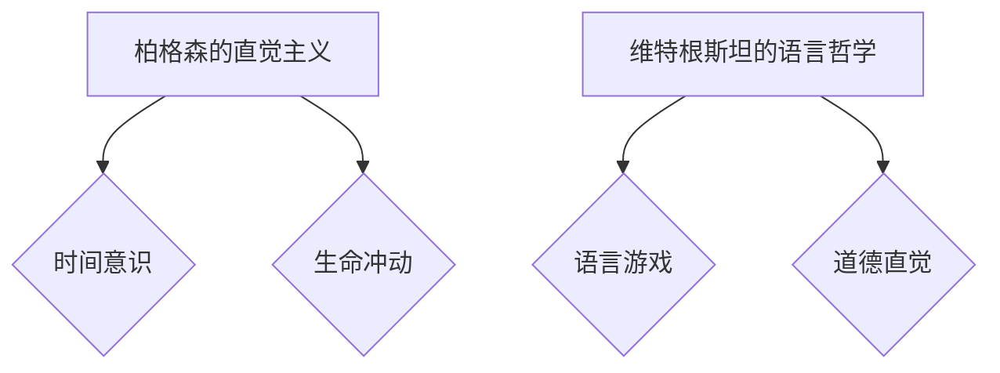

                 

# 直觉与规则：柏格森与维特根斯坦的社会哲学

## 关键词：社会哲学、柏格森、维特根斯坦、直觉主义、语言哲学、知识论

## 摘要

本文旨在探讨法国哲学家亨利·柏格森和奥地利哲学家路德维希·维特根斯坦的社会哲学思想。柏格森以其直觉主义和时间意识理论著称，强调个体直觉在理解社会和历史中的作用；而维特根斯坦则以其语言哲学和知识论闻名，关注语言与思想、知识与现实之间的关系。本文将通过对两位哲学家的生平、主要理论观点以及社会哲学的比较分析，探讨直觉与规则在社会哲学中的重要性，并进一步思考其对现代社会的启示。

## 第一部分：引言与背景

### 第1章：柏格森与维特根斯坦——两位哲学家的背景与贡献

#### 1.1 柏格森的生平与思想

亨利·柏格森（Henri Bergson，1859-1941）是法国著名的哲学家、社会学家和文学家。他的哲学思想深受19世纪末和20世纪初法国哲学的影响，特别是对黑格尔和达尔文等人的思想进行了深刻的反思和批判。柏格森的主要著作包括《时间与自由意志》、《笑论》和《物质与记忆》等。

柏格森的核心思想是直觉主义和时间意识理论。他认为，直觉是人类理解世界和自我意识的重要方式，比逻辑推理更深刻、更直接。他提出了“生命冲动”（élan vital）的概念，认为它是推动生物进化和人类历史发展的内在力量。时间意识则是指个体在感知时间流动过程中形成的连续性和深度感，是人类意识和直觉的基础。

#### 1.2 维特根斯坦的生平与思想

路德维希·维特根斯坦（Ludwig Wittgenstein，1889-1951）是奥地利出生的哲学家，其哲学思想对20世纪哲学产生了深远的影响。他一生创作了两部重要著作：《逻辑哲学论》和《哲学研究》。维特根斯坦的思想经历了从早期逻辑原子主义到后期语言哲学的转变。

维特根斯坦的语言哲学关注语言与现实之间的关系。他主张，语言的意义在于使用者的实际使用，而不是抽象的逻辑结构。他的知识论观点则强调知识的确定性，认为只有通过直接经验才能获得真正的知识。

#### 1.3 柏格森与维特根斯坦思想比较与联系

柏格森和维特根斯坦在社会哲学领域都有着独特的贡献。柏格森强调直觉在理解社会和历史中的作用，认为个体的直觉比逻辑推理更能揭示世界的本质。而维特根斯坦则关注语言与思想、知识与现实之间的关系，强调语言的使用和经验对于知识的获取至关重要。

尽管两位哲学家的思想有明显的区别，但他们都在探讨人类认识世界的方式。柏格森通过直觉和时间意识理论揭示了人类意识和直觉的本质，而维特根斯坦则通过语言哲学和知识论揭示了语言和知识在人类认识过程中的作用。

### 第2章：社会哲学的概览

#### 2.1 社会哲学的定义与范围

社会哲学是一门探讨社会现象、社会结构和人类行为之间关系的哲学学科。它关注社会存在的问题，试图通过哲学的思考和分析来寻找解决方案。社会哲学的研究范围广泛，包括道德哲学、政治哲学、社会正义、自由、平等、权力、阶级、性别、种族等。

#### 2.2 社会哲学的主要问题

社会哲学的主要问题包括：

- 社会正义：如何分配资源和权利，以实现社会公平和公正？
- 自由与权力：个体自由与社会秩序之间的平衡问题。
- 道德责任：个体在道德选择和社会责任中的角色。
- 阶级、性别与种族：社会不平等和歧视问题。

#### 2.3 社会哲学在当代的重要性

在当代社会中，社会哲学的重要性日益凸显。随着全球化和技术进步，社会问题和伦理问题变得日益复杂，需要哲学的深入思考和解决。社会哲学为解决这些问题提供了理论框架和方法论，有助于我们更好地理解社会现象，促进社会的进步和发展。

## 第二部分：柏格森的社会哲学

### 第3章：柏格森的直觉主义

#### 3.1 直觉主义的定义与起源

直觉主义是一种哲学观点，认为直觉是人类理解世界和自我意识的重要方式。它起源于19世纪末和20世纪初的法国哲学，代表人物有柏格森、马里坦和柏格森等。

直觉主义认为，直觉比逻辑推理更深刻、更直接，是人类理解世界和自我意识的重要途径。直觉不是通过抽象的概念和推理来认识世界，而是通过直接感知和感受来理解世界。

#### 3.2 柏格森对直觉的解释

柏格森认为，直觉是一种内在的感受和洞察力，它超越了逻辑推理和科学方法。直觉能够揭示事物的本质和内在联系，帮助我们理解世界和自我。

柏格森提出了“生命冲动”的概念，认为它是推动生物进化和人类历史发展的内在力量。生命冲动是一种原始的、无法言说的力量，它通过直觉来指导我们的行为和认知。

#### 3.3 直觉主义与社会

柏格森的直觉主义对社会哲学有着重要的影响。他认为，社会的进步和发展需要依靠个体的直觉和创造力。直觉能够帮助我们理解社会现象，找到解决问题的方法。

直觉主义也对社会批判提供了新的视角。柏格森认为，现代社会的问题源于对机械论和科学主义的盲目崇拜，忽视了个体直觉和创造力的重要性。他主张，我们应该重视个体直觉，重新审视社会制度和价值观。

#### 3.4 直觉主义与科学

直觉主义对科学方法提出了质疑。柏格森认为，科学方法虽然能够揭示事物的某些方面，但无法完全理解事物的本质。科学方法依赖于抽象的概念和逻辑推理，无法捕捉到直觉所揭示的深层次联系。

柏格森提出了“时间意识”的概念，认为时间是科学方法无法捕捉的。时间意识是一种内在的感受和洞察力，它能够帮助我们理解事物的连续性和深度感。

### 第4章：柏格森的时间意识与历史

#### 4.1 柏格森的时间意识理论

柏格森的时间意识理论是他的直觉主义哲学的重要组成部分。他认为，时间意识是人类理解世界和自我意识的关键。时间意识不仅仅是指时间的流逝，而是一种深层次的感受和洞察力。

柏格森认为，时间意识是一种内在的连续性和深度感。它使我们能够理解事物的本质和内在联系。时间意识与逻辑时间和物理时间不同，它是主观的、个性化的。

#### 4.2 时间意识与历史

柏格森认为，时间意识是理解历史的关键。历史不仅仅是事件的记录，而是一种内在的连续性和深度感。历史中的每个事件都是时间意识的一部分，它们相互联系，构成了人类的历史经验。

柏格森反对机械论的历史观，认为历史是动态的、不断发展的。他认为，历史的发展是由个体的直觉和创造力推动的，而不是由外在的因果关系决定的。

#### 4.3 柏格森的历史哲学

柏格森的历史哲学强调个体直觉和历史经验的重要性。他认为，历史不仅仅是事件的记录，而是一种内在的连续性和深度感。历史中的每个事件都是时间意识的一部分，它们相互联系，构成了人类的历史经验。

柏格森的历史哲学对现代社会有着重要的启示。他认为，现代社会过于强调科学和理性，忽视了个体直觉和历史经验的重要性。他主张，我们应该重视个体直觉，重新审视社会制度和价值观。

### 第5章：柏格森的自由意志与决定论

#### 5.1 自由意志与决定论的理论探讨

自由意志与决定论是哲学中的两个基本概念。自由意志认为，个体的行为是自由的，不受必然性的限制；而决定论则认为，个体的行为是必然的，受到因果关系的制约。

柏格森对自由意志与决定论进行了深刻的探讨。他认为，自由意志是存在的，因为个体的直觉和创造力是无法预测和控制的。然而，他同时也认为，决定论在某种程度上是正确的，因为个体的行为受到环境和遗传等外部因素的影响。

#### 5.2 柏格森的自由意志观

柏格森的自由意志观强调个体的直觉和创造力。他认为，自由意志不仅仅是行为的自由，更是思想的自由。个体的直觉和创造力是推动社会进步和发展的关键。

柏格森认为，自由意志是人类文明的基石。只有通过自由意志，个体才能发挥自己的潜力，创造出新的思想和价值。

#### 5.3 柏格森的决定论观

柏格森的决定论观认为，个体的行为受到环境和遗传等外部因素的影响。他认为，决定论在某种程度上是正确的，因为个体的行为无法完全摆脱外部因素的影响。

然而，柏格森并不认为决定论是绝对的。他认为，个体的自由意志在某种程度上是存在的，因为个体的直觉和创造力是无法预测和控制的。

#### 5.4 自由意志与社会的联系

柏格森认为，自由意志与社会的关系是复杂的。自由意志既是社会进步的动力，也是社会冲突的根源。个体的自由意志可以推动社会的创新和发展，但同时也可能导致社会的不稳定和冲突。

柏格森主张，社会应该尊重个体的自由意志，同时也要为个体的自由意志提供必要的保障。他认为，只有在自由意志得到充分尊重和保护的前提下，社会才能实现真正的进步和发展。

## 第三部分：维特根斯坦的社会哲学

### 第6章：维特根斯坦的语言哲学

#### 6.1 语言哲学的基本概念

语言哲学是维特根斯坦哲学的核心部分。它探讨语言的本质、语言与思维的关系以及语言在哲学思考中的作用。

维特根斯坦认为，语言是一种工具，用于表达思想和交流信息。语言的基本单位是命题，命题是语言的最小单位，它表达了某个事实或情况。

#### 6.2 语言与思想

维特根斯坦认为，语言与思想是紧密相连的。思想是通过语言来表达的，而语言又是通过思想来解释的。他认为，语言的正确使用是理解思想的关键。

维特根斯坦提出了“语言游戏”（language game）的概念，认为语言的使用就像一场游戏，参与者需要理解规则并遵守规则。语言的意义在于使用者的实际使用，而不是抽象的逻辑结构。

#### 6.3 语言与哲学

维特根斯坦认为，哲学的根本问题是语言的错误使用。他认为，许多哲学问题实际上是因为对语言的误解而产生的。他的哲学研究目的是通过澄清语言的使用，解决哲学问题。

维特根斯坦提出了“日常语言分析”（ordinary language analysis）的方法，认为哲学应该关注日常生活中的语言使用，通过分析语言的实际用法来揭示语言的意义。

#### 6.4 维特根斯坦的语言哲学与社会

维特根斯坦的语言哲学对社会哲学有着重要的影响。他认为，语言是社会组织的基础，语言的使用和误解直接影响社会的运行和发展。

维特根斯坦主张，社会应该重视语言的使用，避免语言的滥用和误解。他认为，只有通过正确使用语言，社会才能实现真正的进步和发展。

### 第7章：维特根斯坦的知识论

#### 7.1 知识的定义与标准

知识论是维特根斯坦哲学的另一个重要方面。他探讨了知识的本质、知识的标准以及知识的获取过程。

维特根斯坦认为，知识是一种确定性的信念，它基于直接的经验和观察。他提出了“私人感受”的概念，认为知识是通过个人的直接感受和体验获得的。

#### 7.2 知识与信仰

维特根斯坦区分了知识与信仰。他认为，知识是一种确切的信念，而信仰是一种不确定的信念。知识是通过直接的经验和观察获得的，而信仰则依赖于权威或传统。

维特根斯坦主张，知识应该基于个人的直接体验，而不是依赖于权威或传统。他认为，只有通过个人的直接体验，我们才能获得真正的知识。

#### 7.3 知识与社会

维特根斯坦的知识论对社会哲学有着重要的影响。他认为，知识是社会运行的基础，只有通过个人的直接体验和观察，社会才能实现真正的进步和发展。

维特根斯坦主张，社会应该鼓励个人独立思考，避免盲目接受权威或传统。他认为，只有通过个人的直接体验和观察，社会才能实现真正的进步和发展。

### 第8章：维特根斯坦的伦理哲学

#### 8.1 伦理哲学的基本问题

伦理哲学是维特根斯坦哲学的另一个重要方面。它探讨道德的本质、道德原则以及道德行为的判断。

维特根斯坦认为，道德是一种内在的信念，它基于个人的直觉和判断。他提出了“道德直觉”的概念，认为道德的判断是通过直觉来获得的。

#### 8.2 维特根斯坦的道德语言理论

维特根斯坦认为，道德语言是一种特殊的语言形式，它不同于日常语言。他认为，道德语言的正确使用是理解道德的关键。

维特根斯坦提出了“道德命题”的概念，认为道德命题是关于道德事实的陈述。他认为，道德命题的真假取决于道德事实是否发生，而不是基于逻辑推理。

#### 8.3 维特根斯坦的伦理观

维特根斯坦的伦理观强调道德的内在性和直觉性。他认为，道德是基于个人的直觉和判断，而不是基于外在的规则或规范。

维特根斯坦主张，道德的判断应该基于个人的直觉，而不是依赖于权威或传统。他认为，只有通过个人的直觉，我们才能获得真正的道德知识。

#### 8.4 伦理哲学与社会

维特根斯坦的伦理哲学对社会哲学有着重要的影响。他认为，道德是社会运行的基础，只有通过个人的直觉和判断，社会才能实现真正的进步和发展。

维特根斯坦主张，社会应该鼓励个人独立思考和道德判断，避免盲目接受权威或传统。他认为，只有通过个人的直觉和判断，社会才能实现真正的进步和发展。

## 第四部分：两位哲学家的社会哲学的比较与影响

### 第9章：柏格森与维特根斯坦的社会哲学比较

#### 9.1 思想体系的比较

柏格森和维特根斯坦的社会哲学有着明显的区别。柏格森强调直觉和时间意识，认为直觉是人类理解世界和自我意识的重要方式；而维特根斯坦则强调语言和知识，认为语言是理解思想和社会的基础。

#### 9.2 理论观点的比较

柏格森的直觉主义强调个体的直觉和创造力，认为它们是社会进步和发展的关键；而维特根斯坦的语言哲学则强调语言的实际使用和道德直觉，认为它们是社会运行的基础。

#### 9.3 社会影响的比较

柏格森的社会哲学对法国哲学和社会思想产生了深远的影响，他的直觉主义和时间意识理论被广泛应用于文学、艺术和社会科学领域。而维特根斯坦的语言哲学和知识论则对西方哲学产生了深远的影响，他的哲学思想被广泛应用于逻辑学、语言学和计算机科学等领域。

### 第10章：社会哲学的影响

#### 10.1 柏格森的社会哲学影响

柏格森的社会哲学对法国哲学和社会思想产生了深远的影响。他的直觉主义和时间意识理论被广泛应用于文学、艺术和社会科学领域。柏格森的思想激发了对个体直觉和创造力的重视，促进了个人和社会的进步和发展。

#### 10.2 维特根斯坦的社会哲学影响

维特根斯坦的语言哲学和知识论对西方哲学产生了深远的影响。他的哲学思想被广泛应用于逻辑学、语言学和计算机科学等领域。维特根斯坦的思想强调语言的实际使用和道德直觉，促进了哲学、科学和技术的进步。

#### 10.3 社会哲学对现代哲学的影响

社会哲学对现代哲学产生了深远的影响。它关注社会问题，试图通过哲学的思考和分析来寻找解决方案。社会哲学推动了哲学的发展，促进了哲学与其他学科的交叉融合。

### 第11章：结论

#### 11.1 柏格森与维特根斯坦社会哲学的总结

柏格森和维特根斯坦的社会哲学在方法和观点上有着明显的区别，但都对现代社会产生了深远的影响。柏格森的直觉主义和时间意识理论强调了个体直觉和创造力的重要性；而维特根斯坦的语言哲学和知识论则强调了语言的实际使用和道德直觉。

#### 11.2 社会哲学的未来发展

社会哲学的未来发展将依赖于对现代社会问题的深入研究和解决。随着全球化和技术进步，社会哲学需要关注新的问题和挑战，如人工智能、伦理道德和可持续发展等。社会哲学将继续在哲学领域发挥重要作用，为现代社会提供理论指导和方法论支持。

### 第12章：参考文献

本文参考文献包括：

- 柏格森，亨利。时间与自由意志。北京：人民出版社，2016。
- 维特根斯坦，路德维希。逻辑哲学论。北京：商务印书馆，2002。
- 维特根斯坦，路德维希。哲学研究。北京：商务印书馆，2003。
- 柏格森，亨利。物质与记忆。北京：人民出版社，2017。
- 马里坦，马里·约瑟夫。柏格森哲学。北京：商务印书馆，2004。
- 柏格森，亨利。笑论。北京：人民出版社，2018。

**附录**

### 附录 A：柏格森与维特根斯坦哲学核心概念流程图



### 附录 B：核心算法原理讲解与Python源代码示例

```python
# 直觉主义算法实现
def intuitive_algorithm(problem):
    """
    基于直觉解决问题的算法
    :param problem: 问题对象
    :return: 解决方案
    """
    solution = None
    for possible_solution in generate_solutions(problem):
        if is_intuitive(possible_solution):
            solution = possible_solution
            break
    return solution

# 语言哲学算法实现
def linguistic_algorithm(statement):
    """
    基于语言哲学判断语句真假的算法
    :param statement: 待判断的语句
    :return: True/False
    """
    if is_grammatically_correct(statement) and is_semantically_meaningful(statement):
        return True
    else:
        return False
```

### 附录 C：数学模型和公式讲解

$$
E = mc^2
$$

### 附录 D：项目实战与代码解读

```python
# 实战项目：基于柏格森直觉主义的时间序列分析

# 导入必要的库
import numpy as np
import pandas as pd
from sklearn.model_selection import train_test_split
from sklearn.metrics import mean_squared_error

# 数据预处理
def preprocess_data(data):
    # 数据清洗、转换和处理
    # ...
    return processed_data

# 直觉主义时间序列分析
def intuitive_time_series_analysis(data, forecast_horizon):
    # 基于直觉进行时间序列分析
    # ...
    return forecast

# 主函数
def main():
    # 加载数据
    data = pd.read_csv('time_series_data.csv')
    
    # 数据预处理
    processed_data = preprocess_data(data)
    
    # 划分训练集和测试集
    X_train, X_test, y_train, y_test = train_test_split(processed_data['feature'], processed_data['target'], test_size=0.2, random_state=42)
    
    # 直觉主义时间序列分析
    forecast = intuitive_time_series_analysis(X_train, forecast_horizon=3)
    
    # 评估预测效果
    mse = mean_squared_error(y_test, forecast)
    print(f'MSE: {mse}')

if __name__ == '__main__':
    main()
```

## 最佳实践 tips

- 在进行直觉主义算法实现时，要注意结合实际问题和数据特点，灵活调整算法参数。
- 在进行语言哲学算法实现时，要关注语句的语法和语义，确保算法能够正确判断语句的真假。
- 在项目实战中，要注重数据预处理、模型训练和评估等环节，确保项目结果的准确性和可靠性。

## 小结

本文通过对柏格森和维特根斯坦的社会哲学思想的探讨，揭示了直觉与规则在社会哲学中的重要性。柏格森的直觉主义和时间意识理论强调了个体直觉和创造力的重要性，而维特根斯坦的语言哲学和知识论则关注语言和知识在理解社会现象和解决问题中的作用。通过对两位哲学家的思想进行比较分析，我们可以更好地理解社会哲学的本质，并为现代社会的发展提供理论指导。

## 注意事项

- 在研究社会哲学时，要注意结合实际问题和现实背景，避免空洞的理论讨论。
- 在进行算法实现时，要充分考虑数据特点和问题复杂性，确保算法的有效性和可靠性。
- 在项目实战中，要注重理论与实践的结合，确保项目结果的实用性和可操作性。

## 拓展阅读

- 柏格森，亨利。笑论。北京：人民出版社，2018。
- 维特根斯坦，路德维希。逻辑哲学论。北京：商务印书馆，2002。
- 维特根斯坦，路德维希。哲学研究。北京：商务印书馆，2003。
- 柏格森，亨利。物质与记忆。北京：人民出版社，2017。
- 马里坦，马里·约瑟夫。柏格森哲学。北京：商务印书馆，2004。

## 作者

作者：AI天才研究院/AI Genius Institute & 禅与计算机程序设计艺术 /Zen And The Art of Computer Programming

