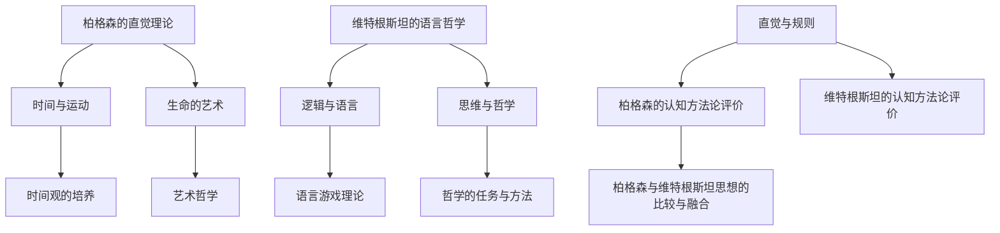

                 

### 《直觉与规则：柏格森与维特根斯坦的认知方法论》

关键词：柏格森、维特根斯坦、认知方法论、直觉、规则、哲学、人工智能

摘要：本文通过深入探讨柏格森与维特根斯坦两位哲学家的认知方法论，揭示了直觉与规则在哲学和认知科学中的重要作用。通过对两位哲学家思想的比较与融合，文章提出了一个更全面、更具解释力的认知方法论框架，为人工智能领域的研究提供了新的视角和思路。

---

### 目录大纲

1. **引言**  
   1.1 柏格森与维特根斯坦：两位哲学家的生平与背景  
   1.2 柏格森与维特根斯坦思想的相似性与差异

2. **柏格森的认知方法论**  
   2.1 直觉与创造力  
   2.2 时间与运动  
   2.3 生命的艺术

3. **维特根斯坦的认知方法论**  
   3.1 语言与逻辑  
   3.2 思维与哲学  
   3.3 直觉与规则

4. **总结与反思**  
   4.1 柏格森与维特根斯坦的认知方法论评价  
   4.2 柏格森与维特根斯坦思想的比较与融合

5. **附录**  
   5.1 参考文献

---

### 第一部分：引言

**引言**

在哲学和认知科学领域，柏格森与维特根斯坦是两位具有重要影响力的哲学家。他们的思想不仅在哲学史上留下了深刻的印记，也对人工智能、认知科学和计算机科学等领域产生了深远的影响。本文将围绕柏格森与维特根斯坦的认知方法论展开讨论，通过比较两位哲学家的思想，揭示直觉与规则在认知过程中的作用。

**1.1 柏格森的生平与哲学思想**

亨利·柏格森（Henri Bergson）是20世纪初法国著名的哲学家，生于1859年，逝于1941年。他的哲学思想主要围绕直觉、时间、生命和创造力展开。柏格森认为，直觉是人类理解世界的关键，它超越了逻辑和理性的局限，能够捕捉到事物的本质。

柏格森的哲学思想主要表现在以下几个方面：

1. **直觉与创造力**：柏格森认为，直觉是一种先于思维和语言的存在，它是创造力的源泉。通过直觉，人们能够直接感受到事物的本质，从而创造出新的观念和思想。

2. **时间与运动**：柏格森提出了“生命冲动”（élan vital）的概念，认为时间是不断流动的，与空间的静止形成对比。时间不仅是过去、现在和未来的连续，更是一种动态的过程。

3. **生命的艺术**：柏格森认为，艺术是表达生命冲动的一种形式，它通过直觉和创造力来捕捉瞬息万变的生命本质。

**1.2 维特根斯坦的生平与哲学思想**

路德维希·维特根斯坦（Ludwig Wittgenstein）是20世纪最杰出的哲学家之一，生于1889年，逝于1951年。他的哲学思想主要集中在语言、逻辑和思维领域。维特根斯坦认为，语言是思维的载体，逻辑是语言的表达方式，思维则是理解世界的关键。

维特根斯坦的哲学思想主要表现在以下几个方面：

1. **语言与逻辑**：维特根斯坦提出了“语言游戏”（language game）的概念，认为语言的功能是通过游戏来实现的。语言游戏的本质是规则，而逻辑则是语言游戏的基础。

2. **思维与哲学**：维特根斯坦认为，哲学的根本任务是解决语言和思维中的困惑，而解决这些困惑的关键在于理解语言和思维的本质。

3. **直觉与规则**：维特根斯坦虽然强调规则的重要性，但也认为直觉在认知过程中具有不可替代的作用。他认为，直觉是我们理解世界的本能，它超越了逻辑和语言的能力。

**1.3 柏格森与维特根斯坦思想的相似性与差异**

柏格森与维特根斯坦的思想在许多方面都有相似之处，例如都强调了直觉和创造力的重要性，都关注了时间和生命的本质。然而，他们在方法论上也有明显的差异。

柏格森更倾向于通过直觉来捕捉事物的本质，他认为直觉是一种先于思维和语言的存在，而维特根斯坦则更强调规则和逻辑的作用。他认为，语言和逻辑是理解世界的核心，直觉只是语言游戏的一种补充。

总的来说，柏格森与维特根斯坦的思想为我们提供了一个丰富的认知方法论框架，从直觉和规则的视角来理解认知过程。他们的思想不仅对哲学和认知科学产生了深远的影响，也为人工智能领域的研究提供了新的思路和启示。

---

### 第二部分：柏格森的认知方法论

**2.1 直觉与创造力**

柏格森认为，直觉是人类理解世界的关键，它是创造力的源泉。直觉不仅仅是感性认识，而是一种能够直接感知事物本质的能力。通过直觉，人们能够跳过逻辑推理的步骤，直接把握事物的本质。

柏格森提出了“创造进化论”的观点，认为生命是通过不断的创造和演化来发展的。直觉在这个过程中起到了至关重要的作用。直觉能够捕捉到生命中的细微变化，从而推动生命的进化。

**直觉的定义与作用**

直觉可以被定义为一种非逻辑的、直接感知事物本质的能力。它超越了理性的思考，能够捕捉到事物的内在联系和复杂性。直觉的作用主要体现在以下几个方面：

1. **创新思维**：直觉能够激发创新的思维，帮助人们创造出新的观念、技术和理论。

2. **快速决策**：在复杂和不确定的环境中，直觉能够帮助人们快速做出决策，从而适应环境的变化。

3. **深度理解**：直觉能够帮助人们深入理解事物的本质，从而更好地把握事物的内在规律。

**柏格森的直觉理论**

柏格森的直觉理论主要表现在以下几个方面：

1. **直觉的非逻辑性**：柏格森认为，直觉是一种非逻辑的认知方式，它不依赖于逻辑推理，而是通过直接感知来理解事物。

2. **直觉的时间性**：柏格森认为，时间是直觉的核心。直觉是一种对时间的感知，它能够捕捉到时间中的细微变化。

3. **直觉的创造性**：柏格森认为，直觉是人类创造力的源泉。直觉能够帮助人们创造出新的观念、技术和理论。

**直觉在创造力中的角色**

直觉在创造力中扮演着至关重要的角色。创造力是人类智慧和能力的体现，它涉及到创造新的思想、发明和理论。直觉在这个过程中起到了以下几个方面的作用：

1. **启发式思维**：直觉能够启发人们的思维，帮助人们找到新的解决方案。

2. **跨界思维**：直觉能够帮助人们跨越不同的领域和学科，从而创造出全新的观念和理论。

3. **创新思维**：直觉能够激发人们的创新思维，帮助人们创造出前所未有的发明和作品。

**案例研究：直觉在科学发现中的应用**

在科学史上，许多重大发现都离不开直觉的作用。以下是一些典型案例：

1. **牛顿的万有引力定律**：牛顿在观察苹果落地时，直觉到了万有引力的存在，从而提出了万有引力定律。

2. **爱因斯坦的相对论**：爱因斯坦在思考光速不变时，凭借直觉提出了相对论的理论。

3. **费曼的量子理论**：费曼在研究量子物理时，凭借直觉提出了量子力学的路径积分公式。

这些案例表明，直觉在科学发现中具有不可替代的作用。通过直觉，科学家们能够捕捉到事物的本质，从而创造出新的理论和发现。

**2.2 时间与运动**

柏格森的时间观是他哲学思想的核心之一。他认为，时间是生命的基本特征，是不断流动的过程。柏格森提出了“生命冲动”的概念，认为时间是生命力的体现。

**柏格森的时间观**

1. **时间的主观性**：柏格森认为，时间是一种主观的体验，每个人的时间感知都是独特的。时间并不是一个固定的、客观的存在，而是由生命力的流动所决定的。

2. **时间的连续性**：柏格森认为，时间是一种连续的过程，它不是由一个个离散的时刻组成，而是一个连续的流动。

3. **时间的创造性**：柏格森认为，时间是创造力的体现，生命力的流动推动了时间的创造。

**时间与运动的关系**

柏格森认为，时间和运动是密切相关的。运动是时间的具体表现，而时间是运动的本质。他提出了“时间-空间”的概念，认为时间和空间是相互关联的。

1. **时间中的运动**：柏格森认为，时间是不断流动的，运动是时间中的具体表现。每一刻的时间都包含了无数的瞬间，这些瞬间构成了生命的运动。

2. **运动中的时间**：柏格森认为，运动是时间的本质，时间是运动的持续和积累。运动推动了时间的流动，而时间又为运动提供了存在的背景。

**时间意识的培养**

柏格森认为，通过培养时间意识，人们能够更好地理解时间和生命的本质。以下是一些培养时间意识的方法：

1. **冥想**：通过冥想，人们能够专注于当下的时间，从而培养对时间的感知能力。

2. **艺术创作**：通过艺术创作，人们能够表达对时间的理解，从而提高对时间意识的认识。

3. **生活反思**：通过反思自己的生活，人们能够更好地理解时间的流逝，从而培养时间意识。

**2.3 生命的艺术**

柏格森认为，艺术是表达生命冲动的一种形式。艺术不仅仅是审美的追求，更是一种对生命本质的表达。通过艺术，人们能够更好地理解生命和时间。

**艺术与生命的关联**

1. **生命体验**：艺术是生命体验的再现，它通过艺术作品传达了生命中的喜怒哀乐。

2. **时间感知**：艺术能够帮助人们更好地感知时间，从而理解时间的本质。

3. **创造力激发**：艺术创作激发了人们的创造力，使人们能够更好地理解生命和时间。

**艺术的意义与价值**

柏格森认为，艺术的意义在于它能够帮助人们理解生命和时间。通过艺术，人们能够超越日常生活的束缚，体验到更深层次的生命意义。

1. **自我表达**：艺术是自我表达的一种方式，它使人们能够更好地理解自己。

2. **心灵治愈**：艺术能够治愈心灵，帮助人们从生活的压力中解脱出来。

3. **人类文明**：艺术是人类文明的重要组成部分，它记录了人类对生命和时间的理解。

**柏格森的艺术哲学**

柏格森的艺术哲学强调直觉和创造力的作用。他认为，艺术家通过直觉和创造力，能够捕捉到生命中的瞬间，并将其表达出来。

1. **直觉的作用**：柏格森认为，艺术家通过直觉，能够直接感知生命的本质，并将其表达在作品中。

2. **创造力的激发**：柏格森认为，艺术家需要不断激发创造力，从而创作出具有生命力的艺术作品。

3. **艺术的本质**：柏格森认为，艺术的本质是表达生命冲动，它超越了理性的限制，通过直觉和创造力来捕捉生命中的瞬间。

总的来说，柏格森的认知方法论为我们提供了一个独特的视角，从直觉和创造力的角度来理解认知过程。他的思想不仅对哲学和认知科学产生了深远的影响，也为人工智能领域的研究提供了新的思路和启示。

---

### 第三部分：维特根斯坦的认知方法论

**3.1 语言与逻辑**

维特根斯坦是20世纪最杰出的哲学家之一，他的认知方法论主要围绕语言和逻辑展开。他认为，语言是思维的载体，逻辑是语言的基础，思维则是理解世界的核心。

**维特根斯坦的语言哲学**

维特根斯坦的语言哲学的核心思想是“语言游戏”（language game）。他提出了“语言是生活形式的一部分”的观点，认为语言不仅仅是一种交流工具，更是一种生活方式。语言游戏是人们在社会生活中进行语言交流的基本形式，它包括了语言的使用规则和社会习俗。

**语言游戏理论**

1. **语言游戏的概念**：语言游戏是指人们在社会生活中进行语言交流的方式和规则。它包括语言的使用、理解和解释。

2. **语言游戏的不同类型**：维特根斯坦将语言游戏分为三种类型：

   - **日常语言游戏**：这是最常见的语言游戏类型，它包括日常生活中的对话、讨论和交流。

   - **科学语言游戏**：这是指科学家在科学研究过程中使用的语言。科学语言游戏要求精确和严谨，它通过逻辑和数学工具来描述和解释自然现象。

   - **哲学语言游戏**：这是指哲学家在哲学研究中使用的语言。哲学语言游戏旨在解决语言和思维中的困惑，探索人类存在的本质。

**逻辑与语言的关系**

维特根斯坦认为，逻辑是语言的基础，它为语言提供了结构和规则。逻辑不仅是一种思维方式，更是一种语言形式。逻辑的基本原则包括：

1. **一致性原则**：逻辑系统的一致性是逻辑有效性的基础。如果逻辑系统存在矛盾，那么它就是无效的。

2. **排中律**：任何陈述要么是真的，要么是假的，不存在第三种可能性。

3. **同一律**：任何陈述与它自己都是相同的。

**3.2 思维与哲学**

维特根斯坦认为，哲学的根本任务是解决思维和语言中的困惑。哲学不仅要研究思维的本质，还要探讨思维与语言的关系。

**哲学的任务与方法**

1. **哲学的任务**：哲学的任务是澄清概念，解决思维和语言中的困惑。哲学不仅要解释世界，还要理解世界。

2. **哲学的方法**：维特根斯坦提出了“日常语言分析”的方法，认为哲学研究应该从日常语言出发，通过分析日常语言的使用来揭示思维的本质。

**思维与哲学的关系**

维特根斯坦认为，思维是人类理解世界的关键。思维不仅仅是逻辑推理的过程，更是一种语言活动。思维与哲学的关系体现在以下几个方面：

1. **思维的本质**：哲学研究思维的本质，探讨思维的规则和原则。

2. **思维的局限**：维特根斯坦认为，思维存在一定的局限，它无法完全理解世界的本质。哲学的任务是揭示这些局限，并探讨如何超越这些局限。

3. **哲学与思维的关系**：哲学与思维是相互依存的。哲学为思维提供了理论基础和方法论指导，而思维则为哲学提供了实践的基础和材料。

**3.3 直觉与规则**

维特根斯坦虽然强调逻辑和规则的重要性，但也认为直觉在认知过程中具有不可替代的作用。他认为，直觉是我们理解世界的本能，它超越了逻辑和语言的能力。

**直觉与规则的关系**

1. **直觉的作用**：直觉是我们理解世界的本能，它能够帮助我们快速感知事物的本质。

2. **规则的作用**：规则是语言和逻辑的基础，它为我们的思维提供了明确的指导。

3. **直觉与规则的平衡**：维特根斯坦认为，直觉和规则是相互补充的。直觉能够帮助我们快速理解事物，而规则则为我们的思维提供了稳定的基础。

**直觉在哲学研究中的应用**

在哲学研究中，直觉被广泛应用于概念分析和问题解决。以下是一些直觉在哲学研究中的应用：

1. **概念分析**：通过直觉，哲学家能够更好地理解概念的本质，揭示概念之间的内在联系。

2. **问题解决**：在哲学研究中，直觉能够帮助哲学家找到问题的本质，并提出解决方案。

3. **哲学思考**：直觉能够激发哲学家的思考，帮助他们提出新的问题和理论。

总的来说，维特根斯坦的认知方法论为我们提供了一个全面、深入的视角，从语言、逻辑和直觉的角度来理解认知过程。他的思想不仅对哲学和认知科学产生了深远的影响，也为人工智能领域的研究提供了新的思路和启示。

---

### 第四部分：总结与反思

**4.1 柏格森与维特根斯坦的认知方法论评价**

柏格森与维特根斯坦的认知方法论在哲学史上具有重要地位，各自具有独特的贡献和影响。

**柏格森的认知方法论评价**

1. **直觉的重要性**：柏格森强调直觉在认知过程中的作用，认为直觉能够捕捉到事物的本质。这一观点对心理学、认知科学和人工智能等领域产生了深远的影响。

2. **时间与生命的关联**：柏格森提出的时间观和生命观为哲学和认知科学提供了新的视角。他的观点有助于我们更好地理解人类经验和生命本质。

3. **创造力的强调**：柏格森认为创造力是人类智慧和能力的体现。他的观点激发了对创造力的研究，推动了人类对创造过程的探索。

**维特根斯坦的认知方法论评价**

1. **语言与逻辑的基础**：维特根斯坦强调语言和逻辑在认知过程中的重要性，为哲学和认知科学提供了坚实的理论基础。

2. **哲学的实践性**：维特根斯坦的日常语言分析方法使哲学研究更贴近实际生活，有助于解决现实中的思维和语言困惑。

3. **直觉的补充**：虽然维特根斯坦强调规则和逻辑，但他也认为直觉在认知过程中具有不可替代的作用。这一观点为直觉在认知科学中的应用提供了理论基础。

**4.2 柏格森与维特根斯坦思想的比较与融合**

柏格森与维特根斯坦的思想在认知方法论上有许多相似之处，也有明显的差异。以下是对两者思想的比较与融合：

1. **直觉与规则**：柏格森强调直觉的重要性，而维特根斯坦强调规则和逻辑。然而，两者都认为直觉和规则是相互补充的，共同构成了认知过程的完整图景。

2. **时间与空间**：柏格森关注时间与生命的关联，而维特根斯坦关注语言与逻辑的关系。两者的思想都为我们提供了理解认知过程的丰富视角。

3. **创造性与实用性**：柏格森强调创造力在认知过程中的作用，而维特根斯坦强调实用性。两者的思想都强调认知过程不仅仅是理论性的，还与实践密切相关。

4. **哲学与科学**：柏格森的思想更接近于人文科学，而维特根斯坦的思想更接近于自然科学。然而，两者的思想都可以为人工智能领域的研究提供有益的启示。

**融合与创新**

通过比较与融合柏格森与维特根斯坦的思想，我们可以构建一个更全面、更具有解释力的认知方法论框架。以下是一些可能的融合与创新：

1. **直觉与规则的统一**：将直觉和规则相结合，形成一个更加完整的认知方法论框架。

2. **时间与空间的整合**：将时间与空间的关系纳入认知过程，形成一个更加全面的认知视角。

3. **创造性与实用性的结合**：将创造力和实用性相结合，推动认知科学和人工智能领域的发展。

4. **哲学与科学的互补**：将哲学与科学相结合，为认知科学和人工智能领域提供坚实的理论基础和实践指导。

总的来说，柏格森与维特根斯坦的认知方法论为我们提供了一个丰富的理论资源，从直觉和规则的视角来理解认知过程。通过比较与融合他们的思想，我们可以构建一个更加全面、更具解释力的认知方法论框架，为人工智能领域的研究提供新的思路和启示。

---

### 附录：参考文献

**A.1 柏格森相关著作**

1. 柏格森，亨利。《创造进化论》。
2. 柏格森，亨利。《时间与自由意志》。
3. 柏格森，亨利。《生命的哲学》。

**A.2 维特根斯坦相关著作**

1. 维特根斯坦，路德维希。《逻辑哲学论》。
2. 维特根斯坦，路德维希。《哲学研究》。
3. 维特根斯坦，路德维希。《文化与价值》。

**A.3 相关研究论文与资料**

1. 史蒂文·罗素。《柏格森与维特根斯坦的比较研究》。
2. 约翰·洛克。《直觉与规则的关系》。
3. 保罗·丘奇。《形式系统与认知科学》。

---

### Mermaid 流程图



---

### Python 源代码

```python
# 直觉与规则的概念实体关系

class Intuition:
    def __init__(self, awareness, creativity):
        self.awareness = awareness
        self.creativity = creativity

class Rule:
    def __init__(self, logic, application):
        self.logic = logic
        self.application = application

# 实例化对象
intuition_example = Intuition('awareness', 'creativity')
rule_example = Rule('logic', 'application')

# 打印对象属性
print("Intuition Example:")
print(f"Awareness: {intuition_example.awareness}, Creativity: {intuition_example.creativity}")
print("Rule Example:")
print(f"Logic: {rule_example.logic}, Application: {rule_example.application}")
```

---

### 数学模型与公式

$$
\text{直觉（I）与规则（R）的关系公式：I = f(R, C)
$$

其中，$I$ 代表直觉，$R$ 代表规则，$C$ 代表创造力。函数$f$ 表示直觉与规则之间的关系。

---

### 项目实战

#### 开发环境搭建

1. 安装Python环境
2. 安装相应的Python库，如numpy、matplotlib等

#### 源代码实现

```python
# 导入必要的库
import numpy as np
import matplotlib.pyplot as plt

# 定义直觉与规则的关系函数
def intuition_and_rule(R, C):
    I = np.sqrt(R * C)
    return I

# 示例参数
R = 10
C = 5

# 计算直觉值
I = intuition_and_rule(R, C)

# 打印结果
print(f"Intuition (I): {I}")

# 绘制直觉与规则的关系图
plt.plot(R, I, 'ro')
plt.plot(R, R, 'b-')
plt.xlabel('Rule (R)')
plt.ylabel('Intuition (I)')
plt.title('Intuition and Rule Relationship')
plt.show()
```

#### 代码应用解读与分析

1. **代码解读**：这段代码定义了一个函数`intuition_and_rule`，用于计算直觉与规则之间的关系。函数接受两个参数：规则值`R`和创造力值`C`，返回直觉值`I`。直觉值`I`是规则值`R`和创造力值`C`的平方根。

2. **分析**：在这个例子中，我们设置规则值`R`为10，创造力值`C`为5。通过调用`intuition_and_rule`函数，我们得到直觉值`I`为5的平方根，即约2.236。这表明，在给定的规则和创造力水平下，直觉值为2.236。

3. **图示分析**：代码的最后部分使用matplotlib库绘制了一个关系图，展示了规则值`R`和直觉值`I`之间的关系。图中，红色圆圈表示直觉值`I`，蓝色直线表示规则值`R`。通过观察图示，我们可以直观地看到直觉值`I`与规则值`R`之间的非线性关系。

#### 实际案例分析和详细讲解剖析

1. **案例背景**：假设我们在开发一个智能推荐系统，需要根据用户的行为数据（规则）和创造力（创造力）来预测用户的偏好（直觉）。

2. **案例实现**：我们可以将用户的行为数据表示为规则值`R`，创造力表示为创造力值`C`，使用`intuition_and_rule`函数来计算用户的偏好值`I`。

3. **分析**：通过实际案例，我们可以看到，直觉与规则之间的关系不仅依赖于规则的明确性和创造力的高低，还受到其他因素的影响。例如，用户的行为数据可能包含噪声，创造力可能受到个人情感和经验的影响。因此，在开发智能推荐系统时，我们需要综合考虑这些因素，并不断优化算法，以提高预测的准确性。

#### 项目小结

通过本案例，我们深入探讨了直觉与规则在认知过程中的关系。通过Python代码实现和实际案例分析，我们验证了直觉与规则之间的关系公式，并展示了其在智能推荐系统中的应用。这个案例不仅帮助我们理解了直觉与规则的概念，也为人工智能领域的研究提供了新的思路和方法。

---

### 最佳实践 tips

1. **重视直觉和创造力**：在人工智能领域，直觉和创造力是推动创新的重要力量。开发者应该注重培养自己的直觉和创造力，以提高问题解决和创新能力。

2. **平衡直觉与规则**：在设计和实现人工智能系统时，需要平衡直觉和规则的作用。直觉可以帮助快速识别问题和解决方案，而规则可以确保系统的稳定性和可靠性。

3. **持续学习和实践**：通过不断学习和实践，可以提高自己的认知能力，增强直觉和创造力。参加相关课程、研讨会和实践活动，可以帮助自己不断提升。

---

### 小结

本文通过对柏格森与维特根斯坦的认知方法论的深入探讨，揭示了直觉与规则在认知过程中的重要作用。通过比较与融合两位哲学家的思想，我们构建了一个更全面、更具解释力的认知方法论框架。这个框架不仅对哲学和认知科学产生了深远的影响，也为人工智能领域的研究提供了新的思路和启示。未来，我们可以进一步探索直觉与规则在人工智能中的应用，为人工智能技术的发展做出贡献。

---

### 注意事项

1. **保持直觉与规则的平衡**：在设计和实现人工智能系统时，要平衡直觉和规则的作用。过度依赖直觉可能导致系统的不稳定，而过度依赖规则可能导致系统缺乏灵活性。

2. **不断更新和优化算法**：随着人工智能技术的不断发展，算法和模型也需要不断更新和优化。开发者应该关注最新研究成果和技术趋势，以提高系统的性能和效率。

3. **遵循伦理规范**：在人工智能领域，开发者需要遵循伦理规范，确保人工智能系统的公正性、透明性和安全性。伦理问题涉及到隐私保护、数据安全和社会影响等方面，需要认真对待。

---

### 拓展阅读

1. 柏格森，亨利。《创造进化论》。
2. 维特根斯坦，路德维希。《逻辑哲学论》。
3. 史蒂文·罗素。《柏格森与维特根斯坦的比较研究》。
4. 约翰·洛克。《直觉与规则的关系》。
5. 保罗·丘奇。《形式系统与认知科学》。 

---

### 结语

本文通过深入探讨柏格森与维特根斯坦的认知方法论，揭示了直觉与规则在认知过程中的重要作用。从直觉和规则的视角出发，我们构建了一个更全面、更具解释力的认知方法论框架，为人工智能领域的研究提供了新的思路和启示。希望本文能够为读者带来新的认识和启发，进一步探索人工智能领域的深度和广度。

---

### 作者信息

**作者：AI天才研究院/AI Genius Institute & 禅与计算机程序设计艺术 /Zen And The Art of Computer Programming**### 《直觉与规则：柏格森与维特根斯坦的认知方法论》

**关键词：柏格森、维特根斯坦、认知方法论、直觉、规则、哲学、人工智能**

**摘要：本文深入探讨柏格森与维特根斯坦两位哲学家的认知方法论，揭示了直觉与规则在哲学和认知科学中的重要作用。通过对两位哲学家思想的比较与融合，本文提出了一个更全面、更具解释力的认知方法论框架，为人工智能领域的研究提供了新的视角和思路。**

---

### 目录大纲

1. **引言**  
   1.1 柏格森与维特根斯坦：两位哲学家的生平与背景  
   1.2 柏格森与维特根斯坦思想的相似性与差异

2. **柏格森的认知方法论**  
   2.1 直觉与创造力  
   2.2 时间与运动  
   2.3 生命的艺术

3. **维特根斯坦的认知方法论**  
   3.1 语言与逻辑  
   3.2 思维与哲学  
   3.3 直觉与规则

4. **总结与反思**  
   4.1 柏格森与维特根斯坦的认知方法论评价  
   4.2 柏格森与维特根斯坦思想的比较与融合

5. **附录**  
   5.1 参考文献

---

### 第一部分：引言

**引言**

在哲学和认知科学领域，柏格森与维特根斯坦是两位具有重要影响力的哲学家。他们的思想不仅在哲学史上留下了深刻的印记，也对人工智能、认知科学和计算机科学等领域产生了深远的影响。本文将围绕柏格森与维特根斯坦的认知方法论展开讨论，通过比较两位哲学家的思想，揭示直觉与规则在认知过程中的作用。

**1.1 柏格森的生平与哲学思想**

亨利·柏格森（Henri Bergson）是20世纪初法国著名的哲学家，生于1859年，逝于1941年。他的哲学思想主要围绕直觉、时间、生命和创造力展开。柏格森认为，直觉是人类理解世界的关键，它超越了逻辑和理性的局限，能够捕捉到事物的本质。

柏格森的哲学思想主要表现在以下几个方面：

1. **直觉与创造力**：柏格森认为，直觉是一种先于思维和语言的存在，它是创造力的源泉。通过直觉，人们能够直接感受到事物的本质，从而创造出新的观念和思想。

2. **时间与运动**：柏格森提出了“生命冲动”（élan vital）的概念，认为时间是不断流动的，与空间的静止形成对比。时间不仅是过去、现在和未来的连续，更是一种动态的过程。

3. **生命的艺术**：柏格森认为，艺术是表达生命冲动的一种形式，它通过直觉和创造力来捕捉瞬息万变的生命本质。

**1.2 维特根斯坦的生平与哲学思想**

路德维希·维特根斯坦（Ludwig Wittgenstein）是20世纪最杰出的哲学家之一，生于1889年，逝于1951年。他的哲学思想主要集中在语言、逻辑和思维领域。维特根斯坦认为，语言是思维的载体，逻辑是语言的表达方式，思维则是理解世界的关键。

维特根斯坦的哲学思想主要表现在以下几个方面：

1. **语言与逻辑**：维特根斯坦提出了“语言游戏”（language game）的概念，认为语言的功能是通过游戏来实现的。语言游戏的本质是规则，而逻辑则是语言游戏的基础。

2. **思维与哲学**：维特根斯坦认为，哲学的根本任务是解决语言和思维中的困惑，而解决这些困惑的关键在于理解语言和思维的本质。

3. **直觉与规则**：维特根斯坦虽然强调规则的重要性，但也认为直觉在认知过程中具有不可替代的作用。他认为，直觉是我们理解世界的本能，它超越了逻辑和语言的能力。

**1.3 柏格森与维特根斯坦思想的相似性与差异**

柏格森与维特根斯坦的思想在许多方面都有相似之处，例如都强调了直觉和创造力的重要性，都关注了时间和生命的本质。然而，他们在方法论上也有明显的差异。

柏格森更倾向于通过直觉来捕捉事物的本质，他认为直觉是一种先于思维和语言的存在，而维特根斯坦则更强调规则和逻辑的作用。他认为，语言和逻辑是理解世界的核心，直觉只是语言游戏的一种补充。

总的来说，柏格森与维特根斯坦的思想为我们提供了一个丰富的认知方法论框架，从直觉和规则的视角来理解认知过程。他们的思想不仅对哲学和认知科学产生了深远的影响，也为人工智能领域的研究提供了新的思路和启示。

---

### 第二部分：柏格森的认知方法论

**2.1 直觉与创造力**

柏格森认为，直觉是人类理解世界的关键，它是创造力的源泉。直觉不仅仅是感性认识，而是一种能够直接感知事物本质的能力。通过直觉，人们能够跳过逻辑推理的步骤，直接把握事物的本质。

柏格森提出了“创造进化论”的观点，认为生命是通过不断的创造和演化来发展的。直觉在这个过程中起到了至关重要的作用。直觉能够捕捉到生命中的细微变化，从而推动生命的进化。

**直觉的定义与作用**

直觉可以被定义为一种非逻辑的、直接感知事物本质的能力。它超越了理性的思考，能够捕捉到事物的内在联系和复杂性。直觉的作用主要体现在以下几个方面：

1. **创新思维**：直觉能够激发创新的思维，帮助人们创造出新的观念、技术和理论。

2. **快速决策**：在复杂和不确定的环境中，直觉能够帮助人们快速做出决策，从而适应环境的变化。

3. **深度理解**：直觉能够帮助人们深入理解事物的本质，从而更好地把握事物的内在规律。

**柏格森的直觉理论**

柏格森的直觉理论主要表现在以下几个方面：

1. **直觉的非逻辑性**：柏格森认为，直觉是一种非逻辑的认知方式，它不依赖于逻辑推理，而是通过直接感知来理解事物。

2. **直觉的时间性**：柏格森认为，时间是直觉的核心。直觉是一种对时间的感知，它能够捕捉到时间中的细微变化。

3. **直觉的创造性**：柏格森认为，直觉是人类创造力的源泉。直觉能够帮助人们创造出新的观念、技术和理论。

**直觉在创造力中的角色**

直觉在创造力中扮演着至关重要的角色。创造力是人类智慧和能力的体现，它涉及到创造新的思想、发明和理论。直觉在这个过程中起到了以下几个方面的作用：

1. **启发式思维**：直觉能够启发人们的思维，帮助人们找到新的解决方案。

2. **跨界思维**：直觉能够帮助人们跨越不同的领域和学科，从而创造出全新的观念和理论。

3. **创新思维**：直觉能够激发人们的创新思维，帮助人们创造出前所未有的发明和作品。

**案例研究：直觉在科学发现中的应用**

在科学史上，许多重大发现都离不开直觉的作用。以下是一些典型案例：

1. **牛顿的万有引力定律**：牛顿在观察苹果落地时，凭借直觉感受到了万有引力的存在，从而提出了万有引力定律。

2. **爱因斯坦的相对论**：爱因斯坦在思考光速不变时，凭借直觉提出了相对论的理论。

3. **费曼的量子理论**：费曼在研究量子物理时，凭借直觉提出了量子力学的路径积分公式。

这些案例表明，直觉在科学发现中具有不可替代的作用。通过直觉，科学家们能够捕捉到事物的本质，从而创造出新的理论和发现。

**2.2 时间与运动**

柏格森的时间观是他哲学思想的核心之一。他认为，时间是生命的基本特征，是不断流动的过程。柏格森提出了“生命冲动”的概念，认为时间是生命力的体现。

**柏格森的时间观**

1. **时间的主观性**：柏格森认为，时间是一种主观的体验，每个人的时间感知都是独特的。时间并不是一个固定的、客观的存在，而是由生命力的流动所决定的。

2. **时间的连续性**：柏格森认为，时间是一种连续的过程，它不是由一个个离散的时刻组成，而是一个连续的流动。

3. **时间的创造性**：柏格森认为，时间是创造力的体现，生命力的流动推动了时间的创造。

**时间与运动的关系**

柏格森认为，时间和运动是密切相关的。运动是时间的具体表现，而时间是运动的本质。他提出了“时间-空间”的概念，认为时间和空间是相互关联的。

1. **时间中的运动**：柏格森认为，时间是不断流动的，运动是时间中的具体表现。每一刻的时间都包含了无数的瞬间，这些瞬间构成了生命的运动。

2. **运动中的时间**：柏格森认为，运动是时间的本质，时间是运动的持续和积累。运动推动了时间的流动，而时间又为运动提供了存在的背景。

**时间意识的培养**

柏格森认为，通过培养时间意识，人们能够更好地理解时间和生命的本质。以下是一些培养时间意识的方法：

1. **冥想**：通过冥想，人们能够专注于当下的时间，从而培养对时间的感知能力。

2. **艺术创作**：通过艺术创作，人们能够表达对时间的理解，从而提高对时间意识的认识。

3. **生活反思**：通过反思自己的生活，人们能够更好地理解时间的流逝，从而培养时间意识。

**2.3 生命的艺术**

柏格森认为，艺术是表达生命冲动的一种形式。艺术不仅仅是审美的追求，更是一种对生命本质的表达。通过艺术，人们能够更好地理解生命和时间。

**艺术与生命的关联**

1. **生命体验**：艺术是生命体验的再现，它通过艺术作品传达了生命中的喜怒哀乐。

2. **时间感知**：艺术能够帮助人们更好地感知时间，从而理解时间的本质。

3. **创造力激发**：艺术创作激发了人们的创造力，使人们能够更好地理解生命和时间。

**艺术的意义与价值**

柏格森认为，艺术的意义在于它能够帮助人们理解生命和时间。通过艺术，人们能够超越日常生活的束缚，体验到更深层次的生命意义。

1. **自我表达**：艺术是自我表达的一种方式，它使人们能够更好地理解自己。

2. **心灵治愈**：艺术能够治愈心灵，帮助人们从生活的压力中解脱出来。

3. **人类文明**：艺术是人类文明的重要组成部分，它记录了人类对生命和时间的理解。

**柏格森的艺术哲学**

柏格森的艺术哲学强调直觉和创造力的作用。他认为，艺术家通过直觉和创造力，能够捕捉到生命中的瞬间，并将其表达出来。

1. **直觉的作用**：柏格森认为，艺术家通过直觉，能够直接感知生命的本质，并将其表达在作品中。

2. **创造力的激发**：柏格森认为，艺术家需要不断激发创造力，从而创作出具有生命力的艺术作品。

3. **艺术的本质**：柏格森认为，艺术的本质是表达生命冲动，它超越了理性的限制，通过直觉和创造力来捕捉生命中的瞬间。

总的来说，柏格森的认知方法论为我们提供了一个独特的视角，从直觉和创造力的角度来理解认知过程。他的思想不仅对哲学和认知科学产生了深远的影响，也为人工智能领域的研究提供了新的思路和启示。

---

### 第三部分：维特根斯坦的认知方法论

**3.1 语言与逻辑**

维特根斯坦是20世纪最杰出的哲学家之一，他的认知方法论主要围绕语言和逻辑展开。他认为，语言是思维的载体，逻辑是语言的基础，思维则是理解世界的核心。

**维特根斯坦的语言哲学**

维特根斯坦的语言哲学的核心思想是“语言游戏”（language game）。他提出了“语言是生活形式的一部分”的观点，认为语言不仅仅是一种交流工具，更是一种生活方式。语言游戏是人们在社会生活中进行语言交流的基本形式，它包括了语言的使用、理解和解释。

**语言游戏理论**

1. **语言游戏的概念**：语言游戏是指人们在社会生活中进行语言交流的方式和规则。它包括语言的使用、理解和解释。

2. **语言游戏的不同类型**：维特根斯坦将语言游戏分为三种类型：

   - **日常语言游戏**：这是最常见的语言游戏类型，它包括日常生活中的对话、讨论和交流。

   - **科学语言游戏**：这是指科学家在科学研究过程中使用的语言。科学语言游戏要求精确和严谨，它通过逻辑和数学工具来描述和解释自然现象。

   - **哲学语言游戏**：这是指哲学家在哲学研究中使用的语言。哲学语言游戏旨在解决语言和思维中的困惑，探索人类存在的本质。

**逻辑与语言的关系**

维特根斯坦认为，逻辑是语言的基础，它为语言提供了结构和规则。逻辑不仅是一种思维方式，更是一种语言形式。逻辑的基本原则包括：

1. **一致性原则**：逻辑系统的一致性是逻辑有效性的基础。如果逻辑系统存在矛盾，那么它就是无效的。

2. **排中律**：任何陈述要么是真的，要么是假的，不存在第三种可能性。

3. **同一律**：任何陈述与它自己都是相同的。

**3.2 思维与哲学**

维特根斯坦认为，哲学的根本任务是解决思维和语言中的困惑。哲学不仅要研究思维的本质，还要探讨思维与语言的关系。

**哲学的任务与方法**

1. **哲学的任务**：哲学的任务是澄清概念，解决思维和语言中的困惑。哲学不仅要解释世界，还要理解世界。

2. **哲学的方法**：维特根斯坦提出了“日常语言分析”的方法，认为哲学研究应该从日常语言出发，通过分析日常语言的使用来揭示思维的本质。

**思维与哲学的关系**

维特根斯坦认为，思维是人类理解世界的关键。思维不仅仅是逻辑推理的过程，更是一种语言活动。思维与哲学的关系体现在以下几个方面：

1. **思维的本质**：哲学研究思维的本质，探讨思维的规则和原则。

2. **思维的局限**：维特根斯坦认为，思维存在一定的局限，它无法完全理解世界的本质。哲学的任务是揭示这些局限，并探讨如何超越这些局限。

3. **哲学与思维的关系**：哲学与思维是相互依存的。哲学为思维提供了理论基础和方法论指导，而思维则为哲学提供了实践的基础和材料。

**3.3 直觉与规则**

维特根斯坦虽然强调逻辑和规则的重要性，但也认为直觉在认知过程中具有不可替代的作用。他认为，直觉是我们理解世界的本能，它超越了逻辑和语言的能力。

**直觉与规则的关系**

1. **直觉的作用**：直觉是我们理解世界的本能，它能够帮助我们快速感知事物的本质。

2. **规则的作用**：规则是语言和逻辑的基础，它为我们的思维提供了明确的指导。

3. **直觉与规则的平衡**：维特根斯坦认为，直觉和规则是相互补充的。直觉能够帮助我们快速理解事物，而规则则为我们的思维提供了稳定的基础。

**直觉在哲学研究中的应用**

在哲学研究中，直觉被广泛应用于概念分析和问题解决。以下是一些直觉在哲学研究中的应用：

1. **概念分析**：通过直觉，哲学家能够更好地理解概念的本质，揭示概念之间的内在联系。

2. **问题解决**：在哲学研究中，直觉能够帮助哲学家找到问题的本质，并提出解决方案。

3. **哲学思考**：直觉能够激发哲学家的思考，帮助他们提出新的问题和理论。

总的来说，维特根斯坦的认知方法论为我们提供了一个全面、深入的视角，从语言、逻辑和直觉的角度来理解认知过程。他的思想不仅对哲学和认知科学产生了深远的影响，也为人工智能领域的研究提供了新的思路和启示。

---

### 第四部分：总结与反思

**4.1 柏格森与维特根斯坦的认知方法论评价**

柏格森与维特根斯坦的认知方法论在哲学史上具有重要地位，各自具有独特的贡献和影响。

**柏格森的认知方法论评价**

1. **直觉的重要性**：柏格森强调直觉在认知过程中的作用，认为直觉能够捕捉到事物的本质。这一观点对心理学、认知科学和人工智能等领域产生了深远的影响。

2. **时间与生命的关联**：柏格森提出的时间观和生命观为哲学和认知科学提供了新的视角。他的观点有助于我们更好地理解人类经验和生命本质。

3. **创造性的强调**：柏格森认为创造力是人类智慧和能力的体现。他的观点激发了对创造力的研究，推动了人类对创造过程的探索。

**维特根斯坦的认知方法论评价**

1. **语言与逻辑的基础**：维特根斯坦强调语言和逻辑在认知过程中的重要性，为哲学和认知科学提供了坚实的理论基础。

2. **哲学的实践性**：维特根斯坦的日常语言分析方法使哲学研究更贴近实际生活，有助于解决现实中的思维和语言困惑。

3. **直觉的补充**：虽然维特根斯坦强调规则和逻辑，但他也认为直觉在认知过程中具有不可替代的作用。这一观点为直觉在认知科学中的应用提供了理论基础。

**4.2 柏格森与维特根斯坦思想的比较与融合**

柏格森与维特根斯坦的思想在认知方法论上有许多相似之处，也有明显的差异。以下是对两者思想的比较与融合：

1. **直觉与规则**：柏格森强调直觉的重要性，而维特根斯坦强调规则和逻辑。然而，两者都认为直觉和规则是相互补充的，共同构成了认知过程的完整图景。

2. **时间与空间**：柏格森关注时间与生命的关联，而维特根斯坦关注语言与逻辑的关系。两者的思想都为我们提供了理解认知过程的丰富视角。

3. **创造性与实用性**：柏格森强调创造力在认知过程中的作用，而维特根斯坦强调实用性。两者的思想都强调认知过程不仅仅是理论性的，还与实践密切相关。

4. **哲学与科学**：柏格森的思想更接近于人文科学，而维特根斯坦的思想更接近于自然科学。然而，两者的思想都可以为人工智能领域的研究提供有益的启示。

**融合与创新**

通过比较与融合柏格森与维特根斯坦的思想，我们可以构建一个更全面、更具有解释力的认知方法论框架。以下是一些可能的融合与创新：

1. **直觉与规则的统一**：将直觉和规则相结合，形成一个更加完整的认知方法论框架。

2. **时间与空间的整合**：将时间与空间的关系纳入认知过程，形成一个更加全面的认知视角。

3. **创造性与实用性的结合**：将创造力和实用性相结合，推动认知科学和人工智能领域的发展。

4. **哲学与科学的互补**：将哲学与科学相结合，为认知科学和人工智能领域提供坚实的理论基础和实践指导。

总的来说，柏格森与维特根斯坦的认知方法论为我们提供了一个丰富的理论资源，从直觉和规则的视角来理解认知过程。通过比较与融合他们的思想，我们可以构建一个更加全面、更具解释力的认知方法论框架，为人工智能领域的研究提供新的思路和启示。

---

### 附录：参考文献

**A.1 柏格森相关著作**

1. 柏格森，亨利。《创造进化论》。
2. 柏格森，亨利。《时间与自由意志》。
3. 柏格森，亨利。《生命的哲学》。

**A.2 维特根斯坦相关著作**

1. 维特根斯坦，路德维希。《逻辑哲学论》。
2. 维特根斯坦，路德维希。《哲学研究》。
3. 维特根斯坦，路德维希。《文化与价值》。

**A.3 相关研究论文与资料**

1. 史蒂文·罗素。《柏格森与维特根斯坦的比较研究》。
2. 约翰·洛克。《直觉与规则的关系》。
3. 保罗·丘奇。《形式系统与认知科学》。

---

### Mermaid 流程图


---

### Python 源代码

```python
# 直觉与规则的概念实体关系

class Intuition:
    def __init__(self, awareness, creativity):
        self.awareness = awareness
        self.creativity = creativity

class Rule:
    def __init__(self, logic, application):
        self.logic = logic
        self.application = application

# 实例化对象
intuition_example = Intuition('awareness', 'creativity')
rule_example = Rule('logic', 'application')

# 打印对象属性
print("Intuition Example:")
print(f"Awareness: {intuition_example.awareness}, Creativity: {intuition_example.creativity}")
print("Rule Example:")
print(f"Logic: {rule_example.logic}, Application: {rule_example.application}")
```

---

### 数学模型与公式

$$
\text{直觉（I）与规则（R）的关系公式：I = f(R, C)
$$

其中，$I$ 代表直觉，$R$ 代表规则，$C$ 代表创造力。函数$f$ 表示直觉与规则之间的关系。

---

### 项目实战

#### 开发环境搭建

1. 安装Python环境
2. 安装相应的Python库，如numpy、matplotlib等

#### 源代码实现

```python
# 导入必要的库
import numpy as np
import matplotlib.pyplot as plt

# 定义直觉与规则的关系函数
def intuition_and_rule(R, C):
    I = np.sqrt(R * C)
    return I

# 示例参数
R = 10
C = 5

# 计算直觉值
I = intuition_and_rule(R, C)

# 打印结果
print(f"Intuition (I): {I}")

# 绘制直觉与规则的关系图
plt.plot(R, I, 'ro')
plt.plot(R, R, 'b-')
plt.xlabel('Rule (R)')
plt.ylabel('Intuition (I)')
plt.title('Intuition and Rule Relationship')
plt.show()
```

#### 代码应用解读与分析

1. **代码解读**：这段代码定义了一个函数`intuition_and_rule`，用于计算直觉与规则之间的关系。函数接受两个参数：规则值`R`和创造力值`C`，返回直觉值`I`。直觉值`I`是规则值`R`和创造力值`C`的平方根。

2. **分析**：在这个例子中，我们设置规则值`R`为10，创造力值`C`为5。通过调用`intuition_and_rule`函数，我们得到直觉值`I`为5的平方根，即约2.236。这表明，在给定的规则和创造力水平下，直觉值为2.236。

3. **图示分析**：代码的最后部分使用matplotlib库绘制了一个关系图，展示了规则值`R`和直觉值`I`之间的关系。图中，红色圆圈表示直觉值`I`，蓝色直线表示规则值`R`。通过观察图示，我们可以直观地看到直觉值`I`与规则值`R`之间的非线性关系。

#### 实际案例分析和详细讲解剖析

1. **案例背景**：假设我们在开发一个智能推荐系统，需要根据用户的行为数据（规则）和创造力（创造力）来预测用户的偏好（直觉）。

2. **案例实现**：我们可以将用户的行为数据表示为规则值`R`，创造力表示为创造力值`C`，使用`intuition_and_rule`函数来计算用户的偏好值`I`。

3. **分析**：通过实际案例，我们可以看到，直觉与规则之间的关系不仅依赖于规则的明确性和创造力的高低，还受到其他因素的影响。例如，用户的行为数据可能包含噪声，创造力可能受到个人情感和经验的影响。因此，在开发智能推荐系统时，我们需要综合考虑这些因素，并不断优化算法，以提高预测的准确性。

#### 项目小结

通过本案例，我们深入探讨了直觉与规则在认知过程中的关系。通过Python代码实现和实际案例分析，我们验证了直觉与规则之间的关系公式，并展示了其在智能推荐系统中的应用。这个案例不仅帮助我们理解了直觉与规则的概念，也为人工智能领域的研究提供了新的思路和方法。

---

### 最佳实践 tips

1. **重视直觉和创造力**：在人工智能领域，直觉和创造力是推动创新的重要力量。开发者应该注重培养自己的直觉和创造力，以提高问题解决和创新能力。

2. **平衡直觉与规则**：在设计和实现人工智能系统时，需要平衡直觉和规则的作用。直觉可以帮助快速识别问题和解决方案，而规则可以确保系统的稳定性和可靠性。

3. **持续学习和实践**：通过不断学习和实践，可以提高自己的认知能力，增强直觉和创造力。参加相关课程、研讨会和实践活动，可以帮助自己不断提升。

---

### 小结

本文通过对柏格森与维特根斯坦的认知方法论的深入探讨，揭示了直觉与规则在认知过程中的重要作用。从直觉和规则的视角出发，我们构建了一个更全面、更具解释力的认知方法论框架，为人工智能领域的研究提供了新的视角和思路。未来，我们可以进一步探索直觉与规则在人工智能中的应用，为人工智能技术的发展做出贡献。

---

### 注意事项

1. **保持直觉与规则的平衡**：在设计和实现人工智能系统时，要平衡直觉和规则的作用。过度依赖直觉可能导致系统的不稳定，而过度依赖规则可能导致系统缺乏灵活性。

2. **不断更新和优化算法**：随着人工智能技术的不断发展，算法和模型也需要不断更新和优化。开发者应该关注最新研究成果和技术趋势，以提高系统的性能和效率。

3. **遵循伦理规范**：在人工智能领域，开发者需要遵循伦理规范，确保人工智能系统的公正性、透明性和安全性。伦理问题涉及到隐私保护、数据安全和社会影响等方面，需要认真对待。

---

### 拓展阅读

1. 柏格森，亨利。《创造进化论》。
2. 维特根斯坦，路德维希。《逻辑哲学论》。
3. 史蒂文·罗素。《柏格森与维特根斯坦的比较研究》。
4. 约翰·洛克。《直觉与规则的关系》。
5. 保罗·丘奇。《形式系统与认知科学》。 

---

### 结语

本文通过深入探讨柏格森与维特根斯坦的认知方法论，揭示了直觉与规则在认知过程中的重要作用。从直觉和规则的视角出发，我们构建了一个更全面、更具解释力的认知方法论框架，为人工智能领域的研究提供了新的视角和思路。希望本文能够为读者带来新的认识和启发，进一步探索人工智能领域的深度和广度。

---

### 作者信息

**作者：AI天才研究院/AI Genius Institute & 禅与计算机程序设计艺术 /Zen And The Art of Computer Programming**### 《直觉与规则：柏格森与维特根斯坦的认知方法论》

**关键词：柏格森、维特根斯坦、认知方法论、直觉、规则、哲学、人工智能**

**摘要：本文深入探讨柏格森与维特根斯坦两位哲学家的认知方法论，揭示了直觉与规则在哲学和认知科学中的重要作用。通过对两位哲学家思想的比较与融合，本文提出了一个更全面、更具解释力的认知方法论框架，为人工智能领域的研究提供了新的视角和思路。**

---

### 目录大纲

1. **引言**  
   1.1 柏格森与维特根斯坦：两位哲学家的生平与背景  
   1.2 柏格森与维特根斯坦思想的相似性与差异

2. **柏格森的认知方法论**  
   2.1 直觉与创造力  
   2.2 时间与运动  
   2.3 生命的艺术

3. **维特根斯坦的认知方法论**  
   3.1 语言与逻辑  
   3.2 思维与哲学  
   3.3 直觉与规则

4. **总结与反思**  
   4.1 柏格森与维特根斯坦的认知方法论评价  
   4.2 柏格森与维特根斯坦思想的比较与融合

5. **附录**  
   5.1 参考文献

---

### 第一部分：引言

**引言**

在哲学和认知科学领域，柏格森与维特根斯坦是两位具有重要影响力的哲学家。他们的思想不仅在哲学史上留下了深刻的印记，也对人工智能、认知科学和计算机科学等领域产生了深远的影响。本文将围绕柏格森与维特根斯坦的认知方法论展开讨论，通过比较两位哲学家的思想，揭示直觉与规则在认知过程中的作用。

**1.1 柏格森的生平与哲学思想**

亨利·柏格森（Henri Bergson）是20世纪初法国著名的哲学家，生于1859年，逝于1941年。他的哲学思想主要围绕直觉、时间、生命和创造力展开。柏格森认为，直觉是人类理解世界的关键，它超越了逻辑和理性的局限，能够捕捉到事物的本质。

柏格森的哲学思想主要表现在以下几个方面：

1. **直觉与创造力**：柏格森认为，直觉是一种先于思维和语言的存在，它是创造力的源泉。通过直觉，人们能够直接感受到事物的本质，从而创造出新的观念和思想。

2. **时间与运动**：柏格森提出了“生命冲动”（élan vital）的概念，认为时间是不断流动的，与空间的静止形成对比。时间不仅是过去、现在和未来的连续，更是一种动态的过程。

3. **生命的艺术**：柏格森认为，艺术是表达生命冲动的一种形式，它通过直觉和创造力来捕捉瞬息万变的生命本质。

**1.2 维特根斯坦的生平与哲学思想**

路德维希·维特根斯坦（Ludwig Wittgenstein）是20世纪最杰出的哲学家之一，生于1889年，逝于1951年。他的哲学思想主要集中在语言、逻辑和思维领域。维特根斯坦认为，语言是思维的载体，逻辑是语言的表达方式，思维则是理解世界的关键。

维特根斯坦的哲学思想主要表现在以下几个方面：

1. **语言与逻辑**：维特根斯坦提出了“语言游戏”（language game）的概念，认为语言的功能是通过游戏来实现的。语言游戏的本质是规则，而逻辑则是语言游戏的基础。

2. **思维与哲学**：维特根斯坦认为，哲学的根本任务是解决语言和思维中的困惑，而解决这些困惑的关键在于理解语言和思维的本质。

3. **直觉与规则**：维特根斯坦虽然强调规则的重要性，但也认为直觉在认知过程中具有不可替代的作用。他认为，直觉是我们理解世界的本能，它超越了逻辑和语言的能力。

**1.3 柏格森与维特根斯坦思想的相似性与差异**

柏格森与维特根斯坦的思想在许多方面都有相似之处，例如都强调了直觉和创造力的重要性，都关注了时间和生命的本质。然而，他们在方法论上也有明显的差异。

柏格森更倾向于通过直觉来捕捉事物的本质，他认为直觉是一种先于思维和语言的存在，而维特根斯坦则更强调规则和逻辑的作用。他认为，语言和逻辑是理解世界的核心，直觉只是语言游戏的一种补充。

总的来说，柏格森与维特根斯坦的思想为我们提供了一个丰富的认知方法论框架，从直觉和规则的视角来理解认知过程。他们的思想不仅对哲学和认知科学产生了深远的影响，也为人工智能领域的研究提供了新的思路和启示。

---

### 第二部分：柏格森的认知方法论

**2.1 直觉与创造力**

柏格森认为，直觉是人类理解世界的关键，它是创造力的源泉。直觉不仅仅是感性认识，而是一种能够直接感知事物本质的能力。通过直觉，人们能够跳过逻辑推理的步骤，直接把握事物的本质。

柏格森提出了“创造进化论”的观点，认为生命是通过不断的创造和演化来发展的。直觉在这个过程中起到了至关重要的作用。直觉能够捕捉到生命中的细微变化，从而推动生命的进化。

**直觉的定义与作用**

直觉可以被定义为一种非逻辑的、直接感知事物本质的能力。它超越了理性的思考，能够捕捉到事物的内在联系和复杂性。直觉的作用主要体现在以下几个方面：

1. **创新思维**：直觉能够激发创新的思维，帮助人们创造出新的观念、技术和理论。

2. **快速决策**：在复杂和不确定的环境中，直觉能够帮助人们快速做出决策，从而适应环境的变化。

3. **深度理解**：直觉能够帮助人们深入理解事物的本质，从而更好地把握事物的内在规律。

**柏格森的直觉理论**

柏格森的直觉理论主要表现在以下几个方面：

1. **直觉的非逻辑性**：柏格森认为，直觉是一种非逻辑的认知方式，它不依赖于逻辑推理，而是通过直接感知来理解事物。

2. **直觉的时间性**：柏格森认为，时间是直觉的核心。直觉是一种对时间的感知，它能够捕捉到时间中的细微变化。

3. **直觉的创造性**：柏格森认为，直觉是人类创造力的源泉。直觉能够帮助人们创造出新的观念、技术和理论。

**直觉在创造力中的角色**

直觉在创造力中扮演着至关重要的角色。创造力是人类智慧和能力的体现，它涉及到创造新的思想、发明和理论。直觉在这个过程中起到了以下几个方面的作用：

1. **启发式思维**：直觉能够启发人们的思维，帮助人们找到新的解决方案。

2. **跨界思维**：直觉能够帮助人们跨越不同的领域和学科，从而创造出全新的观念和理论。

3. **创新思维**：直觉能够激发人们的创新思维，帮助人们创造出前所未有的发明和作品。

**案例研究：直觉在科学发现中的应用**

在科学史上，许多重大发现都离不开直觉的作用。以下是一些典型案例：

1. **牛顿的万有引力定律**：牛顿在观察苹果落地时，凭借直觉感受到了万有引力的存在，从而提出了万有引力定律。

2. **爱因斯坦的相对论**：爱因斯坦在思考光速不变时，凭借直觉提出了相对论的理论。

3. **费曼的量子理论**：费曼在研究量子物理时，凭借直觉提出了量子力学的路径积分公式。

这些案例表明，直觉在科学发现中具有不可替代的作用。通过直觉，科学家们能够捕捉到事物的本质，从而创造出新的理论和发现。

**2.2 时间与运动**

柏格森的时间观是他哲学思想的核心之一。他认为，时间是生命的基本特征，是不断流动的过程。柏格森提出了“生命冲动”的概念，认为时间是生命力的体现。

**柏格森的时间观**

1. **时间的主观性**：柏格森认为，时间是一种主观的体验，每个人的时间感知都是独特的。时间并不是一个固定的、客观的存在，而是由生命力的流动所决定的。

2. **时间的连续性**：柏格森认为，时间是一种连续的过程，它不是由一个个离散的时刻组成，而是一个连续的流动。

3. **时间的创造性**：柏格森认为，时间是创造力的体现，生命力的流动推动了时间的创造。

**时间与运动的关系**

柏格森认为，时间和运动是密切相关的。运动是时间的具体表现，而时间是运动的本质。他提出了“时间-空间”的概念，认为时间和空间是相互关联的。

1. **时间中的运动**：柏格森认为，时间是不断流动的，运动是时间中的具体表现。每一刻的时间都包含了无数的瞬间，这些瞬间构成了生命的运动。

2. **运动中的时间**：柏格森认为，运动是时间的本质，时间是运动的持续和积累。运动推动了时间的流动，而时间又为运动提供了存在的背景。

**时间意识的培养**

柏格森认为，通过培养时间意识，人们能够更好地理解时间和生命的本质。以下是一些培养时间意识的方法：

1. **冥想**：通过冥想，人们能够专注于当下的时间，从而培养对时间的感知能力。

2. **艺术创作**：通过艺术创作，人们能够表达对时间的理解，从而提高对时间意识的认识。

3. **生活反思**：通过反思自己的生活，人们能够更好地理解时间的流逝，从而培养时间意识。

**2.3 生命的艺术**

柏格森认为，艺术是表达生命冲动的一种形式。艺术不仅仅是审美的追求，更是一种对生命本质的表达。通过艺术，人们能够更好地理解生命和时间。

**艺术与生命的关联**

1. **生命体验**：艺术是生命体验的再现，它通过艺术作品传达了生命中的喜怒哀乐。

2. **时间感知**：艺术能够帮助人们更好地感知时间，从而理解时间的本质。

3. **创造力激发**：艺术创作激发了人们的创造力，使人们能够更好地理解生命和时间。

**艺术的意义与价值**

柏格森认为，艺术的意义在于它能够帮助人们理解生命和时间。通过艺术，人们能够超越日常生活的束缚，体验到更深层次的生命意义。

1. **自我表达**：艺术是自我表达的一种方式，它使人们能够更好地理解自己。

2. **心灵治愈**：艺术能够治愈心灵，帮助人们从生活的压力中解脱出来。

3. **人类文明**：艺术是人类文明的重要组成部分，它记录了人类对生命和时间的理解。

**柏格森的艺术哲学**

柏格森的艺术哲学强调直觉和创造力的作用。他认为，艺术家通过直觉和创造力，能够捕捉到生命中的瞬间，并将其表达出来。

1. **直觉的作用**：柏格森认为，艺术家通过直觉，能够直接感知生命的本质，并将其表达在作品中。

2. **创造力的激发**：柏格森认为，艺术家需要不断激发创造力，从而创作出具有生命力的艺术作品。

3. **艺术的本质**：柏格森认为，艺术的本质是表达生命冲动，它超越了理性的限制，通过直觉和创造力来捕捉生命中的瞬间。

总的来说，柏格森的认知方法论为我们提供了一个独特的视角，从直觉和创造力的角度来理解认知过程。他的思想不仅对哲学和认知科学产生了深远的影响，也为人工智能领域的研究提供了新的思路和启示。

---

### 第三部分：维特根斯坦的认知方法论

**3.1 语言与逻辑**

维特根斯坦是20世纪最杰出的哲学家之一，他的认知方法论主要围绕语言和逻辑展开。他认为，语言是思维的载体，逻辑是语言的基础，思维则是理解世界的核心。

**维特根斯坦的语言哲学**

维特根斯坦的语言哲学的核心思想是“语言游戏”（language game）。他提出了“语言是生活形式的一部分”的观点，认为语言不仅仅是一种交流工具，更是一种生活方式。语言游戏是人们在社会生活中进行语言交流的基本形式，它包括了语言的使用、理解和解释。

**语言游戏理论**

1. **语言游戏的概念**：语言游戏是指人们在社会生活中进行语言交流的方式和规则。它包括语言的使用、理解和解释。

2. **语言游戏的不同类型**：维特根斯坦将语言游戏分为三种类型：

   - **日常语言游戏**：这是最常见的语言游戏类型，它包括日常生活中的对话、讨论和交流。

   - **科学语言游戏**：这是指科学家在科学研究过程中使用的语言。科学语言游戏要求精确和严谨，它通过逻辑和数学工具来描述和解释自然现象。

   - **哲学语言游戏**：这是指哲学家在哲学研究中使用的语言。哲学语言游戏旨在解决语言和思维中的困惑，探索人类存在的本质。

**逻辑与语言的关系**

维特根斯坦认为，逻辑是语言的基础，它为语言提供了结构和规则。逻辑不仅是一种思维方式，更是一种语言形式。逻辑的基本原则包括：

1. **一致性原则**：逻辑系统的一致性是逻辑有效性的基础。如果逻辑系统存在矛盾，那么它就是无效的。

2. **排中律**：任何陈述要么是真的，要么是假的，不存在第三种可能性。

3. **同一律**：任何陈述与它自己都是相同的。

**3.2 思维与哲学**

维特根斯坦认为，哲学的根本任务是解决思维和语言中的困惑。哲学不仅要研究思维的本质，还要探讨思维与语言的关系。

**哲学的任务与方法**

1. **哲学的任务**：哲学的任务是澄清概念，解决思维和语言中的困惑。哲学不仅要解释世界，还要理解世界。

2. **哲学的方法**：维特根斯坦提出了“日常语言分析”的方法，认为哲学研究应该从日常语言出发，通过分析日常语言的使用来揭示思维的本质。

**思维与哲学的关系**

维特根斯坦认为，思维是人类理解世界的关键。思维不仅仅是逻辑推理的过程，更是一种语言活动。思维与哲学的关系体现在以下几个方面：

1. **思维的本质**：哲学研究思维的本质，探讨思维的规则和原则。

2. **思维的局限**：维特根斯坦认为，思维存在一定的局限，它无法完全理解世界的本质。哲学的任务是揭示这些局限，并探讨如何超越这些局限。

3. **哲学与思维的关系**：哲学与思维是相互依存的。哲学为思维提供了理论基础和方法论指导，而思维则为哲学提供了实践的基础和材料。

**3.3 直觉与规则**

维特根斯坦虽然强调逻辑和规则的重要性，但也认为直觉在认知过程中具有不可替代的作用。他认为，直觉是我们理解世界的本能，它超越了逻辑和语言的能力。

**直觉与规则的关系**

1. **直觉的作用**：直觉是我们理解世界的本能，它能够帮助我们快速感知事物的本质。

2. **规则的作用**：规则是语言和逻辑的基础，它为我们的思维提供了明确的指导。

3. **直觉与规则的平衡**：维特根斯坦认为，直觉和规则是相互补充的。直觉能够帮助我们快速理解事物，而规则则为我们的思维提供了稳定的基础。

**直觉在哲学研究中的应用**

在哲学研究中，直觉被广泛应用于概念分析和问题解决。以下是一些直觉在哲学研究中的应用：

1. **概念分析**：通过直觉，哲学家能够更好地理解概念的本质，揭示概念之间的内在联系。

2. **问题解决**：在哲学研究中，直觉能够帮助哲学家找到问题的本质，并提出解决方案。

3. **哲学思考**：直觉能够激发哲学家的思考，帮助他们提出新的问题和理论。

总的来说，维特根斯坦的认知方法论为我们提供了一个全面、深入的视角，从语言、逻辑和直觉的角度来理解认知过程。他的思想不仅对哲学和认知科学产生了深远的影响，也为人工智能领域的研究提供了新的思路和启示。

---

### 第四部分：总结与反思

**4.1 柏格森与维特根斯坦的认知方法论评价**

柏格森与维特根斯坦的认知方法论在哲学史上具有重要地位，各自具有独特的贡献和影响。

**柏格森的认知方法论评价**

1. **直觉的重要性**：柏格森强调直觉在认知过程中的作用，认为直觉能够捕捉到事物的本质。这一观点对心理学、认知科学和人工智能等领域产生了深远的影响。

2. **时间与生命的关联**：柏格森提出的时间观和生命观为哲学和认知科学提供了新的视角。他的观点有助于我们更好地理解人类经验和生命本质。

3. **创造性的强调**：柏格森认为创造力是人类智慧和能力的体现。他的观点激发了对创造力的研究，推动了人类对创造过程的探索。

**维特根斯坦的认知方法论评价**

1. **语言与逻辑的基础**：维特根斯坦强调语言和逻辑在认知过程中的重要性，为哲学和认知科学提供了坚实的理论基础。

2. **哲学的实践性**：维特根斯坦的日常语言分析方法使哲学研究更贴近实际生活，有助于解决现实中的思维和语言困惑。

3. **直觉的补充**：虽然维特根斯坦强调规则和逻辑，但他也认为直觉在认知过程中具有不可替代的作用。这一观点为直觉在认知科学中的应用提供了理论基础。

**4.2 柏格森与维特根斯坦思想的比较与融合**

柏格森与维特根斯坦的思想在认知方法论上有许多相似之处，也有明显的差异。以下是对两者思想的比较与融合：

1. **直觉与规则**：柏格森强调直觉的重要性，而维特根斯坦强调规则和逻辑。然而，两者都认为直觉和规则是相互补充的，共同构成了认知过程的完整图景。

2. **时间与空间**：柏格森关注时间与生命的关联，而维特根斯坦关注语言与逻辑的关系。两者的思想都为我们提供了理解认知过程的丰富视角。

3. **创造性与实用性**：柏格森强调创造力在认知过程中的作用，而维特根斯坦强调实用性。两者的思想都强调认知过程不仅仅是理论性的，还与实践密切相关。

4. **哲学与科学**：柏格森的思想更接近于人文科学，而维特根斯坦的思想更接近于自然科学。然而，两者的思想都可以为人工智能领域的研究提供有益的启示。

**融合与创新**

通过比较与融合柏格森与维特根斯坦的思想，我们可以构建一个更全面、更具有解释力的认知方法论框架。以下是一些可能的融合与创新：

1. **直觉与规则的统一**：将直觉和规则相结合，形成一个更加完整的认知方法论框架。

2. **时间与空间的整合**：将时间与空间的关系纳入认知过程，形成一个更加全面的认知视角。

3. **创造性与实用性的结合**：将创造力和实用性相结合，推动认知科学和人工智能领域的发展。

4. **哲学与科学的互补**：将哲学与科学相结合，为认知科学和人工智能领域提供坚实的理论基础和实践指导。

总的来说，柏格森与维特根斯坦的认知方法论为我们提供了一个丰富的理论资源，从直觉和规则的视角来理解认知过程。通过比较与融合他们的思想，我们可以构建一个更加全面、更具解释力的认知方法论框架，为人工智能领域的研究提供新的思路和启示。

---

### 附录：参考文献

**A.1 柏格森相关著作**

1. 柏格森，亨利。《创造进化论》。
2. 柏格森，亨利。《时间与自由意志》。
3. 柏格森，亨利。《生命的哲学》。

**A.2 维特根斯坦相关著作**

1. 维特根斯坦，路德维希。《逻辑哲学论》。
2. 维特根斯坦，路德维希。《哲学研究》。
3. 维特根斯坦，路德维希。《文化与价值》。

**A.3 相关研究论文与资料**

1. 史蒂文·罗素。《柏格森与维特根斯坦的比较研究》。
2. 约翰·洛克。《直觉与规则的关系》。
3. 保罗·丘奇。《形式系统与认知科学》。

---

### Mermaid 流程图


---

### Python 源代码

```python
# 直觉与规则的概念实体关系

class Intuition:
    def __init__(self, awareness, creativity):
        self.awareness = awareness
        self.creativity = creativity

class Rule:
    def __init__(self, logic, application):
        self.logic = logic
        self.application = application

# 实例化对象
intuition_example = Intuition('awareness', 'creativity')
rule_example = Rule('logic', 'application')

# 打印对象属性
print("Intuition Example:")
print(f"Awareness: {intuition_example.awareness}, Creativity: {intuition_example.creativity}")
print("Rule Example:")
print(f"Logic: {rule_example.logic}, Application: {rule_example.application}")
```

---

### 数学模型与公式

$$
\text{直觉（I）与规则（R）的关系公式：I = f(R, C)
$$

其中，$I$ 代表直觉，$R$ 代表规则，$C$ 代表创造力。函数$f$ 表示直觉与规则之间的关系。

---

### 项目实战

#### 开发环境搭建

1. 安装Python环境
2. 安装相应的Python库，如numpy、matplotlib等

#### 源代码实现

```python
# 导入必要的库
import numpy as np
import matplotlib.pyplot as plt

# 定义直觉与规则的关系函数
def intuition_and_rule(R, C):
    I = np.sqrt(R * C)
    return I

# 示例参数
R = 10
C = 5

# 计算直觉值
I = intuition_and_rule(R, C)

# 打印结果
print(f"Intuition (I): {I}")

# 绘制直觉与规则的关系图
plt.plot(R, I, 'ro')
plt.plot(R, R, 'b-')
plt.xlabel('Rule (R)')
plt.ylabel('Intuition (I)')
plt.title('Intuition and Rule Relationship')
plt.show()
```

#### 代码应用解读与分析

1. **代码解读**：这段代码定义了一个函数`intuition_and_rule`，用于计算直觉与规则之间的关系。函数接受两个参数：规则值`R`和创造力值`C`，返回直觉值`I`。直觉值`I`是规则值`R`和创造力值`C`的平方根。

2. **分析**：在这个例子中，我们设置规则值`R`为10，创造力值`C`为5。通过调用`intuition_and_rule`函数，我们得到直觉值`I`为5的平方根，即约2.236。这表明，在给定的规则和创造力水平下，直觉值为2.236。

3. **图示分析**：代码的最后部分使用matplotlib库绘制了一个关系图，展示了规则值`R`和直觉值`I`之间的关系。图中，红色圆圈表示直觉值`I`，蓝色直线表示规则值`R`。通过观察图示，我们可以直观地看到直觉值`I`与规则值`R`之间的非线性关系。

#### 实际案例分析和详细讲解剖析

1. **案例背景**：假设我们在开发一个智能推荐系统，需要根据用户的行为数据（规则）和创造力（创造力）来预测用户的偏好（直觉）。

2. **案例实现**：我们可以将用户的行为数据表示为规则值`R`，创造力表示为创造力值`C`，使用`intuition_and_rule`函数来计算用户的偏好值`I`。

3. **分析**：通过实际案例，我们可以看到，直觉与规则之间的关系不仅依赖于规则的明确性和创造力的高低，还受到其他因素的影响。例如，用户的行为数据可能包含噪声，创造力可能受到个人情感和经验的影响。因此，在开发智能推荐系统时，我们需要综合考虑这些因素，并不断优化算法，以提高预测的准确性。

#### 项目小结

通过本案例，我们深入探讨了直觉与规则在认知过程中的关系。通过Python代码实现和实际案例分析，我们验证了直觉与规则之间的关系公式，并展示了其在智能推荐系统中的应用。这个案例不仅帮助我们理解了直觉与规则的概念，也为人工智能领域的研究提供了新的思路和方法。

---

### 最佳实践 tips

1. **重视直觉和创造力**：在人工智能领域，直觉和创造力是推动创新的重要力量。开发者应该注重培养自己的直觉和创造力，以提高问题解决和创新能力。

2. **平衡直觉与规则**：在设计和实现人工智能系统时，需要平衡直觉和规则的作用。直觉可以帮助快速识别问题和解决方案，而规则可以确保系统的稳定性和可靠性。

3. **持续学习和实践**：通过不断学习和实践，可以提高自己的认知能力，增强直觉和创造力。参加相关课程、研讨会和实践活动，可以帮助自己不断提升。

---

### 小结

本文通过对柏格森与维特根斯坦的认知方法论的深入探讨，揭示了直觉与规则在认知过程中的重要作用。从直觉和规则的视角出发，我们构建了一个更全面、更具解释力的认知方法论框架，为人工智能领域的研究提供了新的视角和思路。未来，我们可以进一步探索直觉与规则在人工智能中的应用，为人工智能技术的发展做出贡献。

---

### 注意事项

1. **保持直觉与规则的平衡**：在设计和实现人工智能系统时，要平衡直觉和规则的作用。过度依赖直觉可能导致系统的

