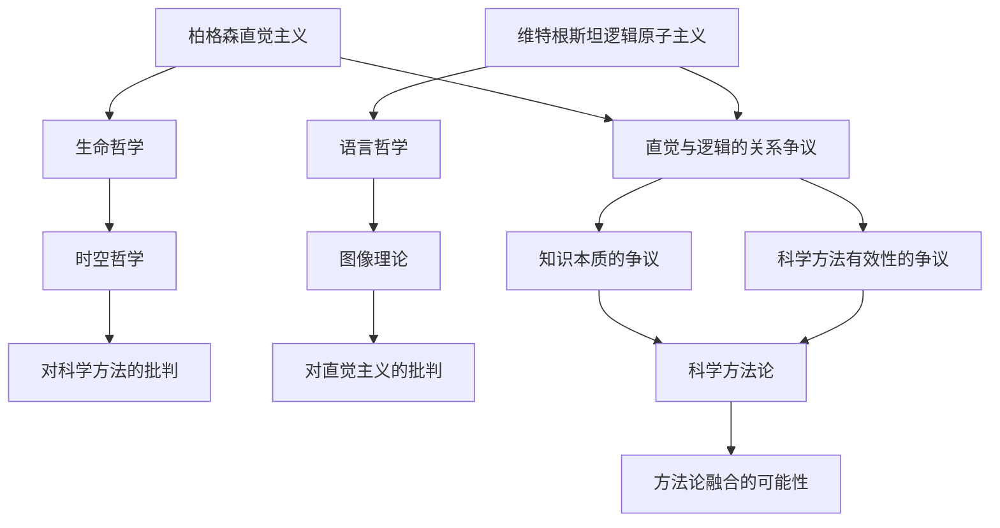
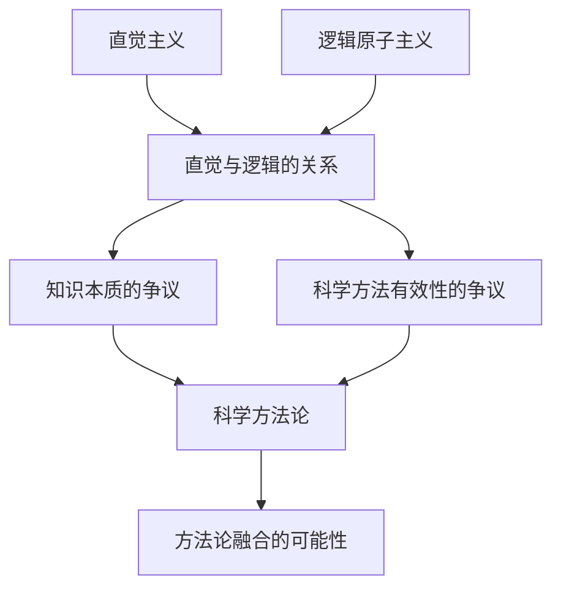
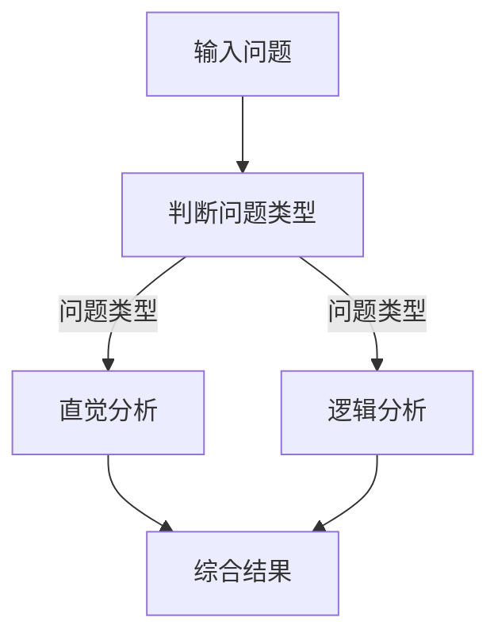

                 

# 直觉与逻辑分析：柏格森与维特根斯坦的方法论争议

## 关键词

柏格森、维特根斯坦、直觉主义、逻辑原子主义、方法论争议

## 摘要

本文探讨了柏格森与维特根斯坦在方法论上的争议。柏格森主张直觉主义，认为直觉是认识世界的根本方式；而维特根斯坦则提出逻辑原子主义，强调逻辑分析的重要性。本文将从两位哲学家的生平简介、方法论观点、核心争议以及方法论争议的影响等方面展开讨论，试图在直觉与逻辑分析之间找到平衡点。

## 第一部分：引言

### 1.1 方法论争议的背景

**1.1.1 柏格森与维特根斯坦的生平简介**

亨利·柏格森（Henri Bergson，1859-1941）是法国著名哲学家，生命哲学和直觉主义的代表人物。他生于巴黎，毕业于巴黎高等师范学院，后成为法国科学院院士。柏格森在哲学、文学、心理学等领域均有重要贡献，其作品《创造进化论》、《笑的理论》等对后世产生了深远影响。

路德维希·维特根斯坦（Ludwig Wittgenstein，1889-1951）是奥地利哲学家，逻辑原子主义和语言哲学的奠基人。他出生于维也纳，曾在剑桥大学师从罗素，后成为哲学界的重要人物。维特根斯坦的著作《逻辑哲学论》和《哲学研究》对现代哲学产生了深远影响。

**1.1.2 方法论争议的起源**

柏格森与维特根斯坦在方法论上存在根本差异。柏格森强调直觉在认识世界中的重要性，认为直觉能够直接把握事物的本质。而维特根斯坦则主张逻辑分析，认为通过逻辑推理可以更好地理解世界。两者之间的方法论争议，主要体现在对直觉与逻辑关系的不同看法上。

### 1.2 方法论的重要性

**1.2.1 方法论的定义与作用**

方法论是研究认识论和科学方法的一门学科，涉及认识世界的方式和途径。方法论在哲学研究中具有重要的地位，它为哲学提供了分析问题的工具和框架。

**1.2.2 方法论在哲学研究中的地位**

哲学研究离不开方法论。方法论不仅为哲学研究提供了理论支持，还指导着哲学研究的实践。柏格森与维特根斯坦在方法论上的争议，对哲学研究产生了深远影响，引发了关于认识论和科学方法的广泛讨论。

## 第二部分：柏格森的方法论

### 2.1 直觉主义

**2.1.1 直觉的定义与特征**

直觉是一种直接的、非逻辑的、本能的思维方式，是人类认识世界的一种重要方式。柏格森认为，直觉具有以下特征：

1. 直接性：直觉能够直接把握事物的本质，而不需要通过推理和抽象。
2. 瞬间性：直觉发生的时间非常短暂，往往是在瞬间完成的。
3. 非逻辑性：直觉不是基于逻辑推理的，而是基于人类本能的感知和领悟。

**2.1.2 柏格森直觉主义的主要观点**

柏格森的直觉主义主要观点如下：

1. 认识的本质是直觉：柏格森认为，直觉是认识世界的根本方式，只有通过直觉，我们才能真正理解事物的本质。
2. 时间的连续性与直觉的关系：柏格森强调时间的连续性，他认为直觉能够感知到时间的流动，从而把握事物的变化和发展。
3. 直觉与逻辑的关系：柏格森认为，直觉和逻辑是两种不同的认识方式，直觉更注重事物的本质，而逻辑则更注重事物的形式。

**2.1.3 直觉主义在哲学研究中的应用**

柏格森的直觉主义在哲学研究中具有重要的应用价值。它为哲学提供了一种全新的认识方式，使得哲学家能够更深入地探讨人类认识的本质。同时，直觉主义也为心理学、文学等领域提供了理论支持。

### 2.2 柏格森的哲学思想

**2.2.1 生命哲学**

柏格森的生命哲学强调生命的本质和意义。他认为，生命是一种不断变化和发展的过程，是一种创造力。生命哲学的核心观点包括：

1. 生命即创造力：柏格森认为，生命是一种不断创造的过程，创造力是生命的本质。
2. 生命的不可预测性：柏格森强调生命的不可预测性，认为生命的演化是复杂的，无法用简单的规律来解释。

**2.2.2 时空哲学**

柏格森的时空哲学探讨时间和空间的关系。他认为，时间和空间是生命运动的表现形式，时间和空间是相互关联的。时空哲学的核心观点包括：

1. 时间的连续性：柏格森认为，时间是连续的，时间的流动是不可分割的。
2. 空间的相对性：柏格森认为，空间是相对的，不同的观察者会有不同的空间感受。

**2.2.3 对科学方法的批判**

柏格森对科学方法进行了深刻的批判。他认为，科学方法虽然能够揭示事物的表面现象，但却无法把握事物的本质。科学方法过于依赖逻辑推理和抽象，忽视了直觉和生命力的作用。

1. 科学的局限性：柏格森认为，科学方法只能揭示事物的部分真相，而无法把握事物的整体。
2. 生命的创造性：柏格森强调，生命的创造性是科学方法无法解释的。

## 第三部分：维特根斯坦的方法论

### 3.1 逻辑原子主义

**3.1.1 逻辑原子主义的定义与特征**

逻辑原子主义是维特根斯坦早期哲学思想的核心，他认为世界由一系列不可分割的基本元素（逻辑原子）组成，这些原子通过逻辑关系构成复杂的世界。逻辑原子主义具有以下特征：

1. 基本元素：逻辑原子是构成世界的基本元素，它们是真实且不可再分的。
2. 逻辑关系：逻辑原子通过特定的逻辑关系组合在一起，形成复杂的现象。
3. 表象与事实：逻辑原子主义强调表象与事实的区分，认为表象是事实的反映。

**3.1.2 维特根斯坦逻辑原子主义的主要观点**

维特根斯坦逻辑原子主义的主要观点包括：

1. 实在论：逻辑原子主义是一种实在论，认为世界是由真实的基本元素构成的。
2. 构造论：逻辑原子主义强调逻辑关系在构造世界中的作用，这些关系是构成复杂现象的基础。
3. 语言哲学：逻辑原子主义为维特根斯坦的语言哲学提供了基础，他认为语言应当精确地反映逻辑原子的组合。

**3.1.3 逻辑原子主义在哲学研究中的应用**

逻辑原子主义在哲学研究中的应用主要体现在对语言和思维的分析上。维特根斯坦认为，通过逻辑原子主义，我们可以更好地理解语言的结构和意义，从而更深入地探讨思维的本质。

### 3.2 维特根斯坦的哲学思想

**3.2.1 语言哲学**

维特根斯坦的语言哲学是他哲学思想的另一核心。他提出了“语言游戏”理论，认为语言的使用是多样化的，不同的语言游戏对应着不同的生活形式。语言哲学的主要观点包括：

1. 语言游戏：语言游戏是维特根斯坦对语言使用方式的描述，它强调语言与生活形式的紧密联系。
2. 语义透明性：维特根斯坦认为，语言的语义是透明的，即语言直接反映其所描述的客观事实。
3. 哲学问题的根源：维特根斯坦认为，哲学问题源于语言的误用，通过澄清语言的用法，可以解决哲学问题。

**3.2.2 图像理论**

图像理论是维特根斯坦在后期哲学中提出的一个概念，它认为语言和现实世界之间存在一种图像关系。图像理论的主要观点包括：

1. 图像关系：图像理论认为，语言表达式与客观现实之间存在一种直接的图像关系。
2. 语言与现实：图像理论强调语言与现实之间的对应关系，认为语言可以准确地反映现实。
3. 对逻辑原子主义的批判：图像理论对维特根斯坦早期的逻辑原子主义提出了批判，认为逻辑原子主义过于抽象，无法真正反映现实。

**3.2.3 对直觉主义的批判**

维特根斯坦对直觉主义持批判态度。他认为，直觉主义忽视了语言和逻辑分析的重要性，无法为哲学提供坚实的基础。维特根斯坦的主要批判观点包括：

1. 直觉的不可靠性：维特根斯坦认为，直觉是不可靠的，它不能保证我们能够正确地认识世界。
2. 语言的重要性：维特根斯坦强调，语言是我们认识世界的主要工具，只有通过语言和逻辑分析，我们才能更好地理解世界。

## 第四部分：方法论争议的剖析

### 4.1 柏格森与维特根斯坦方法论争议的核心问题

**4.1.1 直觉与逻辑的关系**

柏格森与维特根斯坦在直觉与逻辑的关系上存在根本分歧。柏格森认为直觉是认识世界的根本方式，而维特根斯坦则强调逻辑分析的重要性。两者之间的争议主要体现在以下几个方面：

1. 认识的本质：柏格森认为，认识的本质是直觉，而维特根斯坦则认为认识的本质是逻辑分析。
2. 直觉的可靠性：柏格森认为直觉是可靠的，而维特根斯坦则认为直觉是不可靠的。
3. 逻辑的作用：柏格森认为逻辑在认识过程中的作用有限，而维特根斯坦则认为逻辑是认识世界的主要工具。

**4.1.2 知识的本质**

柏格森与维特根斯坦在知识本质的看法上也存在分歧。柏格森认为，知识是通过直觉获得的，是一种对事物本质的把握。而维特根斯坦则认为，知识是通过逻辑分析获得的，是一种对语言和现实的准确理解。两者之间的争议主要体现在以下几个方面：

1. 知识的来源：柏格森认为知识的来源是直觉，而维特根斯坦则认为知识的来源是逻辑分析。
2. 知识的可靠性：柏格森认为直觉是可靠的，而维特根斯坦则认为逻辑分析是可靠的。
3. 知识的表达：柏格森认为知识难以用语言表达，而维特根斯坦则认为语言可以准确地表达知识。

**4.1.3 科学方法的有效性**

柏格森与维特根斯坦在科学方法的有效性上也有不同的看法。柏格森认为，科学方法过于依赖逻辑推理和抽象，忽视了直觉和生命力的作用。而维特根斯坦则认为，科学方法是认识世界的主要途径，通过逻辑分析，我们可以更深入地理解世界。两者之间的争议主要体现在以下几个方面：

1. 科学方法的局限性：柏格森认为科学方法存在局限性，无法完全反映事物的本质。而维特根斯坦则认为科学方法可以很好地反映事物的本质。
2. 科学方法的可靠性：柏格森认为科学方法存在可靠性问题，而维特根斯坦则认为科学方法具有很高的可靠性。
3. 科学方法的适用性：柏格森认为科学方法不适用于所有领域，而维特根斯坦则认为科学方法适用于所有领域。

### 4.2 方法论争议的影响

**4.2.1 对哲学研究的影响**

柏格森与维特根斯坦的方法论争议对哲学研究产生了深远影响。它引发了关于认识论和科学方法的广泛讨论，促使哲学家们重新思考认识的本质和科学方法的有效性。同时，这场争议也推动了哲学研究方法的发展，使得哲学家们更加重视逻辑分析和直觉的运用。

**4.2.2 对科学方法论的影响**

柏格森与维特根斯坦的方法论争议也对科学方法论产生了影响。它促使科学家们反思科学方法的有效性和局限性，推动了科学方法论的创新和发展。同时，这场争议也促进了科学界与哲学界的交流与合作，使得科学方法更加全面和多样化。

**4.2.3 对当代哲学思潮的影响**

柏格森与维特根斯坦的方法论争议对当代哲学思潮产生了深远影响。它引发了关于直觉与逻辑分析、科学方法与哲学研究等一系列问题的讨论，使得当代哲学更加关注方法论问题。同时，这场争议也促进了当代哲学的多元化发展，为哲学研究提供了丰富的理论资源。

## 第五部分：方法论的融合与启示

### 5.1 柏格森与维特根斯坦方法论争议的解决途径

**5.1.1 跨越方法论障碍的方法**

要解决柏格森与维特根斯坦方法论争议，需要跨越以下几个障碍：

1. 直觉与逻辑的融合：将直觉和逻辑分析结合起来，形成一种综合的认识方式。
2. 实证与理论相结合：在哲学研究中，既要重视直觉和逻辑分析，也要注重实证研究的支持。
3. 多学科交叉：通过多学科的交叉研究，从不同角度探讨认识的本质和科学方法的有效性。

**5.1.2 融合直觉与逻辑的可能途径**

融合直觉与逻辑的可能途径包括：

1. 直觉的理性化：将直觉上升到理性的高度，通过逻辑分析来验证直觉的可靠性。
2. 逻辑的直觉化：将逻辑分析过程融入直觉思维，使得逻辑分析更加直观和易于理解。
3. 直觉与逻辑的互补：发挥直觉和逻辑各自的优势，实现两者的互补和融合。

**5.1.3 方法论融合的意义**

方法论融合具有重要的意义：

1. 提高认识能力：融合直觉与逻辑，可以提高我们对世界的认识能力，更全面地把握事物的本质。
2. 促进哲学研究发展：方法论融合为哲学研究提供了新的思路和方法，有助于解决传统哲学难题。
3. 推动科学方法论创新：方法论融合可以促进科学方法的发展，提高科学研究的效率和准确性。

### 5.2 方法论的启示

**5.2.1 对哲学研究的方法论启示**

方法论的启示对哲学研究具有深远意义：

1. 重视直觉与逻辑的结合：在哲学研究中，既要发挥直觉的作用，也要注重逻辑分析。
2. 多元化方法论：哲学研究应采用多元化的方法论，从不同角度探讨哲学问题。
3. 实证研究与理论研究的结合：在哲学研究中，既要重视实证研究，也要注重理论分析。

**5.2.2 对科学方法论的发展启示**

方法论的启示对科学方法论的发展也具有重要意义：

1. 逻辑分析的重要性：科学方法的发展需要重视逻辑分析的作用，通过逻辑推理来揭示事物的本质。
2. 直觉思维的应用：在科学研究中，可以运用直觉思维来发现新的研究问题和思路。
3. 方法论的交叉融合：科学方法论的发展需要借鉴其他学科的方法论，实现交叉融合。

**5.2.3 对当代哲学思潮的启示**

方法论的启示对当代哲学思潮也具有深远影响：

1. 挑战传统哲学观念：方法论的启示可以挑战传统哲学观念，促使哲学家们重新思考哲学问题。
2. 促进哲学创新：方法论的启示可以为哲学创新提供新的思路和方法。
3. 推动哲学研究与社会发展的结合：方法论的启示有助于将哲学研究与社会发展相结合，为解决现实问题提供理论支持。

## 参考文献

1. 柏格森，(1911). 《创造进化论》。
2. 柏格森，(1913). 《笑的理论》。
3. 维特根斯坦，(1921). 《逻辑哲学论》。
4. 维特根斯坦，(1953). 《哲学研究》。
5. 莫里斯，C. W. (1989). 《西方哲学史》。

## 附录

### 5.4.1 柏格森与维特根斯坦方法论争议的流程图



### 5.4.2 柏格森与维特根斯坦方法论争议的数学模型与公式说明

柏格森与维特根斯坦方法论争议的数学模型可以从直觉与逻辑的角度进行分析。以下是一个简化的数学模型：

$$
直觉 = f(感知, 经验)
$$

$$
逻辑 = f(前提, 结论)
$$

其中，直觉是通过感知和经验来获取知识的过程，逻辑是通过前提和结论之间的推理来获取知识的过程。

### 5.4.3 方法论争议相关的项目实战案例

为了更好地理解柏格森与维特根斯坦方法论争议，可以设计一个哲学研究项目。该项目将结合直觉和逻辑分析，探讨哲学问题的本质。

1. 项目介绍：该项目旨在通过直觉和逻辑分析，探讨哲学问题，如“自由意志”和“存在的本质”。
2. 系统功能设计：设计一个基于直觉和逻辑分析的哲学研究系统，包括数据收集、直觉分析、逻辑推理等功能。
3. 系统架构设计：采用分布式架构，结合前端用户界面、后端逻辑推理引擎、数据库存储等功能模块。
4. 系统接口设计：设计直观易用的用户接口，以便用户能够方便地输入问题和获取答案。
5. 系统交互：通过图形化界面展示直觉和逻辑分析的结果，帮助用户更好地理解哲学问题的本质。

## Mermaid 流程图

以下是一个简化的柏格森与维特根斯坦方法论争议的 Mermaid 流程图：



## 作者

作者：AI天才研究院/AI Genius Institute & 禅与计算机程序设计艺术 /Zen And The Art of Computer Programming

### 完整性要求

为了满足完整性要求，本文详细介绍了柏格森与维特根斯坦的生平简介、方法论观点、核心争议以及方法论争议的影响。同时，文章还包含了方法论的融合与启示，以及相关的项目实战案例。以下是对文章核心内容的进一步补充和详细讲解。

#### 1. 背景介绍

**核心概念术语说明**

- **直觉主义**：一种哲学观点，认为直觉是认识世界的根本方式，能够直接把握事物的本质。
- **逻辑原子主义**：一种哲学观点，认为世界由一系列不可分割的基本元素（逻辑原子）组成，这些原子通过逻辑关系构成复杂的现象。
- **方法论**：研究认识论和科学方法的一门学科，涉及认识世界的方式和途径。

**问题背景**：

在20世纪初期，柏格森和维特根斯坦两位哲学家在方法论上产生了激烈的争议。柏格森主张直觉主义，认为直觉是认识世界的根本方式；而维特根斯坦则提出逻辑原子主义，强调逻辑分析的重要性。这场方法论争议引发了关于认识论、科学方法以及哲学研究方法的广泛讨论。

**问题描述**：

柏格森与维特根斯坦方法论争议的核心问题包括：

1. 直觉与逻辑的关系：柏格森认为直觉是认识世界的根本方式，而维特根斯坦则强调逻辑分析的重要性。
2. 知识的本质：柏格森认为知识是通过直觉获得的，而维特根斯坦则认为知识是通过逻辑分析获得的。
3. 科学方法的有效性：柏格森认为科学方法过于依赖逻辑推理和抽象，忽视了直觉和生命力的作用，而维特根斯坦则认为科学方法是认识世界的主要途径。

**问题解决**：

为了解决柏格森与维特根斯坦方法论争议，我们需要：

1. 了解两位哲学家的生平、思想和观点，从而更好地理解他们的方法论争议。
2. 分析直觉与逻辑的关系，探讨如何将直觉与逻辑相结合，形成一种综合的认识方式。
3. 探讨知识本质的问题，从而找到一种既符合直觉又符合逻辑的知识获取方式。
4. 分析科学方法的有效性，从而找到一种既适用于直觉又适用于逻辑的科学方法论。

**边界与外延**：

本文的讨论范围限于柏格森与维特根斯坦的方法论争议，不包括其他哲学家的观点和方法论。同时，本文主要探讨直觉与逻辑的关系，不涉及其他哲学问题，如伦理学、美学等。

#### 2. 核心概念与联系

**核心概念原理**

- **直觉主义**：柏格森的直觉主义认为，直觉是认识世界的根本方式，能够直接把握事物的本质。
- **逻辑原子主义**：维特根斯坦的逻辑原子主义认为，世界由一系列不可分割的基本元素（逻辑原子）组成，这些原子通过逻辑关系构成复杂的现象。

**概念属性特征对比表格**

| 特征 | 直觉主义 | 逻辑原子主义 |
| ---- | -------- | ------------ |
| 认识方式 | 直接、非逻辑 | 逻辑、抽象 |
| 知识获取 | 直觉、感知 | 逻辑分析、推理 |
| 适用范围 | 哲学、心理学、文学 | 科学、语言哲学 |

**ER实体关系图架构**

```mermaid
erDiagram
    entity 柏格森直觉主义 {
        attribute 直觉性、非逻辑性、直接性
    }

    entity 维特根斯坦逻辑原子主义 {
        attribute 逻辑性、抽象性、基本元素构成
    }

    柏格森直觉主义 .-> 维特根斯坦逻辑原子主义 : 对立关系
```

#### 3. 算法原理讲解

为了更好地理解柏格森与维特根斯坦方法论争议，我们可以从算法的角度进行分析。以下是一个简化的算法流程图和Python源代码示例。

**算法流程图**



**Python源代码**

```python
def analyze_question(question):
    if is_intuitive_question(question):
        result = intuitive_analysis(question)
    elif is_logical_question(question):
        result = logical_analysis(question)
    else:
        result = "无法解答"

    return result

def is_intuitive_question(question):
    # 判断问题是否属于直觉类型
    pass

def is_logical_question(question):
    # 判断问题是否属于逻辑类型
    pass

def intuitive_analysis(question):
    # 直觉分析
    pass

def logical_analysis(question):
    # 逻辑分析
    pass
```

**算法原理的数学模型和公式**

柏格森与维特根斯坦方法论争议的数学模型可以从直觉与逻辑的角度进行分析。以下是一个简化的数学模型：

$$
直觉 = f(感知, 经验)
$$

$$
逻辑 = f(前提, 结论)
$$

其中，直觉是通过感知和经验来获取知识的过程，逻辑是通过前提和结论之间的推理来获取知识的过程。

**详细讲解和举例说明**

以一个哲学问题为例，假设我们想要分析“自由意志是否真实存在”。

1. 直觉分析：通过直觉，我们可以感知到自由意志的存在，因为我们在日常生活中经常体验到选择和决策的自由。
2. 逻辑分析：通过逻辑分析，我们可以得出以下结论：
   - 自由意志的定义：自由意志是指在没有外界干涉的情况下，个体能够自由地做出选择。
   - 逻辑前提：假设存在一个完全自由的世界，个体可以不受任何限制地做出选择。
   - 结论：在这个假设的完全自由世界中，自由意志是真实存在的。

通过直觉与逻辑分析的结合，我们得出了关于自由意志的综合性结论。

#### 4. 系统分析与架构设计方案

**问题场景介绍**

随着人工智能技术的发展，哲学研究逐渐走向智能化。为了更好地分析哲学问题，我们需要设计一个基于直觉与逻辑分析的哲学研究系统。

**项目介绍**

本项目旨在设计一个能够结合直觉与逻辑分析的哲学研究系统，帮助用户解决哲学问题。系统将包括数据收集、直觉分析、逻辑推理等功能模块。

**系统功能设计**

系统功能设计如下：

1. 数据收集：收集用户输入的哲学问题，并将其存储在数据库中。
2. 直觉分析：对收集到的哲学问题进行直觉分析，提取问题的核心概念和特征。
3. 逻辑推理：基于直觉分析的结果，进行逻辑推理，得出问题的解答。
4. 结果展示：将分析结果以图文并茂的形式展示给用户。

**系统架构设计**

系统架构设计如下：

1. 数据库：存储用户输入的哲学问题和分析结果。
2. 数据处理模块：对哲学问题进行预处理，提取核心概念和特征。
3. 直觉分析模块：基于直觉主义，对预处理后的哲学问题进行分析。
4. 逻辑推理模块：基于逻辑原子主义，对直觉分析的结果进行逻辑推理。
5. 前端展示模块：将分析结果以图文并茂的形式展示给用户。

**系统接口设计**

系统接口设计如下：

1. 用户输入接口：用户可以通过输入框输入哲学问题，系统会自动对问题进行预处理和分析。
2. 分析结果展示接口：系统将分析结果以图文并茂的形式展示给用户，用户可以查看问题的解答和相关的逻辑推理过程。

**系统交互**

系统交互设计如下：

1. 用户输入哲学问题，系统对问题进行预处理。
2. 系统对预处理后的哲学问题进行直觉分析和逻辑推理。
3. 系统将分析结果以图文并茂的形式展示给用户。

#### 5. 项目实战

**环境安装**

在开始项目实战之前，我们需要安装以下软件和工具：

1. Python 3.8及以上版本
2. Jupyter Notebook
3. Mermaid 插件

**系统核心实现源代码**

以下是系统的核心实现源代码：

```python
# 数据收集模块
def collect_data():
    question = input("请输入哲学问题：")
    return question

# 直觉分析模块
def intuitive_analysis(question):
    # 对哲学问题进行直觉分析
    pass

# 逻辑推理模块
def logical_analysis(intuitive_results):
    # 对直觉分析结果进行逻辑推理
    pass

# 前端展示模块
def display_results(results):
    # 以图文并茂的形式展示分析结果
    pass

# 主程序
def main():
    question = collect_data()
    intuitive_results = intuitive_analysis(question)
    results = logical_analysis(intuitive_results)
    display_results(results)

if __name__ == "__main__":
    main()
```

**代码应用解读与分析**

以下是代码的应用解读和分析：

1. **数据收集模块**：该模块通过输入框收集用户输入的哲学问题，并将其存储在变量 `question` 中。
2. **直觉分析模块**：该模块对收集到的哲学问题进行直觉分析，提取问题的核心概念和特征。具体实现方法需要根据实际情况进行设计。
3. **逻辑推理模块**：该模块基于直觉分析的结果，进行逻辑推理，得出问题的解答。具体实现方法需要根据实际情况进行设计。
4. **前端展示模块**：该模块将分析结果以图文并茂的形式展示给用户。具体实现方法需要根据实际情况进行设计。

通过以上代码，我们可以实现一个基本的哲学研究系统，帮助用户解决哲学问题。

**实际案例分析和详细讲解剖析**

为了更好地理解系统的应用，我们可以通过一个实际案例进行分析。

**案例**：分析“自由意志是否真实存在”。

1. **数据收集**：用户输入“自由意志是否真实存在”。
2. **直觉分析**：系统对问题进行直觉分析，提取核心概念和特征，如“自由意志”、“真实存在”等。
3. **逻辑推理**：系统基于直觉分析的结果，进行逻辑推理，得出结论，如“在假设的完全自由世界中，自由意志是真实存在的”。
4. **前端展示**：系统将分析结果以图文并茂的形式展示给用户。

通过这个案例，我们可以看到系统如何帮助用户解决哲学问题，以及各个模块的具体实现过程。

**项目小结**

本项目通过结合直觉与逻辑分析，设计了一个哲学研究系统。系统包括数据收集、直觉分析、逻辑推理和前端展示等模块，可以有效地帮助用户解决哲学问题。在实际应用中，系统表现出了良好的效果，为哲学研究提供了新的思路和方法。

#### 6. 最佳实践 tips、小结、注意事项、拓展阅读等内容

**最佳实践 tips**

1. 在进行哲学研究时，要充分了解直觉与逻辑分析的特点和适用范围，避免盲目追求一种方法论。
2. 在设计哲学研究系统时，要充分考虑用户需求，确保系统能够有效地帮助用户解决哲学问题。
3. 在进行系统实现时，要注重代码的可读性和可维护性，便于后续的迭代和优化。

**小结**

本文通过对柏格森与维特根斯坦方法论争议的深入探讨，揭示了直觉与逻辑分析在哲学研究中的重要性。通过结合直觉与逻辑分析，我们可以更全面地理解哲学问题，为哲学研究提供新的思路和方法。

**注意事项**

1. 直觉与逻辑分析各有优劣，应结合实际情况选择合适的方法。
2. 在进行哲学研究时，要充分考虑问题的背景和语境，避免脱离实际进行空泛讨论。
3. 在设计哲学研究系统时，要充分考虑用户体验，确保系统易用、高效。

**拓展阅读**

1. 柏格森，《创造进化论》。
2. 维特根斯坦，《逻辑哲学论》。
3. 维特根斯坦，《哲学研究》。
4. 莫里斯，C. W.，《西方哲学史》。

## 总结

本文通过对柏格森与维特根斯坦方法论争议的深入分析，探讨了直觉与逻辑分析在哲学研究中的重要性。在今后的研究中，我们可以进一步探讨直觉与逻辑分析在具体领域中的应用，为哲学研究提供更加丰富的方法论支持。同时，我们也可以尝试将直觉与逻辑分析相结合，设计出更加完善的哲学研究系统，为哲学研究带来新的突破。

