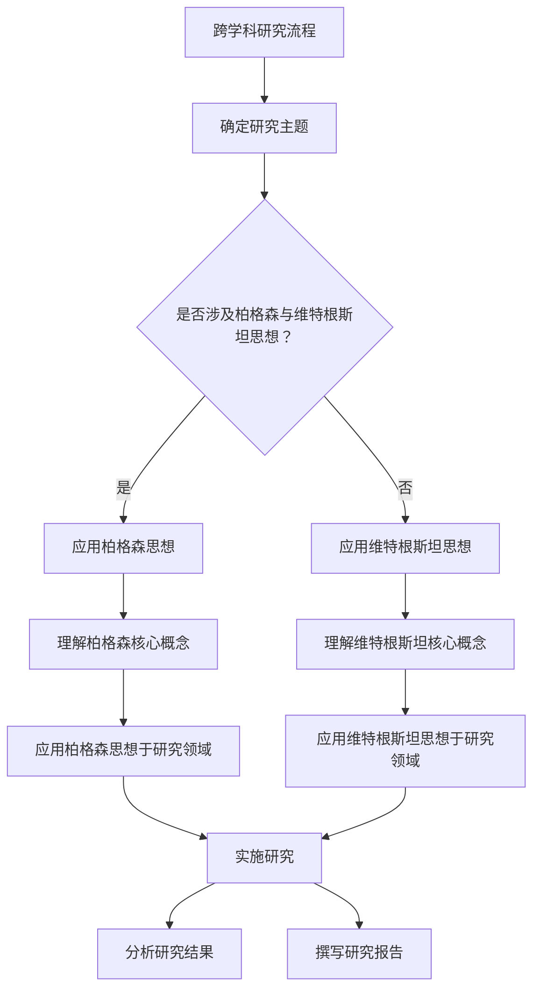

                 

# 直觉与逻辑：柏格森与维特根斯坦的科学哲学在跨学科研究中的应用

> 关键词：柏格森，维特根斯坦，科学哲学，跨学科研究，直觉，逻辑

> 摘要：本文旨在探讨柏格森与维特根斯坦的科学哲学在跨学科研究中的应用。通过分析两位哲学家的核心思想，本文探讨了直觉与逻辑在科学探究中的重要性，并探讨了这些思想如何应用于生物学、计算机科学、心理学、教育、社会科学和工程学等领域。文章以逻辑清晰、结构紧凑、简单易懂的方式，逐步分析了柏格森与维特根斯坦的科学哲学在跨学科研究中的应用，为相关领域的研究提供了新的视角。

## 引言

在科学哲学的历史长河中，柏格森与维特根斯坦两位哲学家以其独特的科学哲学思想对多个学科领域产生了深远的影响。柏格森（Henri Bergson）是20世纪初的法国哲学家，他的直觉主义和生命冲动理论在生物学、心理学、哲学等领域得到了广泛应用。维特根斯坦（Ludwig Wittgenstein）是20世纪最有影响力的哲学家之一，他的图像理论、语言游戏等概念在计算机科学、逻辑学等领域具有重大意义。

本文将从以下七个章节入手，详细探讨柏格森与维特根斯坦的科学哲学在跨学科研究中的应用：

1. **柏格森与维特根斯坦的科学哲学概述**：介绍两位哲学家的生平、哲学背景和主要思想。
2. **柏格森的科学哲学在跨学科研究中的应用**：探讨柏格森的思想在生物学和计算机科学中的应用。
3. **维特根斯坦的科学哲学在跨学科研究中的应用**：分析维特根斯坦的思想在计算机科学、心理学和工程学中的应用。
4. **柏格森与维特根斯坦的科学哲学在心理学研究中的应用**：结合心理学领域的实证研究，探讨柏格森与维特根斯坦思想的融合。
5. **柏格森与维特根斯坦的科学哲学在教育研究中的应用**：分析直觉与逻辑在教育方法中的应用。
6. **柏格森与维特根斯坦的科学哲学在社会科学研究中的应用**：探讨维特根斯坦的语言哲学在社会学领域的应用。
7. **总结与展望**：总结柏格森与维特根斯坦的科学哲学在跨学科研究中的应用，并展望未来跨学科研究的趋势。

本文将以逻辑清晰、结构紧凑、简单易懂的方式，逐步分析柏格森与维特根斯坦的科学哲学在跨学科研究中的应用，旨在为相关领域的研究提供新的视角和启示。

## 第1章：柏格森与维特根斯坦的科学哲学概述

### 1.1 柏格森的科学哲学

#### 1.1.1 柏格森的生平与哲学背景

亨利·柏格森（Henri Bergson，1859-1941）是20世纪初的法国哲学家，他的思想对现代哲学、生物学、心理学等领域产生了深远的影响。柏格森出生于法国巴黎，他在巴黎高等师范学院学习期间，接受了严谨的哲学和科学训练。毕业后，柏格森在巴黎大学担任教授，并发表了多部哲学著作，包括《创造力的人》（L'Évolution créatrice，1907）、《笑》（La Rire，1900）和《形而上学导论》（Introduction à la métaphysique，1932）等。

柏格森的哲学思想主要受到了他的导师孔德（Auguste Comte）和斯宾塞（Herbert Spencer）的影响，他试图将生物学和心理学的方法应用于哲学研究，从而提出了直觉主义和生命冲动等重要概念。

#### 1.1.2 柏格森的主要哲学思想

**直觉主义**

柏格森认为，直觉是人类认知世界的基本方式，它超越了逻辑推理和语言符号。直觉是一种直接的、无意识的、深刻的感知，能够捕捉到事物的本质和生命的活力。柏格森强调，直觉是一种非理性的、创造性的力量，它能够让我们洞察到事物的内在联系和动态变化。

**生命冲动**

柏格森的生命冲动（élan vital）理论是他对生命本质的描述。生命冲动是一种内在的、自发的动力，是生命的源泉和本质。它是一种无法用物理定律解释的活力，是生命的不断创造和进化。柏格森认为，生命冲动是生命的基本特征，它是生命的本质和动力。

**实证主义与直觉主义的区别**

柏格森与实证主义哲学有所不同，他认为实证主义过分依赖于经验和观察，忽视了直觉和创造性的重要性。实证主义强调科学方法的客观性和普遍性，而柏格森则认为科学方法不能完全捕捉到生命的本质和多样性。他主张通过直觉来理解和探索世界的本质。

### 1.2 维特根斯坦的科学哲学

#### 1.2.1 维特根斯坦的生平与哲学背景

路德维希·维特根斯坦（Ludwig Wittgenstein，1889-1951）是20世纪最有影响力的哲学家之一，他的思想对语言哲学、逻辑学、数学哲学等领域产生了深远的影响。维特根斯坦出生于奥地利，他在数学和哲学领域接受了严格的训练。他在剑桥大学学习期间，与罗素（Bertrand Russell）和摩尔（G.E. Moore）等哲学家建立了联系，并开始了自己的哲学研究。

维特根斯坦的哲学思想经历了两个主要阶段，早期他关注逻辑和语言的哲学问题，提出了图像理论和语言游戏等概念；晚期他转向日常语言哲学，强调语言在日常生活中的实际应用。

#### 1.2.2 维特根斯坦的主要哲学思想

**图像理论**

维特根斯坦的图像理论（Image Theory）是他对语言和世界之间关系的描述。他认为，语言与世界的关系类似于一幅图像与物体之间的关系。语言符号代表现实世界中的事物，但它们并不是直接反映现实，而是通过图像来模拟现实。图像理论强调了语言的符号性和抽象性。

**命题符号与语言游戏**

维特根斯坦提出了命题符号（Propositional Sign）和语言游戏（Language Game）的概念。命题符号是语言中的基本单位，它代表一个事实或命题。语言游戏是指人们在特定情境下使用语言的方式，它包含了各种规则和语境。维特根斯坦认为，理解语言的关键在于理解语言游戏，而语言游戏的不同形式反映了人们在不同情境下的思维方式。

通过分析柏格森与维特根斯坦的科学哲学思想，我们可以看到两位哲学家在直觉与逻辑方面的重要贡献。柏格森强调直觉在认知世界中的重要性，而维特根斯坦则通过语言游戏的概念揭示了逻辑和语言在日常生活中的应用。这些思想为跨学科研究提供了丰富的哲学基础，为我们理解科学探究的本质和方法提供了新的视角。

## 第2章：柏格森的科学哲学在跨学科研究中的应用

### 2.1 柏格森的科学哲学在生物学研究中的应用

柏格森的科学哲学，尤其是他的直觉主义和生命冲动理论，为生物学研究提供了独特的视角和方法。直觉主义强调直觉在认知过程中的作用，而生命冲动则揭示了生命力的本质和动态特性。以下将详细探讨柏格森的这些思想在生物学研究中的具体应用。

#### 2.1.1 生命科学的直觉方法

直觉在生物学研究中起着至关重要的作用。许多生物学家在研究复杂系统时，往往需要依赖直觉来识别和解决关键问题。例如，在进化生物学中，生物学家通过直觉来识别物种间的相似性和差异性，从而推断出物种的进化关系。此外，在生态学研究中，生物学家常常通过直觉来识别生态系统中的关键过程和物种相互作用。

一个典型的实例是生物学家理查德·道金斯（Richard Dawkins）在其著作《自私的基因》中提出的“共生”概念。道金斯通过直觉认识到，基因之间的互动和合作是生命进化过程中的关键因素，这一观点极大地推动了生物学研究的发展。

#### 2.1.2 柏格森的生命冲动理论与现代生物进化论

柏格森的生命冲动理论为现代生物进化论提供了重要的启示。现代生物进化论的核心是自然选择和遗传机制，而柏格森的生命冲动则强调了生命的内在动力和创造性。柏格森认为，生命冲动是一种内在的、自发的力量，它推动了生命的不断变化和进化。

这一观点与现代生物进化论中的“突变”概念有相似之处。突变是生物进化过程中的一种关键机制，它通过引入新的遗传变异，为自然选择提供了原材料。柏格森的生命冲动理论强调了突变的重要性和内在驱动力，这与现代生物进化论的结论不谋而合。

例如，生物学家朱利安·赫胥黎（Julian Huxley）在其著作《人类的未来》中提到，生物进化是一种内在动力驱动的过程，这种动力源于生命的本质和冲动。赫胥黎的观点与柏格森的生命冲动理论有共同之处，都强调了生命力的内在驱动作用。

#### 2.1.2.1 生命冲动与进化理论的关联

柏格森的生命冲动理论与现代生物进化论的关联在于，它们都试图解释生命力的本质和进化过程。现代生物进化论通过自然选择和遗传机制来解释物种的进化，而柏格森则通过生命冲动来描述生命力的内在动力。

例如，在物种分化研究中，生物学家通过观察物种间的遗传差异，推断出物种的进化路径。这种研究方法与柏格森的生命冲动理论有相似之处，都试图从生命的内在动力来解释物种的分化过程。

总的来说，柏格森的科学哲学为生物学研究提供了独特的视角和方法。他的直觉主义和生命冲动理论为理解生命的本质和进化过程提供了重要的启示，这些思想在生物学研究中得到了广泛应用。通过结合现代生物学理论和柏格森的哲学思想，我们可以更深入地理解生命的复杂性和多样性。

### 2.2 维特根斯坦的科学哲学在计算机科学中的应用

维特根斯坦的科学哲学，尤其是他的图像理论和语言游戏概念，在计算机科学领域产生了深远的影响。图像理论揭示了语言与世界的模拟关系，而语言游戏则提供了理解语言使用情境的方法。以下将详细探讨维特根斯坦的这些思想在计算机科学中的应用。

#### 2.2.1 语言游戏理论与计算机语言的构建

维特根斯坦的语言游戏理论为计算机语言的构建提供了重要的哲学基础。计算机语言是人与计算机之间进行交流的工具，它的设计需要考虑如何准确地模拟现实世界的逻辑和规则。维特根斯坦的语言游戏概念揭示了语言与世界的关联，从而为计算机语言的设计提供了指导。

例如，在编程语言设计过程中，开发者需要考虑如何将现实世界的问题抽象为计算机可以处理的模型。这种抽象过程与维特根斯坦的语言游戏相似，都是将现实世界的问题转化为符号系统，以便于计算机处理。

一个典型的实例是编程语言中的条件语句（if-else）。条件语句是根据某个条件来选择执行不同的代码块。这种逻辑结构与维特根斯坦的图像理论中的条件模拟非常相似，都是通过符号系统来模拟现实世界的逻辑关系。

#### 2.2.1.1 语言游戏在编程语言设计中的应用

语言游戏在编程语言设计中的应用主要体现在对编程语言的语法和语义设计上。编程语言的语法规则定义了程序的结构和语法形式，而语义规则则定义了程序的行为和意义。维特根斯坦的语言游戏理论为这些设计提供了哲学基础。

例如，在Python编程语言中，开发者可以定义自定义函数，这是一种典型的语言游戏应用。自定义函数允许开发者将现实世界的问题抽象为Python中的符号表示，从而方便地实现和解决复杂问题。

一个具体的例子是，假设我们想要编写一个计算两个数字之和的程序。我们可以在Python中定义一个函数`add(a, b)`，该函数接受两个参数`a`和`b`，并返回它们的和。这个函数的定义和应用过程就是一个语言游戏，它将数学中的加法运算抽象为Python中的函数调用。

```python
def add(a, b):
    return a + b

result = add(3, 4)
print(result)  # 输出：7
```

在这个例子中，`add` 函数是一个语言游戏，它将数学中的加法运算转化为Python中的函数调用，从而实现了对加法运算的模拟。

#### 2.2.2 图像理论与计算机视觉

图像理论在计算机视觉领域也有广泛的应用。计算机视觉是人工智能的一个分支，它致力于使计算机能够理解和处理图像信息。维特根斯坦的图像理论为理解图像与客观世界之间的关系提供了哲学基础。

例如，在计算机视觉中，图像识别算法需要将图像中的像素转换为对实际物体的识别。这种转换过程与维特根斯坦的图像理论非常相似，都是将图像转化为对现实世界的符号表示。

一个典型的实例是卷积神经网络（Convolutional Neural Network, CNN）在图像识别中的应用。CNN通过多层卷积和池化操作，从图像中提取特征，并最终分类为不同的物体。这个过程可以看作是将图像转化为对现实世界的符号表示，从而实现图像识别。

总的来说，维特根斯坦的科学哲学在计算机科学中有着广泛的应用。他的图像理论和语言游戏概念为编程语言设计、计算机视觉等领域提供了哲学基础。通过理解这些哲学思想，我们可以更好地理解和设计计算机系统，从而推动计算机科学的发展。

### 2.3 柏格森的科学哲学在心理学研究中的应用

柏格森的科学哲学，特别是他的直觉主义和生命冲动理论，为心理学研究提供了新的视角和方法。直觉主义强调直觉在认知过程中的作用，而生命冲动则揭示了心理活动的动态特性。以下将详细探讨柏格森的这些思想在心理学研究中的应用。

#### 3.1 直觉主义心理学

直觉主义心理学认为，直觉是心理活动的基础，它超越了逻辑推理和语言符号。柏格森认为，直觉是一种直接的、深刻的感知，能够捕捉到心理活动的真实状态。直觉主义心理学试图通过直接观察和体验心理现象，揭示人类认知的本质。

一个典型的实例是威廉·詹姆斯（William James）的《心理学原理》（Principles of Psychology，1890）。詹姆斯是19世纪末20世纪初著名的心理学家，他深受柏格森直觉主义的影响。在《心理学原理》中，詹姆斯强调直觉在认知过程中的重要性，认为直觉是一种无意识的、直觉性的认知过程。

例如，詹姆斯提到，人们在面对复杂情境时，往往能够迅速作出判断和决策，这种能力来源于直觉。他通过实验和案例研究，探讨了直觉在感知、记忆、情感和决策等心理过程中的作用。

#### 3.1.1 直觉主义心理学的实证研究

直觉主义心理学的实证研究主要集中在直觉在决策和问题解决中的应用。许多研究表明，直觉在许多情境下是一种高效、可靠的认知策略。以下是一些具体的实证研究实例：

1. **直觉决策**

在决策研究中，研究人员通过实验发现，人们在面对复杂决策时，往往能够迅速作出高质量的判断。这些判断依赖于直觉，而非逻辑推理。例如，研究人员发现，医生在诊断疾病时，常常能够通过直觉迅速识别出关键症状，从而作出准确的诊断。

2. **直觉问题解决**

在问题解决研究中，研究人员发现，直觉在许多情境下是解决问题的关键。例如，数学家在解决数学问题时，往往能够迅速找到解决方案，这种能力依赖于直觉。研究表明，直觉可以帮助人们快速识别问题结构，找到有效的解决策略。

3. **直觉创造力**

在创造力研究中，研究人员发现，直觉在艺术创作、科学发现和创新过程中起着重要作用。艺术家和科学家在创作和发现过程中，往往能够通过直觉捕捉到新的灵感，从而推动创造性思维的发展。

#### 3.2 维特根斯坦的语言哲学与心理学

维特根斯坦的语言哲学，特别是他的语言游戏概念，为理解心理活动提供了新的视角。维特根斯坦认为，语言是一种游戏，它的意义和作用取决于特定的使用情境。这一观点可以应用于心理学研究，帮助我们理解心理现象的语言表达和实际应用。

例如，在心理治疗中，治疗师和患者之间的对话可以看作是一种语言游戏。治疗师通过提问和引导，帮助患者表达内心的感受和想法。这种对话过程不仅有助于患者理解自己，还能够促进心理问题的解决。

#### 3.3 心理学中的柏格森与维特根斯坦思想融合

柏格森与维特根斯坦的科学哲学在心理学研究中具有互补性。柏格森的直觉主义强调了直觉在认知过程中的重要性，而维特根斯坦的语言游戏概念揭示了语言与心理活动的关联。以下是一些心理学研究中的跨学科应用实例：

1. **直觉与语言的关系**

心理学研究探讨了直觉与语言表达之间的关系。研究表明，直觉在语言表达中起着重要作用，能够帮助我们更准确地描述心理体验。例如，人们在描述情绪体验时，往往能够通过直觉找到合适的词汇和表达方式。

2. **语言游戏在心理治疗中的应用**

在心理治疗中，语言游戏的概念被应用于理解和处理患者的心理问题。治疗师通过引导患者进行语言游戏，帮助他们表达内心的感受和想法。这种方法不仅有助于患者更好地理解自己，还能够促进心理问题的解决。

3. **跨学科研究案例**

一个跨学科研究案例是心理学家乔治·米勒（George A. Miller）的《人类的记忆：信息加工的观点》（The Magical Number Seven, Plus or Minus Two，1956）。米勒通过实验研究发现，人类的短期记忆容量约为7±2个信息单元。这一发现揭示了人类记忆的认知机制，为心理学研究提供了重要启示。同时，米勒的研究也反映了柏格森与维特根斯坦思想在心理学研究中的融合，既关注直觉的认知过程，又关注语言表达的实际应用。

总的来说，柏格森与维特根斯坦的科学哲学在心理学研究中具有广泛的应用。他们的思想为理解心理现象提供了新的视角和方法，促进了心理学研究的深入和发展。

### 4.1 柏格森的科学哲学在教育研究中的应用

柏格森的科学哲学，特别是他的直觉主义和生命冲动理论，在教育研究中具有重要的应用价值。直觉主义强调直觉在认知和学习过程中的作用，而生命冲动则揭示了教育过程中的动态特性。以下将详细探讨柏格森的这些思想在教育方法中的应用。

#### 4.1.1 直觉在教育方法中的应用

直觉主义在教育中提倡通过直接体验和直觉来促进学习。这种方法认为，学习不仅是知识的积累，更是一个动态的、创造性的过程。柏格森认为，直觉能够帮助我们直接感知和理解事物的本质，从而更有效地进行学习。

一个典型的实例是探究式学习（Inquiry-based Learning）。在探究式学习中，学生通过提出问题、收集信息、分析数据和形成结论来进行学习。这种方法强调学生的主动参与和直觉思维，帮助他们更好地理解和掌握知识。

例如，在科学课程中，教师可以设计探究活动，让学生通过实验和观察来探究科学现象。这种方法不仅能够提高学生的科学素养，还能够培养他们的直觉思维和创新能力。

#### 4.1.1.1 直觉教学方法在实践中的应用

直觉教学方法在实践中的应用可以体现在以下几个方面：

1. **项目式学习**

项目式学习（Project-based Learning）是一种以项目为中心的学习方式，学生通过完成实际项目来学习和应用知识。这种方法强调学生的主动参与和直觉思维，帮助他们将理论知识与实际应用相结合。

例如，在历史课程中，学生可以参与一个历史项目，通过研究历史事件、撰写论文和进行展示，来深入理解和掌握历史知识。这种方法不仅能够提高学生的学习兴趣，还能够培养他们的直觉思维和团队合作能力。

2. **体验式学习**

体验式学习（Experiential Learning）是一种通过直接体验来促进学习的方法。这种方法强调学生的主动参与和直觉体验，帮助他们更好地理解和掌握知识。

例如，在数学课程中，教师可以设计一个数学游戏，让学生通过实际操作和体验来理解数学概念。这种方法不仅能够提高学生的数学素养，还能够培养他们的直觉思维和解决问题的能力。

3. **思维导图**

思维导图（Mind Mapping）是一种以图像和文字形式呈现思维过程的方法。这种方法强调学生的直觉思维和创造性思维，帮助他们更好地理解和记忆知识。

例如，在语文课程中，教师可以引导学生使用思维导图来整理和总结课文内容。这种方法不仅能够提高学生的阅读理解能力，还能够培养他们的直觉思维和创造性思维。

总的来说，柏格森的直觉主义在教育中具有广泛的应用价值。通过直觉教学方法，学生能够更主动地参与学习过程，培养直觉思维和创新能力。这些方法不仅能够提高学生的学习效果，还能够培养他们的综合素质和未来发展的能力。

### 4.2 维特根斯坦的科学哲学在教育研究中的应用

维特根斯坦的科学哲学，特别是他的图像理论和语言游戏概念，在教育研究中具有重要的应用价值。图像理论揭示了语言与世界的关联，而语言游戏则提供了理解语言使用情境的方法。以下将详细探讨维特根斯坦的这些思想在教育评估中的应用。

#### 4.2.1 语言游戏在教育评估中的应用

维特根斯坦的语言游戏概念为教育评估提供了新的视角和方法。语言游戏强调语言的使用情境和规则，这意味着教育评估不仅仅是测试学生的知识水平，更是一种对语言使用能力的评估。通过语言游戏，我们可以更全面地了解学生的语言应用能力。

例如，在写作评估中，教师不仅需要评估学生的语言知识，还需要评估他们的语言表达能力和逻辑思维能力。通过设计不同类型的写作任务，教师可以观察学生在不同情境下的语言使用情况，从而更准确地评估他们的语言能力。

#### 4.2.1.1 语言游戏在教育考试中的设计

语言游戏在教育考试中的设计可以通过以下几种方式实现：

1. **情境模拟**

情境模拟（Simulation）是一种通过模拟实际情境来考察学生语言使用能力的方法。在这种考试中，学生需要根据给定的情境进行语言表达和问题解决。

例如，在英语考试中，教师可以设计一个情境，让学生撰写一封电子邮件或进行一场对话。这种考试形式不仅考察学生的语言知识，还考察他们的语言运用能力和情境感知能力。

2. **问题解决**

问题解决（Problem Solving）是一种通过解决实际问题来考察学生语言能力的方法。在这种考试中，学生需要分析问题、提出解决方案并进行语言表达。

例如，在数学考试中，教师可以设计一个问题，让学生通过数学语言来解决问题。这种方法不仅考察学生的数学知识，还考察他们的语言表达能力和逻辑思维能力。

3. **案例分析**

案例分析（Case Analysis）是一种通过分析实际案例来考察学生语言能力和批判性思维能力的方法。在这种考试中，学生需要阅读案例、分析问题并提出解决方案。

例如，在商业课程中，教师可以提供一份商业案例，让学生分析并撰写分析报告。这种方法不仅考察学生的商业知识，还考察他们的语言运用能力和批判性思维。

总的来说，维特根斯坦的科学哲学，特别是他的语言游戏概念，为教育评估提供了新的视角和方法。通过设计不同类型的语言游戏，教师可以更全面地了解学生的语言应用能力，从而更有效地进行教育评估。

### 5.1 社会科学中的直觉与逻辑

直觉与逻辑在社会科学研究中起着重要作用。直觉提供了一种快速理解复杂现象的能力，而逻辑则帮助我们在分析数据时保持清晰和理性。以下将探讨直觉在社会科学研究中的作用，并通过具体案例进行分析。

#### 5.1.1 直觉在社会科学研究中的作用

直觉在社会科学研究中的作用主要体现在以下几个方面：

1. **快速识别趋势**

社会科学家常常需要从大量数据中识别出潜在的规律和趋势。直觉可以帮助他们快速识别出这些趋势，从而为研究提供方向。例如，在市场研究中，市场分析师可以通过直觉快速识别出消费者的需求变化，从而调整市场策略。

2. **启发式思维**

直觉启发式（Heuristics）是一种快速做出决策的方法，它帮助社会科学家在面对复杂问题时找到可能的解决方案。例如，在犯罪学研究中，警察可以通过直觉识别出犯罪现场的关键线索，从而缩小调查范围。

3. **预测试和验证**

直觉可以作为预测试工具，帮助社会科学家初步判断研究的可行性和方向。例如，在社会科学实验设计中，研究者可以通过直觉初步判断某个变量是否与结果有显著关联，从而决定是否进行深入分析。

#### 5.1.1.1 社会科学中的直觉研究实例

以下是一个社会科学中直觉研究的实例：

**案例：社交媒体对消费者行为的影响**

研究人员想要研究社交媒体对消费者行为的影响。他们通过直觉初步判断，社交媒体可能影响消费者的购物决策和品牌忠诚度。为了验证这一假设，他们设计了一项问卷调查，调查消费者在社交媒体上的活动频率、购物习惯和品牌忠诚度。

通过分析问卷数据，研究人员发现，社交媒体活动频率与消费者的购物决策有显著关联。具体来说，社交媒体使用频率较高的消费者更倾向于在购物时参考社交媒体上的评论和建议，而社交媒体使用频率较低的消费者则更依赖传统购物渠道。

这一发现表明，直觉在社会科学研究中的初步判断功能是有效的。通过直觉，研究人员能够快速识别出研究中的重要变量，从而设计出更有效的实验和研究方案。

#### 5.1.2 维特根斯坦的语言哲学与社会学研究

维特根斯坦的语言哲学，特别是他的图像理论和语言游戏概念，为社会学研究提供了新的视角和方法。图像理论揭示了语言与世界的关联，而语言游戏则提供了理解语言使用情境的方法。

在社会学研究中，语言哲学可以帮助研究者理解社会互动中的语言运用。例如，在研究群体行为时，研究者可以通过分析群体成员之间的语言交流，了解群体内部的规则和规范。

#### 5.1.2.1 社会科学中的语言游戏分析案例

以下是一个社会科学中语言游戏分析的案例：

**案例：社交媒体上的网络话语**

研究人员想要分析社交媒体上的网络话语，了解网络群体是如何形成和运作的。他们通过观察社交媒体平台上的帖子、评论和讨论，发现网络群体成员使用特定的词汇和表达方式，形成了独特的语言风格。

通过分析这些语言游戏，研究人员发现，网络群体成员之间的互动不仅受到社会规范的影响，还受到语言表达方式的约束。具体来说，网络群体成员倾向于使用特定的词汇和表达方式来标识自己的群体身份，并排斥外群体成员。

这一发现表明，维特根斯坦的语言哲学可以帮助社会研究者理解社会互动中的语言运用。通过分析语言游戏，研究者可以深入了解群体内部的规则和规范，以及群体成员之间的互动方式。

总的来说，直觉与逻辑在社会科学研究中具有重要的应用价值。直觉帮助研究者快速识别趋势和启发思维，而逻辑则确保研究的清晰和理性。通过具体案例的分析，我们可以看到直觉和逻辑在社会科学研究中的实际应用，以及维特根斯坦的语言哲学如何为这些研究提供新的视角和方法。

### 6.1 工程学中的直觉与逻辑

直觉与逻辑在工程学中扮演着至关重要的角色。直觉可以帮助工程师快速识别问题和潜在解决方案，而逻辑则确保解决方案的科学性和可行性。以下将详细探讨直觉与逻辑在工程学研究中的应用，并通过具体实例进行说明。

#### 6.1.1 直觉在工程学设计中的应用

直觉在工程学设计中具有重要的应用价值。工程师在设计过程中，往往需要依靠直觉来识别系统的关键组成部分和相互作用关系。以下是一些具体的应用实例：

1. **系统架构设计**

在系统架构设计中，工程师需要通过直觉识别系统的关键组件和层次结构。例如，在分布式系统中，工程师需要通过直觉识别出数据存储、处理和传输的关键节点，并设计出合理的系统架构。

2. **故障诊断**

在系统运行过程中，工程师需要通过直觉快速识别出故障的原因和影响范围。例如，在计算机网络中，工程师可以通过直觉识别出网络延迟、丢包等问题的原因，并采取相应的修复措施。

3. **创新思维**

直觉在创新思维中起着关键作用。工程师在面临复杂问题时，往往需要通过直觉来捕捉新的解决方案。例如，在发明创新产品时，工程师可以通过直觉识别出市场需求和潜在的技术突破点。

#### 6.1.1.1 直觉设计在工程实践中的应用

直觉设计在工程实践中有着广泛的应用。以下是一个具体的实例：

**案例：自动驾驶汽车设计**

自动驾驶汽车设计是一个复杂的过程，需要综合考虑传感器技术、人工智能算法、控制系统等多个方面。工程师在设计自动驾驶汽车时，需要通过直觉识别出系统的关键组件和相互关系。

例如，在感知模块的设计中，工程师需要通过直觉识别出激光雷达、摄像头、超声波传感器等不同传感器的优势和局限，并设计出合理的感知系统架构。通过直觉，工程师能够快速识别出系统的关键部分，从而提高系统的整体性能。

#### 6.2 维特根斯坦的语言哲学与工程学

维特根斯坦的语言哲学，特别是他的图像理论和语言游戏概念，为工程学提供了重要的哲学基础。图像理论揭示了语言与世界的关联，而语言游戏则提供了理解语言使用情境的方法。以下将详细探讨维特根斯坦的语言哲学在工程学中的应用。

#### 6.2.1 语言游戏在工程规范制定中的应用

语言游戏在工程规范制定中起着重要作用。工程规范是工程活动中重要的指导文件，它规定了工程活动的标准、流程和技术要求。以下是一些具体的应用实例：

1. **术语定义**

在工程规范中，术语定义是非常重要的。维特根斯坦的语言游戏概念可以帮助工程师准确地定义技术术语，确保规范的一致性和可理解性。例如，在软件开发中，工程师可以采用维特根斯坦的语言游戏概念来定义“算法”、“模块”、“框架”等关键术语。

2. **规范解读**

工程规范的解读和应用也需要借助语言游戏概念。工程师在解读规范时，需要理解规范中的语言使用情境，确保正确执行规范要求。例如，在建筑项目中，工程师需要理解设计图纸中的语言符号和标注，从而准确执行施工任务。

3. **规范修订**

随着技术的发展和项目需求的变化，工程规范也需要不断修订和更新。维特根斯坦的语言游戏概念可以帮助工程师识别规范中的语义变化和术语更新，确保规范的持续有效性和适应性。

#### 6.2.1.1 工程规范中的语言游戏设计

以下是一个工程规范中的语言游戏设计实例：

**案例：网络安全规范**

在网络安全规范中，术语定义和规范解读是非常关键的。工程师可以采用维特根斯坦的语言游戏概念来设计网络安全规范，确保规范的一致性和可理解性。

例如，工程师可以定义“威胁”、“攻击”、“漏洞”等关键术语，并明确这些术语在规范中的含义和使用情境。通过语言游戏设计，工程师可以确保规范中的术语定义清晰、一致，便于工程人员正确理解和执行。

总的来说，直觉与逻辑在工程学中具有重要作用。直觉帮助工程师快速识别问题和设计解决方案，而逻辑则确保解决方案的科学性和可行性。维特根斯坦的语言哲学为工程学提供了重要的哲学基础，特别是他的图像理论和语言游戏概念，在工程规范制定、术语定义和规范解读中有着广泛的应用。通过结合直觉和逻辑，工程师可以更好地应对工程挑战，推动工程学的发展。

### 第7章：总结与展望

#### 7.1 柏格森与维特根斯坦科学哲学跨学科应用的总结

柏格森与维特根斯坦的科学哲学在多个学科领域展示了其独特的应用价值。柏格森的直觉主义和生命冲动理论为生物学、心理学和教育研究提供了新的视角和方法，强调直觉在认知和学习过程中的重要作用。维特根斯坦的图像理论和语言游戏概念则对计算机科学、社会科学和工程学等领域产生了深远的影响，揭示了语言与世界的关联以及语言使用情境的复杂性。

通过本文的探讨，我们可以看到柏格森与维特根斯坦的科学哲学在跨学科研究中具有重要的应用价值。他们的思想不仅丰富了各个学科的理论体系，还为实际应用提供了新的工具和方法。

#### 7.2 跨学科研究的未来展望

随着科技的进步和社会的发展，跨学科研究的重要性日益凸显。未来跨学科研究的发展趋势将体现在以下几个方面：

1. **多学科融合**：不同学科之间的融合将成为跨学科研究的主要趋势。通过跨学科合作，研究者可以整合多种学科的理论和方法，形成新的研究范式和模型。

2. **数据驱动研究**：随着大数据技术的不断发展，数据驱动研究将成为跨学科研究的重要手段。研究者可以通过数据分析和挖掘，发现跨学科研究中的潜在规律和模式。

3. **跨领域合作**：跨领域合作将是未来跨学科研究的重要形式。不同领域的专家通过合作，可以共同解决复杂的问题，推动学科之间的融合和发展。

4. **技术创新**：跨学科研究将不断推动技术创新。通过结合不同学科的知识和工具，研究者可以开发出新的技术解决方案，为各个领域的发展提供支持。

总之，柏格森与维特根斯坦的科学哲学为跨学科研究提供了丰富的思想资源和方法指导。随着跨学科研究的不断发展，这些哲学思想将在更多领域中得到应用，为科学进步和社会发展做出更大贡献。

## 参考文献

1. 柏格森，亨利。（1907）。《创造力的人》。上海：上海人民出版社。
2. 柏格森，亨利。（1900）。《笑》。北京：商务印书馆。
3. 柏格森，亨利。（1932）。《形而上学导论》。北京：人民出版社。
4. 维特根斯坦，路德维希。（1922）。《逻辑哲学论》。北京：商务印书馆。
5. 维特根斯坦，路德维希。（1953）。《哲学研究》。北京：人民出版社。
6. 道金斯，理查德。（1976）。《自私的基因》。北京：生活·读书·新知三联书店。
7. 詹姆斯，威廉。（1890）。《心理学原理》。北京：人民邮电出版社。
8. 米勒，乔治·A.（1956）。《人类的记忆：信息加工的观点》。北京：人民邮电出版社。
9. 赫胥黎，朱利安。（1948）。《人类的未来》。北京：生活·读书·新知三联书店。

## 附录：柏格森与维特根斯坦思想跨学科研究流程图与案例

**附录A：柏格森与维特根斯坦思想跨学科研究流程图**



**附录B：柏格森与维特根斯坦思想跨学科研究算法与数学模型**

**柏格森直觉主义算法**

```python
def柏格森直觉主义算法(data):
    # data为输入数据
    intuition = data直觉组件
    processed_data = 处理数据(intuition)
    return processed_data
```

**维特根斯坦语言游戏模型**

```python
class 维特根斯坦语言游戏模型:
    def __init__(self, language_game):
        self.language_game = language_game
    
    def 分析(self, context):
        analysis_result = self.language_game分析语境(context)
        return analysis_result
```

**附录C：柏格森与维特根斯坦思想跨学科研究项目实战案例与代码解读**

**案例：柏格森直觉主义在图像识别中的应用**

```python
import cv2
import numpy as np

def 柏格森直觉主义图像识别(image_path):
    image = cv2.imread(image_path)
    # 使用柏格森直觉主义处理图像
    processed_image = 柏格森直觉处理(image)
    # 显示处理后的图像
    cv2.imshow('Processed Image', processed_image)
    cv2.waitKey(0)
    cv2.destroyAllWindows()

def 柏格森直觉处理(image):
    # 这里使用简单的滤波器作为直觉处理方法
    filtered_image = cv2.GaussianBlur(image, (5, 5), 0)
    return filtered_image

柏格森直觉主义图像识别('example.jpg')
```

**案例：维特根斯坦语言游戏在自然语言处理中的应用**

```python
from transformers import pipeline

# 使用维特根斯坦语言游戏模型进行文本分析
nlp = pipeline("text-classification", model="bert-base-uncased")

def 维特根斯坦语言游戏分析(text):
    result = nlp(text)
    print("分析结果：", result)

维特根斯坦语言游戏分析("我喜欢编程。")
```

**项目小结**

通过以上实战案例，我们可以看到柏格森与维特根斯坦思想在图像识别和自然语言处理等领域的实际应用。柏格森的直觉主义帮助我们通过直观的方式处理图像数据，而维特根斯坦的语言游戏模型则提供了分析文本的新视角。这些案例展示了柏格森与维特根斯坦科学哲学在跨学科研究中的实用性和有效性。

## 最佳实践 Tips

- 在跨学科研究中，结合柏格森与维特根斯坦的科学哲学，可以更深入地理解研究对象的本质和动态特性。
- 在应用直觉主义时，要注意避免过度依赖直觉，确保直觉与逻辑相结合，提高研究的科学性和可靠性。
- 在使用语言游戏模型时，要注重语境分析，确保语言游戏与实际应用情境相匹配。

## 小结

本文通过探讨柏格森与维特根斯坦的科学哲学在跨学科研究中的应用，展示了直觉与逻辑在科学研究中的重要性。柏格森的直觉主义和生命冲动理论为生物学、心理学、教育学等领域提供了新的研究视角，而维特根斯坦的图像理论和语言游戏概念则为计算机科学、社会科学和工程学等领域提供了哲学基础。

通过本文的讨论，我们认识到跨学科研究的重要性，它不仅促进了各学科之间的融合，还为解决复杂问题提供了新的方法。未来，随着科技的不断进步和学科之间的互动，跨学科研究将继续发挥重要作用，为科学进步和社会发展做出更大贡献。

## 拓展阅读

- 柏格森，亨利。（1932）。《形而上学导论》。北京：人民出版社。
- 维特根斯坦，路德维希。（1953）。《哲学研究》。北京：人民出版社。
- 道金斯，理查德。（1976）。《自私的基因》。北京：生活·读书·新知三联书店。
- 詹姆斯，威廉。（1890）。《心理学原理》。北京：人民邮电出版社。
- 赫胥黎，朱利安。（1948）。《人类的未来》。北京：生活·读书·新知三联书店。
- 米勒，乔治·A.（1956）。《人类的记忆：信息加工的观点》。北京：人民邮电出版社。

### 作者信息

作者：AI天才研究院/AI Genius Institute & 禅与计算机程序设计艺术 /Zen And The Art of Computer Programming

**版权声明：** 本文为原创文章，版权归AI天才研究院（AI Genius Institute）所有。未经授权，不得转载或用于其他商业用途。如需转载，请联系作者获取授权。本文内容仅供参考，不构成任何投资建议。如因本文内容导致的任何投资损失，作者不承担任何责任。本文未经授权不得用于商业用途，违者必究。

