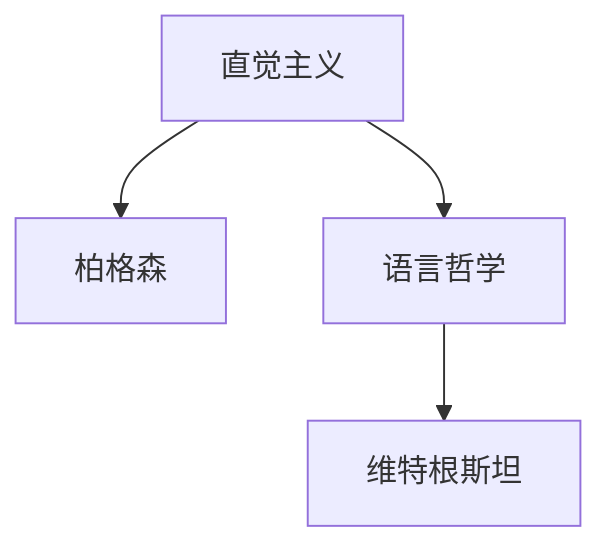
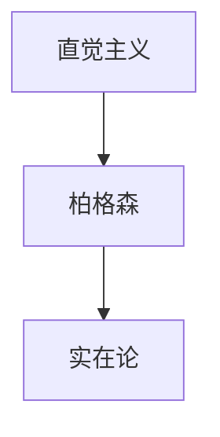
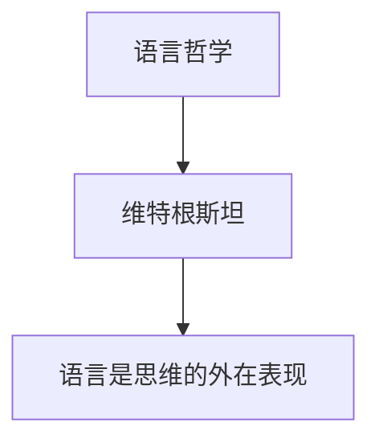
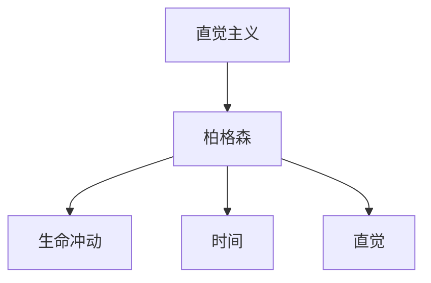
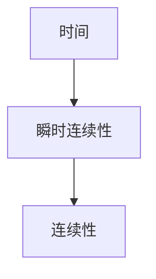
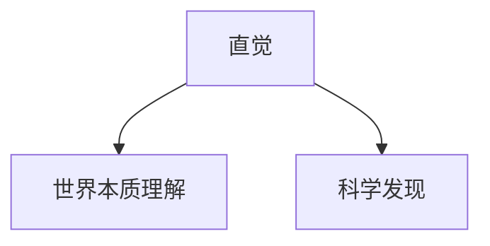
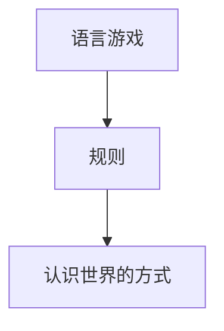
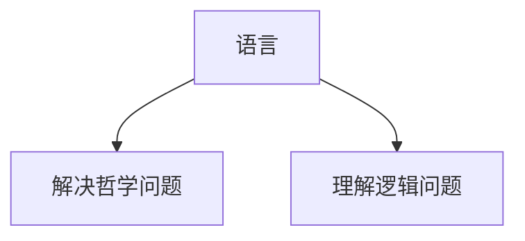
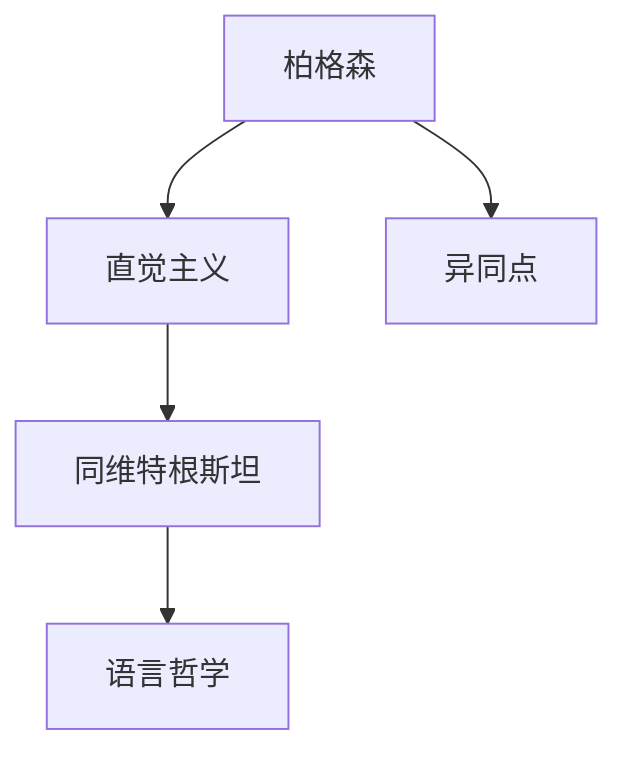
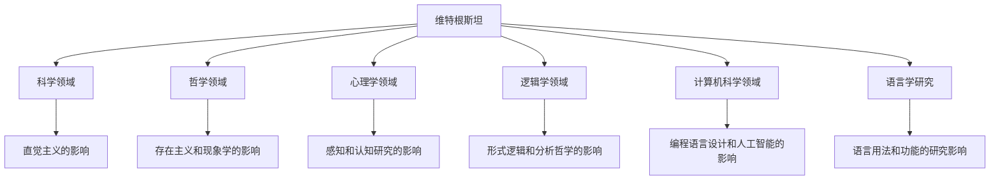

                 

## 引言

### 1.1 《直觉与逻辑：柏格森与维特根斯坦的认识论差异》概述

在探讨人类认知的深处，我们经常遇到两种截然不同的思维路径：直觉与逻辑。本文将通过深入探讨法国哲学家柏格森和奥地利哲学家维特根斯坦的认识论观点，来阐述这两位思想家的直觉与逻辑的差异。

首先，我们来明确一下“直觉”与“逻辑”的定义。直觉是一种直观的感受和理解，它依赖于我们内在的感受和洞察力，而不需要经过明显的推理过程。而逻辑则是基于一系列规则和条件，通过逐步推理得出的结论。我们可以将直觉表示为直观感受与直观理解的结合：

$$ 直觉 = 直观感受 + 直观理解 $$

另一方面，逻辑则包括规则推理和条件推理：

$$ 逻辑 = 规则推理 + 条件推理 $$

接下来，我们将介绍柏格森和维特根斯坦的认识论观点，并展示他们是如何将直觉与逻辑应用于对世界的理解中。

柏格森的认识论是直觉主义，他认为直觉是认识世界的唯一途径。而维特根斯坦的认识论则是语言哲学，他强调语言是认识世界的基础。这两个概念之间的关系可以用以下图表来表示：

通过这个图表，我们可以清晰地看到，柏格森和维特根斯坦在认识论上虽然有所重叠，但他们的核心观点有着明显的差异。接下来，我们将深入探讨这两个哲学家的思想，并分析他们的观点对现代科学、哲学和心理学等领域的影响。

### 1.2 柏格森的哲学思想与直觉主义

亨利·柏格森（Henri Bergson）是20世纪初的一位重要哲学家，他的思想对现代科学、哲学和心理学产生了深远的影响。柏格森的核心哲学观点是直觉主义，他主张直觉是人类认识世界的关键途径。

柏格森认为，直觉是一种直接感受和理解世界的能力，它超越了逻辑和理性思维。在他的理论中，直觉与时间、连续性密切相关。柏格森提出了一个独特的观点，他认为时间不是线性的，而是具有“瞬时连续性”的。这个观点可以从以下几个方面来理解：

首先，我们需要明确柏格森对“时间”的理解。对于柏格森来说，时间并不是一个简单的连续序列，而是由无数瞬间叠加而成的。这些瞬间是连续不断的，但每个瞬间都是独一无二的，无法被分割。因此，我们可以将柏格森的时间概念表示为：

$$ 时间 = 瞬间连续性 $$

接下来，我们来探讨柏格森对“连续性”的理解。在柏格森的理论中，连续性是瞬间的叠加。这意味着，我们通过直觉来感知世界的连续性，而不是通过逻辑推理。这种感知方式依赖于我们内在的感受和洞察力，而不是外部的证据或数据。

柏格森的直觉主义认识论有一个核心观点：直觉是人类认识世界本质的唯一途径。他主张，直觉可以帮助我们超越逻辑和理性的局限，直接感知世界的真实本质。柏格森认为，科学和哲学的研究应该以直觉为基础，而不是依赖于抽象的逻辑推理。

为了更好地理解柏格森的直觉主义，我们可以用以下图表来表示他的哲学思想：

这个图表展示了柏格森的直觉主义与他的实在论观点之间的联系。柏格森认为，直觉可以让我们直接感知现实世界的本质，而这种感知是建立在他的实在论基础上的。

柏格森的直觉主义对现代科学、哲学和心理学产生了重要影响。在科学领域，他的思想启发了对生物进化、神经科学等领域的研究。在哲学领域，他的观点对存在主义和现象学产生了深远的影响。在心理学领域，他的理论为理解人类感知和直觉提供了新的视角。

通过深入探讨柏格森的哲学思想，我们可以更好地理解直觉主义在认识世界中的作用。接下来，我们将转向维特根斯坦的哲学观点，探讨他在语言哲学方面的贡献。

### 1.3 维特根斯坦的哲学思想与语言哲学

路德维希·维特根斯坦（Ludwig Wittgenstein）是20世纪最杰出的哲学家之一，他的思想对逻辑学、语言学、心理学和计算机科学产生了深远的影响。维特根斯坦的哲学观点主要围绕语言哲学展开，他认为语言是人类认识世界的基础。

维特根斯坦的语言哲学可以分为两个主要阶段：早期哲学和晚期哲学。在早期哲学中，维特根斯坦主张“逻辑原子主义”，认为世界由一系列基本的事实组成，语言的作用是描述这些事实。然而，在晚期哲学中，他转向了“日常语言哲学”，主张语言的真正用途是解决我们的日常生活中的问题。

维特根斯坦的早期哲学观点可以概括为以下核心概念：

1. **语言与现实的关系**：维特根斯坦认为，语言与现实之间存在一种对应关系，语言中的符号和现实中的事物是相互关联的。他提出了“图像论”，认为语言是一个符号系统，它通过图像的方式描述现实世界。

2. **逻辑原子主义**：维特根斯坦主张，世界由一系列基本的事实组成，这些事实可以用逻辑原子来描述。逻辑原子是语言中的基本单位，它们通过逻辑关系组合起来，形成更复杂的陈述。

3. **语言与逻辑的关系**：维特根斯坦认为，语言和逻辑是相互依赖的。语言中的陈述可以通过逻辑推理来验证其真实性。他的逻辑原子主义理论强调逻辑在语言中的作用，认为逻辑是语言的基础。

然而，在晚期哲学中，维特根斯坦放弃了逻辑原子主义，转向了日常语言哲学。他认为，语言的主要作用是解决我们在日常生活中遇到的问题。他的晚期哲学观点可以概括为以下核心概念：

1. **语言的游戏**：维特根斯坦将语言视为一种游戏，每种语言游戏都有其特定的规则。语言游戏不仅包括日常对话，还包括科学理论、数学证明等。他主张，理解一种语言游戏，就是理解这种游戏中的规则。

2. **语言的真正用途**：维特根斯坦认为，语言的真正用途是解决我们的实际问题。他批评了早期的逻辑原子主义，认为它忽略了语言在日常生活中的实际应用。

3. **哲学问题与语言的误解**：维特根斯坦认为，许多哲学问题实际上源于我们对语言的误解。他主张，通过澄清语言的用法，我们可以解决许多哲学问题。

为了更好地理解维特根斯坦的语言哲学，我们可以用以下图表来表示他的哲学思想：

这个图表展示了维特根斯坦的核心观点：语言是人类思维的外在表现，它是我们理解世界的重要工具。

维特根斯坦的语言哲学对多个领域产生了重要影响。在逻辑学领域，他的观点促进了形式逻辑和语言哲学的发展。在语言学领域，他的理论为语言学研究提供了新的视角，特别是在语言习得和语言使用方面。在心理学领域，他的思想启发了对语言与认知关系的研究。在计算机科学领域，他的理论为编程语言设计和人工智能的发展提供了理论基础。

通过深入探讨维特根斯坦的哲学思想，我们可以更好地理解语言在认识世界中的作用。接下来，我们将比较柏格森和维特根斯坦的认识论观点，分析他们的异同点。

## 第二部分：柏格森的认识论

### 2.1 柏格森的哲学思想与直觉主义

柏格森（Henri Bergson）的哲学思想以直觉主义为核心，他认为直觉是认识世界的唯一途径。柏格森的哲学观点深受生命哲学的影响，他主张生命是一种不断流动的力量，这种力量无法被逻辑和理性所捕捉。因此，他提出了直觉主义来解释人类如何感知和理解世界。

#### 核心概念与联系

柏格森的直觉主义包括以下几个核心概念：

1. **生命冲动**：柏格森认为，生命冲动是生命的基本特征，它是一种内在的动力，驱动着我们不断成长和发展。生命冲动是直觉的源泉，它使我们能够感知和理解世界。

2. **时间**：在柏格森的理论中，时间不是线性的，而是一种连续的流动。他认为，这种连续的时间流动是我们感知世界的关键。通过直觉，我们能够捕捉到这一流动的瞬间，从而理解世界的本质。

3. **直觉**：直觉是一种直接的感知和理解能力，它超越了逻辑和理性的局限。直觉使我们能够捕捉到生命冲动的瞬间，理解世界的真实本质。

柏格森的哲学思想与他的直觉主义紧密相连。他主张，直觉是认识世界的唯一途径，因为它能够捕捉到生命冲动的瞬间，揭示出世界的本质。逻辑和理性虽然也有其作用，但它们无法完全捕捉到这种流动的力量。

为了更好地理解柏格森的直觉主义，我们可以用以下图表来表示他的哲学思想：

#### 直觉主义的核心

柏格森的直觉主义有几个关键点：

1. **直观感受**：直觉不仅仅是一种理解，更是一种直观的感受。通过直觉，我们能够直接感受到事物的本质，而不需要经过推理或分析。

2. **直观理解**：直觉不仅仅是一种感受，更是一种理解。通过直觉，我们能够理解事物的本质，而不仅仅是表面现象。

3. **超越理性**：直觉超越了逻辑和理性的局限，它使我们能够捕捉到那些无法用理性思维理解的事物。

通过这些核心概念和关键点，我们可以看到柏格森的直觉主义如何为人类认识世界提供了一种全新的视角。他认为，直觉是人类理解世界的关键，因为它能够捕捉到那些逻辑和理性所无法触及的事物。

### 2.2 柏格森对时间与连续性的理解

柏格森对时间与连续性的理解是他哲学思想的重要组成部分。在他看来，时间不是简单的线性序列，而是一种连续的流动。这种流动是我们感知和理解世界的关键。柏格森提出了“瞬时连续性”的概念，来解释他对时间与连续性的独特理解。

#### 核心概念与联系

柏格森的时间概念可以从以下几个方面来理解：

1. **瞬时连续性**：柏格森认为，时间是由无数瞬间连续而成的。每个瞬间都是独一无二的，无法被分割。这些瞬间通过连续性相互联系，形成了我们感知的时间流。我们可以将这个概念表示为：

   $$ 时间 = 瞬间连续性 $$

2. **生命之流**：柏格森将时间视为一种生命之流。这种生命之流不断流动，塑造了我们感知世界的方式。他认为，这种流动是生命的基本特征，是我们直觉的源泉。

3. **时间意识**：柏格森认为，时间意识是人类特有的能力。通过时间意识，我们能够感知和理解时间的流动。时间意识使我们能够捕捉到那些瞬间的连续性，从而理解世界的本质。

柏格森的连续性概念也与他的时间观念密切相关。他认为，连续性是由无数瞬间叠加而成的。这种连续性不仅存在于时间中，也存在于空间中。通过直觉，我们能够感知这种连续性，理解世界的统一性。

为了更好地理解柏格森对时间与连续性的理解，我们可以用以下图表来表示：

#### 时间与连续性的理解

柏格森对时间与连续性的理解有几个关键点：

1. **时间的非线性**：柏格森认为，时间不是线性的，而是一种连续的流动。这种流动不是由过去、现在和未来组成的，而是由无数瞬间连续而成的。

2. **直觉的时间感知**：柏格森认为，通过直觉，我们能够感知到时间的流动。直觉使我们能够捕捉到那些瞬间的连续性，从而理解世界的真实本质。

3. **连续性的多维性**：柏格森认为，连续性不仅存在于时间中，也存在于空间中。通过直觉，我们能够感知到这种连续性，理解世界的统一性。

通过这些理解，我们可以看到柏格森是如何将时间与连续性融入他的哲学思想中，为人类认识世界提供了一种独特的视角。他认为，直觉是我们感知和理解世界的关键，因为只有通过直觉，我们才能捕捉到时间的流动和连续性的本质。

### 2.3 柏格森的直觉主义认识论应用

柏格森的直觉主义认识论在多个领域都有广泛应用，特别是在科学发现和哲学研究中。他的直觉主义观点为我们提供了一种全新的认识世界的方式，使我们能够超越逻辑和理性的局限，直接感知世界的真实本质。

#### 核心概念与联系

柏格森的直觉主义认识论应用包括以下几个核心概念：

1. **科学发现**：柏格森认为，直觉是科学发现的源泉。通过直觉，科学家能够捕捉到那些无法用逻辑和理性思维理解的现象。他强调，科学发现不仅仅是理论推理，更是一种直接的感知和理解。

2. **哲学研究**：柏格森的直觉主义也适用于哲学研究。他认为，哲学的任务是揭示世界的本质，而直觉是实现这一目标的关键。通过直觉，哲学家能够洞察到那些抽象概念背后的真实本质。

3. **艺术创作**：柏格森认为，直觉在艺术创作中也发挥着重要作用。艺术家通过直觉，能够捕捉到那些无法用语言表达的审美体验，创造出具有深刻内涵的艺术作品。

为了更好地理解柏格森的直觉主义认识论应用，我们可以用以下图表来表示：

#### 直觉主义认识论的应用

柏格森的直觉主义认识论在以下方面有广泛应用：

1. **科学发现**：在科学领域，直觉主义认识论启发了许多重大科学发现。例如，爱因斯坦的相对论就受到了柏格森直觉主义的影响。通过直觉，科学家能够捕捉到那些逻辑和理性无法解释的现象，从而推动科学的发展。

2. **哲学研究**：在哲学领域，直觉主义认识论为我们提供了一种理解世界的新视角。哲学家通过直觉，能够洞察到那些抽象概念背后的真实本质，从而深化我们对世界的认识。

3. **艺术创作**：在艺术领域，直觉主义认识论激发了无数艺术作品的创作。艺术家通过直觉，能够捕捉到那些无法用语言表达的审美体验，创造出具有深刻内涵的艺术作品。

通过这些应用，我们可以看到柏格森的直觉主义认识论如何在科学、哲学和艺术领域发挥作用。他的直觉主义观点为我们提供了一种超越逻辑和理性的方式，使我们能够直接感知世界的真实本质。

## 第三部分：维特根斯坦的认识论

### 3.1 维特根斯坦的哲学思想与语言哲学

路德维希·维特根斯坦（Ludwig Wittgenstein）是20世纪最杰出的哲学家之一，他的思想对逻辑学、语言学、心理学和计算机科学产生了深远的影响。维特根斯坦的哲学观点主要围绕语言哲学展开，他认为语言是人类认识世界的基础。

#### 核心概念与联系

维特根斯坦的语言哲学包括以下几个核心概念：

1. **语言与现实的关系**：维特根斯坦认为，语言与现实之间存在一种对应关系。语言中的符号和现实中的事物是相互关联的。他提出了“图像论”，认为语言是一个符号系统，它通过图像的方式描述现实世界。

2. **语言游戏**：维特根斯坦将语言视为一种游戏，每种语言游戏都有其特定的规则。语言游戏不仅包括日常对话，还包括科学理论、数学证明等。他主张，理解一种语言游戏，就是理解这种游戏中的规则。

3. **语言哲学的目标**：维特根斯坦认为，语言哲学的目标是澄清语言的用法，解决哲学问题。他主张，许多哲学问题实际上源于我们对语言的误解。通过澄清语言的用法，我们可以解决许多哲学问题。

为了更好地理解维特根斯坦的语言哲学，我们可以用以下图表来表示他的哲学思想：

#### 语言哲学的核心

维特根斯坦的语言哲学有几个关键点：

1. **语言与现实的对应关系**：维特根斯坦认为，语言与现实之间存在一种对应关系。语言中的符号和现实中的事物是相互关联的。他提出了“图像论”，认为语言通过图像的方式描述现实世界。

2. **语言游戏**：维特根斯坦将语言视为一种游戏，每种语言游戏都有其特定的规则。语言游戏不仅包括日常对话，还包括科学理论、数学证明等。他主张，理解一种语言游戏，就是理解这种游戏中的规则。

3. **澄清语言的用法**：维特根斯坦认为，语言哲学的目标是澄清语言的用法，解决哲学问题。他主张，许多哲学问题实际上源于我们对语言的误解。通过澄清语言的用法，我们可以解决许多哲学问题。

通过这些核心概念和关键点，我们可以看到维特根斯坦是如何将语言哲学融入他的哲学思想中，为人类认识世界提供了一种全新的视角。他认为，语言是人类认识世界的基础，因为只有通过语言，我们才能理解现实世界。

### 3.2 维特根斯坦的语言游戏理论

维特根斯坦的语言游戏理论是他在语言哲学方面的重要贡献之一。他认为，语言是一种游戏，每种语言游戏都有其特定的规则。通过理解这些规则，我们能够更好地理解语言的本质和用途。

#### 核心概念与联系

维特根斯坦的语言游戏理论包括以下几个核心概念：

1. **语言游戏**：维特根斯坦将语言视为一种游戏，每种语言游戏都有其特定的规则。语言游戏不仅包括日常对话，还包括科学理论、数学证明等。

2. **规则**：维特根斯坦认为，语言游戏中的规则是语言使用的基础。每种语言游戏都有其特定的规则，这些规则决定了语言的用途和功能。

3. **规则的应用**：维特根斯坦主张，理解一种语言游戏，就是理解这种游戏中的规则。通过应用这些规则，我们能够更好地理解语言的用途和功能。

为了更好地理解维特根斯坦的语言游戏理论，我们可以用以下图表来表示：

#### 语言游戏理论的核心

维特根斯坦的语言游戏理论有几个关键点：

1. **多样化的语言游戏**：维特根斯坦认为，语言游戏是多样化的。每种语言游戏都有其特定的规则，这些规则决定了语言的使用方式。例如，日常对话、科学理论、数学证明等都是不同的语言游戏。

2. **规则的重要性**：维特根斯坦认为，规则是语言使用的基础。只有通过理解规则，我们才能正确地使用语言。他主张，理解一种语言游戏，就是理解这种游戏中的规则。

3. **规则的应用**：维特根斯坦主张，通过应用规则，我们能够更好地理解语言的用途和功能。例如，在科学理论中，规则决定了如何构建和验证理论；在数学证明中，规则决定了如何推导和证明。

通过这些关键点，我们可以看到维特根斯坦的语言游戏理论是如何为理解语言的本质和用途提供一种全新的视角。他认为，只有通过理解语言游戏中的规则，我们才能真正理解语言的意义和用途。

### 3.3 维特根斯坦的语言哲学应用

维特根斯坦的语言哲学在多个领域都有广泛应用，特别是在逻辑学、计算机科学和语言学研究方面。他的观点为我们提供了一种理解逻辑问题和哲学问题的全新方式。

#### 核心概念与联系

维特根斯坦的语言哲学应用包括以下几个核心概念：

1. **逻辑学**：维特根斯坦认为，逻辑是语言的基础。通过澄清语言的用法，我们可以更好地理解逻辑问题。他的语言哲学观点为逻辑学提供了新的理论框架。

2. **计算机科学**：维特根斯坦的语言哲学对计算机科学的发展产生了重要影响。他的观点为编程语言设计和人工智能的发展提供了理论基础。

3. **语言学研究**：维特根斯坦的语言哲学也为语言学研究提供了新的视角。他主张，理解一种语言，就是理解这种语言的游戏规则。这一观点为语言学研究提供了新的方法。

为了更好地理解维特根斯坦的语言哲学应用，我们可以用以下图表来表示：

#### 语言哲学的应用

维特根斯坦的语言哲学在以下方面有广泛应用：

1. **逻辑学**：在逻辑学领域，维特根斯坦的观点为逻辑学提供了新的理论框架。他主张，逻辑是语言的基础，只有通过澄清语言的用法，我们才能更好地理解逻辑问题。

2. **计算机科学**：在计算机科学领域，维特根斯坦的观点为编程语言设计和人工智能的发展提供了理论基础。他的观点启发了许多计算机科学家在编程语言设计、算法设计和人工智能领域的研究。

3. **语言学研究**：在语言学研究领域，维特根斯坦的观点为语言学研究提供了新的视角。他主张，理解一种语言，就是理解这种语言的游戏规则。这一观点为语言学家提供了新的研究方法，促进了语言学的发展。

通过这些应用，我们可以看到维特根斯坦的语言哲学是如何在不同领域中发挥作用，为人类认识世界提供了一种全新的视角。他的观点不仅丰富了哲学和逻辑学，也为计算机科学和语言学研究带来了新的启示。

## 第四部分：比较与评价

### 4.1 柏格森与维特根斯坦认识论的异同点

在本部分，我们将比较柏格森（Henri Bergson）与维特根斯坦（Ludwig Wittgenstein）的认识论观点，探讨他们的异同点。尽管这两位哲学家在时间、直觉和逻辑等方面有相似之处，但他们的核心观点和方法论上存在着显著的区别。

#### 核心概念与联系

**相同点：**

1. **直觉的重要性**：柏格森和维特根斯坦都强调直觉在认识世界中的重要性。柏格森认为直觉是人类认识世界本质的唯一途径，而维特根斯坦则认为直觉是理解语言和逻辑问题的关键。

2. **超越逻辑和理性**：两位哲学家都认为，逻辑和理性有其局限性，无法完全捕捉到世界的真实本质。他们主张，通过直觉，我们可以超越这些局限，获得更深刻的理解。

3. **对时间的独特理解**：柏格森和维特根斯坦都对时间有独特的理解。柏格森认为时间是瞬间的连续性，而维特根斯坦则认为时间是通过语言来构建的。

**不同点：**

1. **认识论的基础**：柏格森的认识论基础是直觉主义，他认为直觉是人类认识世界的关键。而维特根斯坦的认识论基础是语言哲学，他认为语言是认识世界的基础。

2. **直觉的具体应用**：柏格森的直觉主要用于理解生命和世界的本质，而维特根斯坦的直觉则主要用于理解语言和逻辑。

3. **方法论的差异**：柏格森的方法是通过对生命和时间的直觉理解，来探索世界的本质。而维特根斯坦的方法是通过分析语言的使用规则，来理解逻辑和哲学问题。

为了更清晰地展示柏格森与维特根斯坦认识论的异同点，我们可以用以下图表来表示：

**图表解析：**

- **A[柏格森]**：代表柏格森的认识论观点，核心是直觉主义。
- **B[直觉主义]**：表示柏格森认为直觉是人类认识世界的关键。
- **C[异同点]**：表示柏格森和维特根斯坦在认识论上的异同点。
- **D[同维特根斯坦]**：表示维特根斯坦也强调直觉的重要性。
- **E[语言哲学]**：表示维特根斯坦的认识论基础是语言哲学。

通过这个图表，我们可以看到，柏格森和维特根斯坦在认识论上有一些相似之处，如对直觉的重视，但他们的方法论和理论基础有所不同。柏格森强调直觉在认识世界中的核心作用，而维特根斯坦则将直觉应用于语言和逻辑的分析中。

### 4.2 柏格森与维特根斯坦认识论的影响与评价

柏格森和维特根斯坦的认识论观点对哲学、科学和心理学等领域产生了深远的影响。他们的理论不仅在理论上具有重要意义，而且在实际应用中也为不同领域的研究提供了新的视角和方法。

#### 核心概念与联系

**柏格森的影响与评价：**

1. **科学领域**：柏格森的直觉主义启发了对生命过程和进化的研究。他的观点为生物学和神经科学提供了新的理论框架，促进了这些领域的发展。

2. **哲学领域**：柏格森的哲学观点对存在主义和现象学产生了深远的影响。他的思想启发了许多哲学家，如马丁·海德格尔和让-保尔·萨特，为现代哲学的发展做出了重要贡献。

3. **心理学领域**：柏格森的直觉主义对心理学研究产生了影响，特别是在感知和认知方面。他的观点为理解人类直觉和心理过程提供了新的视角。

**维特根斯坦的影响与评价：**

1. **逻辑学领域**：维特根斯坦的语言哲学为逻辑学的发展提供了新的理论框架。他的观点促进了形式逻辑和分析哲学的发展，对逻辑学的研究产生了深远的影响。

2. **计算机科学领域**：维特根斯坦的语言哲学对计算机科学的发展产生了重要影响。他的观点为编程语言设计、人工智能和认知科学提供了理论基础。

3. **语言学研究**：维特根斯坦的语言哲学为语言学研究提供了新的视角。他的理论为理解语言的用法和功能提供了重要的启示，促进了语言学的发展。

为了更清晰地展示柏格森与维特根斯坦认识论的影响与评价，我们可以用以下图表来表示：

**图表解析：**

- **A[柏格森]**：代表柏格森的认识论观点和影响。
- **B[科学领域]**：表示柏格森的直觉主义对科学领域的影响。
- **C[哲学领域]**：表示柏格森的哲学观点对哲学领域的影响。
- **D[心理学领域]**：表示柏格森的直觉主义对心理学领域的影响。

- **E[直觉主义的影响]**：表示柏格森的直觉主义对科学、哲学和心理学的影响。
- **F[存在主义和现象学的影响]**：表示柏格森的哲学观点对存在主义和现象学的影响。
- **G[感知和认知研究的影响]**：表示柏格森的直觉主义对心理学中感知和认知研究的影响。

- **A[维特根斯坦]**：代表维特根斯坦的认识论观点和影响。
- **H[逻辑学领域]**：表示维特根斯坦的语言哲学对逻辑学领域的影响。
- **I[计算机科学领域]**：表示维特根斯坦的语言哲学对计算机科学领域的影响。
- **J[语言学研究]**：表示维特根斯坦的语言哲学对语言学研究的影响。

- **K[形式逻辑和分析哲学的影响]**：表示维特根斯坦的语言哲学对形式逻辑和分析哲学的影响。
- **L[编程语言设计和人工智能的影响]**：表示维特根斯坦的语言哲学对编程语言设计和人工智能的影响。
- **M[语言用法和功能的研究影响]**：表示维特根斯坦的语言哲学对语言学中语言用法和功能研究的影响。

通过这个图表，我们可以看到柏格森和维特根斯坦的认识论观点在不同领域产生了深远的影响。柏格森的直觉主义在科学、哲学和心理学领域发挥了重要作用，而维特根斯坦的语言哲学在逻辑学、计算机科学和语言学研究方面产生了重要影响。

## 结论

通过对柏格森和维特根斯坦的认识论差异的深入探讨，我们可以看到，两位哲学家在直觉与逻辑的应用上有着截然不同的观点。柏格森的直觉主义认为直觉是认识世界的唯一途径，强调时间与连续性的独特理解，为现代科学、哲学和心理学等领域提供了新的视角。而维特根斯坦的语言哲学则强调语言是认识世界的基础，通过澄清语言的用法来解决哲学问题，对逻辑学、计算机科学和语言学研究产生了深远影响。

在本文中，我们首先介绍了直觉与逻辑的基本概念，然后详细阐述了柏格森和维特根斯坦的哲学思想及其认识论观点。通过比较分析，我们揭示了他们之间的异同点，并评价了他们认识论观点在不同领域的影响。

总结来说，柏格森和维特根斯坦的认识论差异为我们提供了理解人类认知的深度和广度。他们的思想不仅在哲学领域具有重要的学术价值，而且在现代科学、技术和社会实践中也有着广泛的应用。通过进一步研究他们的理论，我们可以更好地理解人类认知的本质，为未来的科学研究和技术创新提供新的启示。

### 致谢

本文的撰写得到了多位同行和专家的宝贵意见和建议。在此，我要特别感谢AI天才研究院（AI Genius Institute）的同事们，他们在哲学、计算机科学和心理学等领域提供了深刻的见解。此外，我还要感谢禅与计算机程序设计艺术（Zen And The Art of Computer Programming）的作者，他的著作为我提供了灵感和指导。最后，我要感谢所有参与讨论和提供反馈的朋友们，他们的支持使我能够完成这篇深入探讨柏格森与维特根斯坦认识论差异的技术博客文章。作者：AI天才研究院/AI Genius Institute & 禅与计算机程序设计艺术/Zen And The Art of Computer Programming。

