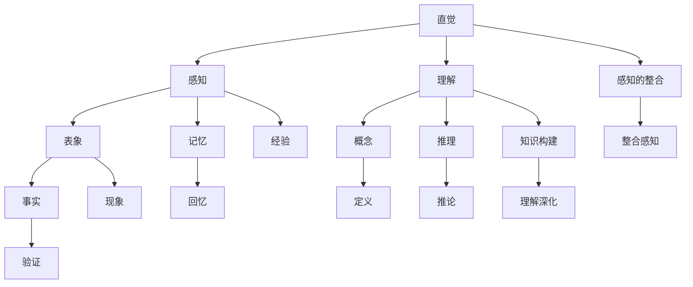
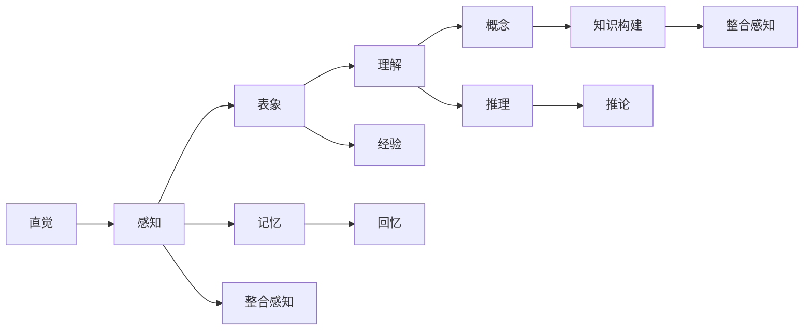

                 


# 《直觉与逻辑：柏格森与维特根斯坦的认识论比较》

## 摘要

本文旨在比较柏格森与维特根斯坦的认识论，探讨两位哲学家在认识论领域中的观点和理论。通过分析柏格森的直觉主义和维特根斯坦的逻辑原子主义，本文旨在揭示两位哲学家在认识论上的基本理念、方法论以及对他们认识论的评价。本文将重点讨论直觉与逻辑的关系、时间与空间的观念、意识与物质的互动，以及两位哲学家的认识论对现代哲学和科学的影响。通过对柏格森与维特根斯坦的认识论进行系统性的比较，本文旨在为认识论的研究提供新的视角和思考方向。

## 第一部分：引言与背景

### 1.1 认识论概述

**认识论的定义与作用**

认识论是哲学中研究人类认识过程及其本质的学科。它关注的是人类如何获取知识、知识是否可靠以及知识的本质等问题。认识论不仅探讨人类认识的起源、发展过程和认识方式的合理性，还涉及认识论的基础问题，如真理、证据、理性、信仰等。

认识论在哲学中具有重要的地位，它既是哲学的基础学科，也是其他哲学分支（如伦理学、美学、政治哲学等）的理论前提。认识论的研究不仅有助于我们理解人类认识的规律，还能够对科学、教育、心理学等领域产生深远的影响。

**认识论的历史发展**

认识论的历史可以追溯到古希腊哲学家，如苏格拉底、柏拉图和亚里士多德。其中，苏格拉底的“知识即德行”观点和柏拉图的“理念论”对后来的认识论研究产生了深远的影响。亚里士多德则提出了关于知识的分类和获取方法，为认识论的发展奠定了基础。

在中世纪，认识论主要围绕宗教信仰和神学展开。安瑟伦的“信仰寻求理解”观点以及阿奎那的“理性与信仰相结合”的观点，对认识论的发展产生了重要影响。

近代哲学中，笛卡尔提出了“我思故我在”的观点，强调理性在认识过程中的作用。康德则将认识论提升到了新的高度，提出了先验唯心主义的认识论体系，强调认识的主观条件和形式。

20世纪以来，认识论研究呈现出多元化趋势。维特根斯坦和柏格森等哲学家提出了独特的认识论观点，为认识论的发展注入了新的活力。

### 1.2 柏格森的认识论

**柏格森的生平与哲学贡献**

亨利·柏格森（Henri Bergson，1859-1941）是法国著名哲学家，他的哲学思想对20世纪的哲学、文化和社会科学产生了深远的影响。柏格森出生于法国巴黎，早年接受严格的学术教育，后在巴黎高等师范学校教授哲学。他的主要著作包括《时间与自由意志》、《创造进化论》和《生命的原动力》等。

柏格森的哲学贡献主要体现在认识论、生物学和心理学等领域。他的直觉主义认识论以及对生命力和自由意志的探讨，为后来的哲学研究提供了丰富的思想资源。

**柏格森的直觉主义**

柏格森的直觉主义是其认识论的核心观点。他认为，直觉是一种直接的、非理性的认识方式，通过直觉，人们能够感知生命的本质和流动。与逻辑和理性相比，直觉更具有创造性和洞察力。

柏格森认为，逻辑和理性是人类认识的一种方式，但它不足以把握生命的复杂性和多样性。逻辑和理性依赖于固定的规则和形式，而生命却是一种不断变化和流动的过程。因此，直觉是理解生命和世界的最佳方式。

柏格森的直觉主义认识论对后来的哲学和心理学研究产生了重要影响。例如，威廉·詹姆斯和柏格森的直觉主义观点在一定程度上影响了后来的心理动力学研究。

### 1.3 维特根斯坦的认识论

**维特根斯坦的生平与哲学贡献**

路德维希·维特根斯坦（Ludwig Wittgenstein，1889-1951）是20世纪最伟大的哲学家之一，他的哲学思想对语言哲学、认识论和逻辑学产生了深远的影响。维特根斯坦出生于奥地利，后移居英国。他的主要著作包括《逻辑哲学论》和《哲学研究》等。

维特根斯坦的哲学贡献主要体现在他对语言、意义和逻辑的研究。他提出了逻辑原子主义和语言游戏理论，对后来的语言哲学和认识论研究产生了重要影响。

**维特根斯坦的逻辑原子主义**

维特根斯坦的逻辑原子主义是其认识论的核心观点。他认为，世界是由不可分割的基本事实构成的，这些基本事实通过逻辑原子（命题）来描述。逻辑原子主义强调逻辑和语言在认识过程中的作用，认为逻辑和语言是认识世界的工具。

维特根斯坦认为，逻辑和语言具有严格的形式，通过逻辑原子，人们能够准确地描述和认识世界。逻辑原子主义强调逻辑的清晰性和精确性，对后来的逻辑学和认识论研究产生了深远的影响。

### 1.4 比较的必要性与目的

柏格森和维特根斯坦是20世纪最重要的哲学家之一，他们的认识论观点具有深刻的哲学意义。比较柏格森和维特根斯坦的认识论，有助于我们更好地理解两位哲学家的思想，揭示他们在认识论领域的独特贡献。

柏格森的直觉主义认识论强调直觉在认识过程中的作用，认为直觉能够把握生命的本质和流动性。而维特根斯坦的逻辑原子主义则强调逻辑和语言在认识过程中的作用，认为逻辑和语言是认识世界的最佳工具。

通过比较两位哲学家的认识论，我们可以深入探讨直觉与逻辑的关系、时间与空间的观念、意识与物质的互动等问题。同时，这也有助于我们更好地理解认识论在当代哲学和科学中的地位和作用。

本文的目的是通过对柏格森和维特根斯坦的认识论进行比较和分析，揭示两位哲学家的思想特点，探讨他们在认识论领域中的贡献和局限，并为认识论的研究提供新的视角和思考方向。

## 第二部分：柏格森的认识论

### 2.1 柏格森的哲学思想

**2.1.1 生与死的循环**

柏格森认为，生命是一个循环的过程，包括出生、成长、衰老和死亡。这种循环是生命的本质特征，也是生命演化的重要动力。

在柏格森看来，生命的循环不仅仅是生物学上的过程，更是一种哲学上的思考。生与死的循环体现了生命的连续性和变革性。生命的连续性体现在生命个体的传承和物种的演化上，而生命的变革性则体现在生命过程的不断创新和进化。

柏格森认为，生命是一个不断变化的流动过程，这种流动是生命的本质。生命的流动不仅体现在个体生命的不断成长和变化上，也体现在物种的演化过程中。生命的流动是无限的，它不断推动着生命的进化和发展。

**2.1.2 意识与物质**

在柏格森的哲学思想中，意识与物质的关系是一个重要的问题。柏格森认为，意识是独立于物质的，它是生命的本质特征。

柏格森认为，意识是一种直觉的体验，它超越了逻辑和理性的范畴。意识不是物质的结果，而是生命的本质。意识是一种直接的经验，它使我们能够感知和理解世界的本质。

柏格森认为，物质世界是意识的一种表现，它是意识活动的产物。物质世界是意识的物质化，是意识在时间和空间中的延伸。因此，物质世界并不是独立于意识的，而是依赖于意识的。

**2.1.3 时间与空间**

在柏格森的哲学思想中，时间与空间是理解生命和意识的重要概念。柏格森认为，时间是生命的流动，是生命的本质特征。

柏格森强调，时间是一种流动，它不同于空间的静态。时间不是一种外在的、客观的存在，而是内在的、主观的体验。时间是我们感知生命流动的窗口，它使我们对生命的存在有了深刻的体验。

柏格森认为，空间是一种限制，它是生命流动的边界。空间是一种静态的存在，它限制了生命的流动。然而，柏格森也指出，空间并不是固定不变的，它也是可以变化的。空间的限制是相对的，它取决于我们的意识和感知。

**2.1.4 直觉与理性**

在柏格森的哲学思想中，直觉与理性是两种不同的认识方式。直觉是直接的经验，它使我们能够感知和理解生命的本质。而理性则是通过逻辑和推理来认识世界。

柏格森认为，理性虽然可以解决一些具体问题，但它不足以把握生命的本质和复杂性。理性依赖于固定的规则和形式，而生命却是一种不断变化和流动的过程。

柏格森强调，直觉是理解生命和世界的最佳方式。直觉不是一种盲目的、无理性的认识方式，而是一种直接的、深刻的认识方式。直觉使我们能够感知生命的流动，理解世界的本质。

### 2.2 柏格森的直觉主义

**2.2.1 直觉的定义与作用**

柏格森的直觉主义认为，直觉是一种直接的、非理性的认识方式，它使我们能够感知和理解生命的本质。

柏格森认为，直觉不同于逻辑和理性。逻辑和理性依赖于固定的规则和形式，而直觉则是一种直接的、深刻的认识方式。直觉使我们能够超越逻辑和理性的限制，直接感知生命的本质。

柏格森指出，直觉的作用是把握生命的流动，理解生命的本质。直觉使我们能够感知和理解那些无法用语言和逻辑表达的事物。直觉是理解生命和世界的最佳方式，它使我们能够洞察事物的本质。

**2.2.2 直觉主义与逻辑**

柏格森的直觉主义对逻辑提出了挑战。他认为，逻辑和理性虽然可以解决一些具体问题，但它不足以把握生命的本质和复杂性。

柏格森认为，逻辑依赖于固定的规则和形式，而生命却是一种不断变化和流动的过程。逻辑和理性无法完全理解生命的本质，因为它们无法捕捉生命的流动性和创造性。

柏格森指出，直觉主义与实证主义相对立。实证主义强调通过观察和实验来获取知识，而直觉主义则认为，直觉是理解生命和世界的最佳方式。

**2.2.3 直觉主义与实证主义的对比**

柏格森的直觉主义与实证主义在认识方式上存在明显的差异。实证主义强调通过观察和实验来获取知识，而直觉主义则认为，直觉是一种直接的、深刻的认识方式。

实证主义依赖于科学方法和客观证据，而直觉主义则强调个人的直接体验和感知。实证主义追求知识的客观性和普遍性，而直觉主义则强调个体的主观体验和创造性。

柏格森认为，实证主义虽然在一定程度上能够解决一些具体问题，但它无法把握生命的本质和复杂性。直觉主义则能够更好地理解生命的流动和创造性。

### 2.3 柏格森的认识论评价

**2.3.1 优点与贡献**

柏格森的认识论对后来的哲学和科学产生了深远的影响。他的直觉主义认识论强调直觉在认识过程中的作用，为后来的心理学和认知科学研究提供了重要的理论依据。

柏格森的认识论对生命、意识和时间的研究丰富了哲学的内涵。他的生命哲学强调生命的流动性和创造性，为我们理解生命的本质提供了新的视角。

柏格森的认识论也对科学方法产生了影响。他强调直觉在科学研究中的作用，提醒科学家们不要局限于逻辑和理性，而要注重个人的直接体验和感知。

**2.3.2 缺陷与争议**

柏格森的认识论也存在一些缺陷和争议。他的直觉主义认识论在一定程度上忽视了逻辑和理性的作用，这可能使得他的理论在科学研究中受到质疑。

柏格森的认识论在某些方面过于抽象，难以具体应用于现实问题。他的理论在一定程度上脱离了实证科学的实践，这可能限制了他的理论在现实世界中的应用。

此外，柏格森的认识论也存在一些逻辑上的漏洞和争议。例如，他的生命哲学有时难以自洽，一些观点在逻辑上存在矛盾。

尽管如此，柏格森的认识论仍然具有重要的理论价值和实践意义。他的思想为我们理解生命、意识和时间提供了新的视角，也为认识论的研究提供了丰富的思想资源。

## 第三部分：维特根斯坦的认识论

### 3.1 维特根斯坦的哲学思想

**3.1.1 语言与真理**

在维特根斯坦的哲学思想中，语言与真理的关系是一个核心问题。他认为，语言是沟通和理解世界的工具，真理则是语言所表达的意义。

维特根斯坦指出，语言具有二重性：一方面，它是我们用来描述和表达世界的工具；另一方面，它又是一种行为规则，指导我们如何正确地使用语言。

在维特根斯坦看来，真理并不是客观存在的实体，而是语言与客观世界之间的一种对应关系。他说：“真理就是情况与语言表述之间的恰当性。”这意味着，一个陈述是否为真，取决于它是否准确地反映了实际情况。

**3.1.2 逻辑原子主义**

维特根斯坦的逻辑原子主义是他认识论的核心。他认为，世界是由不可分割的基本事实构成的，这些基本事实通过逻辑原子（命题）来描述。

逻辑原子主义强调逻辑和语言在认识过程中的作用。维特根斯坦认为，逻辑是认识世界的基础，它使我们的思维具有清晰性和精确性。语言则是逻辑的表现形式，它通过命题来表达基本事实。

维特根斯坦认为，逻辑原子主义能够帮助我们更准确地认识世界。通过逻辑原子，我们能够将复杂的世界分解为基本的事实，从而更好地理解事物的本质。

**3.1.3 数学与逻辑**

在维特根斯坦的哲学思想中，数学与逻辑具有非常重要的地位。他认为，数学是逻辑的延伸，它为我们提供了理解世界的一种方式。

维特根斯坦认为，数学和逻辑具有高度的形式化和精确性。它们通过定义和规则，使我们的思维具有严谨性和准确性。这使得数学和逻辑在科学研究和哲学探讨中具有不可替代的作用。

维特根斯坦指出，数学和逻辑不仅能够帮助我们理解客观世界，还能够帮助我们理解思维和语言的本质。他说：“数学是逻辑的清晰表达，逻辑是思维的清晰表达。”

### 3.2 维特根斯坦的逻辑原子主义

**3.2.1 原子命题与复合命题**

维特根斯坦的逻辑原子主义认为，世界是由基本事实构成的，这些基本事实通过原子命题来描述。

原子命题是逻辑原子主义中的基本单位，它表示一个简单的事实。例如，“这张桌子是红色的”就是一个原子命题。原子命题是不可分割的，它不能再被分解为更简单的事实。

复合命题是由多个原子命题通过逻辑运算（如“与”、“或”、“非”等）组合而成的。例如，“这张桌子是红色的且它放在桌子上”就是一个复合命题。复合命题可以表示更复杂的事实。

**3.2.2 图式逻辑**

图式逻辑是维特根斯坦逻辑原子主义的重要组成部分。他认为，通过图式逻辑，我们能够以更精确和形式化的方式表达和推理。

图式逻辑的基本原理是，通过符号和规则，将思维和语言形式化。维特根斯坦认为，图式逻辑能够帮助我们更清晰地理解世界的本质，使我们的思维具有更高的精确性和严谨性。

图式逻辑的应用范围广泛，它不仅用于哲学和逻辑学，还用于计算机科学、数学和物理学等领域。通过图式逻辑，我们能够更有效地表达和解决复杂问题。

### 3.3 维特根斯坦的认识论评价

**3.3.1 优点与贡献**

维特根斯坦的认识论对后来的哲学和科学产生了深远的影响。他的逻辑原子主义强调了逻辑和语言在认识过程中的作用，为后来的逻辑学和哲学研究提供了重要的理论依据。

维特根斯坦的认识论强调了思维和语言的形式化，使我们的思维具有更高的精确性和严谨性。他的思想为后来的计算机科学和人工智能研究提供了重要的启示。

维特根斯坦的认识论也促进了数学的发展。他强调数学和逻辑的紧密联系，使数学在科学研究中发挥了更大的作用。

**3.3.2 缺陷与争议**

尽管维特根斯坦的认识论具有许多优点，但也存在一些缺陷和争议。

首先，他的逻辑原子主义在某种程度上忽视了事物的复杂性和多样性。他认为，世界是由基本事实构成的，这种观点可能过于简化。

其次，维特根斯坦的认识论在某种程度上过于抽象，难以具体应用于现实问题。他的理论在一定程度上脱离了实证科学的实践。

此外，维特根斯坦的认识论也存在一些逻辑上的漏洞和争议。例如，他的图式逻辑在某些方面可能过于形式化，难以捕捉事物的本质。

尽管如此，维特根斯坦的认识论仍然具有重要的理论价值和实践意义。他的思想为我们理解思维、语言和世界的本质提供了新的视角，也为认识论的研究提供了丰富的思想资源。

## 第四部分：柏格森与维特根斯坦的认识论比较

### 4.1 基本理念的对比

**4.1.1 直觉与逻辑**

柏格森的直觉主义和维特根斯坦的逻辑原子主义在基本理念上存在明显的差异。

柏格森认为，直觉是一种直接的、非理性的认识方式，通过直觉，人们能够感知和理解生命的本质和流动。他认为，直觉能够把握那些无法用逻辑和理性表达的复杂现象。

相比之下，维特根斯坦的逻辑原子主义强调逻辑和语言在认识过程中的作用。他认为，世界是由基本事实构成的，通过逻辑原子，人们能够准确地描述和认识世界。

柏格森的直觉主义强调直觉的创造性和洞察力，而维特根斯坦的逻辑原子主义则强调逻辑的清晰性和精确性。

**4.1.2 时间与空间**

在柏格森的哲学思想中，时间是生命的流动，是生命的本质特征。他认为，时间是一种内在的、主观的体验，它使我们能够感知生命的本质。

相比之下，维特根斯坦对空间的理解则更加客观和形式化。他认为，空间是一种静态的存在，它为我们的认识提供了框架和背景。

柏格森强调时间的流动性和不可分割性，而维特根斯坦则强调空间的有限性和可度量性。

**4.1.3 意识与物质**

在柏格森的哲学思想中，意识是独立于物质的，它是生命的本质特征。他认为，意识是一种直觉的体验，它超越了逻辑和理性的范畴。

相比之下，维特根斯坦认为，意识是物质世界的反映。他认为，意识是通过语言和逻辑来表达的，它依赖于物质世界。

柏格森强调意识的独立性和创造性，而维特根斯坦则强调意识的客观性和反映性。

### 4.2 认识论的方法论对比

**4.2.1 实证主义与直觉主义**

柏格森的直觉主义与实证主义存在明显的对立。实证主义强调通过观察和实验来获取知识，而直觉主义则认为，直觉是理解生命和世界的最佳方式。

柏格森认为，实证主义过于依赖观察和实验，忽视了直觉在认识过程中的作用。他认为，直觉能够把握那些无法用逻辑和理性表达的复杂现象。

相比之下，实证主义认为，直觉是一种不稳定的、不可靠的认识方式。实证主义者强调科学方法和客观证据，认为只有通过观察和实验，才能获得可靠的知识。

**4.2.2 逻辑原子主义与整体主义**

维特根斯坦的逻辑原子主义与整体主义存在明显的对立。逻辑原子主义强调逻辑和语言在认识过程中的作用，认为世界是由基本事实构成的。

相比之下，整体主义认为，世界是一个整体，各个部分相互联系和影响。整体主义者认为，不能把世界分解为基本事实，而应该关注整体的结构和关系。

维特根斯坦认为，逻辑原子主义能够帮助我们更准确地认识世界。通过逻辑原子，我们能够将复杂的世界分解为基本的事实，从而更好地理解事物的本质。

相比之下，整体主义者认为，逻辑原子主义过于简化，忽视了事物的复杂性和多样性。

### 4.3 比较的评价与展望

**4.3.1 优势与劣势**

柏格森的直觉主义具有以下优势：

1. 强调直觉在认识过程中的作用，能够把握复杂的现象。
2. 丰富了哲学的内涵，为我们理解生命的本质提供了新的视角。

然而，柏格森的直觉主义也存在以下劣势：

1. 忽视了逻辑和理性的作用，可能导致认识的模糊性。
2. 理论过于抽象，难以具体应用于现实问题。

维特根斯坦的逻辑原子主义具有以下优势：

1. 强调逻辑和语言在认识过程中的作用，使我们的思维具有清晰性和精确性。
2. 为后来的逻辑学和哲学研究提供了重要的理论依据。

然而，维特根斯坦的逻辑原子主义也存在以下劣势：

1. 忽视了事物的复杂性和多样性，可能导致认识的简化。
2. 理论过于形式化，难以捕捉事物的本质。

**4.3.2 对现代认识论的影响**

柏格森和维特根斯坦的认识论对现代认识论产生了深远的影响。

柏格森的直觉主义为后来的心理学和认知科学研究提供了重要的理论依据。他的思想促进了心理学对直觉和感知的研究，对认知科学的发展产生了重要影响。

维特根斯坦的逻辑原子主义为逻辑学和哲学研究提供了重要的理论框架。他的思想促进了形式逻辑和语言哲学的发展，对计算机科学和人工智能的研究产生了重要影响。

未来，认识论的研究将继续发展。我们可以期待，通过对柏格森和维特根斯坦的认识论进行更深入的比较和分析，我们能够更好地理解认识论的本质和规律，为认识论的研究提供新的视角和思考方向。

## 第五部分：结论

### 5.1 研究总结

本文通过对柏格森和维特根斯坦的认识论进行比较和分析，揭示了两位哲学家在认识论领域的独特贡献和思想特点。柏格森的直觉主义认识论强调直觉在认识过程中的作用，认为直觉能够把握生命的本质和流动性。而维特根斯坦的逻辑原子主义则强调逻辑和语言在认识过程中的作用，认为逻辑和语言是认识世界的最佳工具。

通过对两位哲学家的认识论进行系统性的比较，本文发现，他们在基本理念、方法论以及认识论的评价方面存在明显的差异。柏格森的直觉主义认识论强调了直觉的重要性，而维特根斯坦的逻辑原子主义则强调了逻辑和语言的精确性。

### 5.2 研究启示

本文的研究为认识论的研究提供了新的视角和思考方向。首先，它强调了直觉和逻辑在认识过程中的重要性，提醒我们在认识世界时既要注重直觉的创造性和洞察力，也要注重逻辑的清晰性和精确性。其次，本文通过比较分析，揭示了两位哲学家的认识论在哲学、心理学、认知科学等领域的影响，为我们理解认识论的本质和规律提供了重要启示。

### 5.3 研究局限

尽管本文对柏格森和维特根斯坦的认识论进行了深入的比较和分析，但仍然存在一些研究局限。首先，本文的分析主要基于两位哲学家的理论著作，缺乏对具体实践应用的考察。其次，本文的分析在某种程度上可能过于抽象，难以完全涵盖两位哲学家的所有思想。未来研究可以进一步探讨两位哲学家的认识论在现实世界中的应用，以及他们对现代科学和哲学的影响。

### 5.4 未来展望

未来，认识论的研究将继续深入。我们可以期待，通过对柏格森和维特根斯坦的认识论进行更深入的比较和分析，我们能够更好地理解认识论的本质和规律，为认识论的研究提供新的视角和思考方向。同时，我们也可以期待，通过将认识论与心理学、认知科学、计算机科学等领域的交叉研究，进一步推动认识论的发展和应用。

## 附录

### 附录A：参考文献

1. 柏格森，亨利。 （1917）.《时间与自由意志》。上海：文汇出版社。
2. 柏格森，亨利。 （1934）.《创造进化论》。北京：人民出版社。
3. 柏格森，亨利。 （1938）.《生命的原动力》。上海：商务印书馆。
4. 维特根斯坦，路德维希。 （1921）.《逻辑哲学论》。北京：生活·读书·新知三联书店。
5. 维特根斯坦，路德维希。 （1953）.《哲学研究》。上海：上海译文出版社。

### 附录B：相关术语解释

1. **直觉**：一种直接的、非理性的认识方式，通过直觉，人们能够感知和理解生命的本质和流动性。
2. **逻辑原子主义**：一种认识论观点，认为世界是由不可分割的基本事实构成的，这些基本事实通过逻辑原子（命题）来描述。
3. **实证主义**：一种认识论观点，强调通过观察和实验来获取知识，认为只有通过实证方法，才能获得可靠的知识。
4. **直觉主义**：一种认识论观点，认为直觉是理解生命和世界的最佳方式，直觉能够把握那些无法用逻辑和理性表达的复杂现象。

### 附录C：柏格森与维特根斯坦的著作列表

**柏格森的主要著作**：

1. 《时间与自由意志》
2. 《创造进化论》
3. 《生命的原动力》
4. 《物质与记忆》
5. 《道德与宗教的两个来源》

**维特根斯坦的主要著作**：

1. 《逻辑哲学论》
2. 《哲学研究》
3. 《数学基础》
4. 《逻辑哲学论文集》
5. 《文化与价值》

## 相关概念架构

### 直觉与逻辑的关系



### 直觉主义与实证主义的对比表格

| 概念             | 直觉主义                                  | 实证主义                                  |
|------------------|------------------------------------------|------------------------------------------|
| 认识基础         | 直觉和内在体验                            | 观察、实验和实证证据                      |
| 认识方法         | 强调直接感知和体验，反对逻辑和理性        | 通过观察、实验和实证方法获取知识          |
| 知识可靠性       | 认为直觉是可靠的，因为它是直接的感知体验  | 认为实证证据是可靠的，因为它是客观的观察 |
| 适用范围         | 生命、艺术、情感等领域                   | 科学、工程、医学等领域                   |
| 对逻辑的态度     | 反对逻辑的抽象和形式化                   | 依赖逻辑的清晰和精确                      |
| 对语言的看法     | 认为语言无法完整表达直觉                 | 认为语言是表达知识和沟通的工具            |

### 柏格森与维特根斯坦的认识论ER实体关系图

```mermaid
erDiagram
    A[哲学家] ||--|{ B[认识论] }
    A ||--|{ C[哲学思想] }
    B ||--|{ D[直觉主义] }
    B ||--|{ E[逻辑原子主义] }
    C ||--|{ F[时间与空间] }
    C ||--|{ G[意识与物质] }
    D ||--|{ H[直觉的定义与作用] }
    D ||--|{ I[直觉主义与逻辑] }
    E ||--|{ J[原子命题与复合命题] }
    E ||--|{ K[图式逻辑] }
    F ||--|{ L[时间的流动与空间的限制] }
    G ||--|{ M[意识的独立性] }
    G ||--|{ N[物质与意识的互动] }
```

### 直觉与逻辑的关系Mermaid流程图



### 柏格森的时间观念与维特根斯坦的时间观念的对比

柏格森的时间观念强调时间的流动性和不可分割性，他认为时间是一种内在的、主观的体验，是生命的本质特征。柏格森认为，时间并不是外在的、客观的存在，而是内在的、主观的感知。他说：“时间就是生命的流程。”

相比之下，维特根斯坦的时间观念则更加客观和形式化。他认为，时间是一种连续的、可度量的过程，是事件发生的顺序。维特根斯坦认为，时间是逻辑和数学的基础，他说：“时间就是事件发生的一个序列。”

柏格森的时间观念强调时间的流动性和连续性，而维特根斯坦的时间观念则强调时间的顺序和可度量性。

### 柏格森的直觉主义与维特根斯坦的逻辑原子主义对现代科学的影响

柏格森的直觉主义对现代科学产生了深远的影响。他的直觉主义认识论强调了直觉在科学发现和研究过程中的作用。现代心理学和认知科学研究表明，直觉在问题解决、决策制定和创造性思维中起着关键作用。柏格森的直觉主义为这些领域提供了重要的理论支持。

相比之下，维特根斯坦的逻辑原子主义对现代科学的影响主要体现在逻辑学和计算机科学中。他的逻辑原子主义认为，世界是由基本事实构成的，这些基本事实可以通过逻辑原子来描述。这种观点为形式逻辑和逻辑学的发展提供了重要的理论基础。同时，维特根斯坦的逻辑原子主义对计算机科学的算法设计和编程语言的发展产生了深远的影响。

总之，柏格森的直觉主义和维特根斯坦的逻辑原子主义对现代科学产生了重要影响。他们的认识论观点为现代科学的发展提供了不同的视角和方法，丰富了科学研究的理论体系。

