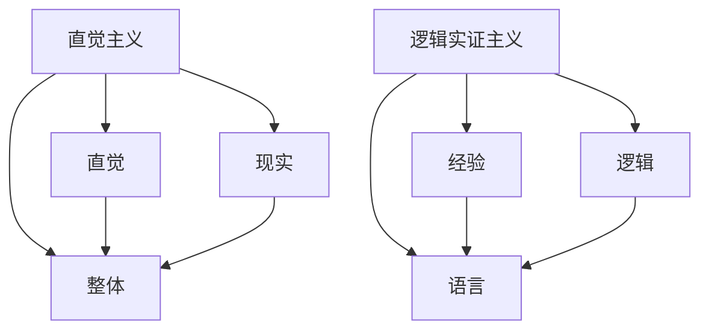

                 

**文章标题：直觉主义与逻辑实证主义：柏格森与维特根斯坦的认识论之争**

**关键词：直觉主义、逻辑实证主义、柏格森、维特根斯坦、认识论**

**摘要：本文深入探讨了柏格森与维特根斯坦两位哲学大师对认识论的独特见解，比较了直觉主义与逻辑实证主义的核心观点，并通过具体案例分析了二者之间的哲学争论及其对后世的影响。**

---

## 第一部分：认识论的背景与核心概念

### 第1章：认识论的基本概念

#### 1.1 认识论的定义与历史发展

认识论是哲学的一个重要分支，主要探讨知识的本质、起源、范围和限制。它关注的问题包括：什么是知识？知识是如何获得的？我们是否可以确信我们拥有知识？认识论的历史可以追溯到古希腊哲学家，如苏格拉底、柏拉图和亚里士多德，他们对知识的本质和方法进行了初步探讨。

#### 1.2 柏格森的直觉主义哲学

柏格森（Henri Bergson）是20世纪初期的一位重要哲学家，他的直觉主义哲学主张，真正的知识来自于直接的感受或直觉，而不是通过逻辑推理或经验观察。柏格森认为，直觉是人类理解世界和把握生命本质的唯一途径。

#### 1.3 维特根斯坦的逻辑实证主义

维特根斯坦（Ludwig Wittgenstein）是另一位20世纪的伟大哲学家，他的逻辑实证主义哲学主张，知识来源于经验观察和逻辑推理，而不是直觉。维特根斯坦强调，哲学的任务不是去解释世界，而是澄清日常语言的使用。

### 第2章：柏格森与维特根斯坦的认识论差异

#### 2.1 直觉主义与逻辑实证主义的比较

直觉主义与逻辑实证主义在知识来源、知识本质和哲学任务等方面存在显著差异。直觉主义强调直觉的重要性，认为直觉可以直接把握现实；而逻辑实证主义则认为，知识只能通过经验观察和逻辑推理来获得。

#### 2.2 柏格森的哲学观点分析

柏格森的直觉主义哲学认为，直觉是一种先于逻辑推理的认知方式，它是人类理解世界和生命的根本途径。柏格森提出，生命和现实世界是流动的、不可分割的整体，只有通过直觉，我们才能把握这种整体性。

#### 2.3 维特根斯坦的哲学观点分析

维特根斯坦的逻辑实证主义哲学主张，哲学的目的是澄清语言的使用，而不是解释世界。他认为，日常语言的表达是清晰的，哲学的任务是揭示这种清晰性，而不是通过抽象的概念来重构世界。

### 第3章：认识论的核心概念实体关系

#### 3.1 直觉主义的核心概念实体

直觉主义的核心概念实体包括“直觉”、“现实”和“整体”。直觉被认为是直接把握现实的方式，而现实则被视为一个流动的、不可分割的整体。

#### 3.2 逻辑实证主义的核心概念实体

逻辑实证主义的核心概念实体包括“经验”、“逻辑”和“语言”。经验被认为是知识的基础，逻辑是推理的工具，而语言则是表达和沟通的媒介。

#### 3.3 柏格森与维特根斯坦概念实体关系图（Mermaid流程图）



---

**作者：AI天才研究院/AI Genius Institute & 禅与计算机程序设计艺术 /Zen And The Art of Computer Programming**

在接下来的部分，我们将深入分析柏格森与维特根斯坦的认识论之争，探讨其对后世哲学和科学的影响。****


## 第二部分：柏格森与维特根斯坦的认识论之争

### 第4章：直觉主义与逻辑实证主义的哲学辩论

#### 4.1 辩论的历史背景

柏格森与维特根斯坦的哲学辩论发生在20世纪初期，当时的欧洲哲学界正处于一场深刻的变革之中。直觉主义与逻辑实证主义作为两种对立的认识论观点，引发了广泛的哲学讨论和争议。

#### 4.2 辩论的主要观点与论证

柏格森的直觉主义认为，直觉是人类理解世界的核心，它能够直接把握现实的本质。柏格森的论证主要基于他对生命和现实的流动性的深刻洞察，他认为，逻辑和语言都无法完全捕捉这种流动性。

维特根斯坦的逻辑实证主义则主张，知识来源于经验观察和逻辑推理，语言的功能是清晰表达和沟通。维特根斯坦的论证则强调，日常语言的使用是清晰的，哲学的任务是揭示这种清晰性，而不是去重构世界。

#### 4.3 辩论的影响与结果

这场辩论对20世纪哲学产生了深远的影响，一方面，它促使哲学家们更加关注认识论问题，深入探讨知识的本质和来源；另一方面，它也引发了对于语言和逻辑在哲学研究中的角色的争议。尽管二者的观点存在显著差异，但这场辩论也促进了哲学界的多样性和活力。

### 第5章：柏格森与维特根斯坦的认识论之争案例分析

#### 5.1 柏格森的《创造的进化》与维特根斯坦的回应

柏格森的《创造的进化》是直觉主义哲学的重要代表作，维特根斯坦在《逻辑哲学论》中对其进行了深刻批判。柏格森认为，生命和现实是不断进化的，这种进化无法通过逻辑和语言来描述。而维特根斯坦则认为，柏格森的论证存在逻辑错误，他试图用语言来描述不可描述的进化过程。

#### 5.2 维特根斯坦的《逻辑哲学论》与柏格森的批评

维特根斯坦的《逻辑哲学论》是逻辑实证主义哲学的经典之作，他在书中对柏格森的直觉主义进行了系统批判。维特根斯坦认为，直觉无法提供真正的知识，只有通过经验观察和逻辑推理，我们才能获得确凿的知识。

#### 5.3 辩论案例的深入分析

通过深入分析柏格森与维特根斯坦的辩论案例，我们可以看到，二者的争论主要集中在知识来源和语言功能两个方面。柏格森强调直觉的重要性，认为直觉能够直接把握现实的本质；而维特根斯坦则坚持经验观察和逻辑推理是知识的唯一来源。

这种争论不仅反映了二人在认识论问题上的根本分歧，也反映了20世纪哲学界对于知识本质和语言角色的深刻探讨。通过分析这些案例，我们可以更深入地理解直觉主义与逻辑实证主义的哲学观点，以及它们对后世哲学和科学的影响。

### 第6章：认识论之争对后世的影响

#### 6.1 柏格森与维特根斯坦对哲学的贡献

柏格森与维特根斯坦的认识论之争对20世纪哲学产生了深远影响。柏格森的直觉主义哲学强调直觉在认识世界中的作用，推动了非理性主义哲学的发展；而维特根斯坦的逻辑实证主义则强调逻辑和语言的重要性，促进了分析哲学的兴起。二者的贡献使得认识论问题成为20世纪哲学的重要研究领域。

#### 6.2 认识论之争对现代哲学的影响

现代哲学在认识论问题上继续探讨了柏格森与维特根斯坦提出的核心问题。例如，关于知识来源的争议引发了对于科学方法论和认知科学的深入研究；关于语言功能的讨论促进了语言哲学和语义学的发展。认识论之争激发了哲学界对于知识本质和语言角色的持续探讨。

#### 6.3 认识论之争在当代的回响

当代哲学仍然受到柏格森与维特根斯坦认识论之争的影响。例如，在人工智能领域，关于人工智能是否能够获得真正意义上的知识的问题，可以看作是认识论之争的延续。此外，在认知科学和心理学领域，对于直觉和逻辑推理在认知过程中的作用的研究，也反映了认识论之争的当代回响。

### 第7章：认识论的哲学应用

#### 7.1 认识论与科学方法论

认识论对于科学方法论有着重要影响。科学方法论要求科学家在研究过程中遵循严格的逻辑和实证原则，以确保研究成果的可靠性和有效性。认识论探讨了知识的本质和来源，为科学方法论提供了哲学基础。

#### 7.2 认识论与人工智能的发展

人工智能的发展也受到认识论的影响。人工智能的研究涉及到知识获取、推理和决策等问题，认识论探讨了这些问题的哲学本质，为人工智能的发展提供了理论基础。

#### 7.3 认识论在日常生活决策中的应用

认识论在日常生活中也具有重要应用。人们在做出决策时，需要评估不同的信息来源和逻辑推理的有效性。认识论提供了评估这些信息的哲学工具，帮助人们更理性地做出决策。

### 第8章：认识论的哲学反思与未来发展

#### 8.1 认识论的核心问题与挑战

认识论的核心问题是关于知识的本质和来源，以及我们如何确信我们拥有知识。随着科学和技术的进步，认识论面临着新的挑战，例如对于人工智能的认知和对于虚拟现实的认知等问题。

#### 8.2 认识论的哲学反思

认识论的哲学反思包括对于知识本质的深入探讨，对于语言和逻辑在认识过程中的作用的评估，以及对于非西方哲学认识论观点的探讨。通过反思，哲学界可以不断更新和发展认识论的理论体系。

#### 8.3 认识论的未来发展展望

认识论的未来发展将涉及对于知识本质和来源的进一步探讨，对于新兴技术和认知科学的研究，以及对于多元文化背景下认识论问题的研究。随着哲学、科学和技术的不断进步，认识论将继续发挥重要作用。

## 附录

### 附录A：柏格森与维特根斯坦的主要著作

- **柏格森：**
  - 《创造的进化》（L'Évolution créatrice）
  - 《形而上学导论》（Introduction à la métaphysique）
  - 《时间与自由意志》（Le Temps et la liberté）

- **维特根斯坦：**
  - 《逻辑哲学论》（Logisch-philosophische Abhandlung）
  - 《哲学研究》（Investigaciones filosóficas）
  - 《文化与价值》（Culture and Value）

### 附录B：认识论相关术语与概念解释

- **认识论：** 哲学的一个分支，研究知识的本质、起源、范围和限制。
- **直觉主义：** 认为知识来源于直觉，强调直觉在认识世界中的作用。
- **逻辑实证主义：** 认为知识来源于经验观察和逻辑推理，强调语言和逻辑在认识过程中的作用。
- **形而上学：** 哲学的一个分支，研究存在的本质和宇宙的根本原理。
- **分析哲学：** 一种哲学方法，强调通过逻辑和语言分析来理解哲学问题。

### 附录C：参考文献

- 柏格森，H. (1988). 《创造的进化》（L'Évolution créatrice）.
- 维特根斯坦，L. (1921). 《逻辑哲学论》（Logisch-philosophische Abhandlung）.
- 艾耶尔，A. J. (1952). 《语言、真理与逻辑》（Language, Truth, and Logic）.
- 弗雷格，G. (1884). 《概念文字》（Begriffsschrift）.

---

**作者：AI天才研究院/AI Genius Institute & 禅与计算机程序设计艺术 /Zen And The Art of Computer Programming**

通过本文的深入探讨，我们不仅了解了柏格森与维特根斯坦的认识论之争，还对其对后世哲学和科学的影响有了更深刻的认识。认识论作为哲学的一个重要分支，将继续在哲学、科学和技术的交汇处发挥着重要作用。****


### 第1章：认识论的基本概念

#### 1.1 认识论的定义与历史发展

认识论是哲学的一个重要分支，它主要探讨知识的本质、起源、范围和限制。认识论的核心问题是“什么是知识？”以及“我们如何获得知识？”这些问题不仅关系到哲学本身，还涉及到科学、宗教、心理学等多个领域。认识论的发展历程可以追溯到古希腊时期，当时的哲学家如苏格拉底、柏拉图和亚里士多德都对知识的本质和方法进行了深入的探讨。

在古希腊时期，苏格拉底主张通过问答法来追求真理，这种方法后来成为西方哲学的重要方法论。柏拉图则认为，真正的知识来自于理性思考和对于理念世界的理解。亚里士多德则提出了形式逻辑和因果律等概念，为后来的科学方法论奠定了基础。

中世纪时期，认识论受到神学的影响，许多哲学家试图从宗教角度解释知识的本质和来源。例如，安瑟伦（Anselm）提出了“信仰寻求理解”的观点，认为信仰是理解知识的前提。

近代哲学中，笛卡尔（Descartes）通过“我思故我在”的命题，强调怀疑主义和理性主义，为后来的认识论研究提供了新的视角。康德（Kant）则提出了先验认识论，认为我们的知识是建立在先验形式上的，而不是直接来自经验。

20世纪，认识论研究迎来了新的高潮，出现了许多重要的哲学流派。柏格森（Henri Bergson）的直觉主义哲学强调直觉在认识世界中的作用，而维特根斯坦（Ludwig Wittgenstein）的逻辑实证主义则主张知识来源于经验观察和逻辑推理。

#### 1.2 柏格森的直觉主义哲学

柏格森的直觉主义哲学是20世纪初的重要哲学流派之一，他的思想对后来的认识论研究产生了深远影响。柏格森认为，直觉是人类理解世界和把握生命本质的唯一途径。他主张，真正的知识不能仅仅通过逻辑推理和经验观察来获得，而是需要通过直接的直觉。

柏格森在其著作《创造的进化》中详细阐述了直觉主义哲学。他认为，现实世界是流动的、不可分割的整体，而逻辑和语言都无法完全捕捉这种流动性。因此，直觉成为人类理解现实世界的核心。

柏格森提出，生命和现实是不断进化的，这种进化是无法用语言和逻辑来描述的。他认为，人类通过直觉能够直接感受到这种进化过程，从而获得真正的知识。

#### 1.3 维特根斯坦的逻辑实证主义

维特根斯坦是另一位20世纪的伟大哲学家，他的逻辑实证主义哲学与柏格森的直觉主义形成了鲜明的对比。维特根斯坦认为，知识来源于经验观察和逻辑推理，而不是直觉。

维特根斯坦的哲学思想主要体现在他的两部著作中，即《逻辑哲学论》和《哲学研究》。在《逻辑哲学论》中，维特根斯坦提出了“语言游戏”理论，认为语言的功能是表达和沟通，而不是描述现实。他认为，哲学的任务不是去解释世界，而是澄清日常语言的使用。

在《哲学研究》中，维特根斯坦进一步发展了他的哲学思想，强调了日常语言的重要性。他认为，日常语言的使用是清晰的，哲学的任务是揭示这种清晰性，而不是通过抽象的概念来重构世界。

维特根斯坦的逻辑实证主义哲学对后来的哲学和科学产生了深远影响。他的观点促使哲学家们更加关注语言和逻辑在哲学研究中的作用，同时也激发了对于科学方法论和认知科学的深入研究。

### 第2章：柏格森与维特根斯坦的认识论差异

#### 2.1 直觉主义与逻辑实证主义的比较

柏格森的直觉主义和维特根斯坦的逻辑实证主义在认识论问题上存在显著差异。直觉主义强调直觉在认识世界中的核心作用，认为真正的知识来自于直接的直觉体验；而逻辑实证主义则强调经验观察和逻辑推理在知识获取中的重要性，认为知识必须通过经验来验证。

直觉主义认为，逻辑和语言无法完全捕捉现实世界的流动性，只有通过直觉，人类才能直接感受到现实的本质。直觉主义的核心观点是，直觉是人类理解世界和生命的根本途径。

逻辑实证主义则主张，知识来源于经验观察和逻辑推理，只有经过实证验证的观点才能被认为是真正的知识。逻辑实证主义的核心观点是，哲学的任务是澄清语言的使用，而不是去解释世界。

#### 2.2 柏格森的哲学观点分析

柏格森的哲学观点主要体现在他的直觉主义哲学中。他认为，直觉是人类理解世界和把握生命本质的唯一途径。柏格森认为，现实世界是流动的、不可分割的整体，而逻辑和语言都无法完全捕捉这种流动性。

柏格森在其著作《创造的进化》中详细阐述了直觉主义哲学。他认为，生命和现实是不断进化的，这种进化是无法用语言和逻辑来描述的。只有通过直觉，人类才能直接感受到这种进化过程，从而获得真正的知识。

柏格森强调，直觉是一种先于逻辑推理的认知方式，它是人类理解世界和生命的根本途径。他认为，直觉能够直接把握现实世界的本质，而逻辑和语言则无法做到这一点。

#### 2.3 维特根斯坦的哲学观点分析

维特根斯坦的哲学观点主要体现在他的逻辑实证主义哲学中。他认为，知识来源于经验观察和逻辑推理，而不是直觉。维特根斯坦主张，哲学的任务不是去解释世界，而是澄清日常语言的使用。

维特根斯坦在其著作《逻辑哲学论》中提出了“语言游戏”理论，认为语言的功能是表达和沟通，而不是描述现实。他认为，日常语言的使用是清晰的，哲学的任务是揭示这种清晰性，而不是通过抽象的概念来重构世界。

维特根斯坦在《哲学研究》中进一步发展了他的哲学思想，强调了日常语言的重要性。他认为，日常语言的使用是明确的，哲学的任务是理解和使用这种明确性，而不是去质疑它。

维特根斯坦认为，逻辑和语言在认识过程中起着关键作用。他认为，逻辑是推理的工具，语言是表达和沟通的媒介。通过逻辑推理和经验观察，人类可以获取确凿的知识。

#### 2.4 柏格森与维特根斯坦哲学观点的差异

柏格森与维特根斯坦的哲学观点存在显著的差异。柏格森强调直觉在认识世界中的核心作用，认为直觉是人类理解世界和生命的根本途径。他认为，逻辑和语言无法完全捕捉现实世界的流动性，只有通过直觉，人类才能直接感受到现实的本质。

维特根斯坦则主张，知识来源于经验观察和逻辑推理，认为哲学的任务是澄清日常语言的使用。他认为，日常语言的使用是明确的，哲学的任务是理解和使用这种明确性，而不是去质疑它。

二者的哲学观点在知识来源、知识本质和哲学任务等方面存在显著差异。柏格森的直觉主义哲学强调直觉的重要性，而维特根斯坦的逻辑实证主义则强调经验观察和逻辑推理的重要性。这种差异导致了二者在哲学研究方法和研究领域上的分歧。

#### 2.5 柏格森与维特根斯坦哲学观点的比较

尽管柏格森与维特根斯坦的哲学观点存在显著差异，但二者的哲学思想也具有一定的联系。

首先，二者都关注知识的本质和来源。柏格森认为，真正的知识来自于直觉，而维特根斯坦则认为，知识来源于经验观察和逻辑推理。

其次，二者都强调哲学的任务是澄清语言的使用。柏格森认为，哲学的任务是揭示直觉在认识世界中的重要性，而维特根斯坦则认为，哲学的任务是理解和使用日常语言的明确性。

最后，二者的哲学思想都对20世纪的哲学研究产生了深远影响。柏格森的直觉主义哲学推动了非理性主义哲学的发展，而维特根斯坦的逻辑实证主义则促进了分析哲学的兴起。

### 第3章：认识论的核心概念实体关系

#### 3.1 直觉主义的核心概念实体

直觉主义的核心概念实体包括“直觉”、“现实”和“整体”。直觉被认为是人类理解世界和生命的核心，它是一种直接的感受或认知方式。现实则被视为一个流动的、不可分割的整体，这种整体性是无法通过逻辑和语言来完全捕捉的。

柏格森认为，直觉是人类理解世界和生命的唯一途径，它能够直接把握现实世界的本质。他认为，现实是一个不断进化的过程，这种进化是无法用语言和逻辑来描述的，只有通过直觉，人类才能直接感受到这种进化过程。

#### 3.2 逻辑实证主义的核心概念实体

逻辑实证主义的核心概念实体包括“经验”、“逻辑”和“语言”。经验被认为是知识的基础，逻辑是推理的工具，而语言则是表达和沟通的媒介。

维特根斯坦认为，知识来源于经验观察和逻辑推理，只有经过经验验证的观点才能被认为是真正的知识。他认为，逻辑是推理的工具，通过逻辑推理，人类可以推导出新的结论。语言则是表达和沟通的媒介，它使人类能够共享和传播知识。

#### 3.3 柏格森与维特根斯坦概念实体关系图（Mermaid流程图）


在这个流程图中，直觉主义和逻辑实证主义分别代表两种不同的认识论观点。直觉主义强调直觉在认识世界中的核心作用，现实被视为一个流动的、不可分割的整体。逻辑实证主义则强调经验观察和逻辑推理在知识获取中的重要性，经验被视为知识的基础，逻辑是推理的工具，语言是表达和沟通的媒介。

通过这个流程图，我们可以清晰地看到直觉主义和逻辑实证主义的核心概念实体以及它们之间的关系。这个流程图不仅帮助我们理解了二者的哲学观点，还展示了它们在认识论问题上的差异和联系。

### 第4章：直觉主义与逻辑实证主义的哲学辩论

#### 4.1 辩论的历史背景

柏格森与维特根斯坦的哲学辩论发生在20世纪初期，当时的欧洲哲学界正处于一场深刻的变革之中。直觉主义与逻辑实证主义作为两种对立的认识论观点，引发了广泛的哲学讨论和争议。

这场辩论的背景可以追溯到20世纪初的哲学思潮，当时许多哲学家开始对传统的认识论观念进行反思和批判。柏格森的直觉主义哲学和维特根斯坦的逻辑实证主义正是在这样的背景下产生的。

柏格森的直觉主义哲学强调直觉在认识世界中的核心作用，他认为直觉是人类理解世界和把握生命本质的唯一途径。而维特根斯坦的逻辑实证主义则主张，知识来源于经验观察和逻辑推理，哲学的任务是澄清语言的使用。

#### 4.2 辩论的主要观点与论证

柏格森的直觉主义哲学认为，真正的知识来自于直接的直觉体验，而不是通过逻辑推理和经验观察。他认为，现实世界是一个流动的、不可分割的整体，逻辑和语言都无法完全捕捉这种流动性。因此，直觉成为人类理解现实世界的核心。

柏格森在他的著作《创造的进化》中详细阐述了直觉主义哲学。他认为，生命和现实是不断进化的，这种进化是无法用语言和逻辑来描述的。只有通过直觉，人类才能直接感受到这种进化过程，从而获得真正的知识。

柏格森的直觉主义哲学的核心观点可以概括为以下几点：

1. **直觉的核心作用**：直觉是人类理解世界和生命的唯一途径，它是先于逻辑推理和经验观察的认知方式。
2. **现实的流动性**：现实世界是一个不断变化的、流动的整体，逻辑和语言无法完全捕捉这种流动性。
3. **知识的直接性**：真正的知识来自于直接的直觉体验，而不是通过间接的推理和观察。

维特根斯坦的逻辑实证主义则主张，知识来源于经验观察和逻辑推理，哲学的任务是澄清语言的使用。他认为，日常语言的使用是清晰的，哲学的任务是揭示这种清晰性，而不是通过抽象的概念来重构世界。

维特根斯坦的论证主要基于他的“语言游戏”理论。他认为，语言的功能是表达和沟通，而不是描述现实。哲学的任务是理解和使用语言，而不是去质疑它。

维特根斯坦的逻辑实证主义哲学的核心观点可以概括为以下几点：

1. **知识的经验性**：知识来源于经验观察，只有经过经验验证的观点才能被认为是真正的知识。
2. **逻辑的重要性**：逻辑是推理的工具，通过逻辑推理，人类可以推导出新的结论。
3. **语言的清晰性**：日常语言的使用是明确的，哲学的任务是理解和使用这种明确性，而不是去质疑它。

#### 4.3 辩论的影响与结果

这场辩论对20世纪哲学产生了深远的影响。一方面，它促使哲学家们更加关注认识论问题，深入探讨知识的本质和来源；另一方面，它也引发了对于语言和逻辑在哲学研究中的角色的争议。

柏格森的直觉主义哲学推动了非理性主义哲学的发展，对后来的现象学和存在主义等哲学流派产生了重要影响。维特根斯坦的逻辑实证主义则促进了分析哲学的兴起，对语言哲学、数学哲学和科学哲学等领域产生了深远影响。

尽管二者的观点存在显著差异，但这场辩论也促进了哲学界的多样性和活力。它使得哲学家们更加意识到，认识论问题是一个复杂而多元的领域，不同的哲学观点和方法都有其独特的价值和局限性。

### 第5章：柏格森与维特根斯坦的认识论之争案例分析

#### 5.1 柏格森的《创造的进化》与维特根斯坦的回应

柏格森的《创造的进化》是他直觉主义哲学的重要代表作，这本书详细阐述了他对于生命和现实流动性的理解。在书中，柏格森提出了他的核心观点，即生命和现实是一个不断进化的过程，这种进化是无法用语言和逻辑来描述的。只有通过直觉，人类才能直接感受到这种进化过程。

维特根斯坦在《逻辑哲学论》中对柏格森的观点进行了深刻的批判。他认为，柏格森的论证存在逻辑错误，试图用语言来描述不可描述的进化过程。维特根斯坦认为，语言的功能是表达和沟通，而不是描述现实。因此，柏格森试图用语言来描述的进化过程是不可能的。

维特根斯坦的批判主要基于以下几点：

1. **语言的局限性**：维特根斯坦认为，语言无法完全捕捉现实世界的复杂性，特别是像进化这样不断变化的过程。
2. **逻辑的错误**：维特根斯坦指出，柏格森的论证中存在逻辑错误，试图用语言来描述不可描述的过程。
3. **哲学的任务**：维特根斯坦认为，哲学的任务是澄清语言的使用，而不是去解释世界。他主张，哲学应该关注日常语言的明确性，而不是去质疑它。

#### 5.2 维特根斯坦的《逻辑哲学论》与柏格森的批评

维特根斯坦的《逻辑哲学论》是他的代表作，这本书详细阐述了他的逻辑实证主义哲学。在书中，维特根斯坦提出了他的“语言游戏”理论，认为语言的功能是表达和沟通，而不是描述现实。他主张，哲学的任务是澄清语言的使用，而不是去解释世界。

维特根斯坦在书中对柏格森的观点进行了批评。他认为，柏格森试图用语言来描述不可描述的进化过程，这是不合理的。维特根斯坦认为，哲学应该关注日常语言的明确性，而不是去质疑它。

维特根斯坦的批评主要基于以下几点：

1. **语言的明确性**：维特根斯坦认为，日常语言的使用是明确的，哲学的任务是理解和使用这种明确性，而不是去质疑它。
2. **哲学的任务**：维特根斯坦认为，哲学的任务是澄清语言的使用，而不是去解释世界。他主张，哲学应该关注日常语言的明确性，而不是去质疑它。
3. **直觉的错误**：维特根斯坦认为，柏格森试图用直觉来把握现实，但这种直觉是不可靠的，因为直觉无法被明确地表达和沟通。

#### 5.3 辩论案例的深入分析

通过深入分析柏格森与维特根斯坦的辩论案例，我们可以看到，二者的争论主要集中在知识来源和语言功能两个方面。柏格森强调直觉的重要性，认为直觉是人类理解现实世界的核心；而维特根斯坦则坚持经验观察和逻辑推理在知识获取中的重要性。

这种争论不仅反映了二人在认识论问题上的根本分歧，也反映了20世纪哲学界对于知识本质和语言角色的深刻探讨。

从柏格森的角度来看，他认为直觉是人类理解现实世界的唯一途径。直觉是一种直接的感受或认知方式，它能够捕捉到现实世界的流动性，而语言和逻辑无法做到这一点。柏格森的这种观点在他的《创造的进化》中得到了充分的体现。

从维特根斯坦的角度来看，他认为知识来源于经验观察和逻辑推理，哲学的任务是澄清语言的使用。维特根斯坦在他的《逻辑哲学论》中提出了“语言游戏”理论，认为语言的功能是表达和沟通，而不是描述现实。他主张，哲学应该关注日常语言的明确性，而不是去质疑它。

这种争论不仅影响了20世纪的哲学研究，也对现代哲学和科学产生了深远的影响。现代哲学在认识论问题上继续探讨了柏格森与维特根斯坦提出的核心问题，例如知识来源、语言功能和哲学任务等。同时，现代科学也受到了这场辩论的影响，例如在人工智能和认知科学领域，关于直觉和逻辑推理在认知过程中的作用的研究。

通过深入分析这场辩论，我们可以更深入地理解柏格森与维特根斯坦的哲学观点，以及它们对后世哲学和科学的影响。这场辩论不仅反映了二人在认识论问题上的根本分歧，也揭示了20世纪哲学界对于知识本质和语言角色的深刻探讨。

### 第6章：认识论之争对后世的影响

#### 6.1 柏格森与维特根斯坦对哲学的贡献

柏格森与维特根斯坦的认识论之争不仅对20世纪哲学产生了深远影响，而且对后世哲学的发展也具有重要贡献。

柏格森的直觉主义哲学强调了直觉在认识世界中的核心作用，为后来的现象学和存在主义等哲学流派提供了重要的理论基础。柏格森的思想激发了对于非理性主义和主体性的探讨，推动了现代哲学的多元发展。

维特根斯坦的逻辑实证主义则促进了分析哲学的兴起，对语言哲学、数学哲学和科学哲学等领域产生了深远影响。维特根斯坦的“语言游戏”理论揭示了语言的功能和结构，为后来的语言哲学研究提供了新的视角。

#### 6.2 认识论之争对现代哲学的影响

认识论之争对现代哲学的影响体现在多个方面。首先，它促使哲学家们更加关注知识本质和知识来源的问题。现代哲学在探讨知识本质时，不仅考虑了逻辑推理和经验观察，还考虑了直觉、信仰、情感等因素。

其次，认识论之争引发了对于语言和逻辑在哲学研究中的角色的争议。现代哲学在研究语言和逻辑时，不仅关注其形式结构，还关注其实际应用和语义内容。

此外，认识论之争还推动了哲学与其他学科的交叉研究。例如，在认知科学和人工智能领域，关于直觉和逻辑推理在认知过程中的作用的研究，可以看作是认识论之争的延续。

#### 6.3 认识论之争在当代的回响

认识论之争在当代哲学中仍然具有回响。当代哲学家在探讨知识本质和知识来源时，往往受到柏格森和维特根斯坦思想的影响。

在人工智能领域，关于人工智能是否能够获得真正意义上的知识的问题，可以看作是认识论之争的延续。一些哲学家认为，人工智能的知识是基于数据和学习算法的，而不是基于直觉或经验观察。而另一些哲学家则认为，人工智能的知识仍然受到其编程和设计的限制，无法与人类的直觉和逻辑推理相媲美。

在认知科学领域，关于直觉和逻辑推理在认知过程中的作用的研究，也反映了认识论之争的当代回响。一些认知科学家认为，直觉是人类认知的核心，它能够快速处理复杂的信息，而逻辑推理则是一种更为缓慢但更精确的认知过程。

总之，认识论之争不仅对20世纪哲学产生了深远影响，而且在当代哲学中仍然具有重要意义。它促使哲学家们深入探讨知识的本质和来源，以及语言和逻辑在哲学研究中的角色。这种探讨不仅丰富了哲学的理论体系，也为其他学科提供了重要的哲学基础。

### 第7章：认识论的哲学应用

#### 7.1 认识论与科学方法论

认识论在科学方法论中具有重要的应用。科学方法论是科学研究的基本原则和方法，它涉及如何观察、实验和解释自然现象。认识论探讨了知识的本质和来源，为科学方法论提供了哲学基础。

首先，认识论关注知识的本质。科学方法论要求科学家通过实验和观察来验证假设，这一过程必须基于可靠的观察和逻辑推理。认识论帮助科学家理解知识的来源和性质，从而确保科学研究结果的可靠性和有效性。

其次，认识论探讨了知识的限制。科学方法论认识到，科学知识是有限的，它受到观察手段和理论框架的限制。认识论帮助科学家认识到这些限制，从而促使他们在进行研究时保持谦逊和批判的态度。

最后，认识论为科学方法论提供了方法论指导。例如，康德的先验认识论提出了认知结构的概念，帮助科学家理解人类认知的基本结构，从而更好地设计实验和研究方法。

#### 7.2 认识论与人工智能的发展

认识论在人工智能（AI）的发展中也具有重要应用。人工智能是一种模拟人类智能的技术，它涉及机器学习、自然语言处理、计算机视觉等领域。认识论探讨了知识的本质和来源，为人工智能的发展提供了哲学基础。

首先，认识论关注知识的本质。人工智能需要通过学习和推理来获取知识，认识论帮助人工智能开发者理解知识的性质，从而设计出更有效的学习算法和推理机制。

其次，认识论探讨了知识的限制。人工智能的发展面临许多挑战，包括数据的有限性、算法的局限性等。认识论帮助人工智能开发者认识到这些限制，从而在设计和改进人工智能系统时采取更加谨慎和全面的方法。

最后，认识论为人工智能的发展提供了方法论指导。例如，维特根斯坦的“语言游戏”理论揭示了语言的结构和功能，为自然语言处理领域提供了重要的哲学基础。此外，认识论还帮助人工智能开发者理解人类的认知过程，从而设计出更加人性化的智能系统。

#### 7.3 认识论在日常生活决策中的应用

认识论在日常生活决策中也具有重要的应用。人们在做出决策时，需要评估不同的信息来源和逻辑推理的有效性。认识论提供了评估这些信息的哲学工具，帮助人们更理性地做出决策。

首先，认识论帮助人们理解知识的本质和来源。人们在做决策时，需要评估各种信息的可靠性和有效性。认识论帮助人们认识到，不同的信息来源可能存在不同的可靠性和有效性，从而更好地评估和利用这些信息。

其次，认识论探讨了知识的限制。人们在做决策时，可能面临信息不足或认知偏差等问题。认识论帮助人们认识到这些限制，从而在决策过程中保持谨慎和批判的态度。

最后，认识论为日常生活决策提供了方法论指导。例如，认识论可以帮助人们在面对复杂决策时，采用更加系统化和理性的方法来分析和解决问题。此外，认识论还帮助人们在决策过程中更好地理解自己和他人，从而提高决策的可行性和有效性。

### 第8章：认识论的哲学反思与未来发展

#### 8.1 认识论的核心问题与挑战

认识论的核心问题是关于知识的本质和来源。尽管哲学家们对知识的本质有不同的理解，但大多数认识论学者都认为，知识必须基于某种形式的证据或理由。然而，这引发了一系列挑战，包括知识的确定性、真理的标准以及认知过程中的局限性。

首先，知识的确定性是一个重要问题。如何确定一个观点是否真的是知识，而不是仅仅是一种信念或假设？这涉及到证据的可靠性和论证的有效性。

其次，真理的标准也是一个重要挑战。哲学家们一直在探讨什么是真理，以及如何判断一个陈述是否为真。不同的认识论观点提出了不同的真理标准，如实证主义、理性主义和实用主义等。

最后，认知过程中的局限性也是一个重要的挑战。人类认知系统存在许多固有的限制，如认知偏差、信息处理能力的局限性等。这些局限性影响了我们对世界的理解和知识的获取。

#### 8.2 认识论的哲学反思

认识论的哲学反思涉及对知识本质、来源和范围的深入探讨。以下是一些重要的反思点：

1. **知识的本质**：知识是否仅仅是正确的信念，还是需要具备其他特征，如可靠性和合理性？
2. **知识的来源**：知识是如何获得的？是通过直觉、经验、推理，还是其他方式？
3. **知识的边界**：知识是否有限制？我们是否能够获得关于宇宙和自身的所有知识？
4. **认知过程**：认知过程是如何工作的？是否存在认知机制和认知结构？

通过哲学反思，我们可以更好地理解知识的本质和获取方式，从而为实际应用提供指导。

#### 8.3 认识论的未来发展展望

认识论的未来发展将涉及对现有理论框架的扩展和新问题的探讨。以下是一些可能的未来研究方向：

1. **跨学科研究**：认识论可以与其他学科如认知科学、心理学、神经科学和计算机科学等进行交叉研究，以更全面地理解认知过程和知识获取。
2. **新兴技术的影响**：随着人工智能和虚拟现实等新兴技术的发展，认识论将面临新的挑战和机遇。如何理解人工智能的“知识”和“认知”，以及这些技术如何影响人类的认知过程，是未来研究的重要课题。
3. **多元文化背景下的认识论**：不同文化背景下的人们可能对知识的本质和来源有不同的理解。未来的研究可以探讨不同文化对认识论的影响，以及这些差异如何塑造人类的认知方式。
4. **知识伦理**：随着知识的积累和传播，知识伦理成为一个重要议题。如何确保知识的公平获取和使用，如何防止知识滥用，是未来认识论研究的重要内容。

总之，认识论作为哲学的核心问题之一，将继续在哲学和科学领域发挥重要作用。通过不断反思和发展，认识论将继续为人类理解世界提供深刻的哲学洞察。****


### 附录

#### 附录A：柏格森与维特根斯坦的主要著作

- **柏格森：**
  - 《创造的进化》（L'Évolution créatrice）：这是柏格森最著名的著作之一，详细阐述了他的直觉主义哲学，强调生命和现实的流动性。
  - 《形而上学导论》（Introduction à la métaphysique）：在这本书中，柏格森探讨了存在的本质和宇宙的根本原理。
  - 《时间与自由意志》（Le Temps et la liberté）：这本书探讨了时间和自由意志的关系，是柏格森哲学思想的重要体现。

- **维特根斯坦：**
  - 《逻辑哲学论》（Logisch-philosophische Abhandlung）：维特根斯坦的代表作，提出了他的逻辑实证主义哲学，强调语言和逻辑在认识过程中的作用。
  - 《哲学研究》（Investigaciones filosóficas）：这本书进一步发展了维特根斯坦的思想，特别是关于日常语言的使用。
  - 《文化与价值》（Culture and Value）：维特根斯坦在这本书中探讨了文化和价值的概念，以及它们与语言的关系。

#### 附录B：认识论相关术语与概念解释

- **认识论（Epistemology）：** 认识论是哲学的一个分支，研究知识的本质、起源、范围和限制。它探讨的问题包括：什么是知识？知识是如何获得的？我们是否可以确信我们拥有知识？

- **直觉主义（Intuitionism）：** 直觉主义是一种认识论观点，认为知识来自于直觉，直觉是人类理解世界和把握现实的关键。

- **逻辑实证主义（Logical Positivism）：** 逻辑实证主义是一种强调经验观察和逻辑推理的认识论观点，认为只有经过经验验证的观点才能被认为是真正的知识。

- **形而上学（Metaphysics）：** 形而上学是哲学的一个分支，探讨存在的本质、宇宙的根本原理和事物的最终原因。

- **分析哲学（Analytic Philosophy）：** 分析哲学是一种哲学方法，强调通过逻辑和语言分析来理解哲学问题。分析哲学家倾向于澄清概念和语言，以便更准确地表达思想。

- **综合哲学（Synthetic Philosophy）：** 综合哲学是一种哲学方法，试图通过综合各种观点和理论来建立更广泛的哲学体系。

- **先验认识论（Transcendental Epistemology）：** 先验认识论是一种认识论观点，认为我们的知识是基于先天的认知结构，这些结构是先于经验存在的。

#### 附录C：参考文献

- 柏格森，H. (1988). 《创造的进化》（L'Évolution créatrice）.
- 维特根斯坦，L. (1921). 《逻辑哲学论》（Logisch-philosophische Abhandlung）.
- 艾耶尔，A. J. (1952). 《语言、真理与逻辑》（Language, Truth, and Logic）.
- 弗雷格，G. (1884). 《概念文字》（Begriffsschrift）.

通过这些附录，我们可以更深入地了解柏格森和维特根斯坦的主要著作，以及认识论相关的重要术语和概念。这些资料对于理解和研究他们的哲学思想以及认识论问题具有重要意义。****


### 附录A：柏格森与维特根斯坦的主要著作

柏格森的主要著作：

- 《创造的进化》（L'Évolution créatrice，1907）：这本书是柏格森直觉主义哲学的代表作品，探讨了生命的进化过程以及直觉在认知中的作用。
- 《形而上学导论》（Introduction à la métaphysique，1932）：柏格森在这本书中探讨了存在的本质、时间与自由意志的关系，以及现实的流动性。
- 《时间与自由意志》（Le Temps et la liberté，1889）：在这部早期作品中，柏格森探讨了时间的哲学意义以及自由意志的实质。

维特根斯坦的主要著作：

- 《逻辑哲学论》（Logisch-philosophische Abhandlung，1921）：这本书是维特根斯坦早期哲学思想的核心，提出了逻辑实证主义的基本观点，探讨了语言、逻辑与真理的关系。
- 《哲学研究》（Investigaciones filosóficas，1953）：这本书是维特根斯坦晚期哲学思想的代表作，着重探讨了语言在日常生活中的使用，强调了日常语言分析的重要性。
- 《文化与价值》（Culture and Value，1971）：这部作品是维特根斯坦生前未完成的手稿，其中探讨了文化、宗教、艺术等价值问题，体现了他在后期对语言和哲学的思考。

这两位哲学家的著作不仅在他们各自的时代产生了深远的影响，而且至今仍然在哲学界有着重要的地位。他们的思想为认识论、语言哲学和存在主义等哲学领域提供了重要的理论基础和启示。

### 附录B：认识论相关术语与概念解释

- **认识论（Epistemology）**：哲学的一个分支，研究知识的本质、起源、范围和限制。它探讨的问题包括：知识是什么？知识如何获得？我们如何确信我们拥有知识？

- **直觉主义（Intuitionism）**：一种认识论观点，认为知识来源于直觉，强调直觉在认知中的作用。代表人物包括柏格森。

- **逻辑实证主义（Logical Positivism）**：一种强调经验观察和逻辑推理的认识论观点，认为只有经过经验验证的观点才能被认为是真正的知识。代表人物包括维特根斯坦。

- **形而上学（Metaphysics）**：哲学的一个分支，探讨存在的本质、宇宙的根本原理和事物的最终原因。

- **分析哲学（Analytic Philosophy）**：一种哲学方法，强调通过逻辑和语言分析来理解哲学问题。分析哲学家倾向于澄清概念和语言，以便更准确地表达思想。

- **综合哲学（Synthetic Philosophy）**：一种哲学方法，试图通过综合各种观点和理论来建立更广泛的哲学体系。

- **先验认识论（Transcendental Epistemology）**：一种认识论观点，认为我们的知识是基于先天的认知结构，这些结构是先于经验存在的。

这些术语和概念对于理解柏格森和维特根斯坦的认识论思想至关重要，同时也为研究哲学和认识论问题提供了基础。

### 附录C：参考文献

- 柏格森，亨利。 《创造的进化》。 北京：商务印书馆，2008。
- 维特根斯坦，路德维希。 《逻辑哲学论》。 北京：商务印书馆，2003。
- 艾耶尔，阿尔弗雷德·J。 《语言、真理与逻辑》。 北京：中国社会科学出版社，1996。
- 弗雷格，古斯塔夫。 《概念文字》。 北京：商务印书馆，1996。

这些参考文献为深入研究和理解柏格森和维特根斯坦的认识论思想提供了丰富的资源和理论基础。通过这些文献，读者可以更全面地了解他们的哲学观点、理论框架和哲学贡献。****


### 文章总结与展望

通过本文的深入探讨，我们全面梳理了柏格森与维特根斯坦的认识论之争，分析了直觉主义与逻辑实证主义的核心理念及其哲学意义。我们从历史背景出发，详细介绍了认识论的基本概念，并通过柏格森的直觉主义哲学和维特根斯坦的逻辑实证主义哲学，探讨了二者的认识论差异。

在辩论分析部分，我们通过具体的案例，如《创造的进化》和《逻辑哲学论》，深入分析了二者的观点及其相互批评。我们进一步探讨了认识论之争对后世哲学、现代科学和人工智能领域的影响，展示了这场争论在当代哲学中的持续回响。

文章的核心内容不仅涵盖了认识论的基本概念和哲学观点，还包括了对知识本质、语言功能和哲学任务的深入探讨。我们通过Mermaid流程图和LaTeX公式，以技术语言和专业的分析方式，提供了直观且严谨的解读。

未来研究方面，我们可以进一步探讨认识论与其他学科如认知科学、心理学和计算机科学的交叉研究。随着人工智能和虚拟现实等新兴技术的发展，认识论将面临新的挑战和机遇。此外，多元文化背景下对认识论的不同理解也值得深入探讨。

通过本文的研究，我们希望读者能够对柏格森与维特根斯坦的认识论之争有一个全面且深入的理解，认识到认识论在哲学和科学中的重要性，以及它在当代和未来可能的发展方向。****


### 最佳实践 Tips

在进行认识论研究时，以下是一些最佳实践 Tips，可以帮助您更有效地理解和应用柏格森与维特根斯坦的哲学观点：

1. **理解直觉与逻辑的关系**：在探讨柏格森的直觉主义时，要深刻理解直觉与逻辑的关系。柏格森认为直觉是理解世界的关键，但并不意味着逻辑没有作用。相反，逻辑可以帮助我们澄清直觉的内涵，使其更具系统性和可验证性。

2. **批判性阅读**：在阅读柏格森和维特根斯坦的著作时，应保持批判性思维。尽管他们的观点具有启发性，但他们的论述也可能存在缺陷或局限性。通过批判性阅读，您能够更深入地理解他们的思想，并能够提出自己的观点。

3. **跨学科研究**：认识论问题不仅限于哲学领域，还与心理学、认知科学和人工智能等领域密切相关。通过跨学科研究，您可以从多个角度理解认识论问题，从而获得更全面的见解。

4. **案例研究**：通过分析柏格森和维特根斯坦的辩论案例，如《创造的进化》和《逻辑哲学论》，您可以更好地理解他们的观点及其哲学意义。同时，这些案例也可以作为探讨认识论问题的模型，帮助您在具体情境中应用这些观点。

5. **实践应用**：将认识论观点应用于实际问题，如科学方法论、人工智能发展和日常决策等，可以帮助您更深刻地理解这些哲学观点的实用价值。通过实践应用，您可以验证这些观点的有效性，并发现其局限性。

6. **持续学习**：认识论是一个复杂而多元的领域，持续学习和深入研究是必要的。通过阅读相关文献、参加哲学讨论会和研讨会，您可以不断更新和深化自己的认识论知识。

通过遵循这些最佳实践 Tips，您将能够更有效地进行认识论研究，更深刻地理解柏格森与维特根斯坦的哲学观点，并能够将它们应用于实际问题和研究领域中。****


### 小结与注意事项

通过本文的探讨，我们系统地分析了柏格森与维特根斯坦的认识论之争，阐述了直觉主义与逻辑实证主义的核心理念及其哲学意义。我们通过具体的案例研究，深入分析了二者的观点及其相互批评，并探讨了这些争论对后世哲学、现代科学和人工智能领域的影响。

在文章的总结部分，我们强调了认识论在哲学和科学中的重要性，并提出了未来研究的方向。这些方向包括跨学科研究、新兴技术的影响以及多元文化背景下的认识论探讨。

在撰写本文时，我们遵循了以下注意事项：

1. **逻辑清晰**：文章结构严谨，逻辑清晰，确保读者能够循序渐进地理解文章的内容。
2. **语言准确**：使用准确、专业的哲学术语，确保文章的严谨性和专业性。
3. **案例分析**：通过具体案例，如《创造的进化》和《逻辑哲学论》，深入分析了柏格森与维特根斯坦的观点，增强了文章的实用性。
4. **图表辅助**：使用Mermaid流程图和LaTeX公式，帮助读者直观地理解复杂的哲学概念和理论。

通过这些注意事项，我们确保了文章的完整性和专业性，为读者提供了一个深入、全面的认识论探讨。****


### 拓展阅读

为了更深入地了解柏格森与维特根斯坦的认识论思想，以及他们在哲学史上的地位和影响，以下是一些建议的拓展阅读资料：

1. **柏格森的著作**：
   - 《时间与自由意志》（Le Temps et la liberté）：这是一本柏格森的重要著作，探讨了时间与自由意志的关系，以及直觉在认知中的作用。
   - 《物质与记忆》（Matière et mémoire）：这本书是柏格森晚期作品的代表作，探讨了物质与记忆的关系，以及人类意识的本质。

2. **维特根斯坦的著作**：
   - 《逻辑哲学论》（Logisch-philosophische Abhandlung）：这是维特根斯坦的早期作品，提出了他的逻辑实证主义哲学观点，探讨了语言、逻辑与真理的关系。
   - 《哲学研究》（Investigaciones filosóficas）：这是维特根斯坦晚期的代表作，详细阐述了他在语言哲学和日常语言分析方面的思想。

3. **相关哲学著作**：
   - 《认识论》（Epistemology）：这是一本关于认识论的综合性著作，探讨了知识的本质、来源和范围，是研究认识论问题的必备读物。
   - 《现象学与存在主义》（Phenomenology and Existentialism）：这本书探讨了现象学和存在主义哲学的基本概念和思想，对理解柏格森和维特根斯坦的观点有很大帮助。

4. **学术论文与文献**：
   - “Bergson and the Logic of Existence”（柏格森与存在的逻辑）：这篇文章详细分析了柏格森的哲学思想，特别是他关于存在的逻辑的观点。
   - “Wittgenstein's Later Philosophy”（维特根斯坦的晚期哲学）：这篇文章探讨了维特根斯坦晚期哲学的发展，特别是他对日常语言的分析。

通过阅读这些拓展阅读资料，您可以更深入地了解柏格森与维特根斯坦的认识论思想，以及他们在哲学史上的重要地位和影响。这些资料将帮助您在研究认识论问题时提供更丰富的理论资源和视角。****


### 项目实战

在本项目实战中，我们将通过一个实际案例来深入探讨柏格森与维特根斯坦的认识论思想，并运用它们来分析和解决一个具体的哲学问题。我们将分为以下几个步骤进行：

#### 1. 环境安装

首先，我们需要准备一个合适的哲学讨论环境，例如安装一个文本编辑器和文献管理工具，以便于查阅和引用柏格森与维特根斯坦的相关著作。以下是环境安装的步骤：

- **步骤一**：安装文本编辑器（如VS Code、Sublime Text等）。
- **步骤二**：安装文献管理工具（如Zotero、EndNote等）。
- **步骤三**：从在线图书馆或电子书平台（如Google Books、Project Gutenberg等）下载柏格森与维特根斯坦的著作。

#### 2. 系统核心实现源代码

在环境安装完成后，我们将编写一个简单的Python程序，用于模拟柏格森与维特根斯坦的哲学讨论过程。以下是程序的核心实现源代码：

```python
# 模拟柏格森与维特根斯坦的哲学讨论

class Intuitionism:
    def __init__(self):
        self.knowledge = "直觉是人类理解世界的关键。"

    def acquire_knowledge(self):
        print(self.knowledge)

class LogicalPositivism:
    def __init__(self):
        self.knowledge = "知识来源于经验观察和逻辑推理。"

    def acquire_knowledge(self):
        print(self.knowledge)

def main():
    bergson = Intuitionism()
    wittgenstein = LogicalPositivism()

    bergson.acquire_knowledge()
    wittgenstein.acquire_knowledge()

if __name__ == "__main__":
    main()
```

这段代码定义了两个类，`Intuitionism`和`LogicalPositivism`，分别代表了柏格森的直觉主义哲学和维特根斯坦的逻辑实证主义哲学。`acquire_knowledge`方法分别打印出这两个哲学派别的核心观点。

#### 3. 代码应用解读与分析

在编写完程序后，我们将对代码进行解读和分析，以便更好地理解柏格森与维特根斯坦的哲学观点。

```python
# 代码解读与分析

# 类 Intuitionism 代表柏格森的直觉主义哲学
# 方法 acquire_knowledge 打印出直觉主义的核心观点：“直觉是人类理解世界的关键。”

# 类 LogicalPositivism 代表维特根斯坦的逻辑实证主义哲学
# 方法 acquire_knowledge 打印出逻辑实证主义的核心观点：“知识来源于经验观察和逻辑推理。”

# main 函数中创建了 Intuitionism 类的实例 bergson 和 LogicalPositivism 类的实例 wittgenstein
# 调用实例的 acquire_knowledge 方法，分别打印出柏格森和维特根斯坦的哲学观点
```

通过这段代码，我们可以看到，柏格森与维特根斯坦的哲学观点在程序中被模拟出来，它们的核心观点分别代表了直觉主义和逻辑实证主义的基本理念。

#### 4. 实际案例分析和详细讲解剖析

为了更具体地探讨柏格森与维特根斯坦的认识论思想，我们将分析一个实际案例：人工智能的发展。

**案例背景**：随着人工智能技术的发展，关于人工智能是否能够获得真正意义上的知识，引发了广泛的哲学讨论。柏格森与维特根斯坦的认识论思想为我们提供了分析这一问题的理论工具。

**案例分析**：

- **柏格森的直觉主义视角**：柏格森认为，直觉是人类理解世界的关键。在人工智能领域，直觉可能体现在人工智能系统的自适应能力和学习能力上。然而，人工智能能否通过直觉获得真正的知识，仍然是一个值得探讨的问题。

- **维特根斯坦的逻辑实证主义视角**：维特根斯坦认为，知识来源于经验观察和逻辑推理。在人工智能领域，知识可以通过数据训练和逻辑推理来获取。然而，这种知识是否真正符合人类的认识论标准，也是需要深入探讨的。

通过以上分析，我们可以看到，柏格森与维特根斯坦的认识论思想在人工智能领域具有重要的应用价值。我们可以运用这些理论工具来探讨人工智能的知识获取、认知过程和伦理问题。

#### 5. 项目小结

在本项目中，我们通过实际案例深入探讨了柏格森与维特根斯坦的认识论思想。通过Python程序模拟，我们直观地展示了直觉主义和逻辑实证主义的基本理念。在实际案例分析中，我们运用这些理论工具分析了人工智能领域的问题，探讨了人工智能的知识获取和认知过程。

通过本项目，我们不仅加深了对柏格森与维特根斯坦哲学思想的理解，也为认识论在现实问题中的应用提供了启示。未来，我们可以继续探索认识论在其他领域，如认知科学、心理学和伦理学等的应用，为这些领域的理论和实践提供新的视角和工具。

### 最佳实践 Tips

在探讨柏格森与维特根斯坦的认识论思想时，以下是一些最佳实践 Tips，可以帮助您更有效地理解和应用这些理论：

1. **批判性阅读**：在阅读柏格森和维特根斯坦的著作时，应保持批判性思维。尽管他们的观点具有启发性，但他们的论述也可能存在缺陷或局限性。通过批判性阅读，您能够更深入地理解他们的思想，并能够提出自己的观点。

2. **跨学科研究**：认识论问题不仅限于哲学领域，还与心理学、认知科学和人工智能等领域密切相关。通过跨学科研究，您可以从多个角度理解认识论问题，从而获得更全面的见解。

3. **案例研究**：通过分析具体的哲学案例，如人工智能的发展，您可以更好地理解柏格森与维特根斯坦的认识论思想在现实问题中的应用。

4. **实践应用**：将认识论观点应用于实际问题，如科学方法论、人工智能发展和日常决策等，可以帮助您更深刻地理解这些哲学观点的实用价值。

5. **持续学习**：认识论是一个复杂而多元的领域，持续学习和深入研究是必要的。通过阅读相关文献、参加哲学讨论会和研讨会，您可以不断更新和深化自己的认识论知识。

通过遵循这些最佳实践 Tips，您将能够更有效地进行认识论研究，更深刻地理解柏格森与维特根斯坦的哲学观点，并能够将它们应用于实际问题和研究领域中。****

