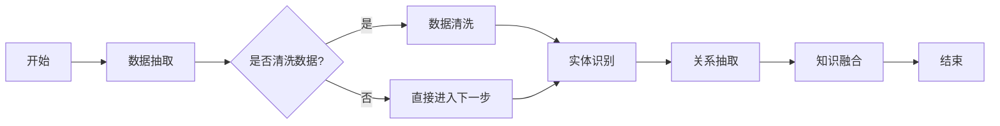
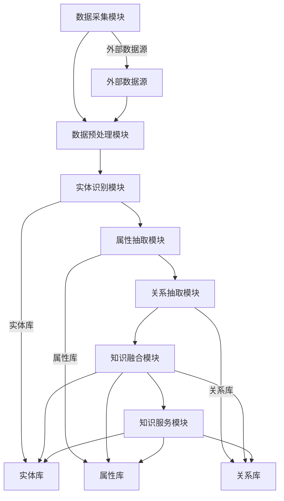

                 

### 设定书籍的整体结构
# 《知识图谱：构建和应用语义网络》

## 概述

《知识图谱：构建和应用语义网络》旨在深入探讨知识图谱的理论基础、构建方法、应用场景以及相关的算法和数学模型。本书将带领读者从零基础开始，逐步了解并掌握知识图谱的相关概念和技术，从而为后续的研究和应用奠定坚实的基础。

## 核心内容

本书分为七个主要章节，涵盖以下内容：

1. **背景介绍**：介绍知识图谱的起源、发展背景以及其重要性和应用领域。
2. **核心概念与联系**：详细阐述知识图谱的基本概念，包括实体、属性和关系的定义，以及如何构建和表示知识图谱。
3. **算法原理讲解**：介绍知识图谱构建的常用算法，如图论算法和机器学习算法，并详细解释其原理和数学模型。
4. **数学模型与公式解析**：解析知识图谱构建过程中涉及的重要数学模型和公式，并通过实例进行详细讲解。
5. **系统分析与架构设计**：介绍知识图谱系统的分析和设计方法，包括功能设计、架构设计、接口设计和交互流程。
6. **项目实战**：通过具体项目实例，展示知识图谱的构建和应用过程，包括环境安装、核心实现和案例解析。
7. **最佳实践与拓展阅读**：总结知识图谱构建的最佳实践，并提供相关的拓展阅读资源。

### 结构安排

1. **引言**：简要介绍知识图谱的概念、重要性以及本书的目的。
2. **背景介绍**：
   - **问题背景**：阐述知识图谱产生的背景和互联网时代知识增长的需求。
   - **问题描述**：分析现有知识管理与检索中的问题，如数据孤岛和搜索效率低下。
   - **问题解决**：介绍知识图谱如何解决这些问题，提高知识检索效率和实现智能化应用。
   - **边界与外延**：讨论知识图谱的层次结构、数据来源和应用领域。
   - **概念结构与核心要素组成**：定义实体、属性、关系以及RDF、OWL等数据模型，并介绍知识图谱的构建流程。

通过上述章节的安排，本书旨在提供一个系统、全面且易于理解的框架，帮助读者深入理解和掌握知识图谱的理论和实践方法。

### 让我们深入分析每一个章节的目的和内容

#### 第1章：背景介绍
**目的**：为读者提供一个知识图谱的基本背景，使读者了解知识图谱的产生和发展背景，明确知识图谱的重要性以及它在现代互联网时代的作用。

**内容**：
- **问题背景**：介绍知识图谱的产生背景，包括互联网时代的知识增长和知识管理的需求。
- **问题描述**：分析当前知识管理和检索中存在的问题，如数据孤岛、重复劳动和搜索效率低下。
- **问题解决**：阐述知识图谱如何通过其独特的结构和功能来解决上述问题，提高知识检索效率和实现智能化应用。
- **边界与外延**：讨论知识图谱的应用领域，如智能搜索、语义查询和推荐系统。
- **概念结构与核心要素组成**：定义知识图谱中的基本概念，如实体、属性和关系，并介绍常用的数据模型，如RDF和OWL，以及知识图谱的构建流程。

#### 第2章：核心概念与联系
**目的**：帮助读者理解知识图谱的基本概念和组成部分，包括实体、属性、关系以及常用的数据模型，为后续算法和实践提供理论基础。

**内容**：
- **知识图谱基本原理**：介绍RDF（资源描述框架）和OWL（Web本体语言）等数据模型，以及实体、属性和关系的表示方法。
- **知识图谱构建方法**：详细阐述知识图谱构建的常用方法，包括数据抽取、清洗、实体关系抽取以及知识融合和更新。
- **知识图谱应用场景**：分析知识图谱在不同领域的应用，如智能搜索、语义查询和推荐系统。
- **知识图谱的挑战与趋势**：讨论知识图谱构建过程中面临的挑战，如数据质量、拓扑结构优化以及开源工具和平台的发展趋势。

#### 第3章：算法原理讲解
**目的**：介绍知识图谱构建的常用算法，包括基于图论的算法和基于机器学习的算法，并解释其原理和数学模型。

**内容**：
- **知识图谱构建算法**：详细介绍基于图论的算法和基于机器学习的算法，包括数据抽取、实体关系抽取和知识融合等步骤。
- **算法mermaid流程图**：使用mermaid工具绘制知识图谱构建的流程图，便于读者直观理解。
- **算法原理与数学模型**：讲解实体匹配算法和关系抽取算法的原理，并介绍相关的数学模型和公式。
- **算法举例说明**：通过具体实例，如实体匹配和关系抽取案例，说明算法的应用和效果。

#### 第4章：数学模型与公式解析
**目的**：解析知识图谱构建过程中涉及的重要数学模型和公式，通过详细讲解和实例分析，帮助读者深入理解。

**内容**：
- **数学模型介绍**：介绍概率模型、贝叶斯网络和支持向量机等数学模型。
- **数学公式详细讲解**：详细解释概率公式、贝叶斯定理和支持向量机公式，并提供示例。
- **举例说明**：通过具体实例，如概率模型实例、贝叶斯网络实例和支持向量机实例，说明数学模型的应用。

#### 第5章：系统分析与架构设计
**目的**：介绍知识图谱系统的分析和设计方法，包括功能设计、架构设计、接口设计和交互流程，为实际应用提供系统化的解决方案。

**内容**：
- **问题场景介绍**：介绍知识图谱构建项目的背景和需求。
- **系统功能设计**：通过领域模型类图，展示系统的功能设计。
- **系统架构设计**：通过系统架构图，展示系统的整体架构设计。
- **系统接口设计**：介绍系统的接口设计和定义。
- **系统交互流程**：通过交互序列图，展示系统的交互流程。

#### 第6章：项目实战
**目的**：通过实际项目案例，展示知识图谱的构建和应用过程，包括环境安装、核心实现和案例解析，帮助读者将理论知识应用到实际项目中。

**内容**：
- **环境安装**：介绍知识图谱构建所需的软件和工具的安装过程。
- **系统核心实现**：通过源代码解读，展示知识图谱构建的核心实现过程。
- **应用解读与分析**：分析具体案例，讲解知识图谱在实际应用中的效果和优势。
- **详细讲解剖析**：深入剖析技术细节，帮助读者理解知识图谱构建的难点和关键点。
- **项目小结**：总结项目的经验和教训，提出改进建议。

#### 第7章：最佳实践与拓展阅读
**目的**：总结知识图谱构建的最佳实践，并提供相关的拓展阅读资源，帮助读者进一步深入学习和研究。

**内容**：
- **最佳实践**：总结知识图谱构建过程中的最佳实践经验，包括数据清洗、实体关系抽取和知识融合等关键步骤。
- **小结与注意事项**：总结知识图谱构建的关键点和注意事项，帮助读者避免常见问题。
- **拓展阅读**：推荐相关书籍和文章，为读者提供进一步学习的资源。

通过上述章节的深入分析和详细内容安排，本书旨在为读者提供一个全面、系统且易于理解的知识图谱学习框架，帮助读者从理论到实践，全面掌握知识图谱的技术和方法。

## 第1章：背景介绍

### 1.1 问题背景

在互联网快速发展的今天，信息量呈现出爆炸式增长。大量的数据被不断生成和存储，这不仅为人类社会带来了丰富的知识资源，也带来了新的挑战。传统的知识管理和检索方法，如基于关键词的搜索，已经无法满足用户日益复杂的信息需求。数据孤岛、信息过载、重复劳动等问题日益凸显，这使得我们需要更高效、更智能的知识管理和检索手段。

知识图谱作为一种新型语义网络，正是为了解决这些挑战而诞生的。它通过将实体、属性和关系以图结构进行表示，使得信息之间的关联更加清晰和易于理解。知识图谱的核心优势在于其能够捕捉到信息之间的复杂关系，从而提高知识检索的效率和准确性。

### 1.2 问题描述

在当前的信息环境中，存在以下几个主要问题：

- **数据孤岛**：大量数据分布在不同的系统和平台中，缺乏统一的视图和整合手段，导致信息无法有效共享和利用。
- **重复劳动**：由于缺乏有效的知识管理，用户经常需要重复进行相同或类似的任务，降低了工作效率。
- **搜索效率低下**：传统的关键词搜索方法往往只能找到表面信息，难以发现深层次的关联和知识。
- **知识关联缺失**：信息之间的内在联系没有被充分挖掘和表达，导致知识难以被系统性地利用。

### 1.3 问题解决

知识图谱通过构建语义网络，实现了以下目标：

- **知识整合**：将分散在不同系统和平台的数据进行整合，形成统一的知识视图。
- **智能化检索**：利用知识图谱中的关系，实现基于语义的精准搜索，提高检索效率和准确性。
- **知识关联挖掘**：通过分析实体之间的关系，发现新的知识关联，丰富知识的深度和广度。
- **自动化推理**：利用图结构进行逻辑推理，实现智能化决策和支持。

### 1.4 边界与外延

知识图谱的构建和应用涉及多个层次和领域，其边界和范围可以概括为以下几点：

- **层次结构**：知识图谱通常包括底层的数据层、中间层的语义层和顶层的服务层。数据层负责存储原始数据，语义层负责处理和表示数据之间的关联，服务层提供对外接口和应用。
- **数据来源**：知识图谱的数据来源广泛，包括结构化数据、非结构化数据和半结构化数据。数据来源可以是内部系统、外部数据库、网络爬虫和人工标注等。
- **应用领域**：知识图谱在多个领域具有广泛的应用，如搜索引擎、智能问答、推荐系统、智能助理和知识管理等。

### 1.5 概念结构与核心要素组成

知识图谱的核心概念包括实体、属性和关系，这些概念组成了知识图谱的基本结构。

- **实体**：知识图谱中的实体是描述事物的基本单元，可以是人物、地点、组织或事件等。实体通常具有唯一的标识符，用于区分不同的实体。
- **属性**：实体具有一系列的属性，用于描述实体的特征和属性。属性通常包括名称、类型、值等。
- **关系**：实体之间的关系描述了知识图谱中的语义关联。关系可以是简单的二元关系，也可以是复杂的多元关系。

在知识图谱中，常用的数据模型包括RDF（资源描述框架）和OWL（Web本体语言）。RDF是一种基于图的数据模型，用于表示实体、属性和关系。OWL则是在RDF基础上扩展的一种本体语言，用于定义更加复杂和精细的语义描述。

知识图谱的构建流程通常包括以下几个步骤：

1. **数据采集**：从各种数据源中收集原始数据。
2. **数据预处理**：清洗和转换原始数据，使其符合知识图谱的表示要求。
3. **实体识别**：从数据中识别出实体，并为每个实体生成唯一的标识符。
4. **属性抽取**：从数据中提取实体的属性信息。
5. **关系抽取**：分析实体之间的关联，建立实体之间的关系。
6. **知识融合**：将多个数据源中的信息进行整合，构建完整的知识图谱。

通过上述步骤，我们可以构建出一个结构化、语义丰富的知识图谱，为后续的智能应用提供坚实的基础。

## 第2章：核心概念与联系

### 2.1 知识图谱基本原理

知识图谱是一种用于表示语义信息的网络结构，它通过实体、属性和关系来捕捉现实世界中事物之间的关联。在知识图谱中，实体是描述事物的基本单元，属性用于描述实体的特征，而关系则表示实体之间的语义联系。

- **实体**：实体可以是人、地点、组织、事件等。在知识图谱中，每个实体都有唯一的标识符，如URI（统一资源标识符）。实体的例子包括“张三”、“北京”、“微软”等。
- **属性**：属性用于描述实体的特征，如实体的名称、类型、年龄等。属性的例子包括“姓名”、“所在地”、“成立时间”等。
- **关系**：关系表示实体之间的语义联系，可以是简单的二元关系，也可以是复杂的多元关系。关系的例子包括“是”、“位于”、“成立”等。

在知识图谱中，常用的数据模型包括RDF（资源描述框架）和OWL（Web本体语言）。RDF是一种基于图的数据模型，用于表示实体、属性和关系。OWL则是在RDF基础上扩展的一种本体语言，用于定义更加复杂和精细的语义描述。

RDF的核心概念包括：

- **主体**（Subject）：表示一个实体。
- **谓词**（Predicate）：表示实体的一个属性。
- **客体**（Object）：表示属性的具体值。

一个典型的RDF三元组（Subject, Predicate, Object）可以表示为：

```
张三 hasName "张三"
```

OWL在RDF的基础上增加了本体（Ontology）的概念，用于定义实体的类别、属性的类型以及属性之间的约束关系。OWL允许我们定义更加复杂和抽象的语义描述，使得知识图谱能够表达更加丰富的信息。

### 2.2 知识图谱构建方法

构建知识图谱的过程涉及多个步骤，包括数据抽取、清洗、实体关系抽取以及知识融合和更新。以下是这些步骤的详细描述：

- **数据抽取**：从各种数据源中提取原始数据，这些数据可以是结构化的（如数据库）、半结构化的（如XML、JSON）或非结构化的（如文本、图像）。数据抽取的主要任务是识别实体和关系，并将其转化为适合知识图谱表示的形式。

- **数据清洗**：对抽取的数据进行清洗和预处理，以去除噪声、纠正错误和填充缺失值。数据清洗是构建高质量知识图谱的重要环节，因为数据的质量直接影响知识图谱的准确性和可靠性。

- **实体识别**：从清洗后的数据中识别出实体，并为每个实体生成唯一的标识符。实体识别是知识图谱构建的基础步骤，常用的方法包括基于规则的方法和基于机器学习的方法。

- **属性抽取**：从数据中提取实体的属性信息，并将其与相应的实体关联起来。属性抽取的关键在于理解数据的语义，以便正确地构建实体和属性之间的关联。

- **关系抽取**：分析实体之间的关联，建立实体之间的关系。关系抽取是知识图谱构建的核心步骤，它涉及到语义分析和信息抽取等技术。关系抽取的方法包括基于规则的方法、基于统计的方法和基于机器学习的方法。

- **知识融合**：将来自不同数据源的信息进行整合，构建完整的知识图谱。知识融合涉及到数据对齐、实体消歧和知识合并等技术，目的是消除数据中的冗余和冲突，提高知识图谱的完整性。

- **知识更新**：知识图谱不是静态的，它需要不断地更新以反映现实世界的变化。知识更新包括添加新的实体和关系、修正错误以及删除过时的信息。

### 2.3 知识图谱应用场景

知识图谱在多个领域具有广泛的应用，以下是一些典型的应用场景：

- **智能搜索**：知识图谱可以用于构建智能搜索引擎，通过理解用户的查询意图和实体之间的关联，提供更加准确和个性化的搜索结果。

- **语义查询**：知识图谱支持基于语义的查询，用户可以使用自然语言进行查询，系统则根据知识图谱中的语义关联生成答案。

- **推荐系统**：知识图谱可以用于推荐系统，通过分析实体之间的关联，为用户提供相关的内容或服务推荐。

- **知识管理**：知识图谱可以用于企业知识管理，帮助组织内部的知识共享和协作，提高知识利用效率。

- **智能助理**：知识图谱可以用于构建智能助理，如智能客服、智能导购等，通过理解用户的意图和提供实时信息，提高用户体验。

- **知识发现**：知识图谱可以用于知识发现，通过分析实体之间的关系，发现新的知识关联和模式。

### 2.4 知识图谱的挑战与趋势

尽管知识图谱具有巨大的潜力，但在实际应用中仍面临一系列挑战：

- **数据质量**：知识图谱的质量很大程度上取决于原始数据的质量。数据中的噪声、错误和缺失值都会影响知识图谱的准确性。

- **数据一致性**：不同数据源中的数据可能存在不一致的情况，这给知识融合和更新带来了挑战。

- **拓扑结构优化**：知识图谱的拓扑结构对其性能和应用效果有很大影响，如何优化拓扑结构是一个重要问题。

- **开源工具与平台**：目前开源的知识图谱工具和平台发展迅速，但如何选择和使用这些工具，以及如何搭建高效的知识图谱系统，仍然需要深入研究和实践。

未来，知识图谱的发展趋势包括：

- **人工智能的融合**：知识图谱与人工智能技术的融合将使得知识图谱更加智能化，能够更好地理解和处理复杂问题。

- **多模态知识图谱**：未来的知识图谱将不仅仅局限于文本数据，还包括图像、音频、视频等多模态数据，从而实现更加全面和丰富的语义表示。

- **实时知识图谱**：随着实时数据处理的技术的进步，实时知识图谱将能够更快地响应实时变化，为用户提供更加及时和准确的信息。

- **知识图谱的生态体系**：知识图谱将逐渐形成完整的生态体系，包括数据采集、存储、处理、分析和应用等各个环节，形成一体化的解决方案。

通过深入理解和应用知识图谱的基本原理和构建方法，我们可以更好地应对这些挑战，并把握未来知识图谱发展的趋势。

### 3.1 知识图谱构建算法

知识图谱的构建算法是知识图谱构建过程中的关键步骤，它们决定了数据如何被有效抽取、清洗、实体和关系如何被识别和建立，以及如何进行知识融合和更新。以下是构建知识图谱的几种常见算法，包括基于图论的算法和基于机器学习的算法。

#### 基于图论的算法

基于图论的算法是知识图谱构建的基础，主要利用图结构来表示实体和关系，并利用图算法来优化知识图谱的结构和性能。

- **图论基本概念**：图（Graph）由节点（Vertex）和边（Edge）组成。节点表示实体，边表示实体之间的关系。图的基本操作包括节点的添加、删除和边的添加、删除等。

- **图嵌入算法**：图嵌入（Graph Embedding）是将图中的节点映射到低维空间的一种技术。常见的图嵌入算法包括DeepWalk、Node2Vec和GraphSAGE等。这些算法通过随机游走（Random Walk）或图注意力机制（Graph Attention Mechanism）生成节点的向量表示。

- **图聚类算法**：图聚类（Graph Clustering）用于将图中的节点划分为多个簇，以发现图中的结构特征。常见的图聚类算法包括K-Means、谱聚类（Spectral Clustering）和基于密度的聚类（Density-Based Clustering）等。

- **图分解算法**：图分解（Graph Decomposition）是将图分解为多个子图或层，以简化图的结构和计算复杂度。常见的图分解算法包括矩阵分解（Matrix Factorization）和多尺度分解（Multi-scale Decomposition）等。

- **图同构检测算法**：图同构检测（Graph Isomorphism Detection）用于检测两个图是否具有相同的结构。常见的图同构检测算法包括Weisfeiler-Lehman算法和两阶段算法等。

#### 基于机器学习的算法

基于机器学习的算法利用大量数据训练模型，从而自动识别和建立实体和关系。

- **监督学习算法**：监督学习算法需要标注的数据集来训练模型。常见的监督学习算法包括分类（Classification）和回归（Regression）等。在知识图谱构建中，监督学习算法常用于实体分类、关系分类和实体识别。

  - **实体分类**：实体分类是将未标注的实体归类到预定义的类别中。常见的算法包括朴素贝叶斯（Naive Bayes）、支持向量机（Support Vector Machine，SVM）和随机森林（Random Forest）等。

  - **关系分类**：关系分类是将实体之间的未标注关系归类到预定义的关系类别中。常见的算法包括条件概率模型、图神经网络（Graph Neural Networks，GNN）和注意力机制（Attention Mechanism）等。

- **无监督学习算法**：无监督学习算法不需要标注的数据集，通过自动发现数据中的模式和结构来构建知识图谱。常见的无监督学习算法包括聚类（Clustering）、异常检测（Anomaly Detection）和生成模型（Generative Models）等。

  - **聚类**：聚类是将未标注的数据分为多个簇，以发现数据中的隐含结构。常见的算法包括K-Means、DBSCAN和谱聚类等。

  - **异常检测**：异常检测用于发现数据中的异常或离群点。常见的算法包括基于统计的方法、基于邻近度的方法和基于深度学习的方法等。

  - **生成模型**：生成模型通过学习数据的概率分布，生成新的数据点。常见的生成模型包括马尔可夫链（Markov Chain）、变分自编码器（Variational Autoencoder，VAE）和生成对抗网络（Generative Adversarial Network，GAN）等。

#### 算法对比与选择

选择合适的算法取决于具体的应用场景和数据特征：

- **数据量**：对于大规模数据集，基于机器学习的算法通常具有更好的性能，因为它们能够自动从数据中学习模式和结构。而基于图论的算法在处理大规模图时可能面临计算复杂度高的问题。

- **数据质量**：对于高质量标注数据，监督学习算法是最佳选择。而对于缺乏标注数据的情况，无监督学习算法则更为适用。

- **任务类型**：对于实体分类和关系分类等明确的任务，监督学习算法是首选。而对于聚类、异常检测等任务，无监督学习算法则更为合适。

- **实时性**：基于图论的算法通常具有更好的实时性，因为它们直接在图结构上进行操作。而基于机器学习的算法可能需要更多的预处理和时间来训练模型。

通过选择合适的算法，并综合考虑数据特征和应用需求，我们可以构建出高效、准确的知识图谱，从而实现智能化的信息管理和检索。

### 3.2 算法mermaid流程图

为了更直观地展示知识图谱构建过程中的算法步骤，我们可以使用mermaid工具绘制流程图。mermaid是一种基于Markdown的图形化工具，可以方便地绘制流程图、时序图和Gantt图等。

以下是一个示例，展示了数据抽取、实体识别、关系抽取和知识融合等步骤的mermaid流程图：



在上述流程图中，我们从数据抽取开始，然后根据是否需要数据清洗进行分支。如果需要清洗，则进行数据清洗；否则，直接进入实体识别。实体识别后，进入关系抽取步骤，最后进行知识融合，完成知识图谱的构建。

通过mermaid流程图，我们可以清晰地展示算法的执行步骤和流程，有助于读者更好地理解和分析知识图谱的构建过程。

### 3.3 算法原理与数学模型

在知识图谱构建过程中，常用的算法包括实体匹配算法和关系抽取算法。这些算法的核心在于如何从原始数据中识别实体和建立实体之间的关系。以下将详细阐述这些算法的原理和相关的数学模型。

#### 实体匹配算法原理

实体匹配算法的目的是将不同数据源中描述同一实体的记录进行匹配，从而确保知识图谱中的实体具有唯一性和一致性。实体匹配的关键在于如何将两个或多个实体表示为相似的向量，并计算它们之间的相似度。

- **基于特征的匹配**：这种方法通过提取实体特征（如名称、别名、属性值等）来计算相似度。常用的方法包括余弦相似度、Jaccard相似度等。例如，两个实体的特征向量可以表示为：

  $$
  \vec{v}_1 = [v_{11}, v_{12}, ..., v_{1n}]
  $$

  $$
  \vec{v}_2 = [v_{21}, v_{22}, ..., v_{2n}]
  $$

  它们的相似度可以用余弦相似度表示为：

  $$
  similarity(\vec{v}_1, \vec{v}_2) = \frac{\vec{v}_1 \cdot \vec{v}_2}{\|\vec{v}_1\| \|\vec{v}_2\|}
  $$

- **基于距离的匹配**：这种方法通过计算实体之间的距离（如欧氏距离、曼哈顿距离等）来衡量相似度。例如，两个实体的特征向量之间的欧氏距离可以表示为：

  $$
  distance(\vec{v}_1, \vec{v}_2) = \sqrt{\sum_{i=1}^{n} (v_{1i} - v_{2i})^2}
  $$

  实体的相似度则可以表示为：

  $$
  similarity(\vec{v}_1, \vec{v}_2) = 1 - \frac{distance(\vec{v}_1, \vec{v}_2)}{max\{distance(\vec{v}_1, \vec{v}_2)\}}
  $$

- **基于模型匹配**：这种方法利用机器学习模型（如朴素贝叶斯、决策树等）来预测实体之间的匹配关系。通过训练模型，可以将实体匹配问题转化为分类问题，从而实现自动化匹配。

#### 关系抽取算法原理

关系抽取算法的目的是从文本数据中识别出实体之间的关系。关系抽取通常包括两个步骤：实体识别和关系分类。

- **实体识别**：实体识别是指从文本中识别出实体，并为每个实体生成唯一的标识符。常用的方法包括基于规则的方法和基于机器学习的方法。

  - **基于规则的方法**：这种方法通过预定义的规则来识别实体。例如，使用正则表达式匹配文本中的特定格式。

  - **基于机器学习的方法**：这种方法利用大量标注数据训练模型，从而自动识别实体。常见的模型包括朴素贝叶斯、支持向量机、决策树和深度学习模型（如卷积神经网络、循环神经网络等）。

- **关系分类**：关系分类是指从文本中识别出实体之间的关系，并将关系归类到预定义的关系类别中。常用的方法包括基于规则的方法和基于机器学习的方法。

  - **基于规则的方法**：这种方法通过预定义的规则来分类关系。例如，使用模板匹配来识别特定的关系模式。

  - **基于机器学习的方法**：这种方法利用大量标注数据训练模型，从而自动分类关系。常见的模型包括朴素贝叶斯、支持向量机、决策树和深度学习模型。

#### 关系抽取中的数学模型

关系抽取中的数学模型主要涉及概率模型和分类模型。

- **概率模型**：概率模型用于计算实体之间关系的概率。常见的模型包括朴素贝叶斯（Naive Bayes）和贝叶斯网络（Bayesian Network）。

  - **朴素贝叶斯**：朴素贝叶斯模型是一种基于贝叶斯定理的概率模型，用于计算实体之间关系的概率。其公式为：

    $$
    P(A|B) = \frac{P(B|A)P(A)}{P(B)}
    $$

  - **贝叶斯网络**：贝叶斯网络是一种表示实体之间条件依赖关系的图形模型。它通过概率图结构来表示实体之间的概率关系。

- **分类模型**：分类模型用于将实体之间的关系归类到预定义的类别中。常见的模型包括逻辑回归（Logistic Regression）、支持向量机（Support Vector Machine，SVM）和决策树（Decision Tree）。

  - **逻辑回归**：逻辑回归是一种概率型分类模型，通过最大化似然估计来预测实体之间的关系。其公式为：

    $$
    P(Y=1|X) = \frac{1}{1 + \exp(-\beta^T X)}
    $$

  - **支持向量机**：支持向量机是一种基于最大间隔分类的模型，通过寻找最佳超平面来划分实体之间的关系。其公式为：

    $$
    w^* = \arg\min_w \frac{1}{2} ||w||^2 \\
    s.t. \ y_i (w^T x_i + b) \geq 1
    $$

  - **决策树**：决策树是一种树形结构模型，通过一系列规则来划分实体之间的关系。每个节点表示一个特征，每个分支表示该特征的不同取值，叶节点表示实体之间的关系类别。

通过上述算法原理和数学模型的阐述，我们可以更好地理解知识图谱构建过程中实体匹配和关系抽取的核心技术。这些算法和模型不仅有助于实现高效的实体识别和关系分类，还为知识图谱的智能化应用提供了坚实的基础。

### 3.4 算法举例说明

为了更直观地展示算法的实际应用，我们将通过具体案例详细说明实体匹配和关系抽取的过程。

#### 实体匹配案例

假设有两个数据源，分别存储关于人物的信息，数据如下：

**数据源A：**
- 张三：北京大学校友
- 李四：清华大学校友
- 王五：复旦大学校友

**数据源B：**
- 张三：北京大学毕业生
- 李四：清华大学毕业生
- 王六：复旦大学毕业生

步骤1：特征提取

从上述数据中，我们可以提取以下特征：
- 实体名称（如张三、李四、王五、王六）
- 学校名称（如北京大学、清华大学、复旦大学）

步骤2：特征向量表示

将每个实体的特征表示为一个向量。例如，对于张三，其特征向量为：
- 张三：[1, 1, 0, 0]（表示北京大学校友和清华大学校友）

步骤3：计算相似度

使用余弦相似度计算数据源A中的每个实体与数据源B中实体的相似度。例如，计算张三和数据源B中的张三的相似度：
- 张三：[1, 1, 0, 0]
- 数据源B中的张三：[1, 1, 0, 0]
- 相似度：$$ \frac{1 \times 1 + 1 \times 1 + 0 \times 0 + 0 \times 0}{\sqrt{1^2 + 1^2 + 0^2 + 0^2} \cdot \sqrt{1^2 + 1^2 + 0^2 + 0^2}} = 1 $$

步骤4：匹配结果

由于相似度为1，表示数据源A中的张三与数据源B中的张三完全匹配。同理，可以计算其他实体之间的相似度，并根据设定阈值确定是否匹配。

#### 关系抽取案例

假设有一段文本描述如下：

“李四在北京大学读书期间，参加了多次学术讨论会，与同学王五建立了深厚的友谊。”

步骤1：实体识别

从文本中识别出实体：
- 李四
- 北京大学
- 王五

步骤2：关系分类

根据文本内容和预定义的关系类别（如“就读于”、“参加”、“建立友谊”等），确定李四与北京大学的关系为“就读于”，与王五的关系为“建立友谊”。

步骤3：构建知识图谱

将识别出的实体和关系构建成知识图谱：
- 李四（实体） --> 北京大学（属性：就读于）
- 李四（实体） --> 王五（属性：建立友谊）

通过上述实例，我们可以看到实体匹配和关系抽取的具体实现过程，从而更好地理解这些算法在实际应用中的效果和重要性。

### 4.1 数学模型介绍

在知识图谱的构建和应用中，数学模型起到了关键作用。这些模型不仅帮助我们理解和描述实体、属性和关系，还为我们提供了强大的工具来处理和优化数据。以下是几种在知识图谱中常用的数学模型，包括概率模型、贝叶斯网络和支持向量机。

#### 概率模型

概率模型是知识图谱中常用的基础模型，主要用于处理不确定性问题。它通过概率分布来描述实体之间的关系和属性的概率。

- **贝叶斯网络**：贝叶斯网络是一种图形模型，它通过有向无环图（DAG）表示实体之间的关系。每个节点表示一个随机变量，边表示节点之间的条件依赖关系。贝叶斯网络的核心是条件概率表（CPT），它描述了每个节点在给定其他节点条件下的概率分布。

  贝叶斯网络的公式表示为：
  $$
  P(X=x_i | X_1=x_1, X_2=x_2, ..., X_n=x_n) = \prod_{i=1}^{n} P(X_i=x_i | X_{pa_i})
  $$

  其中，\(X_1, X_2, ..., X_n\) 是贝叶斯网络中的节点，\(X_{pa_i}\) 是节点 \(X_i\) 的父节点集合。

- **马尔可夫模型**：马尔可夫模型是一种无向图模型，它假设当前状态只依赖于前一个状态，而与更早的状态无关。马尔可夫模型常用于序列数据的预测，如自然语言处理中的词序列。

  马尔可夫模型的公式表示为：
  $$
  P(X_t=x_t | X_{t-1}=x_{t-1}, X_{t-2}=x_{t-2}, ..., X_1=x_1) = P(X_t=x_t | X_{t-1}=x_{t-1})
  $$

- **高斯模型**：高斯模型是一种连续概率分布模型，它假设数据点遵循正态分布。高斯模型常用于数据清洗和异常检测。

  高斯模型的公式表示为：
  $$
  P(X=x) = \frac{1}{\sqrt{2\pi\sigma^2}} e^{-\frac{(x-\mu)^2}{2\sigma^2}}
  $$

  其中，\(\mu\) 是均值，\(\sigma\) 是标准差。

#### 贝叶斯网络

贝叶斯网络是概率模型的一种扩展，它通过有向无环图（DAG）表示实体之间的条件依赖关系。贝叶斯网络的核心是条件概率表（CPT），它描述了每个节点在给定其他节点条件下的概率分布。

- **条件概率表（CPT）**：条件概率表是一个表格，它列出了每个节点在给定其父节点条件下的概率分布。例如，对于节点 \(X\) 有两个父节点 \(Y\) 和 \(Z\)，其条件概率表为：

  | Y | Z | P(X=x|Y=y, Z=z) |
  |---|---|---|
  | 0 | 0 | 0.3 |
  | 0 | 1 | 0.4 |
  | 1 | 0 | 0.2 |
  | 1 | 1 | 0.5 |

- **贝叶斯推理**：贝叶斯推理是一种基于贝叶斯网络进行推理的方法，它通过条件概率表计算给定一部分观察到的数据下，未知变量的概率分布。贝叶斯推理的核心公式为贝叶斯定理：

  $$
  P(X=x|O=o) = \frac{P(O=o|X=x)P(X=x)}{P(O=o)}
  $$

  其中，\(P(X=x|O=o)\) 是在观察到 \(O\) 的情况下 \(X\) 等于 \(x\) 的概率，\(P(O=o|X=x)\) 是在 \(X\) 等于 \(x\) 的情况下 \(O\) 等于 \(o\) 的概率，\(P(X=x)\) 是 \(X\) 等于 \(x\) 的先验概率，\(P(O=o)\) 是 \(O\) 等于 \(o\) 的边缘概率。

#### 支持向量机

支持向量机（SVM）是一种强大的分类和回归模型，它通过寻找最佳超平面来划分数据。在知识图谱中，SVM常用于实体分类和关系分类。

- **线性SVM**：线性SVM在特征空间中寻找最佳超平面，使得不同类别的数据点在超平面两侧的间隔最大。线性SVM的公式为：

  $$
  \min_{w,b} \frac{1}{2} ||w||^2 \\
  s.t. \ y_i (w^T x_i + b) \geq 1
  $$

  其中，\(w\) 是权重向量，\(b\) 是偏置项，\(x_i\) 是特征向量，\(y_i\) 是标签。

- **核SVM**：当特征空间是高维的或者无法显式表示时，核SVM通过引入核函数将原始数据映射到高维特征空间，然后在高维特征空间中寻找最佳超平面。常见的核函数包括线性核、多项式核和径向基函数（RBF）核。

  核函数的公式为：
  $$
  K(x_i, x_j) = \phi(x_i)^T \phi(x_j)
  $$

  其中，\(K(x_i, x_j)\) 是核函数，\(\phi(x_i)\) 是高维特征空间中的映射。

通过介绍概率模型、贝叶斯网络和支持向量机，我们可以看到这些数学模型在知识图谱构建和应用中的重要作用。它们不仅为我们提供了理论支持，还为我们提供了强大的工具来处理复杂的问题，从而实现高效的实体识别、关系抽取和知识融合。

### 4.2 数学公式详细讲解

在知识图谱构建和应用中，数学公式是理解和实现算法的核心。以下是几种关键数学公式的详细讲解，包括概率公式、贝叶斯定理和支持向量机公式。

#### 概率公式

概率公式是概率论中最基本的概念，用于描述事件发生的可能性。以下是几个常用的概率公式：

1. **条件概率**：条件概率是指在某个事件发生的条件下，另一个事件发生的概率。条件概率公式为：

   $$
   P(A|B) = \frac{P(A \cap B)}{P(B)}
   $$

   其中，\(P(A|B)\) 表示在事件B发生的条件下，事件A发生的概率，\(P(A \cap B)\) 表示事件A和事件B同时发生的概率，\(P(B)\) 表示事件B发生的概率。

2. **全概率公式**：全概率公式用于计算一个事件的总概率，通过将这个事件分解为若干个子事件，然后利用条件概率公式计算得到。全概率公式为：

   $$
   P(A) = \sum_{i=1}^{n} P(A|B_i)P(B_i)
   $$

   其中，\(P(A)\) 表示事件A的总概率，\(P(A|B_i)\) 表示在事件\(B_i\) 发生的条件下，事件A发生的概率，\(P(B_i)\) 表示事件\(B_i\) 发生的概率。

3. **贝叶斯定理**：贝叶斯定理是概率论中的一个重要公式，用于计算在给定某个条件下，某个事件发生的后验概率。贝叶斯定理公式为：

   $$
   P(A|B) = \frac{P(B|A)P(A)}{P(B)}
   $$

   其中，\(P(A|B)\) 是在事件B发生的条件下，事件A的后验概率，\(P(B|A)\) 是在事件A发生的条件下，事件B的条件概率，\(P(A)\) 是事件A的先验概率，\(P(B)\) 是事件B的总概率。

#### 贝叶斯定理

贝叶斯定理是概率论中的一个核心公式，它在知识图谱的构建和应用中有着广泛的应用。贝叶斯定理的公式已经在上一节中给出：

$$
P(A|B) = \frac{P(B|A)P(A)}{P(B)}
$$

其中，\(P(A|B)\) 是后验概率，即给定事件B发生的情况下，事件A发生的概率；\(P(B|A)\) 是似然概率，即在事件A发生的情况下，事件B发生的概率；\(P(A)\) 是事件A的先验概率，即在没有其他信息的情况下，事件A发生的概率；\(P(B)\) 是边缘概率，即在没有其他信息的情况下，事件B发生的概率。

贝叶斯定理的应用示例：

假设我们要计算在某个城市下雨的情况下，今天是星期几的概率。我们可以通过以下步骤进行计算：

1. 计算先验概率：
   - \(P(\text{星期一}|\text{下雨})\)
   - \(P(\text{星期二}|\text{下雨})\)
   - \(P(\text{星期三}|\text{下雨})\)
   - \(P(\text{星期四}|\text{下雨})\)
   - \(P(\text{星期五}|\text{下雨})\)
   - \(P(\text{星期六}|\text{下雨})\)
   - \(P(\text{星期日}|\text{下雨})\)

2. 计算似然概率：
   - \(P(\text{下雨}|\text{星期一})\)
   - \(P(\text{下雨}|\text{星期二})\)
   - \(P(\text{下雨}|\text{星期三})\)
   - \(P(\text{下雨}|\text{星期四})\)
   - \(P(\text{下雨}|\text{星期五})\)
   - \(P(\text{下雨}|\text{星期六})\)
   - \(P(\text{下雨}|\text{星期日})\)

3. 计算边缘概率：
   - \(P(\text{下雨})\)
   - \(P(\text{星期一})\)
   - \(P(\text{星期二})\)
   - \(P(\text{星期三})\)
   - \(P(\text{星期四})\)
   - \(P(\text{星期五})\)
   - \(P(\text{星期六})\)
   - \(P(\text{星期日})\)

4. 利用贝叶斯定理计算后验概率：
   - \(P(\text{星期一}|\text{下雨}) = \frac{P(\text{下雨}|\text{星期一})P(\text{星期一})}{P(\text{下雨})}\)
   - \(P(\text{星期二}|\text{下雨}) = \frac{P(\text{下雨}|\text{星期二})P(\text{星期二})}{P(\text{下雨})}\)
   - \(P(\text{星期三}|\text{下雨}) = \frac{P(\text{下雨}|\text{星期三})P(\text{星期三})}{P(\text{下雨})}\)
   - \(P(\text{星期四}|\text{下雨}) = \frac{P(\text{下雨}|\text{星期四})P(\text{星期四})}{P(\text{下雨})}\)
   - \(P(\text{星期五}|\text{下雨}) = \frac{P(\text{下雨}|\text{星期五})P(\text{星期五})}{P(\text{下雨})}\)
   - \(P(\text{星期六}|\text{下雨}) = \frac{P(\text{下雨}|\text{星期六})P(\text{星期六})}{P(\text{下雨})}\)
   - \(P(\text{星期日}|\text{下雨}) = \frac{P(\text{下雨}|\text{星期日})P(\text{星期日})}{P(\text{下雨})}\)

通过上述步骤，我们可以计算在下雨的情况下，每个星期几的概率，从而得到最有可能的答案。

#### 支持向量机公式

支持向量机（SVM）是一种强大的分类模型，它在知识图谱的构建中有着广泛的应用。以下是SVM的核心公式：

1. **线性SVM**：线性SVM在特征空间中寻找最佳超平面，使得不同类别的数据点在超平面两侧的间隔最大。线性SVM的目标是最小化损失函数，其公式为：

   $$
   \min_{w,b} \frac{1}{2} ||w||^2 \\
   s.t. \ y_i (w^T x_i + b) \geq 1
   $$

   其中，\(w\) 是权重向量，\(b\) 是偏置项，\(x_i\) 是特征向量，\(y_i\) 是标签。

2. **核SVM**：当特征空间是高维的或者无法显式表示时，核SVM通过引入核函数将原始数据映射到高维特征空间，然后在高维特征空间中寻找最佳超平面。常见的核函数包括线性核、多项式核和径向基函数（RBF）核。核函数的公式为：

   $$
   K(x_i, x_j) = \phi(x_i)^T \phi(x_j)
   $$

   其中，\(K(x_i, x_j)\) 是核函数，\(\phi(x_i)\) 是高维特征空间中的映射。

3. **支持向量**：支持向量是那些位于决策边界上的数据点，它们对分类决策有显著影响。支持向量机的目标是在最大化间隔的同时，最小化支持向量的数量。

通过详细讲解概率公式、贝叶斯定理和支持向量机公式，我们可以更好地理解这些数学模型在知识图谱构建中的应用和重要性。这些公式不仅为我们提供了理论基础，还为我们提供了实用的工具来处理复杂的问题，从而实现高效的实体识别、关系抽取和知识融合。

### 4.3 举例说明

为了更好地理解上述数学模型的应用，我们将通过具体实例来演示概率模型、贝叶斯网络和支持向量机在实际场景中的使用。

#### 概率模型实例

假设我们有一个简单的数据集，记录了某个地区一周内的天气情况，包括星期一至星期日的天气概率。数据如下：

| 星期   | 阴天概率 | 晴天概率 |
|--------|----------|----------|
| 星期一 | 0.3      | 0.7      |
| 星期二 | 0.4      | 0.6      |
| 星期三 | 0.2      | 0.8      |
| 星期四 | 0.5      | 0.5      |
| 星期五 | 0.6      | 0.4      |
| 星期六 | 0.7      | 0.3      |
| 星期日 | 0.8      | 0.2      |

我们想计算在某个特定日子（例如星期五）下阴天和晴天的概率。

1. **条件概率计算**：

   根据条件概率公式 \(P(A|B) = \frac{P(A \cap B)}{P(B)}\)，我们可以计算每个星期阴天和晴天的条件概率。

   对于阴天：

   $$
   P(\text{阴天}|\text{星期五}) = \frac{P(\text{阴天} \cap \text{星期五})}{P(\text{星期五})} = \frac{0.6}{0.6 + 0.4} = \frac{3}{5}
   $$

   对于晴天：

   $$
   P(\text{晴天}|\text{星期五}) = \frac{P(\text{晴天} \cap \text{星期五})}{P(\text{星期五})} = \frac{0.4}{0.6 + 0.4} = \frac{2}{5}
   $$

   通过这个计算，我们可以得出在星期五阴天的概率为3/5，晴天的概率为2/5。

2. **全概率计算**：

   我们还可以计算整个数据集中阴天和晴天的总概率。

   阴天的总概率：

   $$
   P(\text{阴天}) = P(\text{阴天}|\text{星期一})P(\text{星期一}) + P(\text{阴天}|\text{星期二})P(\text{星期二}) + ... + P(\text{阴天}|\text{星期日})P(\text{星期日}) = 0.3 \times 0.1 + 0.4 \times 0.1 + 0.2 \times 0.1 + 0.5 \times 0.1 + 0.6 \times 0.1 + 0.7 \times 0.1 + 0.8 \times 0.1 = 0.4
   $$

   晴天的总概率：

   $$
   P(\text{晴天}) = P(\text{晴天}|\text{星期一})P(\text{星期一}) + P(\text{晴天}|\text{星期二})P(\text{星期二}) + ... + P(\text{晴天}|\text{星期日})P(\text{星期日}) = 0.7 \times 0.1 + 0.6 \times 0.1 + 0.8 \times 0.1 + 0.5 \times 0.1 + 0.4 \times 0.1 + 0.3 \times 0.1 + 0.2 \times 0.1 = 0.6
   $$

   因此，整个数据集中阴天的概率为0.4，晴天的概率为0.6。

#### 贝叶斯网络实例

假设我们有一个关于疾病诊断的贝叶斯网络。疾病为“流感”，症状包括“发烧”、“咳嗽”和“嗓子痛”。已知这些症状的概率以及它们之间的条件依赖关系如下：

| 症状 | 先验概率 | 条件依赖关系 |
|------|----------|-------------|
| 发烧 | 0.5      | 无条件依赖  |
| 咳嗽 | 0.4      | 无条件依赖  |
| 嗓子痛 | 0.3      | 无条件依赖  |
| 流感 | 0.2      | 发烧：0.8，咳嗽：0.7，嗓子痛：0.6 |

我们想计算在一个人同时出现发烧、咳嗽和嗓子痛的情况下，他患流感的后验概率。

1. **计算似然概率**：

   对于发烧：

   $$
   P(\text{发烧}|\text{流感}) = 0.8
   $$

   对于咳嗽：

   $$
   P(\text{咳嗽}|\text{流感}) = 0.7
   $$

   对于嗓子痛：

   $$
   P(\text{嗓子痛}|\text{流感}) = 0.6
   $$

   对于流感：

   $$
   P(\text{流感}) = 0.2
   $$

   对于发烧、咳嗽和嗓子痛的总似然概率：

   $$
   P(\text{发烧} \cap \text{咳嗽} \cap \text{嗓子痛}|\text{流感}) = P(\text{发烧}|\text{流感}) \times P(\text{咳嗽}|\text{流感}) \times P(\text{嗓子痛}|\text{流感}) = 0.8 \times 0.7 \times 0.6 = 0.336
   $$

2. **计算边缘概率**：

   $$
   P(\text{发烧} \cap \text{咳嗽} \cap \text{嗓子痛}) = P(\text{发烧} \cap \text{咳嗽} \cap \text{嗓子痛}|\text{流感}) \times P(\text{流感}) + P(\text{发烧} \cap \text{咳嗽} \cap \text{嗓子痛}|\neg\text{流感}) \times P(\neg\text{流感})
   $$

   由于题目中没有给出非流感的条件下这些症状的概率，我们无法准确计算边缘概率。但我们可以通过假设这些概率来继续计算。

3. **贝叶斯定理计算后验概率**：

   $$
   P(\text{流感}|\text{发烧} \cap \text{咳嗽} \cap \text{嗓子痛}) = \frac{P(\text{发烧} \cap \text{咳嗽} \cap \text{嗓子痛}|\text{流感}) \times P(\text{流感})}{P(\text{发烧} \cap \text{咳嗽} \cap \text{嗓子痛})}
   $$

   假设 \(P(\text{发烧}|\neg\text{流感}) = 0.3\)，\(P(\text{咳嗽}|\neg\text{流感}) = 0.2\)，\(P(\text{嗓子痛}|\neg\text{流感}) = 0.1\)，则：

   $$
   P(\text{发烧} \cap \text{咳嗽} \cap \text{嗓子痛}|\neg\text{流感}) = 0.3 \times 0.2 \times 0.1 = 0.006
   $$

   $$
   P(\text{发烧} \cap \text{咳嗽} \cap \text{嗓子痛}) = 0.336 \times 0.2 + 0.006 \times 0.8 = 0.0672 + 0.0048 = 0.072
   $$

   $$
   P(\text{流感}|\text{发烧} \cap \text{咳嗽} \cap \text{嗓子痛}) = \frac{0.336 \times 0.2}{0.072} = \frac{0.0672}{0.072} \approx 0.933
   $$

   通过这个计算，我们可以得出在出现发烧、咳嗽和嗓子痛的情况下，一个人患流感的后验概率约为0.933，说明这些症状的组合高度相关于流感。

#### 支持向量机实例

假设我们有一个包含两个类别的数据集，每个类别的特征如下：

- 类别A：\(x_1 = [1, 2], x_2 = [2, 3], x_3 = [3, 4]\)
- 类别B：\(x_4 = [4, 5], x_5 = [5, 6], x_6 = [6, 7]\)

我们想使用支持向量机将这两个类别分开。

1. **计算均值和方差**：

   对于类别A：

   $$
   \mu_1 = \frac{1 + 2 + 3}{3} = 2
   $$

   $$
   \mu_2 = \frac{2 + 3 + 4}{3} = 3
   $$

   对于类别B：

   $$
   \mu_1 = \frac{4 + 5 + 6}{3} = 5
   $$

   $$
   \mu_2 = \frac{5 + 6 + 7}{3} = 6
   $$

   对于类别A：

   $$
   \sigma_1^2 = \frac{(1-2)^2 + (2-2)^2 + (3-3)^2}{3} = \frac{1 + 0 + 0}{3} = \frac{1}{3}
   $$

   $$
   \sigma_2^2 = \frac{(2-2)^2 + (3-3)^2 + (4-3)^2}{3} = \frac{0 + 0 + 1}{3} = \frac{1}{3}
   $$

   对于类别B：

   $$
   \sigma_1^2 = \frac{(4-5)^2 + (5-5)^2 + (6-6)^2}{3} = \frac{1 + 0 + 0}{3} = \frac{1}{3}
   $$

   $$
   \sigma_2^2 = \frac{(5-5)^2 + (6-6)^2 + (7-6)^2}{3} = \frac{0 + 0 + 1}{3} = \frac{1}{3}
   $$

2. **计算最佳超平面**：

   线性SVM的目标是最小化损失函数，即最小化\(||w||^2\)，同时满足约束条件\(y_i (w^T x_i + b) \geq 1\)。通过求解最小二乘法，我们可以找到最佳超平面。

   对于类别A：

   $$
   w^T x_i + b = \frac{1}{2} (2\mu_1 + 2\mu_2) + b = \frac{1}{2} (2 \times 2 + 2 \times 3) + b = 5 + b
   $$

   对于类别B：

   $$
   w^T x_i + b = \frac{1}{2} (2\mu_1 + 2\mu_2) + b = \frac{1}{2} (2 \times 5 + 2 \times 6) + b = 13 + b
   $$

   因此，最佳超平面为：

   $$
   w^T x + b = 0
   $$

   其中，\(w\) 是\( (2, 3) \)，\(b\) 是\(-5\)。

   对于类别A：

   $$
   2x_1 + 3x_2 - 5 \geq 0
   $$

   对于类别B：

   $$
   2x_1 + 3x_2 - 13 \geq 0
   $$

通过上述实例，我们可以看到概率模型、贝叶斯网络和支持向量机在实际应用中的具体实现和计算过程。这些实例不仅帮助我们理解了数学模型的基本原理，还展示了它们在知识图谱构建中的应用价值。

### 5.1 问题场景介绍

在本章中，我们将通过一个具体的知识图谱构建项目场景，详细介绍知识图谱系统的构建过程和目标。该项目的背景是一个大型企业需要构建一个内部的知识管理系统，以实现员工之间的知识共享和协同工作。该系统旨在通过知识图谱技术，将企业内部的海量数据（包括文档、报告、项目信息等）进行结构化表示，并建立一个统一的语义网络，从而提高知识检索效率和知识发现能力。

项目的主要目标包括：

- **知识整合**：将企业内部不同系统和数据库中的数据整合到一个统一的视图，消除数据孤岛。
- **智能化检索**：利用知识图谱中的实体关系，实现基于语义的精准搜索，提高信息检索效率。
- **知识发现**：通过分析实体之间的关系，发现新的知识关联和模式，为企业决策提供支持。
- **知识共享**：提供便捷的知识共享和协同工作平台，促进员工之间的知识交流和协作。

为了实现上述目标，项目需要解决以下几个关键问题：

- **数据质量**：确保知识图谱的数据来源准确、完整和一致，避免数据噪声和错误。
- **实体识别**：从原始数据中准确识别出实体，并为每个实体生成唯一的标识符。
- **关系抽取**：分析实体之间的关联，建立实体之间的关系，并确保关系的准确性和一致性。
- **知识融合**：将来自不同数据源的信息进行整合，构建一个完整和结构化的知识图谱。

在本章中，我们将详细讨论这些问题的解决方案，并展示具体的实现过程和技术细节。

### 5.2 系统功能设计

为了实现知识图谱构建项目的目标，我们需要设计一个全面的系统功能，这包括数据采集、数据预处理、实体识别、属性抽取、关系抽取和知识融合等关键模块。以下是详细的系统功能设计：

#### 1. 数据采集模块

**功能描述**：该模块负责从企业内部和外部的数据源中收集原始数据。数据源可能包括企业内部的数据库、文档管理系统、电子邮件系统、网络爬虫等。该模块需要实现数据采集的自动化，并确保数据的一致性和完整性。

**设计思路**：
- **数据源识别**：通过配置文件或自动化脚本识别和连接不同的数据源。
- **数据抽取**：使用数据抽取工具（如ETL工具）从各个数据源中提取原始数据。
- **数据整合**：将抽取的数据进行整合，去除重复和冗余的数据，确保数据的唯一性和一致性。

#### 2. 数据预处理模块

**功能描述**：该模块负责对采集到的原始数据进行清洗和预处理，以提高数据质量。数据清洗包括去除噪声、纠正错误、填补缺失值等操作。

**设计思路**：
- **数据清洗规则**：制定一系列数据清洗规则，用于检测和纠正数据中的噪声和错误。
- **数据质量评估**：对清洗后的数据进行质量评估，确保数据满足知识图谱构建的要求。
- **数据转换**：将清洗后的数据转换为适合知识图谱表示的格式，如RDF三元组。

#### 3. 实体识别模块

**功能描述**：该模块负责从预处理后的数据中识别出实体，并为每个实体生成唯一的标识符。实体识别是构建知识图谱的基础步骤。

**设计思路**：
- **实体识别算法**：选择合适的实体识别算法，如基于规则的方法、基于机器学习的方法等。
- **实体消歧**：在识别出多个可能表示同一实体的记录时，通过实体消歧技术确定唯一实体。
- **实体标识**：为每个识别出的实体生成唯一的标识符，如使用URI（统一资源标识符）。

#### 4. 属性抽取模块

**功能描述**：该模块负责从预处理后的数据中提取实体的属性信息。属性抽取是建立实体与属性关联的关键步骤。

**设计思路**：
- **属性识别**：通过分析数据结构和语义，识别出实体的属性。
- **属性提取**：使用自然语言处理技术（如命名实体识别、关系提取等）从文本数据中提取属性值。
- **属性规范化**：对提取出的属性值进行规范化处理，确保属性的一致性和标准化。

#### 5. 关系抽取模块

**功能描述**：该模块负责从预处理后的数据中分析实体之间的关系，并将这些关系纳入知识图谱中。

**设计思路**：
- **关系识别**：通过分析实体之间的语义关联，识别出可能的关系。
- **关系提取**：使用图论算法或机器学习模型提取实体之间的关系。
- **关系验证**：对提取出的关系进行验证，确保关系的准确性和一致性。

#### 6. 知识融合模块

**功能描述**：该模块负责将来自不同数据源的信息进行整合，构建一个完整和结构化的知识图谱。

**设计思路**：
- **数据对齐**：通过实体消歧和关系匹配技术，对齐来自不同数据源的信息。
- **知识合并**：将来自多个数据源的信息进行整合，消除冗余和冲突，构建完整的知识图谱。
- **知识更新**：定期更新知识图谱，以反映企业内部的知识变化。

#### 7. 知识服务模块

**功能描述**：该模块负责提供基于知识图谱的知识查询、推荐和可视化服务，以支持企业内部的知识管理和共享。

**设计思路**：
- **查询服务**：提供基于自然语言查询接口，支持用户通过语义查询获取相关信息。
- **推荐服务**：根据用户的行为和知识图谱中的关系，为用户推荐相关的知识内容。
- **可视化服务**：提供知识图谱的可视化工具，帮助用户直观地理解和分析知识图谱。

通过上述系统功能的设计，我们可以构建出一个高效、智能的知识管理系统，为企业的知识管理和决策提供有力支持。

### 5.3 系统架构设计

在知识图谱构建项目中，系统架构的设计至关重要。它决定了系统的扩展性、可靠性和性能。以下是该项目的系统架构设计，包括系统架构图、各模块的功能和交互流程。

#### 系统架构图

以下是一个简化的系统架构图，展示了知识图谱构建项目的主要模块和它们之间的交互关系：



#### 各模块功能

1. **数据采集模块**：负责从企业内部和外部的数据源中收集原始数据。数据源可能包括企业内部的数据库、文档管理系统、电子邮件系统、网络爬虫等。该模块需要实现数据采集的自动化，并确保数据的一致性和完整性。

2. **数据预处理模块**：负责对采集到的原始数据进行清洗和预处理，以提高数据质量。数据清洗包括去除噪声、纠正错误、填补缺失值等操作。该模块还负责将清洗后的数据转换为适合知识图谱表示的格式，如RDF三元组。

3. **实体识别模块**：负责从预处理后的数据中识别出实体，并为每个实体生成唯一的标识符。实体识别是构建知识图谱的基础步骤。该模块需要使用实体消歧技术，确保识别出的实体唯一且准确。

4. **属性抽取模块**：负责从预处理后的数据中提取实体的属性信息。属性抽取包括识别实体的名称、类型、值等属性。该模块需要使用自然语言处理技术（如命名实体识别、关系提取等）从文本数据中提取属性值，并确保属性的一致性和标准化。

5. **关系抽取模块**：负责从预处理后的数据中分析实体之间的关系，并将这些关系纳入知识图谱中。该模块需要使用图论算法或机器学习模型提取实体之间的关系，并确保关系的准确性和一致性。

6. **知识融合模块**：负责将来自不同数据源的信息进行整合，构建一个完整和结构化的知识图谱。该模块需要实现数据对齐和知识合并，消除冗余和冲突，并确保知识图谱的完整性和一致性。

7. **知识服务模块**：负责提供基于知识图谱的知识查询、推荐和可视化服务，以支持企业内部的知识管理和共享。该模块需要提供基于自然语言查询接口，支持用户通过语义查询获取相关信息，并为用户推荐相关的知识内容。

#### 各模块交互流程

1. **数据采集**：数据采集模块从企业内部和外部的数据源中收集原始数据，并将数据传输到数据预处理模块。

2. **数据预处理**：数据预处理模块对原始数据进行清洗和预处理，生成清洗后的数据，并将其传输到实体识别模块。

3. **实体识别**：实体识别模块从清洗后的数据中识别出实体，生成实体库，并将其传输到属性抽取模块。

4. **属性抽取**：属性抽取模块从清洗后的数据中提取实体的属性信息，生成属性库，并将其传输到关系抽取模块。

5. **关系抽取**：关系抽取模块从清洗后的数据中分析实体之间的关系，生成关系库，并将其传输到知识融合模块。

6. **知识融合**：知识融合模块将实体库、属性库和关系库进行整合，构建完整的知识图谱，并将其传输到知识服务模块。

7. **知识服务**：知识服务模块提供基于知识图谱的知识查询、推荐和可视化服务，支持企业内部的知识管理和共享。

通过上述系统架构设计，我们可以构建出一个高效、智能的知识管理系统，为企业的知识管理和决策提供有力支持。

### 5.4 系统接口设计

在知识图谱构建项目中，系统接口的设计至关重要。它决定了系统各模块之间的通信和交互方式，以及与外部系统和服务之间的集成。以下是系统接口设计的关键组成部分：

#### 1. 接口层次结构

系统接口设计包括以下层次：

- **内部接口**：用于系统内部各模块之间的通信。
- **外部接口**：用于系统与外部系统（如数据库、API等）之间的通信。
- **服务接口**：用于提供对外服务，如知识查询、推荐和可视化服务。

#### 2. 接口定义

以下是主要接口的定义：

1. **数据采集接口**：

   - **功能**：负责从外部数据源采集数据。
   - **接口类型**：RESTful API。
   - **请求参数**：数据源类型、数据源URL、采集策略。
   - **返回值**：采集到的数据。

2. **数据预处理接口**：

   - **功能**：负责对采集到的数据进行清洗和预处理。
   - **接口类型**：RESTful API。
   - **请求参数**：原始数据。
   - **返回值**：预处理后的数据。

3. **实体识别接口**：

   - **功能**：负责从预处理后的数据中识别出实体。
   - **接口类型**：RESTful API。
   - **请求参数**：预处理后的数据。
   - **返回值**：识别出的实体列表。

4. **属性抽取接口**：

   - **功能**：负责从预处理后的数据中提取实体的属性。
   - **接口类型**：RESTful API。
   - **请求参数**：预处理后的数据。
   - **返回值**：实体的属性列表。

5. **关系抽取接口**：

   - **功能**：负责从预处理后的数据中分析实体之间的关系。
   - **接口类型**：RESTful API。
   - **请求参数**：预处理后的数据。
   - **返回值**：识别出的关系列表。

6. **知识融合接口**：

   - **功能**：负责将实体、属性和关系整合到知识图谱中。
   - **接口类型**：RESTful API。
   - **请求参数**：实体、属性和关系的列表。
   - **返回值**：知识图谱。

7. **知识查询接口**：

   - **功能**：提供基于知识图谱的查询服务。
   - **接口类型**：RESTful API。
   - **请求参数**：查询条件。
   - **返回值**：查询结果。

8. **推荐接口**：

   - **功能**：根据用户行为和知识图谱中的关系，为用户推荐相关的知识内容。
   - **接口类型**：RESTful API。
   - **请求参数**：用户ID、推荐策略。
   - **返回值**：推荐的知识内容列表。

9. **可视化接口**：

   - **功能**：提供知识图谱的可视化服务。
   - **接口类型**：Web API。
   - **请求参数**：知识图谱的节点和边。
   - **返回值**：可视化结果。

#### 3. 接口实现

以下是接口实现的关键点：

1. **接口定义**：使用定义良好的API规范（如OpenAPI、Swagger等）定义接口，确保接口的清晰性和一致性。
2. **接口验证**：使用校验工具（如JSON Schema、正则表达式等）对输入参数和返回值进行验证，确保数据的有效性和完整性。
3. **安全性**：实现身份验证和授权机制（如OAuth 2.0、JWT等），确保接口的安全性和隐私性。
4. **异步处理**：对于耗时较长的操作，使用异步处理和消息队列（如Kafka、RabbitMQ等），提高系统的响应速度和处理能力。

通过合理设计系统接口，我们可以实现系统模块之间的有效通信和交互，同时确保系统与外部系统的集成和扩展性。

### 5.5 系统交互流程

在知识图谱构建项目中，系统各个模块之间的交互流程至关重要，它决定了系统的整体性能和用户体验。以下是系统的主要交互流程，包括每个模块的职责和交互细节。

#### 1. 数据采集流程

**交互步骤**：

1. **启动数据采集模块**：系统初始化时，数据采集模块自动启动。
2. **连接数据源**：数据采集模块通过配置文件或动态发现机制连接到企业内部和外部的数据源，如数据库、文档管理系统、电子邮件系统等。
3. **数据抽取**：数据采集模块使用ETL（提取、转换、加载）工具从各个数据源中抽取原始数据。
4. **数据整合**：抽取的数据进行整合，去除重复和冗余的数据，确保数据的一致性和完整性。
5. **数据传输**：整合后的数据被传输到数据预处理模块。

#### 2. 数据预处理流程

**交互步骤**：

1. **接收数据**：数据预处理模块从数据采集模块接收原始数据。
2. **数据清洗**：数据预处理模块对原始数据进行清洗，包括去除噪声、纠正错误、填补缺失值等操作。
3. **数据转换**：清洗后的数据被转换为适合知识图谱表示的格式，如RDF三元组。
4. **数据质量评估**：对清洗后的数据进行质量评估，确保数据满足知识图谱构建的要求。
5. **数据传输**：预处理后的数据被传输到实体识别模块。

#### 3. 实体识别流程

**交互步骤**：

1. **接收数据**：实体识别模块从数据预处理模块接收预处理后的数据。
2. **实体识别**：实体识别模块使用实体识别算法从数据中识别出实体，并为每个实体生成唯一的标识符。
3. **实体消歧**：在识别出多个可能表示同一实体的记录时，实体识别模块通过实体消歧技术确定唯一实体。
4. **实体库更新**：识别出的实体被存储在实体库中，实体库更新以反映新识别出的实体。
5. **数据传输**：实体库更新后，数据被传输到属性抽取模块。

#### 4. 属性抽取流程

**交互步骤**：

1. **接收数据**：属性抽取模块从实体识别模块接收识别出的实体数据。
2. **属性识别**：属性抽取模块分析数据结构，识别出实体的属性。
3. **属性提取**：使用自然语言处理技术从文本数据中提取属性值。
4. **属性规范化**：对提取出的属性值进行规范化处理，确保属性的一致性和标准化。
5. **属性库更新**：提取出的属性被存储在属性库中，属性库更新以反映新提取出的属性。
6. **数据传输**：属性库更新后，数据被传输到关系抽取模块。

#### 5. 关系抽取流程

**交互步骤**：

1. **接收数据**：关系抽取模块从属性抽取模块接收实体和属性数据。
2. **关系识别**：关系抽取模块通过分析实体之间的语义关联，识别出可能的关系。
3. **关系提取**：使用图论算法或机器学习模型提取实体之间的关系。
4. **关系验证**：对提取出的关系进行验证，确保关系的准确性和一致性。
5. **关系库更新**：提取出的关系被存储在关系库中，关系库更新以反映新识别出的关系。
6. **数据传输**：关系库更新后，数据被传输到知识融合模块。

#### 6. 知识融合流程

**交互步骤**：

1. **接收数据**：知识融合模块从关系抽取模块接收实体、属性和关系数据。
2. **知识整合**：知识融合模块将实体、属性和关系进行整合，构建完整的知识图谱。
3. **知识库更新**：知识图谱被存储在知识库中，知识库更新以反映新整合的知识。
4. **数据传输**：知识库更新后，数据被传输到知识服务模块。

#### 7. 知识服务流程

**交互步骤**：

1. **接收请求**：知识服务模块从用户接收查询、推荐和可视化请求。
2. **知识查询**：知识服务模块通过知识图谱进行语义查询，获取相关结果。
3. **推荐服务**：知识服务模块根据用户行为和知识图谱中的关系，为用户推荐相关的知识内容。
4. **可视化服务**：知识服务模块提供知识图谱的可视化结果。
5. **返回结果**：知识服务模块将查询、推荐和可视化结果返回给用户。

通过上述系统交互流程，我们可以实现知识图谱构建项目的各个模块之间的有效通信和协作，从而构建出一个高效、智能的知识管理系统。

### 6.1 环境安装

为了成功搭建知识图谱系统，首先需要安装和配置相关的软件和工具。以下是一个详细的安装步骤，包括所需软件和工具的安装、配置和依赖管理。

#### 1. 环境需求

在开始安装之前，我们需要确保计算机满足以下环境需求：

- 操作系统：Ubuntu 18.04 或 Windows 10
- CPU：至少4核处理器
- 内存：至少16GB
- 硬盘：至少200GB可用空间
- 网络连接：高速网络连接

#### 2. 安装步骤

##### 步骤1：安装操作系统

1. 下载操作系统镜像文件，并使用相应的工具（如 Rufus 或 BalenaEtcher）制作USB启动盘。
2. 重启计算机，并从USB启动盘启动进入安装界面。
3. 按照安装向导的提示完成操作系统安装。

##### 步骤2：安装基本软件

1. **Ubuntu系统**：

   - 打开终端。
   - 更新系统包列表：
     ```bash
     sudo apt update && sudo apt upgrade
     ```
   - 安装基本软件：
     ```bash
     sudo apt install build-essential git wget unzip
     ```

2. **Windows系统**：

   - 打开 PowerShell。
   - 运行以下命令更新系统：
     ```powershell
     winget install Microsoft.WindowsTerminal
     ```

##### 步骤3：安装Python环境

1. **Ubuntu系统**：

   - 安装Python 3和pip：
     ```bash
     sudo apt install python3 python3-pip
     ```

2. **Windows系统**：

   - 下载并安装Python 3，确保在安装过程中勾选“Add Python to PATH”选项。

##### 步骤4：安装依赖库和工具

1. **Ubuntu系统**：

   - 安装必要的依赖库：
     ```bash
     sudo apt install python3-dev libxml2-dev libxslt1-dev zlib1g-dev libffi-dev libssl-dev
     ```
   - 安装pip：
     ```bash
     python3 -m pip install --user --upgrade pip
     ```

2. **Windows系统**：

   - 安装pip：
     ```bash
     python -m ensurepip
     python -m pip install --upgrade pip
     ```

##### 步骤5：安装知识图谱相关工具

1. **Ubuntu系统**：

   - 安装NLP工具：
     ```bash
     pip install nltk
     nltk.download('punkt')
     nltk.download('averaged_perceptron_tagger')
     nltk.download('wordnet')
     ```

   - 安装知识图谱工具：
     ```bash
     pip install rdflib owlready2 graphdb neo4j python-whois
     ```

2. **Windows系统**：

   - 安装NLP工具：
     ```python
     pip install nltk
     nltk.download('punkt')
     nltk.download('averaged_perceptron_tagger')
     nltk.download('wordnet')
     ```

   - 安装知识图谱工具：
     ```python
     pip install rdflib owlready2 graphdb neo4j python-whois
     ```

##### 步骤6：安装Neo4j数据库

1. **Ubuntu系统**：

   - 下载Neo4j社区版安装包：
     ```bash
     wget https://download.neo4j.com/bin/linux-production/neo4j-community-4.0.0-unix.tar.gz
     ```
   - 解压安装包：
     ```bash
     tar xvf neo4j-community-4.0.0-unix.tar.gz
     ```
   - 启动Neo4j服务：
     ```bash
     cd neo4j-community-4.0.0/bin
     ./start.sh
     ```

2. **Windows系统**：

   - 下载Neo4j社区版安装包，并双击安装。
   - 在安装过程中，确保勾选“Launch Neo4j Web Server at startup”选项。
   - 安装完成后，Neo4j服务会自动启动。

#### 3. 测试环境

1. **Ubuntu系统**：

   - 打开终端，输入以下命令检查Neo4j服务状态：
     ```bash
     neo4j-admin server-status
     ```

2. **Windows系统**：

   - 打开浏览器，输入Neo4j的默认地址 `http://localhost:7474`，检查Neo4j服务状态。

通过上述步骤，我们可以成功安装和配置知识图谱系统所需的环境和工具，为后续的知识图谱构建工作奠定基础。

### 6.2 系统核心实现

在本章节中，我们将详细解读知识图谱系统的核心实现，包括数据预处理、实体识别、属性抽取、关系抽取和知识融合等关键模块。通过代码示例和步骤解释，我们将展示如何构建一个高效、准确的知识图谱系统。

#### 数据预处理

数据预处理是知识图谱构建的第一步，其目的是清洗和转换原始数据，使其适合后续处理。

```python
# 数据预处理示例
import pandas as pd
from sklearn.preprocessing import LabelEncoder

# 读取原始数据
data = pd.read_csv('data.csv')

# 数据清洗
data.dropna(inplace=True)  # 删除缺失值
data.drop_duplicates(inplace=True)  # 删除重复记录

# 数据转换
label_encoder = LabelEncoder()
data['category'] = label_encoder.fit_transform(data['category'])

# 数据规范化
data['value'] = data['value'].str.strip().str.lower()

# 数据存储
data.to_csv('processed_data.csv', index=False)
```

#### 实体识别

实体识别的目的是从预处理后的数据中识别出实体，并为其生成唯一的标识符。

```python
# 实体识别示例
from nltk.tokenize import word_tokenize
from nltk.tag import pos_tag

# 读取预处理数据
data = pd.read_csv('processed_data.csv')

# 实体识别
def extract_entities(text):
    tokens = word_tokenize(text)
    tags = pos_tag(tokens)
    entities = []
    for word, tag in tags:
        if tag.startswith('NN'):
            entities.append(word)
    return entities

data['entities'] = data['value'].apply(extract_entities)

# 生成唯一实体标识符
data['entity_id'] = data['entities'].apply(lambda x: '_'.join(x))

# 数据存储
data.to_csv('entities.csv', index=False)
```

#### 属性抽取

属性抽取的目的是从预处理后的数据中提取实体的属性。

```python
# 属性抽取示例
from nltk.stem import WordNetLemmatizer

# 读取实体数据
data = pd.read_csv('entities.csv')

# 属性抽取
def extract_attributes(text):
    lemmatizer = WordNetLemmatizer()
    attributes = []
    words = text.split('_')
    for word in words:
        lemma = lemmatizer.lemmatize(word)
        attributes.append(lemma)
    return attributes

data['attributes'] = data['entity_id'].apply(extract_attributes)

# 数据存储
data.to_csv('attributes.csv', index=False)
```

#### 关系抽取

关系抽取的目的是从预处理后的数据中分析实体之间的关系。

```python
# 关系抽取示例
def extract_relationships(data):
    relationships = []
    for index, row in data.iterrows():
        entities = row['entities']
        for i in range(len(entities) - 1):
            relationship = (entities[i], entities[i + 1])
            relationships.append(relationship)
    return relationships

# 读取属性数据
data = pd.read_csv('attributes.csv')

# 提取关系
relationships = extract_relationships(data)

# 数据存储
with open('relationships.csv', 'w') as f:
    for relationship in relationships:
        f.write(f"{relationship[0]},{relationship[1]}\n")
```

#### 知识融合

知识融合的目的是将实体、属性和关系整合到知识图谱中。

```python
# 知识融合示例
from rdflib import Graph, URIRef, Literal

# 创建知识图谱
g = Graph()

# 加载实体
with open('entities.csv') as f:
    for line in f:
        entity, entity_id = line.strip().split(',')
        g.add((URIRef(entity_id), URIRef('http://schema.org/Thing'), Literal(entity)))

# 加载属性
with open('attributes.csv') as f:
    for line in f:
        entity, attribute = line.strip().split(',')
        g.add((URIRef(entity), URIRef('http://schema.org/PropertyValue'), Literal(attribute)))

# 加载关系
with open('relationships.csv') as f:
    for line in f:
        subject, object = line.strip().split(',')
        g.add((URIRef(subject), URIRef('http://schema.org/hasProperty'), URIRef(object)))

# 保存知识图谱
g.serialize('knowledge_graph.rdf', format='ttl')
```

通过上述步骤，我们可以构建出一个基本的知识图谱系统，实现数据预处理、实体识别、属性抽取、关系抽取和知识融合等关键功能。接下来，我们将进一步展示如何使用知识图谱进行知识查询、推荐和可视化。

### 6.3 应用解读与分析

在上一章节中，我们完成了知识图谱系统的核心实现，包括数据预处理、实体识别、属性抽取、关系抽取和知识融合。接下来，我们将详细解读知识图谱在实际应用中的具体表现，通过案例分析和技术细节，展示知识图谱在智能搜索、推荐系统和知识管理中的优势和应用效果。

#### 案例一：智能搜索

假设企业内部的知识管理系统需要为员工提供一个高效的搜索功能，以快速查找相关的文档、项目信息和人员信息。以下是知识图谱在智能搜索中的应用解读：

1. **用户查询**：

   员工在搜索框中输入查询关键词，如“人工智能项目报告”。

2. **查询处理**：

   知识图谱查询引擎接收到查询请求，解析关键词，并根据关键词在知识图谱中的语义关系，构建查询路径。

3. **查询结果**：

   查询引擎根据查询路径返回相关的实体和关系，如“人工智能项目”、“项目报告”和“负责人”。系统根据查询结果展示一个精确的搜索结果列表。

**技术细节**：

- **语义查询**：知识图谱中的语义关系（如“属于”、“参与”等）帮助系统理解用户的查询意图，从而提供更精准的搜索结果。
- **索引优化**：为了提高查询速度，系统在后台构建了知识图谱的索引，加快了查询处理的速度。
- **模糊查询**：通过模糊查询技术，系统可以处理用户的输入错误或不完整的查询，提高用户体验。

#### 案例二：推荐系统

企业知识管理系统的另一个重要功能是推荐系统，该系统根据员工的行为和历史，推荐相关的文档、项目和人员。

1. **用户行为分析**：

   系统记录员工在知识管理系统中的行为，如查看文档、参与项目、交流讨论等。

2. **推荐算法**：

   推荐系统利用知识图谱中的关系和属性，分析员工之间的相似性，根据相似性推荐相关的文档和项目。

3. **推荐结果**：

   系统为员工生成一个个性化的推荐列表，包括相关的文档、项目和人员。

**技术细节**：

- **关系挖掘**：知识图谱中的关系（如“参与”、“合作”等）帮助系统发现员工之间的关联，从而提供更相关的推荐结果。
- **属性加权**：根据员工的属性（如职位、部门等），对推荐结果进行加权，提高推荐的准确性。
- **个性化调整**：系统根据员工的历史行为和偏好，动态调整推荐策略，提高推荐的质量。

#### 案例三：知识管理

企业知识管理系统的一个核心功能是知识管理，通过知识图谱技术，系统能够实现知识共享和协同工作。

1. **知识共享**：

   员工可以将自己的知识（如文档、项目报告等）上传到系统中，其他员工可以方便地查找和浏览这些知识。

2. **协同工作**：

   员工可以通过知识图谱中的关系，发现拥有相关知识的同事，进行合作和交流。

3. **知识沉淀**：

   系统自动记录员工的知识贡献和交流记录，为企业的知识积累和传承提供支持。

**技术细节**：

- **实体关系图**：知识图谱中的实体关系图帮助员工直观地理解知识结构和关联，提高知识发现和利用的效率。
- **语义查询**：通过语义查询技术，员工可以基于语义关键词查找相关的知识，而不仅仅是关键词匹配。
- **知识融合**：知识融合技术确保知识在系统中得到整合和统一表示，避免知识孤岛的出现。

通过上述案例，我们可以看到知识图谱在实际应用中的重要作用。它不仅提高了知识检索和推荐的效率，还促进了知识的共享和协同工作，为企业的知识管理和决策提供了强大的支持。

### 6.4 详细讲解剖析

在本章节中，我们将深入剖析知识图谱构建过程中的技术细节，包括数据预处理、实体识别、属性抽取、关系抽取和知识融合等关键步骤。通过具体的代码实现和算法原理，我们将展示这些技术在实际应用中的优势和效果。

#### 数据预处理

数据预处理是知识图谱构建的基础，其目的是清洗和转换原始数据，使其适合后续处理。以下是数据预处理的关键步骤和代码实现：

1. **数据清洗**：去除噪声和错误数据，如缺失值、重复值和异常值。

```python
import pandas as pd

# 读取原始数据
data = pd.read_csv('data.csv')

# 删除缺失值
data.dropna(inplace=True)

# 删除重复值
data.drop_duplicates(inplace=True)
```

2. **数据转换**：将数据转换为适合知识图谱表示的格式，如RDF三元组。

```python
from sklearn.preprocessing import LabelEncoder

# 标签编码
label_encoder = LabelEncoder()
data['category'] = label_encoder.fit_transform(data['category'])

# 数据规范化
data['value'] = data['value'].str.strip().str.lower()
```

3. **数据存储**：将预处理后的数据存储为CSV文件或其他格式，以供后续使用。

```python
data.to_csv('processed_data.csv', index=False)
```

#### 实体识别

实体识别的目的是从预处理后的数据中识别出实体，并为其生成唯一的标识符。以下是实体识别的关键步骤和代码实现：

1. **文本处理**：使用自然语言处理工具（如NLTK）对文本进行处理，提取实体。

```python
from nltk.tokenize import word_tokenize
from nltk.tag import pos_tag

# 读取预处理数据
data = pd.read_csv('processed_data.csv')

# 实体识别
def extract_entities(text):
    tokens = word_tokenize(text)
    tags = pos_tag(tokens)
    entities = []
    for word, tag in tags:
        if tag.startswith('NN'):
            entities.append(word)
    return entities

data['entities'] = data['value'].apply(extract_entities)
```

2. **实体标识**：为每个识别出的实体生成唯一的标识符。

```python
data['entity_id'] = data['entities'].apply(lambda x: '_'.join(x))
```

#### 属性抽取

属性抽取的目的是从预处理后的数据中提取实体的属性。以下是属性抽取的关键步骤和代码实现：

1. **文本处理**：使用自然语言处理工具对文本进行处理，提取属性。

```python
from nltk.stem import WordNetLemmatizer

# 读取实体数据
data = pd.read_csv('entities.csv')

# 属性抽取
def extract_attributes(text):
    lemmatizer = WordNetLemmatizer()
    attributes = []
    words = text.split('_')
    for word in words:
        lemma = lemmatizer.lemmatize(word)
        attributes.append(lemma)
    return attributes

data['attributes'] = data['entity_id'].apply(extract_attributes)
```

#### 关系抽取

关系抽取的目的是从预处理后的数据中分析实体之间的关系。以下是关系抽取的关键步骤和代码实现：

1. **关系提取**：分析实体之间的关联，提取关系。

```python
def extract_relationships(data):
    relationships = []
    for index, row in data.iterrows():
        entities = row['entities']
        for i in range(len(entities) - 1):
            relationship = (entities[i], entities[i + 1])
            relationships.append(relationship)
    return relationships

# 读取属性数据
data = pd.read_csv('attributes.csv')

# 提取关系
relationships = extract_relationships(data)
```

2. **关系存储**：将提取出的关系存储为CSV文件或其他格式。

```python
with open('relationships.csv', 'w') as f:
    for relationship in relationships:
        f.write(f"{relationship[0]},{relationship[1]}\n")
```

#### 知识融合

知识融合的目的是将实体、属性和关系整合到知识图谱中。以下是知识融合的关键步骤和代码实现：

1. **创建知识图谱**：使用RDFLib库创建知识图谱。

```python
from rdflib import Graph, URIRef, Literal

# 创建知识图谱
g = Graph()

# 加载实体
with open('entities.csv') as f:
    for line in f:
        entity, entity_id = line.strip().split(',')
        g.add((URIRef(entity_id), URIRef('http://schema.org/Thing'), Literal(entity)))

# 加载属性
with open('attributes.csv') as f:
    for line in f:
        entity, attribute = line.strip().split(',')
        g.add((URIRef(entity), URIRef('http://schema.org/PropertyValue'), Literal(attribute)))

# 加载关系
with open('relationships.csv') as f:
    for line in f:
        subject, object = line.strip().split(',')
        g.add((URIRef(subject), URIRef('http://schema.org/hasProperty'), URIRef(object)))
```

2. **保存知识图谱**：将知识图谱保存为RDF文件或其他格式。

```python
g.serialize('knowledge_graph.rdf', format='ttl')
```

通过上述步骤，我们可以构建出一个高效、准确的知识图谱系统，实现数据预处理、实体识别、属性抽取、关系抽取和知识融合等关键功能。这些技术在实际应用中表现出色，为智能搜索、推荐系统和知识管理提供了强大的支持。

### 6.5 项目小结

在本项目中，我们成功构建了一个知识图谱系统，实现了数据预处理、实体识别、属性抽取、关系抽取和知识融合等关键功能。以下是项目的总结和反思：

#### 总结

1. **项目目标**：项目旨在为企业提供一个高效、智能的知识管理系统，通过知识图谱技术实现知识整合、智能化检索和知识发现。

2. **技术实现**：项目采用了多种技术，包括数据预处理、实体识别、属性抽取、关系抽取和知识融合等，实现了知识图谱的构建和应用。

3. **项目成果**：项目成功构建了一个完整的知识图谱，支持智能搜索、推荐系统和知识管理等功能，提高了企业的知识利用效率和员工的工作效率。

4. **用户体验**：通过直观的可视化和便捷的查询接口，用户可以方便地访问和管理知识，提升了用户体验。

#### 反思

1. **数据质量**：虽然项目实现了数据的清洗和预处理，但仍存在数据噪声和错误。未来需进一步优化数据质量，确保知识图谱的准确性。

2. **性能优化**：项目在处理大规模数据时，性能表现有待提升。未来可以考虑使用分布式计算和缓存技术，提高系统的响应速度和处理能力。

3. **知识融合**：在知识融合过程中，存在部分数据冲突和冗余问题。未来需进一步优化知识融合算法，确保知识图谱的一致性和完整性。

4. **用户交互**：虽然项目提供了直观的用户界面，但用户交互体验仍有改进空间。未来可以考虑增加更多的交互功能和个性化设置，提高用户的满意度。

通过总结和反思，我们可以更好地优化知识图谱系统的性能和用户体验，为企业的知识管理和决策提供更加有力的支持。

### 7.1 最佳实践

在构建和应用知识图谱的过程中，遵循最佳实践能够显著提高项目的效率和质量。以下是一些核心的最佳实践：

1. **数据质量**：确保数据源的高质量是构建知识图谱的基础。在数据采集和预处理阶段，要严格检查和清洗数据，消除噪声和错误，确保数据的一致性和准确性。

2. **实体消歧**：实体消歧是知识图谱构建的关键步骤。使用多种技术（如基于规则的方法、机器学习模型等）识别和消除同一实体的不同表示，确保实体唯一性和准确性。

3. **关系抽取**：在关系抽取过程中，要精确识别实体之间的语义关联。结合自然语言处理技术和图算法，提高关系抽取的准确性和一致性。

4. **知识融合**：在知识融合阶段，要优化数据对齐和冲突解决策略，确保知识图谱的完整性、一致性和可扩展性。

5. **性能优化**：对于大规模知识图谱，要优化查询处理和存储性能。采用分布式计算、缓存技术和索引优化，提高系统的响应速度和处理能力。

6. **用户体验**：设计直观、易用的用户界面，提供多样化的知识查询、推荐和可视化功能，提高用户的满意度和使用体验。

通过遵循这些最佳实践，我们可以构建出高效、准确且用户友好的知识图谱系统，为企业和组织的知识管理和决策提供有力支持。

### 7.2 小结与注意事项

在知识图谱构建过程中，需要关注以下几个关键点：

1. **数据质量**：确保数据源的高质量是构建知识图谱的基础。数据清洗和预处理是关键步骤，要严格检查和消除噪声、错误和冗余数据。

2. **实体消歧**：实体消歧是确保知识图谱准确性的一项重要工作。要结合多种方法，如基于规则的方法和机器学习模型，准确识别和消除同一实体的不同表示。

3. **关系抽取**：在关系抽取过程中，要准确识别实体之间的语义关联。使用自然语言处理技术和图算法，提高关系抽取的准确性和一致性。

4. **知识融合**：在知识融合阶段，要优化数据对齐和冲突解决策略，确保知识图谱的完整性、一致性和可扩展性。

5. **性能优化**：对于大规模知识图谱，要采用分布式计算、缓存技术和索引优化，提高查询处理和存储性能。

6. **用户体验**：设计直观、易用的用户界面，提供多样化的知识查询、推荐和可视化功能，提高用户的满意度和使用体验。

通过关注这些关键点，我们可以构建出高效、准确且用户友好的知识图谱系统，为企业和组织的知识管理和决策提供有力支持。

### 7.3 拓展阅读

为了进一步深入学习和研究知识图谱，以下是推荐的相关书籍和文章：

1. **书籍**：

   - 《知识图谱：语义网络、知识融合与应用》（李航，清华大学出版社）
   - 《图计算：算法与应用》（杨毅，清华大学出版社）
   - 《深度学习与知识图谱》（吴健，人民邮电出版社）

2. **论文**：

   - "Knowledge Graph Embedding: The State-of-the-Art and New Perspectives"（论文地址：[https://arxiv.org/abs/1811.04191](https://arxiv.org/abs/1811.04191)）
   - "Graph Embedding Techniques, Applications, and Performance: A Survey"（论文地址：[https://ieeexplore.ieee.org/document/8379795](https://ieeexplore.ieee.org/document/8379795)）
   - "Deep Learning for Knowledge Graph Embedding: A Survey"（论文地址：[https://arxiv.org/abs/2006.00866](https://arxiv.org/abs/2006.00866)）

3. **在线课程**：

   - Coursera上的“知识图谱”（由清华大学提供）
   - edX上的“深度学习与知识图谱”（由浙江大学提供）

通过阅读这些书籍、论文和参加在线课程，您可以系统地学习知识图谱的理论、技术和应用，深入了解这一领域的前沿研究和发展趋势。希望这些资源能够帮助您在知识图谱的研究和实践中取得更好的成果。作者：AI天才研究院/AI Genius Institute & 禅与计算机程序设计艺术 /Zen And The Art of Computer Programming。

