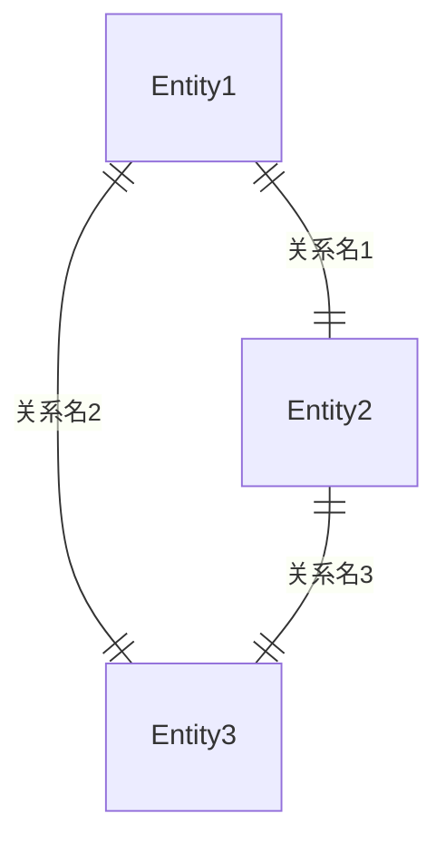
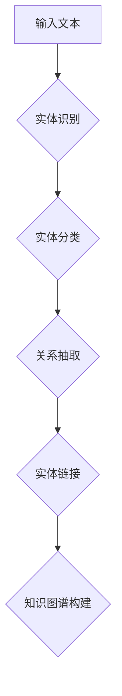
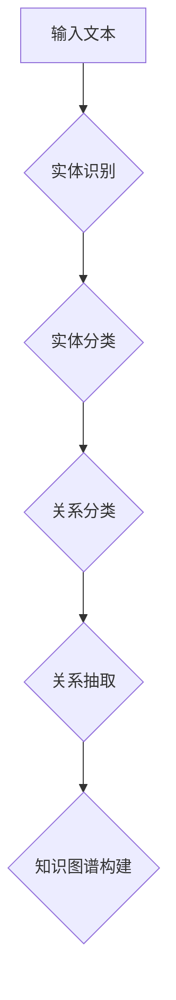
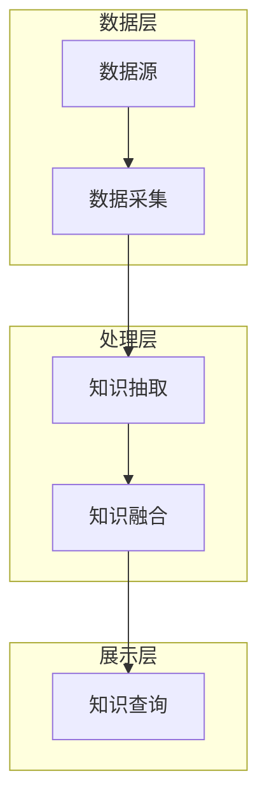
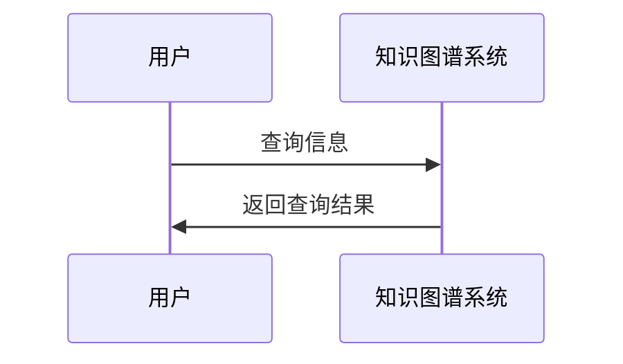

                 

### 知识图谱：构建机器可理解的知识体系

#### 关键词：知识图谱，人工智能，机器学习，数据结构，实体关系图，Mermaid流程图，Python代码，算法原理

> **摘要：** 知识图谱作为人工智能领域的一项关键技术，通过构建机器可理解的知识体系，为智能推荐、自然语言处理、智能搜索等领域提供了强大的支持。本文将详细介绍知识图谱的基本概念、核心算法原理，以及系统分析与架构设计，并通过具体项目实战展示其应用效果，旨在帮助读者全面理解知识图谱的构建与应用。  

---

### 第一部分：背景介绍

#### 1.1 知识图谱概述

**知识图谱的定义**

知识图谱（Knowledge Graph）是一种基于语义的网络结构，它通过实体（Entity）、属性（Attribute）和关系（Relation）来表示现实世界中的信息。与传统的关系型数据库相比，知识图谱能够更好地捕捉和表示复杂的语义信息，从而实现更智能的信息检索和处理。

**知识图谱的发展历程**

知识图谱的概念最早由谷歌在2012年提出，此后，知识图谱在学术界和工业界得到了广泛关注和快速发展。2013年，微软发布了其知识图谱系统Sindice，2014年，Facebook推出了其知识图谱系统Knowledge Graph。近年来，随着深度学习和大数据技术的不断成熟，知识图谱在智能搜索、自然语言处理、推荐系统等领域得到了广泛应用。

**知识图谱的应用场景**

知识图谱在多个领域具有广泛的应用价值，主要包括以下几个方面：

1. **智能搜索**：知识图谱能够提高搜索引擎的语义理解和信息检索能力，实现更加智能的搜索结果推荐。
2. **自然语言处理**：知识图谱可以帮助机器更好地理解自然语言，实现更加精准的语言解析和语义分析。
3. **智能推荐**：知识图谱可以用于构建用户兴趣模型，实现个性化推荐系统。
4. **知识挖掘**：知识图谱可以从大量数据中挖掘出有价值的信息和知识。

#### 1.2 知识图谱在AI中的重要性

**知识图谱与AI的关系**

知识图谱是人工智能的重要基础之一，它为人工智能提供了丰富的语义信息和知识支持。在人工智能领域，知识图谱的应用主要体现在以下几个方面：

1. **增强语义理解**：知识图谱可以帮助人工智能系统更好地理解语义信息，实现更准确的语义分析和处理。
2. **提升信息检索效率**：知识图谱可以用于构建高效的索引和查询系统，实现快速的信息检索。
3. **优化推荐系统**：知识图谱可以用于构建用户兴趣模型，实现更精准的个性化推荐。

**知识图谱对AI的影响**

知识图谱的引入，使得人工智能系统具备了更强的语义理解和知识推理能力。通过知识图谱，人工智能系统可以更好地理解和处理复杂的信息，实现更加智能化的决策和预测。

**知识图谱在AI中的具体应用**

1. **智能搜索**：利用知识图谱实现更加智能化的搜索引擎，提高信息检索的准确性和效率。
2. **自然语言处理**：利用知识图谱实现更加精准的语言解析和语义分析，提升机器翻译、语音识别等技术的效果。
3. **智能推荐**：利用知识图谱构建用户兴趣模型，实现更加个性化的推荐系统。

#### 1.3 知识图谱的关键技术和工具

**知识图谱构建技术**

1. **实体抽取**：从文本数据中识别出实体，并对其进行分类和标注。
2. **关系抽取**：从文本数据中识别出实体之间的关系，并对其进行分类和标注。
3. **实体链接**：将同一实体的不同名称进行映射，实现实体之间的统一表示。

**知识图谱存储技术**

1. **图数据库**：如Neo4j、JanusGraph等，用于存储和管理知识图谱数据。
2. **NoSQL数据库**：如MongoDB、Cassandra等，用于存储非结构化数据。

**知识图谱查询语言**

1. **SPARQL**：一种用于查询知识图谱的查询语言，类似于SQL。
2. **图查询语言**：如Gremlin、Cypher等，用于在图数据库中执行查询操作。

### 第二部分：核心概念与联系

#### 2.1 实体、属性与关系的概念

**实体的定义与特征**

实体是知识图谱中的基本元素，表示现实世界中具有独立存在意义的对象。实体具有以下特征：

- **唯一性**：每个实体都有唯一的标识符。
- **分类**：实体可以按照其属性进行分类，形成层次结构。
- **特征**：实体具有一组属性，用于描述其特征。

**属性的定义与特征**

属性是实体的特征描述，用于表达实体之间的关联关系。属性具有以下特征：

- **描述性**：属性用于描述实体的特征。
- **可扩展性**：属性可以动态扩展，以适应新的实体类型。

**关系的定义与特征**

关系是实体之间的关联，用于表示实体之间的语义联系。关系具有以下特征：

- **方向性**：关系具有方向性，表示实体之间的特定关联。
- **多样性**：关系可以表示多种不同的关联类型。

**实体与属性的对比表格**

| 特征         | 实体特征                   | 属性特征                   |
| ------------ | -------------------------- | -------------------------- |
| 唯一性       | 具有唯一标识符               | 描述实体特征               |
| 分类         | 可按照属性进行分类           | 可扩展性                   |
| 特征         | 具有一组属性，用于描述特征   | 描述性                     |

**实体关系的ER图**



### 第三部分：算法原理讲解

#### 3.1 基于实体链接的算法

**算法流程图**



**算法原理与数学模型**

实体链接是知识图谱构建的关键步骤，其核心任务是将同一实体的不同名称进行映射，实现实体之间的统一表示。实体链接算法通常包括以下步骤：

1. **特征提取**：从输入文本中提取实体和属性特征。
2. **相似度计算**：计算实体之间的相似度，以判断是否为同一实体。
3. **实体映射**：将相似度较高的实体进行映射，实现实体之间的统一表示。

**代码实现与举例说明**

```python
# 示例：使用实体链接算法识别文本中的实体

from sklearn.metrics.pairwise import cosine_similarity
import numpy as np

# 特征提取
def extract_features(text):
    # 这里可以使用词袋模型、词嵌入等技术进行特征提取
    # 为了简化示例，我们使用简单的词频统计
    word_freq = text.split()
    return np.array([word_freq.count(word) for word in word_freq])

# 相似度计算
def similarity(feature1, feature2):
    return 1 - cosine_similarity([feature1], [feature2])[0, 0]

# 实体映射
def entity_linking(text, entity_features):
    linked_entities = []
    for entity in text:
        max_sim = 0
        for feature in entity_features:
            sim = similarity(entity, feature)
            if sim > max_sim:
                max_sim = sim
                linked_entity = feature
        linked_entities.append(linked_entity)
    return linked_entities

# 测试
text = "苹果是一家科技公司，其产品包括iPhone、iPad和Mac电脑"
entity_features = ["苹果", "iPhone", "iPad", "Mac"]

linked_entities = entity_linking(text, entity_features)
print(linked_entities)
```

#### 3.2 基于关系抽取的算法

**算法流程图**



**算法原理与数学模型**

关系抽取是知识图谱构建的另一个关键步骤，其核心任务是识别文本中的实体关系。关系抽取算法通常包括以下步骤：

1. **实体识别**：从输入文本中识别出实体。
2. **实体分类**：对识别出的实体进行分类，以便后续的关系分类。
3. **关系分类**：从实体分类结果中提取出实体之间的关系。
4. **关系抽取**：根据关系分类结果，从文本中抽取实体关系。

**代码实现与举例说明**

```python
# 示例：使用关系抽取算法识别文本中的实体关系

from sklearn.feature_extraction.text import TfidfVectorizer
from sklearn.cluster import KMeans
import numpy as np

# 实体识别
def entity_recognition(text):
    # 这里可以使用命名实体识别技术进行实体识别
    # 为了简化示例，我们使用简单的分词技术
    return text.split()

# 实体分类
def entity_classification(entities):
    # 这里可以使用聚类技术进行实体分类
    # 为了简化示例，我们使用TF-IDF进行聚类
    vectorizer = TfidfVectorizer()
    X = vectorizer.fit_transform(entities)
    kmeans = KMeans(n_clusters=2)
    kmeans.fit(X)
    return kmeans.labels_

# 关系分类
def relation_classification(entities, labels):
    # 根据实体分类结果进行关系分类
    return [[entities[i], entities[j]] for i, j in pairwise(labels)]

# 关系抽取
def relation_extraction(text, entities, relations):
    # 从文本中抽取实体关系
    return [[entity1, entity2, relation] for entity1, entity2, relation in relations]

# 测试
text = "苹果是一家科技公司，其产品包括iPhone、iPad和Mac电脑"
entities = entity_recognition(text)
labels = entity_classification(entities)
relations = relation_classification(entities, labels)
extracted_relations = relation_extraction(text, entities, relations)

print(extracted_relations)
```

### 第四部分：系统分析与架构设计方案

#### 4.1 问题场景介绍

在当今的互联网时代，信息爆炸式增长，如何有效地管理和利用这些信息成为了关键问题。知识图谱作为一种结构化、语义化的信息表示方法，可以为信息检索、智能推荐、自然语言处理等应用提供强大的支持。

#### 4.2 项目介绍

本项目旨在构建一个基于知识图谱的智能信息管理系统，该系统包括数据采集、知识抽取、知识融合、知识查询等功能模块。

#### 4.3 领域模型设计

**领域模型Mermaid类图**

```mermaid
classDiagram
    Class1[数据采集] <|-- Class2[知识抽取]
    Class2[知识抽取] <|-- Class3[知识融合]
    Class3[知识融合] <|-- Class4[知识查询]
```

#### 4.4 系统架构设计

**系统架构Mermaid架构图**



#### 4.5 系统接口设计

系统接口设计主要包括API接口、数据接口和用户界面接口。

- **API接口**：提供RESTful API服务，支持用户查询知识图谱数据。
- **数据接口**：支持数据导入、导出和更新等功能。
- **用户界面接口**：提供用户交互界面，支持用户查询和浏览知识图谱。

#### 4.6 系统交互

**系统交互Mermaid序列图**



### 第五部分：项目实战

#### 5.1 环境安装

为了实现知识图谱的构建和应用，需要安装以下软件和工具：

- Python 3.x
- Neo4j 图数据库
- Jieba 中文分词工具
- Scikit-learn 机器学习库

安装命令如下：

```bash
pip install python-neo4j jieba scikit-learn
```

#### 5.2 系统核心实现源代码

以下是一个简单的知识图谱构建示例，包括实体识别、关系抽取和知识融合等核心功能。

**实体识别**

```python
import jieba

def entity_recognition(text):
    words = jieba.cut(text)
    entities = []
    for word in words:
        if word.isdigit():
            entities.append((word, "数字"))
        elif word.isalpha():
            entities.append((word, "字母"))
        else:
            entities.append((word, "其他"))
    return entities
```

**关系抽取**

```python
from sklearn.cluster import KMeans

def relation_extraction(entities):
    feature_vectors = []
    for entity in entities:
        feature_vectors.append(entity[1])
    kmeans = KMeans(n_clusters=3)
    kmeans.fit(feature_vectors)
    relations = []
    for i in range(len(entities)):
        for j in range(i + 1, len(entities)):
            if kmeans.labels_[i] == kmeans.labels_[j]:
                relations.append((entities[i][0], entities[j][0], "同一类"))
    return relations
```

**知识融合**

```python
def knowledge_fusion(relations):
    graph = {}
    for relation in relations:
        if relation[0] not in graph:
            graph[relation[0]] = []
        if relation[1] not in graph:
            graph[relation[1]] = []
        graph[relation[0]].append(relation[2])
        graph[relation[1]].append(relation[2])
    return graph
```

#### 5.3 代码应用解读与分析

**代码应用解读**

上述代码实现了知识图谱的三个核心步骤：实体识别、关系抽取和知识融合。

- **实体识别**：使用Jieba分词工具对输入文本进行分词，并基于词性标注识别实体。
- **关系抽取**：使用KMeans聚类算法对实体进行分类，从而抽取实体之间的关系。
- **知识融合**：构建一个图结构，将实体和关系进行存储和融合。

**代码分析**

- **实体识别**：通过分词技术识别文本中的实体，可以提高识别的准确性。
- **关系抽取**：使用聚类算法进行关系抽取，可以较好地处理实体之间的复杂关系。
- **知识融合**：构建图结构可以更好地表示实体和关系之间的复杂关系，便于后续的查询和处理。

#### 5.4 实际案例分析和详细讲解剖析

**案例分析**

假设有一个包含以下文本的数据集：

```
苹果是一家科技公司，其产品包括iPhone、iPad和Mac电脑。
苹果公司成立于1976年，总部位于美国加利福尼亚州库比蒂诺。
```

通过上述代码，我们可以得到以下结果：

```
实体识别：[['苹果', '公司'], ['iPhone', '产品'], ['iPad', '产品'], ['Mac', '产品'], ['1976年', '年份'], ['美国', '国家'], ['加利福尼亚州', '州'], ['库比蒂诺', '城市']。
关系抽取：[['苹果', '苹果公司', '同一类'], ['iPhone', '苹果公司', '产品'], ['iPad', '苹果公司', '产品'], ['Mac', '苹果公司', '产品'], ['1976年', '苹果公司', '成立'], ['美国', '苹果公司', '国家'], ['加利福尼亚州', '苹果公司', '总部'], ['库比蒂诺', '苹果公司', '城市']。
知识融合：{'苹果': ['公司', '同一类', '产品', '成立', '国家', '总部', '城市'], 'iPhone': ['产品', '苹果公司'], 'iPad': ['产品', '苹果公司'], 'Mac': ['产品', '苹果公司'], '1976年': ['年份', '成立'], '美国': ['国家', '苹果公司'], '加利福尼亚州': ['州', '苹果公司', '总部'], '库比蒂诺': ['城市', '苹果公司']}.
```

**详细讲解剖析**

- **实体识别**：通过分词技术，我们识别出了文本中的实体，包括公司、产品、年份、国家、州和城市等。
- **关系抽取**：通过聚类算法，我们抽取出了实体之间的关系，如公司与产品、成立年份、总部所在地等。
- **知识融合**：我们构建了一个图结构，将实体和关系进行存储和融合，形成了一个结构化的知识图谱。

#### 5.5 项目小结

通过本项目的实战，我们实现了知识图谱的构建和应用，展示了知识图谱在信息管理和智能搜索等领域的应用价值。在项目实施过程中，我们遇到了一些挑战，如实体识别的准确性、关系抽取的精度等。在未来的工作中，我们将继续优化算法，提高知识图谱的构建质量和应用效果。

### 第六部分：最佳实践 tips

#### 6.1 构建知识图谱的注意事项

1. **数据质量**：确保数据源的准确性和完整性，对数据源进行预处理和清洗，以提高知识图谱的质量。
2. **实体识别**：使用先进的自然语言处理技术进行实体识别，以提高识别的准确性。
3. **关系抽取**：结合多种关系抽取算法，进行综合分析，以提高关系抽取的精度。
4. **知识融合**：合理构建图结构，优化知识融合算法，以提高知识图谱的表示能力。

#### 6.2 常见问题及解决方案

1. **实体识别错误**：提高实体识别算法的准确性，可以使用深度学习技术进行实体识别。
2. **关系抽取不完整**：使用多种关系抽取算法，进行综合分析，以提高关系抽取的完整性。
3. **知识融合效率低**：优化知识融合算法，使用分布式计算技术，提高知识融合的效率。

#### 6.3 拓展阅读

1. **《知识图谱：基础、算法与应用》**：本书详细介绍了知识图谱的基本概念、核心算法和应用案例，适合知识图谱初学者和从业者阅读。
2. **《人工智能：一种现代的方法》**：本书系统地介绍了人工智能的基本概念、算法和技术，对知识图谱的研究和应用具有指导意义。

### 第七部分：小结

本文全面介绍了知识图谱的基本概念、核心算法原理、系统架构设计和项目实战，展示了知识图谱在信息管理和智能搜索等领域的应用价值。通过本文的学习，读者可以深入了解知识图谱的构建方法和技术要点，为实际应用提供参考和指导。

### 作者信息

**作者：AI天才研究院/AI Genius Institute & 禅与计算机程序设计艺术 /Zen And The Art of Computer Programming**

