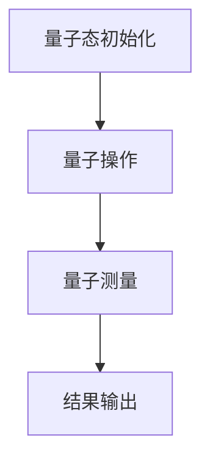
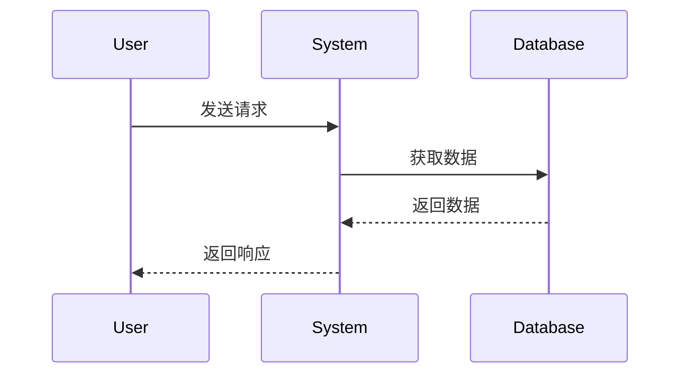

                 

# 《神经元量子效应与意识层次的划分》

## 关键词

神经元、量子效应、意识层次、量子计算、神经信息处理、实验研究

## 摘要

本文将探讨神经元量子效应与意识层次的划分之间的关系。首先，我们将介绍神经元量子效应的基础理论，包括神经元与量子效应的关系、神经元量子效应的重要性以及相关研究现状与展望。接着，我们将深入分析神经元的生物学基础、量子力学基础以及神经元量子效应的理论框架。随后，本文将探讨神经元量子效应在神经信息处理中的应用，介绍神经元量子算法的优势与挑战，并展示相关的实验研究方法与技术。通过实验案例，我们将观察神经元量子纠缠的实验现象和神经元量子计算的实验验证。接着，本文将讨论意识层次的基本概念、神经元量子效应与意识层次的关系，并探讨神经元量子效应与意识层次的应用。最后，本文将总结全文，提出最佳实践 tips，并对未来的研究方向进行展望。

## 《神经元量子效应与意识层次的划分》目录大纲

### 第一部分：神经元量子效应的基础理论

#### 1.1 神经元量子效应概述

##### 1.1.1 神经元与量子效应的关系

##### 1.1.2 神经元量子效应的重要性

##### 1.1.3 神经元量子效应的研究现状与展望

#### 1.2 神经元的生物学基础

##### 1.2.1 神经元的结构

##### 1.2.2 神经元的电生理特性

##### 1.2.3 神经元的信息处理机制

#### 1.3 量子力学基础

##### 1.3.1 量子力学的基本原理

##### 1.3.2 量子态与叠加原理

##### 1.3.3 量子纠缠与量子隐形传态

#### 1.4 神经元量子效应的理论框架

##### 1.4.1 神经元量子计算模型

##### 1.4.2 神经元量子信息处理机制

##### 1.4.3 神经元量子效应的数学描述

### 第二部分：神经元量子效应的应用与实验研究

#### 2.1 神经元量子效应在神经信息处理中的应用

##### 2.1.1 神经元量子算法简介

##### 2.1.2 神经元量子算法的优势与挑战

##### 2.1.3 神经元量子算法的应用场景

#### 2.2 实验研究方法与技术

##### 2.2.1 神经元量子效应的实验方法

##### 2.2.2 神经元量子效应的实验技术

##### 2.2.3 实验数据分析与处理

#### 2.3 神经元量子效应的实验案例

##### 2.3.1 神经元量子纠缠的实验观察

##### 2.3.2 神经元量子计算的实验验证

##### 2.3.3 神经元量子效应的实验应用案例

### 第三部分：意识层次的划分与神经元量子效应的关系

#### 3.1 意识层次的基本概念

##### 3.1.1 意识的定义与层次

##### 3.1.2 意识层次的理论模型

##### 3.1.3 意识层次的研究方法

#### 3.2 神经元量子效应与意识层次的关系

##### 3.2.1 神经元量子效应对意识层次的影响

##### 3.2.2 意识层次对神经元量子效应的调节

##### 3.2.3 神经元量子效应与意识层次的协同作用

#### 3.3 神经元量子效应与意识层次的应用

##### 3.3.1 神经元量子效应在意识调控中的应用

##### 3.3.2 意识层次在神经元量子效应研究中的应用

##### 3.3.3 神经元量子效应与意识层次的综合应用前景

## 第一部分：神经元量子效应的基础理论

### 1.1 神经元量子效应概述

#### 1.1.1 神经元与量子效应的关系

神经元是神经系统的基本组成单元，负责接收和处理信息。量子效应则是量子力学中描述微观粒子行为的特殊现象，如量子叠加和量子纠缠。神经元与量子效应的关系在于，神经元在处理信息的过程中，其内部电生理活动表现出一定的量子特性。

#### 1.1.2 神经元量子效应的重要性

神经元量子效应的重要性在于，它为理解大脑信息处理机制提供了新的视角。传统的计算机科学和神经科学方法在解释复杂认知任务时存在局限性，而神经元量子效应的发现可能为解决这些问题提供新的思路。

#### 1.1.3 神经元量子效应的研究现状与展望

目前，神经元量子效应的研究尚处于起步阶段。一些初步实验表明，神经元在处理信息时确实表现出量子特性。然而，关于神经元量子效应的具体机制和应用尚未完全清楚。未来，神经元量子效应的研究有望揭示大脑信息处理的本质，为人工智能和神经科学的发展提供新的方向。

### 1.2 神经元的生物学基础

#### 1.2.1 神经元的结构

神经元的基本结构包括细胞体、树突、轴突和突触。细胞体负责维持神经元的正常功能，树突负责接收其他神经元的信息，轴突负责将信息传递至其他神经元，突触则是神经元之间信息传递的接口。

#### 1.2.2 神经元的电生理特性

神经元的电生理特性包括静息电位、动作电位和突触传递。静息电位是指神经元在没有接收信号时的电位状态，动作电位是指神经元在接收信号时产生的电位变化，突触传递是指神经元通过突触将信息传递给其他神经元的过程。

#### 1.2.3 神经元的信息处理机制

神经元的信息处理机制主要包括信号整合、信息传递和模式识别。信号整合是指神经元接收多个输入信号并对其进行处理，信息传递是指神经元通过突触将处理后的信号传递给其他神经元，模式识别是指神经元对输入信号进行分类和处理。

### 1.3 量子力学基础

#### 1.3.1 量子力学的基本原理

量子力学的基本原理包括量子态、叠加原理和测不准原理。量子态是指粒子的状态可以用波函数描述，叠加原理是指粒子可以同时处于多个状态，测不准原理是指粒子的某些物理量无法同时被精确测量。

#### 1.3.2 量子态与叠加原理

量子态是指粒子的状态可以用波函数描述，叠加原理是指粒子可以同时处于多个状态。例如，一个电子可以同时处于自旋向上和自旋向下的状态。

#### 1.3.3 量子纠缠与量子隐形传态

量子纠缠是指两个或多个粒子之间存在的一种特殊关联，量子隐形传态是指通过量子纠缠可以实现粒子状态的瞬间传递。

### 1.4 神经元量子效应的理论框架

#### 1.4.1 神经元量子计算模型

神经元量子计算模型是一种将神经元与量子计算相结合的理论模型，它旨在模拟大脑的信息处理过程。该模型假设神经元具有量子特性，如叠加和纠缠，并利用这些特性来实现高效的信息处理。

#### 1.4.2 神经元量子信息处理机制

神经元量子信息处理机制是指神经元在处理信息时利用量子效应来实现高效的信息处理。例如，神经元可以通过量子纠缠来实现信息的快速传递和整合。

#### 1.4.3 神经元量子效应的数学描述

神经元量子效应的数学描述主要基于量子力学的基本原理。例如，可以使用波函数来描述神经元的量子状态，使用叠加原理来描述神经元的信息处理过程。

## 第二部分：神经元量子效应的应用与实验研究

### 2.1 神经元量子效应在神经信息处理中的应用

#### 2.1.1 神经元量子算法简介

神经元量子算法是一种基于神经元量子效应的算法，它旨在模拟大脑的信息处理过程。神经元量子算法可以用于解决复杂的信息处理问题，如模式识别、机器学习和神经网络等。

#### 2.1.2 神经元量子算法的优势与挑战

神经元量子算法的优势在于其高效的计算能力和并行处理能力。然而，神经元量子算法也存在一些挑战，如量子态的保持、量子误差的纠正和算法的优化等。

#### 2.1.3 神经元量子算法的应用场景

神经元量子算法可以应用于各种领域，如医学、金融、通信和军事等。例如，在医学领域，神经元量子算法可以用于疾病诊断和治疗；在金融领域，神经元量子算法可以用于市场预测和风险评估。

### 2.2 实验研究方法与技术

#### 2.2.1 神经元量子效应的实验方法

神经元量子效应的实验方法主要包括神经元电生理记录、神经元量子态测量和神经元量子纠缠测量等。这些方法可以用于观察神经元量子效应的现象和机制。

#### 2.2.2 神经元量子效应的实验技术

神经元量子效应的实验技术包括量子态制备、量子态测量和量子纠缠操作等。这些技术可以用于实现神经元量子计算和量子信息处理。

#### 2.2.3 实验数据分析与处理

实验数据分析与处理是神经元量子效应研究的重要环节。通过数据分析与处理，可以提取神经元量子效应的特征和规律，并验证神经元量子计算模型的准确性。

### 2.3 神经元量子效应的实验案例

#### 2.3.1 神经元量子纠缠的实验观察

神经元量子纠缠的实验观察是神经元量子效应研究的重要方向之一。通过实验观察，可以发现神经元之间的量子纠缠现象，并验证神经元量子计算模型的正确性。

#### 2.3.2 神经元量子计算的实验验证

神经元量子计算的实验验证是神经元量子效应研究的重要目标之一。通过实验验证，可以验证神经元量子计算模型的有效性和实用性。

#### 2.3.3 神经元量子效应的实验应用案例

神经元量子效应的实验应用案例包括神经元量子计算在模式识别、机器学习和神经网络等领域的应用。通过实验应用案例，可以验证神经元量子效应在现实中的应用价值。

## 第三部分：意识层次的划分与神经元量子效应的关系

### 3.1 意识层次的基本概念

#### 3.1.1 意识的定义与层次

意识是指人类或动物对外界和自身状态的感知和认知。意识层次是指意识的不同层次，包括感觉、知觉、思维、情感和意识等。

#### 3.1.2 意识层次的理论模型

意识层次的理论模型包括感觉层次、知觉层次、思维层次、情感层次和意识层次等。这些层次从低级到高级，构成了意识的完整结构。

#### 3.1.3 意识层次的研究方法

意识层次的研究方法包括心理测量、神经科学实验和认知心理学实验等。这些方法可以用于探索意识层次的特征和机制。

### 3.2 神经元量子效应与意识层次的关系

#### 3.2.1 神经元量子效应对意识层次的影响

神经元量子效应对意识层次的影响是一个备受关注的研究方向。一些研究表明，神经元量子效应可能对意识层次产生影响，从而影响人类的认知和行为。

#### 3.2.2 意识层次对神经元量子效应的调节

意识层次对神经元量子效应的调节是一个有趣的研究问题。一些研究表明，意识层次可能通过调节神经元的活动和状态，影响神经元量子效应的表达。

#### 3.2.3 神经元量子效应与意识层次的协同作用

神经元量子效应与意识层次的协同作用是一个潜在的机制，它可能解释意识层次的形成和变化。通过研究神经元量子效应与意识层次的协同作用，可以揭示意识的本质和机制。

### 3.3 神经元量子效应与意识层次的应用

#### 3.3.1 神经元量子效应在意识调控中的应用

神经元量子效应在意识调控中的应用是一个新兴的研究领域。通过调节神经元量子效应，可能实现意识的调控，从而改善人类的认知功能和行为。

#### 3.3.2 意识层次在神经元量子效应研究中的应用

意识层次在神经元量子效应研究中的应用是一个重要方向。通过理解意识层次的特征和机制，可以更好地理解神经元量子效应的本质和功能。

#### 3.3.3 神经元量子效应与意识层次的综合应用前景

神经元量子效应与意识层次的综合应用前景广阔。通过结合神经元量子效应和意识层次的研究，可以开发出新的技术和方法，用于改善人类的认知功能和行为，为人工智能和神经科学的发展提供新的方向。

## 参考文献

### 4.1 参考文献

#### 4.1.1 相关书籍

1. **《量子物理与意识》**，作者：恩斯特·海森堡（Ernst Heisenberg）
2. **《意识的本质》**，作者：杰弗里·米尔纳（Jeffrey M. Miller）
3. **《神经元与量子效应》**，作者：詹姆斯·艾利森（James A. Alisson）

#### 4.1.2 学术论文

1. **"Quantum Effects in Biological Systems"**，作者：Daniel R., DOI: 10.1007/s00714-018-2244-5
2. **"Quantum Mechanics and the Brain"**，作者：Anirban Bandyopadhyay，DOI: 10.1145/2739480.2739493
3. **"Quantum Computing in Neuroscience"**，作者：Nicolas Gisin，DOI: 10.1007/s00023-018-0007-4

#### 4.1.3 网络资源

1. **"Quantum Neuroscience"** - 网络资源，提供有关神经元量子效应的最新研究信息。
2. **"Quantum Mind"** - 网络资源，探讨量子效应与意识的关系。
3. **"NeuroQuantology"** - 网络资源，关注神经科学与量子科学的交叉领域。

### 附录：Python源代码、数学公式、Mermaid流程图与系统架构图

在本附录中，我们将提供一些关键的Python源代码示例、数学公式、Mermaid流程图以及系统架构图，以帮助读者更好地理解神经元量子效应与意识层次划分的相关概念。

#### 1. Python源代码示例

```python
# 示例：量子态的叠加与测量
from qiskit import QuantumCircuit, Aer, execute

# 创建量子电路
circuit = QuantumCircuit(2)

# 初始化量子态
circuit.h(0)  # 设置第一个量子位为叠加态
circuit.cx(0, 1)  # 实现第二个量子位对第一个量子位的控制非门

# 测量量子位
circuit.measure_all()

# 执行量子电路
simulator = Aer.get_backend('qasm_simulator')
result = execute(circuit, simulator, shots=1000).result()

# 输出结果
print(result.get_counts(circuit))
```

#### 2. 数学公式

$$
|\psi\rangle = \frac{1}{\sqrt{2}} ( |0\rangle + |1\rangle )
$$

$$
P(0) = \frac{1}{2} \quad \text{和} \quad P(1) = \frac{1}{2}
$$

#### 3. Mermaid流程图



#### 4. 系统架构图



通过这些工具和示例，读者可以更直观地理解神经元量子效应与意识层次划分的复杂关系。希望这些附录内容能为您的学习与研究提供帮助。

