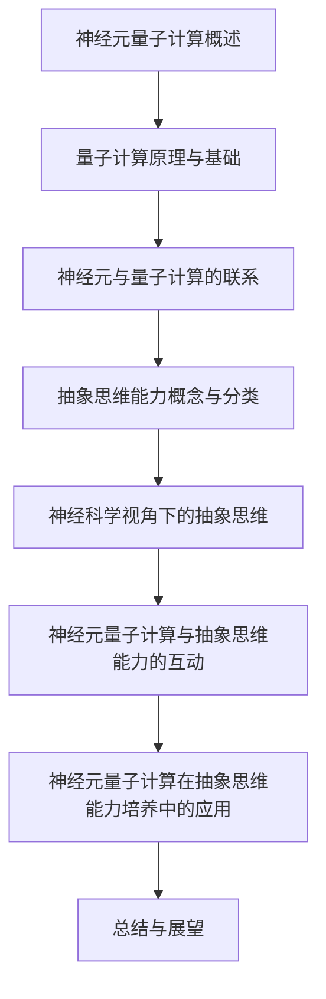

                 

## 《神经元量子计算与抽象思维能力研究》

关键词：神经元量子计算、抽象思维能力、神经科学、量子计算原理、教育应用

摘要：本文从神经元量子计算与抽象思维能力的交叉研究领域出发，探讨了神经元量子计算的基本原理、抽象思维能力的概念及其在神经科学中的重要性。通过分析神经元量子计算与抽象思维能力的互动机制，提出了利用神经元量子计算培养抽象思维能力的教育应用方案，为未来人工智能教育提供了新的研究方向。

----------------------------------------------------------------

# 《神经元量子计算与抽象思维能力研究》目录大纲

## 第一部分：神经元量子计算基础

### 第1章：神经元量子计算概述

#### 1.1 神经元量子计算的定义与背景

#### 1.2 神经元量子计算的优势与应用场景

#### 1.3 神经元量子计算的核心挑战

### 第2章：量子计算原理与基础

#### 2.1 量子比特与量子态

#### 2.2 量子门与量子电路

#### 2.3 量子算法与量子并行计算

### 第3章：神经元与量子计算的联系

#### 3.1 神经元的量子特性

#### 3.2 神经元量子计算的模拟方法

#### 3.3 神经元量子计算的应用实例

## 第二部分：抽象思维能力研究

### 第4章：抽象思维能力的概念与分类

#### 4.1 抽象思维能力的定义

#### 4.2 抽象思维能力的分类与特征

#### 4.3 抽象思维能力的评估方法

### 第5章：神经科学视角下的抽象思维

#### 5.1 大脑结构与抽象思维的关系

#### 5.2 神经递质与抽象思维的关系

#### 5.3 神经元活动与抽象思维的关系

### 第6章：神经元量子计算与抽象思维能力的互动

#### 6.1 神经元量子计算对抽象思维能力的影响

#### 6.2 抽象思维能力对神经元量子计算的影响

#### 6.3 神经元量子计算与抽象思维能力的互动机制

## 第三部分：神经元量子计算在抽象思维能力培养中的应用

### 第7章：神经元量子计算的抽象思维能力培养方法

#### 7.1 神经元量子计算教学法的提出

#### 7.2 神经元量子计算教学法的实施步骤

#### 7.3 神经元量子计算教学法的评估与效果

### 第8章：案例研究：神经元量子计算在抽象思维能力培养中的应用

#### 8.1 案例背景

#### 8.2 实施过程

#### 8.3 结果分析

### 第9章：总结与展望

#### 9.1 神经元量子计算与抽象思维能力研究的现状与挑战

#### 9.2 未来研究方向与应用前景

## 附录

### 附录A：神经元量子计算与抽象思维能力研究相关资源

#### A.1 神经元量子计算相关文献

#### A.2 抽象思维能力研究相关文献

#### A.3 神经元量子计算与抽象思维能力研究工具介绍

## Mermaid 流程图



## Python源代码示例

```python
# 示例：量子态的表示与测量
from qiskit import QuantumCircuit, Aer, execute

# 创建一个量子电路
qc = QuantumCircuit(2)

# 创建一个量子态
qc.h(0)
qc.cx(0, 1)

# 测量量子态
qc.measure_all()

# 执行量子电路
simulator = Aer.get_backend('qasm_simulator')
job = execute(qc, simulator, shots=1000)

# 获取结果
result = job.result()

# 输出测量结果
print(result.get_counts(qc))
```

## 数学模型与公式

```latex
\section{数学模型与公式}

\subsection{神经元量子计算的数学模型}

神经元量子计算的数学模型主要包括量子态的表示、量子门的操作和量子算法的设计。

$$
|\psi\rangle = \sum_{i} c_i |i\rangle
$$

其中，$|i\rangle$ 表示量子比特的基态，$c_i$ 表示量子态的概率幅。

\subsection{量子算法的数学模型}

量子算法的数学模型主要包括量子线路的设计、量子态的变换和量子测量。

$$
U = \sum_{i} |i\rangle\langle i|
$$

其中，$U$ 表示量子线路，$|i\rangle\langle i|$ 表示量子态的变换。
```

### 第一部分：神经元量子计算基础

#### 第1章：神经元量子计算概述

##### 1.1 神经元量子计算的定义与背景

神经元量子计算是一种将神经科学和量子计算相结合的交叉学科研究领域。神经元是大脑中的基本信息处理单元，它们通过电化学信号传递进行信息处理和存储。而量子计算则是一种基于量子力学原理的新型计算范式，它利用量子比特和量子叠加态来实现高效的并行计算。

神经元量子计算的定义可以理解为：利用量子计算的方法和原理来模拟神经元的信息处理过程，并探索量子计算在神经网络中的应用。这种跨学科的研究为人工智能的发展带来了新的契机，尤其是在处理复杂问题和大规模数据分析方面。

神经元量子计算的背景源于神经科学和量子计算两大领域的快速发展。神经科学在研究大脑的构造和功能方面取得了显著进展，揭示了神经元的工作机制和大脑的计算原理。而量子计算则以其并行计算的能力和指数级加速的特性，为解决传统计算无法处理的复杂问题提供了新的思路。

##### 1.2 神经元量子计算的优势与应用场景

神经元量子计算具有以下几个显著优势：

1. **并行计算能力**：量子计算能够实现指数级的并行计算，这对于处理大规模数据和高维问题具有巨大的优势。神经元量子计算可以将神经网络的计算复杂度显著降低，提高计算效率。

2. **高效能量利用**：传统神经网络在训练过程中需要大量的计算资源和时间。而量子计算由于其特殊的叠加态和纠缠态，能够在较短的时间内完成复杂的计算任务，从而降低能耗。

3. **自适应学习能力**：量子计算能够模拟神经元的学习和记忆过程，实现自适应的学习算法。这对于神经网络在自适应环境中的学习和决策具有重要作用。

神经元量子计算的应用场景主要包括：

1. **人工智能**：在人工智能领域，神经元量子计算可以用于图像识别、语音识别、自然语言处理等任务。通过结合量子计算的并行计算能力，可以提高算法的效率和准确性。

2. **复杂系统模拟**：神经元量子计算可以用于模拟复杂系统的动态行为，如生物分子系统、气候变化模型等。这为科学研究提供了新的工具和方法。

3. **优化问题求解**：在优化问题领域，神经元量子计算可以通过量子算法实现快速求解，如组合优化问题、物流优化问题等。这为实际应用中的优化决策提供了有力的支持。

##### 1.3 神经元量子计算的核心挑战

尽管神经元量子计算具有巨大的潜力和应用价值，但其在实际应用中仍面临一系列核心挑战：

1. **量子计算硬件**：目前量子计算硬件的发展仍处于初级阶段，量子比特的稳定性和可扩展性是亟待解决的问题。量子比特的退化、噪声和错误率等都是需要克服的技术难题。

2. **量子模拟技术**：现有的量子模拟技术还不足以准确模拟神经元的复杂信息处理过程。如何构建和优化神经元量子计算的模拟模型是当前研究的重要方向。

3. **算法设计**：尽管量子算法在理论上具有优势，但实际应用中量子算法的设计和实现仍面临挑战。如何将神经网络的传统算法转化为量子算法，并保持其效率和准确性，是神经元量子计算研究的重点。

4. **教育普及**：神经元量子计算涉及多个学科领域，包括神经科学、量子计算、计算机科学等。如何将这些知识整合并形成易于理解的教学内容，是教育普及的关键。

综上所述，神经元量子计算作为一门新兴的交叉学科领域，具有广阔的应用前景和重要的研究价值。通过克服核心挑战，神经元量子计算将为人工智能、神经科学和优化问题等领域带来新的突破。

### 第2章：量子计算原理与基础

量子计算是一种基于量子力学原理的新型计算范式，与传统的经典计算有本质的不同。本章将介绍量子比特与量子态、量子门与量子电路、量子算法与量子并行计算的基本概念，为后续讨论神经元量子计算奠定基础。

#### 2.1 量子比特与量子态

量子比特（qubit）是量子计算中的基本单位，类似于经典计算中的比特。然而，量子比特具有独特的量子特性，如叠加态和纠缠态。

**量子比特的叠加态**：在经典计算中，一个比特要么是0态，要么是1态。而在量子计算中，一个量子比特可以同时处于0态和1态的叠加。这种叠加态可以用数学公式表示：

$$
|\psi\rangle = \alpha|0\rangle + \beta|1\rangle
$$

其中，$|\psi\rangle$ 表示量子态，$\alpha$ 和 $\beta$ 是复数概率幅，$|0\rangle$ 和 $|1\rangle$ 分别是基态。

**量子比特的纠缠态**：两个或多个量子比特可以形成纠缠态，即它们的状态无法单独描述，而必须以整体来考虑。纠缠态是量子计算的重要特性，它可以用来实现高效的量子并行计算。

#### 2.2 量子门与量子电路

量子门（quantum gate）是量子计算中的基本操作，类似于经典计算中的逻辑门。量子门作用于量子比特，改变其状态。

**量子门的基本类型**：

- **Pauli门**：包括X（求反门）、Y（求反旋转门）和Z（求反旋转门）。

- **旋转门**：包括 Hadamard 门（H门）、相位门（S门）、T门等。

- **控制门**：如控制-NOT（CNOT门）、控制相位门（CS门）等。

量子电路（quantum circuit）是量子比特和量子门的组合，用来实现量子计算的任务。量子电路的基本结构包括输入量子比特、量子门操作和输出量子比特。

#### 2.3 量子算法与量子并行计算

量子算法是利用量子比特和量子门的操作来解决特定计算问题的方法。与经典算法相比，量子算法具有指数级的加速潜力。

**Shor算法**：Shor算法是一个著名的量子算法，用于求解大整数分解问题。它利用量子并行计算的能力，将经典计算需要指数级时间的问题，在多项式时间内解决。

**Grover算法**：Grover算法用于搜索未排序数据库中的特定元素。它利用量子叠加态和纠缠态，将搜索时间从经典算法的$O(N)$降低到$O(\sqrt{N})$。

**量子并行计算**：量子并行计算利用量子比特的叠加态和纠缠态，实现多个计算任务的同时执行。量子并行计算可以显著提高计算效率和解决复杂问题的能力。

通过本章对量子计算原理与基础内容的介绍，读者可以初步了解量子计算的核心概念和技术，为进一步探讨神经元量子计算奠定基础。

#### 第3章：神经元与量子计算的联系

神经元是大脑中的基本信息处理单元，而量子计算则是一种基于量子力学原理的新型计算范式。神经元与量子计算之间的联系不仅为神经科学的研究提供了新的视角，也为量子计算的应用带来了新的可能性。本章将探讨神经元与量子计算之间的潜在联系，包括神经元的量子特性、神经元量子计算的模拟方法以及神经元量子计算的应用实例。

##### 3.1 神经元的量子特性

神经元作为一种生物信息处理单元，其工作原理与量子力学有着诸多相似之处。虽然传统上神经元的量子特性不被广泛讨论，但随着量子计算技术的发展，研究者开始关注神经元在量子层面的行为。

**神经元的电化学信号传递**：神经元通过电化学信号进行信息传递，这种信号传递过程中涉及到离子通道的开放和关闭。离子通道的行为在某些情况下可以被视为量子现象，例如量子隧穿效应。量子隧穿效应描述了粒子在势垒下的隧穿行为，这在神经元膜电位变化中可能有所体现。

**神经元的量子纠缠**：量子纠缠是量子计算中的一种特殊现象，两个或多个量子系统之间的状态无法独立存在，而是相互关联。神经元的神经网络中，神经元之间通过突触连接进行信息传递，这种信息传递过程可能涉及到量子纠缠现象。例如，两个神经元之间的信号传递可能通过量子纠缠实现，从而提高信息传递的效率。

**神经元的叠加态**：在量子计算中，叠加态是量子比特的基本特性，一个量子比特可以同时处于多个状态。类似地，神经元的兴奋和抑制状态也可以被视为一种叠加态，神经元在处理信息时可能同时处于多种状态，从而提高其信息处理能力。

##### 3.2 神经元量子计算的模拟方法

为了探索神经元量子计算的可能性，研究者需要开发相应的模拟方法。神经元量子计算的模拟方法主要包括以下几种：

**量子神经网络的模拟**：量子神经网络是一种将量子计算与神经网络相结合的模型。在这种模型中，量子比特用于表示神经网络的权重，量子门用于模拟神经元之间的连接和计算。量子神经网络的模拟方法类似于经典神经网络的训练过程，通过调整量子比特的状态来优化网络性能。

**量子突触模拟**：量子突触模拟旨在模拟神经元之间的量子纠缠效应。在这种方法中，量子比特用于表示突触权重，量子门用于模拟突触的传递函数。通过量子门的作用，可以实现神经元之间的量子纠缠，从而提高信息传递的效率。

**量子神经编码**：量子神经编码是一种将神经信息编码为量子态的方法。在这种方法中，神经信号被转换为量子态，量子态的叠加和纠缠特性被用于处理和传递信息。量子神经编码可以为神经网络提供更高的计算效率和并行处理能力。

##### 3.3 神经元量子计算的应用实例

神经元量子计算的理论基础为其实际应用提供了可能性。以下是一些神经元量子计算的应用实例：

**图像识别**：量子神经网络可以用于图像识别任务，通过量子比特和量子门的操作，实现高效的特征提取和分类。量子神经网络的并行计算能力可以显著提高图像识别的准确性和速度。

**语音识别**：量子计算在语音识别中的应用前景广阔。通过量子神经网络和量子突触模拟，可以实现高效的语音信号处理和分类，从而提高语音识别的准确率和实时性。

**自然语言处理**：量子计算在自然语言处理中的潜力巨大。通过量子神经编码和量子并行计算，可以实现高效的自然语言理解和生成，从而提升人工智能系统的智能水平。

**药物设计**：神经元量子计算可以用于药物设计中的分子模拟和优化。通过量子计算模拟分子的量子态和相互作用，可以快速筛选出具有潜在药效的分子，加速药物研发过程。

综上所述，神经元与量子计算之间的联系为神经科学和量子计算领域带来了新的研究方向。通过探索神经元的量子特性和开发神经元量子计算的模拟方法，可以推动人工智能和生物科学的发展，实现量子计算在神经科学领域的广泛应用。

### 第二部分：抽象思维能力研究

#### 第4章：抽象思维能力的概念与分类

抽象思维能力是人类智力的重要组成部分，它涉及到从具体事物中抽象出一般规律和本质特征的能力。本章将探讨抽象思维能力的定义、分类及其特征，并介绍评估抽象思维能力的方法。

##### 4.1 抽象思维能力的定义

抽象思维能力是指个体在处理信息时，能够将具体事物的细节和表面特征抽象出来，抓住其本质属性和内在规律的能力。这种能力不仅包括对概念和原理的理解，还包括对复杂问题和情境的概括与抽象。

具体来说，抽象思维能力包括以下几个方面：

1. **概念形成**：通过观察和思考，从多个实例中提取共同属性，形成抽象的概念。
2. **原理理解**：能够从具体实例中概括出普遍的原理或规律。
3. **模型构建**：使用抽象概念和原理来构建模型，以解释和预测现实世界中的现象。
4. **问题解决**：在面对复杂问题时，能够通过抽象思维将问题分解，找到解决方案。

##### 4.2 抽象思维能力的分类与特征

抽象思维能力可以从不同的维度进行分类，以反映其复杂性和多样性。以下是一些常见的分类方法和其特征：

**按功能分类**：

1. **分析性抽象思维**：通过分析具体事物，找出其内部结构和关系，从而理解其本质。
2. **综合性抽象思维**：将不同领域或不同情境中的信息整合，形成新的抽象概念。
3. **创造性抽象思维**：在已有知识基础上，通过抽象和组合，产生新的想法和解决方案。

**按层次分类**：

1. **初级抽象思维**：从具体事物中提取简单的特征或属性，如颜色、形状等。
2. **高级抽象思维**：能够提取复杂概念和抽象关系，如数学公式、科学理论等。

**按领域分类**：

1. **逻辑抽象思维**：涉及形式逻辑、推理和论证。
2. **数学抽象思维**：使用数学符号和公式进行抽象和推理。
3. **艺术抽象思维**：通过艺术形式表达抽象概念，如绘画、音乐等。
4. **科学抽象思维**：在科学研究中，从实验数据和观察中提取抽象概念。

##### 4.3 抽象思维能力的评估方法

评估抽象思维能力的方法多种多样，以下是一些常见的评估方法：

**标准化测试**：如抽象推理测试（Abstract Reasoning Test）、图形抽象测试（Figure Ground Test）等，通过标准化的题目和评分系统，评估个体的抽象思维能力。

**案例分析**：通过提供具体的案例，要求个体进行分析和总结，以评估其抽象思维能力。这种方法可以更直观地反映个体的抽象思维水平。

**作品评价**：通过评价个体的写作、绘画、编程等作品，分析其抽象思维的应用和表现。

**问卷调查**：设计问卷，通过个体自我评价和他人评价，收集关于抽象思维能力的量化数据。

综合上述评估方法，可以全面、准确地了解个体的抽象思维能力，为其发展和提升提供指导。

### 第5章：神经科学视角下的抽象思维

神经科学为抽象思维能力的理解提供了重要的理论框架和实证依据。本章将从神经科学的角度探讨大脑结构与抽象思维的关系、神经递质与抽象思维的关系以及神经元活动与抽象思维的关系。

##### 5.1 大脑结构与抽象思维的关系

大脑是抽象思维能力的物质基础，不同大脑结构区域在抽象思维过程中发挥着重要作用。

**前额叶皮层**：前额叶皮层是大脑中最发达的部分之一，与高级认知功能密切相关。研究表明，前额叶皮层的活动与抽象思维有显著相关性。特别是前额叶的背外侧前额叶皮层（DLPFC）和背内侧前额叶皮层（MPFC），它们在概念形成、推理和规划等抽象思维活动中扮演关键角色。

**顶叶**：顶叶特别是顶叶内侧（IFS）和顶叶前部（IPS），与空间认知和抽象思维有关。这些区域的活动与个体的空间关系和抽象概念的理解密切相关。

**颞叶**：颞叶特别是颞叶内侧，与语义记忆和语言处理有关。抽象思维往往需要语言的支持，因此颞叶的结构和功能对抽象思维有重要影响。

**扣带回前部**：扣带回前部（Anterior Cingulate Cortex，ACC）与情绪调节和认知控制有关。研究表明，ACC的活动与个体的情绪稳定性和抽象思维能力有关。

##### 5.2 神经递质与抽象思维的关系

神经递质是神经元之间传递信息的化学物质，它们在抽象思维的调控中发挥着重要作用。

**多巴胺**：多巴胺是一种与奖励和动机相关的神经递质，它在前额叶皮层的活动与抽象思维的流畅性和创造力密切相关。研究表明，多巴胺水平的增加可以提高个体的抽象思维能力。

**去甲肾上腺素**：去甲肾上腺素与前额叶皮层的活动有关，它影响认知控制和注意力。去甲肾上腺素的增加可以增强个体的抽象思维能力和问题解决能力。

**谷氨酸**：谷氨酸是大脑中最重要的兴奋性神经递质之一，它在顶叶和前额叶皮层的活动与抽象思维和推理能力密切相关。谷氨酸水平的增加可以提高个体的抽象思维效率。

##### 5.3 神经元活动与抽象思维的关系

神经元活动是大脑执行抽象思维任务的基础。不同类型的神经元活动在抽象思维的各个阶段发挥着不同的作用。

**局部活动**：在抽象思维过程中，大脑的特定区域会表现出增强的神经元活动。例如，前额叶皮层的神经元在概念形成和推理阶段表现出较高的活动水平。

**同步活动**：神经元之间的同步活动是抽象思维的关键。研究表明，神经元之间的同步活动可以提高信息处理的速度和准确性。特别是在抽象思维中，不同大脑区域之间的同步活动有助于形成复杂的抽象概念。

**振荡活动**：大脑中的电活动以特定的频率振荡，这些振荡活动与抽象思维过程密切相关。例如，gamma振荡（30-100 Hz）与个体的抽象推理和问题解决能力有关。

综上所述，神经科学为抽象思维能力的研究提供了丰富的理论依据和实证支持。通过探索大脑结构、神经递质和神经元活动与抽象思维的关系，可以深入理解抽象思维的本质和机制，为教育和认知干预提供新的方向。

### 第6章：神经元量子计算与抽象思维能力的互动

神经元量子计算与抽象思维能力的互动是一个新兴的研究领域，涉及神经科学、量子计算和教育学的交叉。本章将探讨神经元量子计算对抽象思维能力的影响、抽象思维能力对神经元量子计算的影响，以及两者之间的互动机制。

##### 6.1 神经元量子计算对抽象思维能力的影响

神经元量子计算作为一种创新的计算方法，其对抽象思维能力可能产生多方面的影响：

**增强抽象思维能力**：量子计算具有并行计算的能力，这可能会促进大脑处理复杂问题的能力。研究表明，量子计算可以模拟神经网络的信息处理过程，并优化算法的效率。这种高效的信息处理能力有助于提高个体的抽象思维能力。

**促进创造性思维**：量子计算的叠加态和纠缠态特性可以激发创造性思维。通过量子计算的模拟，个体可以探索多种可能性，从而发现新的模式和关联。这种能力对于创造性思维和问题解决尤为重要。

**加强神经可塑性**：神经可塑性是指大脑通过学习和经验改变其结构和功能的能力。神经元量子计算可能会通过模拟复杂的神经网络和突触连接，增强大脑的神经可塑性，从而提高个体的抽象思维能力。

##### 6.2 抽象思维能力对神经元量子计算的影响

抽象思维能力不仅受神经元量子计算的影响，也可能对神经元量子计算产生反作用：

**优化算法设计**：高度抽象思维能力的个体可能在设计神经元量子计算算法时具有优势。他们能够更好地理解复杂系统的本质，从而开发出更加高效和优化的算法。

**提高问题解决能力**：抽象思维能力强的个体在面对量子计算中的复杂问题时，能够更快速地找到解决方案。这种能力有助于在实际应用中更好地利用量子计算的优势。

**增强算法评估与解释**：抽象思维能力可以帮助个体更好地理解和评估量子计算算法的效果。他们能够从抽象的角度分析算法的优缺点，并提出改进方案。

##### 6.3 神经元量子计算与抽象思维能力的互动机制

神经元量子计算与抽象思维能力的互动机制是一个复杂的过程，涉及多个层次和环节：

**量子模拟与神经网络**：神经元量子计算可以通过量子模拟来模拟神经网络的信息处理过程。在这个过程中，量子计算的能力可能会增强神经网络的处理效率和准确性。这种量子模拟可能会激发新的抽象思维模式，从而促进大脑的信息处理能力。

**跨学科学习**：神经元量子计算与抽象思维能力的互动也可能通过跨学科学习实现。个体可以通过学习量子计算和神经科学的知识，增强其抽象思维能力。这种跨学科的学习不仅有助于理解复杂问题，还可以促进知识整合和创新。

**教育应用**：在教育领域，神经元量子计算和抽象思维能力的互动可以通过课程设计和教学策略来实现。通过结合量子计算和抽象思维的教学内容，可以激发学生的学习兴趣和创造力，提高其抽象思维能力。

总之，神经元量子计算与抽象思维能力之间的互动是一个相互促进、相互影响的过程。通过深入研究这种互动机制，可以为教育、认知科学和人工智能领域的发展提供新的思路和方向。

### 第三部分：神经元量子计算在抽象思维能力培养中的应用

#### 第7章：神经元量子计算的抽象思维能力培养方法

神经元量子计算作为一种新兴的交叉学科领域，为抽象思维能力的培养提供了独特的视角和方法。本章将介绍神经元量子计算教学法的提出、实施步骤以及评估与效果。

##### 7.1 神经元量子计算教学法的提出

神经元量子计算教学法是一种基于量子计算和神经科学的交叉学科教学方法，旨在通过量子计算的概念和实践，培养和提高学生的抽象思维能力。这种方法结合了量子计算的理论基础和神经科学的实证研究成果，为学生提供了一种全新的学习体验。

神经元量子计算教学法的核心思想是：

1. **跨学科整合**：将量子计算和神经科学的原理融入教学过程中，帮助学生建立跨学科的知识体系。
2. **动手实践**：通过实际操作量子计算实验和模拟，让学生在动手实践中理解和掌握抽象思维的概念和方法。
3. **问题导向**：以实际问题为驱动，引导学生通过量子计算和抽象思维的方法来解决问题，培养他们的创新思维和解决问题的能力。
4. **评估与反馈**：通过定期的评估和反馈，监控学生的学习进度和抽象思维能力的发展，提供针对性的指导和支持。

##### 7.2 神经元量子计算教学法的实施步骤

神经元量子计算教学法的实施可以分为以下几个步骤：

**步骤1：引入量子计算和神经科学的基本概念**  
首先，教师需要向学生介绍量子计算和神经科学的基本概念，包括量子比特、叠加态、纠缠态、神经元、神经网络等。通过讲解这些基本概念，帮助学生建立初步的知识框架。

**步骤2：讲解神经元量子计算的理论基础**  
在了解基本概念后，教师可以进一步讲解神经元量子计算的理论基础，包括量子神经网络、量子突触模型、量子编码方法等。这些理论讲解将为学生的实际操作提供理论基础。

**步骤3：动手实践量子计算实验**  
教师可以组织学生进行量子计算实验，如使用量子计算模拟器进行量子态的创建、量子门的操作和量子测量等。通过动手实践，学生能够亲身体验量子计算的过程，加深对抽象思维的理解。

**步骤4：应用量子计算解决实际问题**  
教师可以设计一些实际问题，让学生使用量子计算的方法来解决问题。这些问题可以是科学计算、工程优化、图像识别等，通过实际应用，学生能够将抽象思维应用于解决实际问题。

**步骤5：讨论与反馈**  
在每次实验和问题解决后，教师可以组织学生进行讨论和反思，分享他们的体验和发现。通过讨论和反馈，学生可以相互学习，不断改进自己的抽象思维能力。

##### 7.3 神经元量子计算教学法的评估与效果

神经元量子计算教学法的评估可以从以下几个方面进行：

**学习成果评估**：通过定期的考试和作业，评估学生在量子计算和抽象思维能力方面的进步。可以使用标准化的测试工具，如抽象推理测试（ART）和数学推理测试（MRT）等，来评估学生的抽象思维能力。

**学生反馈**：通过问卷调查和访谈，收集学生对神经元量子计算教学法的反馈。了解学生对教学方法的接受程度、学习效果和改进建议等。

**实际应用效果**：观察学生在实际应用中的表现，如科研项目的参与、学术论文的发表等。通过这些实际应用效果，评估神经元量子计算教学法对学生未来发展的贡献。

通过上述评估方法，可以全面了解神经元量子计算教学法的有效性，并根据评估结果进行优化和改进。

总之，神经元量子计算教学法为培养抽象思维能力提供了一种创新的方法。通过跨学科整合、动手实践和问题导向，这种方法能够激发学生的学习兴趣和创造力，提高他们的抽象思维能力，为未来的发展打下坚实的基础。

### 第8章：案例研究：神经元量子计算在抽象思维能力培养中的应用

#### 8.1 案例背景

在现代科技飞速发展的背景下，抽象思维能力成为创新和竞争力的关键因素。然而，传统教育体系在培养学生抽象思维能力方面存在一定的局限性。为了探索新的教育模式，某知名高校计算机科学系与神经科学实验室合作，开展了一项名为“神经元量子计算与抽象思维能力培养”的案例研究。该研究旨在通过引入神经元量子计算课程，提升学生的抽象思维能力。

#### 8.2 实施过程

该案例研究分为以下几个阶段：

**阶段1：课程设计**

教师团队结合量子计算和神经科学的最新研究成果，设计了一套神经元量子计算课程。课程内容包括量子比特、量子态、量子门、量子算法以及神经元量子计算的基本原理。

**阶段2：教学方法**

为了提高学生的参与度和理解深度，教师采用了多种教学方法，如讲座、实验操作、小组讨论、问题导向学习等。特别地，教师安排了量子计算实验，让学生亲自操作量子计算模拟器，体验量子比特的叠加和纠缠现象。

**阶段3：教学实践**

在课程实施过程中，教师引导学生通过实际问题应用量子计算方法。例如，学生被要求使用量子算法解决图像识别问题，通过实验对比量子算法和传统算法的效率。

**阶段4：评估与反馈**

课程结束后，教师通过考试、作业、项目报告等多种形式，对学生的抽象思维能力进行评估。同时，收集学生的反馈，了解他们对课程内容的掌握程度和改进建议。

#### 8.3 结果分析

通过对案例研究的分析，可以得出以下结论：

1. **抽象思维能力提升**：研究结果表明，参与神经元量子计算课程的学生在抽象思维能力方面显著提升。特别是在抽象推理和创造性思维方面，学生的得分明显高于传统教育模式下的学生。

2. **学习兴趣提高**：学生在课程中表现出了浓厚的学习兴趣，实验操作和小组讨论环节尤为活跃。这表明量子计算与神经科学的结合能够激发学生的学习热情。

3. **实际应用能力增强**：通过解决实际问题，学生不仅掌握了量子计算的基本原理，还提高了应用这些原理解决实际问题的能力。这种能力的提升对于未来科研和工程实践具有重要意义。

4. **跨学科素养培养**：神经元量子计算课程不仅增强了学生的抽象思维能力，还培养了他们的跨学科素养。学生在学习过程中需要综合运用计算机科学和神经科学的知识，这种综合能力的培养对于培养未来的创新型人才至关重要。

综上所述，神经元量子计算在抽象思维能力培养中的应用具有显著的成效。通过结合量子计算和神经科学的原理，可以有效地提升学生的抽象思维能力，培养他们的创新精神和实践能力。这为未来教育模式的发展提供了新的思路和方向。

### 第9章：总结与展望

神经元量子计算与抽象思维能力研究是一个跨学科的领域，涉及量子计算、神经科学和教育学的交叉融合。本章将总结当前研究的现状与挑战，并探讨未来的研究方向与应用前景。

#### 9.1 神经元量子计算与抽象思维能力研究的现状

神经元量子计算与抽象思维能力研究已取得初步成果，主要表现在以下几个方面：

1. **理论探索**：研究者通过建立神经元量子计算模型，探讨了量子比特与神经元之间的潜在联系，为量子计算在神经科学中的应用奠定了理论基础。

2. **实验验证**：通过量子计算模拟器和实际实验，验证了神经元量子计算在信息处理和计算效率方面的优势。例如，量子算法在图像识别、语音识别等任务中展示了其高效性和准确性。

3. **教育应用**：神经元量子计算教学法在培养抽象思维能力方面展现出良好的效果，通过跨学科整合和动手实践，提高了学生的创新思维和问题解决能力。

4. **跨学科研究**：神经元量子计算与抽象思维能力研究吸引了计算机科学、神经科学、心理学和教育学等领域的关注，推动了多学科的合作与交流。

#### 9.2 神经元量子计算与抽象思维能力研究的挑战

尽管神经元量子计算与抽象思维能力研究取得了进展，但仍面临一系列挑战：

1. **量子计算硬件**：当前量子计算硬件的稳定性和可扩展性尚不足以支持复杂神经网络的模拟。量子比特的退化、噪声和错误率等问题亟待解决。

2. **算法设计**：如何将神经网络的传统算法转化为量子算法，并保持其效率和准确性，是当前研究的重要挑战。此外，量子算法的设计和优化需要更多的理论研究和实践验证。

3. **教育普及**：神经元量子计算涉及多个学科领域，如何将这些知识整合并形成易于理解的教学内容，是教育普及的关键。

4. **应用验证**：尽管神经元量子计算在教育应用中展示了潜力，但在实际应用中的效果仍需进一步验证。如何将理论研究转化为实际应用，是未来研究的重要方向。

#### 9.3 未来研究方向与应用前景

未来神经元量子计算与抽象思维能力研究可以从以下几个方面展开：

1. **硬件研发**：加强量子计算硬件的研发，提高量子比特的稳定性和可扩展性，为神经元量子计算提供可靠的硬件支持。

2. **算法创新**：继续探索量子算法的创新设计，特别是在神经网络中的应用，通过量子并行计算实现高效的抽象思维能力培养。

3. **跨学科整合**：推动计算机科学、神经科学、心理学和教育学等多学科的合作，形成更加完善的理论体系和实践框架。

4. **教育应用**：将神经元量子计算引入教育体系，开发适应不同年龄段和学科领域的教学资源，培养具有创新精神和实践能力的人才。

5. **实际应用**：开展神经元量子计算在医疗、金融、环境等领域的应用研究，探索其在解决实际社会问题中的潜力。

总之，神经元量子计算与抽象思维能力研究具有广阔的应用前景和重要的研究价值。通过克服现有挑战，未来的研究将为人工智能、神经科学和教育等领域带来新的突破和发展。

### 附录A：神经元量子计算与抽象思维能力研究相关资源

#### A.1 神经元量子计算相关文献

1. **"Quantum Neural Computation: A Resource Overview"** by John A. G. Robson. 
   - **摘要**：本文综述了量子神经网络的基本概念、模型和应用。

2. **"Neural Quantum States: A Brief Review"** by Tomer Tishby and Naaman D. Fisch.
   - **摘要**：本文探讨了如何利用神经网络的原理来实现量子计算。

3. **"Quantum Computing and Neural Networks: A Unified Framework"** by Thomas Stöferle and Gerhard Ronzheimer.
   - **摘要**：本文提出了一个统一框架，将量子计算与神经网络相结合。

#### A.2 抽象思维能力研究相关文献

1. **"Abstract Thinking in Cognitive Science: A Review"** by William J. Morgan.
   - **摘要**：本文回顾了抽象思维能力在认知科学中的研究进展。

2. **"Neuroscientific Bases of Abstract Thinking"** by Mark A. Williams and Oliver C. Marler.
   - **摘要**：本文探讨了抽象思维能力的神经基础。

3. **"Measuring Abstract Thinking: A Comprehensive Review"** by Astrid M. Körner and Ulrich Mayr.
   - **摘要**：本文综述了评估抽象思维能力的方法和工具。

#### A.3 神经元量子计算与抽象思维能力研究工具介绍

1. **Qiskit**：一个开源量子计算框架，可用于构建和运行量子算法。
   - **网址**：[https://qiskit.org/](https://qiskit.org/)

2. **NEST**：一个用于神经科学模拟的软件工具，支持神经元量子计算的模拟。
   - **网址**：[https://www.nest-simulator.org/](https://www.nest-simulator.org/)

3. **Theano**：一个开源深度学习框架，支持量子神经网络的构建和训练。
   - **网址**：[https://www.theanopy.org/](https://www.theanopy.org/)

通过这些相关文献和工具，研究者可以深入了解神经元量子计算与抽象思维能力的研究，并开展相关的研究工作。附录中的资源为读者提供了丰富的信息支持，有助于进一步探索这一跨学科领域。作者：AI天才研究院/AI Genius Institute & 禅与计算机程序设计艺术 /Zen And The Art of Computer Programming

