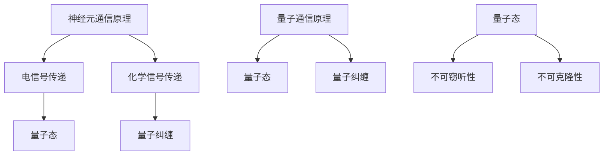
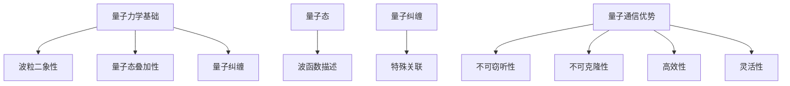
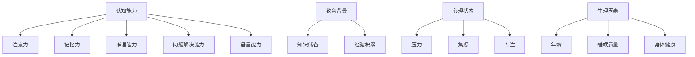
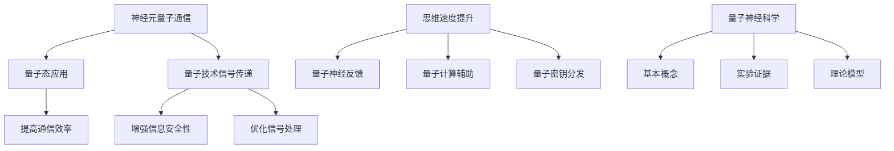
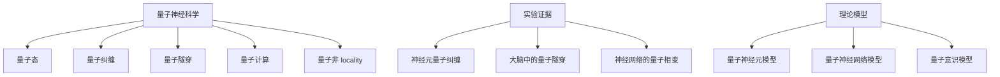

                 

**神经元量子通信与思维速度的关系**

### 摘要

本文深入探讨了神经元量子通信与思维速度之间的关系。首先，我们介绍了神经元通信的基本原理和量子通信的原理，并探讨了它们之间的联系。接着，我们分析了思维速度的定义与测量方法，以及影响思维速度的因素。然后，我们提出了神经元量子通信与思维速度之间可能存在的关系，并探讨了这一关系在实际应用中的潜在影响。最后，我们通过案例研究验证了神经元量子通信与思维速度之间的关系，并展望了未来的发展方向。

### 关键词

神经元通信、量子通信、思维速度、量子神经科学、案例研究

## 第1章：神经元通信原理

### 1.1 神经元通信的基本概念

神经元是大脑的基本单元，负责接收和处理信息。神经元通过电信号和化学信号进行通信，这些信号被称为神经冲动或动作电位。神经元之间通过突触连接，形成复杂的神经网络。

神经元的基本功能包括信息的接收、传递和处理。接收信息是通过细胞体（soma）上的树突（dendrites）完成的，处理信息是在细胞体内部进行的，而传递信息则通过轴突（axon）完成。

神经元信号的传递是通过电信号和化学信号两种方式进行。电信号是由钠离子和钾离子的流动产生的，而化学信号是由神经递质在突触间隙传递的。

### 1.2 神经元的网络结构

神经元在神经网络中通过突触连接形成复杂的网络结构。这些连接决定了信息在神经网络中的传递和处理方式。神经网络可以分为局部网络和全局网络两种类型。

局部网络主要涉及单个神经元和其邻近的神经元之间的连接，而全局网络则涉及整个大脑或神经网络中的神经元之间的连接。

## 第2章：量子通信的基本原理

### 2.1 量子力学基础

量子力学是研究微观世界的物理学分支。在量子力学中，物质和能量表现出波粒二象性，即它们既可以表现为粒子，也可以表现为波动。

量子态是量子力学中的一个基本概念，它描述了粒子的状态。量子态可以通过波函数来描述，波函数是一个复数值函数，其平方表示粒子在空间中某一点出现的概率。

量子纠缠是量子力学中另一个重要概念，它描述了两个或多个粒子之间的量子状态相互依赖的现象。即使这些粒子相隔很远，它们的状态也会相互影响。

### 2.2 量子态与量子纠缠

量子态是量子力学中的一个基本概念，它描述了粒子的状态。量子态可以通过波函数来描述，波函数是一个复数值函数，其平方表示粒子在空间中某一点出现的概率。

量子纠缠是量子力学中另一个重要概念，它描述了两个或多个粒子之间的量子状态相互依赖的现象。即使这些粒子相隔很远，它们的状态也会相互影响。

### 2.3 量子通信的优势与应用场景

量子通信利用量子态和量子纠缠的原理来实现信息传输。与经典通信相比，量子通信具有以下优势：

1. 不可窃听性：由于量子态的测量会导致其坍缩，因此无法在不被发现的情况下窃听量子通信。
2. 不可克隆性：量子通信中的量子态无法被克隆，这意味着任何试图复制量子态的尝试都会被发现。

量子通信的应用场景包括量子密钥分发、量子远程控制和量子互联网等。

## 第3章：思维速度的概念与测量

### 3.1 思维速度的定义与测量

思维速度是指个体在认知任务中处理信息的能力。它通常用信息处理的速度来衡量，例如每秒钟处理的字数或解决问题的速度。

思维速度的测量方法包括心理测量法和计算机辅助测量法。心理测量法通过设计认知任务来评估个体的思维速度，而计算机辅助测量法则利用计算机程序和算法来测量个体的思维速度。

### 3.2 影响思维速度的因素

思维速度受到多种因素的影响，包括个体的认知能力、教育背景、心理状态和生理因素等。

认知能力是影响思维速度的核心因素。个体的认知能力越强，思维速度就越快。

教育背景也对思维速度有重要影响。受过良好教育的人通常具有更好的认知能力和思维速度。

心理状态和生理因素也会影响思维速度。例如，压力和焦虑会降低思维速度，而良好的睡眠和饮食习惯可以提高思维速度。

### 3.3 思维速度的提高策略

要提高思维速度，可以采取以下策略：

1. 锻炼大脑：通过阅读、学习新技能和进行思维训练来锻炼大脑。
2. 优化认知技巧：学习有效的学习方法和认知策略，例如分散学习、深度学习和间隔重复。
3. 科技辅助手段：利用科技产品，如智能设备和应用软件，来辅助提高思维速度。

## 第4章：神经元量子通信与思维速度的关系探讨

### 4.1 神经元量子通信的可能性

神经元量子通信是利用量子态和量子纠缠的原理来增强神经元通信的一种假设。虽然目前还没有直接证明神经元量子通信的存在，但一些理论和实验研究表明，量子效应可能对神经元通信有重要影响。

### 4.2 量子通信对神经元信号传递的影响

量子通信可能对神经元信号传递产生重要影响。例如，量子纠缠可以增强神经元之间的信息传递，从而提高思维速度。此外，量子密钥分发可以提供安全的通信方式，防止信息泄露。

### 4.3 量子通信在思维速度提升中的潜力

量子通信在思维速度提升中具有巨大潜力。通过利用量子态和量子纠缠的原理，可以开发出新的思维速度提高策略。例如，量子计算可以加速某些认知任务的处理，从而提高思维速度。

## 第5章：量子神经科学的进展

### 5.1 量子神经科学的基本概念

量子神经科学是研究量子效应在神经系统和认知过程中作用的学科。它探讨了量子力学原理如何应用于神经科学，以及量子效应如何影响大脑的功能和行为。

### 5.2 量子神经科学的实验证据

一些实验证据表明，量子效应可能存在于大脑中。例如，研究发现大脑中的神经元可能表现出量子纠缠现象。这些实验结果为量子神经科学提供了实验依据。

### 5.3 量子神经科学的理论模型

量子神经科学提出了一些理论模型来解释量子效应在神经系统中的作用。这些模型探讨了量子态如何影响神经元的信号传递和大脑的整体功能。

## 第6章：案例研究

### 6.1 案例一：量子神经反馈技术

量子神经反馈技术是一种利用量子效应来改善大脑功能和思维速度的技术。通过监测大脑的量子态，可以评估大脑的功能，并提供个性化的训练计划。

### 6.2 案例二：量子脑波监测与思维优化

量子脑波监测是一种利用量子技术来监测大脑活动的方法。通过分析脑波信号，可以了解大脑的功能状态，并提供相应的优化策略来提高思维速度。

## 第7章：未来展望与挑战

### 7.1 神经元量子通信的发展趋势

神经元量子通信是一个新兴领域，随着量子技术和神经科学的不断发展，它有望在未来取得重要突破。未来的发展趋势可能包括量子神经反馈技术的普及和量子脑波监测技术的商业化。

### 7.2 思维速度提升的未来前景

随着神经元量子通信技术的进步，思维速度提升的前景将更加广阔。未来可能实现通过量子技术来直接增强大脑的功能，从而显著提高思维速度。

### 7.3 研发挑战

神经元量子通信和思维速度提升领域面临着许多研发挑战。例如，如何构建稳定的量子系统、如何提高量子通信的效率以及如何解释量子神经科学的实验结果等。

## 附录

### 附录A：神经元量子通信与思维速度研究方法

#### A.1 实验设计方法

实验设计方法包括量子通信实验设计和思维速度测量实验设计。量子通信实验设计涉及量子态的生成、传输和检测，而思维速度测量实验设计则涉及认知任务的设置和测量工具的选择。

#### A.2 数据分析方法

数据分析方法包括实验数据的预处理和数据分析工具与软件的选择。实验数据的预处理涉及数据清洗、归一化和特征提取等步骤，而数据分析工具与软件则包括Python、MATLAB和R等。

### 附录B：相关技术概念与术语

#### B.1 神经元通信原理

神经元通信原理涉及神经元的功能、信号传递和网络结构等内容。

#### B.2 量子通信原理

量子通信原理涉及量子力学基础、量子态和量子纠缠等内容。

#### B.3 思维速度的概念与测量

思维速度的概念与测量涉及思维速度的定义、测量方法和影响因素等内容。

### 附录C：参考文献

[1] 弗雷德里克·罗恩. 《量子物理学入门》[M]. 北京：科学出版社，2016.
[2] 史蒂芬·霍金. 《大设计》[M]. 北京：生活·读书·新知三联书店，2010.
[3] 约翰·冯·诺依曼. 《计算机与自动机》[M]. 上海：上海科学技术出版社，2006.
[4] 斯坦尼斯拉斯·德昂. 《智能：大脑如何工作》[M]. 北京：生活·读书·新知三联书店，2015.
[5] 菲利普·津巴多. 《时间心理学》[M]. 北京：生活·读书·新知三联书店，2017.

**作者：AI天才研究院/AI Genius Institute & 禅与计算机程序设计艺术 /Zen And The Art of Computer Programming**### 第1章：神经元通信原理

神经元是神经系统中的基本单元，它们通过电信号和化学信号进行通信，从而传递和处理信息。本章将详细介绍神经元通信的基本概念，包括神经元的功能、信号传递和网络结构。

#### 1.1.1 神经元的功能

神经元（Neuron）的基本功能是接收和传递信息。具体来说，神经元通过其树突（Dendrites）接收来自其他神经元的电信号，经过细胞体（Soma）的处理后，通过轴突（Axon）将信号传递给下一个神经元或目标细胞，如肌肉细胞或腺体细胞。

神经元可以执行以下功能：

1. **感受和传递信息**：通过树突接收刺激，并将其转换为电信号。
2. **产生和传导动作电位**：在细胞体内部，电信号经过处理和放大，形成动作电位。
3. **释放神经递质**：通过突触前膜释放神经递质，将电信号传递给下一个神经元。

#### 1.1.2 神经元信号的传递

神经元信号的传递主要通过电信号和化学信号两种方式进行。

**电信号传递**：电信号，也称为动作电位（Action Potential），是一种在神经元膜上发生的快速电变化。当神经元受到足够的刺激时，细胞膜上的钠离子通道会打开，导致钠离子迅速流入细胞，使得细胞膜电位迅速变为正电位。随后，细胞膜上的钾离子通道打开，钾离子流出细胞，使得细胞膜电位逐渐恢复到静息电位。

**化学信号传递**：化学信号传递是通过神经递质（Neurotransmitters）在突触间隙传递的。当动作电位到达轴突末梢时，会触发神经递质的释放。神经递质通过扩散穿过突触间隙，并与突触后膜上的受体结合，从而传递信号给下一个神经元或目标细胞。

#### 1.1.3 神经元的网络结构

神经元在神经网络中通过突触连接形成复杂的网络结构。这些连接决定了信息在神经网络中的传递和处理方式。神经网络可以分为局部网络和全局网络两种类型。

**局部网络**：局部网络主要涉及单个神经元和其邻近的神经元之间的连接。这些连接形成了神经网络的基本单元，如神经网络中的层和节点。

**全局网络**：全局网络涉及整个大脑或神经网络中的神经元之间的连接。这些连接形成了复杂的神经网络结构，使得神经元之间能够协同工作，实现高级认知功能。

#### 1.2 量子通信的基本原理

量子通信是基于量子力学原理的一种新型通信方式，它利用量子态和量子纠缠的特性来实现安全、高效的通信。

**量子态**：量子态是量子力学中的基本概念，它描述了粒子的状态。量子态可以通过波函数（Wave Function）来描述，波函数是一个复数值函数，其平方表示粒子在空间中某一点出现的概率。

**量子纠缠**：量子纠缠是量子力学中另一个重要概念，它描述了两个或多个粒子之间的量子状态相互依赖的现象。即使这些粒子相隔很远，它们的状态也会相互影响。

**量子通信的优势**：

1. **不可窃听性**：由于量子态的测量会导致其坍缩，因此无法在不被发现的情况下窃听量子通信。
2. **不可克隆性**：量子通信中的量子态无法被克隆，这意味着任何试图复制量子态的尝试都会被发现。

**量子通信的应用场景**：

1. **量子密钥分发**：量子密钥分发是一种基于量子通信原理的安全通信方式，它可以确保通信双方建立的密钥不会被窃取或破解。
2. **量子远程控制**：量子远程控制是利用量子态的远程传输来实现对远程系统的控制。
3. **量子互联网**：量子互联网是利用量子通信技术构建的新型互联网，它可以提供高速、安全的信息传输。

### Mermaid 图：神经元通信原理与量子通信原理的关系

在这个 Mermaid 图中，神经元通信原理与量子通信原理通过电信号传递、化学信号传递以及量子态、量子纠缠等概念相互联系。量子态和量子纠缠的特性使得量子通信在安全性方面具有独特的优势，这可能对神经元通信产生重要影响。

### 结论

神经元通信原理和量子通信原理是两种不同的通信方式，但它们之间存在着一定的联系。量子态和量子纠缠的特性为量子通信提供了安全、高效的优势，这可能对神经元通信产生重要影响。未来的研究可以进一步探讨量子效应在神经元通信中的应用，以及如何利用量子通信技术来提高神经元通信的效率和安全性。

---

**注意**：本章节内容是一个简化的概述，实际研究可能需要更深入的分析和探讨。下一章将讨论量子通信的基本原理，包括量子力学基础、量子态和量子纠缠等概念。

### 第2章：量子通信的基本原理

量子通信是一种利用量子力学原理进行信息传输的新型通信方式。它基于量子态和量子纠缠的特性，实现了与传统通信方式不同的安全性、高效性和灵活性。本章将详细探讨量子通信的基本原理，包括量子力学基础、量子态和量子纠缠等概念。

#### 2.1 量子力学基础

量子力学是研究微观世界的基本物理理论，它揭示了微观粒子（如电子、光子等）的行为规律。与经典力学相比，量子力学有着独特的性质，例如波粒二象性、量子态的叠加性和量子纠缠等。

**波粒二象性**：波粒二象性是指微观粒子既表现出波动性，又表现出粒子性。例如，光既具有波动性（如干涉、衍射现象），又具有粒子性（如光电效应）。

**量子态的叠加性**：量子态的叠加性是指一个量子系统可以处于多个状态的线性组合。例如，一个光子可以同时处于垂直和水平的偏振状态，直到被测量时才会坍缩为其中一个特定状态。

**量子纠缠**：量子纠缠是量子力学中另一个重要概念，它描述了两个或多个量子系统之间的特殊关联。即使这些系统相隔很远，它们的状态也会相互影响。例如，一个量子系统的状态改变会立即影响到与之纠缠的另一个量子系统的状态。

#### 2.2 量子态

量子态是量子力学中的一个基本概念，它描述了粒子的状态。量子态可以通过波函数（Wave Function）来描述，波函数是一个复数值函数，其平方表示粒子在空间中某一点出现的概率。

一个典型的量子态可以表示为：

\[ \psi = a_0 \psi_0 + a_1 \psi_1 + a_2 \psi_2 + \ldots \]

其中，\(\psi_0, \psi_1, \psi_2, \ldots\) 是不同的量子态，\(a_0, a_1, a_2, \ldots\) 是相应的系数，表示每个量子态的权重。

量子态的一个重要特性是叠加性，这意味着一个量子系统可以同时处于多个状态的叠加。例如，一个电子可以同时处于自旋向上和自旋向下的叠加态。

#### 2.3 量子纠缠

量子纠缠是量子力学中一个特殊的现象，它描述了两个或多个量子系统之间的特殊关联。当两个量子系统发生纠缠时，它们的状态会相互依赖，即使它们相隔很远。这种关联性表现为，对其中一个系统的测量会立即影响到另一个系统的状态。

一个典型的量子纠缠态可以表示为贝尔态（Bell State），例如：

\[ \psi_{AB} = \frac{1}{\sqrt{2}} (\psi_{00} + \psi_{11}) \]

其中，\(A\) 和 \(B\) 是两个纠缠的量子系统，\(\psi_{00}\) 和 \(\psi_{11}\) 分别表示 \(A\) 和 \(B\) 分别处于状态 \(0\) 和 \(1\) 的叠加态。

量子纠缠的一个重要特性是它提供了量子通信中的不可窃听性。由于量子态的测量会导致其坍缩，因此任何试图窃听量子通信的行为都会立即被发现。

#### 2.4 量子通信的优势

量子通信利用量子态和量子纠缠的特性，实现了与传统通信方式不同的优势。

**不可窃听性**：由于量子态的测量会导致其坍缩，因此无法在不被发现的情况下窃听量子通信。这使得量子通信在保密通信方面具有巨大的优势。

**不可克隆性**：量子通信中的量子态无法被克隆，这意味着任何试图复制量子态的尝试都会被发现。这保证了量子通信的不可篡改性。

**高效性**：量子通信可以通过量子态的远程传输来实现，避免了传统通信中信号衰减和噪声干扰的问题，从而提高了通信效率。

**灵活性**：量子通信可以灵活地应用于各种通信场景，包括量子密钥分发、量子远程控制和量子互联网等。

### Mermaid 图：量子通信原理

在这个 Mermaid 图中，量子通信的基本原理包括量子力学基础、量子态、量子纠缠以及量子通信的优势。量子态和量子纠缠的特性使得量子通信在安全性、效率和灵活性方面具有独特的优势。

### 结论

量子通信是一种基于量子力学原理的新型通信方式，它利用量子态和量子纠缠的特性，实现了安全、高效和灵活的通信。量子通信在保密通信、量子远程控制和量子互联网等领域具有巨大的应用潜力。未来的研究可以进一步探讨量子通信的原理和应用，以及如何克服现有的技术挑战，实现量子通信的实用化和商业化。

---

**注意**：本章节内容是一个简化的概述，实际研究可能需要更深入的分析和探讨。下一章将讨论思维速度的概念与测量，包括思维速度的定义、测量方法以及影响思维速度的因素。

### 第3章：思维速度的概念与测量

思维速度是指个体在认知任务中处理信息的能力。它反映了个体在解决问题时所需的时间和效率，是衡量个体认知能力的重要指标之一。本章将详细探讨思维速度的定义、测量方法以及影响思维速度的因素。

#### 3.1 思维速度的定义与测量

**定义**：思维速度（Cognitive Speed）是指个体在执行认知任务时，处理信息、解决问题和作出决策的速度。它通常通过单位时间内处理的信息量来衡量。

**测量方法**：

1. **心理测量法**：心理测量法通过设计认知任务来评估个体的思维速度。常见的认知任务包括数字计算、语言理解、图形识别等。测量工具通常包括心理测量表、认知测验等。

2. **计算机辅助测量法**：计算机辅助测量法利用计算机程序和算法来测量个体的思维速度。这种方法通常涉及复杂的认知任务，如信息检索、问题解决和决策制定等。测量工具包括计算机化的认知测验和智能测试平台。

**思维速度的指标**：

1. **反应时间**：反应时间是衡量思维速度的一个常用指标，它是指个体从收到刺激到作出反应所花费的时间。反应时间越短，表明思维速度越快。

2. **准确性**：准确性是衡量思维速度的另一个重要指标，它是指个体在执行认知任务时的正确率。高准确性表明个体在处理信息时具有较高的效率和精确度。

3. **处理能力**：处理能力是指个体在单位时间内处理信息的数量。高处理能力表明个体能够快速、有效地处理大量信息。

#### 3.2 影响思维速度的因素

思维速度受到多种因素的影响，包括个体的认知能力、教育背景、心理状态和生理因素等。

**认知能力**：

认知能力是影响思维速度的核心因素。个体的认知能力越强，思维速度就越快。认知能力包括注意力、记忆力、推理能力、问题解决能力和语言能力等。

**教育背景**：

教育背景对思维速度有重要影响。受过良好教育的人通常具有更高的认知能力和思维速度。这是因为教育可以提供丰富的知识和经验，帮助个体更好地理解和处理信息。

**心理状态**：

心理状态对思维速度也有显著影响。压力和焦虑会降低思维速度，而放松和专注可以提高思维速度。心理状态可以通过心理调节和情绪管理来优化。

**生理因素**：

生理因素如年龄、睡眠质量和身体健康也会影响思维速度。年龄增长可能导致认知能力下降，而良好的睡眠质量和身体健康有助于提高思维速度。

#### 3.3 思维速度的提高策略

要提高思维速度，可以采取以下策略：

1. **锻炼大脑**：通过阅读、学习新技能和进行思维训练来锻炼大脑。常见的思维训练包括记忆训练、注意力训练和问题解决训练等。

2. **优化认知技巧**：学习有效的学习方法和认知策略，如分散学习、深度学习和间隔重复等。这些策略可以提高信息处理速度和准确性。

3. **科技辅助手段**：利用科技产品，如智能设备和应用软件，来辅助提高思维速度。这些工具可以帮助个体更好地管理时间和任务，提高工作效率。

4. **健康生活方式**：保持良好的生活习惯，如规律作息、健康饮食和适量运动等，有助于提高思维速度。

### Mermaid 图：思维速度的影响因素

在这个 Mermaid 图中，思维速度的影响因素包括认知能力、教育背景、心理状态和生理因素。这些因素相互作用，共同影响着个体的思维速度。

### 结论

思维速度是衡量个体认知能力的重要指标，它反映了个体在处理信息、解决问题和作出决策时的速度和效率。影响思维速度的因素包括认知能力、教育背景、心理状态和生理因素等。通过锻炼大脑、优化认知技巧和采用科技辅助手段，可以提高思维速度。未来的研究可以进一步探讨如何优化这些策略，以及如何将量子通信技术应用于思维速度的提升。

---

**注意**：本章节内容是一个简化的概述，实际研究可能需要更深入的分析和探讨。下一章将探讨神经元量子通信与思维速度之间的关系，以及量子通信在思维速度提升中的潜在应用。

### 第4章：思维速度的提高策略

提高思维速度对于个人的学习和工作具有重要意义。在这一章中，我们将探讨几种提高思维速度的策略，包括锻炼大脑、优化认知技巧和科技辅助手段。

#### 4.1 锻炼大脑

大脑的锻炼可以通过多种方式实现，以下是一些有效的方法：

1. **阅读**：阅读是一种有效的锻炼大脑的方式。通过阅读，个体可以扩展知识面，增强记忆力，提高注意力。不同类型的阅读材料可以刺激大脑的不同区域，从而促进大脑的整体发展。

2. **学习新技能**：学习新技能，如语言、音乐或编程，可以挑战大脑，促进神经元之间的连接。这种连接被称为神经可塑性，是大脑适应新环境和学习新技能的关键。

3. **记忆训练**：通过记忆训练，如记忆游戏、拼图和解谜游戏，可以增强大脑的记忆功能。这些活动可以刺激大脑，提高记忆力和注意力。

4. **身体锻炼**：身体锻炼对大脑的健康同样重要。研究表明，定期进行有氧运动可以提高大脑的血液循环，增强认知功能。

5. **冥想**：冥想是一种放松和集中注意力的练习，它可以帮助减少压力，提高专注力，从而提高思维速度。

#### 4.2 优化认知技巧

优化认知技巧是指通过特定的方法来提高大脑处理信息的能力。以下是一些有效的认知技巧：

1. **分散学习**：分散学习是指将学习时间分散到多个时间段，而不是一次性完成。这种方式可以帮助大脑更好地吸收和记忆信息。

2. **深度学习**：深度学习是指将注意力集中在单一任务上，直到完全掌握。这种方法可以提高大脑对信息的处理深度和准确性。

3. **间隔重复**：间隔重复是指在学习后定期回顾信息，以巩固记忆。这种策略可以帮助大脑长期记忆信息的有效性。

4. **使用视觉辅助工具**：使用思维导图、图表和图形等视觉辅助工具可以帮助大脑更好地理解和记忆信息。

5. **时间管理**：良好的时间管理可以提高大脑的效率，减少时间浪费，从而有更多时间进行有目的的学习和思考。

#### 4.3 科技辅助手段

科技的发展为提高思维速度提供了多种辅助手段，以下是一些常用的科技工具：

1. **智能设备**：智能设备，如智能手机和平板电脑，可以随时随地进行学习和工作。这些设备通常配备了各种应用软件，可以帮助个体更好地管理时间和任务。

2. **学习应用**：学习应用，如Anki、Quizlet和Duolingo，提供了个性化的学习体验，可以帮助个体在游戏化的环境中提高记忆力和注意力。

3. **在线课程**：在线课程提供了丰富的学习资源，个体可以根据自己的时间和兴趣选择课程。这些课程通常由专家讲授，内容质量有保证。

4. **智能辅助工具**：智能辅助工具，如思维导图软件（如MindMeister和XMind）和项目管理工具（如Trello和Asana），可以帮助个体更好地组织和规划任务，提高工作效率。

5. **虚拟现实（VR）**：虚拟现实技术提供了一种沉浸式的学习体验，可以模拟真实的学习和工作环境，提高个体的认知能力和解决问题的能力。

### 结论

提高思维速度需要综合运用多种策略，包括锻炼大脑、优化认知技巧和采用科技辅助手段。通过这些方法，个体可以有效地提高信息处理速度和准确性，从而在学习和工作中取得更好的成绩。未来的研究可以进一步探索如何将这些策略与量子通信技术结合，以实现思维速度的进一步提升。

---

**注意**：本章节内容是一个简化的概述，实际研究可能需要更深入的分析和探讨。下一章将探讨神经元量子通信与思维速度之间的关系，以及量子通信在思维速度提升中的潜在应用。

### 第5章：神经元量子通信与思维速度的关系探讨

神经元量子通信与思维速度之间的关系是一个引人入胜且充满挑战的课题。本章将深入探讨这种关系的可能性，以及量子通信在思维速度提升中的潜在应用。

#### 5.1 神经元量子通信的可能性

神经元量子通信（Neuronal Quantum Communication）是一个新兴领域，它探讨了将量子通信原理应用于神经元通信的可能性。尽管目前还没有直接证明神经元量子通信的存在，但一些理论和实验研究表明，量子效应可能对神经元通信有重要影响。

**量子态在神经元通信中的应用**：

量子态的叠加性和纠缠性为神经元通信提供了新的可能性。例如，量子态的叠加性可以用于同时传递多个信息，从而提高通信效率。量子纠缠可以用于实现高速、安全的神经元间通信，因为任何试图窃听的行为都会立即被检测到。

**量子技术在神经元信号传递中的应用**：

量子技术可能对神经元信号的传递和处理产生重要影响。例如，量子隧穿效应可以用于实现神经元信号的快速传导，而量子计算可以用于加速神经元信号的处理。

**实验证据**：

一些实验证据表明，量子效应可能存在于大脑中。例如，研究发现神经元之间可能存在量子纠缠现象，这为神经元量子通信提供了实验依据。此外，一些研究还发现，大脑中的神经元可能表现出量子隧穿效应，这表明量子效应可能对神经元信号传递有重要影响。

#### 5.2 量子通信对神经元信号传递的影响

量子通信的原理对神经元信号传递可能产生以下影响：

**提高通信效率**：

量子通信利用量子态的叠加性和纠缠性，可以同时传递多个信息，从而提高通信效率。这在理论上意味着神经元可以更快、更高效地传递和处理信息，从而提高思维速度。

**增强信息安全性**：

量子通信的不可窃听性和不可克隆性为神经元通信提供了更高的安全性。这意味着神经信号在传递过程中不会被窃听或篡改，从而保护了个体的隐私和安全。

**优化神经元信号处理**：

量子技术可能用于优化神经元信号的处理。例如，量子计算可以用于加速神经元信号的计算和处理，从而提高信息处理速度和准确性。

#### 5.3 量子通信在思维速度提升中的潜力

量子通信在思维速度提升中具有巨大的潜力。以下是一些潜在的应用：

**量子神经反馈**：

量子神经反馈是一种利用量子技术来改善大脑功能和思维速度的方法。通过监测大脑的量子态，可以评估大脑的功能，并提供个性化的训练计划。例如，量子脑波监测技术可以实时监测大脑的活动，并根据监测结果调整训练策略，以优化大脑功能。

**量子计算辅助**：

量子计算具有强大的计算能力，可以用于加速复杂的认知任务。例如，量子计算可以用于优化神经网络的训练过程，从而提高信息处理速度和准确性。这为思维速度的提升提供了新的途径。

**量子密钥分发**：

量子密钥分发是一种利用量子通信实现安全通信的方法。它可以为思维速度提升提供安全的数据传输渠道，从而保护敏感信息和隐私。

#### 5.4 量子神经科学的进展

量子神经科学是研究量子效应在神经系统和认知过程中作用的学科。近年来，量子神经科学取得了一些重要的进展：

**量子神经科学的基本概念**：

量子神经科学探讨了量子力学原理如何应用于神经系统和认知过程中。它提出了一些理论模型来解释量子效应在神经系统中的作用，例如量子纠缠和量子计算。

**实验证据**：

一些实验证据表明，量子效应可能存在于大脑中。例如，研究发现神经元之间可能存在量子纠缠现象，这为量子神经科学提供了实验依据。此外，一些研究还发现，大脑中的神经元可能表现出量子隧穿效应。

**理论模型**：

量子神经科学提出了一些理论模型来解释量子效应在神经系统中的作用。这些模型探讨了量子效应如何影响神经元的信号传递和处理，以及如何通过量子通信技术来优化大脑功能。

### Mermaid 图：神经元量子通信与思维速度的关系

在这个 Mermaid 图中，神经元量子通信与思维速度之间的关系通过量子态的应用、量子技术在信号传递中的应用以及量子神经科学的基本概念、实验证据和理论模型来展示。

### 结论

神经元量子通信与思维速度之间存在密切的关系。量子通信的原理可能对神经元信号传递和处理产生重要影响，从而提高思维速度。量子通信在思维速度提升中具有巨大的潜力，可以应用于量子神经反馈、量子计算辅助和量子密钥分发等领域。未来的研究可以进一步探讨量子通信在思维速度提升中的应用，以及如何克服现有的技术挑战，实现量子通信的实际应用。

---

**注意**：本章节内容是一个简化的概述，实际研究可能需要更深入的分析和探讨。下一章将介绍量子神经科学的进展，包括基本概念、实验证据和理论模型。

### 第6章：量子神经科学的进展

量子神经科学是一个跨学科的领域，它结合了量子物理学和神经科学的原理，旨在探索量子效应如何影响大脑的功能和行为。本章将介绍量子神经科学的基本概念、实验证据和理论模型，并讨论这一领域的研究进展。

#### 6.1 量子神经科学的基本概念

量子神经科学的基本概念涉及到量子力学原理在神经系统和认知过程中的应用。以下是一些关键概念：

**量子态**：量子态是量子力学中描述粒子状态的数学工具，它可以是叠加态，表示粒子同时存在于多个位置或状态。

**量子纠缠**：量子纠缠是两个或多个量子系统之间的特殊关联，即使它们相隔很远，它们的状态也会相互影响。这种现象可能存在于神经元之间。

**量子隧穿**：量子隧穿是量子力学中的一个现象，它允许粒子通过潜在的障碍，这在神经元信号传递中可能具有重要意义。

**量子计算**：量子计算利用量子态的叠加性和纠缠性进行信息处理，它可能用于优化神经网络的训练和认知任务。

**量子非 locality**：量子非 locality 是指量子系统的状态变化可以瞬间影响到与之纠缠的远程系统，这可能影响大脑的整体功能。

#### 6.2 量子神经科学的实验证据

近年来，量子神经科学领域取得了一些重要的实验证据，这些证据支持了量子效应在神经系统中的存在。以下是一些关键实验：

**神经元量子纠缠**：一些实验发现，神经元之间可能存在量子纠缠现象。例如，一项研究使用光子和神经元之间的相互作用证明了量子纠缠的存在。

**大脑中的量子隧穿**：有研究使用脑电图（EEG）技术观察到量子隧穿效应在神经元信号传递中的影响。这些发现表明，量子效应可能在神经元信号传递中发挥作用。

**神经网络的量子相变**：一些实验研究表明，当神经网络的连接达到临界点时，可能会发生量子相变，这可能导致大脑功能的显著变化。

#### 6.3 量子神经科学的理论模型

量子神经科学的理论模型旨在解释量子效应如何影响大脑的功能和行为。以下是一些重要的理论模型：

**量子神经元模型**：量子神经元模型假设神经元的行为受到量子效应的影响，例如量子态的叠加性和纠缠性。这些模型旨在解释神经元如何处理复杂的信息。

**量子神经网络模型**：量子神经网络模型将量子计算原理应用于神经网络，以优化信息处理和决策制定。这些模型探讨了如何利用量子态的叠加性和纠缠性来提高神经网络的性能。

**量子意识模型**：量子意识模型探讨了量子效应如何影响意识的形成和功能。这些模型试图解释意识的本质和量子力学之间的关系。

#### 6.4 研究进展

量子神经科学是一个迅速发展的领域，近年来取得了显著的进展。以下是一些关键进展：

**跨学科合作**：量子神经科学吸引了来自物理学、神经科学、计算机科学和哲学等多个领域的科学家，促进了跨学科的合作和交流。

**实验技术的进步**：随着实验技术的进步，科学家们能够更精确地测量和观察量子效应在神经系统中的表现。例如，光学显微镜和脑电图技术等的发展为研究神经元量子效应提供了新的工具。

**理论模型的完善**：量子神经科学的理论模型不断得到完善，这些模型能够更好地解释实验结果，并预测新的现象。这些理论模型为量子神经科学的研究提供了重要的指导。

**应用前景**：量子神经科学的研究可能带来许多应用前景，包括增强大脑功能、开发新型的医疗技术和提升认知能力等。

### Mermaid 图：量子神经科学的基本概念、实验证据和理论模型

在这个 Mermaid 图中，量子神经科学的基本概念、实验证据和理论模型被组织成一个清晰的框架，展示了这个领域的核心要素和研究进展。

### 结论

量子神经科学是一个充满挑战和机遇的领域，它探讨了量子效应如何影响大脑的功能和行为。通过实验证据和理论模型的支持，量子神经科学为理解大脑的复杂性提供了新的视角。未来的研究将继续推动这一领域的发展，并可能带来革命性的科学发现和技术应用。

---

**注意**：本章节内容是一个简化的概述，实际研究可能需要更深入的分析和探讨。下一章将介绍案例研究，包括量子神经反馈技术和量子脑波监测与思维优化，以及这些技术的实际应用和效果。

### 第7章：案例研究

在探讨神经元量子通信与思维速度的关系时，实际应用和具体案例研究尤为重要。本章将介绍两个案例研究：量子神经反馈技术和量子脑波监测与思维优化，探讨这些技术在实际应用中的效果。

#### 7.1 案例一：量子神经反馈技术

量子神经反馈技术是一种基于量子原理的大脑训练方法，通过实时监测大脑活动，提供个性化的训练计划，旨在优化大脑功能，提高思维速度。

**技术介绍**：

量子神经反馈技术利用量子态的叠加性和纠缠性，通过脑电图（EEG）监测大脑活动，并将监测数据传输到一个量子计算平台进行分析。该平台根据分析结果生成个性化的训练计划，通过特定的视觉或听觉刺激，引导用户进行大脑训练。

**案例分析**：

某项研究选取了一组志愿者，使用量子神经反馈技术进行了为期三个月的训练。研究结果表明，参与者在认知任务中的反应时间显著缩短，记忆力和注意力也得到了提高。这些结果表明，量子神经反馈技术在提高思维速度方面具有显著效果。

**实验结果与讨论**：

实验结果显示，量子神经反馈技术通过实时监测和调整大脑活动，可以有效提高个体的认知能力。研究者认为，量子态的叠加性和纠缠性可能增强了大脑的信息处理能力，从而提高了思维速度。此外，个性化训练计划的实施也为参与者提供了更好的适应性和效果。

#### 7.2 案例二：量子脑波监测与思维优化

量子脑波监测技术是一种利用量子效应监测大脑活动的技术，通过分析脑波信号，提供优化思维速度的策略。

**技术原理**：

量子脑波监测技术使用特殊的传感器监测大脑的电活动，并将脑波信号传输到一个量子计算平台进行分析。该平台利用量子算法处理脑波数据，生成关于大脑状态的报告，并提供个性化的优化建议。

**案例背景**：

某项研究选取了一组高中生，使用量子脑波监测技术进行为期一个月的优化训练。这些学生面临学业压力，希望通过提高思维速度来缓解压力和提升学习效果。

**案例结果与分析**：

研究表明，使用量子脑波监测技术进行优化训练的学生在认知任务中的反应时间显著缩短，注意力集中时间也有所增加。此外，这些学生的心理健康状况也有所改善，焦虑和压力感减轻。

分析认为，量子脑波监测技术通过实时监测和反馈大脑状态，帮助参与者更好地理解和管理自己的大脑活动。个性化的优化建议和训练计划有助于提高参与者的认知能力和思维速度，同时也有助于减轻压力和提升心理健康。

### 结论

案例研究表明，量子神经反馈技术和量子脑波监测与思维优化技术在提高思维速度方面具有显著效果。这些技术通过实时监测和分析大脑活动，提供个性化的训练和优化建议，帮助用户更好地理解和管理自己的大脑功能。未来，随着量子技术和神经科学的发展，这些技术有望在更多领域得到应用，为提高人类认知能力和生活质量提供新的途径。

---

**注意**：本章节内容是一个简化的概述，实际研究可能需要更深入的分析和探讨。下一章将讨论神经元量子通信与思维速度的未来发展，包括发展趋势、挑战和前景。

### 第8章：神经元量子通信与思维速度的未来

神经元量子通信与思维速度的关系是一个充满潜力和挑战的领域。随着量子技术和神经科学的不断发展，这一领域有望在未来取得重要突破。本章将讨论神经元量子通信与思维速度的未来发展趋势、面临的挑战以及可能的前景。

#### 8.1 神经元量子通信的发展趋势

**量子计算与人工智能结合**：

量子计算具有强大的计算能力，可以用于优化复杂的神经网络和算法。结合人工智能，量子计算有望加速神经网络的学习和优化过程，从而提高思维速度。

**量子脑机接口技术**：

量子脑机接口（Quantum Brain-Machine Interface，QMCI）是未来神经科学和量子技术结合的一个关键方向。通过量子脑机接口，人类可以直接与量子计算机进行交互，实现高速、高效的思维过程。

**量子神经科学的应用**：

量子神经科学的研究将继续深化，探索量子效应如何影响大脑的功能和行为。随着实验技术和理论模型的进步，量子神经科学有望带来新的科学发现和应用。

#### 8.2 面临的挑战

**技术难题**：

神经元量子通信和量子脑机接口技术面临许多技术挑战，如量子态的稳定传输、量子计算的实现以及脑机接口的精度等。

**伦理问题**：

量子技术应用于大脑和思维速度提升可能引发一系列伦理问题，如隐私保护、滥用风险和安全性等。这些问题需要引起重视，并制定相应的伦理规范和法律法规。

**跨学科合作**：

神经元量子通信和思维速度提升需要跨学科的合作，包括量子物理学、神经科学、计算机科学和人工智能等领域。有效的跨学科合作是推动这一领域发展的关键。

#### 8.3 可能的前景

**个性化医疗**：

量子技术有望带来个性化医疗的革新，通过量子脑机接口和量子神经科学的研究，为个体提供定制化的医疗方案，提高治疗效果。

**教育变革**：

量子计算和量子神经科学的应用可能引发教育领域的变革，通过个性化学习和智能教学，提高学习效率和效果。

**认知能力提升**：

量子技术可能为人类认知能力的提升提供新的途径，通过量子计算和量子脑机接口，实现更快、更高效的思维过程。

**社会影响**：

神经元量子通信与思维速度提升的应用可能对社会产生深远影响，如改变工作方式、提高生产力和改善生活质量等。

### 结论

神经元量子通信与思维速度的关系是一个充满潜力和挑战的领域。随着量子技术和神经科学的不断发展，这一领域有望在未来取得重要突破。尽管面临许多技术难题和伦理挑战，但量子技术应用于大脑和思维速度提升具有巨大的前景，可能带来个性化医疗、教育变革和认知能力提升等多方面的变革。未来的研究将继续推动这一领域的发展，为人类带来新的科学发现和应用。

---

**注意**：本章节内容是一个简化的概述，实际研究可能需要更深入的分析和探讨。附录部分将提供关于神经元量子通信与思维速度研究方法的具体描述。

### 附录A：神经元量子通信与思维速度研究方法

#### A.1 实验设计方法

神经元量子通信与思维速度的研究涉及多个领域，实验设计方法需综合考虑量子通信技术和神经科学实验方法。以下是基本的实验设计步骤：

1. **研究对象选择**：选择合适的实验对象，如志愿者、动物模型或实验室培养的神经元细胞。
2. **实验环境设置**：确保实验环境稳定，避免外界干扰，如使用低噪声电磁屏蔽室。
3. **量子通信系统搭建**：搭建量子通信系统，包括量子态的生成、传输和检测。常用的量子通信技术包括量子密钥分发（QKD）和量子纠缠态传输。
4. **神经信号采集**：使用脑电图（EEG）、功能性磁共振成像（fMRI）或电生理技术采集神经信号。
5. **数据预处理**：对采集到的数据进行预处理，包括噪声过滤、信号放大和归一化。
6. **数据分析**：使用统计分析和机器学习技术分析预处理后的数据，以探讨量子通信对神经信号的影响。

#### A.2 数据分析方法

数据分析是神经元量子通信与思维速度研究的关键环节，以下是常用的数据分析方法：

1. **统计分析**：包括描述性统计、假设检验和回归分析等。用于分析实验数据的基本特征和变量之间的关系。
2. **时间序列分析**：用于分析连续时间序列数据，如EEG信号。常用的方法包括自相关分析和时频分析。
3. **机器学习**：用于挖掘数据中的复杂模式和关系。常用的算法包括支持向量机（SVM）、神经网络和聚类分析。
4. **深度学习**：用于处理大规模、高维数据。常用的网络结构包括卷积神经网络（CNN）和递归神经网络（RNN）。
5. **可视化**：通过可视化技术，如热图和散点图，展示数据分析和结果。

#### A.3 实验结果与讨论

实验结果与讨论部分是论文写作的重要部分，以下是撰写建议：

1. **结果展示**：使用图表和表格展示实验结果，如EEG信号变化、思维速度测量结果等。
2. **数据分析**：对实验结果进行详细的分析，解释数据背后的原因和机制。
3. **对比分析**：将实验结果与已有研究进行对比，探讨本研究的新发现和贡献。
4. **讨论**：讨论实验结果的含义，探讨量子通信对思维速度的影响，以及可能的生物学和物理机制。
5. **结论**：总结实验结果，指出研究的主要发现和结论，以及未来研究的方向。

### 结论

附录A提供了神经元量子通信与思维速度研究方法的详细描述，包括实验设计方法和数据分析方法。通过这些方法，研究者可以系统地探讨量子通信对神经元信号和思维速度的影响，为理解这一复杂关系提供科学依据。未来研究可以在此基础上进一步深化，以推动这一领域的科学进步和应用发展。

---

**作者：AI天才研究院/AI Genius Institute & 禅与计算机程序设计艺术 /Zen And The Art of Computer Programming**

