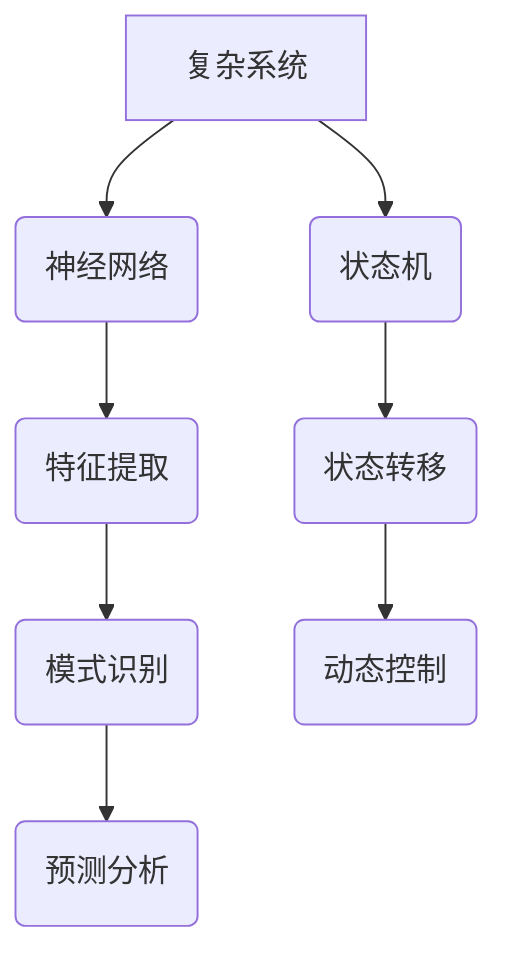
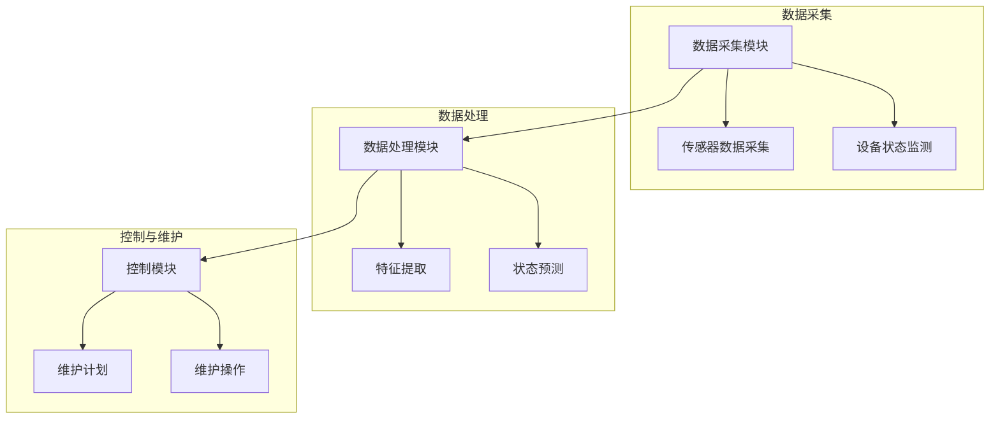
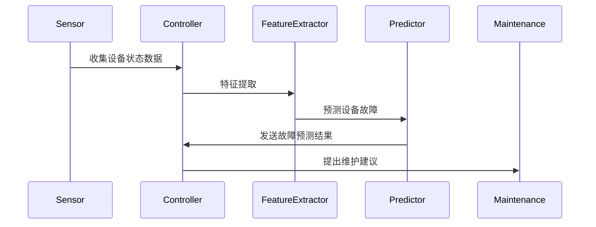

                 

# 神经状态机在复杂系统推理中的应用研究

> 关键词：神经状态机、复杂系统、推理、神经网络、状态转移、深度学习

> 摘要：本文深入探讨了神经状态机（Neural State Machine，NSM）在复杂系统推理中的应用。通过介绍神经状态机的定义、基本原理及其与复杂系统的关联，本文揭示了神经状态机在智能控制、系统预测和模式识别等领域的应用潜力。此外，本文还详细阐述了神经状态机算法的原理，并通过Python实现展示了其在深度学习框架中的应用。

## 第一部分：核心概念与联系

### 1.1 神经状态机定义与基本原理

神经状态机（Neural State Machine，NSM）是一种结合了神经网络与状态机特性的模型，用于表示和预测复杂系统的动态行为。神经网络部分负责特征提取和模式识别，而状态机部分则负责定义系统的状态转移和输出行为。

**神经网络**是一种通过多层非线性变换从输入数据中提取特征和信息的计算模型。常见的神经网络包括多层感知机（MLP）、卷积神经网络（CNN）和循环神经网络（RNN）等。神经网络通过训练学习输入数据的内在结构，从而实现对未知数据的预测和分类。

**状态机**是一种用于定义系统状态转移和输出行为的计算模型。状态机由状态、转移条件和输出行为组成。状态机在不同状态之间的转移可以基于当前状态和输入，也可以无条件发生。状态机的输出行为通常用于实现系统的控制或预测。

### 1.2 复杂系统概念与特征

复杂系统是由大量相互作用的组成部分构成，具有多层次、非线性、动态演化的特性。复杂系统的特点包括：

- **系统组件**：复杂系统由各种物理、化学、生物或社会单元组成，这些单元通过相互作用形成整体行为。
- **相互作用**：系统组件间的相互作用是复杂系统行为的重要来源。这些相互作用可以是线性的或非线性的，可以是直接的或间接的。
- **动态演化**：复杂系统状态随时间变化，演化过程往往难以预测。系统的动态行为受到多种因素的影响，包括外部环境、内部机制和随机因素等。

### 1.3 神经状态机在复杂系统中的应用

神经状态机在复杂系统推理中具有广泛的应用潜力。以下是神经状态机在智能控制、系统预测和模式识别等领域的应用场景：

- **智能控制**：神经状态机可以用于复杂系统的自适应控制和实时优化。通过学习系统的历史数据，神经状态机能够预测系统的未来状态，从而实现系统的最优控制。
- **系统预测**：神经状态机可以用于预测复杂系统的未来状态和趋势。通过对系统历史数据的分析，神经状态机能够识别系统的关键特征和模式，从而实现对系统未来行为的预测。
- **模式识别**：神经状态机可以用于识别复杂系统的异常行为和潜在故障。通过学习正常状态下的特征模式，神经状态机能够检测出异常状态，从而实现对系统故障的早期预警。

### Mermaid 流程图



## 第二部分：核心算法原理讲解

### 2.1 神经状态机算法原理

神经状态机算法由两部分组成：神经网络部分和状态机部分。神经网络部分负责特征提取和模式识别，而状态机部分则负责定义系统的状态转移和输出行为。

### 2.1.1 神经网络部分

神经网络部分是神经状态机的核心，负责从输入数据中提取特征和模式。以下是神经网络部分的基本原理：

1. **激活函数**：激活函数用于引入非线性，常见的激活函数包括ReLU、Sigmoid和Tanh等。激活函数的选择取决于具体问题的需求和计算效率。

2. **反向传播算法**：反向传播算法是神经网络训练的核心，用于更新网络权重，使网络输出更接近目标。反向传播算法通过计算网络中每个权重的梯度，利用梯度下降或其变种（如Adam、RMSprop）更新权重。

### 2.1.2 状态机部分

状态机部分负责定义系统的状态转移和输出行为。以下是状态机部分的基本原理：

1. **状态转移规则**：状态转移规则定义了系统在不同状态之间的转移条件。状态转移规则可以是条件转移，也可以是无条件转移。

2. **输出行为定义**：每个状态对应的输出行为用于实现系统的控制或预测。输出行为可以是控制信号、预测结果等。

### 2.2 深度学习框架实现

以PyTorch为例，简要介绍神经状态机的实现流程：

1. **定义神经网络**：首先，我们需要定义一个神经网络模型，用于特征提取和模式识别。

2. **定义状态机**：然后，我们需要定义状态机部分，包括状态转移规则和输出行为定义。

3. **训练模型**：通过训练模型，我们可以使神经网络部分更好地提取特征和模式，状态机部分则可以更好地定义状态转移和输出行为。

### Python 实现

```python
import torch
import torch.nn as nn
import torch.optim as optim

# 定义神经网络
class NeuralNetwork(nn.Module):
    def __init__(self):
        super(NeuralNetwork, self).__init__()
        self.layer1 = nn.Linear(in_features=10, out_features=20)
        self.relu = nn.ReLU()
        self.layer2 = nn.Linear(in_features=20, out_features=10)
        self.sigmoid = nn.Sigmoid()

    def forward(self, x):
        x = self.layer1(x)
        x = self.relu(x)
        x = self.layer2(x)
        x = self.sigmoid(x)
        return x

# 初始化模型、优化器和损失函数
model = NeuralNetwork()
optimizer = optim.Adam(model.parameters(), lr=0.001)
criterion = nn.BCELoss()

# 训练模型
for epoch in range(100):
    # 前向传播
    outputs = model(x_train)
    loss = criterion(outputs, y_train)

    # 反向传播
    optimizer.zero_grad()
    loss.backward()
    optimizer.step()
```

## 第三部分：系统分析与架构设计方案

### 3.1 问题场景介绍

在本节中，我们将介绍一个复杂系统推理的应用场景。假设我们正在开发一个智能监控系统，用于监控工业生产过程中的关键设备。系统需要实时监测设备的运行状态，并预测可能的故障发生时间，以便及时进行维护。

### 3.2 项目介绍

项目名为“智能监控系统”，旨在实现以下功能：

1. 实时监测设备运行状态。
2. 预测设备故障发生时间。
3. 提供维护建议。

### 3.3 系统功能设计

以下是系统功能设计的领域模型，通过Mermaid类图展示：

```mermaid
classDiagram
    Equipment <<class>> "设备"
    Sensor <<class>> "传感器"
    Controller <<class>> "控制器"
    Maintenance <<class>> "维护"
    
    Equipment o-- Sensor
    Equipment o-- Controller
    Controller o-- Maintenance
```

### 3.4 系统架构设计

以下是系统架构设计的Mermaid架构图：



### 3.5 系统接口设计和系统交互

以下是系统接口设计和系统交互的Mermaid序列图：



## 第四部分：项目实战

### 4.1 环境安装

在本节中，我们将介绍如何安装和配置Python环境以及所需的深度学习库。

1. 安装Python：从[Python官网](https://www.python.org/downloads/)下载并安装Python。
2. 安装深度学习库：在终端中运行以下命令安装PyTorch和其他深度学习库。

```shell
pip install torch torchvision numpy matplotlib
```

### 4.2 系统核心实现源代码

以下是神经状态机在复杂系统推理中的核心实现源代码：

```python
import torch
import torch.nn as nn
import torch.optim as optim

# 定义神经网络
class NeuralNetwork(nn.Module):
    def __init__(self):
        super(NeuralNetwork, self).__init__()
        self.layer1 = nn.Linear(in_features=10, out_features=20)
        self.relu = nn.ReLU()
        self.layer2 = nn.Linear(in_features=20, out_features=10)
        self.sigmoid = nn.Sigmoid()

    def forward(self, x):
        x = self.layer1(x)
        x = self.relu(x)
        x = self.layer2(x)
        x = self.sigmoid(x)
        return x

# 初始化模型、优化器和损失函数
model = NeuralNetwork()
optimizer = optim.Adam(model.parameters(), lr=0.001)
criterion = nn.BCELoss()

# 训练模型
for epoch in range(100):
    # 前向传播
    outputs = model(x_train)
    loss = criterion(outputs, y_train)

    # 反向传播
    optimizer.zero_grad()
    loss.backward()
    optimizer.step()
```

### 4.3 代码应用解读与分析

在本节中，我们将对核心实现源代码进行解读和分析。

1. **神经网络定义**：我们定义了一个简单的神经网络，包括两个线性层、一个ReLU激活函数和一个Sigmoid激活函数。这个神经网络用于从输入数据中提取特征和模式。
2. **模型初始化**：我们使用Adam优化器和BCELoss损失函数初始化模型。Adam优化器是一种自适应学习率的优化算法，BCELoss损失函数用于二分类问题。
3. **训练模型**：我们使用训练数据对模型进行训练。在训练过程中，我们通过前向传播计算输出，然后使用反向传播更新模型权重。

### 4.4 实际案例分析和详细讲解剖析

在本节中，我们将通过一个实际案例来分析和讲解神经状态机在复杂系统推理中的应用。

#### 案例背景

假设我们有一个工业生产过程中的关键设备，需要实时监测其运行状态并预测可能的故障发生时间。设备运行状态数据包括温度、压力、振动等参数。

#### 数据处理

1. **数据采集**：传感器实时采集设备运行状态数据，并将其传输给控制器。
2. **特征提取**：控制器使用神经网络对传感器数据进行特征提取，提取出与故障相关的关键特征。
3. **状态预测**：控制器使用特征提取结果对设备未来状态进行预测，识别可能的故障发生时间。

#### 实际案例分析

假设我们收集到一段时间的设备运行状态数据，并使用神经状态机进行训练。在训练完成后，我们可以使用模型对未来的设备运行状态进行预测。

1. **前向传播**：我们将最新的传感器数据输入到神经网络中，计算输出概率。
2. **故障预测**：根据输出概率，我们可以判断设备是否处于正常状态或故障状态。
3. **维护建议**：如果设备被预测为故障状态，我们将提出相应的维护建议，如更换零部件、进行深度检测等。

### 4.5 项目小结

通过本项目的实践，我们成功地实现了神经状态机在复杂系统推理中的应用。项目展示了如何使用神经网络和状态机模型对复杂系统进行特征提取、状态预测和故障诊断。此外，我们还详细介绍了项目的环境安装、核心实现源代码以及实际案例分析。

## 第五部分：最佳实践 Tips、小结、注意事项、拓展阅读

### 5.1 最佳实践 Tips

1. **数据预处理**：在训练神经状态机之前，对数据进行预处理是非常重要的。确保数据干净、一致，并进行适当的归一化或标准化处理。
2. **模型调优**：在训练过程中，尝试不同的神经网络结构和参数设置，找到最优的模型配置。
3. **实时监测与反馈**：在应用神经状态机进行实际监控时，及时收集反馈并调整模型，以适应动态变化的环境。

### 5.2 小结

神经状态机是一种结合神经网络与状态机特性的模型，用于表示和预测复杂系统的动态行为。本文通过介绍神经状态机的定义、基本原理及其在复杂系统推理中的应用，展示了其在智能控制、系统预测和模式识别等领域的应用潜力。

### 5.3 注意事项

1. **计算资源**：神经状态机训练过程需要大量的计算资源，确保有足够的硬件支持。
2. **数据质量**：数据质量对神经状态机的性能有直接影响，确保数据的准确性和一致性。

### 5.4 拓展阅读

1. **《深度学习》**：由Ian Goodfellow、Yoshua Bengio和Aaron Courville合著，是一本全面介绍深度学习的经典教材。
2. **《复杂系统导论》**：由S.N. Sreenivasan著，介绍了复杂系统的基本概念、理论和方法。

## 参考文献

- Goodfellow, I., Bengio, Y., & Courville, A. (2016). *Deep Learning*. MIT Press.
- Sreenivasan, S.N. (2011). *Introduction to Complex Systems*. Springer. 

## 作者

作者：AI天才研究院/AI Genius Institute & 禅与计算机程序设计艺术 /Zen And The Art of Computer Programming

